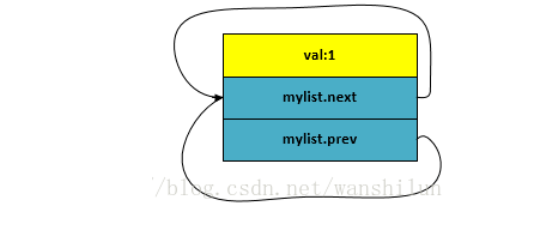
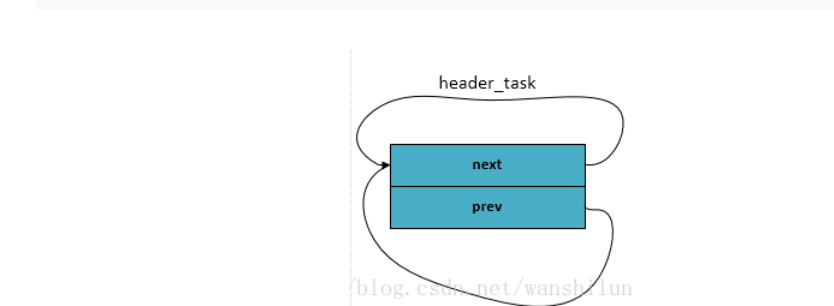
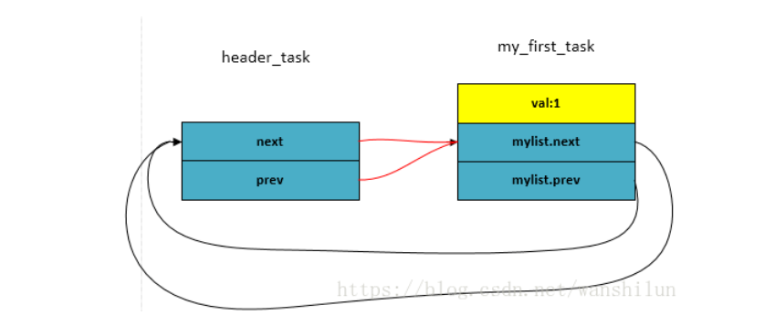
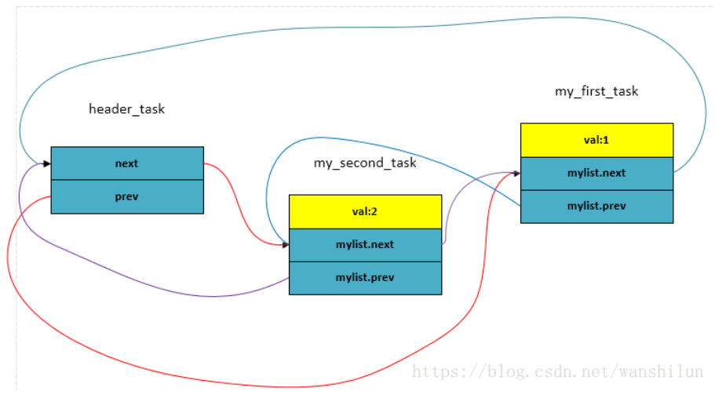
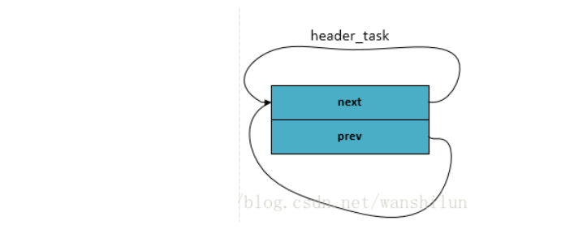
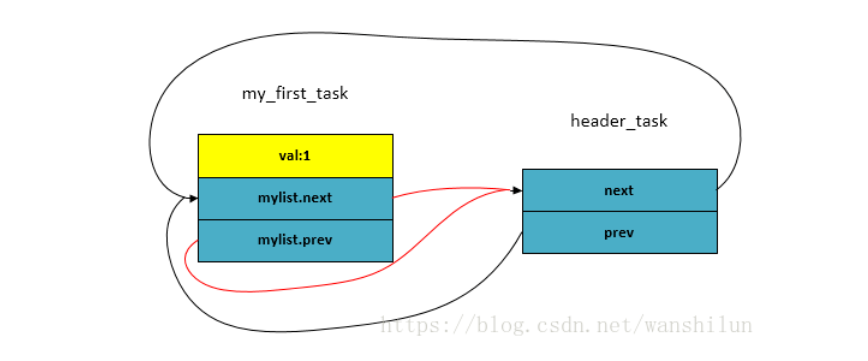
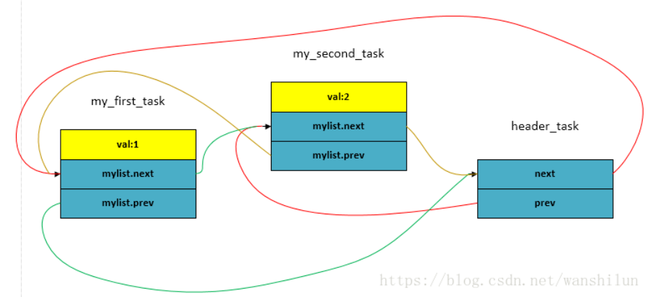

 
<!--BEGIN_DATA
{
    "create_date": "2022-03-16 23:10", 
    "modify_date": "2022-03-16 23:10", 
    "is_top": "0", 
    "summary": "工作当中非常实用的Linux内核链表", 
    "tags": "Linux", 
    "file_name": "工作当中非常实用的Linux内核链表.md"
}
END_DATA-->

#### <p>原文出处：<a href='https://mp.weixin.qq.com/s?__biz=MzI3NzYwNTg2Nw==&mid=2247489279&idx=1&sn=9f48a3f35aab22482463cb206779a694&chksm=eb62ea7bdc15636d216b500a5f66d030ae17179c9c72a7234c92f03e639e16abd79dcefc390e&scene=132#wechat_redirect' target='blank'>工作当中非常实用的Linux内核链表</a></p>

## 前言：

在上期文章中，已经给大家分享过`offsetof()`和`container_of`两个宏函数，这两个宏函数在Linux内核链表里面有大量的应用，对于我们平时工作写代码有很大的帮助。下面是Linux内核链表的内容分享。

做内核驱动开发经常会使用linux内核最经典的双向链表 `list_head，` 以及它的拓展接口(或者宏定义)：

```c
list_add , list_add_tail, list_del , list_entry ,list_for_each ,
list_for_each_entry ......
```

每次看到这些接口，感觉都很像，今天专门研究了一下内核，对它们做一些总结，希望为后续开发提供方便。

首先找到`list_head` 结构体定义，`kernel/inclue/linux/types.h` 如下：

```c
struct list_head {  
 struct list_head *next, *prev;  
};  
```

然后就开始围绕这个结构开始构建链表，然后插入、删除节点 ，遍历整个链表等等，其实内核已经提供好了现成的接口，接下来就让我们进入kernel/include/linux/list.h中：

## 一. 创建链表：

内核提供了下面的这些接口来初始化链表：

```c
#define LIST_HEAD_INIT(name) { &(name), &(name) }  
   
#define LIST_HEAD(name) \  
 struct list_head name = LIST_HEAD_INIT(name)  
   
static inline void INIT_LIST_HEAD(struct list_head *list)  
{  
 WRITE_ONCE(list->next, list);  
 list->prev = list;  
}  
```

如： 可以通过 `LIST_HEAD(mylist)` 进行初始化一个链表，mylist的prev 和 next 指针都是指向自己。

```c
struct list_head mylist = {&mylist,  &mylist} ;     
```

但是如果只是利用mylist这样的结构体实现链表就没有什么实际意义了，因为正常的链表都是为了遍历结构体中的其它有意义的字段而创建的，而我们mylist中只有prev和next指针，却没有实际有意义的字段数据，所以毫无意义。

综上，我们可以创建一个宿主结构，然后在此结构中再嵌套mylist字段，宿主结构又有其它的字段（进程描述符`task_struct`，页面管理的page结构，等就是采用这种方法创建链表的）。为简便理解，定义如下：

```c
struct  my_task_list {  
    int val ;  
    struct list_head mylist;  
}  
```

创建第一个节点：

```c
struct my_task_list first_task =   
{ .val = 1,  
  .mylist = LIST_HEAD_INIT(first_task.mylist)  
};  
```

这样mylist 就prev 和 next指针分别指向mylist自己了，如下图：



## 二. 添加节点：

内核已经提供了添加节点的接口了。

### 1. list_add ：

如下所示。根据注释可知，是在链表头head后方插入一个新节点new。

并且还说了一句：这个接口利用实现堆栈 （why？稍后再做分析）

```c
/**  
 * list_add - add a new entry  
 * @new: new entry to be added  
 * @head: list head to add it after  
 *  
 * Insert a new entry after the specified head.  
 * This is good for implementing stacks.  
 */  
static inline void list_add(struct list_head *new, struct list_head *head)  
{  
 __list_add(new, head, head->next);  
}  
```

`list_add`再调用`__list_add`接口：

```c
/*  
 * Insert a new entry between two known consecutive entries.  
 *  
 * This is only for internal list manipulation where we know  
 * the prev/next entries already!  
 */  
static inline void __list_add(struct list_head *new,  
         struct list_head *prev,  
         struct list_head *next)  
{  
 if (!__list_add_valid(new, prev, next))  
  return;  
   
 next->prev = new;  
 new->next = next;  
 new->prev = prev;  
 WRITE_ONCE(prev->next, new);  
}  
```

其实就是在head 链表头后和链表头后第一个节点之间插入一个新节点。然后这个新的节点就变成了链表头后的第一个节点了。

依然用上面的`my_task_list`结构体举例子

首先我们创建一个链表头 `header_task` ：

```c
LIST_HEAD(header_task);  
```



然后再创建实际的第一个节点：

```c
struct my_task_list my_first_task =   
{ .val = 1,  
  .mylist = LIST_HEAD_INIT(my_first_task.mylist)  
};  
```

接着把这个节点插入到`header_task`之后：

```c
list_add(&my_first_task.mylist,  &header_task);  
```



然后在创建第二个节点，同样把它插入到header_task之后

```c
struct my_task_list my_second_task =   
{ .val = 2,  
  .mylist = LIST_HEAD_INIT(my_second_task.mylist)  
};  
```

其实还可以用另外一个接口 `INIT_LIST_HEAD` 进行初始化（参数为指针变量）, 如下：

```c
struct my_task_list my_second_task;  
my_second_task.val = 2;  
INIT_LIST_HEAD(&my_second_task.mylist);  
list_add(&my_second_task.mylist, &header_task)  
```



以此类推，每次插入一个新节点，都是紧靠着header节点，而之前插入的节点依次排序靠后，那最后一个节点则是第一次插入header后的那个节点。最终可得出：先来的节点靠后，而后来的节点靠前，“先进后出，后进先出”。所以此种结构类似于 stack“堆栈”， 而`header_task`就类似于内核stack中的栈顶指针esp， 它都是紧靠着最后push到栈的元素。

### 2. `list_add_tail` 接口 ：

上面所讲的`list_add`接口是从链表头header后添加的节点。同样，内核也提供了从链表尾处向前添加节点的接口`list_add_tail`. 让我们来看一下它的具体实现。

```c
/**  
 * list_add_tail - add a new entry  
 * @new: new entry to be added  
 * @head: list head to add it before  
 *  
 * Insert a new entry before the specified head.  
 * This is useful for implementing queues.  
 */  
static inline void list_add_tail(struct list_head *new, struct list_head *head)  
{  
 __list_add(new, head->prev, head);  
}  
```

从注释可得出：

  * （1）在一个特定的链表头前面插入一个节点
  * （2）这个方法很适用于队列的实现 （why？）

进一步把`__list_add()`展开如下：

```c
/*  
 * Insert a new entry between two known consecutive entries.  
 *  
 * This is only for internal list manipulation where we know  
 * the prev/next entries already!  
 */  
static inline void __list_add(struct list_head *new,  
         struct list_head *prev,  
         struct list_head *next)  
{  
 if (!__list_add_valid(new, prev, next))  
  return;  
   
 next->prev = new;  
 new->next = next;  
 new->prev = prev;  
 WRITE_ONCE(prev->next, new);  
}  
```

所以，很清楚明了，`list_add_tail`就相当于在链表头前方依次插入新的节点（也可理解为在链表尾部开始插入节点，此时，header节点既是为节点，保持不变）

利用上面分析`list_add`接口的方法可画出数据结构图形如下：

  * （1）创建一个 链表头（实际上应该是表尾）， 同样可调用 `LIST_HEAD(header_task)`;



  * （2）插入第一个节点 `my_first_task.mylist` , 调用 `list_add_tail(& my_first_task.mylist, & header_task)`：



  * (3) 插入第二个节点`my_second_task.mylist`，调用`list_add_tail(& my_second_task.mylist, &header_task)`;



依此类推，每次插入的新节点都是紧挨着 `header_task` 表尾，而插入的第一个节点`my_first_task`排在了第一位，`my_second_task`排在了第二位，可得出：先插入的节点排在前面，后插入的节点排在后面，“先进先出，后进后出”，这不正是队列的特点吗（First in First out）！

## 三. 删除节点：

内核同样在list.h文件中提供了删除节点的接口 `list_del()`， 让我们看一下它的实现流程：

```c
static inline void list_del(struct list_head *entry)  
{  
 __list_del_entry(entry);  
 entry->next = LIST_POISON1;  
 entry->prev = LIST_POISON2;  
}  

/*  
 * Delete a list entry by making the prev/next entries  
 * point to each other.  
 *  
 * This is only for internal list manipulation where we know  
 * the prev/next entries already!  
 */  
static inline void __list_del(struct list_head * prev, struct list_head * next)  
{  
 next->prev = prev;  
 WRITE_ONCE(prev->next, next);  
}  
   
/**  
 * list_del - deletes entry from list.  
 * @entry: the element to delete from the list.  
 * Note: list_empty() on entry does not return true after this, the entry is  
 * in an undefined state.  
 */  
static inline void __list_del_entry(struct list_head *entry)  
{  
 if (!__list_del_entry_valid(entry))  
  return;  
   
 __list_del(entry->prev, entry->next);  
}  
```

利用`list_del(struct list_head *entry)`接口就可以删除链表中的任意节点了，但需注意，前提条件是这个节点是已知的，既在链表中真实存在，切prev，next指针都不为NULL。

## 四. 链表遍历：

内核是同过下面这个宏定义来完成对`list_head`链表进行遍历的，如下 :

```c
/**  
 * list_for_each - iterate over a list  
 * @pos: the &struct list_head to use as a loop cursor.  
 * @head: the head for your list.  
 */  
#define list_for_each(pos, head) \  
 for (pos = (head)->next; pos != (head); pos = pos->next)  
```

上面这种方式是从前向后遍历的，同样也可以使用下面的宏反向遍历：

```c
/**  
 * list_for_each_prev - iterate over a list backwards  
 * @pos: the &struct list_head to use as a loop cursor.  
 * @head: the head for your list.  
 */  
#define list_for_each_prev(pos, head) \  
 for (pos = (head)->prev; pos != (head); pos = pos->prev)  
```

而且，list.h 中也提供了`list_replace( 节点替换) list_move(节点移位)` ，翻转，查找等接口，这里就不在一一分析了。

## 五. 宿主结构：

下面就会结合上面说的两个宏函数了。

### 1.找出宿主结构 `list_entry(ptr, type, member)`：

上面的所有操作都是基于`list_head`这个链表进行的，涉及的结构体也都是:

```c
struct list_head {  
 struct list_head *next, *prev;  
};  
```

其实，正如文章一开始所说，我们真正更关心的是包含`list_head`这个结构体字段的宿主结构体，因为只有定位到了宿主结构体的起始地址，我们才能对对宿主结构体中的其它有意义的字段进行操作。

```c
struct  my_task_list {  
    int val ;  
    struct list_head mylist;  
}  
```

那我们如何根据mylist这个字段的地址而找到宿主结构`my_task_list`的位置呢？？？做linux驱动开发的同学是不是想到了LDD3这本书中经常使用的一个非常经典的宏定义呢！那就是：

```c
container_of(ptr, type, member)  
```

没错就是它，在LDD3这本书中的第三章字符设备驱动，以及第十四章驱动设备模型中多次提到，所以我觉得这个宏应该是内核最经典的宏之一。那list.h中使用什么接口实现的这个转换功能呢？

```c
/**  
 * list_entry - get the struct for this entry  
 * @ptr: the &struct list_head pointer.  
 * @type: the type of the struct this is embedded in.  
 * @member: the name of the list_head within the struct.  
 */  
#define list_entry(ptr, type, member) \  
 container_of(ptr, type, member)  
```

list.h中提供了`list_entry`宏来实现对应地址的转换，但最终还是调用了`container_of`宏，所以`container_of`宏的伟大之处不言而喻。那接下来让我们揭开她的面纱：此宏在内核代码kernel/include/linux/kernel.h中定义（此处kernel版本为3.10；新版本4.13之后此宏定义改变，但实现思想保持一致）

```c
/**   
 * container_of - cast a member of a structure out to the containing structure   
 * @ptr:    the pointer to the member.   
 * @type:   the type of the container struct this is embedded in.   
 * @member: the name of the member within the struct.   
 *   
 */    
#define container_of(ptr, type, member) ({          \    
    const typeof( ((type *)0)->member ) *__mptr = (ptr); \    
    (type *)( (char *)__mptr - offsetof(type,member) );})    
```

而offsetof定义在 kernel/include/linux/stddef.h ，如下：

```c
#define offsetof(TYPE, MEMBER) ((size_t) &((TYPE *)0)->MEMBER)  
```

看下`container_of`宏的注释：

（1）根据结构体重的一个成员变量地址导出包含这个成员变量mem的struct地址。

（2）参数解释：

  * ptr ：成员变量mem的地址

  * type：包含成员变量mem的宿主结构体的类型

  * member：在宿主结构中的mem成员变量的名称

如果用我们之前定义的结构体`struct my_task_list`举例

```c
struct  my_task_list {  
    int val ;  
    struct list_head mylist;  
}  

struct my_task_list first_task =   
{ .val = 1,  
  .mylist = LIST_HEAD_INIT(first_task.mylist)  
};  
  ptr   ：  &first_task.mylist  
  type  ：  struct my_task_list  
  member :  mylist  
```

而`container_of`宏的功能就是根据 `first_task.mylist`字段的地址得出`first_task`结构的其实地址。

把上面offsetof的宏定义代入`container_of`宏中，可得到下面定义：

```c
#define container_of(ptr, type, member) ({          \    
    const typeof( ((type *)0)->member ) *__mptr = (ptr); \    
    (type *)( (char *)__mptr - ((size_t) &((type *)0)->member) );})    
```

再把宏中对应的参数替换成实参：

```c
const typeof( ((struct my_task_list *)0)->mylist ) *__mptr = (&first_task.mylist); \    
    (struct my_task_list *)( (char *)__mptr - ((size_t) &((struct my_task_list *)0)->mylist) );})    
```

typeof 是 GNU对C新增的一个扩展关键字，用于获取一个对象的类型 ，比如这里`((struct my_task_list *)0)->mylist`是把0地址强制转换成struct my_task_list 指针类型，然后取出mylist元素。然后再对mylist元素做typeof操作，其实就是获取`my_task_list`结构中mylist字段的数据类型`struct list_head`，所以这行语句最后转化为：

```c
const struct list_head *__mptr  = (&first_task.mylist);  
```

第二条语句中在用 `__mptr`这个指针 减去 mylist字段在 `my_task_list`中的偏移（把0地址强制转换成`struct my_task_list`指针类型，然后取出mylist的地址，此时mylist的地址也是相对于0地址的偏移，所以就是mylist字段相对于宿主结构类型`struct my_task_list`的偏移） 正好就是宿主结构的起始地址。C语言的灵活性得到了很好的展示！！！

### 2. 宿主结构的遍历：

我们可以根据结构体中成员变量的地址找到宿主结构的地址， 并且我们可以对成员变量所建立的链表进行遍历，那我们是不是也可以通过某种方法对宿主结构进行遍历呢？

答案肯定是可以的，内核在list.h中提供了下面的宏：

```c
/**  
 * list_for_each_entry - iterate over list of given type  
 * @pos: the type * to use as a loop cursor.  
 * @head: the head for your list.  
 * @member: the name of the list_head within the struct.  
 */  
#define list_for_each_entry(pos, head, member)    \  
 for (pos = list_first_entry(head, typeof(*pos), member); \  
      &pos->member != (head);     \  
      pos = list_next_entry(pos, member))  
```

其中，`list_first_entry` 和 `list_next_entry`宏都定义在list.h中，分别代表：获取第一个真正的宿主结构的地址；获取下一个宿主结构的地址。它们的实现都是利用`list_entry`宏。

```c
/**  
 * list_first_entry - get the first element from a list  
 * @ptr: the list head to take the element from.  
 * @type: the type of the struct this is embedded in.  
 * @member: the name of the list_head within the struct.  
 *  
 * Note, that list is expected to be not empty.  
 */  
#define list_first_entry(ptr, type, member) \  
 list_entry((ptr)->next, type, member)  
   
/**  
 * list_next_entry - get the next element in list  
 * @pos: the type * to cursor  
 * @member: the name of the list_head within the struct.  
 */  
#define list_next_entry(pos, member) \  
 list_entry((pos)->member.next, typeof(*(pos)), member)  
```

最终实现了宿主结构的遍历：

```c
#define list_for_each_entry(pos, head, member)    \  
for (pos = list_first_entry(head, typeof(*pos), member); \  
  &pos->member != (head);     \  
  pos = list_next_entry(pos, member))  
```

首先pos定位到第一个宿主结构地址，然后循环获取下一个宿主结构地址，如果查到宿主结构中的member成员变量（宿主结构中`struct list_head`定义的字段）地址为head，则退出，从而实现了宿主结构的遍历。如果要循环对宿主结构中的其它成员变量进行操作，这个遍历操作就显得特别有意义了。

我们用上面的 `my_task_list`结构举个例子：

```c
struct my_task_list *pos_ptr = NULL ;   
list_for_each_entry (pos_ptr, & header_task, mylist )   
{   
     printk ("val =  %d\n" , pos_ptr->val);   
}  
```

## 参考文档：

* https://kernelnewbies.org/FAQ/LinkedLists
* 《Understanding linux kernel》
* 《Linux device drivers》
* https://blog.csdn.net/wanshilun/article/details/79747710

