<!--BEGIN_DATA
{
    "create_date": "2022-11-22 18:10", 
    "modify_date": "2022-11-22 18:10", 
    "is_top": "0", 
    "summary": "布隆过滤器", 
    "tags": "算法", 
    "file_name": "布隆过滤器.md"
}
END_DATA-->

#### <p>原文出处：<a href='https://km.woa.com/group/EngineeringProductivityImprove/articles/show/532978' target='blank'>经典论文解读——布隆过滤器</a></p>

本文解读布隆过滤器的经典论文。布隆过滤器是一种具有空间优势的概率数据结构，用于回答一个元素是否存在于一个集合中这样的问题，但是可能会出现误判——即一个元素不在集合但被认为在集合中。

相信大家对布隆过滤器（Bloom Filter，BF）都不陌生，就算没用过也听过。布隆过滤器是一种具有空间优势的概率数据结构，用于回答一个元素是否存在于一个集合中这样的问题，但是可能会出现误判——即一个元素不在集合但被认为在集合中。

布隆过滤器可用于避免缓存穿透、海量数据快速查询过滤之类的场景。但是，大家真的了BF吗？BF有哪些参数？BF支持删除吗？BF的哈希函数怎么选？还有其他类型的BF吗？等等......

本文将从论文着手，从BF的起源开始，介绍初始的BF，介绍BF的概率计算过程。接着介绍几个BF的变种：包括可以支持删除的(Count Bloom Filter, CBF)；在CBF的基础上能进一步节省空间的(dlCBF)；支持多个集合的(Spatial Bloom Filter, SBF)和支持动态扩容的(Scalable Bloom Filter)。最后介绍一些关于BF的疑问，并且结合部分Golang组件源码分析，将BF的理论带入设计实践。

## 总览

开局一张图，初步展示了各BF之间的发展关系，接下来我们一个一个具体来介绍。  

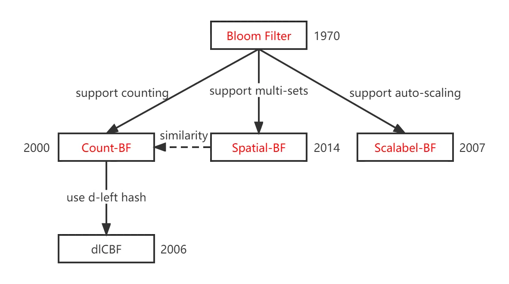

本文从论文着手，从布隆过滤器的起源开始，粗略梳理了几个有代表性的布隆过滤器的原理和应用。其中CBF支持计数，可以用于网络缓存优化；dlCBF是CBF的改进版，有更小的存储空间；Spatial-BF支持多个集合，配合同态加密使用可以用户隐私保护；Scalable-BF支持自动扩容，被Redis作为其布隆过滤器的内部实现。布隆过滤器中的哈希函数选择也是有学问题的，应该选在那些分布均匀计算速度快的，比如Murmur3。哈希函数可以通过不同的策略，由2个生成无限多个。以下是对各种BF技术特征的一个总结：

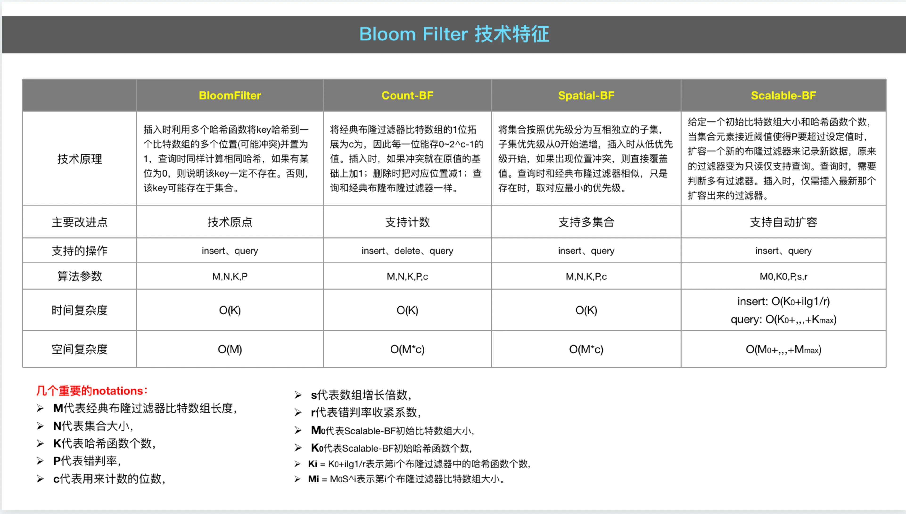

## 布隆过滤器的起源

BF起源于1970年发表的一篇名为[Space/Time Trade-offs in Hash Coding with Allowable Errors](https://dl.acm.org/doi/pdf/10.1145/362686.362692)的文章，该文章主要探讨的是**可容错**的哈希编码在时空复杂度上的优势。在不同的**不可容错**的哈希编码中，总是不可能同时占尽时空复杂度的好处——要么时间快-空间消耗大，要么时间慢-空间消耗小。Bloom提出了一个观点，他认为如果使用的场景可以容忍错误，那么是否有一种空间消耗小且运行时间还快的算法(数据结构)呢？因此，他提出了两种允许存在假阳性（false postive）的，用于测试一个给定元素是否存在于某一给定集合中的概率数据结构。通过允许容忍很小的错误，让其在时空复杂度上表现良好。其中第二种结构，因其在时空上更占优势而被我们熟知，该结构被后人称为“Bloom Filter”。

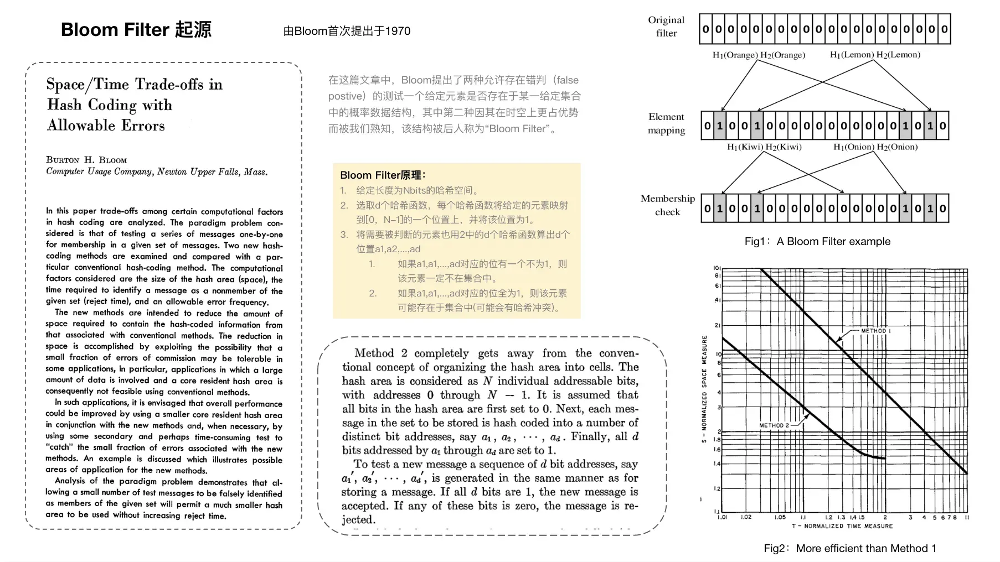

BF起源

其中对Method2的描述翻译一下，就是最初BF的基本原理：

  1. 给定长度为Nbits的哈希空间。
  2. 选取d个哈希函数，每个哈希函数将给定的元素映射到[0，N-1]的一个位置上，并将该位置为1。
  3. 将需要被判断的元素也用2中的d个哈希函数算出d个位置a1,a2,...,ad
  4. 如果a1,a1,...,ad对应的位有一个不为1，则该元素一定不在集合中。
  5. 如果a1,a1,...,ad对应的位全为1，则该元素可能存在于集合中。

如下图所示，Orange和Lemon两个元素作为集合的初始元素，经过两个哈希函数H1和H2分别哈希到两个位置，并将哈希到的位置元素置位1，建立起一个BF。当检查元素Kiwi和Onion是否在集合中时，同样经过哈希函数H1和H2哈希到两个位置。Kiwi元素哈希的位置不全为1，说明元素Kiwi一定不在集合[Orange,Lemon]中。而元素Onion哈希的两个位置均为1，但我们其实知道Onion并不在集合[Orange,Lemon]中，因此出现了错判。所以为了实际能使用上这样一个数据结构，我们有必要知道这个错判概率是与哪些因素有关，从而能降低错判概率。

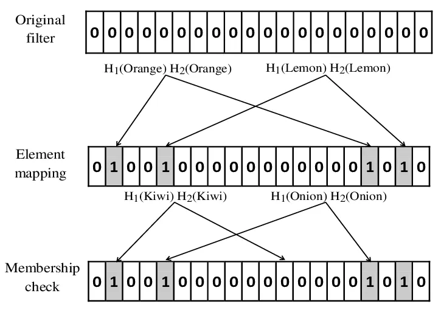

一个简单BF示例

从上面的例子中我们可以看出，一个布隆过滤器应该起码有以下参数：  

  1. 哈希空间大小，记为**m**。以上示例中m = 20 bits。
  2. 元素集合大小，记为**n**。以上示例中n = 2。
  3. 哈希函数个数，记为**k**。以上示例中k = 2。
  4. 因为BF是Allowable Errors的，可能会出现一个元素原本不在集合中，但是被错判为存在于集合中，这个错判的概率叫false postive，记为**ε**。

Bloom虽然提出了这样一个概率数据结构，但是并未给出这些参数之间的关系和证明。下面我们给出BF的概率证明，同时写出各个参数之间的关系表达式。

## BF是概率结构

以下为条件独立情况下的BF计算过程，并不复杂，稍微懂一点概率论的应该都能看懂。假设某BF的哈希空间大小为m，使用的哈希函数为k个。能得出：

一次哈希，某一位没有被置位1的概率为：

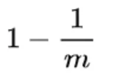

k次哈希后，某一位依然没有被置为1的概率为：

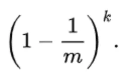

使用1/e的等价提换：

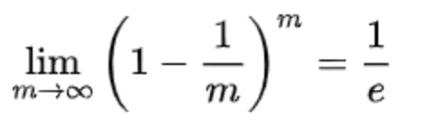

带入得：

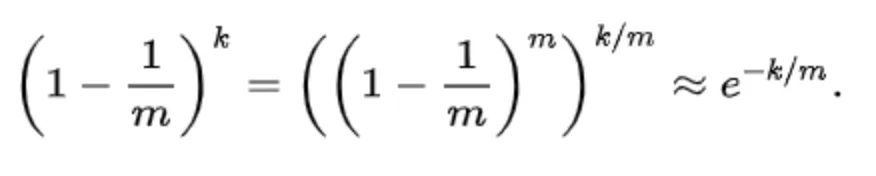

那么，在插入n个元素后，某一位依然是0的概率就为：

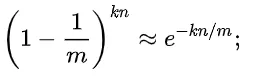

因此，取反，在插入n个元素后，某一位是1的概率就为：

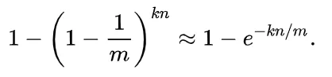

最终，某一元素没在集合中，但是被误判在集合中的概率为：

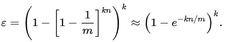

对于实际应用，我们的目标应该是使错判率ε最小，即需要使函数


取到最小值。求最小值的过程略，直接上结论：当 k = (ln2)*(m/n)时，错判率最小，因为k需要取整数，所以即当k = [(ln2)*(m/n)]时，布隆过滤器有最好的效果。以下是k取最优值时，各个参数之间的关系：


以上只是条件独立下的概率证明，非条件独立下的概率证明在2005年由Mitzenmacher和Upfal给出，过程稍显复杂，但是结论是一致的。感兴趣的可以参考：[Probability and Computing](https://books.google.com.hk/books?id=0bAYl6d7hvkC&pg=PA110&redir_esc=y#v=onepage&q&f=false)

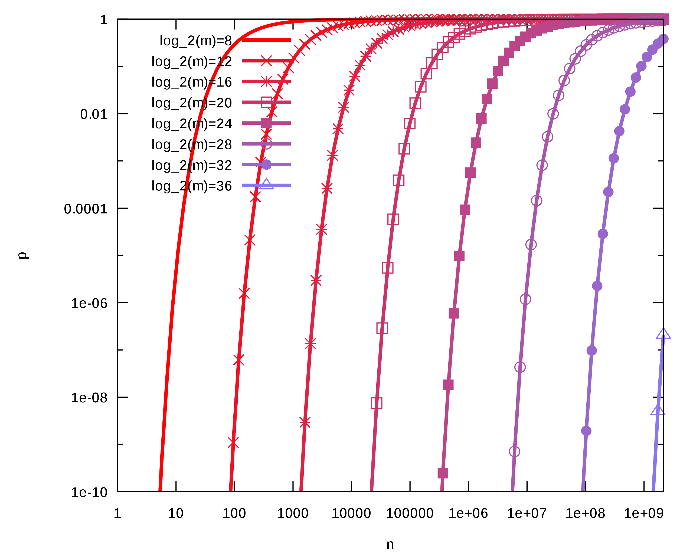

在k取最优值ln2*(m/n)时，随着n增长，不同m情况下错判率的变化关系

有了这些参数之间的关系表达式，就能方便的让我们选取最合适的参数。比如现有一场景，我们有1000w个黑产账号，需要以不高于0.001%错误的的情况下识别出来，那么我们选取**多少个哈希函数**最合适以及需要耗费多少空间(即**哈希空间m**是大多)？

答案：我们需要k=17个哈希函数以及m=239626460 (28.57MiB)。

具体计算带入公式即可。下面是一个网站，能帮忙我们快速计算各个参数：[Bloom filtercalculator](https://hur.st/bloomfilter/?n=10M&p=1.0E-5&m=&k=)

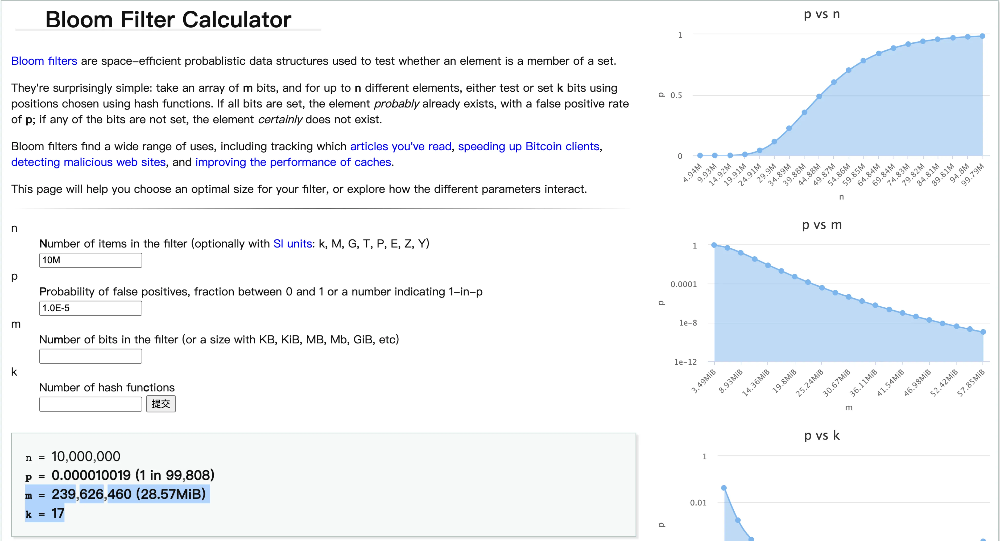

BF各参数计算

## 计数BF 

普通的BF其实并不支持删除元素，因为多个元素可能哈希到一个布隆过滤器的同一个位置，如果直接删除该位置的元素，则会影响其他元素的判断。因此，在2000年，在[Summary Cache: A Scalable Wide-Area Web Cache Sharing Protocol](https://pages.cs.wisc.edu/~jussara/papers/00ton.pdf)这篇文章中，LiFan等人使用带计数器的布隆过滤器，**弥补了布隆过滤器不支持删除的缺点**，并将CBF引入提出新的ICP（Internet Cache Protocol）以达到降低Web缓存代理带宽、cpu时间、消息数量的同时还提高命中率的效果。

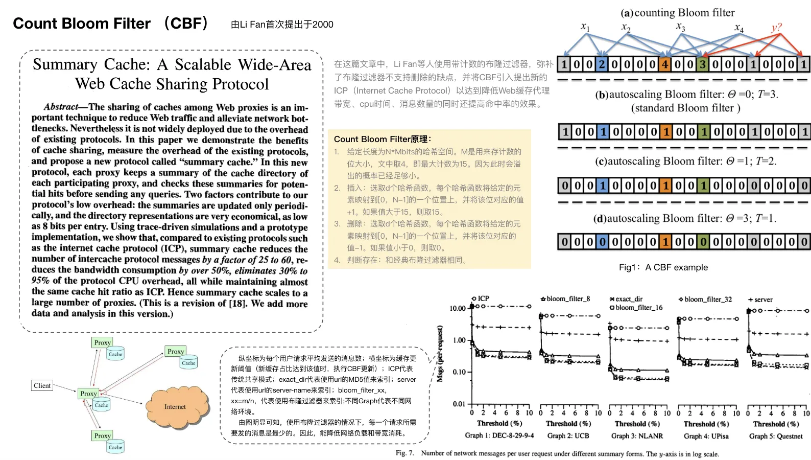

CBF起源

Count Bloom Filter原理：  

  1. 给定长度为N*Mbits的哈希空间。M是用来存计数的位大小，文中取4，即最大计数为15。因为此时会溢出的概率已经足够小。
  2. 插入：选取d个哈希函数，每个哈希函数将给定的元素映射到[0，N-1]的一个位置上，并将该位对应的值+1。如果值大于15，则取15。
  3. 删除：选取d个哈希函数，每个哈希函数将给定的元素映射到[0，N-1]的一个位置上，并将该位对应的值-1。如果值小于0，则取0。
  4. 判断存在：和经典布隆过滤器相同。

这里可以看到，CBF和普通BF的区别，仅仅是将原来的只能记0/1的一位，拓展为了多位。如果遇到哈希冲突，则把该位的值+1，删除时则将该位-1。

如下图所示步骤(a)所示，向CBF插入元素的过程中，不是将该位置为1，而是直接+1。这样当删除时，比如删除x1，只是将它原来所在位由[1,2,4]变为[0,1,3]，而不会影响其他元素是否存在于集合的判断。

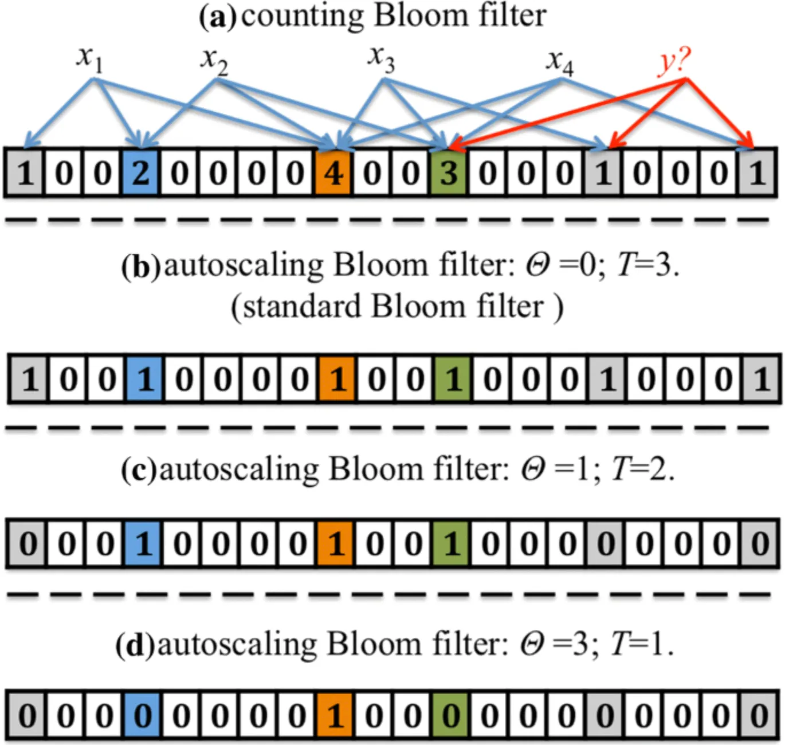

让我们来看一个使用CBF优化传统缓存共享的使用场景：

背景：传统的网络缓存服务器，通常会根据过期时间，缓存一批最近访问过的地址的网页信息。这时如果用户再次请求相同地址，即可从本地缓存中将网页信息取出返回给用户，无需经过真正的网络路由到外部真实的资源服务器。然而当用户请求的地址没有被proxy缓存时，该proxy会向网络中的其他proxy发送请求。如果其他proxy有网页信息，则会把信息返回给用户；如果其他proxy也没有网页信息，则会通过互联网将请求发送至目标服务器。

传统的ICP架构中，由于缓存的页面信息信息量巨大，所以都是缓存在本地磁盘中。

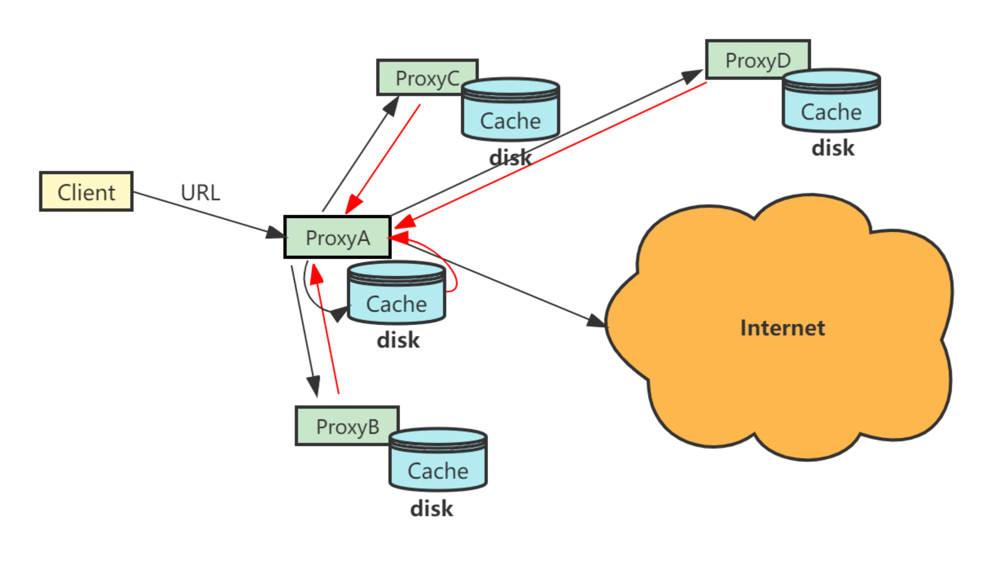

传统基于ICP的缓存共享

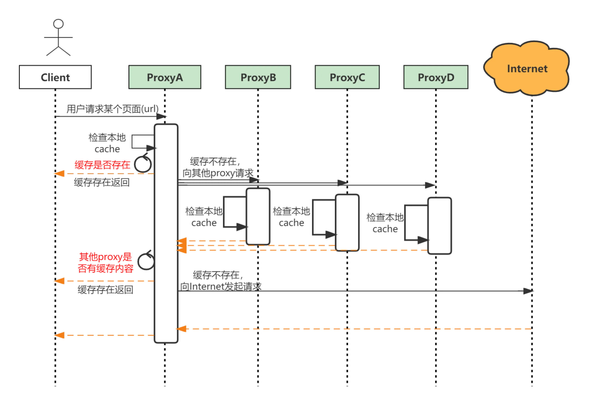

传统基于ICP的缓存共享的请求时序

从这个场景中我们可以发现，当缓存miss时，需要向其他所有Proxy发送请求，从而优先获取其他proxy缓存的内容，减少外部网络访问。一个很容易想到的优化策略就是，如果一个Proxy要是知道其他Proxy都缓存了哪些链接，就可以直接向目标Proxy发起请求而不用向每一个Proxy都发起请求。那么问题就转化为了，一个Proxy如何才能存储其他Proxy的缓存链接信息？如果全量存储，势必非常耗费空间。因为一个URL少则十几个字节，多则几百个字节，而且数量也非常多。这些信息要是存内存的话又太耗费资源，存磁盘的话访问速度又太慢。

针对以上问题，BF就排上了用场。因为在错判率1%时，一个元素无论多大只需要低于10bits存储，能有效降低存储空间，从而可以放到内存中。但是普通的BF又无法支持删除，我们这个场景缓存会淘汰，因此会存在元素删除的情况。这时，CBF就派上了用处，既耗费非常少的空间，又支持删除。使用CBF后，让我们看下如何优化该场景。

使用CBF后，每个Proxy维护一个自己的CBF，存储于内存中，记录各自的缓存集合信息。各个Proxy向其他Proxy同步自己的CBF，这样每个Proxy都能得到其他Proxy缓存的信息。同步时机可以定时同步或者设置一个缓存更新的阈值，当缓存更新超过该阈值时，向其他Proxy同步自己的CBF。

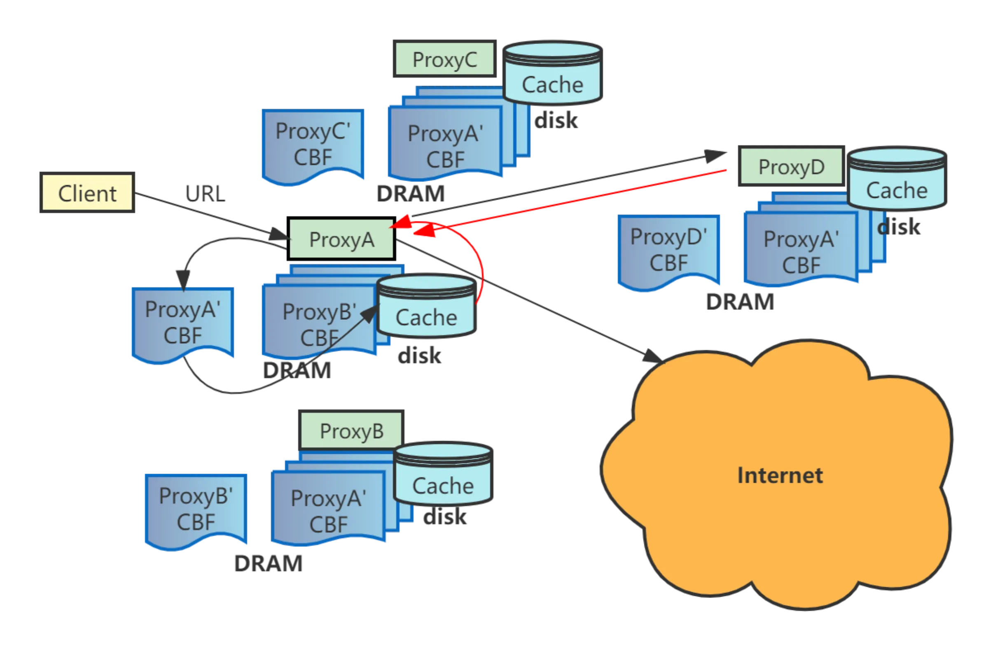

使用CBF改进的缓存共享

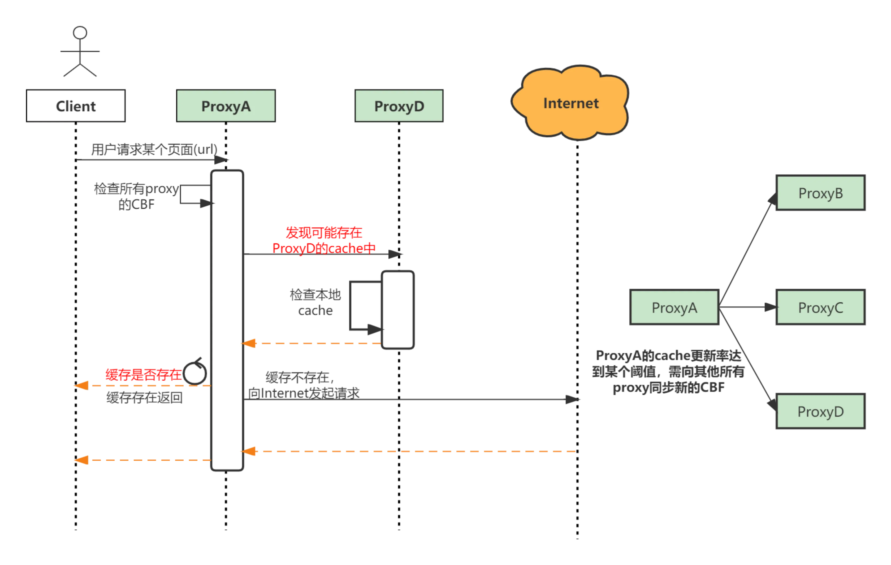

使用CBF改进的缓存共享请求时序

使用CBF改进后，可以从时序图中看到，一次请求的平均通讯次数大幅减少，根据论文结论：使用CBF优化过的ICP，能降低Web缓存代理带宽、cpu时间、消息数量、并且还能还提高缓存命中率。经过这样优化后的ICP协议叫做Summary Cache。

## d-left计数BF

思科联合哈佛大学和斯坦福大学于2006年提出，传统的CBF因为大部分时候值都为0，非常浪费空间。因此在[An Improved Construction for Counting Bloom Filters](http://theory.stanford.edu/~rinap/papers/esa2006b.pdf)一文中，他们基于d-left hashing，构建了名为d-left Count Bloom Filter(dlCBF)的**空间利用率更高**的布隆过滤器。与此同时，还提供了**更小的错判率**。

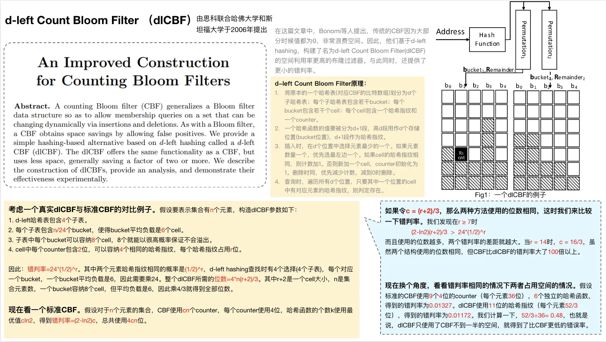

dlCBF起源

d-left Count Bloom Filter原理：  

  1. 将原本的一个哈希表(对应CBF的比特数组)划分为d个子哈希表；每个子哈希表包含若干bucket；每个bucket包含若干个cell；每个cell包含一个哈希指纹和一个counter。
  2. 一个哈希函数的值要被分为d+1段，高d段用作d个存储位置(bucket位置)，d+1段作为哈希指纹。
  3. 插入时，在d个位置中选择元素最少的一个。如果元素数量一个，优先选最左边一个。如果cell的哈希指纹相同，则计数加1。否则新加一个cell，counter初始化为1。删除时同，优先减少计数，减到0时删除。
  4. 查询时，遍历所有d个位置，只要其中一个位置的cell中有对应元素的哈希指纹，则判定存在。

可见，d-left中的'd'描述的是将原来的哈希表拆分为多少张子表，而'left'描述的是选取桶位置的原则，即有限选取桶内cell少的，如果cell一样多，优先选择最左的桶。通过使数据存储的更加均匀和密集，dlCBF才能节省更多的空间。关于d-left hashing，可以参考[D-left hashing_风云龙儿的博客-CSDN博客_d-left哈希解决了什么问题。]https://blog.csdn.net/hanchengxi/article/details/9463839)

这个过程可能比较不容易理解，我结合下面的dlCBF示意图给大家做个简单说明。下图描述了一个地址经过一个哈希函数最终落到一个cell中的过程。可以看到下图中的d=2.  

  1. 地址经过哈希函数，得到一个哈希值，哈希值包括2+1段(bucket1,bucket2,Remainder1=Remainder2)，忽略随机置换过程。其中bucket1和bucket2指定元素落在2个哈希子表的哪个桶中，而Remainder当做哈希指纹。
  2. 选择bucket1还是bucket2时，发现两边都没有当前指纹，并且两边当前cell数量是一样的都是2。因此根据**左边优先**原则，选在bucket1。新建一个cell，couter初始化为1，指纹为Remainder1。

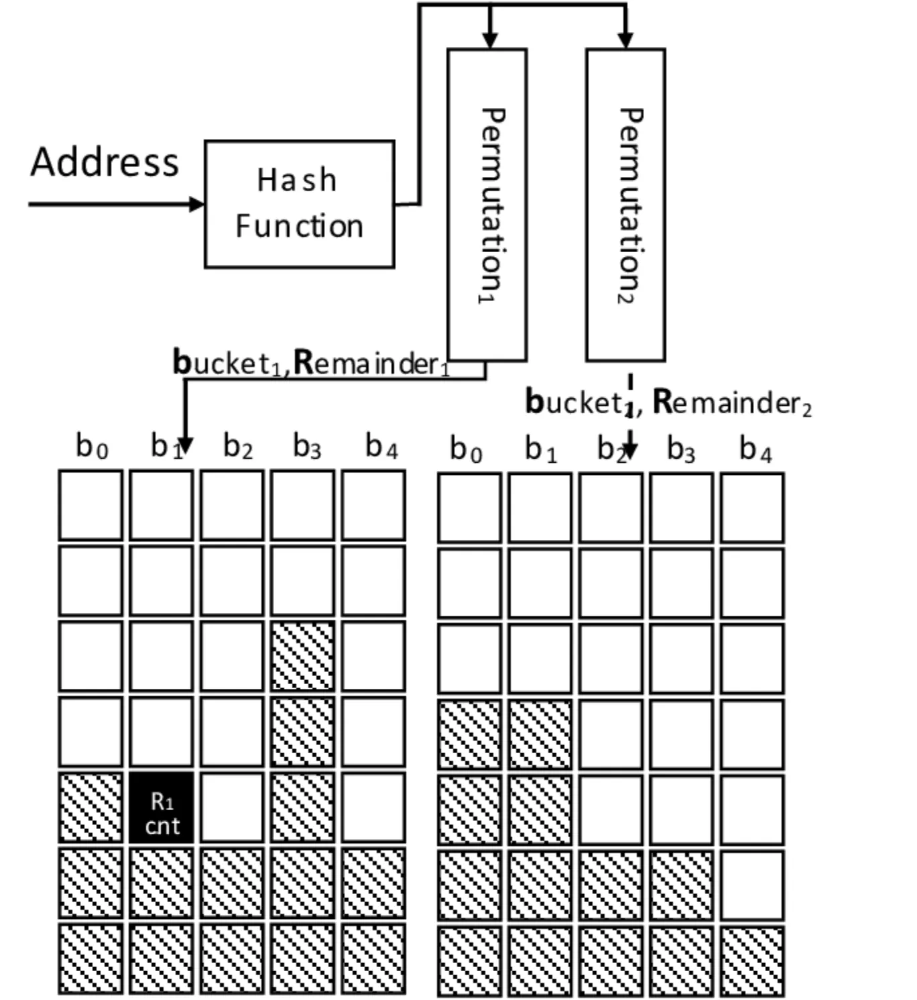

dlCBF示例

**为了体现dlCBF的优势，考虑一个真实dlCBF与标准CBF的对比例子。**假设要表示集合有n个元素，构造dlCBF参数如下：

  1. d-left哈希表包含4个子表。
  2. 每个子表包含n/24个bucket，使得bucket平均负载是6个cell。
  3. 子表中每个bucket可以容纳8个cell，8个就能以很高概率保证不会溢出。
  4. cell中每个counter包含2位，可以容纳4个相同的哈希指纹，每个哈希指纹占用r位。

因此：错判率=24*(1/2)^r。其中两个元素哈希指纹相同的概率是(1/2)^r，d-left hashing查找时有4个选择(4个子表)，每个对应一个bucket，一个bucket平均负载是6，因此需要乘24。整个dlCBF所需的位数=4*n(r+2)/3。其中r+2是一个cell大小，n是集合元素数，一个bucket容纳8个cell，但平均负载是6，因此乘4/3就得到全部位数。

现在看一个标准CBF。假设对于n个元素的集合，CBF使用cn个counter，每个counter使用4位，哈希函数的个数k使用最优值cln2，得到错判率=(2-ln2)c，总共使用4cn位。

** 如果令c = (r+2)/3，那么两种方法使用的位数相同，这时我们来比较一下错判率。**我们发现在r ≥ 7时有

(2-ln2)(r+2)/3 > 24*(1/2)^r

而且使用的位数越多，两个错判率的差距就越大。当r = 14时，c = 16/3，虽然两个结构使用的位数相同，但CBF比dlCBF的错判率大了100倍以上。

**现在换个角度，看看错判率相同的情况下两者占用空间的情况。**假设标准的CBF使用9个4位的counter（每个元素36位），6个独立的哈希函数，得到的错判率为0.01327。dlCBF使用11位的哈希指纹（每个元素52/3位），得到的错判率为0.01172。我们计算一下，52/3÷36= 0.48，也就是说，dlCBF只使用了CBF不到一半的空间，就得到了比CBF更低的错误率。

结论：使用相同的位数，dlCBF错判率更低。保持相同的错判率，dlCBF所占空间只有CBF的一半左右。

## 可扩展BF

在这篇文章中，Almeida等人提出传统的布隆过滤器需要**先验**的确定错判率p（false pasitive）和集合中元素大小n，才能有效的确定哈希函数k和过滤器大小m。然而，大部分情况下，我们并不能事先知道集合中到底会插入多少个元素，因此有必要有一种**能动态根据集合中的元素计算适合的哈希函数个数和filter大小的机制**。使用该机制的布隆过滤器就叫做Scalable Bloom Filters。

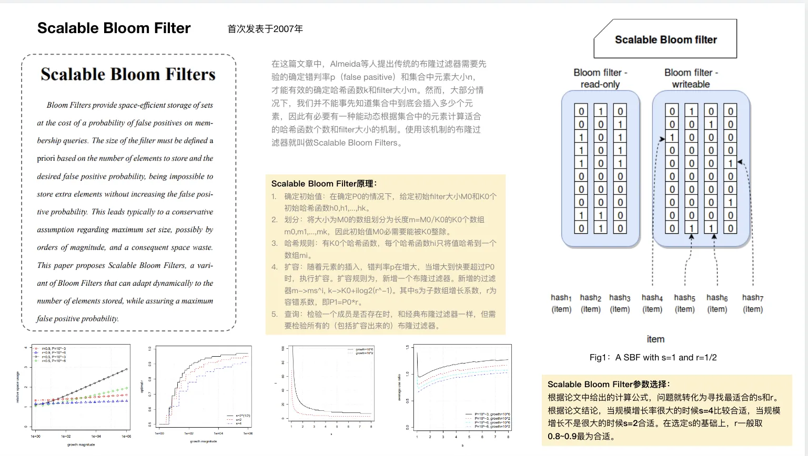

Scalable-BF起源

Scalable Bloom Filter原理：  

  1. 确定初始值：在确定P0的情况下，给定初始filter大小M0和K0个初始哈希函数h0,h1,...,hk。
  2. 划分：将大小为M0的数组划分为长度m=M0/K0的K0个数组m0,m1,...,mk，因此初始值M0必需要能被K0整除。
  3. 哈希规则：有K0个哈希函数，每个哈希函数hi只将值哈希到一个数组mi（分段哈希）。
  4. 扩容：随着元素的插入，错判率p在增大，当增大到快要超过P0时，执行扩容。扩容规则为，新增一个布隆过滤器。新增的过滤器m->ms^i, k->K0+ilog2(r^-1)。此时旧的布隆过滤器变为只读，新的布隆过滤器可读写。其中s为子数组增长系数，r为容错系数，即P1=P0*r。
  5. 查询：检验一个成员是否存在时，和经典布隆过滤器一样，但需要检验所有的（包括扩容出来的）布隆过滤器。

Scalable Bloom Filter参数选择：

在第4步扩容中，引入了两个新的因子s和r。根据论文中给出的计算公式，问题就转化为寻找最适合的s和r。根据论文结论，当规模增长率很大的时候**s=4**比较合
适，当规模增长不是很大的时候**s=2**合适。在选定s的基础上，r一般取**0.8~0.9**最为合适。

如下图所示，下图是一个s=1,r=1/2的Scalabel-BF示例。下图右半部分是一个因错判率达到阈值而扩容出来的新的BF。新扩容出来的BF可读写，原先的BF变为只读。根据公式m->ms^i，带入s=1，i=1得到结果=m，可以知道新扩容出来的每一列依然保持m的大小。而根据公式k->K0+ilog2(r^-1)，带入k0=3,r=1/2,i=1得到结果=4，可知新扩容出来的哈希函数比原来多了一个。

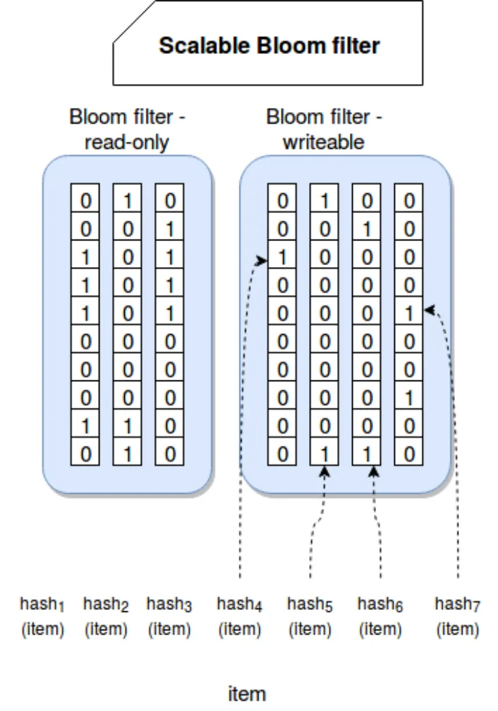

**实际上**redis中的BF拓展，就是利用**Scalable Bloom Filter的原理来实现的。<https://github.com/RedisBloom/RedisBloom>**

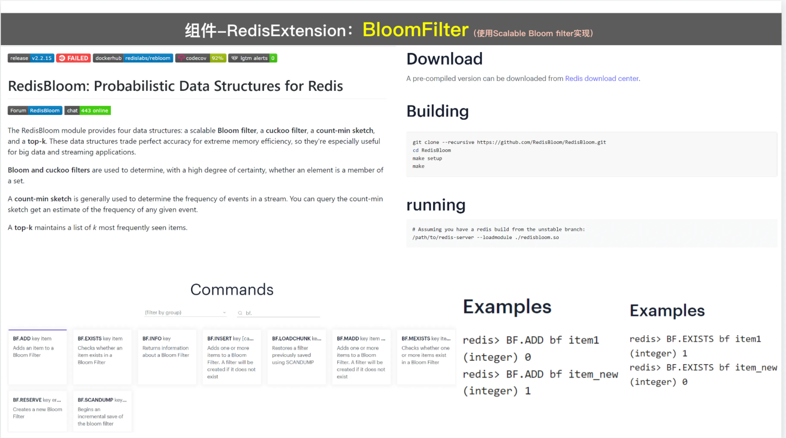

## 空间BF

到目前为止我们发现，以上所有的BF，都只支持单个集合，即加入到BF中的元素都属于同一个集合。然而，BF还是有可能支持多个集合的。

在[Spatial Bloom Filters: Enabling Privacy in Location-Aware Applications](https://citeseerx.ist.psu.edu/viewdoc/summary?doi=10.1.1.471.4759)这篇文章中，Palmieri,Calderoni & Maio提出了SBF这一数据结构来存储空间信息，从而提供无需暴露用户具体位置就能为其提供位置服务的好处。然而，SBF**最大的特性，是其支持将多个有优先级的集合使用同一个数据结构来存储**。

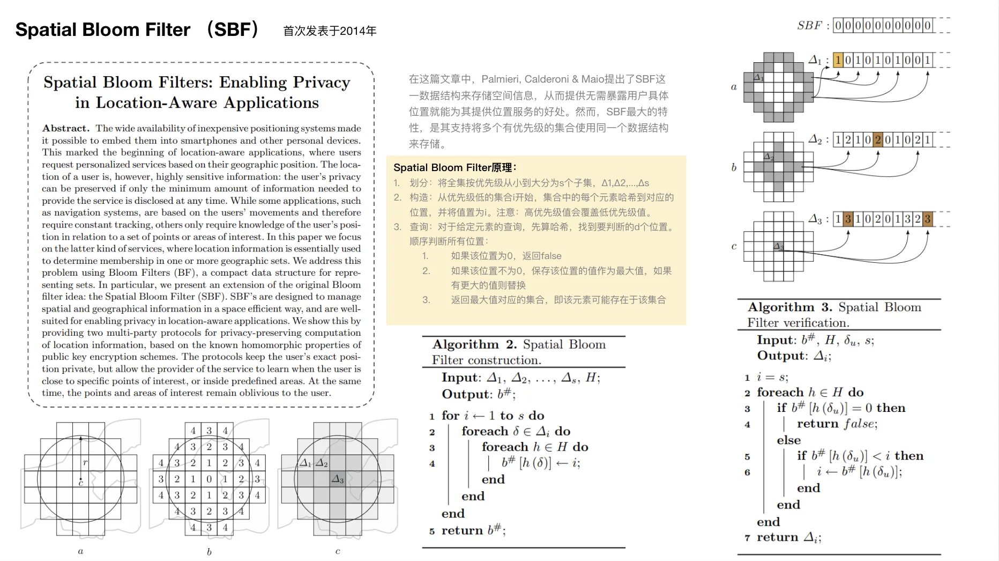

SBF起源

Spatial Bloom Filter原理：  

  1. 划分：将全集按优先级从小到大分为s个子集，Δ1,Δ2,...,Δs
  2. 构造：从优先级低的集合i开始，集合中的每个元素哈希到对应的位置，并将值置为i。注意：高优先级值会覆盖低优先级值。
  3. 查询：对于给定元素的查询，先算哈希，找到要判断的d个位置。顺序判断所有位置：
  4. 如果该位置为0，返回false
  5. 如果该位置不为0，保存该位置的值作为最大值，如果有更大的值则替换
  6. 返回最大值对应的集合，即该元素可能存在于该集合

论文中作者使用SBF，主要是用于构建地理信息。结合下面两张图，使用空间布隆过滤器，现在我们可以描述一下地理信息建模过程。  

  1. c点为感兴趣的中心位置，r为感兴趣的范围，离c越近优先级越高。以c为圆心，r为半径画圆，这个圆会覆盖很多区域。
  2. 把c点所在的区域距离设为0，计算圆覆盖范围区域δ与c的曼哈顿距离。
  3. 根据曼哈顿距离给区域分类（划分优先级），划分优先级的策略可以自定义，比如示例中 1,2优先级相同，3,4优先级相同。优先级划分完后从高到低，从内到外，分出了三个区域：[Δ3,Δ2,Δ1]，对应的值分别是 [3,2,1]。

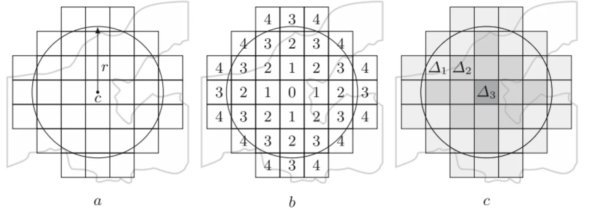 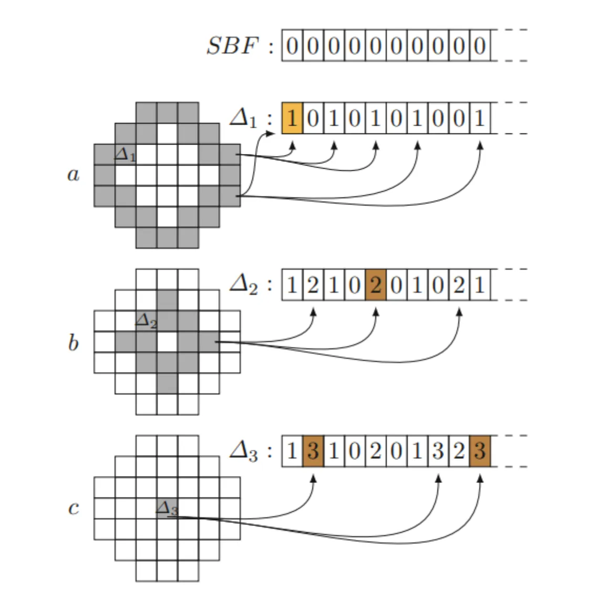

空间布隆过滤器建立算法流程：

```
输入：Δ1,Δ2, ... , Δs, H(多个哈希函数);
输出：空间布隆过滤器b#；
for i ← 1 to s do
    foreach δ∈Δi do
        foreach h∈H do
            b#[h(δ)] ← i；
        end
    end
end
return b#；
```

空间布隆过滤器查询算法流程：

```
输入：b#，H，δ，s;
输出：Δi；
i = s;
foreach h∈H do
    if b#[h(δ)]=0 then
        return false;
    else
        if b#[h(δ)]<i then
            i ← b#[h(δ)];
        end
    end
end
return Δi；
```

参数释义：

b#：SBF

H：哈希函数

δ：具体某一个地理小方格

Δ：同一优先级的小方格集合

s：不同优先级集合个数

作为论文中的例子，作者利用SBF建模地理信息，使用同态加密保证数据的“可用而不可见”，来完成对通讯双方位置隐私的保护。从而构建了一种无需提供精确位置下的位置依赖服务(location base service)。由于通讯流程比较复杂，这里就不展开讲解了。

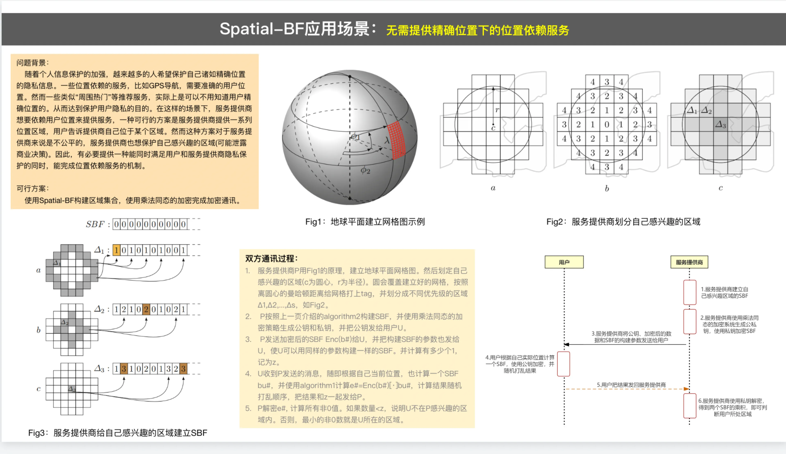

学习SBF原理，我也撰写了一篇专利[一种提供位置隐私保护的附近的人一起看陪看推荐方法](https://doc.weixin.qq.com/doc/w3_AHYAlgZeAFIoLMjd9C1Q4KLPufKaP?scode=AJEAIQdfAAotJRxgTiAHYAlgZeAFI)，大家有兴趣也可以看看。里面详细介绍了使用SBF+乘法同态加密完成一个位置隐私保护的推荐流程。

## 如何构建一个好的BF

说了这么多，还是没有回答一开始提出来的问题，BF的哈希函数究竟要怎么选择？MD5行不行？

**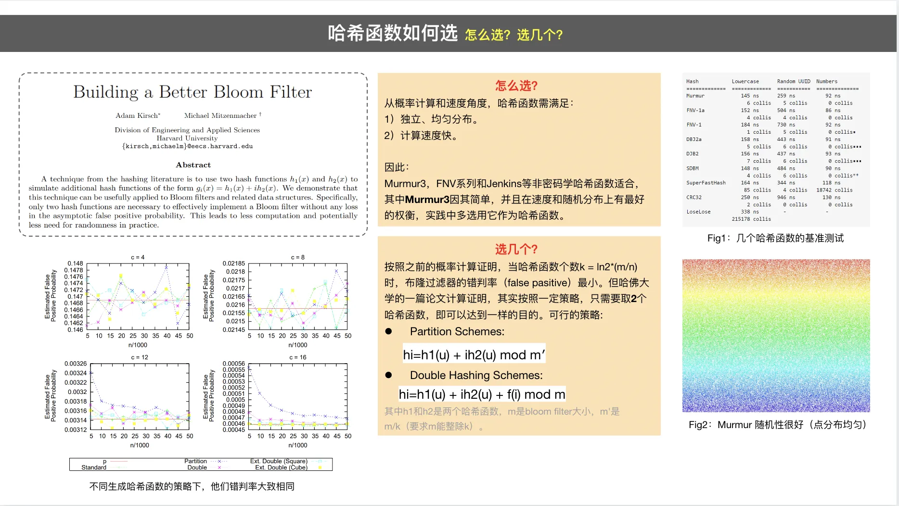**

如何选择哈希函数

从概率计算和速度角度，哈希函数需满足：

1）独立、均匀分布。

2）计算速度快。

因此：

**Murmur3，FNV**系列和**Jenkins**等非密码学哈希函数适合，其中**Murmur3**因其简单，并且在速度和随机分布上有最好的权衡，实践中多选用它作为哈希函数。

以下是一些哈希函数测评：[hash-functions-benchmarks](https://stackoverflow.com/questions/11954086/which-hash-functions-to-use-in-a-bloom-filter)

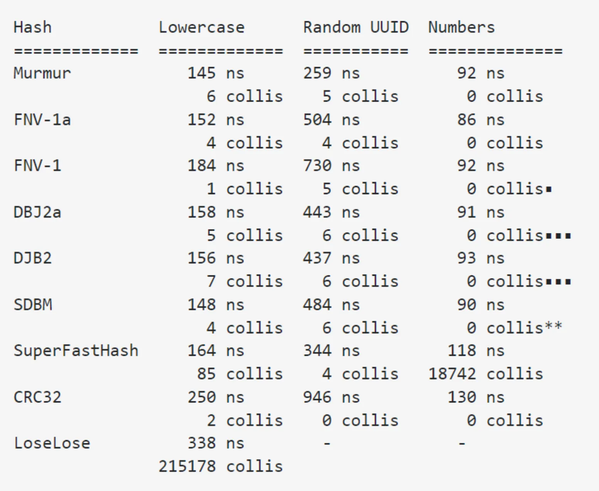

几个哈希函数的基准测试  


Murmur 随机性很好（点分布均匀）

选择几个哈希函数？

当需要10个哈希函数的时候，我们总不可能选择10个不同的哈希函数来进行操作吧，这样也根本无法编程。哈佛大学的一篇论文计算证明，其实按照一定策略，只需要取2个哈希函数，即可以达到生成任意多个哈希函数的目的。论文中提出了两种可行的策略:

**Partition Schemes**:  

hi=h1(u) + ih2(u) mod m′

**Double Hashing Schemes:**
hi=h1(u) + ih2(u) + f(i) mod m

**其中h1和h2是两个哈希函数，m是bloom filter大小，m'是m/k（要求m能整除k）。


在go语言的BloomFilters实现中，利用了类似partition schemes的策略，通过2个哈希函数（第二个哈希函数实际上是将输入值+1后取哈希值实现的)，生成无数多个哈希函数。

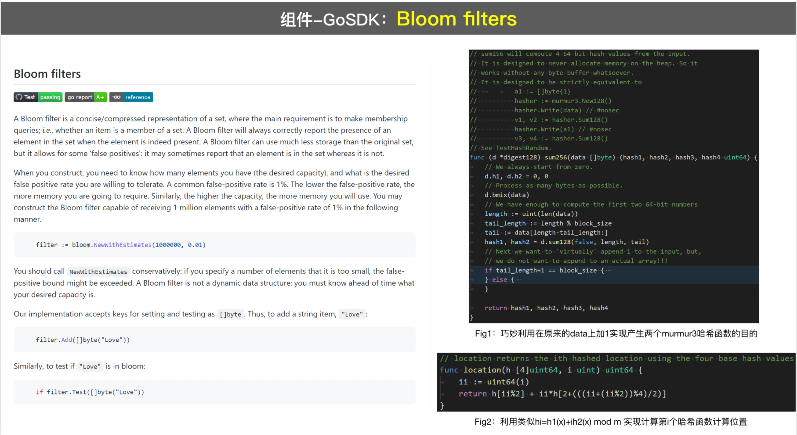

## 源码分析

在了解了布隆过滤器原理后，结合一份源码，让我们看一下一个BF组件的内部实现。源码分析部分就不展开了，感兴趣的可以拓展阅读[BloomFilter-Golang源码分析。](https://doc.weixin.qq.com/doc/w3_AHYAlgZeAFINj40lb1vRzS7SSunkj?scode=AJEAIQdfAAoUq1qPpWAHYAlgZeAFI)

## 写在最后

布隆过滤器的原理部分，涉及大量的证明和推导，因此除了最原始的布隆过滤器给出了推导，其他变种的推导过程都省略了。同时因为作者学识、精力和时间都有限，并没有把整个布隆过滤器的发展脉络都梳理出来，只选取了部分富有代表性的来讲解。文中的内容，也是作者读了论文后自己翻译和总结的，可能会有稍许误差，如各位发现其中的错误，还望不吝赐教，感谢大家。

## 参考资料

* [Space/Time Trade-offs in Hash Coding with Allowable Errors](https://dl.acm.org/doi/pdf/10.1145/362686.362692)
* [Probability and Computing](https://books.google.com.hk/books?id=0bAYl6d7hvkC&pg=PA110&redir_esc=y#v=onepage&q&f=false)
* [Summary Cache: A Scalable Wide-Area Web Cache Sharing Protocol](https://pages.cs.wisc.edu/~jussara/papers/00ton.pdf)
* [An Improved Construction for Counting Bloom Filters](http://theory.stanford.edu/~rinap/papers/esa2006b.pdf)
* [Spatial Bloom Filters: Enabling Privacy in Location-Aware Applications](https://citeseerx.ist.psu.edu/viewdoc/summary?doi=10.1.1.471.4759)
* [Building a Better Bloom Filter](https://www.eecs.harvard.edu/~michaelm/postscripts/tr-02-05.pdf)
* [hash-functions-benchmarks](https://stackoverflow.com/questions/11954086/which-hash-functions-to-use-in-a-bloom-filter)
