<!--BEGIN_DATA
{
    "create_date": "2020-11-14 18:45", 
    "modify_date": "2020-11-14 18:45", 
    "is_top": "0", 
    "summary": "带你了解字体的基础知识", 
    "tags": "设计", 
    "file_name": "带你了解字体的基础知识.md"
}
END_DATA-->

#### 
原文出处：<a href='http://www.333cn.com/shejizixun/201748/43496_138976.html' target='blank'>带你了解字体的基础知识</a>

本篇文章将介绍一些关于字体的基础知识，主要会介绍一些常见术语的含义还有英文、中文字体常见的分类方式，另外简单介绍一下各平台下字体渲染的相关的问题，还有标点使用和排版规范。术语字形和字体不得不说 Font 与 Typeface 即是在英文中也有很多混用的地方很难分清，也常常被混用，现在通常被翻译为“字体”的Font 在传统印刷界是指特定尺寸、特定字重、字偶间距等信息 的一种 Typeface，比如 “尺寸14pt，字重为 Bold 的 Helvetica ”就是一个 Font，而这里的 Helvetica 就

本篇文章将介绍一些关于字体的基础知识，主要会介绍一些常见术语的含义还有英文、中文字体常见的分类方式，另外简单介绍一下各平台下字体渲染的相关的问题，还有标点使用和排版规范。

## 术语

**字形和字体**   

不得不说 Font 与 Typeface 即是在英文中也有很多混用的地方很难分清，也常常被混用，现在通常被翻译为“字体”的  Font在传统印刷界是指特定尺寸、特定字重、字偶间距等信息 的一种  Typeface，比如 “尺寸14pt，字重为 Bold 的 Helvetica ” 就是一个Font，而这里的 Helvetica 就是它的 Typeface 。不过现在 Font的所指定的通常不再包括尺寸了，因为与铸模的时代不同了数字字体尺寸可以很轻易的改变。

Typeface 的另一个称呼是 Font family（字族），这个词实际上比 Typeface 更好理解且不容易混淆，能很明显的表达出 Font 是 Font family 的子集的意思，所以在 HTML & CSS 的标准中使用的是 Font family（字族）。简单来说 “Helvetica”是一个 Typeface ，而指定具体的字重： “Helvetica Bold” ，这就是 Font 了。

还有一个概念是 Glyph ，它表示的是字的某种写法或者说字体的“骨骼”，比如字母 a 和 ɑ 就是 Glyph 不同，涙 – 泪、強 – 强也是 Glyph 的不同。

而Font 、Typeface 和 Glyph 在中文里的翻译就乱七八糟了，按照国家标准（GB/T 16964）应该是：

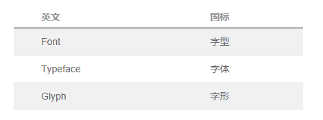

然而，在实际使用上字体和字型混乱不堪，常常把 Font 称为字体，而字型和字形更是常常搞反。而常用民间称法的是把 Font 称为字体， 不用Typeface 而是使用  Font family 即字体族，再把 Glyph 称为字形或字型。这种称法实际上比标准翻译更加流行。

**罗马体与意大利体**

Roman 指的就是衬线体，这个称呼是因为衬线的起源于罗马时期的碑刻。由于通常都把衬线体作为正文字体，所以很多场合下，Roman 就变成了正文字体的代名词。

而 Italic（意大利体）最早是指意大利使用的一种手写体，而后来 Italic（意大利体）常被用作斜体与正文的罗马体搭配，成为了斜体的代名词。另外一种斜体的称呼是 Oblique （单斜体、仿斜体）也被称为Slanted，这通常是指直接把正文字体做倾斜处理产生的斜体，而 Italic （意大利体） 则是特别设计的与正文相差较大的斜体。

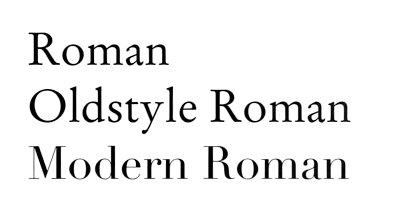

Roman 罗马

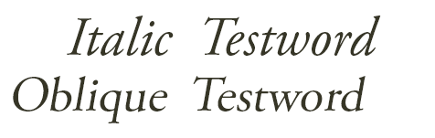

同一字体（Adobe Garamond）的 Italic（意大利斜体）与 Oblique（单斜体）

**字体结构**

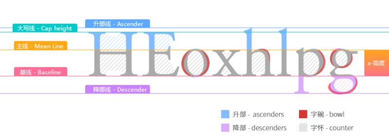

**字间距、字偶间距与等宽字体**

字间距（Spacing）顾名思义是字符间的距离，在实现上就是字符图形外边界框的尺寸和字符在方框中的位置。

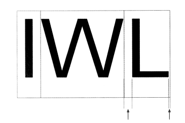

字间距 -《西文字体》

字偶间距（Kerning）也被称为字距调整，是在字间距的基础上，为实现不同字偶（一对字符）可以有不同字间距的调整值。不同的字母有不同的外形，所以字体只有同样的字间距是不协调的，比如“AH”间是标准的字间距，而“AV” 由于 V 和 A的形状，其位置可以重叠，所以需要负字偶间距才能达到协调的外观。字间距和字偶间距都是一个字体的组成部分，并且字偶间距需要为很多字偶准备。

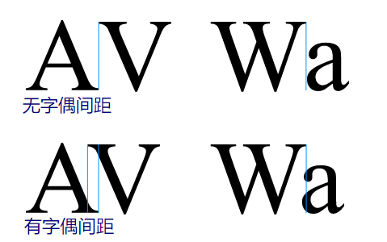

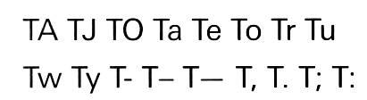

一套字体中的多个字偶 -《西文字体》

另外有字距的概念就是等宽字体（Monospaced）与比例字体（Proportional）了，比例字体就是上面说的按字符外形设置有不同字距的字体，这种字体外形协调，可读性好。而等宽字体（Monospaced）是每个字字间距都相同的字体，其优点是可以很好的控制排版对齐，因此目前编程的代码编辑器通常都会使用等宽字体（Monospaced）最为显示字体。

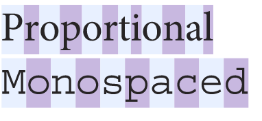

**字重与宽度**

字重的划分根据不同字体厂商各有不同，不同的字重称呼也可以不一样，常见的划分如下：

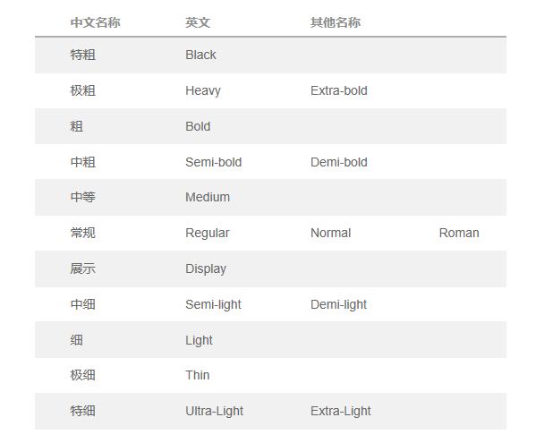

另外还有窄字体：Condensed、宽体：Expanded、斜体：Italic、Slanted（通常指仿斜体）。

**连字**

连字（Typographic ligature）也被称为合字，源于手写时的连笔，如“fi”的  i 上一点常与  f的一钩合并。传统英文印刷常会使用连字，而 1970年代照相排版流行之后就很少使用连字了，而且由于显示屏的分辨率有限，是否连字差别不大，所以现在不是很流行使用连字。

连字的实现方式有两种，一是字体的 PostScript 连字功能，这需要排版或显示软件支持，另外是使用合字字符，如：

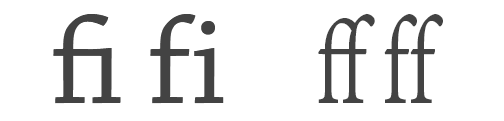

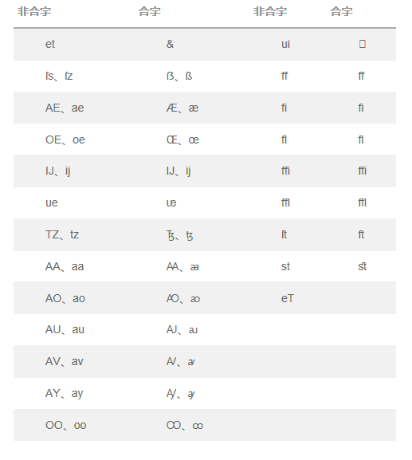  

**字面率、中宫、重心**

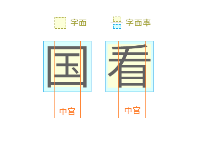

字面率、字面、中宫、重心是常见描述中文字体外观特点的属性。字面是相对于字体的外框而言字体实际尺寸的范围，同样字号下不同字体字面大的实际尺寸会更大。

字面率是字面与外框内尺寸的比值，一般简体中文字体有 92 % 左右的字面率，日文字体汉字通常字面率要高一些，94%左右，相对而言，日文字体汉字更追求平均和较大的字面率。

中宫是汉字主要结构的大小，类似于英文字体的 x 高度。中宫大小可以用来评判字体的松紧程度，中宫分横向和纵向，不过通常看横向的中宫尺寸就够了。

重心是字体另一个主要的外观属性，是字体的视觉中心点，一般字体重心是位于中上部分。

## 英文字体

### 字体分类

英文字体的分类方法有许多种，不同的分类法侧重点不同，这里介绍常见的传统分类法“ Vox-ATypl 分类法” 和数字字体时代具有代表性的 typekit网站的字体分类方法，还有按年代划分（主要参考《西文字体》）字体的方法。

#### _typekit 分类法_

##### Sans-Serif 无衬线

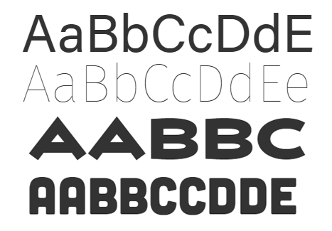

##### Serif 衬线

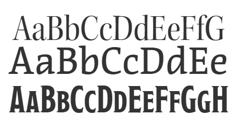

##### Sleb-Serif 粗衬线体

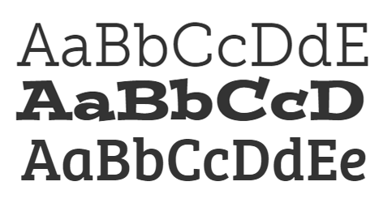

##### Script 书法体

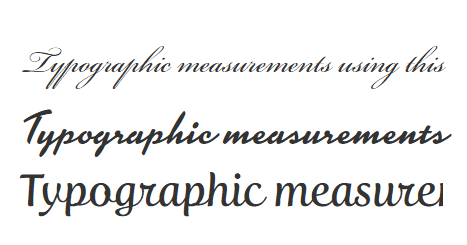

##### Blackletter 哥特黑体

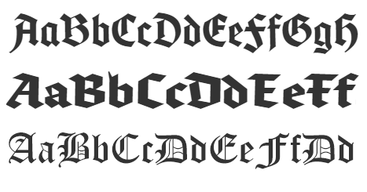

##### Monospace 等宽字体

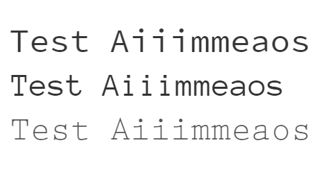

##### Hand 手写体

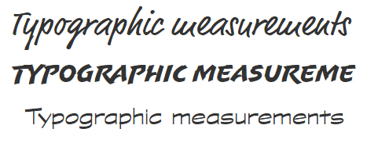

#### Vox-ATypl 分类法

##### Classicals 古典

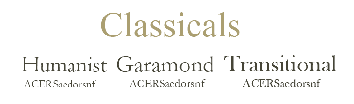
 

古典字体分为人文主义体 （Humanist），加拉德体（Garalde）和过渡体（Transitional），他们的特征是有着类似三角形的衬线

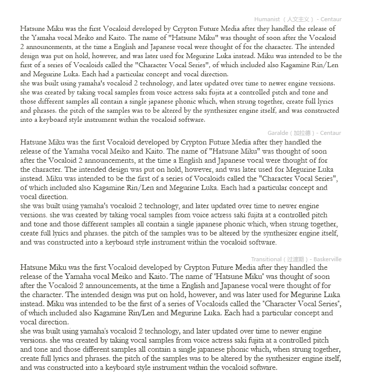

可以看到人文主义的字体 x 高度明显小，大写字母比小写字母高许多。

##### Humanist 人文主义字体

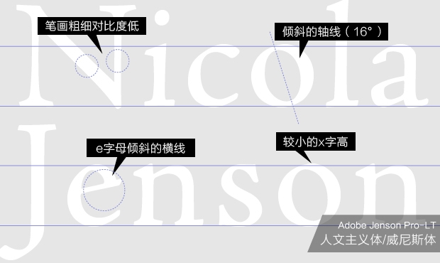

人文主义字体是文艺复兴时期的兴起的字体，流行于当时文艺复兴的中心意大利，所以也被成为威尼斯式 (Venetian) 字体。

人文主义字体以当时作家的手写字体为参照，所以保留有很多手写的特征，比如倾斜的 e、c、o。还有较小的 x 高度。

_e、c、o 的轴线倾斜_

_笔画粗细差别不大_

_x 高度较小_

代表字体有：Centaur、Cloister old style

##### Garalde 加拉德体

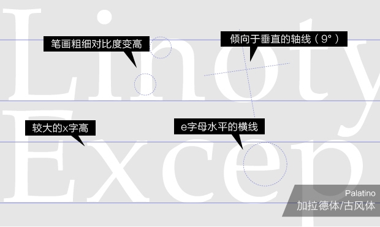

加拉德体的名字（Garalde）是来源于 2 个设计师：Claude Garamont 和 Alde Manuce。这种字体也被称为“古风体”或“旧风格”字体。
 
这是一种比较中庸的字体，其去掉了很多手写特征，e  的轴线完全垂直了，o 和 c 的倾斜也很小，x高度也较高，字体的比例较均衡，所以很适合作为正文排版使用。

_e 轴线完全垂直，o、c 轴线略微倾斜_

_笔画粗细差别不大_

_x 高度较大_

代表字体有：Garamond、Bembo

##### Transitional 过渡期体

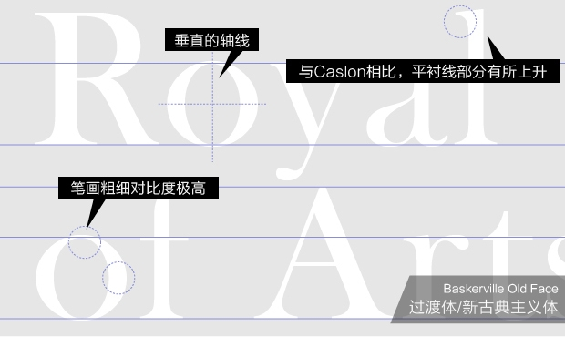

过渡时期是指法国大革命、美国独立的 18 世纪启蒙时代(Age of the Enlightenment)，这种字体也被称为新古典主义字体（Neoclassical）。

这种字体的几乎完全抛弃了手写特征，衬线几何化为十分规则的曲线。而且其笔画粗细相差极大，细处特别细，粗处特别粗，这让它并不很适合作为正文字体。它适合的是有足够尺寸来展示其流畅典雅曲线的场合，比如标题或者 LOGO。

_垂直的轴线_

_强烈的笔画粗细对比_

_衬线曲线平滑_

代表字体有：Baskerville、Times Roman

##### Moderns 现代

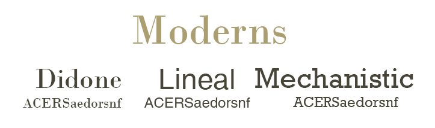

#### Moderns（现代）字体的特征

##### Didone 迪多尼

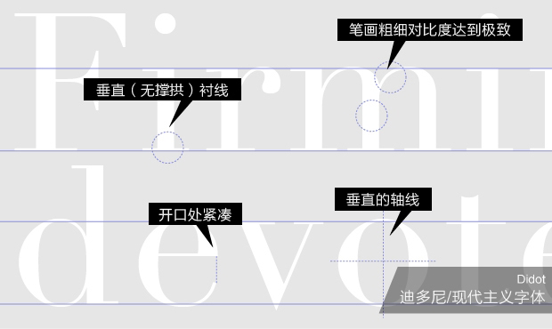

Didone（迪多尼）字体的最大特征就是极细的无撑拱衬线，也被称为发丝衬线（hairline-serif），与 Transitional（过渡期字体）相比有更高的笔画粗细对比，字母开口闭合处也更紧凑。这种字体不是很适合作为正文排版，它需要较大的展示空间。

_极细的发丝衬线（hairline-serif）_

_笔画粗细对比达到极致_

_字母开口处紧凑_

代表字体有：Didot、Bodoni

##### sMechanistic 机械风格体

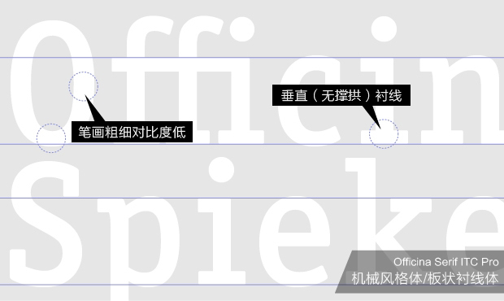

Mechanistic （机械风格）也被称为 slab serif （粗衬线、厚板、板状衬线）体，其最大的特征就是粗厚的无撑拱衬线。通常Mechanistic 风格的字体笔画粗细对比低，且很粗，曲线也很生硬。

_无撑拱（支架）的粗厚衬线_

_笔画粗且粗细对比低_

_曲线生硬_

代表字体：Clarendon、Rockwell

##### Lineals 线体

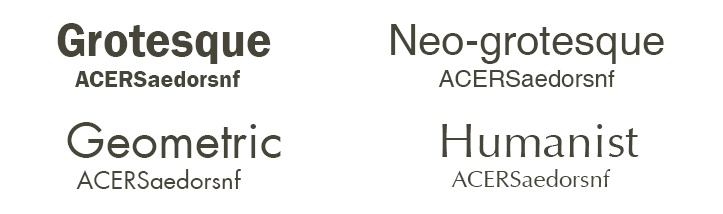

线体更常见的名称是：sans-serif（无衬线体）和 gothic（哥特体）。其是现代字体的代表，其特征就是没有衬线，所以它还有很多子类别：Grotesque （怪诞体）、Neo-grotesque（新怪诞体）、Geometric （几何体）、Lineal Humanist （人文主义无衬线体）。

由于 Grotesque（怪诞体）是最早的无衬线体，所以很多地方也把无衬线体称为 Grotesque（怪诞体）或 Grotesk（德语怪诞体）。

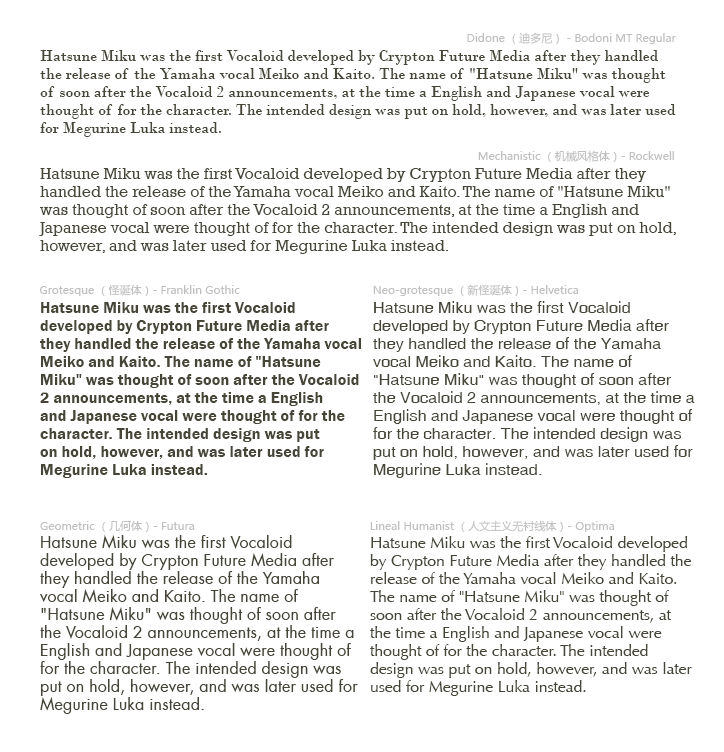

##### Grotesque 怪诞体

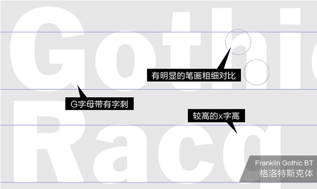

怪诞体是最早的无衬线字体。也被直接称为歌德体或者音译为格洛特斯克体。

它没有衬线并且笔画极粗还有明显的笔画粗细对比，通常只会用在标题或者大尺寸场合。

_G 字母有字刺_

_笔画粗细对比明显_

_较高的 x 字高_

代表字体：Monotype Grotesque、Franklin Gothic

##### Neo-grotesque 新怪诞体

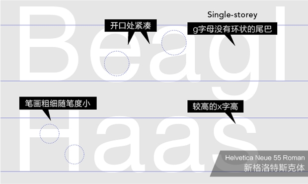

新怪诞体是最常见的无衬线字体了，其笔画粗细变化小、开口处紧凑、X 字高较大、曲线柔和很适合最为正文字体，有名的 Helvetica 就是新怪诞体的代表。

_笔画粗细变化小_

_X 字体高度大_

_曲线柔和_

代表字体：Universal、Helvetica

##### Geometric 几何体

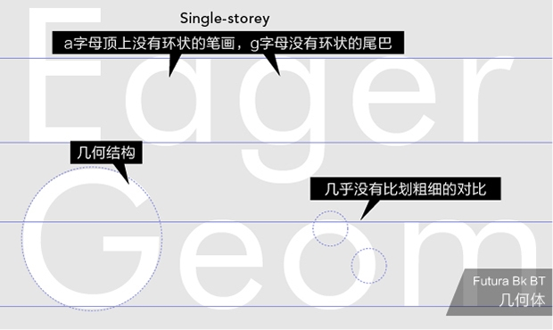

如其名是遵循几何形式来制作的字体，极具现代感，不适合作为正文字体，著名的 Futura 就是几何字体。

_由几何结构构成外形_

_笔画粗细对比小_

代表字体：Futura、Eurostile

##### Lineal Humanist 人文主义无衬线体

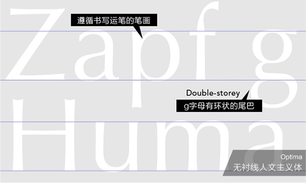

和经典的人文主义字体相似，人文主义无衬线字体也留有手写的特征，虽然没有衬线但是笔画有装饰线的粗细变化，作为正文时会又类似衬线体的效果。

_有装饰性的笔画粗细变化_

代表字体：Gill sans、Optima

##### Calligraphics 书法体

相比上面那些字体，书法体外形更加多样，

##### Glyphic 雕刻体

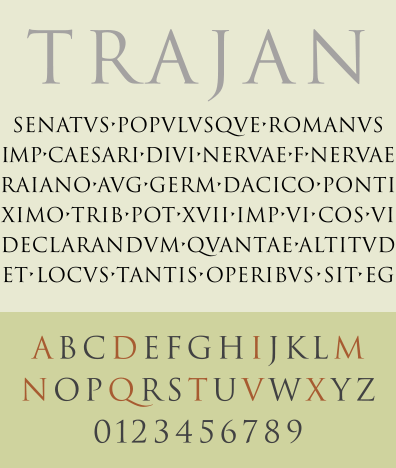

雕刻体来自于雕刻和镌刻的字母。雕刻体是最早的字体，只有大写字母（不过现在的雕刻体字体都会配上小写字母），许多雕刻字体看起来可以被分类为衬线字体。

##### Blackletter 哥特黑体

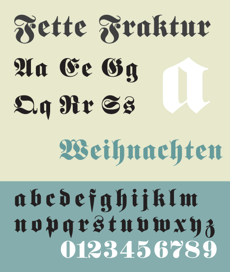

Blackletter 由于流行于哥特时期（12世纪 ~ 14世纪末） 所以常被称为 Gothic Script（哥特手写体）或者 Old English Script（旧英文手写体），要注意的是国内很多地方直接把 Blackletter 翻译成哥特体或者黑体，这很可能产生误解，实际上在字体领域有一段时间Gothic（哥特体）代表的无衬线的字体，虽然目前在英文中几乎不用 Gothic 代表无衬线体了，但是在日本和韩国还流行用 Gothic代表无衬线字体，比如 Franklin Gothic 和  Windows MS Gothic。而“黑体”在中文字体中也是指无衬线体，所以为做区别最好称其为“哥特手写体”或者“哥特黑体”。

这种字体在德国使用到了二战时期，所以一般也认为 Blackletter 是德国标志性的字体，所以它还有个德文翻译过来的名字：Broken Letter（破笔字体）。

代表字体：Walbaum Fraktur、Monotype Engravers

##### Script 书法体

Script （书法体）也可以称为草体。

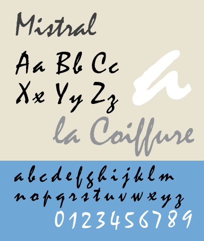

代表字体：Shelley、Mistral

##### Graphic 图形字体

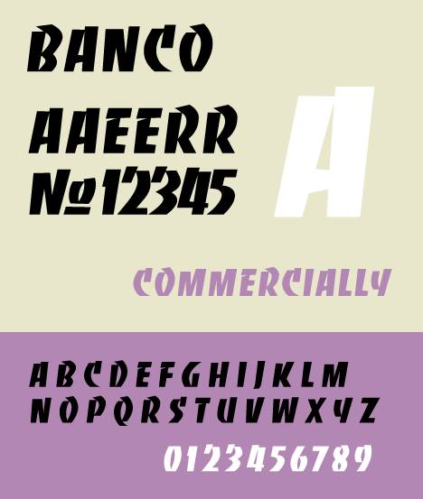

图形字体从本质上来说就是不属于其他类别的展示字体。它可以是用毛笔、钢笔等任意工具来书写或设计。如果这个字体不是无衬线字体或者衬线字体，那它可能就是图形字体。

代表字体：Albertus、Trajan

##### Gaelic

另外还有一种 Gaelic（凯尔特体），主要在爱尔兰使用，通常不会用到。

#### 年代划分

##### 公元前 ~ 四世纪（古罗马）

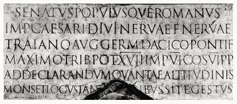

这个时期的代表字体是古罗马帝国的雕刻体（Glyphic ），由于这个年代小写字母还没发明出来，要表现这个时代的氛围最好使用全大写。  

代表字体：Trajan、Stempel、Rusticana、Hercvlanum

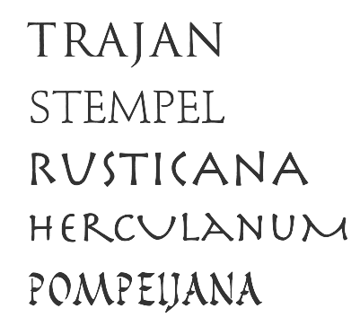

##### 四 ~ 五世纪

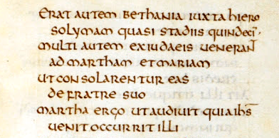

这个年代的代表字体是 Uncial（安色尔） 体，这是主要书写在羊皮纸上的字体。Uncial原意为“一英寸高的文字”，因为当时羊皮纸昂贵，所以当时这种字体高度小字距小，不过当代的数码字体都有了合适的字距。虽  Uncial 体流行于四、五世纪，不过直到八世纪作为书写圣经的主要字体。

代表字体：Omnia、Hammer Unziale789年，

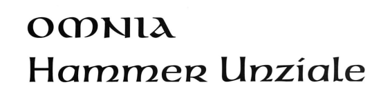

##### 九世纪（中世纪）

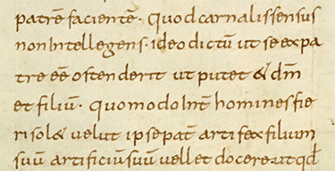

Carolingian（卡洛林）是卡洛林王朝时期兴起的字体，外形上已经与现代的英文字体差不多了，也开始大小写成对使用了。查理曼时期（789年），为保证抄本内容的准确性，把抄写字体统一为Carolingian minuscule （卡洛林小写字体），让其成为了中世纪最具代表性的字体。

代表字体：Carolina、Carolingian minuscule、Carolingiaby William Boyd

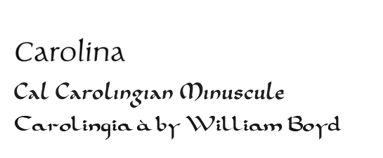

##### 十三 ~ 十四世纪

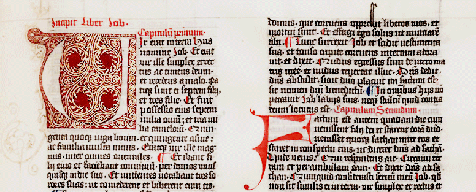

这个时期主要的字体是带有明显平头笔书写特征的 Blackletter （哥特黑体）。

代表字体：Duc De Berry、Notre Dame、Alte Schwabacher、Wihelm Klingspor Gotisch

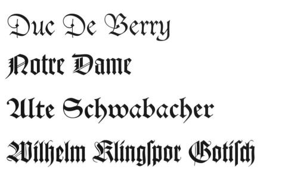

##### 十四 ~ 十五世纪（文艺复兴）

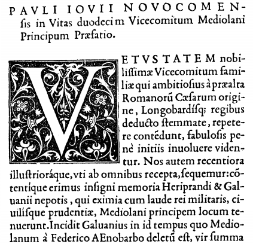

文艺复兴时期是人文主义字体兴起的时期，相比过去的字体 x 高度更低了，而且意大利斜体开始流行。另外文艺复兴时期还有复古的潮流，古罗马时期的字体也备受尊崇。

代表字体：Centaur、Legacy Serif、Adobe Jenson、Poetica

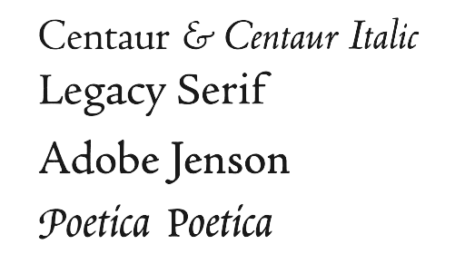

##### 十六 ~ 十七世纪（巴洛克）

巴洛克（Baroque ）时期字体的特点是精致的衬线和笔画粗细对比度较高，也就是 Garalde（加拉德体）的特征。另外这个时期有夸张字花的手写体也很有代表性。

代表字体：Baskerville、Galliard、Janson、Baroque Script

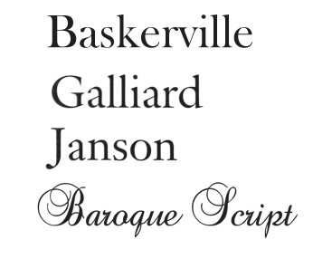

##### 十八世纪（洛可可）

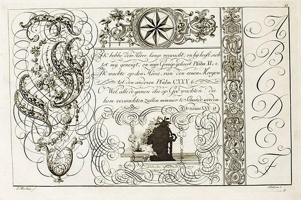

这个时期的洛可可艺术（Rococo）风格盛行，其最具代表性的字体风格就是细腻柔媚、曲线大胆的各种手写体。而得益于印刷技术的提升，字体越来越注重对细线条的表现，Didone（ 迪多尼）风格的字体也由此诞生。

代表字体：Snell Roundhand、Shelley Script、Linoscript、Cochin、Linotype Didot

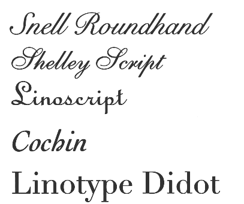

##### 十九世纪（维多利亚）

这个年代的代表字体是报纸、广告中使用的各种夸张的装饰字体。另外无衬线体也在此时开始广泛使用。

代表字体：Thorowgood、Egyptian、Hawthorn、Carlton、Bernhard、Franklin Gothic

##### 二十世纪

二十世纪以来的字体多样性极其丰富，很难说那一种能代表一个年度，不过也有 Helvetica 这样的经典的字体。

部分字体图片出处：《西文字体》

## 中文字体

### 字体分类

#### 历史划分

##### 甲骨文

商周时期的文字形式。

作为字体（字库）目前使用的最广的是“北师大甲骨文体”，另外还有台湾中研院甲骨文体、香港中文大學漢達文庫的 ics3.ttf、日本文字鏡研究會的Mojikyo font 等。

##### 篆书

春秋战国时期的代表文字。是秦始皇统一六国后以小篆为全国的官方字体。

常用字体：汉仪篆书、方正小篆

##### 隶书

汉朝的代表字体。隶书在秦朝就已诞生，不过到汉朝才成为主流，所以也被称为“汉隶”。

隶书笔画粗细变化小、较平直，外形扁平、工整、庄重。讲究“蚕头燕尾”（起笔凝重，结笔轻疾）、“一波三折”（线条运笔变化）。

常用字体：汉仪隶书、华文隶书、蒙纳小隶

##### 草书

草书源于汉代初期。

草书源于书写潦草的隶书，主要分为章草、今草、行草、狂草。草书有大量字形的简化、连笔，较难辨认。并且通常有一定倾斜。

常用字体：方正大草、方正黄草、叶根友疾风草书、白舟草書、 奔行かな

##### 行书

行书源于东汉时期。

行书发展源于隶书，是介于楷书、草书之间的一种字体，分为“行楷”和“行草”，“行草”较“行楷”笔画更加奔放，更近似草书。相比草书，行书只是在隶书的基础上更加突出笔画的变化，笔画间增加了“游丝”，字形构成基本不变，没有草书那样较显著的简化、连笔和倾斜，能很容易的辨认。

常用字体： 华文行楷、汉仪行楷、DF行書体、王汉宗中行楷、方正硬笔行书、金梅草行書、方正字迹-吕建德行楷

##### 魏碑体

魏碑体是北魏的代表字体。

魏碑体阶与隶书与楷书之间，相比隶书，不像隶书那样粗扁，相比楷书笔画粗细变化又更为明显。独特的特征是撇捺会向两侧伸展，收笔前有明显粗顿以及抬峰，使整个字形稳重中又略显飞扬。

很多时候也会把魏碑体当成楷书的一种。

常用字体：华文新魏、方正魏碑、汉仪魏碑  

##### 楷书

魏晋、南北朝时期到唐朝的代表字体。大体可分为早期的“魏碑”和后期的“唐楷”。

楷书始脱于隶书，没有隶书那么粗扁，笔画带有明显毛笔书写痕迹，“横”依然明显的左低右高。

在常见的中文排版中，楷体有类似西文中 Italic（意大利体）的作用，即宋体作为正文，而楷体作为强调、引用字体。

常用字体：华文楷体、方正新楷体、汉仪全唐诗、方正苏新诗柳楷、方正宋刻本秀楷

##### 宋体

明朝的代表字体，起源于宋朝。

宋体虽称为宋体，但在宋朝并不流行，反而在明朝更为常见。由于历史原因在大陆称为宋体，港台和日本则称其为“明朝体”。

宋体始源于宋代的印刷字体，当时以木板作活版印刷，为顺应木的天然纹理，笔画直横平竖直、横细竖粗，起落笔有棱有角（有明显衬线），字形方正。所以也被称为“匠人体”。

由于宋体横细竖粗的特征，很适合竖排，而现代排版通常都是横排，所以现在常用的宋体笔画横竖笔画对比会比传统宋体略低。

另外由于 Windows 中自带的宋体（中易宋体）12~14 pt 大小时显示的是点阵字体，常有人以宋体代称为点阵字，实际 2 者并没关系。

中易宋体 12~14 pt 会显示为点阵字体

常用字体：汉仪书宋、游明朝体、小塚明朝 Pro、ヒラギノ明朝、リュウミン（Ryumin Pro）、方正新书宋、方正雅宋、方正宋体、方正新报宋、造字工房刻宋、蒙纳长宋

##### 仿宋体

可以代表宋朝的字体。

仿宋体是仿制南宋临安陈起陈宅书籍铺出版的书籍的字体，于实际兴盛于明朝但被叫做“宋体”的宋体来说更能代表宋朝的字体风格。在日本直接称其为“宋朝体”。

仿宋实际是有明显楷体风格的印刷体，笔画较直，但不如“宋体”那样完全直来直去，“横”依然带有楷书的左低右高特征，笔画粗细没有宋体的横细竖粗，而是较为平均。

常用字体：方正仿宋、文悦古体仿宋、蒙纳仿宋

##### 清朝体

清朝的代表字体应该说是楷书，随着雕版印刷技术的提升，印刷字体相比宋体有了更多表现笔画的特征。清朝字体的一个特征是中宫普遍较紧凑，不过和其他楷体来说没有决定性差别，所以“清朝体”的称呼在国内并不多见，反而在日本比较常见。

清朝体有代表性的字体有仿照扬州诗局刊行的《全唐詩》而作的全唐诗字体，还有清朝官刻体，另外还有前些年在平面设计领域用到烂的康熙字典体，不过康熙字典体的流行和清朝体关系不大，主要是因为其扫描古籍录入的斑驳字迹。

常用字体：康熙字典体、汉仪全唐诗、弘道軒清朝体、 欣喜堂清朝官刻体、 DF古籍木蘭A

##### 黑体

二十世纪中期以来的代表字体。

黑体即是无衬线的中文字体，没有装饰用的衬线，简化笔画特征，笔画粗细差别极小。也被称为等线体、哥特体（日本叫法）。最早是日本依据西文无衬线体而作的中文无衬线体，后传入中国（吴竹体），最早只是作为粗大的标题字体，所以被称之为黑体。

黑体是目前屏幕显示的首选字体。

常用字体：思源黑体、中易黑体、方正兰亭黑、冬青黑体、方正等线、方正幼线、 方正纤黑、汉仪旗黑、小塚ゴシック、游ゴシック 、信黑體、微軟正黑體（蒙纳）、微软雅黑体（方正）、方正悠黑简、メイリオ、苹方

#### 风格字体分类

上面是中文字体的主要划分方式，有些字体在其基础上又独特的风格，自成一体。

##### 综艺体

综艺体是黑体的变种，通常用在广告、标题上。字面极大、追求尽量将空间充满。

常用字体：創挙蘭、方正综艺、汉仪综艺、造字工房力黑、造字工房版黑

##### 圆体

圆体也是黑体的变种，最早在秀英舎的『活版見本帳』（1914年）中出现，早期流行的圆体是石井丸ゴシック体（1956）。

圆体的特征在于笔划的末端与转角呈圆弧状。因此圆体不但具有黑体清晰易读的优点，而且也予人较柔和的感觉。国内更加常见的幼圆体是圆体的一种，是笔画更加细的圆体。

常用字体：蒙纳幼圆、DF丸ゴシック体（華康圆体）、あいこフォント、方正圆体、造字工房悦圆

##### 宋黑体

宋黑体是介于宋体和黑体之间，带类似宋体的衬线和黑体笔画特征的字体，和普通的的粗笔画宋体的差别是：粗宋体会有明显的“横细竖粗”的笔画粗细对比，而宋黑体没有。

常用字体：方正宋黑、锐字云字库宋黑体

##### 圆宋

圆宋是基于宋体的变体，相当于圆体之于黑体。在日本被称为“丸明朝体”。相对于圆体，其有宋体的特征：笔画有“横细竖粗”的粗细对比、带有衬线。而相对于宋体其衬线圆滑，虽有宋体的笔画特征但把棱角都做了圆化，字体结构方正，但细节圆润，有马克笔书写的感觉。

常用字体：丸明オールド、汉仪润圆、方正秉楠圆宋

##### 姚体

姚体通常认为是原中华书局聚珍部主任姚竹天于民国时期设计，上海解放日报社高级技工姚志良在二十世纪 50年代改刻的字体。也有说法是姚体跟姚竹天的关系是误传。姚体兴盛于中国大陆的 60、70年代，被用作报纸标题、宣称标语和招牌的字体。至今仍能在很多城市的车站中见到姚体的站名。

姚体是结合了宋体和黑体特征的字体，一般归类为黑体的变种。其特征是像宋体一样的直线笔画和“横细竖粗”的粗细对比，但没有宋体的衬线，但有明显的喇叭口和笔画出头作为装饰，最明显的莫过于竖长的字形和纵向的笔画走向。

常用字体：方正姚体、蒙纳小姚

##### 金文体

这个金文体并不是指中国古代的金文，而是一个在日本流行的字体，实际上类似于篆书体，其特点是垂直延伸的字形，并且字的下半部分看起被拉长，有类似篆书的笔画曲线。这种字体看起来既有有古典气息，又有现代、神秘的感觉，非常多的用在日本科幻、魔法风格的小说、漫画、动画产品产品的标题和海报中。

常用字体：华康金文体（DFP金文体）、DFP金文体うめ

## 其他字体

### 绘文字 emoji

绘文字（emoji）最早是在 1998 年左右出现在日本 NTT DoCoMo 公司的 i-mode 手机中的功能。

最早的 au 絵文字

把文字和图形穿插日本自古就有：日本江户时代的判じ絵（画迷）

绘文字（emoji）是以一个字符表示一个图形的方式表达信息，每个绘文字（emoji）其本质是一个特殊字符，2010年10月发布的 Unicode 6.0中首次把绘文字（emoji）编入其中，往后每次 Unicode更新几乎都会增加新的绘文字（emoji）。每个绘文字（emoji）字符虽然都有指定的意义，但是实际外观取决于使用的字体，而各个平台使用的字体并不相同：

各个平台对 的支持情况可以参考： Can I Emoji，各个平台上绘文字（emoji）实际外观可以查看：emojipedia。要注意的是绘文字（emoji）和顔文字（かおもじ、Emoticon、表情符号）是指定不同的东西，顔文字是指如： :-)  _(:3 」∠)_ ^_^ 这样用普通字符组成特定外形来表达表情或动作的文本。其使用的是普通字符，而不是特殊的字符，所以顔文字有更好的通用性，是 ASCII艺术的一种形式。

### Dingbat  字体与 Icon-font

虽然现在流行的绘文字（emoji）形式的图形字符起源于日本的手机，不过把图形用在字符中，早在数字时代之的印刷业就有了，活字时代就有用来装饰文本的fleuron（花边） ，后来也出现了 Dingbats （装饰符号、杂锦字体），其中最有名和使用最广的是 1971 年的 Zapf Dingbats ，在Zapf Dingbats 中主要还是用在传统印刷品中的标志或装饰性符号，不过小圆脸表情☻已经出现了。而 1990 年随 Windows 3.1 发布的Wingdings 和后来发布的其 web 版本 Webdings （网页核心字体之一）有了更多现代的图形比如心型和眼睛 。

### Zapf Dingbats （部分）

### Wingdings

Dingbats 字体也被称为 Pi 字体，一般名字中带 Pi 的就是 Dingbats  字体。而当今流行的 icon-font技术就是他们的继承者，例如网页中常用的 Font Awesome、iconfont.cn 都是一种 Dingbats，这种技术可以方便的在网页或者文本构成的用户界面中加入图形标志，而且由于是字体，所以这是当前（支持 Svg 等矢量图形显示技术的地方还不多）最方便的显示矢量图形的方式。

### icon font

## 文本编码与 Unicode

对于了解字体来说文本编码标准是不得不认识的，尤其是对要制作或者修改字体的人来说。字体的一个字符对应一个编码（码点：codepoint），而编码对应字符集（Character Set）里的一个“字”，字体的字符通过字符集与“字”相连。

文本编码的流程

### 字符集与编码方式

像通常说的 Unicode、GBK、BIG5、Shift_JIS这些都是字符集，其主要作用是为字符集中的每一个“字”分配一个编码（码点：codepoint），要注意的有两点：

字符集里的每一个编码对应的是一个“字”而不是“字形”，也就是说一个“字”在不同的地区或标准中可能有不同的“字形”，但字符集中只能对其分配一个编码（除非相差过大，比如简化字），要显示其不同的“字形”要通过使用为不同地区或标准设计的字体来实现。

同字异形。左边是简体中文的，右边是日文

字符集是为字分配一个编码（码点），而这个字存储到文件要再通过特定编码方式（Encoding）来变成实际的二进制数据，这样做的意义在于能够使用不定长（为了节省空间）的编码。

举一个十进制的例子来说：有两个字，编码分别是 1、15 要存储的话，最简单的方式是存储为定长数据： 01、15。之所以要定长是为了再次读取时不会发生混淆，比如如果直接不定长存储的话，读取 10 字符时，读到第一位 1 就以为读到是 1 了。1, 15 存储为 110再读取就变成了 1, 1, 5 了。而要定长存储的话，就要浪费很多空间，所以要再经过一次编码，比如这个例子里可以用把 1 作为标志位,读到 1 就表明这是2 位编码的字，要再度一位。这样把两个字编码为 2、15，这样就能直接存储为 215  了，这比定长的  0115 要节省空间。这个过程就是编码方式（Encoding）来决定的。实际上的 Encoding 是根据二进制来处理的，上面的例子只是便于理解。

过去的字符集往往与编码方式相对应，比如 GB2312 就只使用 EUC-CN，这让我们可以忽略它的编码方式，或者说把编码方式看成是字符集的一部分，统称为编码标准，比如只说某个文本是用 GB2312文本编码。而后来出现了可能会又不同的编码方式的字符集，Unicode 字符集就有 UTF-8、UTF-16 LE 、UTF-16 BE等编码方式，这时就要区分字符集和编码方式了。用  UTF-8、UTF-16 等编码方式存储同一个字符，它们的数据可能是不同的，但是这些数据都唯一对应于Unicode 中的一个编码（码点：codepoint）。这本来容易理解，不过 Windows 下用 Unicode 来称呼 UTF-16 LE（应该是由于UTF-16 LE 是 Windows 的内部 Unicode 编码所以就这么称呼）这就造成了很多误解，让人以为 UTF-8 是字符集。

Windows 用 Unicode 直接代指 UTF-16 LE

### 代码页

代码页（codepage）是操作系统中管理各种编码标准的方法，每个代码页对应一种字符集和编码方式，比如 Unicode-UTF-8 的代码页是65001，GBK 是的代码页是 936 。

代码页是实际编码标准到应用程序间的中间层，好处是通过改变代码页可以简单的切换系统默认支持的编码标准，而且便于更新编码标准，比如 Winodows 3.1时代码页 936 还是对应的 GB 2312，而 winodws 95 时已经代码页 936 就更新到对应 GBK了，这样应用程序不需要修改就能支持新的编码标准。

Windows 中把当前系统默认代码页称为 ANSI 。

#### GB2312、GBK 、BIG5、Shift_JIS

GB 2312 是 1980 年制定的编码标准，GBK 是对 GB 2312 的扩展（K）增加了一些字符并保持向下兼容。

BIG5 是台湾制定的编码标准，由于台湾使用繁体字，所以这是繁体地区最常用的文本编码标准。

Shift_JIS 是日本最常用的文本编码标准。

目前中国大陆的标准是国家编码标准是 GB18030。

#### Unicode

上面的 GBK、Shift_JIS 等传统编码标准都只为一个地区使用所制定的，而 Unicode是目标为所有国家、地区、语言的字编入同一个字符集，所以其被称为统一码、万国码。

Unicode 使用平面（Plane）来安排编码空间，每个平面分 为 256 行，256 列，即 65536 个字。共有 17 个平面。所以 Unicode共可以容纳约  110 万字（1,114,112），最大的编码是 10FFFF。目前 Unicode 8.0 已经所使用了 12 万字（120,737）。

Unicode 是个还在不断不断更新扩充的标准。

Unicode 的平面分为基本平面 BMP （Basic Multilingual Plane）和补充平面（也有翻译成辅助平面）SMP（Supplementary Multilingual Plane），只有第一个平面是基本平面，也就是 Plane 0，剩下的16 个平面都是补充平面。

如上面所说 Unicode 有多种编码（Encoding）方式，UTF-32、UTF-16 LE、UTF-16 BE、UTF-8 等，最常用的是 UTF-8，其基本平面的字符（主要是 ASCII 字符）只要使用 1 个字节存储，而中文通常是占 3 个字节，少数要占 4 个字节。而 UTF-16编码第一平面的字符也要占 2 个字节，中文占 2 到 4 个字节。一般来说存储中文使用 UTF-16 要比 UTF – 8 占有更少的空间。UTF – 16BE 和 LE 有的只是字节序的差别，BE 是大端在前，LE 是小端在前。

此外历史上还有 UCS-2、UTF7 等的编码方式，至今已经很少使用了。由于历史原因 JavaScript 内部使用的是 UCS-2 。UCS-2 可看成是UTF-16 的字集。在没有补充平面（SMP）字符前，UTF-16与 UCS-2 所指的是同一的意思。但当引入辅助平面字符后，就称为UTF-16了。现在若有软件声称自己支持 UCS-2 编码，那其实是暗指它不能支持在 UTF-16 中超过 2 个字节的字符。对于小于0x10000的 UCS码，UTF-16 编码就等于 UCS 码。JavaScript 在 ECMAScript 6 之前就因为这个原因无法处理大于 2 个字节字符。

#### BOM

BOM 是字节顺序标记（byte-order mark），通常用在 UTF-16 中标识文本的字节顺序，即区分 UTF-16 LE 和  UTF-16BE。后来在 Windows 中被用作区分文本编码方式的标志：

​由于除了  Windows 其他系统对 BOM 的支持程度不一，所以在制作  Web 用的文本时，不应该使用 BOM。

#### CJK

CJK 是中日韩统一表意文字（CJK Unified Ideographs），目的是要把分别来自中文、日文、韩文、越南文、壮文中，起源相同、本义相同、形状一样或稍异的表意文字，赋予其在 UISO 10646及 Unicode 标准中相同编码。

## 字体格式

### TrueType

TrueType 是最常见的字体格式，后缀名为“.ttf”的字体就是 TrueType 格式。TrueType 字体的轮廓使用的是二次贝塞尔曲线，

### OpenType

OpenType 可以说是 TrueType 的扩展， OpenType 有和 TrueType 一样的封装格式（SFNT），可以使用 TrueType的二次贝塞尔曲线的字体轮廓，也可以使用对曲线表现效果更好的三次贝塞尔曲线 CFF（PostScript Type 2） 。

### WOFF、EOT

WOFF 是 W3C 标准推荐的网页字体格式，其本质上是对 TrueType、OpenType 格式的压缩封装。EOT 是微软推出的网页字体格式，本质上是对OpenType 格式精简再封装，虽然 EOT 不是  W3C 标准，但是由于  EOT 出现的很早（IE 4 就支持了），为了兼容性（尤其是对IE），EOT 也是常见的网页字体·格式。

## 格式转换

由于 TrueType 是二次贝塞尔曲线，OpenType 一般是三次贝塞尔曲线，从三次转换到二次的过程不会是无损的，所以很可能产生偏差。而且很多TrueType  字体的 UMP （元素/单位）设置的很低，所以从现状来看，TrueType 字体的质量往往要低于 OpenType 字体。

而从 TrueType 转换到 OpenType 格式是无损的，因为 OpenType 格式甚至可以不用把二次贝塞尔曲线转换成三次贝塞尔曲线，而是直接包含TrueType 的曲线。

三次曲线转二次曲线

UPM 值低（左）与 UPM 值高（高）

**抗锯齿**

****

字体的抗锯齿通常是用次像素（亚像素）对字体像素做成调整，让曲线在人眼中看起来更加平滑。

通常抗锯齿渲染的次像素分为两种，灰度的次像素和彩色的次像素。灰度的次像素是更为简单和基础的抗锯齿方法，而彩色的次像素是根据 LCD显示器像素点的构成而设计的，目的是不仅仅控制图像的最小单位：像素，还要控制组成像素的 RGB子像素，如下图显示，灰度次像素只能降低整个像素的亮度，而彩色的次像素，黄色能够关闭蓝色的子像素的显示，青色能关闭红色像素显示，这样就能控制子像素了：

微软的 ClearType 是典型的使用彩色次像素抗锯齿的技术，OS X 上也有类似的技术。彩色的次像素能够控制比灰度次像素更高实际显示精度，这在屏幕单位尺寸分辨率低的时候格外有效，而屏幕单位尺寸分辨率较高的场合，效果相对于灰度次像素优势就不大了，比如手机端，彩色次像素在手机上不仅会花更多性能和电量，在屏幕旋转时还需要重新计算，而且手机屏幕单位尺寸分辨率较高，所以目前手机上 Android 和 iOS 等系统都只是使用灰度次像素，只有曾经 Windows phone 7 里使用过 ClearType 。

彩色次像素的效果是完全依赖特定屏幕的（根据屏幕子像素排列顺序），所以在 PhotoShop 这样的绘图工具中都是使用的灰度次像素而不是彩色次像素，因为制作出的图片可能会在各种屏幕中展示，使用彩色次像素在一些屏幕中效果会很好，而另外的则会很差。所以使用彩色次像素的都在系统层，而且会根据检测连接显示器的型号或者用户设置来保障效果：

Windows 显示设置里的 ClearType 文本设置。实际上就是要你选择你屏幕的子像素排列顺序

## Windows 、OS X 字体渲染差异

Windows 和 OS X  的字体渲染差异一直是富有争议，Windows  和 OS X 的字体渲染完全是从两种不同的偏好出发的，  Windows的字体渲染追求在屏幕上清晰的像素表现，而 OS X  追求的是尽可能再现字体本来的外观，这两者的差别在于  Windows 下显示字体很大程度依赖hinting（微调）来进行像素对齐，力求点对点显示即使是要改变字体的外形。而  OS X 不依赖hinting，即使字体显示到像素不是点对点而造成模糊，也不愿意改变字体外形。

可以明显看到 Windows 下示例字体像素对齐更清晰、锐利但是代价是改变了字体笔画，字体笔画变细了，p 字字碗上提的特征也没有了。OS X下示例字体由于没有强制对齐像素所以边缘较模糊，但是保留了字体的外形和笔画特点。

应该说 OS X 的字体渲染策略在高分辨率的屏幕下效果要比 Windows 更好，不过在较低低分辨率下， Windows的字体渲染策略也有其优势，能够在低分辨率下提高字体的易辨识度。不过也有很多问题，比如由于过于追求像素的对齐，很可能产生破坏性的字形改变：

Windows 下字体渲染的问题，有的字体的 m 的像素对齐造成的字形改变过大

由于现在 Mac 都是高分屏，所以字体渲染比起大多都是低分屏的 Windows  要好的多，不过要是与高分屏的 Windows 相比，实际优势不是特别大。

## 系统默认字体

### 桌面端

### 网页端

微软的网页核心（Web core fonts）字体，是微软在1996年所发起的一个计划，定义了一套基础字体集以供网页显示之用，这些字体是 Windows中会预置的字体，而且微软提供免费的下载。这些字体直接使用在网页中有很好的通用性。不过这并不是 W3C的标准，所以也不能保证在不同系统都可用，具体各种字体在不同操作系统中的支持情况可以参考这个列表：fontmatrix

### 移动端

## 排版与标点

### 点号

点号作为语句的分隔符，表示语句的停顿或结束。

### 标号

标号作为语句的标识符， 起标示语句性质的作用。

简体中文使双引号 “” 和单引号 ‘’ ，繁体中文（台湾）和日文中相对应的是『』 「」  。简体中文中有时也会使用 『』「」，与繁体的区别是，简体中文里嵌套的方法是先双后单：『「」』   在繁体（台湾）和日文中是先单后双： 「『』」 。在日文中『』还有书名号的作用（日文也有《》二重山括弧，但没有固定用途，通常是标注汉字的假名），另外繁体（台湾）中除了乙类书名号（《》），甲类书名号是  ﹏﹏形式的下划线。

## 西文引号

引号常见的有  2 种，直引号 "" 和弯引号 “ ”

前者是直引号，是打印机时代的产物（可以用一个键表示引号），通常在传统印刷领域，使用直引号 ""会被当做是业余者的行为。不过在网络时代，直引号的广泛使用，让人们已经习惯了直引号，甚至由于编程的代码使用的都是直引号，在要表现 IT技术的场合往往还会特意直引号。

直引号用在传统排版中被称为 Dumb （呆瓜 ）冒号

另外要注意的是引号的方向，在中文和英文中引号的方向都是朝内的：“”，而德文则是朝外的：„Danish“ ，另外法文引号和中文书名号相似： «
français » ，德文中也有使用法式引号的，不过方向相反：»Danish«

## 间隔号混淆问题

间隔号很容易混淆，简体中文中的间隔号与为 · ，与英文中的一样如：道格拉斯·理查·郝夫斯台特。另外还有全角的间隔号： ． 如《禮記．禮運》。在台湾的标准里所有间隔号都应该是全角的，而中国大陆的简体中文里两种都可用，而且常常使用的是与英文一样的半角形式。还有一个是日文中的“中黑”： ・，其用法是用作分隔符，用在罗列词是整体的情况下，如「北京・台北間のホットライン電話」

这几个间隔号混淆的问题在于验证系统，比如验证用户名是否相同，很可能不同来源的名称其实指的是一个用户，只是用不同的系统、输入法输下输入了不同的间隔符，由于中国少数民族众多，名字中带间隔符的不在少数，所以这是个值的注意的问题。

## 斜体

斜体在西文中是其强调的作用，通常表示要强调、引用的词，还有书名号的作用。由于大部分情况下中文字体都只能用仿斜体，效果很差，所以尽量避免对中文使用斜体。

## 中西混排

### 中西文间隔

中文中出现西文，中文和西文间应该要有一定间隔，排版和文字处理工具一般都会自动在中西文间留有间隔，不过在更多情况下，需要手动的输入空格来把中、西文隔开。

### 标点规则

在中西混排中，由于正文是中文，原则上应该使用中文标点，遵守中文标点的习惯用法。出现英文原句时，可以使用英文标点，再用中文引号标识出来。

### 段首空格

按传统的习惯，段首应该留两个空格，作为段与段之间的分隔标志，不过现在数字排版时代，已经使用了段与段之间的间距很大，已经可以作为段与段之间的分隔标志了，所以不需要段首空格了。

  

  
