 
<!--BEGIN_DATA
{
    "create_date": "2020-12-28 12:38", 
    "modify_date": "2020-12-28 12:38", 
    "is_top": "0", 
    "summary": "常见的实时音视频QoS的算法简介<br/>网络QoS的平衡之道——音视频弱网对抗策略介绍", 
    "tags": "WebRTC", 
    "file_name": "常见的实时音视频QoS的算法简介.md"
}
END_DATA-->

#### <p>原文出处：<a href='https://mp.weixin.qq.com/s/DA6u0F953bg-nQn0tSOIAw' target='blank'>常见的实时音视频QoS的算法简介（上）</a></p>

实时音视频通信通常是基于UDP/IP协议传输的，UDP网络是不可靠、瞬息万变的，网络状态一般来说都会伴随着丢包、抖动、拥塞等状况。如何保证实时音视频通信流畅不卡顿、低时延是实时音视频QoS算法研究的重点。基于UDP传输的实时音视频QoS算法常用的方法有：**码率自适应、FEC、PLC、丢包重传、平滑发送、jitter buffer、编码码率恒定等**。本期主要介绍码率自适应和FEC这两种方法，其他的PLC、丢包重传、平滑发送、jitterbuffer、编码码率恒定等方法将在下期介绍。

### 一、码率自适应

码率自适应是音视频传输算法中非常重要的一个环节，也是最复杂的一个环节，它在缓解网络拥堵、减小网络延迟、平滑数据传输等质量保证方面发挥重要作用。码率自适应是建立在网络拥塞估计的基础，要实现码率自适应算法，必须首先实现拥塞估计算法，常见的拥塞控制算法：Google出gcc(Google Congestion Contro)算法。

GCC算法分两部分：发送端基于丢包率的码率控制和接收端基于延迟的码率控制，如图1所示。

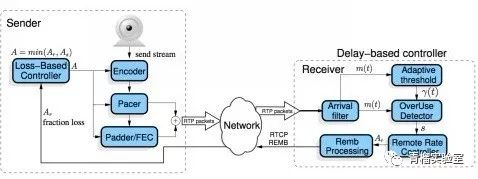

图1 GCC算法整体结构

基于丢包率的码率控制运行在发送端，依靠RTCP RR报文进行工作。发送端收到来自接收端的RTCP RR报文，根据其Report Block中携带的丢包率信息，动态调整发送端码率As。基于延迟的码率控制运行在接收端，根据数据包到达的时间延迟，通过到达时间滤波器，估算出网络延迟m(t)，然后经过过载检测器判断当前网络的拥塞状况，最后在码率控制器根据规则计算出远端估计最大码率Ar。得到Ar之后，通过RTCPREMB报文返回发送端。发送端综合As、Ar和预配置的上下限，计算出最终的目标码率A，该码率会作用到Encoder、RTP和PacedSender等模块，控制发送端的码率。

#### 1、基于丢包率控制发送码率

其基本思想是：丢包率反映网络拥塞状况。如果丢包率很小或者为0，说明网络状况良好，在不超过预设最大码率的情况下，可以增大发送端码率；反之如果丢包率变大，说明网络状况变差，此时应减少发送端码率。在其它情况下，发送端码率保持不变。根据图2公式计算发送端码率：当丢包率大于0.1时，说明网络发生拥塞，此时降低发送端码率；当丢包率小于0.02时，说明网络状况良好，此时增大发送端码率；其他情况下，发送端码率保持不变。

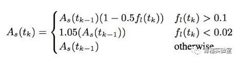

图2 GCC基于丢包率的码率计算公式  

#### 2、接收端基于延迟的码率控制

GCC算法在接收端基于数据包到达延迟估计发送码率Ar，然后通过RTCP REMB报文反馈到发送端，发送端把Ar作为最终目标码率的上限值。其基本思想是：RTP数据包的到达时间延迟m(i)反映网络拥塞状况。当延迟很小时，说明网络拥塞不严重，可以适当增大目标码率；当延迟变大时，说明网络拥塞变严重，需要减小目标码率；当延迟维持在一个低水平时，目标码率维持不变。基于延时的拥塞控制由三个主要模块组成：到达时间滤波器，过载检查器和速率控制器；除此之外还有过载阈值自适应模块和REMB报文生成模块。

##### 2.1 到达时间滤波器

该模块用以计算相邻相邻两个数据包组的网络排队延迟m(i)。数据包组定义为一段时间内连续发送的数据包的集合。一系列数据包短时间里连续发送，这段时间称为突发时间，建议突发时间为5ms。不建议在突发时间内的包间隔时间做度量，而是把它们做为一组来测量。通过相邻两个数据包组的发送时间和到达时间，计算得到组间延迟d(i)。

组间延迟示意图及计算公式如图3所示：

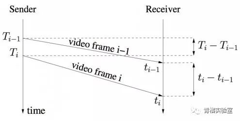

图3 组间延迟示意图  

T(i)是第i个数据包组中第一个数据包的发送时间，t(i)是第i个数据包组中最后一个数据包的到达时间。帧间延迟通过如下公式计算得到：

```
d(i) = t(i) –t(i-1) – (T(i) – T(i-1))
```

公式1.1是d(i)的观测方程。另一方面，d(i)也可由如下状态方程得到：

```
d(i) = dL(i)/C(i) +w(i)

d(i) = dL(i)/C(i) +m(i) + v(i)
```

其中dL(i)表示相邻两帧的长度差，C(i)表示网络信道容量，m(i)表示网络排队延迟，v(i)表示零均值噪声。m(i)即是我们要求得的网络排队延迟。

##### 2.2 过载检测器(Over-use Detector)

该模块以到达时间滤波器计算得到的网络排队延迟m(i)为输入，结合当前阈值gamma_1，判断当前网络是否过载。判断算法如图4所示。

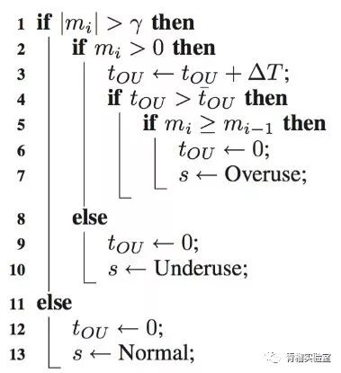

图4 过载检测器伪代码  

算法基于当前网络排队延迟m(i)和当前阈值gamma_1判断当前网络拥塞状况[2]：当m(i) > gamma_1时，算法计算处于当前状态的持续时间t(ou) =t(ou) + delta(t)，如果t(ou)大于设定阈值gamma_2(实际计算中设置为10ms)，并且m(i) > m(i-1)，则发出网络过载信号Overuse，同时重置t(ou)。如果m(i)小于m(i-1)，即使高于阀值gamma_1也不需要发出过载信号。当m(i) < -gamma_1时，算法认为当前网络处于空闲状态，发出网络低载信号Underuse。当 – gamma_1 <= m(i) <= gamma_1时，算法认为当前网络使用率适中，发出保持信号Hold。

需要注意的是，阀值gamma_1对算法的影响很大，并且阈值gamma_1是自适应性的。如果其是静态值，会带来一系列问题。所以gamma_1需要动态调整来达到良好的表现。这就是图1中的Adaptive threshould模块。阈值gamma_1动态更新的公式如下：

```
gamma_1(i) =gamma_1(i-1) + (t(i)-t(i-1)) * K(i) * (|m(i)|-gamma_1(i-1))
```

当`|m(i)|>gamma_1(i-1)`时增加`gamma_1(i)`，反之减小`gamma_1(i)`，而当`|m(i)|– gamma_1(i) >15`，建议`gamma_1(i)`不更新。K(i)为更新系数，当`|m(i)|<gamma_1(i-1)时K(i) = K_d`，否则`K(i) = K_u`。同时建议`gamma_1(i)`控制在[6,600]区间。太小的值会导致探测器过于敏感。建议增加系数要大于减少系数`K_u > K_d`。文献[2]给出的建议值如下：

```
gamma_1(0) = 12.5 ms

gamma_2  = 10 ms

K_u = 0.01

K_d = 0.00018
```

##### 2.3速率控制器(RemoteRate Controller)

该模块以过载检测器给出的当前网络状态s为输入，首先根据图5所示的有限状态判断当前码率的变化趋势，然后根据图6所示的公式计算目标码率Ar。

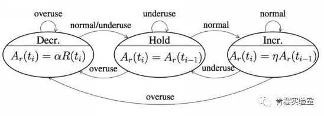

图5 目标码率Ar变化趋势有限状态机  

当前网络过载时，目标码率处于Decrease状态；当前网络低载时，目标码率处于Hold状态；当网络正常时，处于Decrease状态时迁移到Hold状态，处于Hold/Increase状态时都迁移到Increase状态。当判断出码率变化趋势后，根据图6所示公式进行计算目标码率。

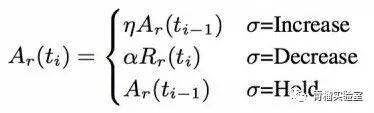

图6 目标码率Ar计算公式  

当码率变化趋势为Increase时，当前码率为上次码率乘上系数1.05；当码率变化趋势为Decrease，当前码率为过去500ms内的最大接收码率乘上系数0.85。当码率变化趋势为Hold时，当前码率保持不变。目标码率Ar计算得到之后，下一步把Ar封装到REMB报文中发送回发送端。

#### 3、发送端目标码率的确定

发送端最终目标码率的确定结合了基于丢包率计算得到的码率As和基于延迟计算得到的码率Ar。此外，在实际实现中还会配置目标码率的上限值和下限值。综合以上因素，最终目标码率确定如下：

```cpp
target_bitrate = max( min( min(As, Ar),Amax), Amin)
```

目标码率确定之后，分别设置到Encoder模块和PacedSender模块。  
  
### 二、FEC

引入前向纠错（FEC）机制是解决实时音视频通话业务丢包的一个很好的机制，FEC的原理就是在发送端发送数据包时插入冗余包，这样即使接收端收到的数据有所丢包（丢包数不大于冗余包时）也是能还原出所有的数据包的。

FEC可以分为两大类：基于信源和基于信道。信源FEC是，包可以多发几遍，对于音频来说一秒可以发50个包，信源FEC就发两倍100个包，同样大小多发一遍，来实现抗丢包。基于信道的抗丢包，比如当前的丢包率25%，我们可以加50%的抗丢包。那么原始有4个包，经过处理生成6个包，这6个包到达任意的4个包，都可以实现准确解码。

FEC添加冗余包首先要进行分组，然后再添加冗余包，例如把4个包分成一组，每一组添加一个冗余包就是一阶冗余，添加两个冗余包就是二阶冗余，依次类推下去，下面详细介绍一下一阶冗余是怎么添加和还原的。

所谓一阶冗余算法，就是每n个数据插入一个冗余数据（也即FEC编码组长度为n+1）；这n个数据和其对应的冗余数据构成一组数据，这组数据中丢掉任何一个数据都可以通过另外n个数据恢复出来。假设原始数据为D1、D2、D3、D4，则发送的数据就是D1、D2、D3、D4、C1。下图示发送端编码算法（n=4的场景）：

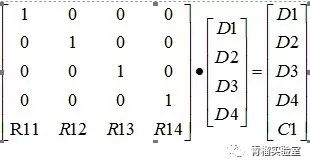

如上图示，左边矩阵为编码矩阵，就是在单位矩阵下面插入一行冗余算法参数，右边的C1为计算出来的冗余数据。  

C1 =R11*D1+R12*D2+R13*D3+R14*D4

令R1i=1，i=1,2,...,n，则上式子可以简化为：

C1=D1+D2+D3+D4

采用伽罗华有限域(Galois field :)运算，则可将加减法运算化为异或运算，因此C1的计算公式简化为：

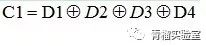

接收端解码，如果接收端收到的某组数据丢失了一个，则可以通过如下公式推导出恢复丢失数据的公式；下图我们假设丢失的数据为D2，n为4，则D2的恢复矩阵运算为：

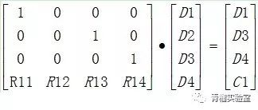

令R1i=1，且采用伽罗华有限域运算，则上式子可以简化为：

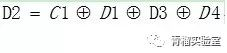

进一步推导得到：

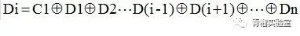

### 参考文献：

* 文献[1]:WebRTC基于GCC的拥塞控制
* 文献[2]:Understanding the Dynamic Behaviour of the Google Congestion Control for RTCWeb.

<hr>

#### <p>原文出处：<a href='https://mp.weixin.qq.com/s/oKvA0dsBhbSXZ2DbLT3I0Q' target='blank'>常见的实时音视频QoS的算法简介（下）</a></p>

实时音视频通讯系统QoS是各种算法的综合使用和平衡，是在视频清晰度、音视频流畅性和音视频时延之间根据网络情况做一个平衡，是需要整个系统各个环节一起配合，从发送端的音视频采集、编码、发送到接收端数据接收、解码、播放显示各个环节一起配合选择最适合实时音视频系统的算法和方法。**码率自适应**在网络不好的情况下通过降低视频分辨率和清晰度来保证音视频的流畅；**丢包重传、平滑发送、Jitterbuffer**通过增加网络时延来对抗网络丢包和抖动等情况保证视频流畅性；**FEC**又是通过数据冗余增大码率来对抗网络丢包。其中**码率自适应、FEC、丢包重传**是双端算法（即发送端和接收端一起配合使用），**平滑发送**和**恒定码率编码**是发端算法，**JitterBufferr**是接收端算法。

上一篇[常见的实时音视频QoS的算法简介（上）](http://mp.weixin.qq.com/s?__biz=MzUyMzk4OTYzMA==&mid=2247484147&idx=1&sn=7282b28fa2c56250d8381a1bc79ca287&chksm=fa3565e2cd42ecf469c6b621699ce83c9de6eaedc98037747356c2f7ab8beace642a6f708a59&scene=21#wechat_redirect)主要介绍码率自适应算法和FEC，这篇文章将介绍另外几种实时音视频QoS算法：**JitterBuffer、丢包重传、平滑发送、恒定码率编码**。

### 一、JitterBuffer

JitterBuffer:抖动缓冲器,缓冲一定是以延时作为代价的，延时越大，对抖动的过滤效果越好。一个优秀的视频jitterbuffer，不仅要能够对丢包、乱序、延时到达等异常情况做处理，而且还要能够让音视频平稳的播放，尽可能的避免出现明显的视频加速播放和缓慢播放,音频丢音和卡顿等

主流的实时音视频框架基本都会实现jitterbuffer功能，诸如webrtc、doubango等。webrtc的jitterbuffer相当优秀，是一种自适应的jitterBuffer,Buffer的大小会根据网络情况进行自动调节。按照功能分类的话，可以分为jitter和buffer。buffer主要对丢包、乱序、延时到达等异常情况做处理，还会和丢包重传、FEC等QOS相互配合。jitter主要根据当前帧的大小和延时评估出jitter delay，再结合decode delay、render delay以及音视频同步延时，得到render time，来控制平稳的渲染视频帧。下面将分别对jitter和buffer做介绍。

#### （1）Buffer

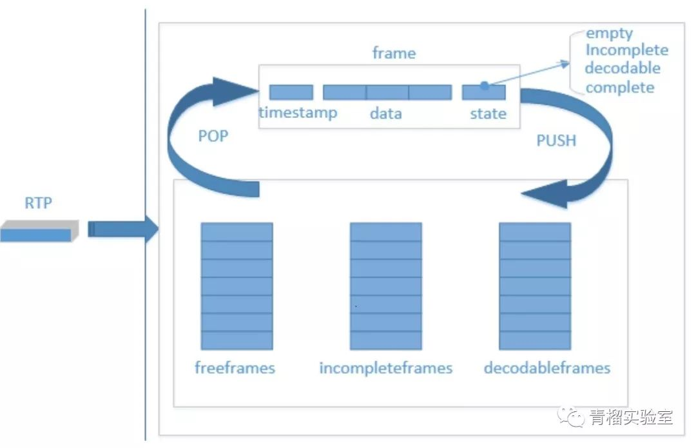

图 1buffer的运行机制  

buffer对接收到的rtp包的处理流程如下：

第一次接收到一个视频包，从freeframes队列中弹出一个空frame块，用来放置这个包。

之后每次接收到一个RTP包，根据时间戳在incompleteframes和decodableframes中寻找，看是否已经接收到过相同时间戳的包，如果找到，则弹出该frame块，否则，从freeframes弹出一个空frame。

根据包的序列号，找到应该插入frame的位置，并更新state。其中state有empty、incomplete、decodable和complete，empty为没有数据的状态，incomplete为至少有一个包的状态，decodable为可解码状态，complete为这一帧所有数据都已经到齐。decodable会根据decode_error_mode 有不同的规则，QOS的不同策略会设置不同的decode_error_mode
，包含kNoErrors、kSelectiveErrors以及kWithErrors。decode_error_mode就决定了解码线程从buffer中取出来的帧是否包含错误，即当前帧是否有丢包。

根据不同的state将frame帧 push回到队列中去。其中state为incomplete时，push到incompleteframes队列，decodable和complete状态的frame，push回到decodableframes队列中。

freeframes队列有初始size，freeframes队列为空时，会增加队列size，但有最大值。也会定期从incompleteframes和decodable队列中清除一些过时的frame，push到freeframes队列。

解码线程取出frame,解码完成之后，push回freeframes队列

#### （2）jitter

jitter就是一种抖动。从源地址发送到目标地址，会发生不一样的延迟，这样的延迟变动就是jitter。jitter会让音视频的播放不平稳，如音频的颤音，视频的忽快忽慢。通过增加延时可以对抗jitte，即jitterdelay。

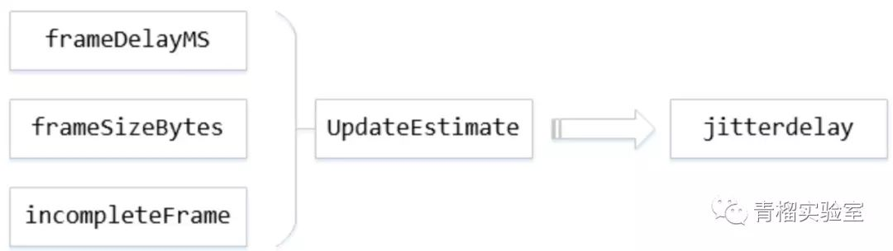

其中，frameDelayMS指的是一帧数据因为分包和网络传输所造成的延时总和,帧间延迟。framesizeBytes指当前帧数据大小，incompleteFrame指是否为完整的帧，UpdateEstimate为根据这三个参数来更新jitterdelay的模块，在得到jitterdelay之后，通过jitterdelay+ decodedelay + renderdelay，再确保大于音视频同步的延时，加上当前系统时间得到rendertime，这样就可以控制播放时间。控制播放，也就间接控制了buffer的大小。  

### 二、丢包重传

在WebRTC中，前向纠错(FEC)和丢包重传(NACK)是抵抗网络错误的重要手段。FEC在发送端将数据包添加冗余纠错码，纠错码连同数据包一起发送到接收端；接收端根据纠错码对数据进行检查和纠正。NACK则在接收端检测到数据丢包后，发送NACK报文到发送端；发送端根据NACK报文中的序列号，在发送缓冲区找到对应的数据包，重新发送到接收端。NACK需要发送端发送缓冲区的支持。

### 三、平滑发送

编码器编出码率很难做到恒定不变，例如Gop的大小也要根据应用场景做适当的调整，如果关键帧之间的间隔小，那么码率会出现频繁的尖峰，发送数据的时候，会造成瞬间的拥塞。为了解决该问题可以在发送段设置buffer来解决码率波动问题，按照固定的码率平滑的发送数据，而不是根据每帧数据来发送，这就是平滑发送。

### 四、恒定码率编码

大部分的编码器都会有三种控制方式：CBR, VBR, CVBR。

CBR（ConstantBit Rate）是以恒定比特率方式进行编码，有Motion发生时，由于码率恒定，只能通过增大QP来减少码字大小，图像质量变差，当场景静止时，图像质量又变好，因此图像质量不稳定。这种算法优先考虑码率(带宽)。

VBR（VariableBit Rate）动态比特率，其码率可以随着图像的复杂程度的不同而变化，因此其编码效率比较高，Motion发生时，马赛克很少。码率控制算法根据图像内容确定使用的比特率，图像内容比较简单则分配较少的码率(似乎码字更合适)，图像内容复杂则分配较多的码字，这样既保证了质量，又兼顾带宽限制。这种算法优先考虑图像质量。

CVBR（ConstrainedVariableBit Rate）,它是VBR的一种改进方法。这种算法对应的MaximumbitRate恒定或者Average BitRate恒定。这种方法的兼顾了以上两种方法的优点：在图像内容静止时，节省带宽，有Motion发生时，利用前期节省的带宽来尽可能的提高图像质量，达到同时兼顾带宽和图像质量的目的。这种方法通常会让用户输入最大码率和最小码率，静止时，码率稳定在最小码率，运动时，码率大于最小码率，但是又不超过最大码率。

对于实时音视频通讯系统，因为需要比较平稳的码率来保证通讯的流畅和实时性，我们通常会选择CBR编码模式，虽然这种模式的图像质量不稳定，但是相比于通讯的流畅性会更加重要。

小结一下：这上、下两篇文章主要介绍了针对实时音视频通讯系统QoS问题的网络算法部分，因为网络是一个实时音视频通讯系统QoS最复杂的部分，同时又是一个平衡和妥协的部分。另外在不同平台和硬件上，编解码器的选择以及音视频采集渲染播放方式的选择也是很重要的，后续我们再做介绍。

<hr>

#### <p>原文出处：<a href='https://www.cnblogs.com/wangyiyunxin/p/14113392.html' target='blank'>网络QoS的平衡之道——音视频弱网对抗策略介绍</a></p>

视频传输中，对抗丢包、抖动、拥塞、延时，QoS有哪些武器？如何在不同的网络条件和应用场景下，结合每种技术的自身特点，打出漂亮的组合拳？欢迎大家跟着王兴鹤老师一起学习网络QoS的平衡之道

作者：网易智企云信资深音视频引擎开发工程师 王兴鹤

随着AI和5G的到来，音视频应用将变得越来越广泛，人们对音视频的品质需求也越来越高，视频分辨率已经从高清发展为超高清、VR，视频帧率也已出现60fps、120fps等应用，交互式的应用对端到端延时也提出了更高的要求。与此同时，设备的硬件性能也突飞猛进。可以预见，随着5G的到来网络中传输的数据将会呈现爆发式增长，大量数据将会给网络传输带来巨大的挑战。因此，如何保证用户高品质的音视频体验？传输将会是一个重要环节。

网络中常见的问题有**丢包、抖动、拥塞、延时**。以下将分别介绍这些问题对视频体验带来的影响。

视频帧往往是拆成一个个分组包进行传输，当网络发生**丢包**时，接收端无法成功组帧，不仅影响这一帧的数据解码，从这一帧开始的整个GOP都将无法解码显示，用户看到的画面将出现卡顿，直到完整的I帧到达接收端才能恢复画面。

**抖动**同样是造成卡顿的杀手锏，抖动分为发送数据抖动、网络传输抖动、接收丢包恢复抖动。在端到端全链路上，任何环节都会引入抖动而影响画面的流畅性。接收端的Jitter Buffer缓冲区负责消除抖动，提供稳定的解码帧率，但是Jitter Buffer是牺牲延时作为代价的。

网络发生**拥塞**时，音视频的播放情况将变得更加恶劣，拥塞造成的直接影响是突发丢包或者突发抖动，如果不及时预测拥塞的发送降低发送数据量，接收端将会出现卡顿、延时大、画质差等等问题。

发生丢包、抖动、拥塞时往往会伴随着**延时**的增大，ITU StandardG.114对延时的定义是，端到端延时大于400ms时绝大数的交互体验都将不能接受。

我们用QoE表示用户在接收端的主观体验，而QoS是指通过一些量化指标衡量网络的传输质量并提供优质网络的服务。

那么对抗以上这些网络问题，QoS都有哪些武器呢?

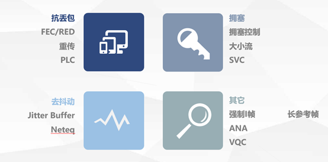

### 1 FEC

FEC是常用的抗丢包手段，又叫前向纠错码，是在发送端额外发送一些冗余数据，用于抵抗网络丢包。当接收端检测到媒体数据发生丢包时，就可以利用接收到的冗余数据进行丢包恢复。**FEC的优点是丢包恢复延时低，缺点是冗余数据占用额外带宽，在带宽受限场景会挤压视频原始码率，导致画质变低。**影响FEC的丢包恢复能力除了冗余数据数量之外，还跟分组大小有关，分组越大，抗丢包能力越强，但是对应的丢包恢复延时也会变大。

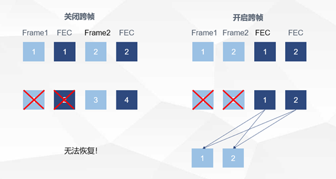

分组大小与抗丢包能力示意

FEC的编解码算法有XOR、RS等，衡量FEC算法的指标主要有计算性能、抗丢包能力、恢复延时。其中基于柯西矩阵的RS（里德-所罗门码）是目前比较流行的FEC算法。该算法结合合适的分组策略在以上三个指标上都有较好的表现。对于不同的应用场景也有不同的FEC算法有更好的表现，比如喷泉码、卷积码等等，喷泉码结合接收端反馈机制对无线信道等丢包波动大的场景有较好的表现。

总的来说，FEC是一种用码率流量交换抗丢包能力的技术，相比重传FEC的优点是恢复延时低。**FEC技术的关键点是如何设计合理的冗余策略和分组大小，达到抗丢包能力、视频码率、恢复延时三者的有效平衡。**

### 2 丢包重传

有别于FEC的抗丢包技术，重传不需要浪费太多的码率，只有当接收端检测到丢包时通过反馈给发送端丢包信息（NACK）才进行相应数据的重传，接收端每隔1个RTT对同1个包发起重传请求，直到成功接收到相应的数据包。**重传最大的好处是码率利用率高，缺点是会引入额外的丢包恢复抖动从而拉大延时**，显然，网络RTT越大重传的恢复效果越差。

考虑到双向丢包的场景，对于同一个包，接收端可以以1/2 RTT间隔发送重传请求，以应对重传请求包可能丢失的情况。发送端对同一个seq的包响应间隔按照RTT间隔控制，防止重传码率过多浪费。发送和接收按照以上间隔处理重传请求和重传响应，可以在码率和抗丢包能力上达到有效的平衡，实现收益最大化。一个好的重传策略设计还需要考虑是否需要容忍乱序，合理控制重传码率。

### 3 Jitter Buffer

接收侧一个重要环节是Jitter Buffer。Jitter Buffer的作用是以最低的缓冲延时代价消除数据抖动，提供流畅的播放帧率。因为视频是按帧解码播放，所以Jitter Buffer的延时计算也是按视频帧为最小计算单元，而不是按视频包，输入Jitter Buffer的参数是每一帧视频数据的抖动。造成帧抖动的因素有很多，有采集抖动、编码抖动、发送抖动、网络抖动、丢包修复引入的抖动等，总之，在解码之前的任何环节引入的数据抖动会汇总到Jitter Buffer模块处理抖动消除。

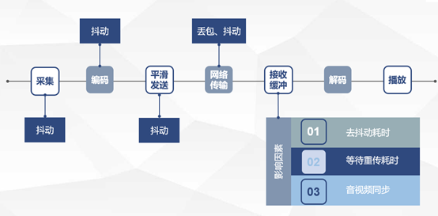

**有效发挥重传的抗丢包能力需要有Jitter Buffer的拉伸策略加以配合。**因为重传只是保证数据能够到达接收端，此外接收端还需要有足够大的Jitter Buffer等待这些晚到的数据帧，否则即便重传到达接收端的数据由于滞后性原因将被丢弃。

重传结合Jitter Buffer拉伸策略是一种用延时交换抗丢包能力的技术，其中影响这种交换性价比的关键因素是RTT，RTT越小重传收益越大，反之收益越差，更多需要FEC实现抗丢包。

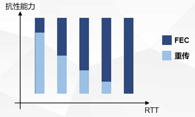

### 4 长期参考帧

除了重传、FEC等常规手段之外，长期参考帧技术即选择参考帧技术，是一种网络模块和编码器共同配合完成的技术。在RTC场景下一般的编码参考策略是向前一帧参考，因为参考的距离越近压缩效果越好，出于实时的考虑编码只有I帧和P帧，没有B帧。而**长期参考帧是一种可跨帧的参考帧选择策略，这种策略打破了传统的向前一帧的参考的规则，可以更加灵活地选择参考帧。**

长期参考帧策略的目的是在有丢包的场景下，接收端不需要等待丢包恢复也能继续显示画面，其最大的好处是低延时，不需要等待重传恢复，但是带来了压缩率的牺牲，在相同码率下表现为图像质量的牺牲，但是这种牺牲和收益的交换在某些场景下是值得的。此外，常态的长期参考帧技术在抵抗突发丢包能力上有很大提升，当网络突然出现丢包，FEC和重传的立即恢复效果一般是比较差的，尤其是有基础RTT的网络。而长期参考帧可以饶过丢失的帧，利用丢失帧之后任何一个恢复的帧进行解码显示，从而提升突发丢包时的流畅性。

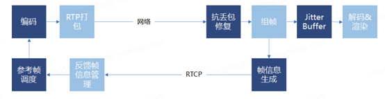

根据长期参考帧的特点和目的，实现长期参考帧技术应用需要有接收端侧反馈信息，编码器根据接收端反馈的帧信息选择参考帧编码，在有丢包的场景下，接收端通过短时的帧率牺牲将很快恢复画面。由于存在接收反馈，高RTT时反馈延时较大将会导致参考距离变大，而参考距离超出了编码器的编码缓冲限制将会导致编码找不到参考帧，所以长期参考帧比较适合低RTT场景。在多人会议场景中，下行人数太多也会制约长期参考帧的参考帧选择。

综合来看，长期参考帧适合1V1的通信场景，适合低RTT伴随丢包或者拥塞的弱网场景，这样的场景下长期参考帧比传统的向前一帧参考有更好的实时性和流畅性，同时结合重传和FEC的抗丢包贡献，其抗弱网能力将大大提升。

### 5 大小流和SVC

**长期参考帧比较适合1V1的场景，而多人场景时，需要大小流和SVC发挥作用。**

大小流是指上行同时传输两条不同分辨率的流，媒体服务器可以根据下行实际的带宽情况转发相应质量的流，如果带宽足够转发高质量的大流，带宽不足转发低质量的小流。这种大小流机制的好处如下： 

1. 无需调节源端码率就能向媒体服务器提供两种规格的视频码率；
2. 在下行接收者有不同的带宽时，可灵活转发，避免只有一个编码源相互影响的情况。

SVC跟大小流的特点一样，区别在于SVC提供了不同帧率的可选规格，媒体服务可以选择不同的SVC层进行转发，通过降低帧率达到降低码率的目的。

在带宽不足时，不同用户对清晰优先和流畅优先的需求不一样，SVC和大小流提供了灵活的机制满足不同应用的需求。

### 6 场景差异化

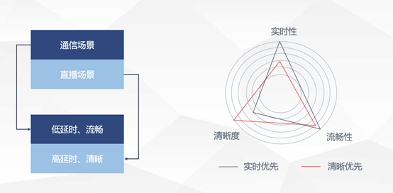

我们把我们的应用场景简单地分为两大类，通信场景和直播场景。通信场景简单的比如视频会议、主播连麦交流，在线面试等等，这种交互性的应用场景对实时性要求较高，它的特点是低延时、流畅优先。而直播场景比如主播直播卖货，老师在线授课，这种场景的特点是大部分时间都是主播或者老师一个人在讲，因此它的特点是高延时、清晰优先。在这两种场景下有不同的策略倾向，**通信场景更多的是用FEC，重传作为辅助，提升实时性。直播场景更多是用重传，FEC作为辅助，提升清晰度。**

### 结束语


本文主要介绍了对抗弱网的基本QoS策略，除了以上技术之外还有很多模块涉及到延时、清晰、流畅三个维度的平衡。很少有一种技术能做到完美无缺，鱼和熊掌不可兼得，我们要做的平衡策略就是取长补短，趋利避害，在不同的网络条件下，不同的应用场景下，结合每种技术的自身特点，将其进行组合打出一套组合拳，实现受益最大化。

