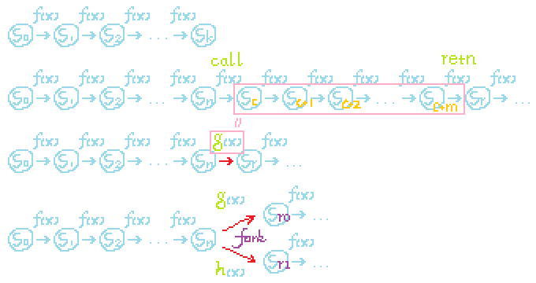

<!--BEGIN_DATA
{
    "create_date": "2022-06-12 20:00", 
    "modify_date": "2022-06-12 20:00", 
    "is_top": "0", 
    "summary": "并发与异步执行流中的对象角色概述(一)<br/>并发与异步执行流中的对象角色概述(二)<br/>并发与异步执行流中的对象角色概述(三)", 
    "tags": "C/C++", 
    "file_name": "并发与异步执行流中的对象角色概述.md"
}
END_DATA-->

#### <p>原文出处：<a href='http://www.purecpp.cn/detail?id=2310' target='blank'>并发与异步执行流中的对象角色概述(一)</a></p>

## 并发与异步执行流中的对象角色概述(一)

在并发与异步编程中, 我们需要面对执行流的抽象问题。

  * 并发编程的执行流问题既数据的依赖关系、任务的启动与同步
  * 异步编程的执行流问题既异步过程的挂起与唤起、任务的调度

为完成对它们的抽象, 存在以下若干种用以描述执行流的实现手段。

  * 同步调用
  * 回调
  * 有栈协程
  * 无栈协程
  * 任务图
  * promise / future
  * then

这些实现手段都能解决同样的问题, 但实现形式各不相同。为更加方便地理解和处理这类问题, 我们需要对其本质进行进一步的抽象。

### 前置概念

为对上述实现手段进行比较, 我们需要一个能够囊括上述所有技术细节的数学模型。我们知道计算机科学中的一切问题都可以被抽象为有限状态机模型。但由于我们需要考虑的是处于非实时操作系统下的用户态程序, 由于我们没有中断权限,

所以异步问题可能存在时序不确定性。这一限制使得我们在以往单线程情形下常用的单子状态机模型不再有效,

所以本文中我们首先需要重新确定异步并发编程下可抽象为单子状态机模型的前提条件适用范围。

#### 有限状态机

假设有这样一台单核计算机, 它没有输入输出设备并且有时序, 同时它只运行在实模式。我们在这台计算机 boot 之后立即将它的时钟信号停掉, 不考虑 boot 过程本身, 那么此时我们获得了一个初状态。如果我们一直单步调试下去, 最终这台计算机一定会进入停机状态或是死循环。

对于这个过程中的每一个时序, 我们都可以将这个计算机的当前状态表示为一个整数 `S`。比如我们可以将所有寄存器和整个内存的所有数据按二进制位拼接起来, 就得到了这个整数 `S`。这种计算机到整数的一一映射是显然成立的。这是由于任何图灵机之间都可以互相模拟, 所以我们永远可以在一台图灵机里构造上述计算机的一个虚拟机, 之后 dump 它的内部状态, 即可得到这个特定状态的整数表示 `S`, 这个整数就是整个 dump 文件。

由于我们假设该计算机的存储空间是有限的, 那么这类计算机可以处于的状态数量则也是有限的。在这个前提假设下, 该计算机如果进入死循环, 则必会先后处于同一个状态两次以上。因为我们先前假设该计算机无输入, 所以一旦进入重复状态一次, 则必定会再发生无数次, 不会由于外部状态变化而跳出该死循环。现在我们把状态重复也作为一个停机条件, 那么现在我们的状态机就必定会在有限步计算之后停机了。

我们把这种计算机定义为 `无条件有限状态机`, 后文简称 `有限状态机` 或者 `状态机`。

我们可以把有限状态机的初状态记作 `S0`, 整个状态序列为 `{S0, S1, ..., Sn}`。状态的转移记作 `St+1 = f(St)`, 其中 `f(S)` 为状态转移函数(递推公式)。

当我们设计一个通用计算机硬件时, 我们就是在用逻辑电路搭建这个状态转移函数 `f(S)`, 它就是这个序列的递推公式。

#### 执行流

我们定义上述状态序列 `{S0, S1, ..., Sn}` 为 `执行流`。

#### 程序计数器 `pc`

##### 冯·诺依曼结构下的一般情况

由于实际电路实现过程中, 如果我们通过直接考察整个状态机的状态来决定下一步如何进行状态转移, 那么状态转移电路规模就太大了, 生物脑才有这个财力,人工造物破费不起。于是便产生了冯·诺依曼结构这种妥协方案, 该实现中常常由一个 CPU 内的算数逻辑单元 (ALU) 作为状态转移函数的输入参数。ALU是冯·诺依曼结构衍生出的状态摘要技术, 单个指令内寻址时的内存读写往往仅关心极少数几个 `word` 的内存子集,如取指和寻址操作数影响到的内存子集。即使是作为内部状态的通用寄存器, 单个指令中也仅关心指令操作数指定的数个(一般至多2-3个)寄存器。冯·诺依曼结构中, 几乎总有一个特殊的寄存器, 既 `程序计数器` `pc` (如 x86/x64 架构中的 `eip` / `rip`), 用于承担 ALU 索引的功能。我们知道在工程实践中, 代码段往往是只读的, 一般鲜有主动读取代码段数据的需要, 这个工作往往由 `ALU` 自动完成, 通过对 `pc` 寻址, 以一次一条指令的方式装入不可见的 `指令寄存器` `ir`。在极端情况下, 除 `pc` 外的所有寄存器状态都可以被忽略, 我们依旧可以维持程序不进入 `undefined behaviour`。比如在跳转前将所有寄存器压栈, 返回后将所有寄存器弹栈, 即可达成这一点。

  * **`pc` 是冯·诺依曼结构下唯一不可忽略的状态机摘要**

由于 `ALU` 模式是图灵机的一种具体实现, 该实现下我们可以方便地认为, 往往有 n 个 `pc` 就代表一个设备支持 n 个物理执行流, 既我们认为它可以同时处理 n 个有限状态机。

由于冯·诺依曼结构过于依赖 `pc`, 所以在讨论冯·诺依曼结构计算机时, 即使一个模拟的、逻辑上的执行流被挂起后, 其 `pc` 也必须被小心地保存起来, 所以绝大多数情况下, 我们都可以用 `pc` 指代一个执行流。如果它在程序计数器寄存器中, 则它是物理执行流, 如果已被拷贝到内存, 则它是已挂起的逻辑执行流, 如果被拷贝到外存(硬盘), 则它可能是系统休眠镜像内的持久化执行流状态快照。

##### 冯·诺依曼结构下的特殊情况

实际上, 段式权限控制是哈佛结构的特征, 这也是我们常常见到的情况。但这是当前主流的体系结构提供的模拟手段, 冯·诺依曼结构将代码视为数据的能力并未丢失。

只有在少数情况下, 程序才需要主动读写代码段的数据, 如调试器在下软件中断时, 需要将相应位置的机器指令改写成调试中断(如 int 3), 挂起恢复时则写回成原先的指令。又如部分病毒的 shellcode 也需要在代码段中搜索需要调用的非公开 api 地址, 或是在感染可执行文时通过修改代码段数据对程序挂钩子。

数学上, 冯·诺依曼结构比哈佛结构更一般, 所以上述两节的标题是对工程实践而非数学定义的描述。

**_虽然客观存在, 但这些情况都不在本文的讨论范畴内, 本文将假设哈佛结构中的代码存储器总是只读的, 程序只主动读写哈佛结构中的数据存储器, `pc` 总是由 ALU 自动控制。_**

#### 操作系统级状态机抽象

如果我们武断地假设一个多任务计算机中每个状态机之间都能够严格地相互独立的话, 那么整个多任务系统是容易理解的。操作系统的主要功能就是让这种简单假设看起来仿佛成立, 既让计算机看起来有无限个物理核心, 可以同时持有无限个 `pc`, 既同时运行无限个状态机, 各个状态机又独享各自的地址空间。

但这也使得状态机间的通信要么通过系统调用, 要么隔着进程调度, 所以为了顾全效率, 我们往往要破坏这个状态机独立的假设。如在 `linux` 中获取系统时间时就并没有发生系统调用, 类似的只读的、时序依赖性弱的、单例的非敏感系统信息被 `linux` 操作系统通过 `mmap(...)` 映射到了用户态的某些分页上。

##### `linux` 时钟中断与 `syscall`

如果进程状态机从初始状态 `S0` 一直运行到停机状态 `Sn`, 那么操作系统就没有存在的意义了。实际上操作系统一般通过2类中断方式将运行着的状态机(既进程)当做数据来操作。第一类中断是外部中断, 如时钟中断。在触发此类中断后, 物理 `pc` 被强制跳转到中断处理程序入口点, 之前进程的 `pc` 一般被自动保存在了特定的特权寄存器内。

所以我们可以认为中断是一种特殊的跳转指令, 比一般的跳转指令额外做了一些默认操作, 这些额外操作在各个体系结构中存在一些差别。那么操作系统内核实际就是一个中断处理程序, 如果我们把上文中状态机的状态序列 `{S0, S1, ..., Sn}` 视为程序视角下的宿命, 那么操作系统的功能就是通过将不同状态机的宿命当做数据来操作, 来用单个物理 `pc` 完成对多个时间线的模拟。同时通过对状态快照的更改, 使得进程状态机可以在不同的宿命之间跳转, 既在相互平行的状态序列之间变轨。

**在本文中, 我们常常会将状态机的挂起与恢复视作状态机的停机和初始化, 后启动的状态机以前者的末状态作为自己的初状态。**

前者从初始化到停机的状态序列为 `{S0, S1, ..., Sn}`, 令后者的初状态 `S'0 = Sn`, 则有后者的状态序列为 `{S'0, S'1, ..., S'm-n} = {Sn, Sn+1, ..., Sm}`。假设我们扮演操作系统, 用户进程通过 `syscall` 主动将自己挂起, 挂起期间如果我们在后者的初状态 `S'0` 上改动32个二进制位, 我们就通过 `syscall` 向该进程返回了一个 `int32 value`。该改动可以视作令 `S'0 = mix(Sn, value)`, 也就是使得挂起恢复时状态机的初状态从 `Sn` 变轨到 `mix(Sn, value)`, `mix(S, R)` 定义为向程序状态机 `S`, 写入或返回 `R`。

显然对于这个改动过程, 我们可以将其看做程序状态机对操作系统状态机的读操作, 或是后者对前者的写操作。当然在传统的有状态转移条件的有限状态机模型中, 这种读操作一般被抽象为 `输入序列`, 但该传统抽象根本不足以描述当今计算机的工业实现。首先如果我们要描述外部中断, 则我们状态机的状态拓扑中, 每个节点都必须可以转移到中断状态。因为用户态程序没有关中断的权限, 所以每条机器指令的下一条指令都是可能分叉的。但显然这种数学抽象相当冗余, 因为中断的执行过程大同小异, 而且我们不关心, 希望它在逻辑上不可见。同时, 如果要用一般的有限状态机模型描述简单的程序挂起, 我们就会发现, 在用户态视角下, 我们并无法给出程序恢复的条件, 因为挂起时我们的程序状态机不再进行状态转移。如果我们将计算机整体(包括内核执行时间)视作状态机, 又反而从抽象回到了具体, 导致与本文的动机背道而驰了。所以我们采用了 `无条件有限状态机` 模型, 而对于 `条件状态转移` 的情况, 我们视其为特殊情况, 以 `停机 - 修改末状态 - 形成初状态 - 启动` 的方式处理。虽然条件状态转移在数十年前打孔纸带的古董计算机上状态机的多数情况, 但在当代计算机中, `I/O` 指令不但在所有指令中所占比例极低, 同时必定会被封装在中断(包括 `syscall`)内。在中断例程对 `I/O` 的处理过程中, 用户态程序是被切切实实地停机挂起的, 所以采取这种抽象方式自然而然。

由于 `条件状态转移` 被单独孤立出来, 我们的状态机模型的拓扑结构可以保证总是一条直链, 不带任何分支结构, 因为分支的方向需要通过条件来确定。注意这指的是状态机的状态分支, 而非程序中的 `if(x)` 等语句或者汇编中的 `jnz` 等指令, 因为在无输入的情况下, 状态机执行的第 N 条指令的逻辑分支是可以被提前确定的。在初状态和转移规则固定后, 这些计算是可重复的, 因果固定的。**本文中我们将这些直链形态的状态转移拓扑称为状态机的 `执行流`, 将 `停机 - 修改末状态 - 形成初状态 - 启动` 的行为称为`变轨`**。同步等待的 `syscall`, 亦或是异步调度的 `co_await`, 本质上都是程序状态机主动停机并约定由外部进行 `变轨`的过程。`变轨` 过程中包括停机状态的保存, 状态的修改, 以及以此为初状态的新状态机的再启动。

一般操作系统的外部中断处理程序在例程的一开始就把各个寄存器逐个保存到内存中预留的一个结构体内, 且这个结构体一般被设计成进程内存地址空间的一部分, 但对进程本身不可见。由于进程的状态机基本可以被表示为 `寄存器 + 内存`, 那么经过这样一种执行上下文封存之后, 整个进程的当前状态就可以被表示为若干个内存页了, 进一步可以通过按位拼接等手段被抽象地表示为上文所述的一个整数。当然当要挂起该进程时, 操作系统不会真的把整个状态机序列化保存, 其只需永远以引用的方式访问内存, 这样一旦需要切换内存, 只需切换其引用即可, 这些内存引用就是页表。

第二类中断则是内部中断, 它来自 CPU 内部, 既陷阱门。它指在 CPU 处于特定状态时触发的中断。陷阱门一般又细分为两类, 既 `中断指令` 及`异常`。上文中我们提到中断的主要功能是造成 `pc` 的强制跳转, 这两类内部中断刚好对应无条件跳转和条件跳转。如读内存指令一般情况下就不是一个跳转指令,但当读不可读内存地址时, 它就变成了跳转指令, 同时切换 CPU 特权级。异常中断就是一种广义上的条件跳转, 其跳转目的地址是操作系统异常处理例程。`syscall` 或调试中断之类的指令则是无条件跳转, 用以提供操作系统和进程之间的进行主动通信功能。操作系统在中断处理程序中将进程状态机上下文保存好后, 直接读进程状态, 则可以知道进程想要调用何种系统功能, 因为系统调用的编号和参数都是该状态的一部分(一般用寄存器传递), 它们与整个进程的状态机一同被挂起到了程序的当前状态快照中。操作系统只需直接改动状态快照, 本质上就是改动了进程的状态整数 `S`, 其结果就是将进程状态机从一个状态序列强行切换到了另一个状态序列, 操作系统正是以该种方式与进程通信的。期间操作系统自身状态机的当前状态也被有目的地更改, 如创建 `fd`, 销毁其他进程, 与设备通信等。



上图中4种情况分别为:

1. 一般状态序列
2. 将 syscall 表示为一般状态转移
3. 将 syscall 等价表示成了一次变轨
4. 将 fork 系统调用表示成了分叉变轨

不难发现, 如果采用基本的状态机模型, 则状态转移要么必须考虑外部输入, 要么需要将内核态完全纳入状态机状态之中。如果采用 `变轨` 抽象, 则可以完全隔离外部状态。代价是红色箭头处状态机进行了特殊的状态转移, 由于状态转移函数不再是 `f(x)`, 所以可以认为其是停机后再以新的初状态重启了。被 `g(x)` 和 `h(x)` 隐藏起来的过程, 一般需要保证可以被状态机视作是原子的。

##### `linux execve`

`execve` 系统调用的功能就是将一个进程的状态机置为初始状态 `S0`, 这个初始状态保存于一个 `elf` 文件中。虽然这个操作往往被描述为`启动一个进程`, 但注意实际上 `pc` 的数量并没有变化。`linux` 下的 `shell` 在启动新进程时要么先 `fork` 要么先`clone`, 之后再用 `exec` 系列系统调用重置子进程。其第一个操作增加了一个 `pc`, 但第二个操作 `execve` 没有增加 `pc`。

如果我们采取前文中的抽象习惯, 将所有 `syscall` 视作状态机先停机, 将末状态更改后作为新状态新建状态机, 那么 `execve` 就变得极其容易理解了。它最自然最理所应当, 直接把一个文件地址传递给操作系统, 告诉操作系统 “新状态机照着这个初始化” 就完事了。而一般的 `syscall` 则在数学上是 `execve` 的一个特殊情况, 既不对状态机做这种大开大合的 `变轨`, 而是仅根据调用前的末状态修改一个 `eax / rax` 之类的寄存器当做返回值, 或是再改动一些指定的缓冲区, 但保留调用前状态机的大部分状态数据。

几乎所有系统调用数学上都是在帮助状态机在原本不可达的平行状态序列之间变轨, 各系统调用之间唯一的区别就是往哪条轨道上跳以及跳多远。一般的 `syscall` 就变几个字节, `execve` 则变的面目全非。一般情况下 `syscall` 后的新状态机初始状态和调用前状态机的末状态只有些许区别。过大的变动没有意义, 实际应用中用户态程序当然不希望一次系统调用就导致自己的程序面目全非。虽然本文中我们将 `syscall` 前后两个状态序列视作两个独立的状态机, 但其间基本必定存在因果联系, 不会完全独立。因此即使是 `execve` 这种以投胎转世为目的的系统调用, 也会保留前世的一些记忆, 如大部分 `process attributes` 以及没有设置 `FD_CLOEXEC` 标志的 `fd`。`shell` 就是靠这些免疫孟婆汤的 `fd` 实现了管道功能。

##### `linux fork`

`fork` 的主要功能是使操作系统内 `pc` 数量 `+1`。`linux` 将这个系统调用设计为复制整个进程状态机, 但这并不是必要的。`windows` 里就没有这个系统调用或者它的类似功能, 但其核心功能 `pc` 数量 `+1` 是所有现代操作系统都支持的, 既创建进程或线程。

`fork` 后的两个新状态机都经过了 `变轨`, 其整个状态机中唯一不同的几个字节就只有 `fork` 系统调用的返回值。

`windows` 中的 `CreateProcess` api 则兼顾了 `fork` 和 `execve` 的功能, 既 `pc` `+1` 和完全 `变轨`, 却没有提供 `fork` 这种单纯的 `pc` `+1` 的功能。`fork` 虽然在逻辑上更加清晰, 但是在内核中却需要额外的复杂实现(`copy-on-write`、假只读等)。

##### `linux join / exit`

使得 `pc` 数量 `-1`, 和前者是对偶操作。

         @fork                   @join       @exit
    S 0 - S 1 - S 2 - S 3 - S 4 - S 5 - S 6 - S 7
              \                 /
                S'2 - S'3 - S'4
    #pc = 1     #pc = 2           #pc = 1         #pc = 0

##### `linux yield` 类调用

如 `nanosleep` 或者 `wait` 相关使得进程挂起的系统调用, 其本质是进程将其 `pc` 主动让渡给操作系统, 再由操作系统保证未来归还该 `pc`。

##### 分时复用图灵完备性

对于图灵机而言, 由于多个图灵机的组合也是图灵机, 又因为图灵机可以模拟任何其他图灵机, 所以单个图灵机可以模拟多个图灵机的组合。要在冯·诺依曼结构下实现这一功能, 我们往往需要对物理 `pc` 进行分时复用, 这在80x86到奔腾时代的多任务操作系统中是物理上不可避免的。由于进程内部也是图灵完备的, 所以在进程内部我们也可以实现这类模拟。软件虚拟机就是一个很好的例子, 协程与线程池也是为此而设计的。

简而言之, 在操作系统层面, 页表中的所有进程分页和处理器寄存器状态快照共同组成了程序状态机的整体状态描述。而程序计数器 `pc` 和页表都是为快速操作这个抽象状态机所做的实现优化。其优化手段并不特殊, 如 `fork` 系统调用后所进行的内存分页 `copy-on-write` 优化, 一些操作系统分页分配过程中的 `append-only` 优化, 进程调度和缺页中断设计中的惰性执行优化等都是软件设计中常见的技巧。

**我们把 `syscall` 当做进程状态机的一次停机和启动, 是为了更容易地对协程模式和回调模式建立统一的抽象。**

如果我们将时间片长度设置为无穷大, 则系统只在用户进程主动挂起时才发生调度。部分实时操作系统和批处理操作系统就基于这种设计, 这种假设有助于帮助我们剥离由时钟中断驱动的被动调度所产生的复杂性, 从而在内核态调度和用户态调度之间建立更一般的对应联系。

通过前文我们知道 `execve` 并不特殊, 其数学本质同普通的立即返回一个值的 `syscall` 如 `read` 等无任何区别。由此我们可以将进程内的异步并发技术与上述状态机概念做一些形式上的对应。

  * 异步回调对应 `execve`, `execve` 通过 `elf` 文件显式指定新状态机的初状态, 异步回调则通过回调函数指定新状态机的初状态。
  * `co_await` 对应一般 `syscall`, `syscall` 通过系统调用前的末状态指定新状态机的初状态, `co_await` 则通过 `std::coroutine_handle` 指定新状态机的初状态。

当调度器在建立新状态机时对初状态稍作修改, 状态机就跳到了本无法自主到达的平行状态序列。这种状态序列的变轨就是状态机与 `外部` 的 `通信`。

`外部` 在计算机科学中往往是一个笼统的概念。但考虑了分时复用的图灵完备性, 则可以严格定义 `外部`。既当一个状态机通过分时复用模拟多个子状态机时, 前者则为后者的 `外部`。当一个子状态机需要 `通信` 时, 一定是因为他的内部状态转移不足以产生其需要的信息, 其希望自身状态被 “意外” 地改变。这种“意外” 只能通过使其原本的状态转移函数暂时失效来达成, 既通过 `变轨` 达成。

<hr>

#### <p>原文出处：<a href='http://www.purecpp.cn/detail?id=2311' target='blank'>并发与异步执行流中的对象角色概述(二)</a></p>

## 并发与异步执行流中的对象角色概述(二)

### 异步与并发概念的状态机抽象

经过前文的状态机模型习惯约定铺垫, 我们现在可以详细展开讨论用户态下异步与并发编程中的各个概念应该如何用状态机建模了。

**与前文一样, 我们重点关注 `pc` 何时生, 何时死, 何时一分为二, 何时合二为一, 以及其是否携带前世记忆。**

#### 子程序 (函数调用)

子程序过程调用既函数调用。虽然子程序调用往往发生于同一线程之内, 但站在状态机的角度看, 一个简单的函数调用又确实发生了状态机切换。在冯·诺依曼结构下,传统的栈式函数调用如果子程序是无副作用的, 那么我们以栈底指针为界, 将整个函数地址空间分解为两部分, 对非栈地址空间做拷贝后分别分配给调用者和被调用者, 函数的执行结果是不受影响的。进行这种等价变换之后, 我们发现无副作用函数的调用过程只在调用时由主程序向子程序传递了参数, 在子程序状态机结束时向主程序传递了返回值。除参数与返回值外, 可以认为子程序和主程序的状态机互不影响, 其状态序列互不相交。

如此等价变换后, 我们可以将函数调用和 `syscall` 在形式上统一起来。我们可以将子程序调用视为 `pc` 分时复用, 既调用时调用者状态机结束, 子程序作为一个独立状态机开启, 其初始状态由 `call` 汇编指令的操作数与参数共同指定, 这些编码子程序初状态的信息都来自于主程序的末状态。子程序销毁后调用者被初始化为新状态机, 通过将子程序返回值写入新状态机的初状态进行状态序列变轨, 这样我们可以得到如下抽象。

  * 调用时主程序 `pc` 数量 `-1`, 子程序 `pc` 数量 `+1`。
  * 返回时主程序 `pc` 数量 `+1`, 子程序 `pc` 数量 `-1`。

子程序运行过程中主程序的 `pc` 被以快照的形式保存, 既 `返回地址`, 它作为子程序结束后主程序所启动的新状态机的初状态的一部分被暂时封存于栈上。子程序调用的整个过程中, 活动着的 `pc` 数量始终保持不变。由于对于操作系统而言, 逻辑 `pc` 就是进程和线程, 它是只有通过系统调用才能获得的资源, 所以子程序调用可以被看作一种绕过系统调用的特殊的优化, 其根本目的是创建新的自动机。在函数调用过程中, 主程序通过将自身挂起, 将 `pc` 让渡给子程序。子程序退出时, 其状态机(栈帧)销毁, 其 `pc` 也同时销毁, 我们可以将 `retn` 指令视作主程序对这个 `pc` 亡值的复用。

当然既然可以看作优化, 自然也有非优化的子程序调用方式, 既分配物理 `pc` 的程序写法。`shell` 管道命令, `sh` `bat` 等批处理脚本, 都是以进程为单位显式分配 `pc` 的。

在子程序返回的一瞬间, 主程序所处的所谓 `resume` 状态。这实际与一个刚刚经过 `execve` 重置的进程初始化状态在形式上并无二致, 子程序销毁了自身, `execve` 的调用者也销毁了自身。二者都是将先前的状态机彻底销毁, 复用自身以运行另一段程序。

如果我们把 `call` 和 `retn` 指令视为停机指令, 那么我们就可以将子程序的 `代码段` `静态数据段` 以及其 `栈帧` 等状态机子集元件从主程序的状态机中隔离出来。这种隔离可以是逻辑隔离、物理隔离或混合隔离, 隔离后子程序状态机将不再被视作主程序的一部分。

  * `syscall` 实现了子程序状态机的逻辑隔离, 其子程序状态机被隔离在内核态, 但物理上仍处于内存条中。
  * `rpc` 实现了子程序状态机的物理隔离, 其子程序状态机可能在地球另一端。
  * `动态链接库` 的 `延迟载入` 实现了子程序状态机的混合隔离, 其绑定前为物理隔离, 子程序位于外存(硬盘), 绑定后为逻辑隔离, 其位于内存。

在上述三种情况中, 都存在某一时刻, 使得我们无法在进程内存地址空间中找到子程序的蛛丝马迹, 同时主程序状态机又正在执行。尤其其中第三种情况, 正是一类再常见不过的函数调用, 所以将函数调用和返回操作视作 `停机`是自然而恰当的。我们注意到上述三种技术都试图允许我们将由多个子程序构成的复杂程序本身视作一个完整的状态机,但这种努力本身实际已经对状态机模型进行了高级抽象。实际上为达成这种高级抽象, 上述三种技术都在背后进行了大量复杂的工作, 甚至在硬件设计上做出协同, 以使得用户观察不到它们的工作。这种高级抽象在惯常或局部的非并发同步编程中益处显著, 但本文我们要讨论的异步并发问题不符合该前提假设, 既这种高级抽象在此情形下不再适用。所以我们需要切换到将 `call` 和 `retn` 视为停机的视角, 这种视角下, 我们可以将所有调用操作等价起来。如果和在非并发同步环境下时一样, 将 `call` 指令视作特殊的跳转指令, 则反而会在进一步抽象中引发更多的麻烦。

将何种粒度的调用视为停机是一门复杂的学问, 也是同步异步 `通信` 问题的重点。前文中, 我们讨论过一般 `syscall` 的等价抽象。既它既可以被抽象为状态转移, 又可以被抽象为 `变轨`。但有一种操作系统设计, 使得只有 `变轨` 抽象成立, 而一般的状态转移模型不成立,这就是微内核操作系统。微内核操作系统的所有系统调用都是类似管道的操作, 它彻底放弃了将 `syscall` 视作子程序的做法, 而是将调用参数传递给了其他独立的进程, 返回时进行相反的操作。既微内核操作系统只负责在进程间拷贝数据。

微内核设计就是比较极端的情况, 它放弃了将子程序和调用者视为同一个状态机的高效设计, 却获得了近乎无敌的 `状态隔离` 能力。既即使一个系统服务模块挂了, 操作系统也只需重启其服务进程, 无需 panic 或蓝屏。`rpc` 则是更极端的隔离设计, 即使该逻辑子程序模块运行的计算机在物理上炸了, 其也具备恢复能力。而类似原子操作、临界区之类的技术路线, 则是刀尖舔血的另一个极端, 其追求效率而放弃了绝对的安全性。

状态隔离和运行效率都是我们追求的目标, 但二者存在一定冲突。是否需要将某个子程序调用抽象为停机主要视我们对二者间平衡的考虑而定。`变轨`的状态机停机抽象是一种比较保守的 `状态隔离` 手段, 它往往用于解决数据的依赖问题。C++20 `coroutine` 中的`await_ready()` 接口甚至提供了在运行时动态进行这种平衡取舍的可能。如果异步事件已经完成, 则直接返回,就如同一个普通函数调用一样。如果异步事件没有完成, 则调用者挂起, 把 `std::coroutine_handle` 委托给回调函数, 调用者停机, 等待调度。

对于非数据依赖问题, 如数据竞争问题(生产者消费者模式、内存数据库、hot pass / cold pass 模式等), 则传统上一般采用如事务性内存或无锁数据结构等技术解决。对于数据竞争问题, 其需要共享的数据容器往往是常驻的、公有的。而对于数据依赖问题, 其需要共享的数据往往是临时的、私有的。

#### 通过异步调用操作 `pc`

我们将一个子程序调用(函数调用)和一个 `syscall` 视为同样的分割点。既调用前一刻我们的主程序视为停机, 交出其 `pc`。调用过程返回后, 子程序或系统调用返回值被将主程序上述末状态与返回值组合后作为新的主程序初状态运行, 那么子程序调用和系统调用就在形式上被统一起来了。但系统调用中比较重要的一些功能就是对 `pc` 本身的操作, 这在进程状态机内部是做不到的。前文中我们提到`pc` 和页表是冯·诺依曼结构下特定架构中的具体优化手段, 目的是为了对整个进程状态机进行快速的操作。由于一个 `pc` 代表操作系统视角下的一个特定状态机的当前状态, 一旦它被作为上下文挂起, 状态机就不再继续进行状态转移, 所以本文中我们用它来指代进程视角下的自身的时间线, 虽然这并不完全严谨。

在实际的高并发编程中, 往往我们还要在进程中对 `pc` 做一层额外抽象, 其目的与操作系统的进程管理几乎一样, 既分时复用。由于一个进程通过上下文切换和状态隔离也可以依靠分时复用模拟多个 `pc`, 所以高性能并发库中往往要使用线程池。线程池启动多个线程的目的仅仅为了让程序能够跑满物理 CPU, 而其所调度的任务的状态隔离则由软件实现。由于用户进程没有中断权限, 所以 `await / yield` 操作是由任务主动发起的。这种设计和前文所述的 `syscall` 主动中断的形式是完全一致的, `await / yield` 子程序同样让渡出 `pc`, 此时它们一般返回到了线程池, 由线程池调度 `pc` 的复用。

为状态机模型形式化定义清晰准确, 本文中我们将 `await / yield` 和异步回调函数的尾调用视作状态机的停机, 将 `resume() / callback()` 调用视作新状态机的启动。由于没有中断权限, 所以用户态下通过时钟中断挂起和操作状态机是不可能的, 因此在用户态下亦没有其对应实现。

#### `pc 供体`

从前文中我们知道异步并发框架本质上是在操作 `pc`, 那么现在我们可以明确的提出一个 `pc 供体` 的概念。

这个概念在目前的 C++ 标准提案中往往被称作 `scheduler` `调度器`, 但前者涵盖的范围不止于此, 如前文中我们提到调用者和子程序互为 `pc供体`。任何用户态进程中的 `pc 供体` 对象的物理或操作系统级逻辑 `pc` 来源都是系统调用, 但在如线程池之类的常见实现中, 框架只从操作系统处获取有限个系统级 `pc`, 再由线程池调度复用这些系统级 `pc`, 为其所服务的并发框架提供无限的用户态逻辑 `pc`。所以一个 `scheduler` 是一个逻辑上的无限 `pc 供体`。而一个执行中的状态机可以利用自身即将返回或者挂起时将要销毁的逻辑 `pc`, 初始化单个其他状态机以完成单次调度。

#### `pc 受体`

用户态的 `pc 受体` 对象包括 `lambda`、函数、函数对象、`std::function`、`std::coroutine_handler` 等 `delegate` (`委托`)。他们都可以被看作一个状态机的初始状态快照, 通过对它们 `invoke` 进行状态机的初始化。一个状态机初状态要启动, 自然要占用一个 `pc`。

本质上 `委托` 是将程序表示为数据。由于程序是状态机, 所以此数据既为该状态机的 `初始状态`。这与 `execve` 把 `elf` 文件当做状态机的 `初始状态` 快照如出一辙。`std::coroutine_handle` 指向的协程状态对象与前者本质上并无差别, 也是状态机 `初始状态` 的快照, 只不过这个快照可能由 `co_await / co_yield` 运算符保存运行上下文而生成。

这种把状态机中间状态视作末状态, 将这个末状态快照视作新状态机的初状态的操作实际上十分自然。当代的 windows 操作系统, 在关机后再启动时, 实际默认就是进行了这种操作。打开任务管理器查看系统时钟的话, 可以发现它甚至没有归零。只有在选择重新启动时状态机才会真的重新启动。要获得一个状态机的中间状态, 可以像魔兽争霸3的录像功能一样, 只保存状态机的初状态和输入序列, 之后重放整个状态机的状态转移过程, 这被称为 `log模式` `日志模式`。比较后期的 `ext` 文件系统如 `ext3` `ext4`, 就支持这种模式。相应的, 像星际争霸II一样, 在录像中插入一些状态机的状态快照, 则无需从头开始重新计算整个游戏过程, 这被称为 `snapshot` 或 `快照`。`mpeg4` 编码格式中的 `i帧` 就是另一个例子。当用户拖动游戏录像或视频进度条时, 这个节点就是该状态机的初状态。

绝对的中间状态描述的往往是无法被保存为快照的状态, 所以既然挂起的协程是一个快照, 那么它就既可以被视作一个中间状态, 也可以被视作恢复时的初状态。

#### `pc` 的创建与销毁

如果一个委托被调度到线程池, 同时其没有利用自身 `pc` 亡值执行回调, 那么其返回之后, 由调度器分配的进程级逻辑 `pc` 也就被销毁了。

  * `scheduler` 生产 `pc`
  * `delegate` 消费 `pc`

#### 分时复用模拟 `pc`

当我们在进程内使用有限个线程模拟无穷多个逻辑 `pc` 时, 与操作系统一样, 我们实际上是在调度状态机。与操作系统所必须提供的服务一样, 我们在调度状态机时也必须对其上下文进行保存和恢复。与操作系统不同的是, 由于我们没有时钟中断权限, 所以中断皆由 `pc 受体` 发起。异步并发框架的主要工作就是在异步事件完成时, 将 `pc 供体` 与 `pc 受体` 配对, 以启动状态机。

  * **同步调用** 中, 我们将 `pc` 挂起到操作系统。操作系统中断向量(中断处理例程)实现中切实地将我们的 `pc` 从寄存器拷贝到了特定内存页。在进程就绪时, 操作系统再将保存的 `pc` 与上下文恢复到 `CPU` 的 `ALU` 内。所以这不是用户态 `pc` 复用, 但其数学本质和本列表中所有其他实现是一致的。我们可以将进程挂起的状态视为此前进程时间片的末状态, 而将进程的恢复看作以此为初状态新建状态机的过程。

  * **异步回调** 中, 我们将一个新的状态机初状态以 `delegate` 对象的方式交给 `scheduler`, 届时由 `scheduler` 为其分配一个 `pc`。此时的主程序继续运行, 实际上我们等价于进行了一次用户态的 `fork + execve`。`fork` 的本质是 `pc +1`, 这是通过异步调用和 `scheduler` 通信在未来完成的。而 `execve` 则是以 `elf` 文件为约定数据结构初始化状态机, 那么在用户级进程内调度中, 这个状态机初状态就由 `delegate` 对象描述。如果回调函数接受参数作为异步事件返回值, 那么这等价于先将 `delegate` 与参数 `std::bind` 为 `std::function<void()>` 再调度, 而后者就是状态机初状态。也就是说, 新状态机的初状态被根据参数进行了更改, 完成了状态序列的变轨。而 `std::bind` 就是前文数学定义中的 `mix(S, R)` 的具体实现。

  * **有栈协程** 中, 以 `await / yield` 函数被调用的时刻为界, 我们可以将该调用视为状态机退出。在调度其恢复时, 我们可以将其视为将刚才的末状态作为初状态建立新的状态机。这和操作系统级调度的原理是一样的, 所以有栈协程的调度器也必须在 `await / yield` 函数被执行后立即保存上下文。其中包括了寄存器、栈、已使用的内存分页。内存分页不需要拷贝, 因为调度发生在进程内, 内存被所有协程共享。同理有栈协程不一定需要在它的上下文对象和调用栈之间拷贝其工作栈帧序列, 具体依体系结构而定。由于 `ALU` 的分时复用是不可避免的, 所以必须显式地保存寄存器上下文。这些挂起时保存的上下文, 共同构成了其恢复时的初状态。

  * **`c++ coroutine` 无栈协程** 中, 一般直接将栈帧放在堆中。这种情况下, 如果按照以前理解栈的模型去理解 c++ 的无栈协程, 那么我们发现以前可以用顺序表建模的栈现在需要用树来建模了。非协程的面向过程程序执行流实际也是在递归遍历一颗树(广义的语法树), 但由于子程序的状态机生命周期与当前栈帧生命周期是同步的, 所以我们时刻看到的都是一颗不完整的树, 栈表示的是多级子程序调用路径中的某个分支, 等价于 `dfs`。对 `c++ coroutine` 进行如此建模是无效的。首先由于生命周期的不同步, 以前在同一时间只有一根枝杈活动的那颗调用树被在堆中展开了, 其次 `pc` 也并不再像此前一样在这个非线性栈结构中递归传递。我们可以认为, 每次由 `await` 返回的调用实际上都在未来回调时进行了一次 `fork`, 也就是增加了一个 `pc`。但如果 `await` 执行后协程直接返回到线程池工作线程, 那么线程池又可以马上调度其他任务了, 也就是说逻辑 `pc` 被回收了。这就是 `awaiter` 的特征, 使得 `pc` 先 `-1`, 异步操作完成时 `pc` 再 `+1`。

  * **任务图** 中, 当一个任务有n个后继时, `scheduler` 需要额外提供 `n - 1` 个 `pc`。C++ 标准 `sender / receiver` 提案通过将任务和 `scheduler` 对象进行组合的方式指定当 `pc` 不足时由哪个 `pc 供体` 来对特定 `pc 受体` 提供逻辑 `pc`。当一个任务有 `n` 个前驱任务时, 则有 `n - 1` 个 `pc` 需要被回收或销毁。当 `n == 1` 时, `n - 1 == 0`, 既不存在需要分配或回收的 `pc`, 此时 `pc` 资源的管理过程可以内联, 既进行内联调度。内联调度经过优化后等价于尾调用, 后文中我们将展开讨论这个问题。

  * **`promise / future`** 模型中, `future` 等待者将自身状态机挂起时向调度器返还自身 `pc`, `promise` 提交值时新建 `pc` 分配给挂起的状态机, 以其挂起时的状态(其等待的值已被更改, 既发生变轨)为初状态调度运行。如果调度器是操作系统, 则是同步等待。如果调度器是用户态的, 则是异步等待, 既 `co_await`。

  * **`then`** 模型中, 异步调用将自身 `pc` 交给调度器回收, 之后向调度器委托类型擦除的回调。当异步事件完成后, 再由调度器将 `thenable` 对象注册的回调函数作为状态机初状态, 为其分配新的 `pc` , 使其开始执行。`thenable chain` 被启动时一旦遇到第一个异步调用直接返回, 则其此时已经向调度器为未来的异步事件回调申请了 `pc`, 只不过这个 `pc` 将在未来分配。如果最终要同步等待 `thenable chain` 完成, 则进行了 `异步 fork` `同步 join`。

在本文的 `[操作系统级状态机抽象`](http://www.purecpp.cn/detail?id=2310#%E6%93%8D%E4%BD%9C%E7%B3%BB%E7%BB%9F%E7%BA%A7%E7%8A%B6%E6%80%81%E6%9C%BA%E6%8A%BD%E8%B1%A1) 章节中我们提到, 上述所有模型可以在合理的抽象下得到数学等价表示。现在我们知道, 这个抽象就是有限状态机模型。而将同步模式、回调模式和协程模式进行统一的关键, 就是将状态机挂起视作状态机的停机, 状态机的恢复视作新状态机的初始化。

  * 对于同步模式, 其新的状态机的初始状态既 `旧状态 + 同步返回值`。
  * 对于回调模式, 其新的状态机的初始状态既 `回调函数 + 异步参数` 组成的子程序入口点。
  * 对于协程模式, 其新的状态机的初始状态既 `协程挂起状态 + awaiter 异步返回值`。

操作系统 `fork` 后, 分页虽然暂时不拷贝, 仅仅是通过页表重复引用指向相同的物理页, 但如果写则引发中断, 现场进行 `copy-on-write` 并将页表中的引用进行分离, 这等于实质上还是做了完备的状态隔离。逻辑上状态机包括 `pc受体` 能够访问到的整个内存子集,对此进行严格的状态隔离在用户态几乎是不可能的, 异步并发编程中所有的数据竞争、生命周期管理和对象所有权问题, 几乎都是因为无法有效进行状态隔离造成的。但如果我们完全通过有向无环图管理数据依赖关系, 那么相当于我们只通过修改新状态机的初状态进行写操作, 这种情况下上述问题就都不再存在。这种抽象虽然效果显著, 但依旧不能解决所有的异步问题, 危险的非隔离状态访问有时是难以避免的, 即使是操作系统, 如果打开文件后进行 `fork`, 此后 `fseek()` 也成了一个麻烦。

  * **一旦非隔离访问发生在多个状态机之间, 我们的上述所有模型将瞬间失效**
  * **上述所有模型中我们都假设所有状态机都仅在挂起后变轨, 既只修改新状态机的初状态**
  * **非隔离访问造成运行中的状态机变轨, 既脱离调度器的控制, 可能在任何随机时刻变轨**
  * **如果仅在调度代码控制下对状态序列进行变轨, 则可以保证所有状态机状态序列为线性序列, 既一叉树**
  * **如果出现非隔离访问, 则每个时间片后被调度执行的状态机都可能是未定义的**
  * **此时状态序列就变成了状态树, 有N个并发线程就是N叉树, 根节点到每个叶子节点的序列都是实际可能发生的执行序列**
  * **非隔离访问下的并发问题的时间片粒度往往小于计算机指令, 一般与微指令、CPU流水线、缓存延迟和乱序发射一样稀碎**

对于异步代码内混杂同步调用的问题, 我们可以通过观察状态机挂起后逻辑 `pc` 被保存于何处来进行判断。如果保存操作由内核态代码完成, 则为同步调用, 如在保存操作由用户态代码完成, 则为异步调用。在线程池调度的 `pc 受体` 内执行同步代码会导致工作线程被操作系统挂起, 这是与线程池设计相矛盾的。如果上述状态机的非隔离状态访问已经发生, 为避免数据竞争, 往往需要加锁。锁是同步代码, 如果任务的 `pc` 由线程池调度器提供, 则等待锁的系统调用会直接导致工作线程挂起。在并发编程中避免非隔离访问几乎总是最优先的, 异步等待就是手段之一。

临界区的工作原理为人熟知, 数据的读方通过在其他线程的写入过程期间挂起自身的方式杜绝非隔离访问。根据上述对应关系, 我们不难看出, 回调模式与协程模式也为达到同样目的而存在。

#### 无条件有限状态机模型的等价转化

我们对某些 `无条件有限状态机` 可以做如下的等价定义。

  * 由于前文中我们规定本文中的有限状态机无环, 所以除初状态与末状态节点外, 将序列视为图时, 我们的状态机模型每个中间节点的入度和出度都是1
  * 由于状态转移 `无条件`, 所以状态机初状态一旦确定则后续状态皆确定, 因此任意若干个相邻的状态节点可以被合并为一个状态节点
  * 单个状态序列可以在任意两个节点之间被拆分成两个序列, 后者以前者的末状态作为自身的初状态
  * 上述切分后每个确定的状态序列可以被视作节点, 视这些节点为确定状态序列组成新的状态机

#### 非隔离访问状态机建模

维持状态机间状态隔离是保证其定义成立的前提, 只有在该前提条件未被破坏时, 一个程序才不会因为非自身责任而跑飞。如一个程序正在访问的指针被其他状态机在其他物理线程中 `delete` 那么此种情况无疑是难以预料和调试的。

假设有 3 个物理线程, 其中同时运行三个状态机, 如果它们之间保证状态隔离, 则他们的状态序列为

  * `{Sa0, Sa1, Sa2, ..., SaN}`
  * `{Sb0, Sb1, Sb2, ..., SbN}`
  * `{Sc0, Sc1, Sc2, ..., ScN}`

如果它们同时启动, 则初状态就有3个可能性。此后每个状态转移前, 都可能发生进程调度, 或由于CPU缓存脱靶、大小核架构、变频、分页缺失等原因导致3者运行进度发生随机变化。因此, 可以将隔离情形下的3个状态序列看作3个队列, 非隔离情形下我们每次随机选择其中一个元素作为下次状态转移的可能目标。这种情况下, 调度初期就形成一颗三叉树, 直至因其中一个状态序列耗尽而停机, 剩余部分转为二叉树, 再到耗尽时转为一叉树, 退化为序列。

**例图:**

_假设有2个非隔离状态机 `a` 和 `b`, 取 `N = 2`_

    Init
     |---------------------------------------.
    Sa0                                     Sb0
     |---------------.                       |-----------------------.
    Sa1             Sb0                     Sa0                     Sb1
     |---.           |-----------.           |-----------.           |-----------.
    Sa2 Sb0         Sa1         Sb1         Sa1         Sb1         Sa0         Sb2
     |   |---.       |---.       |-------.   |---.       |-------.   |-------.   |
    Sb0 Sa2 Sb1     Sa2 Sb1     Sa1     Sb2 Sa2 Sb1     Sa1     Sb2 Sa1     Sb2 Sa0
     |   |   |---.   |   |---.   |---.   |   |   |---.   |---.   |   |---.   |   |
    Sb1 Sb1 Sa2 Sb2 Sb1 Sa2 Sb2 Sa2 Sb2 Sa1 Sb1 Sa2 Sb2 Sa2 Sb2 Sa1 Sa2 Sb2 Sa1 Sa1
     |   |   |   |   |   |   |   |   |   |   |   |   |   |   |   |   |   |   |   |
    Sb2 Sb2 Sb2 Sa2 Sb2 Sb2 Sa2 Sb2 Sa2 Sa2 Sb2 Sb2 Sa2 Sb2 Sa2 Sa2 Sb2 Sa2 Sa2 Sa2

上图中, 简单到分别只有3个状态的2个非隔离状态机, 在非隔离并发状态下就分叉出了20种可能的执行顺序。

  * **请特别注意, 每个状态都可表述为整数, 既图中的节点皆为状态整数, 其中同名但位于不同分支的状态整数并不相等。这是由于非状态隔离并发时, 其他序列可能会修改(Sa修改Sb或反之)其前驱节点状态, 所以我们可以认为Sa序列和Sb序列每次切换都相当于一次未定义的变轨, 其粒度既物理粒度, 可能由于CPU的流水线提前发射而细碎至微指令级, 由于 CPU 级指令重排, 其物理线程内的执行顺序也可能与源码有语义上的颠倒, 相当不可控。在非状态隔离的并发环境下, CPU不保证并发访问一致性, 需要通过 `memory order / memory fence` 指令手动控制。**

当我们将所有非隔离状态放入互斥临界区时, 对临界区外的状态我们根本无需考虑其分叉的情况。由于在临界区外状态机互不影响, 所以状态树退化为一叉树, 既状态序列。对于临界区内的非隔离状态, 我们可以将临界区访问视作停机 - 变轨 - 初始化新状态机的过程。此时我们只需将临界区外的序列视作节点, 则这个情况下状态树只在临界区处分叉, 临界区处的停机 - 变轨 - 初始化新状态机的过程被简化表示为了新的粗粒度状态转移函数。

为了避免未定义的行为, 我们必须考虑整个状态树的每个节点的可能程序状态是否合法。鲁莽地在非隔离的情况下进行这种尝试是软件工程的噩梦, 根据上述分析我们可以进行如下保守的估计。

  * 要避免未定义的行为, 则需要尽量减少状态树的枝杈数量
  * 尽可能彻底地隔离各个状态机可以使得状态树减少分叉
  * 临界区将非隔离状态访问抽象为条件状态转移, 临界区外的状态序列被抽象为粗粒度状态节点

  * **包括互斥临界区在内, 以往的经验告诉我们不确定性往往来源于依赖外部信息的状态机的初始化过程。如果不积极地进行状态隔离, 则状态机每次分叉都可以被等价地视作一次停机和未定义初始化, 且状态机几乎步步分叉。**

#### 子程序的主动中断

##### 无尾函数与有尾函数在状态机模型下的数学等价

上文中我们提到, 只需将状态机的挂起与恢复视作状态机的停机与初始化, 就可以将二者在数学上统一起来。

实际上 C++20 的 `coroutine` 在其 `awaiter` 设计中正是通过将封装后的 `std::coroutine_handle` 委托给 `awaiter` 作为回调状态机的初始状态来转移调度责任的。这导致依此设计的 `awaiter` 实现内部需要耦合 `pc 供体`。

如果 `awaiter` 内部耦合了 `scheduler`, 那么 `awaiter` 可以将协程句柄作为异步完成事件委托转发给 `scheduler`。由于 `scheduler` 是无限 `pc 供体`, 所以作为委托的 `std::coroutine_handle` 在 `resume` 时所需的新 `pc` 由其提供。

如果 `awaiter` 内部调用了异步回调接口, 那么 `awaiter` 可以向该异步接口转发捕获了该协程句柄的闭包回调, 并在该闭包中设置自身的异步返回值。由于这个回调函数作为状态机时, 其设置返回值之后即将停机, 那么其 `pc` 亡值就可以被闭包捕获的 `std::coroutine_handle` 复用, 完成对 `std::coroutine_handle` 的 `resume`。

我们目前知道, 非回调异步调用下的线程挂起和恢复, 实际就是状态机的停机和以此前 `末状态 + 异步调用结果` 为初状态重新初始化。由于状态机的运行过程被从一个状态序列劈成了两个状态序列, 而且由于异步状态返回值写入到了状态机地址空间内, 所以我们不能用同一个状态转移函数 `f(St)` 表示两段状态序列中的所有状态间的转移规则。不同的异步调用结果会导致多种可能的状态转移行为, 这不符合本文中状态转移函数的定义, 因为函数是多到一的映射。

这两段状态序列不能被定义为同一个状态机, 因为它们的状态序列不能用统一的状态转移函数连接。但由于其存在强因果性(大部分比特位不变, 只有异步调用结果写入了少量信息), 所以我们对此种情况进行特殊定义如下, 目的是为此后的行文提供方便。我们将第一个状态序列称为状态机的**头序列**, 我们将第二个状态序列称为状态机的**尾序列**。

这两个状态序列原本是平行的, 期间进行了一次变轨, **变轨后新状态机的可能初始状态数量既信息熵, 其信息通过异步调用结果编码, 后文将详述这个问题**。

我们知道状态机本身作为 `pc 受体`, 它是无法提供 `pc` 资源的。但其一旦被运行, 则从 `pc 供体` `scheduler` 处得到了一个 `pc`。如果要利用这个为自身提供运行机会的 `pc` 对其他状态机进行调度, 函数状态机一般有2个手段。

  * 挂起自身执行流, 把 `pc` 借给子程序
  * 在自身执行结束状态销毁时将 `pc` 交给子程序

上述第一种手段就是调用, 第二种手段就是尾调用。

之所以具有尾调用展开功能的编程语言在无穷递归中不会爆栈, 就是因为其**头序列**销毁后再执行**尾序列**。子程序(函数)作为状态机时, 其栈帧是其状态机的一部分, 所以尾调用可以先销毁原栈帧再创建新栈帧, 使得逻辑栈高不变。

藉由上述抽象, 我们同样可以分析出导致回调地狱中对象生命周期管理困难的原因。回调函数就是**尾序列**的初始状态, 但其又不由**头序列**的末状态和异步调用结果自动生成, 而是由业务代码手动指定。一旦该新状态机需要**头序列**中的信息, 则我们必须显式地在其**初状态**中设置这些信息。这个显式设置的过程就是 `lambda capture` 或 `闭包`, 捕获的对象被绑定到了回调委托内, 与委托函数和异步回调参数共同构成了**尾序列**的初始状态。由于即时返回的异步回调函数会造成 `pc` 数量 `+1`, 所以闭包就可能造成状态机非隔离访问。这就是引用方式捕获可能造成数据竞争, 而以值捕获则往往不会的原因。因为后者由于复制了需要其访问的状态机子集, 所以实现了状态机间的状态隔离。

  * **对于一般的子程序调用, 我们既可以将这类调用视作主程序状态机的一部分状态, 也可以将整个调用到返回期间的过程视作一次状态转移, 这应用了前文所述的合并状态节点的等价变换操作。**

##### 同步调用和异步调用

  * 同步调用的**尾序列**状态机由操作系统初始化
  * 异步调用的**尾序列**状态机由 `scheduler` 初始化

当线程池调度异步事件时, 相当于 `pc` 由操作系统传递给工作线程, 再由工作线程传递给**尾序列**。运行结束后, `pc` 由**尾序列**返还给工作线程, 在工作线程循环等待异步事件挂起后返还给操作系统。

在异步回调函数尾调用、`await / yield` 调用中, 逻辑 `pc` 数量先 `-1` 再在未来异步事件完成时 `+1`。为避免在异步框架中混入同步代码, 框架需要将所有同步调用 `syscall` 封装为系统异步事件形式(`epoll` `iocp`等), 所有的系统级的 `pc` 操作都应该通过调度器中间层完成。

#### 协程对子程序中断的抽象

`coroutine` **头序列**可以被同时视作 `pc 受体` 和 `pc 供体`, 这是由于其 `pc` 由其调用者提供, 其返回时又将 `pc` 提供(归还)给调用者。

调用者异步启动 `coroutine` 后, 首先发生了一次 `fork`, `coroutine` 初始调度完成后既返回到调用者。 对于通过线程池调度器实现的异步框架, `awaiter` 总是从 `coroutine` 处取得 `pc`, 在 `awaiter` 将自身的完成通知函数作为异步完成事件的 `pc 受体` 注册给 `scheduler` 后, 这个从 `coroutine` 处取得的 `pc` 就被 `awaiter` 擅自销毁了。

由于 `coroutine` **尾序列**为 `pc 受体`, 所以当 `awaiter` 的异步事件完成, 从 `scheduler` 处得到 `pc` 后, `awaiter` 先保存异步事件返回值, 再为 `coroutine` **尾序列**提供一个 `pc`。这个 `pc` 可以通过进行尾调用复用其自身当前 `pc` 来提供, 也可以显式地从 `scheduler` 获取。如果采用后者, 则造成 `awaiter` 与该调度器的依赖耦合。

也就是说, `awaiter` 先当 `pc 受体` 从协程处借入 `pc`, 再把 `pc` 拿到当铺当掉, 再在条件合适时赎回 `pc`, 再作为 `pc 供体` 将 `pc` 归还给协程。

  * **协程启动需要消费 `pc`, 协程销毁由调度器回收 `pc`, `awaiter` 是 `pc` 的搬运工。**
  * **在完成事件发生时, 调度器主动分配一个 `pc`, 将该 `pc` 分配给 `事件委托`, 所以 `awaiter` 是一种 `事件委托`。**

#### 角色的递归组合方式

对一般的函数来讲, 如果在其中进行异步调用, 那么该调用会立即返回。无论这个异步调用是通过回调方式还是通过协程方式进行的, 一旦**尾序列**被当做未分配 `pc` 的状态机提交给 `scheduler`, 在未来某一时刻调度器将其启动时, 逻辑 `pc` 数量必然会 `+1`。从前文中我们知道, 除调用和尾调用外, `pc` 只能通过 `scheduler` 提供给 `pc 受体`。由于异步调用立即返回, 所以调用者马上拿回了自己的`pc`。那么对这个**尾序列**进行异步启动所需的 `pc` 只能在未来通过 `scheduler` 提供, 所以异步调用接口内部本身必定需要包含一个 `scheduler` 实例或引用。

  * 在 `sender / receiver` 提案中, `任务` 就通过与 `scheduler` 共同绑定为类型嵌套的 `sender` 描述这种耦合
  * 在 `executor` 提案中, `executor` 本身就是 `pc 供体`

如果我们将异步调用和 `linux` 的 `fork` 系统调用作比较, 那么我们就会发现 `linux` 的 `pc 供体` 是全局的, 既操作系统。

**显然如果要将 `scheduler` 与 `任务` 解耦, 我们需要将 `pc 供体` 显式地抽象为中间层。**

#### 任务图

##### 有向无环图与 `fork / join`

如果要用 `fork / join` 描述有向无环图, 那么我们必须将 `pc` 的分配与销毁简化地假设为每次只分配或销毁一个。经过这样的转换, 我们的图中则只包含二叉分支和二叉合并, 这与将一般的树转换为二叉树的过程如出一辙。虽然实现中这往往是必须的, 但我们可以通过上述中间层将其抽象为一般的有向无环图拓扑表示。

##### 回调 / 协程递归嵌套定义问题: 逻辑 pc 的 fork 与 join 造成的耦合

无论是回调地狱还是协程异步调用, 其形式上都仿佛存在着递归嵌套。但实际由于被调度的状态机都是**尾序列**, 所以在异步调用完成后, 当**尾序列**被调度执行时, **头序列**的运行上下文已经结束。此时新的上下文是通过将委托对象与异步返回结果进行组合后作为状态机初状态建立的。

所以一旦考虑到状态机挂起时的类型擦除, 我们就会发现实际根本不存在递归。如果分析此时的调用栈, 则**尾序列**的下层栈帧是 `pc 供体` 的调度函数, 如工作线程的工作循环等。但由于这些状态机虽然逻辑上相互独立, 但实现上并不相互独立, 所以与其相关的对象所有权、生命周期和作为 `pc 供体` 时依赖的调度器实例或引用都在这种形式上的递归结构中被耦合绑定了。

也就是说虽然在状态机层面考虑, 虽然这些状态序列是相互独立运行的, 也并不共享调用栈, 但在高级语言编码时却被错误地组织到了一起。相反, 应该在调度发生时(`pc` 数量改变时)才需要发生绑定的 `pc 供体`, 反而被早早地绑定到了这些状态机的闭包中。

##### 嵌套定义的消除: 解耦所有权、生命周期、调度器

由于我们可以在自然逻辑上将多段**头序列 - 尾序列**首尾相接, 形成带变轨的完整状态机, 所以以该整体为单位, 我们可以为它们创建依赖环境, 之后通过编译期依赖反向注入的方式管理其所有权、生命周期与调度器引用。在这种技术的帮助下, 有向无环图中需要 `fork` 的任务节点就不再需要递归地绑定 `scheduler` 或者主动申请 `pc` 了。其只需要提供**头序列**和**尾序列**的初状态, 并且为它们指定 `schedule` 策略, 此时则可以由框架在任务状态机销毁后根据编译期元数据管理 `pc 供体` 与 `pc 受体` 的配对与调度。

在采取了这样的设计后, 任务图的拓扑结构、状态机所有权、对象生命周期和调度器实例或引用就不必再以手动方式绑定。

从本质上讲, 这些依赖关系的手动绑定实际就是在对状态机的状态序列的初始化前或销毁后进行修饰。这个行为类似于 `C 运行时` 在 `main()` 进入前和返回后所做的那些工作, 它们同样是在逻辑上的状态机初始化前和销毁后进行的额外工作。显然这些工作应该被实现为隐式的, 而非显式的手动绑定。如果不是, 说明我们缺少一个类似于 `C runtime` 的中间层。

##### 可内联任务依赖的优化

前文中我们提到过, 尾调用是一种特殊的调度方式, 其逻辑上切换了状态机, 销毁并创建了 `pc`, 但实现上没有做任何显式调度。对于进行任务调度管理的有向无环图, 对其某些特殊的局部拓扑结构也可以为该处的前后节点做这样的内联操作。这要求其局部拓扑结构是线性的, 既前项出度与后项入度都为1, 且元数据所指定的调度器实例相同。

这种情况下, 通过调度器进行的显式调度可以被省略。由于内联任务不存在显式调度, 所以状态机不需要通过将自身从运行上下文转储为数据(协程状态对象或委托)来描述**尾序列**的状态机初状态, 所以在这种特殊情况下, 类型擦除可以避免。

  * **这种特殊的内联就是 `monadic operation`, 它实际上正是本文中的无条件状态机的定义, 因为无条件状态转移函数就是一种一元运算**

所以我们可以做此类优化的原因就是因为我们可以用状态机来表示状态机, 当然我们就不必再将他们拆分。不拆分则节约了销毁和创建状态机的开销, 既框架的内部调度开销。

#### 逻辑 `pc` 的 `exit`

如果 `coroutine.final_suspend()` 返回 `std::suspend_never{}`, 那么协程栈帧上的自动变量和 `promise` 将在返回后自动销毁。

由于 C++20 的协程栈帧默认使用 `new` 运算符分配在堆上, 所以我们可以将此销毁行为看作隐式的 `delete this`。这可以看作是传统的线性栈式生命周期自动控制的非线性栈推广。

整个 `coroutine` 显然可以被当做一种有限状态机进行抽象, 和操作系统将 `process` 抽象为状态机并以 `RAII` 方式管理其资源一样, `coroutine` 的资源管理方式也是 `RAII`。协程中以 `RAII` 方式管理的对象就是 `coroutine` 栈帧和 `promise`, 但协程对象本身不是。

当一个协程对象同时是 `awaiter` 的时候, 它在其状态机将要停机的那一刻, 也有机会利用自身当前的 `pc` 作为 `pc 供体` 对其他 `pc 受体` (`await_suspend` 委托的 `尾序列`)进行尾调用式的 `monadic operate`。

对回调地狱而言, 这种尾调用则是显式的。

#### 状态机抽象小节

经过上述讨论, 我们了解到状态隔离的目标是使得状态机尽量不分叉。在我们的一开始的约定中, 本文中**状态机**是**无条件状态机**的简称。一般的状态机模型中存在着一个叫做 `输入字母表序列` 的元素, 它的功能是作为一般的有限状态机的状态图中 `出度 > 1` 的节点的跳转条件。实际的计算机中, 在非并发环境下, 这种 `出度 > 1` 的节点极少。如果将操作系统与进程整体看作同一个状态机, 那么几乎只有在进行 `I/O` 操作时才会发生这种条件跳转。假设 `I/O` 读入一个 `char` 后写入内存, 则此时有 `8bit` 信息来自外部, `I/O` 操作前后整个状态机的状态就有 `256` 种不确定性, 既 `256` 种变轨目的地。用来消除这 `256` 种不确定性的信息熵为 `log(2, 256) == 8bit`, 也就是说一般状态机模型中的 `字母表` 就是为了消除信息熵, 其定义既信息。上述这个 `字母表` 与 `asc表` 定义一模一样, `输入字母表序列` 与字符串定义一模一样, 这个状态机的定义则与 `串口处理程序` 的定义一模一样。

**之所以存在这些巧合, 其原因就是早期计算机都是根据上述理论蓝图构建的。**

这就是本文反复强调并在多个实际异步并发模型中分别分析其变轨问题的原因。推广回标准的有限状态机模型后, 我们发现我们对**无条件状态机**进行的 `停机-变轨-再初始化` 操作可以被表示为对 `出度 > 1` 的状态节点进行的条件跳转。但在未隔离的并发环境下, 这些 `出度 > 1` 的状态节点则变得不再稀疏, 它们甚至稠密到几乎每个微指令周期都在发生, 也就是一条机器码的执行过程中这种分叉可能发生数次。而其跳转条件(字母表序列)几乎与整台计算机里每个进程运行的物理时序和他们的整体状态都相关, 而且当我们关心它们时, 这些信息早已被删除。其被删除的原因是它们的信息熵远远超过了整个计算机的存储空间, 根据热力学第二定律, 它们早已通过散热风扇耗散在了茫茫宇宙中。

一旦我们不再能掌握状态机的轨道, 则我们的状态机已经脱轨, 既来到了未定义的状态。之所以本文中我们直接将**无条件状态机**简称为**状态机**, 正是因为这种状态序列可确定且可复现的情形是我们能够在物理世界中的有限状态机模型下有效掌控的卑微子集。

因此, 由若干完全可控的**确定状态序列**通过 `停机-变轨-再初始化` 操作进行状态隔离, 将并发中的非隔离读写操作限制在 `变轨` 操作内, 为非隔离状态机的执行过程本身制定出明确的不相互覆盖的时序, 以使得其不发生脱轨, 就是本文中我们期望达到的目标。

我们可以在更大的粒度上将 `停机-变轨-再初始化` 操作视作 `出度 > 1` 的状态转移, 同时将状态隔离的**确定状态序列**看作单个状态, 这样对非隔离状态的读操作就被限定在了状态转移函数内。同时通过将状态转移封装为异步写的完成事件委托, 我们就在逻辑上完成了对非隔离并发问题的状态隔离, 并将**无条件状态机**的状态序列原子化。

  * **这个 `停机-变轨-再初始化` 操作我们将其定义为 `异步读`**。
  * **该状态机的 `pc` 挂起后, 其他状态机对其状态进行修改的行为我们将其定义为 `异步写`**。
  * **进行 `异步写` 的状态机写入完成后, 其自身的挂起事件我们将其定义为 `完成事件`**。
  * **进行 `异步读` 的状态机在 `完成事件` 发生后, 它的新状态机初始化时所采用的初状态我们将其定义为 `异步委托`**。
  * **接收管理 `异步委托` 并监听其所绑定的 `完成事件` 的对象我们将其定义为 `调度器`**。
  * **监听到 `完成事件` 时将 `异步委托` 初始化为新状态机的过程我们将其定义为 `调度`**。

<hr>
 
#### <p>原文出处：<a href='http://www.purecpp.cn/detail?id=2312' target='blank'>并发与异步执行流中的对象角色概述(三)</a></p>

## 并发与异步执行流中的对象角色概述(三)

### 异步并发问题中的对象角色

并发编程的有向无环图表示中存在如下角色, 这些角色可以通过元数据或面向对象的方式进行描述。

#### `pc 供体` 对象

生产`逻辑 pc`, 所有这类角色提供的都是创建状态机的接口功能。

  * **`线程` `std::thread`**

创建操作系统级的逻辑 `pc`。

  * **`调度器` `scheduler`**

创建用户级的逻辑 `pc`。

#### `pc 受体` 对象

消费`逻辑 pc`, 所有这类角色描述的都是待启动状态机的初状态。

  * **`委托` `delegate`**

`std::function` `lambda` 等, 都是显式创建的状态机初状态, 往往要绑定一个异步事件。

  * **`协程` `coroutine`**

创建时和委托一样, 挂起时将自身作为状态机的末状态作为下次调度的初状态的一部分委托给他者。通常通过 `co_await` 委托给 `awaiter`, 通过
`co_yield` 委托给调用者。

#### 拓扑

有向无环图任务依赖关系表示中的拓扑结构刻画了如下两种信息。

  * **调度时序**

对于多个状态机的时序问题, 永远在函数调用存在副作用的情况下该时序才有意义, 这是由于存在副作用等价于这些状态机的状态没有完全隔离。如网络数据的发送需要考虑时序是由于该调用在远端主机的状态机内产生了副作用。一般我们通过将调度操作委托给完成事件来控制时序, 这相当于将状态机在时间上隔离开。

_一般情况下调度时序限制往往伴随异步写操作出现。_

  * **数据依赖**

数据依赖也是一种调度时序约束, 它往往表现为某任务需要前置任务为其提供某些参数。从状态机的视角看,这些参数本质上是后继任务的状态机初始状态的一部分。由于延迟绑定是此类问题的标准解决方案, 同时数据依赖问题也可以由任务的拓扑结构统一表示为调度时序约束, 所以延迟绑定本身则可以由中间层隐式地完成。

_一般情况下数据依赖限制往往伴随异步读操作出现。_

#### 图的状态机表示

由于多个状态机可以由单个状态机通过分时复用进行模拟, 所以任务图显然也可以表示为单个状态机。

如果一个对象接受**尾序列**委托, 其自身向调度器注册完成事件回调, 且通过该完成事件回调的 `pc` 亡值复用调度该委托, 则其是一个 `awaiter`。

一个状态机如果初状态可以接受一个委托, 并在其调度到未来的回调状态机停机前调度此委托, 则它就符合 `awaiter` 的定义。

比如在 C++20 `coroutine` 中, `awaiter.await_suspend(std::coroutine_handle _h)` 就是其接收**尾序列**委托的接口约定。假设其是一个负责接收网络消息的 `awaitable` 接口, 则其 `await_suspend` 实现的伪代码大意如下:

```cpp
struct awaitable{
    bool await_ready(){return false;}
    void await_suspend(std::coroutine_handle _h){
        auto callback = [_h, this](net_message _msg){
            this->message_buffer = _msg;
            _h.resume(); // reuse the 'pc' xvalue of 'callback' to resume '_h'. 
            // modify(this); <undefined behaviour>
        };
        invoke_when_net_message_in(callback);
        // modify(this); <undefined behaviour>
    }
    net_message await_resume(){
        return message_buffer;
    }
private:
    net_message message_buffer;
};
```

其中 `callback` 被调度到未来, `invoke_when_net_message_in` 负责在网络消息到达时为其创建一个 `pc`, 届时保证 `callback` 被执行。进入 `await_suspend` 函数时, 协程已经被彻底挂起, 此时 `_h` 内就存储了协程**尾序列**。

`callback` 则为委托闭包, 其中 `this->message_buffer = _msg` 就是前文中所述的 `mix(S, R)`, `_h.resume()` 则是**尾序列**状态机的再启动。注意这个 `_h.resume()` 调用就是尾调用, 它应该在 `callback` 委托函数返回的瞬间被调用, 如果此后 `modify(this)` 访问 `this`, 则会造成 `undefined behaviour`。这是由于 `_h.resume()` 执行后, 协程中的 `co_await` 语句已经执行完毕, 协程已经执行到了下一个挂起或退出点。此时 `this` 的生命周期已经结束。比较容易被忽略的是, `await_suspend` 成员函数最后的 `modify(this)` 同样是 `undefined behaviour`。这是因为 `invoke_when_net_message_in` 执行后, 该线程有可能正好被系统时钟中断调度走, 又在很久后才被调度回来。假设期间 `callback` 已经执行完毕, 那么说明此时 `this` 的生命周期也已经结束。因此需要保证委托的注册操作和回调函数中的 `pc` 亡值复用操作都是尾调用。如果情况特殊, 在本该是尾调用的操作之后还需要对协程或 `awaiter` 生命周期内的对象进行访问, 则应该提前将它们以值的方式拷贝到栈上, 或者持有自身成员中的 `shared_ptr` 值拷贝。`await_resume()` 之所以不会出错, 是因为它只被协程的 `co_await` 语句隐式调用, 而 `co_await` 在调用它时协程已经处于**尾序列**, **尾序列**的启动又等价于 `_h.resume()` 调用, 所以此时 `awaiter` 还没有销毁, 因为 `await_resume` 被调用时 `co_await` 语句还没有执行完。但 `await_resume` 不能返回 `awaiter` 中成员变量的引用, 否则依旧会导致引用悬挂。

`有向无环图中间层对象` 也可以接收委托, 它可以被设计得符合 `awaiter` 对象接口约定。这需要其实现 `await_ready`, `await_suspend` 和 `await_resume` 接口。

  * **入口点**

入口点既该状态机的初状态, 为兼容 `coroutine` 模型, 图状态机的入口点应该为 `dag.await_suspend(_handle)` 调用。调用者通过该函数的参数将外部状态机的**尾序列**的初始状态委托给 `有向无环图中间层对象`。

  * **出口点**

出口点既该状态机的末状态, 为兼容 `coroutine` 模型, 图状态机的出口点需要额外设计。改事件应该在其所有子任务状态机执行完毕时被触发。这个完成事件 `invoke` 应该尾调用入口点委托的**尾序列**, 通过 `pc` 亡值复用的方式完成调用者所指定的**尾序列**的状态机创建。

### 并发 `有向无环图中间层表示` 的完全解耦

下文简述如何在 C++ 中构造此类 `中间层表示`。

#### 异步并发角色在 C++ 中的对应概念

**`有向无环图中间层对象`:**

在上述四个角色中, `图的状态机表示` 为我们的构造目的, 既中间层对象本身, 而其余三个角色为其构造参数。

中间层对象本身应符合 `awaiter` 约定, 既它可以被视为状态机, 其初状态接受**尾序列**委托, 其末状态调度该委托。将 `图的状态机表示` 设计为 `awaiter` 的目的是使得该中间层对象可以进行方便的嵌套, 同时可以被无缝地集成于任何采用 `pc` 亡值复用调度方式(C++20协程的默认设计范式)的协程实例之中。

**`有向无环图中间层对象` 的参数:**

_下文需要用到 `tagged wrapper` `编译期图灵机` `类型计算` 和 `std::tuple 元操作`技术。_

在[此前的文章]中我们曾对这些技术做过介绍。

  * **`pc 供体` 对象集合**

由 `tagged wrapper` 技术包装的调度器对象实例, 通过 `tag` 提供其所服务的 `pc 受体` 对象的元信息。

  * **`pc 受体` 对象集合**

由 `tagged wrapper` 技术包装的 `lambda` 或 `awaiter` 对象实例, 通过 `tag` 提供关于其目标 `pc 供体`对象的元信息。

  * **`拓扑` 编译期元数据**

拓扑结构可以被描述为纯编译期元数据, 既包含 `tag` 的纯类型信息。在 `有向无环图中间层对象` 模板实例化过程中, 该元数据与上述 `pc 供体` 和`pc 受体` 共同参与了 `绑定` 和 `调用代码编译期生成` 过程。实例化过程中需要对任务产生的中间数据类型进行推导,并对中间数据存储实例进行类型生成。其中的类型计算与条件代码生成过程可以通过 `编译期图灵机` 技术实现。

**`有向无环图中间层对象` 接口:**

  * **`await_suspend()` 接口**

该接口用于接受**尾序列**委托, 接受类型擦除的 `std::coroutine_handle`。

  * **`await_resume()` 接口**

该接口提供给 `coroutine` 或其他 `有向无环图中间层对象`, 用于取得 `有向无环图中间层对象` 返回值(状态机末状态)。接口调用者将此接口返回值与其自身先前被委托的**尾序列**绑定(`bind`)后进行再进行调度。当有向无环图对象自身作为`awaiter` 对象向其他对象提供返回值时, 该返回值类型需要于编译期(其模板实例化时)求出。

#### `fork / join` 与 `await` 的调度处理方法

总的来讲, 对于以有向无环图描述的异步框架, 按照拓扑排序的结果进行逐个调度是错误的。在所有可能拓扑结构中, 存在一个子集, 使得拓扑排序无法榨干性能。

下文以尽可能保证完全并发的调度方式为前提, 着重介绍采用这种设计方案时需要注意的内存序同步问题。

  * **`fork` 语义:** `fork` 语义发生时, 发起异步并发调度。既调用 `pc 供体` (一般为 `调度器`) 接口, 对绑定后的 `pc 受体` 进行调度。其中初始情况下, 由于调度是单线程逐个异步启动的, 所以不存在数据竞争和内存序问题。对于多线程并发的的拓扑节点, 其依赖数据的内存序安全由 `join` 过程中的原子操作保证。`中间层对象` 应该生成尽可能低粒度的、最低限度的 `memory fence` 元语, 既仅在具有前驱-后继依赖关系的节点之间声明内存序。

  * **`join` 语义:** 节点委托闭包内通过尾调用的方式进行 `atomic count down` (`fetch_sub`) 自减, 需要保证某个节点的全部前驱节点任务完成时, 对于该节点, 触发且仅触发一次前驱任务完成事件。单个前驱节点的 `join` 语义发生时, 如果 `原子计数器` 归零, 则说明所有前驱节点皆运行完毕, `join` 完成。此时可以内联地直接调度后继节点, 使其异步(少数情况可以优化为同步)地启动。

  * **`await` 语义:** 对于 `await` 语义, 中间层对象将 `join` 调度过程绑定为闭包, 作为完成事件委托注册给 `awaiter` 对象。这相当于把普通并发节点的尾调用部分作为回调注册给 `awaitable`。对于非回调型的异步接口, 处理方法大同小异, 由显式完成事件的接收方负责 `invoke` 该 `delegate` 闭包即可。后者也可以看作比较传统的事件驱动 `observer` 设计模式, `iocp` 和 `epoll` 实际上都蕴含着这种味道, `iocp` 尤其针对上述两种情况分别提供了两套接口。

  * **`内存序` 问题:** 完成事件发生时, 中间层对象应该尝试对所有 `join` 后继节点的 `原子计数器` 进行 `count_down--` 操作, 这可以保证有且仅有一个前驱节点抢到 `0`(除非它们发生异常)。抢到 `0` 的线程需要承担并发 `join` 完成事件的触发义务, 既它应该负责后继节点的调度。需要确保每次原子自减操作的内存序都包含 `std::memory_order_release` 同步语义。该同步语义可以保证在 `fetch_sub` 发生之前, 对于所有前驱节点所在的进程上下文, 其后继节点依赖的数据在处理器各个核心的 `L1 / L2` 缓存中都能够接收到同步通知。也就是说缓存失效导致的脏读是不可能发生的。

#### 小节

  * 有向无环图拓扑模型所描述的问题, 主要是针对数据依赖。

这种抽象方式是对异步并发问题中 4 个主要角色的完全解耦, 既然 `pc 供体` `pc 受体` `拓扑结构` 以及该 `中间层对象` 本身进行解耦。

使得 `中间层对象` 本身则符合 `awaiter` `concept` 约定的目的是为了令其可以被无缝整合到其他 `coroutine` 模型中。对于所有的末节点(出度为 0 的节点), `中间层对象` 很容易为它们添加一个 `join` 语义的完成事件, 并将其作为整个拓扑任务图的总完成事件。那么只需要在整个拓扑任务图启动前接受一个 `std::coroutine_handle` `尾序列` 委托, 在该完成事件触发时调度该 `std::coroutine_handle`, 即可轻松地满足 `awaiter` `concept` 逻辑上要求的 `当前 pc -1` (`suspend` & 尾调用 `delegate`), `未来 pc +1` (回调 `resume`) 的语义。

由于有向无环图的 `fork` 和 `join` 语义都伴随着 `pc` 的生产与消费, 所以需要对 `pc` 的生产者和消费者进行明确的抽象, 既统一地管理 `pc 供体` 和 `pc 受体`。为使得 `pc 供体` 的所有权从 `pc 受体` 中解耦, 需要对调度过程进行抽象, 自动生成调度代码, 并将其与 `pc 受体` 组合成委托闭包。这样就可以允许用户不再需要手动地将任务和后续调度显式地配对。

由于数据依赖是一种时序问题, 所以其异步数据安全最终还是要落实到 `memory fence` 上。自动生成的完成事件和调度管理代码, 可以保证复杂的内存序同步元语管理在确保粒度尽可能小的情况下依旧不出纰漏。

**此方案的缺点:**

  * 拓扑结构分析被提前到编译期, 不支持拓扑结构的运行时修改。
  * 解决不了非数据依赖问题, 既内存常驻并发容器解决的那一类非时序问题。


