 
<!--BEGIN_DATA
{
    "create_date": "2024-06-05 20:00", 
    "modify_date": "2024-06-05 20:00", 
    "is_top": "0", 
    "summary": "开放世界游戏设计流程", 
    "tags": "Game", 
    "file_name": "开放世界游戏设计流程.md"
}
END_DATA-->

#### 
原文出处：<a href='https://km.woa.com/articles/show/524533' target='blank'>开放世界游戏设计流程</a>

## 1. 概述

大家好，我是江岸栖，今天想跟大家分享的主题是“开放世界游戏设计流程”。  

首先，我想请大家一起来思考一个问题，到底什么是开放世界？  

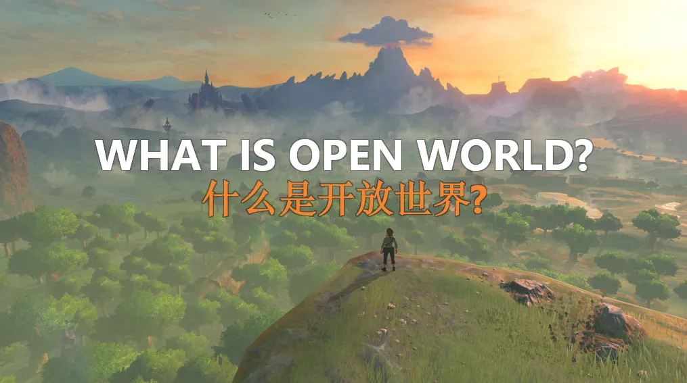

对于这个问题，相信不少人都是最初走出复苏神庙，登上初始台地时的印象,仿佛整个世界在你面前打开。

在我看来，开放世界本质上是一种关卡设计形式，就像一个足够大、足够开放的游乐场，里面充满了各种目标、挑战和奖励，玩家能按自己喜欢的顺序和方式，去完成对整个世界的探索，比如《刺客信条》系列。

而传统的线性游戏，它们更像一部电影，所见所闻都是导演精心剪辑后的结果。相应地，流程把控也更严格，玩家只能按叙事去推进，如关卡 A - B - C - D，像一条串起来的线，《最后生还者》是此类作品的优秀代表。

两者各有所长，而它们的最大不同，或许在于玩家是否享有探索完成整个世界路线、方式、目标的自主权和选择权。  

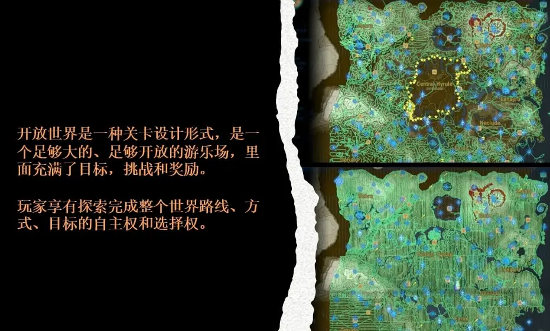《塞尔达传说：旷野之息》中的“英雄之路”就记录了玩家独特的探索路线

那么如何去设计一款开放世界游戏？  

我认为“设计”可以拆分理解，“设”是“设想”，“计”是“计划”。

设想是带有目的的想象过程。它源于我们的感受、知识、经历、或灵光一闪，在游戏成型前，开发者就已经设想出这是一个怎样的世界，会给玩家带去怎样的体验。

计划是我们的实际执行。我们根据初步的想法，加入对技术的分析与资源的规划，将它落实为可行的方案，从无到有地实现它。

设计就是在创意和可行性之间寻找交叉点，它是一个有目标的、通过技术与艺术的手段创建体验的过程。  

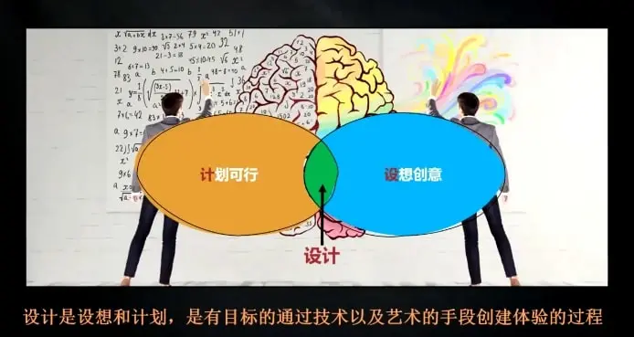

设计开放世界游戏的目标，相信大多数从业者和我一样，都是希望去创造新鲜有趣的游戏体验，让玩家去感受一段好的故事，沉浸到一个有生机有活力的世界中。

如何将这个目标实现，也就是我今天想要分享的主题。我会谈谈设计开放世界游戏的流程中会具体做些什么，不论你是未来有意创作游戏的爱好者，还是正在探索开放世界方向的
研发同学，希望这些经验对你能有所帮助。  

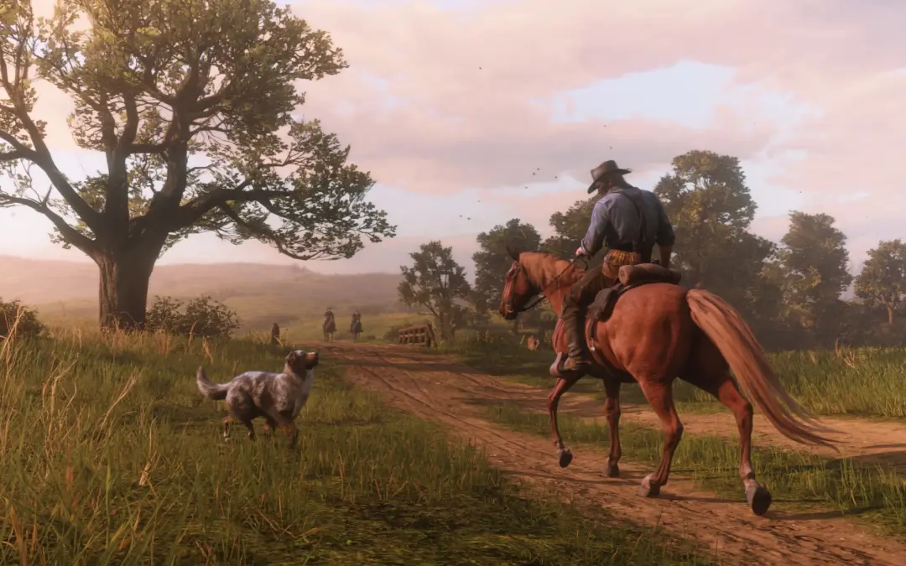《荒野大镖客 2》讲述了一段好故事，也展示了一个栩栩如生的西部世界

## 2.开放世界游戏的设计流程

在海外，3A游戏开发常被分为4个主要节点，分别是 Conception、Preproduction、Alpha 和 Beta。  

按我个人的经验总结，无论是开放世界，还是线性游戏，它们的设计都可被大致拆分为7个阶段：

  1. **立项（Pitch）** 
  2. **研究（Research）** 
  3. **文档（Documentation）** 
  4. **白模（Blockout）** 
  5. **可玩（Playable）** 
  6. **完成（Completed）** 
  7. **打磨（Polish）**

它们与4个节点存在一定的对应关系。接下来，我将对每个节点与阶段进行简要介绍。  

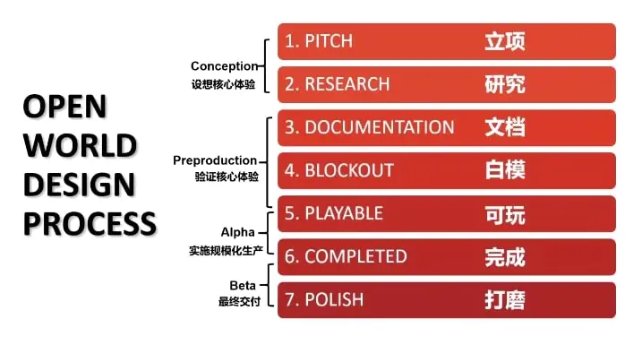

Conception 是早期的概念设想过程，通常包括立项与研究。

立项的重点是确认游戏的核心体验与创意方向。研究是尽可能查阅资料，为设想提供新的创意灵感与素材。

Preproduction 是确认设想后的计划过程，主要验证游戏的核心体验，是否有趣、是否跑得通。

这一阶段包含了很多前期准备工作，包括编写设计文档、搭建白模、准备生产工具、尝试打造一个可玩的雏形，也就是常说的 demo 或垂直切片（vertical slice）。

Alpha 是正式投产的过程，团队马力全开，迅速铺量，根据验证后的计划正式执行与实现功能，做出一个完成度较高的版本。

Beta 是准备上线前的最后一个打磨阶段，查漏补缺，修复bug，使游戏质量更接近完美。  

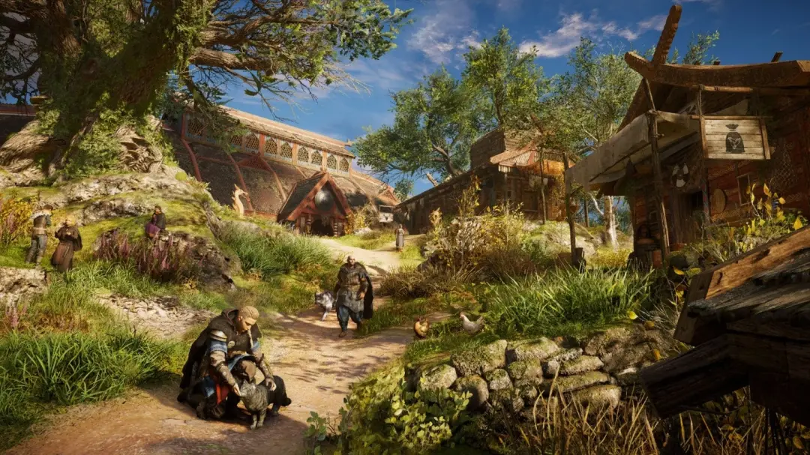《刺客信条：英灵殿》

### 2.1 第一阶段：立项

这个过程中，参与者通常是制作人、总监等核心成员。大家会围绕游戏设定、开发周期、预算规模、市场策略以及系统工具等因素，展开多轮运筹与讨论。

其中最关键的目标，是确定游戏的核心体验。  

怎么明确自己游戏的核心体验是什么？

设想是一个有目标的创意过程，不妨试想一下：只用一句话，你会怎么概括对整个游戏的感受？

这句话能否解答这样一些关键问题：这是一个怎样的世界，它能提供一段怎样的经历？玩家为什么会想玩这款游戏？相比其他同类游戏，它具有哪些吸引力和竞争力的地方？...

以我个人曾参与的《渡神纪》DLC“补天”为例。

众神大战之后，末日的天蚀要将世间万物抹杀，玩家将扮演一名神秘的英雄喾，前往两座云巅之山，蓬莱和不周，挑战《山海经》中的怪物，破解一连串东方谜题，最后帮助两位上古大神女娲和共工完成补天，解救这个世界。

这样一句话概括了故事的时间、地点、背景，以及玩家进入游戏后，体验到的玩法经历是怎样的。

除了一句话以外，最好再配上一张概念图，确定世界的整体氛围。

两者结合起来，就构成了核心体验的三个基本要素：叙事、机制和表现。通俗来讲，也就是故事、玩法与画面。  

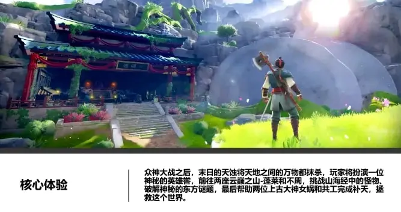

三个基本要素都服务于核心体验。

也就是说，三者相关的所有设计内容，都必须以增强核心体验为目的。我们把它当成判断和取舍的标准。

比如有人会提议，神话中有个厉害的怪物，能否加入到游戏里。

这时我们会围绕这个想法展开讨论，从叙事看，它是不是《山海经》里的，是否出现在故事发生的这个时间段；从机制看，它能否提供有意思的新挑战；从表现看，它是否带有吸引人的特征 ...... 符合的话，才会做进一步考虑。

之所以确立这些取舍标准，是为了保证核心体验的统一性。

理想情况下，开放世界应该给人一种真实感，哪怕是“架空世界观”，因为背后支撑的是一整套统一自洽的逻辑：比如这个世界的人文、历史是怎样的，为什么会是怎样 ... 它们为世界赋予了可信度。反之，则会让人觉得很混乱、很割裂。

开放世界的核心体验目标，就是为玩家营造一个沉浸感、想象力、可信度都极高的世界，玩家能够自然而然地去感受这个世界，沉浸到故事和玩法当中。

因此，一定要确保设计元素的和谐统一。

这也涉及到一个艺术想象和再创造的过程，我们会在设计流程的第二阶段“研究”中详解。  

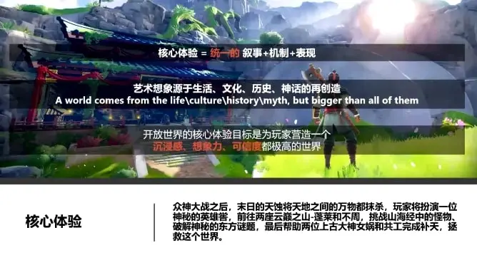

确定核心体验后，我们会进入一个自上而下（Top-down）的拆分过程。

比如故事核心是“补天”，根据神话原型，我们可以拆解出两个关键角色 —— 女娲和共工，前者是补天者，后者则是造成天劫的罪魁祸首。

沿着这条线继续深入，根据女娲大地之母的形象，我们设想了女娲的居所，云上仙山蓬莱；以及共工怒触的天柱不周山。“西北海之外，大荒之隅，有山而不合，名曰不周”，后者的风格更苍莽荒凉，以区分两个地区的特征。

在游戏中，你能看到不周山上空的天洞，我们将它设为旅途的终点。而途中，除了怪物，玩家也会遭遇各种阻碍，比如中国风的一些谜题，像是神秘画板、追逐三足金乌、或风的元素，以丰富游戏的玩法机制，并让角色的实力得以成长。

不论是时间、地点、人物、事件 .... 都是围绕故事核心，一层层拆分下来。一切与“补天”不相关的要素，都会被剔除掉。  

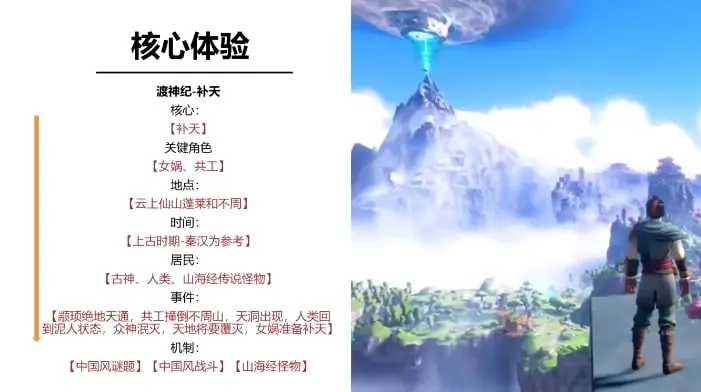

再举一个例子，大家也许玩过《超级马力欧：奥德赛》，这款游戏的核心体验又是什么？

个人认为，它的核心体验应该是“用帽子欢乐地去探索世界”。

我们可以发现它的很多设计，包括跳跃、战斗、附身怪物、场景互动与解谜，都离不开帽子，不难看出帽子贯穿了玩家的整个探索旅程，也是各种设计元素的核心。

因此，建议在立项之初，一定要想好核心体验是什么，可以用一句话一张图的形式概括出来，再围绕它们去进行拆分和排除，确保游戏的故事、玩法和画面都能保持统一的体验。  

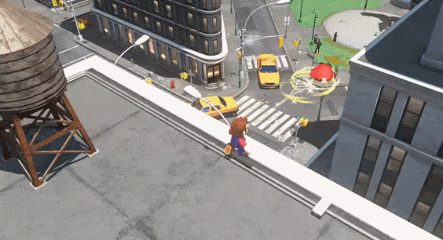《超级马力欧：奥德赛》中频繁用到帽子进行探索、战斗与解谜，构成了核心体验

### 2.2 第二阶段：研究

确定核心体验之后，我们就要开始投入大量时间精力，为后续开发做好详细的研究工作。

为什么要做研究？

因为任何创意工作的灵感，都来源于他/她对世界、对社会、对文化的认知程度，以及各种知识量积累的广度和深度。灵感不是无源之水，就需要通过大量研究和学习来补充。

我一直认为游戏策划应该是综合型的开发者，他/她在多个领域都需要有一定的知识积累：比如对建筑、枪械、载具，或者引擎、逻辑、脚本都有涉猎，这也是一种职业要求。  

越是经验丰富的3A大厂，他们的研究底蕴就越是深厚，比如《神秘海域》系列的顽皮狗，或者“世界旅游模拟器”大厂的育碧。在巴黎圣母院火灾过后，人们还跑到《刺客信条：大革命》里去怀念，还原程度可见一斑。这些研究底蕴也是大厂们的重要软实力。

那么我们该怎么去做研究？

还是通过实例来学习：在下图中，你能判断出左右两边，哪个才是上海的街道？  

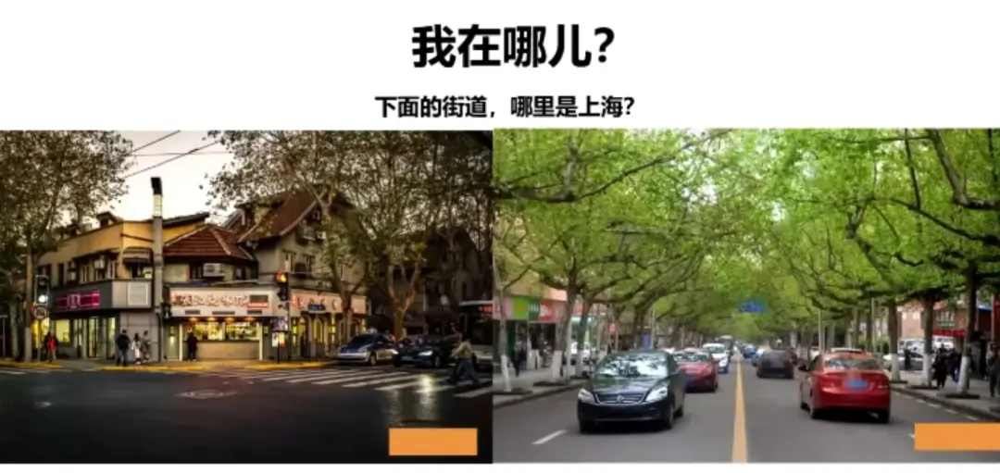

去过上海的同学可能会第一时间选左边。

左边的图源自我们之前做过的一个研究。我们发现，在上海的一些老街道，房屋的建筑风格会偏向洋式，且大多会选用淡黄色的墙漆与深红色的顶漆。

之所以会这样，我们猜测一方面是旧上海的历史，曾是十里洋场的租界，形成了一种海派文化；另一方面，也许是市政对文物保护的要求，也就成了延续至今的一个特色。

看似随处可见的建筑，从风格到配色，其实有多方面的考量因素。如果不下研究的功夫，你杜撰不出这些细节，也很难让人相信“这就是上海”。  

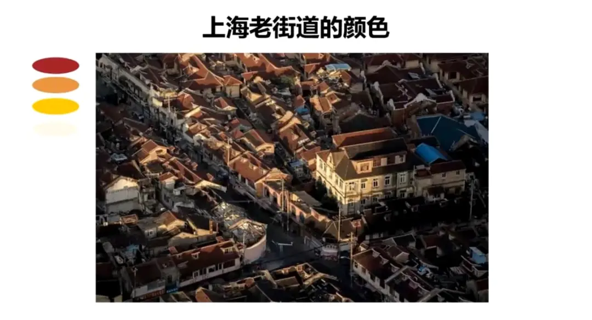

这些研究提供了创意基础。设计师需要做的，就是这一基础上进行“量身定制”的调整。

游戏存在多种风格类型，比如写实向的《看门狗》系列，对于芝加哥等城市有很高的还原度；也有幻想向（fantasy）的《超级马力欧：奥德赛》，都市之国纽敦市（New Donk City）则糅合了纽约与伦敦的特点，相对不那么还原。

还有架空世界观的《魔兽世界》，其中的部分设定能在现实中找到原型，比如巨魔一族的文化与建筑，显然参考了玛雅文明，又做出了一些差异。

所以，我认为本质上，设计是一个通过研究获取创意灵感，对艺术进行想象和再创造的过程：

为游戏找到一个拥有可信度的基础，然后在这个基础上去进行艺术加工，最终打造出一个“源于生活、又高于生活”的虚拟世界。  

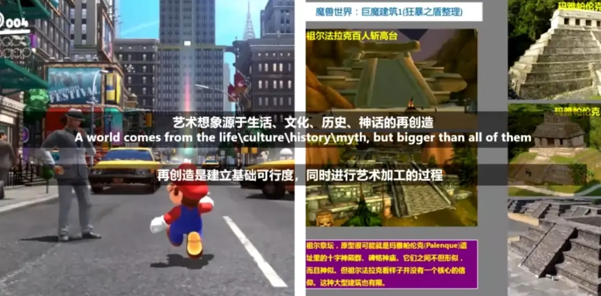

在研究阶段，我们一般会花上两到三个月的时间，去做大量的可信度查证工作，包括当地建筑、人文、地理、历史、当地故事、经济等等，输出一份世界可信度研究文档，内容量可能相当庞大。

比如《渡神记》“补天”DLC，当时我负责中国古代建筑结构的研究，最后整理了100页左右的研究PPT，为建模工作提供了参考。

研究可大致分为三步：  

  1. 前期准备：确定项目的命题种类，如“道路”“建筑”“人文”，或者是时间顺序，如“曾经”“现在”“未来”。

  2. 收集与整理：购买参考书，邀请相关专家，从浩如烟海的信息资料中，尽可能筛选出关键材料，整理成资料库；

  3. 文档输出：遵循项目实际需求，将研究结果以便于查阅的文档形式，清晰地汇总出来。

按我的个人经验，过程中需注意的要点包括：  

  * 目标明确、命题清晰：寻找能与游戏核心体验结合的趣味点，避免做无用功；

  * 注重细节还原：理解事物的来龙去脉，以及背后的人性化原理；

  * 保持好奇心：避免自以为和想当然，以免对后续开发造成误导；

  * 实地考察，切身体验：在有条件的情况下，这是最好的研究方式之一；

  * 可信度≠真实度：出于游戏性与技术限制等考虑，游戏往往不追求100%还原，而是基于写实及题材的再创造。  

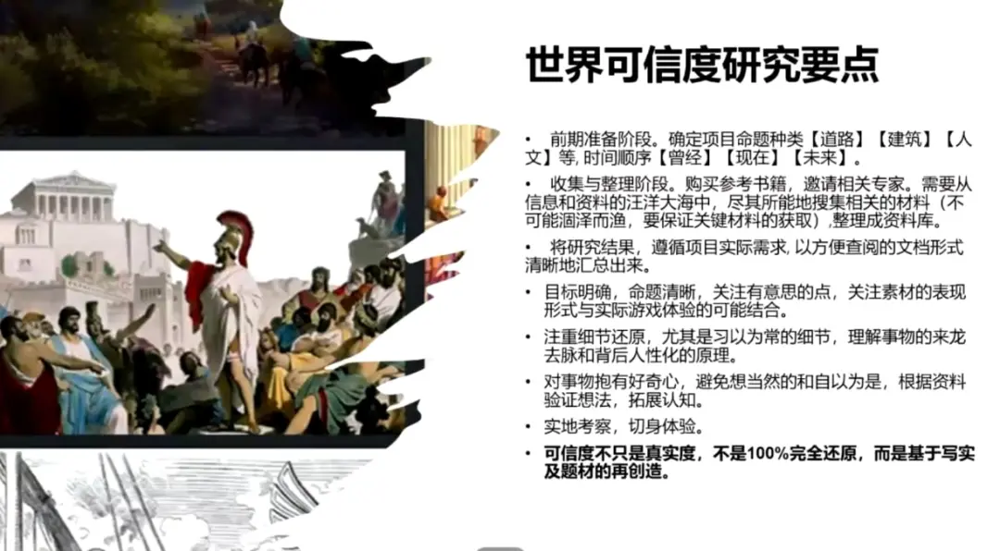

研究中，我认为很重要的一点是要摆脱刻板印象（Stereotype）的影响。

以《刺客信条：英灵殿》为例，大家印象中的维京人可能都是非常粗犷邋遢、头戴牛角盔、满身酒臭的大胡子形象，许多动画片也倾向这样刻画。

但在历史的研究中，我们会发现他们其实是那个年代挺爱干净的一群人，每周六都会洗一次澡，还有梳子、耳勺等工具，也会用一些小道具来打扮自己。

反观当时的英格兰，洗澡是件违反教诲的事，盎格鲁撒克逊人受天主教信仰影响，不主张频繁沐浴，尤其是在贵族当中，他们多用香水来掩盖气味，倒是维京人来了以后，带动了清洁习惯的推广。

所以做研究工作时，要尽量抛弃先入为主的观念，花时间抠细节，抱着好奇心一点点吃透，才可能让世界有足够的可信度。  

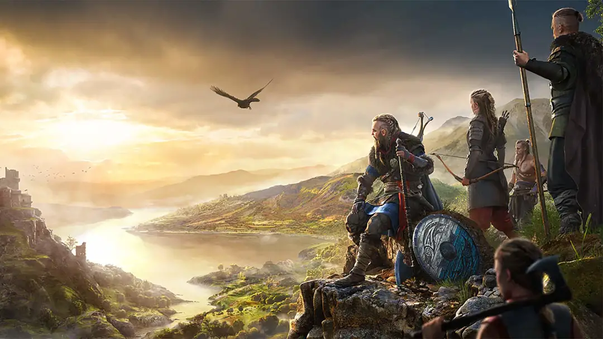《刺客信条：英灵殿》

### 2.3 第三阶段：文档

研究完成后，我们会进入设计文档环节。

为什么要设计文档？

像制作《刺客信条》这样量级的开放世界游戏时，通常会有上百人参与。因此，不论策划、美术、技术，都要求尽可能用文档来表达想法，目的是达成统一的、更好的沟通效率。  

单从开放世界关卡设计的角度来讲，设计文档一般被分为三类：  

  * 世界设计文档

  * 区域设计文档

  * 关卡设计文档

我们接下来谈谈每个设计文档的具体需求。  

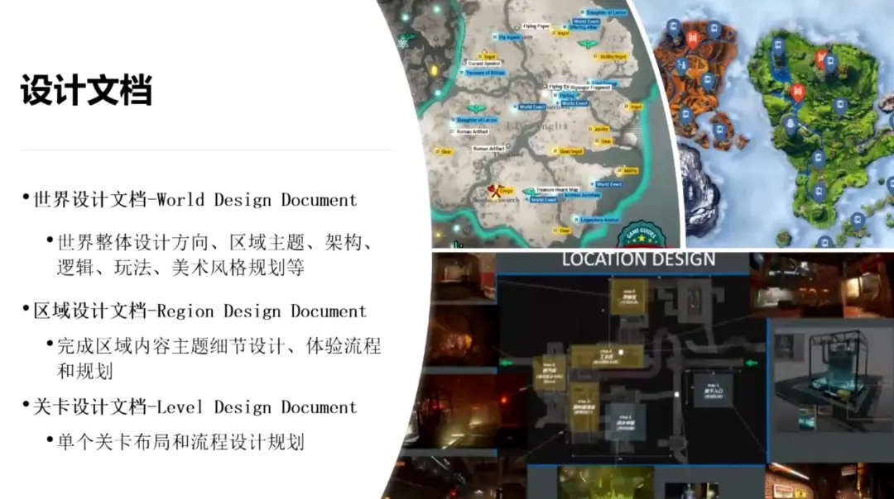

#### 2.3.1 世界设计文档

如果说前两步的立项与研究，还停留在“设想”和准备工作，那么从世界设计文档开始，就是承上启下地落实“计划”。

世界设计文档一般由核心团队负责，比如游戏总监或关卡总监，他/她会提出对于游戏的高概念（High Concept）设计，除了核心体验之外，世界设计文档还主要包括三部分：世界主题、世界架构、美术方向。  

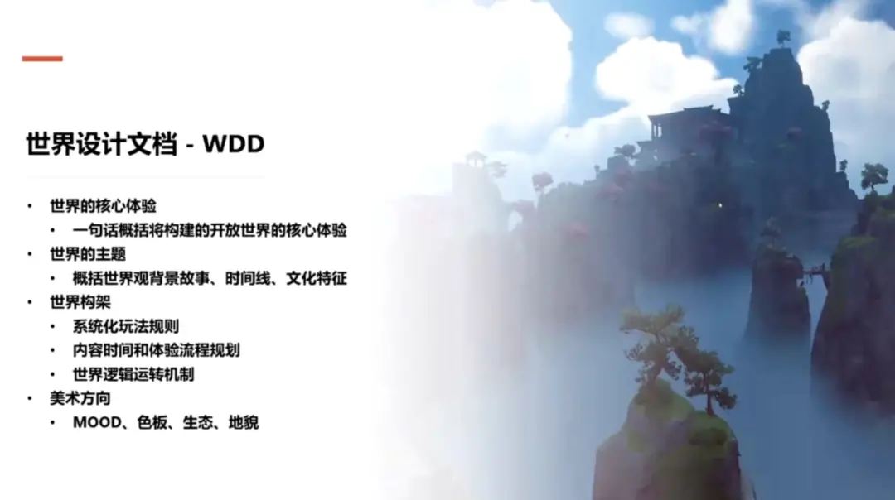

**世界主题**

世界主题是对核心体验的进一步延伸，它解释了原本“一句话、一张图”概括的核心体验，具体拆分到关卡设计中会是怎样的。

世界主题概括了世界观背景故事、时间线与文化特征等。

比如说《渡神纪补天》的核心体验是“补天”，那么世界主题就是“天洞出现之后的末世”，而拆分到两个区域的主题则是“女娲曾经造人教导人类的云上仙山蓬莱，如今人类石化、怪物肆虐”“黄帝部落为了对抗天帝曾经精心打造要塞和工事的不周山，如今处处破败、灾祸四起”。  

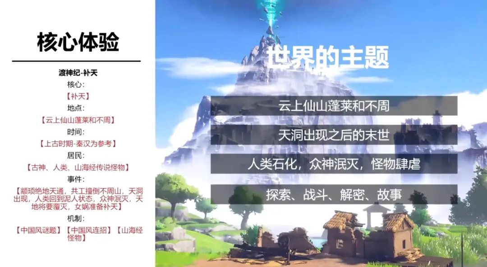

**世界架构**

拆分世界主题后，我们开始规划世界架构，它主要分为三部分：

  * 系统化玩法规则

  * 内容时间与体验流程规划

  * 世界逻辑运转机制

什么是系统化玩法？

一般来说，系统化玩法(Systemic Gameplay)就是支撑起整个游戏世界的最底层规则 —— 游戏中所有的独立系统，都通过这个统一规则发生交互，由此创造出故事、策略、路径、意外等多重结果。

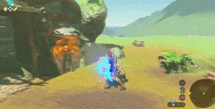《塞尔达传说：旷野之息》中包含了丰富的系统化玩法，火是其中之一，创造出了多种方式、策略与意外，供玩家自由探索

与核心体验自上而下（Top-down）的拆分过程不同，系统化玩法是一个自下而上(Buttom-up）的设计思路，通常包括以下三种：  

  * 元素化学，如水、火、风、温度；

  * 物理结构，如重力、体积、速度；

  * AI，如 NPC 的需求、反应、行为。

以化学元素“火”为例，它遇到风会蔓延、遇到水会熄灭；而当它遇到绒毛披肩这种材质的物体，还会猛烈燃烧，让 NPC 做出惊恐的反应；火势甚至能产生上升气流，让玩家一定程度上逆重力而行动。  

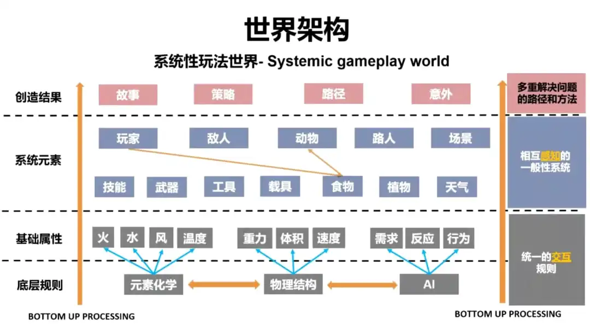

基于这些统一的交互规则，各个一般性的系统得以相互感知、相互利用，从而创造出解决问题的多重方法与路径。

比如在《塞尔达传说：荒野之息》里，我们能用多种方法去探索、解谜和战斗；在《孤岛惊魂》中，用鱼而非枪来对付熊，能让它成为我们的伙伴；或者在《看门狗》里，我们可以选择开车围堵，也可以骇入红绿灯系统，制造一场交通事故，来阻截正在追踪的目标 .....

换言之，构建系统化玩法规则的最终目的，就是确保“玩家享有探索完成整个世界路线、方式、目标的自主权和选择权”，也是开放世界游戏的“灵魂”所在。  

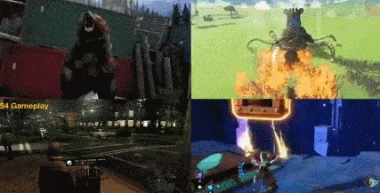

构建系统化玩法这一底层规则后，我们就可以在这一基础上，继续世界观设计文档的第二步 —— 开放世界的内容规划。

在我看来，内容规划主要分为两个要点，一是时间规划，二是流程规划。

首先是时间规划。

相比十年前的游戏市场，如今的游戏种类已是异常丰富，但玩家能体验游戏的时间精力却是相对有限的。以至于未来游戏和关卡设计的一个思考重点，必然是对玩家游戏时长的争夺。

所以，好的关卡设计师应该也是个时间规划大师，能为目标玩家提供最大化的时间利用效率，提高单位时间内的乐趣。  

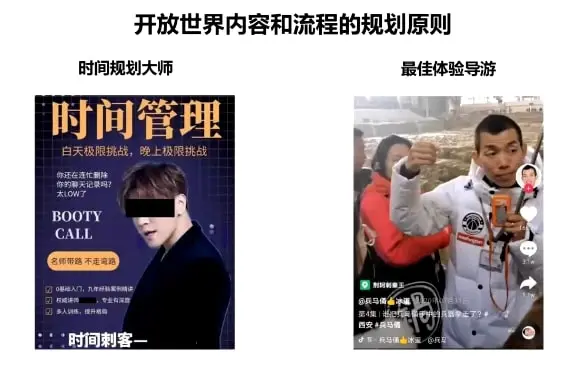

开放世界游戏的核心玩法通常包括三类，分为是探索、故事、战斗。根据游戏类型不同（如故事主导或 PvP 主导），三种玩法的比例也有所不同。

以故事导向的《刺客信条》系列为例，假如游戏时长大概在100个小时，那么探索、故事、战斗的配比应该是40%：30%：30%，也就是4：3：3。

为什么是这个比例？

首先，我们要理解游戏时长的算法，关注最佳时间效率。

不同于线性游戏按长线推进的紧凑节奏，开放世界游戏的体验带有更多碎片化、短线循环（短时间内能完成的单个Game Loop，如小章节、小关卡）的特征，探索、故事、战斗穿插进行。

比如剧情5分钟、战斗10分钟、探索30分钟，甚至长时间游离在主线剧情之外。因此开放世界的游戏时长，大致等同于短线循环加上探索时间的总和。  

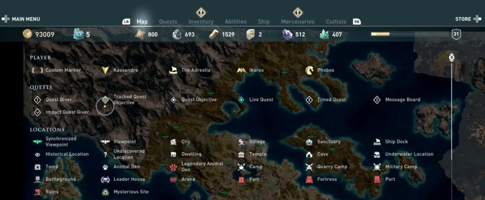《刺客信条：奥德赛》中多样的兴趣点图标，也为探索（白色）、故事（蓝色或黄色）与战斗（红色）进行了划分

我们曾对市面上的开放世界游戏进行了研究，结合《刺客信条》希望给玩家的体验，最终认为4:3:3的探索、故事、战斗比例较为合适。  

不论是平淡探索后遇到危机，还是紧张战斗后缓解心情，玩法的切换相当于一种调节剂，让游戏处于一种张弛有度的节奏中。

而如果是《绝地求生》这种大世界关卡的多人 PvP 游戏，单局时长可能在30分钟，而战斗可能只占10%至20%左右，大部分时间是在收集物资与隐藏。时间分配不同，体验也截然不同。  

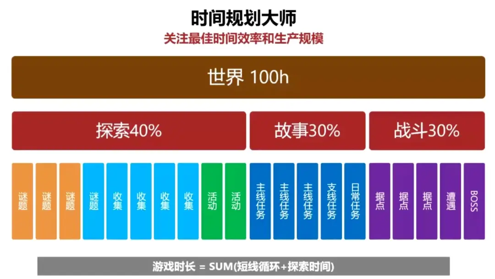

其次，是出于对开发成本与周期的管理。线性游戏可能只有20至40个小时的时长，而开放世界游戏的时长却往往达到100个小时以上。

在实际开发中，主线任务往往需要任务策划、编剧、角色动画、美术场景与配音特效等团队成员的共同参与，以至于一小时的主线任务，生产周期可能长达三个月，成本达到上百万美元。这样的生产规模是难以长线维持的，大型开放世界往往会添加更多探索内容作为填充。

因此，时间规划也必须考虑生产规模，才能在研发费用与周期可控的情况下，创作出探索、故事、战斗时间分配合理，受大众认可的游戏。  

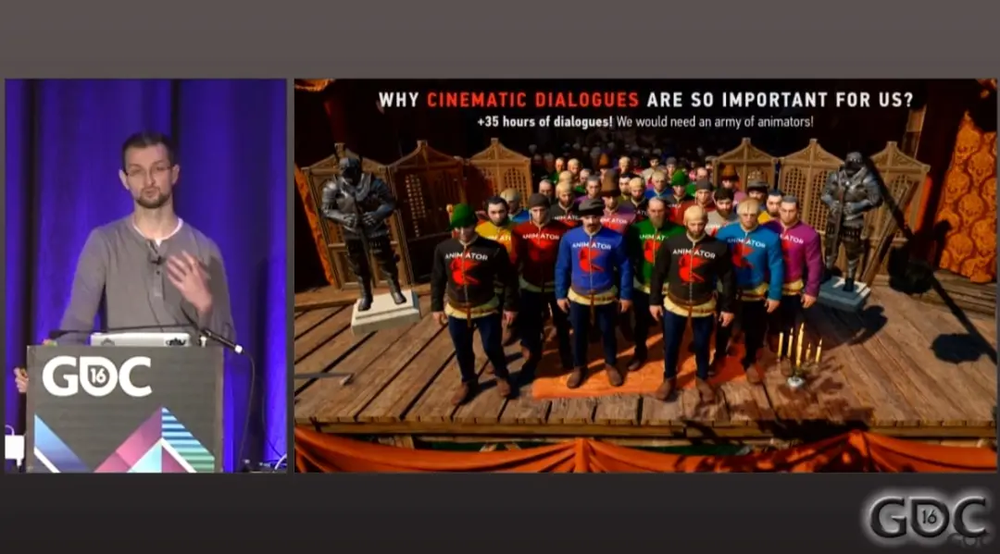《巫师3：狂猎》的动画导演，曾在GDC上分享了自动生成电影式对话动画的经验，原因在于游戏中的对话可高达35个小时，所需的人力与周期是远超想象的

说完了时间规划，接下来谈谈内容规划的第二个要点 —— 流程规划。  

为什么要做流程规划？

最开始我提到过，线性游戏像一部电影，而开放世界像一个游乐园。

而设计师扮演的角色，在前者中是导演，在后者中则是导游，本质目的都是通过适当的引导，如镜头推拉或流程规划，让玩家更好地享受到作品的魅力。

线性游戏的特征是低自主引导。游戏的故事线、玩家的成长线、关卡的难度线并行成长，玩家的自主权与选择权被限制在故事关卡内，只能跟随导演的思路。

这样的好处是能更好调动起玩家的代入感与情绪，比如《最后生还者》《神秘海域》都是剧情动人的佳作。  

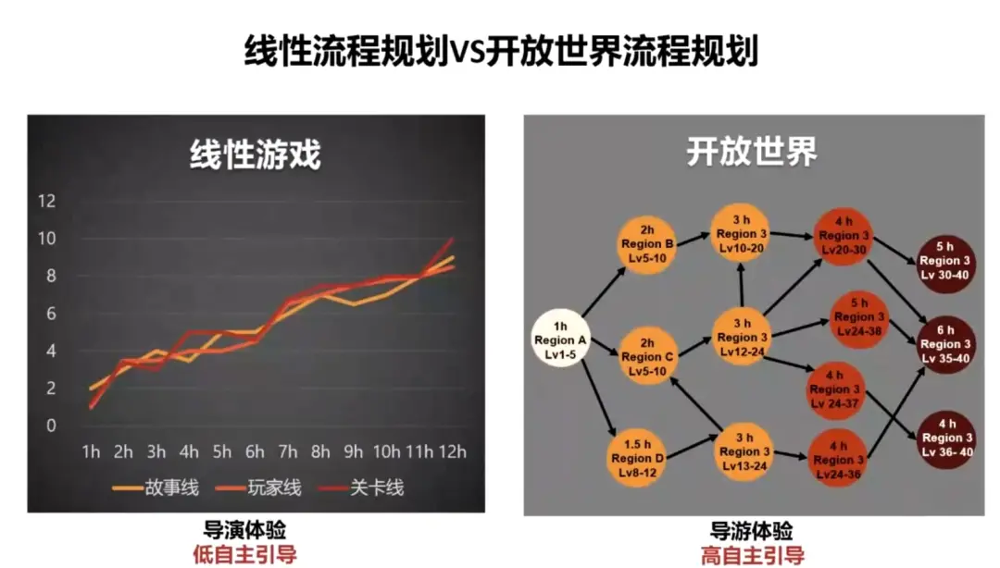

开放世界的特征则是高自主引导。玩家是拥有自主权与选择权的游客，体验流程像是登上一辆随上随下的游园火车，每一个任务节点和区域都是火车站台，可供停留休整。

导游的职责是服务游客，规划出一条最有效率、景色最好、也最人性化的主要路线，也就是游戏的故事主线。

主线之外，都是探险，但“导游”仍需要做好路线规划，即指引玩家去探索分支，也能适时引导他们回归到主线中来。  

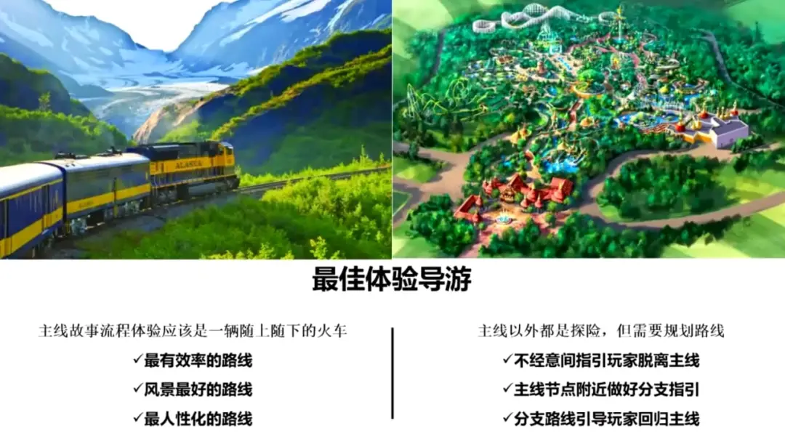

以《刺客信条：奥德赛》为例，它的主线流程其实并不复杂，就是一个寻找家人的故事，却几乎引导主角走遍了整个古希腊，他/她能在旅途中随时停留与探索。

游戏故事的大背景是伯罗奔尼撒战争时期，雅典和斯巴达处于激烈冲突，主角扮演的雇佣兵经常卷入到各种支线委托之中，背后总能发现圣殿骑士团的前身 —— 秩序神教的身影。他们操纵战争，散播恐惧，也是主角与亲人失散的罪魁祸首。通过这层背后关联，又自然地引导玩家回到主线当中。

总结一下，系统化玩法构成了世界架构的底层规则，世界游玩内容规划与流程设计构成了大体框架。

第三步，我们要为这个世界赋予一个逻辑规则，或者说AI系统，让它能够自动运转起来，更接近我们印象中鲜活生动的真实世界。

什么是逻辑？

简单来说就是“合理”，比如，马路中停车导致道路阻塞、偷窃失手导致守卫通缉、甚至杀了一只鸡被全村人围攻，这些应激事件与后果都一定程度上符合玩家认知中的逻辑。

这其实与前面提到的系统化玩法类似，都是系统策划与AI团队合作设定的规则。而逻辑系统进一步覆盖了游戏中所有AI自发进行的交互反应。

每个游戏的逻辑系统各不相同。我个人曾根据游戏AI的响应程度，对几个游戏中的世界逻辑进行了L0至L3的划分：  

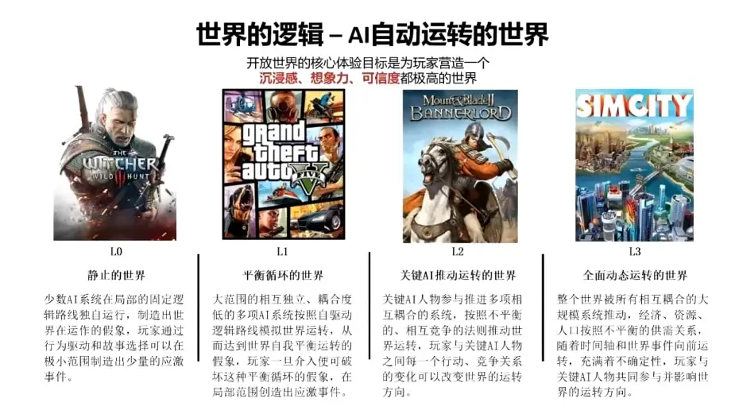

L0-静止的世界：如《巫师 3》，AI大多只在固定范围内移动，按设定的逻辑独自运行，玩家的活动一般只能在局部区域内造成有限的影响，像是静止湖面上微小的涟漪。

L1-平衡循环的世界：如《GTA5》，相对而言，AI的影响范围更大，有了流动的行人、车辆、路网AI系统等，它们形成了一种世界自我平衡运转的假象，应激事件带来的余波也会扩散得更广。

L2-关键AI推动运转的世界：如《骑马与砍杀》，这是一个中世纪角色扮演游戏，玩家可以组建自己的势力，与其他AI势力展开竞争，每个势力都会有一个代表性的领主。

不平衡的、相互竞争的法则推动着世界运转，玩家与关键AI人物间的行动与关系可能改变世界的运转方向。

这种关键AI推动的逻辑系统变化丰富，却相对可控，我认为未来会有更多这种设计的开放世界游戏出现。  

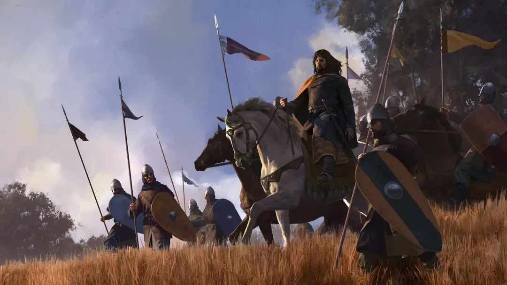《骑马与砍杀 2》中角色众多，势力众多，但以单个领主为核心

L3-全面动态运转的世界：如《模拟城市》，整个游戏内的经济、资源、人口等系统，都是牵一发而动全身的。这样的系统可能被随机事件和时间推动着向前发展，处于一种不确定的动态变化之中。它的逻辑系统是最为复杂的，玩家乃至开发者也很难去把控每个变化。  

当然，L3模式的系统常见于非叙事向的模拟经营游戏中，因为完全动态变化的剧情故事，目前是技术上和开发成本上都难以实现的。

上述仅代表个人观点，欢迎探讨。

我认为开放世界游戏的未来形态，也许会像美剧《西部世界》一样科幻：

不但拥有高度系统化的玩法，AI的逻辑系统也已经极为完善，玩家的一举一动都可能带来千丝万缕的影响，创造出无限多的可能性，吸引玩家沉浸其中，不断回归。

至此，世界架构已经大致完成。  

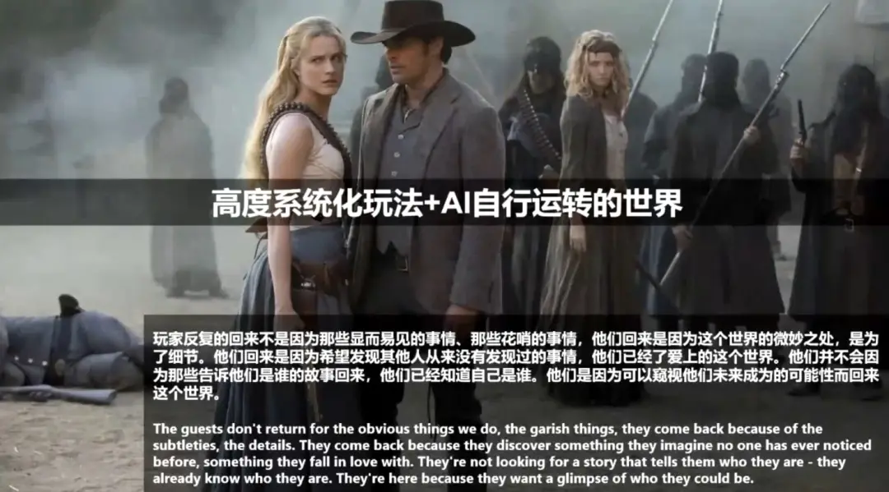

**美术方向**

美术方向是世界设计文档的最后组成部分。

美术团队会尽可能收集参考图片或者概念图，拼接成 Mood Board 和色版，与整个开发团队对齐最终的美术风格和指导思想。  

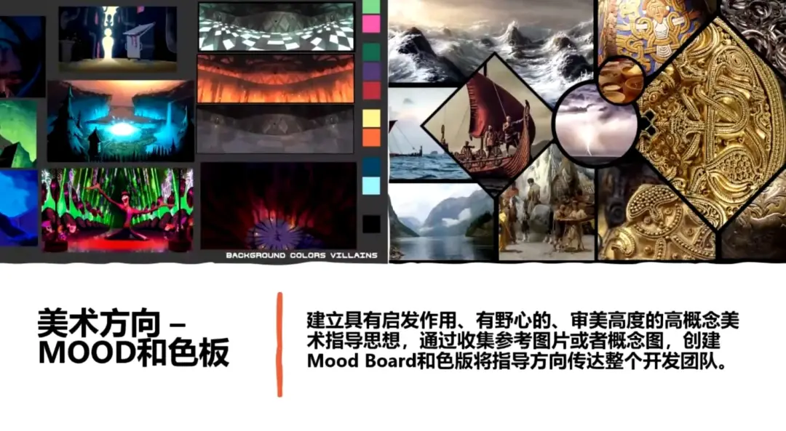

在这一环节，值得注意的是，如果游戏存在野外环境，那么美术团队还要做实充分的生态和地理研究，比如当地的动物群落、植被分布和地貌环境，从而建立一个丰富多样、写实度高的世界。

当然，大部分工作其实在研究阶段就已经开始筹备。

尤其对于大型开放世界而言，很难完全由手工来打造地形，这时往往要使用程序化自动生成的方法，对水体、植被、地貌等进行生成，充实的生态和地理研究也就成为了一个必要
前提。  

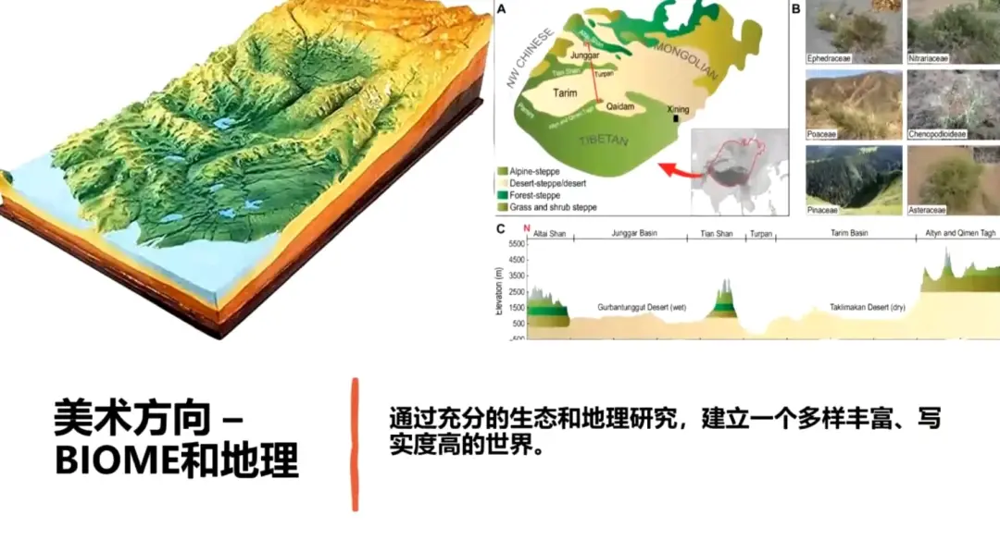

除此之外，建筑也是美术方向中极为重要的一面。美术团队会设计大量的街道建筑平面图，解释细节设计、还原程度、人物与建筑之间的比例、以及拆分规则和重复利用。

大家在游玩开放世界时，有时或许会发现一些建筑美术素材的复用，在时间与人力成本有限的条件下，这是难以避免的。

如何将它们不着痕迹地利用起来，做出风格上的差异化，也是一门考验技巧的手艺。

这也涉及到了接下来要谈的区域设计小组的工作。  

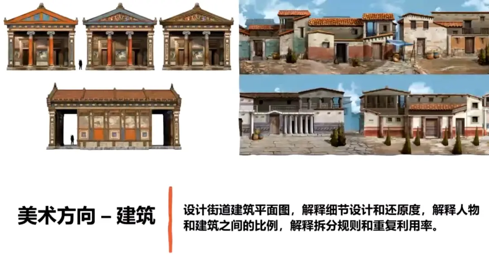

#### 2.3.2 区域设计文档

如果说世界设计文档是对整个世界的指导方向，那么区域设计文档（Region Design Document）就是具体的执行计划。

区域设计文档一般由区域开发小组负责，在关卡主策或关卡主美的主导下，团队对所负责的区域进行设计规划。

它同样是一个自上而下的拆分过程，覆盖该区域内的所有内容，包括区域主题、场景风格与体验流程等，具体如下图：  

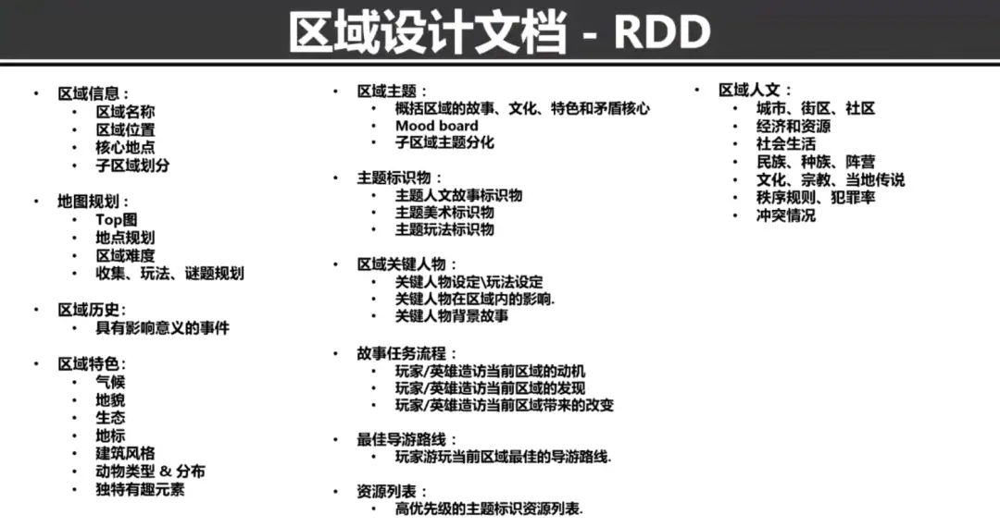

一片区域的内容分布并不是绝对均匀的，而是包含了多个分散的子区（Content Hub），来放置地标、主题标志物、任务点等内容。

每个子区都像一个火车站台，中间的红色区域则像是中心火车站，这里同样需要运用到内容规划的两个原则 —— “时间规划”与“流程规划”，关注区域中玩家的体验路线，做好多样化设计与留白，尽可能避免重复感，提供新鲜感。  

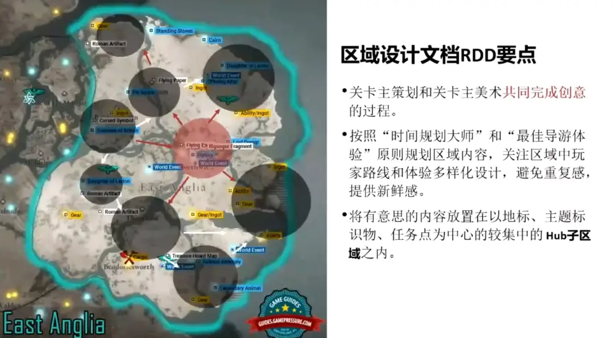

下图是《绝地求生》的玩家活动热力图，可以看出它其实也采用了这种子区的设计。但与故事导向的游戏不同，PvP导向的开放世界游戏，玩家的探索路线是更偏向随机的，会受到各种因素，比如跳伞位置、毒圈等影响，因此很少存在“最佳体验路线”一说。

但整体而言，两者的内容规划逻辑是非常相似的，同样是开放的多入口布局，并把战斗节点、收集品等玩法内容，预留到子区域内。

同时，子区与子区之间，会保留非常多的通道，确保为玩家提供充足的自主权与选择权。

这就是区域设计的一个基本思路。  

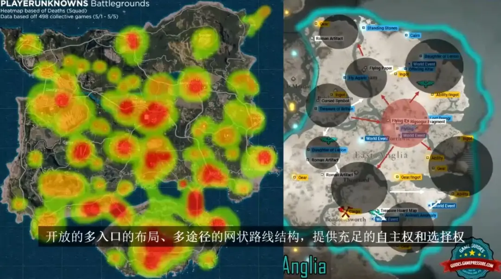

#### 2.3.3 关卡设计文档

关卡设计是对区域设计的进一步细化。大型开放世界的单个关卡一般以据点的形式呈现，比如《刺客信条》中的一个军营或村庄。

关卡设计文档（Level Design Document）一般由具体执行的关卡策划与关卡美术共同完成，包括单个关卡的布局、玩法规则与设计元素等，具体如下图所示：  

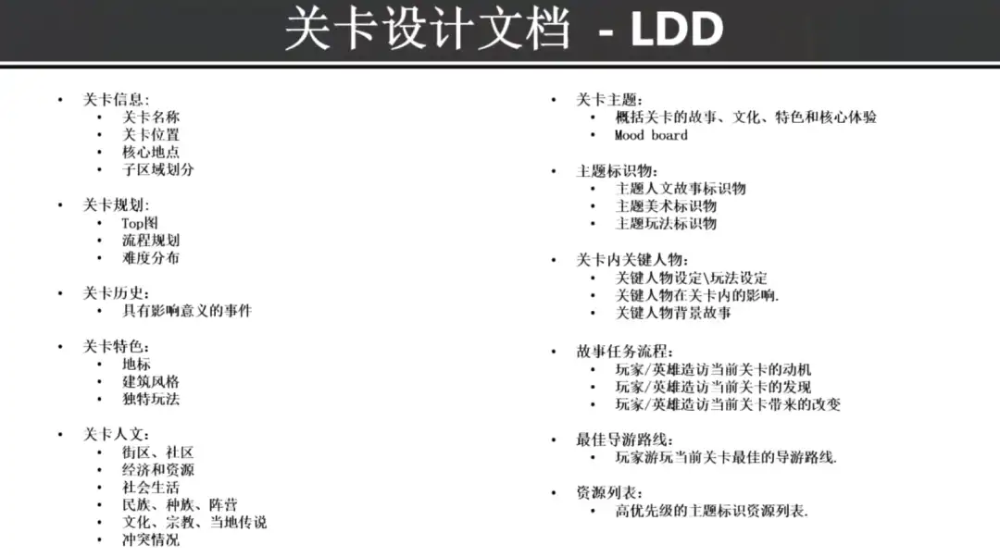

我常常调侃，在关卡设计过程中，关卡策划与关卡美术应该是“心意相通”的一个合作状态：策划也许缺乏设计上的艺术程度与美感，而美术同学则可能不太理解玩法的规划与布局，就需要双方的专业性相辅相成，缺一不可。

关卡设计的第一步往往是选取参考图。

相比凭空想象或抽象沟通，实体参考图是为策划和美术表达环境故事、主题设计的最快速直接的方法，其精准性也会影响到想法传达的准确性。

因此，参考图的选取以可信度优先，尤其是对于写实题材的游戏。我个人也鼓励策划和美术，去通过谷歌地图或影像资料等方法，直接引用现实地点的俯视图。

然后，在此基础上加入可玩元素，比如将墙、窗户打通，为系统化玩法预留出更多发挥空间。  

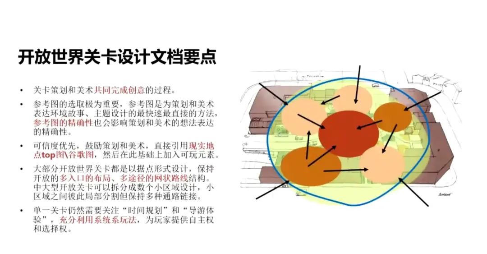

此外，关卡设计也同样遵循内容规划的双原则。设计师同样需要关注“时间规划”与“流程规划”，并充分利用系统化玩法，来为玩家提供自主权与选择权。

以《刺客信条：奥德赛》为例，下图是一个敌人的据点，它的设计流程应当是这样的：  

  * 在网络上寻找可参考的堡垒俯视图，在图上初步划分出多个子区；

  * 为每个子区设置开放的入口，并在子区之间添加多途径的通道，构成一幅四通八达的网状路线；

  * 填充更多系统化玩法的元素，比如刺杀点、可收集的宝箱、可范围燃烧的油罐、可烧毁来打击士气的军备、或是可释放的笼中猛兽... 提供玩法上的多样化指引。  

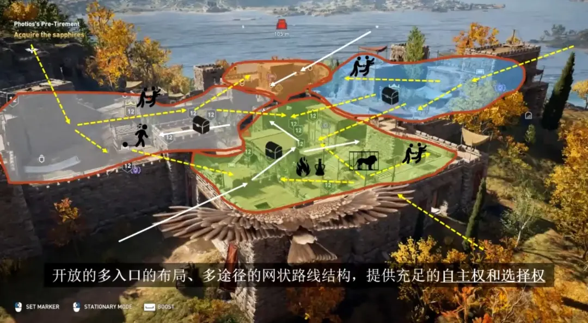

在设置完成后，玩家的体验流程可能是这样的：他/她潜入据点，根据小地图提示，先释放了笼中困兽，引开了敌人的注意，然后通过多个途径绕开剩余守军，把几个宝箱搜刮一空，最后临走前投掷火把，点燃了大片油罐，火势瞬间蔓延，把军备也烧毁了，敌方势力元气大伤。

这些系统化玩法的顺序是可以先后调换的，因此给予了玩家很高的自主权和选择权，觉得自己充分发挥了聪明才智，得到了强烈的正面反馈。这也是设计者理想的效果。

当然，纸上得来终觉浅，个人不建议在关卡设计文档上花费太多时间，过于追求尽善尽美，还是要在实际体验中去验证效果，做出调整。  

### 2.4 第四阶段：白模

这个“实际体验”的过程，就是白模搭建。

团队会根据设计文档，搭建未上色的3D模型（白模），通过快速迭代的方式来验证原型、标准和想法。  

在这一环节，主要可分为以下四个阶段，我们将逐一详解：  

  * 定义标准参数  

  * 验证玩法  

  * 验证想法  

  * 工业化生产准备与预研  

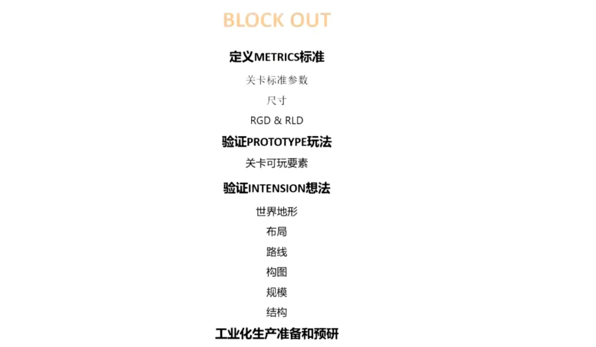

#### 2.4.1 关卡标准参数

关卡标准参数（Metrics），指的是角色与环境中的物体交互的量化参数，比如移动、跳跃、掉落、战斗，与玩家的体验密不可分。

因此，它也是RLD（理性关卡设计，Rational Level Design）与RGD（理性游戏设计，Rational Game Design）两种理论用于衡量玩法难度的基础参数。

打个比方，在《超级马力欧》游戏中，根据下个平台与马力欧之间的距离，我们可以拆分成几个难度，比如两个单位距离，为简单难度的跳跃；四个单位距离，为中等难度的跳跃；而六个单位距离，则是最高难度的跳跃。

这时，跳跃距离的参数就成为了衡量关卡难度的统一标准，我们得以用客观的度量，而非主观的感知来衡量当前关卡的难度，以免出现“设计者觉得简单，却难倒了多数玩家”的情况。

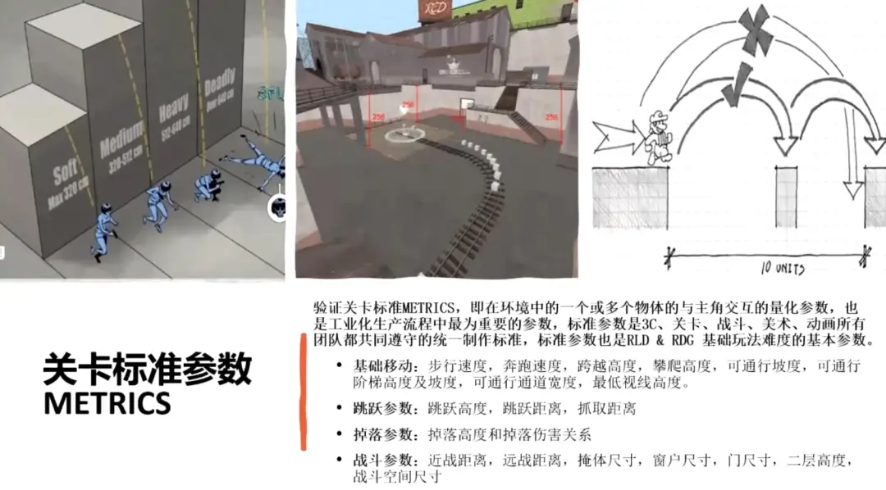

同理，假如角色蹲下的高度是0.5米，那么为了照顾玩家掩体射击的体验，掩体高度也一般会定在0.5米，这就成为了一个标准参数，所有相关的战斗、动画等系统也会基于这一参数去制作。

因此，在白模阶段，3C（角色、相机、控制，概念源于 Character、Camera、Control）、关卡、战斗、美术、动画等所有团队，都会共同遵守关卡标准参数，以确保达到统一的制作标准，这是规模化效率生产的必要前提。

为了寻找最佳效果，定义标准参数往往是一个快速试验、快速迭代的过程。

首先，3C、动画、关卡美术等成员会一同建立测试关卡，预制所有关卡条件下都能用到的标准参数模块和建筑件，将它们统一命名。

其次，团队会开始利用这些统一标准的模块和预制件，进一步搭建测试空间，测试不同的空间、通道、楼层等的高度。  

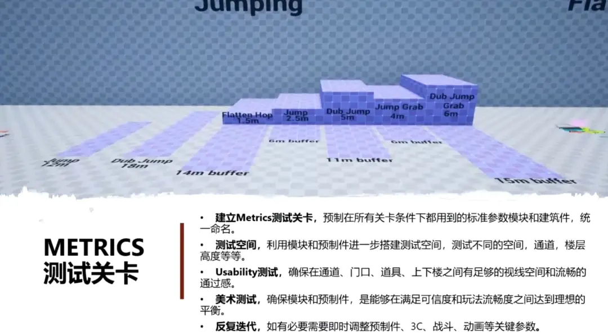

随后，测试人员开始进行可用度（Usability）测试，也就是确保在通道、门口、道具、上下楼之间有足够的视线空间和流畅的通过感，消除潜在的阻碍因素。

可用度测试通过后，美术同学入场，对预制关卡进行可信度修饰，比如这个1米高度的白色模块，反映在游戏里应该是什么样子？是墙壁、门窗、或是木箱等场景道具？它在当前场景中的存在是否合理、可信？...美术测试的目的，就是确保模块和预制件，能在可用度与可信度之间达到一个理想的平衡。

最后是反复迭代。基于大量的测试结果，团队对预制件、3C、战斗、动画等关键参数进行全面评估，讨论是否有必要即时调整，一旦确立之后就不会再轻易修改。

定义标准参数是一个非常基础、却非常重要的过程，它的测试与反复迭代会经历一个较长的周期。

为何如此重复强调？下图就是一些标准化参数不到位导致的 bug 场景。  

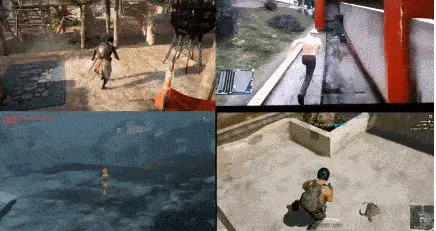

大型开放世界游戏，其制作往往需要成百上千人的参与，以至于我们很难保证标准参数被100%遵守或执行。

比如有些美术同学觉得留一条缝隙，会显得比较美观，结果却可能导致角色穿模或卡住不能动弹，严重破坏玩家的体验。而这些情况是层出不穷的。

因此，我们往往需要QA团队参与开发过程，花费大量时间去穷举所有的边界条件，随时随地把控标准参数的执行情况。

在正式定义标准参数之后，我们开始将它运用到游戏的各个方面。

这时我们会进行更多的模块化设计。它是工业化生产的基本理念，涵盖了系统化玩法元素因子、建筑模块拆分、场景道具拆分等。

建立模块化预制件和测试关卡，你可以把这一过程理解为拼积木，是一个拆分简化的过程。

拥有足够多、足够细的积木，就能拼凑出千万种形态，比如一座建筑、或是建筑内的道具摆设。通过这种反复拼接、重复利用的方法，就能在控制数量的情况下，达到较好的差异化效果。  

我曾见过一些初入游戏行业的同学，抱着满腔热情，希望每个模型、每个关卡都是独一无二的，为此付出许多时间精力。我不排斥这种做法，但这种精耕细作，是难以在大型开放世界游戏的开发中实现的，更可能导致进展缓慢，效率低下。

我认为更好的做法，是在模块化设计与工业化生产的基础上，融入自己对于设计和需求的思考，并将它们普遍应用到更多的场景或玩法中，这是远比单个细节出彩要更好的，也应是大型项目团队中每个人的义务。  

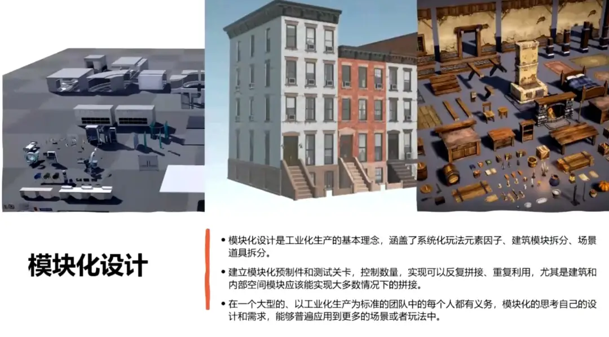

#### 2.4.2 验证玩法

在白模阶段，系统策划还会搭建一个系统化玩法元素（Gameplay Iingredients）的原型测试关卡，将所有玩家可交互的元素、物理化学反应元素，按照标准玩法的各类情况统一放置，方便反复测试和验证。  

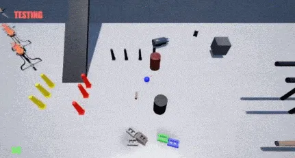

这种集中化的测试关卡，一方面便于穷举一些边界情况，比如多种元素共同反应。

另一方面，也能随时灵活拼接，重复利用，为关卡策划提供一些实际玩法的参考，比如谜题设置与解谜方法，最终确保任务与关卡的多样化、系统化与涌现性。  

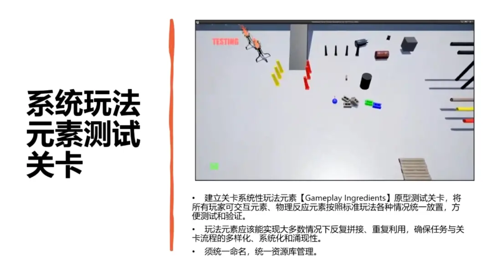

#### 2.4.3 验证想法

在定义了关卡标准参数、完成了模块化设计、验证了系统化玩法元素之后，团队终于开始尝试构建整个世界模型，验证所有想法。

这时，我们会根据世界设计文档或区域设计文档，利用地形生成软件 World Machine 快速建立世界地形，我们一般称之为 First Terrain Pass，并在此基础上进行大规模地点的白模铺装，如下图所示。  

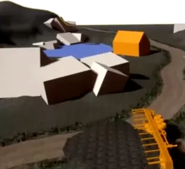

尽管这一阶段的白模仍显简单，但主要目的在于将此前规划的流程完整呈现出来，并放入角色去代入体验，验证是否符合原有的设计想法：

比如作为“时间规划大师”与“最佳体验导游”，我们原本预期中的十小时流程体验会是怎样的？如今实际感受到的体验又是怎样的？两者是否一致？存在哪些不符合预期的地方？...

经过白模铺装的体验实测，我们得以做出一个整体判断。

为何要在白模阶段就验证所有想法？

一方面在于游戏雏形的基本要素已经就位；

另一方面，一旦进入正式投产阶段，想要回头修改各方面设计，所耗费的成本将极为高昂，几乎等同于推翻重做。因此，在白模阶段统一验证想法、做出取舍至关重要。

这个过程中，验证的内容包括但不限于世界区域密度、世界规模、地形环境、道路关系、剪影指引等等，确保世界具备最基本的子区域结构，或者说火车站结构。  

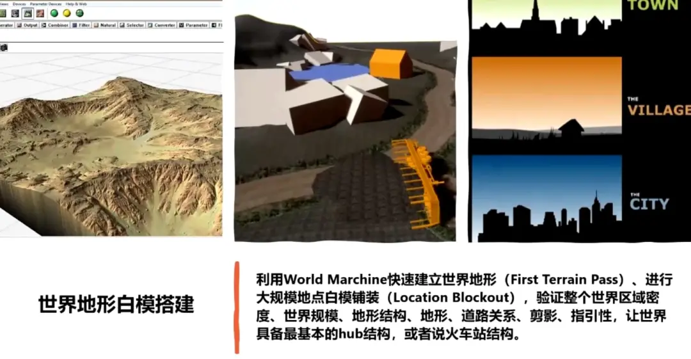

#### 2.4.4 工业化生产准备与预研

确认了标准参数、玩法与想法，设计流程暂时告一段落，进入到工业化大规模生产的准备和预研环节，主要包括以下四个方面：

  * 工具准备  

工具包括地形工具、脚本工具、任务工具、PCG工具、动植物生态（Biome）工具等，视世界需求而定.

如叙事导向游戏需要更多任务工具，交由团队统一验证与持续开发。

  * 管线准备

测试并规范关卡策划、关卡美术、技术策划、技术美术、任务策划 ... 等职能的分工与合作流程。

如关卡策划主要负责设计文档的输出、白模铺装的布局规划，而关卡美术负责美术指导方向的把控、资源管理、以及布景装饰等等。

流程清晰、分工明确的生产管线，能极大提升工业化生产效率。  

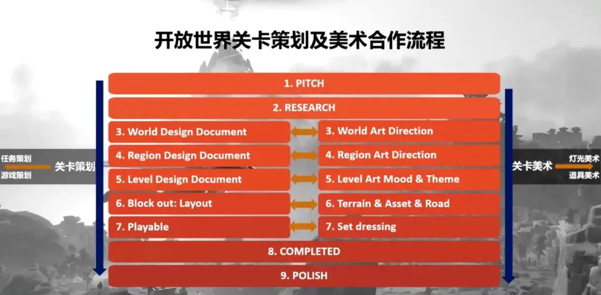

  * 系统准备

搭建AI系统、战斗系统、任务系统、可玩元素等基础玩法系统。

确立整个开放世界的底层交互规则与运转逻辑，为玩家提供充足多样的系统化可玩元素。

  * LoQ质量标准（Level of Quality）

要求每个职能根据自身领域，按开发阶段拆分LOQ质量标准列表，定义各个阶段交付内容的数量与质量。

相当于一张按照各个阶段版本质量交付的checklist，可供量化判断是否达标。

通常LoQ分为：L0设计文档交付，L1白模可玩版本交付，L2玩法及流程完成版本交付，L3细节打磨及内容完全填充版本交付，L4特定关键内容进一步打磨版本交付。

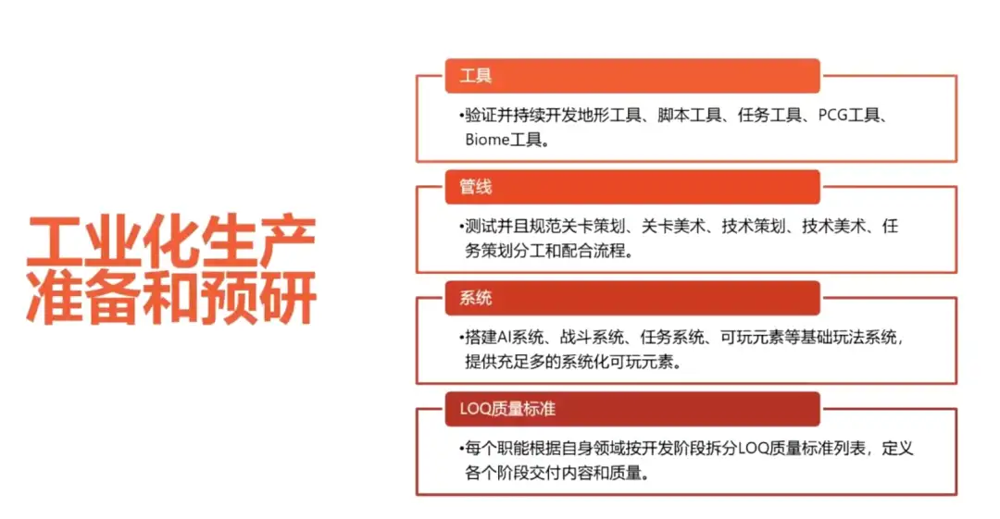

总结而言，白模阶段其实是一个搭建标准化原型、验证想法、为工业化大规模生产着手准备的过程。

核心团队会对整体设计方向进行最后的回顾与验证，做出设计意图上的取舍，比如增减功能或扩缩规模，以确认游戏世界的最终形态。

我认为值得注意的细节要点整合如下：  

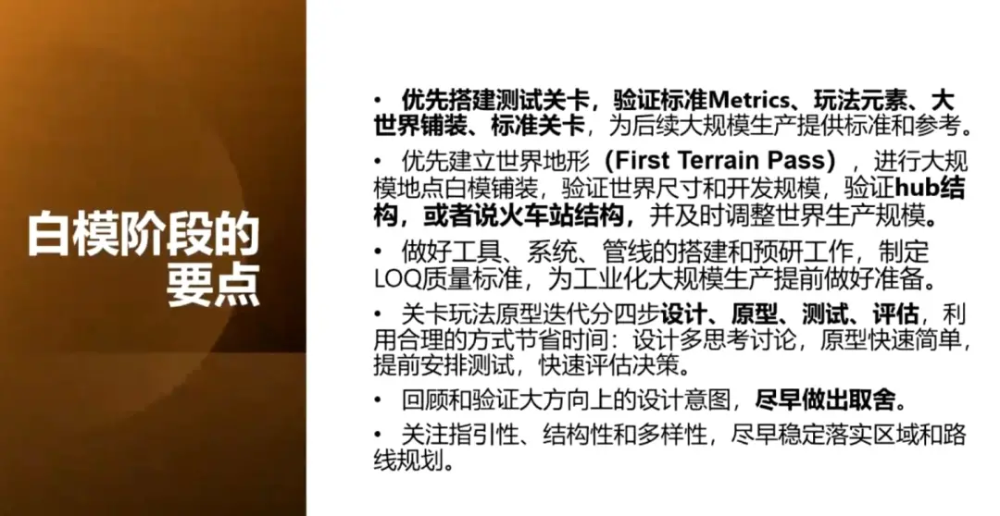

### 2.5 第五阶段：可玩

完成白模阶段后，团队正式进入到工业化大规模生产的流程。

如果说白模阶段关注的是设计意图和开发规模，那么可玩阶段关注的是世界可玩性的实现：

策划专注于实现玩法、流程和难度，美术专注于实现场景的主题和故事性，共同解决主要的技术问题，从而实现一个体验流畅、可玩性足够丰富的世界雏形。  

可玩阶段的工作重心主要包括下图中的6个方面，都是在世界地形和白模铺装基础上的进一步加工细化。  

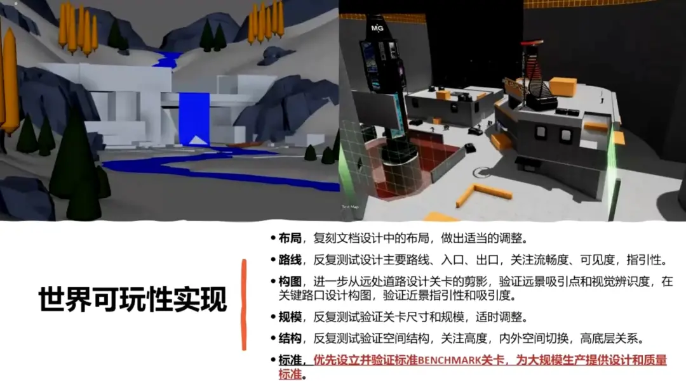

这一阶段仍带有测试、调整和迭代的用意，也仍允许部分场景中白模的存在，直到“完成”阶段才会完全替换掉，存在修改余地。这里主要谈谈其中的“标准”环节。

前面曾提到，大型开放世界游戏制作的一大挑战，就是在上千位成员参与的前提下，如何保证内容质量达到统一标准。正如木桶效应，区域与关卡设计的平均水准，左右着玩家对于世界整体可玩性的印象。

因此，我们往往会由一个主工作室或核心团队，去优先选择一块区域来搭建可玩Ddemo，也称 First Playable Demo。

它相当于一个最有经验、最高质量、最具可玩性的设计模板，为其他内容团队提供一个参考基准（Benchmark）。  

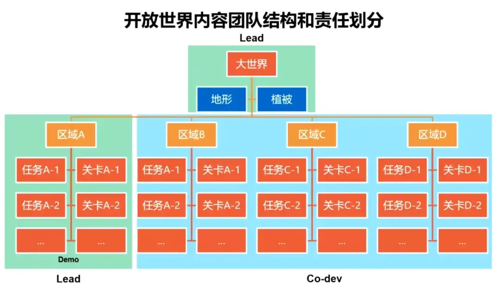

随后，我们会将各个区域分派给多个责任团队，展开联合研发（Co-dev）模式，通过对齐Demo的设计和LoQ质量标准，来实现规模化的生产铺量。

同时，每个职能都会提出自身对于可玩质量标准的一个判断。

下图是我结合自己关卡策划的经验，认为在可玩阶段应该达到的L1质量标准，其中包含较多个人看法，不完全等同于育碧的工业化标准，仅为大家作为一些参考：  

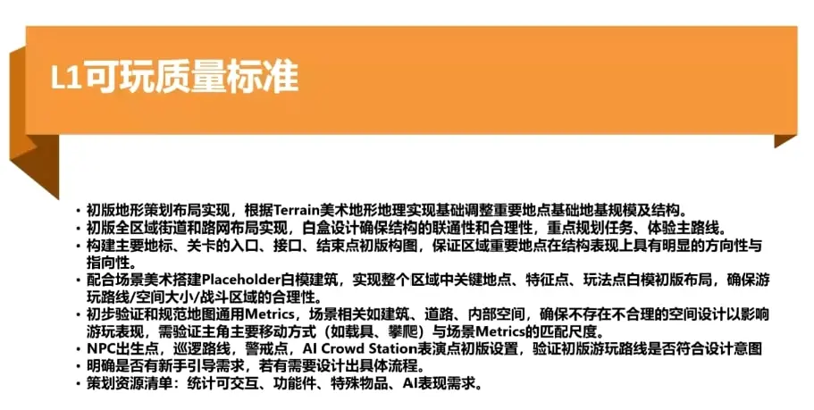

### 2.6 第六阶段：完成

我个人认为开放世界游戏研发的最后三步 —— “可玩”、“完成”与“打磨”，其主要差别仅在于完成度。

它们都是在前四步打好基础的条件下，做进一步的细致填充，很少会再大规模推翻重做，如果出现这类状况，往往意味着项目出现了严重问题，最终要么只能赶鸭子上架，要么只能跳票延期，两者在大型3A游戏研发中并不少见。

话归正题，在“完成”阶段，整个世界框架已经完全确立，团队进行纯粹的填充工作，即按照原有的规划设想，进一步完善世界内所有的玩法、收集点、故事、功能、美术、效果、氛围等，并保证整个世界达到完整质量，通过内部测试。  

所谓内部测试，本质是一个系统性的验收，比如各种玩法的完成度与细节程度、场景的完整度与可信度、剧情演出的填充度，是不是都达到了一个100%的标准。

QA同学也会进行大量的边界测试，验证关卡标准参数（Metrics）是否得到了全面贯彻，是否可能有潜在bug。

下图是在“白模 - 可玩 - 完成”阶段，同一关卡的不同模样，不难看出细节与精度都得到了极大的提升，而这些细节修饰也不会影响到整个流程，因为已经在前几个阶段完整验证过了。  

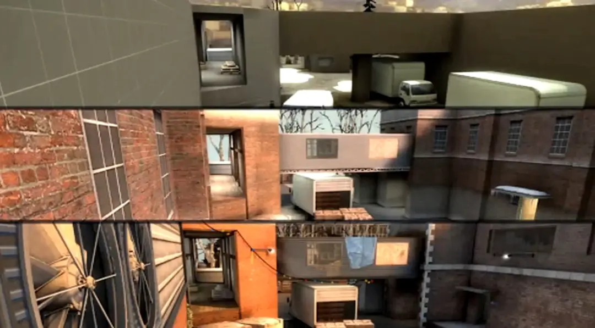

同理，下面几张图展示了在单个关卡内，《神秘海域》从“白模”到“完成”之间的区别，大家可以直观地感受一下。  

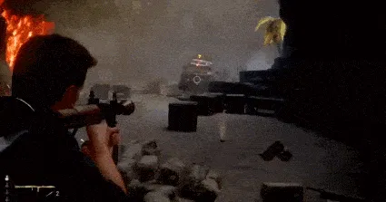《神秘海域》幕后开发演示

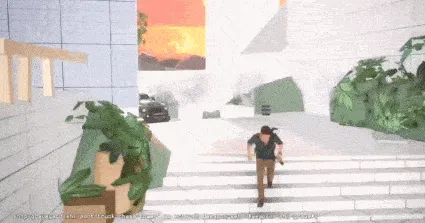《神秘海域》幕后开发演示

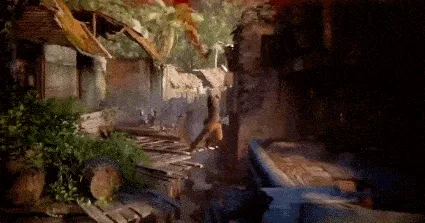《神秘海域》幕后开发演示

我个人认为在完成阶段，关卡策划层面应该达到这样的L2质量标准，仅作参考：  

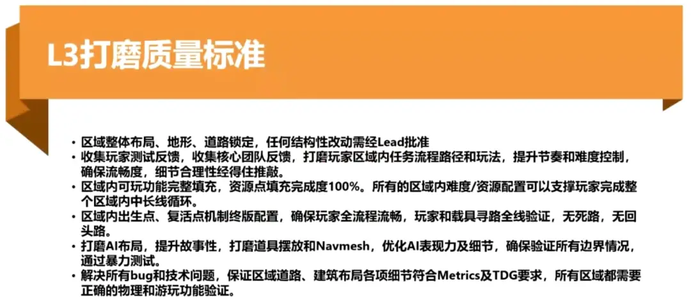

### 2.7 第七阶段：打磨

“完成”阶段主要是对内容和细节的填充，“打磨”阶段已经不会再铺量，而是会选取一些重点区域或关键时刻，比如游戏最开始的一小时流程，或最后结束的剧情节点，最可能影响到玩家体验的地方，进行细节打磨。

同时，在这一阶段，我们也会进行大量的技术和玩家测试，往往要面对几千个bug，在两到三个月的时间内进行统一修复与验收。

简单言之，是一个“打磨 - 反馈 - 修复”的耐心过程。  

这里同样有一个L3质量标准，我个人不再赘述，大家可以参考一下：  

在“打磨”阶段，我主要想分享的一个经验是：Nothing is perfect，everything is committed。

中文可以理解为“骐骥一跃，不能十步；驽马十驾，功在不舍”。

大型开放世界游戏的研发就像登山，经过了前面漫长的艰难跋涉，团队难免会有一种疲倦或松懈感。然而最危险的也往往是这一时期，“行百里者半九十”，最后关头的放松可能会导致游戏存在很多问题。

所以在项目中后期，我一般都会花比较多时间去体验游戏。我认为对于专业开发者来说，不论喜欢与否，花更多时间去感受你的游戏、打磨游戏，是一个应有的职业心态。

万事欲成，功在不舍，与大家共勉。

## 3. 总结

分享的最后，我们做一个回顾总结。

开放世界游戏的开发，往往分为 Conception、Preproduction、Alpha 和 Beta 4个节点，经历“立项、研究、文档、白模、可玩、完成、打磨”共 7 个阶段。  

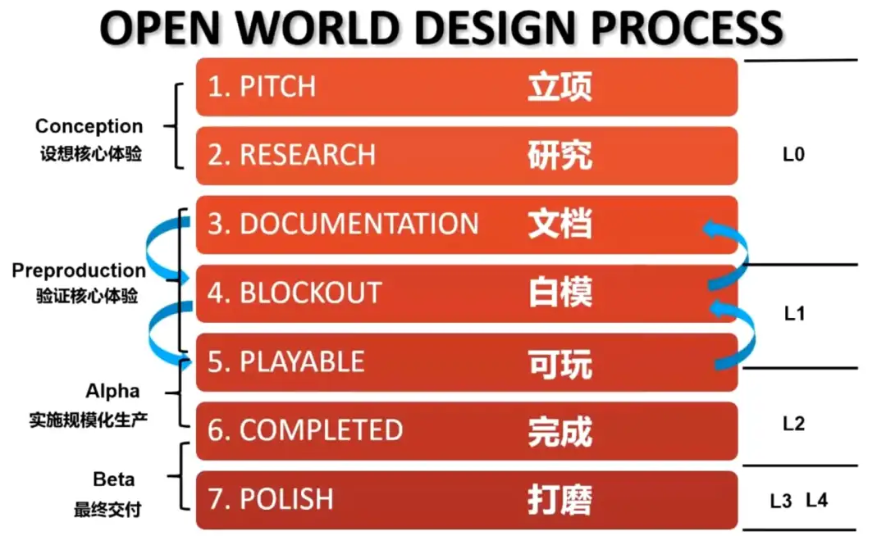

  * Conception 时期，我们的工作是在立项过程中，设想和确定游戏的核心体验，并做好世界可信度的研究，收集充足的灵感和参考。这一时期，我们的预期是达到L0级的质量交付标准。

  * Preproduction 时期，团队开始根据核心体验，编写游戏开发计划，包括世界设计文档、区域设计文档与关卡设计文档，逐步规划设计。

  * 同时，我们开始搭建世界白模，确定关卡标准参数，反复验证玩法与想法，为后续的工业化大规模生产做好准备，并初步打造可玩雏形。

  * 这一时期追求的是L1级的质量交付标准。大家可以看到“文档”“白模”“可玩”之间存在几个双向箭头，意在强调这一时期反复验证、反复迭代过程的必要性与持续性，因为到了正式投产后，就不会再做大规模修改了。

  * Alpha 时期，开始实施规模化生产，在可玩雏形的基础上进一步铺量和完善，达到一个非常高的完成度，实现L2级别的质量交付标准。

  * Beta 时期，游戏已经接近最终交付，在进行最后一步的验收与打磨，这时会进行大量的玩家与QA测试，根据反馈修复潜在问题，需要保持耐心，将游戏可能从80分提高到90甚至100分，实现L3、甚至L4级别的质量交付标准。  

还有我个人常用的一些网站，比如包括用于寻找现实参照的谷歌地图、用于浏览艺术灵感的Artstation、以及用于浏览一些游戏通关时长的
Howlongtobeat 等网站。
  
最后为我们天美F1工作室打个小广告

  * 天美F1工作室情况可查看：https://zhuanlan.zhihu.com/p/422247380
