<!--BEGIN_DATA
{
    "create_date": "2016-07-15 12:23", 
    "modify_date": "2016-07-15 12:23", 
    "is_top": "0", 
    "summary": "微信读书iOS性能优化", 
    "tags": "iOS", 
    "file_name": "微信读书iOS性能优化.md"
}
END_DATA-->


####<p>参考地址：<a href='http://blog.csdn.net/u010299178/article/details/51918910' target='blank'> 三个方面解决性能问题的基本思路和方法(微信读书-ios-姚海波；整理：Kiwi)</a></p>


今天分享的内容是关于微信读书iOS开发过程中，我们解决性能问题的基本思路和方法，包括发现问题、解决问题和预防问题三个方面

首先，根据个人的开发经验，我不得不承认，当应用发展到一定程度后，性能问题就不可能完全避免。

以往我们总是希望能寻找一种解决性能问题的一劳永逸的方法，其实是不太现实的。所以我们换个思路，如何尽早的发现性能问题，然后解决问题。

在发现问题方面，我们项目也并没有什么高招，主要有两个方面

1. 用户反馈（包括测试人员）
受限于测试时间和用户反馈的积极性，性能问题往往到了比较严重的程度，开发人员才真正发现问题。

2. 在线监控
在线监控主要有业务性能监控和卡顿监控，卡顿监控，是用了RDM的工具，然后通过动态下发开关，用抽样的方法进行上报，还有一些反馈卡顿的用户，我们也会通过这个方法来查找问题。

然后，在解决性能问题方法，相信大家都累积了很多经验。
产生性能问题的原因多种多样，所以解决的办法也不尽相同，各种奇技淫巧都有可能派上用场，这里我大概介绍一下我们项目中用到的一些方面：
（1）优化业务流程
（2）合理的线程分配
（3）预处理和延时加载
（4）缓存
（5）使用正确的API

####1. 优化业务流程

性能优化看似高深，真正落到实处才会发现，最大的坑往往都隐藏在于业务不断累积和频繁变更之处。优化业务流程就是在满足需求的同时，提出更加高效优雅的解决方案，从根本上解决问题。从实践来看，这种方法解决问题是最彻底的，但通常也是难度最大的。

这是我们其中一个业务优化的案例

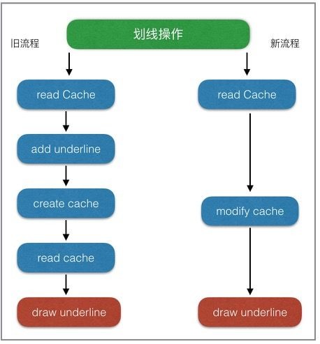

看似挺简单的优化，但真正落到实处，才会出现其中的坑有多大，所以重构优化的时候，还得有颗坚强的心！

####2.合理的线程分配

由于GCD实在太方便了，如果不加控制，大部分需要抛到子线程操作都会被直接加到global队列，这样会导致两个问题，1.开的子线程越来越多，线程的开销逐渐明显，因为开启线程需要占用一定的内存空间（默认的情况下，主线程占1M,子线程占用512KB）。2.多线程情况下，网络回调的时序问题，导致数据处理错乱，而且不容易发现。为此，我们项目定了一些基本原则。
 + UI操作和DataSource的操作一定在主线程。
 + DB操作、日志记录、网络回调都在各自的固定线程。
 + 不同业务，可以通过创建队列保证数据一致性。例如，想法列表的数据加载、书籍章节下载、书架加载等。

合理的线程分配，最终目的就是保证主线程尽量少的处理非UI操作，同时控制整个App的子线程数量在合理的范围内。

####3.预处理和延时加载。

预处理，是将初次显示需要耗费大量线程时间的操作，提前放到后台线程进行计算，再将结果数据拿来显示。

延时加载，是指首先加载当前必须的可视内容，在稍后一段时间内或特定事件时，再触发其他内容的加载。这种方式可以很有效的提升界面绘制速度，使体验更加流畅。（UITableView就是最典型的例子）

这两种方法都是在资源比较紧张的情况下，优先处理马上要用到的数据，同时尽可能提前加载即将要用到的数据。在微信读书中阅读的排版是优先级最高的，所在在阅读过程中会预处理下一页、下一章的排版，同时可能会延时加载阅读相关的其它数据（如想法、划线、书签等）。

####4.缓存

cache可能是所有性能优化中最常用的手段，但也是我们极不推荐的手段。cache建立的成本低，见效快，但是带来维护的成本却很高。如果一定要用，也请谨慎使用，并注意以下几点：

- 并发访问cache时，数据一致性问题。
- cache线程安全问题，防止一边修改一边遍历的crash。
- cache查找时性能问题。
- cache的释放与重建，避免占用空间无限扩大，同时释放的粒度也要依实际需求而定。

####5.使用正确的API

- 选择合适的容器;
- 了解**imageNamed**与**imageWithContentsOfFile**的差异(_imageNamed_适用于会重复加载的小图片，因为系统会自动缓存加载的图片;_imageWithContentsOfFile_仅加载图片)
- 缓存**NSDateFormatter**的结果。
- 寻找__(NSDate *)dateFromString:(NSString )string__的替换品
- 不要随意使用NSLog();

这方面主要还是靠经验的累积

上面只是列举了几种常规手段，相信大家在实践过程中，肯定还有很多的高招。

经过一段时间的性能优化工作，我们团队达成了一项共识，与其花那么时间去发现问题，查问题，还不如多开发一些工具，让问题尽量暴露在开发阶段，最好达到避免共性问题。所以，我们总是想开发一些有意思小工具来做这种事情。

下面列举几个我们认识还挺有帮忙的工具

1. 内存泄露检测工具。
2. FPS/SQL性能监测工具条
3. UI/DataSource主线程检测工具
4. 排版引擎自动化检测工具
5. 书源检测工具

[MLeakFinder](https://github.com/Zepo/MLeaksFinder)
这个已经开源了，是我们团队中zeposhe的杰作。

在此之前，内存泄露引起的性能问题是很难被察觉的，只有泄露到了相当严重的程度，然后通过Instrument工具，不断尝试才得以定位。MLeakFinder能在开发阶段，把内存泄露问题暴露无遗，减少了很多潜在的性能问题。

#####2.FPS/SQL性能监测工具条。

工具条是在DEBUG模式下，以浮窗的形式，实时展示当前可能存在问题的FPS次数和执行时间较长的SQL语句个数，是团队成员tower开发的。

FPS监测的原理并不复杂，虽然不是百分百准确，但非常实用，因为可以随时查看FPS低于某个阈值时的堆栈信息，再结合当时的使用场景，开发人员使用起来非常便利，可以很快定位到引起卡顿的场景和原因。SQL语句的监测也非常实用，对于微信读书，DB的读写速度是影响性能的瓶颈之一。因此在DEBUG阶段，我们监测了每一条SQL语句的执行速度，一旦执行时间超出某个阈值，就会表现在工具条的数字上，点击后可以进一步查询到具体的SQL操作以及实际耗时。


顶部工具条点击后，就可以查到具体是哪条sql语句慢

这个工具帮助我们在开发阶段发现了很多卡顿问题，尤其是一些不合理的SQL语句，例如：
在想法圏的优化过程中，利用这个工具，我们就发现想法圈第一次加载更多，执行的SQL语句耗时竟然达到了1000多毫秒。

```
_SELECT * FROM WRReview INNER JOIN WRUser ON WRReview.fromId = WRUser.vid WHERE WRReview.type & ? AND WRReview.createTime <= ? ORDER BY WRReview.createTime DESC , WRReview.itemId ASC LIMIT ?_
```

通过explain，可以发现这条SQL效率之低:

```
SEARCH TABLE WRReview
SEARCH TABLE WRUser USING INTEGER PRIMARY KEY (rowid=?)
USE TEMP B-TREE FOR ORDER BY
```

* 没有建立合适的索引，导致WRReview全表扫描。
* 排序字段没有索引，导致SQLite需要再一次B-TREE排序。
* 两字段排序，性能更低。

优化：给WRReview的 _fromId_ _createTime_ 两个字段增加了索引，并去掉一个排序字段:

```
 _SELECT * FROM WRReview INNER JOIN WRUser ON WRReview.fromId = WRUser.vid WHERE WRReview.type & ? ORDER BY WRReview.createTime DESC LIMIT ?_
```

Explain的结果：

```
SCAN TABLE WRReview USING INDEX WRReview_createTime
SEARCH TABLE WRUser USING INTEGER PRIMARY KEY (rowid=?)
```

SQL执行时间直接降了一个数量级，到100毫秒左右。

#####3.UI/DataSource主线程检测工具。

该工具是为了保证所有的UI的操作和DataSource操作一定是在主线程进行。实现原理是通过hook UIView的**setNeedsLayout**，**setNeedsDisplay**，**setNeedsDisplayInRect**三个方法，确保它们都是在主线程执行。子线程操作UI可能会引起什么问题，苹果说得并不清楚，实际开发中我们遇到几种神奇的问题似乎都是跟这个有关。

+ app突然丢动画，似乎iOS系统也有这个bug。虽然没有确切的证据，但使用这个工具，改完所有的问题后，bug也好了(不止一次是这样)。
+ UI操作偶尔响应特别慢，从代码看没有任何耗时操作，只是简单的push某个controller。
+ 莫名的crash，这当然是因为UI操作非线程安全引起的。

更多时候，子线程操作UI也并不一定会发生什么问题，也正因为不知道会发生什么，所以更需要我们警惕，这个工具替我们扫除了这些隐患。虽然，苹果表示，现在部分的UI操作也已经是线程安全了，但毕竟大部分还不是。DataSource的监测是因为我们业务定下的原则，保证列表DataSource的线程安全。

#####4.排版引擎自动化检测工具

排版引擎是微信读书最核心的功能，排版引擎检测工具原本是为了检验排版引擎改进过程中准确性，防止因为业务变更，而影响原来的排版特性。实现原理是结合自动化脚本和App本身的排版引擎，给书库中的每一本书建立一个镜像，镜像的内容包括书籍的每一章每一页的截图。然后分析同一页码的两个不同版本的图片差异，就可以知道不同版本的排版引擎渲染效果。但是我发现，只要稍加改进，排版后记录每个章节排版耗时，就可以知道每个版本变化后同一个章节的耗时变化，以此作为排版引擎的性能指标。这个工具保证了微信读书，即使在快速迭代过程中也不会丢失阅读的核心体验。虽然这个工具无法在其它项目中复用，但是提醒了我们，可以通过自动化工具来保证产品最核心功能的体验。

这个虽然业务相关性比较强，但是对于某些应用的自动化测试也是有效的

#####5.书源检测工具

微信读书为了支持正版版权，目前书源完全依赖于后台，不允许本地导入。书源的优劣的直接影响排版的效果和性能。为了解决了部分书籍无法打开或者乱码的问题，我们借助了后台同学的书源检测工具。对线上所有epub书籍（大概13,000本）进行扫描，按照章节大小进行排序。对于章节内容特别大的书籍重点检测，重新排版，解决了一批epub书籍无法打开的问题。同时针对章节内容乱码的问题，对所有txt的书籍进行了一次全量扫描，发现了一些问题，但还无法准确找出所有乱码的章节，这一点还在努力改善中。

#####优化成果

1. 整体使用感受上，已经可以明显区分两个版本的性能差异，这一点也可以通过每天的用户反馈数据中得到验证。1.3.0和1.3.1分别发布一周后反馈的卡顿数从10个降到了3个，从总体反馈比例的2.8%降到0.8%。
2. 某些关键业务，耗时也有明显改善。
3. 极端案例的修复。超大的epub书籍已通过后台进行拆分，解决了无法打开书籍的情况。
4. 针对低端机型，去掉了某些动画，交互更加流畅。

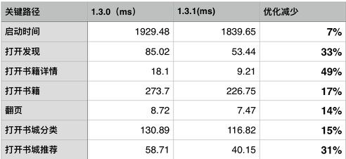

####总结

通过上述介绍，我们可以看出，性能问题普遍存在，无可避免，与其花费大量时间，查找线上版本的性能问题，不如提高整体团队成员性能优化意识，借助性能查找工具，将性能问题尽早暴露在开发阶段，达到预防为主的效果。

-----

0、想问下你们 DB 操作这部分涉及到多线程读写是怎么处理的？

回答 0: 我们用了FMDB，它已经处理了这种情况。

回答1：除了 sqlite 语句的优化之外，db 这部分还有没有其他方面的优化工作

https://github.com/Zepo/GYDataCenter
我们有一个自己的DB框架，是ORM的，做了很多优化的工作，最近刚开源，大家可以看看

回答2：请问你们选择用sqlite的考量是什么, 有没有考虑过使用其他的db如realm?

选择sqlite是历史原因，因为我们已经基于sqlite做了一个高性能的DB框架，而且也是经过QQMail App验证的。realm有考虑过，但是因为不是开源，所以估计不用采用

回答: FMDB 的解决方案，我理解是放到一个队列里，虽然可以解决多线程读写的问题，但是队列的处理还是会阻塞住来自不同线程的请求，对么

是的。我们一直也是读写都在同一条队列，其实并没有太明显的性能瓶颈, 因为在sqlite之上我们还有一层基于model的cache

回答3: 合理的使用线程，多线程之间的同步这块儿有什么方案或建议

这里我们也并没有什么通用的方案，原则是尽量避免使用多线程。一定要用的时候，也是根据业务谨慎选择

回答4: 业务场景里会不会涉及到有 读操作 依赖写操作完成的情况，否则会出现读操作的数据不准确的情况。FMDB 感觉不能很好的解决这个问题。

读操作 依赖写操作完成，这种场景一定会有的。但是这种问题应该是业务流程自己控制，而不是DB应该考虑的事情，DB性一能保证的就是按照业务提交的顺序，顺序执行

回答5: 能不能问下 微信读书的数据库的记录 一般是在什么级别，百、千？有没有尝试去做过一些压测，数据量达到多少的时候会遇到瓶颈

微信读书的数据库记录并不是很大，单表记录最多可能也就10w的数据级别。QQ邮箱的mailApp跟我们是用的同一套，但是数量级别远大于微信读书。目前发现的瓶颈是DB文件达到200M以上时，sqlite的性能会明显受到影响，不过具体原因还在调查中。

5 补充：有做过一些压力测试，用来对比CoreData，但是具体数据我这里暂时没有

6：你们的 db 是只有一个文件，还是尝试分文件存储的？

回答：你们的 db 是只有一个文件，还是尝试分文件存储的？

看业务需求，目前是多个DB文件

7 : 微信读书这么成功，方便说下她的架构吗？我觉得架构好才是她可优化的第一步

哈哈，现在还远谈不上成功啦。架构要用图来画才方便看，我暂时还没总结整个app的架构, 可以看看关于阅读器epub渲染的一个架构


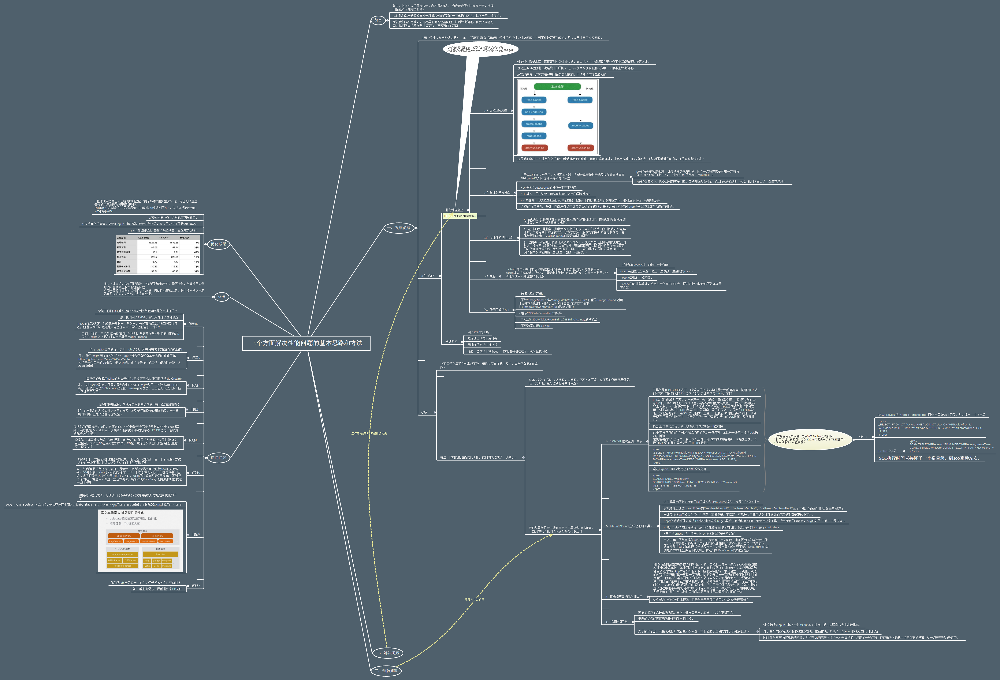


<hr>


####<p>原文出处：<a href='http://wereadteam.github.io/2016/05/03/WeRead-Performance/' target='blank'>微信读书iOS性能优化总结</a></p>

[微信读书](http://weread.qq.com/)作为一款阅读类的新产品，目前还处于快速迭代，不断尝试的过程中，性能问题也在业务的不断累积中逐渐体现出来。最近的 1.3.0版本发布后，关于性能问题的用户反馈逐渐增多，为此，团队开始做一些针对性的性能问题优化。本文将从发现问题、解决问题和预防问题三个方面进行总结。

###如何发现性能问题

不同于一般的 bug，性能问题因为并没有统一的标准，而且与用户的机器环境相关性较大，所以往往是在产品上线后才被发现，也导致解决问题的周期很长。微信读书1.3.0版本之前，性能问题基本都来自于用户反馈（包括测试人员），受限于测试时间和用户反馈的积极性，性能问题往往到了比较严重的程度，开发人员才真正发现问题。

但是，移动应用要保证良好的用户体验，产品在性能方面的表现极其重要。为了尽可能早、尽可能全面地收集产品的性能问题，就避免不了对产品做性能监控。我们主要从两个维度进行了监控：

  1. 业务性能监控，是指在App本地，业务的开始和结束处打点上报，然后后台统计达到监控目的；

  2. 卡顿监控。卡顿监控的实现一般有两种方案：

> （1）主线程卡顿监控。通过子线程监测主线程的 runLoop，判断两个状态区域之间的耗时是否达到一定阈值。具体原理和实现，[这篇文章](http://www.tanhao.me/code/151113.html/)介绍得比较详细。
>
> （2）FPS监控。要保持流畅的UI交互，App 刷新率应该当努力保持在 60fps。监控实现原理比较简单，通过记录两次刷新时间间隔，就可以计算出当前的FPS。

但是，在实际应用过程我们发现，无论是主线程监控，还是 FPS 监控，抖动都比较大。因此，微信团队提出了一套综合的判断方法，结合了主线程监控、FPS监控，以及CPU使用率等指标，作为判断卡顿的标准。

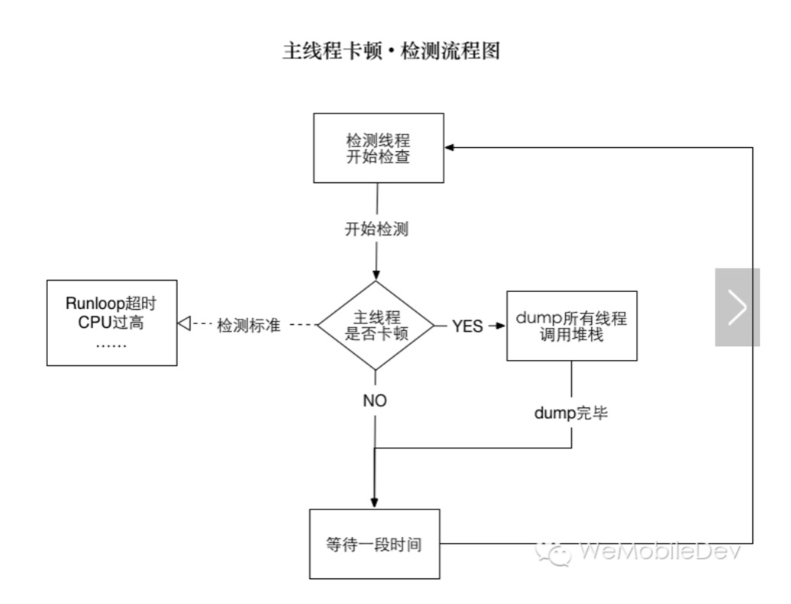

微信读书接入了RDM(bugly)的卡顿监控(也是基于微信团队的卡顿标准)，通过下发配置，对现网用户进行抽样检测，并上报卡顿的堆栈信息。这对于我们掌握现网用户的卡顿状况起到了非常大的帮助。

###性能问题的解决方法

产生性能问题的原因多种多样，因此解决的办法也不尽相同，比较常用的大概有以下几种：

#####1.优化业务流程

性能优化看似高深，真正落到实处才会发现，最大的坑往往都隐藏在于业务不断累积和频繁变更之处。优化业务流程就是在满足需求的同时，提出更加高效优雅的解决方案，从根本上解决问题。从实践来看，这种方法解决问题是最彻底的，但通常也是难度最大的。微信读书在优化阅读中各种操作（如，书签、划想、想法等）性能时，就是从业务流程的角度来进行优化。如下图：

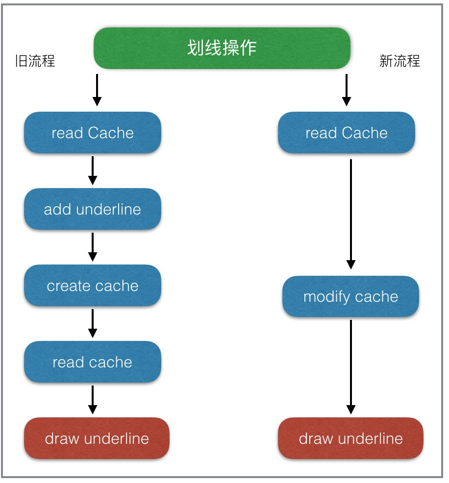

#####2.合理的线程分配

由于 GCD 实在太方便了，如果不加控制，大部分需要抛到子线程操作都会被直接加到 global 队列，这样会导致两个问题，1.开的子线程越来越多，线程的开销逐渐明显，因为开启线程需要占用一定的内存空间（默认的情况下，主线程占1M,子线程占用512KB）。2.多线程情况下，网络回调的时序问题，导致数据处理错乱，而且不容易发现。为此，我们项目定了一些基本原则。

  * UI 操作和 DataSource 的操作一定在主线程。
  * DB 操作、日志记录、网络回调都在各自的固定线程。
  * 不同业务，可以通过创建队列保证数据一致性。例如，想法列表的数据加载、书籍章节下载、书架加载等。

合理的线程分配，最终目的就是保证主线程尽量少的处理非UI操作，同时控制整个App的子线程数量在合理的范围内。

#####3.预处理和延时加载

预处理，是将初次显示需要耗费大量线程时间的操作，提前放到后台线程进行计算，再将结果数据拿来显示。

延时加载，是指首先加载当前必须的可视内容，在稍后一段时间内或特定事件时，再触发其他内容的加载。这种方式可以很有效的提升界面绘制速度，使体验更加流畅。（UITableView 就是最典型的例子）

这两种方法都是在资源比较紧张的情况下，优先处理马上要用到的数据，同时尽可能提前加载即将要用到的数据。在微信读书中阅读的排版是优先级最高的，所在在阅读过程中会预处理下一页、下一章的排版，同时可能会延时加载阅读相关的其它数据（如想法、划线、书签等）。

#####4.缓存

cache可能是所有性能优化中最常用的手段，但也是我们极不推荐的手段。cache建立的成本低，见效快，但是带来维护的成本却很高。如果一定要用，也请谨慎使用，并注意以下几点：

  * 并发访问 cache 时，数据一致性问题。
  * cache 线程安全问题，防止一边修改一边遍历的 crash。
  * cache 查找时性能问题。
  * cache 的释放与重建，避免占用空间无限扩大，同时释放的粒度也要依实际需求而定。

#####5.使用正确的API

使用正确的 API，是指在满足业务的同时，能够选择性能更优的API。

  * 选择合适的容器;
  * 了解 `imageNamed:` 与 `imageWithContentsOfFile:`的差异(`imageNamed:` 适用于会重复加载的小图片，因为系统会自动缓存加载的图片，`imageWithContentsOfFile:` 仅加载图片)
  * 缓存 `NSDateFormatter` 的结果。
  * 寻找 `(NSDate *)dateFromString:(NSString )string` 的替换品。
    
```
//#include <time.h>
time_t t;
struct tm tm;
strptime([iso8601String cStringUsingEncoding:NSUTF8StringEncoding], "%Y-%m-%dT%H:%M:%S%z", &tm);
tm.tm_isdst = -1;
t = mktime(&tm);
[NSDate dateWithTimeIntervalSince1970:t + [[NSTimeZone localTimeZone] secondsFromGMT]];  
``` 

  * 不要随意使用 `NSLog()`.

  * 当试图获取磁盘中一个文件的属性信息时，使用 `[NSFileManager attributesOfItemAtPath:error:]` 会浪费大量时间读取可能根本不需要的附加属性。这时可以使用 `stat` 代替 `NSFileManager`，直接获取文件属性：
    
```
#import <sys/stat.h>
struct stat statbuf;
const char *cpath = [filePath fileSystemRepresentation];
if (cpath && stat(cpath, &statbuf) == 0) {
    NSNumber *fileSize = [NSNumber numberWithUnsignedLongLong:statbuf.st_size];
    NSDate *modificationDate = [NSDate dateWithTimeIntervalSince1970:statbuf.st_mtime];
    NSDate *creationDate = [NSDate dateWithTimeIntervalSince1970:statbuf.st_ctime];
    // etc
}  
``` 

###如何预防性能问题

大部分性能问题可以通过程序员经验和能力的提升得以减少，但是因为团队成员更新、业务累积，性能问题无法避免，如何在开发测试阶段发现问题解决问题，是预防性能问题的
关键。为此，我们开发了一些比较有意思的工具，用于发现各种性能问题。

#####1\. 内存泄露检测工具

[MLeakFinder](https://github.com/Zepo/MLeaksFinder)是团队成员zepo在github开源的一款内存泄露检测工具，具体原理和使用方法可以参见[这篇文章](http://wereadteam.github.io/2016/02/22/MLeaksFinder/)。在此之前，内存泄露引起的性能问题是很难被察觉的，只有泄露到了相当严重的程度，然后通过Instrument工具，不断尝试才得以定位。MLeakFinder能在开发阶段，把内存泄露问题暴露无遗，减少了很多潜在的性能问题。

#####2\. FPS/SQL性能监测工具条

该工具条是在DEBUG模式下，以浮窗的形式，实时展示当前可能存在问题的FPS次数和执行时间较长的SQL语句个数，是团队成员tower的杰作。FPS监测的原理并不复杂，前文也有介绍，虽然并不百分百准确，但非常实用，因为可以随时查看FPS低于某个阈值时的堆栈信息，再结合当时的使用场景，开发人员使用起来非常便利，可以很快定位到引起卡顿的场景和原因。SQL语句的监测也非常实用，对于微信读书，DB的读写速度是影响性能的瓶颈之一。因此在DEBUG阶段，我们监测了每一条SQL语句的执行速度，一旦执行时间超出某个阈值，就会表现在工具条的数字上，点击后可以进一步查询到具体的SQL操作以及实际耗时。

这个工具帮助我们在开发阶段发现了很多卡顿问题，尤其是一些不合理的SQL语句，例如：在想法圏的优化过程中，利用这个工具，我们就发现想法圈第一次加载更多，执行的SQL语句耗时竟然达到了1000多毫秒。  

   
    _SELECT * FROM WRReview INNER JOIN WRUser ON WRReview.fromId = WRUser.vid WHERE WRReview.type & ? AND WRReview.createTime <= ? ORDER BY WRReview.createTime DESC , WRReview.itemId ASC  LIMIT ?_  
    

通过explain，可以发现这条SQL效率之低:  

    
    
    SEARCH TABLE WRReview
    SEARCH TABLE WRUser USING INTEGER PRIMARY KEY (rowid=?)
    USE TEMP B-TREE FOR ORDER BY  
    

  * 没有建立合适的索引，导致WRReview全表扫描。
  * 排序字段没有索引，导致SQLite需要再一次B-TREE排序。
  * 两字段排序，性能更低。

优化：给WRReview的 `fromId` `createTime` 两个字段增加了索引，并去掉一个排序字段:

    
    
    SELECT * FROM WRReview INNER JOIN WRUser ON WRReview.fromId = WRUser.vid WHERE WRReview.type & ? ORDER BY WRReview.createTime DESC  LIMIT ?  
    

Explain的结果：  

    
    
    SCAN TABLE WRReview USING INDEX WRReview_createTime
    SEARCH TABLE WRUser USING INTEGER PRIMARY KEY (rowid=?)  
    

SQL执行时间直接降了一个数量级，到100毫秒左右。

#####3\. UI / DataSource主线程检测工具。

该工具是为了保证所有的UI的操作和 DataSource 操作一定是在主线程进行，同样是由tower同学贡献。实现原理是通过 hook UIView 的`-setNeedsLayout`，`-setNeedsDisplay`，`-setNeedsDisplayInRect`三个方法，确保它们都是在主线程执行。子线程操作UI可能会引起什么问题，苹果说得并不清楚，实际开发中我们遇到几种神奇的问题似乎都是跟这个有关。

  * app 突然丢动画，似乎 iOS 系统也有这个 bug。虽然没有确切的证据，但使用这个工具，改完所有的问题后，bug 也好了(不止一次是这样)。

  * UI 操作偶尔响应特别慢，从代码看没有任何耗时操作，只是简单的 push 某个 controller。

  * 莫名的 crash，这当然是因为 UI 操作非线程安全引起的。

更多时候，子线程操作 UI 也并不一定会发生什么问题，也正因为不知道会发生什么，所以更需要我们警惕，这个工具替我们扫除了这些隐患。虽然，苹果表示，现在部分的UI 操作也已经是线程安全了，但毕竟大部分还不是。DataSource 的监测是因为我们业务定下的原则，保证列表 DataSource 的线程安全。

#####4\. 排版引擎自动化检测工具

排版引擎是微信读书最核心的功能，排版引擎检测工具原本是为了检验排版引擎改进过程中准确性，防止因为业务变更，而影响原来的排版特性。实现原理是结合自动化脚本和App 本身的排版引擎，给书库中的每一本书建立一个镜像，镜像的内容包括书籍的每一章每一页的截图，然后分析同一页码的两个不同版本的图片差异，就可以知道不同版本的排版引擎渲染效果。但是我发现，只要稍加改进，排版后记录每个章节排版耗时，就可以知道每个版本变化后同一个章节的耗时变化，以此作为排版引擎的性能指标。这个工具保证了微信读书，即使在快速迭代过程中也不会丢失阅读的核心体验。虽然这个工具无法在其它项目中复用，但是提醒了我们，可以通过自动化工具来保证产品最核心功能的体验。

#####5\. 书源检测工具

微信读书为了支持正版版权，目前书源完全依赖于后台，不允许本地导入。书源的优劣的直接影响排版的效果和性能。为了解决了部分书籍无法打开或者乱码的问题，我们借助了后台同学的书源检测工具。对线上所有 epub 书籍进行扫描，按照章节大小进行排序。对于章节内容特别大的书籍重点检测，重新排版，解决了一批 epub
书籍无法打开的问题。同时针对章节内容乱码的问题，对所有 txt的书籍进行了一次全量扫描，发现了一些问题，但还无法准确找出所有乱码的章节，这一点还在努力改善中。

###优化成果

  1. 整体使用感受上，已经可以明显区分两个版本的性能差异，这一点也可以通过每天的用户反馈数据中得到验证。1.3.0 和 1.3.1分别发布一周后反馈的卡顿数从 10 个降到了 3 个，从总体反馈比例的 2.8% 降到 0.8%。
  2. 某些关键业务，耗时也有明显改善。  


  3. 极端案例的修复。超大的epub书籍已通过后台进行拆分，解决了无法打开书籍的情况。
  4. 针对低端机型，去掉了某些动画，交互更加流畅。

###总结

通过上述介绍，我们可以看出，性能问题普遍存在，无可避免，与其花费大量时间，查找线上版本的性能问题，不如提高整体团队成员性能优化意识，借助性能查找工具，将性能问题尽早暴露在开发阶段，达到预防为主的效果。


<hr>


####<p>原文出处：<a href='http://mp.weixin.qq.com/s?__biz=MzAwNDY1ODY2OQ%3D%3D&idx=1&mid=207890859&scene=23&sn=e98dd604cdb854e7a5808d2072c29162&srcid=0921FzoCw9j1W7n4uFYKuarC#rd' target='blank'>微信iOS卡顿监控系统</a></p>


###微信iOS卡顿监控系统


引子

* * *

微信 iOS 团队在值班的时候，时不时会收到这样的卡顿反馈：“用户A 刚才碰到从后台切换前台卡了一下，最近偶尔会遇到几次”、“用户B反馈点对话框卡了五六秒”、“现网有用户反馈切换 tab 很卡”。

这些反馈有几个特点，导致跟进困难：  

  1. 不易重现。可能是特定用户的手机上才有问题，由于种种原因这个手机不能拿来调试；也有可能是特定的时机才会出问题，过后就不能重现了（例如线程抢锁）。

  2. 操作路径长，日志无法准确打点

对于这些界面卡顿反馈，通常我们拿用户日志作用不大，增加日志点也用处不大。只能不断重试希望能够重现出来，或者埋头代码逻辑中试图能找的蛛丝马迹。随着微信的发展普及，这类问题积累得越来越多，为了攻城狮的尊严，我们感觉到有必要专门处理一下了。

  

原理

* * *

在开始之前，我们先思考一下，界面卡顿是由哪些原因导致的？  

  * 死锁：主线程拿到锁 A，需要获得锁 B，而同时某个子线程拿了锁 B，需要锁 A，这样相互等待就死锁了。

  * 抢锁：主线程需要访问 DB，而此时某个子线程往 DB 插入大量数据。通常抢锁的体验是偶尔卡一阵子，过会就恢复了。

  * 主线程大量 IO：主线程为了方便直接写入大量数据，会导致界面卡顿。

  * 主线程大量计算：算法不合理，导致主线程某个函数占用大量 CPU。

  * 大量的 UI 绘制：复杂的 UI、图文混排等，带来大量的 UI 绘制。

  

针对这些原因，我们可以怎么定位问题呢？

  * 死锁一般会伴随 crash，可以通过 crash report 来分析。

  * 抢锁不好办，将锁等待时间打出来用处不大，我们还需要知道是**谁占了锁**。

  * 大量 IO 可以在函数开始结束打点，将占用时间打到日志中。

  * 大量计算同理可以将耗时打到日志中。

  * 大量 UI 绘制一般是必现，还好办；如果是偶现的话，想加日志点都没地方，因为是**慢在系统函数里面**。

  

如果可以将当时的线程堆栈捕捉下来，那么上述难题都迎刃而解。主线程在什么函数哪一行卡住，在等什么锁，而这个锁又是被哪个子线程的哪个函数占用，有了堆栈，我们都可以知道。自然也能知道是慢在UI绘制，还是慢在我们的代码。

所以，思路就是**起一个子线程，监控主线程的活动情况，如果发现有卡顿，就将堆栈 dump 下来**。

流程图描述如下：

  

细节

* * *

原理一旦讲出来，好像也不复杂。魔鬼都是隐藏在细节中，效果好不好，完全由实现细节决定。具体到卡顿检测，有几个问题需要仔细处理：  

  * 怎么知道主线程发生了卡顿？

  * 子线程以什么样的策略和频率来检测主线程？这个是要发布到现网的，如果处理不好，带来明显的性能损耗（尤其是电量），就不能接受了。

  * 堆栈上报了上来怎么分类？直接用 crash report 的分类不适合。

  * 卡顿 dump 下来的堆栈会有多频繁？数据量会有多大？

  * 全量上报还是抽样上报？怎么在问题跟进与节省流量直接平衡？

**  


**1\. 判断标准**

怎么判断主线程是不是发生了卡顿？一般来说，用户感受得到的卡顿大概有三个特征：

  * FPS 降低

  * CPU 占用率很高

  * 主线程 Runloop 执行了很久

  

看起来 FPS 能够兼容后面两个特征，但是在实际操作过程中发现 FPS 不好衡量，抖动比较大。而对于抢锁或大量 IO 的情况，光有 CPU是不行的。所以我们实际上用到的是下面两个准则：

  * CPU 占用超过了100%

  * 主线程 Runloop 执行了超过2秒


**2\. 检测策略**

为了降低检测带来的性能损耗，我们仔细设计了检测线程的策略：

  * 内存 dump：每**1秒检查一次**，如果检查到主线程卡顿，就将所有线程的函数调用堆栈 dump 到内存中。

  * 文件 dump：如果内存 dump 的堆栈跟上次捕捉到的不一样，则 dump 到文件中；否则按照斐波那契数列将**检查时间递增**（1，1，2，3，5，8…）直到没有遇到卡顿或卡顿堆栈不一样。这样能够避免同一个卡顿写入多个文件的情况，也能避免检测线程围着同一个卡顿空转的情况。

  

**3\. 分类方法**

直接用 crash report 的分类方法是不行的，这个很好理解：最终卡在 lock 函数的卡顿，外面可能是很多不同的业务，例如可能是读取消息，可能是读取联系人，等等。卡顿监控需要仔细定义自己的分类规则。可以是从调用堆栈的最外层开始归类，或者是取中间一部分归类，或者是取最里面一部分归类。各有优缺点：

  * 最外层归类：能够将同一入口的卡顿归类起来。缺点是层数不好定，可能外面十来层都是系统调用，也有可能第一层就是微信的函数了。

  * 中间层归类：能够根据事先划分好的“特征值”来归类。缺点是“特征值”不好定，如果要做到自动学习生成的话，对后台分析系统要求太高了。

  * 最内层归类：能够将同一原因的卡顿归类起来。缺点是同一分类可能包含不同的业务。

  

综合考虑并一一尝试之后，我们采用了最内层归类的优化版，亦即进行二级归类。

第一级按照最内倒数2层归类，这样能够将同一原因的卡顿集中起来；

第二级分类是从第一级点击进来，然后从最内层倒数4层进行归类，这样能够将同一原因的不同业务分散归类起来。

  

最终效果如下图：

**一级分类**：

  

**二级分类**：

  


**4\. 可运营**

在正式发布之前，我们进行了灰度，以评估卡顿对用户的影响。收集到的结果是用户平均每天会产生30个 dump 文件，压缩上传大约要 300k
流量。预计正式发布的话会对后台有比较大的压力，对用户也有一定流量损耗。所以必须进行抽样上报。

  * 抽样上报：每天抽取不同的用户进行上报，抽样概率是5%。

  * 文件上传：被抽中的用户1天仅上传前20个堆栈文件，并且每次上报会进行多文件压缩上传。

  * 白名单：对于需要跟进问题的用户，可以在后台配置白名单，强制上报。

另外，为了减少对用户存储空间的影响，卡顿文件仅保存最近7天的记录，过期删除。


效果

* * *

主线程卡顿监控在微信5.3.1灰度以来，已经成功解决了不少常规手段无法定位的难题，包括：  

  1. 订阅号更新导致微信切换前台很卡（500+订阅号）

  2. 通讯录延迟加载导致偶尔卡一下（1k+好友）


他山之石与后续工作

* * *

移动客户端性能优化是个很大的话题，也是一个快速发展的领域。我们在这里抛砖引玉，欢迎各位同学一起讨论，相互学习进步。  

  1. 主线程卡顿跟 iOS 的 0x8badf00d 异常 (failed to resume in time)，或 Android 的 ANR（Application Not Response）类似。这些系统基本的行为的缺点是场景很少，基本上是超时10秒以上才会捕捉到，导致的后果是数据量很少，并且很多卡顿问题是没有覆盖到的。

  2. 跟其他同事有了解到另外一种方法，就是 hook了msgSend 把每个函数的耗时记录下来。这个方法思路也很新颖，不过个人觉得性能损耗可能比较大，很难在正式版带上。

  3. 如果主线程占用了100%的 CPU，那么怎么保证检测子线程可以有机会跑起来呢？目前我们只对 4S 以上机器（有双 CPU）启用这个功能，还是无法保证检测子线程会被调用。


<hr>


####<p>原文出处：<a href='http://mp.weixin.qq.com/s?__biz=MzA4Nzg5Nzc5OA==&mid=2651661643&idx=1&sn=ed4fd90350045cefc38b7436f94193a1&scene=0#wechat_redirect' target='blank'>手机QQ及Qzone速度优化实践</a></p>


#####导语

移动互联网发展那么快，运维技术也要适应业务的变化啊，这次小编找了腾讯牛人介绍的手机QQ和手机Qzone的速度优化实践。

我们坚信不同垂直领域的运维分工会越来越不同，如何能在不同的业务形态上，利用运维技术和数据为业务带来更大的价值，将是我们下一步探索的重点方向。

#####1\. 关于用户等待时间

对用户来说，最直观的感受就是APP的等待时间，所以我们首先要分析清楚APP到底在哪里让用户等待，耗时在哪里。

等待时间无非就以下三个：  
· Server处理耗时  
· 网络传输耗时  
· 客户端数据处理/UI渲染耗时

QQ/Qzone等产品由于已经有多年的Server端优化，大部分数据都是直接读写nosql数据库，接口耗时基本都在30-120ms，优化Server实际的收益并不会很大。  

下面主要介绍后两个方向上的优化实践。

#####2\. 网络传输

首先我们需要统计数据在网络传输的耗时情况，才能知道优化网络传输有多少价值

######**2.1 网络传输耗时统计**

网络耗时通过TCP协议的三次握手在服务端进行统计，优点是简单快速低成本，具体方案如下：

  1. 记录下第一次握手时服务端收到SYNC包的时间Time1
  2. 记录下第三次握手时服务端收到的ACK包时间Time2
  3. 两个时间之差即是网络往返耗时RT（Time2-Time1）（见图2.1）

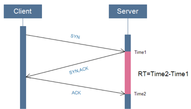图2.1 从服务端测网络延时

通过实际数据统计，在不跨网访问的情况下（信号正常）：  
· 4G耗时约30-100ms  
· 3G耗时约 200-400ms

从速度结果上看，目前主流的3G/4G网速还是相当不错的，但是由于移动网络的复杂性，从QQ和空间的业务返回码监控上还是发现有不少问题:  
· 跨网访问  
· 跨地区访问  
· 某些小运营商劫持等

**下面分享下手机Qzone在接入组件的优化策略**

######2.2 手机Qzone WNS接入策略

简介：WNS，手机QQ空间APP到服务端通信框架，支持tcp、http协议

#######2.2.1使用私有协议直接IP长连接访问（图2.2）

**优点**：  
· 减少DNS请求耗时  
· 避免DNS域名劫持  
· 单个连接并发多个数据请求减少连接数的开销（相对http）  
· 私服协议加密安全；

**缺点**：由于不走域名，首次连接需要额外的策略来找到合适的接入点，并且需要有重定向能力

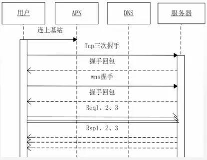

图2.2 私有协议直接IP长连接

#######2.2.2 首次连接策略

世界上最遥远的距离就是你在联通，而我在电信。在复杂的移动网络环境下，我们需要优化网络的接入策略避免跨网/跨地区访问。

使用移动网络时我们先识别用户的运营商，同时起4个连接，多个接入IP+多个端口+2种协议，再同时使用2种协议和多个端口是为了避免有些本地运营商的限制，使用第一个连接上的连接（见图2.3）

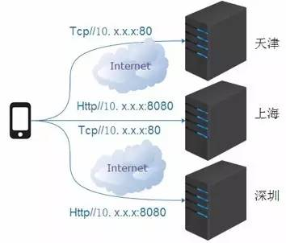

图2.3 首次并发尝试连接

使用WIFI的用户首次连接会优先使用域名尝试连接。

当上面策略都连不上时客户端会运行打分策略，使用备份IP列表连上一个速度最快的接入。

**腾讯拥有国内大量的CDN节点，即使是偏远地区也可以通过CDN节点接入做为代理！**

**优点：**多种首次连接策略能有效的保证用户最大可能的先连上服务器，这在复杂的移动网络中特别重要！

**缺点：**首次连接有额外开销；连接上不一定是最优的接入点；使用CDN节点做为代理接入成本较高

#######2.2.3 最优接入&重定向

连接上之后服务端通过GSLB IP库识别用户的出口IP，如果发现用户的接入不是最优的接入，通过大数据分析该用户在某个时段最应该使用的接入点，会下发重定向指令，让客户端连接到最优的服务端接入IP，WIFI下还会缓存住SSID和接入IP。

**优点：**让用户能就近/最优接入，减少网络的耗时

**缺点：**少部分用户首次使用需要连接2次服务器；

#######2.2.4 使用字典做数据压缩

减少带宽开销；安全

#######2.2.5 心跳

避免长连接断开

#######2.2.6 单连接并发请求

相对多连接单请求的传统HTTP模式（HTTP 2.0之前），用单连接可以大大减少客户端和服务端开销

######结论

移动网络上我们能做的优化无非就是减少连接，减少请求，避免跨网跨区，优化协议。而随着4G/光纤的快速发展，以后越来越多用户在网络上的耗时会越来越少，意味着我们网络策略上的优化效果收益也会越来越低，这时我们把目光投向终端。

#####3\. 终端耗时

同上，首先需要确认终端的耗时情况以确认优化预期和目标。

通过在客户端埋点的上报监控，发现手机Qzone某个灰度版本用户一些操作之后3秒以上没响应比率最高达30%；手机QQ某个灰度版本由于UI问题导致画面掉帧比率约15%，在投诉的问题分类中，卡、慢、卡顿投诉量长期居前三甲。

**可以得出这样的结论：终端的问题很严重，而且跟用户操作体验直接相关！**

######3.1 Android/IOS系统背景

既然是想优化移动客户端，那对于操作系统（Android和IOS）需要有个基本的了解，两者都是基于UNIX/LINUX开发的系统，对于运维人员来说很多概念都很好理解。

其中比较重要的一条设计理念是：Android和IOS都能进行多线程开发，其中有一个是主线程也称UI线程，UI线程是唯一有权限操作用户UI的线程，如果用户在操作有体验上的问题，那肯定是因为主线程被堵塞或没有足够的运行资源。所以从主线程的监控和系统资源的占用入手。

######3.2 监控的策略

怎么判断终端出现卡慢等性能问题呢？通过上面对andoid和ios的背景介绍，我们的目标放在主线程的监控上，这边主要有2种监控策略：

  1. 监控函数间调用耗时  
当主线程调用函数调用超过N秒时，主线程处于等待堵塞状态，用户所有UI行为暂停，所以认为终端出现卡的情况。

**缺点：**无法准确反应用户的体验

**优点：**实现成本低，开销低

  2. 监控屏幕FPS，监控掉帧数  
当用户操作时发生页面掉帧时，认为用户发生卡慢或卡顿（如图3-1）

**优点：**真实反应用户的体验，而且能对卡慢卡顿的体验分级，如分为短卡、长卡

**缺点：**有额外的FPS监控开销，经过测试该开销大概占整个APP开销的2%

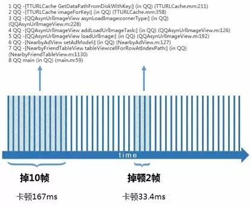

如图3-1监控屏幕FPS的次数

######3.3 堆栈的采集

监控的策略有，接下来应该考虑怎样配合监控策略，把“案发现场”的数据获取出来并上报至服务端。

“案发现场”数据除了系统资源，如CPU、内存等，最重要的一定是代码的执行堆栈数据。由于移动终端性能资源有限，在采集堆栈数据的时候要非常注意对系统的影响，所以需要定好触发采集堆栈的时机，这边主要也有2种采集方案：

#######3.3.1 开启额外的线程记录主线程堆栈

额外启动一个子线程，子线程记录着主线程的堆栈数据，当发生卡顿的时候从该线程获取到堆栈数据，优点是只需要引入一个很小的SDK包，而且无视版本的编译方法和虚拟机。获取堆栈的策略也分为 消极策略和积极策略

  1. 消极策略：  
认为卡慢卡顿的问题在短时间内只会发生一次，如果错过了将无法获取到真实的现场堆栈。  
该策略的做法是：子线程时刻获取着主线程的堆栈，当主线程发生问题时，通过发生问题的开始时间戳和结束时间戳，在子线程获取到案发时的堆栈数据（如图3-2）

**缺点：**需要子线程时刻记录主线程堆栈，开销大

**优点：**获取到的堆栈数据准确

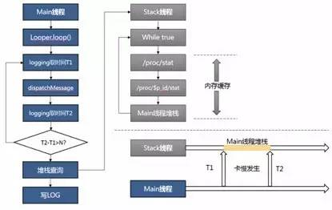图3-1监控主线程函数调用耗时

  1. 积极策略：  
认为卡慢卡顿的问题在短时间内会发生几次或持续发生一段时间。

该策略的做法是：当主线程发生问题时，激活子线程获取堆栈，在接下来的N秒内在子线程获取X个堆栈

**缺点：**堆栈有随机性，获取到的堆栈是案发后的堆栈

**优点：**额外开销极少，对APP基本没影响

#######3.3.2 在编译阶段打桩/嵌入埋点

通过在编译阶段使用工具在每个函数调用点加入耗时统计函数

**缺点：**增加APP包大小，经过测试约增加APP10~20%的包大小，而且不同编译方法和虚拟机需要不同的工具支持打桩嵌入；缺少系统调用数据

**优点：**无需运行时的额外线程额外开销

**2种方案都各有优点各有可取之处，但由于产品对包大小有严格限制，目前在QQ和Qzone主要采用方案1**

#####3.4 大数据聚类分析

前面提到，方案1的消极策略对终端性能影响较大，但是积极策略获取到的数据有随机性，即客户端无法精确的捕获到问题堆栈。

而目前我们主要采用积极策略+大数据聚类分析的方法来分析问题。这一方案的基本思想是如果一段逻辑代码真的有性能问题，那大多数用户都发生。

所以我们采用对堆栈数据做聚类分析的方法，将能形成数据规模的堆栈找出来，过滤掉偶尔由于随机性获取到的无关堆栈。

对堆栈的聚类统计上，我们主要通过构建CT（ClimbingTree）来解决。

ClimbingTree是内部叫法，主要思路是通过堆栈生成堆栈树，并利用海量数据加权计算（主要是函数耗时）到树上，最后根据权重将同层节点运行从左到右进行排序，并将设定阈值以下的节点运行剪枝。

**ClimbingTree的特点是同一父节点的子节点权重大小从左到右递减**

######3.4.1 构建CT（ClimbingTree）图

先将一个用户的一个上报堆栈数据先进行预处理，包括解密文件、翻译堆栈函数、格式化堆栈、过滤掉无关数据等步骤，最终生成一条业务函数调用关系链。

根据调用关系，合并同个用户多个调用关系链，相同节点耗时相加，并按每个树节点的耗时从左到右排序，生成函数调用关系树（见图3-3）


图3-3 函数调用关系树

合并多个用户的调用关系树，剪掉阈值下低权重的节点树枝，就可以生成CT（ClimbingTree）。这棵树里就包含了所有问题堆栈的数据聚集，并且问题严重程度从左到右排序（见图3-4）。

图假设每个节点耗时为1s，那么CT里A-B-C这条调用关系链很有可能就是问题所在的函数调用关系链（因为C节点对父节点的耗时占比为：2/4=50%）

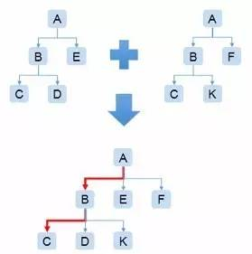

图3-4 CT图

**CT的优点在于将海量的数据聚集统计到少量的森林数据节点里（约压缩90%-95%的数据量）**

由于左子节点一定比右节点耗时长，所以往往左子节点即是影响父节点的问题所在，通过分析左子节点占父节点的耗时占比可以得到最根源的耗时函数所在（见图3-4、图3-5）

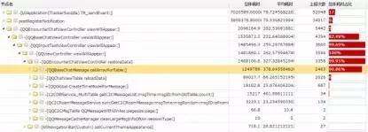

图3-5 寻找最根源的耗时函数节点

######3.5 终端常见性能问题总结

最常见的问题在主线程做长耗时操作，如  
· 数据库操作  
· 网络连接等待  
· 网络数据等待  
· 复杂逻辑计算  
· SD卡检查或读写

> **常用的优化方法：**  
使用子线程做异步操作，如数据库的写操作，配置网络拉取等可预加载的提前预加载，例如利用APP打开等待首页的时间打开网络长连接，对视频音频数据做预加载等
能延后处理的异步延后处理，如SD卡检查，异步发消息等

######3.6 案例&效果

  1. QQ IOS某几个版本经过优化之后的卡慢投诉数据：

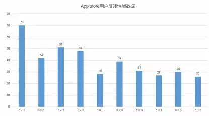

Qzone Android：某几个版本的卡慢发生率（卡慢发生率=卡慢发生人数/使用人数）

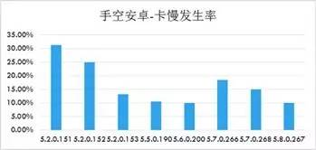

#####4.总结

在高速发展的移动互联网时代，运维技术要适应业务的变化，本文介绍的手机QQ和手机Qzone的速度优化实践，是腾讯运维利用大数据技术为业务创造价值的小案例。

我们坚信随着运维岗位的发展，不同垂直领域的运维分工也会随之而生，如何能在不同的业务形态上，利用运维技术和数据为业务带来更大的价值，用数据说话让数据发声，将是我们下一步探索的重点方向。

