 
<!--BEGIN_DATA
{
    "create_date": "2016-12-28 21:23", 
    "modify_date": "2016-12-28 21:23", 
    "is_top": "0", 
    "summary": "微信读书 iOS 质量保证及性能监控", 
    "tags": "iOS", 
    "file_name": "微信读书iOS质量保证及性能监控.md"
}
END_DATA-->

####
原文出处：<a href='http://wereadteam.github.io/2016/12/12/Monitor/' target='blank'>微信读书 iOS 质量保证及性能监控</a>

在实现需求的同时，能写出既优雅性能又高效的代码是每个开发者都在追求的目标，但是在实际开发中，随着每个版本需求的迭代，功能变得越来越复杂，加上开发者的意识不够或者一时疏忽，日渐复杂的工程很容易产生或多或少的问题。在使用微信读书的过程中，我们也碰到过app随机丢失动画、用户反馈app卡死、用户投诉看不了书籍等等的问题，这些问题都严重影响使用，也会降低产品口碑，因此我们开发了一些监控工具来解决这些问题，在这里总结和分享一下。

先来看看app的结构，如下图:

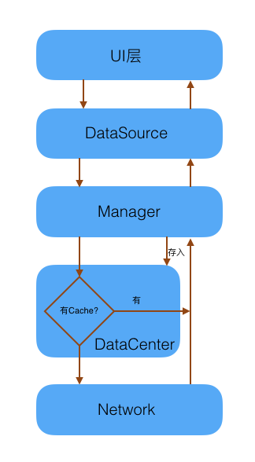

微信读书主要分为5层，由下至上分为:

  * 网络层：负责和服务器通讯，使用http协议获取数据。
  * 数据层：存储用户的数据，包括内存cache和sqlite db。
  * 业务层：包含各种业务逻辑，比如书籍下载、排版等。
  * UI数据层：负责提供UI层所需要的数据，UI只和这层打交道。
  * UI层：包括ViewController和View，处理用户的输入。

当UI需要数据来渲染时，会向UIDataSource获取数据，UIDataSource首先是通过Manager查询内存cache和db看有没有数据，有的话就会直接返回，同时也会发出网络请求和服务器同步数据，再使用数据层的接口存到数据库，最后回调给UI去重新获取本地数据来渲染。每一个层都是相互独立，用户遇到的每一个问题都对应着每一层，下面说说我们在每一层遇到了什么问题，以及做了什么工作来解决它们。

###对网络层成功率的监控

网络层使用NSURLSession对象向服务器发送请求后，要先经过公司统一网关TGW，然后经过代理最后再到CGI处理，最后返回JSON数据，流程较长，而JSON数据也包括业务的错误码。以前开发QQ邮箱时会遇到联不上网、会话过期、返回的数据格式有误、中了反垃圾逻辑等等的问题，而每天遇到这些问题的人次应是固定在某一个范围的，否则就表示app或者服务器不稳定，所以微信读书很早就开始统计网络请求的成功、失败率，了解所有错误码的分布情况。

刚开始时，微信读书对每一个CGI请求返回的错误码都收集上报然后再统计出人数和次数，后来发现这样统计失败率达到30%之高，影响判断，因为有两个错误码比较特殊，分别是-1009没有网络和-1001超时，App在没有连网时也可以继续使用缓存数据来读书，所以无网络比较正常。超时是连接服务器超时，可能是app发起请求后就被切换到后台了被挂起了，或者在后台被push唤醒然后发起请求，但很快被系统挂起。后来我们把-1009和在请求期间有切换到后台并且花费了120秒的-1001都作另外统计，真正的失败率变得更小，这样就方便看出真正错误的分布情况。

以下表格就是某一天网络请求的统计结果：

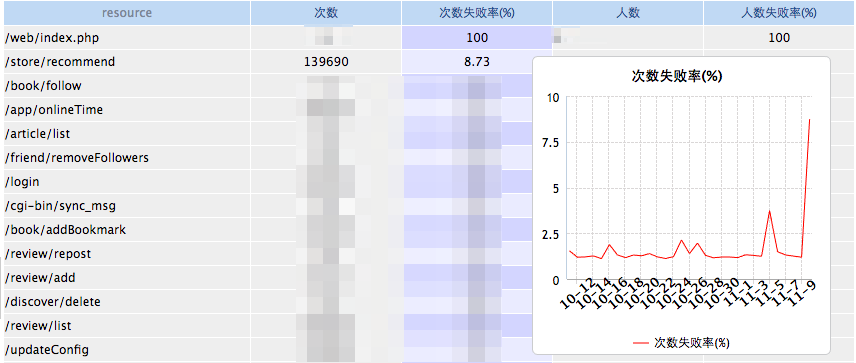

从上面这个统计结果可以发现两个问题：

第一是/store/recommend的次数失败率突然飙高，点击可查看具体的错误码，如下图，主要是-2501这个错误码居多，通过查看代码和询问后台同事就知道是最近新需求上线导致的问题了。

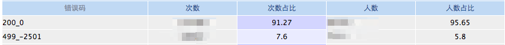

第二个是多了莫名其妙的url，app的某些请求被重定向了，原因可能是DNS被劫持了，我们正在接入HTTPDNS来解决这个问题。

整个发现问题、查找原因过程是很方便的。目前这一块还没有加上自动监控，还需要人为地观察，一般需要持续观察这个统计表的情况有：

  1. app新版本上线后
  2. 下发补丁包后
  3. 后台新功能上线后 
  4. 活跃用户等数据出现异常时
  5. 用户投诉

临近1月1日苹果要求将http请求切换到https的日子，很多app或者服务器都需要进行改造，网络层成功率的统计显示十分重要，当遇到问题时，我们都会先看网络请求是否出现大面积的失败来定位问题，如果是网络层请求失败可以根据错误码来查找原因，否则就要在其它模块找原因了。

###数据层的性能监控

从RDM的卡顿监控结果看，我们发现了不少卡顿都是发生在数据层，但是看到了卡顿堆栈我们也很无奈，因为当我们自己根据堆栈去重现的时候又不会卡，这种跟特定数据有关的卡顿很难重现，源码太多流程太长，单纯从审查源码来找出这些原因也是不现实的。数据层就像一个黑盒，接收输入参数然后输出数据，如果我们将数据层每一次sql执行所需要的时间都列出来，那我们就知道是什么操作最耗时了，于是我们开始了数据层的监控工作。

我们使用的数据层框架是[GYDataCenter](https://wereadteam.github.io/2016/07/06/GYDataCenter/)，大概的工作流程是这样的：

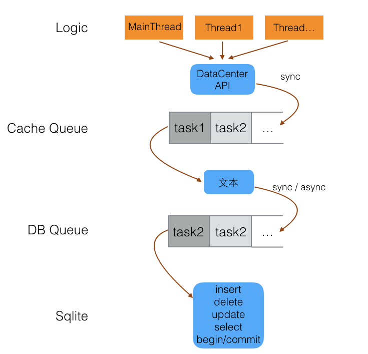

数据层主要由内存cache和sqlite组成，每一个db对应一个Cache队列和DB队列。业务层每个业务的处理可能在不同线程，当需要数据时通过DataCenter的接口将任务同步放到Cache Queue，然后等前面的任务完成。当Cache任务执行时，如果在cache就有数据就可以立即返回，否则需要查询sqlite，将任务放入db queue然后等待执行。当查询到数据库的数据时，将其转换成对象然后逐步callback回去，最终回到业务层。所以一次sql的完整操作是要经过等待cache队列 -> 放入cache队列执行 -> 等待db队列 -> 放入db队列执行这四步，而我们需要做的就是记录这四步的时间以及对应的sql。

在实际中，我们发现这些操作的数量非常多，所以最后我们没有将每一次的操作都记录，只是记录超过平均执行时间的sql操作。

统计出来的结果如下图所示，可以按4个时间来排序：

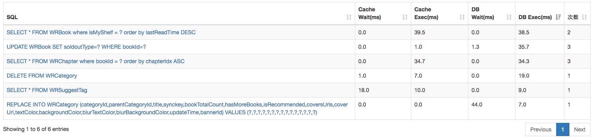

可以对比每个版本的耗时情况：

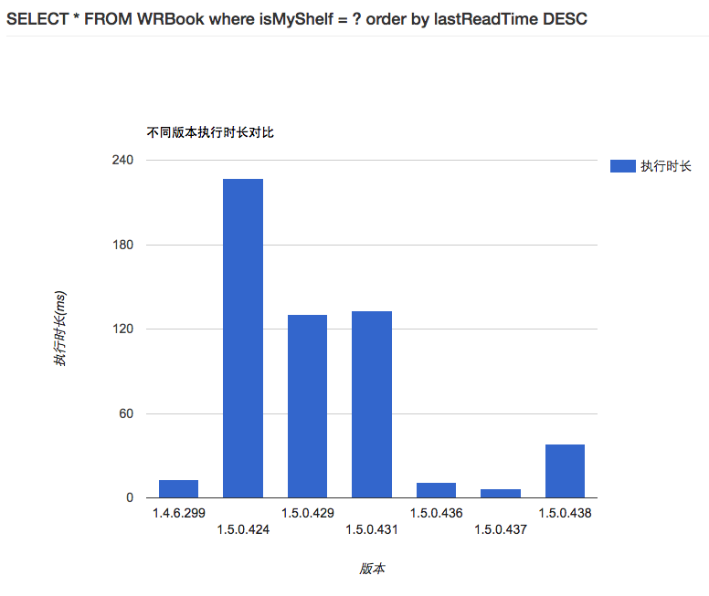

有了这份统计数据，有以下好处：

  1. 打开数据层这个黑盒，对整个app的所用到的sql一目了然。
  2. 可以根据db执行时间进行排序，找到耗时最多的sql，然后进行优化。
  3. 找到等待cache队列最长时间的sql，看它在等待谁（目前只能根据源码查找这一等待序列），然后进行优化调整。
  4. 可以查看某一条sql语句，对比各个版本的耗时情况，这样能够持续监控性能，方便我们缩小问题发生的时间范围。

经过一段时间的监控，我们发现了一些写得不合理的并且很耗时的sql，比如

 
    
    UPDATE WRUser SET isNewFollower=?  
    

这条语句不合理之处在于没有了“WHERE isNewFollower=0/1”，没有了WHERE条件就相当于对全表做了一次读写操作，当User比较多的时候会比较慢。

    
    SELECT itemId FROM WRReview WHERE (type & ?) > 0 AND timelineRank <= ?  
    

这条语句不合理的地方在于将“type & ? > 0”放在前面，因为位运算是不能使用索引来优化执行的，需要全表扫描一次，应该将“timelineRank <= ?”放在前面，因为它能使用索引优化，如果不满足这个条件，也不会执行后面的“type & ? > 0”。

    
    UPDATE WRNotification SET isRead=? WHERE notificationId <= 678  
    

这条语句不合理的地方在于最后面的“678”没有使用“?”，如果使用“?”这种参数绑定的方法，sqlite就不需要重新编译这条sql，从而节省时间。

有了数据层的监控，不合理的sql语句都被暴露出来，在1.4.5版本，类似第一种没有写WHERE条件的UPDATE语句还是比较多的，它们相当耗时，虽然是在子线程UPDATE，但是从上图可知当子线程在执行任务时，如果主线程访问数据库也是需要等待Cache、DB队列，从而发生卡顿，也引起了很多用户的投诉。

改善了相关sql后卡顿率有所下降，下图是RDM统计出来的ANR(Application Not Responding)率，ANR率是在主线程卡顿3秒的人数占联网人数的比例，按天计算，越小越好。1.4.5版本卡顿率平均在0.93%，1.4.6.299平均在0.63%，有30%的提升。

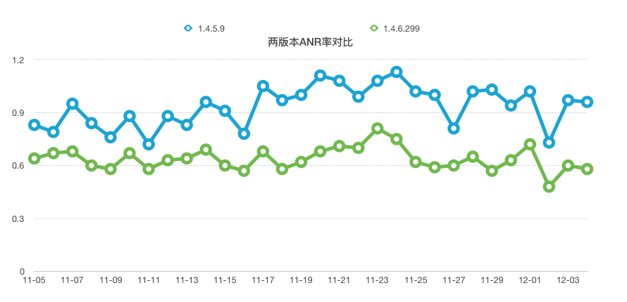

单纯优化sql语句还不能解决所有问题，但根据这些耗时统计，比较慢的操作都是集中在3个表里，它们要么存在位运算字段因此不能使用索引优化，要么因为字段太多，我们
后续可能会进行拆表再观察。

###UI数据源监控

UI数据源对象是负责为UI的渲染提供所有数据，它会读取本地cache、DB的数据，或者发送网络请求来同步数据。

以前曾经遇到这个问题：

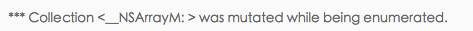

当一条线程在遍历数组，另一条线程又在修改它时会Crash，因为数组不是线程安全的。程序中存在很多可变数组，虽然目前还找不到方法来查找所有这种多线程读写的问题，但是对于我们的UI数据源还是有办法排查一部分问题的。这是得益于微信读书UIDataSource都有固定的模式：

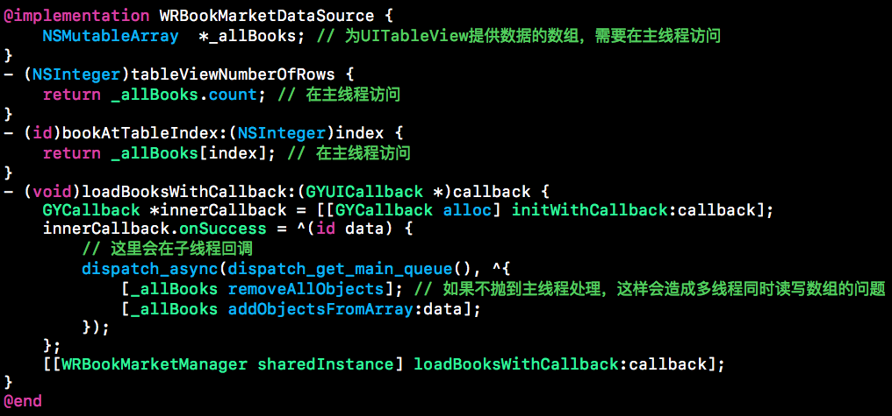

WRBookMarketDataSource是书城的数据源，真正为UITableView提供数据的是它的成员__allBooks_，如果需要多线程访问这个变量就要加锁，但最方便的做法是统一都在主线程访问这个变量。但写代码一不注意就会在子线程更改了__allBooks_，而我们可以做一些事情来防止这件事发生。我们只需hook了UIDataSource的alloc、NSMutableArray的add等方法，当调用NSMutableArray的add方法时，去遍历所有
UIDataSource对象，通过class_copyIvarList、valueForKey函数把所有的成员变量都找出来看看是否为当前的NSMutableArray，通过NSAssert确保当前在主线程，否则在debug模式下会crash提醒开发者修改。通过这种方法能确保操作UIDatsSource的NSMutableArray成员对象一定在主线程操作。

###UI主线程监控

######1\. 防止子线程访问UI

UIKit的大部分对象都不是线程安全的，所有继承自UIResponder的类都需要在主线程操作，如果在子线程更改了这些UI对象就会导致未知道的行为，比如随机出现丢失动画、页面错乱甚至crash。可以尝试一下以下代码，在子线程调用100次后，很可能会导致整个app丢失动画。

    
    UIImageView *imageView = [[UIImageView alloc] initWithImage:image];  
    

为了防止在子线程操作UI，我们在开发阶段hook掉UIView、CALayer的setNeedsLayout、setNeedsDisplay、setNeedsDisplayInRect:三个方法，当调用这三个方法时判断是否在主线程，如果不在主线程调用就让程序crash，在crash堆栈能看出是哪里的问题。

######2\. FPS监控

在开发过程中，有些时候我们自己也会遇到卡顿，但很难重现，错过了现场比较可惜。所以我们弄了一个FPS监控条，通过CADisplayLink来获取屏幕刷新频率，在使用过程中就能即时知道什么页面流畅什么页面会卡顿，如下图在右上角一直有一个view显示fps的变化，当fps低于30的时候，就会捕获所有线程堆栈，然后右上角的view会给出红色警示，可点击查看具体的堆栈信息。如果在真机，反解堆栈还需要另外的工作，Demo可参考[这里](https://github.com/featuretower/GYMonitor)。

这种做法的好处是当自己在使用过程中，如果碰到了卡顿，能第一时间知道是什么场景下发生的，而且知道堆栈大概是什么，当下次碰到现网用户有类似的堆栈卡顿的时候，就能很快反应过来是哪里卡了，这样能够减少很多查找问题的时间。比如下图就是在使用过程中，app突然之间卡住了一下，fps也降低了，好奇的点开右上角的view，可以
看出是在主线程解压字体压缩包导致的。

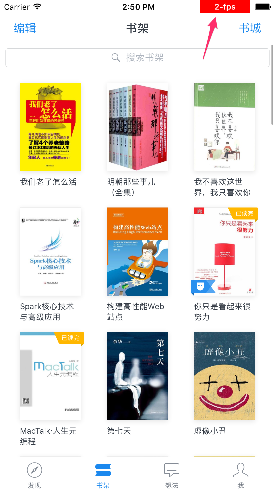

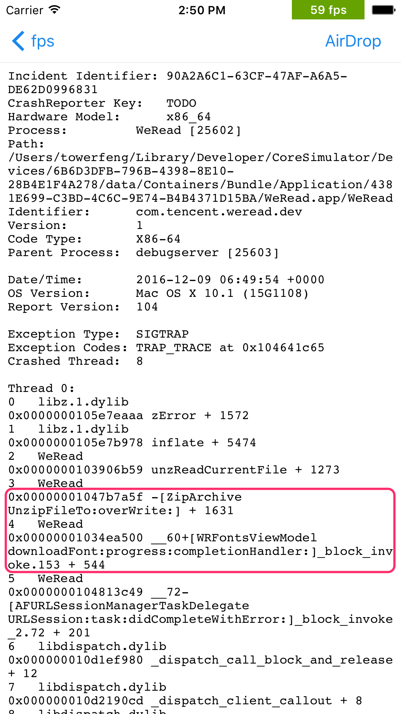

######3\. 线上用户监控

线上用户的卡顿监控是使用RDM sdk来监控的，原理是通过RunLoop的几个Observer来确定主线程是否卡住了，具体原理请参考老谭笔记。当主线程的RunLoop执行时间超过3秒就会捕获所有线程的堆栈，然后上报给服务器。通过几个版本的使用，这种方法确实能够发现很多卡顿问题并且堆栈也很清晰，也便于我们定位问题。

除此之外，我们还结合RunLoop和用户点击流来监控页面的流畅程度。

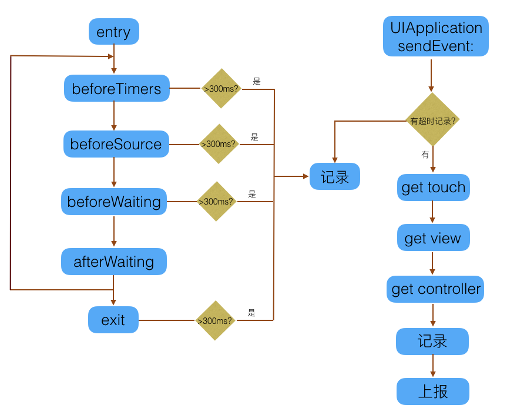

比如下面这个统计就是首页四个tab切换的耗时统计：

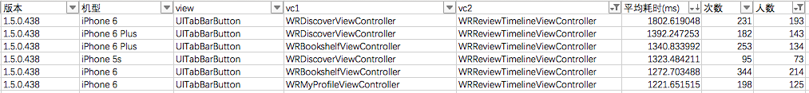

当碰到这种页面切换卡顿时，我们会怀疑是不是随着用户的使用时间越多，本地存储的数据越来越多导致数据处理逻辑变慢的，因为我们进入每一个列表时都会在主线程读取本地数据来渲染，如果数据多就会卡。所以我们的做法是制造很多测试数据来进行压力测试，可以是向db插入测试数据，也可以拦截网络层返回测试数据，通过这种方式来确定是不是页面切换卡顿是否和数据量有关，如果是的话，会采取分页拉取，预加载等方式去优化，否则还需要获取详细的堆栈，这将会在后续补上。

###业务实时监控

在几个月前，微信读书用户反馈系统突然之间收到了很多投诉，对某些书籍app总是显示章节加载失败，始终不能阅读，但是从后台监控来看是没有异常的。后来经过一轮排查才知道是书籍内容出问题，而这个问题已经出现一天多了，已经影响很多用户。为什么后台没有发现异常呢，这是因为是书籍内容出了问题，从server端是很难知道这种错
误的，只有app端在处理这份数据时才容易知道问题。这个问题给我们一个警醒，我们的app端监控存在不足，不能第一时间发现问题，我们需要对一些关键业务补上监控。

######1\. 书籍下载和渲染实时监控

阅读书籍是微信读书的主要功能之一，我们需要确保阅读流程任何一个环节都没有发生问题。阅读一本书需要经过的流程有下载章节 -> 解压数据 -> 存储 -> 读取章节 -> 解密 -> 解析 -> 渲染，我们现在对每一步都加了实时监控，一旦有问题发生，运营系统能在几分钟内发出警报，第一时间通知相关人员。

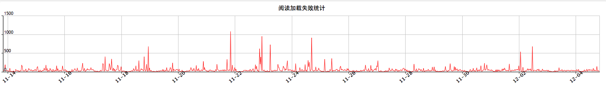

######2\. epub乱码监控

书籍内容出现乱码也是严重影响阅读的问题，我们也收到好几例这样的投诉。乱码的原因有可能是书籍本身就不是用UTF8编码，有可能是文件在传输或者解压过程中丢失了部
分字符，幸好UTF8编码是有规律的，所以我们在排版的时候会检测这些字符是否用UTF8编码，如果不是的话就会上报。

######3\. 想法下划线位置

阅读过程中可以对文中内容划线写想法然后分享，但是当书籍需要从txt升级到epub时，需要转换下划线对应的位置，开发初期我们经常遇到点击别人的想法但下划线对应
不上的问题，后来也是遇到一个问题解决一个，现在我们已经针对这个问题对线上用户加上监控，统一处理问题。

以上三个只是业务监控的几个例子，统计能帮我们发现问题，也为我们决策提供很好的依据。我们业务层监控的思路就是如果遇到问题，不管是自己发现的，还是用户反馈的，把它解决之后要衡量这个业务的重要程度，出现问题的几率和后果，如果认为比较重要都会想办法对相关流程加上监控，希望通过这种方法能及时发现问题。

###统计Assert断言

在开发阶段，我们经常加上 `NSAssert(NO, desc, ...)` 这样的代码来保证当程序运行到这里时是完全符合预期的，否则会抛出`NSInternalInconsistencyException`异常并在当前行crash然后在Xcode看到堆栈，但是在发布环境下这些Assert是默认不生效的。我们在发布环境也统计Assert有两个原因：

  1. 我们封装了NSMutableArray等容器类的方法，所有的方法变成 `safeAddXXX`、`safeInsertXXX` 等，对于 `nil` object我们是没有调用真正的 `addObject:` 方法的，这样能够防止crash，但可能会引发其它问题，所以我们需要知道这种情况有多少。
  2. 有时候命中了某些Assert是比较严重的。

如何捕捉所有的Assert呢，iOS为我们提供了一个叫 `NSAssertionHandler` 的类，一旦中了断言就会抛到这里处理，但它是线程相关的，每个handler只对应特定线程，而我们需要的是捕捉所有线程的Assert。第二个方法就是重写NSAssert宏，但这样替换系统的定义可能会引起未知问题，所以我
们只能采取第三种方法，自己包装NSAssert:

    
    #define GYAssert(condition, ...) if (!(condition)) {GYLogger(…); if (assertCallback) assertCallback(__FUNCTION__, __LINE__, __VA_ARGS__);} NSAssert(condition, @"%@", __VA_ARGS__);  
      
    [GYLogger setAssertCallback:^(const char *, int, NSString *, ...) {  
        log(func, msg...);  
        dumpStack(…);  
    }];  
    

这样定义之后，需要将每个地方的NSAssert替换为GYAssert。其中log函数会记录相应的消息，比如bookId，dumpStack就是获取当前所有线程的运行堆栈，我们是使用plcrashreporter这个库来获取堆栈的。

在开发中，我发现每一次堆栈都有大概60KB，如果每次都上报就太耗费流量了，所以考虑到用户流量问题，在实践中，我们并不会每一次中断言都会上报堆栈，我们会判断堆
栈是否已经上报过。

那么怎样判断堆栈是否已经上报过呢？其实堆栈都是有规律的，比如下面这个堆栈：
    
    
    0   WeRead                              0x0000000100b19834 WeRead + 10770484  
    1   WeRead                              0x0000000100b19448 WeRead + 10769480  
    2   WeRead                              0x0000000100b268dc WeRead + 10823900  
    3   WeRead                              0x000000010060e7d4 WeRead + 5482452  
    4   WeRead                              0x0000000100c130d4 _ZN9spplcrash5async16gnu_ehptr_readerIyE4readEP23spplcrash_async_mobjectmlNS0_8DW_EH_PEEPyPm + 535828  
    5   WeRead                              0x0000000100304914 WeRead + 2296084  
    6   WeRead                              0x0000000100443de4 WeRead + 3603940  
    7   WeRead                              0x0000000100442ba0 WeRead + 3599264  
    8   WeRead                              0x000000010030475c WeRead + 2295644  
    9   UIKit                               0x000000018d7e1494 <redacted> + 84  
    10  UIKit                               0x000000018d2fd9a0 <redacted> + 96  
    11  UIKit                               0x000000018d2fd920 <redacted> + 80  
    

第二列是镜像名，最后一列是这行代码在运行时的偏移地址，对于同一个app和设备都是固定的，我们取每一行的这两列来组成字符串再计算md5来标识某个堆栈，然后再判
断之前是否已经存在，如果存在就只上报函数名不上报堆栈。

下图是我们某次内测的部分统计数据:

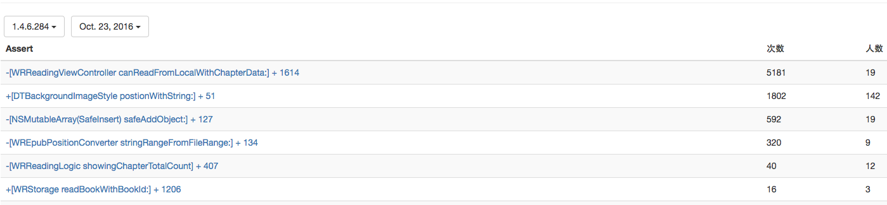

从统计数据来看，往往都有几个断言的人次特别多，其它比较少，我们目前只处理人次较多的问题。比如下面两个断言的人数不高，但次数很高，很可能是数据上出了问题，结合上传的消息、堆栈以及查看具体源码，很快就能知道是什么人、哪一本书哪一章节遇到问题，像下面第一个是缓存数据出了问题，会导致阅读不了，第二个是遇到了没有处理的css样式，虽然它们都不会导致crash，但很可能会影响到阅读体验和产生其它问题。通过统计出这些Assert，我们能够发现、定位并解决潜在的bug，提高代码质
量。

###总结

随着时间的推移，老代码和框架始终会碰到bug和性能瓶颈，微信读书针对现有的问题，开发出一些工具来辅助开发人员定位和解决问题，也取得一定的效果。目前这些工具还不能覆盖所有问题，我们在编码的同时会继续追求更好的工具来辅助我们，减少我们埋坑的几率和解决问题的时间。

