 
<!--BEGIN_DATA
{
    "create_date": "2019-12-17 13:53", 
    "modify_date": "2019-12-17 13:53", 
    "is_top": "0", 
    "summary": "快手多媒体传输算法优化实践", 
    "tags": "网络、C/C++、WebRTC、架构", 
    "file_name": "快手多媒体传输算法优化实践.md"
}
END_DATA-->

####
原文出处：<a href='http://mp.weixin.qq.com/s?__biz=MjM5MDE0Mjc4MA==&mid=2651012565&idx=3&sn=b6b603a8fefd2e0a90cc60264314465a&chksm=bdbec5868ac94c90911badcb2ad5e37c84fe21a86c5bcfacc5b9dfc6d35b4bec26fedc41d25f&scene=27#wechat_redirect' target='blank'>快手多媒体传输算法优化实践</a>

目前多媒体内容占据了主要的互联网流量，快手作为一个数亿级用户的短视频与直播平台，业务多样，用户分布广，网络情况复杂，给多媒体内容分发带来巨大挑战。本篇文章介绍快手自研的私有传输协议KTP(Kuaishou Transmission Protocol)，涉及快手在多媒体内容传输上遇到的挑战与思考、技术选型、以及 KTP 在短视频上传、直播、连麦等典型业务中的优化策略。

以下内容根据快手科技算法科学家周超博士在 2018 北京 ArchSummit 全球架构师峰会上的演讲内容整理，有删减。

####一、 为什么要走自研之路——KTP 背后的思考 

#####1. 快手在多媒体传输上的业务需求

快手是一个 UGC 平台，从内容生产到消费形成一个完整的闭环。内容要在整个闭环系统中流动起来，必须经过网络的传输与分发。网络架起了生产和消费之间的一座桥梁，这座桥梁修得好不好，牢不牢靠，对用户的体验至关重要。

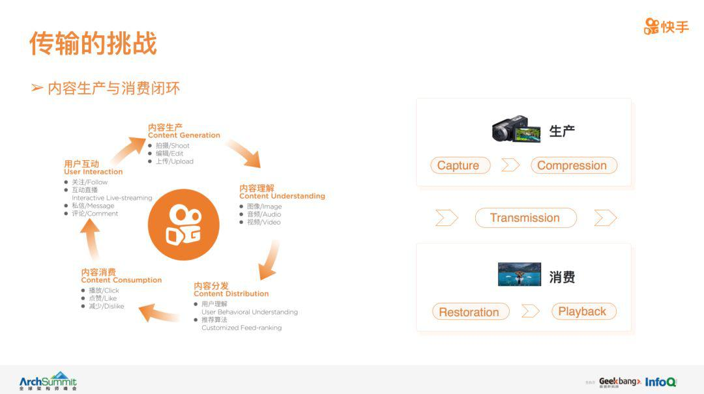

快手的业务复杂多样，对网络传输需求的差异性也非常大。例如，对于短视频上传，最关心的是作品发布的成功率和发布速度。成功率直接影响着用户发布作品的积极性及留存率，而发布速度与发布耗时直接关联，进而影响发布的取消率。对于直播，作为内容的源头，推流质量是需要优先考虑的。推流的卡顿、清晰度、延迟直接影响着亿万观众的体验。此外，直播的玩法多样，对推流质量的需求也各不相同。简单归纳一下，快手的直播大致可以分为以下三类：

i)  互动直播； 
ii) 游戏直播； 
iii) 实时连麦;

不同的直播玩法，对直播的延迟、流畅性、传输可靠性、视频的清晰度等要求也各不一样。

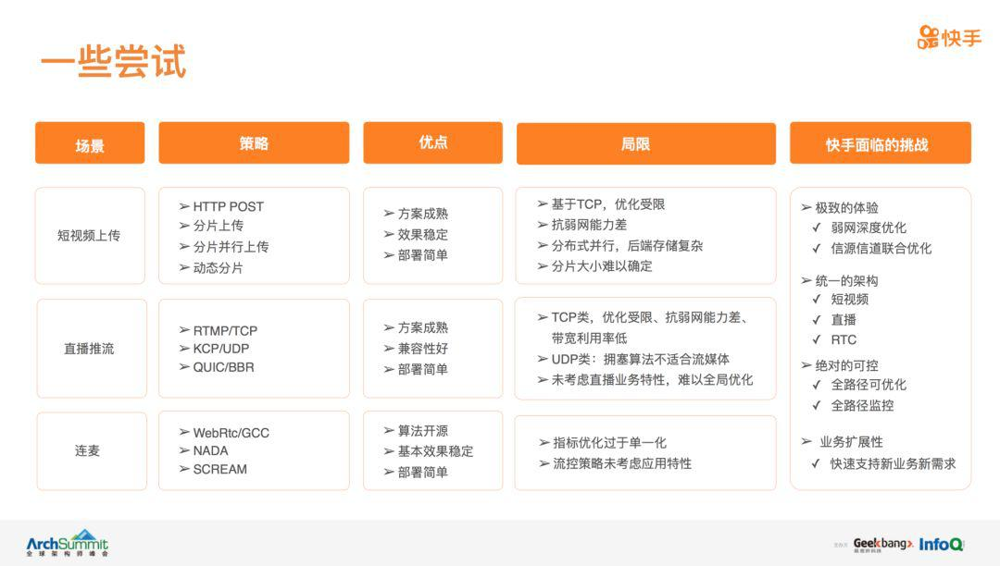

因此，为了满足快手多样化的业务需求，一个可行的传输协议必须包含两大模块：一个是网络传输直接相关的网络控制模块，包含网络拥塞控制、可靠性控制等；一个是对业务需求感知的信源信道联合优化模块，包含动态流控、延迟控制、数据优先级控制等。

#####2. 现有协议与快手多媒体传输诉求的差距

已有的传输协议可以分为两大类，一类基于 TCP，一类基于 UDP。

基于 TCP 类的传输协议，一般满足面向连接且完全可靠的业务需求，例如用于文件传输的 HTTP-POST，用于直播推流的 RTMP/TCP  
等。这类协议的优点是稳定性强，但虽然 TCP 底层的拥塞控制算法经过多年的实践验证，但依然存在一些问题：
i) 带宽利用率不够高。研究表明，对于 Live 或 VoD 类应用，为了保证视频的流畅性，一般要求带宽是视频码率的两倍；
ii) 延迟大。TCP 是面向连接的可靠传输协议，通过重传来对抗网络的丢包与抖动，延迟较大，无法用于实时音视频通信的场景; 
iii)  抗弱网能力差。这主要包含两方面，一是在一些高延迟的场景下，重传效率低下；另一方面则是底层拥塞控制算法的效率问题。从早期的 TCP Reno 到目前操作系统里的 Cubic 和 Compound，虽然性能上有很大的改进，但在一些弱网下，性能依然非常差。例如丢包率到 20%，这类算法基本失效 ;  
iv) 此外，TCP 集成在系统内核里，给进一步的优化也带来很大的阻碍。结合快手的业务需求，HTTP/POST可以满足短视频上传的业务需求，但实际我们遇到的问题是作品发布成功率不够高（TCP抗弱网能力不够强），发布耗时长（带宽利用率不够高）。尝试过一些手段，例如分片传输、并行传输等，但由于无法修改底层拥塞控制算法，效果提升非常有限。对于直播场景，RTMP/TCP是业界使用最多的协议，也是快手早期的方案。但在实际部署中，我们遇到两个问题：一是TCP的拥塞控制算法不够高效且集成在内核中，一些优化手段无法落地；二是业务感知不灵活，缺乏高效的信源信道联合优化模块，无法满足我们多种直播玩法的不同需求。

基于 UDP 类的传输协议，一般满足面向无连接、低延迟、且不要求完全可靠的业务需求，例如实时音视频通信。最有代表性的是 Google 推出的WebRTC，以及在 RFC 中与之并列的思科的 NADA 和爱立信的 SCREAM，这类 RTC 协议/算法主要是为低延迟的实时音视频业务设计的，目前使用也非常广泛。但是，一方面与快手已有业务框架不匹配，不适合快手的短视频和直播业务；另一方面这类协议的码率控制算法都比较简单，没有充分考虑网络的多样性；此外，这类协议的核心是提出一套RTC  架构和算法雏形，没有充分考虑多媒体（音视频）自身的一些特殊特性。例如帧间依赖关系、音视频同步等。在媒体传输的清晰度、时延、流畅性方面，没有找一个很好的平衡点。最后，这些协议也没有考虑多流竞争的场景，例如直播连麦，此时存在直播流与RTC 媒体流竞争的情况。

最后，值得一提的是 Google 的 QUIC 协议。该协议是基于 UDP 设计，却达到了 TCP 的效果，具有低延迟与高效拥塞控制等特性。其低延迟主要是在于减少了 TCP 三次握手及 TLS 握手时间，而不是低延迟的媒体传输。在传输层面，依然保持着 TCP 的特性，即可靠传输，适合文件传输与直播场景，并不适合 RTC 类应用。高效的拥塞控制则来自于底层的拥塞控制算法 BBR，该算法与 Cubic 和 Compound 等算法相比，具有更高的抗丢包能力和带宽利用率。除了无法直接用于快手的 RTC 类应用外，另一个问题在于 QUIC 的提出是为了替换 TCP，而并非专门为媒体传输设计，所以除了用底层的 BBR 进行网络拥塞控制外，缺乏对业务感知的流控策略。而在直播场景下，流控策略的性能直接决定了业务的体验。

#####3. KTP 的设计目标

目前基本没有任何协议 / 算法能直接满足快手多样化的业务需求，自研是唯一的选择，也就有了 KTP 的诞生。从快手自身的需求出发，KTP 必须基于UDP，因为只有基于 UDP，才能极大的提高灵活性与扩展性，无论从性能优化还是业务需求角度，都能提供无限的想象空间。KTP的设计原则为：突破地域、网络、业务的限制，以流畅度、清晰度、可靠性、和延迟作为评价指标，感知业务需求，动态调整各个评价指标的优先级及权重。总体来说，KTP 具有以下特性：

  * **基于 UDP，高效的传输算法实现极致的用户体验** 。为了提升用户体验，必须在弱网下的性能有足够的可控性，也即必须做弱网的优化，弱网优化只能基于 UDP。在 UDP 之上，我们能很快的复现并测试已知的一些高效传输算法，也能快速落地并测试自研算法
  * **架构统一，业务感知的信源信道联合优化** 。统一的架构，一致的接口，满足快手多样化的业务需求，降低开发和维护成本的同时，提高扩展性，满足快速发展的新业务。通过业务感知的信源信道联合优化，将底层网络优化与信源优化高效联合起来，因此，信源信道联合优化也是 KTP 的核心之一。
  * **可控性强，背靠强大的 AB 系统与大数据分析系统** 。KTP 中的所有模块和功能都做到了可插拔，能非常容易的新增 / 替换 / 打开 / 关闭某个功能及算法模块，同时背靠强大的 AB 系统和大数据分析系统，任何小的改动，都能在用户那里得到最真实的反馈，为后续的优化和改善提供极大的便利。

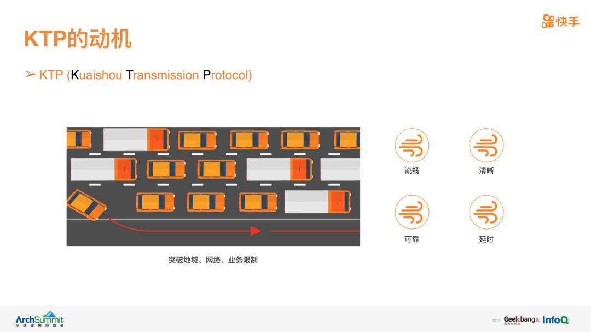

最后，考虑到兼容性问题，目前 KTP 主要用于快手业务的上行优化，因为 CDN 暂时不支持 KTP 协议。因此，无论是短视频上传、直播推流，还是 RTC 类应用，KTP 都只是将用户的上行与我们的自建机房连接起来，CDN 则负责从机房 / 源站回源数据，进而分发给最终的消费者，如下图所示。

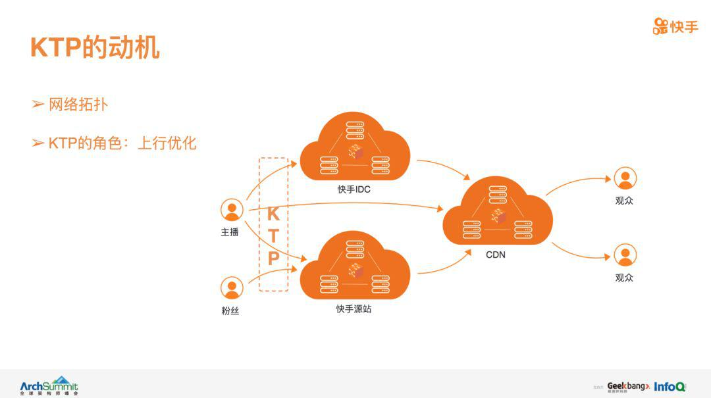

####二、 KTP 的架构与现状

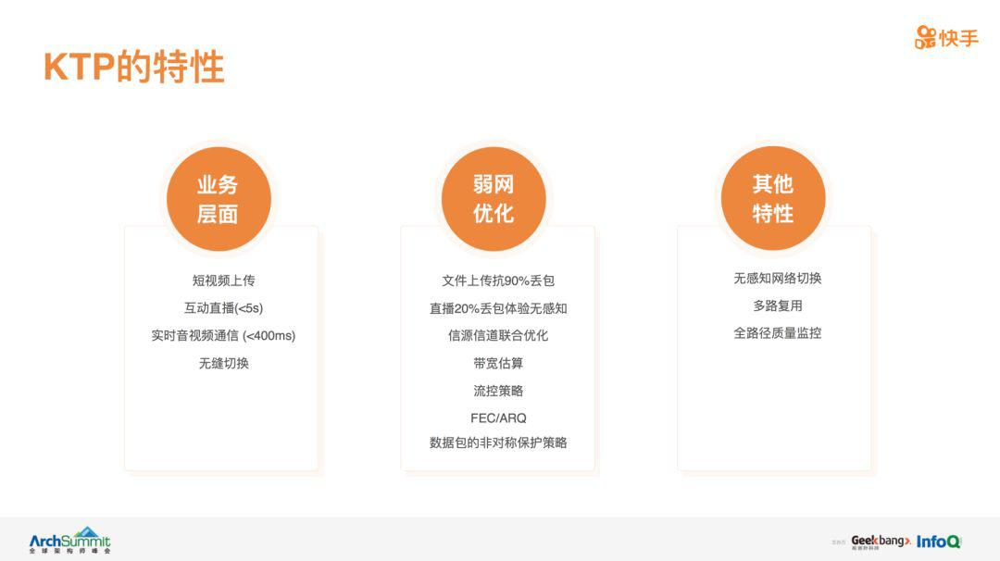

这是 KTP 的架构示意图，列举了一些大的模块，下面分别简单介绍：

**1、网络估计模块** 。部署在 KTP 服务端，在该模块，KTP通过接收数据包的特性估计网络的当前状态，包括延迟估计、带宽估计、丢包估计等。这些网络状态的估计主要是基于 KTP包头携带的自定义字段实现的。通过不断的摸索与业务需求，同时考虑 KTP 包头的开销，KTP 包头携带了一些 TCP拿不到的信息，从而对网络带宽、延迟、丢包的估计更加准确与灵活。

**2、网络控制模块** 。部署在 KTP 发送端的底层，负责直接与网络 IO 交互。在该模块，KTP 在 UDP 之上实现了拥塞控制、缓存控制、Pacing 机制、ARQ、动态可靠性控制等。这里要简单地强调下，通过自定义包头，KTP 可以动态的设定每个包的重传次数、优先级，从而满足不同场景的需求。不像 TCP 完全可靠、UDP 不可靠这种非黑即白的特性。

**3、业务感知的信源信道联合优化模块**。这个模块把网络和业务紧密结合到一起，这也是决定用户体验至关重要的一个模块。在该模块，流控策略结合服务端网络估计模块对网络状态的估计，网络控制模块对发送状态的反馈，以及业务的特性，最终决定信源端，也即业务层一些参数与状态，例如编码器相关的码率、帧率、分辨率；可靠性相关的 FEC 动态码率；延迟相关的缓存控制；基于媒体数据优先级特性的丢包策略、非对称差错保护等。

目前，KTP 在快手已经全量上线，服务于快手的短视频、直播与连麦业务，总体来说，KTP 具有以下基本特性：

**1、业务层面**。满足短视频上传、直播、连麦等多种业务需求。提升了短视频上传的成功率和速度。对于直播，同时支持互动直播和低延迟的连麦需求，且二者能做到无感知的切换。

**2、弱网优化层面** 。基于 KTP 的强扩展性与业务感知特性，对不同的应用场景采用不同的优化手段。对于短视频上传，可以达到在 90%  丢包率的条件下，依然发布成功。对于直播，KTP 能做到 20% 丢包无感知，观众感受不到任何的卡顿。而对于传统的基于 TCP 的协议，20%  丢包是一个门槛，到了 20% 丢包，TCP 类协议几乎不可用。此外，在联合优化层面，KTP 集成了丰富的优化策略并做到联合优化，例如重传、FEC、非对称保护、信源信道联合优化等。

**3、其他特性** 。KTP 中所有的策略与算法都是独立的子模块，可以任意的插拔，从而极大的提高了 KTP 的扩展性和优化效率。此外，KTP  
协议还可以做到多种网络无缝切换，用户在 4G/Wi-Fi 进行切换时，可以做到业务无感知。

####三、 短视频上传优化

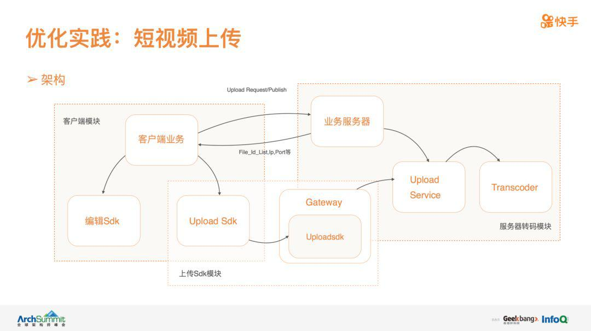

上图是短视频上传的架构图。传统短视频上传直接将编辑模块产出的文件通过 HTTP-POST 上传到后端服务器。为了更好地优化上传成功率和速度，我们通过一个独立的上传模块接管了客户端的上传业务。上传模块通过 KTP 协议与部署在 IDC 的 Gateway 通信，进行文件上传，再由 Gateway 将文件中转到后端业务模块。

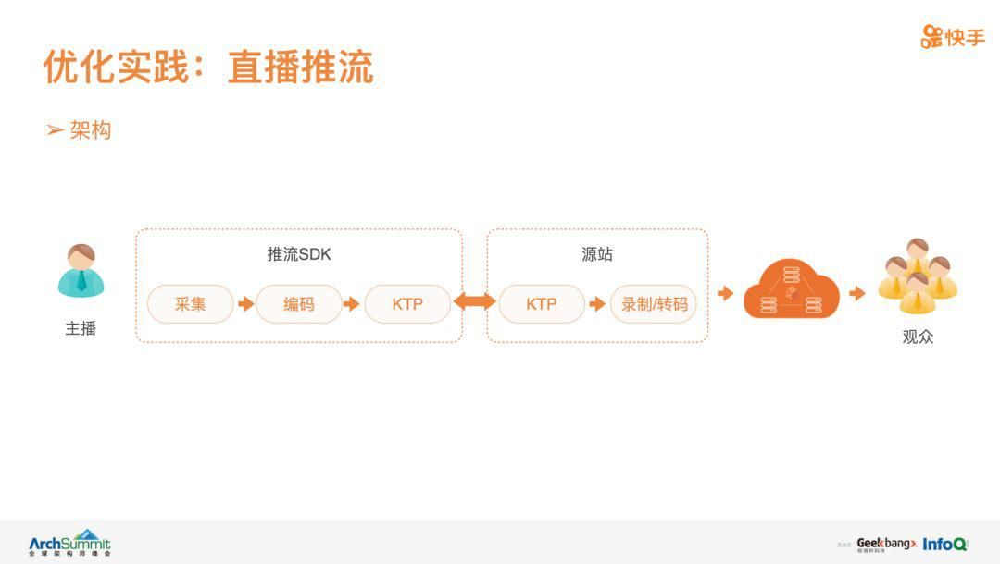

短视频上传的优化中，KTP 的网络估计模块不用设计得过于复杂。对于丢包、延时、带宽的估计，根据实时数据做一些统计即可。因为短视频上传对数据包间的实效性要求很低，用户并不关心这个文件每个包什么时候上传成功，只关心这个文件的最后一个包什么时候被成功的上传上来。因此，可以用较长时间段的数据进行平滑滤波，滤掉网络的噪音与干扰

为了保证上传的时效性，快速完成短视频上传，KTP采用比较激进的网络控制模式。这里用一个图来简单解释一下，如上图右下角的子图，表述了网络延迟与发送速率的关系。最左边，当发送速度特别小的时候，延时几乎不会变，近似等于网络的固定延时；随着发送速率增大，当发送速率达到网络的带宽瓶颈后，数据就会慢慢堆积，延时越来越大。当积累到一定程度，整个网络的 buffer 被塞满，这时候延时将不再增大。因此，在文件上传中，KTP偏向于发送速度达到右边这个拐点附近，这样做能增大发送速率，抢占网络带宽，但是也会带来丢包的风险。因此，在短视频上传的场景下，KTP的丢包判定非常保守。此外，为了保证数据的有效性，降低数据的冗余率，网络编码也是一个非常有效的手段。

在短视频上传业务中，信源是一个从编辑模块输出的视频文件，因此，我们需要结合网络估计模块对网络状态的估计，动态调整视频文件的转码码率（视频文件大小），目标在保证用户视频质量的前提下，最小化发布耗时。

4 四、直播推流优化

直播推流的功能复杂，场景丰富，但总体架构比较简单：推流模块负责采集、前处理、编码，然后把媒体数据传给 KTP 进行封装并发送。KTP  的接收端部署在自建的源站系统里，源站负责接收数据，并做一些处理，例如录制、转码等。最后，CDN来源站回源，并分发到最终的消费者。主播端（推流模块）与源站之间的通信，则完全依靠 KTP。

直播推流过程中，我们最关心的是推流质量。决定推流质量的因素是多样化的，包括推流的可靠性、传输实时行、网络利用的高效性、媒体流的流畅性等，并且这些因素之间是相互影响的。从优化的角度，我们主要考虑以下问题：

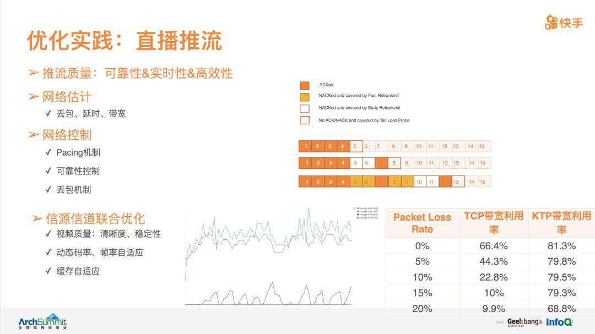

**1、网络估计** 。接收端，也即 KTP 协议栈的网络估计模块，需要结合 KTP协议携带的信息，估计网络的带宽、丢包、延迟等状态信息。考虑到直播一般能容忍秒级的延迟，因此，在估计网络状态的时候，主要采用指数滤波等方式，过滤网络的噪音与抖动。

**2、网络控制** 。KTP网络控制模块的核心在于发送速率与可靠性的控制。发送速率主要由拥塞控制策略决定，需要综合考虑网络估计模块反馈的网络状态以及媒体流的特性。在直播场景下，拥塞控制的决策与传统的文件传输有所不同：

  * 数据源（直播流）是实时产生的，如果视频码率低于可用带宽时，容易出现发送队列为空的情况。当发送队列没有数据时，网络会处于空闲的状态，此时传统的基于发送速率 - 丢包 - 延迟模式的拥塞控制规则将失效。在 KTP 中，当出现发送队列为空时，该信号会被告知给拥塞控制模块，从而避免因为网络空闲导致算法失效。
  * 发送队列有数据堆积。此时拥塞控制机制虽然有效，但是数据的堆积会增大延迟以及丢包的风险。传统的做法是以拥塞控制算法的反馈速率，无感知的进行发送。KTP 会依据缓存数据的多少、变化趋势等，在拥塞控制算法反馈的发送速率的基础上，动态的调整发送速率，目标在控制延迟与丢包的前提下，尽可能以平稳的速率进行数据传输。
  * 可靠性。结合数据包的优先级（例如音频与视频的特性、视频中不同帧类型的特性等），动态调整每个数据包的可靠性与重传次数。同时，KTP 在不同场景下，采用了多种丢包判定策略，从而在丢包的激进程度上做到可靠可调节。

**3、信源信道联合优化** 。该模块直接感知不同直播场景的业务需求，关系着推流质量。在该模块，最重要的功能是保证上层编码器与底层网络能协调工作，主要手段则是依据编码器的特性、直播场景的特性、网络的特性等，动态决定编码器的编码码率、帧率、分辨率，以及给网络控制层发送数据的速率等。同时，要控制缓冲区的大小从而控制延迟，在极端网络下，需要采用基于优先级的丢帧策略等。为了提升综合性能，KTP的基本出发点是期望应用层的缓冲区不空，但也不要太满。因为缓冲区空，则很可能带宽没有充分利用起来，导致带宽利用率不够高，视频清晰度下降。当缓冲区过满，则会大大增大延迟与推流卡顿的概率。因此，如何在二者之间寻找平衡点，是流控的关键，采用的手段则以控制论为基础进行建模，设计不同的控制器（PI、PD、PID等）进行动态调控。

####五、直播连麦

直播连麦是直播的升级版玩法，即主播与一个或多个粉丝通过音视频实时互动，同时其他粉丝正常观看直播。主播和粉丝端的架构比较类似，发送端包括采集、编码、KTP 发送数据，接收端 KTP 接收数据、解码、渲染。在连麦方面，主播与粉丝之间的实时音视频流，通过自建的 MCU 进行转发，主播与 MCU、MCU与粉丝之间的通信都基于 KTP。此外，在直播方面，MCU 还需将连麦的合并流以直播的方式发送给源站系统，进而由 CDN 回源并进行正常直播。

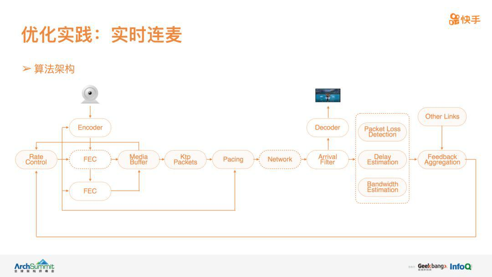

这是实时音视频的流控结构图，列举了主要的控制模块。发送端，编码器采集编码后，将数据发送到 MediaBuffer 进行缓存，KTP 从  MediaBuffer 中获取数据并封装成 KTP 包，然后以一定的速率进行发送。接收端一方面需要接收媒体数据并进行解码渲染，另一方面，还需要统计发送与接收数据的特性，进而估计网络的带宽、丢包和延迟。值得注意的是，在服务端存在一个聚类模块，这是因为 KTP 的网络估计模块以单向网络为单位进行网络估计，从而提升扩展性。通过聚类模块收集各个单跳网络的网络状态，同时结合路由路径，进而估计整个端到端链路的状态，并将最终的结果反馈给发送端的RateControl 模块。在发送端，RateControl 模块结合 MediaBuffer 与网络反馈结果的状态，动态决定编码器的码率、帧率、FEC比例、Pacing 码率、MediaBuffer 缓存控制等。

直播连麦面临的挑战相比单纯的互动直播和短视频上传都要大很多：

**1、网络估计模块的挑战** 。首先是延迟的估计，连麦对延迟的要求很高，在估计网络延迟的时候，需要选择合理的延迟指标，例如常见的有 RTT （SRTT）、One-Way-Delay、Queueing-Delay，KTP 则综合考虑后两者。此外，过滤网络的噪音和抖动，对延迟的估计也至关重要，延迟估计的误差对连麦质量的影响非常大，常见的方式是滤波，例如卡尔曼滤波，指数滤波等。对于丢包的估计，则需要区分导致丢包的原因：随机丢包还是拥塞丢包。二者的处理方式完全不一样，随机丢包主要通过增加 FEC 或重传来对抗，而拥塞丢包则主要通过流控降低发送速率，缓解网络拥塞来避免。KTP 基于延迟的抖动规律，同时结合丢包率的特性，来动态判定当前丢包的原因，进而采取合适的策略。对于网络带宽估计，KTP主要以延迟估计为基础，结合实时发送速率与接收速率的特性为输入，对网络进行分类建模，动态预判网络带宽的变化趋势。

**2、弱网的优化** 。采用 UEP 区分对待不同重要性的数据包，联合 ARQ/FEC对抗网络的丢包。此外，另一个挑战是编码器的特性对流控的影响特别大，信源信道联合优化显得更加重要。例如，在实际系统中，编码器的输出并不能按照流控的反馈准确的控制码率（通过一定的手段可以做到严格的CBR，但是会大大损失编码质量），这是因为实时视频的码率与具体的场景、帧类型都相关。而连麦这种 RTC 应用，对实时码率的抖动非常敏感。码率的抖动会影响传输延迟的抖动，进而影响网络状态的估计与流控的决策。因此，编码器的优化与传输策略的优化，只有深入结合，才能保障实时音视频通信的效果。

**3、竞争的考虑**。对于主播，上行存在直播流与连麦流的竞争，二者的特性以及底层的拥塞控制策略都不一样。因此，对网络的利用程度、竞争程度也完全不一样。一般情况下，直播流的拥塞控制策略会比连麦的激进，抢占能力更强，因此，二者的配合也非常重要。在 KTP 里，二者在统一的架构中，能彼此知道对方的状态，以直播和连麦的总体效果为目标，在各自拥塞策略和流控机制的基础上，做全局的优化，从而决定最终的发送速率。

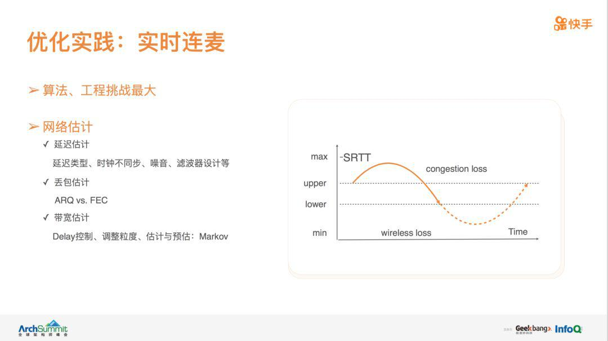

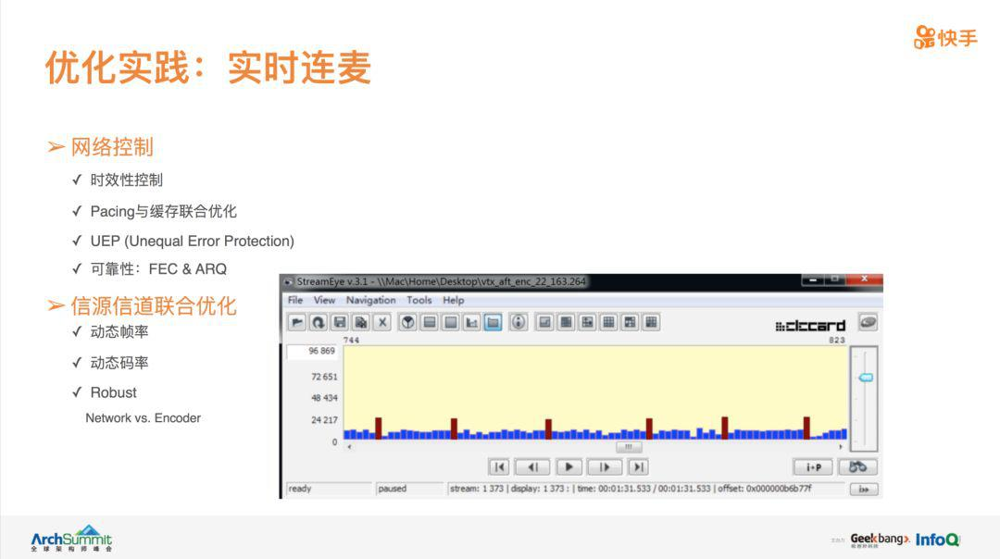

####6 六、后记

KTP 已经全面落地于快手的多项相关业务，KTP 基于 UDP，具有极强的灵活性。KTP 各模块独立解耦性可插拔，同时背靠快手的 AB 系统与大数据系统，为后续的持续优化提供了极大的空间与便利。从业务角度看，多人实时互动也是目前的重点业务，对 KTP 的挑战也将大大增加。此外，除了利用 KTP 进行上行优化外，我们也在做下行的优化，包括直播多码率、短视频多码率、CDN 智能调度等。

快手秉承积极开放的心态，希望利用快手的技术优势与数据优势，推动相关技术的快速发展，也欢迎志同道合的技术达人一起探讨 / 加入我们 KTP 的持续优化中来。

####7 作者介绍

周超博士，快手科技算法科学家。毕业于北京大学，主要研究方向包括计算机网络、多媒体通信、流媒体传输优化等。发表论文三十余篇，申请专利三十余项。现任快手科技算法科学家，负责快手视频传输算法组的管理与业务优化，主导了快手私有传输协议  KTP 的设计、实现、优化到全面落地。
