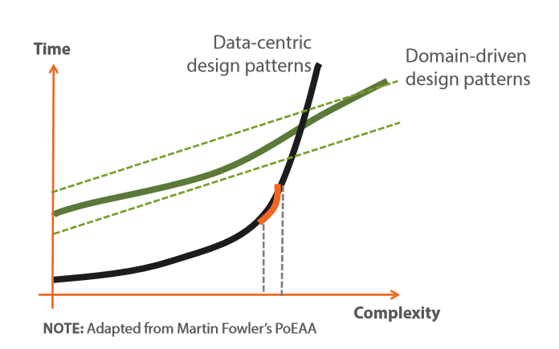
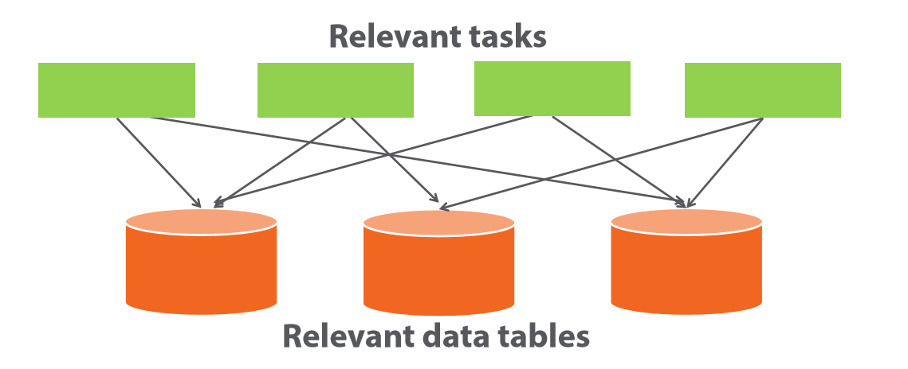
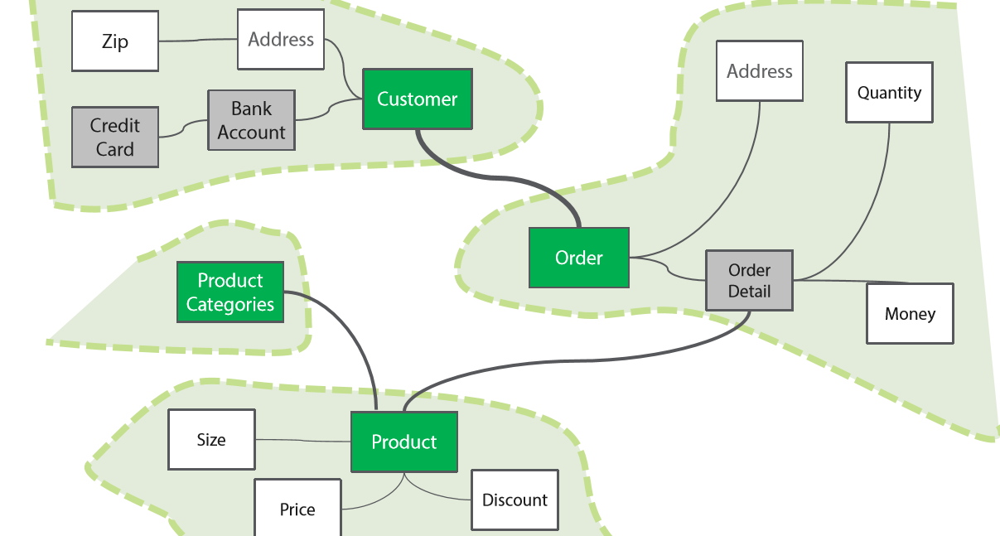
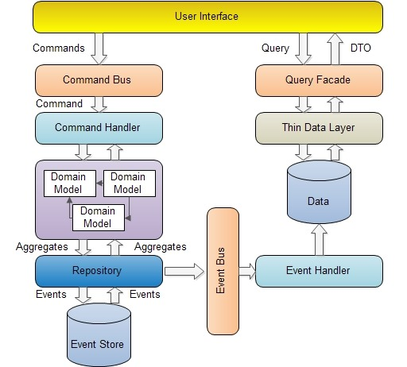
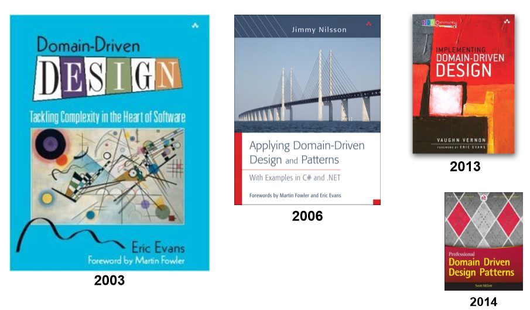

 
<!--BEGIN_DATA
{
    "create_date": "2016-07-13 18:26", 
    "modify_date": "2016-07-13 18:26", 
    "is_top": "0", 
    "summary": "我眼中的领域驱动设计", 
    "tags": "架构", 
    "file_name": "我眼中的领域驱动设计.md"
}
END_DATA-->

####
原文出处：<a href='http://www.cnblogs.com/richieyang/p/5373250.html' target='blank'>我眼中的领域驱动设计</a>

有幸参与了一些领域驱动的项目，读了一些文章，也见识了一些不伦不类的架构，感觉对领域驱动有了更进一步的认识。所以今天跟大伙探讨一下领域驱动设计，同时也对一些想要实践领域驱动设计却又无处下手，或者一些正在实践却又说不上领域驱动设计到底好在哪的朋友一些指引方向。当然对于"领域驱动设计"这个主题而言从来不乏争论，所以大家可以在畅所欲言。

####为什么要使用领域驱动设计？

从Eric Evans的《[领域驱动设计：软件核心复杂性应对之道](https://www.amazon.cn/%E9%A2%86%E5%9F%9F%E9%A9%B1%E5%8A%A8%E8%AE%BE%E8%AE%A1-%E8%BD%AF%E4%BB%B6%E6%A0%B8%E5%BF%83%E5%A4%8D%E6%9D%82%E6%80%A7%E5%BA%94%E5%AF%B9%E4%B9%8B%E9%81%93-%E5%9F%83%E6%96%87%E6%96%AF/dp/B004BA21U2?ie=UTF8&*Version*=1&*entries*=0)》一书的书名就可以看出这一方法论是为了解决软件核心复杂
性的。也就是说软件业务越来越复杂了，领域驱动设计可以让事情变得简单。而实际情况是：**领域驱动设计的门槛很高，没有很深厚的面向对象编码能力几乎不可能实践成功
。**

这一说法是否自相矛盾呢？Martin Fowler在[PoEAA](https://www.amazon.cn/%E4%BC%81%E4%B8%9A%E5%BA%94%E7%94%A8%E6%9E%B6%E6%9E%84%E6%A8%A1%E5%BC%8F-%E7%A6%8F%E5%8B%92/dp/B003LBSRDM/ref=sr_1_1?s=books&ie=UTF8&qid=1460217008&sr=1-1&keywords=martin+fowler)
一书中给了一个有力的解释：

我们把三层架构等除了领域驱动之外的架构方式都可以归纳为以数据为中心的架构方式，在图中是黑色的粗实线；

领域驱动设计在图中是绿色的粗实线。

  * 当软件在开发初期，以数据驱动的架构方式非常容易上手，但是随着业务的增长和项目的推进，软件开发和维护难度急剧升高。
  * 领域驱动设计则在项目初期就处在一个比较难以上手的位置，但是随着业务的增长和项目的推进，软件开发和维护难度平滑上升。

这幅图形象的解释了领域驱动设计和传统的软件架构模式两者在软件开发过程中解决复杂性之间的差异。

####领域驱动设计的核心是什么？

顾名思义，领域驱动设计的核心是**领域模型**，这一方法论可以通俗的理解为先找到业务中的领域模型，以领域模型为中心驱动项目的开发。而领域模型的设计精髓**在
于面向对象分析，在于对事物的抽象能力，**一个领域驱动架构师必然是一个面向对象分析的大师。

在面向对象编程中讲究封装，讲究设计低耦合，高内聚的类。而对于一个软件工程来讲，仅仅只靠类的设计是不够的，我们需要把紧密联系在一起的业务设计为一个领域模型，让
领域模型内部隐藏一些细节，这样一来领域模型和领域模型之间的关系就会变得简单。这一思想有效的降低了复杂的业务之间千丝万缕的耦合关系。

下图为"以数据为中心的架构模式"，表和表之间关系错综复杂：

下图是"领域模型"：领域和领域之间只存在大粒度的接口和交互：

初期学习DDD的朋友一定不会错过Eric Evans写的《[领域驱动设计：软件核心复杂性应对之道](https://www.amazon.cn/%E9%A2%86%E5%9F%9F%E9%A9%B1%E5%8A%A8%E8%AE%BE%E8%AE%A1-%E8%BD%AF%E4%BB%B6%E6%A0%B8%E5%BF%83%E5%A4%8D%E6%9D%82%E6%80%A7%E5%BA%94%E5%AF%B9%E4%B9%8B%E9%81%93-%E5%9F%83%E6%96%87%E6%96%AF/dp/B004BA21U2?ie=UTF8&*Version*=1&*entries*=0)》，这本书名气很大，也是很多人入门领域驱动设计的首选读物，这本书提到了领域驱动设计中的一些概念：Repository，Domain，ValueObject等。但是初学者有可能得出一个错误的结论：**有人误认为项目架构中加入***Repository，***Domain，***ValueObject就变成了DDD架构。**如果没有悟出
其精髓就在项目中加入这些概念，那充其量也不过是个三层架构；反之对于一个面向对象分析的高手而言，不使用这些概念也可以实现领域驱动设计。

以IUserRepository这样一个接口定义为例：
    
    public interface IUserRepository : IRepository<User>
    {
        //What's this?
        List<Rule> GetRules(int id);
        //....
    }

一个IUserRepository是一个Repository，他只能以User聚合根为单位进行操作。方法List<Rule> GetRules(int
id)将此Repository打回了原形，这不再是一个Repository，这是一个DAL。

正确的实现方式：   
    
    public class User:AggregateRoot
    {
        private List<Rule> GetRules()
        {
            return null;
        }
        public void ApproveRequest(Request request)
        {
            var rules = user.GetRules();
            //......
            //如果有权限就批准  
        }
    }
    

这段代码体现了User作为一个领域模型，他拥有自己的职责和能力。

####如何开始实践领域驱动设计？

正如本文通篇所说，领域驱动设计讲究的是领域模型的分析和对事物的抽象，从来没有提起过数据如何存取这个话题，言下之意在领域驱动设计中，我们不关心过数据如何存取，
怎么样写linq效率高，使用懒加载还是include，这些实现细节会将你带入传统的三层架构模式中。

在领域驱动设计中要先设计领域模型，接着写Domain逻辑，至于数据库，仅仅是用来存储数据的工具。使用database first那不叫领域驱动设计，很明显你
先设计的表结构，所以应该叫数据库驱动设计更为准确。更不要引入数据库独有的技术，例如触发器，存储过程等。数据库除了存储数据外，其余一切逻辑都是Domain逻辑
。

我们不妨以大家都比较熟悉的医院门诊看病流程举个例子，看看如何开始实践领域驱动设计：

我们暂且认为一个门诊看病流程就是一个完整的领域模型，此时你要忘掉数据库，不要再想表结构如何设计，而是就这一领域模型进行抽象：   
    
    public class OutPatientProcess:AggregateRoot
    {
        public Registration _registration { get; private set; }//挂号单
        private List<Examination> _examinations;
        public IReadOnlyList<Examination> Examinations => _examinations.AsReadOnly();//化验单
        public Prescription Prescription { get; private set; }//处方
        public DateTime ConsultaionTime { get; private set; }//接诊时间
        public Doctor Doctor { get; private set; }//接诊医师
        //开始一个门诊治疗过程
        public void StartProcess(Registration registration)
        {
            _registration = registration;
            InquireSymptoms();
            WriteOutExamination();
            WritePrescription();
        }
        //询问病人病情
        public void InquireSymptoms()
        {
        }
        //开立化验单
        private void WriteOutExamination()
        {
            _examinations.Add(new Examination());
        }
        //填写处方
        private void WritePrescription()
        {
        }
    }
    

我们暂且不讨论这一模型是否符合真实场景，但是这个例子带你迈入了领域驱动设计的第一步，同时这个例子也向你展示了软件开发可以不用先设计数据库。当你写好所有的Do
main逻辑后再考虑把这个类持久化在数据库中就好了。在我眼中，数据库仅仅是一个保存数据的东西，不要把他过早的耦合在代码中。这一强调了很多遍的观点影响着你能否
成功实践DDD。

####CQRS架构展望

话虽这样说，但是既然你在使用关系数据库，有人就会免不了跟你提起性能怎么优化这样的话题。这也是传统ORM+关系数据库实现领域驱动设计的硬伤，特别是当你的领域模
型Scope设计过大，意味着Repository中的操作每次都要关联一堆表出来，特别是有人设计数据喜欢遵守第N范式这种基本就没辙了（没有贬低遵守这些范式的意
思，只是这样设计的数据库+ORM会产生较多关联，相对应的设计为表结构冗余设计，有利于ORM提升性能），不得不说到了最后由于数据库的存储性能问题，我们又一次将
数据库纳入到了考虑范围。

解决这一问题的方案是CQRS架构， Query端各种缓存和Nosql，顺便把搜索引擎也用上，让你的软件飞奔起来。这一架构解耦了数据库操作，你基本没有机会跟数
据库打交道并且还解决了数据存储的性能问题。

这一进化过程也解开了一些人的疑虑，为什么从刚开始写代码就开始学习各种设计模式，但是从来没有机会使用过？因为你所写的代码无时无刻不耦合着数据库这一"毒瘤"，而
数据库操作作为一种实现细节掺杂在你的代码中，所以领域驱动设计为此而生，你准备好了吗？

