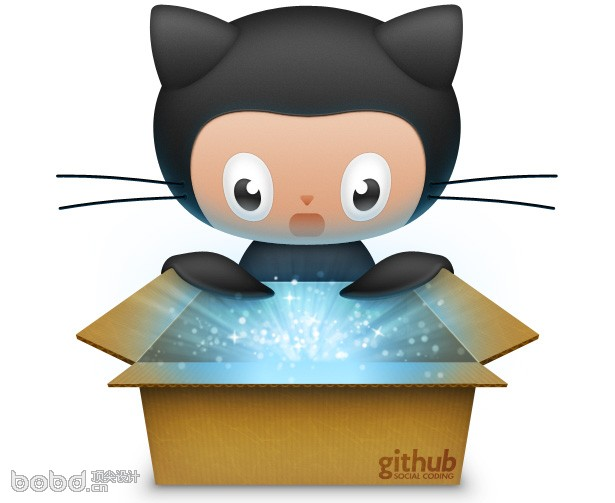

<!--BEGIN_DATA
{
    "create_date": "2016-05-16 10:23", 
    "modify_date": "2016-05-16 10:23", 
    "is_top": "0", 
    "summary": "我经历的IT公司面试及离职感受", 
    "tags": "其它", 
    "file_name": "我经历的IT公司面试及离职感受.md"
}
END_DATA-->

####
原文出处：<a href='http://www.jianshu.com/p/aa7690932f21' target='blank'>我经历的IT公司面试及离职感受</a>

 

<h4><b>未经版权许可，严禁转载，必究到底！</b></h4>
毕业后几年一直待在广州，觉得这是一个比较生活化及务实的城市，其互联网公司和相应的投融资环境都不如北深上活跃，大大小小的面试也有几十个，有点规模的公司应该都面试过了，面试一般会见到主力技术人员，技术主管，技术总监，人力几个人，狭义上还是可以看出一些公司文化技术氛围滴，于是想写这样一篇文章，介绍经历也给予朋友们看看。

先介绍下自己的技术背景，二流大学计科毕业，GPA3.21/4.0，计算机专业课都有90分以上，高数基础不太好，也是我目前的瓶颈，程序语言基础不算差，外企，国企，民企都混过，做了6年的Android了，有3年是音视频和显示系统（Framework和Kernel），到门槛了。有3年是App方面，有几个千万月活的产品主程序经历，也是Google Play的顶尖开发者，随着泡沫入门了。另外也熟悉IOS和NodeJS，会写一些简单的前端，算个二吊子的全栈开发。

所以，我真的只是个不算太差的三四流程序员，交待完背景，开始正文，下文涉及的公司主要有：

甲骨文数据公司，三星通信研究院、腾讯；

阿里巴巴、网易公司、欢聚时代、唯品会、猎豹移动；

卓望公司、4399游戏、爱拍、PP金融、酷狗音乐、TCL多媒体。

我一个个说，有在职的才有离职过程感受，<b><strike>只正式经历过3个工作东家和1个实习东家，其余都只是面试感受</strike>，</b>看不下去可以乘搜索电梯直达。
<h4>1.甲骨文数据公司</h4>

 

 

职位：C++ software engineer

面试过程：开始有一轮群面，大概是有设计一个单元测试模块，测试一个万分之五概率的问题，找出缺陷，然后每个人分别陈述，没有Leader，我表现中规中矩，中途有个同学给了我比较好的修正思路。

接下来有两轮技术面，因为是校招，都是基础知识，计算机原理为主，也有一些数据结构的分析，第二轮面试我的是一个非常Nice的瑞典帅哥，我英语不好，他非常耐心地讲解，也适当给予我提示。

最后一轮是HR，一个笑眯眯的美国老头，中英文夹杂者，问一些生活问题，职业规划什么的，给人感觉非常亲切！

值得一提的是，后来二面的面试官找我过去聊了聊，很真诚地指出我技术不足，以及给我解答了面试中我没有回答好的问题，也给我留了邮箱。问了参见面试的其他同学，都有约谈。

离职：实习性质入职甲骨文，待的时间非常短暂，离职原因是因为我们需要从事18个月的技术支持和测试工作，在这个公司渡过了非常快乐的一段时间，欧美企业的自由平等企业氛围，极客的技术思维，都让我非常难忘，不管是在深圳还是大阪，工作方面它非常关注和鼓励你的自身提高和职业发展，生活上你完全不需要担忧，有什么困难反映给公司，马上就可以得到解决，譬如我初到深圳没地方住，只是和一个HR闲聊无意说了下，公司就为我们几个实习生租了房子。

离职过程是在OA申请，他们也没有对其他同事遮遮掩掩，有过接触的同事都有发邮件祝福，也收到了公司和同事很多纪念礼物，反而让我有种即将登上新的鸿途的感觉。
<h4>2.三星通信研究院</h4>

 

 

职位：C/C++ software engineer

面试过程：开始有HR简单聊了一下，然后笔试，有10个不定项选择题，2个编程题，1个开放性的三列交叉排序算法题，整个笔试不难，感觉要得高分非常不容易，基础的广度和深度均需要顾及，

接着就是两轮技术面试，笔试答错的题目都被抓出来问了，他会给予思路和背景知识，直到你弄懂了为止，有种上课的感觉，其他问的都是简历上的内容，譬如我大学的SCI论文是点阵识别方向，两个面试官都非常感兴趣，交流过程中他们都非常谦卑，不断问我是不是这样理解，没有很多公司面试官高高在上的SB感。

最后是HR谈薪，他很坦诚说了其他面试官对我的评价和三星给我的薪资，也谈到了我将来入职的部门和工作，以及对我的期望和建议，他并没有说三星多好多好，反而让我比较目前已有的offer，选择适合自己的。

离职：离职原因主要是我当时厌烦这种无限加班的环境，想换个工作环境，另外一方面是我从事了很久Android Framework和Kernel工作，很想去做Android App。离职过程不是非常顺利，我的HR，直属主管，直属主管的上司，广州研究院的负责人，大中华区的副总裁，都找我聊过工作和离职的问题，他们希望我留下，我的需求都尽量满足。虽然是程序式的面谈，但他们表现出的真诚和平和让你肃然起敬，他们对我个人几年后的发展也都给予了中肯的意见，我离职几年后，发现我的直属上级对我的职业发展也判断得非常准确，我觉得三星是一家伟大的企业，有这样一群人，他们会继续伟大。
<h4>3.腾讯</h4>

 

 

职位:高级软件工程师

面试感受：腾讯是非常重视效率的公司，工程师文化盛行，给我面试电话的是一个工程师，他说我是腾讯的软件工程师，近日收到你的简历，想找你聊聊。我还第一次接到非HR式的面试通知。过去后也是工程师接待我的，当时一直在想HR有什么可干的呢？

技术面试分为四轮，第一轮是两个年轻的程序员，问一些项目背景啊，技术方向啊，也结合我的项目经验聊了实现原理之类，聊得还比较开心和轻松。

第二轮是Team Leader，重复了一遍项目经验，他的侧重点在项目进度控制和风险控制方面，他也问了我的薪资要求及技术意向，也说明了他们目前需要一个什么类型的人才。

第三轮是专家评审，他们的侧重点在于计算机基础知识，项目实现原理，数据结构和算法，他们采取让你先陈述，然后由浅入深提问，层层递进铺开的面试思路，非常专业，这相比很多公司面试喜欢冷门的技术细节，不知道高到那里去了，这轮面试有很多开放性的问题，我回答时他们也会帮我纠正错误，整理思路。

第四轮是技术总监面，这哥们穿着真太随意了，他好像比较忙，一直不断在电脑上敲，只问了我两个问题，说说你从业生涯中遇到的最大技术难题和解决过程，说说你熟悉的两个开源项目以及项目背景和原理。我在小白板上写和说，过程中他很少说话，过程中他一直：然后呢？还有呢？最后看了一会小白板就走了，我一直纳闷他到底听了没有。

最后就是HR，她说该了解的都了解了，你有什么问题问我没有，我简单问了几个公司结构的问题，然后她就和我谈薪资了，肯定是我开的薪资太低了啊，吐血啊啊啊，她淡淡说了一句，这个薪资没问题，我们一周左右给你发offer就结束了。

离职：腾讯是技术氛围挺好的公司，没有阶层观念，有很多技术分享，有舒适的工作环境，不太大的工作压力（和我的team有关），好吃的工作餐，棋逢对手的三国杀，如果不是那个看起来美好的创业机会，我想我会呆在这里很久很久。

离职过程比较顺利，各级主管约谈，我也和他们坦诚我想出去闯一闯，也有同事帮我分析这个机会，以及给予了我一些资料，我的直属主管很认真说，你在外面感觉不爽时，也欢迎你随时能够回来一起奋斗，事业群负责人Allen也回了一小段祝福和welcome  back的邮件，而不是冷冰冰的同意！后来我在外面诸多不顺时，首先想到的是还是回腾讯吧！
<h4>4.阿里巴巴</h4>

 

 

职位：高级软件工程师 

面试过程：阿里的HR语言态度总会他们觉得自己低了一等，程序式的语言和高高在上的态度，必须给个差评。

技术面试分为两轮，一轮主管面，主要是项目背景知识，计算机基础，数据结构和算法相关，面试的氛围也非常好，先介绍自己，然后问问题也没有什么刁钻的技术细节，最后的开放性问题，我觉得他提的问题是欠思考的，所以回答过程中他不断补充，导致问题已经被彻底带偏了，我们都笑场了，他给人的感觉还挺冷漠的，我片面觉得也许以后的日子也不太好过。一轮是总监面，主要是项目经验和实际问题，有一个开放性的搜索算法，人非常好，不断抬起头询问式说话。

HR和我谈薪资还是维持那种爱来不来，大把人抢着来的心理，也不是根据面试结果和技术评级来的，比较随意的压价。 
<h4>5.网易公司</h4>

 

 

职位：高级软件工程师 

面试过程：网易对自己需要的人有非常明确的需求，所以当我技术面试的时，基本都是多媒体相关（我做过三年左右的Android多媒体系统），第一轮面试集中在多媒体编解码算法和Android StageFright实现，两个面试官，轮流轰炸，1个小时下来，觉得非常疲惫，口也非常渴。所以到第二轮面试的间歇期，我准备悄悄出去倒水，开门迎面碰到第二轮的总监面试官，我说我去倒水喝啊，被虐得口渴了，他忙不迭放下电脑，说我给你去倒吧，我清楚地儿在哪儿。我喝完休息了下，简单介绍了自己和项目经验，他中途没有插话，不断在简历上写，写得满满的，然后就一个个问我，还是在多媒体方面为主，架构方面他就让我在白板上画，画完就懂，有时候你会感觉和高智商的人交谈就是这么顺利，你们很快相互理解满满默契。

网易HR就是刚开始的带我去技术面试，后来和我谈薪资的那位姐姐，因为当时18点了，还带我去网易的食堂吃了一顿，三荤一素一汤，真挺好吃的，不得不说有自己食堂的公司是福利公司啊！
<h4>6.欢聚时代</h4>

 

 

职位：高级软件工程师 

面试过程，欢聚时代在环境优美的羊城创意园里面，进门有保安，非要往我身上贴了贴纸，前台MM还给了我一个长长的表要填，很多公司在面试的时候就让你把你的所有社会背景全填一遍，在没有达成合作关系前，其实我真的非常非常介意填这个涉及隐私的背景调查，选择Offer也自动下调一档，不知道HR怎么看待这个问题的，我没收到offer时不想入你们的所谓人才库，也不愿记录任何社会背景给你！

技术面试有三轮，第一轮面试官都是根据简历问的，问的东西都比较简单，以至于我后来问他是不是需要找Android高级软件工程师。

第二轮是一个白白胖胖的中年人，面试内容主要集中在Android客户端架构和重难点解决，Android系统组件的实现原理方面，也有涉及多线程模型，聊得比较开心，问题是我一直没有喝水，好渴啊！

第三轮是一个瘦瘦的头发梳得油亮油亮的中年人，主要问我一些架构和编解码算法方面，比较深入，我们也讨论了YY语音客户端的架构和存在的问题，面试过程没有偏门的技术细节，都是问我接触过的东西，他也一直保持微笑，面试体验挺好。

他出去了我等了很久，喝完了三杯水，还是木人来，我主动给HR电话他才匆匆过来，他问了一些职业规划和技术意向，也说了我的技术评级非常优秀，说帮我讨论和申请薪资。
<h4>7.唯品会</h4>

 

 

职位：高级软件工程师

面试过程：唯品会总部距离我住的地方好远，HR第一面，问了我离职原因和选择唯品会原因（其实我真是过来聊聊，面试愉快才能选择你啊！），还认真帮我梳理了一路以来的职业发展，虽然我不知道有什么用，还是觉得很深奥的样纸。

技术面试有两轮，第一轮不太顺利，我比较少接触H5混合型的App，唯品会是这个类型，也有很久没有接触javascript了，所以表现非常一般。

二轮面试主要是聊App架构和性能相关的问题了，这些我比较熟悉，所以相对来说有点心得，面试官对我也还比较满意。

总体感觉唯品会并不是一个技术公司，估计以后的业务压力会很大。末了也和唯品会的一个老朋友聊了会儿，我们一致认为，这里并不是一个热爱技术的最好选择。
<h4>8.猎豹移动</h4>

 

 

职位：高级软件工程师

面试过程：猎豹近年快速发展，也是我一直想加入的公司之一，只是我一直不知道广州有研发分公司，直到后面听一个朋友说的，于是就过来聊聊了。首先是前台MM给我一张我很介意的背景调查让我填写，尽管不想填，还是耐性填了，有一份比较简单的笔试题需要做，题目主要还是一些线程，消息之类的Android基础题，感觉并没有根据级别来出题。

技术面试有三轮，首先是一个酷酷的灰衫人，问题集中在计算机基础上，项目背景我介绍完了他也比较简单问了一些问题，相对而言会少涉及Android开发，深度也有所欠缺，他理解能力非常好，有些专业性问题看得出来他没有接触过，但是很快就可以理顺，途中他有问我这个面试题怎样，我坦诚回答对我而言知识点深度广度有所欠缺，如果有针对性会更好。

二轮是一个看起来很Nice的年轻哥们，面试过程一直保持微笑，口头禅是为啥？面试内容上项目经验涉及会比较多，也有一些设计模式和数据存储相关，项目周期和风险控制也有所Check，总体下来理论为主，技术点比较少比较浅，面试聊得挺愉快滴。

三轮是总监面，大部分问题围绕在你有什么优点，相对其他程序员有什么优势，有没有某个项目因为你加入而变得不同，前两轮也有一些这类问题，但不像这轮变成一个针对点，确实有一些项目组因为我的加入变得不同，但并没有发生过质的裂变，虽然这种问题有压价铺垫的嫌疑，我一直觉得开源技术的发展已经让整个互联网行业变化，相对上个时代，团队才是决定因素，但整个面试都有这类问题，也能侧面反映出公司有个人主义趋向。

最后是HR谈薪，HR帅哥很赞很爽快，没有很多公司的职业套路和夸夸其谈，我的面试评价挺好，薪资要求超过了总监决定范围，他说去申请，很快就收到了offer。

离职：在猎豹呆的时间短暂，和同事的相处挺好的，经常在一个小台球桌上玩儿（一面的灰衫人花样虐菜我），业余活动也很丰富，有健身房和滴滴，加班很多（22点离开算早），行政MM各个节日活动都很用心，年会也非常高大上玩得很嗨森。

在这里从事了很多业务方向的编码，猎豹有一些原有的通用模块，但大部分已经无法适应要求，每个项目都需要造一次轮子，努力想推进一些通用模块的编码，很难有机会和支持，虽然一直觉得不适应，觉得这并非一个有技术氛围的公司，开发地位相当低，但还是想努力改变自己来适应环境。真正促使我离职是转正评审，其实我觉得自己在猎豹的输出还是不少的，有诸多槽点，也相信自己是至少及格的，转正评审投影一直不太好用，时有时无的，我分别从项目输出、技术输出几个方面说了，期间参与评审的两个上司一直在玩手机，讲完后却说我未说过对项目的贡献，几乎全盘否定了我在通用技术的输出，内部通用组件和开源方案也觉得没有任何意义，有一种野路子出身的土军阀感，当时本想辩解九层之台起于累土。但因为另一位同事插话说我某个项目PPT写成全是自己做的（其实只有少部分），业务方面的业余程度让我震惊，心累没话说了（不与傻子论短长），后来只能离职。

离职原因一方面是我本身对猎豹广研疯狂加班的文化不适应，另一方面是想换个更适合技术人员发展的环境，离职感受一般，我前后对所有工作上有过支持和合作的同事都表示了感谢，期间签字领导保持漠不关己的麻木感，缺少人与人之间的基本尊重，觉得欣慰的是最后收到入职帅哥HR一个离职祝语的小卡片，上面的打油诗让我觉得离职猎豹还是有所遗憾。
<h4>9.卓望公司</h4>

 

 

面试岗位：Android软件工程师

面试过程：卓望在高大上的富力中心，卓望也有和很多外包人力公司合作，浪潮和卓望我先后面过，大致过程差不多，有一轮笔试题，主要是Android四大组件，网络协议，设计模式相关，据说我得分还非常高。

技术面试有两轮，我在卓望之前较少涉及上层应用的开发，面试还挺忐忑的，第一轮面试是一个萌萌的程序员，他在我们技术细节前都会说一声，生怕问倒我，我主要是讲了Android音频系统相关的内容，他也问得很谨慎，看起来是一个非常温和的人，后来的工作也证明了这点。二轮面试也是一个很Nice的人，他问得问题也相对简略，笑得很夸张哈哈哈，主要是http，UI界面相关的内容，可能是我在Android系统层干得太久，不知道外面的世界是怎么样了。

离职过程：在卓望待了两年多，在两年是我在APP开发最快成长的两年，轻松愉快的工作氛围，有足够的时间编码及研究新技术，业余时间也写了很多优秀且赚钱的游戏和App，被Google Play评定为Top developer，考系统分析师得了省第二名，认识了很多工作努力玩得更努力的同学，他们有非常多创业成功的，后来他们给予了我很多帮助。

离职原因是我在卓望成长还算挺快，发展空间开始显得比较低，我也不想在这个国企氛围的公司慢慢熬下去，离职前上司找我谈话，他是一个很真诚豪爽的人，欣慰我的成长，说我知道留不住你，于是很热心地帮我分析我手上的Offer和创业机会，虽然最终没有按照他的建议选择，但还是非常感谢他，和他给我的建议。

离职签字时除苦瓜脸行政外，大部分人都还蛮诚恳地祝福，李财神爷和我开玩笑说，苟富贵勿相忘。
<h4>10.4399</h4>

 

 

岗位：高级软件工程师

面试过程：4399是页游时代非常出色的公司，一直觉得他很神奇，一年到头都在招同一岗位的人，我也收过很多次邀请，去面试是今年的4月份，它从科韵路搬到岗顶这边了，在面试之前我和HR沟通过几次，我是担心自己不符合他们的要求（又老又贵）。先是HR和我聊了下，问了我一些技术问题，主要是音视频方面的，HR还是对音视频有初步的理解，纳闷的是，难道HR这步觉得不满意就会刷人？

接着是两轮技术面试，一轮是负责平台开发的王总，说话挺温和的，问了我一些项目背景，技术选型之类的问题，集中在音视频和流媒体方面，比较浅。

一轮是客户端开发的哥们，项目背景又重新背书了一遍（第三遍了），技术点是主要集中在音视频方向，客户端架构和性能简单问了几句，技术方面比较浅，聊了一会他们即将做的项目和自研视频云项目，还觉得不错，我也尽自己所知给予了一些不一定中用的建议。

整个感受就是技术氛围还不错，可能有一些发展空间，办公环境一般，有点压抑。

