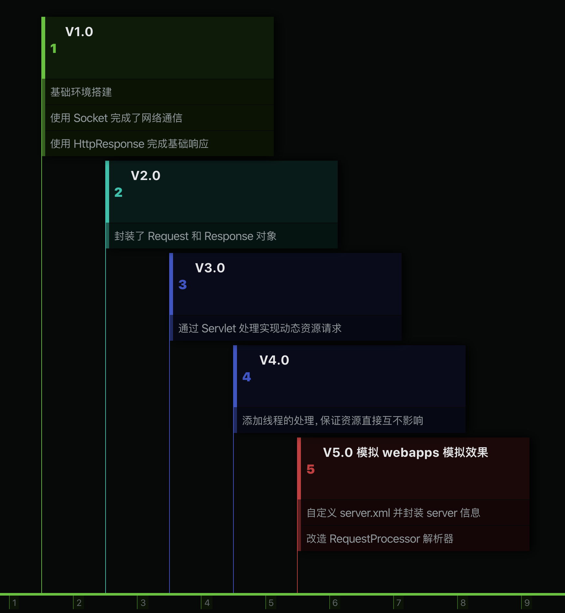

 
<!--BEGIN_DATA
{
    "create_date": "2021-01-14 18:50", 
    "modify_date": "2021-01-14 18:50", 
    "is_top": "0", 
    "summary": "手写迷你版Tomcat-Minicat", 
    "tags": "Java、网络", 
    "file_name": "手写迷你版Tomcat-Minicat.md"
}
END_DATA-->

#### <p>原文出处：<a href='https://notes.suremotoo.site/archives/handwriting-minicat' target='blank'>手写迷你版 Tomcat - Minicat</a></p>

### Minicat 的目标

我们可以通过浏览器客户端发送 http 请求， Minicat 可以接收到请求进⾏处理，处理之后的结果可以返回浏览器客户端。

#### 基本方向

  * 提供服务，接收请求（Socket 通信）
  * 请求信息封装成 Request 对象，同样响应信息封装成 Response 对象
  * 客户端请求资源，资源分为静态资源（HTML）和动态资源（Servlet）
  * 资源返回给客户端浏览器

#### 迭代实现

我们实现时候呢，一步一步来，可以制定的小版本计划

  * V1.0 需求：浏览器请求 <http://localhost:8080>, 返回⼀个固定的字符串到⻚⾯"Hello Minicat."
  * V2.0 需求：封装 Request 和 Response 对象，返回 HTML 静态资源⽂件
  * V3.0 需求：可以请求动态资源（Servlet）
  * V4.0 需求：可以多线程访问
  * V5.0 需求：在已有 Minicat 基础上进⼀步扩展，模拟出 webapps 部署效果,磁盘上放置⼀个 webapps ⽬录，webapps 中可以有多个项⽬，⽐如 demo1,demo2,demo3… 具体的项⽬⽐如 demo1 中有 serlvet（也即为：servlet 是属于具体某⼀个项⽬的 servlet），这样的话在 Minicat 初始化配置加载，以及根据请求 url 查找对应 serlvet 时都需要进⼀步处理。

### V1.0 版本

#### 环境搭建

确定好方向，就进行项目搭建开发

新建一个 Maven 项目，并调整在 `pom.xml`

```xml    
<groupId>site.suremotoo</groupId>
<artifactId>Minicat</artifactId>
<version>1.0-SNAPSHOT</version>
<build>
    <plugins>
        <plugin>
            <groupId>org.apache.maven.plugins</groupId>
            <artifactId>maven-compiler-plugin</artifactId>
            <version>3.1</version>
            <configuration>
                <source>11</source>
                <target>11</target>
                <encoding>utf-8</encoding>
            </configuration>
        </plugin>
    </plugins>
</build>
```    

编写启动类 `Bootstrap`

```java
public class Bootstrap {
    /**
    * 设定启动和监听端口
    */
    private int port = 8080;
    /**
    * 启动函数
    *
    * @throws IOException
    */
    public void start() throws IOException {
        System.out.println("Minicat starting...");
        String responseData = "Hello Minicat.";
        ServerSocket socket = new ServerSocket(port);
        while (true) {
            Socket accept = socket.accept();
            OutputStream outputStream = accept.getOutputStream();
            String responseText = HttpProtocolUtil.getHttpHeader200(responseData.length()) + responseData;
            outputStream.write(responseText.getBytes());
            accept.close();
        }
    }
    /**
    * 启动入口
    *
    * @param args
    */
    public static void main(String[] args) throws IOException {
        Bootstrap bootstrap = new Bootstrap();
        bootstrap.start();
    }
}
```   

HTTP 协议辅助类 `HttpProtocolUtil`

```java
public class HttpProtocolUtil {
    /**
        * 200 状态码，头信息
        *
        * @param contentLength 响应信息长度
        * @return 200 header info
        */
    public static String getHttpHeader200(long contentLength) {
        return "HTTP/1.1 200 OK \n" + "Content-Type: text/html \n"
                + "Content-Length: " + contentLength + " \n" + "\r\n";
    }
    /**
        * 为响应码 404 提供请求头信息(此处也包含了数据内容)
        *
        * @return 404 header info
        */
    public static String getHttpHeader404() {
        String str404 = "<h1>404 not found</h1>";
        return "HTTP/1.1 404 NOT Found \n" + "Content-Type: text/html \n"
                + "Content-Length: " + str404.getBytes().length + " \n" + "\r\n" + str404;
    }
}
```   

然后我们访问浏览器：<http://localhost:8080，页面显示> **Hello Minicat.**,就说明成功啦。

这就完成 V1.0 版本了 🎉

### V2.0 版本

紧接着我们实现请求信息、响应信息的封装，即：`Request`、`Response` 的实现

```java
public class Request {
    /**
    * 请求方式, eg: GET、POST
    */
    private String method;
    /**
    * 请求路径,eg: /index.html
    */
    private String url;
    /**
    * 请求信息输入流 <br>
    * 示例
    * <pre>
    *  GET / HTTP/1.1
    *  Host: www.baidu.com
    *  Connection: keep-alive
    *  Pragma: no-cache
    *  Cache-Control: no-cache
    *  Upgrade-Insecure-Requests: 1
    *  User-Agent: Mozilla/5.0 (Macintosh; Intel Mac OS X 10_15_6) AppleWebKit/537.36 (KHTML, like Gecko) Chrome/85.0.4183.83 Safari/537.36
    * </pre>
    */
    private InputStream inputStream;
    public Request() {
    }
    public Request(InputStream inputStream) throws IOException {
        this.inputStream = inputStream;
        int count = 0;
        while (count == 0) {
            count = inputStream.available();
        }
        byte[] bytes = new byte[count];
        inputStream.read(bytes);
        // requestString 参考：this.inputStream 示例
        String requestString = new String(bytes);
        // 按换行分隔
        String[] requestStringArray = requestString.split("\\n");
        // 读取第一行数据,即： GET / HTTP/1.1
        String firstLine = requestStringArray[0];
        // 把厉第一行数据按空格分隔
        String[] firstLineArray = firstLine.split(" ");
        this.method = firstLineArray[0];
        this.url = firstLineArray[1];
    }
}
```   

Response

```java 
public class Response {
    /**
        * 响应信息
        */
    private OutputStream outputStream;
    public Response() {
    }
    public Response(OutputStream outputStream) {
        this.outputStream = outputStream;
    }
    public void output(String content) throws IOException {
        outputStream.write(content.getBytes());
    }
    /**
        * 根据 url 拼接绝对路径，根据绝对路径再读取文件资源，再响应
        *
        * @param url 请求 url
        */
    public void outputHtml(String url) throws IOException {
        // 获取 url 资源的全路径
        String absoluteResourcePath = StaticResourceUtil.getAbsolutePath(url);
        File file = new File(absoluteResourcePath);
        if (file.exists() && file.isFile()) {
            // 输出静态资源
            StaticResourceUtil.outputStaticResource(new FileInputStream(file), outputStream);
        } else {
            output(HttpProtocolUtil.getHttpHeader404());
        }
    }
}
```   

我们也提取了一些共用类和函数，`StaticResourceUtil`

```java 
public class StaticResourceUtil {
    /**
        * 根据请求 url 获取完整绝对路径
        *
        * @param url 请求 url
        * @return 完整绝对路径
        */
    public static String getAbsolutePath(String url) {
        String path = StaticResourceUtil.class.getResource("/").getPath();
        return path.replaceAll("\\\\", "/") + url;
    }
    /**
        * 输出静态资源信息
        *
        * @param inputStream  静态资源文件的读取流
        * @param outputStream 响应的输出流
        * @throws IOException
        */
    public static void outputStaticResource(InputStream inputStream, OutputStream outputStream) throws IOException {
        int count = 0;
        while (count == 0) {
            count = inputStream.available();
        }
        // 输出 http 请求头,然后再输出具体内容
        int resourceSize = count;
        // 读取内容输出
        outputStream.write(HttpProtocolUtil.getHttpHeader200(resourceSize).getBytes());
        // 已经读取的内容⻓度
        long written = 0;
        // 计划每次缓冲的⻓度
        int byteSize = 1024;
        byte[] bytes = new byte[byteSize];
        while (written < resourceSize) {
            // 说明剩余未读取⼤⼩不⾜⼀个 1024 ⻓度，那就按真实⻓度处理
            if (written + byteSize > resourceSize) {
                // 计算实际剩余内容
                byteSize = (int) (resourceSize - written);
                bytes = new byte[byteSize];
            }
            inputStream.read(bytes);
            outputStream.write(bytes);
            outputStream.flush();
            // 计算已经读取的长度
            written += byteSize;
        }
    }
}
```   

最后调整一下`Bootstrap`中的`start()`函数

```java 
public void start() throws IOException {
    System.out.println("Minicat starting...");
    ServerSocket socket = new ServerSocket(port);
    while (true) {
        Socket accept = socket.accept();
        OutputStream outputStream = accept.getOutputStream();
        // 分别封装 Request 和 Response
        Request request = new Request(accept.getInputStream());
        Response response = new Response(outputStream);
        // 根据 request 中的 url，输出
        response.outputHtml(request.getUrl());
        accept.close();
    }
}
```

哦对了，还缺少 1 个具体的 HTML 静态资源⽂件，我们创建一个名为 `index.html` 的吧

```java 
<!DOCTYPE html>
<html lang="en">
<head>
    <meta charset="UTF-8">
    <title>Hello Minicat</title>
</head>
<body>
    <h1>Hello Minicat,  index.html</h1>
</body>
</html>
```

然后我们访问浏览器：<http://localhost:8080/index.html，页面显示> **Hello Minicat, index.html**,就说明成功啦。

这就完成 V2.0 版本了 🎉🎉

### V3.0 版本

接下来就来实现请求动态资源

我们先定义 `Servlet` 的接口，指定规范

```java
public interface Servlet {
    void init() throws Exception;
    void destroy() throws Exception;
    void service(Request request, Response response) throws Exception;
}
```

紧接着再完成 1 个公共的抽象父类 `HttpServlet`

```java 
public abstract class HttpServlet implements Servlet {
    public abstract void doGet(Request request, Response response) throws Exception;
    public abstract void doPost(Request request, Response response) throws Exception;
    @Override
    public void service(Request request, Response response) throws Exception {
        String method = request.getMethod();
        if ("GET".equalsIgnoreCase(method)) {
            doGet(request, response);
        } else {
            doPost(request, response);
        }
    }
}
```

实际的 `doGet`、`doPost` 由实际配置的业务 `Servlet` 来实现，那么我们就创建 1 个实际业务： `ShowServlet`

```java 
public class ShowServlet extends HttpServlet {
    @Override
    public void doGet(Request request, Response response) throws Exception {
        String repText = "<h1>ShowServlet by GET</h1>";
        response.output(HttpProtocolUtil.getHttpHeader200(repText.length()) + repText);
    }
    @Override
    public void doPost(Request request, Response response) throws Exception {
        String repText = "<h1>ShowServlet by POST</h1>";
        response.output(HttpProtocolUtil.getHttpHeader200(repText.length()) + repText);
    }
    @Override
    public void init() throws Exception {}
    @Override
    public void destroy() throws Exception {}
}
```

我们再在项目 `resources` 文件夹中创建 `web.xml`，并配置我们的业务 Servlet: `ShowServlet` 的名称和访问路径

```java 
<?xml version="1.0" encoding="utf-8"?>
<web-app>
    <servlet>
        <servlet-name>show</servlet-name>
        <servlet-class>server.ShowServlet</servlet-class>
    </servlet>
    <servlet-mapping>
        <servlet-name>show</servlet-name>
        <url-pattern>/show</url-pattern>
    </servlet-mapping>
</web-app>
```

既然配置了 `web.xml`，那我们还需要再对其进行解析和处理

解析 XML，我们在 `pom.xml` 里引入相关坐标依赖

```java 
<dependencies>
    <dependency>
        <groupId>dom4j</groupId>
        <artifactId>dom4j</artifactId>
        <version>1.6.1</version>
    </dependency>
    <dependency>
        <groupId>jaxen</groupId>
        <artifactId>jaxen</artifactId>
        <version>1.1.6</version>
    </dependency>
</dependencies>
```

我们把处理逻辑写在 `Bootstrap` 启动类中

```java 
/**
    * 存放 Servlet信息，url: Servlet 实例
    */
private Map<String, HttpServlet> servletMap = new HashMap<>();
/**
    * 加载配置的 Servlet
    *
    * @throws Exception
    */
public void loadServlet() throws Exception {
    InputStream resourceAsStream = this.getClass().getClassLoader().getResourceAsStream("web.xml");
    SAXReader saxReader = new SAXReader();
    Document document = saxReader.read(resourceAsStream);
    Element rootElement = document.getRootElement();
    List<Element> list = rootElement.selectNodes("//servlet");
    for (Element element : list) {
        // <servlet-name>show</servlet-name>
        Element servletnameElement = (Element) element.selectSingleNode("servlet-name");
        String servletName = servletnameElement.getStringValue();
        // <servlet-class>server.ShowServlet</servlet-class>
        Element servletclassElement = (Element) element.selectSingleNode("servlet-class");
        String servletClass = servletclassElement.getStringValue();
        // 根据 servlet-name 的值找到 url-pattern
        Element servletMapping = (Element) rootElement.selectSingleNode("/web-app/servlet-mapping[servlet-name='" + servletName + "']");
        // /show
        String urlPattern = servletMapping.selectSingleNode("url-pattern").getStringValue();
        servletMap.put(urlPattern, (HttpServlet) Class.forName(servletClass).getDeclaredConstructor().newInstance());
    }
}
```

再调整 `start` 方法，在方法里执行 `loadServlet` 函数来初始化 Servlet

```java 
public void start() throws Exception {
        System.out.println("Minicat starting...");
            // 此处加载并初始化 Servlet
        loadServlet();
        ServerSocket socket = new ServerSocket(port);
        while (true) {
            Socket accept = socket.accept();
            OutputStream outputStream = accept.getOutputStream();
            // 分别封装 Request 和 Response
            Request request = new Request(accept.getInputStream());
            Response response = new Response(outputStream);
            // 根据 url 来获取 Servlet
            HttpServlet httpServlet = servletMap.get(request.getUrl());
            // 如果 Servlet 为空，说明是静态资源，不为空即为动态资源，需要执行 Servlet 里的方法
            if (httpServlet == null) {
                response.outputHtml(request.getUrl());
            } else {
                httpServlet.service(request, response);
            }
            accept.close();
        }
    }
```

然后我们访问浏览器: <http://localhost:8080/index.html，页面显示> **Hello Minicat, index.html**,就说明**静态资源**访问成功啦。

我们再访问: <http://localhost:8080/show>, 页面显示 **ShowServlet by GET**,就说明**动态资源**也访问成功啦。

这就完成 V3.0 版本了 🎉🎉🎉

### V4.0 版本

完成 V3.0 之后，3.0 还是有点问题的，比如在多线程访问情况下

我们假设业务 `ShowServlet` 里，动态资源处理延迟，这里使用 `Thread.sleep` 模拟延迟的情况

```java
@Override
public void doGet(Request request, Response response) throws Exception {
    // 模拟延迟
    Thread.sleep(100000);
    String repText = "<h1>ShowServlet by GET</h1>";
    response.output(HttpProtocolUtil.getHttpHeader200(repText.length()) + repText);
}
```

然后再重新启动，先访问:http://localhost:8080/show，会发现一直在加载处理，此时再去访问<http://localhost:8080/index.html，也会一直在加载处理。>

意思就是我们访问动态资源时候的一直等待，此时，再去访问静态资源的时候，也会一直等待，这样就不行了。

这里就可以使用线程来解决，每个请求过来的 `Socket` 都分配 1 个线程，各自处理各自的请求

所以再在 `Bootstrap` 中的 `start` 方法做个改造

```java
public void start() throws Exception {
    System.out.println("Minicat starting...");
    loadServlet();
    ServerSocket socket = new ServerSocket(port);
    while (true) {
        Socket accept = socket.accept();
        // 多线程改造，每个 socket 是个单独的线程
        RequestProcessor requestProcessor = new RequestProcessor(accept, servletMap);
        requestProcessor.start();
    }
}
```

`RequestProcessor` 就集成 `Thread` ，重写 `run` 函数，实现具体的输入输出的处理

```java 
public class RequestProcessor extends Thread {
    private Socket socket;
    private Map<String, HttpServlet> servletMap;
    public RequestProcessor() {
    }
    public RequestProcessor(Socket socket, Map<String, HttpServlet> servletMap) {
        this.socket = socket;
        this.servletMap = servletMap;
    }
    @Override
    public void run() {
        try {
            OutputStream outputStream = socket.getOutputStream();
            // 分别封装 Request 和 Response
            Request request = new Request(socket.getInputStream());
            Response response = new Response(outputStream);
            HttpServlet httpServlet = servletMap.get(request.getUrl());
            if (httpServlet == null) {
                response.outputHtml(request.getUrl());
            } else {
                httpServlet.service(request, response);
            }
            socket.close();
        } catch (Exception e) {
            e.printStackTrace();
        }
    }
}
```

每个都分配个线程，有点消耗资源，所以我们再升级下，使用**线程池**，所以再对 `start` 函数进行一次简单的调整

```java 
public void start() throws Exception {
    System.out.println("Minicat starting...");
    loadServlet();
    // 定义一个线程池
    int corePoolSize = 10;
    int maximumPoolSize =50;
    long keepAliveTime = 100L;
    TimeUnit unit = TimeUnit.SECONDS;
    BlockingQueue<Runnable> workQueue = new ArrayBlockingQueue<>(50);
    ThreadFactory threadFactory = Executors.defaultThreadFactory();
    RejectedExecutionHandler handler = new ThreadPoolExecutor.AbortPolicy();
    ThreadPoolExecutor threadPoolExecutor = new ThreadPoolExecutor(
            corePoolSize,
            maximumPoolSize,
            keepAliveTime,
            unit,
            workQueue,
            threadFactory,
            handler
    );
    ServerSocket socket = new ServerSocket(port);
    while (true) {
        Socket accept = socket.accept();
        // 多线程改造，每个 socket 是个单独的线程
        RequestProcessor requestProcessor = new RequestProcessor(accept, servletMap);
            // 线程池执行
        threadPoolExecutor.execute(requestProcessor);
    }
}
```

这就完成 V4.0 版本了 🎉🎉🎉🎉

### V5.0 版本

开始之前，我们先捋一下之前实现 `Minicat` 的步骤，来看个图


5.0 版本来了，我们要模拟出 webapps 部署效果，这个功能说简单点了，就是**把一个指定的文件夹 webapps 下面的所有的 `Servlet` 给读取出来并加载，然后在请求的时候去解析对应的 servlet** 就行了。

那么我们就 `resources` 里写个配置文件：`server.xml` 来配置指定的文件夹路径信息，为了模仿实际的 Tomcat，我们再加几个标签

```java
<Server>
    <Service name="Mojave">
        <Connector port="8080"/>
        <Engine defaultHost="localhost">
            <!-- appBase 就是指定的文件夹 -->
            <Host name="localhost" appBase="/Users/suremotoo/Documents/webapps"/>
        </Engine>
    </Service>
</Server>
```

而业务 Servlet 呢，肯定要在单独的项目中写了，Minicat 是要部署加载它们的，后面再说。

根据面向对象的思想，我们在编写一些 POJO 类

**`Context`** 就是在指定的 webapps 目录中的，每个项目，**每个项目里有自己的 Servlet 集合**
    
```java 
public class Context {
    public Context() {
    }
    public Context(Map<String, HttpServlet> servletMap) {
        this.servletMap = servletMap;
    }
    // Context 中的 Servlet
    private Map<String, HttpServlet> servletMap;
    public Map<String, HttpServlet> getServletMap() {
        return servletMap;
    }
    public void setServletMap(Map<String, HttpServlet> servletMap) {
        this.servletMap = servletMap;
    }
}
```

**`Host`** 作为配置中的主机信息，**每个主机下面有自己的 Context 项目集合**

```java 
public class Host {
    public Host() {
    }
    public Host(Map<String, Context> contextMap) {
        this.contextMap = contextMap;
    }
    // hHst 中的 Context
    private Map<String, Context> contextMap;
    public Map<String, Context> getContextMap() {
        return contextMap;
    }
    public void setContextMap(Map<String, Context> contextMap) {
        this.contextMap = contextMap;
    }
}
```    

**`Mapper`** 其实指的是 Service,**每个 Service 下面有自己的 Host 主机集合**
    
```java 
public class Mapper {
    // Service 中的 Host
    private Map<String, Host> hostMap;
    public Mapper(Map<String, Host> hostMap) {
        this.hostMap = hostMap;
    }
    public Map<String, Host> getHostMap() {
        return hostMap;
    }
    public void setHostMap(Map<String, Host> hostMap) {
        this.hostMap = hostMap;
    }
}
```

**`Server`** 指 Minicat 服务实例, 1 个 Minicat 就 1 个 Server,**每个 Server 下面有自己的 Mapper 集合**
    
```java 
public class Server {
    // Server 里的 Service
    private Map<String, Mapper> serviceMap;
    public Server() {
    }
    public Server(Map<String, Mapper> serviceMap) {
        this.serviceMap = serviceMap;
    }
    public Map<String, Mapper> getServiceMap() {
        return serviceMap;
    }
    public void setServiceMap(Map<String, Mapper> serviceMap) {
        this.serviceMap = serviceMap;
    }
}
```

POJO 类完成后，就开始改造程序入口 `Bootstrap` 了，要加载指定目录下的文件，所以我们要改造 `loadServlet`

```java 
/**
    * 加载实际项目里配置的 Servlet
    *
    * @throws Exception
    */
@SuppressWarnings({"unchecked"})
public Context loadContextServlet(String path) throws Exception {
    String webPath = path + "/web.xml";
    if (!(new File(webPath).exists())) {
        System.out.println("not found " + webPath);
        return null;
    }
    InputStream resourceAsStream = new FileInputStream(webPath);
    SAXReader saxReader = new SAXReader();
    Document document = saxReader.read(resourceAsStream);
    Element rootElement = document.getRootElement();
    List<Element> list = rootElement.selectNodes("//servlet");
    Map<String, HttpServlet> servletMap = new HashMap<>(16);
    for (Element element : list) {
        // <servlet-name>show</servlet-name>
        Element servletnameElement = (Element) element.selectSingleNode("servlet-name");
        String servletName = servletnameElement.getStringValue();
        // <servlet-class>server.ShowServlet</servlet-class>
        Element servletclassElement = (Element) element.selectSingleNode("servlet-class");
        String servletClass = servletclassElement.getStringValue();
        // 根据 servlet-name 的值找到 url-pattern
        Element servletMapping = (Element) rootElement.selectSingleNode("/web-app/servlet-mapping[servlet-name='" + servletName + "']");
        // /show
        String urlPattern = servletMapping.selectSingleNode("url-pattern").getStringValue();
        // 自定义类加载器，来加载 webapps 目录下的 class
        WebClassLoader webClassLoader = new WebClassLoader();
        Class<?> aClass = webClassLoader.findClass(path, servletClass);
        servletMap.put(urlPattern, (HttpServlet) aClass.getDeclaredConstructor().newInstance());
    }
    return new Context(servletMap);
}
/**
    * 加载 server.xml，解析并初始化 webapps 下面的各个项目的 servlet
    */
@SuppressWarnings({"unchecked"})
public void loadServlet() {
    InputStream resourceAsStream = this.getClass().getClassLoader().getResourceAsStream("server.xml");
    SAXReader saxReader = new SAXReader();
    try {
        Document document = saxReader.read(resourceAsStream);
        Element rootElement = document.getRootElement();
        // 解析 server 标签
        Element serverElement = (Element) rootElement.selectSingleNode("//Server");
        // 解析 server 下的 Service 标签
        List<Element> serviceNodes = serverElement.selectNodes("//Service");
        // 存储各个 Host
        Map<String, Host> hostMap = new HashMap<>(8);
        //遍历 service
        for (Element service : serviceNodes) {
            String serviceName = service.attributeValue("name");
            Element engineNode = (Element) service.selectSingleNode("//Engine");
            List<Element> hostNodes = engineNode.selectNodes("//Host");
            // 存储有多少个项目
            Map<String, Context> contextMap = new HashMap<>(8);
            for (Element hostNo : hostNodes) {
                String hostName = hostNo.attributeValue("name");
                String appBase = hostNo.attributeValue("appBase");
                File file = new File(appBase);
                if (!file.exists() || file.list() == null) {
                    break;
                }
                String[] list = file.list();
                //遍历子文件夹，即：实际的项目列表
                for (String path : list) {
                    //将项目封装成 context，并保存入map
                    contextMap.put(path, loadContextServlet(appBase + "/" + path));
                }
                // hsot:port
                // eg: localhost:8080
                hostMap.put(hostName + ":" + port, new Host(contextMap));
            }
            serviceMap.put(serviceName, new Mapper(hostMap));
        }
    } catch (Exception e) {
        e.printStackTrace();
    }
}
```

代码有点长，稍微说明下理解起来还是比较简单的：

先解析 `server.xml` ，然后根据配置的指定文件夹目录去解析，目录下面的每个文件夹就是一个 `Context`；

而 Context 里的 servlet 信息，都会配置在 Context 自己的 `web.xml` 中；

所以再解析每个 Context 里自己的 web.xml，封装所有的 Servlet

当然了，`Context`、`Host`、`Mapper`、`Server` 也都会一并封装

封装所有的 Servlet 的时候，需要自己去写个类加载器去实例化，所以加了个自定义的类加载器

```java 
public class WebClassLoader extends ClassLoader {
    @Override
    protected Class<?> findClass(String basePath, String className) {
        byte[] classBytes = getClassBytes(basePath, className);
        return defineClass(className, classBytes, 0, classBytes.length);
    }
    /**
        * 读取类的字节码
        *
        * @param basePath  根路径
        * @param className 类的全限定名
        * @return servlet 的字节码信息
        * @throws IOException
        */
    private byte[] getClassBytes(String basePath, String className) {
        InputStream in = null;
        ByteArrayOutputStream out = null;
        String path = basePath + File.separatorChar +
                className.replace('.', File.separatorChar) + ".class";
        try {
            in = new FileInputStream(path);
            out = new ByteArrayOutputStream();
            byte[] buffer = new byte[2048];
            int len = 0;
            while ((len = in.read(buffer)) != -1) {
                out.write(buffer, 0, len);
            }
            return out.toByteArray();
        } catch (Exception e) {
            e.printStackTrace();
        } finally {
            try {
                in.close();
                out.close();
            } catch (IOException e) {
                e.printStackTrace();
            }
        }
        return null;
    }
}
```

基础的工作都做好了，就差解析了，我们要改造 `RequestProcessor`

```java 
public class RequestProcessor extends Thread {
    private Socket socket;
    private Server server;
    public RequestProcessor() {
    }
    public RequestProcessor(Socket socket, Server server) {
        this.socket = socket;
        this.server = server;
    }
    @Override
    public void run() {
        try {
            OutputStream outputStream = socket.getOutputStream();
            // 分别封装 Request 和 Response
            Request request = new Request(socket.getInputStream());
            Response response = new Response(outputStream);
            HttpServlet httpServlet = findHttpServlet(request);
            if (httpServlet == null) {
                response.outputHtml(request.getUrl());
            } else {
                httpServlet.service(request, response);
            }
            socket.close();
        } catch (Exception e) {
            e.printStackTrace();
        }
    }
    /**
        * 根据请求信息找到对应业务 Servlet
        * <pre>
        *  GET web-greet/greet HTTP/1.1
        *  Host: suremotoo.com
        * </pre>
        *
        * @param request
        * @return 具体要执行的 servlet
        */
    private HttpServlet findHttpServlet(Request request) {
        HttpServlet businessServlet = null;
        Map<String, Mapper> serviceMap = server.getServiceMap();
        for (String key : serviceMap.keySet()) {
            String hostName = request.getHost();
            Map<String, Host> hostMap = serviceMap.get(key).getHostMap();
            Host host = hostMap.get(hostName);
            if (host != null) {
                Map<String, Context> contextMap = host.getContextMap();
                // 处理 url
                // eg: web-greet/greet
                String url = request.getUrl();
                String[] urlPattern = url.split("/");
                String contextName = urlPattern[1];
                String servletStr = "/";
                if (urlPattern.length > 2) {
                    servletStr += urlPattern[2];
                }
                // 获取上下文
                Context context = contextMap.get(contextName);
                if (context != null) {
                    Map<String, HttpServlet> servletMap = context.getServletMap();
                    businessServlet = servletMap.get(servletStr);
                }
            }
        }
        return businessServlet;
    }
}
```   

核心就是 `findHttpServlet` 方法，从 `Server、Mapper、Host、Context` 依次取出，直到最后的 Servlet 配置集合，

根据 url 找到对应的 Servlet 执行

至于我们的测试项目，用于部署到 webapps 目录嘛，我这里就简单说一下就行

**先把 Minicat 打个 jar 包，给测试项目用！**

参考 Minicat 的目录，可以建立 `maven` 项目，编写自定义的业务 Servlet ，然后在 `resources` 文件夹中，建立 `web.xml` 文件，用于配置自定义的 Servlet

📣📣 注意啦：**而自定义的 Servlet 一定要 `extends` Minicat 中的 `HttpServet`！！**

至此就 V5.0 就大功告成 🎉🎉🎉🎉🎉

### 各版本实现回顾



### 附-精美 PDF 版本

[😘😘 精美 PDF 版本 👈](https://notes.suremotoo.site/upload/2020/09/%E6%89%8B%E5%86%99%E8%BF%B7%E4%BD%A0%E7%89%88-Tomcat-Minicat-57c69b34b2b94b668f62a4fee139c1ae.pdf)
