 
<!--BEGIN_DATA
{
    "create_date": "2019-12-17 15:30", 
    "modify_date": "2019-12-17 15:30", 
    "is_top": "0", 
    "summary": "拥塞控制算法分类", 
    "tags": "网络、C/C++、WebRTC、系统", 
    "file_name": "拥塞控制算法分类.md"
}
END_DATA-->

####<p>原文出处：<a href='https://blog.csdn.net/BertDai/article/details/77571418' target='blank'>拥塞控制算法分类</a></p>

这几天写了一份项目书，正好对之前看过的拥塞控制算法进行了一次整理，主要是从算法机制分析优缺点。

我把现有的拥塞控制技术分成了五大类：传统的基于丢包或基于延迟方法，这两个类别是通用的分类，那些比较远古的算法基本上就可以这么二分；基于链路容量预测，基于延迟目标和基于学习或探测的这三类，主要包含了近几年的一些算法，其中延迟目标方法和传统的基于延迟的方法有些类似，但是也有本身的特点，我就单列了。每个类别举了几个典型的算法：

  * 传统的基于丢包的方法：主要以TCP Reno [1]和TCP Cubic [2]为代表。它们将丢包视为拥塞信号，遇到丢包时将发送窗口减半来规避拥塞。但是在没有丢包时会不断填充缓冲区，使缓冲区长期保持过满状态，造成了过大的排队延迟，同时，在链路丢包的网络环境中，带宽利用率也很差。
  * 传统的基于延迟的方法：包括了TCP Vegas [3]，Fast TCP [4]和TCP Nice [5]等，它们使用了延迟作为拥塞信号，包括单向延迟、排队延迟和往返延迟等，虽然在测量过程中会有噪声干扰，但延迟可以粗略的表示网络中数据包的数量。这种机制可以保证它们在限制延迟上有不错的性能表现，但是在与基于丢包的数据流共享瓶颈带宽时，会因为缺乏竞争力而导致带宽分配的不公平 [6]。此外，如果网络中已经存在数据流或者已经拥塞，新加入的数据流会检测到比真实值更小的排队延迟，进而夺取更多的带宽分配，这也是所谓的“后来者效应”。
  * 基于链路容量预测的方法：以Sprout [7]为代表。它是一个专门为无线网络设计的拥塞控制算法，并没有采取传统算法那样以丢包或延迟为拥塞信号，而是通过收端观察到数据包到达的时间间隔，再使用概率论来推测瓶颈链路的容量，发端的发送速率直接采用这个预测值。但在网络环境变动较大时，Sprout对瓶颈链路带宽的预测会产生较大误差，进而导致算法性能大幅下降。
  * 基于延迟目标的方法：包含了Ledbat [8]、BBR和WebRTC中的GCC [9]算法。这些算法都设定了一个低延迟目标，并且希望可以收敛于该目标值。但是GCC和Ledbat都无法做到良好的公平性，因为它们无法获知网络中数据流的数量，也就无法设定一个公平的窗口大小。在BBR [10]中，借助传播延迟的测量，通过周期性的重置所有的数据流到初始状态，可以做到数据流之间公平的共享瓶颈带宽，但是这种周期性初始化的机制会造成传输速率的抖动。
  * 基于学习和探测的方法：包含了Remy [11]，Verus [12]和PCC [13]。它们与传统的拥塞控制算法不同，没有设置特定的拥塞信号，而是借助评价函数，使用学习或探测的方法去形成一个更优的控制策略。但是Remy和Verus的控制策略均依赖于训练数据形成，当真实网络情况有所差异时，性能表现会大幅下降。PCC使用的探测方法使其面对网络环境的变动应对迟缓，并且它仍然考虑了丢包因素，造成与传统TCP相似的带宽利用率问题。

上述提到的算法在参考文献里一一对应。我也整理了一个表格，粗略介绍了算法在带宽，时延和intra-fairness上的特性：  

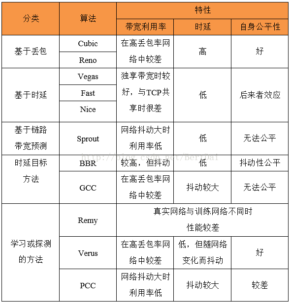

如果有大牛看到这篇文章，有什么不同见解可以交流一下，或者发现文中有什么错误，欢迎指正~~  

参考文献：  

[1] V.Jacobson, “Congestion avoidance and control,” in ACM SIGCOMM ComputerCommunication Review, vol. 18. ACM, 1988, pp. 314–329.

[2] L. X. I. R. Sangtae Ha. Cubic: A new TCP -friendlyhigh-speed TCP variant. In SIGOPS-OSR, July 2008. ACM, 2008.

[3] S.O. L. Brakmo and L. Peterson. TCP Vegas: New techniques for congestiondetection and avoidance. In SIGCOMM, 1994. Proceedings. 1994 InternationalConference on. ACM, 1994.

[4] S. H. L. D. X. Wei, C. Jin and S. Hegde. Fast TCP:motivation, architecture, algorithms, performance. IEEE/ACM Transactions onNetworking(TON), 12(4):458{472, 2006.

[5] A. Venkataramani, R. Kokku, and M. Dahlin. TCPNice: a mechanism for background transfers. SIGOPS Oper. Syst. Rev., 36(SI):329–343,Dec. 2002.

[6] L.A. Grieco and S. Mascolo, “Performance evaluation and comparison of Westwood+,new Reno, and Vegas TCP congestion control,” Computer Communication Review,vol. 34, no. 2, pp. 25–38, 2004.

[7] K.Winstein, A. Sivaraman, and H. Balakrishnan. Stochastic forecasts achieve high throughputand low delay over cellular networks. In Proceedings of the 10th USENIXconference on Networked Systems Design and Implementation, 2013.

[8] S.V. D. Rossi, C. Testa and L. Muscariello. Ledbat: the newbittorrent congestioncontrol protocol. In Proceedings of ICCCN, 2010. IEEE, 2010.

[9] L.D. Cicco, G. Carlucci, and S. Mascolo, “Experimental investigation of thegoogle congestion control for real-time flows,” 2013.

[10] C.S. G. S. H. Y. Neal Cardwell, Yuchung Cheng and V. Jacobson. BBR:congestion-based congestion control. ACM Queue, 14(5):20{53, 2016.

[11] K.Winstein and H. Balakrishnan. TCP Ex Machina: Computer-generated Congestion Control.In Proceedings of the ACM SIGCOMM 2013 Conference, 2013.

[12] ZakiY, Potsch T, Chen J, et al. Adaptive Congestion Control for UnpredictableCellular Networks[J]. ACM special interest group on data communication, 2015,45(4): 509-522.

[13] M.Dong, Q. Li, D. Zarchy, B. Godfrey, and M. Schapira. PCC: Re-architectingcongestion control for consistent high performance. 12th USENIXSymposium on Networked Systems Design and Implementation (NSDI), 2015.  


<hr>


####<p>原文出处：<a href='' target='blank'>拥塞控制算法（网络层）</a></p>

* 网络中存在太多的数据包导致数据包被延迟和丢失，从而降低了传输性能，这种情况称为拥塞。网络层和传输层的共同承载着处理拥塞的责任。由于拥塞发生在网络内部，正是网络层直接经历拥塞，而且必须由它最终确定如何处理过载的数据包。然而，控制拥塞的最好方法是减少传输层注入网络的负载。这就需要网络层和传输层协同工作。本章将着眼于拥塞控制在网络层方面的处理；下一章讲解在传输层的处理。
* 图中描绘了拥塞的发生。当主机发送到网络的数据包数量在其承载范围之内时，送达的数据包数与发送的数据包数成正比例增长。然而，随着负载接近承载能力，偶尔突发的流量填满了路由器内部的缓冲区，因而某些数据包会被丢失。这些丢失的数据包消耗了部分容量，因此，送达的数据包数量低于理想曲线，网络开始拥挤了。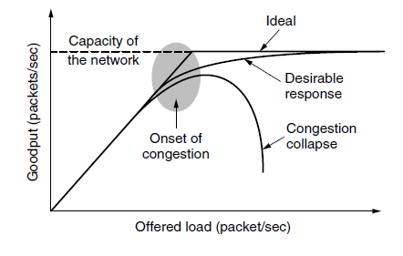
* 除非网络是精心设计的，否则极有可能会遭遇拥塞崩溃，表现为随着注入负载的增加到超出网络的容量，网络性能骤降。这种可能非常有可能发生，因为数据包在网络内部遭遇到了足够的延迟，使得它们离开网络后已经不再有用。例如，在早期Internet中有许多慢速的56kbps链路，那么通过这样的链路发送的数据包，包花在等待积压在前面数据包排空的的时间远远超过了允许其在网络中的最大生存期，因此不得不扔到。这种延迟很长的数据包会被认为已经丢失而需要重传，相同的数据包的副本将通过网络传送，再次浪费了网络的容量。为了捕捉这些因素，图中的y轴表示实际吞吐量，表示网络传递有用数据包的传送速率。
* 我们设想这样的网络：首先尽可能地避免产生拥挤，其次如果它们确实拥挤时不会遭遇拥塞崩溃。不幸的是，拥塞不可能完全避免。如果突然间，从三四条线路入境的的数据包流都需要转发到相同的输出线路，则会形成一个队列。如果没有足够的内存来容纳所有这些数据包，数据包将被丢弃。为路由器添加更多的内存可以缓解这一点，但Nagle认识到如果路由器拥有无限内存，拥堵情况会更加恶化，这是因为当数据包排到前面时，它们早就超时了并且它们的副本也可能在队列中，最终导致拥塞崩溃。
* 低带宽链路或者处理数据包速度比线路速率还低的路由器也会变得拥挤不堪。在这种情况下，把一些流量导出瓶颈区域指向网络的其他部分可以改善这种拥塞状况。然而，最终网络的所有区域都将出现拥塞，只能通过卸下负载或建立一个更快的网络。
* 值得指出的是拥塞控制和流量控制之间有很大差异。拥塞控制的任务是确保网络能够承载所有到达的流量，这是一个全局性的问题，涉及各方面的行为，包括所有的主机和路由器。流量控制只是与特定的发送方和特定的接收方的点到点流量有关，它的任务是确保一个快速的发送方不会持续地以超过接收方能力的速率传输数据。拥塞控制和流量控制之所以常常被混淆的原因在于处理上述两个问题的最好方法都是迫使主机慢下来。因此，一台主机接收到“慢速前行”的消息可能是来自不能处理负载的接收方，也可能是不能处理负载的网络。我们首先考查在不同的时间尺度可使用的一些方法，作为学习拥塞控制的开始；然后，我们将考查把预防拥塞放在首位的方法，其次学习一旦拥塞发生后的各种动态处理算法。

#####1、拥塞控制的途径

  * 拥塞的出现意味着负载（暂时）大于资源（在网络的一部分）可以处理的能力。很自然人们想到两个解决方案：增加资源或减少负载。如图，这些方案通常用在不同的时间尺度上，要么预先避免拥塞，要么拥塞之后立即做出反应。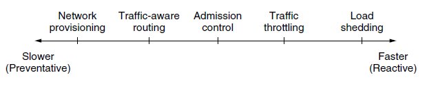
  * 避免拥塞的最基本方法是建立一个于流量匹配的良好的网络。如果存在一条低带宽的链路，大多数流量所走的路径都要经过这条链路，那么发生拥塞的可能性非常大。有时出现严重拥塞时，可以动态增加网络资源，例如把通常只用了备份的路由器或线路（使系统容错）打开，或者在公开市场上购买带宽。更多时候，经常大量使用的链路和路由器都尽早升级。这就是所谓的供给。
  * 为了充分利用现有的网络容量，根据每天的流量模式度身定制路由，因为不同时区的网络用户每天醒来和睡觉的时间是不同的。例如，通过改变最短路径的权重可更改数据包路由，以便使流量远离频繁使用的路径。一些本地广播电台有直升机围绕着城市上方飞来飞去报告道路拥塞状况，以便帮助他们的移动听众路由它们的数据包（汽车）绕开热点地区。这称为流量感知路由，把流量拆分到多个路径也是有效的。
  * 然而，有时候不可能增加容量。那么对抗拥塞的唯一方法就是降低负载，在一个虚电路网络中，如果新的连接将导致网络变得拥挤不堪，那么就应该拒接这种新连接的建立，这种控制称为准入控制。
  * 以更细一点的粒度，当拥塞已经迫在眉睫，网络可以给造成问题的数据包源端传递反馈信息，要求限制他们的流量。这种方法存在两个困难：第一，如何确定网络开始拥塞了；第二，如何通知源端减缓速度。为了解决第一个车问题，路由器可监测平均负荷、排队延迟或丢包情况。在所有情况下，数值上升表明拥挤情况越来越严重。为了解决第二个问题，路由器必须参与到源端的反馈循环中。为了正常工作，必须仔细调整时间尺度。如果每次连续到达两个数据包，路由器就叫喊STOP；而每当路由器空闲20微秒时，它就喊GO，那么系统将会剧烈地摇摆不定，无法收敛。另一方面，如果它等待30分钟才能确定说什么，则拥塞控制机制的反应过于迟缓，一点用途也没有。即使提供反馈并不是一件小事。需要额外关注的是，当网络早已被拥塞时路由器或许要发送更多的消息。
  * 最后，当一切都努力失败。网络不得不去丢弃它无法传递的数据包。这种方法的通用名称是负载脱落，一个选择丢弃哪些数据包的良好策略可以防止拥塞崩溃。

#####2、流量感知网络

  * 我们讨论过的路由方案采用固定链路权重，这些方案能使用拓扑结构的变化，但不能适应负载的变化。在计算路由时考虑链路负载的目的是把热点地区的流量转移出去，而热点地区是指网络中体验到拥塞的第一位置。最直接的方式是把链路权重设置成一个（固定）链路带宽、传输延迟、（可变）测量负载或平均排队延迟的函数。在所有其他条件都相同的情况下，最小权重的路径更青睐那些轻负载的路径。
  * 早期Internet使用的流量感知路由（Khama和Zinky）有一个危险，如图。图中的网络被分为东西两块，这两部分通过链路CF和链路EI相连。假设东西之间的大部分流量使用链路CF，因此这个链路负载超重因而延迟增大。如果把排队延迟加入到计算最短路径的权重中，那么链路EI将变得非常有吸引力。当新的路由表被安装好之后，大部分东西放的流量现在改走EI，由此增加了次链路的负载。因此在下一次路由更新时，CF将成为最短路径。结果，路由表可能会剧烈地摇摆不定，从而导致不稳定的路由和许多潜在的问题。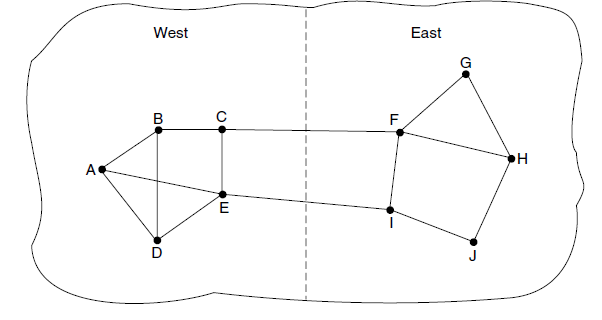
  * 如果忽略负载，只考虑带宽和传输延迟，这个问题就不会发生。尝试在路由权重中包括负载但将其限定在一个狭窄的范围内可减缓路由震荡。两种技术有助于获得成功的解决方案。首先是多路径路由，即从源端到目的地可以存在多条路径，在例子中，这意味着可以把整个流量分散到东西两条链路上。第二个技术是把流量慢慢迁移，足够慢到路由算法得到收敛。
  * 由于存在这些困难，Internet路由协议通常不依赖于负载来调整自己的路由。相反在路由协议外部通过慢慢改变它的输入来调整路由，这种方法就是所谓的流量工程。

#####3、准入控制

  * 一种广泛应用于虚电路网络，防止出现拥塞的技术是准入控制。其基本思想非常简单：除非网络可以携带额外的流量而不会变得拥塞，否则不再建立新的虚电路。因此，任何建立新的虚电路的尝试或许会失败。类似的，在电话系统中，当一台交换机实际超载时，它也会采用准入控制方法，不再送出拨号音。
  * 这种方法的诀窍是当一条新的虚电路将导致拥塞时如何工作。这项任务在电话网络中比较简单，因为电话呼叫所需的固定带宽（64kbps的无压缩音频）。然而计算机网络中的虚拟电路有各种形状和大小。因此，想要采用准入控制必须找出虚电路的一些流量特性。
  * 流量往往以其速度和形状来描述。如何以一种简单而有意义的方式来描述流量是困难的，因为流量呈现突发性。例如，浏览网页时的流量变化很大，比具有固定长期吞吐量的流式电影更难以处理，因为突发性的网页流量更容易堵塞主网络中的路由器。捕获这个效果的通常采用的描述符是漏桶或令牌桶。一个漏桶中有两个参数约束了平均速率和瞬时突发流量大小，由于漏桶被广泛应用于服务质量，我们将在下节描述。
  * 有了流量说明，网络就能确定是否接受新的虚拟电路。一种可能性是网络为它的每条虚电路保留其沿途的足够容量，这样就不会出现拥塞。在这种情况下，流量说明是一个网络向用户提供保证的服务约定。即使没有做出保证，网络也可以利用流量说明来进行准入控制。然后，我们的任务是估计出多少电路能被网络的承载能力所容纳，而不会拥塞。假设虚拟电路可能爆发的流量速率高达10Mbps，如果所有流量都要通过一条100Mbps的物理链路，那么准许10条电路并不会有拥塞风险，但在正常情况下会浪费带宽，因为很少可能发生所有10个用户在同一时间以全速率传送数据的情形。在实际网络中，对过去行为的数据特征进行统计，可用来估计准入的虚电路数量，从而以可接受的风险换取更好的性能。
  * 准入控制还可以和流量感知路由相结合，在虚电路建立过程中，考虑绕开流量热点区域的路由。如图，这里显示的两台路由器已经被堵塞。假设一台连接到路由器A的主机想要与另一台连接到B的主机建立一个连接。通常情况下，这个连接将会经过其中一台拥塞的路由器。为了避免这种情况，我连可以重画网络，如图b，去掉拥塞的路由器和它们所有的线路。图中虚线显示了一条可能的虚电路路径，它避开了拥塞的路由器。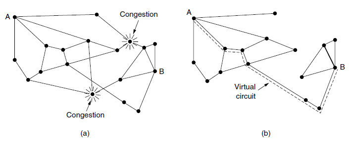

#####4、流量调节

  * 在Internet和许多计算机网络中，发送方调整它们的的传输速度以便发送网络能实际传送的流量。在这种设置下，网络的目标是在拥塞发生之前正常工作。而当拥塞迫在眉睫，它必须告诉发送方紧急刹车放慢传输速度。这种反馈是一种常态而不是针对特殊的情况的一种处理。术语拥塞避免有时用来对比某个操作点，以示与已经变得拥挤的网络区分开。
  * 流量控制的一些方法可以用在数据报网络和虚电路网络。每个方法必须解决两个问题。首先，路由器必须确定如何何时快要接近拥塞。为此，每个路由器可连续监测它正在使用的资源。三种可能的资源分别是输出线路的利用率、在路由器内缓冲的排队数据包以及由于没有足够的缓存而丢失的数据包数量。在这些可能性中，第二个最有用。平均利用率并没有直接考虑大多数流量的突发数据包的——50%的利用率对平滑流量来说太低，但对于变化很大的流量来说就太高了。丢失数据包的计数来得太迟，在数据包丢失时拥塞就已经形成。
  * 路由器内部的排队延迟直接捕获了数据包经历过的任何拥塞情况。它在大部分时间应该很低，但当有一个突发流量产生积压时会跳跃。为了维持良好的排队估计延迟d，假设s表示瞬时队列长度的样值，则d可定期生成，并按如下方式进行更新：dnew=αdold+(1-α)s。其中常数α表示路由器多快忘记历史，这就是所谓的指数加权移动平均（EWMA）。它能平滑流量的波动，相当于一个低通滤波器。每当d升高到某个阈值之上，路由器就要注意拥塞情况了。要考虑的第二个问题是，路由器必须及时把反馈信息传递给造成拥塞的发送方。拥塞时网络的一种体验，但缓解拥塞则需要使用网络的发送后采取行动。为了传递反馈信息，路由器必须标识适当的发送方；然后提醒它们小心谨慎，别向本已拥挤的网络发送更多的数据包。不同的方案使用不同的反馈机制，以下陈述。

**抑制包**

  * 通知拥塞发送方的最直接方式是告诉发送方，在这种方法中，路由器选择一个被拥塞的数据包，给该数据包的源主机返回一个抑制包。抑制包中的目的地址取自该拥塞数据包。同时，在原来的拥塞数据包上添上一个标记（设置头部中的一位），因而它在前行的路径上不会不会产生更多的抑制包，除此之外，数据包的转发过程如同平常一样。
  * 当源主机收到了抑制包，按照要求它必须减少发送给指定目标的流量，比如说减少50%。在数据报网络中，发生拥塞时路由器简单地随机选择一个数据包，很有可能就把抑制包发给了快速发送方，因为发送方的速度越快，它的数据包排队在路由器队列中的数目就越多。这个协议隐含的反馈有助于防止阻塞，但又不会抑制任何发送方，除非真的发生了拥塞。出于同样的原因，很可能多个抑制包被发送到了一个给定的主机和目的地。主机应该忽略掉在固定时间间隔内到达的这些额外抑制包，直至其减缓流量的行为产生了效果。超过这个固定的时间间隔，从路由器进一步反馈来的抑制包则指出网络仍然处于拥塞状态。
  * 早期Internet使用的一个抑制包例子是SOURCE-QUENCE消息。尽管它从来没有流行过，不过部分原因在于它产生的情况和效果都没有明确说明。现代Internet使用了另一种“通知”设计方案，如下。

**显式拥塞通知**

  * 除了生成额外的包发出拥塞警告之外，路由器可以在它转发任何的数据包上打上标记（设置数据包头的某一个标志位）发出信号，表明拥塞情况。当网络传递数据包时，接收方可以注意到有个拥塞已经发生，接收方发送应答包时顺便告诉发送方。然后发送方可以降低传输速率。
  * 这种设计方案称为显式拥塞通知（ECN），且已被用在Internet上。这是早期拥塞信令协议的细化，尤其是对二进制反馈方案的细化，该方案曾经用在DECNET体系结构。IP数据包头中的两位用来记录数据包是否经历了拥塞。数据包从源端发出时没有标记，如图所示。如果它们通过的任何一个路由器正经历拥塞，该路由器在转发数据包时将其标记为经历拥塞；然后接收方在它的下一个应答数据包里回显该标志作为显式拥塞信号，发送方必须降低传输速率。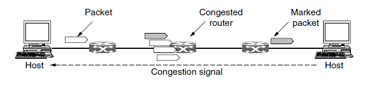

**逐级后跳**

  * 当网络速度很高或者距离很远时，由于传播延迟的缘故，拥塞信号发出后到它产生作用这期间又有许多新的数据包已经被注入到网络。例如，旧金山的一台主机（图中路由器A）正在给纽约的一台主机（图中路由器D发送数据），速度为OC-3的155Mbps。如果纽约的主机现在用完了缓存空间，它将花40毫秒的时间才能将抑制包发回旧金山主机，告诉它降低传输速度。如果采用ENC指示，则需要更长时间，因为抑制消息通过接收方传递。抑制包的传播过程如图a中的第2、3、4步所示，在这40毫秒期间，A又给D发送了6.2M的数据。即使旧金山的主机立即停机，传输管道里的6.2M数据也连续倾入网络，而且网络必须处理它们。只有在图a中的第7个图中，纽约的路由器才会注意到数据包减慢了。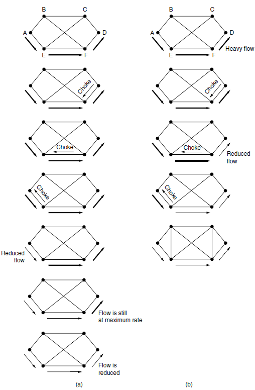
  * 另一种办法是让抑制包在沿途的每一跳都发挥作用，如图b所示。只要抑制包到达F，则F必须按照要求减慢发给D的数据包流。这样做的结果是要求F为D的数据包流分配更多的缓冲区，因为源主机仍然在全速发送数据，但是F这么做却让D立刻得到缓解。在下一步，抑制包到达E，它告诉E减慢给F的数据包流。这一行动给E的缓冲区带来了更大的需求，但是却让F立即得到缓解。最后，抑制包到达A，数据包流才真正慢下来。这种逐条方案的时间效果是拥塞点上的拥塞现象很快得到了缓解，但是其代价是上游路径需要消耗更多的缓冲区间，使用这种方法可以将拥塞灭在萌芽状态，而不会丢失任何数据包。

#####5、负载脱落

  * 当以上任何一种方法都无法消除拥塞时，路由器可以使用负载脱落。负载脱落指当路由器因为来不及处理数据包而面临被这些数据包淹没的危险时，就将它们丢弃。对于一个被数据包淹没的路由器来说，关键问题是选择丢弃哪个数据包。首选的方案可能取决于使用网络的应用程序类型。对于文件传输，旧的数据包价值要高于新的数据包。这个原因我们可以用一个例子加以说明。如果丢弃数据包6，而保持数据包7~10，只会迫使接收方做更多的工作来缓冲它已经接收但尚不能使用的数据。相比之下，对于实时流媒体，新的数据包价值超过旧的数据包，因为如果数据包被延迟并且错失了给用户的播放时间，那么该数据包就变得一无所用。前一种策略（即旧比新好）通常称为葡萄酒策略，后一种策略（即新比旧好）通常称为牛奶策略。
  * 更智能的卸载方式需要发送方的配合。一个例子是携带路由信息的数据包。这些数据包比普通数据包重要得多，因为它们是被用来建立的路由；如果丢失它们，或许就会丢失网络连接。另一个例子是视频压缩算法，如MPEG，这些算法定期发送全帧，然后发送一系列与上一个全帧的差异帧。在这种情况下，应该优先丢弃那些属于差异帧的数据包，因为未来的数据包的工作依赖于全帧。为了实现智能丢弃策略，应用程序必须在它们的数据包上打上标记，只是忘了它们有多重要；然后当不得不丢弃数据包时，路由器可以首先丢失重要性最低的一类数据包，然后是次一级，以此类推。
  * 当然，除非有一些明显的激励措施来避免每个数据包都标志成“非常重要”——“永不丢弃”，否则没有人愿意会把自己的数据包标示得那么不重要。通常计费和金钱可用来组织轻浮的标志。例如，如果发送方购买了某项服务，该服务规定了一定的发送速度，网络可能允许发送方的发送速度超过他们购买的额度，只要他们吧超出部分的数据包标记为低优先级。这种策略可以更加有效的利用闲置资源；只要其他人对此没有兴趣，主机就可以使用这些资源，但不能给她们在网络困难时也拥有这种权利。

**随机早期检测机制**

  * 在拥塞刚出现时就处理它更加有效，这一观察导致了一个针对负载脱落的一个有趣转折，即在所有的缓冲空间都精疲力尽的之前丢弃数据包。这一观点的动机在于大多数Internet主机没有从路由器获得ECN形式的拥塞信号，主机从网络获得的唯一可靠的拥塞迹象是丢包。毕竟，很难构造出一个路由器，在它超负荷工作的时能做到不丢包。因此，诸如TCP这样的传输协议硬件规定了对丢包现象做出拥塞反应，减缓源端的响应。这背后的逻辑推理是TCP是专门为有线网络设计的，并且有线网络非常可靠，所以丢包大多是由于缓冲区溢出而不是传输错误造成的。无线链路必须恢复链路层传输错误（所以它们没有出现讲解的网络层这一章）以便TCP能正常工作。
  * 可以利用这种情形来帮助缓解拥塞。在局面变得毫无希望之前让路由器提前丢包，这里有个时间点的确定问题，即发送方何时采取行动以免为时过晚。解决这个问题的一个流行算法称为随机早期检测（RED）。为了确定何时开始丢弃数据包，路由器要维护一个运行队列长度的平均值。当某条链路上的平均队列长度超过某个阈值时，该链路就被认为即将拥塞，因此路由器随机丢弃一小部分数据包。随机选择丢弃的数据包使得快速发送方发现丢包的可能性更大；因为在数据报网络中，路由器不能分辨出哪个源引起了网络的拥塞，因此随机选择丢弃的数据包或许是最佳的选择。当没有出现期待的确认信息时，受此影响的发送方就会发现丢包，然后传输协议将放慢速度。因此，丢失的数据包起到了传递抑制包的同样作用，但却是隐含的，无需路由器发送任何显示的信号。
  * 相比那些只在缓冲区溢出才丢包的路由器，RED路由器能提高网络性能，虽然它们可能需要调整正常工作方式。举例来说，理想的丢包数量取决于有多少个发送方必须得到拥塞通知。然而，如果ECN可用，那么它就是首选项。ECN提供了一个显式拥塞信号而不是依据丢包来判断是否拥塞；RED用在主机不能接收显式信号的环境里。


<hr>

 
####<p>原文出处：<a href='https://blog.csdn.net/u010643777/article/details/78623129' target='blank'>实时视频流的拥塞控制-NADA，GCC，SCReAM</a></p>

关于三个协议表现，我在ns3仿真平台上进行了对比，相应的技术报告，参考[18]。  
本文主要是对于[1]的翻译. I’m not the master of knowledge, and I am his prophet.  
IETF成立了RMCAT(RTP Media Congestion Avoidance Techniques)工作组，制定在RTP协议之上的拥塞控制机制。[5]中的首段话，指明只要是经由网络的数据流，都应该有拥塞控制机制，说的很好，抄在这里：

>Congestion control is needed for all data transported across the Internet, in order to promote fair usage and prevent congestion collapse. The requirements for interactive, point-to-point real-time multimedia, which needs low-delay, semi-reliable data delivery, are different from the requirements for bulk transfer like FTP or bursty transfers like Web pages. Due to an increasing amount of RTP-based real-time media traffic on the Internet (e.g. with the introduction of the Web Real-Time Communication (WebRTC)), it is especially important to ensure that this kind of traffic is congestion controlled.

假设一条经由网络的数据流没有任何拥塞控制机制，盲目地向网络中发送数据包，当突发包的长度大于某个值，超出了瓶颈链路的处理能力，网络中的队列管理机制就要发挥作用，进行丢包。丢包行为本身就是一种资源浪费的策略，耗费了网络的处理能力，数据包却没有到达目的地。所以，网络中的数据流要根据反馈信号，调整数据包的发送速率，与网络中流的数量和处理能力适配。当前，端到端的拥塞控制机制主要有两类：基于丢包反馈的(TCP Reno,BIC,CUBIC)，基于时延测量的(TCP Vegas, TCP Fast)。其实还有第三类，基于拥塞的拥塞算法(BBR),算是一种混合了丢包与时延的方案，因为网络的丢包，以及时延的增加，这个会影响BBR的即时带宽的计算，也就影响BBR的发送包的速率。  

对于实时视频流，更偏向于采用基于时延的拥塞控制策略，因为基于丢包的拥塞控制策略，通过向网络中填充数据包，发现可用带宽，可导致端到端时延的震荡。但是目前路由器上队列长度的很深，导致了很大的端到端时延.Excessively large buffer may leads to latency of seconds which is referred as buffbloat problem, and packet loss is a rare event. 鉴于网络的视频流量逐渐占据主流，所以出现了CoDel[6]与PIE[7]，通过丢包来控制路由器中的队列长度，保证较小的端到端时延，保证QoE。端到端较小的时延，是通过队列主动丢包实现的，让丢包的流在发现丢包之后，调整发送速率。  

[5]中指明了实时媒体流进行拥塞控制要达到的目标：

<table>
<thead>
<tr>
<th>metrics</th>
<th>Requirement</th>
</tr>
</thead>
<tbody>
<tr>
<td>Latency</td>
<td>Possibly lower than 100ms</td>
</tr>
<tr>
<td>Packet losses</td>
<td>Should be minimized, FEC mechanism may be employed</td>
</tr>
<tr>
<td>Throughput</td>
<td>Should be as high as possible</td>
</tr>
<tr>
<td>Burstiness</td>
<td>A smooth sending-rate should be produced</td>
</tr>
<tr>
<td>Fairness</td>
<td>Should fairly share the bandwidth with real-time and data flows</td>
</tr>
<tr>
<td>Starvation</td>
<td>Media flows should not be starved when competing with TCP flows</td>
</tr>
<tr>
<td>Network support</td>
<td>No special network support should be required to operate</td>
</tr>
</tbody>
</table>

因此基于时延的参数主要有三种：Round Trip Time,One-Way Delay, One-Way Delay Variation.  

基于RTT时延的拥塞控制机制有TCP Vegas,TCP FAST.RTT将反向链路的时延考虑在内，反向链路的拥塞可能影响正向链路的发送速率。Tcp Vegas的经验表明，基于时延的拥塞控制算法，同基于丢包的拥塞控制算法竞争瓶颈链路带宽时，会被饿死。OWD，测量的是单向路径时延，有接收端与发送端时钟同步的需要，而且OWD有一个“late comer effect"，后到的流增加了网络上的处理时延，使得之前的流逐渐出让带宽，导致先前的流饿死。OWDV通过计算前后数据包的接收时间差与发送时间差(Δd=ti−ti−1−(Ti−Ti−1))，作为网络拥塞信号。这种测量方法，不需要两端之间的时钟同步。这个公式就是计算数据包之间的抖动，能够反映中网络中的队列变化情况。若Δd>0表明网络中的队列长队在增加，排队时延在增加；若Δd<0,表明网络中的队列在减少，排队时延在减少。但是Δd=0的情况就比较复杂，1网络利用率不足，但是网络队列基本为空；2网络队列满载，网络流填充网络的速度超出了网络的处理能力；3网络流的发送速率和网络的处理能力相等。  

REMAT工作组主要有三个草案，GCC[3,11]，NADA[2,10]，SCReAM[4,12]。  
webrtc中的拥塞控制机制就是GCC，网上有博文介绍[8,9]，不提。  
NADA通过获取路径的时延参数，控制视频编码器的编码速率RnRn​.NADA主要糅合one way delay(dn)，丢包时延(dL​,将丢包行为转化为一个惩罚时延，可以设置为1s)，ECN标记时延（dM,网络路由器标记拥塞信号也被转化为一个惩罚时延，可以设置为200ms）来计算出一个综合时延(d˜d~ \tilde{d}d~,aggregate delay)。第n个包的时延计算如下，其中1Mn​被网络路由器标记了拥塞信号，1Ln​表示数据包丢包。  

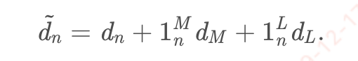

向接收端反馈的数值要进行指数平滑：  

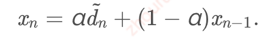 

接收端每隔δ=100msδ=100ms \delta=100msδ=100ms向接收端反馈数据：  

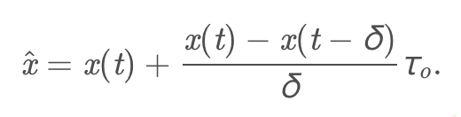  

其中，在webrtc的对NADA的仿真代码中([nada.cc](http://nada.cc)，这个代码目前在新版本webrtc的代码中已经不见了)，发送端回馈的是x(t)x(t) x(t)x(t),就是平滑后的$x\_n (fb.congestionsignal())和导数(fb.congestionsignal())和导数 (fb.congestion\_signal())和导数(fb.congestions​ignal())和导数\frac{x(t)-x(t-\delta)}{\delta},,,,x(t-\delta)为计算出的为计算出的 为计算出的为计算出的x\_{n-1}$. τoτo \tau\_oτo​为一个固定值，500ms。照我理解，δδ\deltaδ是一个固定值，但是接收端反馈的时候,有定时器之类的是有误差，最后计算出来的是一个修正值xˆx^\hat{x}x^.这个值影响编码器的参考编码码率,xrefxref {x\_{ref}}xref​是一个固定的参考值，w表示流的权重，网络中不同的流有不同的优先级.编码器的编码速率R∈[Rmin,Rmax]R∈[Rmin,Rmax]R\in[R\_{min},R\_{max}]R∈[Rmin​,Rmax​].路径时延参数增大的时候，降低编码速率，减少数据包的产生,反之，则增大编码速率。  

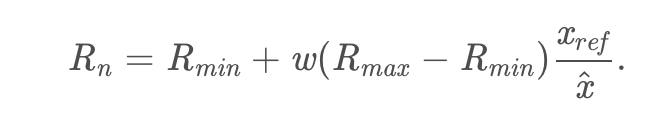 

上面说的是参考编码速率，文中还要根据发送端的缓冲区，决定最终的编码器控制速率RvRv R\_{v}Rv​以及缓冲区数据的向外的发送速率RsRsR\_{s}Rs​.发送端的缓冲区数据较多的时候，要相应地下调RvRv R\_{v}Rv​  

这是论文[2]的大概意思，但是作者向IETF提交的草案，则在不断演进，其中的公式已经发生了很大的变化[10].好像是为了增加系统的稳定性，没办法，不是控制论出身，看不太懂。  

最近作者，发布了NADA在ns3上的仿真代码[17]。我运行仿真，配置一个点到点链路，链路带宽2M，单项时延100ms。在只有nada流的时候，可以看到nada的带宽利用率还是非常高的，而且速率非常平稳。  

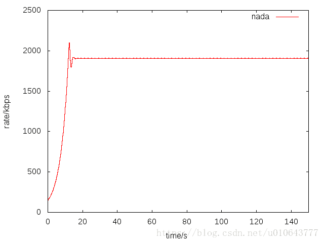  

下面我们对比下，一条NADA流同一条TCP流竞争带宽的情况，我在仿真的[20,100]秒，启动了一条TCP流。可以看到，在tcp流存在的情况下，NADA，基本上也能占用到一个合理的带宽。  

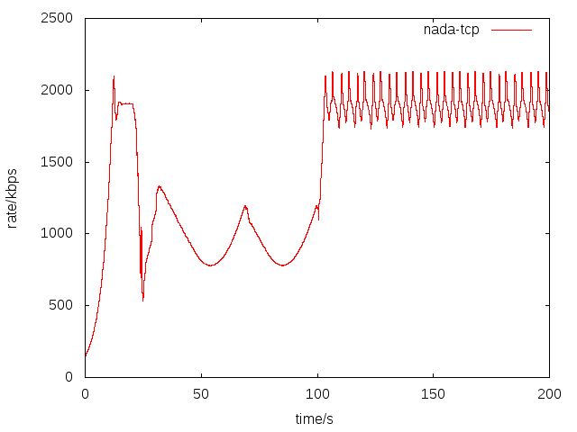  

SCReAM[4]是爱立信出品的一个拥塞控制算法，用在其OPENWEBRTC(基于gstreamer)代码库中。  
SCReAM在算法启动的时候，采用类似TCP慢启动模式，在没有发生丢包之前，以快速模式增加编解码器的码率。
    
    
    else if (parent->inFastStart && rtpQueueDelay < 0.1f) {
        /*
        * Increment bitrate, limited by the rampUpSpeed
        */
        increment = rampUpSpeedTmp*(kRateAdjustInterval_us * 1e-6f);
        /*
        * Limit increase rate near the last known highest bitrate or if priority is low
        */
        increment *= sclI*sqrt(targetPriority);
        /*
        * No increase if the actual coder rate is lower than the target
        */
        if (targetBitrate > rateRtpLimit*1.5f)
            increment = 0;
        /*
        * Add increment
        */
        targetBitrate += increment;
        wasFastStart = true;
    }
    
  

拥塞控制算法，在网络拥塞的时候，带宽退让；探测到可用带宽时，及时占有。  

[1][De Cicco L, Carlucci G, Mascolo S. Congestion control for webrtc:Standardization status and open issues[J]. IEEE Communications Standards Magazine, 2017, 1(2): 22-27.](http://ieeexplore.ieee.org/document/7992924/)  

[2][Zhu X, Pan R. NADA: A unified congestion control scheme for low-latency interactive video[C]//Packet Video Workshop (PV), 2013 20th International. IEEE, 2013: 1-8.](http://ivms.stanford.edu/~zhuxq/papers/pv2013.pdf)  

[3][Carlucci G, De Cicco L, Holmer S, et al. Congestion Control for Web Real-Time Communication[J]. IEEE/ACM Transactions on Networking, 2017, 25(5):2629-2642.](http://ieeexplore.ieee.org/document/7938641/)  

[4][Johansson I. Self-clocked rate adaptation for conversational video inLTE[C]//Proceedings of the 2014 ACM SIGCOMM workshop on Capacity sharing workshop. ACM, 2014: 51-56.](https://dl.acm.org/citation.cfm?id=2631976)  

[5][Congestion Control Requirements for Interactive Real-Time Media draft-ietf-rmcat-cc-requirements-09](https://tools.ietf.org/html/draft-ietf-rmcat-cc-requirements-09)  

[6][Nichols K, Jacobson V, McGregor A, et al. Controlled delay active queue management[J]. Work in Progress,2013.](http://www.pollere.net/Pdfdocs/draft-02.pdf)  

[7][Pan R, Natarajan P, Piglione C, et al. PIE: A lightweight control scheme to address the bufferbloat problem[C]//High Performance Switching and Routing(HPSR), 2013 IEEE 14th International Conference on. IEEE, 2013:148-155.](http://ieeexplore.ieee.org/stamp/stamp.jsp?arnumber=6602305)  

[8][WebRTC基于GCC的拥塞控制(上) - 算法分析](http://www.jianshu.com/p/0f7ee0e0b3be)  

[9][WebRTC基于GCC的拥塞控制(下) - 实现分析](http://www.jianshu.com/p/5259a8659112)  

[10][NADA: A Unified Congestion Control Scheme for Real-Time Media draft-ietf-rmcat-nada-05](https://tools.ietf.org/html/draft-ietf-rmcat-nada-05)  

[11][A Google Congestion Control Algorithm for Real-Time Communication on the World Wide Web draft-alvestrand-rtcweb-congestion-03](https://tools.ietf.org/html/draft-alvestrand-rtcweb-congestion-03)  

[12][Self-Clocked Rate Adaptation for Multimedia draft-ietf-rmcat-scream-cc-13](https://tools.ietf.org/html/draft-ietf-rmcat-scream-cc-13)  

[13][基于UDP拥塞控制-LEDBAT](http://blog.csdn.net/u010643777/article/details/78507558)  

[14][Winstein K, Sivaraman A, Balakrishnan H. Stochastic Forecasts Achieve High Throughput and Low Delay over Cellular Networks[C]//NSDI. 2013:459-471.](http://alfalfa.mit.edu/)  

[15][Zaki Y, Pötsch T, Chen J, et al. Adaptive congestion control for unpredictable cellular networks[C]//ACM SIGCOMM Computer Communication Review. ACM, 2015, 45(4): 509-522.](https://cs.nyu.edu/~jchen/publications/sigcomm15-zaki.pdf)  

[16] Zhu X, Pan R, Prabhu M S, et al. Layered internet video adaptation(LIVA): Network-assisted bandwidth sharing and transient loss protection for video streaming[J]. IEEE Transactions on Multimedia, 2011  

[17][ns3-rmcat](https://github.com/cisco/ns3-rmcat)  

[18][The performance comparison of GCC, NADA and SCReAM](https://blog.csdn.net/u010643777/article/details/82316112)  
[19] Improved coexistence and loss tolerance for delay based TCP congestion control


<hr>


####<p>原文出处：<a href='https://blog.csdn.net/u010643777/article/details/78507558' target='blank'>基于UDP拥塞控制-LEDBAT</a></p>

LEDBAT[1]是Bittorrent客户端上使用的一种拥塞控制机制。大公司在开发基于UDP的网络应用时，应该建立拥塞控制机制。因为网络中的数据流应该遵从以下原则：不给当前的网络制造麻烦；保证数据流的带宽公平性，不恶意竞争带宽。

P2P应用不知道安慰了多少宅男寂寞无聊的夜晚，在互联网中的流量中p2p流量中占有很大的份额。以至于当年有些ISP要封锁P2P应用。当年Bittorrent要使用UDP进行数据传输时，在网络中引起了骚动。鉴于Bittorrent在网络中占用的流量，再加上无任何拥塞控制机制的UDP协议，Bittorrent会不会导致再次出现1986年的网络崩溃。于是建立在UDP之上的拥塞控制机制LEDBAT横空出世。以上是引子，宅男寂寞无聊的夜，我不关心。

目标：1在瓶颈链路没有其他流的情况下，能够占满带宽，充分利用网络。2在没有其他数据流的时候，保证较低的排队时延；因TCP流的窗口增加，引入排队时延的情况下，尽量不要增加排队时延。3当TCP竞争带宽的时候，LEDBAT主动出让带宽，降低窗口(The LEDBAT considers itself to be junior to TCP)。

LEDBAT仍是基于窗口的速率控制，但是比TCP更早地感知网络的拥塞情况，以便更好地做出回应。LEDBAT采用单向时延，估计网络中的排队情况。一个数据包在网络的传输经历的时延有三部分组成：processing delay,propagation delay, queue delay。在网络中不存在排队的时候，没有排队时延，数据包经历的时延最小。

LEDBAT采用单向时延来衡量网络的拥塞状况，单向时延相比RTT的优势，就是不用考虑ack返回时经历的回路时延。但是单向时延不是够准确测量，因为收发端时钟不同步。LEDBAT的单向时延是这样计算的，接收端接收到数据，回复ack，ack中携带时间差，ack.delay=localtimestamp（接收端收到数据时的本地时间）-remotetimestamp(f发送端在发送时的时戳)。将数据包传输过程中的最小的ack.delay作为base\_delay,排队时延queue\_delay=current\_delay-base\_delay，这个差值，就解决了sender、receiver之间的时钟不同步问题。具体的接收端窗口变化如下[1]：
    

```
current_delay = acknowledgement.delay
base_delay = min(base_delay, current_delay)
queuing_delay = current_delay - base_delay
off_target = TARGET - queuing_delay
cwnd += GAIN * off_target / cwnd
```

解释下，TARGET就是一个设定的参数值，GAIN为1/TARGET，在queue\_delay较小时，第四个是窗口变化公式，保证窗口增长，快速逼近瓶颈链路带宽。GAIN的存在保证LEDBAT不比TCP的窗口了增长速度快。在最好的情况下(queue_delay=0),LEDBAT也是每个RTT，cwnd的大小增加1。LEDBA相比基于丢包的的TCP拥塞控制机制，对于网络的拥塞感知要早。在queue\_delay=2*TARGET时，每经一个RTT，cwnd减少1。就是说在队列时延增加的情况下，但是还未到达路由器的队列丢包阈值，TCP还处在拥塞避免阶段，tcp每个RTT，窗口增1，LEDBAT窗口减1。LEDBAT向TCP出让带宽。  

LEDBAT这种机制，保证网络中有带宽可用的时候，尽快占用，网络中存在TCP流的时候，向TCP带宽。The LEDBAT considers itself to be junior to TCP。LEDBAT不向TCP流竞争，因为它是p2p应用中的，过多地竞争带宽，是要被ISP管制的。[3]给出了LEDBADT作为TCP的拥塞控制机制在linux上的实现代码。

[1][LEDBAT: The New BitTorrent Congestion Control Protocol](https://www.kth.se/social/files/5527dbf2f276543890e0c409/LEDBAT.pdf)

[2][RFC 6817 - Low Extra Delay Background Transport (LEDBAT)](https://tools.ietf.org/html/rfc6817)

[3][LEDBAT implements in Linux on TCP](https://github.com/silviov/TCP-LEDBAT)

[4][LEDBAT on ns2](http://perso.telecom-paristech.fr/~drossi/index.php?n=Software.LEDBAT)

