 
<!--BEGIN_DATA
{
    "create_date": "2023-06-06 12:20", 
    "modify_date": "2023-06-06 12:20", 
    "is_top": "0", 
    "summary": "控制理论发展简史 —— 为控制类课程的教与学", 
    "tags": "数学", 
    "file_name": "控制理论发展简史.md"
}
END_DATA-->

#### 
原文出处：<a href='https://mp.weixin.qq.com/s/cy0_5l5LGQKLtyrVqwsx7g' target='blank'>控制理论发展简史 —— 为控制类课程的教与学</a>

> 对于控制专业同学了解控制理论的发展历程是很重要的。温习历史，能够更好地认识当前所学知识的来源和意义，并且能够更好地把握未来发展趋势。在实际应用中也能够更深入地理解和应用相关知识。

文章史料翔实、逻辑清晰，但未找到期刊发表来源，如需请关注原作者

以下文章来源于玉兰花开 翠条引风 ，作者孙晶

**玉兰花开 翠条引风** .

从教感悟与体会

**摘要：**在我国高校控制类教材与课件中，有关控制理论发展简史部分没有统一标准，对同一史料的描述存在较大差别，甚至错误。该文从人物、时间、地点、著作、事件、评价等方面入手，力争给出全面详实、图文并茂的控制理论发展简史，同时以百余篇参考文献的方式提供控制领域经典名作及可考有据的网络资源。使用者可根据课程侧重点对历史事件进行取舍，亦可根据该文提示对所需史料进行扩展丰富。该文旨在为控制类课程的教与学提供教辅史料，为国内控制理论发展简史的规范化使用提供帮助。

**关键词：**控制理论；发展简史；自动控制；工程控制；控制工程****

控制理论发展简史由自动控制技术对人类进步的无数个贡献组成。表1.1为控制理论发展简史的五个典型阶段、每个阶段的特点及其代表性事件。从中不难看出，在早期控制阶段，朴素的控制思想为提高人类生产生活质量服务；在前期控制阶段，控制理论与机械化紧密相连；在经典控制阶段，控制理论与电力技术共同发展；在现代控制阶段，控制理论与数字化同频共振；在智能控制阶段，控制理论与智能化的关系也是可预判的。未来还会有更多的阶段，只是目前我们尚可展望第五个阶段。以动力和信息变革为主要特征的四次工业革命贯穿于控制理论发展简史，但终究都是一场关于机器的革命。

表 1 控制理论发展简史概略表

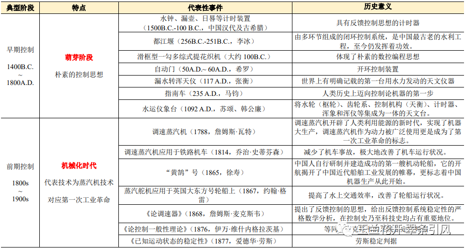

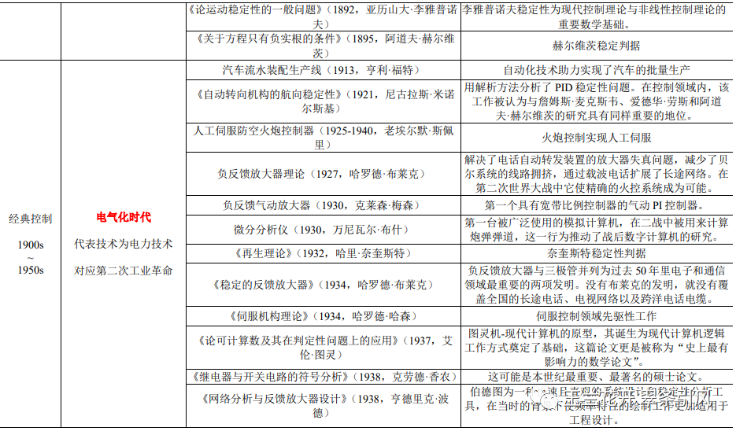

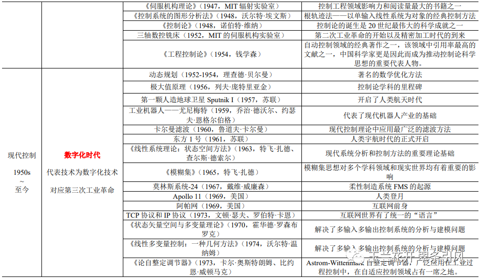

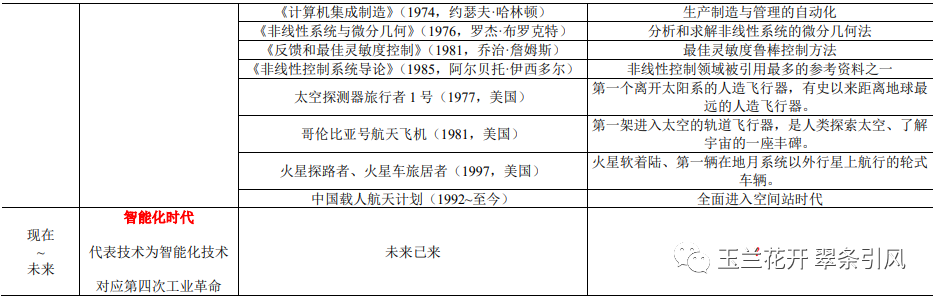

## 1. 早期控制（1500A.D.~1800B.C.）

公元前1500年，具有反馈控制思想的计时器**水钟**、**漏壶**诞生，通过控制水流速度恒定以达到准确记时。公元前300年左右，古希腊人克特西比乌斯（Ctesibius，285 B.C.~222 B.C.）运用齿轮将水钟改造成计时准确的机械水钟，如图1（左）所示。图1（中）所示为西汉沉箭式铜漏壶（202 B.C.~9 A.D.），该铜漏壶由漏壶和沉箭两部分组成。铜漏壶近底部伸出一细管状流口。壶盖中央一长方形孔，插置刻箭。刻箭随壶内水深浅而浮降，从而指示时辰。

** 日晷**是人类古代利用日影测得时刻的一种计时仪器，其原理为根据地球的自转和公转、利用太阳的投影方向来测定并划分时刻。我国现存最早的日晷为汉代石日晷（200B.C. 100B.C），如图1（右）所示，尽管其貌不扬，但计时准确，常被用来校准漏壶。

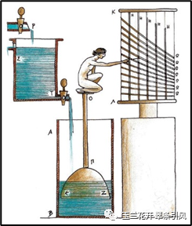 
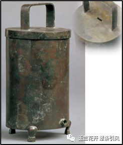
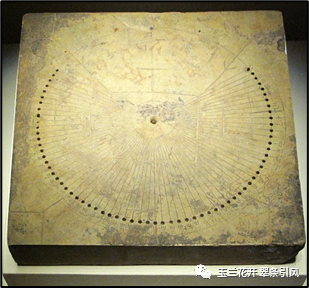

图1古希腊克特西比乌斯水钟[1]（左）、西汉沉箭式铜漏壶（中）和汉代石日晷（右）

大约在256B.C.~251B.C.期间（战国秦昭王时期），蜀郡守李冰（生卒年不详）修建**都江堰**。都江堰由鱼嘴、宝瓶口和飞沙堰三部分组成（图2）：作为分水提的鱼嘴将岷江分流为外江和内江，外江起到泄洪作用；作为引水口的宝瓶口使内江的水流平稳顺利流入平原，内江起到灌溉作用；作为溢洪道的飞沙堰将内江淤沙排至外江，平衡水旱两季水量，起到清淤作用。由鱼嘴、宝瓶口和飞沙堰三部分组成的都江堰是由多环节组成的闭环控制系统，且充满各种扰动、不确定性和时变性，其被控量为进入成都平原的水量，枯水期不能少，丰水期不能多。享誉世界的都江堰是中国最古老的水利工程，至今仍发挥着功效。

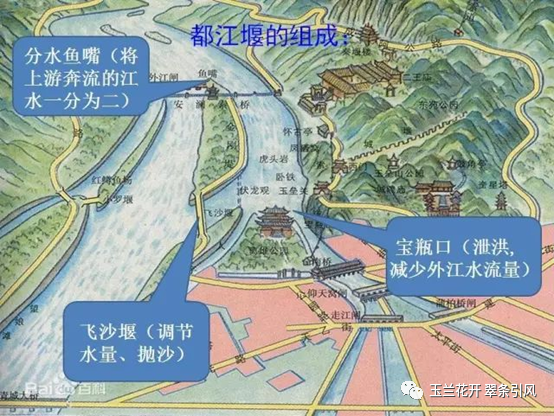

图2 战国时期的都江堰[2]

如图3所示，2012年-2013年间，成都老官山汉墓出土了公元前100年左右的西汉提花机模型——**滑框型一勾多综式提花织机**，是世界上迄今发现最早的提花机实物。提花技术是能够贮存提花信息的复杂织造技术，通过提花装置将丝织品的图案贮存起来，使得所有运作都可重复进行，如同计算机编成一般。被存储在织机上的图案为花本，它由代表经线的脚子线和代表纬线的耳子线根据纹样要求编织而成。上机时，脚子线与提升经线的纤线相连，通过拉动耳子线一侧的脚子线提升相关经线。如图4所示，宋应星（1587~约1666）在《天工开物》中描述了**小花楼提花机**工作的场景：“凡工匠结花本者，心计最精巧。画师先画何等花色于纸上，结本者以丝线随画量度，算计分寸杪而结成之，张悬花楼之上”。这段话的意思就是若想把设计好的图案重现在织物上，得按图案使成千上万根经线有规律地交互上下提综。综是带动经线做升降运动而形成梭口的部件，综框越多织机能织的纹样就越复杂。可以说，提花机体现了朴素的数控编程思想。

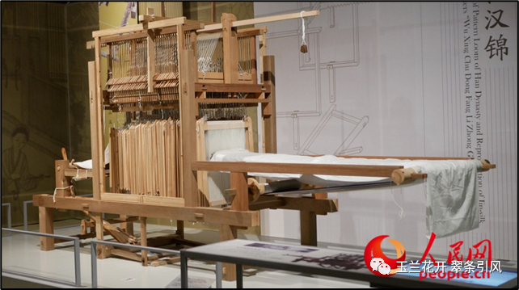

图3 复原的成都老官山汉墓提花织机（来源：人民网，2021年5月18日）

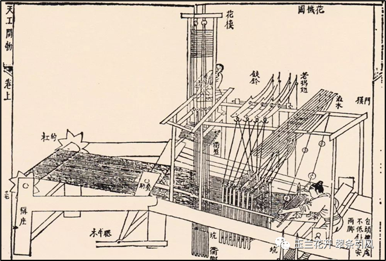

图4 小花楼提花机，明·宋应星《天工开物》

公元50-60年期间，古希腊数学家希罗（Hero，10 A.D.~ 70 A.D.）发明了自动开关庙门、自动分发圣水、自动贩卖机等具有开环控制思想的装置。如图5（右）所示，自动打开庙门的装置为世界上最早以气压和重力为动力的**自动门**，点火后B中空气膨胀，水进入D，利用水的重力使得轴F转动，将门打开。当火熄灭时，庙门在重锤E作用下自动关闭，因此这是一个开环控制系统。

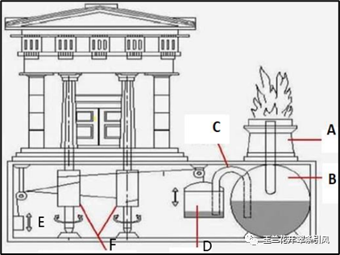

图5 希罗自动门[3]

公元117年，东汉时期的张衡（78 ~ 139）发明了**漏水转浑天仪**。其主体为直径四尺六寸的铜球，球面标出星官、黄道、赤道等，利用稳定的漏壶流水，通过齿轮传动装置推动铜球均匀绕极轴旋转，来模拟星体东升西落。漏水转浑天仪是世界上有明确记载的第一台用水力发动的天文仪器[4]。公元1092年，北宋时期苏颂、韩公廉等人发明制造了以水力驱动的大型自动化仪器——**水运仪象台**。这座集浑仪、浑象和计时装置为一体的天文台，具有天象观测、天象演示与计时的功能。将水轮（枢轮）、齿轮系、控制机构、计时器、浑象和浑仪等集成为一个机械系统；由杆系与秤漏等构成控制机构（天衡），其功能相当于近代机械钟表的擒纵机构。图6为王振铎先生于1958年复原的模型总图，现陈列于中国历史博物馆[5]。水运仪象台的设计与制造水平堪称一绝，充分体现了我国古代劳动人民的聪明才智和富于创造的精神。

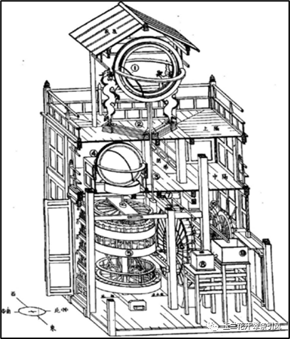

图6王振铎先生复原的水运仪象台总图[5]（1:5模型阵列于中国历史博物馆）

公元235年左右，三国时期的马钧（生卒年不详）研制出**指南车**，无论车辆如何翻滚、旋转、调整，车上木人的手永远都指向南方，故名指南车。早期的历史文献对指南车的基本构造及功能原理仅有零星描述，直到宋朝的燕肃指南车（1027年）才有了详细的文字记载。1936年，中国古代科技史学家、博物馆学家王振铎先生（1911~1992）对燕肃指南车进行了深入研究，并给出基本构造（复原设计方案），制成复原模型，分别如图7[6]和图8所示[7]。无论车向哪个方向转，中心大平轮与车的转向正好相反，恰好抵消车转弯的影响，使木人的指向保持不变。英国科学技术史家李约瑟（Joseph Needham，1900~1995）称指南车为“人类历史上迈向控制论机器的第一步”“所有的控制论机器的祖先”。

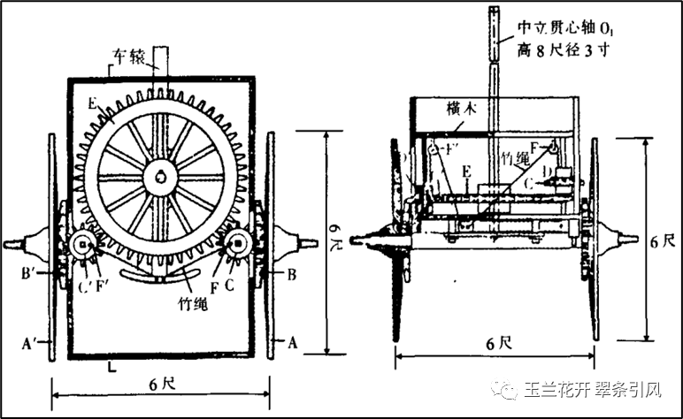

图7 1936年王振铎先生对燕肃指南车的复原设计图[6]

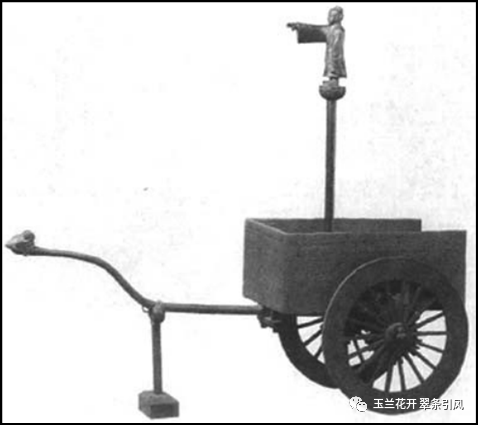

图8 1936年王振铎先生复制的燕肃指南车模型[7]

## 2. 前期控制（1800A.D.~1900A.D.）

1788年，英国企业家、发明家詹姆斯·瓦特（James Watt，1736 ~1819）将离心式飞球调速器用于蒸汽机，相当于给蒸气机添加了节流阀，通过自动调节蒸汽量保证蒸汽机在不同的工作负荷时，保持一定的转速，这就是反馈思想的工程应用——调速蒸汽机（图9左）。调速器使得蒸汽大小是可调的，因此调速蒸汽机被迅速应用在各种机器上：3000年以来船舶的唯一动力——风力除了还应用在部分观光船或游轮上之外，在短短50年里迅速被蒸汽取代[8]；1814年，英国工程师乔治·史蒂芬森（George Stephenson，1781~1848）首次将瓦特调速蒸汽机应用于铁路机车（图10），减少了机车事故，极大地改善了机车运行状况[9]。调速蒸汽机开辟了人类利用能源的新时代，实现了机器大生产，调速蒸汽机作为动力被广泛使用更是成为了第一次工业革命的标志。图9右为伦敦霍尔本高架桥（Holborn Viaduct）上名为“科学（SCIENCE）”的雕像，其手持之物即为离心式飞球调速器[10]，由此可见其重要地位。

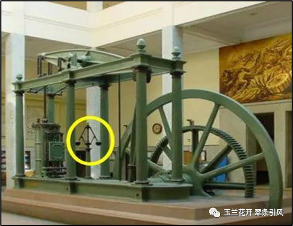 
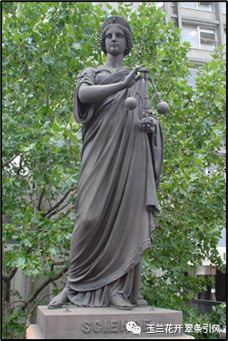

图9 苏格兰工程师詹姆斯·瓦特和马修·博尔顿共同建造的第一台带有离心式飞球调速器的蒸汽机[8]（左）；伦敦名为科学的雕塑，其手持之物即为离心式飞球调速器[10]（右）

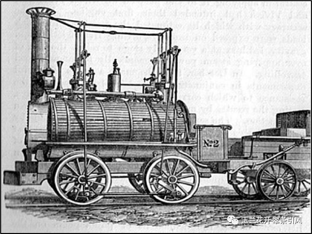

图10英国工程师乔治·史蒂芬森首次将瓦特调速蒸汽机应用于铁路机车（1814年）[9]

1865年，清代科学家、中国近代化学之父、中国近代造船工业先驱徐寿（1818~1884）设计建造了**中国第一艘蒸汽机明轮船“黄鹄”号**。据1868年8月31日上海《字林西报》报道，这艘船载重25吨，长55华尺；蒸汽机为双联卧式蒸汽机复机，单式汽缸，倾斜装置，汽缸直径1华尺，长2尺；锅炉为苏格兰式回烟烟管汽锅，长11尺，直径2尺6寸；锅炉管49条，长8尺，直径2寸；主轴长14尺，直径2.4寸。船舱在主轴后面，机器都集中在船的前半部。这艘轮船所用材料除了“用于主轴、锅炉及汽缸配件之铁”购自外洋，其它一切器材，包括“雌雄螺旋、螺丝钉、活塞、气压计等，均由徐寿父子之亲自监制，并无外洋模型及外人之助”[11]。1866年“黄鹄”号在扬子江试航成功，在不到14小时内逆流行驶了225里，时速约16里；而返回时顺流仅用了8小时，时速约28里。“黄鹄”号是中国人自行研制并建造成功的第一艘机动轮船，它的开航揭开了中国近代船舶工业发展的帷幕，更标志着中国机器生产从此开始[12,13]。1868年，徐寿父子设计建造的**中国第一艘机器动力木壳明轮兵船“惠吉”号**在江南造船厂下水。如图11所示，“惠吉”号舰长180尺，马力392匹，排水量600吨，并装有大炮8门[14]。“黄鹄”号和“惠吉”号的诞生体现了自强不息的伟大中华民族精神。有人这样评价徐寿：或许在整个科学史上的成就微不足道，但是在封闭和黑暗的清朝，他的一举一动都散发着无尽的光辉[11]。

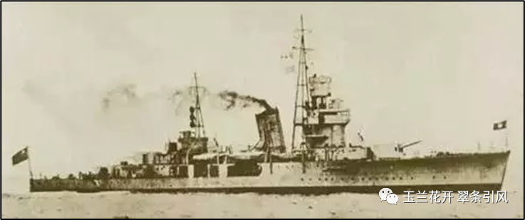

图11 中国第一艘机器动力木壳明轮兵船“惠吉”号[11]

1866年，苏格兰工程师约翰·格雷（John Gray，1831 ~1908）发明了具有反馈思想的蒸汽舵机，并于1867年将其应用于著名的英国大东方号（SS Great Eastern）轮船。约翰·格雷首先设计了具有差速螺杆的蒸汽阀，当舵机工作时，其转向角度被传输到差动螺杆上，后者控制着为舵机提供动力的蒸汽阀。当舵机转向到所需角度时，可调节蒸汽阀以降低功率；若舵机转向未达到或超过所需角度时，蒸汽阀被打开以增加动力直至舵机转向角度符合要求[15]。

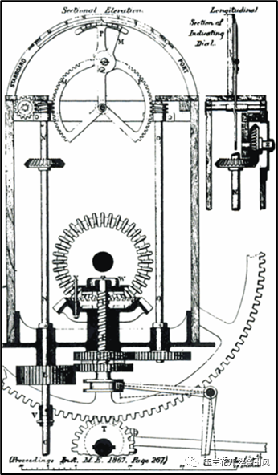

图12 约翰·格雷设计的具有反馈思想的蒸汽舵机[15]

1868年，英国物理学家、数学家詹姆斯·麦克斯韦（James Maxwell，1831~1879，图13左）发表**《论调速器》**（_On Governors_）[16]，提出了反馈控制的思想，给出反馈控制系统稳定性的严格数学分析。该文采用非线性系统的线性化处理，给出了低阶系统稳定性的判别条件，指出带调速器的机器通常在有扰动的情况下仍然能以均匀的方式运动，其中扰动是多种组成部分的运动的综合。该文从理论层面分析了蒸汽机自动调速器和钟表机构的运动稳定性问题，是关于反馈思想的第一篇重要论文。1876年，俄罗斯学者伊万·维什内格拉茨基（Ivan Vyshnegradsky，1832~1895）独立地给出了类似的系统稳定性判据[17,18]。

麦克斯韦的这篇著作在控制史乃至科技史均占有重要地位。1948年，当美国应用数学家、控制论先驱诺伯特·维纳（Norbert Wiener，1894~1964）考虑为一个新领域定名时，他想起了麦克斯韦：“我们已经决定了为整个控制和通信领域起一个名字，不管涉及到机器还是动物，就叫做Cybernetics，它来自希腊文 kubernetes，即掌舵人。在选择这个词的时候，我们应当追溯到麦克斯韦1868年发表的第一篇论述反馈机制的重要论文：《论调速器》”[19]。

麦克斯韦在《论调速器》中提到：我尚未能完全确定高于三阶方程的条件，希望这个研究题目会引起数学家们的注意。1877年，英国数学家爱德华·劳斯（Edward Routh，1831~1907，图13中）以题为**《已知运动状态的稳定性》**（_A treatise on the stability of a given state of motion, particularly steady motion_）[20]的论文赢得了由英国剑桥大学1848年设立、由该校数学学院颁发的亚当斯奖（Adams Prize），文中他提出了我们今天熟知的**劳斯稳定性判据**，即基于行列式对系统特征根进行分析从而判断高阶系统的稳定性，得到了更一般性的判别方法。德国数学家阿道夫·赫尔维茨（Adolf Hurwitz，1859~1919，图13右）在1895年独立地提出将多项式的系数放到赫尔维茨矩阵中，证明当且仅当赫尔维茨矩阵的主要子矩阵其行列式形成的数列均为正值时多项式稳定[21]。劳斯稳定判据和赫尔维茨矩阵是等价的，因此被称为**劳斯****-赫尔维茨稳定性判据**，除用于判断线性时不变控制系统的稳定性之外，对于分析系统参数变化对稳定性的影响、系统的相对稳定性、不稳定极点个数、参数的稳定域等方面均有帮助。

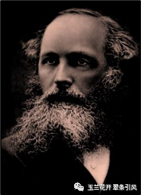
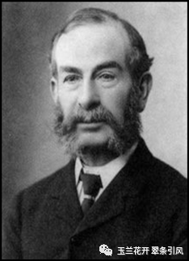
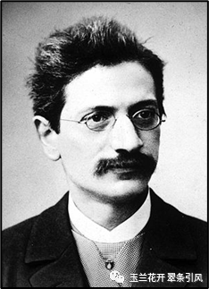

图13詹姆斯·麦克斯韦（左）、爱德华·劳斯（中）和阿道夫·赫尔维茨（右）

1892年，俄国数学家、力学家亚历山大·李亚普诺夫(Alexander Lyapunov，1857~1918，图14左)在博士论文**《论运动稳定性的一般问题》**（_A general task about the stability of motion_）[22]中给出了运动稳定性的科学概念、研究的方法和科学理论体系，从而推动了数理科学与技术科学特别是在数学、力学和控制理论中与稳定性有关领域的巨大发展。在这一历史性著作中，李亚普诺夫提出了两类解决运动稳定性问题的方法，第一方法是通过求解微分方程的解来分析运动稳定性，第二方法则是一种定性方法，它无需求解微分方程，而是通过一类具有某些形式的函数_V_（李亚普诺夫函数）研究它及其对于系统的全导数的有关性质，从而得出稳定性结论。第二方法又称为直接方法，它具有科学的概念体系、判定方法和自成一套的理论，现在被广泛应用于解决航空、航天、导弹等非线性系统稳定性问题的李亚普诺夫方法即为李亚普诺夫第二方法[23]。

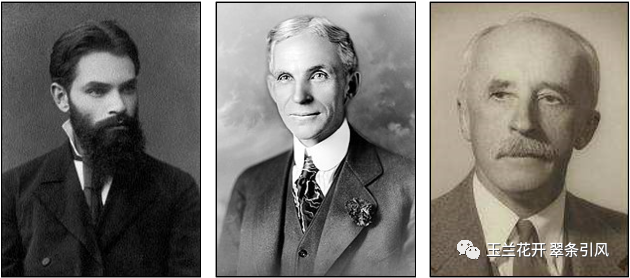

图14 亚历山大·李雅普诺夫（左）、亨利·福特（中）和尼古拉斯·米诺尔斯基（右）

流水生产线将输送机械与控制系统、随行夹具、检测设备等进行有机组合，极大地提高了生产与装配效率。1913年，美国汽车工程师与企业家亨利·福特（Henry Ford，1863~1947，图14中）将装配线概念应用到工厂，建成世界上第一条**汽车流水装配生产线**，如图15所示，自动化技术助力实现了汽车的批量生产，一辆车生产时长从22小时18分钟降到93分钟，生产效率提高了20倍[24]。随后，由滑轨和传送带构成的移动底盘装配线更是令福特汽车产量得以数十倍的增加，使得福特的T型车走进千家万户[25]。

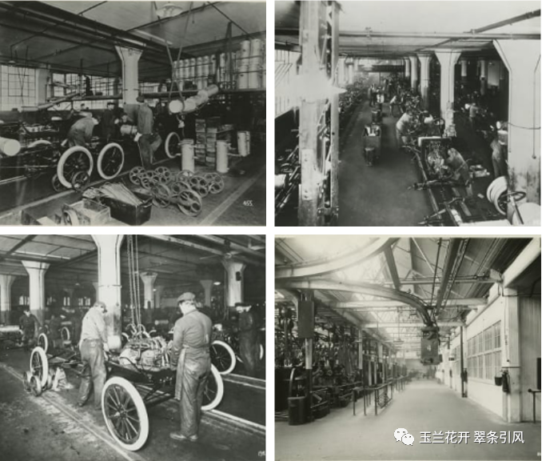

图15 在福特T型汽车底盘装配线上，车架、车轴、油箱、发动机、仪表盘、车轮、散热器和车身等按顺序组装。工人将从高架平台滑下、且内有汽油的邮箱连接到底盘上，以便于在生产线末端的整车可被直接开走（1914年）（左上）。在底盘装配线的仪表板安装过程中，工人将点火线、火花和油门控制装置连接到发动机上，并将转向柱连接到前桥的横拉杆上（1915年）（右上）。一名工人将T型驱动轴连接到变速器上，另一名工人使用链式起重机将发动机降到底盘上进行安装（1913年）（左下）。使用高架单轨输送机在车间以及工厂周围运送零件，该输送机轨道超过1.5英里，贯穿整个工厂（1914年）（右下）[26]。

1921年，俄裔美国应用数学家尼古拉斯·米诺尔斯基（Nicholas Minorsky，1885~1970，图14右）参与在新墨西哥号战列舰上安装和测试自动转向系统工作。结合该项工作，米诺尔斯基撰写了一篇有关比例-微分-积分控制（**PID**）的论文**《自动转向机构的航向稳定性》**（_Directional Stability of Automatically Steered Bodies_）[27]，首次用解析方法分析了PID稳定性问题。在控制领域内，该工作被认为与詹姆斯·麦克斯韦、爱德华·劳斯和阿道夫·赫尔维茨的研究具有同样重要的地位。

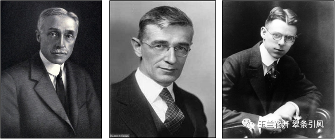

图16 老埃尔默·斯佩里（左）、万尼瓦尔·布什（中）和哈罗德·布莱克（右）

1925-1940年间，美国发明家、企业家老埃尔默·斯佩里（Elmer Sperry Sr.，1860~1930，图16左）和他创立的斯佩里陀螺仪公司（Sperry Gyroscope Company）研制出**人工伺服防空火炮控制器**（human servo anti-aircraft gun director）。如图17所示，该人工伺服机构控制的火炮由望远镜、高低角（上下方向）与方位角（水平方向）仪表盘、当前水平量程仪表盘、发射指挥官平台、方位角跟踪操作员座位、高低角操作员座椅等部分组成，工作时最少要有3名士兵，1名控制水平方位角，1名控制上下方向高低角，1名负责开炮[28]。

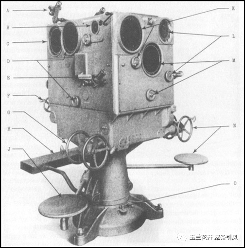

图17 斯佩里T-6 人工伺服防空火炮控制器（此图片来源于美国“哈格利博物馆和图书馆”（Hagley Museum and Library））。A.望远镜；B.上下方向仪表盘和手轮；C.水平方向仪表盘；D.超高仪表盘和手轮；E.方位跟踪望远镜；F.水平方向手轮；G.横向手轮（方位角跟踪）；H.发射指挥官平台。J.方位跟踪操作员座位；K.时间关闭指示灯和手轮；L.当前高度仪表盘和手轮；M.当前水平量程仪表盘和手轮；N.高程跟踪手轮和操作员座椅；O.定位夹具。

1927年8月2日，AT&T公司的贝尔实验室工程师哈罗德·布莱克（Harold Black，1898~1983，图16右）在上班途中的哈德逊河渡船上灵光一闪，想出了**负反馈放大器理论**（_Negative Feedback Ampl ifier_）。由于手头没有合适的纸张，他将其记在了一份纽约时报上，这份纽约时报已成为一件珍贵的文物珍藏在AT&T的档案馆中[29]（图18）。该理论提出了基于误差补偿的前馈放大器，并对其进行了数学分析，解决了电话自动转发装置的放大器失真问题，减少了贝尔系统的线路拥挤，通过载波电话扩展了长途网络。在第二次世界大战中它使精确的火控系统成为可能，构成了早期运算放大器以及精确的可变频率音频振荡器的基础[30]。由于负反馈放大器可能不稳定并发生振荡，因此，在奈奎斯特理论的帮助下，他在1934年发表了**《稳定的反馈放大器》**（_Stabilized Feedback Amplifiers_）[31]。哈罗德·布莱克在1957年获IEEE Lamme Medal，时任贝尔实验室总裁的默文·凯利（Mervin Kelly，1894~1971）给出的颁奖词为：负反馈放大器与三极管并列为过去50年里电子和通信领域最重要的两项发明。毫不夸张地说，没有布莱克的发明，就没有覆盖全国的长途电话、电视网络以及跨洋电话电缆。而且布莱克的负反馈相关原理并非只能应用于电信领域，若没有负反馈理论的支撑，众多的工业和军事领域问题都是无法解决的[29]。

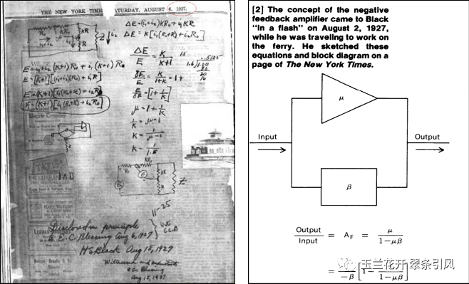

图18哈罗德·布莱克写在纽约时报上的负反馈放大器手稿（左）[32]及后期整理的手稿上的核心内容（右）[29]

1928年，美国过程控制专家克莱森·梅森（Clesson Mason，1893~1980）和韦伯斯特·弗莱莫耶（Webster Frymoyer，1899~1991）提出两项**气动过程控制器**专利申请（分别于1934和1931年授权）[33,34]。这两项专利均使用毛细管连接的膜片单元来改变挡板-喷嘴单元中的背压。随后，克莱森·梅森的专利被应用于某石油转炉系统中，然而由于反复屈曲导致隔膜单元不断发生压裂，不久该系统既被拆除。1930年，克莱森·梅森提交了另一项气动控制机构的专利申请[35]，该专利设计了一种**负反馈气动放大器**：作用到挡板喷嘴的先导阀出口信号以反馈信号的方式作用到控制阀上，成为控制阀的执行信号，解决了1928年申请专利在应用过程中出现的问题。克莱森·梅森的这一发明与哈罗德·布莱克的负反馈放大器[31]有着极大的相似之处，即他们均认为系统的闭环属性受反馈通路上的元件影响。1931年，1930年申请专利成为第一个具有宽带比例控制器的气动PI控制器，被福克斯波罗公司（Foxboro Co.）应用于“Foxboro Model 10 Stabilog”控制器中，取得了非常好的使用效果[36]。

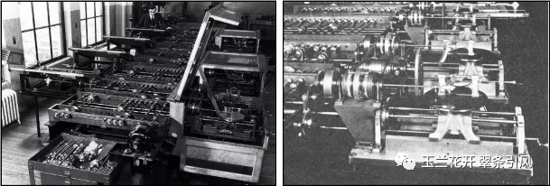

图19 第一台模拟计算机——微分分析仪（左）及其积分器（右）[37]

1932年，瑞典裔美国物理学家哈里·奈奎斯特（Harry Nyquist，1889~1976，图20左）发表关于反馈放大器稳定性的经典论文**《再生理论》**（_Regeneration Theory_）[38]，给出了用于判断动态系统稳定性的**奈奎斯特图法**，即**奈奎斯特稳定性判据**（Nyquist stability criterion）。“再生（Regeneration）”一词即为“反馈（Feedback）”的意思，哈里·奈奎斯特认为，对于闭环控制系统而言，反馈的存在使得系统可被不断再生或再造。奈奎斯特稳定性判据仅需根据系统的开环奈奎斯特图即可判断系统的闭环稳定性，避开了求解系统的闭环零极点，可用于多输入、多输出系统，例如飞机的控制系统。此外，该判据还是哈罗德·布莱克的稳定的反馈放大器（1934年）的理论支撑[31]。

1934年，麻省理工大学的哈罗德·哈森（Harold Hazen，1901~1980，图20中）发表伺服控制领域先驱性工作**《伺服机构理论》**（_Theory of Servomechanism_）[39, 40]，将伺服机构分为Hazen将伺服机构分为继电器式、定向和连续控制等三类，构建了可精确跟踪输入的机电伺服机构，使得雷达追踪系统具有了闭环控制功能，强化了巡航导弹的精准度。

1937年，英国数学家、计算机科学家、人工智能之父艾伦·图灵（Alan Turing，1912~1954，图20右）发表论文**《论可计算数及其在判定性问题上的应用》**（_On Computable Numbers, with an Application to the Entscheidungsproblem_）, 分两部分发表在伦敦数学学会会刊上[41, 42]，给出了现代计算机的原型——图灵机（Turing Machine）。图灵机由1个控制器、1条可无限延伸的带子和1个在带子上左右移动的读写头组成，可读入一系列的0和1，不仅可衡量可计算性，而且可用于衡量计算复杂性；图灵机不仅可以进行数值计算，也可以进行逻辑符号处理。图灵机的诞生为现代计算机逻辑工作方式奠定了基础，这篇论文更是被称为“史上最有影响力的数学论文”[43]。

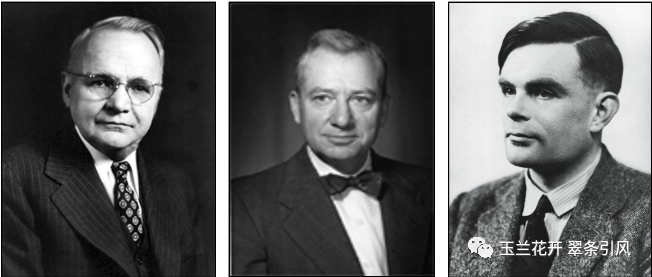

图20 哈里·奈奎斯特（左）、哈罗德·哈森（中）和艾伦·图灵（右）

1937年，美国数学家、信息论之父克劳德·香农（Claude Shannon，1916~2001，图21左）在他的硕士论文**《继电器与开关电路的符号分析》**（麻省理工学院，导师：万尼瓦尔·布什）（_A Symbolic Analysis of Relay and Switching Circuits_）[44]中提出继电器逻辑自动化理论，该硕士论文于1938年发表在美国电气工程师学会会刊上[45]。该文首提AND、OR和NOT逻辑门；把布尔代数的“真”与“假”和电路系统的“开”与“关”对应起来，并用1和0表示，利用电气开关的二进制特性来执行逻辑功能是数字电路的理论基础。该文的主要思想在二战期间和之后发挥了重要作用，成为实用数字电路设计的基础。多元智能理论提出者、发展心理学家霍华德·加纳德（Howard Gardner，1943~至今）评价：“这可能是本世纪最重要、最著名的硕士论文”[46]。除了继电器逻辑自动化理论，克劳德·香农还于1948年发表专著_A Mathematical Theory of Communication_[47, 48]，并于1949年更名为《通信的数字理论》（_The Mathematical Theory of Communication_）[49]，该文所述为通讯史上最杰出的理论之一，奠定了信息论的基础。

1938年，荷兰裔美国科学家、现代控制理论先驱亨德里克·波德（Hendrik Bode，1905~1982，图21中）在**《网络分析与反馈放大器设计》**（_Network Analysis and Feedback Amplifier Design_）[50]一文中给出控制系统设计与分析方法——**伯德图法**，该方法引入对数坐标系，不仅给出系统的频率响应，还可根据伯德图中的增益、裕度等进行稳定性分析。可以说，伯德图为一种快速且直观的系统设计和稳定性分析工具，在当时的背景下使频率特性的绘制工作更加适用于工程设计。伯德图法与前述的奈奎斯特图法并成为**频率响应分析法**。

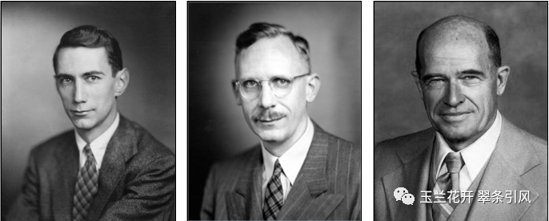

图21 克劳德·香农（左）、亨德里克·波德（中）和沃尔特·埃文斯（右）

创建于1940年的麻省理工学院的辐射实验室（MIT Radiation Laboratory）在二战期间做了大量微波和雷达方面的研究工作。1947年麻省理工学院出版了辐射实验室系列丛书，共28册，其中第25册名为**《伺服机构理论》**（_Theory of Servomechanisms_）[40]，主编分别为曾工作于该实验室的美国物理学家休伯特·詹姆斯（Hubert James，1908-1986，图22左）、控制工程师纳撒尼尔·尼柯尔斯（Nathaniel Nichols，1914~1997，图22中）和数学家拉尔夫·菲利普斯（Ralph Philips，1913~1998，图22右）。该册包括尼柯尔斯图表法（Nichols plot，将伯德幅值图和相位图进行合并，频率只是参数，不显示在尼柯尔斯图中）、拉尔夫·菲利普斯的伺服机构噪声分析（Noise in servomechanisms）、维纳的随机干扰方法（自相关、谱密度）、最小平方误差准则在控制回路设计中的应用、建模采样数据系统工具（沃尔特·胡列维茨（Witold Hurewicz，1904~1956）的z变换）等部分，涉及自动雷达跟踪、武器火力控制计算机、电力驱动伺服机构，这使得该册成为控制工程领域影响力和阅读量最大的书籍之一。

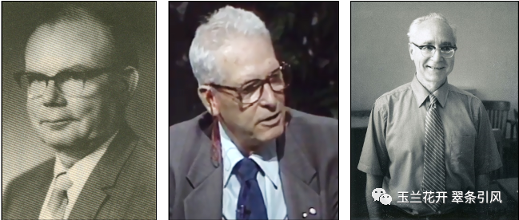

图22 休伯特·詹姆斯（左）、纳撒尼尔·尼柯尔斯（中）和亨德里克·菲利普斯（右）

1948年，美国控制理论家沃尔特·埃文斯（Walter Evans，1920~1999，图20右）发表论文**《控制系统的图形分析法》**（_Graphical Analysis of Control Systems_）提出图解法求闭环特征方程根的**根轨迹法**（Root locus method），完成了以单输入线性系统为对象的经典控制工作[51]。

1948年，美国应用数学家诺伯特·维纳（Norbert Wiener，1894~1964，图23左）出版对近代科学影响深远的著作**《控制论：关于在动物和机器中控制和通讯的科学》**（_Cyberneticsor Control and Communication in the Animal and the Machine_，图23中、右）[52]，开创了全新的交叉与边缘学科——控制科学，维纳也因此被誉为控制论创始人。反馈思想是控制论的核心，正如维纳所说：“Feedback is a method of controlling a system by inserting into it the result of its past performance”，即反馈是一种控制系统的方法，该方法将系统的输出作用于系统的输入。控制论横跨基础科学、技术科学和社会科学等学科，是适用于多学科与领域的科学思想和方法论。现代社会的许多新概念和新技术均与控制论有着密切联系，它与相对论、量子力学齐名，被称为20世纪最伟大的科学成就之一。

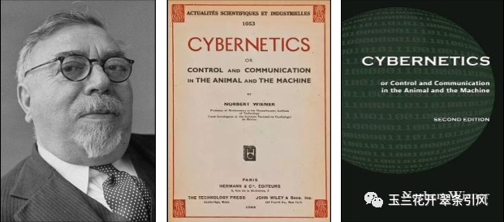

图23 诺伯特·维纳（左）和不同版本的《控制论》（中）（右）

美国实业家、发明家约翰·帕森斯（John Parsons，1913 ~ 2007，图24左）在上个世纪四十年代提出使用穿孔带的数控（Numerical Control）理念，即通过在长胶带上打孔来存储数字数据，然后由纸带阅读器读取打孔数据并转换为机器的执行指令，由此开创了机床的数控时代，约翰·帕森斯更被誉为“数控之父”，美国制造工程师学会给予他的颁奖词为（1975年）：“他对数控这项技术赋予的概念化标志着第二次工业革命的开始以及精密加工时代的到来”。1949年，约翰·帕森斯代表帕森斯公司与美国空军谈判并签订建造第一台数控铣床的合同，目的是为了生产直升机叶片和飞机蒙皮[53, 54]。1952年，根据与帕森斯公司的合同，时任MIT伺服机构实验室负责人的威廉·皮斯（William Pease，1920~2017，图24中）组织并参与设计了世界上**第一台实验性数控铣床**，它以纸带打孔作为数控指令，采用了磁带阅读器以及真空管电子控制系统。同年，MIT伺服机构实验室的数控小组推出可实现连续加工路径的数控铣床（图25）[55]。随后，由道格拉斯·罗斯（Douglas Ross，1929~2007，图24右）领导的计算机应用小组开发了易于数控机床使用的自动编程工具语言——APT（Automatically Programmed Tools），并成为数控机床编程语言的世界标准，这使得数控机床的发展如虎添翼[56]。值得一提的是，1958年，由清华大学和北京第八机床厂共同研制的我国第一台数控机床（也是亚洲第一台）X53K-1在清华航空馆诞生（图26左）。1960年，清华大学研发成功我国第一台数控铣床（图26右）。

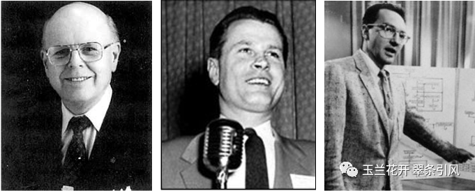

图24 约翰·帕森斯（左）、威廉·皮斯（中）和道格拉斯·罗斯（右）

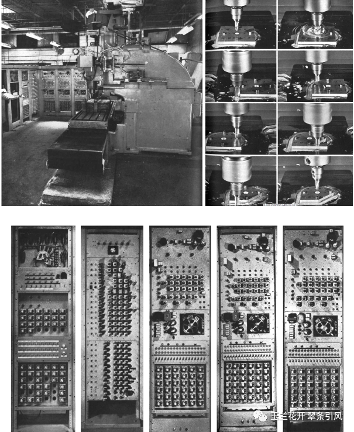

图25 第一台数控铣床（左上）、该机床的三坐标运动：刀具的垂直移动、刀具在工作台上的横向滑动以及工作台的左右移动（右上）和数控铣床上同时协调三轴运动的控制系统面板（下）[55]

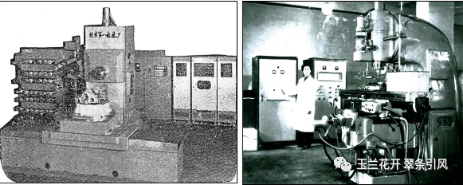

图26 我国第一台数控机床（左）与我国第一台数控铣床（右）（此图由清华大学提供）

1954年，空气动力学家、系统科学家钱学森先生（1911~2009，图27左）的工程控制论英文版**_Engineering Cybernetics_**[57]问世（图27中），首次提出在工程设计和实验中能够直接应用的关于受控工程系统的理论、概念和方法。该书先后有1956年的俄文版、1957年的德文版、1958年的中文版[58]（图27右）出版发行，其中中文版由当时就职于中国科学院自动化研究所的何善堉（1931~2002）与戴汝为（1932~至今）根据1955年钱学森先生在力学所讲授工程控制论的笔记以及英文原著，并吸收俄文版所添加的俄文文献整理而成。专著_Engineering Cybernetics_赋予**“工程控制论”**这门学科以新的含义，并很快为世界科学技术界所接受[59, 60]。

_ Engineering Cybernetics_前言中有如下一段话：这门新科学的一个非常突出的特点就是完全不考虑能量、热量和效率等因素，可是在其他各门自然科学中这些因素却是十分重要的。控制论所讨论的主要问题是一个系统的各个不同部分之间的相互作用的定性性质以及整个系统的综合行为[60]。

钱学森先生认为：工程控制论是一门为工程技术服务的理论科学，它的研究对象是自动控制和自动调节系统里的具有一般性的原则，所以它是一门基础学科，而不是一门工程技术。工程控制论并不单独研究声场过程自动化的理论，也不单独研究导弹的制导理论，它所研究的是具有一般化的理论。这种理论对生产过程自动化既然有用，对飞机的控制和稳定系统的设计也有用；只要是自动控制系统，只要是自动调节系统，他们的设计就得应用工程控制论[61]。

因此按照钱学森先生的定义，工程控制论的对象是研究控制论这门科学中能够直接应用到工程设计的那些部分。它是一门技术科学，其目的是把工程实践中所经常运用的设计原则和试验方法加以整理和总结，取其共性，并提高到科学理论的水平，使科学技术人员的眼界更加开阔，用更系统的方法去观察技术问题，从而充分理解和发挥这门新技术的潜在力量，指导千差万别的工程实践，推动系统工程的发展[59]。

关于诺伯特·维纳的“控制论”和钱学森的“工程控制论”两者之间的关系可以从以下角度进行理解：

1. _Engineering Cybernetics_是继_Cybernetics_一书出版后，以火箭为应用背景的自动控制方面的著作，书中充分体现并拓展了控制论的思想。诺伯特·维纳给出了一个对“控制论”进行了广博的虽然是完全非数学的描述。钱学森通过与控制导弹有关的问题的驱动，提出了可作更多数学解释的“工程控制论”[60]。

2. “控制论”是更广泛的一门学问，它不但是工程技术里自动控制和自动调节系统的理论，它也包含一切自然界的控制系统，像生物的控制系统。所以反过来说，“工程控制论”就是“控制论”里面对工程技术有用的那一部分，它是“控制论”的一个分支[61]。

3. “工程控制论”描述了“控制论”思想的数学和工程概念，将其分解为具体细化的科学概念以供工程应用；论证了一种新的系统设计原则的必要性，这些系统的属性和特征在很大程度上是未知的[62]。

钱学森先生的_Engineering Cybernetics_被公认为是自动控制领域的经典著作之一，50年来（截止2005年）也是该领域中引用率最高的文献之一，它的一些内容被纳入中外相关专业教科书；同时，中国科学家更是因此而成为推动控制论科学思想的重要代表人物[60]。

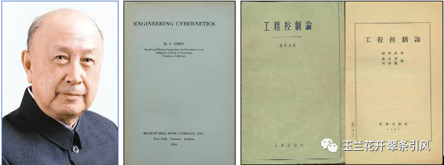

图27 钱学森（左）、1954版_Engineering Cybernetics_（中）和中文1958版《工程控制论》（右）

## 4. 现代控制（1950B.C.~至今）

现代控制（Modern Control）起源于上个世纪五十年代冷战时期的军备竞赛，如导弹、卫星、航天器、空间站和美国导弹防御计划星球大战星球大战（图28）。同时，日新月异的计算机技术使得模糊数学、分形几何、混沌理论、灰色理论、人工智能、神经网络、遗传算法等学科与控制理论交差融合，推动现代控制理论迅猛发展。

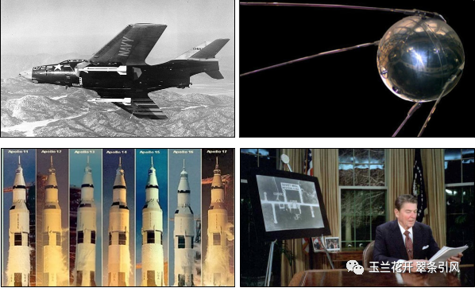

图28美国海军F-9F战斗机挂载AIM-9B“响尾蛇”空空导弹（左上，1956）；全球首颗人造卫星苏联 Sputnik I（右上，1957）；美国航天飞机Apollo 11-17（左下，1961-1972）；时任美国总统罗纳德·里根宣布星球大战（Star Wars Program）正式开始（右下，1983）。以上图片均来自维基百科。

1952-1954年，美国数学家理查德·贝尔曼（Richard Bellman，1920~1984，图29左）发表著名的数学优化方法：**动态规划**（_Dynamic Programming_）[63, 64]，即把复杂问题分解为子问题，通过组合子问题的解从而得到整个问题的解。动态规划的核心思想是通过拆分子问题来记住求过的解，减少重复计算，节省时间。希腊哲学家乔治·桑塔亚纳（George Santayana，1863~1952）说过这样一句话：忘记过去的人注定会重蹈覆辙。动态规划的核心思想与其在哲学角度上不谋而合。与动态规划相关联的两个重要方程分别是贝尔曼方程和汉密尔顿-雅克比-贝尔曼方程。前者是离散时间动态规划最优性的必要条件，被广泛应用于工程控制、应用数学、经济学等领域；后者是最优控制理论的核心，是贝尔曼方程在连续时间内的延伸。

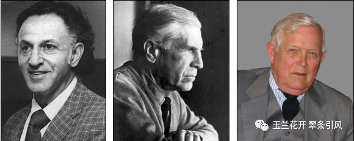

图29 理查德·贝尔曼（左）、列夫·庞特里亚金（中）和鲁道夫·卡尔曼（右）  

自1956年，苏联数学家列夫·庞特里亚金（Lev Pontryagin，1908-1988，图29中）领导的小组陆续发表关于最优控制的研究成果，即今称之为**极大值原理**（Maximum Principle）[65]，给出在最一般情况下最优控制的必要和部分充分条件。该原理为控制论学科的里程碑，与经典最小作用原理相洽，构造了从欧拉、拉格朗日、汉密尔顿的分析力学到维纳控制论之间的桥梁，将维纳的控制论归属到应用数学类，使得当时费尽心机解决各种自动控制问题的工程界豁然开朗，一大批工程技术问题变得迎刃而解，更被广泛应用于航空、经济、宇宙学、天体物理学中[66]。

1957年，世界上**第一颗人造地球卫星**——Sputnik I（图30）由苏联发射成功，重83.6公斤，直径0.58米，看起来如篮球般大小，内含两台无线电发射机、其主要用途就是将太空气象、宇宙线、陨石等资料送回地面。在轨工作22天，远地点896公里，近地点244公里，每90分钟绕地球一周[67]。Sputnik I的成功发射开启了人类航天时代。我国第一颗人造卫星——东方红一号（图31左）由“东方红”乐音装置、短波遥测、跟踪、天线、结构、热控、能源和姿态测量等组成，并于1970年4月24日由长征一号运载火箭（图31中、右）发射成功，其具体任务是测量卫星本体的工程参数探测空间环境参数奠定卫星轨道测量和遥测遥控的物质技术基础[68]。

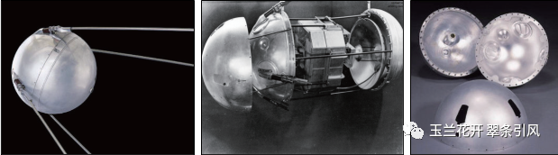

图30 世界上第一颗人造地球卫星Sputnik I的外形（左）、结构（中）、外壳（右）[69]

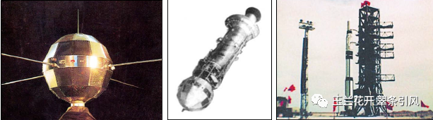

图31 我国第一颗人造地球卫星东方红一号（左）、发射东方红一号的长征一号末级火箭和东方一号卫星（中）、长征一号运载火箭矗立在发射架上（右）[70]

1959年，美国发明家乔治·德沃尔（George Devol，1912~2011，图32左）和企业家约瑟夫·恩格尔伯格（Joseph Engelberger，1925~2015，图32右）研制出世界首台**工业机器人**——尤尼梅特[71]（图33），英文为Unimate，词头取自universal（万能的、通用的），词尾取自animate（有活力的），因此Unimate意为万能自动。其外观像一个坦克的防空炮，重两吨，底座上面有一个大机械臂，手臂上又外伸一个可伸缩式和旋转的小机械臂，由液压执行机构驱动，能完成一些简单使用，例如替代人做一些抓放零件的工作中，工作精度可达0.254毫米。到1961年，Unimate在美国通用汽车公司安装运行，主要用于压铸处理、点焊以及从压铸机中取出热金属片并将它们堆叠起来[72-74]。

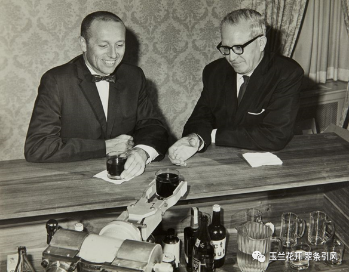

图32 约瑟夫·恩格尔伯格（左）、乔治·德沃尔（右）和机器人服务生[75]

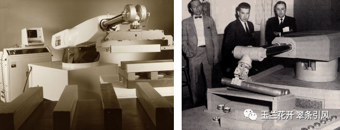

图33 世界首台工业机器人Unimate[76]

1960年，匈牙利裔美国数学家鲁道夫·卡尔曼（Rudolf Kalman，1930~2016，图29右）发表论文《论控制系统的一般性理论》（_On the general theory of control systems_）[77]，引入了可控性（controllability）、可观性（observability）等现代控制理论重要概念。同年，他将已有滤波器的研究成果拓展到状态空间，发表论文《线性滤波与预测问题的一种新方法》（_A new approach to linear filtering and prediction problems_），提出了著名的**卡尔曼滤波**（Kalman Filtering）[78]。卡尔曼滤波不要求信号和噪声都是平稳过程的假设条件，对于任意时刻的系统扰动和观测误差（即噪声），只要对它们的统计性质作适当假定，通过对含有噪声的观测信号进行处理，就能在平均的意义上求得误差为最小的真实信号的估计值。1961年，卡尔曼将离散情况下的滤波器扩展为连续情况，发表论文《线性滤波与预测理论的新结果》（_New results in linear filtering and prediction theory_）[79]，进一步完善了卡尔曼滤波理论。卡尔曼滤波是现代控制理论中应用最广泛的滤波方法，在自动驾驶、地震数据处理、过程控制、天气预报、计量经济、健康监测、计算机视觉、电机控制、定位与导航等领域均发挥着重要作用。

苏联于1958年启动载人航天计划，至1961年先后发射了5艘卫星式无人试验飞船，为载人飞船积累了大量经验。1961年4月12日，苏联**东方１号**飞船载着航天员尤里·加加林（Yuri Gagarin，1934~1968，图34左上）进入太空，绕地球一周后返回地面（图35）。东方号的主体部分由返回舱、夹紧支架、天线、喷射器舱口、气瓶、设备模组、弹射座椅、释放卡箍、末级火箭等组成（图34左下及右）。负责发射任务的东方号运载火箭由稳定翼、助推器、第一级火箭和末级火箭组成，最顶端为东方一号。随着东方一号绕地球一周的太空之旅圆满结束，标志着人类宇航时代的正式开启。2021年4月12日，国际航空联合会（FÉDÉRATION AÉRONAUTIQUE INTERNATIONALE，FAI）举行加加林历史性太空之旅60周年纪念活动，并给出此次飞行三项太空记录：飞行时间（108 分钟）、飞行最大高度（327公里）、飞行最大高度下的最大举升质量（4,725 千克）[80]。

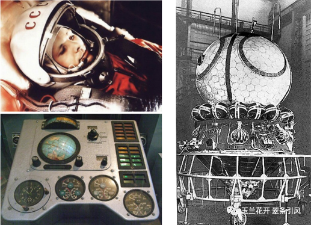

图34 尤里·加加林（左上）、东方一号控制面板（左下）和东方一号载人太空舱（右）（图片来自维基百科）

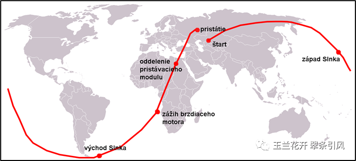

图35 东方一号完整轨迹（着陆点在发射点的西面）（图片来自维基百科）

1963年，美国自动控制专家拉特飞·扎德（Lotfi Zadeh，1921~2017，图36左）与计算机科学家查尔斯·德索尔（Charles Desoer，1926~2010，图36中）合作出版开创性著作**《线性系统理论：状态空间方法》**（_Linear System Theory: The State Space Approach_）[81,82，书中的状态空间逼近成为最优控制的标准工具，为现代系统分析和控制方法的重要理论基础。1965年，扎德发表论文**《模糊集》**（_Fuzzy Sets_）[83]，提出用语言变量代替数值变量来描述复杂系统行为，提供了一种处理不确定性问题的类人推理模式。扎德所开创的模糊集思想对多个学科领域和现实世界均有着重要的影响。

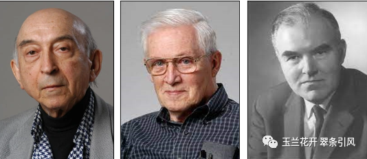

图36 拉特飞·扎德（左）、查尔斯·德索尔（中）和戴维·威廉森（右）

1946~1960年间，英国电子工程师戴维·威廉森（David Williamson，1923~1992，图36右）为莫林斯公司（Molins Machine Company）改进卷烟机性能。通过研究他发现对加工制造流程进行改进是提高生产效率的根本，这一理念就是能24小时不间断工作的自动化工厂原型。威廉森因此给出了计算机控制机床方案：莫林斯系统-24（Molins System-24）[84]。直到1967年，**莫林斯系统****-24**在英国正式发布，被公认为是柔性制造系统（Flexible Manufacturing System，FMS）的起源[85]。该系统由排列成一条直线的数控机床组成。机床旁是具有双侧面板的计算机自动存储和检索单元（AS/RS），用于存储托盘化的工具和组件。安装在 AS/RS 与机器相邻一侧的在线移动输送系统从 AS/RS 访问托盘，并用工具和组件装载或卸载机器。AS/RS另一侧的类似系统为坐在 AS/RS 旁边长凳上的托盘装载或卸载工人提供服务。这种集成控制的思想实现了生产加工效率的翻倍提高[86]。

美国于1961年5月开始组织实施载人登月工程，即阿波罗计划（Project Apollo或Apollo Program），至1972年12月结束，历时约11年，期间共发射17艘宇宙飞船，后7艘为载人登月飞行，其中6艘成功，共有12名宇航员登月。1969 年 7 月 20 日，**阿波罗****11号**指挥长尼尔·阿姆斯特朗（Neil Armstrong，1930~2012，图37左）和登月舱“鹰号”（图37右）驾驶员巴兹·奥尔德林（Buzz Aldrin，1930~至今，图37左）成为了首次踏上月球的人类（奥尔德林比阿姆斯特朗晚登月19分钟）[87]。在其它两位宇航员登月时，指挥舱“哥伦比亚号”驾驶员迈克尔·柯林斯（Michael Collins，1930~2021，图37左）负责驾驶飞船独自绕月30圈，并为其它两位宇航员返回做准备。柯林斯从来没觉得自己没有成为第一个登月的人而懊恼，相反，他觉得自己是这个使命的一部分。他在自传中写道：“这次冒险是为三个人设计的，我认为我与其他两个人一样重要”。在指挥舱哥伦比亚号每次绕过月球背面时，柯林斯均会与地球失去无线电联系48 分钟。在这30个48分钟里，他报告的感觉不是恐惧或孤独，而是“意志、期待、满足、自信、快乐” [88]。1969年7 月24日，阿波罗11号带着三名宇航员，安全降落在地球上。除成功登月外，阿波罗计划还促进了与火箭和载人航天相关的许多技术领域的进步，包括航空电子设备、电信和计算机。

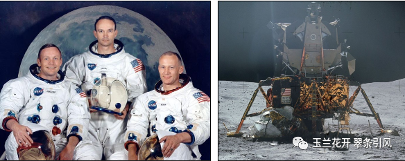

图37 由左至右分别为指挥长尼尔·阿姆斯特朗、指挥舱“哥伦比亚号”驾驶员迈克尔·科林斯、登月舱驾驶员巴兹·奥尔德林（左）和阿波罗11号登月舱“鹰号”全貌（右）（图片来自维基百科）

1967年，美国高等研究计划署（Advanced Research Projects Agency，ARPA）的电气工程师劳伦斯·罗伯茨（Lawrence Roberts，1937~2018，图38左）着手筹建“分布式网络”，提出阿帕网（Advanced Research Projects Agency Net work，ARPAnet）构想。罗伯茨绘制了数以百计的网络连接设计图，以实现各节点上电脑的互相连接[89]。1969年，互联网前身**阿帕网**在美国建成，最初由4个节点构成，随后迅速扩展为1971 年的23 台主机、1974 的年62 台主机、1977 年的111台主机[90]。劳伦斯·罗伯茨被后人称为阿帕网之父。阿帕网使用网络控制协议（Network Control Protocol，NCP）仅能用于同构环境中（网络上的所有计算机都运行相同的操作系统），不能充分支持阿帕网。1973年，工程师文顿·瑟夫（Vinton Cerf，1943~至今，图38右）和罗伯特·卡恩（Robert Kahn，1938~至今，图38右）开发出了用于异构网络环境的**TCP协议和IP协议**，可在各种硬件和操作系统上实现互操作[91]。这两个协议成为互联网核心通信协议的基础，意味着互联网世界有了统一的“语言”。

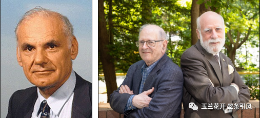

图38 劳伦斯·罗伯茨（左）、文顿·瑟夫和罗伯特·卡恩（右）

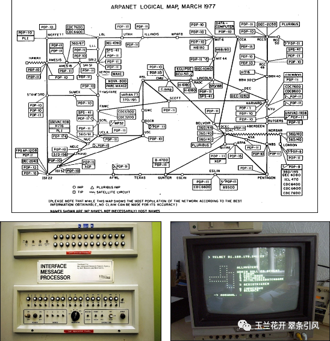

图39 阿帕网逻辑图（上，1977）、路由器（左下，1969）和操作界面（右下，1988）（图片来自维基百科）

1970年，英国控制领域专家霍华德·罗森布罗克（Howard Rosenbrock，1920~2010，图40左）出版著作《状态空间和多变量理论》（_State Space and Multivariable Theory_）[92]，提出多变量频域控制设计方法。1974年，加拿大控制理论专家沃尔特·温纳姆（Walter Wonham，1934~至今，图40右）出版著作《线性多变量控制：一种几何方法》（_Linear Multivariable Control: A Geometric Approach_）[93]，提出线性时不变系统多变量几何控制理论。上述两篇著作解决了**多输入多输出控制系统的分析与建模**问题。

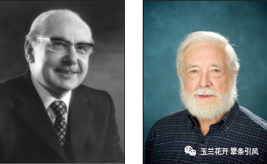

图40 霍华德·罗森布罗克（左）和沃尔特·温纳姆（右）

1973年，两位瑞典控制理论家卡尔·奥斯特朗姆（Karl Åström，1934~至今，图41左）和比约恩·威顿马克（Björn Wittenmelrk，1940~至今，图41右）合著《论自整定调节器》（_On self-tuning regulators_）[94]，全面给出实时参数估计、模型参考自适应系统、自校正调节器、随机自适应控制等自适应控制理论、设计及应用[95]，以他们名字命名的**Astrom-Wittenmark自整定调节器**，广泛应用在工业过程控制中，在自适应控制领域占有一席之地[96, 97]。

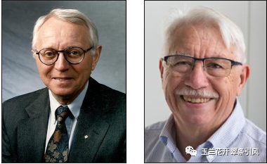

图41 卡尔·奥斯特朗姆（左）和比约恩·威顿马克（右）

1974年，美国约瑟夫·哈林顿博士（Joseph Harrington，？？）在他的著作《计算机集成制造》（_Computer Integrated Manufacturing_）[98]一书中提出计算机集成制造（CIM）这一概念，其内涵是借助计算机将企业中各种与制造有关的技术系统集成起来，由计算机支持制造过程，强调在系统观点和信息观点下组织和管理企业生产。

图42 CIM涉及计算机辅助设计（CAD）、计算机辅助制造（CAM）以及其他业务操作和数据库的全面集成（图片来自维基百科）

1976年，美国控制理论家罗杰·布罗克特（Roger Brockett，1938~至今，图43左）发表论文**《非线性系统与微分几何》**（_Nonlinear systems and differential geometry_）[99]，提出分析和求解非线性系统的微分几何法；1981年，波兰裔加拿大控制理论家乔治·詹姆斯（George Zames，1934~1997，图43中）发表论文《反馈和最佳灵敏度控制》（_Feedback and optimal sensitivity: Model reference transformations, multiplicative seminorms, and approximate inverses_）[100]，提出**最佳灵敏度鲁棒控制方法**；1985年，意大利控制理论家阿尔贝托·伊西多尔（Alberto Isidori，1942~至今，图43右）出版**《非线性控制系统导论》**（_Nonlinear control systems: an introduction_）[101]，该书为非线性控制领域被引用最多的参考资料之一。

图43罗杰·布罗克特（左）、乔治·詹姆斯（中）和阿尔贝托·伊西多尔（右）

1977年9月5日12:56，美国NASA成功发射太空探测器**旅行者****1号**（Voyager1），旨在研究太阳系外和太阳日球层以外的星际空间。旅行者1号由美国喷气推进实验室（Jet Propulsion Laboratory，JPL）建造，其姿态和关节控制子系统（Attitude and Articulation Control Subsystem，AACS）主要由三轴稳定陀螺仪、16 台联氨推进器、8台备用推进器、若干仪器及其冗余单元等组成。此外旅行者1号还携带了用于研究行星等天体在太空中的运行情况的11 台其它科学仪器[102]以及一张镀金视听光盘，其上刻录着不同文化和时代的声音、图片与视频（图44右）。2012年8月25日，旅行者1号成为第一个穿越太阳圈并进入星际介质的宇宙飞船，因此也是第一个离开太阳系的人造飞行器[103-105]。截至2023年2月15日，旅行者1号已运行了45年5个月零9天，距离地球159.37天文单位（238.41亿公里），它是有史以来距离地球最远的人造飞行器，并且仍然与NASA深空网络通信以接收常规命令并将数据传输到地球。目前，旅行者1号沿双曲线轨道飞行，已达第三宇宙速度，意味着它的轨道再也不能引导航天器飞返太阳系，它已然成为了一艘星际航天器（图44左）。科学家们认为它将在300年后到达奥尔特云的内缘[106]。

图44 2012年8月25日旅行者1号进入星际空间，越过日顶，这是人造物体首次跨越星际空间的门槛（左）[107]和旅行者1号携带了来自不同文化和时代的音乐精选，意为用55种语言表达地球人的问候（右）[108]。

** 哥伦比亚号航天飞机**（Orbiter Vehicle-102，简称OV-102）是美国太空梭机队中第一架正式服役的航天飞机（第一架进入太空的轨道飞行器），用于在太空和地面之间往返运送宇航员和设备。1981年4月12日，哥伦比亚号航天飞机首次发射成功（图45左下），正式开启了NASA的太空运输系统计划（Space Transportation System program，STS）之序章。哥伦比亚号的外形象一架大型三角翼飞机（图45上、右下），安装了主发动机的哥伦比亚号重178000 磅（约80吨），是美国宇航局最重的飞行器。在1981~2002年期间，哥伦比亚号共进行了28次太空飞行任务，战绩显赫，包括太空实验室（Spacelab）的首次飞行、将X射线天文台（Chandra X-ray Observatory）送入太空等事件[109]，也包括最后一次的任务失败，它承载了经验和教训并重的航天科技历史，它更是人类探索太空、了解宇宙的一座丰碑。

图45 1994年3月18日着落在肯尼迪机场的哥伦比亚号（上）、哥伦比亚号于 1981 年 4 月 12日首次从肯尼迪航天中心升空（左下）和1980年底，哥伦比亚号从肯尼迪航天中心的车辆装配大楼的地板上吊起（右下） [109]（图片来自NASA）

1997年7月4日，美国航天器**火星探路者**（Mars environmental survey Pathfinder，简称MESUR Pathfinder）将**火星车旅居者**（Sojourner，图46左上）带上火星并实现软着陆。旅居者是第一辆在地月系统以外行星上航行的轮式车辆（六轮：为穿越崎岖不平的火星表面提供了极大的稳定性和越障能力），重10.6千克，长宽高分别为0.65米、0.48米和0.30米，折叠后高度仅为0.18米，最大行驶速度0.01米/秒，最高攀爬高度为0.2米，主要由四面体形主体结构、3个太阳能花瓣型电池板（0.25平方米）、着陆器支撑装置、成像系统、各类传感器及用于维持通信的其他相关仪器设备组成。旅居者在火星上运行了83个火星日（相当于85个地球日），共行驶了大约100米，累计向地球发送了550张图片，分析了火星上16个位置点的化学性质，后因电池耗尽而失联。探路者累计向地球发送了16500张图片，并对火星的大气压力、温度、风速等进行了850万次测量[110, 111]。

图46 火星上的旅居者（左上）、1996年10月探路者和旅居者被“折叠”到其发射位置（右上）、三个太阳能花瓣型电池板打开后旅居者在探路者上的位置（篮圈内）（左下）和探路者拍到的火星日落（右下）（图片来自NASA）

1992年9月，**中国确定了载人航天“三步走”的发展战略**，如表2所示。第一步，发射载人飞船，建成初步配套的试验性载人飞船工程，开展空间应用实验；第二步，突破航天员出舱活动技术、空间飞行器交会对接技术，发射空间实验室，解决有一定规模的、短期有人照料的空间应用问题；第三步，建造空间站，解决有较大规模的、长期有人照料的空间应用问题。

工程前期通过实施四次无人飞行任务，以及神舟五号、神舟六号载人飞行任务，突破和掌握了载人天地往返技术，使我国成为第三个具有独立开展载人航天活动能力的国家，实现了工程第一步任务目标。通过实施神舟七号飞行任务，以及天宫一号与神舟八号、神舟九号、神舟十号交会对接任务，突破和掌握了航天员出舱活动技术和空间交会对接技术，建成我国首个试验性空间实验室，标志着工程第二步第一阶段任务全面完成。

2010年，中央批准载人空间站工程立项，分为空间实验室任务和空间站任务两个阶段实施。空间实验室阶段主要任务是：突破和掌握货物运输、航天员中长期驻留、推进剂补加、地面长时间任务支持和保障等技术，开展空间科学实验与技术试验，为空间站建造和运营奠定基础、积累经验。通过实施长征七号首飞任务，以及天宫二号与神舟十一号、天舟一号交会对接等任务，工程第二步任务目标全部完成。

空间站阶段的主要任务是：建成和运营我国近地载人空间站，掌握近地空间长期载人飞行技术，具备长期开展近地空间有人参与科学实验、技术试验和综合开发利用太空资源能力。神州14号为我国空间站进入建造阶段的首发载人飞船、神州15表明我国空间站关键技术验证和建造阶段规划的12次发射任务全部圆满完成。2022年，中国载人航天已全面迈入空间站时代[112]。

表2 中国航天30年（1992~2022）[112, 113]

## 5. 结语

该文对控制理论发展的四个典型阶段进行了的梳理，选取了每个阶段的典型科学事件、著作名篇、代表人物等，给出全面详实且图文并茂的控制理论发展简史，同时以百余篇参考文献的方式提供控制领域经典名作及可考有据网络资源。谨以此篇综述献给所有投身控制类课程教学的同行们和热爱控制类课程学习的学生们。

## 参考文献

1. Der Trick dahinter. Automaten, die mit Wasserdampf und raffinierter Mechanik arbeiteten. 2009年9月4日，https://www.spiegel.de/fotostrecke/antike-automaten-aeolsball-orgel-und-wasseruhr-fotostrecke-41428.html（原文为德文）
2. 中国古代惊艳世界的水利工程/全球最著名的水利工程：中国这个第一无可争议，搜狐网，2017年10月13日，https://www.sohu.com/a/197782632_698856
3. Deniz DEMİRARSLAN. GEÇMİŞTEN GELECEĞE DOĞRU BİR GEÇİŞ: KAPILAR（从过去到未来：门的演变史）[J], Journal of Social and Humanities Sciences Research (JSHSR), 2020,Vol7(53), 1219-1243.（原文为土耳其语）
4. 王玉民. "浑天仪"考[J]. 中国科技术语, 2015, 17(3):39-42.
5. 张柏春, 张久春. 水运仪象台复原之路:一项技术发明的辨识[J]. 自然辩证法通讯, 2019(4): 43-51.
6. 邓学忠, 姚明万. 中国古代指南车和记里鼓车[J]. 中国计量, 2009(08):54-56, 60.
7. 邓学忠, 姚明万. 中国古代指南车和记里鼓车(续)[J]. 中国计量, 2009(9):54-56.
8. Florian Ion Tiberiu Petrescu. Contributions to the Stirling Engine Study[J], American Journal of Engineering and Applied Sciences, 2018, 11(4): 1258-1292.
9. Florian Ion Petrescu and Relly Victoria Petrescu, 2012a. The Aviation History[M]. Publisher: Books On Demand, ISBN-13: 978-3848230778.
10. https://upload.wikimedia.org/wikipedia/commons/f/f0/Statue_Of_Fine_Art_%26_Science_Holborn_Viaduct.jpg
11. 蔡臻. 清朝著名科学家：徐寿, 2022年10月, 上海档案信息网: https://www.archives.sh.cn/datd/hsrw/202210/t20221014_67815.html
12. 何国卫. 比西方早一千年的中国车轮舟[J]. 中国船检, 2018(12):107-111.
13. 徐泓. 徐寿与中国造船[J]. 航海, 2011(3):41.
14. 袁野. 徐寿:中国近代科技第一人[J]. 同舟共进, 2022(1):34-37.
15. Stuart Bennett. A History of control engineering, 1800-1930[M]. Peter peregrinus Ltd., London, UK, 1986, pp. 98-99.
16. James Clerk Maxwell. On governors[J], Proceedings of the Royal Society of London, 1868, 10,V16(16), 270-283.[17] Kang, Chul-Goo. Origin of Stability Analysis:"On Governors" by J.C. Maxwell [Historical Perspectives] [J]. IEEE Control Systems Magazine, 2016, 36 (5): 77-88.
18. Ivan Vyshnegradsky. Sur la theorie generale des regulateurs (On the general theory of control) [J], Comptes Rendus de l'Académie des Sciences de Paris, 1876, Vol. 83, p.318-320.
19. 陈关荣. 麦克斯韦与控制论及系统稳定性[J]. 系统与控制纵横, 2019, Vol.6(1): 30-34.
20. Edward Routh. A Treatise on the Stability of a Given State of Motion[M], Adams Prize Essay, University of Cambridge, England, 1877.
21. Adolf Hurwitz. Ueber die Bedingungen, unter welchen eine Gleichung nur Wurzeln mit negativen reellen Theilen besitzt [J].Mathematische Annalen, 1895, 46(2): 273-284.
22. Alexander Lyapunov. A general task about the stability of motion[D]. Kharkov Mathematical Society, University of Kharkov, Russian, 1892.
23. 黄琳, 于年才, 王龙. 李亚普诺夫方法的发展与历史性成就[J]. 自动化学报, 1993, 19(5): 587-595.
24. 王丽萍. 流水线:世界经济助推器[J]. 理财：市场版, 2009(10):41-42.
25. History.com Editors, Ford’s assembly line starts rolling, HISTORY, A&E Television Networks, 2009, https://www.history.com/this-day-in-history/fords-assembly-line-starts-rolling
26. The staff at The Henry Ford. Henry Ford: Assembly Line, 2013, https://www.thehenryford.org/collections-and-research/digital-collections/expert-sets/7139/
27. Nicholas Minorsky. Directional Stability of Automatically Steered Bodies [J]. Naval Engineers Journal, 2010, 34(2):280-309.
28. David A. Mindell. Anti-Aircraft Fire Control and the Development of Integrated Systems at Sperry, 19251940[J], Control Systems Magazine, IEEE, 1995, 108-113.
29. Harold Black. Inventing the negative feedback amplifier[J]. IEEE Spectrum, 1977, 14(12):55-60.
30. Ronald Kline. Harold Black and the negative-feedback amplifier[J], IEEE Control Systems Magazine, 1993, Vol.13(4): 82-85.
31. Harold Black. Stabilized Feedback Amplifiers[J]. Bell System Technical Journal, 1934, 13(1): 1-18.
32. Massimo Guarnieri.Negative Feedback, Amplifiers, Governors, and More [Historical][J]. IEEE Industrial Electronics Magazine, 2017, Vol.11: 50-52.
33. Clesson Mason (1934).Control Mechanism, US Patent 1,950,989, filed Aug. 14, 1928.
34. Webster Frymoyer (1931). Control Mechanism, US Patent 1,799,131, filed Aug. 14,1928.
35. Mason, C. E. (1933). Control Mechanism, US Patent 1,897,135, filed Sept. 15, 1930
36. Stuart Bennett. The Past of PID Controllers, IFAC Proceedings Volumes[C], 2000, Vol.33(4): 1-11.
37. Vannevar Bush. The differential analyzer. A new machine for solving differential equations[J]. Journal of the Franklin Institute, 1931, 212(4):447-488.
38. Harry Nyquist. Regeneration Theory [J]. Bell System Technical Journal, 1932, 11(1): 126-147.
39. Harold Hazen. Theory of Servo-mechanisms[J]. Journal of the Franklin Institute, 1934, 218: 279-331.
40. Hubert James, Nathaniel Nichols, Ralph Phillips. Theory of Servo-mechanisms[M]. McGraw-Hill Book Company, INC., 1947.
41. Alan Turing. On computable numbers, with an application to the Entscheidungsproblem[J]. Proceedings of the London Mathematical Society, 1937, s2-42: 230–265.
42. Alan Turing. On Computable Numbers, with an Application to the Entscheidungsproblem[J]. A Correction. Proceedings of the London Mathematical Society, 1938, s2-43: 544-546.
43. Avi Wigderson. Mathematics and Computation, A Theory Revolutionizing Technology and Science[M]. Princeton University Press, 2019.
44. Claude Shannon. A Symbolic Analysis of Relay and Switching Circuits[D]. 1937, MIT.
45. Claude Shannon. A Symbolic Analysis of Relay and Switching Circuits[J]. Transactions of the American Institute of Electrical Engineers, 1938, Vol.57(12): 471-495.
46.  Howard Gardner. The Mind's New Science: A History of the Cognitive Revolution. Basic Books,1987. p. 144. ISBN 0-465-04635-5.
47. Claude Shannon.A Mathematical Theory of Communication[J]. The Bell System Technical Journal. 1948, Vol. 27(3): 379–423.
48. Claude Shannon.A Mathematical Theory of Communication[J]. The Bell System Technical Journal. 1948, Vol. 27(4): 623–656.
49. Claude Shannon.The Mathematical Theory of Communication[M]. University of Illinois Press. 1949.
50. Hendrik Bode. Network analysis and feedback amplifier design[M]. D.VAN Nostrand Company, INC., 1945.
51. Walter Evans. Graphical Analysis of Control Systems[J]. Transactions of the American Institute of Electrical Engineers, 1948, 67(1): 547–551.
52. Norbert Wiener. Cybernetics. MIT Press, 1948.
53. Francis Reintjes. Numerical Control: Making a New Technology[M], Oxford University Press, 1991.
54. Karl Wildes. A Century of Electrical Engineering and Computer Science at MIT, 1882-1982. MIT Press, 1985. Chapter 14.
55. William Pease. An automatic machine tool[J]. Scientific American, 1952, 187(3): 101-115.
56. Douglas Ross. Origins of the APT language for automatically programmed tools[J]. ACM SIGPLAN Notices, 1978, 13(8): 61-99.
57. Tsien, H.S.Engineering Cybernetics[M], McGraw Hill, 1954.
58. 钱学森.《工程控制论》[M]. 科学出版社, 1958年.
59. 宋健.工程控制论[J]. 系统工程理论与实践, 1985(02): 1-4.
60. 戴汝为.从工程控制论到综合集成研讨厅体系——纪念钱学森先生归国50周年[J].自然杂志, 2005(06): 366-370.
61. 钱学森.工程控制论[J]. 科学大众, 1957(05): 219-221.
62. Gao, Z. Engineering cybernetics: 60 years in the making[J]. Control Theory and Technology, 2014, 12, 97-109.
63. Richard Bellman. On the theory of dynamic programming[J]. Proceedings of the national Academy of Sciences, 1952, 38(8): 716-719.
64. Richard Bellman. The theory of dynamic programming[J]. Bulletin of the American Mathematical Society, 1954, 60(6): 503-515.
65. Lev Pontryagin, Vladimir Boltyanskii, Revaz Gamkrelidze, and Evgenii Mishchenko. The mathematical theory of optimal processes. Interscience Publishers, John Wiley & Sons Inc., New York - London, 1962.
66. 宋牮.瞽神庞特里亚金[J], 系统与控制纵横，2015(01): 5-10.
67. 主编随笔.航天时代的来临——记苏联第一颗人造地球卫星发射50周年[J]. 哈尔滨工业大学学报(社会科学版), 2007, No.40(05): 161.
68. 陆绶观.中国科学院与中国第一颗人造地球卫星[J].中国科学院院刊, 1999(06):433-440.
69. 齐真.世界第一颗人造地球卫星成功发射60周年[J].国际太空, 2017, No.465(09): 40-41.
70. 李颐黎.“上得去,转起来”——回顾长征一号运载火箭研制的一些往事[J]. 太空探索, 2010, No.244(10): 52-55.
71. George Devol. Programmable Article Transfer[P], US Patent 2988237, June 13, 1961. UD Patent Office, Washington, DC.
72. Paul Mickle. A peep into the automated future[J]. The capital century 1900–1999. http://www.capitalcentury.com/1961. html, 1961.
73. Wallén, Johanna. The history of the industrial robot. Linköping University Electronic Press, 2008.
74. Alessandro Gasparetto, Lorenzo Scalera. A brief history of industrial robotics in the 20th century. Advances in Historical Studies 8.1 (2019): 24-35.
75. https://spectrum.ieee.org/unimation-robot
76. https://spectrum.ieee.org/george-devol-a-life-devoted-to-invention-and-robots
77. Rudolf Kalman. On the general theory of control systems[C], Proceedings First International Conference on Automatic Control, Moscow, USSR. 1960: 481-492.
78. Rudolf Kalman. A new approach to linear filtering and prediction problems[J]. Transactions of the ASME–Journal of Basic Engineering, 1960, 82 (Series D): 35-45.
79. Rudolf Kalman, Bucy Richard. New results in linear filtering and prediction theory[J]. Transactions of the ASME–Journal of Basic Engineering, 1961, 83: 95-108.
80. 'Let's go!' – FAI celebrates 60th Anniversary of Gagarin's space flight. Fédération Aéronautique Internationale. March 22, 2021. Retrieved July 18, 2022.
（https://www.fai.org/news/60th-anniversary-gagarin-space-flight）
81. Lotfi Zadeh, Charles Desoer. Linear system theory: the state space approach. Courier Dover Publications, 2008.
82. Lotfi Zadeh, Charles Desoer. Linear system theory: the state space approach. Proceedings of the IEEE, 1964, 1282-1283.
83. Lotfi Zadeh. Fuzzy sets. Information and control 8.3 (1965): 338-353.
84. David Williamson. AUTOMATED MACHINE INSTALLATION AND METHOD[P], US Patent 4621410, Nov. 13, 1986. UD Patent Office, Washington, DC.
85. KatsundoHitomi. Automation — its concept and a short history[J], Technovation, 1994, Vol. 14(2): 121-128.
86. Hannam RG.Alternatives in the Design of Flexible Manufacturing Systems for Prismatic Parts. Proceedings of the Institution of Mechanical Engineers, Part B: Management and engineering manufacture. 1985, 199(2):111-119.
87. Apollo Program Summary Report, Apollo Lunar Surface Journal, NASA Johnson Report JSC-09423, April 1975.
88. Michael Collins. Carrying the Fire: An Astronaut's Journeys. 1974, New York: Cooper Square Press. 
89. Lawrence Roberts. Multiple computer networks and intercomputer communication[C], Proceedings of the first ACM symposium on Operating System Principles. 1967: 3.1-3.6.
90. Lawrence Roberts. The evolution of packet switching[J]. Proceedings of the IEEE, 1978, 66(11): 1307-1313.
91. Vinton Cerf, Robert Kahn. A protocol for packet network intercommunication[J]. IEEE Transactions on communications, 1974, 22(5): 637-648.
92. Howard Rosenbrock. State-space and multivariable theory[M]. Nelson-Wiley, London, 1970.
93. Walter Wonham. Linear Multivariable Control: A Geometric Approach[M]. Springer, New York, 1974.
94. Karl Åström, Björn Wittenmelrk. On Self Tuning Regulators[J]. Automatica, Vol. 9: 185-199. Pergamon Press, 1973. Printed in Great Britain.
95. Karl Åström, Björn Wittenmelrk. Adaptive control[M]. Courier Corporation, 2013.
96. Thomas Harris, Theory and Application of Self-Tuning Regulators[D], Mcmaster University, Canada, 1977.
97. Karl Åström, , Borisson U, Ljung L, Björn Wittenmelrk. Theory and applications of self-tuning regulators[J]. Automatica, 1977, 13(5): 457-476.
98. Joseph Harrington. Computer Integrated Manufacturing[M]. New York: Springer Publishing, 1973.
99. Roger Brockett. Nonlinear systems and differential geometry[J]. Proceedings of the IEEE, 1976, 64(1): 61-72.
100. George Zames. Feedback and optimal sensitivity: Model reference transformations, multiplicative seminorms, and approximate inverses[J]. IEEE Transactions on automatic control, 1981, 26(2): 301-320.
101. Alberto Isidori. Nonlinear control systems: an introduction[M]. Berlin, Heidelberg: Springer Berlin Heidelberg, 1985.
102. https://voyager.jpl.nasa.gov/mission/spacecraft/
103. Barnes, Brooks. In a Breathtaking First, NASA Craft Exits the Solar System. New York Times. Retrieved, September 12, 2013.
104. Ron Cowen. Voyager 1 has reached interstellar space. Nature, 2013, 9: 1-2.
105. D. A. GURNETT, W. S KURTH, L. F. BURLAGA, AND N. F. NESS. In Situ Observations of Interstellar Plasma with Voyager 1,SCIENCE, 2013, Vol.341(6153):1489-1492.
106. Jia-RuiCook. How Do We Know When Voyager Reaches Interstellar Space?  NASA / Jet Propulsion Lab. Retrieved September 15, 2013.
107. https://voyager.jpl.nasa.gov/news/details.php?article_id=32
108. https://voyager.jpl.nasa.gov/golden-record/golden-record-cover/
109. https://www.nasa.gov/centers/kennedy/shuttleoperations/orbiters/columbia_info.html
110. https://mars.nasa.gov/internal_resources/815/
111. https://mars.nasa.gov/MPF/ops/sol86.html
112. http://www.cmse.gov.cn/gygc/gcjj/
113. http://www.cmse.gov.cn/fxrw

