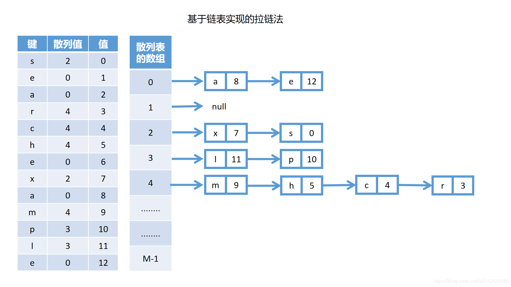
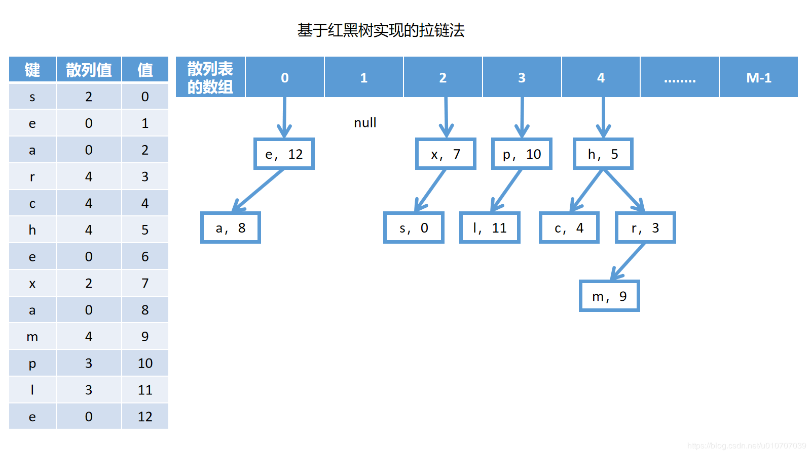
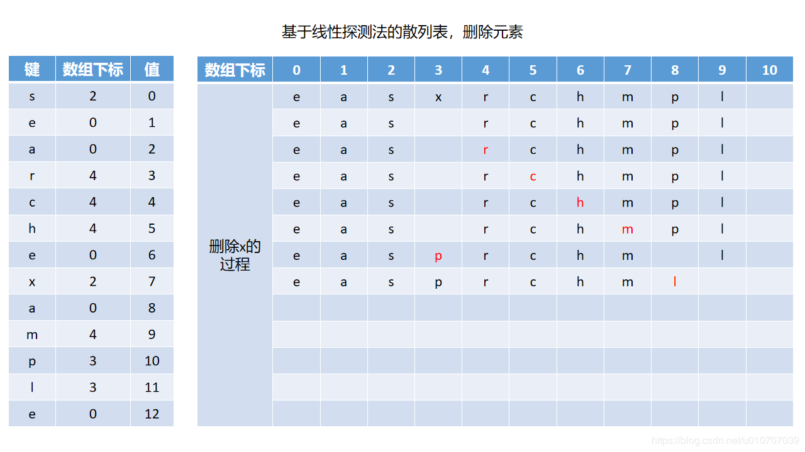
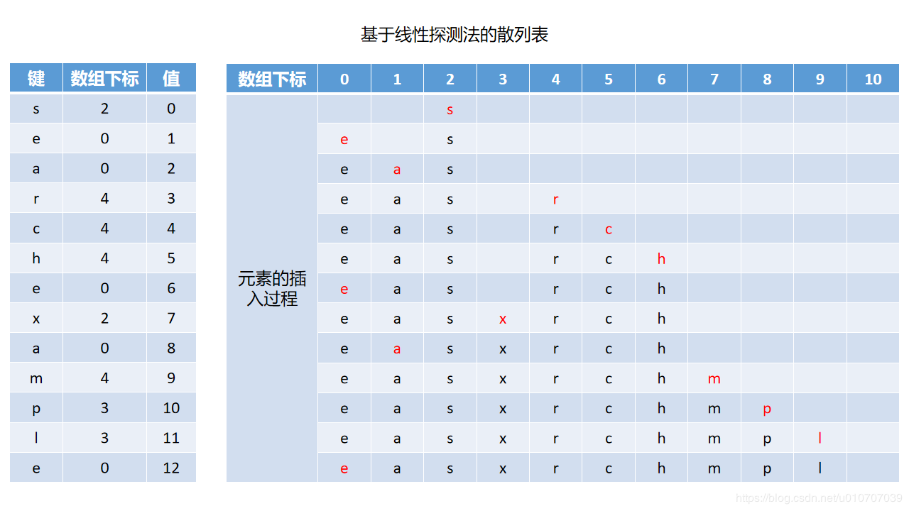
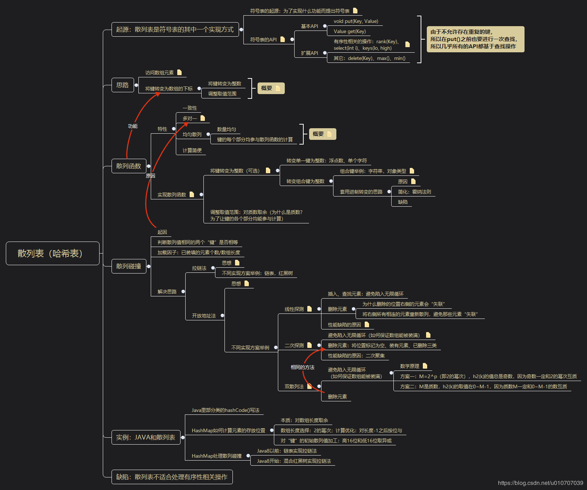

 
<!--BEGIN_DATA
{
    "create_date": "2020-05-23 13:28", 
    "modify_date": "2020-05-23 13:28", 
    "is_top": "0", 
    "summary": "散列表：从原理到Java实例", 
    "tags": "算法、数据结构、Java", 
    "file_name": "散列表：从原理到Java实例.md"
}
END_DATA-->

####
原文出处：<a href='https://blog.csdn.net/u010707039/article/details/106078480' target='blank'>散列表：从原理到Java实例</a>

###起源：符号表

学习散列表之前，我们先来了解一下散列表是什么，它有什么用。散列表是符号表的其中一个实现方式（其它的实现方式有例如红黑树），那么首先就要了解符号表是什么，它又有什么用，符号表用于实现如下功能：  
需要将两个元素进行关联存储（两个元素分别称为“键”和“值”），并且需要根据“键”获取对应“值”。

举几个例子来说明一下，例如投票，我们会记录候选人（或者候选项）的名字及其对应的票数，每读取一张选票，就找到选票上写的候选人的名字，将他的得票数加一，投票结束，我们会公布得票数最高的候选人，或者公布所有候选人的得票数。在这个例子里面，候选人的名字就是“键”，得票数就是“值”，名字和的票数需要进行关联存储。在读取选票的时候，需要查找并更新对应候选人的得票数，这就是根据“键”获取对应“值”。

再例如英汉字典，每个英语单词都有对应的汉语释义，在“建立”字典的时候，我们会将英语单词及其对应的汉语释义放在一起。查字典的时候，就是查询英语单词对应的汉语释义。在这个例子里面，英语单词就是“键”，汉语释义就是“值”，英语单词和汉语释义需要进行关联存储，查字典的过程就是根据“键”获取对应“值”。

诸如此类的应用场景，它们的主要操作是类似的，也就是将两个元素进行关联存储（两个元素分别称为“键”和“值”），并且需要根据“键”获取对应“值”。我们站在程序设计的角度，用API来描述它们的共同点，定义“将两个元素进行关联存储”的函数为：void put(Key key, Value value)，定义“根据键获取对应值”的函数为：Value get(Key key)。还可以有一些扩展需求，例如删除键及其值：void delete(Key key)，获取最大的键：Key max()……其实符号表就是指为了处理类似应用场景而定义出来的一系列的API：

  * 基本API： 
    * void put(Key, Value)
    * Value get(Key)
  * 和顺序有关的API： 
    * int rank(Key)：表示“排名”，指获取集合里小于指定键的键的数量。如由1、2、9、8构成的集合，rank(1)应当返回0，因为没有比“1”小的元素。rank(8)应当返回2，因为小于“8”的元素有两个。其实输入3~8均应该返回2，不论集合里是否有指定键，均应当有对应输出。
    * Key select(int i)：表示“选择”，指获取排名为“i”的键。
    * keys(lo, high)、Key max()、Key min()
  * 其它API： 
    * delete(Key)

然而这些API只有函数签名，没有具体实现逻辑，散列表是这一系列API的其中一个实现方案，上述就是符号表、散列表的来源以及它们的关系。值得一提的是散列表不是实现符号表的答案，只是其中一个实现方案，在不考虑性能、效率的前提下，其实用最简单的线性链表也可以实现符号表的API。

###思路

介绍完了符号表、符号表和散列表的关系，接下来就是如何实现散列表。

散列表的实现思路来源于对数组进行访问：通过下标访问数组里的元素，该操作的时间复杂度为常数。如果能够将任意类型的键转变为整数，并将该整数作为数组的下标，将值存放在该下标对应的位置，就能像访问数组那样以常数时间复杂度在符号表内查找任意键（及其值）。

例如一间100人的公司，想要根据员工姓名查找员工的信息，如果使用链表，就需要进行遍历。即便使用二叉树，也需要进行若干次比较（对数级别）。如果我们准备一个长度为100的数组，并且能够将这100个员工的姓名分别转变成0–99之间的整数，就能一步到位地找到员工信息，这就是散列表的思路。

说的具体一些，“将键转变为数组的下标”可以拆分成如下两个步骤：

  1. 将不同类型的“键”转变为整数：数组的下标一定是从0开始的整数，所以转变的第一步是将任意类型的“键”转变为大于等于0的整数。
  2. 调整取值范围：然而并不是所有大于等于0的整数都适合作为数组的下标，如果我只需要存放少数若干个“键”，但是这些“键”转出来的整数值有99，1001这样很大的整数（相比要存放的“键”的数量而言很大），如果把它们作为下标，那就要为存放几个“键”创建一个长度成百上千的数组，显然是不合理的。数组的长度是根据实际存放的“键”的数量来设计的（可能还需要动态调整），“键”转出来的整数值不可以导致数组越界，所以转变的第二步，是将第一步得到的整数的值调整到数组长度范围内。

###散列函数

我们将通过一个函数来实现上述思路，这个函数称为散列函数（“散列表”名字的由来就是“散列函数”），这个函数的功能就是“将键转变为数组的下标”。接下来考虑一下，要实现这样的功能，这个函数应该具备哪些特性（或者说这个函数应该满足那些条件）。

####散列函数的特性

  * 一致性：散列函数会根据“键”计算出它在数组里存放的位置，对于同一个“键”，每次计算的结果必然是相同的，如果不同的话，就乱套了。
  * 多对一：“将键转变为数组的下标”，虽然数组的长度可能很大，但不可能创建一个无穷大的数组，所以数组的下标的取值范围一定是数量有限的整数。然而“键”的取值范围可能很大甚至是无穷多个，注意这里说的不是要存放的“键”的数量很大，而是这些“键”的取值范围很大，例如“键”是手机号码，可能在你的业务里需要存放的号码数量不多，但是手机号码可能有过亿个不同的取值，或者“键”是0–1之间的浮点数，虽然区间很小，可能你需要存放的浮点数的数量也不多，但是0–1之间的浮点数能有无数的取值。既然数组下标的取值范围小于“键”的取值范围，那意味着从“键”到数组下标的映射无法满足一对一，会存在不同的“键”转变出来的数组下标可能会相同的情况。需要说明的是“多对一”不是我们刻意想要实现的特性，我们并没有实现一个“多对一”的散列函数这样的目标。只是由于在大多数情况下，数组下标的数量不够“分给”不同的“键”，导致“多对一”这个客观存在的现象。其实将其称为“现象”比称为“特性”更合适些。多对一的现象会导致一个叫做“散列碰撞”的问题，这个下文会讨论。
  * 均匀散列：均匀散列其实就是指“键”和数组下标之间是一对一的映射关系，数组每个下标只能存放一个元素，所以我们肯定是要向着一对一的目标靠近。这似乎和前面说的“多对一”冲突了。其实并没有，实现散列表的思路有两步，准确地说，“多对一”是由于第二步（由于数组的长度不是无限的，所以需要调整整数的取值范围）的存在而不可避免的现象，然而在实现第一步的时候，我们确实是希望在“键”和整数之间得到一对一的映射。即使第二步客观存在“多对一”现象，在实现第二步的时候，也有均匀与否的区别。例如键有100个不同的取值，而数组长度只有10个。100个键全部被转变成同一个数组下标就是极其不均匀的，而100个键被均匀分布到10个数组下标上，就是很均匀的。可以从几个角度来考察散列是否均匀，首先从散列的结果分布来看，如果“键”可能的取值结果有N个，数组的长度为M，那么最理想的情况是N个键被分布到0–(M-1)之间的每个值的数量均是N/M个。然而仅仅满足数量上的均匀还不够，还要让键的每个部分均参与散列函数的计算，即键的每个部分均会影响散列函数的计算结果。例如“键”的取值范围为0–99的整数，需要存放10个键，数组长度为10，“键/10”的运算可以让键分布的很均匀，然而只有“键”的十位参与了计算，“键”的个位对散列结果毫无影响，如果存入的10个键刚好是0–9，或者90–99，散列出来的结果全都集中在一个值上。这类“键”扎堆分布的情况在身份证或手机号作为“键”的时候比较常见，例如同一座城市的人的身份证号，表示省份、城市的数值是一样的。大学校园或企业统一开通的手机号，大概率会落在某个或某几个“号段”里。
  * 计算简便：散列表相比较于链表、红黑树高效是因为链表、红黑树都是基于比较来进行查找的，而散列表只需要计算散列函数，（理论上）不需要进行比较操作，所以时间复杂度能达到常数级别。然而散列函数的计算其实也是需要时间的，如果你的散列函数设计的极其复杂，比进行若干次比较还费时，那相应的散列表的查找效率也是很低的。

####实现散列函数

在了解了散列函数应当具备的特性之后，就能开始思考如何实现散列函数。根据前面的思路，一个散列函数可以分为两个部分，首先将键转变为整数，然后将整数的值调整到0–(M-1)之间。由于第二步相对简单一些，我们先来考虑第二步。

#####调整取值范围

如果“键”的类型就是正整数，或者假设我们已经能够将任意类型的“键”转变为正整数，接下来考虑如何将数值调整到M以内。算术上，最简单的方法就是取余操作，不论面对多大的整数，只要对M取余数，就能得到一个小于M的整数。然而并不是随意一个M都适合拿来取余的，因为我们还要满足均匀性，试想一下你刚好要存放100个，1000个键，对100、1000取余，算术的结果基本由后2位或者3位决定，如果这些“键”的低几位相同，高位不同（例如尾数落在同一个“号段”内的手机号），它们计算出来的数组下标会全部相同。实际上，任何正整数对10k取余，结果均由该正整数后面的k位决定，可以说任何10k均是不合适的M。这里需要说明的是，数组的长度和需要存储的元素个数并不需要相等，数组的长度只要大于等于需要存储的元素个数即可（等后续介绍了不同的处理散列冲突的方法，你会发现数组长度也可以小于需要存储的元素个数），虽然会有部分空间被浪费了，但相比能够更均匀地进行散列，性能上的提升更加值得。所以，并不存在刚好需要存放10k个元素而导致必须对10k取余的情况。

上述只是举了一个例子说明10k是不合适的M，那怎么算合适的M呢？人们通过数学工具得出（笔者不擅长数学，只放结论，提供不了数学证明），对于取余操作，当M为质数（素数）的时候，可以尽可能地让键的各个部分影响取余计算的结果。例如我需要存放10个正整数，可以取长度为11的数组，如果需要存放100个正整数，可以取长度为101，109的数组。至此我们可以得到实现散列函数第二步的一个思路：如果要存放N个键，将数组长度设置为大于等于N的一个质数M，对M取余即可。之所以说这里是一个思路，是因为散列函数的设计并没有所谓的标准答案，实际上，Java里对M的取值，虽然不是对10k取余，但也没有取质数，这个留在下文讨论。

#####将不同类型的键转变为整数

并不存在一个万能的方法，能够将所有类型的键转变为整数，将不同类型的键转变为整数的方法肯定是不同的，例如将浮点数转变为整数的方法和将字符串转变为整数的方法肯定是不同的。而且面向对象的语言还允许自定义类型，例如自定义的“Person”类型和“Animal”类型转变为整数的方法肯定也是不同的。所以我们会讨论将几类不同的键转变为整数的方法，并总结其中的规律。

浮点数  
将浮点数转变为整数的最简单的方法就是将小数点右移，也就是乘以10k，但是如果小数部分很长很长的话，这个方法也不适用。

如果要存放的浮点数的取值刚好在0~1之间，还可以用键乘以M，结果只取整数部分，这样就将散列函数的两个步骤合并成一块了，直接就能得到一个小于M的正整数。这个算式有一个明显的问题就是浮点数的高几位几乎对计算结果起决定性作用，低位基本被舍弃了。这不符合“让键的各个部分均参与散列函数的计算”。

还有一个思路是来自IEEE-754标准的，由于IEEE-754标准可以采用长度为32位的二进制数来表示一个浮点数，而Java里整数的长度也是32位的二进制数，于是在Java里面，将浮点数转变为整数的方式就是根据IEEE-754标准得到浮点数对应的32位二进制数表示，也就得到了一个整数。

单个字符  
可以直接使用字符编码表（如ASCII、Unicode）将单个字符转变成整数，以Java语言为例，可以获取任意字符对应的整数（字符编码），你连使用的是哪个字符编码表都不需要知道，反正你能得到一个整数。

字符串、组合键  
字符串可以看作是由多个单字符拼在一起的组合键，既然单个字符可以使用字符编码表转变成整数，那么一个字符串就可以看作是由若干个整数组成的。如何将这些整数组合起来呢？直接拼在一起显然是不合适的，因为如果字符串很长的话，显然没法对那么大的整数进行表示和计算。人们从进制转变的计算过程获取思路，并根据霍纳法则对进制转变的过程进行简化，实现了将组合键转变为整数，接下来介绍进制转变的计算是如何被套用在将组合键转变成整数的计算上，以及它为什么适合作为将组合键转变成整数的方式。

如果把“7654321”当作一个八进制的数值，想要得到它的十进制数值，计算方式是7 * 86+6 * 85+5 * 84+4 * 83+3 * 82+2 * 81+1 * 80 = 2054353。 
如果把“7654321”当作一个十六进制的数值，想要得到它的十进制数值，计算方式是7 * 166+6 * 165+5 * 164+4 * 163+3 * 162+2 * 161+1 * 160 = 124076833。 
进制转变的算式其实是有规律的：用a0–an表示待转变的数，用x表示进制，计算由a0–an所表示的x进制数对应的十进制数值的算式可以表示成：anxn+an-1xn-1+…+a1x1+a0，在这个例子里，a0=1， a1=2，x等于8或者16。如果将字符串里的每个字符在字符编码表里对应的整数当作a0–an的一项，然后选一个数作为x，就能借用这个式子将任意字符串转变成整数。类似的，如果将组合键里的每个部分分别转变成整数，将这些整数当作a0–an的一项，然后选一个数作为x，就能将任意类型的组合键转变成整数。

在进制转变的函数里，待转变数字序列里的每个数字都参与了函数的计算。而且，对于每一个待转变的数字序列，都有唯一的十进制数与之对应，例如每个八进制数都能找到与之对应的十进制数，每个十六进制数也都能找到与之对应的十进制数，所以这个算式的输入输出之间是一对一的，极其均匀。这两个特点都非常符合对散列函数均匀性的要求，这就是为什么进制转变的计算过程适合作为将组合键转变为整数的方式。

虽然进制转变的计算是一对一的关系，然而当使用这个算式来讲组合键转变为整数时，并不一定能完全做到一对一。因为进制计算有个特点是a0–an里的每一项都一定小于x，显然不可能在一个八进制数字序列里找到一个大于等于8的数字，也不可能在一个十六进制数字序列里找到一个大于等于16的数字。然而在将字符串转变成整数的时候，你不可能选一个x大于每个字符在字符编码表里对应的整数，如此就不能保证这个转变总是一对一的。即使真的让你找到这么一个整数，由于计算机对数值的存储都是有范围的，例如在Java里只用了4个字节来存储整型，只要字符串序列足够长，这个算式就会溢出，溢出了，就会有重复的值。尽管理想和实际之间有一些差距，但是进制转变的计算过程确实让键的每个部分都参与了计算，而且也算非常均匀了。

至此已经介绍了进制转变的计算过程是如何被套用在转变组合键的计算上、它为什么适合作为将键转变位整数的方式，以及它有什么不足之处。然而x到底用什么值呢，笔者也证明不了什么值一定是对的，不过Java里使用了31，普遍认为这个数字能让这个算式的值进可能均匀分布。

接下来是对anxn+an-1xn-1+…+a1x1+a0这个式子进行简化，这个式子需要进行n+(n-1)+…2+1 = (1+n)n/2次乘法和n次加法运算，人们通过霍纳法则进行化简：anxn+an-1xn-1+…+a1x1+a0= ((…(((anx+an-1)x+an-2)x+ an-3)…)x+a1)x+a0。其实就是不断把公因子x提出来，后面这个式子只要进行n次乘法和n次加法运算。我们通过几个例子来看具体如何使用霍纳法则来实现将组合键转变为整数，以下是Java里将String类型转变为整数的源码（<mark>本文后续还会列举Java源码，使用的源码版本均为Jdk1.8.0_201</mark>）：

    
    
    @Override
    public int hashCode() {
        // hash是String类的一个成员字段，初始值为0，这里其实是相当于做了缓存，不会对同一个对象重复计算散列值
        int h = hash;
        // h == 0意味着空字符串的散列值为0
        if (h == 0 && value.length > 0) {
            char val[] = value;
            for (int i = 0; i < value.length; i++) {
                // 31相当于霍纳法则里面的x，val[i]获取字符串里的每个字符，将它和整数放在一块计算时，能得到字符对应的整数
                h = 31 * h + val[i];
            }
            hash = h;
        }
        return h;
    }
    
  

如果我有一个自定义的日期类，结合年、月、日来计算对应的整数，那么将它转变成整数的函数可以这样写：

    
    
    public class MyDate {
        private String year;
        private String month;
        private String day;
        @Override
        public int hashCode() {
            int hash = year.hashCode();
            hash = 31 * hash + month.hashCode();
            hash = 31 * hash + day.hashCode();
            return hash;
        }
    }

至此算是介绍完了将常用单一键转变成整数的方式，也算是为单一键转变为整数提供了几个不同的思路。同时介绍了将各类组合键转变成整数的一个比较通用的方式。然后你只需要选择合适的M，取余，就能得到最终的散列值。

###散列碰撞

两个（严格来说应该是“超过一个”）不同的“键”转变出来的整数相同的现象，叫做散列碰撞（转变出来的整数相同，取余之后得到的数组下标肯定也相同，所以就会对应到数组里的同一个位置）。前文已经描述过散列碰撞的起因了，就是“多对一”的现象导致的。散列碰撞要考虑的问题首先是怎么判断两个“键”是否相等，其次才是如何处理碰撞。

####判断两个“键”是否相等

第一个问题看起来似乎很多余，举个例子，假设我用散列表来存放姓名及其对应的电话号码，现在“张三”和“李四”转变出来的数组下标都是0，你怎么知道我给你的到底是张三还是李四？如果我第一次给你张三，第二次还是给你张三，其实并没有导致碰撞。实际上要真正使用散列表，不但要提供一个散列函数，还要提供一个“当两个‘键’的散列值相同的时候，如何判断两个‘键’到底是否相等”的方法。在这个例子里面其实就是要提供一个能够判断“张三”和“李四”是否相等的方法。在Java里面，系统定义了equals()方法来判断两个散列值相同的“键”是不是真的相等。我们仍以String类型为例子，以下是String类的equals()方法：

    
    
    public boolean equals(Object anObject) {
        if (this == anObject) {
            return true;
        }
        if (anObject instanceof String) {
            String anotherString = (String)anObject;
            int n = value.length;
            // 两个长度相同，且每个字符均相同的字符串，认为是相等的
            if (n == anotherString.value.length) {
                char v1[] = value;
                char v2[] = anotherString.value;
                int i = 0;
                while (n-- != 0) {
                    if (v1[i] != v2[i])
                        return false;
                    i++;
                }
                return true;
            }
        }
        return false;
    }
    

我们抛开语言本身特有的语法（例如“==”和“instanceof”之类的关键字），看个主要思路，就是中间和下面的那部分，两个字符串长度相同，而且从头到尾每个字符都相同，就认为是同一个字符串。

我们再加一个例子，以前面自定义的日期类型为例子，看如何判断相等。注意自定义类型如何判断相等是没有标准答案的，这个是基于特定业务规定的。在这里，我定义年、月、日均相同的两个日期才算同一个日期，那么我的equals()方法就可以这么写：
 
    
    public boolean equals(Object anObject) {
        if (this == anObject) {
            return true;
        }
        if (anObject instanceof MyDate) {
            MyDate anotherDate = (MyDate)anObject;
            return year.equals(anotherDate.year) && month.equals(anotherDate.month) && day.equals(anotherData.day);
        }
        return false;
    }

为了严谨起见，保留了语言特有的语法，但是我们看关键逻辑，就是判断年、月、日是否都相同。

从逻辑的流程来说，当向散列表存放键值对的时候，首先通过hashCode()获取“键”对应的整数，然后通过取余计算得到数组的下标，如果这个下标里面已经有元素了，就通过equals()方法判断两个元素是否相等，才能最终确定是否散列碰撞。当然具体的代码实现更复杂，需要考虑的情况更多，但主要思路是这样的。然而真正重要的不是hashCode()和equals()，这只是Java的实现机制，别的语言可能会有别的机制，重要的是这个思路。

####处理散列碰撞——拉链法

在介绍了如何判断散列值相同的“键”是否相等之后，前置知识算是铺垫得差不多了，接下来介绍如何处理散列碰撞，也就是当不同的“键”转变出来的数组下标相同时，该怎么办。主流的处理思路有：拉链法、开放地址法。所谓思路，是因为每个思路其实都还有不同的实现方案，但是重要的不是具体方案，而是理解思路。

拉链法指的是散列表的数组下标不直接装填“键”，每个下标都指向一个集合，将散列值相同的“键”放在一个集合里面。区别就在于如何实现“集合”，或者说如何实现“拉链”，如果用链表来实现集合，可以得到如下结构的散列表：

  

可以看出，每个数组都指向一条链表，每条链表都是由散列值相同的“键”构成的，另外需要说明的是，这里的链表使用的是头插法，如果你使用尾插法的话，可能链表里的元素顺序会有区别。拉链法解决了散列碰撞的问题，但是在链表里面进行遍历，是线性时间复杂度的，如果某条链很长的话，会把散列表的查找效率降低到接近链表，于是人们想到了用树来代替链表，相当于是效率上的改进。

在Java的jdk8以后，会混合使用树结构来实现集合，我们这里绘制一个由红黑树实现的拉链法，注意这里树的构建和Java源码里的没有任何关系，按照Java的源码来画图，太费劲了，这里只是让大家感受一下由树实现的拉链法：

  

可以看出，每个数组都指向了一棵树，每棵树都是由散列值相同的“键”组成的。说明一下，示例图用的是红黑树，树的生长过程加了旋转平衡操作。不论用树还是链表，拉链法的共同点在于，数组本身并不存放元素，数组里的每个位置指向一个集合，集合里面装着散列值相同的“键”。

接下来简单分析一下拉链法，首先是元素的数量N和数组长度M的关系，使用拉链法实现的散列表，不再要求M必须大于等于N，因为链表和树可以存放的元素数量是无限的（只要内存足够大），因此拉链法在M的选择上是非常灵活的，同时由于M会被用来取余，属于数组下标计算的一部分，这个灵活性也有助于提高散列计算的均匀性。

另外，对M的大小的选择，也控制着散列表在时间和空间上的平衡性，取大一点的M，会占用更多的内存，但是散列碰撞的概率会更小，链表（或树）的平均长度更小，查找速度就会更快。取小一点的M，会更节约内存，散列碰撞的概率会更大，查找速度就会更慢。

还有，由于拉链法的各个集合是互相独立的，因此对你插入或删除某个散列值为x的元素时，对散列值不为x的其它元素没有影响，这个特点在和接下来要介绍的线性探测法对比后，优势比较明显。

####处理散列碰撞——开放地址法

开放地址法指的是直接用数组存放元素，当存入某个元素的时候，如果计算出来的数组下标已经装了元素，而且这两个元素确实不相等，那就找别的下标来存放新的元素。例如某个元素计算出来的下标是a，这个位置已经有元素了，那就看看位置b有没有元素，如果还有了，那看看位置c，一直到有空位为止。开放地址法作为一个思路，不同的具体方案区别就在于“下个位置怎么找”，也就是b、c都是怎么算出来的。根据具体计算方式不同，分为：线性探测法、二次探测法、双散列法，这里的“探测”指的就是查找下个位置。

线性探测法，如果“键”key计算出来的初始下标是H(key)，当第i次发生碰撞时，它的下标是：

> h(key) = (H(key) + i)%M，(0<=i<=M-1)

这里的M是数组长度，取余其实是为了防止越界，所以其实这个算式的重点是H(key) + i。由于i每次都是+1，其实就是从发生碰撞的位置开始向右侧相邻的位置逐一探测。例如某个“键”计算出来的数组下标是1，如果位置1已经有元素了，此时是第一次碰撞，i取1，就看看位置2是否有元素，如果还有，此时是第二次碰撞，i取2，就看位置3是否有元素。我们还是通过图片来看一段线性探测法的例子：

  

关于插入和查找，你可能会想，如果数组满了，对于未命中的查找不就会陷入死循环？由于开放地址法是直接用数组来存储元素的，所以这里N是不能大于M的，只要控制碰撞次数小于M次，就不会陷入死循环。在M次以内进行探测，对于插入操作而言，遇到空位说明有地方插入新的“键”，对于查找操作而言，遇到空位说明本次查找未命中。

删除操作，对于线性探测法而言，需要注意的是删除“键”的操作不能直接就把对应的数组下标置空，就刚才的图作为例子，如果你删除a，好像对谁都没有影响，但是如果删除r，存放在r右侧的所有元素就全部“失联”了，因为下标4为空，空是循环结束的标志。那么你可能会想，要不就把删除的元素右侧相连的所有元素全部左移一位，这样就不会“失联”了。这个思路其实还是有问题的，还是前面这张图的例子，如果删除元素r，将r右侧相连的元素全都左移一位，没有什么问题，但是如果删除x，元素r就会移到下标3的位置，r就失联了。因为数组可能不是满的，此时你从r的初始下标（下标4）向右探测，绕不回下标3的位置。实际上左移这个操作，只要元素被左移到了它最初被计算出来数组下标的左边，就失联了。

其实回过头来看，删除会影响到被删除元素右侧相连的元素，反过来讲，不删除就不会影响，那如果我在删除元素后能让该元素右侧的元素恢复、重置到好像从来没有发生过删除的状态，就不会影响了嘛。如果我对被删除元素右侧相连的所有元素全部重新执行一次插入，并且将原来的数组下标置空，对于这一系列元素而言，它们就像刚被插入，同时又没有执行过删除的样子，这样它们所处的新位置，肯定是可以让它们被查找到的。还是以前面的图的“键”和散列值为例子，我们删除x：

  

“键簇”和性能缺陷，所谓“键簇”（有些材料里叫做“聚集”现象，其实都一样）就是数组里面那些连在一起的元素。我们用回插入元素的那张图：

  

在插入“x”之前，有两个键簇：e、a、s以及r、c、h，在插入“x”之后，两个键簇连起来变成一个更长的键簇（e、a、s、x、r、c、h）。键簇越长，性能缺陷就越明显，在图示这10个元素里面，查找e、a是比较快的，但是查找m、l却要走比较长的路程。键簇越长，性能缺陷会越明显。线性探测法会由于聚集现象导致性能越来越差，而聚集是由于探测的过程是向右侧相邻的位置挨个查找，步长太短，那不如我们把步长放大一些，同时搞得更加“零散”一些。于是就有了接下来要介绍的二次探测法。

二次探测法，这里的二次讲的是幂为2，即平方，它的公式是这样的：

> h(key) = (H(key) - (-1)i * ⌈i/2⌉2)%M

这里的M是数组长度，取余是为了防止越界。H(key)指的是散列计算出来的初始下标，i/2需要向上取整，如果你觉得这个公式看着比较抽象，你也可以这么理解，不过公式相对没有那么严谨：

> h(key) = (H(key) ± i2)%M

i取任何一个值的时候，都有正、负两个情况，这个式子就变成了H(key)+1、H(key)-1、H(key)+4、H(key)-4、H(key)+9、H(key)-9……正号表示向右偏移，负号表示向左偏移。例如数组长度为24，对于若干个初始下标为0的“键”，探测的位置分别为1、23、4、20、9、15。

二次探测由于迈的步子大了（而且越来越大），不会像线性探测那么容易出现聚集的情况，即使聚集了，多探测几次也就“跳”远了。从这个角度来看，二次探测的性能会比线性探测好一些，不过二次探测在插入和删除的时候，又有别的问题。

首先是插入的时候，如何保证数组总是能装满？我们来看看什么叫没法装满，现在取数组长度为8，我们连续插入初始下标为0的元素，你会得到探测位置序列（包括初始下标）为：0，1，7，4，4，1，7，0，0，1，7，4，4，1，7，0，0……已经陷入循环了。也就是说即使数组还有其它位置，但是元素没有合适的地方装了，因为探测的位置已经陷入循环了。其实对于二次探测散列表来说，数组的长度是有讲究的，人们通过数学工具得出，它的值必须为M=4k+3（k是整数，而且k必须让M是一个质数）。当数组的长度满足这个条件时，能够保证，对于长度为M的数组，连续插入M个初始下标相同的元素时，这M个元素刚好装满这个数组。例如取数组长度为7，连续插入初始下标为0的元素，可以得到探测序列为：0，1，6，4，3，2，5。如果连续插入初始下标为1的元素，可以得到探测序列为：1，2，0，5，4，3，6。用稍微数学化一点的语言，可以这么描述，当M=4k+3时，对于给定的key，当i在0–M-1之间变化时，算式h(key) = (H(key) ± i2)%M刚好能取到0–M-1之间的每一个值，取值的先后顺序无所谓，重点是能取到每一个。这个结论的意义在于，不论数组当前的装填情况如何，你插入任意的“键”，总能在M次之内遍历完数组所有的位置，不会漏掉空位（或者说陷入死循环）。

接着是删除，二次探测没法像线性探测那样对右侧相邻的元素进行重新插入，因为二次探测的元素并不是向右侧堆起来的，这么操作没有意义。实际上，二次探测的删除不可以把下标位置直接置空，二次探测会将数组的位置分为三个状态：empty、busy、deleted。不同材料的叫法可能不同，但是意思是一样的，empty表示这个位置是空的，而且从来都没有装填过元素，busy表示这个位置当前装有元素，deleted表示这个位置曾经装有过元素，但是被执行了删除。在删除元素的时候，不会直接将位置置空，而是标记为deleted。在进行插入的时候，如果探测到empty，可以直接插入，如果探测到deleted，注意，并不是就直接插入了，应该继续进行探测，因为散列表是不能装填重复元素的，只有遇到empty或者遍历完了整个数组，才能确定散列表里没有这个元素，接着才能进行插入。

最后是性能问题，二次探测由于“跳”的远了，性能会比线性探测更好一些，但是二次探测也有缺陷：对于初始下标相同的元素，它们的探测路径是一样的。就按照我们前面的例子，对于长度为7的数组，连续插入三个散列值为0的元素，会装到下标0、1、6的位置，此时再插入第四个散列值为0的元素，它会分别和0、1、6发生三次碰撞，然后才到最终的位置。为了区别于线性探测法的聚集现象，人们把这种现象称为二次聚集，指连续插入多个初始下标相同的元素时，散列碰撞会越来越严重，而且这些碰撞是在“重蹈覆辙”。二次探测相对于线性探测的改进之处在于，它把距离拉开了，而它和线性探测的共同缺点在于，探测的位置很有规律（虽然它没有线性探测那么有规律，但还是不够零散）。如果你仔细思考前文关于散列函数的设计思路，你会发现散列函数在各个方面都向着“不规律”、“零散”的方向靠近。实际上不单只是散列函数，连碰撞的处理也向着不规律、零散的方向靠近，“散”的思想贯穿着整个散列表。你看二次探测的公式，当元素的初始下标和数组长度都确定了，函数的唯一变量就是探测次数i，因变量就一个，难道还能搞出不一样的函数值（探测位置）来？确实是不可能，那就再加一个变量吧，于是人们提出了双散列法。

双散列法，顾名思义就是通过两个散列函数来确定探测的位置，它的公式是这样的：

> h(key) = (H(key) + i * h2(key))%M

这里的h2(key)表示和H(key)是不同的散列函数，双散列法对于初始下标相同的“键”，会用另一个散列函数对该“键”再进行一次计算，得出来的值才和i相乘。
要让两个“键”产生相同的探测序列，则需要两个“键”在两个散列函数的值都相同，这个可能性相对就低很多了，也可以说双散列法比二次探测法更加“零散”。

双散列法和二次探测法要处理相同的问题：如何保证数组一定能被装满？类似二次探测法，也是通过对算式的参数进行约束来实现的，双散列法是对h2(key)和M进行约束。我们这里简单介绍一下数学原理，因为有不同的实现方案，是基于相同的数学原理，如果你不想看数学原理，可以跳过，直接去看实现方案。对于给定的key，h(key) = (H(key) + i * h2(key))%M，当i在0–M-1之间变化时，h(key)能取到0–M-1之间的每一个，由于对于特定的key，H(key)和h2(key)都是确定的，即都是常量，所以原来的要求也可以写成这样：对于给定的key，h(key) = (C1 + i * C2)%M（其中C1、C2是常量），当i在0–M-1之间变化时，h(key)能取到0–M-1之间的每一个。再由于括号里面的是加法，加的是一个常量，其实就相当于平移而已，这个加法也可以拿掉，于是最开始的问题就变成了：对于给定的key，只要(i * C2)%M，当i在0–M-1之间变化时，(i * C2)%M能取到0–M-1之间的每一个即可。那么这个如何做到呢？

这里就借助一个数学结论：“若a和b互质，那么(a * i)%b，当i=1、2……b-1时，算式正好可以涵盖0、1……b-1之间的每一个值”。代入到我们的情况，就是要求C2和M互质，也就是h2(key)和M互质，如果对于任意的key，h2(key)的值总是能和M互质，数组就总是能装满。这个结论延伸出来有几个方案，这里介绍其中两个：第一个方案是让M=2x，即2的幂，让h2(key)的值总是奇数，因为奇数和2的幂一定互质。第二个方案是让M为质数，让h2(key)的值限定在1–M-1之间，因为质数M一定和1–M-1之间的数互质。

在删除方面，双散列法和二次探测法面临着相同的问题，处理方法也相同，就不重复描述了。至此，关于开放地址法的几个实现方案都已介绍完毕，从线性探测、二次探测、到双散列法，是向着越来越不规律，越来越零散的思路去的。双散列法是开放地址法的几个实现方案里的最优解。

####加载因子

在介绍了两大类散列碰撞的处理方法后，补充一个加载因子的概念。概念本身很简单，在长度为M的数组里面，装有N个元素，称α = N/M为加载因子。在拉链法里面，加载因子有可能大于1，在开放地址法里面，加载因子最大只能是1。不论是哪类方法，加载因子越大，碰撞的可能性越大，控制加载因子相当于是在时间和空间的性能之间做出权衡。在实际的工程应用里，不会让开放地址法的加载因子接近1，一般都在0.5至0.75之间，视具体情况而定。

###实例：Java里的散列表

本文讲解的主题是散列表，原则上应该尽量避免涉及具体的编程语言，因为数据结构和算法是跨语言的。其实前面的内容已经介绍完了笔者想说的关于散列表的知识了，如果你不是Java的使用者，如果有语言障碍的话，这一节你可以不看。如果你是Java语言的使用者，这一节能够加深你对散列表的理解，因为讲了再多知识，不如来看一个实例，而Java语言毫无疑问是一个很好的例子。

先简单地介绍一下Java里的散列表示怎么回事，在Java里面，由一个叫“Map”的接口来表示符号表的概念，由一个叫做“HashMap”的实现类来表示散列表（散列表也称为哈希表）。我们之前说过散列表有其它实现方式如红黑树，也可以用链表实现，Java里面也有一个叫“TreeMap”的实现类，就是使用红黑树来实现符号表。

我们讲解散列表的时候主要围绕几个主题：

  1. 将“键”转变为整数；
  2. 调整整数的取值范围；
  3. 处理散列碰撞。

我们来看看Java是怎么实现这几个事情的，再次声明以下使用的源码版本均为jdk1.8.0_201。

####Java里将“键”转变为整数

Java里各个不同的类的hashCode()方法让笔者深感这些类都是不同的人写的，而且每个人的脑回路还不一样。之前已经介绍过String类型了，我们来看看别的类型，例如URL.java，它的hashCode()实际上返回的是URLStreamHandler.java里的hashCode()，我们来看URLStreamHandler.java里hashCode()的默认实现（这里默认主要是相对URLStreamHandler.java的子类可能会覆盖hashCode()）：

    
    
    /**
    * Provides the default hash calculation. May be overidden by handlers for
    * other protocols that have different requirements for hashCode
    * calculation.
    * @param u a URL object
    * @return an {@code int} suitable for hash table indexing
    * @since 1.3
    */
    protected int hashCode(URL u) {
        int h = 0;
        // Generate the protocol part.
        String protocol = u.getProtocol();
        if (protocol != null)
            h += protocol.hashCode();
        // Generate the host part.
        InetAddress addr = getHostAddress(u);
        if (addr != null) {
            h += addr.hashCode();
        } else {
            String host = u.getHost();
            if (host != null)
                h += host.toLowerCase().hashCode();
        }
        // Generate the file part.
        String file = u.getFile();
        if (file != null)
            h += file.hashCode();
        // Generate the port part.
        if (u.getPort() == -1)
            h += getDefaultPort();
        else
            h += u.getPort();
        // Generate the ref part.
        String ref = u.getRef();
        if (ref != null)
            h += ref.hashCode();
        return h;
    }
  

这个写的很简单，连霍纳法则都没用，它将一个对象的一些部分如url的协议、主机地址、端口号等等的散列值累加起来。

接着看看Date.java：

    
    
    /**
    * Returns a hash code value for this object. The result is the
    * exclusive OR of the two halves of the primitive <tt>long</tt>
    * value returned by the {@link Date#getTime}
    * method. That is, the hash code is the value of the expression:
    * <blockquote><pre>{@code
    * (int)(this.getTime()^(this.getTime() >>> 32))
    * }</pre></blockquote>
    *
    * @return  a hash code value for this object.
    */
    public int hashCode() {
        long ht = this.getTime();
        return (int) ht ^ (int) (ht >> 32);
    }
    
    

getTime()获取的是日期对象的时间戳，就是那个毫秒表示的时间值。所以Date对象的hashCode()没有将Date对象的各个部分凑在一起，它关注于时间戳，因为时间戳本身就是一个非常独立，有代表性的东西。至于这个位移之后异或是怎么回事呢？因为long是64位的，int是32位的，如果直接将时间戳返回的话，等于扔掉了高32位，还记得我们前面说过，要尽可能让“键”的各个部分都参与散列函数的计算。右移32位再和原来的低32位进行异或运算，就是将“键”的高位和低位“掺在一起”了，最后将long转成int会“截断”数据，剩下的结果就是高位和低位异或的值。你可能又会问了，为什么要异或，不能同或，答案笔者没有找着，提供一个猜想给你，因为一个数和0异或的结果就是这个数本身。考虑一下如果某个时间戳的高32位本来就全是0，这个时候异或运算的结果还是这个时间戳本身的值，不会被那些本来没有意义的部分影响。

再来看看常用的ArrayList.java，它没有重写hashCode()方法，所以直接使用的是它的父类AbstractList.java的hashCode()，我们来看AbstractList.java的hashCode()：

    
    
    /**
    * Returns the hash code value for this list.
    *
    * 
This implementation uses exactly the code that is used to define the
    * list hash function in the documentation for the {@link List#hashCode}
    * method.
    *
    * @return the hash code value for this list
    */
    public int hashCode() {
        int hashCode = 1;
        for (E e : this)
            hashCode = 31*hashCode + (e==null ? 0 : e.hashCode());
        return hashCode;
    }
    

如果集合里没有元素，就返回1，否则的话，就通过霍纳法则将1和集合里的各个元素的散列值凑在一起。

####Java里调整整数的取值范围

这一节不可避免地要分析部分HashMap的源码，当然我们不全讲，只介绍我们关注的点。在正式开讲之前，我们还要说一下在Java里面使用散列表大概是怎么一回事。
前文说过要使用散列表有两步：将“键”转变为数组；调整取值范围。其中第一步必须要自己实现，原因前面也说了，你自己定义的类应该如何转变为整数，只有你自己才知道。至于第二步，实际上涉及到如何维护一个数组，当装填的元素过多时可以扩容、当删除了很多元素时可能还可以缩小，数组的长度要如何根据实际装填的元素数量进行设计，如何将“键”提供的整数调整到数组长度范围内，甚至包括后续的如何处理散列碰撞。这一系列的问题，其实和具体的“键”的类型没有关系，所以这些操作都是可以复用的，没有必要让每个使用散列表的程序员自己实现一套，Java里面通过HashMap来实现这一切。

所以在Java里面，做业务的程序员只负责提供一个将“键”转变为整数的方法，这通过hashCode()来实现，至于调整取值范围以及维护整个散列表数组则由Java负责。然而我们前面还说了，在处理散列碰撞的时候，还需要知道散列碰撞的两个“键”是否真的相等，这个也需要做业务的程序员来提供判断依据，这通过equals()来实现。笔者说这些其实是在告诉你，在Java里面使用散列表你需要做什么，以及该怎么做。很多材料在讲如何重写hashCode()和equals()的时候，会说equals()相等的两个元素，hashCode()也要相等，但是hashCode()相等的两个元素，equals()未必相等，这是一句非常正确的废话，并没有什么办法判断你的类在N个不同的取值情况下是否满足这个约束。实际上当你学了散列表并且理解了这两个方法到底在干什么的时候，你会发现没有必要把这两个方法放在一起思考。hashCode()只是为了提供一个将“键”转变为整数的方法，至于该怎么写，就像本文说的，根据你的实际情况，让“键”的各个部分参与运算，并让结果尽可能均匀分布。对于equals()，根据你实际的业务逻辑，判断两个“键”是否相等即可。Java里HashMap是怎么一回事，hashCode()和equals()是怎么回事都已经讲清楚了，接下来开始分析HashMap的部分源码。

首先是数组长度，HashMap并没有按照我们之前说的使用质数作为数组长度，它有自己的一套思路。HashMap使用2的幂作为数组长度，并且在调整整数取值范围的时候，使用的是2x-1 & hash（这里的hash你可以暂时当作是“键”的hashCode()值，但其实也不完全是，下文会说）。这个计算看起来很奇怪，但其实就是取余运算。例如数组长度为24=16，16的二进制位是00010000b，减一就是00001111b，这个数据和hash按位与，结果就由hash的低四位决定，值在0–15之间，这和对16取余是一样的。再例如数组长度为25=32，32的二进制位是00100000b，减一就是00011111b，这个数据和hash按位与的值就在0–31之间，和对32取余是一样的。即当数组长度为2x时，hash & 2x-1其实和hash%2x是一样的，只是位运算更高效些，大家不用想得太复杂。所以Java里面调整整数取值范围的而方式就是取余。不过事情还没完，HashMap并不是直接调用“键”的hashCode()然后取余就完了，前面说了hash可以暂时当作时“键”的hashCode()值，但其实还不是，这里也有讲究。

HashMap不会直接拿“键”的hashCode()作取余操作，而是对“键”的hashCode()做了一些处理：

    
    
    /**
    * Computes key.hashCode() and spreads (XORs) higher bits of hash
    * to lower.  Because the table uses power-of-two masking, sets of
    * hashes that vary only in bits above the current mask will
    * always collide. (Among known examples are sets of Float keys
    * holding consecutive whole numbers in small tables.)  So we
    * apply a transform that spreads the impact of higher bits
    * downward. There is a tradeoff between speed, utility, and
    * quality of bit-spreading. Because many common sets of hashes
    * are already reasonably distributed (so don't benefit from
    * spreading), and because we use trees to handle large sets of
    * collisions in bins, we just XOR some shifted bits in the
    * cheapest possible way to reduce systematic lossage, as well as
    * to incorporate impact of the highest bits that would otherwise
    * never be used in index calculations because of table bounds.
    */
    static final int hash(Object key) {
        int h;
        return (key == null) ? 0 : (h = key.hashCode()) ^ (h >>> 16);
    }
    
  

其实在这个方法的注释里面已经说了原因了，笔者这里解释一下，2x-1的数有个特点，它是低x位全部为1（例如24-1的低4位都是1），其余高位全部为0，和这样的数做按位与运算，运算结果是完全由原数据的低x位决定的，说白了就是某个数对2x取余，其结果完全由这个数的低x位决定。如果我有一堆数据，我编写的hashCode()方法能够将“键”均匀散列，虽然它们的低几位都一样，但是它们的高位全都不同，如果存放在了容量为16、32的HashMap里，就全部碰撞了（这里插一句：这个现象实际上也对应了我们前面说的，数组长度应该选择质数比较好）。HashMap采用移位之后异或的方式来避免这个问题，“>>>”是无符号右移，高位补0：

  * 如果“键”的散列值低位都是0，差异都体现在高位，这个运算相当于将高位的数据移到低位来了。
  * 如果“键”的散列值高位都是0，差异都体现在低位，这个运算相当于什么都没发生，不会产生任何影响。
  * 如果“键”的散列值高、低位都有分布，这个运算也就是将高位和低位掺在一起，原来的高位不会变化，也没什么不良后果。

所以HashMap计算“键”的数组下标的时候，首先对“键”的hashCode()进行一次移位之后异或的处理，避免HashMap自身的运算方式对“键”的分布产生不良影响，接着对数组长度取余。

####Java里处理散列碰撞

接着来看Java如何处理散列碰撞，Java使用拉链法的思想处理散列碰撞，在jdk8版本之前，纯粹使用链表实现拉链法，从jdk8开始，混合使用红黑树结构。具体一点说，某个链表的最大长度为8，当插入第九个元素的时候，可能会将该条链表转变成红黑树的结构。这里说可能是因为Java还定义了一个转变成树的最小数组长度位64，如果HashMap里数组的长度小于64，且有链表的长度（在插入新的元素之后）达到了9，会对散列表进行扩容，重新散列，而不是直接将链表变成红黑树。因为本身长度小的数组发生散列碰撞的概率就更大，如果过早进行红黑树的转变，就会把散列表搞成一个红黑树的集合，性能接近红黑树，散列的优势被弱化。至于64是怎么来的，为什么不选32或者128，笔者暂时也还没想明白，这里就略过了。

###散列表的缺陷

虽然散列表在查找方面能达到（平均）常数级别的时间复杂度，但是散列表也不是万能的，由于散列函数的计算实际上丢失了和顺序相关的信息，所以在散列表里执行和顺序相关的操作性能很差。诸如查找最大、最小值，排名、选择等操作，最少都要全表遍历一次。

###全文总结

本文详细介绍了散列表的知识及其在Java里的应用实例，知识方面涵盖了散列表的由来（散列表能拿来干什么）、思路、散列函数的设计原则及部分散列函数的例子、散列碰撞的起因和一些解决方案。在Java的实例里面，围绕散列表的知识，介绍了Java源码是如何对应实现散列表的知识。最后，简单地提了一些散列表的缺点。说明：由于本文侧重于概念的讲解，故没有对时间复杂度进行任何具体分析。

最后，附本文思维导图如下：

