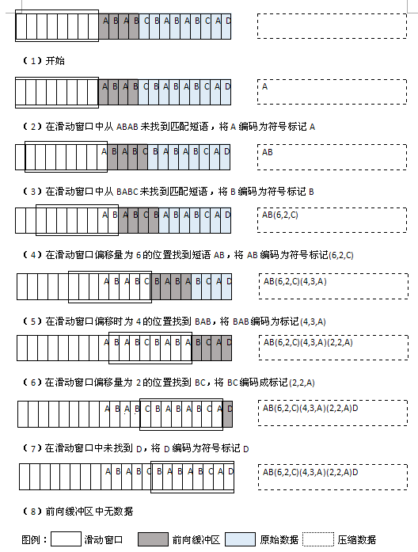
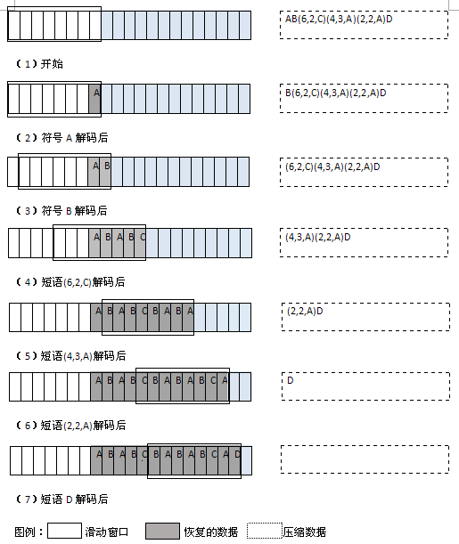
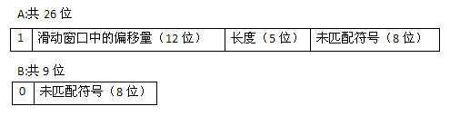

 
<!--BEGIN_DATA
{
    "create_date": "2018-07-23 19:12",
    "modify_date": "2018-07-23 19:12",
    "is_top": "0",
    "summary": "数据压缩算法---LZ77算法的分析与实现",
    "tags": "算法、C/C++",
    "file_name": "数据压缩算法---LZ77算法的分析与实现.md"
}
END_DATA-->

####
原文出处：<a href='https://www.cnblogs.com/idreamo/p/9249367.html' target='blank'>数据压缩算法---LZ77算法的分析与实现</a>

####LZ77简介

Ziv和Lempel于1977年发表题为“顺序数据压缩的一个通用算法（A Universal Algorithm for Sequential Data
Compression）”的论文，论文中描述的算法被后人称为LZ77算法。值得说的是，LZ77严格意义上来说不是一种算法，而是一种编码理论。同Huffman编码一样，只定义了原理，并没有定义如何实现。
**基于这种理论来实现的算法才称为LZ77算法，或者人们更愿意称为LZ77变种。**
实际上这类算法已经有很多了，比如LZSS、LZB、LZH等。至今，几乎我们日常使用的所有通用压缩工具，象ARJ，PKZip，WinZip，LHArc，RAR，GZip，ACE，ZOO，TurboZip，Compress，JAR„„甚至许多硬件如网络设备中内置的压缩算法，无一例外，都可以最终归结为这两个以色列人的杰出贡献。

**LZ77是一种基于字典的算法，它将长字符串（也称为短语）编码成短小的标记，用小标记代替字典中的短语，从而达到压缩的目的。也就是说，它通过用小的标记来代替数据中多次重复出现的长串方法来压缩数据。其处理的符号不一定是文本字符，可以是任意大小的符号。**

####短语字典的维护

不同的基于字典的算法使用不同的方法来维护它们的字典。 **LZ77使用的是一个前向缓冲区和一个滑动窗口** 。

**LZ77首先将一部分数据载入前向缓冲区**。为了便于理解前向缓冲区如何存储短语并形成字典，我们将缓冲区描绘成S1，...，Sn的字符序列，Pb是由字符组成的短语集合。从字符序列S1，...，Sn，组成n个短语，定义如下：

Pb = {(S1),(S1,S2),...,(S1,...,Sn)}

例如，如果前向缓冲区包含字符(A,B,D)，那么缓冲区中的短语为{(A),(A,B),(A,B,D)}。

**一旦数据中的短语通过前向缓冲区，那么它将移动到滑动窗口中，并变成字典的一部分。**为理解短语是如何在滑动窗口中表示的，首先，把窗口想象成S1，...，Sm的字符序列，且Pw是由这些字符组成的短语集合。从序列S1，...，Sm产生短语数据集合的过程如下：

Pw = {P1,P2,...,Pm}，其中Pi = {(Si),(Si,Si+1),...,(Si,Si+1,...,Sm)}

例如，如果滑动窗口中包含符号(A,B,C)，那么窗口和字典中的短语为{(A),(A,B),(A,B,C),(B),(B,C),(C)}。

**LZ77算法的主要思想就是在前向缓冲区中不断寻找能够与字典中短语匹配的最长短语。**
以上面描述的前向缓冲区和滑动窗口为例，其最长的匹配短语为(A,B)。

####压缩和解压缩数据

前向缓冲区和滑动窗口之间的匹配有两种情况：要么找到一个匹配短语，要么找不到匹配的短语。当找到最长的匹配时，将其编码成短语标记。

**短语标记包含三个部分：1、滑动窗口中的偏移量（从头部到匹配开始的前一个字符）；2、匹配中的符号个数；3、匹配结束后，前向缓冲区中的第一个符号。**

当没有找到匹配时，将未匹配的符号编码成符号标记。这个符号标记仅仅包含符号本身，没有压缩过程。事实上，我们将看到符号标记实际上比符号多一位，所以会出现轻微的扩展。

一旦把n个符号编码并生成相应的标记，就将这n个符号从滑动窗口的一端移出，并用前向缓冲区中同样数量的符号来代替它们。然后，重新填充前向缓冲区。这个过程使滑动窗口中始终有最新的短语。滑动窗口和前向缓冲区具体维护的短语数量由它们自身的容量决定。

下图（1）展示了用LZ77算法压缩字符串的过程，其中滑动窗口大小为8个字节，前向缓冲区大小为4个字节。在实际中，滑动窗口典型的大小为4KB（4096字节）。前向缓冲区大小通常小于100字节。

**图（1）：使用LZ77算法对字符串ABABCBABABCAD进行压缩**

我们通过解码标记和保持滑动窗口中符号的更新来解压缩数据，其过程类似于压缩过程。
**当解码每个标记时，将标记编码成字符拷贝到滑动窗口中。每当遇到一个短语标记时，就在滑动窗口中查找相应的偏移量，同时查找在那里发现的指定长度的短语。每当遇到一个符号标记时，就生成标记中保存的一个符号。**
下图（2）展示了解压缩图（1）中数据的过程。

**图（2）：使用LZ77算法对图（1）中压缩的字符串进行解压缩**

####LZ77的效率

用LZ77算法压缩的程度取决于很多因素，例如，选择滑动窗口的大小，为前向缓冲区设置的大小，以及数据本身的熵。最终，压缩的程度取决于能匹配的短语的数量和短语的长度。大多数情况下，LZ77比霍夫曼编码有着更高的压缩比，但是其压缩过程相对较慢。

用LZ77算法压缩数据是非常耗时的，国为要花很多时间寻找窗口中的匹配短语。然而在通常情况下，LZ77的解压缩过程要比霍夫曼编码的解压缩过程耗时要少。LZ77的解压缩过程非常快是因为每个标记都明确地告诉我们在缓冲区中哪个位置可以读取到所需要的符号。事实上，我们最终只从滑动窗口中读取了与原始数据数量相等的符号而已。

####LZ77的接口定义

**lz77_compress**

	int lz77_compress(const unsigned char *original, unsigned char **compressed, int size);

返回值：如果数据压缩成功，返回压缩后数据的字节数；否则返回-1；

描述：
用LZ77算法压缩缓冲区original中的数据，original包含size个字节的空间。压缩后的数据存入缓冲区compressed中。lz77_compress需要调用malloc来动态的为compressed分配存储空间，当这块空间不再使用时，由调用者调用函数free来释放空间。

复杂度：O(n)，其中n是原始数据中符号的个数。

**lz77_uncompress**

	int lz77_uncompress(const unsigned char *compressed, unsigned char **original);

返回值：如果解压缩数据成功，返回恢复后数据的字节数；否则返回-1；

描述：
用LZ77算法解压缩缓冲区compressed中的数据。假定缓冲区包含的数据之前由lz77_compress压缩。恢复后的数据存入缓冲区original中。lz77_uncompress函数调用malloc来动态的为original分配存储空间。当这块存储空间不再使用时，由调用者调用函数free来释放空间。

复杂度：O（n）其中n是原始数据中符号的个数。

####LZ77的实现与分析

LZ77算法，通过一个滑动窗口将前向缓冲区中的短语编码成相应的标记，从而达到压缩的目的。在解压缩的过程中，将每个标记解码成短语或符号本身。要做到这些，必须要不断地更新窗口，这样，在压缩过程中的任何时刻，窗口都能按照规则进行编码。在本节所有的示例中，原始数据中的一个符号占一个字节。

**lz77_compress**

**lz77_compress操作使用LZ77算法来压缩数据。**
首先，它将数据中的符号写入压缩数据的缓冲区中，并同时初始化滑动窗口和前向缓冲区。随后，前向缓冲区将用来加载符号。

压缩发生在一个循环中，循环会持续迭代直到处理完所有符号。使用ipos来保存原始数据中正在处理的当前字节，并用opos来保存向压缩数据缓冲区写入的当前位。在循环的每次迭代中，调用compare_win来确定前向缓冲区与滑动窗口中匹配的最长短语。函数compare_win返回最长匹配串的长度。

当找到一个匹配串时，compare_win设置offset为滑动窗口中匹配串的位置，同时设置next为前向缓冲区中匹配串后一位的符号。在这种情况下，向压缩数据中写入一个短语标记（如图3-a）。在本节展示的实现中，对于偏移量offset短语标记需要12位，这是因为滑动窗口的大小为4KB（4096字节）。此时短语标志需要5位来表示长度，因为在一个32字节的前向缓冲区中，不会有匹配串超过这个长度。当没有找到匹配串时，compare_win返回，并且设置next为前向缓冲区起始处未匹配的符号。在这种情况下，向压缩数据中写入一个符号（如图3-b）。无论向压缩数据中写入的是一个短语还是一个符号，在实际写入标记之前，都需要调用网络函数htonl来转换串，以保证标记是大端格式。这种格式是在实际压缩数据和解压缩数据时所要求的。

 

**图3：LZ77中的短语标记（A）和符号标记（B）的结构**

一旦将相应的标记写入压缩数据的缓冲区中，就调整滑动窗口和前向缓冲区。要使数据通过滑动窗口，将数据从右边滑入窗口，从左边滑出窗口。同样，在前向缓冲区中也是相同的滑动过程。移动的字节数与标记中编码的字符数相等。

lz77_compress的时间复杂度为O(n)，其中n是原始数据中符号的个数。这是因为，对于数据中每个n/c个编码的标记，其中1/c是一个代表编码效率的常量因素，调用一次compare_win。函数compare_win运行一段固定的时间，因为滑动窗口和前向缓冲区的大小均为常数。然而，这些常量比较大，会对lz77_compress的总体运行时间产生较大的影响。所以，lz77_compress的时间复杂度是O(n)，但其实际的复杂度会受其常量因子的影响。这就解释了为什么在用lz77进行数据压缩时速度非常慢。

**lz77_uncompress**

**lz77_uncompress操作解压缩由lz77_compress压缩的数据。** 首先，该函数从压缩数据中读取字符，并初始化滑动窗口和前向缓冲区。

解压缩过程在一个循环中执行，此循环会持续迭代执行直到所有的符号处理完。使用ipos来保存向压缩数据中写入的当前位，并用opos来保存写入恢复数据缓冲区中当前字节。在循环的每次迭代过程中，首先从压缩数据读取一位来确定要解码的标记类型。

在解析一个标记时，如果读取的首位是1，说明遇到了一个短语标记。此时读取它的每个成员，查找滑动窗口中的短语，然后将短语写入恢复数据缓冲区中。当查找每个短语时，调用网络函数ntohl来保证窗口中的偏移量和长度的字节顺序是与操作系统匹配的。这个转换过程是必要的，因为从压缩数据中读取出来的偏移量和长度是大端格式的。在数据被拷贝到滑动窗口之前，前向缓冲区被用做一个临时转换区来保存数据。最后，写入该标记编码的匹配的符号。如果读取的标记的首位是0，说明遇到了一个符号标记。在这种情况下，将该标记编码的匹配符号写入恢复数据缓冲区中。

一旦将解码的数据写入恢复数据的缓冲区中，就调整滑动窗口。要将数据通过滑动窗口，将数据从右边滑入窗口，从左边滑出窗口。移动的字节数与从标记中解码的字符数相等。

lz77_uncompress的时间复杂度为O(n)，其中n是原始数据中符号的个数。

**示例：LZ77的实现文件**

**(示例所需要的头文件信息请查阅前面的文章：[数据压缩的重要组成部分--
位操作](https://www.cnblogs.com/idreamo/p/9153691.html))**

    
     /*lz77.c*/
    #include <netinet/in.h>
    #include <stdlib.h>
    #include <string.h>
    #include "bit.h"
    #include "compress.h"
    /*compare_win 确定前向缓冲区中与滑动窗口中匹配的最长短语*/
    static int compare_win(const unsigned char *window, const unsigned char *buffer,
                           int *offset, unsigned char *next)
    {
        int match,longest,i,j,k;
        /*初始化偏移量*/
        *offset = 0;
        /*如果没有找到匹配，准备在前向缓冲区中返回0和下一个字符*/
        longest = 0;
        *next = buffer[0];
        /*在前向缓冲区和滑动窗口中寻找最佳匹配*/
        for(k=0; k<LZ77_WINDOW_SIZE; k++)
        {
            i = k;
            j = 0;
            match = 0;
            /*确定滑动窗口中k个偏移量匹配的符号数*/
            while(i<LZ77_WINDOW_SIZE && j<LZ77_BUFFER_SIZE - 1)
            {
                if(window[i] != buffer[j])
                    break;
                match++;
                i++;
                j++;
            }
            /*跟踪最佳匹配的偏移、长度和下一个符号*/
            if(match > longest)
            {
                *offset = k;
                longest = match;
                *next = buffer[j];
            }
        }
        return longest;
    }
    /*lz77_compress  使用lz77算法压缩数据*/
    int lz77_compress(const unsigned char *original,unsigned char **compressed,int size)
    {
        unsigned char     window[LZ77_WINDOW_SIZE],
                          buffer[LZ77_BUFFER_SIZE],
                          *comp,
                          *temp,
                          next;
        int               offset,
                          length,
                          remaining,
                          hsize,
                          ipos,
                          opos,
                          tpos,
                          i;
        /*使指向压缩数据的指针暂时无效*/
        *compressed = NULL;
        /*写入头部信息*/
        hsize = sizeof(int);
        if((comp = (unsigned char *)malloc(hsize)) == NULL)
            return -1;
        memcpy(comp,&size,sizeof(int));
        /*初始化滑动窗口和前向缓冲区(用0填充)*/
        memset(window, 0 , LZ77_WINDOW_SIZE);
        memset(buffer, 0 , LZ77_BUFFER_SIZE);
        /*加载前向缓冲区*/
        ipos = 0;
        for(i=0; i<LZ77_BUFFER_SIZE && ipos < size; i++)
        {
            buffer[i] = original[ipos];
            ipos++;
        }
        /*压缩数据*/
        opos = hsize * 8;
        remaining = size;
        while(remaining > 0)
        {
            if((length = compare_win(window,buffer,&offset,&next)) != 0)
            {
                /*编码短语标记*/
                token = 0x00000001 << (LZ77_PHRASE_BITS - 1);
                /*设置在滑动窗口找到匹配的偏移量*/
                token = token | (offset << (LZ77_PHRASE_BITS - LZ77_TYPE_BITS - LZ77_WINOFF_BITS));
                /*设置匹配串的长度*/
                token = token | (length << (LZ77_PHRASE_BITS - LZ77_TYPE_BITS - LZ77_WINOFF_BITS - LZ77_BUFLEN_BITS));
                /*设置前向缓冲区中匹配串后面紧邻的字符*/
                token = token | next;
                /*设置标记的位数*/
                tbits = LZ77_PHRASE_BITS;
            }
            else
            {
                /*编码一个字符标记*/
                token = 0x00000000;
                /*设置未匹配的字符*/
                token = token | next;
                /*设置标记的位数*/
                tbits = LZ77_SYMBOL_BITS;
            }
            /*确定标记是大端格式*/
            token = htonl(token);
            /*将标记写入压缩缓冲区*/
            for(i=0; i<tbits; i++)
            {
                if(opos % 8 == 0)
                {
                    /*为压缩缓冲区分配临时空间*/
                    if((temp = (unsigned char *)realloc(comp,(opos / 8) + 1)) == NULL)
                    {
                        free(comp);
                        return -1;
                    }
                    comp = temp;
                }
                tpos = (sizeof(unsigned long ) * 8) - tbits + i;
                bit_set(comp,opos,bit_get((unsigned char *)&token,tpos));
                opos++;
            }
            /*调整短语长度*/
            length++;
            /*从前向缓冲区中拷贝数据到滑动窗口中*/
            memmove(&window[0],&window[length],LZ77_WINDOW_SIZE - length);
            memmove(&window[LZ77_WINDOW_SIZE - length],&buffer[0],length);
            memmove(&buffer[0],&buffer[length],LZ77_BUFFER_SIZE - length);
            /*向前向缓冲区中读取更多数据*/
            for(i = LZ77_BUFFER_SIZE - length; i<LZ77_BUFFER_SIZE && ipos <size; i++)
            {
                buffer[i] = original[ipos];
                ipos++;
            }
            /*调整剩余未匹配的长度*/
            remaining = remaining - length;
        }
        /*指向压缩数据缓冲区*/
        *compressed = comp;
        /*返回压缩数据中的字节数*/
        return ((opos - 1) / 8) + 1;
    }
    
    /*lz77_uncompress  解压缩由lz77_compress压缩的数据*/
    int lz77_uncompress(const unsigned char *compressed,unsigned char **original)
    {
        unsigned char window[LZ77_WINDOW_SIZE],
                      buffer[LZ77_BUFFER_SIZE]
                      *orig,
                      *temp,
                      next;
        int           offset,
                      length,
                      remaining,
                      hsize,
                      size,
                      ipos,
                      opos,
                      tpos,
                      state,
                      i;
        /*使指向原始数据的指针暂时无效*/
        *original = orig = NULL;
        /*获取头部信息*/
        hsize = sizeof(int);
        memcpy(&size,compressed,sizeof(int));
        /*初始化滑动窗口和前向缓冲区*/
        memset(window, 0, LZ77_WINDOW_SIZE);
        memset(buffer, 0, LZ77_BUFFER_SIZE);
        /*解压缩数据*/
        ipos = hsize * 8;
        opos = 0;
        remaining = size;
        while(remaining > 0)
        {
            /*获取压缩数据中的下一位*/
            state = bit_get(compressed,ipos);
            ipos++;
            if(state == 1)
            {
                /*处理的是短语标记*/
                memset(&offset, 0, sizeof(int));
                for(i=0; i<LZ77_WINOFF_BITS; i++)
                {
                    tpos = (sizeof(int)*8) - LZ77_WINOFF_BITS + i;
                    bit_set((unsigned char *)&offset, tpos, bit_get(compressed,ipos));
                    ipos++;
                }
                memset(&length, 0, sizeof(int));
                for(i=0; i<LZ77_BUFLEN_BITS; i++)
                {
                    tpos = (sizeof(int)*8) - LZ77_BUFLEN_BITS + i;
                    bit_set((unsigned char *)&length, tpos, bit_get(compressed,ipos));
                    ipos++;
                }
                next = 0x00;
                for(i=0; i<LZ77_NEXT_BITS; i++)
                {
                    tpos = (sizeof(unsigned char)*8) - LZ77_NEXT_BITS + i;
                    bit_set((unsigned char *)&next, tpos, bit_get(compressed,ipos));
                    ipos++;
                }
                /*确保偏移和长度对系统有正确的字节排序*/
                offset = ntohl(offset);
                length = ntohl(length);
                /*将短语从滑动窗口写入原始数据缓冲区*/
                i=0;
                if(opos>0)
                {
                    if((temp = (unsigned char *)realloc(orig,opos+length+1)) == NULL)
                    {
                        free(orig);
                        return 1;
                    }
                    orig = temp;
                }
                else
                {
                    if((orig = (unsigned char *)malloc(length+1)) == NULL)
                        return -1;
                }
                while(i<length && remaining>0)
                {
                    orig[opos] = window[offset + i];
                    opos++;
                    /*在前向缓冲区中记录每个符号，直到准备更新滑动窗口*/
                    buffer[i] = window[offset + i];
                    i++;
                    /*调整剩余符号总数*/
                    remaining --;
                }
                /*将不匹配的符号写入原始数据缓冲区*/
                if(remaining > 0)
                {
                    orig[opos] = next;
                    opos++;
                    /*仍需在前向缓冲区中记录此符号*/
                    buffer[i] = next;
                    /*调整剩余字符总数*/
                    remaining--;
                }
                /*调整短语长度*/
                length++;
            }
            else
            {
                /*处理的是字符标记*/
                next = 0x00;
                for(i=0; i<LZ77_NEXT_BITS; i++)
                {
                    tpos = (sizeof(unsigned char)*8) - LZ77_NEXT_BITS + i;
                    bit_get((unsigned char *)&next, tpos,bit_get(compressed,ipos));
                    ipos++;
                }
                /*将字符写入原始数据缓冲区*/
                if(opos > 0)
                {
                    if((temp = (unsigned char*)realloc(orig,opos+1)) == NULL)
                    {
                        free(orig);
                        return -1;
                    }
                    orig = temp;
                }
                else
                {
                    if((orig = (unsigned char *)malloc(1)) == NULL)
                    return -1;
                }
                orig[opos] = next;
                opos++;
                /*在前向缓冲区中记录当前字符*/
                if(remaining > 0)
                    buffer[0] = next;
                /*调整剩余数量*/
                remaining--;
                /*设置短语长度为1*/
                length = 1;
            }
            /*复制前向缓冲中的数据到滑动窗口*/
            memmove(&window[0], &window[length],LZ7_WINDOW_BITS - length);
            memmove(&window[LZ77_WINDOW_SIZE - length], &buffer[0], length);
        }
        
        /*指向原始数据缓冲区*/
        *original = orig;
        /*返回解压缩的原始数据中的字节数*/
        return  opos;
	}

