 
<!--BEGIN_DATA
{
    "create_date": "2017-01-20 20:45", 
    "modify_date": "2017-01-20 20:45", 
    "is_top": "0", 
    "summary": "无锁数据结构1", 
    "tags": "C/C++、算法、数据结构", 
    "file_name": "无锁数据结构1.md"
}
END_DATA-->

####<p>原文出处：<a href='http://blog.jobbole.com/90810/' target='blank'>无锁数据结构（1）：简介</a></p>


英文出处：[khizmax](http://kukuruku.co/hub/cpp/lock-free-data-structures-introduction)

希望本文能成为无锁（lock free）数据结构系列文章一个好的开端。我很乐意与社区分享我的经历，这个系列就什么是无锁数据结构、如何实现以及 STL 容器概念是否适用于无锁容器，何种情形下适合应用无锁数据结构做一些分享。

谈论无锁数据结构，必然要谈论诸如原子操作、编程语言中的内存模型、安全内存回收以及在此基础上的编译和优化、现代CPU设计等内容。所有话题或多或少都会在这一系列文章中得到讨论。

我大胆地讨论这些话题，不是因为觉得自己是这些领域及其权威的专家。倘若我没有这些概念，我无法创建并维护这个libcds库——这是一个包含无锁容器和安全内存回收算法的开源C++库。Cds代表并发数据结构，前缀"lib"代表“library（库）”。


我开始构建此库，是在2006年。

当时我在一家超级大公司为某个电信运行商做软件开发。我们极其困难地在各种硬件平台（the zoo of hardware platforms）上开发服务器应用，很快就出现了性能问题（必然会出现该问题）。该问题用平行数据处理的方式得到了解决。通常，并行涉及共享数据，访问该数据必然要求同步。某天，在一次讨论中同事问我：“你从来就没有听说过无锁队列？”，那会我对此一无所知。我谷歌搜索之后，发现关于无锁队列伪代码的文章寥寥无几。来来回回读了好几遍，一无所获。 就在“一无所获”这种情形下，我鼓舞自己说：“你们这些蠢货，我才是全世界最聪明的”。接着尝试简化算法，并尝试在常识和这些算法之间寻求一种平衡。和段错误（segmentati on fault）奋战了一个月之后，我以前的常识都没有用。那时真是一无所获，即使IT领域获得某种程度的成功，但是我完全不知道它的机理。但它确实在某种程度上是可以实现的，不然那些聪明家伙绝不会写这些文章，其他聪明的家伙也绝不会去引用这些文章。追溯这些论文，我读了大量的文章，从CPU设计、软件开发者指南开始，到关于无锁算法实现基本方法的综述结束。

一次偶然的机会，我用C++在这个项目做了一些开发，实现了一些原语。不过在2006-2007年那段时间，原语啥都不是；C++标准库仍然沿用所谓的C++ox优化方式，STL中并没有原子性原语，接口也只是一个轮廓，编译器时不时地对我的原子原语恶作剧。特别是在临界区竟然出现不能执行的代码。直到2008年，libcds库开始有了一个模糊的轮廓。第一次平台测试给了我很大的鼓励，甚至是极大的鼓舞（快了50倍），从此我沉浸在无锁的世界。2010年，我在SourceForge上发布了此库的0.5.0版本。截至今天（2014年3月）版本库是1.4.0，目前正在开发的版本是1.5.0。

现在，我打算对无锁数据结构做一个总体的概括。程序员设计开发软件项目最大的难点在于，如何最有效地利用平台的所有资源，特别是服务器。现代计算机，即使很小的智能机亦或者平板电脑，都是一个多核处理设备。性能调优最主要的方法便是并行编程，线程并行处理一些共享数据。因此我们的主要任务便是如何通过并行的形式，高效地访问共享数据。

（译者注：同步劣势：一、并行的对立面，即杀死并行操作；二 、弱分布式，加剧恶化多个连接响应）

上个世纪80年代，一种叫做结构编程的方式很流行，通过此方式认为可以编写出好的程序。结构编程的忠实拥护者Niklaus Wirth，Pascal语言的作者，写过一本畅销书《算法+数据结构=程序》。有趣的是，这个古老的等式正是现代API类型线程——Win32 API的弱点，该API由操作系统创建而成。该API提供了一种并行编程方式（就是线程），但它并没有提供一种可实现共享存取的并行数据结构构建方式。恰恰相反，Win32 API通过同步原语的方式保障数据安全，同步是程序并行的一大瓶颈。顾名思义，同步就是并行的对立面：当并行算法与连续数据结构结合在一起时，它需要提供同步原语才能运作——比如临界区、互斥锁、条件变量。结果，所有线程在队列中等待以获取数据结构，杀死了并行操作。有些同步原语是操作系统内核对象，调用此对象代价是很昂贵的：上下文切换或许是必须的，切换到内核执行级别，支持访问被同步原语数据保护的等待队列。所有你需要做的是，仅仅改变指示符（designator）的含义，比如去执行一两个汇编函数。负载可能很高，事实上也确实如此。毕竟，操作系统内核对象是一个数量有限的资源。

同步的另一个缺点是弱分布式。一旦访问数据的线程增加到一定数量，就会成为程序的一个瓶颈。如果并行的级别不断增高，超出了可容纳的合适比例，就会加剧恶化多连接的响应。

Wirth的等式“算法+数据结构=程序”，我只用在libcds数据结构中。然而在我的库中，不会有并行排序算法或者并行for-each算法。本库只仅包含几种竞争性数据结构——queue、list、map、set等。<del></del>对无锁数据做必要的算法支持，这些算法都是内存安全回收（safe memory reclamation）类型的；通常这些数据结构实现很少。最初决定阶段：一般来说，实现某个有意思的队列或者map算法很少，我也不知道那种更好一些。因为，“好”与“坏”是一个相对的概念，取决于有限的计算机硬件所对应的有限任务。其次，直到你实现了某种算法，并于其它算法做过比较，你才知道它不是不更好的。既然算法都实现了并且都调试了，为何不放在库中，让用户多一种选择呢？

在教育领域，对共享数据提供并发访问的竞争数据结构研究有下面几个方面：


  * 无锁数据结构；
  * 细颗粒度的算法；
  * 事务内存

目前还没有嵌入式的事务性内存。不过事务性内存是一个巨大的研究课题，终极目标是未来能够实现它。基于事务性内存的算法表明，简单地说，内存支持原子性事务的原子性提交或者回滚。显然，这样的内存应该在硬件中实现。研究者承认，目前的软件实现还没有充分具备这样的能力。不过英特的Haswel处理器设计已经在其代码指令中支持事务，可以说基于事务性内存规则算法的全盛时期就要到来了。

细颗粒度的算法是一种偏离同步方法的算法，通常被认为并不是基于操作系统提供的同步原语应用，而是基于“轻量级的”原子性原语，比如自旋锁。在此类原语之上构建的数据结构，可以并行读取，甚至并发写入。在此基础上，同步应用于节点、页、桶（bucket）级别的数据结构中，同时被构建在操作系统相关的算法中。在相对轻量级连接中，细粒度容器可以和无锁容器相媲美。因此，libcds库并没有轻视此类型的数据结构。

（译者注：自旋锁适用于任何锁持有时间少于将一个线程阻塞和唤醒所需要的时间的场合，即减少上下文切换、数据结构更新）

我所提到的数据结构不需要外部同步访问，它是无锁数据结构。它是一种非官方的、纯技术性定义，反映的是容器的内部构件以及在此之上的各种操作。重点强调“外部”的目：

应该明确一点，没有处理器的支持，几乎是无法构建无锁数据结构的。无锁容器中的这种支持，不是由访问容器序列化方法的同步机制提供的，而是原子性修改机制提供的。此机
制已注入了容器的方法中，亦或者是容器组成（节点、桶、页）级别的内部同步机制提供的。

（译者注：缺少处理器的支持，几乎是无法构建无锁数据结构的）

**无锁对象**（lock-free object）的正式定义如下 [Her91]：判断一个共享对象是否为无锁类型（非阻塞对象），就看它是否能确保一些线程在有限的系统步骤中完成某个操作，并且与其他线程的操作结果无关（即便其它线程操作没有成功）。一个更加严格的**非等待对象**（wait-free object）是这样定义的：判断某个对象是否为非等待，就看每个线程是否是在有限的步骤中完成了在该对象上的操作。**无锁的条件**是至少保证一个线程完成任务，而更苛刻的**非等待条件**则是要保证所有的线程都能成功完成任务。线性化（linearizability）在竞争数据结构上也有理论性的定义[Her90]，作为一种标准，在验证无锁算法正确性方面，发挥着重要作用。**简而言之，算法是否为线性化的，就看算法完成之后的操作结果是否显而易见，不言自明**。举个例子来说，只要插入函数完成，列表插入操作的结果就显而易见的。听起来很白痴，但没有人能想出某个算法做了一个列表插入，却不是线性化。再譬如，各种类型的缓存可能违反这种特性：我们先将一个新元素放入缓存中而非直接插入，接着命令其它线程“将该缓存中的此元素插入列表中”，直到此元素插入进去。或者只有当缓存中有相当数量的元素时，我们才做一次插入。那么插入函数执行完毕，我们依旧不能保证此元素在列表中。可以确定的是，此元素迟早会被插入到列表中。

这些定义广泛地用于科学研究领域。本篇非科技类文章，因此我用无锁这个狭义的术语定义竞争性容器类。此类构建无需传统同步模板应用，甚至同步。那么无锁算法的特点是什么？我认为第一明显的特征是其复杂性。请问如何在单项链表基础之上实现常规队列？下面是一个非常简单的代码实现：

```
struct Node {
        Node * m_pNext ;
};
 
class queue {
        Node * m_pHead ;
        Node * m_pTail ;
   public:
        queue(): m_pHead( NULL ), m_pTail( NULL ) {}
        void enqueue( Node * p )
        {
            p->m_pNext = m_pTail ;
            m_pTail = p ;
            if ( !m_pHead )
                m_pHead = p ;
        }
        Node * dequeue()
        {
            if ( !m_pHead ) return NULL ;
            Node * p = m_pHead ;
            m_pHead = p->m_pNext ;
            if ( !m_pHead )
                m_pTail = NULL ;
            return p ;
        }
};
```

甚至可以写得更简短一点，这就是无锁 Michael&Scott 队列经典算法实现。它看起来就像入队、出对方法（和压栈、弹出的意思相同）。（代码是libcds库类cds::intrusive::MSQueue简化版）

```
bool enqueue( value_type& val )
{
      node_type * pNew = node_traits::to_node_ptr( val );
 
      typename gc::Guard guard;
      back_off bkoff;
 
      node_type * t;
      while ( true ) {
           t = guard.protect( m_pTail, node_to_value() );
 
           node_type * pNext = t->m_pNext.load(memory_model::memory_order_acquire);
           if ( pNext != null_ptr<node_type *>() ) {
                // Tail is misplaced, advance it
                m_pTail.compare_exchange_weak( t, pNext, memory_model::memory_order_release, 
                                               CDS_ATOMIC::memory_order_relaxed );
                continue;
           }
 
          node_type * tmp = null_ptr<node_type *>() ;
          if ( t->m_pNext.compare_exchange_strong( tmp, pNew, memory_model::memory_order_release, 
                   CDS_ATOMIC::memory_order_relaxed ))
          {
                    break;
          }
          bkoff();
     }
    ++m_ItemCounter;
 
    m_pTail.compare_exchange_strong( t, pNew, memory_model::memory_order_acq_rel, 
                                     CDS_ATOMIC::memory_order_relaxed );
 
    return true;  
}
 
value_type * dequeue()
{
     node_type * pNext;
     back_off bkoff;
     typename gc::template GuardArray<2> guards;
 
      node_type * h;
      while ( true ) {
           h = guards.protect( 0, m_pHead, node_to_value() );
           pNext = guards.protect( 1, h->m_pNext, node_to_value() );
           if ( m_pHead.load(memory_model::memory_order_relaxed) != h )
                continue;
 
           if ( pNext == null_ptr<node_type *>() )
                 return NULL; // empty queue
 
           node_type * t = m_pTail.load(memory_model::memory_order_acquire);
           if ( h == t ) {
                // It is needed to help enqueue
               m_pTail.compare_exchange_strong( t, pNext, memory_model::memory_order_release, 
                                                CDS_ATOMIC::memory_order_relaxed );
               continue;
           }
 
           if ( m_pHead.compare_exchange_strong( h, pNext, 
                     memory_model::memory_order_release, CDS_ATOMIC::memory_order_relaxed ))
           {
                    break;
           }
           bkoff();
     }
 
     --m_ItemCounter;
 
     dispose_node( h );
     return pNext;
}
```

这是一个很复杂的算法，相同的单向链表。不过即使大体比较一下，也能看出无锁队列的一些特征。在无锁队列中，我们可以找到如下描述：

  * 无限循环：稍后我们会尝试执行这个操作，这是一个实现了原子性操作compare_exchange的典型模式；
  * 局部变量的安全性（guards），需借助于无锁算法中安全内存收回方法。本例中，为风险指针（Hazard Pointers）方法；
  * 采用C++11标准的原子性原语：load、compare_exchange以及内存栅栏（memory fences）memory_order_xxx;
  * helping ：一种广泛存在于无锁算法中的方法，特别是在一个线程帮助其它线程去执行任务场景中；
  * 补偿策略（functor bkoff）： 这不是必须的，但可以在连接很多的情况下缓解处理器的压力，尤其是多个线程逐个地调用队列时。

我不打算在本文中，进一步就这些事情展开广泛的讨论，开启新的话题。让我们保留这份好奇心，我会在接下来的文章中逐一阐述。

接下来的一篇文章将集中关注无锁数据结构的基础概念：原子性和原子性原语。

最后，给大家推荐一些有用的资料，其中不泛竞争性编程基本议题的广泛讨论。

截至目前我所知道的两本不错的著作：

  1. Nir Shavit, Maurice Herlihy [The Art of Multiprocessor programming](http://vdisk.weibo.com/s/zaPQt9Wyplf9m)。此书中，世界级著名无锁作者描述了大量并行算法及其实现方法。所有的例子都是用Java实现的，免去了C++内存回收带来的麻烦，采用Java实现，只需考虑内存模型以及其它的。倘若你的技术栈是C++，那就必须独自用C++实现了。尽管如此，此书还是很有帮助。
  2. Anthony Williams [C++ Concurrency in Action](http://vdisk.weibo.com/s/zaPQt9WypmW04)。此书中，世界级著名C++作者解答了C++多线程编程的诸多问题，描述了基于并行算法实现的新C++标准以及其它工具。强烈推荐大家读一读。

链接：

  * [Her90] M. Herlihy, J. M. Wing [Linearizability: A Correctness Condition for Concurrent Objects](http://courses.cs.vt.edu/~cs5204/fall07-kafura/Papers/TransactionalMemory/Linearizability.pdf), ACM Transactions on Programming Languages and Systems, 1990
  * [Her91] M. Herlihy [A Methodology for Implementing Highly Concurrent Data Object](http://www.hpl.hp.com/techreports/Compaq-DEC/CRL-91-10.pdf), 1991
  * [Mic96] M.Michael, M.Scott [Simple, Fast, and Practical Non-Blocking and Blocking Concurrent Queue Algorithms](http://www.cs.rochester.edu/u/scott/papers/1996_PODC_queues.pdf)


<hr>


####<p>原文出处：<a href='http://blog.jobbole.com/90811/' target='blank'>无锁数据结构（基础篇）：原子性、原子性原语</a></p>

英文出处：[khizmax ](http://kukuruku.co/hub/cpp/lock-free-data-structures-basics-atomicity-and-atomic-primitives)

无锁数据结构基于两方面——原子性操作以及内存访问控制方法。本文中我话题主要涉及原子性和原子性原语。

在开始之前，我对大家表示感谢，谢谢你们对初识无锁数据结构的热爱。看到大家对无锁话题很感兴趣，我感到很开心。我计划依据学术概念将此做成一个系列，从基础到算法，同时以文本的形式展示 libcds 中的代码实现。但有些读者希望避开漫谈，尽快展示这些代码，以及如何利用这些库。我同意其中的一些观点。毕竟，不是所有的人既想知晓 boost 内部构造，也想知道如何应用。

因此，我将系列文章分了三部分：基础篇、机制篇、番外篇，每篇文章涉及其中之一。

  * 在基础篇，我会介绍底层的知识，甚至现代CPU构造。
  * 在机制篇，我会介绍无锁领域有趣的算法和方法——这一部分更像是无锁数据结构的理论实现。Libcds会是一个无尽的 C++ 代码来源。
  * 在番外篇，大都是关于 libcds 实现实践为主题的文章，编程方法、建议和常见问题；对读者的提问、评价、提议做出反馈。

本文不会涉及太多 C++ 编程，甚至不会涉及太多无锁知识；（尽管没有原子性，无锁算法难以实现。）主要是现代处理器的原子性原语实现，利用这些基本类型时可能遇到的问题。

原子性是两种底层概念中的前一种。

原子性操作可以简单地分为读写（read and write）、原子性交换操作（read-modify-write，RMW）**两部分**。原子操作可认为是一个不可分的操作；要么发生，要么没发生，我们看不到任何执行的中间过程，不存在部分结果（partial e
ffects）。简单的读写操作甚至不具有原子性，例如，没有内存对齐的数据，该数据的读取不具有原子性。在X86架构的计算机中，这样的读操作会导致内部回避。这样，处理器读取数据就被分成了好几部分。在其它诸如Sparc、Intel Itanium架构中，这样的读操作会导致段错误，这些操作要能被拦截并处理，而原子性操作不存在这样的问题。**在现代处理器中，原子性的读写操作仅仅作用于对齐后的完整类型（整数和指针）；而现代编译器是volatile基本类型正确对齐的保障。**如果你想4到8个比特大小的数据结构具有原子性，那你就应该谨慎行事，借助编译器指令确保其正确对齐。每种编译器都有其独一无二的数据、类型对齐方法。顺便说一下，libcds 库支持一组备用类型和宏指令，当你声明对齐数据时，它们会隐藏编译器依赖的部分。

###Compare-and-swap

即便竭尽全力，设计一个仅仅使用读写的无锁容器算法依然是困难重重（我不清楚针对线程随机数的数据结构）。这就是为什么处理器架构开发人员采用 RMW 操作的原因。RMW可以原子性地执行对齐内存单元读操作和针对它的写操作：compare-and-swap (CAS)、fetch-and-add (FAA)、test-and-set (TAS) 等等。在学术圈，compare-and-swap (CAS）被认为是最基本的一种操作。伪代码如下：

```
bool CAS( int * pAddr, int nExpected, int nNew )
atomically {
    if ( *pAddr == nExpected ) {
         *pAddr = nNew ;
         return true ;
    }
    else
        return false ;
}
```

从字面意思上看，如果pAddr地址中的当前变量值等于预期的 nExpected，那么将 nNew的值赋给此变量，并返回true；否则返回false，变量值不变。所有执行过程都是原子性的、不可分的，不会产生任何可见的部分结果。借助于CAS，其它的 RMW
操作都可以估值。如下的 fetch-and-add 是这样的：

```
int FAA( int * pAddr, int nIncr )
{
     int ncur ;
     do {
          ncur = *pAddr ;
     } while ( !CAS( pAddr, ncur, ncur + nIncr ) ;
     return ncur ;
}

```

CAS 操作的学术性类型在实践中并非那么得心应手。CAS 失败后，我们时常想知道内存单元中的当前值是多少。这时可以考虑另一个种CAS （所谓的 valued CAS，依然是原子性执行）：

```
int CAS( int * pAddr, int nExpected, int nNew )
atomically {
      if ( *pAddr == nExpected ) {
           *pAddr = nNew ;
           return nExpected ;
       }
       else
            return *pAddr
}
```

C++11中的 compare_exchange函数包含了两种衍生类型（严格地说，C++11没有此类函数，它们是ompare_exchange_strong 和 compare_exchange_weak，这些我稍后会告知大家）：


	bool compare_exchange( int volatile * pAddr, int& nExpected, int nNew );

参数nExpected通过引用传值，并且包含pAddr地址的预期变量值。在输出端，返回变化之前的值。(译者注，其实就是返回pAddr的旧地址。假如函数地址中存在值 nExpected，返回true，加入失败了则返回false（nExpected 会包含地址 pAddr 的当前变量值）。multipurpose CAS 操作构建涵盖了学术 CAS定义的两种衍生类型。但在实际应用中，compare_exchange 会出现一些错误，你需要知道 nExpected参数是传引用，它是可以改变的，这一点是不能接受的。

但借助 compare_exchange 可以实现 fetch-and-add 基本类型，代码可以写成下面这样：

```
int FAA( int * pAddr, int nIncr )
{
     int ncur = *pAddr;
     do {} while ( !compare_exchange( pAddr, ncur, ncur + nIncr ) ;
     return ncur ;
}
```

###ABA问题

CAS 基本类型适合多种方式。不过在应用过程中，可能发生一个严重的问题，就是所谓的 ABA 问题。为了描述这个问题，我们需要考虑一种 CAS 操作应用的典型模式：

```
int nCur = *pAddr ;
while (true) {
    int nNew = calculating new value
    if ( compare_exchange( pAddr, nCur, nNew ))
        break;
}
```

事实上，我们一直在循环中，直到CAS执行才跳出循环。在读取 pAddr 地址中的当前变量值和计算新值 nNew，这个在 pAddr
地址中可被其它线程改变的变量之间，循环是必须的。

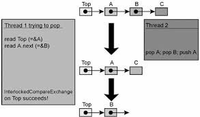

ABA 问题可以用下面的方式加以描述。假设线程A从共享内存单元读取A值，与此同时，该内存单元指针指向某些数据；接着线程Y将内存单元的值改为B，接着再改回A，但此时指针指向了另一些数据。但线程 A 通过 CAS 基本类型试图更改内存单元值时，指针和前面读取的 A 值比较是成功的，CAS 结果也正确。但此时 A 指向完全不一样的数据。结果，线程就打破了内部对象连接（internal object connections），最终导致失败。

下面是一个无锁栈的实现，重现了ABA 问题 [Mic04]：

```
// Shared variables
static NodeType * Top = NULL; // Initially null
 
Push(NodeType * node) { 
            do { 
/*Push1*/          NodeType * t = Top;
/*Push2*/          node->Next = t;
/*Push3*/   } while ( !CAS(&Top,t,node) );
}
 
NodeType * Pop() { 
          Node * next ;
          do { 
/*Pop1*/        NodeType * t = Top;
/*Pop2*/        if ( t == null )
/*Pop3*/             return null;
/*Pop4*/        next = t->Next;
/*Pop5*/   } while ( !CAS(&Top,t,next) );
/*Pop6*/   return t;
}
```

下面一系列活动导致栈结构遭受破坏（需要注意的是，此序列不是引起 ABA 问题的唯一方式）。

<table border="1">
<tbody>
<tr>
<th>Thread X</th>
<th>Thread Y</th>
</tr>
<tr>
<td>Calls Pop().<br>
Line Pop4 is performed,<br>
variables values: t == A<br>
next == A-&gt;next</td>
<td></td>
</tr>
<tr>
<td></td>
<td>NodeType * pTop = Pop()<br>
pTop == top of the stack, i.e. A<br>
Pop()<br>
Push( pTop )<br>
Now the top of the stack is A again<br>
Note, that A-&gt;next has changed</td>
</tr>
<tr>
<td>Pop5 line is being performed.<br>
CAS is successful, but the field Top-&gt;next<br>
is assigned with another value,<br>
which doesn’t exist in the stack,<br>
as Y thread has pushed A and A-&gt;next out,<br>
of a stack and the local variable next<br>
has the&nbsp;<em>old</em>&nbsp;value of A-&gt;next</td>
<td></td>
</tr>
</tbody>
</table>

ABA 问题是所有基于 CAS 基本类型的无锁容器的一个巨大灾难。它会在多线程代码中出现，当且仅当元素 A 从某个容器中被删除，接着存入另一个元素B，然后再改为元素A。即便其它线程使该指针指向某一元素，该元素可能正在被删除。即使该线程物理删除了A，接着调用new方法创建了一个新的元素，也不能保证allocator 返回A的地址。此问题在超过两个线程的场景中经常出现。鉴于此，我们可以讨论 ABCBA 问题、ABABA 问题等等。

为了处理 ABA 问题，你应该物理删除（延迟内存单元再分配，或者安全内存回收）该元素，并且是在不存在竞争性线程局部，或全局指向待删除元素的情况下进行。

因此，无锁数据结构中元素删除包含两个步骤：

  * 第一步，将该元素逐出无锁容器中；
  * 第二步（延迟），<del></del>不存在任何连接的情况下，物理移除该元素。

我会在接下来的某篇文章中详细介绍延迟删除的不同策略。

###Load-Linked / Store-Conditional

我猜测，因为 CAS 中出现的ABA问题，促使处理器开发人员寻找另外一种不受 ABA 问题影响的 RMW 操作。于是找到了load-linked、store-conditional (LL/SC) 这样的操作对。这样的操作极其简单，伪代码如下：

```
word LL( word * pAddr ) {
      return *pAddr ;
}
 
bool SC( word * pAddr, word New ) {
      if ( data in pAddr has not been changed since the LL call) {
           *pAddr = New ;
           return true ;
      }
      else
         return false ;
}
```

LL/SC对以括号运算符的形式运行，Load-linked（LL） 运算仅仅返回 pAddr 地址的当前变量值。如果 pAddr中的数据在读取之后没有变化，那么 Store-conditional（SC) ）操作会将LL读取 pAddr 地址的数据存储起来。这种变化之下，任何pAddr 引用的缓存行修改都是明确无误的。为了实现 LL/SC 对，程序员不得不更改缓存结构。简而言之，每个缓存行必须含有额外的比特状态值（status bit）。一旦LL执行读运算，就会关联此比特值。任何的缓存行一旦有写入，此比特值就会被重置；在存储之前，SC操作会检查此比特值是否针对特定的缓存行。如果比特值为1，意味着缓存行没有任何改变，pAddr 地址中的值会变更为新值，SC操作成功。否则本操作就会失败，pAddr 地址中的值不会变更为新值。

CAS通过LL/SC对得以实现，具体如下：

```
bool CAS( word * pAddr, word nExpected, word nNew ) {
   if ( LL( pAddr ) == nExpected )
      return SC( pAddr, nNew ) ;
   return false ;
}
```

注意，尽管代码中存在多个步骤，不过它确实执行原子性的 CAS。目标内存单元内容要么不变，要么发生原子性变化。框架中实现的 LL/SC 对，仅仅支持 CAS 基本类型是可能的，但不仅限于此种类型。在此，我不打算做进一步讨论。如果感兴趣，可以参考引文[Mic04]。

现代处理器架构分为两大部分。第一部分支持计算机代码中的 CAS 基本类型；第二部分是LL/SC 对。CAS 在X86、Intel Itanium、Sparc框架中有实现。基本类型第一次出现在IBM系统370基本类型中；而PowerPC、MIPS、Alpha、ARM架构中的 LL/SC
对, 最早出现在DEC中。倘若 LL/SC 基本类型在现代架构中没有完美实现，那它就什么都不是。比如，采用不同的地址无法调用嵌入的 LL/SC，连接标签存在错误遗弃的可能。

从C++的角度看，C++并没有考虑 LL/SC 对，仅仅描述了原子性原语 compare_exchange(CAS)，以及由此衍生出来的原子性原语——fetch_add、fetch_sub、exchange等等。这个标准意味着通过 LL/SC 可以很容易地实现CAS；而通过 CAS 对 LL 的向后兼容实现绝对没有那么简单。因此，为了不增加 C++ 库开发人员的难度，标准委员会仅仅引入了C++ compare_exchange。这足以用于无锁算法实现。

###伪共享（False sharing）

现代处理器中，缓存行的长度为64-128字节，在新的模型中有进一步增加的趋势。主存储和缓存数据交换在 L 字节大小的 L 块中进行。即使缓存行中的一个字节发生变化，所有行都被视为无效，必需和主存进行同步。这些由多处理器、多核架构中缓存一致性协议负责管理。

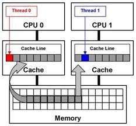

假设不同的共享数据（相邻地址的区域）存入同一缓存行，从处理的角度看，某个数据改变都将导致同一缓存行中的其它数据无效。这种场景叫做**伪共享**。对 LL/SC 基本类型而言，错误共享具有破坏性。这些基本类型的执行依赖于缓存行。加载连接（LL）操作连接缓存行，而存储状态（SC)）操作在写之前，会检查本行中的连接标志是否被重置。如果标志被重置，写就无法执行，SC返回 false。考虑到缓存行的长度 L相当长，那么任何缓存行的变更，即和目标数据不一致，都会导致SC 基本类型返回 false。结果产生一个活锁现象：在此场景下，就算多核处理器满负载运行，依然无用。

为了处理错误共享，每个共享变量必须完全处理缓存行。通常借用**填**（padding）来处理。缓存的物理结构影响所有的操作，不仅仅是 LL/SC，也包含CAS。在一些研究中，采用一种特殊的方式创建数据结构，该方式有考虑缓存结构（主要是缓存行长度）。一旦数据结构被恰当地构建，性能就会有极大的提升。

```
struct Foo {
       int volatile nShared1;
       char   _padding1[64];     // padding for cache line=64 byte
       int volatile nShared2;
       char   _padding2[64];     // padding for cache line=64 byte
};
```

###CAS衍生类型

同样，我乐意介绍两种更有用的基本类型：double-word CAS (dwCAS) 和 double CAS (DCAS)。

Double-word CAS 和通用 CAS 相似，不同的是前者运行在双倍大小的内存单元中：32位体系结构是64比特，64位体系结构是128比特（要求至少96比特）。有鉴于此架构提供 LL/SC 而非CAS，LL/SC 应该运行在 double-word 之上。我了解的情况是仅有 X86 支持 dwCAS。那么为什么 dwCAS 如此有用呢？借助它可以组织一种 ABA 问题的解决方案——tagged pointers。此方案依赖于每种相关的共享 tagged pointer 整数。tagged pointer 可以通过以下结构加以描述：

```
template <typename T>
struct tagged_pointer {
      T *       ptr ;
      uintptr_t tag ;
 
    tagged_pointer()
      : ptr( new T )
      , tag( 1 )
    {}
};
```
为了支持原子性，本类型的变量必须与 double-word 对齐：32位架构是8字节，64位架构是16字节。tag 包含 “版本号” 数据，ptr 指向此数据。我会在接下来的某篇文章中详尽介绍 tagged pointers，集中介绍安全内存回收和安全内存回收。目前仅讨论内存，一旦涉及 T-type 数据（以及其对应的tagged_pointer），都不应该物理删除，而是移入到一个 free—list 中（对每个T-type进行隔离）。未来随着tag增长，数据得以分布式存储。ABA问题解决方案：现实中，此指针式很复杂的，tag 包含一个版本号（分布式位置编号）。如果tagged_pointer 指针类型和 dwCAS 参数相同，但 tag 的值不同，那么 dwCAS 不会成功执行。

第二种原子性原语——double CAS (DCAS) ，是纯理论，没有在任何现代处理器架构中实现。DCAS 伪代码如下：

```
bool DCAS( int * pAddr1, int nExpected1, int nNew1,
           int * pAddr2, int nExpected2, int nNew2 )
atomically {
    if ( *pAddr1 == nExpected1 && *pAddr2 == nExpected2 ) {
         *pAddr1 = nNew1 ;
         *pAddr2 = nNew2 ;
         return true ;
    }
    else
         return false
}
```

DCAS 运行子两个随机排序内存单元上。若当前值与预期值一致，可改变这两个内存单元的值。

为何此基本类型如此有意思呢？因为它容易构建一个无锁双链表（deque）。数据结构是许多有趣算法的基础。许多学术性工作关注的数据结构<del>，</del>都基于 DCAS。尽管这个基本类型在硬件中还没有实现，依然有一些工作（比如[Fra03]- 最流行的一种）描述了基于常规 CAS 的 DCAS构建（针对任意多个 pAddr1…pAddrN 地址的 multi-CAS ）算法。

###性能

那么原子性原语性能如何？

现代处理器是如此的复杂、难于预测，以至于程序员对计算机指令常常难以适从。特别是原子性指令，其工作机制涉及内部同步、处理器总线信号等等。许多工作正在试着测试处理器指令长度。而我所提及的测试来自[McKen05]。在这篇文章中，作者比较了原子性增长（atomic increment）和 CAS 基本类型长度和nop（no-operation）长度。比如Intel Xeon 3.06 hHz 处理器（2005 model）原子性增长长度为400 nop，CAS 长度 850-1000 nop。IBM Power4 1.45 hHz 处理器原子性增长长度为180 nop， CAS长度为250nop。测试时间有些久远，处理器架构有了一些不小的进步，不过我猜还是在同一数量级上。

正如你所看到的那样，原子性原语是相当复杂的。所以不加取舍，任何场景下都用它是相当不利的。例如，二进制树搜索算法采用 CAS 读取当前树的节点，我不看好此类算法。毫无意义，每一代Intel核心架构，其CAS都会变得更快。显然，Intel付出很多努力去改进微型架构。

###Volatile和原子性

C++中有一个神秘的关键字Volatile。很多时候，Volatile被认为与原子性以及校准（regulation）有关。其实这是不对的，当然存在这样的认识是有历史原因的。Volatile仅仅是防止编译器将值缓存入寄存器（编译器优化、寄存器越多，编译器在其中缓存的数据也越多）。读取Volatile变量意味着永远从内存中读取，Volatile变量的写是直接写入内存中。倘若并发地改变Volatile数据，需要注意这一点。

实际上我们并没有这么做，主要是缺乏内存栅栏。某些语言如Java、C#，volatile被赋予一个神奇的状态值来提供校准。不过C++11中并没有这么做。volatile 并没有任何特殊的校准，现在我们知道恰当的校准对原子性来说是必须的。

因此，在C++11兼容的编译器没有必要为原子性变量提供volatile。不过在以往的编译器中，采用volatile还是很有必要的，如果你想自己实现原子性。在下面的声明中：

```
class atomic_int {
    int m_nAtomic;
  //….
};
```

编译器有权优化 m_nAtomic 调用（尽管是间接调用）。因此，时常在此声明一个int volatile m_nAtomic是很有用的。

###libcds

那么我们能从 [libcds](http://libcds.sourceforge.net/) 库得到什么？我们已经在x86、amd64、 Intel Itanium и Sparc架构中，以C++11的方式实现了原子性原语。倘若编译器不支持C++11， libcds 可以采用自己的原子性实现。构建无锁数据结构，除去常规的原子性写读，最主要的基本类型就是CAS，而DwCAS用的很少。截止目前，libcds库还没有DCAS和multi-CAS的实现，但未来这些都很有可能出现。很多研究表明，唯一的制约因素是，实现DCAS 算法[Fra03]太困难了。尽管如此，我已经提到个别高效的准则在无锁的世界已经存在。目前效率低下的是硬件部分，相信随后的日子针对不同的硬件和任务，这些都会变得极其高效。

接下来的基础篇文章，我会详尽介绍内存序列化和内存栅栏。

本文引用:

[Cha05] Dean Chandler [Reduce False Sharing in .NET](http://software.intel.com/sites/default/files/m/3/4/d/7/e/29393-218129_218129.pdf), 2005, Intel Corporation

[Fra03] Keir Fraser [Practical Lock
Freedom](http://www.cl.cam.ac.uk/techreports/UCAM-CL-TR-579.pdf), 2004; technical report is based on a dissertation submitted September 2003 by K.Fraser for the degree of Doctor of Philosophy to the University of Cambridge, King's College

[McKen05] Paul McKenney, Thomas Hart, Jonathan Walpole [Practical Concerns for Scalable Synchronization](http://web.cecs.pdx.edu/~walpole/class/cs533/papers/sosp2005.pdf)

[Mic04] Maged Michael[ ABA Prevention using single-word
instruction](http://www.research.ibm.com/people/m/michael/RC23089.pdf), IBM Research Report, 2004


<hr>


####<p>原文出处：<a href='http://blog.jobbole.com/101977/' target='blank'>无锁数据结构（基础篇）：内存栅障</a></p>

英文出处：[Paul E. McKenney](http://irl.cs.ucla.edu/~yingdi/web/paperreading/whymb.2010.06.07c.pdf)

> 译者注：内存栅障：作为一种同步手段，用于保持线程集合在其运算控制流的某个逻辑计算点上的的协调性。运算线程集内的线程必须等待该集合中所有其他线程都执行完某个运算后，才能继续向下执行。确保在所有线程全部到达某个逻辑执行点前，任何线程都不能越过该逻辑点。更多内容参见《多核程序设计技术》

内存栅障是多核处理器软件设计者不太了解的东西，究竟是什么原因促使 CPU 设计者引入它呢？

简单地说，因为内存引用重新排序可以很好地提升性能，而内存栅障和同步原语相似可以保证内存引用的有序性。代码能否正确执行取决于内存引用是否有序。

要详尽地回答这个问题，需要从CPU缓存的工作机制入手，特别是如何做确保缓存很好地工作。这包含以下几个部分：

  1. 单个缓存结构；
  2. 缓存一致性协议如何确保多核CPU与内存中某个位置上值的一致性；
  3. 如何通过存储缓冲、失效队列提升缓存性能以及确保缓存一致性协议。

如你所见，内存栅障是一种必需的罗煞（evil），用来确保系统的高性能和分布式。罗煞根植于这样一个事实，多核CPU处理速度高出互联部分（interconnects）好几个数量级，互联部分位于多核CPU和其待访问内存之间。（译者注：CPU周期受制于存储周期）

###1、缓存结构

如今，多核CPU处理速度远快于内存系统的存取速度。一个2006年产的CPU每纳秒可能执行十个指令，但却需要几十纳秒获取内存中的某个数据项。这种跨越两个数量级的速度差异，最终导致现代多核CPU上多个兆字节缓存的出现。通常缓存在几个处理周期就可以被访问到，缓存和多核CPU的关系如下面图一所示：

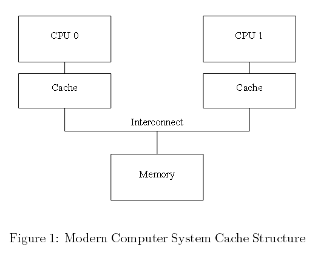  
图一 现代计算机系统缓存结构

数据在多核CPU缓存和内存之间以固定大小的模块进行迁移，这种模块称为“缓存行”。该模块的大小通常为2的幂次方，范围从16到256字节不等。当某个CPU第一次访问特定的数据项时，该数据项在CPU缓存中是缺失的，这时会出现“缓存缺失”。这意味着，数据项是从内存中获取的。此时，在成百上千个处理周期内CPU都在空转。然而，一旦数据项加载进CPU缓存，接下来的访问就能够在缓存中获取，同时CPU会全速运转。（译者注：第一次拿到的数据后，将其拷贝放一份在缓存中，CPU再次访问时直接从缓存中读取数据）

过不了多久，这些CPU缓存就会被数据填满。接下来的缓存缺失，则需要清除缓存中已有的某个数据项，为新获取的数据项腾出空间。此类缓存缺失称之为“容量缺失”，这是
由缓存容量有限引起的。不过，多数缓存在数据还没有存满的时候，就可以强行清除旧的数据项，为新的数据项腾出空间。这是因为，大缓存是由硬件哈希表实现，这种哈希表拥有固定大小的哈希桶（CPU设计者将哈希桶称为“集合”）。哈希表之间彼此毫无关联，如下面图二所示：

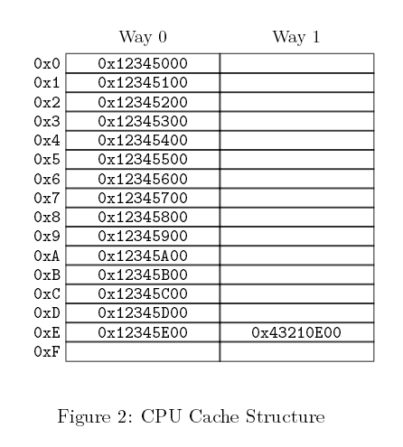  
图二 CPU缓存结构

此缓存有两“道（way）”，每道16个“集合（set）”，总计32“行（line）”。每个入口包含一个大小256字节的“缓存行”，这是一个256字节对齐的内存块。缓存行稍微小了点，不过十六进制的算术运算会变得更加简单。用硬件的术语描述，这是一个两道集合关联的缓存，类似于一个拥有16个桶的软件哈希表，每个桶哈希链最多有两个元素。缓存行的大小和关联性合起来称之为缓存“几何学（geome-try）”。正是因为缓存是在硬件中实现的，哈希函数相当简单，从内存地址中获取四个字节。

在图二中，每个盒子（译者注，即每行）对应一个缓存入口，包含256个字节的缓存行。像图中空盒子所展示的那样，缓存入口也可能为空。余下的盒子由该缓存行的内存地址表示。缓存行必须是256个字节对齐，因此每个地址的低八位是0。采用硬件哈希函数意味着，接下来4个高位和哈希行数是吻合的。

如图二所示，可能会出现这样一种情形：当程序代码位于0x43210E00和0x43210EFF地址之间，该程序依次获取0x12345000到0x12345EFF之间的数据。假设该程序正在访问地址0x12345F00，该地址被哈希为行0xF，该行的两道都为空，可提供256字节的行空间用于存储。假如程序访问地址0x1233000，该地址被哈希为行0x0，因此相应的256个字节的缓存行可存储在该行一号通道（way 1）中。然而倘若程序的访问地址为0x1233E00，该地址的哈希行为0xE；其中一个已有行必须清零，为新的缓存行数据腾出空间。假如这个被清理的行随后被再次访问，就会发生一次缓存缺失。这样的缓存缺失成为为“相关性缺失”。

截止目前，我们仅仅考虑了单个CPU读取某个数据项的情形，那CPU在写操作的时候又会发生什么呢？多核CPU保持某个数据项与值的一致性非常重要。某个CPU写入数据项之前，必须首先将该数据项从其CPU缓存中移除或者“失效（invalidate）”。一旦失效，该CPU或许就能安全地修改此数据项。倘若数据项在该CPU缓存中，但设置为只读，此处理过程称之为“写缺失”。一旦某个CPU完成对其它CPU缓存中某个数据项的失效运算，该CPU就可以反复读写那个数据项。

稍后，倘若有其它CPU试图访问该数据项，很有可能发生一次缓存缺失。这一次，第一个CPU失效数据项为了写入数据。此类型的缓存缺失称之为“通信缺失”，通常是由多个CPU利用某些数据项通信引起。比如单个锁就是一个数据项，由互斥算法实现的，用于多核CPU通信。

显然，小心谨慎是必须的，确保多核CPU维持一个连贯的数据视图。所有的CPU都在进行获取、失效以及写运算。因此不难想象，数据会发生丢失甚至更糟，或者出现同一数据项在多个CPU缓存中含有不同的值。诸如此类的问题，都可借由下一单元中描述的“缓存一致性协议”加以解决。

###2、缓存一致性协议

缓存一致性协议管理缓存行的状态，防止数据不一致，或者丢失。这些协议相当复杂，大约存在十几种状态，不过我们需要做的是仅仅关注四种状态的MESI缓存一致性协议。

####2.1、MESI状态

MESI表示修改、独占、共享、失效，缓存行在此本协议中用到这四种状态。依靠本协议，缓存可以维护2个比特的状态“标签”，并将此标签追加到缓存行的物理地址和数据
后面。

处于“修改”状态的缓存行，只属于某一个最新内存存储所对应的CPU，这就确保该内存单元不会出现在其它CPU的缓存中。可以说，处在“修改”状态的缓存行被某个CPU“独有”。此缓存仅持有最新的数据副本，所以该缓存负责将数据写回内存或者将数据写入其它缓存。同样地，本缓存需要存储其它数据时也必须同样操作，将数据写回内存或者写入其它缓存中。

独占状态与修改状态相似，唯一的区别是缓存行还未被相应的CPU修改。这也就意味着缓存行中的数据副本是最新的。当然，考虑到该CPU在任何时候均可在本行中存储数据，无需与其它CPU协商，处于独占状态的缓存行依然被该CPU独有。也就是说，在内存中缓存对应的值是最新的。因此，缓存可以丢弃该数据，无需将其写回内存或者传递给
其它CPU。

处于共享状态的缓存行数据会在于其它一个或多个CPU的缓存中存储。因此，该CPU需要先与其它CPU协商然后存储该缓存行存储数据。与独占状态一样，缓存行对应的内存数据为最新的。本缓存可以丢弃该数据，无需将其写回内存或传给其它CPU。

处在“失效”状态的缓存行是空的，换句话说，它不持有任何数据。一旦新数据进入该缓存，如果可以，该数据会被放入一个处于失效的缓存行中。本方法为一种优先选项，因为替换某个处在任何一种其它状态的缓存行，都会导致巨大的缓存缺失开销。这些被替代的缓存行数据，原本在未来某个时间点应该被再次引用。

因为所有CPU必须在缓存行中维护一个连贯的数据视图，缓存连贯性协议提供了一组消息，用来协调系统中缓存行之间的数据迁移。

####2.2 MESI协议消息

如前文所述，许多的状态转换需要CPU之间通信。倘若所有CPU共享一条总线，以下的消息足以满足通信的需要：

读消息：“读”消息包含待读取缓存行的物理地址。

读响应：“读响应”消息包含了早先“读”消息请求的数据。<del></del>“读响应”消息可能来自内存或者其它缓存。例如，某个处于“修改”状态的缓存持有需要的数据，该缓存必然提供“读响应”消息。

失效：“失效”消息包含失效数据缓存行的物理地址，其它缓存必须移除这些数据，并作出响应。

失效确认：<del></del>接收“失效”消息的CPU，移除缓存中特定数据后，必须以“失效确认”消息作出响应。

读失效：“读失效”消息包含待读取缓存行的物理地址，与此同时，指导其它缓存移除数据。因此可以说，它是“读”和“失效”的某个联合。一个“读失效”消息同时需要一个
“读响应”和一组“失效确认”消息作为回应。

回写：“回写”消息包含待写回的内存地址和数据（或者写入其它CPU缓存中）。本消息允许缓存在必要的时候，<del></del>剔除处在“修改”状态的缓存行，为其它数据腾出空间。

有趣的是，单个共享内存多核系统的底层其实就是一个消息传送计算机。这就意味着采用分布式共享内存的SMP机群，利用消息传递机制在系统架构的两个不同层次实现内存共享。

快速问答1：倘若两个CPU同时让某个缓存行失效会发生什么？

快速问答2：一旦某个“失效”消息出现在一个大的多核处理器中，每个CPU必须对此作出一个“失效确认”回应。那“失效确认”回应导致的总线“风暴”会不会致使系统总线完全饱和？

快速问答 3：倘若SMP机器真的利用消息传输机制，会给SMP带来哪些困惑呢？

####2.3 MESI 状态图

如下面图三所示，协议消息不断进行发送和接收时，某个既定缓存行状态会不断发生变化。

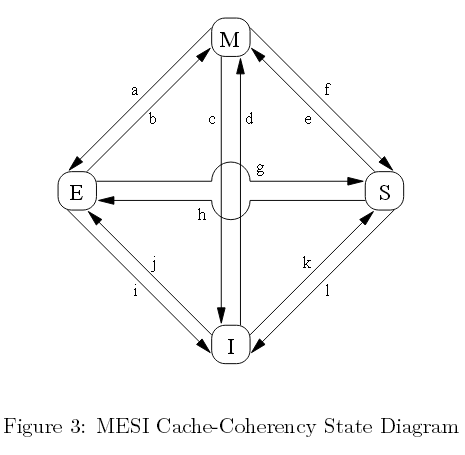  
图三 MESI缓存一致性状态图

图中的弧度转换如下：

转换（a）：某个缓存行数据项被写回内存，不过CPU依然保留此缓存行，并保留进一步修改它的权限。本转换需要一个“回写”消息。  
转换（b）：CPU获得缓存行独有访问权限后会写入数据项，本转换无需接收或发送任何消息。

转换（c）：针对某个已修改状态的缓存行，CPU接收一个“读失效”消息。CPU必须让本地副本失效，接着用一个“读响应”和一个“失效确认”消息作出回应，并发送数
据给请求CPU，表明此数据项不再是一个本地副本。

转换（d）：CPU在一个数据项上执行一个原子性读-修改-写（read-modify-write）运算，但该数据项并不在该缓存中。此时CPU需要发送一个“读失
效”，并通过一个“读响应”接受数据。一旦CPU完成缓存行的状态转换，便会接受一组“失效确认”响应。

转换（e）：CPU在一个数据项上执行原子性读-修改-写运算，该数据项存在于只读缓存中。本CPU必须发出“失效”消息，在完成转换之前，必须等待一组“失效确认”响应。

转换（f）：其它CPU读取本CPU的缓存行，该CPU缓存行持有一个只读副本，也可能将缓存行副本写回内存中。在接收一个“读”消息时发起转换，本CPU会回复一个包含请求数据的“读响应”。

转换（g）：其它CPU读取本缓存行的某个数据项，此数据来自本CPU缓存或内存。同样，本CPU持有一个只读副本。转换是在接收一个“读”消息时发起的，本CPU会
回复一个包含请求数据的“读响应”。  
转换（h）：随后，本CPU将某些数据项写入本缓存行中，因此发出一个“失效”消息。CPU在完成转换之前，需要获得一组完整的“失效确认”响应。另外，其它CPU通过“回写”消息将此缓存行从它们的缓存中剔除出去（假设为其它缓存行腾出空间），因此本CPU是最后一个缓存该数据的CPU。  
转换（i）：其它CPU在一个由本CPU持有的缓存行数据项上，执行一个原子性读-修改-
写运算，因此本CPU使缓存失效。本转换是在接收一个“读失效”消息后发起的，本CPU会回复一个“读响应“和一个“失效确认”消息。

转换（j）：本CPU将单个数据项存入某个缓存行中，然而在此之前，此缓存行并不在本CPU的缓存中，因此需要发送一个“读失效”消息。CPU完成转换前，需要接收“读响应”和一组完整的“失效确认”消息。一旦存储完成，通过转换（b），缓存行就能转换为修改状态。

转换（k）：本CPU加载数据项到某个缓存行，然而在此之前，该缓存行并不在本缓存中。本CPU发送一个“读”消息，并依据接收到的“消息响应”完成转换。

转换（l）：一些其它的CPU在本缓存行执行一个数据项存储运算，持有处于只读状态的本缓存行，这样该缓存行亦可以被其它CPU缓存所持有（比如当前CPU缓存）。本
转换在接收一个“失效”消息开始，同时本CPU回复一个“失效确认”消息。

快速问答 4：那么硬件如何处理如上所述的延迟转换？

####2.4 MESI协议示例

让我们从缓存行有利于数据运算的角度来审视该协议。最初，在四个 CPU的系统中，数据存储在内存地址0，随后该数据穿越不同的单行直接映射缓存。表格1展示了数据流向，第一列为运算编号，第二列为执行该运算的CPU，第三列为执行的运算，接下来的四列为每个CPU缓存行的状态（紧跟MESI状态的是内存地址），最后两列表示对应的内存内容是否为最新（“V”）或者无效（“I”）。

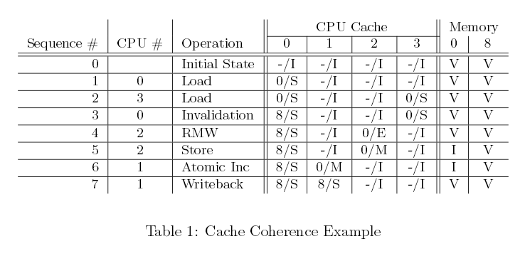

表一 缓存一致性示例

开始，存储数据的缓存行处于失效状态，它在内存中是有效数据。当CPU0加载地址0的数据时，CPU0缓存行便进入“共享”状态，该数据在内存中依旧有效。同样，CPU3加载0地址数据，因此该数据处于“共享”状态，同时存在于两个CPU缓存中，而且在内存中依旧有效。接下来，CPU0加载其它缓存行（地址8），通过一个无效运算将0地址数据强制剔除出本缓存，即以地址8的数据替代地址0中的数据。此刻CPU2从地址0加载数据。该CPU很快意识到它马上要存储此数据，因此利用一个“读无效”消息获取一个独占副本，同时使CPU3缓存中该副本失效。接着CPU2执行预期的存储运算，并将状态改为修改。此时内存中的数据备份已经过期失效。CPU1执行一个原子性增加的运算，利用一个读无效”从CPU2缓存中取值，并将其判为失效。于是CPU1缓存中的数据备份处在“修改”状态（与此同时，内存中的备份依旧过期）。最终，CPU1读取地址为8缓存行，利用“回写”消息将0地址数据写回到内存。

需要注意的是，操作完成后一些CPU缓存中依旧存有数据。

快速问答 5 ：按照什么的顺序去执行运算，所有CPU缓存会回到“无效”状态？

###3 存储导致的非必需延滞

图一中的缓存结构可以提高单个CPU反复读写某个数据项性能，但首次写入某个缓存行的性能却是非常糟糕。为了一探究竟，请查看图四。该时间列表显示CPU0一个写数据到CPU1缓存所持有的缓存行中。CPU0必须等待直到缓存行写入，因此CPU0会有一个额外延滞的时间周期。

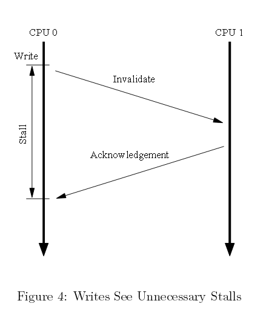

图四 非必要写阻塞

但是，没有理由强制CPU0滞后那么长时间。毕竟，不管CPU1输入缓存行数据有怎样变化，CPU0都可以无条件重写该缓存行。

####3.1 存储缓冲（Store Buffers）

如下面图五所示，预防这种非必须写延滞的第一种方式是在每个CPU和其缓存行之间添加“存储缓冲”。有了这些额外的存储缓冲，CPU0可以简单地将它的写记入存储缓冲并继续运行。一旦缓存行最终从CPU 1迁入CPU 0，数据必会从存储缓冲迁入缓存行中。  

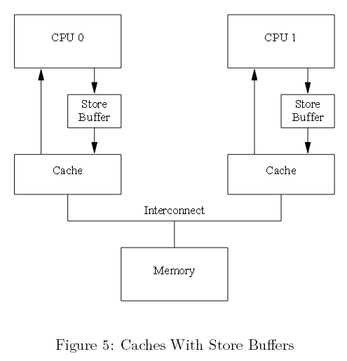

图五 带有存储缓冲的缓冲

然而，这种机制过于复杂，必须简化。请看接下来的两个章节。

####3.2 存储指向（store forward）

先来看第一种复杂情况，违反自我一致性原则。考虑以下代码两个初始值均为零的变量“a”和“b”，由CPU 1持有包含变量a的缓存行，以及由CPU0持有包含变量b的缓存行。

```
a = 1;
b = a + 1;
assert(b == 2);
```

大家肯定认为上面的断言不会失败。然而，如果程序愚蠢到采用图五所示的简单架构，那结果可能会让大家失算。这样的系统可能会遇到以下一系列事件：

1.CPU 0 开始执行a=1；  
2.CPU 0 在缓存中查找a，发现它是缺失的；  
3.CPU 0 因此发送一个“读无效”消息，以便独占这个包含a的缓存行；  
4.CPU 0 将存储a命令记录在该存储缓冲中；  
5.CPU 1 接收到“读无效”消息，发送本缓存行，并在本缓存中清除该行；  
6.CPU 0 开始执行b=a+1；  
7.CPU 0 接收来自CPU 1的缓存行，依旧持有一个值为零的变量a；  
8.CPU 0 CPU记载来自缓存的a，同时发现其值为零；  
9.CPU 0 申请进入，从该存储队列到最新缓存行，并将该缓存中a的值设置为1；  
10.CPU 0 为上述已加载的值为零的a加1，并将其存入包含b的缓存行中。（假定它已为CPU 0 所有）  
11.CPU 0 执行assert（b==2），失败。

问题是我们有两个a的副本，一个在缓存中，一个在存储缓冲中。

上面的例子打破了一个很重要的保证，即每个CPU都会一直掌握自己的运算，如同该运算发生在程序顺序（program order）中的那样。从软件开发者的角度，这种保证是严重违反常理的；与此同时，硬件开发人员也会觉得可惜并且为此实现了“存储转发”。这样每个CPU在执行加载时，像下面图六中展示的引用缓存一样引用它的存储缓冲。换句话说，某个CPU存储运算可以不通过缓存，直接执行后续加载。  

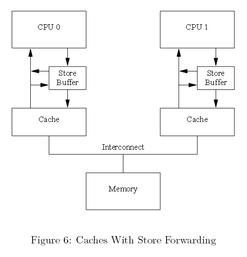

图六 带有存储指向的缓存

这里利用存储指向，上面序列中第八条能够在存储缓冲a种找到正确的值“1”，因此b最终的值是2，与预期一致。

####3.3 存储缓冲和内存栅障

接着看第二种复杂情况，这种情况违反全局内存排序原则。假定以下代码序列变量“a”和“b”初始值为零：

```
void foo(void)
{
  a = 1;
  b = 1;
}
 
void bar(void)
{
  while (b == 0) continue;
  assert(a == 1);
}
```
假定CPU 0执行foo()，接着CPU 1执行bar()。进一步假设包含a的缓存行仅存在于CPU 1缓存中，包含b的缓存行由CPU 0 持有。那么，运算运算顺序或许是这样的：

1.CPU 0 执行a=1，缓存行不在CPU 0 的缓存中。因此CPU 0会将a的新值放入存储缓冲中，并发送一个“读无效”消息。
2.CPU 1 执行while(b==0) continue，但包含b缓存行不在缓存中，因此发送一个“读”消息。  
3.CPU 0 执行b=1，此刻它已经拥有这个缓存行（换句话说，缓存行已经处在修改或者独占状态），因此它会存储b的新值于缓存行中。  
4.CPU 0 接收“读"消息，发送包含更新后b的缓存行给CPU 1，同时将该行标记为“共享”状态。  
5.CPU 1 接收包含b缓存行，并将其放入自己的缓存中。  
6.CPU 1 此刻可以完成while(b==0)，因为它找到了b的值是1。接着处理接下来的执行语句。  
7.CPU 1 执行assert（a==1），因为CPU 1 正作用于a的旧值，因此此断言失败。  
8.CPU 1 接收“读无效”消息，然后将包含a缓存行发送给CPU 0 ，并将本缓存的缓存行失效，但为时已晚。  
9.CPU 0 接收包含a的缓存行，申请缓冲中存储，从而免于陷入CPU 1的失败断言中。

快速问答 6： 在步骤1中，为何CPU 0 需要发送一个“读无效” 而非一个简单的“无效”？

对此硬件设计者深感无力，CPU无法判断哪些是相关变量，更不用说它们之间的关联关系。因此，硬件设计者为软件开发人员提供了内存栅障指令，告诉CPU变量之间的关联
关系。必须更新程序片段（program fragment）加入内存栅障：

```
void foo(void)
{
  a = 1;
  smp_mb();
  b = 1;
}
 
void bar(void)
{
  while (b == 0) continue;
  assert(a == 1);
}
```

内存栅障smp_mb()会触发CPU刷入存储缓冲中，在这之前它会申请后续存储（subsequent store）到缓存行中。CPU既可以一直等待直到存储缓冲为空。或者利用存储缓冲持有后续存储，直到存储缓冲前面所有的入口执行完毕为止。

用这种办法，运算流程会像下面这样：

  1. CPU 0 执行a=1，缓存行不在CPU 0 的缓存中，因此CPU 0 会将a的新值放入存储缓冲中，并发送一个“读无效”消息；
  2. CPU 1执行while(b==0) continue，但包含b的缓存行不在本缓存中。因此，它发送一个“读”消息；
  3. CPU 0 执行smp_mb()，完成当前所有的存储缓冲准入（store-buffer entries）（即a=1）；
  4. CPU 0 执行 b=1，它已拥有本缓存行（缓存行已处于修改或者独占状态），不过存储缓冲中存在一个标记了的入口。因此不用将新值b放入缓存行中，相反它将其放入存储缓冲中（一个没有标记的入口中）；
  5. CPU 0 接收CPU 1 的“读”消息，发送一个包含原始值的变量b到CPU 1，同时将本缓存行副本设置为“共享”；
  6. CPU 1 接收包含“b”的缓存行，然后把它放入自己的缓存中；
  7. CPU 1 此刻可以执行完while(b==0) continue。但由于它发现b值仍然是0，会重复while语句。b的新值此刻安全的藏匿于CPU 0的存储缓冲中；
  8. CPU 1 收到CPU0的“读无效”消息，发生包含a的缓存行给CPU 0，并将本缓存中的缓存行设无效；
  9. CPU 0 接收包含a的缓存行，申请缓存中存储，并缓存行设为修改状态；
  10. 由于存储a是存储缓冲中唯一的入口，被smp_mb()标记。所以CPU 0 同样也可以存储b的新值，包含b并处于共享状态的缓存行除外；
  11. 接着CPU 0 发送一个“无效”消息到CPU 1；
  12. CPU 1 接收CPU 0的“无效”消息，设置包含b的缓存行为无效，并发送一个“确认”消息给CPU 0；
  13. CPU 1执行while(b==0) continue，但包含“b”缓存行不在本缓存中。因此它会发送一个“读”消息给CPU 0；
  14. CPU 0接收“确认”消息，并将包含b的缓存行设置为独占状态。CPU 0将带有最新值的b放入缓存行；
  15. CPU 0接收“读”消息，发送这个包含带有新值的b的缓存行给CPU 1。同样它会标记本缓存行的副本为“共享”；
  16. CPU 1接收包含b的缓存行，并将其放入自己的缓存中；
  17. CPU 1此刻可以完成while(b==0) continue，因此它可以发现b的值为1，接着执行接下来的语句；
  18. CPU 1执行assert(a==1)，但包含a的缓存行不再缓存中。一旦它得到来自CPU 0的缓存行，便采用a变量最新的值，断言会通过。

如你所见，本进程的记账薄（bookkeeping）数据不会很少。即使直观上觉得简单，但诸如“加载a的值”却可能涉及处理器中许多复杂的步骤。

###4、存储序列导致的非必需延滞

不幸的是，每个存储缓冲规模必须保持相对较小，这样单个CPU执行的一个最适中的存储序列才能放入它的存储缓冲中（这可能导致缓存缺失）。这种情况下，CPU必须再次
等待无效命令完成以便清掉该存储缓冲的数据，然后CPU才能继续往下执行。在内存栅障之后，此情景依然会快速出现，因为所以后续存储指令必须等待所有无效执行完毕，无论这些存储是否会导致缓存缺失。

这款情形可以通过加速无效确认消息得到改善。其中一种实现方式可以利用每个CPU无效消息队列或“无效队列”。

####4.1 无效队列

无效确认消息传递时间过长的一个原因，它们必须确保相应的缓存行确实已被置为失效。假如缓存很忙，那这个失效可能被延迟，比如CPU正在进行密集的数据加载和存储，而所有这些数据就在缓存中。另外，如果大规模的无效消息在短时间抵达，该CPU陷入无效消息的处理中，并且有可能阻塞其它CPU。

然而，本CPU无需在发送确认之前，使缓存行变得无效。相反，它收集这些无效消息表明这些消息会在未来处理。在此之前CPU就该缓存行还可以发送任何其它消息。

4.2 无效队列和无效确认

下面图七种展示的是一个带有无效队列系统。单个CPU带有单个无效队列，在该无效消息放入队列后或许就能被确认，而非等到相应的缓存行无效。当然，CPU必须指向它的
无效队列，准备发送无效消息。倘若相应的缓存行入口在无效队列中，CPU不能立即发送无效消息；相反，它必须等待直到无效队列入口已被处理。

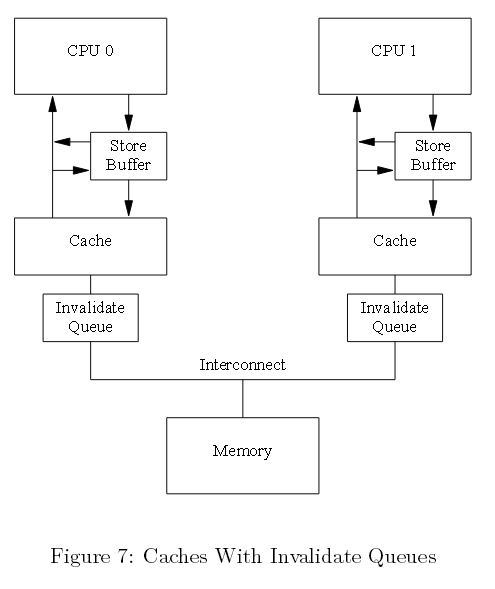  
图七 带有无效队列的缓存

将某个入口放入无效队列一个很重要的承诺是，CPU处理完该入口后，就可以发送该缓存行各种类型的MESI协议消息。只要相应的数据结构没有大的竞争，诸如此类的承诺
对CPU而言还是很便捷的。

事实上，无效消息可以缓冲到无效队列中，可能会造成内存无序。接下来我们会探讨这些。

####4.3 无效队列和内存栅障

假定CPU收集无效响应，实时作出回应。本方法尽可能减小CPU存储带来的缓存无效延迟，但这缺破坏了内存栅障，具体请看下面的例子。

假定a和b的初始值为0，a处在只读状态（MESI共享状态）；b为CPU0所有（MESI独占或修改状态）。接着假定CPU 0 执行foo()，同时CPU1执行函数bar()，代码片段如下面所示：

```
void foo(void)
{
  a = 1;
  smp_mb();
  b = 1;
}
 
void bar(void)
{
  while (b == 0) continue;
  assert(a == 1);
}
```

接下来的运算，操作的执行顺序如下：

  1. CPU 0 执行a=1，其对应的缓存行在CPU 0中，且为只读。因此CPU 0将带有新值a放入本存储缓冲中，并发送一个无效消息以便清除CPU 1缓存中对应的缓存行；
  2. CPU 1执行while(b==0) continue，但b缓存行不在本缓存中，因此发送一个“读”消息；
  3. CPU 1接收CPU 0的“无效”消息，收入队列中，并快速做出响应；
  4. CPU 0接收来自CPU 1的响应，因此它可以继续处理 smp_mb()在第4行以上的代码，将本存储缓冲中的a放入缓存行中；
  5. CPU 0 执行b=1，它早已拥有本缓存（处在修改或者独占状态），因此它会将b的新值存入本缓存行中；
  6. CPU 0接收一个“读”消息，发送包含此刻已更新（now-updated）b的缓存行到CPU 1，同样也将本行标记为共享；
  7. CPU 1接收包含b的缓存行，并放入本缓存中；
  8. CPU 1 此刻可以执行完while(b==0) contiune，发现b的值为1，因此可以处理下面的语句；
  9. CPU 1 执行assert(a==1)，a的旧值依然存于CPU 1 的缓存中，因此本断言失败；
  10. 尽管断言失败，CPU 1处理了队列中的“无效”消息，（延迟）使得包含a缓存行在本缓存中失效。

快速问答7：在4.3节情景1的第1步中，为何发送“无效”而非“读无效”消息？CPU 0 无需其它变量的值共享本缓存行？

这里倘若加速无效响应，就会忽视内存栅障的有效性。然而，内存栅障指令可以和无效队列交互。因此一旦某个CPU执行内存栅障，就便会标记无效队列中当前所有入口，强制后续的任何加载等待，直到所有标记的入口应用于CPU缓存中。因此，可以给bar方法添加如下一个内存栅障：

```
void foo(void)
{
  a = 1;
  smp_mb();
  b = 1;
}
 
void bar(void)
{
  while (b == 0) continue;
  smp_mb();
  assert(a == 1);
}
```
快速问答8 ：这说明了什么？假设while循环完成之后，CPU才能执行assert()方法，为何我们还要添加这个内存栅障？

这样一来，运算序列或许就变成下面这样：

  1. CPU 0 执行a=1，对应的缓存行在CPU 0缓存中，且为只读，因此CPU 0将a的新值放入此存储缓冲中，并且发送一个“无效”消息，以便刷掉CPU 1缓存中对应的缓存行；
  2. CPU 1执行while(b==0)continue，但包含b的缓存行不在本缓存中，因此它发送一个“读”消息；
  3. CPU 1接收CPU 0的“无效”消息，放入队列并立即给出响应；
  4. CPU 0接收来自CPU 1的消息，因此接着可以处理 smp_mb()所在第四行以上的代码，将a值从存储缓冲放入缓存行；
  5. CPU 0 执行b=1，它已拥有该缓存行（换言之，本缓存行已处在修改或独占状态），因此它将b的新值放入本缓存行中；
  6. CPU 0 接收“读”消息，发送一个包含b的此刻最新值（now-updated value）缓存行给CPU 1，同时，将本缓存中的该行设置为共享状态；
  7. CPU 1接收包含b的缓存行，并放入本缓存中；
  8. CPU 1此刻可以完成while(b==0) continue，因为它发现b的值为1，可以继续执行下面的语句，即一个内存栅障；
  9. CPU 1 阻塞，直到处理完本无效队列先前存在的消息；
  10. CPU 1此刻执行队列中的“无效”消息，并使本缓存中包含a的缓存行失效；
  11. CPU 1 执行assert(a==1)，因为包含a的缓存行不在CPU 1 缓存中，发送一个“读”消息；
  12. CPU 0 响应该“读”消息，发送包含a新值的缓存行；
  13. CPU 1接收该缓存行，此a的值为1，因此没有引发该断言。

即使传输非常多的MESI消息，所有CPU依然能作出准确的效应。本节解释了为什么CPU设计者为何必须谨慎对待缓存一致性优化。

###5、内存栅障读写

在前一节里，内存栅障被用来标记存储缓冲以及无效队列入口，但在我们的代码片段中，foo()没有理由做任何与无效队列有关的事情。相似地，bar()没有理由做任何
与存储队列相关的事情。

因此，很多核CPU架构提供了一种很弱的内存栅障指令，只作用于其中一种或两种都做。简单地说，一个“读内存栅障”仅仅标记无效队列，一个“写内存栅障”仅标记存储缓
冲，还有一种两者都做的全功能内存栅障。

这样做的目的是一个读内存栅障仅在执行它的CPU中执行加载运算。这样一来，“读内存栅障”之前的所有加载项处理完成后，该内存栅障之后的所有加载项才会继续往下进行。类似地，一个“写内存栅障”仅在执行它的CPU中反复地执行存储运算，该内存栅障之前的所有存储完成之后，所有存储才会继续往下进行。一个全功能内存栅障同时执行加载和存储运算，只是该内存栅障的CPU上反复执行。

倘若我们用读和写内存栅障更新foo和bar，会像下面这样：

```
void foo(void)
{
  a = 1;
  smp_wmb();
  b = 1;
}
 
void bar(void)
{
  while (b == 0) continue;
  smp_rmb();
  assert(a == 1);
}
```

一些计算机甚至倾向使用更多的内存栅障，但理解这3种变形就可以大体上很好地理解内存栅障。

###6、内存栅障序列化示例

本节展示了一些令人又爱又恨的内存栅障应用，尽管它们多数大多时候都在运行，甚至某些一直运行在特定的CPU上。但诸如此类都必须避免，产生的代码应稳定地运行在所有 CPU上。为了更好的理解这种细微缺陷，我们首先需要关注一种对有序不利的架构。

####6.1 对有序不利的架构

Paul（本文作者）遭遇了许多会造成无序的计算机系统，但这种问题一直十分微妙，要理解它需要对特定硬件有一个全面了解。相对了解某个硬件供应商，阅读详细的技术说明文档想必更有吸引力。让我们虚构一个把这种无序最大化的计算机架构。

本硬件必须遵循以下执行顺序约束：

1.CPU会一直注意自身的内存访问，就像发生在程序序列中。  
2.当且仅当两个运算运算引用指向不同的地址，多个CPU会重排单个存储的某个既定运算。  
3.位于某个读内存栅障（smp_rmb()）前面的单个CPU所有加载，会被所有CPU发现。它们优于读内存栅障后面的所有加载。  
4.位于某个写内存栅障（smp_rmb()）前面单个CPU所有存储，会被所有CPU发现，它们优于写内存栅障后面的所有存储。  
5.位于某个全能内存栅障（smp_rmb()）前面的单个CPU所有访问（加载和存储），会被所有CPU发现，它们优于全能内存栅障后面的所有访问。

快速问答 9：确保每个CPU有序地查看本内存的访问，也是为了确保每个用户级别的线程能够有序查看本内存访问？为什么是这样，或者说为什么不是这样？

如下面图八所示，试想一个巨大的非统一的缓存架构（NUCA）系统，为了给某个节点上的CPU提供一个公平的互连分配带宽，每个节点互连接口都为单个CPU提供队列。
尽管单个既定CPU访问的序列，由其执行的内存栅障指定。但是，正如我们所看到的，一组既定的CPU访问，其相对的序列可能导致大量重排。  

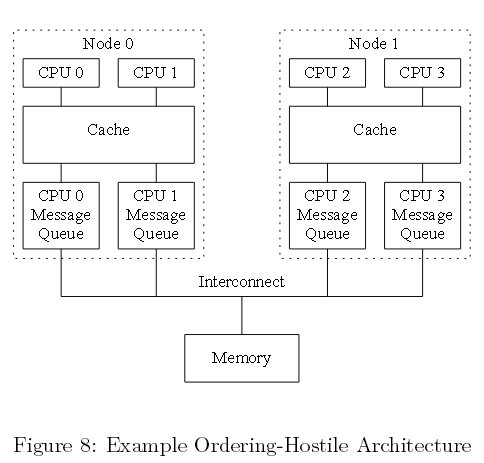

图八 不利于有序的架构例子

####6.2 例一

下面的表格二展示了3个代码片段，由CPU 0、1、,2并发执行。a、b、c的初始值均为0。

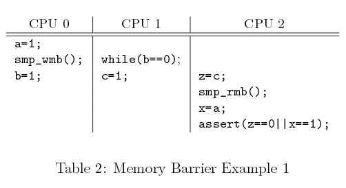  
表格二 内存栅障示例1

假定CPU 0刚经历许多缓存缺失，因此它的消息队列是满的。而此时CPU 1运行独占这个缓存，它的消息队列是空的。接着CPU 0给a、b的赋值会立即出现在节点0的缓存中（因此对CPU 1可见），但会阻塞在其优先传输之后。相反，CPU 1给c赋值会通过CPU 1优先的空队列。因此，尽管有内存栅障，CPU2或许会先看到CPU 1给c赋值，然后看到CPU 0给a赋值，从而造成断言失败。

理论上说，移植代码不能依赖示例代码中的序列。然而在实践中，所有主流计算机系统实际上都这么做。

快速问答10：在CPU 1 "while"和赋值给c之间插入一个内存栅障能否修正本代码？为什么能或为什么不能？

####6.3 例二

下面的表格三展示了3个代码片段，由CPU 0、1、2并发执行，a和b的初始值均为0。  

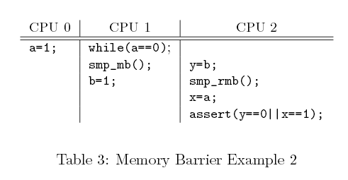

表格三 内存栅障示例2

再次，假定CPU 0刚经历许多缓存缺失，因此它的消息队列是满的。此时CPU 1独占本缓存，因此它的消息队列是空的。接着，CPU 0给a赋值会立即出现在节点 0 的缓存中（也因此对CPU 1可见），但CPU 0 会被阻塞在其优先传输的命令之后。相反，CPU 1赋值给b会通过CPU1优先的空队列。因此，尽管有内存栅障，CPU 2可能会先看到CPU 1赋值给b，然后才看到CPU 0赋值给a，引起断言失败。

理论上，便携的代码不应该依赖本例代码段。然而像前面提到的那样，在实践中所有主流计算机系统实际上都这么做。

####6.4 例三

下面的表格四展示了3段代码，由CPU 0、1、2并发执行，所有变量初始化值均为0。

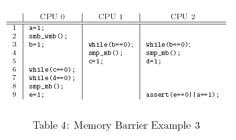

表格四 内存栅障示例3

  1. CPU 0 执行a=1，对应的缓存行在CPU 0缓存中，且为只读，因此CPU 0将a的新值放入此存储缓冲中，并且发送一个“无效”消息，以便刷掉CPU 1缓存中对应的缓存行；
  2. CPU 1执行while(b==0)continue，但包含b的缓存行不在本缓存中，因此它发送一个“读”消息；
  3. CPU 1接收CPU 0的“无效”消息，放入队列中，并立即给出响应；
  4. CPU 0接收来自CPU 1的消息，因此接着可以处理smp_mb()所在第4行以上的代码，将a值从存储缓冲中放入缓存行；
  5. CPU 0 执行b=1，它已拥有该缓存行（换言之，本缓存行已处在修改或独占状态），因此它将b的新值放入本缓存行中；
  6. CPU 0 接收“读”消息，发送一个包含b的此刻最新值（now-updated value）缓存行给CPU 1，同时，将本缓存中的该行设置为“共享”状态；
  7. CPU 1接收包含b的缓存行，并放入本缓存中；
  8. CPU 1此刻可以完成while(b==0) continue，因为它发现b的值是1，可以继续执行下面的语句，即一个内存栅障；
  9. CPU 1 阻塞，直到处理完本无效队列先前存在的消息；
  10. CPU 1此刻执行队列中的“无效”消息，并使本缓存中包含a的缓存行失效；
  11. CPU 1 执行assert(a==1)，因为包含a的缓存行不在CPU 1 缓存中，发送一个“读”消息；
  12. CPU 0 响应该“读”消息，发送包含a新值的缓存行；
  13. CPU 1接收该缓存行，此a的值为1，因此没有引发该断言。

注意，只有当CPU 1 和 CPU 2看到第3行CPU 0赋值给b才会往下执行第4行。一旦CPU 1和 2执行了第4行的内存栅障，都可以看到CPU0在第二行内存栅障前面的所有赋值运算。相似的，CPU 0第八行内存栅障和CPU 1和2第4行的内存栅障是一对。因此，直到CPU0赋值a时才会对其它CPU可见，这时会执行第9行赋值e的运算。这样一来，CPU 2在第9行的断言就不会失败了。

快速问答11：假定CPU 1和2的第3到5行处于一个中断处理中，CPU 2第9行会在进程级运行。什么样的改变可以保证代码正确运行，换言之，防止断言失败？

Linux内核synchronize_rcu() 原生类型采用了跟本例相似的一个算法。

###7、特定CPU的内存栅障指令

每个CPU都有其特定的内存栅障指令，这会给移植带来挑战，如下面表格五所示。事实上，许多软件环境，包括pthread和Java，简单阻止了对内存栅障的直接调用，将编程人员限定在互斥原语（mutual-exclusion primitive）中，这些原语包含内存栅障，某种程度上可以满足编程人员开发所需。表格前四列展示某种CPU是否允许4种可能的加载和存储组合重排。接下来的两列展示某种CPU在有原子指令的情况下是否允许加载和存储重排。

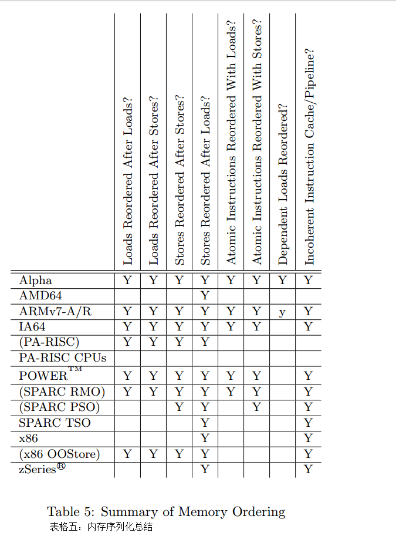表格五 内存序列化总结

第7列执行取决于读重排，需要对此做一些解释。这部分会在Alpha CPU相关的那节进行介绍。简易版本是Alpha的读取器（reader）需要内存栅障，链数据结构的更新器也是如此。这就意味着，Alpha可以取到它指向的数据，然后获取指针本身，看起来很奇怪但实际确实如此。如果你觉得我是在胡编乱造，那么请参见 <http://www.openvmscompaq.com/wizard/wiz_2637.html>。这种极度弱化的内存模型好处在于，Alpha可以简化缓存硬件，Alpha最繁忙的日子可以承受更高的时钟频次。

最后一列显示某种CPU是否拥有一个连贯的缓存和管道指令。这样的CPU针对自修改代码（self-modifying code）提供特定的指令。

CPU名字括号包起来的是为了说明，此模式是架构所允许的，不过实践中极少使用。

通常对内存栅障“说不”的方式有非常的说服力。不过在很多环境中，比如Linux内核，直接使用内存栅障却是必需的。因此，Linux基于最小公分母思想，精挑细选了
一组内存栅障原语，如下：

  * smp mb()：“内存栅障”对加载和存储排序。这意味着内存栅障之前的加载和存储提交到内存，才会执行该内存栅障之后的加载和存储。
  * smp rmb()：“读内存栅障”只对加载进行排序。
  * smp wmb()：“写内存栅障”只对存储进行排序。
  * smp read barrier depends()后续运算依赖于前面已排序的运算。除了Alpha外，本原语在其它所有平台上都是空指令。
  * mmiowb()强制内存映射IO（MMIO）写的排序，该写由全局自旋锁控制。该原语在所有平台上都是一个空指令，自旋锁中的内存栅障已经强制MMIO重排。拥有非运算mmiowb()方法的平台包括IA64、FRV、MIPS和SH等系统。该原语相对最新，因此有一些相对较少的驱动会使用到它。

smp mb()、smp rmb()和smp wmb()原语同样可以强制编译器，避免作出任何优化，该优化可以越过栅障重排内存代码。smp read barrier depends()原语拥有相似的功能，不过仅作用于Alpha CPU。

这些原语产生的代码只存在于对称多处理器（SMP）内核中。同样地，它们都有一个相应的单处理器（UP）版本（mb()、rmb()、wmb()和read barrier depends()），它们会在单处理器内核中产生一个内存栅障。smp_版本用在多种场合下。然而，后面的原语在实现驱动时非常有用，因为MMIO访问必须保持有序，即使在单处理器内核中亦如此。不存在内存栅障指令，CPU和编译器乐于重排这些访问，这会让设备表现的很奇怪，比如出现内核崩溃，在某些情况下甚至会损坏你的硬盘。（译者注：内核为操作系统核心，维护着一个用于进程和线程追踪的表格）

因此，多数内核编程人员无需担心CPU内存栅障的新奇特性，只要遵循这些接口即可。当然如果你的工作深入到了某种CPU特定的架构级代码中，那就另当别论了。

进一步讲，所有Linux锁的原语（spinlocks、reader-writer locks、semaphores、RCU等）包含了任何我们需要的栅障原语。倘若你编写的代码利用这些原语，甚至无需担心Linux内存序列化原语。

也就是说，深入了解每种CPU内存一致性模型，在代码调试的时候是很有帮助的，更别说在写架构级的特定代码或者同步原语了。

况且，懂一点皮毛是很危险的。试想你用很多知识可以做出的破坏。对于那些不满足于仅仅知晓单个CPU内存一致性模型的人，接下来的章节描述了许多优秀的主流CPU内存
一致性模型。尽管不如阅读某种类型CPU说明文档那样好，但这些章节却也给我们提供了一个不错的视角。

####7.1 Alpha

过多宣称已不再使用CPU似乎有些奇怪，不过Alpha确实很有趣。鉴于非常弱的内存序列模型，该CPU可以最大限度地重排内存运算，因此，定义Linux内核的内存序列化原语，必须工作在所有类型的CPU上，包括Alpha。因此，理解Alpha对Linux内核黑客很重要的。

Alpha和其它CPU的差别如下面代码所示，第九行smpwmb()确保六到八行的元素初始化以后，该元素才会加入到第十行的列表中，因此，无锁查询是没有问题的。事实确实如此，除了Alpha，其它CPU都能保证这一点。

```
struct el *insert(long key, long data)
{
  struct el *p;
  p = kmalloc(sizeof(*p), GPF_ATOMIC);
  spin_lock(&mutex);
  p->next = head.next;
  p->key = key;
  p->data = data;
  smp_wmb();
  head.next = p;
  spin_unlock(&mutex);
}
 
struct el *search(long key)
{
  struct el *p;
  p = head.next;
  while (p != &head) {
    /* BUG ON ALPHA!!! */
    if (p->key == key) {
      return (p);
    }
    p = p->next;
  };
  return (NULL);
}
```
图九 插入和无锁查询

Alpha拥有一个极弱的内存序列。在上面的代码中，第20行代码能看到旧的废弃值，然后从第6至8行开始初始化。

下面图十展示了它是如何发生在这个拥有分区化缓存，最大化并行的机器中。因此，间隔的缓存行交由不同的缓存分区处理。假设列表头head由缓存库0（cache bank）执行，而每个新元素由缓存库1执行。对于Alpha，图九中smp_wmb()会确保第6到8行的失效缓存先于第10行到达交互区（interconnect），但不能确保序列中的新值是否抵达读CPU内核。比如，读CPU缓存库1可能很忙，而缓存库 0却处于闲置状态。这会导致新元素的失效缓存延迟。因此，读CPU会得到该新值的指针，但它会看到新元素中旧的缓存值。当然，如果你认为我是在胡编乱造，可以网上查找更多的信息。  

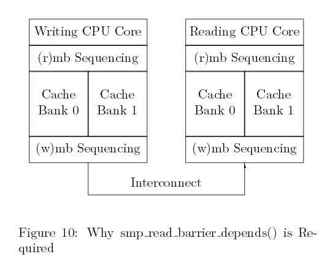

图十 smp_read_barrier_depends()为什么是必需的

将一个smp_rmb()原语在获取指针（pointer fetch）和间接引（dereference）之间。然而，这会给系统带来不必要的开销（比如i386、IA64、PPC、SPARC），代表数据依赖于读取的一方。smp read barrier depends()原语加入Linux 2.6内核中以减少这些系统开销。该类型见图十一的第19行。

```
struct el *insert(long key, long data)
{
  struct el *p;
  p = kmalloc(sizeof(*p), GPF_ATOMIC);
  spin_lock(&mutex);
  p->next = head.next;
  p->key = key;
  p->data = data;
  smp_wmb();
  head.next = p;
  spin_unlock(&mutex);
}
 
struct el *search(long key)
{
  struct el *p;
  p = head.next;
  while (p != &head) {
    smp_read_barrier_depends();
    if (p->key == key) {
      return (p);
    }
    p = p->next;
  };
  return (NULL);
}
```
图十一 安全插入和无锁查询

同样，软件栅障的另一种可能的实现形式就是加入smp wmb()，它会强制所有“读CPU”去查看“写CPU”中的写序列。然而，Linux社区认为该方法会极大增加极端微弱序列化CPU的开销，比如Alpha。本软件栅障通过发送处理器间中断（IPI）给其它CPU。收到IPI后，某个CPU会执行一个内存栅障指令，实现一次内存栅障命中（shootdown）。需要额外考虑的是如何避免死锁。当然，代表数据依赖的CPU定义一个栅障来简化smpwmb()。或许随着Alpha褪去，未来还需重新审视这个决定。

Linux内存栅障原语名字取自Alpha指令，smp_mb即mb，smp_rmb即rmb，smp_wmb即wmb。Alpha是唯一个smp readbarrier depends()是smp_mb而非空指令的CPU。

关于Alpha更多细节，请参考手册。

####7.2 AMD64

AMD64与x86兼容，最近更新了自己的内存模型使其序列更加紧凑，实际的实现还需时日。Linux原语在AMD64中，smp_mb即mfence，smp_rmb即lfence、smp_wmb即sfence。理论上讲，这些指令可能很相对灵活，但不管如何灵活，都会考虑SSE和3DNOW指令。

####7.3 ARMv7-A/R

CPU的ARM家族在嵌入式应用方面广受欢迎，特别是诸如手机这样的低功率应用。然而ARM在多处理器的实现已经做了五年多，内存模型和Power的相似（参看7.6小节），但ARM采用的是一组不同的内存栅障指令。

1、DMB（数据内存栅障）会在特定的运算类型完成之后再进行相同类型的后续运算。该类运算类型可以各种运算，或者仅限于写（这与Alpha wmb和POWEReieio指令相似）。另外，ARM的缓存一致性有三个范围，单个处理器、一个亚组处理器（内部）和全局（外部）。

2、DSB（数据一致性栅障）会促使特定的运算类型完成之后，再进行相同类型的后续运算。该运算类型与DMB相同，在早期的ARM架构中，DSB指令称之为DWB（你可以选择清空写缓冲或者数据写栅障）。

3、ISB（指令一致性栅障）会flush CPU管道，因此所有在ISB之后的指令仅是在ISB完成执行后获取。比如你写一个自修改程序（比如JIT），就应该在产生代码后执行代码之前执行ISB。

没有一种指令可以与Linux rmb()原语语法完美匹配，因此必须实现一个完整的DMB。DMB和DSB指令在栅障前后，将一个递归访问序列化，其的作用与POWER积累（cumulativity）相似。（译者注：关于POWER累积性cumulativity请参考[Understanding POWER Multiprocessors](https://www.cl.cam.ac.uk/~pes20/ppc-supplemental/pldi105-sarkar.pdf)）

ARMv7和POWER内存模型的不同在于POWER代表数据以及控制依赖，而ARMv7仅表示数据依赖。这两种CPU家族的差异可以在下面的代码片段中找到，此代码
在早前的4.3节就已讨论过：

```
void foo(void)
{
  a = 1;
  smp_wmb();
  b = 1;
}
 
void bar(void)
{
  while (b == 0) continue;
  assert(a == 1);
}
```

在上面的例子中，第10和11行之间存在一个控制依赖，该控制依赖使得POWER在这两行间插入一个隐式的内存栅障，而ARM则是允许第11行启发式执行（speculatively execute）完后，再执行第10行。另外，这两款CPU在以下代码中均代表数据依赖：

```
int oof(void)
{
  struct el *p;
  p = global_pointer;
  return p->a;
}
```

这两款CPU都会在第5行和第6行之间，放入一个隐式的内存栅障，从而避免第六行看到p->a预初始化的值。当然，前提是编译器被禁止对这两行进行重排。

####7.4 IA64

IA64提供一个弱一致性模型，因此没有显式内存栅障指令，IA64其内部有权随意的重排内存引用。IA64有一个名为mf的内存栅障（memory-fence）指令，数个“半内存栅栏”修饰器（modifier）作用于加载、存储以及一些其它原子性指令。如图12所示，acq修饰器阻止acq之后的后续内存引用指令重排。相似的，rel修饰器阻止rel之前的优先内存引用指令发生重排，但允许rel后面的后续内存引用指令重排。  

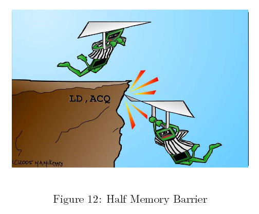

图十二 半内存栅障

这些半内存栅栏（half-memory fences）对临界段（critical sections）是很有用的，可以安全的将运算压入某个临界段中，但致命的是允许它们泄漏。然而，作为仅有的一个有如此属性的CPU，IA64定义了Linux内存序列相关锁的获取以及释放的语法。

在Linux内核中，IA64mf指令用于smp_rmb()、smp_mb()以及smp_wmb()原语。尽管有很多相反的传闻，但“mf”确实代表的是“内存栅栏”（memory
fence）。

最后，IA64为“释放”运算提供一个全局总的序列，包括“mf”指令。涉及一个传播的概念，如果某个代码片段看到某个访问所发生的事情，那任何后续的代码片段都会看到早前该访问所发生的各种情况。前提是涉及到的所有代码片段都能正确的使用内存栅障。（译者注：内存栅栏用来确保存储操作的一致性，进而确保软件存储模型到硬件存储模
型的正确映射）

####7.5 PA—RISC

尽管PA-RISC架构运行所有的加载和存储重排，但实际中却只运行有序的指令。这就意味着Linux内核内存序列化原语不产生代码。然而，它们可以利用gcc内存属性解除编译器优化，该优化会越过内存栅障进行重排。

####7.6 POWER / Power PC

POWER和Power PC CPU家族拥有大量多元内存栅障指令：

1、sync前面的运算完成之后，后面的运算才会开始。因此该指令的开销非常大：

2、lwsync（轻量级sync）采用后续的加载和存储来序列化加载，序列化存储亦如此。然而，它却不能借助后续加载序列化存储。非常有意思的是，lwsync指令跟zSeries有相同的序列化。巧合的是，SPARC TSO亦如此。

3、eieio（enforce in-order execution of I/O）促使所有前面可缓存的存储完成之后，才会进行后续的存储。然而，存储于可缓存内存的序列和存储于非缓存内存中的序列是分开的，这就意味着eieio不会将某个MMIO存储于之前的某个自旋锁释放中。

4、isync会强制所有前面的指令出现并执行完毕，后续的指令才会执行。这意味着前面的指令必须远离任何由此已发生或未发生的陷阱，这些指令的任何副作用，例如页-
表的改变，均可以被后续指令所看到。

不幸的是，它们当中没有一个指令可以组成Linux wmb()原语，要求所有存储都序列化，但不会要求sync这种开销很大的指令。然而没有选择，ppc64版本的wmb()和mb()定义在重量级的sync指令中。Linux smp_wmb()指令从来不用于MMIO（不论是单处理器还是对称多核处理器内核中，驱动都必须谨慎序列化MMIO）。因此，它定义一个轻量级的eieio指令或许该指令独一无二之处在于一个五个元音记忆体。

同样，smp_mb()指令定义于sync指令，但smp_rmb()和rmb()定义于轻量级的lwsync指令中。

Power 独特的“积累”，可以用来获取传播性。运用得当，任何代码能看到早期代码片段的结果，同样也会看到早期代码片段所能看到的访问。更多的细节参看McKenney和Silvera[MS09]。

很多POWER架构成员都有一致性指令缓存。因此，某个存储内存没有必要反射（元编程）在指令缓存中。辛亏那会很少有人写自修改代码，不过JIT和编译器却会一直这么
做。（译者注：JIT运行时编译器其作用是将热代码编译为本地码）进一步讲，重编译一个新近的运行程序，从CPU的角度看就像是自修改代码。icbi指令（指令缓存块失效）使得来自指令缓存中的特定缓存行失效，该指令或许可以应用在这些情景中。

####7.7 SPArc RMO、PSO和TSO

在SPARC之上的Solaris运算系统利用TSO（total-store order）。一旦构建“sparc”32位的架构，效果就如同Linux。然而，64位Linux内核（sparc64架构）运行SPARC在RMO（relaxed-memory order）模型中。SPARC架构同样提供一个中间的PSO（partial store order）。任何运行在RMO程序，同样会运行在PSO或者TSO。类似的，一个运行在PSO上的程序亦可以运行在TSO。移入一个共享内存并行程序到在其它指令中，或许你需要细心插入内存栅障。由于程序制定一致性原语使用标准，无需再担心内存栅障。

SPARC拥有一个极其灵活的内存栅障指令，可以对序列化进行细颗粒度控制：

  * StoreStore：序列化其前面的存储，接着是其后面的存储。（此选项可以为Linux smp_wmb()原语所用）
  * LoadStore：序列化其前面的加载，接着是其后面的存储。
  * StoreLoad：序列化其前面的存储，接着是其后面的加载。
  * LoadLoad：序列化其前面的加载，接着是后面的加载（本选项可以为Linuxsmp_r4mb()原语所用）
  * Sync：完成其前面所有的运算，接着才开始其后面的运算。
  * MemIssue：完成其前面的内存运算，接着是其后面的内存运算，特别是内存映射I/O方面。
  * Lookaside：和MemIssue一样，唯一的不同是应用于其前面的存储和后面的加载，甚至仅作用于访问同一内存地址的存储和加载。

Linux smp_mb()原语采用前四个选择，membar #LoadLoad | #LoadStore | #StoreStore | #StoreLoad。因此，可以完整地序列化内存运算。

那么，为何我们还需要membar #MemIssue？membar #StoreLoad允许一个后续加载从某个写缓存中取值，这会是场灾难。写入某个MMIO寄存器，会导致待读的值产生副作用。与之相反的是，membar #MemIssue会一直等待，直到写缓存写出才会执行加载，因此可以确保加载从MMIO寄存器中取值。而驱动则采用membar #Sync，不过相对轻量级的membar #MemIssue更受欢迎，可能并不需要开销更大的membar #Sync指令。

membar #Lookaside是一个更加轻量级的membar #MemIssue版本。特别是向某个MMIO寄存器写值的时候非常有用，这会影响接下来该寄存器中数据的读取。然而，相对重量级的membar #MemIssue必需的，特别是当写入某个MMIO寄存器时，会影响接下来其它一些寄存器中的数据读取。

将smb_wmb()定义于membar #StoreStore，当前的定义对某些驱动的bug看似很致命。SPARC为什么不将wmb()定义于membar #MemIssue不得而知。很有可能，所有运行了Linux的SPARC CPU实现了一个颇具争议的内存序列化模型，这远远超出了架构架构所能允许的范围。

SPARC需要一个flush指令用在指令存储和其执行的之间的时间段，用来写出位于SPARC指令缓存中的值。注意写出指令获取一个地址，并且仅仅会写出来自指令缓存中的地址。在对称多核处理器系统中会flush所有CPU缓存，尽管有相关实现的参考指南，但还是无法很好地判断flush结果是否完全。

####7.8 x86

x86 CPU提供“进程序列化”，因此所有CPU与某个CPU写回内存的序列是一致的。smp_wmb()原语是一个空指令。然而一个编译指令确实很有必要，可以防止编译器优化，防止其优化越过smp_wmb()原语的对代码进行重排。

另一方面，x86 CPU传统上是没有提供有序加载保障，因此smp_mb()和smp_rmb()原语扩展为lock;addl。该原子指令对加载和存储作用就与栅障类似。

前不久，Intel公布了一个x86内存模型。相比早期的文档声明，Intel CPU确实在有序性上进行强化。不过本模型还是在有效地简单遵循早期约定。最近，Intel公开了一个新的x86内存模型为存储提供一个总体全局序列。不过如早前那样而非总体全局序列所阐述的，单个CPU依旧可以看到自身的存储。总体序列化与其它形式唯一的区别是允许存储缓冲相关的重要硬件优化。软件或许利用原子性运算重写硬件优化，这是原子性运算较非原子性运算开销巨大的一个原因。总体存储序列化不适用于旧的处
理器。

然而，注意一些SSE指令是弱序列化的（clflush及无时态move）指令。拥有SSE指令集的CPU，其mfence为smp_mb()服务，lfence为smp_rmb()服务，sfence为smp_wmb()服务。

x86 CPU极个别版本有少量的模式允许无序存储。对于此类CPU，smp_wmb()必须定义在lock;add1中。

许多早期的x86实现满足自修改代码要求，无需任何22个特殊指令。新修订的x86架构无需x86 CPU作出改变。有意思的是，这种相对宽松的内存模型出现，恰巧使得JIT实现起来不再那么容易。

####7.9 zSeries

zSeries机器组成IBM大型主机家族，早期为人所知的有360、370和390。在zSeries中并行操作出现的比较迟，考虑到这些大型主机首次使用是在二十世纪六十年代中期，完全可以理解。bcr 15,0指令用于Linux smp_mb()、smp_rmb()、smp_wmb()原语。同样，它拥有相对强大的内存序列化语法，参见上文中的表格五，该语法应允许smp_wmb()原语为一个空指令（当你读到本文时或许已经实现了）。表格五确实能体现这个情景，正如zSeries内存模型是连续一致的，意味着所有CPU会与来自其它不同CPU的不相关存储序列保持一致。

与多数CPU一样，zSeries架构不能提供一个缓存一致性指令流。因此，自修改代码必须在更新指令后执行该指令前执行一个连续的指令。也就是说，许多zSeries机器实际上是满足自修改代码，无需连续指令。zSeries指令集提供一个庞大的连续化指令集，包括compare-and-swap，某些分支类型（比如前面提到的bcr 15,0指令），test-and-set等等。

###8、内存栅障是否会一直存在？

很多新系统在总体上无序执行以及特定重排内存引用方面，表现的不再那么激进。这种趋势是否会持续下去，内存栅障成为过去？

支持的观点引用备受推崇的多线程硬件架构，因此每个线程会等待，直到内存就绪，同时有成百上千甚至上万的线程在执行。在这样的架构中不需要内存栅障，因为某个线程会简单的等待所有未完成的运算执行完毕，才会进行接下来的指令。因为有成千上万潜在的线程，CPU会被充分利用，这样才不会有CPU周期被浪费。

（译者注：所谓线程，就是一条与其它硬件线程执行路径相互独立的执行路径，操作系统将软件线程映射其上得以执行）

相反的观点认为应用的场合极为有限，可能扩展成千的线程，急速增加恶性实时请求，处理起来需要几十微秒。这对实时响应要求太高不容易，考虑到由众多线程造成的单线程吞吐量极低的情况，这种要求更是难上加难。

另一个支持的观点认为日益成熟的延迟隐藏（latency-hiding）硬件技术，<del></del>给人一种错觉。感觉上是完整的连续执行，而事实上CPU依旧提供几乎所有无序化执行所带来的性能优势。而反方的观点认为，使用电池设备和环境问题都必然对功耗效率提出日益严苛的要求。

到底谁对谁错？我们无从知晓，就让我积极面对这些场景吧。

###9、给硬件设计者的一些建议

硬件设计者所做的任何事情就是使软件从业者日子变得更加艰难。这里是过去我们遇到的一些问题，下面列举的是希望能够在未来避免的事项：

1、I/O设备忽视缓存一致性

这个明显的错误可能导致来自内存的DMA错过输出缓存新近的变化， 或者在DMA完成之后，使得输入缓存被CPU缓存所重写。为了使系统能够应对此问题，向任何来自DMA缓存中的CPU缓存做写操作都必须小心，之后再将此缓存递给I/O设备。甚至你需要非常小心才能避免指针漏洞，因为即使一个不当的输入缓存读取也能污染输出的数据。

2、设备中断忽视缓存一致性

这听起来很无辜——毕竟中断不是内存引用，对吧？但试想单个CPU拥有一个分裂缓存（split cache），其中一个缓存库（bank）极度的繁忙，因此会牢牢持有输入缓冲的最后一行缓存行。倘若对应的I/O完成中断抵达该CPU，接着该CPU内存引用缓存的最后一行缓存行可能返回旧数据，再次导致数据污染，但在形式上在稍后的故障转储中是不可见的。就在系统开始收集不恰当的输入缓存时，DMA很可能已经完成。

3\. 处理器之间的中断（IPI）忽视缓存一致性

倘若IPI抵达目标<del></del>后，其对应消息缓存中的所有缓存行才提交到内存中，这样是有问题的。

4\. 上下文切换打破了缓存一致性

倘若内存访问过于杂乱无序，其上下文切换将难以控制。倘若某个任务从一个CPU转入另一个CPU，转入后所有内存访问对源CPU可见，才能确保任务能成功由源CPU转入目标CPU中，接着任务可能很容易看见对应的变量回复以前的值，这对多数算法会造成致命的困惑。

5\. 对模拟器和仿真器过于友善

遵循内存重排的模拟器或者仿真器实现起来是困难的。因为软件在这些环境下运行没有问题，一旦在真实硬件上运行就会出现令人厌烦的问题。不幸的是，至今依旧存在这样一个观点，真实硬件远比模拟器和仿真器复杂多变，不过我们希望这种情形能得到改观。

再次，我们鼓励硬件设计者能够规避这些问题。

致谢  
I own thanks to many CPU architects for patiently explaining the instruction- and memory-reordering features of their CPUs, particularly Wayne Cardoza,Ed Silha, Anton Blanchard, Brad Frey, Cathy May,Derek Williams, Tim Slegel, Juergen Probst, Ingo Adlung, and Ravi Arimilli. Wayne deserves special thanks for his patience in explaining Alphas reorder-ing of dependent loads, a lesson that I resisted quite strenuously! We all owe a debt of gratitute to Dave Keck and Artem Bityutskiy for helping to render this material human-readable.  

免责声明  
  
This work represents the view of the author and does not necessarily represent the view of IBM.   
IBM, zSeries, and Power PC are trademarks or registered trademarks of International Business Machines Corporation in the United States, other countries, or both.Linux is a registered trademark of Linus Torvalds.i386 is a trademarks of Intel Corporation or its subsidiaries in the United States, other countries, or both.Other company, product, and service names may be trademarks or service marks of such companies.  

10 快速测验及答案

快速问答1：倘若两个CPU同时去废除某个缓存行会发生什么？

答案：首先获得共享总线访问的CPU“赢了”，而另一个CPU必须失效该缓存行中的副本，并发送一个“无效确认”消息给其它CPU。当然，输的CPU会立即发送一个“读失效”业务，这样赢了的CPU就会取得短暂的胜利。

快速问答2：一旦某个“无效”消息出现在一个大型多核处理器中，每个CPU必须对此作出一个“无效确认”回应。那“无效确认”回应导致的总线“风暴”会不会完全饱和系
统总线？

答案：有可能，如果大规模多核处理器确实这么实现的。大型多核处理器，特别是NUMA计算机，倾向采用一种“目录为基础”缓存一致性协议来避免这样或那样的问题。

快速问答3：倘若SMP计算机真的利用消息传输机制，会给SMP带来哪些困惑呢？

答案：在过去的几十年里，这一直是一个有争议的话题。一种观点认为，缓存一致性协议相当简单，因此可以直接应用于硬件，通过软件消息传递无法获取令人满意的带宽和延迟。另一种观点则认为从经济的角度找到答案，可以比较大型SMP计算机和小型SMP计算机集群的相对价格。第三种观点认为SMP编程模型相对于分布式系统更好用，但一个
反观点会引用HPC集群和MPI。因此这类争议还会持续。

快速问答4：那么硬件如何处理如上所述的延迟转换（delayed transitions）？

答案：虽然通常添加额外的状态，但这些额外状态无需存入缓存行中，因为仅仅有少数缓存行在同一时间发生转换。需要延迟的转换不过是一个问题，在现实世界，缓存一致性协议远比附录中过于简单的MESI协议复杂。Hennessy & Patterson经典的计算机架构入门解答了其中的许多议题。

快速问答5：按照什么的顺序去执行运算，所有CPU缓存会置回“无效”状态？

答案：不存在这样的顺序，至少在缺少“flush my cache”指令的CPU指令集中，多数CPU确实有这样的指令。

快速问答6： 在步骤1中，为何CPU 0 需要发送一个“读无效” 而非一个简单的“无效”？

答案：因为有争议的缓存行包含不止a一个变量<del></del>。

快速问答7：在4.3第一个情景的第一个步骤中，为何发送“无效”而非“读无效”消息？CPU 0 无需其它变量的值共享本缓存行？

答案：CPU 0已经拥有这些变量的值，假定该CPU拥有一个包含“a”的缓存行只读副本。因此，CPU
0需要做的就是告知其它CPU丢弃本缓存行的副本。显然，必须提供一个“无效”消息<del></del>。

快速问答8 ：什么？假设while循环完成之后，CPU才能执行assert()方法，为何我们还要添加这个内存栅障？

答案：CPU可以预测执行，可以执行完断言之后，while循环才结束。也就是说，一些弱序列化CPU反应出对“控制依赖”。这样的CPU执行一个隐式内存栅障，在它前面是某个条件分支（ conditional branch），比如终止while循环的分支。然而本例中用到的显式内存栅障，在DEC Alpha亦是必须的。

快速问答9：<del></del>每个CPU能够保证有序地查看本内存的访问，是否可以确保每个用户级别的线程有序地查看其内存访问？是否可以保证？

答案：不可以。考虑这样的场景，线程从一个CPU迁移到另一个CPU，目标CPU看到的源CPU近期内存运算是无序的。为了确保用户态（user-mode）正常，内核黑客必须在上下文切换路径上加入内存栅障。然而，已被要求加锁确保可以安全的上下文切换，应该自动地加入必需的内存栅障。这样可以确保用户级别的任务能够有序地看到自身的访问。也就是说，如果你设计一个超级优化调度器，不论是内核级，亦或是用户级别的，都请牢记这一点！

快速问答10：在CPU 1 "while"和赋值给“c"之间插入一个内存栅障能否修正<del></del>代码？是否可行？

答案：不可以。此内存栅障仅会对CPU 1强制序列化，不会影响CPU 0和CPU
1访问的相对序列，因此断言会失败。然而，所有大型主机其计算机系统均有这样那样的机制确保传递性，即提供一种本能的因果序列化（intuitive causal ordering）：倘若B看到A的访问，C看到了B访问，那么C同样必须能看到A的访问。

快速问答11：假定CPU 1和2的第3至5行处于一个中断处理者中，CPU 2第九行运行在进程级。什么样的改变可以保证代码正确运行，换言之防止断言失败？

答案：断言必须确保“e”在“a”的前面被加载。在Linux内核中，barrier()原语可以用来完成这个任务，方式与前面例子中内存栅障在断言中作用的方式如出一辙。

参考文献  
[Adv02] Advanced Micro Devices.AMD x86-64 Architecture Programmer’s Manual Volumes 1-5, 2002.  
[Adv07] Advanced Micro Devices.AMD x86-64 Architecture Programmer’s Manual Volume 2:System Programming, 2007.

[ARM10] ARM Limited.ARM Architecture Reference Manual: ARMv7-A and ARMv7-R Edition, 2010.  
[CSG99] David E. Culler, Jaswinder Pal Singh, and Anoop Gupta.Parallel Computer Architecture: a Hardware/Software Approach. Morgan Kaufman, 1999.  
[Gha95] Kourosh Gharachorloo. Memory consistency models for shared-memory multiprocessors. Technical Report CSL-TR-95-685,Computer Systems Laboratory, Departments of Electrical Engineering and Computer Science, Stanford University,Stanford, CA, December 1995. Available: http://www.hpl.hp.com/techreports/Compaq-DEC/WRL-95-9.pdf  
[Viewed:October 11, 2004].  
[HP95] John L. Hennessy and David A. Patterson.Computer Architecture: A Quantitative Approach. Morgan Kaufman, 1995.  
[IBM94] IBM Microelectronics and Motorola.PowerPC Microprocessor Family: The Programming Environments, 1994.  
[Int02a] Intel Corporation.Intel Itanium Architecture Software Developer’s Manual Volume 3: Instruction Set Reference, 2002.  
[Int02b] Intel Corporation.Intel Itanium Architecture Software Developer’s Manual Volume 3: System Architecture, 2002.  
[Int04a] Intel Corporation.IA-32 Intel Architecture Software Developer’s Manual Volume 2B:Instruction Set Reference, N-Z, 2004.  
Available: ftp://download.intel.com/design/Pentium4/manuals/25366714.pdf  
[Viewed: February 16, 2005].  
[Int04b] Intel Corporation.  
IA-32 Intel Architecture Software Developer’s Manual Volume 3: System Programming Guide, 2004.  
Available: ftp://download.intel.com/design/Pentium4/manuals/25366814.pdf  
[Viewed: February 16, 2005].  
[Int04c] International Business Machines Corporation. z/Architecture principles of operation.  
Available: http://publibz.boulder.ibm.com/epubs/pdf/dz9zr003.pdf
[Viewed:February 16, 2005], May 2004.

[Int07] Intel Corporation.Intel 64 Architecture Memory Ordering WhitePaper, 2007.  
Available:http://developer.intel.com/products/processor/manuals/318147.pdf  
[Viewed:September 7, 2007].  
[Int09] Intel Corporation.Intel 64 and IA-32 Architectures Software Developers Manual, Volume 3A: System Programming Guide, Part 1, 2009.  
Available: http://download.intel.com/design/processor/manuals/253668.pdf
[Viewed:November 8, 2009].  
[Kan96] Gerry Kane.PA-RISC 2.0 Architecture.Hewlett-Packard Professional Books, 1996.  
[LSH02] Michael Lyons, Ed Silha, and Bill Hay.PowerPC storage model and AIX
programming.  
Available: http://www-106.ibm.com/developerworks/eserver/articles/powerpc.html  
[Viewed: January 31, 2005], August 2002.  
[McK05a] Paul E. McKenney.Memory ordering in modern microprocessors,part I.  
Linux Journal, 1(136):52–57, August 2005.  
Available:http://www.linuxjournal.com/article/8211  
http://www.rdrop.com/users/paulmck/scalability/paper/ordering.2007.09.19a.pdf  
[Viewed November 30, 2007].  
[McK05b] Paul E. McKenney.Memory ordering in modern microprocessors,part II.  
Linux Journal, 1(137):78–82,September 2005.  
Available:  
http://www.linuxjournal.com/article/8212  
http://www.rdrop.com/users/paulmck/scalability/paper/ordering.2007.09.19a.pdf  
[Viewed November 30, 2007].

[MS09] Paul E. McKenney and Raul Silvera. Example power implementation for
c/c++ memory model.  
Available:http://www.rdrop.com/users/paulmck/scalability/paper/N2745r.2009.02.
27a.html  
[Viewed: April 5, 2009], February 2009.  
[Sew] Peter Sewell. The semantics of multiprocessor programs.  
Available:http://www.cl.cam.ac.uk/~pes20/weakmemory/  
[Viewed:June 7, 2010].  
[SPA94] SPARC International.The SPARC Architecture Manual, 1994.  
[SW95] Richard L. Sites and Richard T. Witek.Alpha AXP Architecture. Digital Press, second edition, 1995.

