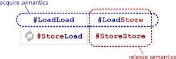
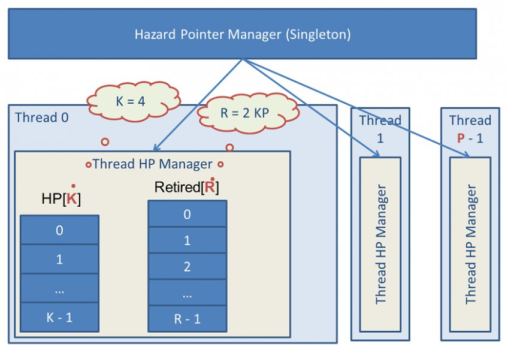
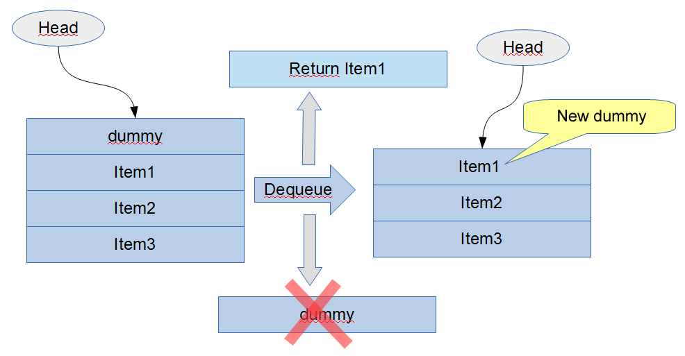
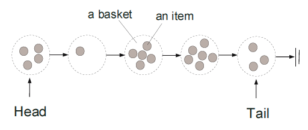
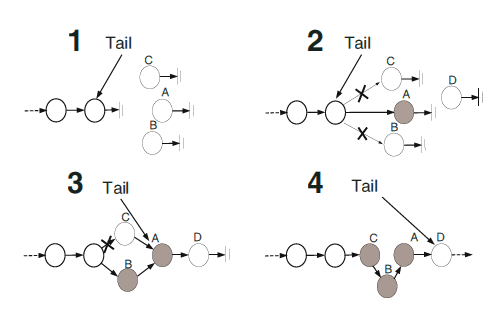
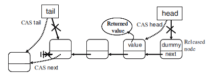
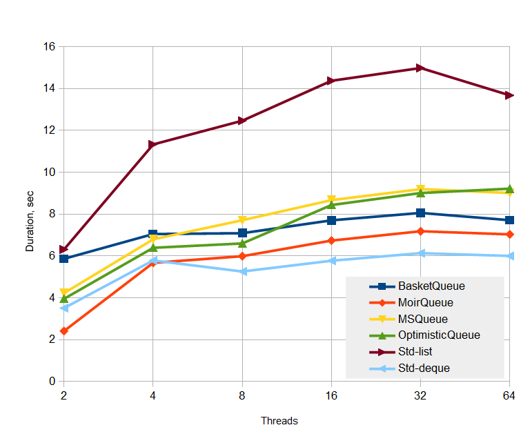
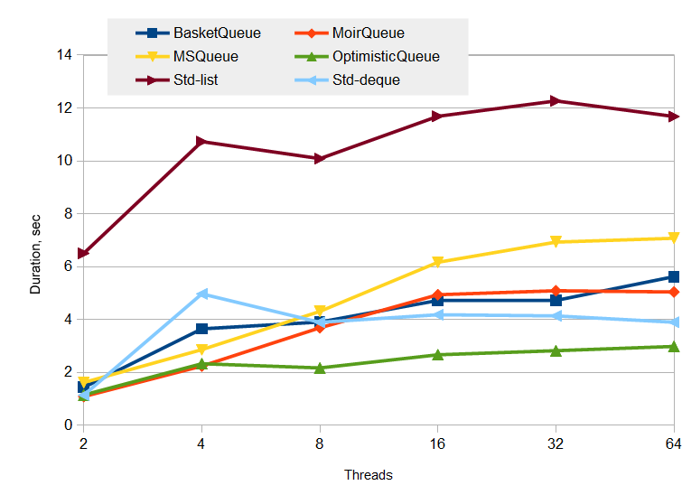
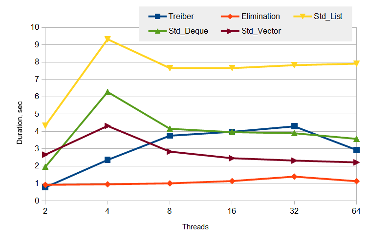

 
<!--BEGIN_DATA
{
    "create_date": "2017-01-20 21:23", 
    "modify_date": "2017-01-20 21:23", 
    "is_top": "0", 
    "summary": "无锁数据结构2", 
    "tags": "C/C++、算法、数据结构", 
    "file_name": "无锁数据结构2.md"
}
END_DATA-->

####<p>原文出处：<a href='http://blog.jobbole.com/102360/' target='blank'>无锁数据结构（基础篇）：内存模型</a></p>

 
英文出处：[khizmax](http://kukuruku.co/hub/cpp/lock-free-data-structures-memory-model-part-3)

假设在[前文中大家已窥探了处理器的内部结构](http://blog.jobbole.com/90811/)。为了并行代码的正确执行，我们需提示处理器对内部执行的读写优化做一些限制。这些提示就是内存栅障，在某种程度，对内存访问进行管理。管理“权重”可能不同，每种架构都能提供一组完整的栅障供开发者使用。运用这些内存栅障，你可以建立不同的内存模型，执行这组保障就可以为我们程序所用。


本文我们会讨论C++11内存模型。

####简要的历史回顾

最初，开发者并没有发布一个公开的处理器内存模型规范。然而依据一组规则，弱序列化的处理器便可很好的与内存进行工作。个人认为那会开发人员肯定希望在未来的某一天引入一些新的策略（为什么在架构开发中需遵循某些规范？）。然而厄运不断，千兆周就足以让开发者毛躁。开发者引入多核，最终导致多线程暴增。

最初惊慌的是操作系统开发人员，因为他们不得不维护多核CPU，然而那会并不存在弱的有序架构规则。此后其它的标准委员会才陆续参与进来，随着程序越来越并行，语言内存模型的标准化就应运而生，为多线程并发执行提供某种保障，不过现在我们有了处理器内存模型规则。最终，几乎所有的现代处理器架构都有开放的内存模型规范。

一直以来C++就以高级语言的方式编写底层代码的特性而著称，在C++内存模型的开发中自然也是不能破坏这个特性，必然赋予程序员最大的灵活性。在分析JAVA等语言的内存模型，及典型同步原语的内部结构和无锁算法案例之后，开发人员引入了三种内存模型：

  * 序列一致性模型
  * 获取/释放语义模型
  * 宽松的内存序列化模型（relaxed）

所有这些内存模型定义在一个C++列表中– std::memory_order，包含以下六个常量：

  * memory_order_seq_cst 指向序列一致性模型
  * memory_order_acquire, memory_order_release, memory_order_acq_rel, memory_order_consume 指向基于获取/释放语义的模型
  * memory_order_relaxed 指向宽松的内存序列化模型

开始审视这些模型之前，应先确定程序中采用何种内存模型，再一次审视原子性运算。该运算原子性的文章中已有介绍，此运算与C++11中定义的运算并没什么两样。因为都
基于这样一个准则：memory_order作为原子运算的参数。其原因有二：

1\. 语义：事实上，我们说的序列化（内存栅障）是指程序执行的原子运算。位于读/写方法中的栅障，其神奇之处就在于跟代码没有关联，其实是栅障等价存在的指令。另
外，读/写中的栅障位置取决于架构本身。

2\. 实际应用中：英特Itanium是一种特殊的、与众不同的架构，该架构的序列化内存方式，适用于读写指令和RMW运算。而旧的Itanium版本则是一种可选的指令标签：获取、释放或者宽松（relaxed）。但架构中不存在单独的获取/释放语义指令，仅有一个重量级的内存栅障指令。

下面是真实的原子性运算，std::atomic<T> 类的每种规范至少应包含以下方法：

```
void store(T, memory_order = memory_order_seq_cst);
T load(memory_order = memory_order_seq_cst) const;
T exchange(T, memory_order = memory_order_seq_cst);
bool compare_exchange_weak(T&, T, memory_order = memory_order_seq_cst);
bool compare_exchange_strong(T&, T, memory_order = memory_order_seq_cst);
```

####独立的内存栅障

当然，在C++11同样也为大家提供了两个独立的内存栅障方法：

```
void atomic_thread_fence(memory_order);
void atomic_signal_fence(memory_order);
```

atomic_thread_fence亦可采用独立读写栅障的方式运行，而后者被告知已过时。尽管memory_order序列化方法atomic_signal_fence不提供读栅障（load/load）或者写栅障（Strore/Store）,不过atomic_signal_fence可以用于信号处理器（signal handler）；作为一个规则，该方法不产生任何代码，仅是一个编译器栅障。（译者注：称之为栅栏似乎更为妥当）。

正如你看到的，缺省状态的C++11内存模型为序列一致模型，这正是我们要讨论的，不过在这之前我们先简要聊聊编译器栅障。

####编译器栅障

谁会重排我们写的代码呢？处理器可以重排代码，另外还有编译器。而许多启发式开发和优化开发方法，都是基于单线程执行这样的假设。因此，要让编译器明白你的代码是多线程的，那是相当困难的。因此它需要提示-栅障。诸如此类的栅障告知编译器“别把栅障前面的代码和栅障后面的代码混在一起，反之亦然”，编译器栅障不会产生任何代码。

MS Visual С++的编译器栅障是一个伪方法：_ReadWriteBarrier()。（过去我一直记不住它的名字：和读写内存栅障相关—重量级内存栅障）
而对GCC和Clang而言，它是一个smart __asm__ __volatile__ ( "" ::: «memory» )结构。

同样值得注意的是，assembly __asm__ __volatile__ ( … )
insertions也是一种GCC和Clang栅障。编译器没有权利遗弃或者重排栅障前后的代码。C++ memory_order常量,在某种程度上,支持编译器对处理器施加影响。作为编译器栅障，限制了代码的重排（比如优化）。因此，无需再设置特定的编译器栅障，当然，前提是编译器完全支持这一新标准。

####序列化一致性模型


假设，我们实现了一个无锁栈，编译后并正在进行测试。我们拿到一个核心文件，会问哪里出错呢？开始查找寻找错误根源，脑袋飞快地在思索无锁栈中一行行代码实现（没有一个调试器能帮到我们），试图模拟多线程，并回答下列问题：

> “线程1执行第k行的同时，线程2执行第N行，此时会有什么致命问题导致程序失败呢？”或许，你会发现错误根源并处理掉这些错误，但无锁栈依旧报错，这是为何？  
（译者注：所谓核心文件，又叫核心转储，操作系统在进程收到某些信号而终止运行时，将此时进程地址空间的内容以及有关进程状态的其他信息写入该文件，此信息用来调试）

事实上，我们试图寻找错误根源，在脑海中比较多线程并发执行下的程序不同行，其实就是序列化一致性。它是一种严格的内存模型，确保处理器按照程序本身既定的顺序执行程序指令，例如，下面的代码：

```
// Thread 1
atomic<int> a, b ;
a.store( 5 );
int vb = b.load();
 
// Thread 2
atomic<int> x,y ;
int vx = x.load() ;
y.store( 42 ) ;
```

任何一种执行情形都是序列化一致性模型允许的，除了对调换a.store / b.load或者x.load / y.store。注意，我并没有显式地给加载存储设置memory_order参数，而是依赖缺省的参数值。

相同的规范扩展到编译器：memory_order_seq_cst下面的运算不得迁移到此栅障上面，与此同时，在seq_cst-barrier上面的运算不得迁移到此栅障下面。

序列化一致性模型接近人脑思维，但它有个相当致命的缺陷，对现代处理器限制过多。这会产生极度重量级的内存栅障，很大程度上制约了处理器的启发式执行，这也是新的C++标准为何有以下折中的原因：

  * 有序化一致性模型由于其严格的特性，加之容易理解，因而被作为原子运算的缺省模型
  * 同时C++引入一个弱内存栅障，以应对现代架构的更多可能
  * 基于获取/释放语义的模型作为序列化一致性模型的一个很好补充。

####获取/释放语义


  
正如你看到的标题那样，在某种程度上，该语义与资源的获取释放有关。确实如此，资源的获取就是将其从内存读入寄存器，释放就是将其从寄存器写回内存中。

```
load memory, register ;
membar #LoadLoad | #LoadStore ; // acquire-барьер
 
// Operation within acquire/release-sections
...
 
membar #LoadStore | #StoreStore ; // release-barrier
store regiser, memory ;
```

正如你看到的，我们没有用到#StoreLoad这样重量级栅障应用。获取栅障、释放栅障就是半个栅障。获取不会将前面的存储运算与后续的加载、存储进行重排，而释放不会将前面加载与后续的加载进行重排，同样，不会将前面的存储与后续的加载进行重排。所有的这些适用于编译器和处理器，获取、释放作为该区间所有代码的栅障。而获取栅障前面的某些运算（可以被处理器或编译器重排）可以渗入到获取/释放模块中。同样释放栅障后续的运算可以转入上方进入获取/释放区间。但获取/释放里面的运算不会越出
这个界。

我猜自旋锁（spin lock）是获取/释放语义应用最简单的例子。

####无锁和自旋锁

或许你会感到奇怪，在无锁算法系列文章中列举一个锁算法的例子似乎不妥，容我解释一下。

我不是一个纯无锁粉，不过，纯无锁（特别是无等待）算法确实令我很开心。设法实现它我甚至会更开心。作为一个务实主义者：任何有效的事情就是好的。倘若使用锁带来益处，我也觉得挺好的。自旋锁可以带来比综合互斥量（mutex）更多的收益，比如对一个小段程序进行保护-少量汇编指令。同样，针对不同优化，自旋锁是一种用之不竭的资源。

基于获取/释放的最简易自旋锁实现大致如此：（而C++专家认为应该用某个特定的atomic_flag来实现自旋锁，但我更倾向于将自旋锁建立在原子变量上，甚至不
是boolean类型。从本文角度看，这样看起来会更清晰。）

```
class spin_lock 
{
    atomic<unsigned int> m_spin ;
public:
    spin_lock(): m_spin(0) {}
    ~spin_lock() { assert( m_spin.load(memory_order_relaxed) == 0);}
 
    void lock()
    {
        unsigned int nCur;
        do { nCur = 0; }
        while ( !m_spin.compare_exchange_weak( nCur, 1, memory_order_acquire ));
    }
    void unlock()
    {
        m_spin.store( 0, memory_order_release );
    }
};
```

本代码中困惑我的是，倘若CAS未成功执行，compare_exchange方法，第一参数接收一个引用，并修改它。因此不得不采用一个带非空体的do-while。

在lock方法中采用获取-语义，在unlock方法中采用释放语义（顺便说一句，获取/释放语义来自同步原语，标准开发者细心地分析各种不同的同步原语实现，进而衍生出获取/释放模型）。正如早前提到的，本例中的栅障不允许lock和unlock之间的代码溢出，这正是我们需要的。

原子性m_spin变量确保m_spin=1时，没有人可以获得该锁，这也是我们所需要的！  
大家看到算法中用到了compare_exchange_weak，但它是什么呢？

####Weak and Strong CAS  


正如你所记得那样，处理器结构通常会选择两种类型中的一种，或者实现原子性CAS原语，或者实现LL/SC对（(load-linked/store-conditional）。LL/SC对可以实现原子性CAS，但由于很多原因它并不具有原子性。其中一个原因就是，LL/SC中正在执行的代码可以被操作系统中断。例如，此刻OS决定将当前线程压出；重新恢复之后，store-conditional不再响应。而CAS会返回false，错误的原因不是数据本身，而是外部事件-线程被中断。

正是因为如此，促使开发人员在标准中添入两个compare_exchange原语-弱的和强的。也因此这两原语分别被命名为compare_exchange_weak和compare_exchange_strong。即使当前的变量值等于预期值，这个弱的版本也可能失败，比如返回false。可见任何weak CAS都能破坏CAS语义，并返回false，而它本应返回true。而Strong CAS会严格遵循CAS语义。当然，这是值得的。

何种情形下使用Weak CAS，何种情形下使用Strong CAS呢？我做了如下变通：倘若CAS在循环中（这是一种基本的CAS应用模式），循环中不存在成千上万的运算（比如循环体是轻量级和简单的），我会使用compare_exchange_weak。否则，采用强类型的compare_exchange_strong。

####针对获取/释放语义的内存序列

正如上文所述，获取/释放语义下的memory_order定义：

  * memory_order_acquire
  * memory_order_consume
  * memory_order_release
  * memory_order_acq_rel

针对读（加载），可选memory_order_acquire和 memory_order_consume。针对写（存储），仅能选memory_order_release。Memory_order_acq_rel是唯一可以用来做RMW运算，比如compare_exchange, exchange,fetch_xxx。事实上，原子性RMW原语拥有获取语义memory_order_acquire, 释放语义memory_order_release 或者 memory_order_acq_rel.

这些常量决定了RMW运算语义，因为RMW原语可以并发执行原子性读写。RMW运算语义上被认为拥有获取-加载，或者释放-存储，或者两者皆有。

只在算法中定义RMW运算语义是可行的，在某种程度上与自旋锁相似的部分，在无锁算法中显得很特别。首先，获取资源，做一些运算，比如计算新值；最后，释放掉新的资源值。倘若资源获取由RMW运算（通常为CAS）执行，诸如此类的运算很有可能拥有获取语义。倘若某个新值由RMW原语来执行，此类型很有可能拥有释放语义。用“很有可
能”描述不是没有目的，对算法的具体细节进行分析是必须的，这样才能明白什么样的语义匹配什么样的RMW运算。

倘若RMW原语分开执行，获取/释放模式是做不到的，不过有三种可能的语义变体：

  * memory_order_seq_cst 是算法的核心， RMW运算中，代码的重排，加载和存储的上下迁移都会报错。
  * memory_order_acq_rel 和memory_order_seq_cst有些相似, 但RMW运算位于获取/释放内部。
  * memory_order_relaxed  RMW运算可以上下迁移，不会引发错误。(比如：运算就在获取/释放区间)

以上这些细枝末节都应很好地被理解，然后再试着采用一些基本的原则，在RMW原语上采用这样的，或那样的语义。完了之后，必须针对每个算法做出细致地分析。

####消费语义（COnsume-Semantic）

这是一个独立的，更弱类型的获取语义，一个读消费语义。此语义作为一个“内存的礼物”被引入DECAlpha处理器中。Alpha架构与其它现代架构有很大的不同，它
会破坏数据依赖。下面的代码就是一个例子：

```
struct foo {
    int x;
    int y;
} ;
atomic<foo *> pFoo ;
 
foo * p = pFoo.load( memory_order_relaxed );
int x = p->x;
```

重排p->x读取和p获取（别问我这怎么可能呢！这就是Alpha的特点之一，我没有用过Alpha，所以也不能确定这对与不对）。为了阻止此种重排，引入了消费语义，用于struct指针的原子读，以及struct字段读取。下面的例子中pFoo指针便是如此：

```
foo * p = pFoo.load( memory_order_consume );
int x = p->x;
```

消费语义介于读取的宽松语义和获取语义之间，现今大多数架构都基于读取的宽松语义。

####再谈CAS

我已经介绍了两个CAS原子性接口-weak和Strong，但不止两个CAS变体，其它CAS，多了一个memory_order参数：

```
bool compare_exchange_weak(T&, T, memory_order successOrder, memory_order failedOrder );
bool compare_exchange_strong(T&, T, memory_order successOrder, memory_order failedOrder );
```

不过failedOrder是什么样的参数呢？

记住CAS是RMW原语，即便失败，也会执行原子性读。CAS失败，failedOrder参数会决定本次读运算语义。普通读相应的相同值也是支持的，在实际应用中，“针对失败语义”是极其少有的，当然，这取决于算法。

####宽松语义

最后，来说说第三种原子性模型，宽松语义适用于所有的原子性原语-加载、存储、所有RMW-几乎没有任何限制。因此，它允许处理器最大程度上的指令重排，这是它最大的优势。为何是几乎呢？

首先，该标准需要保证宽松运算的原子性。这意味着即使是宽松运算也应该是原子性的，不存在部分效应（partial effects)。  
其次，启发式写在原子性宽松写中是被禁止的。

这些要求会严格地应用于一些弱序列化架构的原子性宽松运算中。比如，原子性变量的宽松加载在Intel Itanium中由load.acq实现（acquire-read, 切勿把Itanium acquire和C++ acquire混为一体）。

####Itanium之安魂曲

我在文中多次提到英特尔Itanium，搞得我好像就是Intel架构粉；其实该架构在慢慢逝去，当然我不是英特尔的粉丝。Itanium VLIW 架构不同于其它架构地方，是其命令系统的构建规则。内存序列化由加载、存储、RMW指令的前缀完成。而在现代架构体系中你不会找到这些的，这些获取和释放术语，让我想到，C++11或许就是从Itanium拷贝过来的。

过去，我们一直在用Itanium或者它的子架构，直到AMD引入AMD64—将x86扩展到64位。那时Intel正慢悠悠地开发一款64位计算架构。这个架构潜藏着一些细枝末节，透过它，你会了解到台式机Itanium原本是为我们准备的。另外，针对Itanium架构的微软Windows操作系统端口和Visual C++编译器也间接地证明这一点（还有人看到其它运行在Itanium上的Windows操作系统吗？）。显然AMD打乱了Intel的计划，而Intel必须迎头赶上，将64位整合进x86。最后，Itanium停留在服务器片段中，因拿不到合适的开发资源，而慢慢消失了。  
不过，Itanium的一组VLIW指令却是很有趣，并已取得突破性进展。现代处理器执行的这些指令（加载执行块，重排运算）曾经被植入Itanium的编译器中。但该编译器不能处理任务，也不能产生完备的优化代码。结果，Itanium性能数次跌入谷底，因此Itanium 是我们不可以实现的未来。

但有谁知道呢，或许现在写梦之安魂曲为时尚早？

熟悉C++11标准的人肯定会问：“关系（relations）在何处决定原子性运算语义：happened before, synchronized with，还是其它？”我会说“在标准里”。

Anthony Williams在其书《[C++ Concurrency in Action](http://vdisk.weibo.com/s/zaPQt9WypmW04)》第五章对此有详尽的描述，你可以找到很多详尽的例子。  
标准开发者有一项重要的任务，对C++内存模型规则做一些变动。该规则不是用来描述内存栅障的位置，而是用来保障线程之间通信的。

结果，一个简洁明了的C++内存模型规范就此产生了。

不幸的是，在实际应用中，此关系使用起来太过困难；不论是在复杂或是简易的无锁算法中，大量的变量需要考虑，才能保证memory_order的正确性。

这就是为何缺省模型为序列化一致性模型，它无需针对原子性运算设置任何特殊的memory_order参数。前面已经提到，该模型处于一种减速状态，应用弱模型—比如
获取/释放 或者宽松—均需要算法验证。

补充说明：读了一些文章发现最后的论述不够准确。事实上，序列一致性模型本身不保证任何事情，即使有它的帮助，你也能把代码写的一团糟。因此不论何种内存模型，无锁算法验证都是必须的。只不过在弱模型中，特别有必要。

####无锁算法验证  


我知道的第一个验证方式，是Dmitriy Vyukov写的 [relacy 库](http://www.1024cores.net/home/relacy-race-detector)。不幸的是，该方式需要建立一个特殊模型。第一步，简化的无锁模型应该以relacy library方式来构建；而且该模型应该经过调试（为何是简化的呢？在建模的时候，通常你要深思熟虑摒弃掉跟算法无关的东西）；只有这样，你才能写出一个算法产品。该方式特别适合从事无锁算法和无锁数据结构开发的软件工程师，事实上也确实如此。

但通常很难做到两步，或许是人惰性的天性，他们即可马上就需出东西。

我猜relacy的作者也意识到这个缺陷（不是嘲讽，在这个小领域也算是一个突破性的项目）。作者将一个验证方法作为标准库的一部分，这也意味着你无须做任何额外的模型。这个看起来有些像STL中的safe iterators概念。

最近一个新工具[ThreadSanitizer](https://code.google.com/p/thread-sanitizer/)由Dmitriy和他谷歌的同事一起开发的，这个工具可以用来检测程序中存在的数据竞争；因此在原子性运算的重排中非常有用。更重要的是，该工具不是构建进了STL，而是更底层的编译器中（比如Clang3.2、[GCC4.8](http://gcc.gnu.org/gcc-4.8/changes.html)）。

ThreadSanitizer的使用方式特别简单，编译某个程序时仅仅需要特定的按键，运行单元测试，接着就可以看到丰富的日志分析结构。因此，我也将本工具应用于我的[libcds库](http://libcds.sourceforge.net/)中，确保libsds没有问题。

“我不是很明白”—批判标准

我斗胆批判C++标准，只是不明白为何标准将该语义设置为原子性运算的参数。不过，逻辑上应该使用模板，这么做才对嘛：

```
template <typename T>
class atomic {
    template <memory_order Order = memory_order_seq_cst>
    T load() const ;
 
    template <memory_order Order = memory_order_seq_cst>
    void store( T val ) ;
 
    template <memory_order SuccessOrder = memory_order_seq_cst>
    bool compare_exchange_weak( T& expected, T desired ) ;
 
   // and so forth, and so on
};
```

我来谈谈为何我的想法更正确呢。

前面不止一次提到，原子性运算语义不仅作用于处理器，也作用于编译器。语义是编译器的优化（半）栅障。除此之外，编译器应该监控原子性运算是否被赋予恰当语义（比如，释放语义应用于读运算）。那该语义在编译期就应该确定下来，但在下面的代码中，我很难想象编译器如何做到这一点：

从形式上看，该代码并不违反C++11标准，不过编译器唯一能做的也就只有下面这些了：

```
extern std::memory_order currentOrder ;
std::Atomic<unsigned int> atomicInt ;
atomicInt.store( 42, currentOrder ) ;
```

要么报错，但为何允许原子性运算接口抛出错误？

要么应用序列化一致性语义，总之是“不会太糟”。但变量currentOrder会被忽略掉，程序会遇到很多我们原本想避免的问题。

要么产生一个针对所有currentOrder可能值的switch/case语句。但这样，我们会得到很多低效的代码，而非一两个汇编指令。恰当语义问题还未解决，你可以调用释放读或者获取写。

然而模板方式却没有此缺陷，在模板函数中，memory_order列表中定义编译期常量。的确，原子性运算调用确实有些繁琐。

```
std::Atomic<int> atomicInt ;
atomicInt.store<std::memory_order_release>( 42 ) ;
// or even like that:
atomicInt.template store<std::memory_order_release>( 42 ) ;
```

但这些繁琐可以借由模板方式抵消，在编译期运算语义就可以明白无误地显示出来。而C++采用非模板的方式唯一的解释就是为了兼容C语言。除了std::atomic类
，C++11标准还引入了诸如 atomic_load, atomic_store等C原子性函数。

当C++11还在计划中时，我已用模板的方式实现了原子性原语。因此，我必须做出决定，是否遵从标准，基于C++11原子性运算接口构建另一个版本的libcds。

自此基础篇完结！


<hr>


####<p>原文出处：<a href='http://blog.jobbole.com/107955/' target='blank'>无锁数据结构（机制篇）：内存管理规则</a></p>

英文出处：[khizmax ](http://kukuruku.co/hub/cpp/lock-free-data-structures-the-inside-memory-management-schemes)

我在[《无锁数据结构（基础篇）：内存模型》](http://blog.jobbole.com/102360/)已经提到，实现无锁数据结构最大的两个困难，一是ABA问题，二是内存回收。即便它们之间有联系，却鲜有两全其美的办法，同时解决这两大难题，因此我将其分为两个问题进行讨论。

本文中我将论述无锁容器几种流行的内存安全回收方法，并在Michael-Scott经典的无锁队列中展示其中的几种。

###标签指针（Tagged pointers）

标签指针作为一种规范由IBM引入，旨在解决ABA问题，它可能是解决此类问题最流行的算法。依据此规则，每个指针代表一组原子性的内存单元地址和标签（32比特的整
数）

```
template <typename T>
struct tagged_ptr {
    T * ptr ;
    unsigned int tag ;
    tagged_ptr(): ptr(nullptr), tag(0) {}
    tagged_ptr( T * p ): ptr(p), tag(0) {}
    tagged_ptr( T * p, unsigned int n ): ptr(p), tag(n) {}
    T * operator->() const { return ptr; }
};
```

标签作为一个版本号，随着标签指针上的每一次CAS运算而增加，并且只增不减。一旦需要从容器中非物理地移除某个元素，就应将其放入一个盛放空闲元素的列表中。在空闲元素列表中，逻辑删除的元素完全有可能被再次调用。因为是无锁数据结构，一个线程删除X元素，另外一个线程依然可以持有标签指针的本地副本，并指向元素字段。因此需要一个针对每种T类型的空闲元素列表。多数情况下，将元素放入空闲列表中，意味着调用这个T类型数据的析构函数是非法的（考虑到并行访问，在析构函数运算的过程中，其它线程是可以读到此元素的数据）。

当然，标签指针规则还有以下缺陷：

  * 此规则由平台实现，因此该平台必须拥有一个基于dwCAS的原子性CAS原语。需要指出的是，32位的现代操作系统支持dwCAS 64比特的字运算，而所有的现代计算机架构都一套完整的64位指令集。在64比特的操作模式中，dwCAS需要128比特，至少96比特。但不是所有的架构中都实现了dwCAS。

> _简直是胡说八道，一派胡言！_
>
> 有经验的无锁编程人员可能认为，没有必要用一个128比特或96比特的CAS去实现标签指针。完全可以用64比特完成，因为现代处理器只采用48比特寻址，还有16比特闲置，完全可以用它来做标签计数器，例如boost.lockfree库  
> 但是本方法存在两个问题：
>
>     *问题一，谁能保证剩余的16位地址将来不会被用到？一旦内存芯片领域取得一个大的突破，即内存容量徒增，供应商可能会马上提供64比特完整的寻址处理器。
>     *问题二，16比特足够存储标签吗？相关研究表明，16比特是不够的。在此情况下，内存溢出的可能性很大，这也增加了ABA问题发生的可能。不过32比特是足够了。
>
> 确实如此，16比特标签的取值范围0-65535。现代操作系统，单个线程的时间片执行大约30万到50万条汇编指令（来自Linux开发人员的数据）。然而，当处理器性能增加时，时间片也会跟着增加；因此6.5万个难度较大的CAS运算也是可以执行的（即使现在不可以，未来绝对没问题）。所有采用16比特的标签，就有面对ABA问题的风险。

  * 空闲列表通常以无锁栈或者无锁队列的方式实现，同样也会引起性能问题：无论是空闲列表中元素移除或者是添加，至少有一个CAS会被调用。不过，空闲列表的在某些方面却在提高性能。即便空闲列表不为空，也没有必要引用系统函数，此类函数通常运行很慢，并且需要同步分配内存。
  * 针对每种数据类型提供单独的空闲列表（free list），这样做太过奢侈难以被大众所接收，一些应用使用内存太过低效。例如，无锁队列通常包含10个元素，但可以扩展到百万，比如在一次阻塞后，空闲列表扩展至百万。这样的行为通常是非法的。

由此可见，标签指针规则是解决ABA问题的诸多算法中的一种，但它不能解决内存回收的问题。

截止目前，libcds库中的无锁容器没有使用标签指针。尽管实现起来相对简单，此规则依然可能会使已使用的内存增长变得难以管控，因为无锁适用于任何一种容器类型。
libcds库中，无锁算法采用可预测内存使用方式，而非dwCAS。而boost.lockfree库在标签指针规则方面有很好的应用。

####标签指针应用案例

对那些喜欢壁纸的人来说，如果可能的话，带有标签指针的MSQueue伪码壁纸也是可以的。不可否认，无锁算法确实健壮。使用std:atomic简单地做一个应用。

```
template <typename T> struct node {
    tagged_ptr next;
    T data;
} ;
template <typename T> class MSQueue {
   tagged_ptr<T> volatile m_Head;
   tagged_ptr<T> volatile m_Tail;
   FreeList m_FreeList;
public:
   MSQueue()
   {
     // Allocate dummy node
     // Head & Tail point to dummy node
     m_Head.ptr = m_Tail.ptr = new node();
   }
void enqueue( T const& value )
{
E1: node * pNode = m_FreeList.newNode();
E2: pNode–>data = value;
E3: pNode–>next.ptr = nullptr;
E4: for (;;) {
E5:   tagged_ptr<T> tail = m_Tail;
E6:   tagged_ptr<T> next = tail.ptr–>next;
E7:   if tail == Q–>Tail {
         // Does Tail point to the last element?
E8:      if next.ptr == nullptr {
            // Trying to add the element in the end of the list
E9:         if CAS(&tail.ptr–>next, next, tagged_ptr<T>(node, next.tag+1)) {
              // Success, leave the loop
E10:          break;
            }
E11:     } else {
            // Tail doesn’t point to the last element
            // Trying to relocate tail to the last element
E12:        CAS(&m_Tail, tail, tagged_ptr<T>(next.ptr, tail.tag+1));
         }
      }
    } // end loop
    // Trying to relocate tail to the inserted element
E13: CAS(&m_Tail, tail, tagged_ptr<T>(pNode, tail.tag+1));
 }
bool dequeue( T& dest ) {
D1:  for (;;) {
D2:    tagged_ptr<T> head = m_Head;
D3:    tagged_ptr<T> tail = m_Tail;
D4:    tagged_ptr<T> next = head–>next;
       // Head, tail and next consistent?
D5:    if ( head == m_Head ) {
          // Is queue empty or isn’t tail the last?
D6:       if ( head.ptr == tail.ptr ) {
            // Is the queue empty?
D7:         if (next.ptr == nullptr ) {
               // The queue is empty
D8:                  return false;
            }
            // Tail isn’t at the last element
            // Trying to  move tail forward
D9:         CAS(&m_Tail, tail, tagged_ptr<T>(next.ptr, tail.tag+1>));
D10:      } else { // Tail is in position
            // Read the value before CAS, as otherwise  
            // another dequeue can deallocate next
D11:        dest = next.ptr–>data;
            // Trying to move head forward
D12:        if (CAS(&m_Head, head, tagged_ptr<T>(next.ptr, head.tag+1))
D13:           break // Success, leave the loop
          }
       }
     } // end of loop
     // Deallocate the old dummy node
D14: m_FreeList.add(head.ptr);
D15: return true; // the result is in dest
  }
```

让我们仔细观察位于入队和出队前面的算法，通过这些例子，你可以看到几种标准的无锁数据结构构建方式。

请注意这两种方法都包含循环—运算上下文不断的在重复，直到成功执行为止（也有可能无法成功执行，比如从一个空队列中进行出队列运算）。**这种重复循环方式是一种典
型的无锁编程方式**。

队列首个元素，即m_Head指向的元素为哑节点，确保指向队列起始和结束的指针永远都不为空。判断一个空队列的条件是 m_Head == m_Tail且m_Tail->next == NULL，见D6到D8行 。条件m_Tail->next == NULL尤为重要，这样往队列里加数据，并不会改变m_Tail。第E9行仅仅改变 m_Tail->next，眨眼一看，enqueue()执行break跳出循环。实际上，任何方法或者线程m_Tail均可以被改变。入队添加元素时，E8行必须检查m_Tail是否指向末尾元素即m_Tail->next == NULL；如若不然，如本例，执行E12行，尝试先将指针指向末尾元素。同样，在元素出队时，倘若m_Tail并未指向末尾元素，执行D9行使其指向末尾元素。本段代码是一种广为流行的无锁编程方法：**线程互助法**。**某个运算的算法可以扩展到容器的其它所有运算中，这样，该运算剩余的工作，就可以借由其它线程所调用的运算加以完成。**  
进一步观察，E5-E6行和D2-D4行，运算所需的指针值存于局部变量中。接着，E7、D5行比较计算值和原值。这是一个典型的无锁方法，仅限于并发编程，此刻读到的原值是可以被改变的。倘若不禁止编译器优化某些共享数据队列访问,一些“聪明”的编译器会删除E7或者D5比较行，因此需将m_Head以及m_Tail定义为C++原子类型，而在本伪码中为volatile类型。

此外，**大家记住CAS原语是将目标地址值和某个既定值进行比较，若这俩值相等，CAS则依据目标内存地址设置新值。**对CAS原语来说，推断本地拷贝是否为当前
值是必需的。CAS(&val, val, newVal) 通常都会成功执行。

现在，我们设想这样的场景，在出对方法中，D11行复制数据，之后，执行D12行，在队列中移除该元素。不过元素的删除即D12行m_Head前移有可能失败，在此情况下，D11数据复制会被反复执行。从C++的角度看，队列中的数据存储，其实现不宜太过复杂，否则赋值运算负载会很大。令人担心的是，高负载情况下，CAS原语失败的可能会很大。

人们自然想到了优化，将D11移到循环外边，但这会导致一个错误：next元素很可能会被另一线程删除。因为遵循标签指针规范，其中的元素并没有被删除，因此优化最终会导致这样一个结果，返回一个错误数据；尽管D12行执行成功，但返回的数据并不在队列中。

> _Peculiarities of M&S queue MS 队列的特点_
>
> MSQueue有趣的地方就在于 m_Head一直会指向哑节点，即非空队列的首个元素为m_Head元素的下一个元素。非空队列第一个元素出队列，即读取m_Head的下一个元素。倘若哑元素被删除，接下来的元素便接替成为哑元素，即队列的头，最后返回后者的值。因此只有在下一次出对运算结束之后，才可以添加新元素。开发者试图采用cds::intrusive::MSQueue的侵入式变量，这些特点会引发很多问题。

####基于周期的内存回收（Epoch-based reclamation）

Fraser [Fra03]引入周期规则，采用延迟删除，即在安全时刻再删除，也即确信任何线程的引用不再指向待删除元素时再删除。周期规则采取如下的保护策略：拥有一个全局周期nGlobalEpoch，并且单个线程运行于对应的局部周期nThreadEpoch中。某个线程进入周期规则保护的代码中，此时若该线程局部周期小于等于全局周期，局部周期的值便相应增加。而所有的线程进入全局周期，nGlobalEpoch的值便自增**。**

该规则伪码如下

```
// global epoch
static atomic<unsigned int> m_nGlobalEpoch := 1 ;
const EPOCH_COUNT = 3 ;
// TLS data
struct ThreadEpoch {
    // global epoch of the thread
    unsigned int        m_nThreadEpoch ;
    // the list of retired elements
    List<void *>        m_arrRetired[ EPOCH_COUNT ] ;
   
    ThreadEpoch(): m_nThreadEpoch(1) {}
    void enter() {
       if ( m_nThreadEpoch <= m_nGlobalEpoch )
          m_nThreadEpoch = m_nGlobalEpoch + 1 ;
    }
    void exit() {
       if ( all threads are in the epoch which m_nGlobalEpoch ) {
          ++m_nGlobalEpoch ;
          empty (delete) the elements
          m_arrRetired[ (m_nGlobalEpoch – 2) % EPOCH_COUNT ]
          of all threads ;
       }
    }
} ;
```

无锁容器中被清空的元素放入局部线程列表m_arrRetired中，而该列表中有m_nThreadEpoch % EPOCH_COUNT个等待删除的元素。一旦m所有线程通过全局周期m_nGlobalEpoch，此时便可以清空周期m_nGlobalEpoch — 1的所有线程列表，同时m_nGlobalEpoch也会自增。

无锁容器的每个运算囊括在ThreadEpoch::enter()和ThreadEpoch::exit()方法中；类似于临界区。

```
lock_free_op( … ) {
    get_current_thread()->ThreadEpoch.enter() ;
    . . .
    // lock-free operation of the container.
    // we’re inside “the critical section” of the epoch-based scheme,
    // so we can be sure that no one will delete the data we’re working with.
    . . .
    get_current_thread()->ThreadEpoch.exit() ;
}
```

此规则相当简单，旨在保护容器运算中的局部引用，该引用指向无锁容器元素；但本规则不能保护容器运算以外的全局引用。因此，无法采用周期规则实现无锁容器的元素迭代器。此规则的缺点是，程序的所有线程需进入接下来的周期中（following epoch ），譬如，这些线程须指向某些无锁容器。倘若至少有一个线程未能进入接下来
的周期，已废弃的元素就不能被删除。倘若线程存在不同的优先级，优先级低的线程会导致优先级高的线程延迟待删除元素增长变得不可控。一旦某个线程失败，周期规则会导致无限的内存消耗。  
然而libcds库没有采用周期规则，因为我无法创建有效的算法，来判定所有线程是否抵达全局周期。也许，读者朋友可以给些好的建议！

####冒险指针（Hazard pointer）


本规则由Michael [Mic02a, Mic03]创建，旨在保护局部引用，同样该引用指向无锁数据结构元素。这也许是当今世界最流行、研究最多的延迟删除规则了。此规则的实现仅依赖原子性读写，而未采用任何重量级的CAS同步原语。

此规则的核心职责是，声明一个指向无锁容器元素的指针，将其作为无锁数据结构运算的内部冒险指针。在调用元素前，先将其放入当前线程冒险指针所在的HP数组中，HP数
组是线程私有的，即只有拥护该数组的线程才能写入HP数组，而所有线程通过Scan过程都可读取HP数组。（译者注：C++中有返回值的为函数，没有的称之为过程）。
仔细分析各类无锁容器的运算之后，你会发现HP数组大小，即单个线程冒险指针的数目，最多为三或四。因此可以说，此规则下的负载不高。

> _大型数据结构_
>
> 这些“大型”数据结构需要不止64个冒险指针。譬如，skip-list (cds::container::SkipListMap)，这是一个随机数据结构。
实际上，它是一个嵌套的列表，存储不同级别的元素。此类容器并不适合冒险指针规则，即使libcds中实现了基于此规则的skip-list。

冒险指针规则伪码 [Mic02]

```
// Constants
// P : number of threads
// K : number of hazard pointers in one thread
// N : the total number of hazard pointers = K*P
// R : batch size, R-N=Ω(N), for example, R=2*N
// Per-thread variables:
// the array of Hazard Pointer thread
// Owner-thread only can write in it
// all threads can read it
void * HP[N]
// the current size of dlist (values 0..R)
unsigned dcount = 0;
// an array of data ready for deletion
void* dlist[R];
// Data deletion
// Places data to dlist array
void RetireNode( void * node ) {
  dlist[dcount++] = node;
  // If the array is filled we call the basic Scan function
  if (dcount == R)
     Scan();
}
// The basic function
// deletes all elements of dlist array, which haven’t been declared
// as Hazard Pointer
void Scan() {
   unsigned i;
   unsigned p=0;
   unsigned new_dcount = 0; // 0 .. N
   void * hptr, plist[N], new_dlist[N];
   // Stage 1 – traverse all HP of all threads
   // collect the total plist array of protected pointers
   for (unsigned t=0; t < P; ++t) {
      void ** pHPThread = get_thread_data(t)->HP ;
      for (i = 0; i < N; ++i) {
         hptr = pHPThread[i];
         if ( hptr != nullptr )
            plist[p++] = hptr;
      }
   }
   // Stage 2 – sorting hazard pointers
   // The sorting is necessary for the following binary search   sort(plist);
   // Stage 3 – deleting the elements that haven’t been declared as hazard
   for ( i = 0; i < R; ++i ) {
      // if dlist[i] conforms in plist list of all Hazard Pointers
      // dlist[i] can be deleted
      if ( binary_search(dlist[i], plist))
         new_dlist[new_dcount++] = dlist[i];
      else
         free(dlist[i]);
   }
   // Stage 4 – forming a new array of retired elements.
   for (i = 0; i < new_dcount; ++i )
      dlist[i] = new_dlist[i];
   dcount = new_dcount;
}
```

调用RetireNode(pNode)，删除无锁容器元素pNode时，此刻线程将pNode放入其局部数组dlist中，该数组用来存储待删除的废弃元素。数组dlist大小为R时，调用Scan()存储过程，删除废弃元素；R和N做比较，须大于N，比如R = 2N，而N = P*K。R > P*K这个条件很重要，若满足此条件，Scan()会删除数组中的废弃元素；而此条件一旦被打破，Scan()则无法删除任何元素，算法在此情况下出现错误，数组全部填满数据，却无法降低数组本身的大小。

Scan()过程分四个步骤：

  * 第一步， 声明用于存储冒险指针的数组plist，存储所有线程的非空冒险指针。此步骤仅能读取共享数据，即HP线程数组，而其它的步骤仅作用于局部数据。
  * 第二步，数组plist进行排序，为接下来的检索进行优化。同时，删除plist中的记账元素
  * 第三步，删除运算，遍历当前线程的数组dlist，倘若dlist[i]的元素在plist中，则说明某些线程正在调用此指针，此刻还不能删除该指针，该指针会留着在dlist中。倘若dlist[i]的元素不在plist中，说明没有线程调用该指针，可以进行删除。
  * 第四步，将new_dlist中未删除元素重新被放入dlist中，当R>N,Scan()存储会被调用，来降低数组dlist大小，某些元素会被成功删除。

通常来说，声明一个HP指针，代码实现如下：

```
std::atomic<T *> atomicPtr ;
…
T * localPtr ;
do {
    localPtr = atomicPtr.load(std::memory_order_relaxed);
    HP[i] = localPtr ;
} while ( localPtr != atomicPtr.load(std::memory_order_acquire));
```

首先，读取指向局部变量localPtr的原子性指针atomicPtr，将其放入当前线程冒险指针数组HP的槽点HP[i]中。接下来，需要检查已读取的atomicPtr值是否被其它线程更改。为了方便检查，我们再次读取atomicPtr，并与此前已读取的localPtr值进行比较。检查会一直持续下去，直至将atomicPtr的真实值放入数组HP中。一旦此指针存入冒险指针数组中，就意味着不能被任何线程物理删除。因此，该指针引用无法进行空闲内存区域的散列读取或写入。

冒险指针规则与C++原子性运算以及内存序列化相关的分析，细节参见文章 [Tor08]

_**MSQueue performed by Hazard Pointer  冒险指针的 MSQueue实现**_

无锁队列的冒险指针由Michael Scott实现，这里我提供一个纯粹的伪码，不涉及libcds库。

```
template <typename T>
class MSQueue {
    struct node {
        std::atomic<node *>  next ;
        T data;
        node(): next(nullptr) {}
        node( T const& v): next(nullptr), data(v) {}
    };
    std::atomic<node *> m_Head;
    std::atomic<node *> m_Tail;
public:
    MSQueue()
    {
        node * p = new node;
        m_Head.store( p, std::memory_order_release );
        m_Tail.store( p, std::memory_order_release );
    }
    void enqueue( T const& data )
    {
       node * pNew = new node( data );
       while (true) {
        node * t = m_Tail.load(std::memory_order_relaxed);
          // declaring the pointer as hazard. HP – thread-private array
             HP[0] = t;                
          // necessarily verify that m_Tail hasn’t changed!
        if (t != m_Tail.load(std::memory_order_acquire) continue;                                        
          node * next = t->next.load(std::memory_order_acquire);
        if (t != m_Tail) continue;
        if (next != nullptr) {
              // m_Tail points to the last element  
              // move m_Tail forward
                 m_Tail.compare_exchange_weak(
                t, next, std::memory_order_release);
            continue;
          }
          node * tmp = nullptr;
          if ( t->next.compare_exchange_strong(
               tmp, pNew, std::memory_order_release))
              break;
       }
       m_Tail.compare_exchange_strong( t, pNew, std::memory_order_acq_rel );
       HP[0] = nullptr; // zero the hazard pointer
    }
bool dequeue(T& dest)
    {
       while true {
        node * h = m_Head.load(std::memory_order_relaxed);
          // Setup the Hazard Pointer
        HP[0] = h;
          // Verify that m_Head hasn’t changed
             if (h != m_Head.load(std::memory_order_acquire)) continue;
        node * t = m_Tail.load(std::memory_order_relaxed);
        node * next = h->next.load(std::memory_order_acquire);
          // head->next also mark as Hazard Pointer
        HP[1] = next;
          // If m_Head hasn’t changed – start everything anew
        if (h != m_Head.load(std::memory_order_relaxed))
            continue;
          if (next == nullptr) {
             // The queue is empty
           HP[0] = nullptr;
           return false;
             }
          if (h == t) {
            // Help enqueue method by moving m_Tail forward
          m_Tail.compare_exchange_strong( t, next,
                   std::memory_order_release);
            continue;
        }
          dest = next->data;
        if ( m_Head.compare_exchange_strong(h, next,
                       std::memory_order_release))
             break;
       }
       // Zero the Hazard Pointers
       HP[0] = nullptr;
       HP[1] = nullptr;
       // Place the old queue head into the array of data ready for deletion.
       RetireNode(h);
    }
};
```

冒险指针是否有多个用途？是否适用于所有的数据结构？事实上，并非上节描述的那样，冒险指针数数目被限制在常数K以内。对大多数数据结构，有限的冒险指针是满足要求的，数组HP通常很小。但估算并发所需冒险指针数目的算法，难以实现。
排序的Harris列表[Har01]就是一个例子。在此算法中从列表中移除元素，无限长的链接亦会被删除，这导致HP规则变得不可用。

严格来说，HP规则是用来防止冒险指针数量的无限增多。对于此规则，其作者提供了详尽的实现指南。在libcds库中，我将精力集中在经典算法中，避免将HP规则复杂
化，不然实现起来会更加困难。同冒险指针类似，但不那么流行的规则-踢皮球（Pass the Buck）亦是如此。在本规则中，采用冒险指针不限数目的方式，稍后我会介绍这些。

####libcds中冒险指针实现

  
本图展示了libcds库的冒险指针算法的内部实现，核心算法-冒险指针管理器-作为一个单例放入.dll或.so动态链接库中。每个线程拥有一个对象-Thread HP Manager,持有K大小的HP数组，R大小的废弃指针数组。所有的Thread HP Manager放入列表中。线程的最大值为P。在libcds中的缺省值如下：

  * 冒险指针数组的大小K为8
  * 线程的数目P为100
  * 废弃待删除数据所在数组大小R为2 * K * P = 1600

libcds中HP规则的实现方式分三步：

  * 内核-一个独立的基于HP规则的数据类型底层实现，命名空间为cds::gc::hzp。然而内核没有类型，因为数据类型T会被删除，无法依赖，因此核心被移入动态库中。数据类型信息缺失，无法调用该数据析构函数，准确地说，标记为删除的数据不一定被物理删除。比如，侵入式容器，调用处理器仿函数，模仿数据安全删除事件。但我们不知道，事件背后的处理器。
  * 实现级别，为一个典型的规则实现，位于cds::gc::hzp命名空间内部。此级别代表一组内核shell结构模板，用来存储数据类型，有点类似类型擦除。当然此级别不应放在程序中。
  * 接口级别，cds::gc::HP类，应用于libcds的无锁容器中。实际上是GC容器模板的参数值。从代码的角度看，cds::gc::HP类为一个轻量级的包装类，包装了实现级别的丛多小类。

_重建缺失的数据类型_

如果内核中数据类型缺失，析构函数该如何被调用，更确切地说，类型如何重建？其实很简单，数组日志为内核删除做好了准备，代码如下：

```
struct retired_ptr {
   typedef void (* fnDisposer )( void * );
   void *  ptr ; // Retiredpointer
   fnDisposer pDisposer; // Disposer function
   retired_ptr( void * p, fnDisposer d): ptr(p), pDisposer(d) {}
};
```

由此，废弃指针及其删除函数一起被保存了一下来。

Scan()方法调用基于HP规则的pDisposer(ptr)函数进行元素删除，pDisposer函数知道其参数类型。实现级别负责“透明”地生成此函数。譬如，物理删除做如下实现：

```
template <typename T>
struct make_disposer {
    static void dispose( void * p ) { delete reinterpret_cast<T *>(p); }
};
template <typename T>
void retire_ptr( T * p )
{
    // Place p into arrRetired array of ready for deletion data
    // Note that arrRetired are private data of the thread
    arrRetired.push( retired_ptr( p, make_disposer<T>::dispose ));
    // we call scan if the array is filled
    if ( arrRetired.full() )
       scan();
}
```

方法是简单了些，不过点子确实不错。

假如使用libcds库中基于HP规则的容器，在main()方法中声明cds::gc::HP类型的对象即可，采用HP规则的容器，就能将其与每个线程连接。假如基于cds::gc::HP实现自己的容器，就有必要了解HP规则API。

_**cds::gc::HP类的API **_

cds::gc::HP类的所有方法都是静态的，需要强调的是，此类为一个单例包装类。

  * 构造函数

```
HP(size_t nHazardPtrCount = 0,
   size_t nMaxThreadCount = 0,
   size_t nMaxRetiredPtrCount = 0,          
   cds::gc::hzp::scan_type nScanType = cds::gc::hzp::inplace);
```

  * nHazardPtrCount，冒险指针的最大数目，即规则常数K的大小  
nMaxThreadCount ，为线程的最大数目，即规则常数P  
nMaxRetiredPtrCount，废弃指针数组维度，即规则常数R=2K*P  
nScanType，小部分优化  
cds::gc::hzp::classic的值表明，非常有必要查看Scan算法伪码，cds::gc::hzp::inplace值允许Scan()中选择数组选
择dlist弃用new_dlist。  
应明确一点，只存在一个cds::gc::HP对象。  
事实上，构造函数调用静态方法就是在初始化内核，虽然声明两个cds::gc::HP对象，不会生成两个冒险指针规则，重新初始化是安全的，但也没有必要。

  * 将指针放入当前线程的废弃数组中，即准备延迟删除。

```
template <class Disposer, typename T>
static void retire( T * p ) ;
template <typename T>
static void retire( T * p, void (* pFunc)(T *) )
```

Disposer参数pFunc定义了删除仿函数disposer

```
In the first case the call is quite pretentious:
struct Foo { … };
struct fooDisposer {
   void operator()( Foo * p ) const { delete p; }
};
// Calling myDisposer disposer for the pointer at Foo
Foo * p = new Foo ;
cds::gc::HP::retire<fooDisposer>( p );
```

对冒险指针规则Scan()算法的强制调用，我不太确定在实际开发中是否有用，不过在libcds中有时很有必要。

另外，cds::gc::HP声明了三个重要的子类：

  * thread_gc ，包装类，含有初始化私有线程数据代码，该代码指向冒险指针规则。本类的构造函数，负责HP规则连接线程，而析构函数负责将线程同规则断开。
  * Guard，冒险指针
  * template <size_t Count> GuardArray，冒险指针数组。在应用HP规则时，往往需要一次性地声明一些冒险指针。最好是一次性地在此类数组中声明这些指针，而不是在几个Guard类型的对象中进行声明。

Guard类以及GuardArray类均是基于内部冒险指针数组的超级数据结构，作为内部冒险指针数组的分配器，此数组为单个线程所私有。

Guard类是一个很重要的冒险指针槽口，具体接口如下：

```
template <typename T>
T protect( CDS_ATOMIC::atomic<T> const& toGuard );
template <typename T, class Func>
T protect( CDS_ATOMIC::atomic<T> const& toGuard, Func f );
```

声明一个原子性指针为冒险类型，通常T类型为指针。

我早前已描述过了，这些方法内部暗含一个循环。首先，读取原子性指针toGuard，并将其值赋给冒险指针，接着检查该指针是否被其它线程更改过。第二个Func functor参数是必要的，因为在某些场景中，声明的冒险指针并不指向T*的指针，而是由此衍生的指针类型。尤其是在侵入式容器中，该容器管理节点指针，而真实数据指针可能有别于节点指针，譬如，节点可能只是真是数据的某个字段。  
functor声明如下：

```
struct functor {
 value_type * operator()( T * p ) ;
};
```

调用下面这两个方法，均返回冒险指针：

```
template <typename T>
T * assign( T * p );
template <typename T, int Bitmask>
T * assign( cds::details::marked_ptr<T, Bitmask> p );
```

这些方法将p声明为冒险指针，和保护类型不同的是，此方法没有循环体，仅仅将p分配给冒险槽口。

第二个语法参数cds::details::marked_ptr为标签指针。标签指针中，低位的2到3比特用来存储标签，这是一种非常流行的无锁编程方式。该函数借助位掩码将携带标签的指针放入冒险槽口。

调用该方法，返回冒险指针

```
template <typename T>
T * get() const;
```

读取当前冒险槽口的值有时显得很有必要的

	void copy( Guard const& src );

将源冒险槽的值拷贝一份给当前对象，结果，两个冒险槽拥有相同的值

	void clear();

清空冒险槽的值，功能与Guard类的析构函数一样。

GuardArray类拥有相似的接口，通过数组下标获取冒险指针

```
template <typename T>
T protect(size_t nIndex, CDS_ATOMIC::atomic<T> const& toGuard );
template <typename T, class Func>
T protect(size_t nIndex, CDS_ATOMIC::atomic<T> const& toGuard, Func f )
template <typename T>
T * assign( size_t nIndex, T * p );
template <typename T, int Bitmask>
T * assign( size_t nIndex, cds::details::marked_ptr<T, Bitmask> p );
void copy( size_t nDestIndex, size_t nSrcIndex );
void copy( size_t nIndex, Guard const& src );
template <typename T>
T * get( size_t nIndex) const;
void clear( size_t nIndex);
```

细心的读者大概已经发现一个未知的字CDS_ATOMIC，这是什么呢？

这是一个宏，为std::atomic声明恰当的命名空间。

编译器若支持C++11 atomic，则CDS_ATOMIC为std；若不支持，则CDS_ATOMIC为命名空间cds::cxx11_atomics。libcds接下来的一版，很用可能采用boost.atomic，届时CDS_ATOMIC则为boost。

####带有引用计数器的冒险指针


冒险指针规则的缺陷，就是仅能保护无锁容器节点的局部引用，而无法对全局引用作出保护。需要说明的是，对迭代器仅仅做了概念实现。而对于一个不限大小的冒险指针数组，迭代器的存在是很有必要的。

>  特别声明
>
> 事实上，我们可以采用HP规则实现迭代器，即迭代器对象需持有一个HP槽口，用来保护迭代器指针。最终，我们得到一个非常特殊的，与线程绑定的迭代器。记住，冒险
槽口存放线程私有数据。另外，考虑到冒险指针集合的大小有限，可以说，基于HP规则的迭代器实现几乎难以完成。

以往，编程人员认为引用计数技术可以作为多用途工具，处理所有错误。此刻，我们知道这些观点是错误的。  
判定对象是否被调用，最流行的做法是，引用计数方法，即RefCount。Valois为无锁方法的发起者之一，在他的工作中，引用计数技术用于容器元素的安全删除。
但RefCount规则存在一些缺陷，其中最大的问题是，循环数据结构，元素你引用我，我引用你。另外，许多研究者认为RefCount规则效率低下，无锁实现太过频繁地使用fetch-and-add原语。确实如此，指针每一次使用前，引用计数器数目需要增加，而每一次使用后，计数器数目需要减少。

2005年，哥德堡大学的研究团队发表了他们的论文 [GPST05]
。**此论文将冒险指针和引用计数技术结合起来，冒险指针规则有效地保护无锁数据结构运算内部的局部引用，而引用计数技术保护全局引用，确保数据结构完整**。

姑且将此规则命名为HRC（Hazard pointer RefCounting）。

采用冒险指针可以避免过于困难的运算，比如，对元素引用数目的增加或减少。总的来说，就是增加了引用计数技术规则的有效性。然而，同时调用这两种方法，某种程度上会增加联合规则算法的复杂度。不过在这方面有很多技术实现，我就不提供完整的伪码了，详细的细节参看[GPST05]。另外，冒险指针规则无需任何来自无锁容器元素的特殊支持，HRC仅依赖两个帮助方法：

```
void CleanUpNode( Node * pNode);
void TerminateNode( Node * pNode);
```

TerminateNode过程清空pNode内部元素，即指向容器元素的所有指针。而调用CleanUpNode过程则是确保pNode元素仅指向数据结构“活”的元素，必要时改变其引用。引用计数容器中的每一次引用，都伴随着元素引用计数器数目的增加，而CleanUpNode则会在元素删除时减少计数器数目：

```
void CleanUpNode(Node * pNode)
{
    for (all x where pNode->link[x] of node is reference-counted) {
    retry:
        node1 = DeRefLink(&pNode->link[x]);  // set HP
        if (node1 != NULL and !is_deleted( node1 )) {
            node2 = DeRefLink(node1->link[x]); // set HP
            // Change the reference and at once increment the reference counter
            // to the old  node1 element
            CompareAndSwapRef(&pNode->link[x],node1,node2);
            ReleaseRef(node2);        // clears HP
            ReleaseRef(node1);        // clears HP
            goto retry; // a new reference also can be deleted, so we repeat
        }
        ReleaseRef(node1);        // clears HP
    }
}
```

正是这种改变强化了无锁容器管理，从规则内核到容器元素本身。HRC规则元素本身独立于特定的无锁数据结构。需要注意的是，CleanUpNode 算法在短期内会破坏数据结构的完整性，逐一地改变元素内部引用，这在某些场景中是难以被接收的。例如，编写MultiCAS仿真，无锁容器元素中所有连接的原子性应用无法接受这样的违例。

同冒险指针规则相似，顶层的废弃元素数量有限，而且其物理删除算法与冒险指针规则的Scan算法极其相似。最大的不同在于：若采用HP规则的保护机制，即R > N = P * K时，Scan过程必定会删除一些东西。而HRC规则中Scan过程调用，会因为彼此引用而失败，每个引用就是一个自增的计数器。倘若Scan执行失败，须调用CleanUpAll对此过程进行支持。遍历所有线程的废弃指针数组，然后调用CleanUpNode过程，促成Scan二次成功调用。

> _libcds库中的HRC规则实现_  
libcds库中的HRC规则实现方式与HP规则相似，主要实现类为cds::gc::HRC，该API与cds::gc::HP API非常相似。
>
> HRC规则最大的优势是可以支持迭代器，但libcds库中并没有对其做出实现。主要是开始建库那会，私以为通用迭代器不适用无锁容器。前提是不仅对象迭代器引用是安全的，而且整个容器的迭代亦是安全的。然而一般情况下，无锁数据结构无法进行最后一轮迭代。总有一个并发线程试图删除迭代器的依赖元素，这就导致无法安全地引用节点字段。而且，节点因为被HP规则所保护，无法被物理删除。不仅如此，由于本节点已被移出无锁容器中，接下来的元素变得难以获取。
>
> 因此，libcds中的HRC规则可以看做是HP规则的特殊实现。比如，添加额外的条件即引用计数器使得HP规则更加复杂。测试结果显示，HRC容器比HP容器慢好几倍，还可能面对成熟垃圾回收器常见的高负载。同时，在Scan调用期间不能进行删除操作时，比如，循环引用的原因，应启动CleanUpAll过程遍历所有废弃节点。
>
> 在libcds库中，HRC规则作为HP规则的一种变换形式而存在，这就要求我们在构建时必须考虑泛型。由于HRC特殊的内部结构，基于HRC以及基于HP容器的泛型化处理，往往非常有趣。

####Pass the Buck 踢皮球


Herlihy和al，致力于无锁数据结构内存回收问题，提出Pass-the-Buck算法[HLM02, HLM05]。PTB算法和MichaelM的HP规则非常相似，不同的地方在于其具体实现。

同HP规则一样，PTB规则也需要声明一个指针保护，类似于HP规则冒险指针。初始化PTB规则意味着，提前准备了无数保护，即冒险指针。一旦存在相当多的废弃数据，调用Liberate过程，类似于HP规则中的Scan过程，返回一个可以安全删除的指针数组。与HP规则不同的是，HRC规则中，废弃指针数组为单个线程私有，而这些废弃数据数组为所有线程所共享。

保护即冒险指针的结构，不仅包含保护指针，而且包含废弃数据指针，称之为传递队友（hand-off）。在删除的过程中，若Liberate过程发现一些被保护的废弃数据，会将这些废弃的记录放入传递队友的保护槽口中。在下一次Liberate调用时，若传递队友的数据连接其保护被改变，则此数据可以被删除，也意味着此保护指向了其它被保护的数据。

在文章HLM05中，作者为Liberate提供了两种算法：非等待和无锁。非等待需要dwCAS，即基于双字的CAS，这使得算法依赖平台对dwCAS的支持。而无锁算法仅在数据发生变化时起作用。倘若在无锁版本的Liberate两次调用期间，数据、即保护和废弃指针，保持不变，循环就很有可能发生。因为算法无法删除所有可能废弃的数据，不得不更密集地调用Liberate。在程序执行的最后阶段，数据依然没有变化，特别是当PTB单例析构函数中的脱离被执行时，或者Liberate被调用时。

这个循环困扰我很久，为此我决定改变PTB规则的Liberate算法，并借鉴HP规则算法。结果，libcds的PTB实现越来越像HP规则的变体，拥有任意数量的冒险指针，整个废弃元素数组。而容量却没有什么大的影响，“聪明”的HP规则比PTB快很多，**但PTB不限保护数量的特性更受人们喜爱。**

> _libcds中的踢皮球规则实现_
>
> 在libcds库中PTB规则实现类为cds::gc::PTB，实现细节参见cds::gc::ptb。cds::gc::PTB API和cds::gc:::HP API非常相似，唯一不同的是构造函数参数。构造函数接收的参数如下：
>
> 		PTB( size_t nLiberateThreshold = 1024, size_t nInitialThreadGuardCount = 8);
>
>   * nLiberateThreshold，Liberate调用的阈值，一旦废弃数据的整个数组达到这个值，便会调用Liberate。
>   * nInitialThreadGuardCount，某一线程创建时，初始化时的guard数目，倘若guard不够用，新的保护会被自动创建出来。

###全文总结

本文中，我们集中讨论了冒险指针规则的内存安全回收算法。HP规则及其各种变体，为我们提供了一种很好的无锁数据结构内存安全控制方式。

本文提到的任何规则，不局限于无锁数据结构领域。倘若你仅对libcds感兴趣，以下这些操作就够了，初始化选定的规则，为其关联相应的线程，并将规则类作为GC容器的首个形参。引用保护、Scan()、Liberate()等等的调用，容器中均有实现。

还剩一个极其有意思的RCU算法，此算法不同于HP类型的规则，我会在接下来的文章中，单独介绍它。

参考文献

  * [Fra03] Keir Fraser [Practical Lock Freedom](http://www.cl.cam.ac.uk/techreports/UCAM-CL-TR-579.pdf), 2004; technical report is based on a dissertation submitted September 2003 by K.Fraser for the degree of Doctor of Philosophy to the University of Cambridge, King's College
  * [GPST05] Anders Gidenstam, Marina Papatriantafilou, Hakan Sundell, Philippas Tsigas [Practical and Efficient Lock-Free Garbage Collection Based on Reference Counting](http://www.non-blocking.com/download/GidPST05_LockFreeGC_TR.pdf), Technical Report no. 2005-04 in Computer Science and Engineering at Chalmers University of Technology and Goteborg University, 2005
  * [Har01] Timothy Harris [A pragmatic implementation of Non-Blocking Linked List](http://research.microsoft.com/pubs/67089/2001-disc.pdf), 2001
  * [HLM02] M. Herlihy, V. Luchangco, and M. Moir [The repeat offender problem: A mechanism for supporting](http://cs.brown.edu/~mph/HerlihyLM02/smli_tr-2002-112.pdf)  
dynamic-sized lockfree data structures Technical Report TR-2002-112, Sun
Microsystems

  * Laboratories, 2002.
  * [HLM05] M.Herlihy, V.Luchangco, P.Martin, and M.Moir [Nonblocing Memory Management Support for Dynamic-Sized Data Structure](http://secs.ceas.uc.edu/~paw/classes/ece975/sp2010/papers/herlihy-05.pdf), ACM Transactions on Computer Systems, Vol. 23, No. 2, May 2005, Pages 146–196.
  * [Mic02] Maged Michael [Safe Memory Reclamation for Dynamic Lock-Free Objects Using Atomic Reads and Writes](http://www.research.ibm.com/people/m/michael/podc-2002.pdf), 2002
  * [Mic03] Maged Michael [Hazard Pointers: Safe Memory Reclamation for Lock-Free Objects](http://www.research.ibm.com/people/m/michael/ieeetpds-2004.pdf), 2003
  * [MS98] Maged Michael, Michael Scott [Simple, Fast and Practical Non-Bloking and Blocking Concurrent Queue Algorithms](http://www.cs.rochester.edu/u/scott/papers/1996_PODC_queues.pdf), 1998
  * [Tor08] Johan Torp [The parallelism shift and C++’s memory model](http://www.johantorp.com/parallelism08_cpp_mm.pdf), chapter 13, 2008


<hr>


####<p>原文出处：<a href='http://blog.jobbole.com/109648/' target='blank'>无锁数据结构：队列</a></p>
  
英文出处：[Max Khiszinsky](http://kukuruku.co/hub/cpp/lock-free-data-structures-yet-another-treatise)

队列多种多样，不同之处在于消息生产者、消费的数量不同；在于是基于预先分配的buffer有界队列，还是基于List的无界队列；在于是否支持优先级；在于是无锁非
阻塞，还是有锁；在于严格遵守FIFO，公平还是非公平等等。更多细节参见[Dmitry
Vyukov的文章](http://www.1024cores.net/home/lock-free-algorithms/queues)。

众所周知，更多特定的队列需求，势必需要更加有效的算法。本文中，只考虑队列最常见的版本，多个生产者对多个消费者，无界并发队列，因此不考虑优先级。


我猜队列想必是研究人员最喜欢的数据结构，因为它简单，但却比栈复杂，因为它有两端而非一端。正是因为有两端，那么一个有趣的问题就出来了：如何在多线程环境下管理它们呢？各种版本的队列算法纷纷发表，想要做一个全面的描述是不可能的了。我提炼其中一些最流行的算法简要介绍一下，首先从经典队列开始。

###经典队列

经典队列是一个带有两端，即头和尾的列表。从头部读取数据，从尾部写入数据。

###一个标准的简单队列

下面的代码拷贝自[《无锁数据结构：简介》](http://blog.jobbole.com/90810/)

```
struct Node {
        Node * m_pNext ;
};
class queue {
        Node * m_pHead ;
        Node * m_pTail ;
public:
        queue(): m_pHead( NULL ), m_pTail( NULL ) {}
    void enqueue( Node * p )
    {
        p->m_pNext = nullptr;
        if ( m_pTail )
           m_pTail->m_pNext = p;
        else
            m_pHead = p ;
        m_pTail = p ;
    }
    Node * dequeue()
    {
        if ( !m_pHead ) return nullptr ;
        Node * p = m_pHead ;
        m_pHead = p->m_pNext ;
        if ( !m_pHead )
            m_pTail = nullptr ;
        return p ;
    }
};
```

这里就不要过多纠结于此，它不适用于并发，列出来只是为了印证主题，说明该队列有多简单。本文会向大家展示，该队列适用于并发场景时，其简单算法做了哪些变动。

Michael和Scott的算法被认为是无锁队列的经典算法。

以下代码来自libcds库，它是经典算法的一种简单实现。若想查看全部代码，请看cds::intrusive::MSQueue类。代码中包含有注释，避免大家读起来乏味：

```
bool enqueue( value_type&amp; val )
{
    /*
         实现细节：NODE_TYPE和VALUE_TYPE-
        是不一样的，因此需要类型转换。
       为了简单起见，我们假定node_traits :: to_node_ptr -
      仅仅是的static_cast&lt;node_type *&gt;( &amp;val )
   */
 
      node_type * pNew = node_traits::to_node_ptr( val )  ;
      typename gc::Guard guard; // A guard, for example, Hazard Pointer
      // Back-off strategy (of the template-argument class)
      back_off bkoff;
      node_type * t;
       // As always in lock-free, we’ll deal with it, till we make the right thing...
       while ( true ) {
          /*
            保护m_pTail, 在读取该字段时
          可以规避已删除内存被读的情形
          */
           t = guard.protect( m_pTail, node_to_value() );
           node_type * pNext = t-&gt;m_pNext.load(
                    memory_model::memory_order_acquire);
          /*
            有趣的是：该算法假定
            m_pTail不能指向尾部（Tail），
            而是希望通过进一步的调用实现对Tail正确的设置。
            多线程互助就是一个典型的例子
            */
           if ( pNext != nullptr ) {
               // 在接下来的线程之后
                // 有必要有效地清理Tail
                m_pTail.compare_exchange_weak( t, pNext,
                       std::memory_order_release, std::memory_order_relaxed);
                /*
                  全部必须从新开始，即使CAS不成功；
                  CAS不成功的，意味着在我们读取m_pTail之前，它已经被改变
                  */
                continue    ;
           }
          node_type * tmp = nullptr;
          if ( t-&gt;m_pNext.compare_exchange_strong( tmp, pNew,
                                std::memory_order_release,
                                std::memory_order_relaxed ))
          {
        // Have successfully added a new element to the queue.
                    break    ;
          }
         /*
          执行失败- 即CAS运算没有成功
          这意味着有人先我们到达
          检测到有并发，为了不恶化CAS
          调用back_off函数
          我们及时地做一个短时间的回退
          */
          bkoff();
     }
      /*
       通常，我们可以利用元素计数器
      显而易见，此计数器是不很准确：
      元素早已添加，我们现在的才进行计数
      这样的计数器只能作为元素数量的清单，
      不能作为一个空队列符号
      */
    ++m_ItemCounter    ;
    /*
      最后，试着改变m_pTail的Tail。
      不用在意成功与否，
      如果没有成功，
      它们会在dequeue()方法的Oops!注解前后被清理掉
      */
     m_pTail.compare_exchange_strong( t, pNew,
               std::memory_order_acq_rel, std::memory_order_relaxed );
     /*
    本算法返回必然是true。
    其它算法，比如有界队列，
    当队列已满时，可以返回false
    为了保证接口的一致性，enqueue()
    总是返回成功的标志
    */
     return true;      
}
value_type * dequeue()
{
     node_type * pNext;
     back_off bkoff;
    // We need 2 Hazard Pointers for dequeue 
     typename gc::template GuardArray&lt;2&gt;  guards;
      node_type * h;
      // Keep trying till we can execute it…
      while ( true ) {
           // Read and guard our Head m_pHead
           h = guards.protect( 0, m_pHead, node_to_value() );
           // and the element that follows the Head
           pNext = guards.protect( 1, h-&gt;m_pNext, node_to_value() );
           // Check: is what we have just read 
           // remains bounded?..
           if ( m_pHead.load(std::memory_order_relaxed) != h ) {
                // no, - someone has managed to spoil everything... 
                // Start all over again
                continue;
           }
          /*
            此标记显示队列已空
            注意与tail不同的是，
            H=head始终不会错的
            */
           if ( pNext == nullptr )
                 return nullptr;    // the queue is empty
           /*
            此处读取tail，但未采用Hazard Pointer对其进行保护
            我们对其指向的上下文（数据结构中字段）不感兴趣
            */
           node_type * t = m_pTail.load(std::memory_order_acquire);
           if ( h == t ) {
                /*
                  糟糕，有头无尾
                  元素紧随头之后，
                  并且尾指向头。
                  我想到了应该纠错的时候了
                  */
               m_pTail.compare_exchange_strong( t, pNext,
                        std::memory_order_release, std::memory_order_relaxed);
               // After helping them, we have to start over. 
               // Therefore, the CAS result is not important for us
               continue;
           }
           // The most important thing is to link a new Head
           // That is, we move down the list
           if ( m_pHead.compare_exchange_strong( h, pNext, 
                     std::memory_order_release, std::memory_order_relaxed ))
           {
                    // Success! Terminate our infinite loop
                    break;
           }
           /*
            倘若失败，意味着有其干预；
            不干扰它们，退回去小歇片刻
            */
           bkoff()    ;
     }
    // Change the not very useful counter of elements, 
    // see the comment in enqueue
     --m_ItemCounter;
     // It’s the call of 'remove the h element' functor
     dispose_node( h );
     /* 
   /*
   有趣的是，
   返回[ex] Head后面的元素，
   但pNext仍然在队列中-
   这是队列的新头部！
  */
     */
     return pNext;
}
```

正如大家所看到的，队列由一个有头有尾的单链表组成。

算法的核心是什么呢？通过常规的CAS控制两个指针——这俩指针分别指向头部的和尾部。实际上得到的队列永远不为空。查看代码，是否有任何一处对头和尾做了nullp
tr检查？没有吧。非空的队列构造器中，添加哑元素（dummy element）给它，作为头和尾。出队返回一个元素，该元素作为一个新的头哑元素，其前面的哑元素被移除。

（译者注：所谓哑元素，仅是为了占一个位置，让链表永远不为空，从而简化判断的边缘条件，其数据部分没有任何意义）



在设计侵入式队列时必须考虑，返回指针是队列的一部分，仅在下一次出队时可以移除它。

其次，算法假定尾部指针不指向最后一个元素。每一次读取尾部，需检查尾部是否包含下一个m_pNext元素。倘若该指针不为nullptr，说明tail位置不对，应该后移。但这里有另外一个陷阱：或许tail会指向head前面的元素。为了避免这一点，出队方法中对m_pTail->m_pNext做了隐式地检查：先读取head，m_pHead->m_pNext元素紧随其后，确保pNext != nullptr。接着看到head等于tail，tail后面必然还有元素，即pNext，此时应该后移tail。这是一个典型的线程互助案例，它在无锁编程中很常见。

2000年，小范围的算法优化被提出。该观点认为出队方法中的MSQueue算法，在每一次的循环迭代中，读取tail是没有必要的；只有在成功更新head时，才有必要读取tail，验证tail是否真的指向最后一个元素。因此，可以在某种程度上减少加载m_pTail的压力。这个优化参见libcds库中的cds::intrusive::MoirQueue类。

###菜篮队列

2007年，一个MSQueue有趣的[变体](http://people.csail.mit.edu/shanir/publications/Baskets%20Queue.pdf)被引入。无锁领域久负盛名的研究者Nir Shavit和他的助理们，采用不同的方法优化了Michael和Scott经典的无锁队列。

Nir Shavit将队列作为一组逻辑菜篮，短时间内，每一个都可以插入一个新元素。一旦这个时间点过了，一个新的菜篮就会被创建。  



每个菜篮包含一组无序元素，这种定义看似违反了队列-FIFO的基本特性；也就是说队列变成了非公平。FIFO是针对菜篮的，而非菜篮中的元素。倘若菜篮用来插入的时间段非常短暂，我们可以忽视菜篮中无序项。（译者注：时间短意味着，没放几个就创建了新的菜篮，因此可以近似地看做是FIFO）

如何确定时间段的长短呢？菜篮队列作者认为，实际上，无需确定该时间短长短。让我们回头看一眼MSQueue队列，在入队运算中（enqueue），当并发很高时，CAS改变尾部（tail）无法正常工作；这就是为什么在MSQueue调用回退（back-off）的原因，在并发情况下加入元素，无法保证队列中元素项的排序。就是这个逻辑菜篮。正好说明，抽象的逻辑菜篮就是一种回退策略。

在此，我不想过多地谈论代码实现，因此就不提供具体代码了。MSQueue例子已经很好的向我阐述了，无锁代码确实相当的简洁。有计划查看代码实现的，请参看libcds库中cds::intrusive::BasketQueue类，cds/intrusive/basket_queue.h文件。同时，为了解释本算法，我从Nir Shavit及其同事的工作中拷贝了另一张图：



1、A、B、C三个线程打算往队列中插入项。它们看到尾部（tail）在正确的位置，并试图并发改变tail（还记得在MSQueue中，尾部（tail）可以不指向
队列中最后的元素）。  
2、A线程获胜，成功插入一个新项。B和C则失败了——它们的tail的CAS运算没有成功执行。因此，它俩开始基于之前的读到的tail旧值，往菜篮中插入各自的项。  
3、B线程先一步成功插入，与此同时，D线程调用入队（enqueue），成功完成项插入，并改变了尾部（tail）。  
4、C线程此后也完成了插入，请看，它将项插入队列中间位置。在这个插入过程中，C使用的指向旧tail的指针，在线程进入运算但未成功执行CAS时，就已经读取此指针了。

需要注意的是，在插入过程中，插入项可能被放入队列head前面。比如图NR
4中C前面的项：当C线程执行入队（enqueue）时，其它线程删除C前面的项。（译者注，旧的头部被删除了）  
为了防止此类情形出现，建议采用逻辑删除，即用一个特殊删除标签标记待删除元素。这就要求指向项的标签和指针必须为原子性读取，我们在指向pNext项指针的最低有效
位（lsb）中存入此标签。这是可以接受的，现代系统中内存分配都是以4个字节对齐，因为指针最低有效位的2个比特一直为零。所以我们创造了标记指针方法，该方法被广
泛地应用于无锁数据结构中。当然未来我们会多次碰到此方法。应用逻辑删除，即在CAS帮助下，将pNext最低位比特值设为1，这样就可以避免插入项在head前面的情形出现。这样插入依旧由CAS来完成，与此同时，待删除项在最低位值为1.因此，CAS可能会失败。（当然，在插入项时，我们无需获取整个标记指针，只有最高有效位
（msb）包含地址；我们假定最低有效位等于零）。

菜篮队列最后一项改进是删除项实体，据观察，在每次成功调用出队时，改变头部令人不爽，因为CAS会被调用，正如你所知道的那样，这个操作太笨重了。因此，我们仅在存在好几个逻辑删除元素之后，才会改变头部。（在libcds库中，缺省值是三）。同样，当队列为空时，我们也可以改变头部（head）。可以说，在菜篮队列中，头部是
变化跳动的。

所有对经典无锁队列优化设计都是在高并发这个背景下展开的。

###乐观方式

2004年 Nir Shavit和Edya Ladan
Mozes在MSQueue引入另一种叫做[乐观的优化方式](http://people.csail.mit.edu/edya/publications/OptimisticFIFOQueue-journal.pdf)。



他们注意到Michael和Scott的算法中，出队运算仅需要一个CAS，而入队需要两个CAS，如上图所示。

而入队中第二个CAS甚至在低加载时。能显著降低性能，因为在现代处理器中，CAS是一个相当重量级运算。是否在某种程度上可以处理掉这个不足呢？

试想MSQueue::enqueue中存在两个CAS会怎样？第一个CAS添加新项到tail，使得pTail->pNext。第二个CAS将尾部向后移动。那么可否用一个原子性记录而非CAS改变pNext字段呢？确实可以，假定单链表的方向与以往不一样，并非从头到尾，而是从尾到头。因此可以采用原子性store（pNew->pNext = pTail）完成pNew->pNext任务，接着再通过CAS改变pTail。不过一旦改变了单链表方向，接下来如何进行出队运算呢？因为方向改变，pHead->pNext 必然不会存在了。

乐观队列作者建议改用一个双链表。

但问题是，针对CAS的无锁双链表有效算法迄今还未可知。已知的算法有DCAS，但没有对应的硬件实现。针对CAS的MCAS（CAS for Munbounded memory cells）仿真算法，但没那么有效（需要2M + 1 CAS），充其量就是一个理论的玩意。

作者给出了以下方法：链表从尾部到头部的链接依旧是一致的（队列中并不需要next链接，但它可以处理入队第一个CAS）。正是由于从头到尾相反的方向，最重要的链接-prev-并不能真正的一致，意味着允许出现这种违例的。找出此类违例，我们就可以重建正确的表，放在next引用后面。如何检测此类违例了？事实上，这个相当简单：pHead->prev->next != pHead。如果这个不等在出队（dequeue）被发现，
fix_list这个辅助处理过程就会被调用。

摘自libcds库cds::intrusive::OptimisticQueue类

```
void fix_list( node_type * pTail, node_type * pHead )
{            
   // pTail and pHead are already protected by Hazard Pointers
   node_type * pCurNode;
   node_type * pCurNodeNext;
   typename gc::template GuardArray<2> guards;
   pCurNode = pTail;
   while ( pCurNode != pHead ) { // Till we reach the head
     pCurNodeNext = guards.protect(0, pCurNode->m_pNext, node_to_value() );
     if ( pHead != m_pHead.load(std::memory_order_relaxed) )
         break;
     pCurNodeNext->m_pPrev.store( pCurNode, std::memory_order_release );
     guards.assign( 1, node_traits::to_value_ptr( pCurNode = pCurNodeNext ));
   }
}
```

fix_list从队列的尾查至头，用正确的pNext引用，正确的pPrev。

列表从头至尾的违例也是有可能的，更多的是因为延迟，而非重加载。延迟是因为操作系统替换或线程中断。具体请看OptimisticQueue::enqueue中的代码：

```
bool enqueue( value_type& val )
{
  node_type * pNew = node_traits::to_node_ptr( val );
  typename gc::template GuardArray<2> guards;
  back_off bkoff;
  guards.assign( 1, &val );
  node_type * pTail = guards.protect( 0, m_pTail, node_to_value());
  while( true ) {
    // 从尾至头形成一个直接列表
     pNew->m_pNext.store( pTail, std::memory_order_release );
     // Trying to change the tail
     if ( m_pTail.compare_exchange_strong( pTail, pNew,
        std::memory_order_release, std::memory_order_relaxed )) 
     {
        /*
          从头到尾形成一个相反的列表
          操作系统可以中断、替换。
          结果，pTail从队列中被替换掉，即出队
          （不用担心，pTail会被Hazard Pointer保护，因此具有不可被移除性）
 
        */
        pTail->m_pPrev.store( pNew, std::memory_order_release );
        break ;                             // Enqueue done!
     }
     /*
        CAS没有成功，pTail已被改变，（记住C++11中CAS特点：
        第一个元素传的是引用）
        Hazard Pointer保护新的pTail
 
        */
     guards.assign( 0, node_traits::to_value_ptr( pTail ));
     // High contention – let’s step back
     bkoff();
  }
  return true;
}
```

这段代码证明了我们所做出的优化：建立pPrev列表（对我们最重要了），希望能成功。倘若发现直接列表和反向列表之间有错位，我们不得不花时间确认了（运行fix_
list）。

那么，底线在哪里？入队和出队各自都有一个CAS。代价就是一旦列表被检测出违例，就会运行fix_list。代价究竟有多大？实验结果会告诉我们。

大家可以在cds/intrusive.optimistic_queue.h文件，以及libcds库中的cds::intrusive::OptimisticQueue类中找到源代码。

###无等待队列

为了完整地阐述经典队列，我们应该谈谈无等待队列算法。

无等待几乎是算法中最严格的，算法的执行时间必须可限定并且可预测。在实践中，无等待算法通常比诸如无锁、无干扰算法性能要低。但它们数量众多，实现起来也不复杂。

许多无等待算法结构是相当标准：不是执行一运算（例如入队/出队），而是先声明——存储带参数的运算描述于一些可公开访问的共享存储中，接着不停地开启并发线程。接着它们浏览存储中的描述符，并试着执行该代码。结果，很多线程以很高的负载执行相同的任务，仅有一个线程成功。

诸如此类的C++算法实现复杂度，主要涉及如何实现存储，以及处理描述符的内存分配。

libcds库没有实现无等待队列，是因为该队列作者在其研究中，性能测试结果不尽人意。

###测试结果

本文中，我决定提供以上算法的测试结果。

测试是综合性的，测试机为双核处理器，Debian Linux，Intel Dual Xeon X5670 2.93 GHz, 6 cores perprocessor + hyperthreading，总共24逻辑处理器。测试过程中，机器闲置达百分之九十。

编译器为GCC4.8.2，优化参数为-O3 -march=native -mtune=native。

测试队列来自cds::container命名空间，因此，它们是非侵入式的，即每个元素执行各种的内存分配。随后我们会将队列与采用互斥量（mutex）的std::queue<T, std::deque<T>>和std::queue<T, std::list<T>>标准同步实现做比较。

T类型为两个整型的数据结构。所有无锁队列都基于Hazard Pointer。

###持久性测试

该测试相当特殊，有一千万对入队/出队运算。第一部分，测试执行一千万入队，75%为入队运算，剩余25%为出队运算，即一千万的入队运算，二百五十万的出队运算）。
第二部分，出队运算执行七百五十万次，直到队列为空。

测试遵循以下理念：减小缓存分配器的不利影响，当然前提是分配器含有缓存。

测试时间的绝对值：



大家看到了什么？

首先映入眼帘的是，有锁std::queue<T, std::deque<T>>被证明是最快的。怎么可能呢？我认为这个跟内存有关：std::deque以N元素的块来分配内存，而非每个元素。这暗示我们应该移除测试中分配器的影响，这会带来相当长的延迟，另外，还有互斥量。当然，libcds的所有侵入式容器版本，没有为元素分配内存。理应对它们进行测试。

显而易见，无锁队列，针对MSQueue所有缜密的优化开出了丰硕的果实，即便不是那么完美。

###生产者和消费者测试

这个测试相当切合实际，队列中包含N个生产者，N个消费者，分别执行百万条写运算，百万条读运算。图表中的线程数，为生产者和消费者的线程数之和。

测试时间的绝对值：



此处可以看出无锁队列是相当优雅，胜出者为OpimisticQueue。这就是说该无锁数据结构的所有假设被证明都是正确的。

本测试接近实际情形，队列中没有出现大量元素堆积现象。为什么呢？个人认为，分配器内在的优化在起作用。确实如此，在最后阶段，队列的存在不是为了大量元素堆积，而是削峰，通常队列中是不存在元素的。

###关于栈的补充说明

既然谈到测试，就来谈谈栈。

本文以及前文所涉及的无锁栈，针对Treiber栈，我移除了回退（back-off）。不论实现，亦或者伪码描述、C++完整产品实现，理应单独作为一篇文章。不过我可能永远不会写，因为其中所涉及的代码是在太多。实际上，你会发现移除回退（back-off）之后，若你查看源码，完全不同。截止目前，只有libcds库里有。

同样，我也提供了综合测试结果，测试机器和前面的一样。

生产者和消费者测试：一些线程会写入栈中即压栈，而另一些线程会读取栈即弹栈。一组相同数量的生产者和消费者，生产者和消费者的线程总数都是百万级。标准的栈，其同步由互斥量完成。

测试时间的绝对值：



显而易见，图表本身就可以很好地说明事实。

移除回退（back-off）之后，什么促使性能的显著增加？好像是因为压栈、弹栈相互抵消。然而，我们查看内部统计，就会发现百万个执行仅有十万到十五万个压栈、弹栈相互抵消，大约为0.1%。而移除回退整个进入数大约为三十五万。这说明移除回退最大的优势就是一些线程在负载高的时候休眠，进而自动降低了整个栈的负载。现实的例子，移除回退（back-off）的休眠线程会持续大约5毫秒。

###总结

本文阐述了经典无锁队列，展示了列表元素。该对列显著的特点就是存在两个并发端-
头部和尾部。接着缜密地阐述了Michael和Scott经典算法的一些改进。我希望你会对此感兴趣，并能在每天的生活中用到它。

从测试结果看，尽管队列是无锁的，但神奇的CAS并没有带来任何特别的性能提升。因此，很有必要寻找其它一些方法消除瓶颈即头部和尾部，在某种程度上实现队列并行工作。

这就是接下来我们要探讨的。

无锁数据结构

[引言](http://blog.jobbole.com/90810/)

基础篇

[ 原子性和原子性原语](http://blog.jobbole.com/90811/)

[ 内存栅障](http://irl.cs.ucla.edu/~yingdi/web/paperreading/whymb.2010.06.07c.pdf)

[ 内存模型](http://kukuruku.co/hub/cpp/lock-free-data-structures-memory-model-part-3)

机制篇

[内存管理规则](http://kukuruku.co/hub/cpp/lock-free-data-structures-the-inside-memory-management-schemes)

[ RCU](http://kukuruku.co/hub/cpp/lock-free-data-structures-the-inside-rcu)

[栈的演进](http://kukuruku.co/hub/cpp/lock-free-data-structures-the-evolution-of-a-stack)

