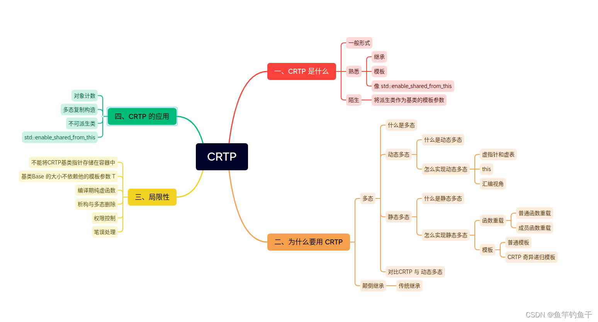
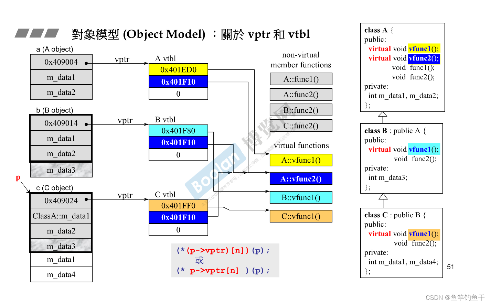
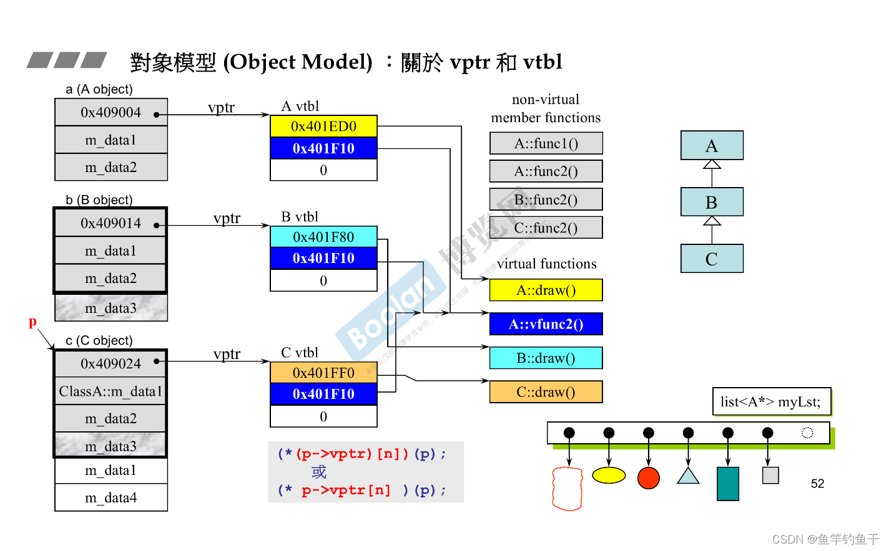
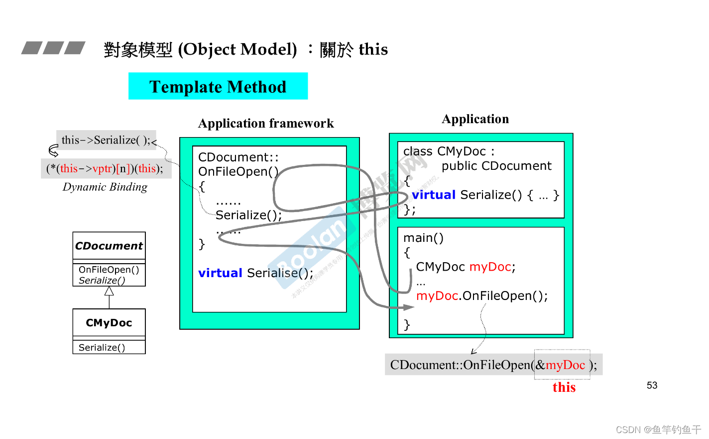
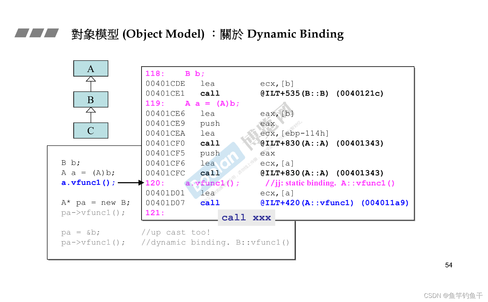
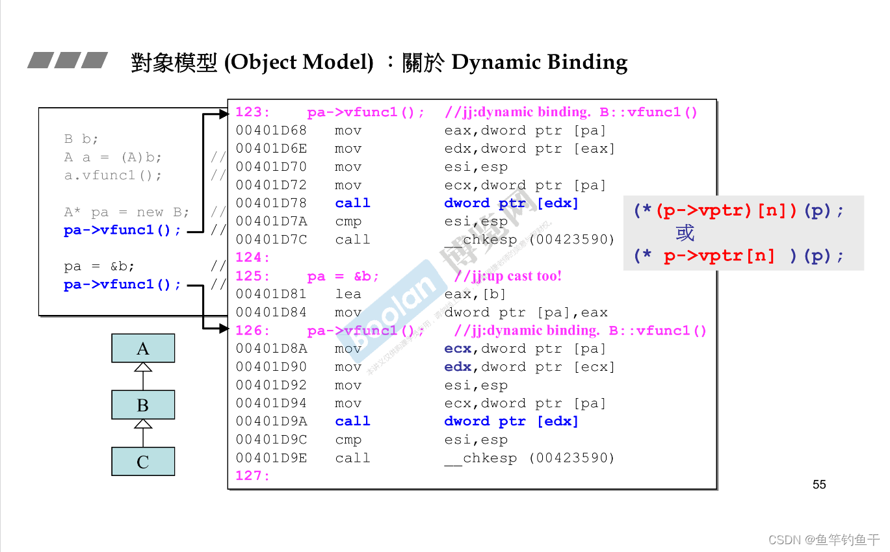
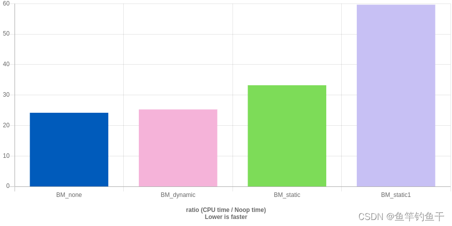
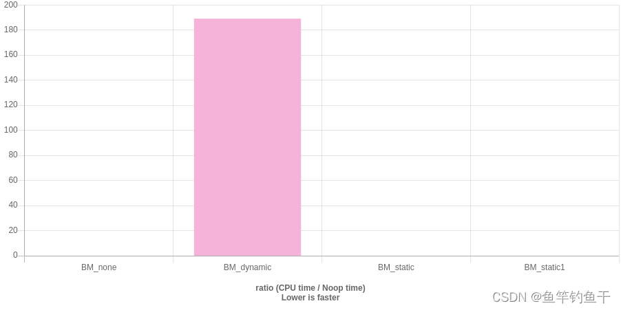

<!--BEGIN_DATA
{
    "create_date": "2023-07-23 22:40", 
    "modify_date": "2023-07-23 22:40", 
    "is_top": "0", 
    "summary": "浅谈CRTP：奇异递归模板模式", 
    "tags": "C/C++", 
    "file_name": "浅谈CRTP：奇异递归模板模式.md"
}
END_DATA-->

#### <p>原文出处：<a href='https://blog.csdn.net/qq_39354847/article/details/127576222' target='blank'>浅谈CRTP：奇异递归模板模式</a></p>

## 思维导图



## 一、CRTP 是什么

CRTP 全称 ： `Curiously Recurring Template Pattern`，也就是常说的奇异递归模板模式

下面先给出 CRTP 的一般形式

```cpp
// The Curiously Recurring Template Pattern (CRTP)
template<class T>
class Base
{
    // methods within Base can use template to access members of Derived
};

class Derived : public Base<Derived>
{
    // ...
};
```

看了上面的代码是否觉得和有点熟悉又优点陌生

**熟悉**

  * 熟悉的模板
  * 熟悉的继承
  * 看起来和 `std::enable_shared_from_this` 差不多（实际上也是 CRTP 的一种应用，后面会具体讲解）

**陌生**

看起来好像自己继承自己好怪啊

```cpp
class Derived : public Base<Derived>
```

下面谈谈为何要这么做

## 二、为什么要用 CRTP

### 2.1 CRTP 实现了静态多态

CRTP 通过将 派生类作为基类的模板参数实现了静态多态

#### 2.1.1 什么是多态

面向对象 OOP 思想三大要点：封装、继承、多态

多态按字面的意思就是多种形态。当类之间存在层次结构，并且类之间是通过继承关联时，就会用到多态。C++多态意味着调用成员函数时，会根据调用函数的对象的类型来执行不同的函数。

在 C++ 中有**静态多态和动态多态**两种实现方式，下面逐个来介绍

#### 2.1.2 什么是动态多态

动态多态（动态绑定）：即运行时的多态，在程序执行期间(非编译期)判断所引用对象的实际类型，根据其实际类型调用相应的方法。

C++ 通过虚函数实现动态多态，下面给出案例代码，如果你感觉代码理解有困难。你可以通过这篇文章简单复习一下[C++ 多态 - Arkin的文章 - 知乎](https://zhuanlan.zhihu.com/p/37340242)

注意区分

  * 重写
  * 重载
  * 隐藏

```cpp
#include<iostream>
using namespace std;

class Base
{
public:
	virtual void f(float x)
	{
		cout<<"Base::f(float)"<< x <<endl;
	}
	void g(float x)
	{
		cout<<"Base::g(float)"<< x <<endl;
	}
	void h(float x)
	{
		cout<<"Base::h(float)"<< x <<endl;
	}
};

class Derived : public Base
{
public:
    //子类与基类函数同名，有virtual关键字，运行时多态
	virtual void f(float x) override
	{
		cout<<"Derived::f(float)"<< x <<endl;   //多态、覆盖
	}
    //子类与基类函数同名，且无virtual关键字，隐藏
    //参数不同的隐藏
	void g(int x) 
	{
		cout<<"Derived::g(int)"<< x <<endl;     //隐藏
	}
    //参数相同的隐藏
	void h(float x)
	{
		cout<<"Derived::h(float)"<< x <<endl;   //隐藏
	}
};

int main(void)
{
	Derived d;        //子类对象
	Base *pb = &d;    //基类类型指针，指向子类对象
	Derived *pd = &d; //子类类型指针，指向子类对象

	// Good : behavior depends solely on type of the object
	pb->f(3.14f);   // Derived::f(float) 3.14  调用子类方法，多态
	pd->f(3.14f);   // Derived::f(float) 3.14  调用自己方法

	// Bad : behavior depends on type of the pointer
	pb->g(3.14f);   // Base::g(float)3.14 
	pd->g(3.14f);   // Derived::g(int) 3 

	// Bad : behavior depends on type of the pointer
	pb->h(3.14f);   // Base::h(float) 3.14
	pd->h(3.14f);   // Derived::h(float) 3.14

	return 0;
}
```

#### 2.1.3 如何实现动态多态

既然知道是通过虚函数来实现多态，那么具体的过程是怎么样的？为什么通过指针调用虚函数就能知道他到底是运行父类的虚函数还是子类的虚函数？  
这和 C++ 的对象模型有关，具体是一个查找虚表的过程，如果您对相关概念还不了解可以去看看 侯捷先生面向对象相关的课程，下面我简单放几张图片做一个简短的介绍

个人相关笔记： [ohmyfish C++ 侯捷 对象模型笔记](https://pokisemaine.github.io/ohmyfish/#/C++/%E4%BE%AF%E6%8D%B7C++/C++%20%E9%9D%A2%E5%90%91%E5%AF%B9%E8%B1%A1/Object%20Model?id=object-model)

**关于 vptr 和 vtbl**  



只要类里面有虚函数，类里就会有一个指针（无论有多少个虚函数），这个指针就是虚指针，虚指针指向虚函数表  

父类有虚函数，子类也一定有。继承会把数据和函数的调用权都继承下来  

**当我们用指针调用的时候会发生动态绑定，首先通过指针找到vptr，然后找到vtbl，最后调用要求的函数**  

我们可以用C来模拟动态绑定的路线

```cpp
//n是虚函数在虚函数表中的第几个，编译器按代码顺序放
(*(p->vptr)[n])(p);
(*p->vptr[n])(p);
```

以一个画板程序为例子，我们可以在容器里放指针。然后利用继承+虚函数实现一个多态，调用各自的draw

这比if-else更好一些，具体好在哪里可以学一下设计模式



**关于 this** 



这个案例里：框架里把一些固定的、确定的步骤写好了，但是有一些操作还不确定要看应用具体怎么做（可以先去看一下设计模式的Template Method）

这时候我们就可以利用虚函数实现一个延后，把具体操作的实现延后到调用的时候，谁调用谁负责实现

然后再来看看this，我们可以认为this是调用者的地址，是一个指针

```cpp
CMyDoc myDoc;
myDoc.OnFileOpen();//成员函数隐藏了一个this，注意啊这里还是对象调用而且OnFileOpen自己不是虚函数，所以这里是静态调用
myDoc.OnFileOpen(this);
myDoc.OnFileOpen(&myDoc);
myDoc.CDocument::OnFileOpen(&myDoc);//子类可以用父类的函数

//接下来就会对Serialize()进行动态绑定
this->Serialize();//this是子类对象
(*(this->vptr)[n])(this);//虚函数b
```

**关于 Dynamic Binding**

C++ 编译器看到一个函数调用有两种套路

  * 静态绑定：call xxx，一定调用到某个地址
  * 动态绑定：如果是通过指针调用虚函数并且该指针向上转型（upcast，比如指针是动物，然后new一只猪），那么编译器就会把调用动作编译成类似C语言版本来模拟调用路线。调用哪个地址要看指针指向什么

来看看汇编视角下的静态绑定：call xxx



汇编视角下的动态绑定



#### 2.1.4 什么是静态多态

静态多态：也称为编译期间的多态，编译器在编译期间完成的，编译器根据函数实参的类型(可能会进行隐式类型转换)，可推断出要调用那个函数，如果有对应的函数就调用该函数，否则出现编译错误。

静态多态有两种实现方式：

  * 函数重载：包括普通函数的重载和成员函数的重载
  * 函数模板：包括普通的模板和本次要重点介绍的 CRTP 奇异递归模板模式

对于函数重载与普通模板实现静态多态这里不做详细介绍，只给出几个代码示例

**函数重载：普通函数**

```cpp
#include <iostream>
int Volume(int s) {  // 立方体的体积。
  return s * s * s;
}

double Volume(double r, int h) {  // 圆柱体的体积。
  return 3.1415926 * r * r * static_cast<double>(h);
}

long Volume(long l, int b, int h) {  // 长方体的体积。
  return l * b * h;
}

int main() {
  std::cout << Volume(10);
  std::cout << Volume(2.5, 8);
  std::cout << Volume(100l, 75, 15);
}
```

**函数重载：成员函数**

函数的参数类型和数目不同，与函数返回值类型没有关系。重载和成员函数是否是虚函数无关。

特征：

  * 相同的范围（在同一个类中）
  * 相同的函数名字
  * 不同的参数列表
  * `virtual`关键字可有可无

```cpp
class A {
// 下面四个都是函数重载
	virtual int fun();
	void fun(int);
	void fun(double,double);
	static int fun(char);
};
```

**普通模板**

```cpp
template <typename T>
void Swap(T &a,T &b){
	T temp;
	temp=a;
	a=b;
	b=temp;
}
```

下面来详细介绍如何通过 CRTP 来实现静态多态

#### 2.1.5 如何通过 CRTP 实现静态多态（CRTP 原理介绍)

```cpp
template <class T> 
struct Base
{
    void interface()
    {
        // 不用 dynamic_cast 因为主要用在运行时，模板实在编译时就转换的
        static_cast<T*>(this)->implementation();
        // ...
    }
    static void static_func()
    {
        // ...
        T::static_sub_func();
        // ...
    }
};

struct Derived : Base<Derived>
{
    void implementation();
    static void static_sub_func();
};
```

> 维基百科  
> 基类模板利用了其成员函数体（即成员函数的实现）在声明之后很久都不会被实例化（实际上**只有被调用的模板类的成员函数才会被实例化**），并利用了派生类的成员函数（通过类型转化）。
>
> 在上例中，Base::interface()，虽然是在struct Derived之前就被声明了，但未被编译器实例化直至它被实际调用，这发生于Derived声明之后，此时Derived::implementation()的声明是已知的。
>
> 这种技术获得了类似于虚函数的效果，并避免了动态多态的代价。也有人把CRTP称为“模拟的动态绑定”。

下面利用 [C++ Insights](https://cppinsights.io/) 针对具体例子分析一下

**调用模板类成员函数前**

```cpp
#include<iostream>
using namespace std;

template<typename T>
struct Base {
    void interface() {
        static_cast<T*>(this)->implementation();	
    }
    int get() const {
        return m_count;
    }
    int m_count = 0;
};

struct Derived : Base<Derived> {
    void implementation() {
        m_count = 1;
    }
};

int main() {
    Base<Derived>* b = new Derived;
//    b->interface();
//    cout << b->get() << endl;
    return 0;
}
```

`insights.cpp`

```cpp
#include<iostream>
using namespace std;

template<typename T>
struct Base
{
  inline void interface()
  {
    static_cast<T *>(this)->implementation();
  }
  inline int get() const
  {
    return this->m_count;
  }
  int m_count = 0;
};

/* First instantiated from: insights.cpp:17 */
#ifdef INSIGHTS_USE_TEMPLATE
template<>
struct Base<Derived>
{
  inline void interface();
  inline int get() const;
  int m_count = 0;
  // inline constexpr Base() noexcept = default;
};
#endif

struct Derived : public Base<Derived>
{
  inline void implementation()
  {
    /* static_cast<Base<Derived> *>(this)-> */ m_count = 1;
  }
  // inline constexpr Derived() noexcept = default;
};

int main()
{
  Base<Derived> * b = static_cast<Base<Derived> *>(new Derived());
  return 0;
}
```

**调用类模板成员函数后**

```cpp
#include<iostream>
using namespace std;

template<typename T>
struct Base {
    void interface() {
        static_cast<T*>(this)->implementation();	
    }
    int get() const {
        return m_count;
    }
    int m_count = 0;
};

struct Derived : Base<Derived> {
    void implementation() {
        m_count = 1;
    }
};

int main() {
    Base<Derived>* b = new Derived;
    b->interface();
    cout << b->get() << endl;
    return 0;
}
```

`insights.cpp`

```cpp
#include<iostream>
using namespace std;

template<typename T>
struct Base
{
  inline void interface()
  {
    static_cast<T *>(this)->implementation();
  }
  inline int get() const
  {
    return this->m_count;
  }
  int m_count = 0;
};

/* First instantiated from: insights.cpp:17 */
#ifdef INSIGHTS_USE_TEMPLATE
template<>
struct Base<Derived>
{
  inline void interface()
  {
    static_cast<Derived *>(this)->implementation();
  }
  inline int get() const
  {
    return this->m_count;
  }
  int m_count = 0;
  // inline constexpr Base() noexcept = default;
};
#endif

struct Derived : public Base<Derived>
{
  inline void implementation()
  {
    /* static_cast<Base<Derived> *>(this)-> */ m_count = 1;
  }
  // inline constexpr Derived() noexcept = default;
};

int main()
{
  Base<Derived> * b = static_cast<Base<Derived> *>(new Derived());
  b->interface();
  std::cout.operator<<(b->get()).operator<<(std::endl);
  return 0;
}
```

对比调用前后的`insights.cpp`代码可以发现，在实际调用`b->interface()`前`Base::interface()`并没有被实例化。所以虽然此时 `Derived` 还不是一个完整的类型，但并没有报错，你可以当作`Base::interface()`里的代码不存在。在调用`b->interface()` 的时候，`Derived` 已经是一个完整类型了，此时再实例化类模板成员函数，就能调用`Derived::implementation()`

可以发现，CRTP 利用继承 + 模板让基类在编译期就能知道派生类的信息，在原来的动态多态中需要通过虚函数查找虚表来获取信息，这就实现了静态多态。

```cpp
#include<iostream>
using namespace std;

template<typename T>
struct Base {
    void interface() {
        static_cast<T*>(this)->implementation();	
    }
    int get() const {
        return m_count;
    }
    int m_count = 0;
};

struct Derived1 : Base<Derived1> {
    void implementation() {
        m_count = 1;
    }
};

struct Derived2 : Base<Derived2> {
    void implementation() {
        m_count = 2;
    }
};

int main() {
    Base<Derived1>* b1 = new Derived1;
    Base<Derived2>* b2 = new Derived2;
    b1->interface();
    cout << b1->get() << endl;
    b2->interface();
    cout << b2->get() << endl;
    return 0;
}
```

#### 2.1.6动态多态与 CRTP 的对比

动态多态通过虚函数来实现，在性能上存在以下缺陷

  * 查找虚表需要一定时间（影响没那么大）
  * 难以被内联或优化（主要影响）

使用 [Quick C++ Bench](https://quick-bench.com) 进行基准测试，使用 `Clang15.0`，`C++20`编译，分别测试不同优化等级下的效果  
代码来自：`https://github.com/PacktPublishing/Hands-On-Design-Patterns-with-CPP/blob/master/Chapter08/function_call.C`

```cpp
#include <stdlib.h>

#include "benchmark/benchmark.h"

#define REPEAT2(x) x x
#define REPEAT4(x) REPEAT2(x) REPEAT2(x)
#define REPEAT8(x) REPEAT4(x) REPEAT4(x)
#define REPEAT16(x) REPEAT8(x) REPEAT8(x)
#define REPEAT32(x) REPEAT16(x) REPEAT16(x)
#define REPEAT(x) REPEAT32(x)

namespace no_polymorphism {
class A {
    public:
    A() : i_(0) {}
    void f(int i) { i_ += i; }
    int get() const { return i_; }
    protected:
    int i_;
};
} // namespace no_polymorphism

namespace dynamic_polymorphism {
class B {
    public:
    B() : i_(0) {}
    virtual ~B() {}
    virtual void f(int i) = 0;
    int get() const { return i_; }
    protected:
    int i_;
};
class D : public B {
    public:
    void f(int i) { i_ += i; }
};
} // namespace dynamic_polymorphism

namespace static_polymorphism {
template <typename D> class B {
    public:
    B() : i_(0) {}
    virtual ~B() {}
    void f(int i) { static_cast<D*>(this)->f(i); }
    int get() const { return i_; }
    protected:
    int i_;
};
class D : public B<D> {
    public:
    void f(int i) { i_ += i; }
};
} // namespace static_polymorphism

namespace static_polymorphism1 {
template <typename D> class B {
    public:
    B() : i_(0) {}
    void f(int i) { derived()->f(i); }
    int get() const { return i_; }
    protected:
    int i_;
    private:
    D* derived() { return static_cast<D*>(this); }
};
template <typename D> void apply(B<D>* b, int& i) { b->f(++i); }
class D : public B<D> {
    public:
    void f(int i) { i_ += i; }
};
} // namespace static_polymorphism1

void BM_none(benchmark::State& state) {
    no_polymorphism::A* a = new no_polymorphism::A;
    int i = 0;
    for (auto _ : state) {
        REPEAT(a->f(++i);)
    }
    benchmark::DoNotOptimize(a->get());
    state.SetItemsProcessed(32*state.iterations());
    delete a;
}

void BM_dynamic(benchmark::State& state) {
    dynamic_polymorphism::B* b = new dynamic_polymorphism::D;
    int i = 0;
    for (auto _ : state) {
        REPEAT(b->f(++i);)
    }
    benchmark::DoNotOptimize(b->get());
    state.SetItemsProcessed(32*state.iterations());
    delete b;
}

void BM_static(benchmark::State& state) {
    static_polymorphism::B<static_polymorphism::D>* b = new static_polymorphism::D;
    int i = 0;
    for (auto _ : state) {
        REPEAT(b->f(++i);)
    }
    benchmark::DoNotOptimize(b->get());
    state.SetItemsProcessed(32*state.iterations());
    delete b;
}

void BM_static1(benchmark::State& state) {
    static_polymorphism1::D d;
    static_polymorphism1::B<static_polymorphism1::D>* b = &d;
    int i = 0;
    for (auto _ : state) {
        REPEAT(apply(b, i);)
    }
    benchmark::DoNotOptimize(b->get());
    state.SetItemsProcessed(32*state.iterations());
}

BENCHMARK(BM_none);
BENCHMARK(BM_dynamic);
BENCHMARK(BM_static);
BENCHMARK(BM_static1);
```

**Optim:None**  

**Optim:Og**  

**Optim:O1**  

**Optim:O2**  

**Optim:O3**  

**Optim:OFast**  


可以看到在开优化后 CRTP 静态多态的速度比虚函数动态绑定快很多

### 2.2 CRTP 实现了颠倒继承

传统的继承是通过派生类向基类添加功能，而 CRTP 可以实现通过基类向派生类添加功能，也就是颠倒继承

那么为什么要用颠倒继承呢？目的是代码复用减少代码量。

下面的例子参考 [惯用法之CRTP](https://cloud.tencent.com/developer/article/2081911)

现在要实现一个功能：根据对象的具体类型来打印类型名

```cpp
class Base {
 public:
  void PrintType() {
    std::cout << typeid(*this).name() << std::endl;
  }
};

class Derived1 : public Base {};
class Derived2 : public Base {};

void PrintType(const Base& base) {
  base.PrintType();
}
```

#### 2.2.1 传统继承

```cpp
#include<iostream>
#include<typeinfo>

class Base {
 public:
  virtual void PrintType () const {
    std::cout << typeid(*this).name() << std::endl;
  }
};

class Derived1 : public Base {};

class Derived2 : public Base {};
void PrintType(const Base& base) {
  base.PrintType();
}

int main() {
    Derived1 d1;
    Derived2 d2;
    PrintType(d1);
    PrintType(d2);
}
```

#### 2.2.2 CRTP 颠倒继承

```cpp
#include<iostream>
#include<typeinfo>

template<typename T>
class Base {
 public:
  void PrintType () {
    T& t = static_cast<T&>(*this);
    std::cout << typeid(t).name() << std::endl;
  }
};

class Derived1 : public Base <Derived1> {};
class Derived2 : public Base <Derived2> {};

template<typename T>
void PrintType(T base) {
  base.PrintType();
}

int main() {
    Derived1 d1;
    Derived2 d2;
    PrintType(d1);
    PrintType(d2);
}
```

可以看到 CRTP 可以像继承 + 虚函数一样实现对代码的复用

## 三、局限性

这部分内容参考了：[CRTP避坑实践](https://cloud.tencent.com/developer/article/2081912) 以及 [Design Patterns With C++（八）CRTP（上）](https://zhuanlan.zhihu.com/p/142407249)

### 3.1 不能将CRTP基类指针存储在容器中

```cpp
#include<iostream>
#include<typeinfo>
using namespace std;

template<typename T>
struct Base {
  void PrintType () {
    T& t = static_cast<T&>(*this);
    std::cout << typeid(t).name() << std::endl;
  }
};

struct Derived1 : Base<Derived1> {};
struct Derived2 : Base<Derived2> {};

int main() {
    Base<Derived1>* b1 = new Derived1;
    Base<Derived2>* b2 = new Derived2;
    auto vec = {b1, b2};
    return 0;
}
```

```cpp
crtp2.cpp: 在函数‘int main()’中:
crtp2.cpp:20:23: 错误：无法从‘{b1, b2}’推导出‘std::initializer_list<auto>’
   20 |     auto vec = {b1, b2};
      |                       ^
crtp2.cpp:20:23: 附注：  deduced conflicting types for parameter ‘auto’ (‘Base<Derived1>*’ and ‘Base<Derived2>*’)
```

Base类实际上是一个模板类，而不是一个实际的类。因此，如果存在名为`Derived1` 和 `Derived2`的派生类，则基类模板初始化将具有不同的类型

```cpp
#include<iostream>
#include<typeinfo>
#include<vector>

using namespace std;
template<typename T>
struct Base {
  void PrintType () {
    T& t = static_cast<T&>(*this);
    std::cout << typeid(t).name() << std::endl;
  }
};

struct Derived1 : Base<Derived1> {};
struct Derived2 : Base<Derived2> {};

int main() {
    Base<Derived1>* b1 = new Derived1;
    Base<Derived2>* b2 = new Derived2;
    std::cout << "b1, b2 is_same: " << is_same<decltype(b1), decltype(b2)>::value << endl;
    return 0;
}
```

结果

```cpp
b1, b2 is_same: 0
```

由于 b1 和 b2 类型不同，所以无法存入容器当中

### 3.2 基类Base 的大小不依赖他的模板参数 T

```cpp
template <typename C> class B {
    typedef typename C::T T; // 编译失败
    T* p_;
};

class D : public B<D> {
    int T;
};
```

基类B本身并没有错误，放进 [C++ Insights](https://cppinsights.io/) 里是能正常编译的

```cpp
template <typename C> class B {
    typedef typename C::T T;
    T* p_;
};
```

`insights.cpp`

```cpp
template<typename C>
class B
{
  using T = typename C::T;
  T * p_;
};
```

而声明了`D : B<D>` 之后获取`D::T`时编译发生了错误，原因是在实现B时D还没有声明！D声明时需要知道准确的B(继承关系)，而产生B的时候需要D已经声明完成，所以B内部无法得知D::T的类型，套娃失败。

所以任何可能影响类大小的内容都必须被完整声明。在对不完整类型中声明类型引用，将会造成嵌套，这是不允许的。

另一方面，类模板成员函数的主体在调用之前是不会实例化的。**事实上对于给定的模板参数，只要工程中没有调用此成员函数，那么该成员函数是不会被编译的。（你可以在如何通过 CRTP 实现静态多态那一节看到具体例子的说明）** 因此，对**基类成员函数中**的派生类、嵌套类型与成员函数的引用是十分准确的。而且由于派生类类型作为基类的正向声明，我们可以声明指向它（指派生类）的指针与引用。下例是一种常见的对CRTP基类重构的方法，它将所有强制转换放在一个方法里：

```cpp
template <typename D> class B {
public:
    B() : i_(0) {}
    void f(int i) { derived()->f(i); }
    int get() const { return i_; }
protected:
    int i_;
private:
    D* derived() { return static_cast<D*>(this); } // 声明一个私有方法获取继承类
};

template <typename D> void apply(B<D>* b, int& i) { b->f(++i); }
class D : public B<D> {
public:
    void f(int i) { i_ += i; }
};
```

### 3.3 编译期纯虚函数

必须在所有派生类中实现纯虚函数；声明纯虚函数，或者没有复写纯虚函数的继承类是一个抽象类。纯虚函数要求派生类最终必须有具体的实现，否则编译会报错。但是对于CRTP，如果派生类没有实现要求的函数，将不会产生编译错误，甚至编译告警也不会产生。

```cpp
#include<iostream>
using namespace std;

template<typename T>
struct Base {
    void f() {
        static_cast<T*>(this)->f();	
    }
};

struct Derived : Base<Derived> {
  // 没实现 f
};

int main() {
    Base<Derived>* b = new Derived;
    b->f();
    return 0;
}
```

但是如果运行上面的代码就会收到 `Segmentation fault`，这是由于递归调用造成的

由于`Derived` 没有实现自己的`f()`，所以`Base`在 `static_cast<T*>(this)->f(); ` 的时候就会递归调用自己的`f()`

为了解决这种这种情况

  * 我们可以给基类设置一个默认实现的函数,如果派生类没实现就调用默认的函数
  * 不要写成递归的形式！你`Base`里是`XXXinterface`那么调用的就是`XXXimpl`或者`XXXimplement`，这样如果没写就直接编译报错了

```cpp
#include<iostream>
using namespace std;

template<typename T>
struct Base {
    void interface() {
        static_cast<T*>(this)->implementation();	
    }
};

struct Derived : Base<Derived> {
  // 没写 implementation
};

int main() {
    Base<Derived>* b = new Derived;
    b->interface();
    return 0;
}
```

直接编译报错

```cpp
crtp2.cpp: In instantiation of ‘void Base<T>::interface() [with T = Derived]’:
crtp2.cpp:17:17:   required from here
crtp2.cpp:7:32: 错误：‘struct Derived’ has no member named ‘implementation’
    7 |         static_cast<T*>(this)->implementation();
      |         ~~~~~~~~~~~~~~~~~~~~~~~^~~~~~~~~~~~~~
```

添加默认实现函数

```cpp
#include<iostream>
#include<typeinfo>
using namespace std;

template<typename T>
struct Base {
    void interface() {
        static_cast<T*>(this)->implementation();	
    }
    void implementation() {
        T& t = static_cast<T&>(*this);
        std::cout << typeid(t).name() << " forget to implementation" << std::endl;
    }
};

struct Derived : Base<Derived> {
    // 没写 implementation
};

int main() {
    Base<Derived>* b = new Derived;
    b->interface();
    return 0;
}
```

### 3.4 析构与多态删除

下面尝试通过基类指针去删除对象

```cpp
#include <iostream>
using namespace std;

template<typename T>
class Base {
public:
    ~Base() {
        std::cout << "call ~Base" << std::endl;
    }
};

class Derived : public Base<Derived> {
public:
    ~Derived() {
        std::cout << "call ~Derived" << std::endl;
    }
};

int main() {
    Base<Derived>* b = new Derived;
    delete b;
    return 0;
}
```

结果：只调用了`Base` 的析构函数，没有调用 `Derived` 的析构函数

```cpp
call ~Base
```

**这实际上是个很经典的问题：为什么析构函数要是虚函数**

如果基类指针向派生类对象，则删除此指针时，我们希望调用该指针指向的派生类析构函数，而派生类的析构函数又自动调用基类的析构函数，这样整个派生类的对象完全被释放。

若使用基类指针操作派生类，需要防止在析构时，只析构基类，而不析构派生类。

**但是，如果析构函数不被声明成虚函数，则编译器采用的绑定方式是静态绑定，在删除基类指针时，只会调用基类析构函数，而不调用派生类析构函数，这样就会导致基类指针指向的派生类对象析构不完全。若是将析构函数声明为虚函数，则可以解决此问题。**

```cpp
#include <iostream>
using namespace std;

template<typename T>
class Base {
public:
    virtual ~Base() {
        std::cout << "call ~Base" << std::endl;
    }
};

class Derived : public Base<Derived> {
public:
    ~Derived() {
        std::cout << "call ~Derived" << std::endl;
    }
};

int main() {
    Base<Derived>* b = new Derived;
    delete b;
    return 0;
}
```

结果

```cpp
call ~Derived
call ~Base
```

虽然这违背了 CRTP 的初衷但是只有析构函数是虚函数还是可以接受的

那么还有别的方法吗？例如我们模仿`interface`里的操作`static_cast` 成派生类然后调用对应的析构函数

```cpp
#include <iostream>
using namespace std;

template<typename T>
class Base {
public:
    ~Base() {
        static_cast<T*>(this)->~Derived();
    }
};

class Derived : public Base<Derived> {
public:
    ~Derived() {
        std::cout << "call ~Derived" << std::endl;
    }
};

int main() {
    Base<Derived>* b = new Derived;
    delete b;
    return 0;
}
```

运行之后发现输出了一堆 `call ~Derived`，这是什么原因呢？

派生类执行自己的析构函数后会执行基类的析构函数，基类析构函数又去执行派生类的析构函数，所以就递归套娃了。

**解决方案是专门编写一个方法实现子类析构**

```cpp
#include <iostream>
#include <typeinfo>
using namespace std;

template<typename T>
class Base {
public:
    ~Base() {
        std::cout << "call ~Base" << std::endl;
    }
};

class Derived : public Base<Derived> {
public:
    ~Derived() {
        std::cout << "call ~Derived" << std::endl;
    }
};

template<typename T>
void destroy(Base<T>* b) {
    delete static_cast<T*>(b);
}

int main() {
    Base<Derived>* b = new Derived;
    destroy(b);
    return 0;
}
```

结果

```cpp
call ~Derived
call ~Base
```

### 3.5 权限控制

对于CRTP方法必须是公共的或者调用方具体特殊的访问权限，下面给出一个案例

首先不调用`Base::interface` ，由于类模板的成员函数只有在被调用后才会实例化，所以没有问题

```cpp
#include<iostream>

template<typename T>
class Base {
public:
    void interface() {
        static_cast<T*>(this)->implementation();
    }
};

class Derived : public Base<Derived> {
private:
    void implementation() {}
};

int main() {
    Base<Derived>* b = new Derived;
}
```

接下来，在 `main` 中调用 `interface` , 由于 `Base` 没有对 `Derived::implementation()`的访问权限，编译失败

```cpp
#include<iostream>

template<typename T>
class Base {
public:
    void interface() {
        static_cast<T*>(this)->implementation();
    }
};

class Derived : public Base<Derived> {
private:
    void implementation() {}
};

int main() {
    Base<Derived>* b = new Derived;
    b->interface();
}
```

```cpp
crtp4.cpp: In instantiation of ‘void Base<T>::interface() [with T = Derived]’:
crtp4.cpp:18:17:   required from here
crtp4.cpp:7:46: 错误：‘void Derived::implementation()’ is private within this context
    7 |         static_cast<T*>(this)->implementation();
      |         ~~~~~~~~~~~~~~~~~~~~~~~~~~~~~~~~~~~~~^~
crtp4.cpp:13:10: 附注：declared private here
   13 |     void implementation() {}
      |          ^~~~~~~~~~~~~~
```

我们可以将 `Base<Derived` 声明为 `Derived` 的友元来解决这个问题

```cpp
#include<iostream>

template<typename T>
class Base {
public:
    void interface() {
        static_cast<T*>(this)->implementation();
    }
};

class Derived : public Base<Derived> {
    friend Base<Derived>;
private:
    void implementation() {}
};

int main() {
    Base<Derived>* b = new Derived;
    b->interface();
}
```

### 3.6 笔误处理

#### 案例1

下面这个案例，`class Derived1 : public Base<Derived1>` 笔误写成`class Derived1 : public Base<Derived>` ，并且 `main` 函数里 `Base<Derived>* b1 = new Derived1;`也写错了。代码能够正常编译运行却不是我们期望的结果，调用 `b1->interface` 之后输出的是 `Derived impl` 而不是`Derived1 impl`。那么能否在编译期就把这个错误给检查出来呢？

```cpp
#include<iostream>

template<typename T>
class Base {
public:
    void interface() {
        static_cast<T*>(this)->implementation();
    }
    void implementation() {
        std::cout << "Base impl" << std::endl;
    }
};

class Derived : public Base<Derived> {
public:
    void implementation() {
        std::cout << "Derived impl" << std::endl;
    }
};

class Derived1 : public Base<Derived> { //笔误写成 Base<Derived> 了，应该是 Base<Derived1>
public:
    void implementation() {
        std::cout << "Derived1 impl" << std::endl;
    }
};

int main() {
    Base<Derived>* b1 = new Derived1; // 这里也写错了
    b1->interface();
}
```

我们可以将 `Base` 的构造函数设为私有，然后将模板参数作为友元 `T`。因为派生类构造的时候必然会先调用基类的构造函数，由于此时基类构造函数，派生类需要是友元才能访问。然而由于笔误，此时的模板参数`T = Derived`而不是 `Derived1` ，也就是说`Derived1` 并不是 `Base` 的友元，也就无法构造成功。这样就能达到编译期报错的效果。

```cpp
#include<iostream>

template<typename T>
class Base {
public:
    void interface() {
        static_cast<T*>(this)->implementation();
    }
    void implementation() {
        std::cout << "Base impl" << std::endl;
    }
private:
    Base() = default;
    friend T;
};

class Derived : public Base<Derived> {
public:
    void implementation() {
        std::cout << "Derived impl" << std::endl;
    }
};

class Derived1 : public Base<Derived> { //笔误写成 Base<Derived> 了，应该是 Base<Derived1>
public:
    void implementation() {
        std::cout << "Derived1 impl" << std::endl;
    }
};

int main() {
    Base<Derived>* b1 = new Derived1;
    b1->interface();
}
```

#### 案例2

在下面这个案例，`class Derived1 : public Base<Derived1>` 笔误写成`class Derived1 : public Base<Derived>` 了。不过`main` 函数里`Base<Derived1>* b1 = new Derived1;`是正确的，能够在编译的时候就检测出错误。但是如果不调用就不会报错，那么能否不调用`Base<Derived1>* b1 = new Derived1;`就报错呢？

```cpp
#include<iostream>

template<typename T>
class Base {
public:
    void interface() {
        static_cast<T*>(this)->implementation();
    }
    int get() {
        return m_count;
    }
protected:
    int m_count = 0;
private:
    void implementation() {
        m_count = 1;
    }
};

class Derived : public Base<Derived> {
    friend Base<Derived>;
private:
    void implementation() {
        m_count = 1;
    }
};

class Derived1 : public Base<Derived> { //笔误写成 Base<Derived> 了，应该是 Base<Derived1>
    friend Base<Derived1>;
private:
    void implementation() {
        m_count = 2;
    }
};

int main() {
    // Base<Derived1>* b1 = new Derived1; 不写这句就不会报错
}
```

将成员变量设为 `private` 然后将模板参数作为 `Base` 的友元即可  

在笔误的 `Derived1` 中，模板参数误写为 `T = Derived` 所以 `Derived1` 不是 `Base` 的友元，没有权限去访问`Base` 的成员变量

```cpp
#include<iostream>

template<typename T>
class Base {
    friend T;	// 模板参数作为友元
public:
    void interface() {
        static_cast<T*>(this)->implementation();
    }
    int get() {
        return m_count;
    }
private:
    int m_count = 0;	// 成员变量 private
    void implementation() {
        m_count = 1;
    }
};

class Derived : public Base<Derived> {
    friend Base<Derived>;
private:
    void implementation() {
        m_count = 1;
    }
};

class Derived1 : public Base<Derived> { //笔误写成 Base<Derived> 了，应该是 Base<Derived1>
    friend Base<Derived1>;
private:
    void implementation() {
        m_count = 2;
    }
};

int main() {
    // Base<Derived1>* b1 = new Derived1;
}
```

## 四、CRTP 的应用

### 4.1 对象计数

统计一个类的实例对象创建与析构的数据。可以轻松地利用CRTP实现:

```cpp
template <typename T>
struct counter
{
    static int objects_created;
    static int objects_alive;
    counter()
    {
        ++objects_created;
        ++objects_alive;
    }
    counter(const counter&)
    {
        ++objects_created;
        ++objects_alive;
    }
protected:
    ~counter() // objects should never be removed through pointers of this type
    {
        --objects_alive;
    }
};

template <typename T> int counter<T>::objects_created( 0 );
template <typename T> int counter<T>::objects_alive( 0 );
class X : counter<X>
{
    // ...
};

class Y : counter<Y>
{
    // ...
};
```

### 4.2 多态复制构造

当使用多态时，常需要基于基类指针创建对象的一份拷贝。常见办法是增加clone虚函数在每一个派生类中。使用CRTP，可以避免在派生类中增加这样的虚函数。

```cpp
// Base class has a pure virtual function for cloning
class Shape {
public:
    virtual ~Shape() {}
    virtual Shape *clone() const = 0;
};

// This CRTP class implements clone() for Derived
template <typename Derived>
class Shape_CRTP : public Shape {
public:
    virtual Shape *clone() const {
        return new Derived(static_cast<Derived const&>(*this));
    }
};

// Nice macro which ensures correct CRTP usage
#define Derive_Shape_CRTP(Type) class Type: public Shape_CRTP<Type>

// Every derived class inherits from Shape_CRTP instead of Shape
Derive_Shape_CRTP(Square) {};
Derive_Shape_CRTP(Circle) {};
```

### 4.3 不可派生类

一个类如果不希望被继承，类似于Java中的具有finally性质的类，这在C++中可以用虚继承来实现：

```cpp
template<typename T> class MakeFinally{
   private:
       MakeFinally(){}//只有MakeFinally的友类才可以构造MakeFinally
       ~MakeFinally(){}
   friend T;
};

class MyClass:public virtual  MakeFinally<MyClass>{};//MyClass是不可派生类
//由于虚继承，所以D要直接负责构造MakeFinally类，从而导致编译报错，所以D作为派生类是不合法的。
class D: public MyClass{};
//另外，如果D类没有实例化对象，即没有被使用，实际上D类是被编译器忽略掉而不报错

int main()
{
    MyClass var1;
    // D var2;  //这一行编译将导致错误，因为D类的默认构造函数不合法
}
```

Tip：C++11 新标准已经提供了一种防止继承发生的方法，在类名后跟一个修饰符 `final`

### 4.4 std::enable_shared_from_this

这部分可以参考：[C++11新特性之十：enable_shared_from_this](https://blog.csdn.net/caoshangpa/article/details/79392878)

当类A被 `shared_ptr` 管理，且在类A的成员函数里需要把当前类对象作为参数传给其他函数时，就需要传递一个指向自身的`shared_ptr`。这时候就可以让类继承 `std::enable_shared_from_this`，然后用 `shared_from_this`来获取一个指向自身的 `shared_ptr`

  * 为何不直接传递 `this` 指针：使用智能指针的初衷就是为了方便资源管理，如果在某些地方使用智能指针，某些地方使用原始指针，很容易破坏智能指针的语义，从而产生各种错误
  * 为什么不直接传递`shared_ptr<this>`：这样会造成2个非共享的`shared_ptr`指向同一个对象，未增加引用计数导对象被析构两次，也就是两个`shared_ptr` 各自都认为自己是对象唯一的拥有者。这会导致一个对象被析构两次（未定义行为）

```cpp
#include <memory>
#include <iostream>
 
struct Good : std::enable_shared_from_this<Good> // note: public inheritance
{
    std::shared_ptr<Good> getptr() {
        return shared_from_this();
    }
};
 
struct Best : std::enable_shared_from_this<Best> // note: public inheritance
{
    std::shared_ptr<Best> getptr() {
        return shared_from_this();
    }
    // No public constructor, only a factory function,
    // so there's no way to have getptr return nullptr.
    [[nodiscard]] static std::shared_ptr<Best> create() {
        // Not using std::make_shared<Best> because the c'tor is private.
        return std::shared_ptr<Best>(new Best());
    }
private:
    Best() = default;
};
 
 
struct Bad
{
    std::shared_ptr<Bad> getptr() {
        return std::shared_ptr<Bad>(this);
    }
    ~Bad() { std::cout << "Bad::~Bad() called\n"; }
};
 
void testGood()
{
    // Good: the two shared_ptr's share the same object
    std::shared_ptr<Good> good0 = std::make_shared<Good>();
    std::shared_ptr<Good> good1 = good0->getptr();
    std::cout << "good1.use_count() = " << good1.use_count() << '\n';
}
 
 
void misuseGood()
{
    // Bad: shared_from_this is called without having std::shared_ptr owning the caller 
    try {
        Good not_so_good;
        std::shared_ptr<Good> gp1 = not_so_good.getptr();
    } catch(std::bad_weak_ptr& e) {
        // undefined behavior (until C++17) and std::bad_weak_ptr thrown (since C++17)
        std::cout << e.what() << '\n';    
    }
}
 
 
void testBest()
{
    // Best: Same but can't stack-allocate it:
    std::shared_ptr<Best> best0 = Best::create();
    std::shared_ptr<Best> best1 = best0->getptr();
    std::cout << "best1.use_count() = " << best1.use_count() << '\n';
 
    // Best stackBest; // <- Will not compile because Best::Best() is private.
}
 
 
void testBad()
{
    // Bad, each shared_ptr thinks it's the only owner of the object
    std::shared_ptr<Bad> bad0 = std::make_shared<Bad>();
    std::shared_ptr<Bad> bad1 = bad0->getptr();
    std::cout << "bad1.use_count() = " << bad1.use_count() << '\n';
} // UB: double-delete of Bad
 
 
int main()
{
    testGood();
    misuseGood();
 
    testBest();
 
    testBad();
}
```

结果

```cpp
good1.use_count() = 2
bad_weak_ptr
best1.use_count() = 2
bad1.use_count() = 1
Bad::~Bad() called
Bad::~Bad() called
*** glibc detected *** ./test: double free or corruption
```

那么 `std::enable_shared_from_this` 是怎么实现的呢，实际上它是一个典型的 CRTP 类。

`enable_shared_from_this` 作为基类，模板参数就是我们自己的类。让我们自己的类继承`enable_shared_from_this<MyClass>` 即可。

观察 `shared_from_this()` 可以得知是利用 `weak_ptr` 来实现的。这个 `weak_ptr` 能够监视 `this`。在调用`shared_from_this` 这个函数时，会用 `weak_ptr` 来构造一个 `shared_ptr` ，这会让 `shared_ptr` 指针计数+1，同时返回这个`shared_ptr`。

> `weak_ptr`是为配合`shared_ptr`而引入的一种智能指针来协助`shared_ptr`工作，它可以从一个`shared_ptr`或另一个`weak_ptr`对象构造，它的构造和析构不会引起引用计数的增加或减少。没有重载 `*` 和 `->` 但可以使用lock获得一个可用的`shared_ptr`对象。
> 
> `weak_ptr`的使用更为复杂一点，它可以指向`shared_ptr`指针指向的对象内存，却并不拥有该内存，而使用`weak_ptr`成员lock，则可返回其指向内存的一个`share_ptr`对象，且在所指对象内存已经无效时，返回指针空值nullptr。
> 
> 注意：`weak_ptr`并不拥有资源的所有权，所以不能直接使用资源。可以从一个`weak_ptr`构造一个`shared_ptr`以取得共享资源的所有权。

```cpp
/**
*  @brief Base class allowing use of member function shared_from_this.
*/
template<typename _Tp>
class enable_shared_from_this
{
protected:
  constexpr enable_shared_from_this() noexcept { }

  enable_shared_from_this(const enable_shared_from_this&) noexcept { }

  enable_shared_from_this&
  operator=(const enable_shared_from_this&) noexcept
  { return *this; }

  ~enable_shared_from_this() { }

public:
  shared_ptr<_Tp>
  shared_from_this()
  { return shared_ptr<_Tp>(this->_M_weak_this); }

  shared_ptr<const _Tp>
  shared_from_this() const
  { return shared_ptr<const _Tp>(this->_M_weak_this); }

private:
  template<typename _Tp1>
void
_M_weak_assign(_Tp1* __p, const __shared_count<>& __n) const noexcept
{ _M_weak_this._M_assign(__p, __n); }

  template<typename _Tp1, typename _Tp2>
friend void
__enable_shared_from_this_helper(const __shared_count<>&,
                 const enable_shared_from_this<_Tp1>*,
                 const _Tp2*) noexcept;

  mutable weak_ptr<_Tp>  _M_weak_this;
};
```

## 五、参考资料

* [Design Patterns With C++（八）CRTP（上）](https://zhuanlan.zhihu.com/p/142407249)
* [Design Patterns With C++（八）CRTP（下）](https://zhuanlan.zhihu.com/p/142679612)
* [奇异递归模板模式 - 维基百科](https://zh.wikipedia.org/wiki/%E5%A5%87%E5%BC%82%E9%80%92%E5%BD%92%E6%A8%A1%E6%9D%BF%E6%A8%A1%E5%BC%8F)
* [Counting Objects in C++](https://www.drdobbs.com/cpp/counting-objects-in-c/184403484)
* [C++雾中风景14:CRTP, 模板的黑魔法](https://www.cnblogs.com/happenlee/p/13278640.html)
* [cppreference std::enable_from_this](https://en.cppreference.com/w/cpp/memory/enable_shared_from_this)
* [C+±–静态多态与动态多态](https://blog.csdn.net/qq_37934101/article/details/81365449#t0)
* [C++ 多态 - Arkin的文章 - 知乎](https://zhuanlan.zhihu.com/p/37340242)
* [惯用法之CRTP](https://cloud.tencent.com/developer/article/2081911)
* [CRTP避坑实践](https://cloud.tencent.com/developer/article/2081912)
* [C++11新特性之十：enable_shared_from_this](https://blog.csdn.net/caoshangpa/article/details/79392878)
* [【C++】weak_ptr弱引用智能指针详解](https://blog.csdn.net/qq_38410730/article/details/105903979)
