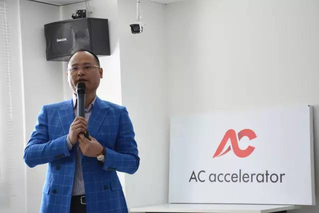
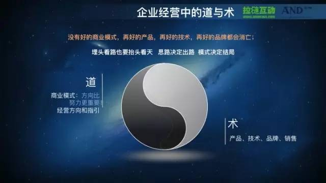
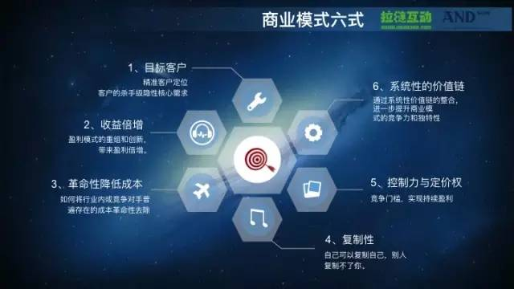
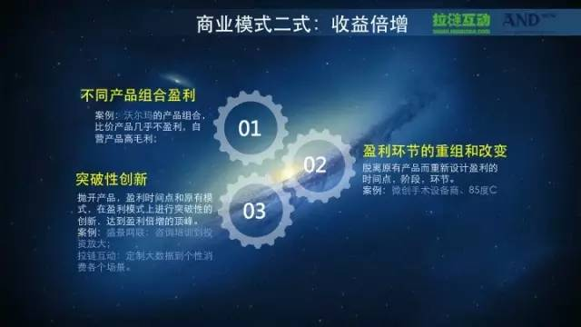
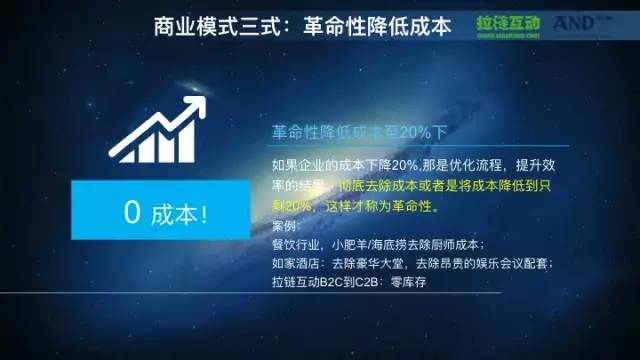
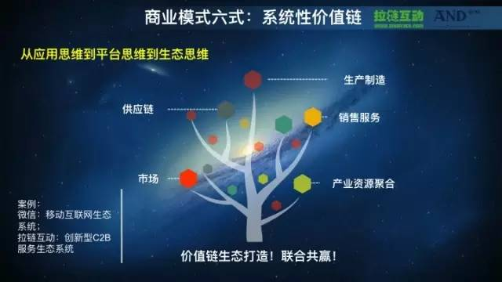

 
<!--BEGIN_DATA
{
    "create_date": "2017-02-08 16:49", 
    "modify_date": "2017-02-08 16:49", 
    "is_top": "0", 
    "summary": "涨姿势：商业模式规划六大式", 
    "tags": "其它", 
    "file_name": "涨姿势：商业模式规划六大式.md"
}
END_DATA-->

####
原文出处：<a href='http://www.cyzone.cn/a/20160404/293237.html' target='blank'>涨姿势：商业模式规划六大式</a>

  

近日，在AC加速器封闭集训会上，拉链互动科技有限公司CEO吴巍与创业者分享了如何从[商业模式](http://www.cyzone.cn/tag/%E5%95%86%E4%B8%9A%E6%A8%A1%E5%BC%8F/)的六式当中去分析，如何在未来企业发展当中构筑一个好的商业模式。

随着互联网+时代的来临，各种新型的商业模式也应运而生，因此，"商业模式"也成为了挂在创业者和风险投资者嘴边的一个"热词"。有了一个好的商业模式,成功就有了一
半。但是商业模式说起来容易，理解起来其实是一个非常抽象、非常复杂的概念。吴巍用庖丁解牛的方式，将商业模式拆成六块(目标客户、收益倍增、革命性降低成本、复制性、控制力与定价权、系统性的价值链)来剖析。

**商业模式的重要性**

在讨论商业模式之前，首先我们需要知道什么是商业模式，了解其在企业经营整体系统当中是一个扮演什么样的角色，而后才能理解并优化它，这是一个原点和基点。

对于一个企业的经营来讲，关于商业模式，我们经常听到一句话，方向比努力更重要。跟太极是一个道理，如果我们的方向错了，越是努力我们反而可能离目标会越远。也就是说商业模式关乎一家企业在面向未来的发展方向性的问题，这非常核心的一个原点和基点。

有人说，没有好的商业模式，即使再好的产品和技术，包括再好的品牌，最终都会消亡。这样说是否过分夸大了商业模式的重要性?同样地，是否也会为了讲商业模式的重要，而去贬低其他事物呢?实际上是一个道理，我们讲商业模式如果是道的话，那么我们的产品、技术、品牌、销售就是术，两者是相辅相成的，两者是辩证统一的。好的商业模式需要配合强执行力、快速的品牌建设、精准的产品设计等。因此，我们需要一分为二来看：对于商业模式应该在产品、技术、品牌、销售的重视程度上，更加去重视我们的企业商业模式。

商业模式是任何企业经营的边界。为什么讲商业模式是方向、是原点、是基石，如果你的边界找错了，那么你实际上做的事情可以讲从今天看你五年后，一定是徒劳无功的。就像蔡总在昨天分享中提到的，可能投资人会给予我们的宝贵资源，他们见过太多的商业模式，他知道今天做的这个布局五年后会发生什么。而没有经历的创业者，做五年做给自己看，最后失败了，花费的时间是不可追回的，市场机会是不可追回。所以再怎么做商业模式都不为过。

**商业模式的逻辑关系：事件-项目-子系统-企业经营战略-商业模式-假设与前提(可能性)**

每天发一封邮件，每天跟一个团队进行一次沟通，这个叫做 事件。如果从宏观到微观，最底层的是我们每一天所做的每一件事。如果能够把每一件事做好，就能在执行层面奠定一个良好基础。

为什么要去忙这件事情叫 项目 ，项目由多个有逻辑关系的事件组成的。比如说现在要招聘一个市场方面的副总裁，基于这样一个项目就会有很多与猎头联系的一些事件。如果将多种逻辑关系的项目去进行会汇集的话，我们会发现它会构成一个企业经营的 子系统 。比如说我们的2016年年度人力资源子系统，多个子系统内在逻辑关系会构成我们
企业当年经营的战略。我们所有企业子系统、销售子系统、人力资源子系统、品牌子系统，都是围绕我们当年 企业经营战略 所决定的。

跨越不同时空的企业经营战略，将会构成企业的 商业模式。所以商业模式是远远高于企业战略，应该是串起企业战略的一根线。但如果企业战略每年都在变，战略与战略之间没有任何逻辑关系，那么你的战略会被判定为失败的。

那企业商业模式的上层逻辑是什么?是我们假设了这个前提。假设你前提再往上走叫未知(未被探知的世界)。可能大家听完这个理论，觉得还是有一些抽象。

我举个例子 ， 请问人类科学的边界在哪里?人类科学的前提在哪里?人类的科学假设的前提是无神论，因为如果这个世界上到底有神没神，我们每个人都回答不清楚。尤其随
着今年人工智能的出现，很多顶级顶尖的科学家都在怀疑，我们完全可以创造一个有神的世界，可能就是我们自己。所以如果是基于无神论，才有可能说这些公式。所以说所谓的科学实验具备了什么? 可能性 。 否则的话，有神就控制了一切。

再举一个比较熟悉的例子， 说我们到了非洲大陆，发现非洲的人民都不穿鞋，这是销售当中很经典的案例。说有的优秀销售看到了商机，而有的销售看到的是一个没有需求的市场。但是如果我们要在非洲去建立一个智能鞋业品牌，应该去做什么?我们假设它的前提是非洲人民随着生活水平的提高，一定要去拥有一双所谓的智能鞋。如果假设前提错了，再怎么努力，实际上都是徒劳无功。所以很多我们企业创业者在商业模式设计上，并不害怕每天去做每一件具体的事，但是却在做这样决策的时候，感觉有那么一些孤单，会有那么一点感觉害怕，因为你无法把握，你也把握不了。

什么是商业模式

所谓的商业模式是企业在什么时间点，在什么阶段以什么样的方式，赚什么样的钱。这几句话听起来跟白开水一样，但是每句话都值得认真去思考。时间点是指你企业经营的时机，在市场当中在今年、明年，还是在后年?以什么样的方式，用产品还是用服务，你去赚什么样的钱?大钱、小钱、长钱、短钱、好钱、坏钱。当我们看到很多企业家都看到了财富报表所谓的利润增长去努力的时候，很多应收帐款最终变成了压跨他的最后一根稻草。

很多耳熟能详的互联网企业，为什么今天不挣钱?可能是为了屏蔽行业当中的一些进入者，而这里就蕴含了很多关于商业模式的思考。商业模式设定一定会有一个爆发的赚钱时机，所以今天他的不挣钱，是为了用户爆炸性增长。 所以结构和时机是一个企业商业模式最核心的两个要素。

商业模式跟盈利模式是包含关系，商业模式更多是关于企业如何盈利和企业如何持续盈利的终极思考。我也接触过很多A轮之前或者B轮之前的企业家，都在关注盈利的问题，并没有去思考如何倍增盈利。如果我们去思考盈利，这是一个企业家的天性。但是再往上一个层次，当利润到达一千万的时候，商业模式能不能够支撑每年负荷增长呢?我们说百度每个季度复合增长，很可怕，算复利。所以怎么在明天赚两倍、三倍的钱，这是第二个层次的思考。

[马化腾](http://www.cyzone.cn/s/20110730/3.html)在去年说了这样一句话：如果我没有研发出微信，可能现在QQ已经倒塌。
所以这样千亿美金级的公司企业家创始人， 都在思考商业模式的终极问题。 对于我们来讲，我们更应该从一开始上路的时候，就对这些问题无比重视。

当然了商业模式并不是说是万能药， 不是说规划好了商业模式，明天就能上市了。一定是一个有机的结合，与执行一定是相辅相成的结果。

**商业模式六式**

根据我们长达将近十年的经验，我们总结出：对于企业经营行为来讲，最重要的是以上这六点，如果我们能够把这六点做好，一个好的商业模式应该就跃然纸上。

第一，目标客户。 所有优秀的商业模式一定是抓住了我们目标客户的隐性核心需求。很多创业伙伴经常容易犯的一个问题是，他们只锁定了目标人群，但并没有深入到用户群体客户素描核心的画面，也就是我们所说的应用场景。

第二，收益倍增。 现在很多创业者认为一个好的idea就决定了一切，实际上并不是。在如今每人的想法都趋同的环境下，你的商业模式如何能够脱颖而出呢?如果你要去实
现今年比去年实现200%，明年还要比今年实现200%，这一定是你通过商业模式盈利模型的重组和创新才能够得到。

第三，思考革命性降低成本。 真正好的商业模式不光是收益倍增了，还想着成本要革命性降低。同样道理，成本革命性降低，并不是指去把员工的工资降一降，把日常的运营成本降一降，把该发的年终奖扣一扣，今年一看，只获得20%到30%的成本下降。我们思考商业模式，都必须有倍增的思路去面对我们的工作。

第四，可复制性。 如果一个企业可以被称之为企业，是一定可以怎么样?复制自己，不断增长。 但更核心的一点就是要去想如何在复制自己的同时别人复制不了你。
如果你能做到这一点，那么离你成为独角兽就不远了。

第五，控制力与定价权。 真正优秀的商业模式不光让竞争对手进不来，让大的产业资本进不来，还需要对客户实施控制力与定价权。

第六，系统性价值链。 首先一定要具备平台思维，再从平台思维一定要具备生态思维，现在顶级的、顶尖的大佬们都在构筑系统性价值链，是一个生态思维。小米生态、BAT
各种生态，都是在做布局。

**方法论**

**1、****找到目标用户**

在说方法论前先举一个例子，美国一家做医疗器械代理和医疗服务的公司----卡地纳。其实医疗的服务市场很分散，可就是有一家医药代理公司，竟然做到了世界500强。
这个企业的CEO在他的自传里面写到了一个重要场景，描绘他如何获得杀手级隐性需求。CEO本人喜欢喝点小酒，所以他也经常去找医院的院长去喝酒，喝酒的时候就会问院长们需要什么呀，有什么需求。问了近三年，一直没有问到一个让他怦然心动的隐性核心需求。直到一天，一个院长喝多了酒，轻描淡写说了一句："你知道吗?我当院长十八年，最痛苦的一件事，我医院配的药吃死人。"听到这里，大家可能觉得吃药吃死人是一个特小概率的事。可这个CEO回去后就立马开始找数据，但因为医院是给民众建的配套福利，所以数据根本就没有被广为报道过。经过不断收集研究，他发现每年美国医院因为吃药和医疗手术器械拿错而把人致死的数字，是交通事故的两到三倍。

紧接着卡地纳做了很多布局，首先他研发了一套药房抓药的管理系统。其实医院的医生抓错药的机率比较小，药吃死人的主要原因就是药跟药之间的化学成分不匹配。所以他做了大量在医疗上化学元素匹配的研究，建立了大数据库。这样当医生抓错了药，在所有使用这个系统的客户端都会报警。加上医院还是有很大资金自主使用权，后来N家医院都买了这个系统。

因为对医院的熟悉，他也充分了解到：做一次手术，从采购部门到备库，再到把所谓的手术器械像钳子、棉花、消毒，到最后执行手术，整个过程可以用手忙脚乱来形容。比如病人肚子里被缝了一个棉球啊、镊子啊，再比如医生5号被配成了8号的，医生戴着不舒服，结果一刀划下去，病人就没命了。所以他又做了一件事，开了一个商城，这其实是一个很庞大的系统。每家医院在你手术前半个小时下单，商场在规定时间内为你准备手术所有所需材料。这一点，让他做成世界500强。

这个案例启发我们：去研究客户你不如研究你的非顾客。 与其天天花大量的事件去研究什么样的人需要我的产品，不如想想在这样一个行业里面，有哪些人只不过因为没有创新者出现，不得以只能采用这种服务。找出来这就是你的创新点。就像男人于女性内衣店而言就是拒绝型非顾客。你有没有想过，如果能让这些拒绝型非顾客走进女性内衣店，你就成功了。没有想象中的那么难，香港有一家上市公司就做到了，他们不是让你穿的人去买，而主打的是定位你的送礼需求。

**2、收益倍增**

用三点抛砖引玉：

第一，不同产品的组合盈利。
举个例子，沃尔玛应该是70年代开始高速发展，它到底有什么特点?直到今天，沃尔玛的大牌子上也写的是"天天平价"，这是他发家的一个非常核心的广告诉求----就是
便宜。可能很多中国企业家看当年世界第一企业是这么干的，也跟着学，就告诉大家他不赚钱，于是就有了当年中国的制造业的血流成河。因为他们看到了表象，没有看到本质。

当然真正优秀的商业模式，应该是一听就听得懂，一想就想不到尽头。比如沃尔玛天天说他平价，其实根本就不平价。为什么?因为沃尔玛有他的自营业务。虽然沃尔玛里的红牛、康师傅比别家都便宜，但是沃尔玛自营产品的毛利大概在40%左右。看到这个数字，我们管他叫抢钱。加上沃尔玛周转速度非常快，钱就这么进了口袋。

"看吧，组合盈利就是这么酷炫。"

第二，盈利环节的重组和改变。 送给大家一句话---- 将他人的主要价值，变为你的附加价值。 星巴克在咖啡连锁经营行业内，可以讲是战无不胜。但在很多年前，在台
湾却被一家当地企业在经营数据上打败，这家企业叫85度C。他做了什么创新呢?在盈利环节上，星巴克卖品质非常好的纯正咖啡，售价三十多块钱/杯。但星巴克门面面积很
大，平效要去支撑的话，一杯咖啡的毛利是非常高的。因为主要是通过销售咖啡去盈利，咨询团队想过，要不要去拓展不同盈利产品，比如说卖面包等等。但星巴克认为面包的香味或者其他食物的香味会影响咖啡空间的味道，所以直到今天，星巴克只有没味道的，冷藏的面包，这样才不会影响咖啡气味的产品。但是看看85度C先用10平米的店面，把平效做上去，把人流动起来，而不是坐在那儿喝咖啡，成本降下去。

光实现这一点，其实一点都不兴奋。他又做了一个盈利环节重组，一杯跟星巴克差不多的咖啡只卖8块钱。8块钱一杯的咖啡也就是打平，把星巴克主要价值变成了附加价值。85度C更多是在卖自己的面包，一个面包卖十块钱，而面包的成本比咖啡低得多。就这样，85度C在区域市场击败了世界500强，。

第三，突破性创新。 简单的说，就是抛开产品、抛开我们时间点和原有模式，在盈利的模式上进行突破性创新，达到盈利倍增的顶峰。我举个例子，盛景网联。没有一个人想到一家做培训起家的公司能够做到新三板定增的150亿市值，也没有一个人会想这家公司能够去设立一个百亿的母基金。八年前左右，当时只有"鼎晖"、"达成"这样一些机构，天使几乎没有。在那个时候，最先要做的就是要让这批高净值人群和有融资需求的企业家去了解融资，所以产品本身不光赚了培训的钱[通过去年的财务报表看出，培训咨询业务达到净利润不到两个亿，这点钱其实想象空间有限。因为培训大家都知道很难复制，很难规模化]，还改变了这一部分人群的思路。一波人把自己财富积累十几年的资金全部交予你基金管理，一部分人还通过基金孵化了很多好的项目，最终再往上叠加成立母基金，让中国所有基金来去为这个生态系统打工。所以这是一种商业模式的设计，它跑得很快。这种模式区别于传统的培训和咨询公司，规模承载得也就更大。

**3、革命性降低成本**

一个是彻底去除成本，或者将成本降低到只剩20%，那样才叫真正的革命性。餐饮上市的公司80%以上都是占据了行业内最大的成本。餐饮公司是房租成本最大吗?餐饮公司
是品牌宣传成本最大吗?其实都不是。餐饮公司最大的成本是厨师的成本。厨师一不高兴了，店都没法开张。因此，当用火锅这个方式去实现连锁运营的时候，在成本上实现了革命性降低成本，所以更有可能性去成功。再比如如家，如家革命性的不光是去除了大堂，他还去掉了五星级酒店的大堂和会议室。他降低成本简直到了令人发指的地步。有机会你把床抬起来看，如家的床铺底下是都不铺地砖的。如家只干两件事：不同的城市一样的家&睡好。

**4、复制性**

自己可以复制自己，别人复制不了你。其实有很多种别人为什么不能复制你的做法，比如思科就是做技术壁垒。当年思科很厉害，一台设备毛利我估计也是70%、80%，同期
，清华紫光也曾风光一时。当时路由器非常火，一帮清华人出来踌躇满志地说我们要研发超一代的路由器，紫光花了好几个亿，用了一年多时间，终于出来一台，甚至说超越思科最尖端的路由器半代以上，这帮人马上说市场属于我们了，中国所谓的民族品牌有希望了。然后去搞新闻发布会，这个新闻发布会当天搞，当天思科就发布一条消息，正式推出5代路由器技术，那帮人听完都傻了。人家思科从来都是把自己最尖端的推到这个市场上，包括因特尔，技术壁垒永远储存三代以上。这就是大厂商他们商业模式当中的技术壁垒，非常核心的，让别人复制不了你。

**5、控制力和定价权**

举一个案例说明如何在你的客户身上实现你的定价权、控制力。去年你卖给客户十块钱，今年你能卖二十，明年你能卖八十，这一听觉得肯定就是奸商啊!但有一个东西叫东阿阿胶。叫阿胶的品牌很多，叫东阿阿胶的就是它。实际上，东阿阿胶过去每一年都会提价，比黄金还贵。他其实一直在做一个事----养驴。中国可用于阿胶的驴的围栏数，最鼎盛时期他们占到了70%左右。就一家公司控制了中国70%的驴，你觉得这事你要去做驴皮生意，你跟它没法玩了。当这种上游资源被它牢牢控制的时候，价格定价权就在他身上。还有像宝洁公司，超市货架上飘柔、海飞丝、沙宣都是他家的，你买洗发水，市场上的产品都被他占据了。所以从这些个角度我们要去设定，未来怎么去实现定价权，但它是一个非常高级别的事。

**6、系统性生态链**

我们创始人一定要去思考，从应用思维上关注客户痛点的功能性，到平台思维帮助你所在行业，再到生态思维。苹果就有软的+硬的商业模式，通过软件做切口，把人绑定;通过所谓的商城，每一个客户的应用需求在自己的生态里面得到满足。如果你只是切入到是某一类需求，比如淘宝就叫平台，而不是生态。生态是延展到你生活的各种产品。所以一种能够真正将我们的客户绑定在平台，同时能够去左右其他的应用场景，这是非常关键的，也是非常具有想象空间的。再比如，无论是做媒体类，还是做产品类，还是做分销，它都可以。我们一开始也需要具备这样的一种从应用思维到平台思维，再到生态的思维。

听完这么多栗子，大家是不是都成了松鼠了呢?

感谢吴巍的分享，并抽出宝贵的时间参与文章最后的校对。

最后以吴巍在封闭集训会上的一句话作为收尾，小加本人也很是喜欢： 所有的创新都来自于可能，所有的创新都来自于自己的深信不疑。

创业者们，加油!

**本文由AC加速器（微信公众号：AC加速器）授权创业邦（微信公众号：ichuangyebang）发布，AC加速器封闭集训会是AC加速器的产品之一**
