<!--BEGIN_DATA
{
    "create_date": "2020-11-26 11:11", 
    "modify_date": "2020-11-26 11:11", 
    "is_top": "0", 
    "summary": "深入剖析Swift性能优化<br/>方法调用的编译和运行:static dispatch和dynamic dispatch<br/>Swift的witness table", 
    "tags": "Swift、C/C++、iOS", 
    "file_name": "深入剖析Swift性能优化与static dispatch和dynamic dispatch与witness table.md"
}
END_DATA-->

#### <p>原文出处：<a href='https://tech.meituan.com/2018/11/01/swift-compile-performance-optimization.html' target='blank'>深入剖析Swift性能优化</a></p>

### 简介

2014年，苹果公司在WWDC上发布Swift这一新的编程语言。经过几年的发展，Swift已经成为iOS开发语言的“中流砥柱”，Swift提供了非常灵活的高级别特性，例如协议、闭包、泛型等，并且Swift还进一步开发了强大的SIL（Swift Intermediate Language）用于对编译器进行优化，使得Swift相比Objective-C运行更快性能更优，Swift内部如何实现性能的优化，我们本文就进行一下解读，希望能对大家有所启发和帮助。

针对Swift性能提升这一问题，我们可以从概念上拆分为两个部分：

  1. **编译器**：Swift编译器进行的性能优化，从阶段分为编译期和运行期，内容分为时间优化和空间优化。
  2. **开发者**：通过使用合适的数据结构和关键字，帮助编译器获取更多信息，进行优化。

下面我们将从这两个角度切入，对Swift性能优化进行分析。通过了解编译器对不同数据结构处理的内部实现，来选择最合适的算法机制，并利用编译器的优化特性，编写高
性能的程序。

### 理解Swift的性能

理解Swift的性能，首先要清楚Swift的数据结构，组件关系和编译运行方式。

  * **数据结构**

Swift的数据结构可以大体拆分为：`Class`，`Struct`，`Enum`。

  * **组件关系**

组件关系可以分为：`inheritance`，`protocols`，`generics`。

  * **方法分派方式**

方法分派方式可以分为`Static dispatch`和`Dynamic dispatch`。

要在开发中提高Swift性能，需要开发者去了解这几种数据结构和组件关系以及它们的内部实现，从而通过选择最合适的抽象机制来提升性能。

首先我们对于性能标准进行一个概念陈述，性能标准涵盖三个标准：


  * Allocation
  * Reference counting
  * Method dispatch

接下来，我们会分别对这几个指标进行说明。

#### Allocation

内存分配可以分为堆区栈区，在栈的内存分配速度要高于堆，结构体和类在堆栈分配是不同的。

**Stack**

基本数据类型和结构体默认在栈区，栈区内存是连续的，通过出栈入栈进行分配和销毁，速度很快，高于堆区。

我们通过一些例子进行说明：


```swift
//示例 1
// Allocation
// Struct
struct Point {
  var x, y:Double
  func draw() { … }
}

let point1 = Point(x:0, y:0) //进行point1初始化，开辟栈内存
var point2 = point1 //初始化point2，拷贝point1内容，开辟新内存
point2.x = 5 //对point2的操作不会影响point1
// use `point1`
// use `point2`
```

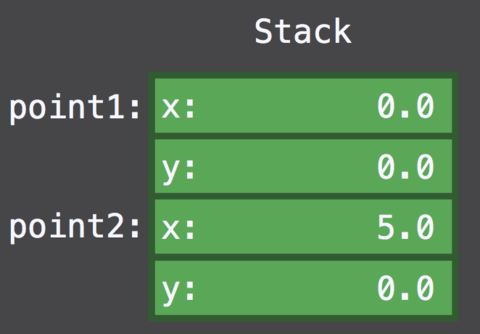

以上结构体的内存是在栈区分配的，内部的变量也是内联在栈区。将`point1`赋值给`point2`实际操作是在栈区进行了一份拷贝，产生了新的内存消耗`point2`，这使得`point1`和`point2`是完全独立的两个实例，它们之间的操作互不影响。在使用`point1`和`point2`之后，会进行销毁。

**Heap**

高级的数据结构，比如类，分配在堆区。初始化时查找没有使用的内存块，销毁时再从内存块中清除。因为堆区可能存在多线程的操作问题，为了保证线程安全，需要进行加锁操
作，因此也是一种性能消耗。


```swift
// Allocation
// Class
class Point {
  var x, y:Double
  func draw() { … }
}

let point1 = Point(x:0, y:0) //在堆区分配内存，栈区只是存储地址指针
let point2 = point1 //不产生新的实例，而是对point2增加对堆区内存引用的指针
point2.x = 5 //因为point1和point2是一个实例，所以point1的值也会被修改
// use `point1`
// use `point2`
```

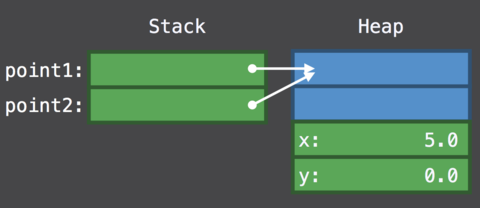

以上我们初始化了一个`Class`类型，在栈区分配一块内存，但是和结构体直接在栈内存储数值不同，我们只在栈区存储了对象的指针，指针指向的对象的内存是分配在堆区的。需要注意的是，为了管理对象内存，在堆区初始化时，除了分配属性内存（这里是Double类型的x，y），还会有额外的两个字段，分别是`type`和`refCount`，这个包含了`type`，`refCount`和实际属性的结构被称为`blue box`。

**内存分配总结**

从初始化角度，`Class`相比`Struct`需要在堆区分配内存，进行内存管理，使用了指针，有更强大的特性，但是性能较低。

**优化方式：**

对于频繁操作（比如通信软件的内容气泡展示），尽量使用`Struct`替代`Class`，因为栈内存分配更快，更安全，操作更快。

#### Reference counting

Swift通过引用计数管理堆对象内存，当引用计数为0时，Swift确认没有对象再引用该内存，所以将内存释放。对于引用计数的管理是一个非常高频的间接操作，并且需要考虑线程安全，使得引用计数的操作需要较高的性能消耗。

对于基本数据类型的`Struct`来说，没有堆内存分配和引用计数的管理，性能更高更安全，但是对于复杂的结构体，如：


```swift
// Reference Counting
// Struct containing references
struct Label {
  var text:String
  var font:UIFont
  func draw() { … }
}

let label1 = Label(text:"Hi", font:font)  //栈区包含了存储在堆区的指针
let label2 = label1 //label2产生新的指针，和label1一样指向同样的string和font地址
// use `label1`
// use `label2`
```

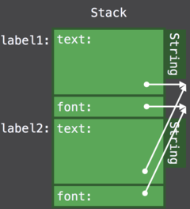

这里看到，包含了引用的结构体相比`Class`，需要管理双倍的引用计数。每次将结构体作为参数传递给方法或者进行直接拷贝时，都会出现多份引用计数。下图可以比较
直观的理解：

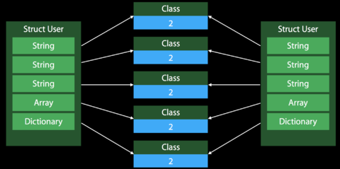

备注：包含引用类型的结构体出现Copy的处理方式

Class在拷贝时的处理方式：

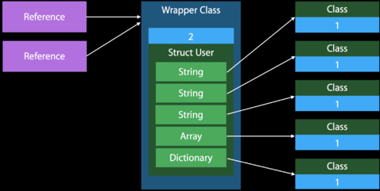

**引用计数总结**

  * `Class`在堆区分配内存，需要使用引用计数器进行内存管理。
  * 基本类型的`Struct`在栈区分配内存，无引用计数管理。
  * 包含强类型的`Struct`通过指针管理在堆区的属性，对结构体的拷贝会创建新的栈内存，创建多份引用的指针，`Class`只会有一份。

**优化方式**

在使用结构体时：

  1. 通过使用精确类型，例如UUID替代String（UUID字节长度固定128字节，而不是String任意长度），这样就可以进行内存内联，在栈内存储UUID，我们知道，栈内存管理更快更安全，并且不需要引用计数。
  2. Enum替代String，在栈内管理内存，无引用计数，并且从语法上对于开发者更友好。

#### Method Dispatch

我们之前在[Static dispatch VS Dynamic dispatch](https://www.jianshu.com/p/e0659093eaac)中提到过，能够在编译期确定执行方法的方式叫做静态分派Static dispatch，无法在编译期确定，只能在运行时去确定执行方法的分派方式叫做动态分派Dynamic dispatch。

`Static dispatch`更快，而且静态分派可以进行**内联**等进一步的优化，使得执行更快速，性能更高。

但是对于多态的情况，我们不能在编译期确定最终的类型，这里就用到了`Dynamic dispatch`动态分派。动态分派的实现是，每种类型都会创建一张表，表内是一个包含了方法指针的数组。动态分派更灵活，但是因为有查表和跳转的操作，并且因为很多特点对于编译器来说并不明确，所以相当于block了编译器的一些后期优化。所以速度慢于`Static dispatch`。

下面看一段多态代码，以及分析实现方式：


```swift
//引用语义实现的多态
class Drawable { func draw() {} }

class Point :Drawable {
  var x, y:Double
  override func draw() { … }
}

class Line :Drawable {
  var x1, y1, x2, y2:Double
  override func draw() { … }
}

var drawables:[Drawable]
for d in drawables {
  d.draw（）
}
```

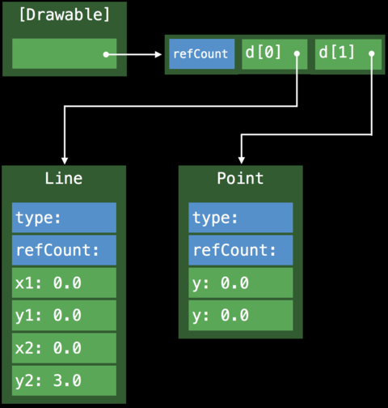

**Method Dispatch总结**

`Class`默认使用`Dynamic dispatch`，因为在编译期几乎每个环节的信息都无法确定，所以阻碍了编译器的优化，比如`inline`和`whole module inline`。

**使用Static dispatch代替Dynamic dispatch提升性能**

我们知道`Static dispatch`快于`Dynamic dispatch`，如何在开发中去尽可能使用`Static dispatch`。

  * `inheritance constraints`继承约束 我们可以使用`final`关键字去修饰`Class`，以此生成的`Final class`，使用`Static dispatch`。
  * `access control`访问控制 `private`关键字修饰，使得方法或属性只对当前类可见。编译器会对方法进行`Static dispatch`。

编译器可以通过`whole module optimization`检查继承关系，对某些没有标记`final`的类通过计算，如果能在编译期确定执行的方法，则使用`Static dispatch`。`Struct`默认使用`Static dispatch`。

Swift快于OC的一个关键是可以消解动态分派。

**总结**

Swift提供了更灵活的`Struct`，用以在内存、引用计数、方法分派等角度去进行性能的优化，在正确的时机选择正确的数据结构，可以使我们的代码性能更快更安全。

**延伸**

你可能会问`Struct`如何实现多态呢?答案是`protocol oriented programming`。

以上分析了影响性能的几个标准，那么不同的算法机制`Class`，`Protocol Types`和`Generic code`，它们在这三方面的表现如何，`Protocol Type`和`Generic code`分别是怎么实现的呢？我们带着这个问题看下去。

### Protocol Type

这里我们会讨论Protocol Type如何存储和拷贝变量，以及方法分派是如何实现的。不通过继承或者引用语义的多态：


```swift
protocol Drawable { func draw() }

struct Point :Drawable {
  var x, y:Double
  func draw() { … }
}

struct Line :Drawable {
  var x1, y1, x2, y2:Double
  func draw() { … }
}

var drawables:[Drawable] //遵守了Drawable协议的类型集合，可能是point或者line
for d in drawables {
  d.draw（）
}
```

以上通过`Protocol Type`实现多态，几个类之间没有继承关系，故不能按照惯例借助`V-Table`实现动态分派。

如果想了解[Vtable和Witness table实现](https://www.jianshu.com/p/c93d7a7d6771)，可以进行点击查看，这里不做细节说明。

因为Point和Line的尺寸不同，数组存储数据实现一致性存储，使用了`Existential Container`。查找正确的执行方法则使用了`Protoloc Witness Table` 。

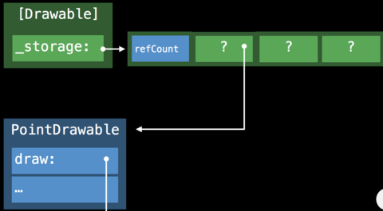

#### Existential Container

`Existential Container`是一种特殊的内存布局方式，用于管理遵守了相同协议的数据类型`Protocol Type`，这些数据类型因为不共享同一继承关系（这是`V-Table`实现的前提），并且内存空间尺寸不同，使用`Existential Container`进行管理，使其具有存储的一致性。

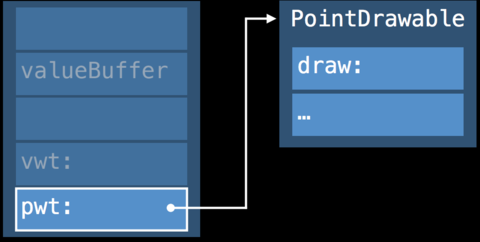

**结构如下：**

  * 三个词大小的valueBuffer 这里介绍一下valueBuffer结构，valueBuffer有三个词，每个词包含8个字节，存储的可能是值，也可能是对象的指针。对于small value（空间小于valueBuffer），直接存储在valueBuffer的地址内， inline valueBuffer，无额外堆内存初始化。当值的数量大于3个属性即large value，或者总尺寸超过valueBuffer的占位，就会在堆区开辟内存，将其存储在堆区，valueBuffer存储内存指针。
  * value witness table的引用 因为`Protocol Type`的类型不同，内存空间，初始化方法等都不相同，为了对`Protocol Type`生命周期进行专项管理，用到了`Value Witness Table`。
  * protocol witness table的引用 管理`Protocol Type`的方法分派。

**内存分布如下：**
    
```swift
1. payload_data_0 = 0x0000000000000004,
2. payload_data_1 = 0x0000000000000000,
3. payload_data_2 = 0x0000000000000000,
4. instance_type = 0x000000010d6dc408 ExistentialContainers`type    
        metadata for ExistentialContainers.Car,
5. protocol_witness_0 = 0x000000010d6dc1c0 
        ExistentialContainers protocol witness table for 
        ExistentialContainers.Car:ExistentialContainers.Drivable 
        in ExistentialContainers
```

#### Protocol Witness Table（PWT）

为了实现`Class`多态也就是引用语义多态，需要`V-Table`来实现，但是`V-Table`的前提是具有同一个父类即共享相同的继承关系，但是对于`Protocol Type`来说，并不具备此特征，故为了支持`Struct`的多态，需要用到`protocol oriented programming`机制，也就是借助`Protocol Witness Table`来实现（细节可以点击[Vtable和witness table实现](https://www.jianshu.com/p/c93d7a7d6771)，每个结构体会创造`PWT`表，内部包含指针，指向方法具体实现）。


#### Value Witness Table（VWT）

用于管理任意值的初始化、拷贝、销毁。

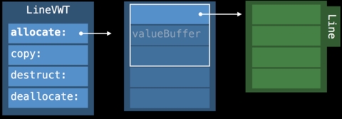

  * `Value Witness Table`的结构如上，是用于管理遵守了协议的`Protocol Type`实例的初始化，拷贝，内存消减和销毁的。
  * `Value Witness Table`在`SIL`中还可以拆分为`%relative_vwtable`和`%absolute_vwtable`，我们这里先不做展开。
  * `Value Witness Table`和`Protocol Witness Table`通过分工，去管理`Protocol Type`实例的内存管理（初始化，拷贝，销毁）和方法调用。

我们来借助具体的示例进行进一步了解：


```swift
// Protocol Types
// The Existential Container in action
func drawACopy(local ：Drawable) {
  local.draw()
}

let val :Drawable = Point()
drawACopy(val)
```

在Swift编译器中，通过`Existential Container`实现的伪代码如下：


```swift
// Protocol Types
// The Existential Container in action
func drawACopy(local :Drawable) {
  local.draw()
}

let val :Drawable = Point()
drawACopy(val)

//existential container的伪代码结构
struct ExistContDrawable {
  var valueBuffer:(Int, Int, Int)
  var vwt:ValueWitnessTable
  var pwt:DrawableProtocolWitnessTable
}

// drawACopy方法生成的伪代码
func drawACopy(val:ExistContDrawable) { //将existential container传入
  var local = ExistContDrawable()  //初始化container
  let vwt = val.vwt //获取value witness table，用于管理生命周期
  let pwt = val.pwt //获取protocol witness table，用于进行方法分派
  local.type = type 
  local.pwt = pwt
  vwt.allocateBufferAndCopyValue(&local, val)  //vwt进行生命周期管理，初始化或者拷贝
  pwt.draw(vwt.projectBuffer(&local)) //pwt查找方法，这里说一下projectBuffer，因为不同类型在内存中是不同的（small value内联在栈内，large value初始化在堆内，栈持有指针），所以方法的确定也是和类型相关的，我们知道，查找方法时是通过当前对象的地址，通过一定的位移去查找方法地址。
  vwt.destructAndDeallocateBuffer(temp) //vwt进行生命周期管理，销毁内存
}
```

#### Protocol Type 存储属性

我们知道，Swift中`Class`的实例和属性都存储在堆区，`Struct`实例在栈区，如果包含指针属性则存储在堆区，`Protocol Type`如何存储属性？Small Number通过`Existential Container`内联实现，大数存在堆区。如何处理Copy呢？

##### Protocol大数的Copy优化

在出现Copy情况时：


```swift
let aLine = Line(1.0, 1.0, 1.0, 3.0)
let pair = Pair(aLine, aLine)
let copy = pair
```

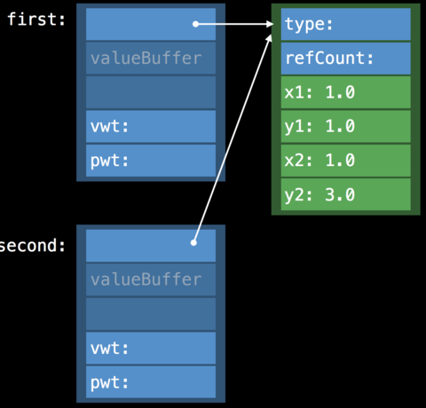

会将新的`Exsitential Container`的valueBuffer指向同一个value即创建指针引用，但是如果要改变值怎么办?我们知道`Struct`值的修改和`Class`不同，Copy是不应该影响原实例的值的。

这里用到了一个技术叫做`Indirect Storage With Copy-On-Write`，即优先使用内存指针。通过提高内存指针的使用，来降低堆区内存的初始化。降低内存消耗。在需要修改值的时候，会先检测引用计数检测，如果有大于1的引用计数，则开辟新内存，创建新的实例。在对内容进行变更的时候，会开启一块新的内存，伪代码如下：


```swift
class LineStorage { var x1, y1, x2, y2:Double }

struct Line :Drawable {
  var storage :LineStorage
  init() { storage = LineStorage(Point(), Point()) }
  func draw() { … }
  mutating func move() {
    if !isUniquelyReferencedNonObjc(&storage) { //如何存在多份引用，则开启新内存，否则直接修改
      storage = LineStorage(storage)
    }
    storage。start = ...
  }
}
```

这样实现的目的：通过多份指针去引用同一份地址的成本远远低于开辟多份堆内存。以下对比图：

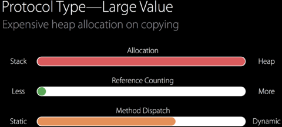

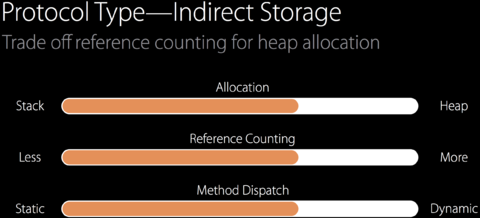

##### Protocol Type多态总结

  1. 支持`Protocol Type`的动态多态（`Dynamic Polymorphism`）行为。
  2. 通过使用`Witness Table`和`Existential Container`来实现。
  3. 对于大数的拷贝可以通过`Indirect Storage`间接存储来进行优化。

说到动态多态`Dynamic Polymorphism`，我们就要问了，什么是静态多态`Static Polymorphism`，看看下面示例：


```swift
// Drawing a copy
protocol Drawable {
  func draw()
}
func drawACopy(local :Drawable) {
  local.draw()
}
let line = Line()
drawACopy(line)
// ...
let point = Point()
drawACopy(point)
```

这种情况我们就可以用到**泛型**`Generic code`来实现，进行进一步优化。

### 泛型

我们接下来会讨论泛型属性的存储方式和泛型方法是如何分派的。泛型和`Protocol Type`的区别在于：

  * 泛型支持的是静态多态。
  * 每个调用上下文只有一种类型。 查看下面的示例，`foo`和`bar`方法是同一种类型。
  * 在调用链中会通过类型降级进行类型取代。

对于以下示例：


```swift
func foo<T:Drawable>(local :T) {
  bar(local)
}
func bar<T:Drawable>(local:T) { … }
let point = Point()
foo(point)
```

分析方法`foo`和`bar`的调用过程：


```swift
//调用过程
foo(point)-->foo<T = Point>(point)   //在方法执行时，Swift将泛型T绑定为调用方使用的具体类型，这里为Point
bar(local) -->bar<T = Point>(local) //在调用内部bar方法时，会使用foo已经绑定的变量类型Point，可以看到，泛型T在这里已经被降级，通过类型Point进行取代
```

泛型方法调用的具体实现为：

  * 同一种类型的任何实例，都共享同样的实现，即使用同一个Protocol Witness Table。
  * 使用Protocol/Value Witness Table。
  * 每个调用上下文只有一种类型：这里没有使用`Existential Container`， 而是将`Protocol/Value Witness Table`作为调用方的额外参数进行传递。
  * 变量初始化和方法调用，都使用传入的`VWT`和`PWT`来执行。

看到这里，我们并不觉得泛型比`Protocol Type`有什么更快的特性，泛型如何更快呢?静态多态前提下可以进行进一步的优化，称为**特定泛型**优化。

#### 泛型特化

  * 静态多态：在调用栈中只有一种类型。 Swift使用只有一种类型的特点，来进行类型降级取代。
  * 类型降级后，产生特定类型的方法。
  * 为泛型的每个类型创造对应的方法。这时候你可能会问，那每一种类型都产生一个新的方法，代码空间岂不爆炸?
  * 静态多态下进行**特定优化** `specialization` 。 因为是静态多态。所以可以进行很强大的优化，比如进行内联实现，并且通过获取上下文来进行更进一步的优化。从而降低方法数量。优化后可以更精确和具体。

例如：


```swift
func min<T:Comparable>(x:T, y:T) -> T {
  return y < x ? y : x
}
```

从普通的泛型展开如下，因为要支持所有类型的`min`方法，所以需要对泛型类型进行计算，包括初始化地址、内存分配、生命周期管理等。除了对value的操作，还要对方法进行操作。这是一个非常复杂庞大的工程。


```swift
func min<T:Comparable>(x:T, y:T, FTable:FunctionTable) -> T {
  let xCopy = FTable.copy(x)
  let yCopy = FTable.copy(y)
  let m = FTable.lessThan(yCopy， xCopy) ? y :x
  FTable.release(x)
  FTable.release(y)
  return m
}
```

在确定入参类型时，比如Int，编译器可以通过泛型特化，进行类型取代（Type Substitute），优化为：


```swift
func min<Int>(x:Int, y:Int) -> Int {
  return y < x ? y :x
}
```

**泛型特化**`specilization`是何时发生的?

在使用特定优化时，调用方需要进行类型推断，这里需要知晓类型的上下文，例如类型的定义和内部方法实现。如果调用方和类型是单独编译的，就无法在调用方推断类型的内部实行，就无法使用特定优化，保证这些代码一起进行编译，这里就用到了`whole module optimization`。而`whole module optimization`是对于调用方和被调用方的方法在不同文件时，对其进行泛型特化优化的前提。

#### 泛型进一步优化

特定泛型的进一步优化：


```swift
// Pairs in our program using generic types
struct Pair<T :Drawable> {
  init(_ f:T， _ s:T) {
  first = f ; second = s
  }
  var first:T
  var second:T
}
let pairOfLines = Pair(Line(), Line())
// ...
let pairOfPoint = Pair(Point(), Point())
```

在用到多种泛型，且确定**泛型类型不会在运行时修改**时，就可以对成对泛型的使用进行进一步优化。

优化的方式是将泛型的内存分配由指针指定，变为内存内联，不再有额外的堆初始化消耗。请注意，因为进行了存储内联，已经确定了泛型特定类型的内存分布，泛型的内存内联不能存储不同类型。所以再次强调**此种优化只适用于在运行时不会修改泛型类型**，即不能同时支持一个方法中包含`line`和`point`两种类型。

#### whole module optimization

`whole module optimization`是用于Swift编译器的优化机制。可以通过`-whole-module-optimization`（或 `-wmo`）进行打开。在XCode 8之后默认打开。 `Swift Package Manager`在release模式默认使用`whole module optimization`。module是多个文件集合。

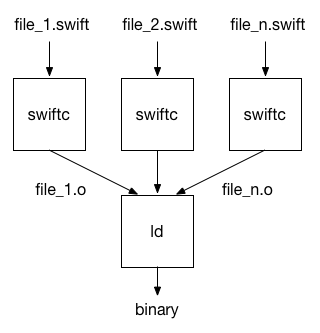

编译器在对源文件进行语法分析之后，会对其进行优化，生成机器码并输出目标文件，之后链接器联合所有的目标文件生成共享库或可执行文件。

`whole module optimization`通过跨函数优化，可以进行内联等优化操作，对于泛型，可以通过获取类型的具体实现来进行推断优化，进行类型降级方法内联，删除多余方法等操作。

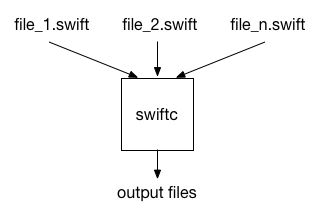

**全模块优化的优势**

  * 编译器掌握所有方法的实现，可以进行**内联**和**泛型特化**等优化，通过计算所有方法的引用，移除多余的引用计数操作。
  * 通过知晓所有的非公共方法，如果这写方法没有被使用，就可以对其进行消除。

**如何降低编译时间**

和全模块优化相反的是文件优化，即对单个文件进行编译。这样的好处在于可以并行执行，并且对于没有修改的文件不会再次编译。缺点在于编译器无法获知全貌，无法进行深度优化。下面我们分析下全模块优化如何避免没修改的文件再次编译。

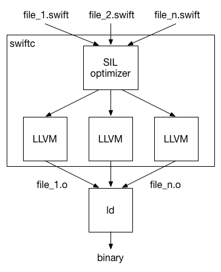

编译器内部运行过程分为：语法分析，类型检查，`SIL`优化，`LLVM`后端处理。

语法分析和类型检查一般很快，`SIL`优化执行了重要的Swift特定优化，例如泛型特化和方法内联等，该过程大概占用整个编译时间的三分之一。`LLVM`后端执行占用了大部分的编译时间，用于运行降级优化和生成代码。

进行全模块优化后，`SIL`优化会将模块再次拆分为多个部分，`LLVM`后端通过多线程对这些拆分模块进行处理，对于没有修改的部分，不会进行再处理。这样就避免了修改一小部分，整个大模块进行`LLVM`后端的再次执行，除此外，使用多线程并行操作也会缩短处理时间。

### 扩展：Swift的隐藏“Bug”

Swift因为方法分派机制问题，所以在设计和优化后，会产生和我们常规理解不太一致的结果，这当然不能算Bug。但是还是要单独进行说明，避免在开发过程中，因为对机制的掌握不足，造成预期和执行出入导致的问题。

**Message dispatch**

我们通过上面说明结合[Static dispatch VS Dynamic dispatch](https://www.jianshu.com/p/e0659093eaac)对方法分派方式有了了解。这里需要对`Objective-C`的方法分派方式进行说明。

熟悉OC的人都知道，OC采用了运行时机制使用`obj_msgSend`发送消息，runtime非常的灵活，我们不仅可以对方法调用采用`swizzling`，对于对象也可以通过`isa-swizzling`来扩展功能，应用场景有我们常用的hook和大家熟知的`KVO`。

大家在使用Swift进行开发时都会问，Swift是否可以使用OC的运行时和消息转发机制呢？答案是可以。

Swift可以通过关键字`dynamic`对方法进行标记，这样就会告诉编译器，此方法使用的是OC的运行时机制。

> 注意：我们常见的关键字`@ObjC`并不会改变Swift原有的方法分派机制，关键字`@ObjC`的作用只是告诉编译器，该段代码对于OC可见。

总结来说，Swift通过`dynamic`关键字的扩展后，一共包含三种方法分派方式：`Static dispatch`，`Table dispatch`和`Message dispatch`。下表为不同的数据结构在不同情况下采取的分派方式：

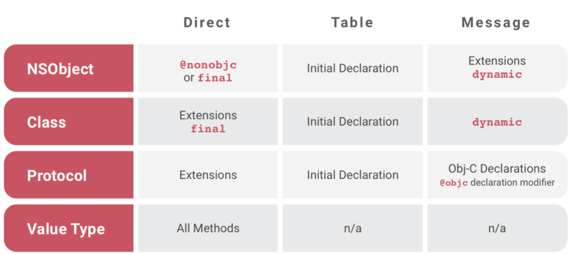

如果在开发过程中，错误的混合了这几种分派方式，就可能出现Bug，以下我们对这些Bug进行分析：

**[SR-584](https://bugs.Swift.org/browse/SR-584)** 此情况是在子类的extension中重载父类方法时，出现和预期不同的行为。
    
```swift
class Base:NSObject {
    var directProperty:String { return "This is Base" }
    var indirectProperty:String { return directProperty }
}

class Sub:Base { }

extension Sub {
    override var directProperty:String { return "This is Sub" }
}
```

执行以下代码，直接调用没有问题：


```swift
Base().directProperty // “This is Base”
Sub().directProperty // “This is Sub”
```

间接调用结果和预期不同：


```swift
Base（）。indirectProperty // “This is Base”
Sub（）。indirectProperty // expected "this is Sub"，but is “This is Base” <- Unexpected!
```

在`Base.directProperty`前添加`dynamic`关键字就可以获得”this is Sub”的结果。Swift在[extension文档](https://docs.Swift.org/Swift-book/LanguageGuide/Extensions.html#//apple_ref/doc/uid/TP40014097-CH24-ID151)中说明，不能在extension中重载已经存在的方法。

> “Extensions can add new functionality to a type, but they cannot override existing functionality.”

会出现警告：`Cannot override a non-dynamic class declaration from an extension`。

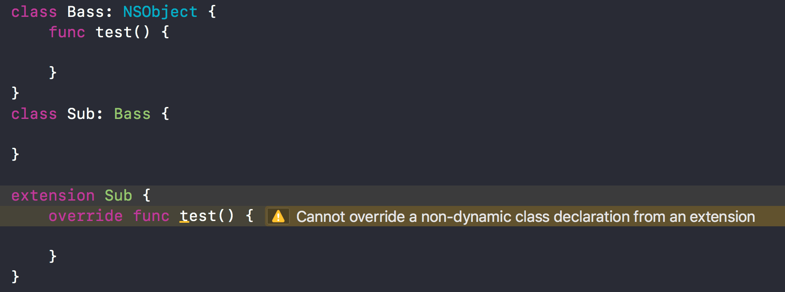

出现这个问题的原因是，NSObject的extension是使用的`Message dispatch`，而`Initial Declaration`使用的是`Table dispath`（查看上图 Swift Dispatch Method）。extension重载的方法添加在了`Message dispatch`内，没有修改虚函数表，虚函数表内还是父类的方法，故会执行父类方法。想在extension重载方法，需要标明`dynamic`来使用`Message dispatch`。

**[SR-103](https://bugs.Swift.org/browse/SR-103)**

协议的扩展内实现的方法，无法被遵守类的子类重载：


```swift
protocol Greetable {
    func sayHi()
}

extension Greetable {
    func sayHi() {
        print("Hello"）
    }
}

func greetings(greeter：Greetable) {
    greeter.sayHi()
}
```

现在定义一个遵守了协议的类`Person`。遵守协议类的子类`LoudPerson`：


```swift
class Person:Greetable {
}

class LoudPerson:Person {
    func sayHi() {
        print("sub")
    }
}
```

执行下面代码结果为：


```swift
var sub:LoudPerson = LoudPerson()
sub.sayHi()  //sub
```

不符合预期的代码：


```swift
var sub:Person = LoudPerson()
sub.sayHi()  //HellO  <-使用了protocol的默认实现
```

注意，在子类`LoudPerson`中没有出现`override`关键字。可以理解为`LoudPerson`并没有成功注册`Greetable`在`Witness table`的方法。所以对于声明为`Person`实际为`LoudPerson`的实例，会在编译器通过`Person`去查找，`Person`没有实现协议方法，则不产生`Witness table`，`sayHi`方法是直接调用的。解决办法是在base类内实现协议方法，无需实现也要提供默认方法。或者将基类标记为`final`来避免继承。

进一步通过示例去理解：


```swift
// Defined protocol。
protocol A {
    func a() -> Int
}

extension A {
    func a() -> Int {
        return 0
    }
}

// A class doesn't have implement of the function。
class B：A {}

class C：B {
    func a() -> Int {
        return 1
    }
}

// A class has implement of the function。
class D：A {
    func a() -> Int {
        return 1
    }
}

class E：D {
    override func a() -> Int {
        return 2
    }
}

// Failure cases。
B().a() // 0
C().a() // 1
(C() as A).a() // 0 ## We thought return 1。 

// Success cases。
D().a() // 1
(D() as A).a() // 1
E().a() // 2
(E() as A).a() // 2
```

**其他**

我们知道Class extension使用的是Static Dispatch：


```swift
class MyClass {
}

extension MyClass {
    func extensionMethod() {}
}

class SubClass：MyClass {
    override func extensionMethod() {}
}
```

以上代码会出现错误，提示`Declarations in extensions can not be overridden yet`。

### 总结

  * 影响程序的性能标准有三种：**初始化方式**， **引用指针**和**方法分派**。
  * 文中对比了两种数据结构：`Struct`和`Class`的在不同标准下的性能表现。Swift相比OC和其它语言强化了结构体的能力，所以在了解以上性能表现的前提下，通过利用结构体可以有效提升性能。
  * 在此基础上，我们还介绍了功能强大的结构体的类：`Protocol Type`和`Generic`。并且介绍了它们如何支持多态以及通过使用有条件限制的泛型如何让程序更快。

### 参考资料

  * [swift memorylayout](https://developer.apple.com/documentation/swift/memorylayout)
  * [witness table video](https://developer.apple.com/videos/play/wwdc2016/416/)
  * [protocol types pdf](https://devstreaming-cdn.apple.com/videos/wwdc/2016/416k7f0xkmz28rvlvwb/416/416_understanding_swift_performance.pdf?dl=1)
  * [protocol and value oriented programming in UIKit apps video](https://developer.apple.com/videos/play/wwdc2016/419)
  * [optimizing swift performance](https://developer.apple.com/videos/play/wwdc2015/409/)
  * [whole module optimizaiton](https://swift.org/blog/whole-module-optimizations/)
  * [increasing performance by reducing dynamic dispatch](https://developer.apple.com/swift/blog/?id=27)
  * [protocols generics existential container](https://medium.com/@vhart/protocols-generics-and-existential-containers-wait-what-e2e698262ab1)
  * [protocols and generics](https://airspeedvelocity.net/2015/03/26/protocols-and-generics-2/)
  * [why swift is swift](https://www.skilled.io/u/purpleyay/why-swift-is-swift)
  * [swift method dispatch](http://raizlabs.wpengine.com/dev/2016/12/swift-method-dispatch/)
  * [swift extension](https://docs.swift.org/swift-book/LanguageGuide/Extensions.html#//apple_ref/doc/uid/TP40014097-CH24-ID151)
  * [universal dynamic dispatch for method calls](https://lists.swift.org/pipermail/swift-evolution/Week-of-Mon-20151207/000928.html)
  * [compiler performance.md](https://github.com/apple/swift/blob/master/docs/CompilerPerformance.md)
  * [structures and classes](https://docs.swift.org/swift-book/LanguageGuide/ClassesAndStructures.html)

<hr>

#### <p>原文出处：<a href='https://www.jianshu.com/p/e0659093eaac' target='blank'>方法调用的编译和运行:static dispatch和dynamic dispatch</a></p>

### 背景

**静态分派**(`static dispatch`)和**动态分派**(`dynamic dispatch`)是用来处理编程语言语言方法调用的两种计算机制.  

一个方法是如何被调用的,这两种机制在编译期和运行时分别做了什么,他们各自的优缺点是什么,分别适用于什么样的场景,让我们带着问题看下去吧.

### dispatch介绍

我们都知道一个方法会在运行时被调用,一个方法被唤起,是因为编译器有一个计算机制,用来选择正确的方法,然后通过传递参数来唤起它.  
这个机制通常被成为分派(`dispatch`). **分派**就是处理方法调用的过程.  

**分派**在处理方法调用的时候,可能会存在多个合理的可被调用的方法列表,此时就需要去选择最正确的方法.选择正确方法的整个过程,就是人们熟知是**分派**(`dispatch`).  

每种编程语言都需要分派机制来选择正确的唤起方法.

方法从书写完成到调用完成,概括上会经历编译期和运行期两个阶段,而前面说的确定哪个方法被执行,也是在这两个时期进行的.  

选择正确方法的阶段,可以分为编译期和运行期,而分派机制通过这两个不同的时期分为两种: **静态分派**(`static dispatch`)和**动态分派**(`dynamic dispatch`).

### static dispatch

`static dispatch`是在**编译期**就完全确定调用方法的分派方式.它是一种方法分派形式.用于描述一个语言或者环境是如何选择被调用的方法的实现的.  
例如结合了[函数重载](https://zh.wikipedia.org/wiki/%E5%87%BD%E6%95%B0%E9%87%8D%E8%BD%BD)的`C++`的[模板](https://zh.wikipedia.org/wiki/%E6%A8%A1%E6%9D%BF_\(C%2B%2B\))和其他语言的[泛型](https://zh.wikipedia.org/wiki/%E6%B3%9B%E5%9E%8B),都是这样实现的.

用于在多态情况下,在**编译期**就实现对于**确定的类型**,在函数调用表中推断和追溯正确的方法,包括列举泛型的特定版本,在提供的全部函数定义中选择的特定
实现.

与`static dispatch`相反的`dymanic dispatch`,是基于**运行期**的给定信息来确定调用方法的,可能通过[虚函数表](https://en.wikipedia.org/wiki/Vtable)实现,也可能借助其他的运行期的信息.`dynamic dispatch`的细节我们会在下面进行详细说明.  

`static dispatch`可以确保某个方法只有一种实现.`static dispatch`明显的快于`dynamic dispatch`,因为`dynamic dispatch`本身就意味着较高的性能开销.

#### 何时使用static dispatch

`static dispatch`在编译期确定需要调用的方法,在运行期进行调用.所有的编程语言都是支持`static dispatch`的,不同语言默认的分派方式不同,有的默认为`static dispatch`,有的默认是`dynamic dispatch`.  

有的语言可以通过声明关键字,来标明使用`static dispatch`,比如`final`或`private`或`static`等.这样用于避免基类的方法属性等不被子类修改.

#### static dispatch如何实现

在编译器确定使用static dispatch后,会在生成的可执行文件内,直接指定包含了方法实现内存地址的指针.在运行时,直接通过指针调用特定的方法.这是`static
dispatch`的标准做法.  

`static dispatch`还可以进行进一步优化,优化的一种实现方式叫做**内联**(`inline`:[inline expansion](https://en.wikipedia.org/wiki/Inline_expansion)).`inline`是指编译期从指定被调用的方法指针,改为将方法的实现平铺在调用方的可执行文件内.下面就讲一下`inline`具体是如何实现的,它有什么优缺点.

#### inline

`inline`也叫内联展开,它可以人为声明,也可以通过编译器优化来实现.`inline`是将被调用方法的指针替换为方法实现体.`inline`的具体实现其实就是内联展开,它和**宏展开**([macro expansion](https://en.wikipedia.org/wiki/Macro_expansion)很像.  

内联展开和宏展开的区别在于,内联发生在编译期,并且不会改变源文件.但是宏展开是在编译前就完成的,会改变源码本身,之后再对此进行编译.  

内联是一种非常重要的优化方式,但是内联对于性能的影响比较复杂.从[经验法则](https://zh.wikipedia.org/wiki/%E7%B6%93%E9%A9%97%E6%B3%95%E5%89%87)来讲,有些内联可以通过很小的内存消耗来提升运行速度.但是无节制的内联,也可能会降低速度,因为内联的代码需要大量的[CPU缓存](https://zh.wikipedia.org/wiki/CPU%E7%BC%93%E5%AD%98),并且也会消耗内存空间.

内联方法的运行比传统的方法调用要快一些,因为节省了指针到方法实现体的调用的消耗,但是会带来一些内存损失.如果一个方法被内联10次,那么会出现10份方法的副本.所以内联适用于会被频繁调用的比较小的方法.在`C++`中,如果方法通过`class`去定义,默认使用内联(不需要`inline`关键字).其他情况想要使用内联,需要标明`inline`的关键字.  

但是如果一个方法特别大,被`inline`关键字修饰的话,编译器也可能会选择不适应内联实现.  

所以`inline`关键字是一个**desire**声明而非**require**.只能告诉编译器倾向使用内联方式,但是最终实现是编译器决定的.

**内联的作用**  

内联可以用于消减方法被调用的时间.非常适用于会被频繁调用的方法.如果方法本身很小的话,可以降低内存上的消耗.内联还为进一步的编译优化提供了基础.[program optimization](https://en.wikipedia.org/wiki/Program_optimization)  

编译器一般会将[陈述式](https://zh.wikipedia.org/wiki/%E8%AA%9E%E5%8F%A5_\(%E7%A8%8B%E5%BC%8F%E8%A8%AD%E8%A8%88\))进行内联.  

在[函数式编程语言]内联在性能方面会有提升,而且还可以基于内联,做进一步的编译优化,感兴趣的可以参考[内联](https://en.wikipedia.org/wiki/Inline_expansion)文章的_Effect on performance_,_Compilersupport_和_Implementation_部分,这里就不展开说了.

### dynamic dispatch

在计算机科学中,`dynamic dispatch`是 用于在运行期选择调用方法的实现的流程.  

`dynamic dispatch`被广泛应用,并且被认为是**面向对象语言**(`Object-Oriented programming`:`OOP`)的基本特性.

`OOP`是通过名称来查找对象和方法的.但是多态就是一种特殊情况了,因为可能会出现多个同名方法,但是内部实现各不相同.如果把`OOP`理解为向对象发送消息的话.在多态模式下,就是程序向不知道类型的对象发送了消息,然后在运行期再将消息分派给正确的对象.之后对象再确定执行什么操作.

与`static dispatch`在编译期确定最终执行不同,`dynamic dispatch`的目的是为了支持在编译期无法确定最终最合适的实现的操作.这种情况一般是因为在运行期才能通过一个或多个参数确定对象的类型.例如 B继承自A, 声明`var obj : A = B()`,编译期会认为是A类型,但是真正的类型B,只能在运行期确定.

`dynamic dispatch`和`late binding`(也叫做`dynamic binding`)不同,程序使用[Name binding](https://en.wikipedia.org/wiki/Name_binding)通过名字去关联操作.在多态操作中,会有多个不同的操作关联同一个方法名.这个绑定关系可以在编译期或者运行期确定.在`dynamic dispatch`中,是在运行期去选择方法的实现的.  

虽然`late binding`的绑定实现也是在运行期才能确定,但是`dynamic dispatch`并不意味着`late binding`,`late binding`也不等同于`dynamic dispatch`.之后会详细讲解`late binding`,这里先挖个坑.

#### single and multiple dispatch

通过对象类型去选择调用方法的模式,叫做_single dispatch_,这是面向对象语言普遍支持的一种方式,比如`C++`,`Java`,`Objective-C`,`Swift`,`JavaScript`,`Python`等.  

在下面示例的方法调用中,参数`divisor`是可选类型.

```swift
dividend.divide(divisor)  ## dividend / divisor
```

我们是向对象dividend发送一个包含参数divisor的名为divide消息.在选择方法实现时,只会通过dividend,也就是消息对象的类型来进行选择.忽略参数divisor的类型.这种方式叫做`single dispatch`.  

与此相反,一些语言(比如[Common Lisp](https://en.wikipedia.org/wiki/Common_Lisp),[Dylan](https://en.wikipedia.org/wiki/Dylan_\(programming_language\)), [Julia](https://en.wikipedia.org/wiki/Julia_\(programming_language\)))在方法分派时,会根据组合的信息进行判断.拿上面例子来说,是通过接收对象dividend和参数divisor一起来决定那个divide方法会被调用.这种方式就成为`multiple dispatch`

**multiple dispatch**  

[Multiple dispatch](https://en.wikipedia.org/wiki/Multiple_dispatch)和`single dispatch`不同之处在于,`multiple dispatch`也会根据方法名结合方法的参数,一起来判断需要执行的方法.  

在命名方法的时候,一般会使用符合方法目的的描述.当方法目的相似时,我们也会使用同名但是不同入参的方式进行命名.这种情况时,只使用方法名去查找实现的方式就不够充分了.这时候也需要用到入参,通过入参的个数和类型去进行判断.  

对于`single dispatch`语言来说,在调用方法时,参数会被特殊处理用于去选择方法实现,在很多语言中,这种特殊参数是在语法上就进行指明的.例如,很多语言会把特殊参数放在调用语言之前`special.method(other, arguments, here)`  

但是在`multiple dispatch`中,选择方法时,也会对参数的个数和类型进行匹配.没有特殊参数去持有方法调用.

#### dynamic dispatch的实现机制

一种语言可能有多种`dynamic dispatch`的实现机制.语言的特性不同,动态分派的实现也各有差异.下面我们只针对一种实现**虚函数表**(`vtable`: [virtual function table](https://en.wikipedia.org/wiki/Virtual_function_table))来进行详细说明.  

这里提一句,因为动态分派经常会引起高性能消耗,所以很多语言对某些特定的方法,提供了静态分派的方式.

#### 虚函数表

[虚函数表](https://en.wikipedia.org/wiki/Virtual_method_table)是用于支持动态分派的一种实现机制.  

当一个类定义了虚函数[virtual function](https://en.wikipedia.org/wiki/Virtual_function)之后,大部分编译器会对类增加一个隐藏的属性,属性指向一个包含了虚函数表,表内包含被收纳了调用方法的指针数组.这些方法指针用于在运行期来调用正确的方法实现.  

用来实现动态分派的方式有很多,虚函数是在C类语言,例如`C++`中最普遍的实现方式.

Java所有的实例方法都默认使用虚函数表实现.因为所有方法都可以被子类重载使得类变得特别复杂.当类不可被继承时,理论上是不需要虚函数表的.所以当使用`final`或`private`等静态修饰符去修饰时,编译器就可以放心的去使用`static dispatch`.

`Python`是不支持`static dispatch`的.实际上`Python`所有的方法和属性的实现都使用了`late binding`.

**虚函数表实现**  

对象的虚函数表包含对象绑定的方法地址.方法的调用需要从虚函数表内获取方法地址.同一个类的所有对象,生成的虚函数表都是一样的.属于同一系列的派生类,他们对象的虚函数表都有相同的布局.同一个方法在表内的位移都是相同的.所以,在知道了方法的位移之后,就可以通过虚函数表直接获取正确的方法.

编译器会为每个类创建单独的虚函数表.当对象创建后,会生成一个隐藏对象,对象是一个指向虚函数表的指针.编译器也会生成包含了虚函数表指针的代码.  

在不同的语言中,虚函数表可能在对象的最后或者第一个属性内,这不影响实际的功能实现.

**虚函数表示例**  
以`C++`为例.

```cpp
class B1 {
public:
  virtual ~B1() {}
  void f0() {}
  virtual void f1() {}
  int int_in_b1;
};

class B2 {
public:
  virtual ~B2() {}
  virtual void f2() {}
  int int_in_b2;
};
```

下面是它们的派生类D的声明

```cpp
class D : public B1, public B2 {
public:
  void d() {}
  void f2() {}  // override B2::f2()
  int int_in_d;
};
```

之后创建对象

```cpp
B2 *b2 = new B2();
D  *d  = new D();
```

[GCC](https://en.wikipedia.org/wiki/GNU_Compiler_Collection)的g++3.4.6编译之后,b2生成了如下的32位内存结果

```cpp
b2:
  +0: pointer to virtual method table of B2
  +4: value of int_in_b2
virtual method table of B2:
  +0: B2::f2()   
```

分析一波内存分布.b2的起始位置是B2类虚函数表的指针.占4个字节.之后是一个int类型.

下面看看d的内存分布

```cpp
d:
  +0: pointer to virtual method table of D (for B1)
  +4: value of int_in_b1
  +8: pointer to virtual method table of D (for B2)
  +12: value of int_in_b2
  +16: value of int_in_d
Total size: 20 Bytes.
virtual method table of D (for B1):
  +0: B1::f1()  // B1::f1() is not overridden
virtual method table of D (for B2):
  +0: D::f2()   // B2::f2() is overridden by D::f2()
```

d是通过多继承,B1和B2的派生类.可以看到内存中,前面几个部分和父类的内存结构完全一样.后面添加了自定义的属性.  

需要注意的是,没有通过`virtual`关键字声明的方法`f0()`和`d()`,都没有出现在虚函数表内.可能对于[缺省构造函数](https://zh.wikipedia.org/wiki/%E7%BC%BA%E7%9C%81%E6%9E%84%E9%80%A0%E5%87%BD%E6%95%B0)会有一些特殊操作,这里不展开说.  

通过D重载的B2的`f2()`方法,是在B2的虚函数表内,将过去的`B2::f2()`的指针替换为`D::f2()`的指针.

**多继承和thunks**  

可以看到g++编译器实现通过使用`B1`和`B2`两个虚函数表来实现[多继承](https://en.wikipedia.org/wiki/Multiple_inheritance).每个表用来说明每个基类.这里就需要说到_指针修正_,也叫做[thunks](https://en.wikipedia.org/wiki/Thunk_\(programming\))

```cpp
D  *d  = new D();
B1 *b1 = d;
B2 *b2 = d;
```

代码执行后,`d`和`b1`会指向同一个内存地址,但是`b2`会指向`d+8`.所以`b2`所指向的`d`的内存范围会"看起来"像是`B2`的实例.也就是说,和`B2`拥有相同的内存布局.

**方法调用,在多继承中的实现**  

在单继承中,调用一个`d->f1()`方法.可以分解为如下的伪代码

```cpp
(*((*d)[0]))(d)
```

`*d`是D的虚函数表.[0]代表虚函数表内的一个方法.参数d为对象的this指针.  

在多继承情况下,调用`B1::f1()`和`D::f2()`就会复杂很多.

```cpp
(*(*(d[+0]/*pointer to virtual method table of D (for B1)*/)[0]))(d)   /* Call d->f1() */
(*(*(d[+8]/*pointer to virtual method table of D (for B2)*/)[0]))(d+8) /* Call d->f2() */
```

方法`d->f1(0`的调用会把B1当做参数传入.方法`d->f2(0`的调用会把B2当做参数传入.第二个调用,就会用到指针修正来指向正确的指针.因为`B2::f2`的地址并不在D的虚函数表中.  

比较来看,`d->f0()`的调用就简单很多

```cpp
(*B1::f0)(d)
```

**虚函数表的性能分析**  

相比非虚函数调用的直接跳转到编译指针,虚函数表调用至少需要一次额外的索引重定向,有时还需要进行指针修正.所以虚函数表的调用一定是慢于非虚函数调用的.  

此外,在不能使用[即时编译](https://zh.wikipedia.org/wiki/%E5%8D%B3%E6%99%82%E7%B7%A8%E8%AD%AF)的环境中,虚函数调用一般是不能够`inline`的.虽然有一些不常见的内联方式,这里就不展开了.  

为了避免额外的性能消耗,编译器会通过计算,如果调用可以在编译期确定,那么就不会创建虚函数表.  

所以,对于上面示例中`f1`的调用就可以不需要查表操作.因为编译器可以分辨`d`只会持有`D`类型的指针,而`D`没有重载`f1`.或者编译器(或优化器)也可以发现`B1`的所有子类都没有重载`f1`.所以`B1::f1` 或 `B2::f2`的调用因为可以确定它的最终实现,就可以不用查表.(虽然仍需要对'thsi'指针进行修正).

### late binding

美国计算机科学家[Alan Kay](https://zh.wikipedia.org/wiki/%E8%89%BE%E4%BC%A6%C2%B7%E5%87%AF)曾经说过,OOP对我来说,意味着几个方面:消息,本地存储,保护机制,状态流的隐藏,和极致的[late binding](https://en.wikipedia.org/wiki/Late_binding) of all things.

后期微软又大程度的对他们面向`OOP`的`COM`库进行了升级,`COM`也同样提升了`early binding`和[late binding](https://en.wikipedia.org/wiki/Late_binding),要知道,很多语言在语法层面是同时支持这两种特性的.  

什么是`late binding`呢?  

`late binding`(也叫`dynamic binding`或`dynamic linkage`)是一种用于处理在运行时通过对象调用方法或者通过函数名去调用包含参数的方法的一种编程机制.  

对于`OOP`语音的[early binding](https://en.wikipedia.org/wiki/Early_binding)或[static binding](https://en.wikipedia.org/wiki/Static_binding)来说,在编译阶段就处理了所有的变量和表达式.通常这些数据存储在编译程序的虚函数表内,通过位移的方式获取,非常高效.对于`late binding`而言,编译器不会解读足够的信息去确认方法是否存在也不会将其绑定到虚函数表内.`late binding`是在运行时通过方法名去查找的.

在[组件对象模型](https://zh.wikipedia.org/wiki/%E7%BB%84%E4%BB%B6%E5%AF%B9%E8%B1%A1%E6%A8%A1%E5%9E%8B)编程中,使用`late binding`的最大优势在于,不要求编译器在编译期间去引用包含对象的库.这使得编译过程可以更有效的去避免类的虚函数表突然更改带来的冲突.

**`late binding`的实现**  

大部分的[动态类型](https://en.wikipedia.org/wiki/Type_system#Dynamic_type_checking_and_runtime_type_information)  )语言都可以在运行时去修改对象的方法列表,因此就需要`late binding`.

**说说OC运行时**  

苹果官方对于[OC dynamic binding](https://developer.apple.com/library/archive/documentation/General/Conceptual/DevPedia-CocoaCore/DynamicBinding.html)文档中指出,`dynamic binding`就是在运行期来决定方法调用的实现.`dymanic binding`也叫做`late binding`.在OC中所有的方法都是在运行期动态判断的.真正执行的方法是通过方法名和接收对象一起来确定的.

### 参考资料

* [static and dynamic dispatch](https://teamtreehouse.com/community/static-and-dynamic-dispatch)
* [static dispatch by wiki](https://en.wikipedia.org/wiki/Static_dispatch)
* [Static/Dynamic Dispatch - ReExplained](https://www.codeproject.com/Tips/875393/Static-Dynamic-Dispatch-ReExplained)
* [inline expansion](https://en.wikipedia.org/wiki/Inline_expansion)
* [program optimization](https://en.wikipedia.org/wiki/Program_optimization)
* [Dynamic dispatch](https://en.wikipedia.org/wiki/Dynamic_dispatch)
* [late binding](https://en.wikipedia.org/wiki/Late_binding)
* [Name binding](https://en.wikipedia.org/wiki/Name_binding)
* [Multiple dispatch](https://en.wikipedia.org/wiki/Multiple_dispatch)
* [virtual function table](https://en.wikipedia.org/wiki/Virtual_function_table)
* [thunks](https://en.wikipedia.org/wiki/Thunk_(programming))
* [multiple inheritance](https://en.wikipedia.org/wiki/Multiple_inheritance)
* [multiple dispatch example](https://stackoverflow.com/questions/1749534/multiple-dispatch-in-c)
* [multiple dispatch wiki](https://en.wikipedia.org/wiki/Multiple_dispatch#Theory)
* [multiple dispatch](http://wiki.c2.com/?MultipleDispatch)
* [multiple dispatch in practice](http://homepages.ecs.vuw.ac.nz/~alex/files/MuscheviciPotaninTemperoNobleOOPSLA2008.pdf)

<hr>

#### <p>原文出处：<a href='https://www.jianshu.com/p/c93d7a7d6771' target='blank'>Swift的witness table</a></p>

### V-table和witness table

我们知道,执行方法时,首先要查找到正确的方法,然后执行.能够在编译期确定执行方法的方式叫做静态分派`static dispatch`,无法在编译期确定,只能在运行时去确定执行方法的分派方式叫做动态分派`dynamic dispatch`.  

静态分派更快,而且静态分派可以进行内联等进一步的优化操作,使得执行更快速,性能更高.  

但是对于多态的情况,我们不能在编译期确定最终的类型,这里就用到了`dynamic dispatch`动态分派.动态分派的实现是,每种类型都会创建一张表,表内是一个包含了方法指针的数组.  

对于类`class`来说,每个类型都会创建虚函数表指针,指向一个叫做`V-Table`的表.拥有继承关系的子类会在虚函数表内通过继承顺序(C++可以实现多继承)去展示虚函数表指针.  

但是对于swift来说,`class`类和`struct`结构体的实现是不同的,而属于结构体的协议`Protocol`,可以拥有属性和实现方法,管理`Protocol Type`方法分派的表就叫做`Protocol Witness Table`.

### witness table内部结构

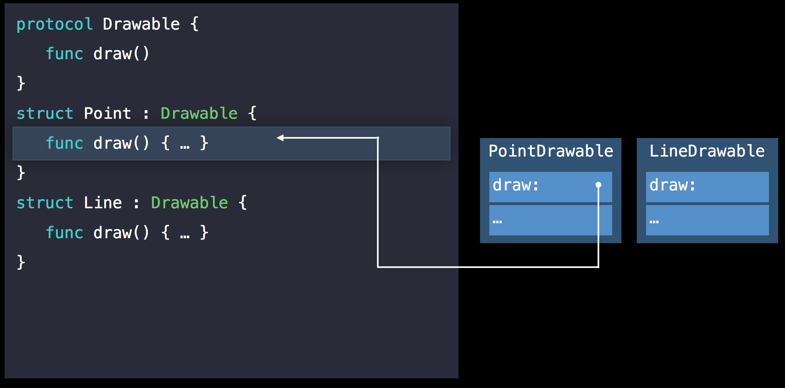

和V-table一样,`Protocol Witness Table`(简称`PWT`)内存储的是方法数组,里面包含了方法实现的指针地址,一般我们调用方法时,是通过获取对象的内存地址和方法的位移`offset`去查找的.  

`Protocol Witness Table`是用于管理`Protocol Type`的方法调用的,在我们接触swift性能优化时,听到另一个概念叫做`Value Witness Table`(简称VWT),这个又是做什么的呢?

### 什么是value witness table

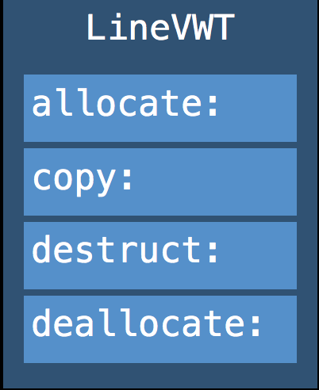

`value witness table`的结构如上,是用于管理遵守了协议的`Protocol Type`实例的初始化,拷贝,内存消减和销毁的.  
`value witness table`还可以拆分为`%relative_vwtable`和`%absolute_vwtable`,我们这里先不做展开,之后会对这部分内容进行补充.  
`value witness table`和`protocol witness table`通过分工,去管理`Protocol Type`实例的内存管理(初始化,拷贝,销毁)和方法调用.

说完witness table的结构,我们讨论一下,在编译器内部实现中,`SIL`(swift intermediate language)内部是如何实现vtable和witness table的.

#### V-Table在SIL的实现

```swift
decl ::= sil-vtable
sil-vtable ::= 'sil_vtable' identifier '{' sil-vtable-entry* '}'

sil-vtable-entry ::= sil-decl-ref ':' sil-linkage? sil-function-name
```

`SIL`使用 [class_method](https://github.com/apple/swift/blob/master/docs/SIL.rst#class-method),[super_method](https://github.com/apple/swift/blob/master/docs/SIL.rst#super-method), [objc_method](https://github.com/apple/swift/blob/master/docs/SIL.rst#objc-method), 和[objc_super_method](https://github.com/apple/swift/blob/master/docs/SIL.rst#objc-super-method) 操作来实现类方法的动态分派.  

类的每一个方法,都被映射到`SIL`的方法实现

```swift
class A {
  func foo()
  func bar()
  func bas()
}

sil @A_foo : $@convention(thin) (@owned A) -> ()
sil @A_bar : $@convention(thin) (@owned A) -> ()
sil @A_bas : $@convention(thin) (@owned A) -> ()

sil_vtable A {
  #A.foo!1: @A_foo
  #A.bar!1: @A_bar
  #A.bas!1: @A_bas
}

class B : A {
  func bar()
}

sil @B_bar : $@convention(thin) (@owned B) -> ()

sil_vtable B {
  #A.foo!1: @A_foo
  #A.bar!1: @B_bar
  #A.bas!1: @A_bas
}

class C : B {
  func bas()
}

sil @C_bas : $@convention(thin) (@owned C) -> ()

sil_vtable C {
  #A.foo!1: @A_foo
  #A.bar!1: @B_bar
  #A.bas!1: @C_bas
}
```

需要注意的是,vtable中的方法声明是指向最后的衍生类的方法的.swift的AST持有了声明的重载关系,并用于在SIL的vtable中查找衍生类的重载方法.  
为了防止SIL的方法是thunk,方法名使用了原始方法实现的连接(linkage)作为前缀.

#### Witness Tables在编译期内SIL阶段的实现

```swift
decl ::= sil-witness-table
sil-witness-table ::= 'sil_witness_table' sil-linkage?
                        normal-protocol-conformance '{' sil-witness-entry* '}'
```

`SIL`将泛型动态分派所需的信息编码为witness表.这些信息用于在生成二进制码时产生运行时分配表(runtime dispatch table).也可以用于对特定通用函数的`SIL`优化.每个明确的一致性声明都会产生witness表.通用类型的所有实例共享一个通用witness表.衍生类会继承基类的witness表.

```swift
protocol-conformance ::= normal-protocol-conformance //一般协议一致性
protocol-conformance ::= 'inherit' '(' protocol-conformance ')'  //继承关系的协议一致性
protocol-conformance ::= 'specialize' '<' substitution* '>'    //通用类型特化的协议一致性和标明类型降级的替换(substitution)
                         '(' protocol-conformance ')'
protocol-conformance ::= 'dependent'
normal-protocol-conformance ::= identifier ':' identifier 'module' identifier
```

witness的关键在于协议一致性.它是对于具体类型协议一致性的唯一标识.

  * 一般的协议一致性通过它们遵守的协议方法进行命名.属于该类型或扩展的组件,需要提供遵守协议方法的声明,实现方法必须严格和协议需求一一对应.
  * 派生类如何遵守从基类继承的协议,会体现为_继承协议一致性_(_inherited protocol conformance_),实现是简单引用基类的协议一致性即可.
  * 如果通用类型的实例遵守一个协议,是通过特化一致性的方式去实现的.将通用参数和普通一致性进行绑定,将参数用于通用类型.  

`witness table`只会直接关联标准一致性.继承和特定一致性是在标准一致性下的间接引用.

```swift
sil-witness-entry ::= 'base_protocol' identifier ':' protocol-conformance
sil-witness-entry ::= 'method' sil-decl-ref ':' sil-function-name
sil-witness-entry ::= 'associated_type' identifier
sil-witness-entry ::= 'associated_type_protocol'
                      '(' identifier ':' identifier ')' ':' protocol-conformance
```

`witness table`由以下内容构成

  * 基协议项提供的对于协议一致性的引用,可以用于witness协议的继承协议
  * 方法项将协议中要求方法映射为`SIL`中实现了witness类型的方法.每个方法项必须对应witness协议中的要求方法
  * _associate type_关联类型项将必须实现的协议方法中的关联类型映射为符合witness的类型.注意witness类似是一个资源级别的swift类型,不是`SIL`类型(上面分析过`SIL`类型和swift类型的区别).关联类型项必须覆盖witness协议中的所有强制关联项.
  * 关联类型协议项将关联类型中的协议映射为关联类型的协议一致性.

### 参考

* [swift memorylayout](https://developer.apple.com/documentation/swift/memorylayout)
* [witness table video](https://developer.apple.com/videos/play/wwdc2016/416/)
* [protocol types pdf](https://devstreaming-cdn.apple.com/videos/wwdc/2016/416k7f0xkmz28rvlvwb/416/416_understanding_swift_performance.pdf?dl=1)
* [makeing the value witness table reference relative](https://forums.swift.org/t/making-the-value-witness-table-reference-relative/1206)