 
<!--BEGIN_DATA
{
    "create_date": "2017-03-21 18:27", 
    "modify_date": "2017-03-21 18:27", 
    "is_top": "0", 
    "summary": "深入浅出JavaScriptCore", 
    "tags": "iOS", 
    "file_name": "深入浅出JavaScriptCore.md"
}
END_DATA-->

####
原文出处：<a href='http://www.jianshu.com/p/3f5dc8042dfc' target='blank'>深入浅出 JavaScriptCore</a>

#####写在前面

本篇文章是对我一次组内分享的整理，大部分图片都是直接从keynote上截图下来的，本来有很多炫酷动效的，看博客的话就全靠脑补了，多图预警 ：）

> ####概览
>
>   * JavaScriptCore 简介
>   * Objective-C 与 JavaScript 交互
>   * JavaScript 与 Objective-C 交互
>   * 内存管理
>   * 多线程

####一. JavaScriptCore 简介

######1.1 JavaScriptCore 和 JavaScriptCore 框架

首先要区分JavaScriptCore 和 JavaScriptCore 框架（同后文中的JSCore）

JavaScriptCore框架 是一个苹果在iOS7引入的框架，该框架让 Objective-C 和 JavaScript代码直接的交互变得更加的简单方便。

而JavaScriptCore是苹果Safari浏览器的JavaScript引擎，或许你听过Google的V8引擎，在WWDC上苹果演示了最新的Safari，据说JavaScript处理速度已经大大超越了Google的Chrome，这就意味着JavaScriptCore在性能上也不输V8了。

JavaScriptCore框架其实就是基于webkit中以C/C++实现的JavaScriptCore的一个包装，在旧版本iOS开发中，很多开发者也会自行将webkit的库引入项目编译使用。现在iOS7把它当成了标准库。

JavaScriptCore框架在OSX平台上很早就存在的，不过接口都是纯C语言的，而在之前的iOS平台（iOS7之前），苹果没有开放该框架，所以不少需要在iOS app中处理JavaScript的都得自己从开源的WebKit中编译出JavaScriptCore.a，接口也是纯C语言的。可能是苹果发现越来越多的程序使用了自编译的JavaScriptCore，干脆做个顺水人情将JavaScriptCore框架开放了，同时还提供了Objective-C的封装接口。

本篇文章将要讨论的就是基于Objective-C封装的JavaScriptCore框架，也就是我们开发iOS app时使用的JavaScriptCore框架。

######1.2 JavaScriptCore API Goals

苹果基于 Objective-C 封装的 JavaScriptCore 接口有3个目标：  

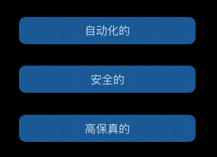  

JavaScriptCore API Goals

  * 自动化的：使用这些API的时候，很多事都是苹果帮我们做了的，比如在OC和JS之间交互的时候，很多时候会自动帮我们转换类型。

  * 安全的：我们都知道JS是一门动态类型的语言，也就是说那你从JS传递到OC中的值可能是任何值，而OC是静态类型的语言，它可不能动态的接收各种类型的值，但是你可以随便传，程序并不会奔溃，苹果希望这些API是不容易出错的，就算出错了，也是不会导致程序奔溃的，事实上也是如此。还有一点就是这些API本身是线程安全的，我们后面会说到。

  * 高保真的：前面两点比较好理解，但是这个高保真是作何解释呢，很简单，就是苹果希望我们在使用这些API与JS交互的时候，写OC的时候就像在写OC，写JS的时候就像在写JS，不需要一些奇怪的语法，这点我们后面会用实例说明。

####二. Objective-C 与 JavaScript 交互

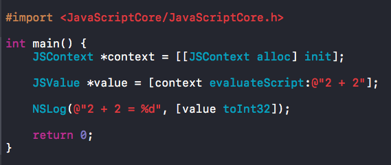  

先看个小demo，很简单的几行代码，首先，我们引入了JavaScriptCore框架，然后创建了一个叫JSContext的类的对象，再然后用这个JSContext执行了一个段JS代码`2 + 2`，这里的JS代码是以字符串的形式传入的，执行后得到一个JSValue类型的值，最后，将这个JSVlaue类型的值转换成整型并输出。

输出结果如下，这样我们就用OC调用了一段JS代码，很简单对吧：）  

  

这个 demo 里面出现了2个之前没见过的类，一个叫JSContext，一个叫JSValue，下面我们一个一个说下。

######2.1 JSContext

  * JSContext 是JS代码的执行环境 
JSContext 为JS代码的执行提供了上下文环境，通过jSCore执行的JS代码都得通过JSContext来执行。

  * JSContext对应于一个 JS 中的全局对象  
JSContext对应着一个全局对象，相当于浏览器中的window对象，JSContext中有一个GlobalObject属性，实际上JS代码都是在这个GlobalObject上执行的，但是为了容易理解，可以把JSContext等价于全局对象。

你可以把他想象成这样：

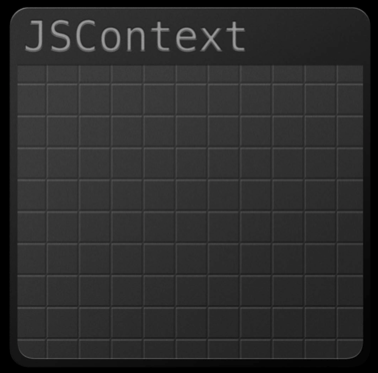  

JSContext

######2.2 JSValue

  * JSValue 是对 JS 值的包装  
JSValue 顾名思义，就是JS值嘛，但是JS中的值拿到OC中是不能直接用的，需要包装一下，这个JSValue就是对JS值的包装，一个JSValue对应着一个JS值，这个JS值可能是JS中的number，boolean等基本类型，也可能是对象，函数，甚至可以是undefined，或者null。如下图：  

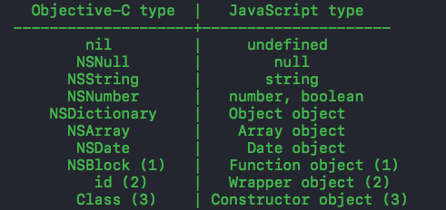  

OC-JS类型对照表

  
其实，就相当于JS 中的 var。

  * JSValue存在于JSContext中  
JSValue是不能独立存在的，它必须存在于某一个JSContext中，就像浏览器中所有的元素都包含于Window对象中一样，一个JSContext中可以包
含多个JSValue。就像这样：  

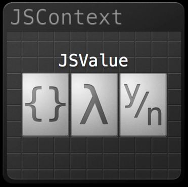  

JSValue

> **Tips**: 图中的 λ (lambda) 符号表示匿名函数，闭包的意思，它的大写形式为 ^ ，这就是为什么 OC 中 Block 定义都有一个 ^ 符号。

  * **都是强引用**  
这点很关键，JSValue对其对应的JS值和其所属的JSContext对象都是强引用的关系。因为jSValue需要这两个东西来执行JS代码，所以JSValue会一直持有着它们。

下面这张图可以更直观的描述出它们之间的关系：  

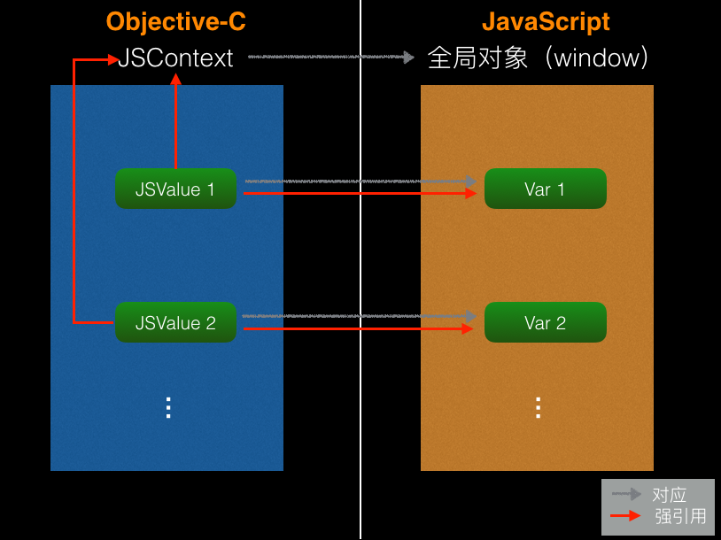  

通过下面这些方法来创建一个JSValue对象：  

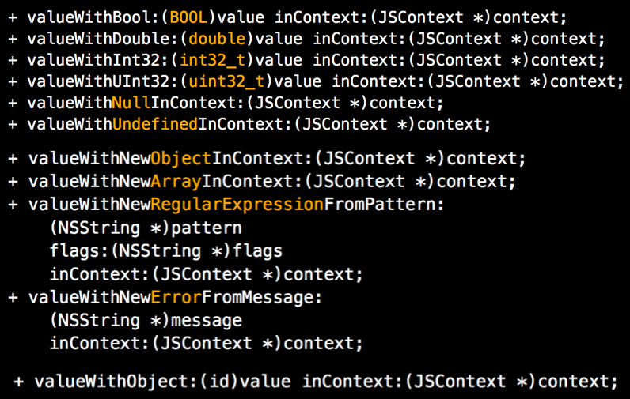  

  
你可以将OC中的类型，转换成JS中的对应的类型（参见前面那个类型对照表），并包装在JSValue中，包括基本类型，Null和undfined。

或者你也可以创建一个新的对象，数组，正则表达式，错误，这几个方法达到的效果就相当于在JS中写 var a = new Array();

也可以将一个OC对象，转成JS中的对象，但是这样转换后的对象中的属性和方法，在JS中是获取不到的，怎样才能让JS中获取的OC对象中的属性和方法，我们后面再说。

######2.3 实际使用

再看一个Demo：  
首先是一段JS代码，一个简单的递归函数，计算阶乘的：  

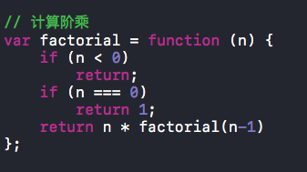  

Demo_JS

  
然后，如果我们想在OC中调用这个JS中的函数该如何做呢？如下：  

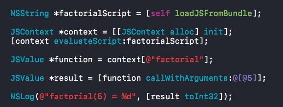  

Demo_OC

  
首先，从bundle中加载这段JS代码。

然后，创建一个JSContext，并用他来执行这段JS代码，这句的效果就相当于在一个全局对象中声明了一个叫`fatorial`的函数，但是没有调用它，只是声明，所以执行完这段JS代码后没有返回值。

再从这个全局对象中获取这个函数，这里我们用到了一种类似字典的下标写法来获取对应的JS函数，就像在一个字典中取这个key对应的value一样简单，实际上，JS 中的对象就是以 `key : Value` 的形式存储属性的，且JS中的object对象类型，对应到OC中就是字典类型，所以这种写法自然且合理。

> 这种类似字典的下标方式不仅可以取值，也可以存值。不仅可以作用于Context，也可以作用与JSValue，他会用中括号中填的key值去匹配JSValue包含的JS值中有没有对应的属性字段，找到了就返回，没找到就返回undefined。

然后，我们拿到了包装这个阶乘函数的的JSValue对象，在其上调用callWithArguments方法，即可调用该函数，这个方法接收一个数组为参数，这是因
为JS中的函数的参数都不是固定的，我们构建了一个数组，并把NSNumber类型的5传了过去，然而JS肯定是不知道什么是NSNumber的，但是别担心，JSCore会帮我们自动转换JS中对应的类型，这里会把NSNumber类型的5转成JS中number类型的5，然后再去调用这个函数（这就是前面说的API目标中自动化的体现）。

最后，如果函数有返回值，就会将函数返回值返回，如果没有返回值则返回undefined，当然在经过JSCore之后，这些JS中的类型都被包装成了JSValue，最后我们拿到返回的JSValue对象，转成对应的类型并输出。这里结果是120，我就不贴出来了。

####三. JavaScript 与 Objective-C 交互

JavaScript 与 Objective-C 交互主要通过2种方式：

  * **Block** : 第一种方式是使用block，block也可以称作闭包和匿名函数，使用block可以很方便的将OC中的单个方法暴露给JS调用，具体实现我们稍后再说。
  * **JSExport 协议** : 第二种方式，是使用`JSExport`协议，可以将OC的中某个对象直接暴露给JS使用，而且在JS中使用就像调用JS的对象一样自然。

简而言之，Block是用来暴露单个方法的，而JSExport 协议可以暴露一个OC对象，下面我们详细说一下这两种方式。

######3.1 Block

上面说过，使用Block可以很方便的将OC中的单个方法(即Block)暴露给JS调用，JSCore会自动将这个Block包装成一个JS方法，具体怎么个包装法
呢？上Demo:  

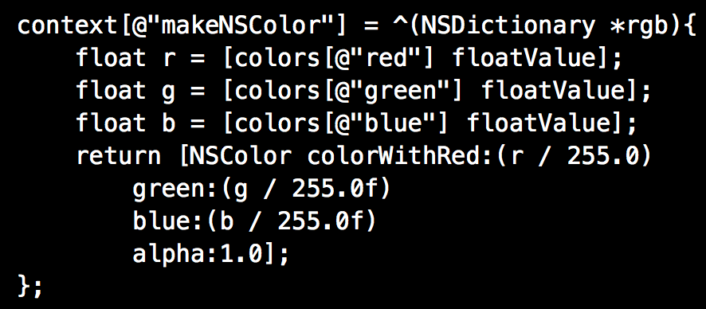  

  
这就是一段将OC Block暴露给JS的代码，很简单是不是，就像这样，我们用前面提过的这种类似字典的写法把一个OC Bock注入了context中，这个block接收一个NSDictionary类型的参数，并返回了一个NSColor类型的对象（NSColor是APPkit中的类，是在Mac开发中用的，相当于UIkit中的NSColor）。

这样写的话，会发生什么呢？请看下图  

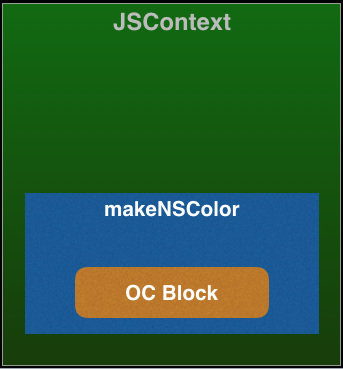  

我们有一个JSContext，然后将一个OCBlock注入进去，JSCore会自动在全局对象中(因为是直接在Context上赋值的，context对应于全局对象)创建一个叫makeNSColor的函数，将这个Block包装起来。

然后，在JS中，我们来调用这个暴露过来的block，其实直接调用的是那个封装着Block的MakeNSColor方法。  

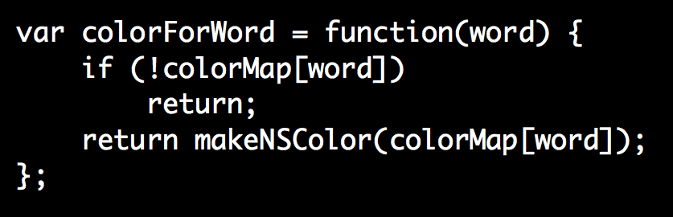  

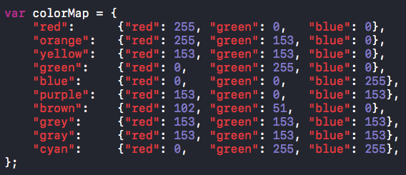  

  
这里有一个叫colorForWord的JS方法，它接收一个word参数，这个colorMap是一个JS对象，里面按颜色名字保存着一些色值信息，这些色值信息也是一个个的JS对象，这个ColorForWord函数就是通过颜色名字来取得对应的颜色对象。然后这函数里面调用了MakeNSColor方法，并传入从colorMap中根据word字段取出来的颜色对象，注意这个颜色对象是一个JS对象，是一个object类型，但是我们传进来的Block接收的是一个NSDIctionary类型的参数啊，不用担心，这时JSCore会自动帮我们把JS对象类型转成NSDictionary类型，就像前面那个表里写的一样，NSDictionary对应着JS中的Object类型。  

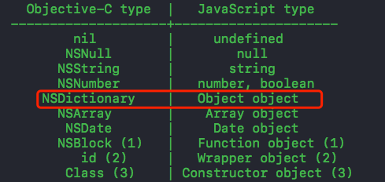  

  
现在，我们有一个包装着Block的JS函数`makeNSColor`，然后又有一个`colorForWrod`函数来调用它，具体过程就像这样：  

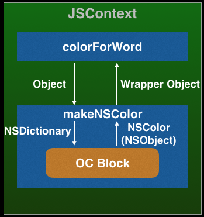  

  
图从左边看起，`colorForWrod`调用`makeNSColor`，传过去的参数是JS Object类型(从colorMap中取出的颜色对象)，JSCore会将这个传过来的Object参数转换成NSDictionary类型，然后`makeNSColor`用其去调用内部包装的`Block`，`Block`返回一个NSColor(NSObject)类型的返回值，JScore会将其转换成一个`wrapper Object`(其实也是JSObject类型)，返回给`colorForWrod`。

如果我们在OC中调用这个`colorForWrod`函数，会是什么样子呢？如下图：  

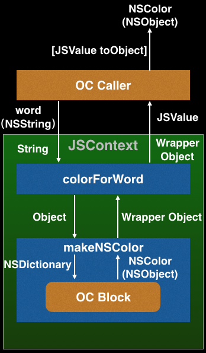  

  
`OC Caller`去调用这个`colorForWrod`函数，因为`colorForWrod`函数接收的是一个`String`类型那个参数word，`OC Caller`传过去的是一个`NSString`类型的参数，JSCore转换成对应的`String`类型。然后`colorForWrod`函数继续向下调用，就像上面说的，知道其拿到返回的`wrapper Object`，它将`wrapper Object`返回给调用它的`OC Caller`，JSCore又会在这时候把`wrapper Object`转成JSValue类型，最后再OC中通过对JSValue调用对应的转换方法，即可拿到里面包装的值，这里我们调用`\-toObject`方法，最后会得到一个`NSColor`对象，即从最开始那个暴露给JS的Block中返回的对象。

通过一步一步的分析，我们发现，**JavaScriptCore会在JS与OC交界处传递数据时做相应的类型转换，转换规则如前面的OC-JS类型对照表。**

#######3.1.1 使用 Block 的坑

使用Block暴露方法很方便，但是有2个坑需要注意一下：

  * 不要用在Block中直接使用JSValue
  * 不要用在Block中直接使用JSContext

因为Block会强引用它里面用到的外部变量，如果直接在Block中使用JSValue的话，那么这个JSvalue就会被这个Block强引用，而每个JSValue都是强引用着它所属的那个JSContext的，这是前面说过的，而这个Block又是注入到这个Context中，所以这个Block会被context强引用，这样会造成循环引用，导致内存泄露。不能直接使用JSContext的原因同理。  

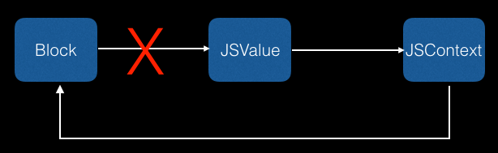  

那怎么办呢，针对第一点，建议把JSValue当做参数传到Block中，而不是直接在Block内部使用，这样Block就不会强引用JSValue了。

针对第二点，可以使用[JSContext currentContext] 方法来获取当前的Context。

######3.2 JSExport 协议

#######3.2.1 介绍

然后是JS和OC交互的第二种方式：`JSExport 协议`，通过JSExport
协议可以很方便的将OC中的对象暴露给JS使用，且在JS中用起来就和JS对象一样。

#######3.2.2 使用

举个栗子，我们在Objective-C中有一个MyPoint类，它有两个double类型的属性，x,y，一个实例方法description 和一个类方法makePointWithX: Y:  

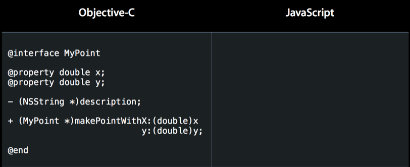  

  
如果我们使用JSExport协议把这个类的对象暴露给JS，那么在JS中，我们怎么使用这个暴露过来的JS对象呢？他的属性可以直接调用，就像调用JS对象的属性一样，他的实例方法也可以直接调用，就像调用JS对象中的方法一样，然后他的类方法，也可以直接用某个全局对象直接调用。就像普通的JS一样，但是操作的却是一个OC对象。  

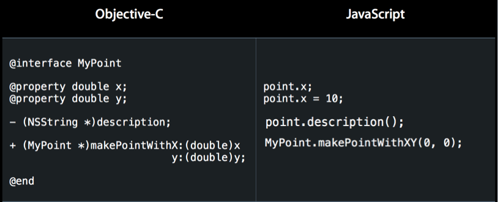  

  
实现这些只需要写这样一句话。    
    
    @protocol MyPointExports <JSExport>

声明一个自定义的协议并继承自JSExport协议。然后当你把实现这个自定义协议的对象暴露给JS时，JS就能像使用原生对象一样使用OC对象了，也就是前面说的A
PI目标之高保真。  

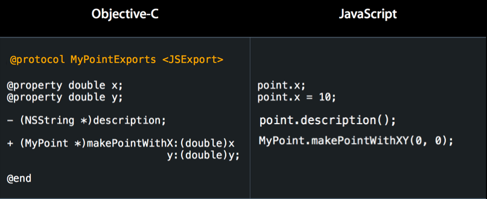  

需要注意的是，OC中的函数声明格式与JS中的不太一样（应该说和大部分语言都不一样。。），OC函数中多个参数是用冒号`:`声明的，这显然不能直接暴露给JS调用，这不高保真。。

所以需要对带参数的方法名做一些调整，当我们暴露一个带参数的OC方法给JS时，JSCore会用以下两个规则生成一个对应的JS函数：

  * 移除所有的冒号
  * 将跟在冒号后面的第一个小写字母大写

比如上面的那个类方法，转换之前方法名应该是 `makePointWithX:y:`，在JS中生成的对应的方法名就会变成 `makePointWithXY`。

苹果知道这种不一致可能会逼死某些强迫症。。所以加了一个宏`JSExportAs`来处理这种情况，它的作用是：给JSCore在JS中为OC方法生成的对应方法指
定名字。

比如，还是上面这个方法`makePointWithX:y:`，可以这样写：  

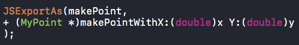  

  
这个`makePoint`就是给JS中方法指定的名字，这样，在JS中就能直接调用`makePoint`来调用这个OC方法`makePointWithX:y:`了。

> 注意：这个宏只对带参数的OC方法有效。

然后，这里有一个JSExport协议使用的 [小Demo](https://github.com/DengKaiHui/Demo_JSExport)有兴趣的可以看看，用起来其实挺简单的。

#######3.2.3 探究

但是，光会用可不行，这个JSExoprt协议到底做了什么呢？

当你声明一个继承自JSExport的自定义协议时，就是在告诉JSCore，这个自定义协议中声明的属性，实例方法和类方法需要被暴露给JS使用。（不在这个协议中的方法不会被暴露出去。）

当你把实现这个协议的类的对象暴露给JS时，JS中会生成一个对应的JS对象，然后，JSCore会按照这个协议中声明的内容，去遍历实现这个协议的类，把协议中声明的属性，转换成JS 对象中的属性，实质上是转换成getter 和 setter 方法，转换方法和之前说的block类似，创建一个JS方法包装着OC中的方法，然后协议中声明的实例方法，转换成JS对象上的实例方法，类方法转换成JS中某个全局对象上的方法。  

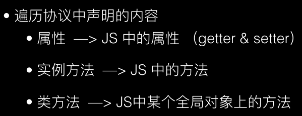  

那这里说的某个全局对象到底是什么呢？这涉及到JS中的知识：

  * Prototype & Constructor 

在传统的基于Class的语言如Java、C++中，继承的本质是扩展一个已有的Class，并生成新的Subclass。但是，JS中是没有class类型的，那JS种怎么实现继承呢，答案就是通过原型对象(Prototype)。

JavaScript对每个创建的对象都会设置一个原型，指向它的原型对象。对象会从其原型对象上继承属性和方法。

当我们用obj.xxx访问一个对象的属性时，JavaScript引擎先在当前对象上查找该属性，如果没有找到，就到其原型对象上找，如果还没有找到，就一直上溯到object.prototype对象，最后，如果还没有找到，就只能返回undefined。

原型对象也是一个对象，他有一个构造函数Constructor，就是用来创建对象的。

假如我们有一个Student构造函数，然后用它创建了一个对象 xiaoming，那么小明这个对象的原型链就是这样的。

    
        function Student(name) {
	      this.name = name;
	      this.hello = function () {
	          alert('Hello, ' + this.name + '!');
	      }
	    }
	    var xiaoming = new Student('小明');
	    
        xiaoming ----> Student.prototype ----> Object.prototype ----> null

再详细一点如下图，xiaohong是Student函数构造的另一个对象，红色箭头是原型链。注意，Student.prototype指向的对象就是xiaoming、xiaohong的原型对象，这个原型对象自己还有个属性constructor，指向Student函数本身。

另外，函数Student恰好有个属性prototype指向xiaoming、xiaohong的原型对象，但是xiaoming、xiaohong这些对象可没有prototype这个属性，不过可以用**proto**这个非标准用法来查看。

这样我们就认为xiaoming、xiaohong这些对象“继承”自Student。

xiaoming的原型对象上又有一根红色箭头指向Object.prototype，这样我们就说Student“继承”自Object。Object.prototype的原型对象又指向null。  

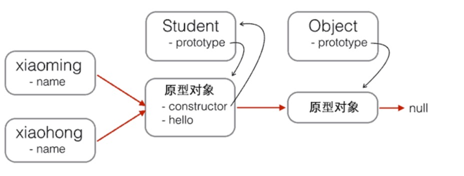  

JS原型链

  
更多关于Prototype和Constructor的知识可以看[这里](http://www.liaoxuefeng.com/wiki/001434446689867b27157e896e74d51a89c25cc8b43bdb3000/0014344997235247b53be560ab041a7b10360a567422a78000)。

不知道有没有觉得，这里的原型对象，有点像OC中的类，而构造函数，则有点像OC中的元类，OC中类方法都是放在元类当中的，所以前面说的某个全局对象就是JS中的构
造函数。

这里我画了一张图，用来描述使用JSExport协议暴露对象时，OC和JS中的对应关系：  

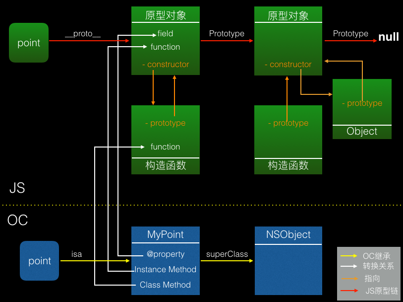  

我们有一个MyPoint类的对象point，当我们用JSExport协议将这个OC对象暴露给JS时，JSCore首先会在JS上下文环境中为该类生成一个对应的原型对象和构造函数，然后JSCore会扫描这个类，把其中在JSExport协议中声明的内容暴露给JS，属性(即getter和setter方法)会被添加到原型对象上，而类方法会被添加到到这个构造函数上，这个放的位置，就正好对应了OC中的类和元类。

然后就像前面那张图一样，原型对象中有一个constructor属性，指向构造函数，构造函数中有一个prototype属性指向原型对象。我们又知道，MyPoint类是继承与NSObject类的，JSCore也会为暴露的类的父类创建原型对象和构造函数，NSObject类的原型对象就是JS中Object类的原型对象。

每一个原型对象都有一个属性叫Prototype，大写的P，他是一个指针，用来表示JS中的继承关系(即原型链)，MyPoint类的原型对象会指向NSObject类的原型对象。而NSObject的原型对象，及Object的原型对象会指向null。最后再用Mypoint类的构造函数和原型对象在JS中去生成一个与OC中point对象对应的JS对象。

这样就在JS中用JS的体系结构构造了与OC中一样的类继承关系。

这就是使用JSExport 协议暴露的OC对象在JS中可以像调用JS对象一样的关键所在。

####四. 内存管理

我们都知道，Objective-C 用的是ARC (Automatic Reference Counting)，不能自动解决循环引用问题(retaincycle)，需要程序员手动处理，而JavaScript 用的是GC (准确的说是 Tracing Garbage Collection)，所有的引用都是强引用，但是垃圾回收器会帮我解决循环引用问题，JavaScriptCore也一样，一般来说，大多数时候不需要我们去手动管理内存。

但是下面2种情况需要注意一下：

  * **不要在JS中给OC对象增加成员变量**，这句话的意思就是说，当我们将一个OC对象暴露给JS后，就像前面说的使用JSExport协议，我们能想操纵JS对象一样操纵OC对象，但是这时候，不要在JS中给这个OC对象添加成员变量，因为这个动作产生的后果就是，只会在JS中为这个OC对象增加一个额外的成员变量，但是OC中并不会同步增加。所以说这样做并没有什么意义，还有可能造成一些奇怪的内存管理问题。

  * **OC对象不要直接强引用JSValue对象**，这句话再说直白点，就是不要直接将一个JSValue类型的对象当成属性或者成员变量保存在一个OC对象中，尤其是这个OC对象还暴露给JS的时候。这样会造成循环引用。如下图：  

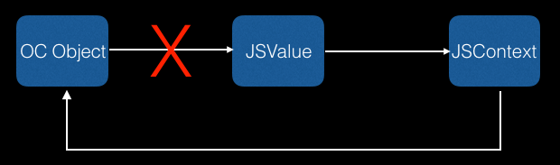  

如何解决这个问题呢？你可能会想，不能强引用， 那就弱引用呗，就像图上这样，但是这样做也是不行的，因为JSValue没用对象引用他，他就会被释放了。

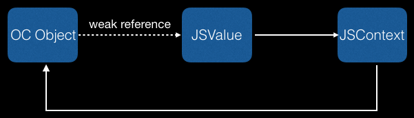  

那怎么办？分析一下，在这里，我们需要一种弱的引用关系，因为强引用会造成循环引用，但是又不能让这个JSValue因无人引用它而被释放。简而言之就是，弱引用但能
保持JSValue不被释放。

于是，苹果退出了一种新的引用关系，叫`conditional retain`，有条件的强引用，通过这种引用就能实现我们前面分析所需要的效果，而`JSManagerValue`就是苹果用来实现conditional
retain的类。  

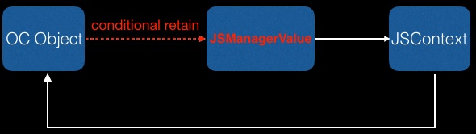  

#####4.1 JSManagedValue

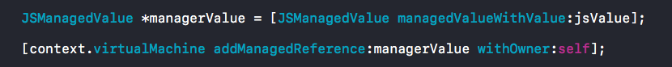  

  
这是JSManagerValue的一般使用步骤：

  * 首先，用JSValue创建一个JSManagerValue对象，JSManagerValue里面其实就是包着一个JSValue对象，可以通过它里面一个只读的value属性取到，这一步其实是添加一个对JSValue的弱引用。

  * 如果只有第一步，这个JSValue会在其对应的JS值被垃圾回收器回收之后被释放，这样效果就和弱引用一样，所以还需要加一步，在虚拟机上为这个JSManagerValue对象添加Owner（这个虚拟机就是给JS执行提供资源的，待会再讲），这样做之后，就给JSValue增加一个强关系，只要以下两点有一点成立，这个JSManagerValue里面包含的JSValue就不会被释放：

    * JSValue对应的JS值没有被垃圾回收器回收
    * Owner对象没有被释放

这样做，就即避免了循环引用，又保证了JSValue不会因为弱引用而被立刻释放。

####五. 多线程

说多线程之前得先说下另一个类 `JSVirtualMachine`, 它为JavaScript的运行提供了底层资源，有自己独立的堆栈以及垃圾回收机制。

`JSVirtualMachine`还是JSContext的容器，可以包含若干个JSContext，在一个进程中，你可以有多个JSVirtualMachine，里面包含着若干个JSContext，而JSContext中又有若干个JSValue，他们的包含关系如下图：  

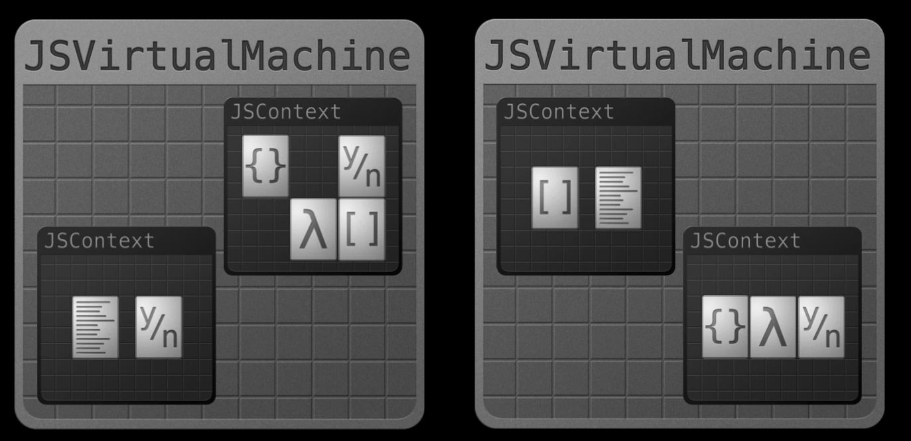  

需要注意的是，你可以在同一个JSVirtualMachine的不同JSContext中，互相传递JSValue，但是不能再不同的JSVirtualMachine中的JSContext之间传递JSValue。  

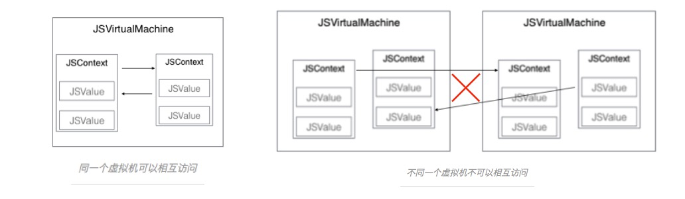  

  
这是因为，每个JSVirtualMachine都有自己独立的堆栈和垃圾回收器，一个JSVirtualMachine的垃圾回收器不知道怎么处理从另一个堆栈传过来的值。

说回多线程，JavaScriptCore提供的API本身就是线程安全的。

你可以在不同的线程中，创建JSValue，用JSContext执行JS语句，但是当一个线程正在执行JS语句时，其他线程想要使用这个正在执行JS语句的JSContext所属的JSVirtualMachine就必须得等待，等待前前一个线程执行完，才能使用这个JSVirtualMachine。

当然，这个强制串行的粒度是JSVirtualMachine，如果你想要在不用线程中并发执行JS代码，可以为不同的线程创建不同JSVirtualMachine。

> 最后再补充一点，就是关于如何获取 UIWebView 中的 JSContext，由于篇幅问题我就不赘述了，这里推荐一篇[文章](https://segmentfault.com/a/1190000004285316)。

