 
<!--BEGIN_DATA
{
    "create_date": "2020-11-21 10:13", 
    "modify_date": "2020-11-21 10:13", 
    "is_top": "0", 
    "summary": "深入浅出排序学习：写给程序员的算法系统开发实践", 
    "tags": "大数据、机器学习", 
    "file_name": "深入浅出排序学习：写给程序员的算法系统开发实践.md"
}
END_DATA-->

#### <p>原文出处：<a href='https://tech.meituan.com/2018/12/20/head-in-l2r.html' target='blank'>深入浅出排序学习：写给程序员的算法系统开发实践</a></p>

### 引言

我们正处在一个知识爆炸的时代，伴随着信息量的剧增和人工智能的蓬勃发展，互联网公司越发具有强烈的个性化、智能化信息展示的需求。而信息展示个性化的典型应用主要包括搜索列表、推荐列表、广告展示等等。

很多人不知道的是，看似简单的个性化信息展示背后，涉及大量的数据、算法以及工程架构技术，这些足以让大部分互联网公司望而却步。究其根本原因，个性化信息展示背后的技术是排序学习问题（Learning to Rank）。市面上大部分关于排序学习的文章，要么偏算法、要么偏工程。虽然算法方面有一些系统性的介绍文章，但往往对读者的数学能力要求比较高，也比较偏学术，对于非算法同学来说门槛非常高。而大部分工程方面的文章又比较粗糙，基本上停留在Google的Two-Phase Scheme阶段，从工程实施的角度来说，远远还不够具体。

对于那些由系统开发工程师负责在线排序架构的团队来说，本文会采用通俗的例子和类比方式来阐述算法部分，希望能够帮助大家更好地理解和掌握排序学习的核心概念。如果是算法工程师团队的同学，可以忽略算法部分的内容。本文的架构部分阐述了美团点评到店餐饮业务线上运行的系统，可以作为在线排序系统架构设计的参考原型直接使用。该架构在服务治理、分层设计的理念，对于保障在线排序架构的高性能、高可用性、易维护性也具有一定的参考价值。包括很多具体环节的实施方案也可以直接进行借鉴，例如流量分桶、流量分级、特征模型、级联模型等等。

总之，让开发工程师能够理解排序学习算法方面的核心概念，并为在线架构实施提供细颗粒度的参考架构，是本文的重要目标。

### 算法部分

机器学习涉及优化理论、统计学、数值计算等多个领域。这给那些希望学习机器学习核心概念的系统开发工程师带来了很大的障碍。不过，复杂的概念背后往往蕴藏着朴素的道理。本节将尝试采用通俗的例子和类比方式，来对机器学习和排序学习的一些核心概念进行揭秘。

#### 机器学习

##### 什么是机器学习？

典型的机器学习问题，如下图所示：

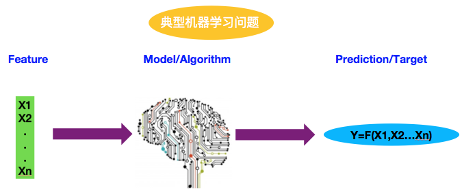

机器学习模型或算法（Model/Algorithm）会根据观察到的特征值（Feature）进行预测，给出预测结果或者目标（Prediction/Target）。这就像是一个函数计算过程，对于特定X值（Feature），算法模型就像是函数，最终的预测结果是Y值。不难理解，机器学习的核心问题就是如何得到预测函数。

**Wikipedia的对机器学习定义如下：**

> “Machine learning is a subset of artificial intelligence in the field of computer science that often uses statistical techniques to give computers the ability to learn with data, without being explicitly programmed.”

机器学习的最重要本质是从数据中学习，得到预测函数。人类的思考过程以及判断能力本质上也是一种函数处理。从数据或者经验中学习，对于人类来说是一件再平常不过的事情了。例如人们通过观察太阳照射物体影子的长短而发明了日晷，从而具备了计时和制定节气的能力。古埃及人通过尼罗河水的涨落发明了古埃及历法。

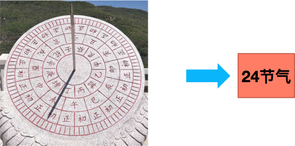

又比如人们通过观察月亮形状的变化而发明了阴历。


如果机器能够像人一样具备从数据中学习的能力，从某种意义上讲，就具备了一定的“智能”。现在需要回答的两个问题就是：

  * 到底什么是“智能”？
  * 如何让机器具备智能？

##### 什么是智能？

在回答这个问题之前，我们先看看传统的编程模式为什么不能称之为“智能”。传统的编程模式如下图所示，它一般要经历如下几个阶段：

  * 人类通过观察数据（Data）总结经验，转化成知识（Knowledge）。
  * 人类将知识转化成规则（Rule）。
  * 工程师将规则转化成计算机程序（Program）。

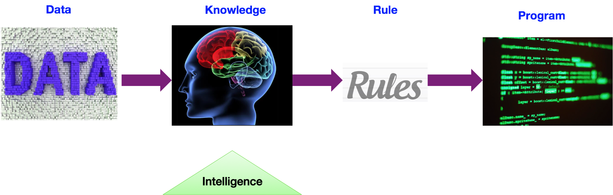

在这种编程模式下，如果一个问题被规则覆盖，那么计算机程序就能处理。对于规则不能覆盖的问题，只能由人类来重新思考，制定新规则来解决。所以在这里“智能”角色主要由人类来承担。人类负责解决新问题，所以传统的程序本身不能称之为“智能”。

所以，“智能”的一个核心要素就是“举一反三”。

##### 如何让机器具备智能？

在讨论这个问题之前，可以先回顾一下人类是怎么掌握“举一反三”的能力的？基本流程如下：

  * 老师给学生一些题目，指导学生如何解题。学生努力掌握解题思路，尽可能让自己的答案和老师给出的答案一致。
  * 学生需要通过一些考试来证明自己具备“举一反三”的能力。如果通过了这些考试，学生将获得毕业证书或者资格从业证书。
  * 学生变成一个从业者之后将会面临并且处理很多之前没有碰到过的新问题。

机器学习专家从人类的学习过程中获得灵感，通过三个阶段让机器具备“举一反三”的能力。这三个阶段是：训练阶段（Training）、测试阶段（Testing）、推
导阶段（Inference）。下面逐一进行介绍。

##### 训练阶段

训练阶段如下图所示：

  * 人类给机器学习模型一些训练样本（X，Y），X代表特征，Y代表目标值。这就好比老师教学生解题，X代表题目，Y代表标准答案。
  * 机器学习模型尝试想出一种方法解题。
  * 在训练阶段，机器学习的目标就是让损失函数值最小。类比学生尝试让自己解题的答案和老师给的标准答案差别最小，思路如出一辙。

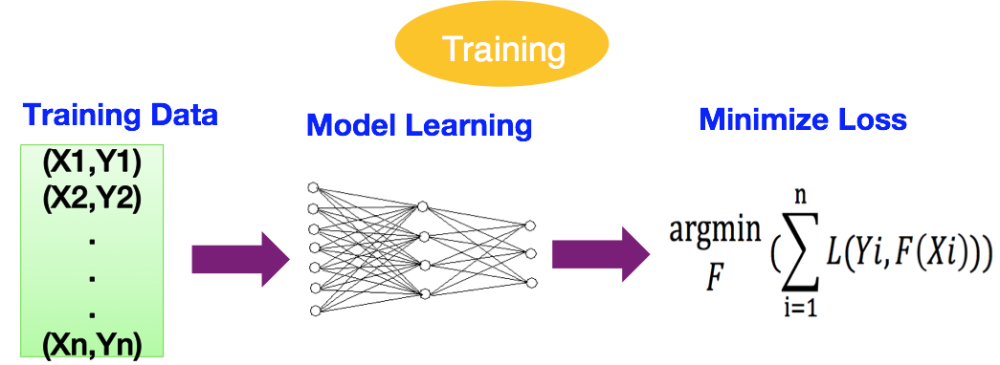

##### 测试阶段

测试阶段如下图所示：

  * 人类给训练好的模型一批完全不同的测试样本（X，Y）。这就好比学生拿到考试试卷。
  * 模型进行推导。这个过程就像学生正在考试答题。
  * 人类要求测试样本的总损失函数值低于设定的最低目标值。这就像学校要求学生的考试成绩必须及格一样。

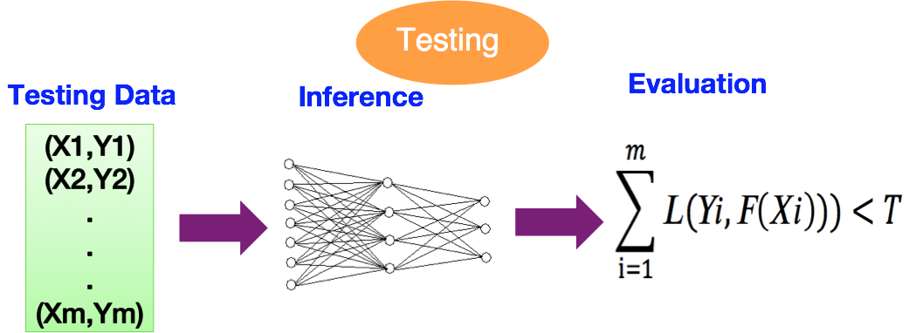

##### 推导阶段

推导阶段如下图所示：

  * 在这个阶段机器学习模型只能拿到特征值X，而没有目标值。这就像工作中，人们只是在解决一个个的问题，但不知道正确的结果到底是什么。
  * 在推导阶段，机器学习的目标就是预测，给出目标值。

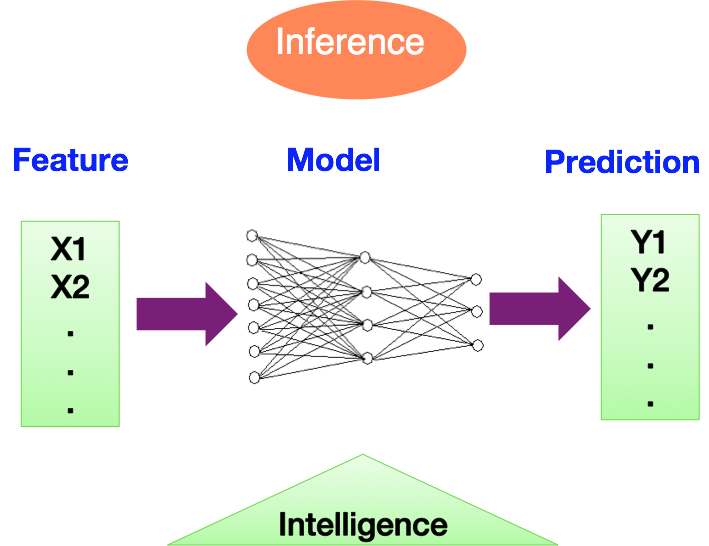

### 排序学习

#### 什么是排序学习？

**Wikipedia的对排序学习的定义如下：**

>“Learning to rank is the application of machine learning, typically supervised, semi-supervised or reinforcement learning, in the construction of ranking models for information retrieval systems. Training data consists of lists of items with some partial order specified between items in each list.
>This order is typically induced by giving a numerical or ordinal score or a binary judgment (e.g. "relevant" or "not relevant") for each item. The ranking model's purpose is to rank, i.e. produce a permutation of items in new, unseen lists in a way which is "similar" to rankings in the training data in some sense.”

排序学习是机器学习在信息检索系统里的应用，其目标是构建一个排序模型用于对列表进行排序。排序学习的典型应用包括搜索列表、推荐列表和广告列表等等。

列表排序的目标是对多个条目进行排序，这就意味着它的目标值是有结构的。与单值回归和单值分类相比，结构化目标要求解决两个被广泛提起的概念：

  * 列表评价指标
  * 列表训练算法

#### 列表评价指标

以关键词搜索返回文章列表为例，这里先分析一下列表评价指标要解决什么挑战。

  * 第一个挑战就是定义文章与关键词之间的相关度，这决定了一篇文章在列表中的位置，相关度越高排序就应该越靠前。
  * 第二个挑战是当列表中某些文章没有排在正确的位置时候，如何给整个列表打分。举个例子来说，假如对于某个关键词，按照相关性的高低正确排序，文档1、2、3、4、5应该依次排在前5位。现在的挑战就是，如何评估“2，1，3，4，5”和“1，2，5，4，3”这两个列表的优劣呢？

列表排序的评价指标体系总来的来说经历了三个阶段，分别是Precision and Recall、Discounted Cumulative Gain(DCG)和Expected Reciprocal Rank(ERR)。我们逐一进行讲解。

##### Precision and Recall(P-R)

本评价体系通过准确率（Precision）和召回率（Recall）两个指标来共同衡量列表的排序质量。对于一个请求关键词，所有的文档被标记为相关和不相关两种。

**Precision的定义如下：**

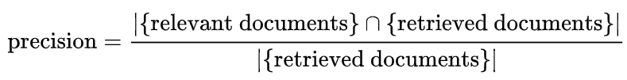

**Recall的定义如下：**

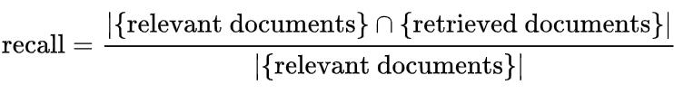

举个列子来说，对于某个请求关键词，有200篇文章实际相关。某个排序算法只认为100篇文章是相关的，而这100篇文章里面，真正相关的文章只有80篇。按照以上定
义：

  * 准确率=80⁄100=0.8
  * 召回率=80⁄200=0.4。

##### Discounted Cumulative Gain(DCG)

P-R的有两个明显缺点：

  * 所有文章只被分为相关和不相关两档，分类显然太粗糙。
  * 没有考虑位置因素。

DCG解决了这两个问题。对于一个关键词，所有的文档可以分为多个相关性级别，这里以rel1，rel2…来表示。文章相关性对整个列表评价指标的贡献随着位置的增加而对数衰减，位置越靠后，衰减越严重。基于DCG评价指标，列表前p个文档的评价指标定义如下：

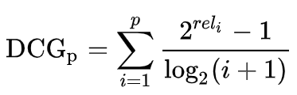

对于排序引擎而言，不同请求的结果列表长度往往不相同。当比较不同排序引擎的综合排序性能时，不同长度请求之间的DCG指标的可比性不高。目前在工业界常用的是Normalized DCG(nDCG)，它假定能够获取到某个请求的前p个位置的完美排序列表，这个完美列表的分值称为IdealDCG(IDCG)，nDCG等于DCG与IDCG比值。所以nDCG是一个在0到1之间的值。

**nDCG的定义如下：**

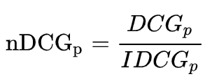

**IDCG的定义如下：**

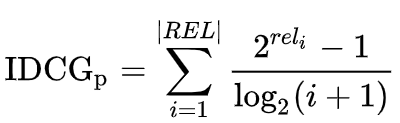

|REL|代表按照相关性排序好的最多到位置p的结果列表。

##### Expected Reciprocal Rank(ERR)

与DCG相比，除了考虑位置衰减和允许多种相关级别（以R1，R2，R3…来表示）以外，ERR更进了一步，还考虑了排在文档之前所有文档的相关性。举个例子来说，文档A非常相关，排在第5位。如果排在前面的4个文档相关度都不高，那么文档A对列表的贡献就很大。反过来，如果前面4个文档相关度很大，已经完全解决了用户的搜索需求，用户根本就不会点击第5个位置的文档，那么文档A对列表的贡献就不大。

**ERR的定义如下：**

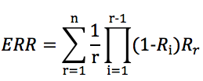

##### 列表训练算法

做列表排序的工程师们经常听到诸如Pointwise、Pairwise和Listwise的概念。这些是什么东西呢，背后的原理又是什么呢？这里将逐一解密。

仍然以关键词搜索文章为例，排序学习算法的目标是为给定的关键词对文章列表进行排序。做为类比，假定有一个学者想要对各科学生排名进行预测。各种角色的对应关系如下：

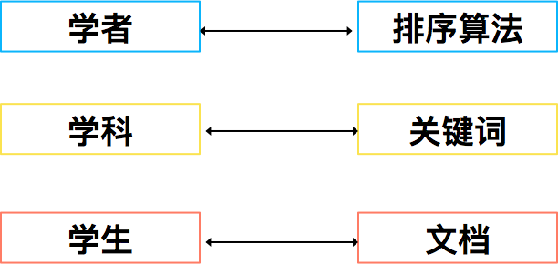

首先我们要告诉学者每个学生的各种属性，这就像我们要告诉排序算法文档特征。对于目标值，我们却有三种方式来告诉学者：

  * 对于每个学科，我们可以告诉学者每个学生的成绩。比较每个学生的成绩，学者当然可以算出每个学生的最终排名。这种训练方法被称为Pointwise。对于Pointwise算法，如果最终预测目标是一个实数值，就是一个回归问题。如果目标是概率预测，这就是一个分类问题，例如CTR预估。
  * 对于每个学科，我们可以告诉学者任意两个学生的相互排名。根据学生之间排名的情况，学者也可以算出每个学生的最终排名。这种训练方法被称为Pairwise。Pairwise算法的目标是减少逆序的数量，所以是个二分类问题。
  * 对于每个学科，我们可以直接告诉学者所有学生的整体排名。这种训练方法被称为Listwise。Listwise算法的目标往往是直接优化nDCG、ERR等评价指标。

这三种方法表面看上去有点像玩文字游戏，但是背后却是工程师和科学家们不断探索的结果。最直观的方案是Pointwise算法，例如对于广告CTR预估，在训练阶段需要标注某个文档的点击概率，这相对来说容易。Pairwise算法一个重要分支是Lambda系列，包括LambdaRank、LambdaMart等，它的核心思想是：很多时候我们很难直接计算损失函数的值，但却很容易计算损失函数梯度（Gradient）。这意味着我们很难计算整个列表的nDCG和ERR等指标，但却很容易知道某个文档应该排的更靠前还是靠后。Listwise算法往往效果最好，但是如何为每个请求对所有文档进行标注是一个巨大的挑战。

### 在线排序架构

典型的信息检索包含两个阶段：索引阶段和查询阶段。这两个阶段的流程以及相互关系可以用下图来表示：

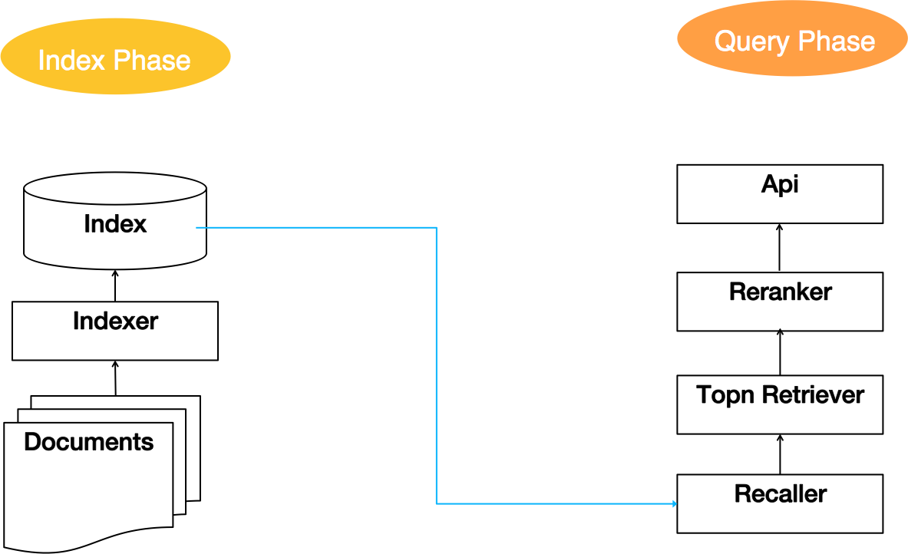

索引阶段的工作是由索引器（Indexer）读取文档（Documents）构建索引（Index）。

查询阶段读取索引做为召回，然后交给TopnRetriever进行粗排，在粗排后的结果里面将前n个文档传给Reranker进行精排。这样一个召回、粗排、精排的架构最初是由Google提出来的，也被称为“Two-Phase Scheme”。

索引部分属于离线阶段，这里重点讲述在线排序阶段，即查询阶段。

#### 三大挑战

在线排序架构主要面临三方面的挑战：特征、模型和召回。

  * 特征挑战包括特征添加、特征算子、特征归一化、特征离散化、特征获取、特征服务治理等。
  * 模型挑战包括基础模型完备性、级联模型、复合目标、A/B实验支持、模型热加载等。
  * 召回挑战包括关键词召回、LBS召回、推荐召回、粗排召回等。

三大挑战内部包含了非常多更细粒度的挑战，孤立地解决每个挑战显然不是好思路。在线排序作为一个被广泛使用的架构值得采用领域模型进行统一解决。Domain-driven design(DDD)的三个原则分别是：领域聚焦、边界清晰、持续集成。

基于以上分析，我们构建了三个在线排序领域模型：召回治理、特征服务治理和在线排序分层模型。

#### 召回治理

经典的Two-Phase Scheme架构如下图所示，查询阶段应该包含：召回、粗排和精排。但从领域架构设计的角度来讲，粗排对于精排而言也是一种召回。和基于传统的文本搜索不同，美团点评这样的O2O公司需要考虑地理位置和距离等因素，所以基于LBS的召回也是一种召回。与搜索不同，推荐召回往往基于协同过滤来完成的，例如User-Based CF和Item-Based CF。

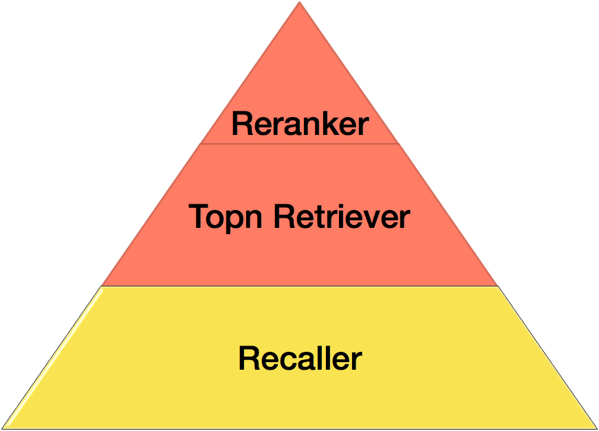

综上所述，召回总体而言分成四大类：

  * 关键词召回，我们采用Elasticsearch解决方案。
  * 距离召回，我们采用K-D tree的解决方案。
  * 粗排召回。
  * 推荐类召回。

#### 特征服务治理

传统的视角认为特征服务应该分为用户特征（User）、查询特征（Query）和文档特征（Doc），如下图：

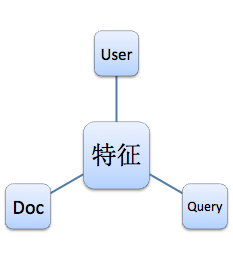

这是比较纯粹的业务视角，并不满足DDD的领域架构设计思路。由于特征数量巨大，我们没有办法为每个特征设计一套方案，但是我们可以把特征进行归类，为几类特征分别设计解决方案。每类技术方案需要统一考虑性能、可用性、存储等因素。从领域视角，特征服务包含四大类：

  * 列表类特征。一次请求要求返回实体列表特征，即多个实体，每个实体多个特征。这种特征建议采用内存列表服务，一次性返回所有请求实体的所有特征。避免多次请求，从而导致数量暴增，造成系统雪崩。
  * 实体特征。一次请求返回单实体的多个特征。建议采用Redis、Tair等支持多级的Key-Value服务中间件提供服务。
  * 上下文特征。包括召回静态分、城市、Query特征等。这些特征直接放在请求内存里面。
  * 相似性特征。有些特征是通过计算个体和列表、列表和列表的相似度而得到的。建议提供单独的内存计算服务，避免这类特征的计算影响在线排序性能。本质上这是一种计算转移的设计。

#### 在线排序分层模型

如下图所示，典型的排序流程包含六个步骤：场景分发（Scene Dispatch）、流量分配（Traffic Distribution）、召回（Recall）、特征抽取（Feature Retrieval）、预测（Prediction）、排序（Ranking）等等。

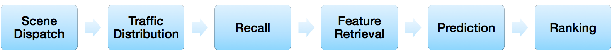

按照DDD的设计原则，我们设计了如下在线排序分层模型，包括：场景分发（Scene Dispatch）、模型分发（Model Distribution）、排序（Ranking）、特征管道（Feature Pipeline）、预测管道（Prediction Pipeline）。我们将逐一进行介绍。

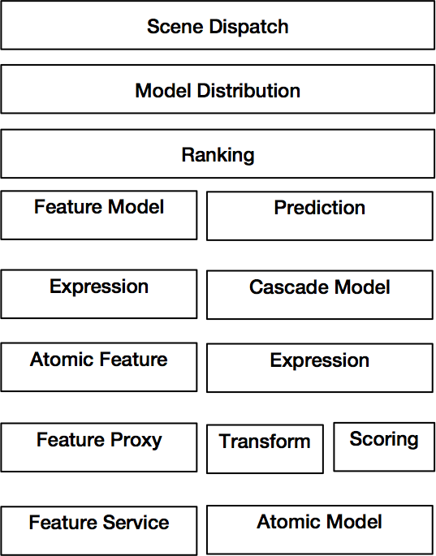

##### 场景分发（Scene Dispatch）

场景分发一般是指业务类型的分发。对于美团点评而言包括：分平台、分列表、分使用场景等。如下图所示：

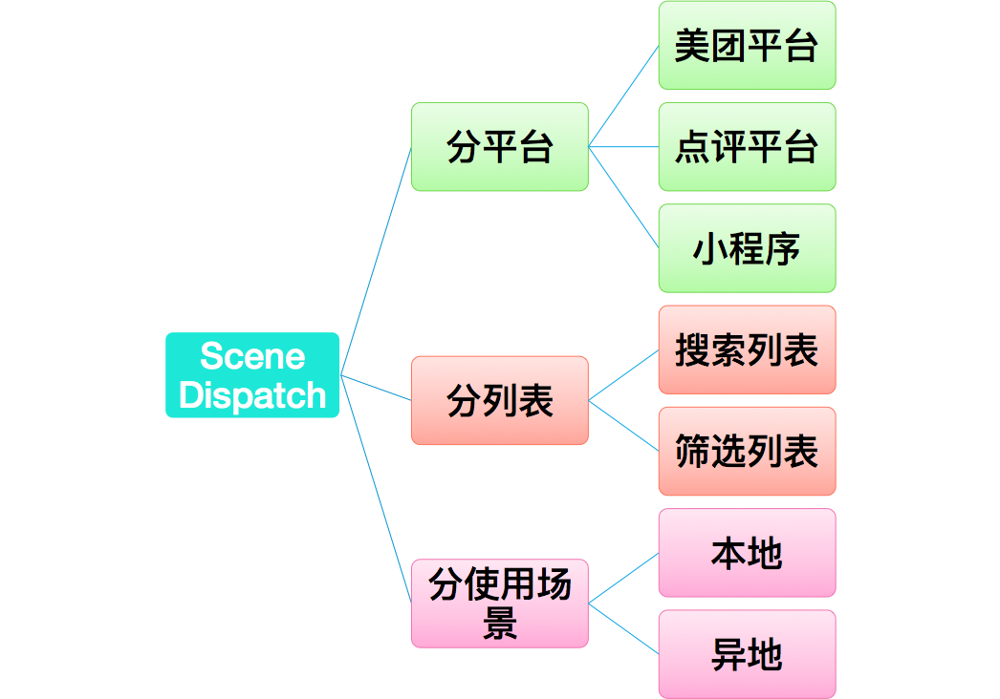

##### 模型分发（Model Distribution）

模型分发的目标是把在线流量分配给不同的实验模型，具体而言要实现三个功能：

  * 为模型迭代提供在线流量，负责线上效果收集、验证等。
  * A/B测试，确保不同模型之间流量的稳定、独立和互斥、确保效果归属唯一。
  * 确保与其他层的实验流量的正交性。

流量的定义是模型分发的一个基础问题。典型的流量包括：访问、用户和设备。

如何让一个流量稳定地映射到特定模型上面，流量之间是否有级别？这些是模型分发需要重点解决的问题。

##### 流量分桶原理

采用如下步骤将流量分配到具体模型上面去：

  * 把所有流量分成N个桶。
  * 每个具体的流量Hash到某个桶里面去。
  * 给每个模型一定的配额，也就是每个策略模型占据对应比例的流量桶。
  * 所有策略模型流量配额总和为100%。
  * 当流量和模型落到同一个桶的时候，该模型拥有该流量。

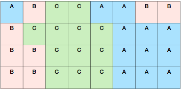

举个例子来说，如上图所示，所有流量分为32个桶，A、B、C三个模型分别拥有37.5%、25%和37.5%的配额。对应的，A、B、C应该占据12、8和12个桶。

为了确保模型和流量的正交性，模型和流量的Hash Key采用不同的前缀。

##### 流量分级

每个团队的模型分级策略并不相同，这里只给出一个建议模型流量分级：

  * 基线流量。本流量用于与其他流量进行对比，以确定新模型的效果是否高于基准线，低于基准线的模型要快速下线。另外，主力流量相对基线流量的效果提升也是衡量算法团队贡献的重要指标。
  * 实验流量。该流量主要用于新实验模型。该流量大小设计要注意两点：第一不能太大而伤害线上效果；第二不能太小，流量太小会导致方差太大，不利于做正确的效果判断。
  * 潜力流量。如果实验流量在一定周期内效果比较好，可以升级到潜力流量。潜力流量主要是要解决实验流量方差大带来的问题。
  * 主力流量。主力流量只有一个，即稳定运行效果最好的流量。如果某个潜力流量长期好于其他潜力流量和主力流量，就可以考虑把这个潜力流量升级为主力流量。

做实验的过程中，需要避免新实验流量对老模型流量的冲击。流量群体对于新模型会有一定的适应期，而适应期相对于稳定期的效果一般会差一点。如果因为新实验的上线而导致整个流量群体的模型都更改了，从统计学的角度讲，模型之间的对比关系没有变化。但这可能会影响整个大盘的效果，成本很高。

为了解决这个问题，我们的流量分桶模型优先为模型列表前面的模型分配流量，实验模型尽量放在列表尾端。这样实验模型的频繁上下线不影响主力和潜力流量的用户群体。当然当发生模型流量升级的时候，很多流量用户的服务模型都会更改。这种情况并不是问题，因为一方面我们在尝试让更多用户使用更好的模型，另一方面固定让一部分用户长期使用实验流量也是不公平的事情。

##### 排序（Ranking）

排序模块是特征模块和预测模块的容器，它的主要职责如下：

  * 获取所有列表实体进行预测所需特征。
  * 将特征交给预测模块进行预测。
  * 对所有列表实体按照预测值进行排序。

##### 特征管道（Feature Pipeline）

特征管道包含特征模型（Feature Model）、表达式（Expression）、原子特征（Atomic Feature）、 特征服务代理（Feature Proxy）、特征服务（Feature Service）。如下图所示：

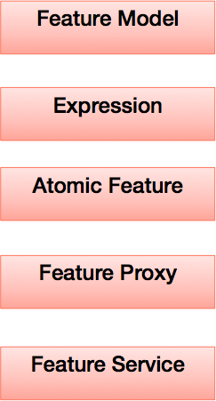

特征管道要解决两个核心问题：

  * 给定特征名获取对应特征值。这个过程很复杂，要完成特征名->特征服务->特征类->特征值的转化过程。
  * 特征算子问题。模型使用的特征往往是对多个原子特征进行复合运算后的结果。另外，特征离散化、归一化也是特征算子需要解决的问题。

完整的特征获取流程如下图所示，具体的流程如下：

  * Ranking模块从FeatureModel里面读取所有的原始特征名。
  * Ranking将所有的原始特征名交给Feature Proxy。
  * Feature Proxy根据特征名的标识去调用对应的Feature Service，并将原始特征值返回给Ranking模块。
  * Ranking模块通过Expression将原始特征转化成复合特征。
  * Ranking模块将所有特征交给级联模型做进一步的转换。

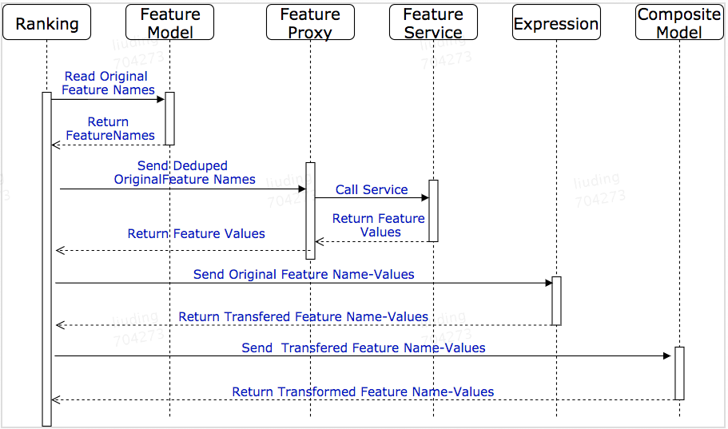

##### 特征模型（Feature Model）

我们把所有与特征获取和特征算子的相关信息都放在一个类里面，这个类就是FeatureModel，定义如下：

    
```java
//包含特征获取和特征算子计算所需的meta信息 
public class FeatureModel {   
    //这是真正用在Prediction里面的特征名 
    private String featureName;  
    //通过表达式将多种原子特征组合成复合特征。
    private IExpression expression; 
    //这些特征名是真正交给特征服务代理(Feature Proxy)去从服务端获取特征值的特征名集合。
    private Set<String> originalFeatureNames;
    //用于指示特征是否需要被级联模型转换  
    private boolean isTransformedFeature; 
    //是否为one-hot特征    
    private boolean isOneHotIdFeature;
    //不同one-hot特征之间往往共享相同的原始特征，这个变量>用于标识原始特征名。 
    private String oneHotIdKey; 
    //表明本特征是否需要归一化
    private boolean isNormalized; 
}
```

##### 表达式（Expression）

表达式的目的是为了将多种原始特征转换成一个新特征，或者对单个原始特征进行运算符转换。我们采用前缀法表达式（Polish Notation）来表示特征算子运算。例如表达式(5-6)*7的前缀表达式为* - 5 6 7。

复合特征需要指定如下分隔符：

  * 复合特征前缀。区别于其他类型特征，我们以“$”表示该特征为复合特征。
  * 表达式各元素之间的分隔符，采用“_”来标识。
  * 用“O”表示运算符前缀。
  * 用“C”表示常数前缀。
  * 用“V”表示变量前缀。

例如：表达式`v1 + 14.2 + (2*(v2+v3))`将被表示为 `$O+_O+_Vv1_C14.2_O*_C2_O+_Vv2_Vv3`

##### 原子特征（Atomic Feature）

原子特征（或者说原始特征）包含特征名和特征值两个部分。原子特征的读取需要由4种实体类共同完成：

  * POJO用于存储特征原始值。例如DealInfo保存了所有与Deal实体相关的特征值，包括Price、maxMealPerson、minMealPerson等等。
  * ScoringValue用于存储从POJO中返回的特征值。特征值包含三种基本类型，即数量型（Quantity）、序数型（Ordinal）、类别型（Categorical）。
  * ScoreEnum实现特征名到特征值的映射。每类原子特征对应于一个ScoreEnum类，特征名通过反射（Reflection）的方式来构建对应的ScoreEnum类。ScoreEnum类和POJO一起共同实现特征值的读取。
  * FeatureScoreEnumContainer用于保存一个算法模型所需所有特征的ScoreEnum。

一个典型的例子如下图所示：

  * DealInfo是POJO类。
  * DealInfoScoreEnum是一个ScoreEnum基类。对应于平均用餐人数特征、价格等特征，我们定义了DIAveMealPerson和DIPrice的具体ScoreEnum类。
  * FeatureScoreEnumContainer用于存储某个模型的所有特征的ScoreEnum。

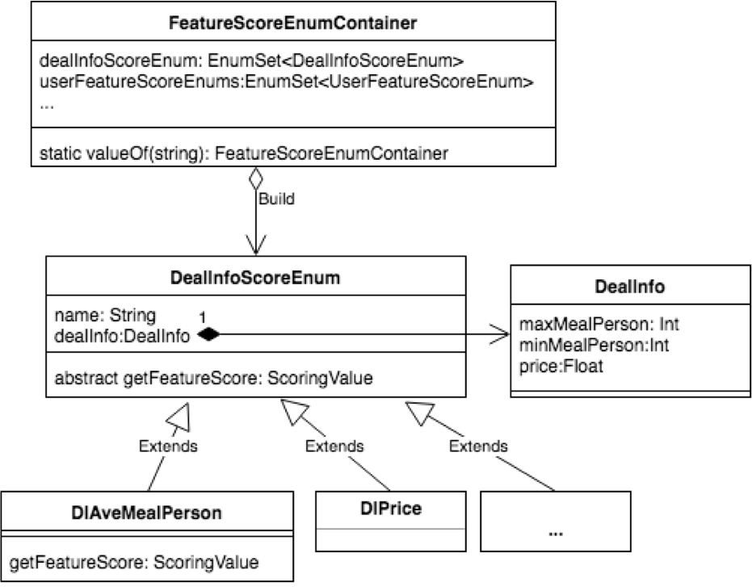

复杂系统设计需要充分的利用语言特性和设计模式。建议的优化点有三个：

  * 为每个原子特征定义一个ScoreEnum类会导致类数量暴增。优化方式是ScoreEnum基类定义为Enum类型，每个具体特征类为一个枚举值，枚举值继承并实现枚举类的方法。
  * FeatureScoreEnumContainer采用Build设计模式将一个算法模型的所需特征转换成ScoreEnum集合。
  * ScoreEnum从POJO类中读取具体特征值采用的是Command模式。

这里稍微介绍一下Command设计模式。Command模式的核心思想是需求方只要求拿到相关信息，不关心谁提供以及怎么提供。具体的提供方接受需求方的需求，负责将结果交给需求方。

在特征读取里面，需求方是模型，模型仅仅提供一个特征名（FeatureName），不关心怎么读取对应的特征值。具体的ScoreEnum类是具体的提供方，具体的ScoreEnum从POJO里面读取特定的特征值，并转换成ScoringValue交给模型。

##### 特征服务代理（Feature Proxy）

特征服务代理负责远程特征获取实施，具体的过程包括：

  * 每一大类特征或者一种特征服务有一个FeatureProxy，具体的FeatureProxy负责向特征服务发起请求并获取POJO类。
  * 所有的FeatureProxy注册到FeatureServiceContainer类。
  * 在具体的一次特征获取中，FeatureServiceContainer根据FeatureName的前缀负责将特征获取分配到不同的FeatureProxy类里面。
  * FeatureProxy根据指定的实体ID列表和特征名从特征服务中读取POJO列表。只有对应ID的指定特征名（keys）的特征值才会被赋值给POJO。这就最大限度地降低了网络读取的成本。

#### 预测管道（Prediction Pipeline）

预测管道包含：预测（Prediction）、级联模型（Cascade Model）、表达式（Expression）、特征转换（Transform）、计分（Scoring）和原子模型（Atomic Model）。

##### 预测（Prediction）

预测本质上是对模型的封装。它负责将每个列表实体的特征转化成模型需要的输入格式，让模型进行预测。

##### 级联模型（Cascade Model）

我们构建级联模型主要是基于两方面的观察：

  * 基于Facebook的《Practical Lessons from Predicting Clicks on Ads at Facebook》的Xgboost+LR以及最近很热门的Wide&Deep表明，对一些特征，特别是ID类特征通过树模型或者NN模型进行转化，把转化后的值做为特征值交给预测模型进行预测，往往会能实现更好的效果。
  * 有些训练目标是复合目标，每个子目标需要通过不同的模型进行预测。这些子目标之间通过一个简单的表达式计算出最终的预测结果。

举例如下图所示，我们自上而下进行讲解：

  * 该模型有UserId、CityId、UserFeature、POI等特征。
  * UserId和CityId特征分别通过GBDT和NN模型进行转换（Transform）。
  * 转换后的特征和UserFeature、POI等原始特征一起交给NN和LR模型进行算分（Scoring）。
  * 最终的预测分值通过表达式Prediction Score = α*NNScore + β*LRScore/(1+γ)来完成。表达式中的 α 、β和γ是事先设置好的值。

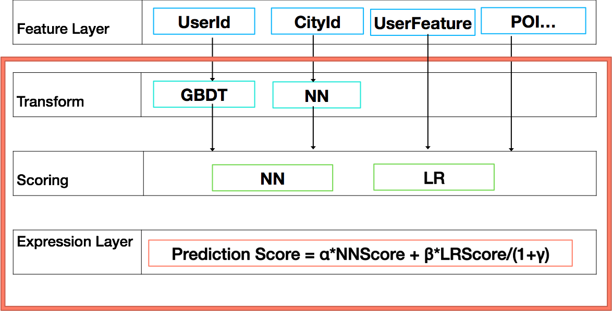

##### 原子模型（Atomic Model）

在这里原子模型指的是一种原子计算拓扑结构，比如线性模型、树模型和网络模型。

常用的模型像Logistic Regression和Linear Regression都是线性模型。GBDT、Random Forest都是树模型。MLP、CNN、RNN都是网络模型。

这里定义的原子模型主要的目的是为了工程实施的便利。一个模型被认定为原子模型有如下两个原因：

  * 该模型经常做为独立预测模型被使用。
  * 该模型有比较完整的实现代码。

### 总结

本文总结了作者在美团点评解决到店餐饮个性化信息展示的相关经验，从算法和架构两方面进行阐述。在算法部分，文章采用通俗的例子和类比方式进行讲解，希望非算法工程师能够理解关键的算法概念。架构部分比较详细地阐述了到店餐饮的排序架构。

根据我们所掌握的知识，特征治理和召回治理的思路是一种全新的视角，这对于架构排序系统设计有很大的帮助。这种思考方式同样也适用于其他领域模型的构建。与Google提供的经典Two-Phase Scheme架构相比，在线排序分层模型提供了更细颗粒度的抽象原型。该原型细致的阐述了包括分流、A/B测试、特征获取、特征算子、级联模型等一系列经典排序架构问题。同时该原型模型由于采用了分层和层内功能聚焦的思路，所以它比较完美地体现了DDD的三大设计原则，即领域聚焦、边界清晰、持续集成。

### 作者简介

  * 刘丁，目前负责到店餐饮算法策略方向，推进AI在到店餐饮各领域的应用。2014年加入美团，先后负责美团推荐系统、智能筛选系统架构、美团广告系统的架构和上线、完成美团广告运营平台的搭建。曾就职于Amazon、TripAdvisor等公司。

### 参考文章：

  * [1]Gamma E, Helm R, Johnson R, et al. Design Patterns-Elements of Reusable Object-Oriented Software. Machinery Industry, 2003
  * [2]Wikipedia,[Learning to rank](https://en.wikipedia.org/wiki/Learning_to_rank).
  * [3]Wikipedia,[Machine learning](https://en.wikipedia.org/wiki/Machine_learning).
  * [4]Wikipedia,[Precision and recall](https://en.wikipedia.org/wiki/Precision_and_recall).
  * [5]Wikipedia,[Discounted cumulative gain](https://en.wikipedia.org/wiki/Discounted_cumulative_gain).
  * [6]Wikipedia,[Domain-driven design](https://en.wikipedia.org/wiki/Domain-driven_design).
  * [7]Wikipedia,[Elasticsearch](https://en.wikipedia.org/wiki/Elasticsearch).
  * [8]Wikipedia,[k-d tree](https://en.wikipedia.org/wiki/K-d_tree).
  * [9]百度百科,[太阳历](https://baike.baidu.com/item/%E5%A4%AA%E9%98%B3%E5%8E%86/4857744?fr=aladdin).
  * [10]百度百科,[阴历](https://baike.baidu.com/item/%E9%98%B4%E5%8E%86/450297?fr=aladdin).
  * [11]Xinran H, Junfeng P, Ou J, et al. [Practical Lessons from Predicting Clicks on Ads at Facebook](http://quinonero.net/Publications/predicting-clicks-facebook.pdf)
  * [12]Olivier C, Donald M, Ya Z, Pierre G. [Expected Reciprocal Rank for Graded Relevance](http://olivier.chapelle.cc/pub/err.pdf)
  * [13]Heng-Tze C, Levent K, et al. [Wide & Deep Learning for Recommender Systems](https://arxiv.org/pdf/1606.07792.pdf)
