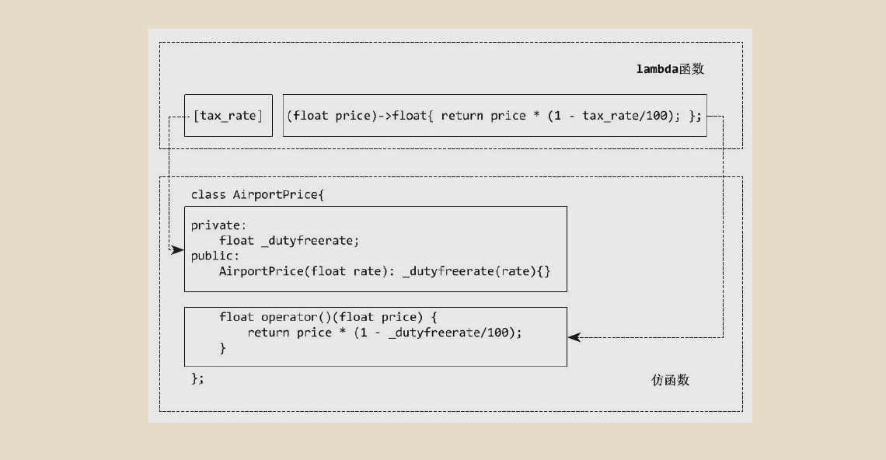
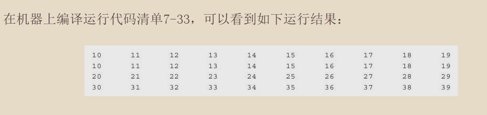

 
<!--BEGIN_DATA
{
    "create_date": "2020-06-09 14:29", 
    "modify_date": "2020-06-09 14:29", 
    "is_top": "0", 
    "summary": "深入理解C++11：C++11新特性解析与应用----为改变思考方式而改变", 
    "tags": "C/C++", 
    "file_name": "深入理解C++11：C++11新特性解析与应用----为改变思考方式而改变.md"
}
END_DATA-->

####<p>原文出处：<a href='https://www.jianshu.com/p/9f495044125c' target='blank'>深入理解C++11：C++11新特性解析与应用----为改变思考方式而改变</a></p>

在C++11中，我们还是会看到一些新元素。这些新鲜出炉的元素可能会带来一些习惯上的改变，不过权衡之下，可能这样的改变是值得的。

###指针空值 — nullptr

###指针空值：从0到NULL,再到nullptr

在良好的C++编程习惯中，声明一个变量的同时，总是需要记得在合适的代码位置将其初始化。对于指针类型的变量，这一点尤为注意。未初始化的悬挂指针通常会是一些难于调试的用户程序的错误根源。

典型的初始化指针是将其指向一个“空” 的位置，比如0。由于大多数计算机系统不允许用户程序写地址为0的内存空间，倘若程序无意中对该指针所指地址赋值，通常在运行时就会导致程序退出。虽然程序退出并非什么好事，但这样一来错误也容易被程序员找到。因此在大多数的代码中，我们常常能看见指针初始化的语法如下：`int* my_ptr=0`;,或者使用NULL：`int* my_ptr=NULL`;

一般情况下，NULL是一个宏定义。在传统的C头文件(stddef.h)里我们可以找到如下代码：

```
#undef NULL
#if defined(__cplusplus)
#define NULL 0
#else
#define NULL((void*)0)
#endif
```

可以看到，NULL可能被定义为字面常量0，或者是定义为无类型指针(void*) 常量。不过无论采用什么样的定义，我们在使用空值的指针时，都不可避免地会遇到一些麻烦。下面是一个关于函数重载的例子，这个例子我们引用自C++11标准关于nullptr的提案，并进行了少许修改。

    
    
    #include<stdio.h>
    void f(char*c){
         printf("invoke f(char*)\n");
    }
    void f(int i){
         printf("invoke f(int)\n");
    }
    int main(){
        f(0);
        f(NULL); //注意：如果gcc编译，NULL转化为内部标识__null, 该语句会编译失败
        f((char*)0);
    }
    

在当前的例子中，用户重载了f函数，并且试图使用f(NULL)来调用指针的版本。不过很可惜，当使用XLC编译器编译以上语句运行时，会得到以下的结构：

    
    invoke f(int)
    invoke f(int)
    invoke f(char*)
    

在这里，XLC编译器采用了stddef.h头文件中NULL的定义，即将NULL定义为0。因此使用NULL做参数调用和使用字面量0做参数调用版本的结果完全相同，都是调用到了f(int)这个版本。这实际与程序员编写代码的意图相悖。

引起该问题的元凶是字面常量0的二义性，在C++98标准中，字面常量0的类型既可以是一个整形，也可以是一个无类型指针`（void_)`。如果想调用`f(char_)`版本的话，则必须像随后的代码一样，对字面常量0进行强制类型转换((void*)0) 并调用，否则编译器总是会优先把0看作是一个整形常量。

为了避免用户使用上的错误，有的编译器做了比较激进的改进。典型的如g++编译器，它直接将NULL转换为编译器内部标识`（__null）`，并在编译时期做了一些分析，一旦遇到二义性就停止编译并向用户报告错误。虽然这在一定程度上缓解了二义性带来的麻烦，但由于标准并没有认定NULL为一个编译时期的标识，所以也会带来代码移植性的限制。  

（void*习惯被翻作无类型指针，而nullptr翻作指针空值）

C++11新标准中，nullptr是一个所谓 “指针空值类型”的常量。指针空值类型被命名为`nullptr_t`,事实上，我们可以在支持nullptr的头文件（cstddef）中找出如下定义：

    
    
       typedef decltype(nullptr) nullptr_t
    

相比于gcc等编译器将NULL预处理为编译器内部标识`__null`, nullptr拥有更大的优势。简单而言，由于nullptr是有类型的，且仅可以被隐式转化
为指针类型，nullptr做参数则可以成功调用f(char*)版本的函数，而不是像gcc对NULL的处理一样，仅仅给出了一出错提示，好让程序员去修改代码。

    
    
    #include <iostream>
    using namespace std;
    void f(char*p){
         cout<<"invoke f(char*)"<<endl;
    }
    void f(int){
         cout<<"invoke f(int)"<<endl;
    }
    int main(){
        f(nullptr); //调用f(char*)版本
        f(0); //调用f(int)版本
        return 0;
    }
    

因此，通常情况下，在书写C++11代码想使用NULL的时候，将NULL替换成为nullptr我们就能获得更加健壮的代码。

#####nullptr和`nullptr_t`

    
    
             -----------------  (这个地方，让我想起了常量类型和常量值)  --------------------
    

C++11标准不仅定义了指针空值常量nullptr,也定义了其指针空值类型`nullptr_t`，也就表示了指针空值类型并非仅有nullptr一个实例。通常情况下，也可以通过`nullptr_t`来声明一个指针空值类型的变量（即使看起来用途不大）。

除去nullptr及`nullptr_t`以外，C++中还存在各种内置类型。C++11标准严格规定了数据间的关系。大体上常见的规则简单地列在了下面：

  * 所有定义为`nullptr_t`类型的数据都是等价的，行为也是完全一致。
  * `nullptr_t` 类型数据可以隐式转换为任意一个指针类型。
  * `nullptr_t` 类型数据不能转换为非指针类型，即使使用reinterpret_cast<`nullptr_t`>() 的方式也是不可以的。
  * `nullptr_t` 类型数据不适用于算术运算表达式。（因为`nullptr_t`数据类型无法，或者不能转换为整型）
  * `nullptr_t` 类型数据可以用于关系运算表达式，但仅能与`nullptr_t`类型数据或者指针类型数据进行比较，当且仅当关系运算符==、<=、>=等时返回true。

下面这个例子集合了大多数我们需要的场景：

    
    
    #include <iostream>
    #include <typeinfo>
    using namespace std;
    int main(){
        // nullptr 可以隐式转换为char*
        char* cp=nullptr;
        // 不可转换为整型，而任何类型也不能转换为nullptr_t,以下代码不能通过编译。
        // int n1=nullptr;
        // int n2=reinterpret_cast<int>(nullptr); //强制类型转换
        // nullptr与nullptr_t类型变量可以作比较，当使用==、<=、>=符号比较时返回true
        nullptr_t nptr;
        if(nptr==nullptr)
          cout<<"nullptr_t nptr==nullptr"<<endl; //通过
        else
          cout<<"nullptr_t nptr!=nullptr"<<endl;
        if(nptr<nullptr)
          cout<<"nullptr_t nptr<nullptr"<<endl;  
        else
          cout<<"nullptr_t nptr!<nullptr"<<endl; //通过
        //不能转换为整型或bool类型，以下代码不能通过编译
        //if(0==nullptr);
        //if(nullptr);
        //不可以进行算术运算，以下代码不能通过编译
        //nullptr+=1;
        //nullptr*5;
        //以下操作均可以正常进行
        sizeof(nullptr);
        typeid(nullptr);
        throw(nullptr);
        return 0;
    }
    

返回结果：

    
    
    nullptr_t nptr == nullptr
    nullptr_t nptr !< nullptr
    terminate called after throwing an instance of 'decltype(nullptr)'
    Aborted
    

注意 如果读者的编译器能够编译if(nullptr) 或者 if(nullptr==0)这样的语句，可能是因为编译器版本还不够新。  
老的nullptr定义中允许nullptr向bool的隐式转换，但是C++11标准中已经不允许这么做了。

此外，虽然`nullptr_t`看起来像是个指针类型，用起来更是，但在把`nullptr_t`应用于模板中时候，我们会发现模板却只能把它作为一个普通的类型来进行推导（并不会将其视为T*指针）。

    
    
    #include <iostream>
    using namespace std;
    template<typename T>void g(T*t){}
    template<typename T>void h(T t){}
    int main(){
        g(nullptr); //编译失败，nullptr的类型是nullptr_t,而不是指针
        g((float*) nullptr); //推导出T=float
        h(0); //推导出T=int
        h(nullptr); //推导出T=nullptr_t
        h((float*) nullptr); //推导出T=float*
    }
    //编译选项：g++7-1-4.cpp-std=c++11
    

g(nullptr)并不会被编译器“智能”地推导成某种基本类型的指针（或者void*指针），因此要让编译器成功推导出nullptr的类型，必须做显式的类型转
换。

#####一些关于nullptr规则的讨论

用nullptr而不是重用NULL的原因却是非常明显的。因为NULL已经是一个用途广泛的宏，且这个宏被不同的编译器实现为不同的解释，重用NULL会使得很多已有的C++程序不能通过C++11编译器的编译。因此为了保证最大的兼容性，才使用了新的名称nullptr，以避免和现有标识符的冲突。

另外，nullptr类型数据所占用的内存空间大小跟void*相同的，即：`c++ sizeof(nullptr_t) == sizeof(void*)`

nullptr是一个编译时期的常量，它的名字是一个编译时期的关键字，能够为编译器所识别。而(void_)0只是一个强制转换表达式，其返回的也是一个void_指针类型。

最为重要的是，在C++语言中，nullptr到任何指针的转换时隐式的，而(void*)0则必须经过类型转换后才能使用。  
如下代码：

    
    
    int foo(){
        int* px=(void*)0; //编译错误，不能隐式地将无类型指针转换为int*类型的指针
        int* py=nullptr;
    }
    

在nullptr出现后，程序员大可以忘记(void*)0，因为nullptr已经足够用了，而且也很好用。

注意：C语言标准中的void*指针是可以隐式转换为任意指针的，这一点跟C++是不同的。

C++11标准有一条有趣的规定，`nullptr_t`对象的地址可以被用户使用。例外就是，虽然nullptr也是一个`nullptr_t`的对象，C++11标准却规定用户不能获得nullptr的地址。其原因主要是因为nullptr被定义为一个右值常量，取其地址并没有意义。

但是C++11标准并没有禁止声明一个nullptr的右值引用，并打印其地址。

    
    
    #include <cstdio>
    #include <cstddef>
    using namespace std;
    int main(){
        nullptr_t my_null;
        printf("%x\n", &my_null);
        //printf("%x", &nullptr);  //根据C++11的标准设定，本句无法编译通过，因为nullptr被定义为一个右值常量。
        //取其地址并没有意义
        printf("%d\n", my_null==nullptr);
        const nullptr_t && default_nullptr=nullptr;   
        //default_nullptr是nullptr的一个右值引用，但是具体代码的作用的含义还不是很清楚。
        printf("%x\n", &default_nullptr);
    }
    //编译选项：g++ -std=c++11 7-1-6.cpp
    

运行结果跟所用编译器以及平台都有关系。不过，对于普通用户而言，需要记得的仅仅是，不要对nullptr做取地址操作即可。

    
    
    7498fca8
    1
    7498fcb0
    

####默认函数的控制

#####类与默认函数

    
    
    在C++中声明自定义的类，编译器会默认帮助程序员生成一些他们未自定义的成员函数。这样的函数版本被称为“默认函数”。这包含了以下一些自定义类型的成员函数：
    A：构造函数
    B：拷贝构造函数
    C：拷贝赋值函数 （operator=）
    D：移动构造函数
    E：移动拷贝函数
    F：析构函数
    此外，C++编译器还会为以下这些自定义类型提供全局默认操作符函数:
    A：operator ,
    B：operator &
    C：operator &&
    D：operator *
    E：operator ->
    F：operator ->*
    G：operator new
    H：operator delete
    在C++语言规则中，一旦程序员实现了这些函数的自定义版本，则编译器不会再为该类自动生成默认版本。有时，这样的规则会被程序员忘记，最常见的是声明了带参数的构造版本，则必须声明不带参数的版本以完成无参的变量初始化。但是，比较严重的问题是，一旦声明了自定义版本的构造函数，则有可能导致我们定义的类型不再是POD的。代码清单如下所示：
    

问题：什么是POD类型？

    
    
    #include <type_traits>
    #include <iostream>
    using namespace std;
    class TwoCstor{
          public:
             //提供了带参数版本的构造函数，则必须自行提供
             //不带参数版本，且TwoCstor不再是POD类型
          TwoCstor(){};
          TwoCstor(int i): data(i){}
          private:
             int data;
    };
    int main(){
        cout<< is_pod<TwoCstor>:: value <<endl;  //is_pod<TwoCstor>:: value 0
    }
    

程序员虽然提供了TwoCstor() 构造函数，它与默认的构造函数接口和使用方式也完全一致，但根据对"平凡的构造函数"的定义，该构造函数却不是平凡的，因此TwoCstor也就不再是POD的了。对于形如TwoCstor这样只是想增加一些构造方式的简单类型而言，变为非POD类型带来一系列负面影响有时是程序员所不希望的（这意味着编译器失去了优化这样简单的数据类型的可能）。因此客观上我们需要一些方式来使得这样的简单类型“恢复”POD的特质。

在C++11中，标准是通过提供了新的机制来控制默认版本函数的生成来完成这个目标的。这个新机制重用了default关键字。程序员可以在默认函数定义或者声明时加上“=default”，从而显式地指出编译器生成该函数的默认版本。而如果指定产生默认版本后，程序员不再也不应该实现一份同名的函数。

    
    
    #include <type_traits>
    #include <iostream>
    using namaspace std;
    class TwoCstor{
          public:
            //提供了带参数版本的构造函数，再指示编译器
            //提供默认版本，则本自定义类型依然是POD类型
          TwoCstor() =default;
          TwoCstor(int i): data(i){}
          private:
            int data;
    };
    int main(){
        cout<< is_pod<TwoCstor>:: value<<endl; //1
    }
    

另一方面，程序员在一些情况下则希望能够限制一些默认函数的生成。最典型地，类的编写者有时需要禁止使用者使用拷贝构造函数，在C++98标准中，我们的做法是将拷贝构造函数声明为private的成员，并且不提供函数实现。这样一来，一旦有人试图（或者无意识）使用拷贝构造函数，编译器就会报错。

    
    
    #include <type_traits>
    #include <iostream>
    using namespace std;
    class NoCopyCstor{
    public:
       NoCopyCstor() =default;
    private:
       //将拷贝构造函数声明为private成员并不提供实现
       //可以有效组织用户错用拷贝构造函数
       NoCopyCstor(const NoCopyCstor&);
    };
    int main(){
        NoCopyCstor a;
        NoCopyCstor b(a); //无法通过编译
    }
    

这种方法会对友元类或函数使用造成麻烦。友元类很可能需要拷贝构造函数，而简单声明private的拷贝构造函数不实现的话，会导致编译的失败。为了避免这种情况，我们还必须提供拷贝构造函数的实现版本，并将其声明为private成员，才能达到需要的效果。

在C++11中，标准则给出了更为简单地方法，即在函数的定义或者声明加上“=delete”。“=delete” 会指示编译器不生成函数的缺省版本。代码如下：

    
    
    #include <type_traits>
    #include <iostream>
    using namespace std;
    class NoCopyCstor{
    public:
       NoCopyCstor() =default;
       //使用 "=delete" 同样可以有效阻止用户，错用拷贝构造函数
       NoCopyCstor(const NoCopyCstor&) =delete;
    };
    int main(){
        NoCopyCstor a;
        NoCopyCstor b(a); //无法通过编译
    }
    

代码中使用 “=delete”删除拷贝构造函数的缺省版本的实例。值得注意的是，一旦缺省版本被删除了，重载该函数也是非法的。（这个拷贝构造函数的缺省版本是什么？）

#####“=default” 与 “=deleted”

C++11标准称“=default” 修饰的函数为显式缺省（explicit defaulted）函数，而称 “=delete” 修饰的函数为显式删除函数。

C++11引用显式缺省和显式删除是为了增强对类默认函数的控制，让程序员能够更加精细地控制默认版本的函数。事实上，显式缺省不仅可以用于在类的定义中修饰成员函数，也可以在类定义之外修饰成员函数。

    
    
    class DefaultedOptr{
       public:
       //使用"=default"来产生缺省版本
       DefaultedOptr() =default;
       //这里没使用"=default"
       DefaultedOptr& operator=(const DefaultedOptr&);
    };
    //在类定义外用"=default"来指明使用缺省版本
    inline DefaultedOptr& DefaultedOptr:: operator=(const DefaultedOptr&) =default;
    

在本例中，类DefaultedOptr的操作符operator=被声明在了类的定义外，并且被设定为缺省版本。这在C++11规则中也是被允许的。在类定义外显式指定缺省版本所带来的好处是，程序员可以对一个class定义多个实现版本。假设我们有下面的几个文件：

    
    
    type.h:struct type{type();};
    type1.cc:type:: type() =default;
    type2.cc:type:: type(){/*do some thing*/};
    

那么程序员就可以选择地编译type1.cc或者type2.cc,从而轻易地在提供缺省函数的版本和使用自定义版本的函数间进行切换。这对于一些代码的调试时很有帮助的。

此外，除去之前提到的多个可以由编译器默认提供的缺省函数，显式缺省还可以修饰一些其他函数，比如 “operator==”. 
C++11标准并不要求编译器为这些函数提供缺省的实现，但如果将其声明为显式缺省的话，则编译器会按照某些 “标准行为” 为其生成所需要的版本。

显式删除也并非局限于成员函数，使用显式删除还可以避免编译器做一些不必要的隐式数据类型转换。

    
    
    class ConvType{
       public:
          ConvType(int i){};
          ConvType(char c) =delete; //删除char版本
    }；
    void Func(ConvType ct){}
    int main(){
        Func(3);
        Func('a'); //无法通过编译
        ConvType ci(3);
        ConvType cc('a'); //无法通过编译
    }
    //编译选项：g++ -std=c++11 7-2-6.cpp
    

上面的代码中，我们显式删除了ConvType(char)版本的构造函数。则在调用Func('a')及构造变量cc的时候，编译器会给出错误提示并停止编译。这是因为编译器发现从char构造ConvType的方式是不被允许的。不过如果读者将ConvType(char c)=delete; 这一句注释掉，代码就可以通过编译了。这种情况下，编译器会隐式地将a转换为整型，并调用整型版本的构造函数。这样一来，我们就可以对一些危险的、不应该发生的隐式类型转换进行适当的控制。

另外就是explicit关键字在这里可能产生的影响。代码如下：

    
    
    class ConvType{
       public:
          ConvType(int i){};
          explicit ConvType(char c) =delete; //删除explicit的char构造函数
    }；
    void Func(ConvType ct){}
    int main(){
        Func(3);
        Func('a'); //可以通过编译
        ConvType ci(3);
        ConvType cc('a'); //无法通过编译
    }
    

代码中，语句explicit ConvType(char)=delete将从char explicit构造ConvType的方式显式删除了，这导致cc变量的构造不成功，因为其是显式构造的。不过在函数Func的调用中，编译器会尝试隐式地将c转换成int, 从而Func('a')的调用会导致一次ConvType(int)构造，因而能够通过编译。这
样一来，explicit带来了令人尴尬的效果，即没有彻底地禁止类型转换的发生。

还有一点，对于使用显式删除来禁止编译器做一些不必要的类型转换上，我们并不局限于缺省版本的类成员函数或者全局函数上，对于一些普通的函数，我们依然可以通过显式删除来禁止类型转换：

    
    
    void Func(int i){};
    void Func(char c)=delete;//显式删除char版本
    int main(){
        Func(3);
        Func('c'); //本句无法通过编译
        return 1;
    }
    

显式删除还有一些有趣的使用方法。比如程序员使用显式删除来删除自定义类型的operator new操作符的话，就可以做到避免在堆上分配该class的对象。下面代码如下：

    
    
    #include <cstddef>
    class NoHeapAlloc{
          public:
             void* operator new(std:: size_t) =delete;
    };
    int main(){
        NoHeapAlloc nha;
        NoHeapAlloc *pnha =new NoHeapAlloc;//编译失败
        return 1;
    }
    

还有一些情况下，需要对象在指定内存位置进行内存分配，并且不需要析构函数来完成一些对象级别的清理。这个时候，我们可以通过显式删除析构函数来限制自定义类型在栈上或者静态的构造。

    
    
    #include <cstddef>
    #include <new>
    extern void*p;
    class NoStackAlloc{
       public:
          ~NoStackAlloc() =delete;
    };
    int main(){
        NoStackAlloc nsa; //无法通过编译
        new(p) NoStackAlloc(); //placement new,假设p无需调用析构函数
        return 1;
    }
    

由于placement new构造的对象，编译器不会为其调用析构函数，因此析构函数被删除的类能够正常地构造。事实上，读者可以推而广之，将显式删除析构函数用于构建单件模式（Singleton）。

#####lambda 函数

在数理逻辑或计算机科学领域中，lambda则是被用来表示一种匿名函数，这种匿名函数代表了一种所谓的λ演算。  
从软件开发的角度看，以lambda概念为基础的 "函数式编程" 是与命令式编程、面向对象编程等并列的一种编程范型。现在的高级语言也越来越多地引入了多范型支持，很多近年流行的语言都提供了lambda的支持，比如C#、PHP、JavaScript等。而现在C++11也开始支持lambda,并可能在标准演进过程中不停地进行修正。这样一来，从最早基于命令式编程范型的语言C，到加入了面向对象编程范型血统的C++,再到融入函数式编程范型的lambda的新语言规范C++11，C/C++的发展也在融入多范型支持的潮流中。

    
    
    int main(){
        int girls=3,boys=4;
        auto totalChild=[](int x,int y) ->int{return x+y;};
        return totalChild(girls,boys);
    }
    

lambda函数跟普通函数相比不需要定义函数名，取而代之的多了一对方括号（[]）。此外，lambda函数还采用了追踪返回类型的方式声明其返回值。其余方面看起来则跟普通函数定义一样。

通常情况下，lambda函数的语法定义如下：  

`[capture](parameters)mutable->return -type{statement}`  

其中  

A [capture]: 捕捉列表。捕捉列表总是出现在lambda函数的开始处。事实上，[]是lambda引出符。编译器根据该引出符判断接下来的代码是否是lambda函数。捕捉列表能够捕捉上下文中的变量以供lambda函数用。

B (parameters): 参数列表。与普通函数的参数列表一致。如果不需要参数传递，则可以连同括号()一起省略。  

C mutable: mutable修饰符。默认情况下，lambda函数总是一个const函数，mutable可以取消其常量性。在使用该修饰符时，参数列表不可省略（即使参数为空）。

D ->return -type: 返回类型。用追踪返回类型形式声明函数的返回类型。出于方便，不需要返回值的时候也可以连同符号->一起省略。此外，在返回类型明确的情况下，也可以省略该部分，让编译器对返回类型进行推导。

E {statement}: 函数体。内容与普通函数一样，不过除了可以使用参数之外，还可以使用所有捕获的变量。

    
    
    在lambda函数的定义中，参数列表和返还类型都是可选的部分，而捕捉列表和函数体都可能为空。那么在极端的情况下，C++11中最为简略的lambda函数只需要声明为 ```c++ []{};  ``` 就可以了。
    

下面列出了各种各样的lambda函数。

    
    
    int main(){
        []{}; //最简lambda函数
        int a=3;
        int b=4;
        [=]{return a+b;};  //省略了参数列表和返回类型，返回类型由编译器推断为int
        auto fun1=[&](int c){b=a+c;};  //省略了返回类型，无返回值
        auto fun2=[=,&b](int c)->int{return b+=a+c;};  //各部分都很完整的lambda函数
    }
    

直观地讲，lambda函数与普通函数可见的最大区别之一，就是lambda函数可以通过捕捉列表访问一些上下文中的数据。具体地，捕捉列表描述了上下文中哪些的数据可以被lambda使用，以及使用方式（以值传递的方式或引用传递的方式）。在下面的例子中，我们是使用参数的方式传递变量，现在让我们使用捕捉列表来改写这个例子，代码如下所示：

    
    
    int main(){
        int boys=4,int girls=3;
        auto totalChild=[girls,&boys]() ->int{return girls+boys;};
        return totalChild();
    }
    

我们使用了捕捉列表捕捉上下文中的变量girls、boys。函数的原型发生了变化，即totalChild不再需要传递参数。此时，girls和boys可以视为lambda函数的一种初始状态，lambda函数的运算则是基于初始状态进行的运算。这与函数简单基于参数的运算时有所不同的。

语法上，捕捉列表由多个捕捉项组成，并以逗号分割。捕捉列表有如下几种形式：

    A [var] 表示值传递方式捕捉变量var.  
    B [=] 表示值传递方式捕捉所有父作用域的变量（包括this）.  
    C [&var] 表示引用传递捕捉变量var.  
    D [&] 表示引用传递捕捉所有父作用域的变量（包括this）.  
    E [this] 表示值传递方式捕捉当前的this指针.

注意 父作用域： enclosing scope, 这里指的是包含lambda函数的语句块，在上一个代码中，即main函数的作用域。

通过一些组合，捕捉列表可以表示更复杂的意思。

    A [=,&a,&b]表示以引用传递的方式捕捉变量a 和 b，值传递方式捕捉其他所有变量。  
    B [&,a,this]表示以值传递的方式捕捉变量a 和 this, 引用传递方式捕捉其他所有变量。  

不过值得注意的是，捕捉列表不允许变量重复传递。下面一些例子就是典型的重复，会导致编译时期的错误。

  * [=,a]这里=已经以值传递方式捕捉了所有变量，捕捉a重复。

  * [&,&this]这里&已经以引用传递方式捕捉了所有变量，再捕捉this也是一种重复。

利用上面的规则，对于代码中的lambda函数，可以通过[=]来声明捕捉列表，进而对totalChild书写上的进一步简化：

    
    
    int main(){
        int boys=4,girls=3;
        auto totalChild=[=]() ->int{return girls+boys;}; //捕捉所有父作用域的变量
        return totalChild();
    }
    

通过捕捉列表[=], lambda函数的父作用域中所有自动变量都被lambda依照传值的方式捕捉了。  
必须指出的是，依照现行C++11标准，在块作用域（block scope, 可以简单理解为在{} 之内的任何代码都是块作用域的）以外的lambda函数捕捉列表必须为空。因此这样的lambda函数除去语法上的不同以外，跟普通函数区别不大。而在块作用域中的lambda函数仅能捕捉父作用域中的自动变量，捕捉任何非此作用域或者是非自动变量（如静态变量等）都会导致编译器报错。

#####lambda与仿函数
   
>好的编程语言一般都有好的库支持。C++语言在标准程序库STL中向用户提供了一些基本的数据结构及一些基本的算法等。在C++11之前，我们在使用STL算法时，通常会使用到一种特殊的对象，一般来说，我们称之为函数对象，或者仿函数(functor). 仿函数简单地说，就是重定义了成员函数operator() 的一种自定义类型对象。这样的对象有个特点，就是其使用在代码层面感觉跟函数的使用并无二样，但究其本质并非函数。下面是一个仿函数的例子:
    
    
    
    class_functor{
       public:
          int operator() (int x,int y){return x+y;}
    };
    int main(){
        int girls=3,boys=4;
        _functor totalChild;
        return totalChild(5,6);
    }
    //编译选项:g++7-3-5.cpp-std=c++11
    

这里，`class_functor`的operator()被重载，因此，在调用该函数的时候，我们看到跟函数调用一样的形式，只不过这里的totalChild不是函数名称，而是对象名称。

相比于函数，仿函数可以拥有初始状态，一般通过class定义私有成员，并在声明对象的时候对其进行初始化。私有成员的状态就成了仿函数的初始状态。而由于声明了一个仿函数对象可以拥有多个不同初始状态的实例，因此可以借由仿函数产生多个功能类似却不同的仿函数实例（这里是一个多状态的仿函数的实例）。

    
    
    #include <iostream>
    using namespace std;

    class Tax{
      private:
         float rate;
         int base;
      public:
         Tax(float r,int b):rate(r),base(b){}
         float operator()(float money){return(monry-base)*rate;}
    };

    int main(){
        Tax high(0.40,30000);
        Tax middle(0.25,20000);
        cout<<"tax over 3w:"<<high(37500)<<endl;
        cout<<"tax over 2w:"<<middle(27500)<<endl;
        return 0;
    }
    

可以发现上面代码中带状态的仿函数，和lambda函数的定义看起非常类似。下面的例子：

    
    
    class AirportPrice{
        private:
          float _dutyfreerate;
        public:
          AirportPrice(float rate): _dutyfreerate(rate){} //带形参的构造函数
          float operator()(float price){
              return price*(1-_dutyfreerate/100);
          }
    }；

    int main(){
        float tax_rate=5.5f;
        AirportPrice Changi(tax_rate);  //这个地方用的是仿函数方式
        auto Changi2=[tax_rate](float price)->float{return price*(1-tax_tate/100);};   
           //这个地方用的是lambda方式，在现阶段，通常编译器都会把lambda函数转化为成为一个仿函数对象。
        float purchased=Changi(3699);
        float purchased2=Changi2(2899);
    }
    

该代码是一个机场返税的例子。该例中，分别使用了仿函数和lambda两种方式来完成扣税后的产品价格计算。在这里，lambda函数捕捉了·tax_rate·变量，而仿函数则以·tax_rate·初始化类。其他的，如在参数传递上，两者保持一致。除去在语法层面上的不同，lambda和仿函数却有着相同的内涵--都可以捕捉一些变量作为初始状态，并接受参数进行运算。

而事实上，仿函数是编译器实现lambda的一种方式。在现阶段，通常编译器都会把lambda函数转化成为一个仿函数对象。因此，在C++11中，lambda可以
视为仿函数的一种等价形式。  

下图展示了，如何将lambda函数和仿函数进行等价的：



  

有的时候，我们在编译时发现lambda函数出现了错误，编译器会提示一些构造函数等相关信息。显然是由于lambda的这种实现方式造成的。  
同样的，在C++11中，lambda也在标准库中被广泛地使用。因为书写简单，通常可以就地定义，因此用户常可以使用lambda代替仿函数来书写代码。

#####lambda的基础使用

用得上lambda函数的地方比较特殊，最为简单的应用下，我们会利用lambda函数来封装一些代码逻辑，使其不仅具有函数的包装性，也具有就地可见的自说明性。

    
    
    extern int z;
    extern float c;

    void Calc(int&,int,float&,float);
    
    void TestCalc(){
         int x,y=3;
         float a,b=4.0;
         int success=0;

         auto validate=[&]() ->bool{  //引用传递获取所有的变量
              if((x==y+z)&&(a==b+c)) return 1;
              else return 0;
         };

         Calc(x,y,a,b);
         success+=validate();

         y=1024;
         b=le13;
         Calc(x,y,a,b);
         success+=validate();
    }
    //编译选项：g++ -c-std=c++11
    

在上面的例子中，用户试图用自己写的函数TestCalc进行测试。这里用一个auto关键字推导出了validate变量的类型为匿名lambda函数。可以看到，我们使用lambda函数直接访问了TestCal中的局部的变量来完成这个工作。

在没有lambda函数之前，通常需要在TestCalc外声明同样一个函数，并且把TestCalc中的变量当作参数进行传递。出于函数作用域及运行效率考虑，这样声明的函数通常还需要加上关键字static和inline。相比于一个传统意义上的函数定义，lambda函数在这里更加直观，使用起来也非常简便，代码可读性很好，效果上，lambda函数则等同于一个“局部函数”。

C/C++语言标准中不允许局部函数存在，（局部函数，即在函数作用域中定义的函数），也称为内嵌函数。局部函数通常仅属于其父作用域，能够访问父作用域的变量，且在其父作用域中使用。C++11标准却用比较优雅的方式打破了这个规则。事实上，lambda可以像局部函数一样使用。

相比于在函数外定义的static inline函数，或者是自定义的宏，本例中lambda函数并没有实际运行时的性能优势（lambda函数在C++11标准中默认是内联的）。

对于运算比较复杂的函数，通常函数中会有大量的局部状态（变量），这个时候如果程序员只是需要一些 “局部” 的功能--比如打印一些内部状态，或者做一些固定的操作，这些功能往往不能与其他任何的代码共享，却要在一个函数中多次重用。那么使用lambda的捕捉列表功能则相较于独立的全局静态函数或私有成员函数方便很多。lambda本身就是匿名的函数。因此，对于复杂代码的快速开发而言，lambda的出现意义重大。事实上，这些也是局部函数的好处。

在编写程序的时候，程序员通常会发现自己需要一些 “常量”，不过这些常量的值却由自己初始化状态决定的。

    
    
    int Prioritize(int);
    int AllWorks(int times){
        int i;
        int x;
        try{
           for(i=0;i<times;i++) x+=Prioritize(i);
        }
        catch(...){
           x=0;
        }
        const int y=[=]{ //这个地方是取值，而不是取引用
            int i,val;
            try{
              for(i=0;i<times;i++)
                 val+=Prioritize(i);
            }
            catch(...){
              val=0;
            }
            return val;
        }();
    }
    

x (或y)的初始化需要循环调用函数Prioritize, 并且在Prioritize抛出异常的时候对x（或y）赋默认值0.  
在不使用函数的情况下，由于初始化要在运行时修改x的值，因此，虽然x在初始化之后对于程序而言是个常量，却不能被声明为const. 
而在定义y的时候，由于我们就地定义lambda函数并且调用，y仅需使用其返回值，于是常量性得到了保证。

（这个部分其实，并没有看懂，因为定义lambda函数的这个部分的函数体的作用，我并不是非常清楚）

#####关于lambda的一些问题及有趣的实验

使用lambda函数的时候，捕捉列表不同会导致不同的结果。具体地讲，按值方式传递捕捉列表和按引用方式传递捕捉列表效果是不一样的。对于按值方式传递的捕捉列表，其传递的值在lambda函数定义的时候就已经决定了。而按引用传递的捕捉列表变量，其传递的值则等于lambda函数调用时的值。

    
    
    #include<iostream>
    using namespace std;
    int main(){
        int j=12;
        auto by_val_lambda=[=]{return j+1;};
        auto by_ref_lambda=[&]{return j+1;};
        cout<<"by_val_lambda:"<<by_val_lambda() <<endl;
        cout<<"by_val_lambda:"<<by_val_lambda() <<endl;
        j++;
        cout<<"by_val_lambda:"<<by_val_lambda() <<endl;
        cout<<"by_val_lambda:"<<by_val_lambda() <<endl;
    }
    

完成编译运行后，我们可以看到运行结果如下：

    
    
    by_val_lambda:13
    by_ref_lambda:!3
    by_val_lambda:13
    by_ref_lambda:14
    

第一次调用`by_val_lambda`和`by_ref_lambd`a时，其运算结果并没有不同。两者均计算的是12+1=13.但在第二次调用`by_val_lambda`的时候，其计算的是12+1=13,相对地，第二次调用by_ref_lambda时计算的是13+1=14. 这个结果的原因是由于在`by_val_lambda`中，j被是视为了一个常量，一旦初始化后不会再改变（可以认为之后只是一个跟父作用域中j同名的常量）而在`by_ref_lambda`中，仍在使用父作用域中的值。

因此简单地总结的话，在使用lambda函数的时候，如果需要捕捉的值成为lambda函数的常量，我们通常会使用按值传递的方式捕捉；反之，需要捕捉的值成为lambda函数运行的变量（类似于参数的效果），则应该采用按引用方式进行捕捉。

关于lambda函数的类型以及该类型跟函数指针之间的关系，之前的例子，大多数情况下把匿名的lambda函数赋值给了一个auto类型的变量，这是一种声明和使用lambda函数的方法。事实上，lambda的类型并非简单的函数指针类型或者自定义类型。

从C++11标准的定义上可以发现，lambda的类型被定义为“闭包”的类，而每个lambda表达式则会产生一个闭包类型的临时对象（右值）。因此，严格地讲，lambda函数并非函数指针。不过C++11标准却允许lambda表达是向函数指针的转换，但前提是lambda函数没有捕捉任何变量，且函数指针所示的函数原型，必须跟lambda函数有着相同的调用方式。我们可以通过代码来说明：

    
    
    int main(){
        int girls=3,boys=4;
        auto totalChild=[](int x,int y)->int{return x+y;};
        typedef int(*allChild) (int x,int y);
        typedef int(*oneChild) (int x);
        allChild p;
        p=totalChild;
        oneChild q;
        q=totalChild;//编译失败，参数必须一致
        decltype(totalChild) allPeople=totalChild;//需通过decltype获得lambda的类型
        decltype(totalChild) totalPeople=p;//编译失败，指针无法转换为lambda
        return 0;
    }
    

在例子中，我们把没有捕捉列表的totalChild转化为接受参数类型相同的allChild类型的函数指针。不过，转化为参数类型不一致的oneChild类型则会失败。此外，将函数指针转化为lambda也是不成功的（虽然似乎C++11标准并没有明确禁止这一点）

值得注意的是，程序员也可以通过decltype的方式来获得lambda函数的类型。方式就像上面用来声明allPeople一样，虽然使用decltype来获得lambda函数类型的做法不是很常见，但在实例化一些模板的时候使用该方法会较为有用。

下面代码就是关于lambda函数的常量性及mutable关键字相关的代码。

    
    
    int main(){
        int val;
        auto const_val_lambda=[=](){val=3;}; //编译失败，在const的lambda中修改常量
        auto mutable_val_lambda=[=]() mutable{val=3;}; //非const的lambda,可以修改常量数据
        auto const_ref_lambda=[&]{val=3;}; //依然是const的lambda,不过没有改动引用本身
        auto const_param_lambda=[&](int v){v=3;}; //依然是const的lambda,通过参数传递val
        const_param_lambda(val);
        return 0;
    

在上述例子中，我们定义了4种不同的lambda函数，这4种lambda函数本身的行为是一致的，即修改父作用域中传递而来的val参数的值。不过对于`const_val_lambda`函数而言，编译器认为这是一个错误：

    
    
    In lambda function: error:assignment of read-only variable'val' //给只读变量'val'进行赋值
    

对于声明了mutable属性的`mutable_val_lambda`函数，以及通过引用传递变量val的`const_ref_lambda`函数，甚至是通过参数来传递变量val的`const_param_lambda`, 编译器均不会报错。

C++11中，默认情况下lambda函数是一个const函数。按照规则，一个const的成员函数是不能在函数体中改变非静态成员变量的值的。但这里明显，编译器对不同传参或捕捉列表的lambda函数执行了不同的规则有着不同的见解。

下面代码，将lambda函数转化为一个完整的仿函数，需要注意的是，lambda函数的函数体部分，被转化为仿函数之后会成为一个class的常量成员函数。整个`const_val_lambda`看起来会是如下代码：

    
    
    class const_val_lambda{
         public:
            const_val_lambda(int v): val(v){}
         public:
            void operator()()  const{val=3;} /*注意：常量成员函数*/
         private:
            int val;
    };
    

对于常量成员函数，其常量的规则跟普通的常量函数是不同的。具体而言，对于常量成员函数，不能在函数体内改变class中任何成员变量。

lambda的捕捉列表中的变量都会成为等价仿函数的成员变量（如`const_val_lambda`中的成员val）, 而常量成员函数（如operator())中改变其值是不允许的，因而按值捕捉的变量在没有声明为mutable的lambda函数中，其值一旦被修改就会导致编译器报错。

而使用引用的方式传递的变量在常量成员函数中值被更改则不会导致错误。简单地说，由于函数`const_ref_lambda`不会改变引用本身，而只会改变引用的值，因此编译器将编译通过。至于按传递参数的`const_param_lambda`，就更加不会引起编译器的“抱怨”了。

准确地讲，现有C++11标准中的lambda等价的是有常量operator() 的仿函数。而更一般地讲，这样的设计有其合理性，改变从上下文中拷贝而来的临时变量通常不具有任何意义。绝大多数时候，临时变量只是用于lambda函数的输入，如果需要输出结果到上下文，我们可以使用引用，或者通过让lambda函数返回值来实现。

关于按值传递捕捉的变量不能被修改这一点，可以看成是“闭包”类型的名称的体现，即在复制了上下文中变量之后关闭了变量与上下文中变量的联系，变量只与lambda函数运算本身有关，不会影响lambda函数（闭包）之外的任何内容。

####lambda 与 STL

>lambda对C++11最大的贡献，或者说是改变，应该是STL库中。更具体地说，我们会发现STL的算法更加容易了，也更加容易学习了。最为常见的STL算法for_each. 简单地说，for_each算法的原型如下：
    

    UnaryProc for_each(InputIterator beg,InputIterator end,UnaryProc op)
    

大概讲，`for_each`算法需要一个标记开始的itereator，一个标记结束的iterator，以及一个接受单个参数的"函数"（即一个函数指针、仿函数或者lambda函数）。

`for_each`的一个示意实现如下：

    
    
    for_each(iterator begin,iterator end,Function fn){
        for(iterator i=begin;i!=end;++i) fn(*i);
    }
    

通过`for_each`, 我们可以完成各种循环操作：

    
    
    #include <vector>  //导入容器包
    #include <algorithm>  //导入算法包
    using namespace std;  //用std的向量空间

    vector<int> nums;
    vector<int> largeNums;
    const int ubound=10;  //这里定义了整型常量 ubound=10;

    inline void LargeNumsFunc(int i){  //函数名是不是就是函数指针
        if(i>ubound)
           largeNums.push_back(i);
    }

    void Above(){
        //传统的for循环
        for(auto itr=nums.begin(); itr!=nums.end(); ++itr){
        if(*itr>=ubound)
            largeNums.push_back(*itr);
        }

        // 使用函数指针
        for_each(nums.begin(), nums.end(), LargeNumsFunc);

        // 使用lambda函数和算法for_each
        for_each(nums.begin(), nums.end(), [=](int i){  //for_each 函数里面，是不是有个默认的变量i?
            if(i>ubound)
                largeNums.push_back(i);
        });
    }
    //编译选项:g++7-3-13.cpp-c-std=c++11
    

我们分别用3种方式来遍历一个vector nums, 找出其中大于Ubound的值，并将其写入另外一个vector largeNums中。第一种是传统的for循环；第二种，则更泛型地使用了`for_each`算法以及函数指针；第三种同样使用了`for_each`，但是第三个参数传入的是lambda函数。

首先必须指出的是使用`for_each`的好处。使用`for_each`算法相较于手写的循环在效率、正确性、可维护性上都具有一定优势。最典型的，程序员不用关心itereator，或者说循环的细节，只需要设定边界，作用于每个元素的操作，就可以在近似“一条语句” 内完成循环，正如函数指针版本和lambda版本完成的那样。

那么再比较一下函数指针方式以及lambda方式。函数指针的方式看似简洁，不过却有很大的缺陷。第一点是函数定义在别的地方，比如很多行以前（后）或者别的文件中，这样的代码阅读起来并不方便。第二点则是出于效率考虑，使用函数指针很可能导致编译器不对其进行inline优化（inline对编译器而言并非强制），在循环次数较多的时候，内联的lambda和没有能够内联的函数指针可能存在巨大的性能差别。因此，相比于函数指针，lambda拥有无可替代的优势。

此外，函数指针的应用范围相对狭小，尤其是我们需要具备一些“运行时”才能决定的状态的时候，函数指针就会捉襟见肘了。稍微改下下面的代码：

    
    
    #include <vector>  //导入容器包
    #include <algorithm>  //导入算法包
    using namespace std;  //用std的向量空间

    vector<int> nums;
    vector<int> largeNums;

    class LNums{
    public:
    LNums(int u): ubound(u){}
    void operator()(int i) const{
         if(i>ubound) 
            largeNums.push_back(i);
    }
    private:
    int ubound;
    };

    void Above(int ubound){
        //传统的for循环
        for(auto itr=nums.begin(); itr!=nums.end(); ++itr){
        if(*itr>=ubound)
            largeNums.push_back(*itr);
        }
        
        // 使用仿函数
        for_each(nums.begin(), nums.end(), LNums(ubound));
        // 使用lambda函数和算法for_each
        for_each(nums.begin(), nums.end(), [=](int i){  //for_each 函数里面，是不是有个默认的变量i?
            if(i>ubound)
                largeNums.push_back(i);
        });
    }
    

为了函数的最大可用性，我们把全局变量ubound变成了上述代码的Above的参数。这样一来，我们传递给for_each函数的第三个参数（函数指针，仿函数或是lambda）而言就需要知道ubound是多少。由于函数只能通过参数传递这个状态(ubound)，那么除非for_each调用函数的方式做出改变（比如增加调用函数的参数）,否则编译器不会让其通过编译。因此，这个时候拥有状态的仿函数是最佳的选择。不过从代码上看，可以直观地看到lambda函数比仿函数书写上的简便性。

事实上，STL算法对传入的“函数”的原型有着严格地说明，像`for_each`就只能传入使用单参数进行调用的"函数"。有的时候用户可以通过STL的一些adapter来改变参数个数，不过需要了解的是，这些adapter其实也是仿函数。

    
    
    #include <vector>
    #include <algorithm>
    using namespace std;
    extern vector<int> nums;

    void OneCond(int val){
        //传统的for循环
        for(auto i=nums.begin();i!=nums.end();i++)
            if(*i==val) break;

        //内置的仿函数(template)equal_to, 通过bind2nd使其成为单参数调用的仿函数
       find_if(nums.begin(),nums.end(),bind2nd(equal_to<int>(), val));

        //使用lambda函数
       find_if(nums.begin(),nums.end(),[=](int i){
          return i==val;
       });
    }
    //编译选项：g++ -c-std=c++11 7-3-15.cpp
    

我们可以看一下使用内置仿函数的方式。`bind2nd(equal_to<int>(),val)`简单地说，就是定义了一个功能是比较i==val的仿函数，并通过一定方式（bind2nd）使其函数调用接口只需要一个参数即可。

从某个角度来说，lambda已经赢过了内置仿函数。而且内置的仿函数应用范围很受限制，看下面的代码：

    
    
    #include <vector>
    #include <algorithm>
    using namespace std;
    extern vector<int> nums;

    void TwoCond(int low,int high){
         //传统的for循环
         for(auto i=nums.begin();i!=nums.end();i++)
            if(*i>=low&&*i<high) break;

        // 利用了3个内置的仿函数，以及非标准的compose2
        find_if(nums.begin(),nums.end(),compose2(logical_and<bool>(),bind2nd(less<int>(),high),bind2nd(greater_equal<int>(),low)));
        
        // 使用lambda函数
        find_if(nums.begin(), nums.end(),[=](int i){
                return i>=low&&i<high;
        });
    }
    //编译选项：g++ -c-std=c++11 7-3-16.cpp
    

我们将代码中的判断条件调整得复杂了一些，即需找到vectornums中第一个值介于[low,high)间的元素。这里的内置仿函数变得异常复杂，而且程序员不得不接受使用非标准库函数的事实(compose2)。这对于需要移植性的程序来说，是非常难以让人接受的。现实情况下可能人人都必须承认：lambda版本的实现非常的清晰，而且这一次代码量甚至少于内置仿函数的版本，简直无法挑剔。

下面的例子更加准确：

    
    
    #include <vector>
    #include <algorithm>
    #include <iostream>
    using namespace std;
    vector<int> nums;

    void Add(const int val){
         auto print=[&]{
            for(auto s:nums){cout<<s<<'\t';}
            cout<<endl;
         }; 用lambda函数来打印局部运行的结果

         //传统的for循环方式
         for(auto i=nums.begin(); i!=nums.end();++i){
            *i=*i+val;
         }
         print();

         //试一试for_each及内置仿函数
         for_each(nums.begin(),nums.end(),bind2nd(plus<int>(),val));
         print();
         
         //实际这里需要使用STL的一个变动性算法：transform
         transform(nums.begin(),nums.end(),nums.begin(),bind2nd(plus<int>(),val));
         print();
         
         //不过在lambda的支持下，我们还是可以只使用for_each
         for_each(nums.begin(),nums.end(),[=](int&i){
            i+=val;
         });
         print();
    }

    int main(){
        for(int i=0;i<10;i++){
           nums.push_back(i);
        }
        Add(10);
        return 1;
    }
    

我们试图改变vector中的内容，即将vector中所有的元素的数组加10.这里我们还是使用了传统的for方式、内置仿函数的方式、以及lambda的方式。




  

前两行没有区别，仔细查过资料之后，内置的仿函数plus<int>() 仅仅将加法结果返回，为了将返回结果再应用于vector nums,通常情况下，我们需要使用transform这个算法。如第三段代码所示，transform会遍历nums,并将结果写入nums.begin()出首地址的目标区（第三参数）。

在书写STL的时候，人们总是会告诫新手`for_each`和 transform之间的区别，因为`for_each`并不像transform一样写回结果。这在配合STL内置的仿函数的时候就会有些使用上的区别。但在C++11的lambda来临的时候，这样的困惑就变少了。因为内置的仿函数并非必不可少，lambda中包含的代码逻辑一目了然，使用STL算法的规则也因此变得简单多了。

最后一个STL的例子：

    
    
    #include <vector>
    #include <algorithm>
    #include <iostream>
    using namespace std;

    void Stat(vector<int> &v){
         int errors;
         int score;
         auto print=[&]{
              cout<<"Errors:"<<errors<<endl<<"Score:"<<score<<endl;
         };

         //使用accumulate算法，需要两次循环，这里accumulate方法中的第三个属性为初始值。
         errors=accumulate(v.begin(),v.end(),0);
         score=accumulate(v.begin(),v.end(),100,minus<int>());
         print();

         errors=0;
         score=100;

         //使用lambda则只需要一次循环
         for_each(v.begin(),v.end(),[&](int i){
            errors+=i;
            score-=i;
         });
         print();
    }

    int main(){
        vector<int> v(10);
        generate(v.begin(),v.end(),[]{
           return rand() %10;
        });
        Stat(v);
    }
    

可以看到，对于C++的STL和泛型编程来讲，lambda存在的意义重大，尤其是对于STL的算法方面，lambda的出现使得学习使用STL算法的代价大大降低，甚至会改变一些使用STL算法的思维。

#####更多的关于lambda的讨论

要完全用好lambda，必须了解一些lambda的特质。比如lambda和仿函数之间的取舍，如何有效地使用lambda的捕捉列表等。  
必须了解的是，在现有C++11中，lambda并不是仿函数的完全替代者。这一点很大程度上是由lambda的捕捉列表的限制造成的。在现行C++11标准中，捕捉列表仅能捕捉父作用域的自动变量，而对超出这个范围的变量，是不能被捕捉的。

    
    
       int d=0;
       int TryCapture(){
           auto ill_lambda=[d]{};
       }
    

一些严格遵守C++11语言规则的编译器则会直接报错。如果我们采用仿函数，则不会有这样的限制。

    
    
    int d=0;
    class healthyFunctor{
       public:
          healthyFunctor(int d); data(d){}
          void operator()() const{}
       private：
          int data;
    };
    int TryCapture(){
       healthyFunctor hf(d);
    }
    

更一般地讲，仿函数可以被定义以后在不同的作用域范围内取得初始值。这使得仿函数天生具有了跨作用域共享的特质。  
lambda函数被设计的目的，就是要就地书写，就地使用。使用lambda的用户，更倾向于在一个屏幕里看到所有的代码，而不是依靠代码浏览工具在文件间找到函数的实现。而在封装的思维层面上，lambda只是一种局部的封装，以及局部的共享。而需要全局共享的代码逻辑，我们则还是需要用函数（无状态）或者仿函数（有状态）封装起来。

简单地总结一下，使用lambda代替仿函数的应该满足以下条件：  

A 是局限于一个局部作用域中使用的代码逻辑。  

B 这些代码逻辑需要被作为参数传递。

对于捕捉列表，由于[=],[&]这些写法实在是太过方便了，有的时候，我们不会仔细思考其带来的影响就开始滥用，这也会造成一些一些意想不到的问题。

除去我们之前提过的，所有捕捉的变量在lambda声明一开始就被拷贝，且拷贝的值不可被更改，这两点需要程序员注意之外，还有一点就是拷贝本身。这点跟函数参数按值方式传递是一样的，如果不想带来过大的传递开销的话，可以采用引用传递的方式传递参数。

再来看一下[&].如之前提到过得，通过引用方式传递的对象也会输出到父作用域中。同样的，父作用域对这些对象的操作也会传递到lambda函数中。因此，如果我们代码存在异步操作，或者其他可能改变对象的任何操作，我们必须确定其在父作用域及lambda函数间的关系，否则也会产生一些错误。

    （什么是仿函数）  
    （extern 关键字的作用）  
    （C++11新风格的for循环）  
    （内联函数是什么）  
    （问题：闭包类型）  
    （函数指针是什么）

（问题：右值引用和右值以及左值引用和左值）  
首先，右值，你可以理解为是一个闭包类型的临时对象。

附：explicit 的使用：  
C++提供关键字explicit，可以阻止不应该允许的经过转换构造函数进行的隐式转换发生．

声明为explicit的构造函数不能在隐式转换中使用．

C++中，一个参数的构造函数(或者除了第一个参数外其余参数都有默认值的多参构造函数)，承担了两个角色．

1.是个构造器，2.是个默认且隐含的类型转换操作符．

写下如AAA = XXX，这样的代码，且恰好XXX的类型正好是AAA单参数构造的参数类型，这时候编译器就自动调用这个构造器，创建一个AAA的对象．

使用explicit声明构造函数，则可防止隐式转换，避免上述情况的发生．具体例子如下：

    
    
    class CTest1 {
    public:
        CTest1(int n)
        {
            cout<<"Constructor of CTest1"<<endl;
        }
        CTest1(const CTest1&)
        {
            cout<<"Copy constructor of CTest1"<<endl;
        }
    };

    class CTest2 {
    public:
        explicit CTest2(int n)
        {
            cout<<"Constructor of CTest2"<<endl;
        }
        explicit CTest2(const CTest2&)
        {
            cout<<"Copy constructor of CTest2"<<endl;
        }
    };

    int main()
    {
        CTest1 a1(1);            //显示调用构造函数
        CTest1 b1 = 1;            //隐式调用构造函数
        CTest1 c1 = a1;            //隐式调用拷贝构造函数
        CTest1 d1(b1);            //显示调用拷贝构造函数
        CTest2 a2(2);            //显示调用构造函数
        CTest2 b2 = 2;            //隐式调用构造函数，编译错误
        CTest2 c2 = a2;            //隐式调用拷贝构造函数，编译错误
        CTest2 d2(b2);            //显示调用拷贝构造函数
        return 0;
    }
    

如第26行代码所示，是直接隐式调用构造函数，创建对象b1,不要误理解为是先隐式调用构造函数创建临时对象，将调用拷贝构造函数，以临时对象创建对象b1.

如第31行代码所示，explicit对拷贝构造函数也会限制作用，将会阻隐式拷贝构造函数的调用．

将拷贝构造函数声明为explicit，则会阻止隐式拷贝构造函数的调用．隐式拷贝构造函数的调用主要发生在三个点：

1.一个对象作为函数参数，以值传递的方式传入函数体．

2.一个对象作为函数返回值，以值传递的方式从函数返回．

3.以AAA = xxx的方式创建对象AAA，xxx为与AAA为同类型的对象.

因而，将拷贝构造函数声明成explicit并不是良好的设计，一般只将有单个参数的constructor声明为explicit，而copy constructor不要声明为explicit.
