 
<!--BEGIN_DATA
{
    "create_date": "2017-01-05 13:50", 
    "modify_date": "2017-01-05 13:50", 
    "is_top": "0", 
    "summary": "深入理解 Java G1 垃圾收集器", 
    "tags": "Java、算法", 
    "file_name": "深入理解Java G1垃圾收集器.md"
}
END_DATA-->

####
原文出处：<a href='http://blog.jobbole.com/109170/' target='blank'>深入理解 Java G1 垃圾收集器</a>

本文首先简单介绍了垃圾收集的常见方式，然后再分析了G1收集器的收集原理，相比其他垃圾收集器的优势，最后给出了一些调优实践。

#####一，什么是垃圾回收

首先，在了解G1之前，我们需要清楚的知道，垃圾回收是什么？简单的说垃圾回收就是回收内存中不再使用的对象。

垃圾回收的基本步骤

回收的步骤有2步：

  1. 查找内存中不再使用的对象
  2. 释放这些对象占用的内存

**1,查找内存中不再使用的对象**

那么问题来了，如何判断哪些对象不再被使用呢？我们也有2个方法：

  1. 引用计数法

引用计数法就是如果一个对象没有被任何引用指向，则可视之为垃圾。这种方法的缺点就是不能检测到环的存在。

2.根搜索算法

根搜索算法的基本思路就是通过一系列名为"GC Roots"的对象作为起始点，从这些节点开始向下搜索，搜索所走过的路径称为引用链(Reference Chain)，当一个对象到GC Roots没有任何引用链相连时，则证明此对象是不可用的。

现在我们已经知道如何找出垃圾对象了，如何把这些对象清理掉呢？

**2. 释放这些对象占用的内存**

常见的方式有复制或者直接清理，但是直接清理会存在内存碎片，于是就会产生了清理再压缩的方式。

总得来说就产生了三种类型的回收算法。

1.标记-复制

它将可用内存容量划分为大小相等的两块，每次只使用其中的一块。当这一块用完之后，就将还存活的对象复制到另外一块上面，然后在把已使用过的内存空间一次理掉。它的优点是实现简单，效率高，不会存在内存碎片。缺点就是需要2倍的内存来管理。

2.标记-清理

标记清除算法分为“标记”和“清除”两个阶段：首先标记出需要回收的对象，标记完成之后统一清除对象。它的优点是效率高，缺点是容易产生内存碎片。

3.标记-整理

标记操作和“标记-清理”算法一致，后续操作不只是直接清理对象，而是在清理无用对象完成后让所有存活的对象都向一端移动，并更新引用其对象的指针。因为要移动对象，所以它的效率要比“标记-清理”效率低，但是不会产生内存碎片。

**基于分代的假设**

由于对象的存活时间有长有短，所以对于存活时间长的对象，减少被gc的次数可以避免不必要的开销。这样我们就把内存分成新生代和老年代，新生代存放刚创建的和存活时间比较短的对象，老年代存放存活时间比较长的对象。这样每次仅仅清理年轻代，老年代仅在必要时时再做清理可以极大的提高GC效率，节省GC时间。

**java垃圾收集器的历史**

第一阶段，Serial（串行）收集器

在jdk1.3.1之前，java虚拟机仅仅能使用Serial收集器。 Serial收集器是一个单线程的收集器，但它的“单线程”的意义并不仅仅是说明它只会使用一个CPU或一条收集线程去完成垃圾收集工作，更重要的是在它进行垃圾收集时，必须暂停其他所有的工作线程，直到它收集结束。

PS：开启Serial收集器的方式

> -XX:+UseSerialGC

第二阶段，Parallel（并行）收集器

Parallel收集器也称吞吐量收集器，相比Serial收集器，Parallel最主要的优势在于使用多线程去完成垃圾清理工作，这样可以充分利用多核的特性，大幅降低gc时间。

PS:开启Parallel收集器的方式

> -XX:+UseParallelGC -XX:+UseParallelOldGC

第三阶段，CMS（并发）收集器

CMS收集器在Minor GC时会暂停所有的应用线程，并以多线程的方式进行垃圾回收。在Full GC时不再暂停应用线程，而是使用若干个后台线程定期的对老年代空间进行扫描，及时回收其中不再使用的对象。

PS:开启CMS收集器的方式

> -XX:+UseParNewGC -XX:+UseConcMarkSweepGC

第四阶段，G1（并发）收集器

G1收集器（或者垃圾优先收集器）的设计初衷是为了尽量缩短处理超大堆（大于4GB）时产生的停顿。相对于CMS的优势而言是内存碎片的产生率大大降低。

PS:开启G1收集器的方式

> -XX:+UseG1GC

**二，了解G1**

G1的第一篇paper（附录1）发表于2004年，在2012年才在jdk1.7u4中可用。oracle官方计划在jdk9中将G1变成默认的垃圾收集器，以替代CMS。为何oracle要极力推荐G1呢，G1有哪些优点？

**首先，G1的设计原则就是简单可行的性能调优**

开发人员仅仅需要声明以下参数即可：

> -XX:+UseG1GC -Xmx32g -XX:MaxGCPauseMillis=200

其中-XX:+UseG1GC为开启G1垃圾收集器，-Xmx32g 设计堆内存的最大内存为32G，-XX:MaxGCPauseMillis=200设置GC的最大暂停时间为200ms。如果我们需要调优，在内存大小一定的情况下，我们只需要修改最大暂停时间即可。

**其次，G1将新生代，老年代的物理空间划分取消了。**

这样我们再也不用单独的空间对每个代进行设置了，不用担心每个代内存是否足够。

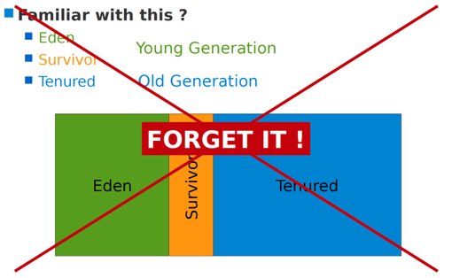

取而代之的是，G1算法将堆划分为若干个区域（Region），它仍然属于分代收集器。不过，这些区域的一部分包含新生代，新生代的垃圾收集依然采用暂停所有应用线程的方式，将存活对象拷贝到老年代或者Survivor空间。老年代也分成很多区域，G1收集器通过将对象从一个区域复制到另外一个区域，完成了清理工作。这就意味着，在正常的处理过程中，G1完成了堆的压缩（至少是部分堆的压缩），这样也就不会有cms内存碎片问题的存在了。

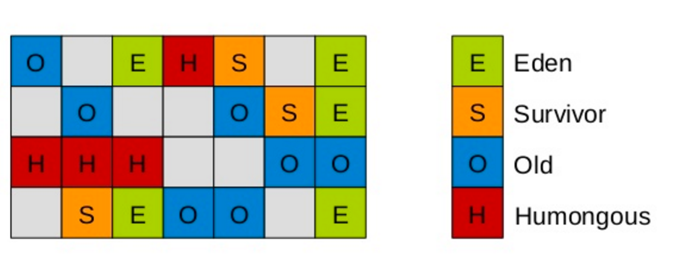

在G1中，还有一种特殊的区域，叫Humongous区域。 如果一个对象占用的空间超过了分区容量50%以上，G1收集器就认为这是一个巨型对象。这些巨型对象，默认直接会被分配在年老代，但是如果它是一个短期存在的巨型对象，就会对垃圾收集器造成负面影响。为了解决这个问题，G1划分了一个Humongous区，它用来专门存放巨型对象。如果一个H区装不下一个巨型对象，那么G1会寻找连续的H分区来存储。为了能找到连续的H区，有时候不得不启动Full GC。

PS：在java 8中，持久代也移动到了普通的堆内存空间中，改为元空间。

**对象分配策略**

说起大对象的分配，我们不得不谈谈对象的分配策略。它分为3个阶段：

  1. TLAB(Thread Local Allocation Buffer)线程本地分配缓冲区
  2. Eden区中分配
  3. Humongous区分配

TLAB为线程本地分配缓冲区，它的目的为了使对象尽可能快的分配出来。如果对象在一个共享的空间中分配，我们需要采用一些同步机制来管理这些空间内的空闲空间指针。
在Eden空间中，每一个线程都有一个固定的分区用于分配对象，即一个TLAB。分配对象时，线程之间不再需要进行任何的同步。

对TLAB空间中无法分配的对象，JVM会尝试在Eden空间中进行分配。如果Eden空间无法容纳该对象，就只能在老年代中进行分配空间。

最后，G1提供了两种GC模式，Young GC和Mixed GC，两种都是Stop The World(STW)的。下面我们将分别介绍一下这2种模式。

**三，G1 Young GC**

Young GC主要是对Eden区进行GC，它在Eden空间耗尽时会被触发。在这种情况下，Eden空间的数据移动到Survivor空间中，如果Survivor空间不够，Eden空间的部分数据会直接晋升到年老代空间。Survivor区的数据移动到新的Survivor区中，也有部分数据晋升到老年代空间中。最终Eden空间的数据为空，GC停止工作，应用线程继续执行。

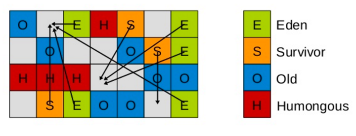

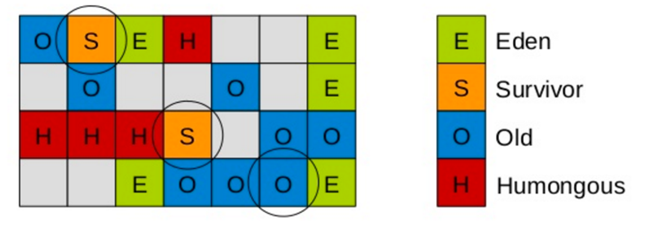

这时，我们需要考虑一个问题，如果仅仅GC 新生代对象，我们如何找到所有的根对象呢？
老年代的所有对象都是根么？那这样扫描下来会耗费大量的时间。于是，G1引进了RSet的概念。它的全称是Remembered Set，作用是跟踪指向某个heap区内的对象引用。

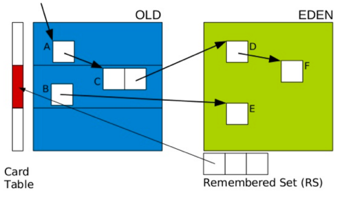

在CMS中，也有RSet的概念，在老年代中有一块区域用来记录指向新生代的引用。这是一种point-out，在进行Young GC时，扫描根时，仅仅需要扫描这一块区域，而不需要扫描整个老年代。

但在G1中，并没有使用point-out，这是由于一个分区太小，分区数量太多，如果是用point-out的话，会造成大量的扫描浪费，有些根本不需要GC的分区引用也扫描了。于是G1中使用point-in来解决。point-in的意思是哪些分区引用了当前分区中的对象。这样，仅仅将这些对象当做根来扫描就避免了无效的扫描。由于新生代有多个，那么我们需要在新生代之间记录引用吗？这是不必要的，原因在于每次GC时，所有新生代都会被扫描，所以只需要记录老年代到新生代之间的引用即可。

需要注意的是，如果引用的对象很多，赋值器需要对每个引用做处理，赋值器开销会很大，为了解决赋值器开销这个问题，在G1 中又引入了另外一个概念，卡表（Card
Table）。一个Card Table将一个分区在逻辑上划分为固定大小的连续区域，每个区域称之为卡。卡通常较小，介于128到512字节之间。Card Table通常为字节数组，由Card的索引（即数组下标）来标识每个分区的空间地址。默认情况下，每个卡都未被引用。当一个地址空间被引用时，这个地址空间对应的数组索引的值被标记为"0″，即标记为脏被引用，此外RSet也将这个数组下标记录下来。一般情况下，这个RSet其实是一个Hash Table，Key是别的Region的起始地址，Value是一个集合，里面的元素是Card Table的Index。

Young GC 阶段：

  * 阶段1：根扫描  
静态和本地对象被扫描

  * 阶段2：更新RS  
处理dirty card队列更新RS

  * 阶段3：处理RS  
检测从年轻代指向年老代的对象

  * 阶段4：对象拷贝  
拷贝存活的对象到survivor/old区域

  * 阶段5：处理引用队列  
软引用，弱引用，虚引用处理

**四，G1 Mix GC**

Mix GC不仅进行正常的新生代垃圾收集，同时也回收部分后台扫描线程标记的老年代分区。

它的GC步骤分2步：

  1. 全局并发标记（global concurrent marking）
  2. 拷贝存活对象（evacuation）

在进行Mix GC之前，会先进行global concurrent marking（全局并发标记）。 global concurrent marking的执行过程是怎样的呢？

在G1 GC中，它主要是为Mixed GC提供标记服务的，并不是一次GC过程的一个必须环节。global concurrent marking的执行过程分为五个步骤：

  * 初始标记（initial mark，STW）  
在此阶段，G1 GC 对根进行标记。该阶段与常规的 (STW) 年轻代垃圾回收密切相关。

  * 根区域扫描（root region scan）  
G1 GC 在初始标记的存活区扫描对老年代的引用，并标记被引用的对象。该阶段与应用程序（非 STW）同时运行，并且只有完成该阶段后，才能开始下一次 STW 年轻代垃圾回收。

  * 并发标记（Concurrent Marking）  
G1 GC 在整个堆中查找可访问的（存活的）对象。该阶段与应用程序同时运行，可以被 STW 年轻代垃圾回收中断

  * 最终标记（Remark，STW）  
该阶段是 STW 回收，帮助完成标记周期。G1 GC 清空 SATB 缓冲区，跟踪未被访问的存活对象，并执行引用处理。

  * 清除垃圾（Cleanup，STW）  
在这个最后阶段，G1 GC 执行统计和 RSet 净化的 STW 操作。在统计期间，G1 GC
会识别完全空闲的区域和可供进行混合垃圾回收的区域。清理阶段在将空白区域重置并返回到空闲列表时为部分并发。

**三色标记算法**

提到并发标记，我们不得不了解并发标记的三色标记算法。它是描述追踪式回收器的一种有用的方法，利用它可以推演回收器的正确性。 首先，我们将对象分成三种类型的。

  * 黑色:根对象，或者该对象与它的子对象都被扫描
  * 灰色:对象本身被扫描,但还没扫描完该对象中的子对象
  * 白色:未被扫描对象，扫描完成所有对象之后，最终为白色的为不可达对象，即垃圾对象

当GC开始扫描对象时，按照如下图步骤进行对象的扫描：

根对象被置为黑色，子对象被置为灰色。

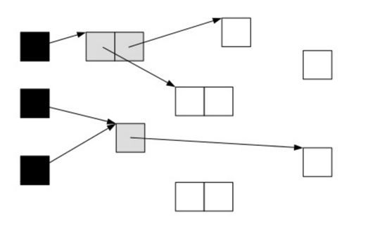

继续由灰色遍历,将已扫描了子对象的对象置为黑色。

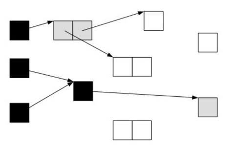

遍历了所有可达的对象后，所有可达的对象都变成了黑色。不可达的对象即为白色，需要被清理。  
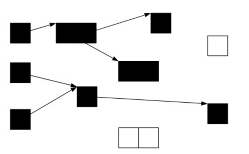

这看起来很美好，但是如果在标记过程中，应用程序也在运行，那么对象的指针就有可能改变。这样的话，我们就会遇到一个问题：对象丢失问题

我们看下面一种情况，当垃圾收集器扫描到下面情况时：

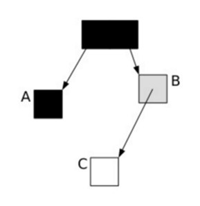

这时候应用程序执行了以下操作：

> A.c=C  
B.c=null

这样，对象的状态图变成如下情形：

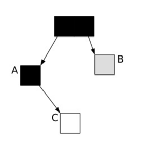

这时候垃圾收集器再标记扫描的时候就会下图成这样：

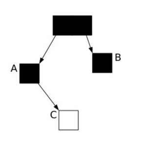

很显然，此时C是白色，被认为是垃圾需要清理掉，显然这是不合理的。那么我们如何保证应用程序在运行的时候，GC标记的对象不丢失呢？有如下2中可行的方式：

  1. 在插入的时候记录对象
  2. 在删除的时候记录对象

刚好这对应CMS和G1的2种不同实现方式：

在CMS采用的是增量更新（Incremental update），只要在写屏障（write barrier）里发现要有一个白对象的引用被赋值到一个黑对象的字段里，那就把这个白对象变成灰色的。即插入的时候记录下来。

在G1中，使用的是STAB（snapshot-at-the-beginning）的方式，删除的时候记录所有的对象，它有3个步骤：

1，在开始标记的时候生成一个快照图标记存活对象

2，在并发标记的时候所有被改变的对象入队（在write barrier里把所有旧的引用所指向的对象都变成非白的）

3，可能存在游离的垃圾，将在下次被收集

这样，G1到现在可以知道哪些老的分区可回收垃圾最多。 当全局并发标记完成后，在某个时刻，就开始了Mix GC。这些垃圾回收被称作“混合式”是因为他们不仅仅进行正常的新生代垃圾收集，同时也回收部分后台扫描线程标记的分区。混合式垃圾收集如下图：

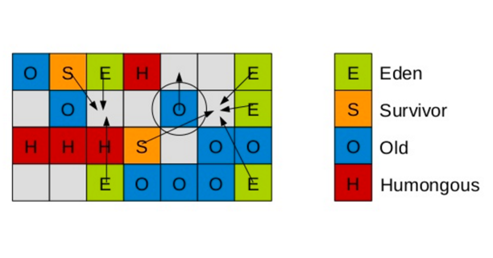

混合式GC也是采用的复制的清理策略，当GC完成后，会重新释放空间。

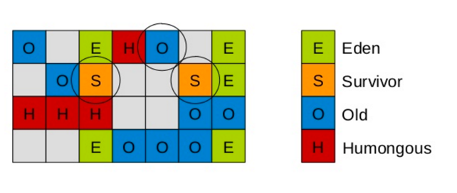

至此，混合式GC告一段落了。下一小节我们讲进入调优实践。

**五，调优实践**

MaxGCPauseMillis调优

前面介绍过使用GC的最基本的参数：

> -XX:+UseG1GC -Xmx32g -XX:MaxGCPauseMillis=200

前面2个参数都好理解，后面这个MaxGCPauseMillis参数该怎么配置呢？这个参数从字面的意思上看，就是允许的GC最大的暂停时间。G1尽量确保每次GC暂停的时间都在设置的MaxGCPauseMillis范围内。 那G1是如何做到最大暂停时间的呢？这涉及到另一个概念，CSet(collection set)。它的意思是在一次垃圾收集器中被收集的区域集合。

  * Young GC：选定所有新生代里的region。通过控制新生代的region个数来控制young GC的开销。
  * Mixed GC：选定所有新生代里的region，外加根据global concurrent marking统计得出收集收益高的若干老年代region。在用户指定的开销目标范围内尽可能选择收益高的老年代region。

在理解了这些后，我们再设置最大暂停时间就好办了。 首先，我们能容忍的最大暂停时间是有一个限度的，我们需要在这个限度范围内设置。但是应该设置的值是多少呢？我们需要在吞吐量跟MaxGCPauseMillis之间做一个平衡。如果MaxGCPauseMillis设置的过小，那么GC就会频繁，吞吐量就会下降。如果MaxGCPauseMillis设置的过大，应用程序暂停时间就会变长。G1的默认暂停时间是200毫秒，我们可以从这里入手，调整合适的时间。

**其他调优参数**

-XX:G1HeapRegionSize=n

设置的 G1 区域的大小。值是 2 的幂，范围是 1 MB 到 32 MB 之间。目标是根据最小的 Java 堆大小划分出约 2048 个区域。

-XX:ParallelGCThreads=n

设置 STW 工作线程数的值。将 n 的值设置为逻辑处理器的数量。n 的值与逻辑处理器的数量相同，最多为 8。

如果逻辑处理器不止八个，则将 n 的值设置为逻辑处理器数的 5/8 左右。这适用于大多数情况，除非是较大的 SPARC 系统，其中 n 的值可以是逻辑处理器数的 5/16 左右。

-XX:ConcGCThreads=n

设置并行标记的线程数。将 n 设置为并行垃圾回收线程数 (ParallelGCThreads) 的 1/4 左右。

-XX:InitiatingHeapOccupancyPercent=45

设置触发标记周期的 Java 堆占用率阈值。默认占用率是整个 Java 堆的 45%。

避免使用以下参数：

避免使用 -Xmn 选项或 -XX:NewRatio 等其他相关选项显式设置年轻代大小。固定年轻代的大小会覆盖暂停时间目标。

**触发Full GC**

在某些情况下，G1触发了Full GC，这时G1会退化使用Serial收集器来完成垃圾的清理工作，它仅仅使用单线程来完成GC工作，GC暂停时间将达到秒级别的。整个应用处于假死状态，不能处理任何请求，我们的程序当然不希望看到这些。那么发生Full GC的情况有哪些呢？

  * 并发模式失败

G1启动标记周期，但在Mix GC之前，老年代就被填满，这时候G1会放弃标记周期。这种情形下，需要增加堆大小，或者调整周期（例如增加线程数-XX:ConcGCThreads等）。

  * 晋升失败或者疏散失败

G1在进行GC的时候没有足够的内存供存活对象或晋升对象使用，由此触发了Full GC。可以在日志中看到(to-space exhausted)或者（to-space overflow）。解决这种问题的方式是：

a,增加 -XX:G1ReservePercent 选项的值（并相应增加总的堆大小），为“目标空间”增加预留内存量。

b,通过减少 -XX:InitiatingHeapOccupancyPercent 提前启动标记周期。

c,也可以通过增加 -XX:ConcGCThreads 选项的值来增加并行标记线程的数目。

  * 巨型对象分配失败

当巨型对象找不到合适的空间进行分配时，就会启动Full GC，来释放空间。这种情况下，应该避免分配大量的巨型对象，增加内存或者增大-XX:G1HeapRegionSize，使巨型对象不再是巨型对象。

由于篇幅有限，G1还有很多调优实践，在此就不一一列出了，大家在平常的实践中可以慢慢探索。最后，期待java9能正式发布，默认使用G1为垃圾收集器的java性能会不会又提高呢？

附录：

（1），[The original G1 paper: Detlefs, D., Flood, C., Heller, S., and Printezis,
T. 2004. Garbage-first garbage collection. In Proceedings of the 4th
international Symposium on Memory Management (Vancouver, BC, Canada, October
24 - 25, 2004)](http://dl.acm.org/citation.cfm?id=1029879)

####
原文出处：<a href='https://mp.weixin.qq.com/s?__biz=MzAwMDU1MTE1OQ==&mid=2653548163&idx=1&sn=870f487c65d48513c1045b6286474641&key=a3d9fb64df3a4b06211de557a890e944a279b8c870ac069c4db41c22fe88889b88a6700fa1005b3acc2297468945514f6f4b462a254c64c5e68a171a57de75d26e18ca97c4f945a2a8c2de61766f5e6c&ascene=0&uin=MTQxMjk4MjQyMA%3D%3D&devicetype=iMac+Macmini6%2C1+OSX+OSX+10.11.6+build(15G31)&version=12010210&nettype=WIFI&fontScale=100&pass_ticket=BGO6Kfwev1HlDj2CTisNNcPgSE1qkMIEQeEd1VH4Ft%2B2O%2BfWZ3Ty3%2BHUXbLvZGZg' target='blank'> 一个专家眼中的Go与Java垃圾回收算法大对比

</a>

我最近看过一堆宣传 Go 语言的最新垃圾收集器的文章。 其中一些文章来自 Go 项目本身。 他们声称 GC 技术发生了根本性的突破。

以下是 2015 年 8 月新垃圾收集器的公告：

> Go 正在构建一个垃圾收集器（GC），**不仅是为了了 2015 年，同时也为 2025 以及更远的未来…… stw 停顿不再是使用 Go语言的障碍。**在将来，应用程序随着硬件轻松地扩展，并且跟随硬件一起变得更加强大，GC 不会成为软件可扩展性的绊脚石。

Go 团队不仅声称已经解决了 GC 暂停的问题，而且整个事情变得非常傻瓜：

> 解决性能问题更高级别的一种方法是添加 GC 选项，每个性能问题设置不同的选项。程序员搜索适合其应用的合适 GC 设置。缺点是，经过十年以后你会得到非常多配置选项（配置选项成为一门黑魔法）。**Go 不会走这条路。 相反，我们提供一个单一的选项，称为 GOGC。**
>
>  
>
> 此外，由于持续支持数十个选项，Go 团队可以根据真实应用程序的运行情况的反馈来改进运行时的效果。

许多 Go 用户都非常满意于新的 runtime。 但是对我来说，它更像是一个误导。 由于这些声明在各种博客重复出现，现在是时候更深入地审视它们了。

现实情况是，**Go 的 GC 并没有真正实现任何新的思想或研究。**正如公告中表达的，它是一个并发标记/扫描收集器（基于 20 世纪 70 年代的想法）。
它被设计为以 GC 中其他因素为代价来优化暂停时间。 Go 的技术讲座似乎没有提到这些权衡：

> 为了在接下来的十年中创建一个垃圾收集器，我们转向几十年前的一个算法。 Go 的新垃圾收集器是一个并发的，三色，标记扫描收集器，这是一个由Dijkstra 在 1978年首次提出的想法。和今天的大多数“企业级”垃圾收集器相比，这是一个经得起推敲的差异化选择，我们认为该算法非常适合现代硬件的属性和现代软件的延迟要求。

读了上述声明之后，你可能会非常困惑，过去 40 年间，所有“企业”级别的 GC 研究没有任何成果？

###**GC 理论基础**

下面是在设计垃圾收集算法时您想要考虑的不同因素：

  * 程序吞吐量：你的算法在多大程度上减慢程序？这表示为花费在执行垃圾收集与工作时间的百分比。

  * GC吞吐量：在给定CPU时间内多少垃圾可以被收集器清除？

  * 堆开销：你的收集器需要多少额外的内存？如果你的算法在收集时分配临时内存，是否会使你的程序的内存使用突然暴涨？

  * 暂停时间：你的垃圾收集器stop world多久了？

  * 暂停频率：你的垃圾收集器多久暂停一次程序？

  * 暂停分布：有时有非常短暂的停顿，但有时会有很长的停顿。

  * 内存分配性能：分配新内存的时候是快还是慢？或者性能不可预测？

  * 整理：因为内存碎片的原因，在有足够的可用空间可满足请求，垃圾收集器是否会报告内存不足（OOM）错误？

  * 并发：垃圾收集器如何使用多核？

  * 扩展性：你的垃圾收集器随着堆增大工作情况如何？

  * 调优：垃圾收集器的配置有多复杂，可以开箱即用并获得最佳性能吗？

  * 预热时间：垃圾收集算法是否基于测量行为进行自适应调整？需要多长时间才能达到最佳？

  * 内存释放：您的算法是否释放未使用的内存回到操作系统？如果是，什么时候释放？

  * 可移植性：您的垃圾收集器是否可以在提供比x86更弱的内存一致性保证的CPU体系结构上工作？

  * 兼容性：您的垃圾收集器使用哪些语言和编译器？它可以与设计时没有考虑GC的语言（如 C++）一起工作吗？它需要修改编译器吗？如果是这样，更改GC算法是否需要重新编译所有程序和依赖关系？

如你所见，设计垃圾收集器有很多不同的因子需要考虑，其中一些会影响您平台上更广泛的生态系统的设计。 我自己甚至不确定以上列表是否包含所有因子。

因为设计空间如此复杂，所以垃圾收集是计算机科学的一个子领域。该领域有丰富的研究论文， 新的算法由学术界和工业界以稳定的速率提出并实现。然而没有人发现单一的算法在理论上满足所有情况。

###**权衡（tradeoff）的艺术**

让我们讨论得更具体一点。

第一个垃圾收集算法是为具有较小堆的单处理器机器设计的。 当时CPU和RAM是非常昂贵的，用户对程序暂停的要求并非很严苛，因此可见暂停是可以接受的。这个算法优先考虑最小化垃圾收集器的CPU和堆开销。这意味着在你分配内存失败之前，垃圾收集器没有做任何事情。垃圾收集器将暂停程序，并且完成堆的标记/扫描并回收内存。

该类型的收集器尽管有些年迈，但仍然有一些优势 - 算法简单导致不会降低你的程序运行速度，当不进行垃圾收集时，不增加任何内存开销。在保守垃圾收集器如Boehm
GC的情况下，甚至不需要修改编译器或换编程语言！这使它们适合于通常具有较小堆内存的桌面应用，包括AAA视频游戏（其中大量的RAM由不需要扫描的数据文件占用）。

Stop-the-world（STW）标记/扫描 （mark/sweep）是本科计算机科学类中最常见的 GC 算法。在面试时，我会要求候选人谈一谈GC，他们几乎总是将 GC作为黑盒并对 GC 知之甚少。

简单的STW 标记/扫描（mark/sweep）有非常严重的问题。随着你添加处理器或者堆增长，该算法无法良好工作。但是-如果你的堆比较小，该算法就能够满足对停顿时间的要求！在这种情况下，你应该使用该算法，以保持你的GC开销足够低。

极端的情况下，也许你在一个拥有数十个核的机器上使用数百 GB 的堆。也许您的服务器正在运行金融市场交易，或搜索引擎，因此低暂停时间对您非常重要。这时候你可能愿意使用虽然降低程序运行速度但是可以并发执行的收集算法。

或者您也许有大批量作业。因为它们是非交互式，所以暂停时间根本不重要。在这种情况下，您最好使用吞吐量高于一切的算法，可以提高工作时间与执行收集时间的比率。

问题是**没有单一的算法在所有方面都是完美的**。语言运行时也不可能知道您的程序是批处理作业还是交互式延迟敏感型程序。这就是为什么“GC调优”存在的原因。它反映了我们计算机科学的基本限制。

###**代际（generation）假说**

自1984年以来，我们发现大多数对象都很“年轻”（在分配之后很快就变成垃圾）。这个情况被称为代际假说（generational hypothesis），是整个 PL 工程领域最强的经验之一。它在不同种类的编程语言中，以及在软件行业几十年的变化中一直是正确的：函数语言，命令式语言，没有值类型的语言和有值类型的语言都是如此。

发现这个事实是非常有用的，因为它意味着 GC 算法可以在设计时利用它。这些新一代垃圾收集器对旧的 SWT 垃圾收集器有很多改进：

  * GC吞吐量：他们可以更多更快的收集垃圾。

  * 分配性能：分配新的内存不再需要搜索通过堆寻找可用内存，因此内存分配器变得更有效。

  * 程序吞吐量：对象整齐地放在彼此相邻的内存中，这大大提高了缓存利用率。分代垃圾收集器确实需要程序在运行时做一些额外的工作，但是这种降低被改进的高速缓存效果所抵消。

  * 暂停时间：大多数（但不是全部）暂停时间变得更低。

当然也引入一些缺点：

  * 兼容性：实现一个分代垃圾收集器需要能够在内存中移动对象，并且在某些情况下，当程序使用指针时需要执行额外的工作。这意味着GC必须与编译器紧密集成。因此没有用于 C++ 的分代垃圾收集器。

  * 堆开销：这些收集器通过在各种“空间”之间来回复制内存来工作。因为必须有空间来进行复制，这些垃圾收集器增加了一些堆开销。此外，它们需要维护各种指针映射，进一步增加内存开销。

  * 暂停分配：虽然许多GC暂停现在非常短，但有些仍然需要对整个堆执行完全标记/扫描。

  * 调优：代数收集器引入了“年轻代”或“eden空间”的概念，程序性能对这个空间的大小非常敏感。

  * 预热时间：为了响应调优问题，一些收集器通过观测程序的运行以来动态地调整年轻代的大小，这种情况下暂停时间就取决于程序运行多长时间。

分代收集器的优势是如此诱人，因此基本上所有现代 GC 算法都是分代的。分代垃圾收集器可以通过各种其他功能进行增强，典型的现代 GC 将并发，并行，整理和分代集成在一起。

###**Go 并发垃圾收集器**

由于 Go 是一种命令式语言，它的值类型，内存访问模式和 C##（.NET 使用分代垃圾收集器）相当。

事实上，Go 程序通常是处理 request/response 任务（如 HTTP 服务器），这意味着 Go 程序表现出强烈的代际行为，Go 团队正在探索潜在的可以利用代际假说的算法，他们称之为“面向请求的垃圾收集器”。这本质上是一个可以策略调优的分代垃圾收集器。在处理请求/响应这种模式时，通过确保年轻代足够大以使通过处理请求产生的所有垃圾都在其中来优化 GC。（高可用架构译者注：指的是 Go下一代垃圾收集器 Transaction-Oriented Collector）

尽管如此，Go 的当前 GC 是不分代的。只是在后台运行标记/扫描。（高可用架构译者注：并发标记清除算法）

这样使暂停时间非常短 ，但使其他因素更糟糕。从我们的基本理论上面我们可以看到：

  * GC吞吐量：GC时间与堆大小同步增长。简单来说，你的程序使用的内存越多，内存释放速度就越慢，你的计算机花费的时间就越多。如果你的程序没有并行化，你可以不用考虑这个问题。

  * 整理：因为没有整理，GC 过程会产生内存碎片。程序也不会受益于在缓存中整齐排列的内容。

  * 程序吞吐量：因为GC必须在每个周期做很多工作，所以会消耗不少CPU时间。

  * 暂停分布：与程序并发运行的任何垃圾收集器都可能遇到Java中“并发模式失败”的问题：您的程序创建垃圾的速度比GC线程可以清除它快。在这种情况下，runtime别无选择只能完全停止程序，等待GC完成垃圾收集。因此当Go团队声明GC暂停非常低时，该声明只能适用于GC具有足够的CPU时间和空间以完成垃圾回收的情况。另外，由于Go编译器缺乏确保线程可以被快速可靠暂停这一功能，会导致暂停时间是否很低取决于您运行的是什么类型的代码（例如，base64 解码单个 goroutine 中的大 blob 会导致暂停时间上升）。

  * 堆开销：因为通过标记/扫描收集堆非常慢，您需要大量的空间以确保不会遇见“并发模式故障”。 Go默认使用100％的堆开销会让程序需要的内存量增加一倍。

我们可以看到这些权衡：

> 服务1分配内存多于服务2，因此STW暂停在服务1中较高。但STW暂停持续时间在两个服务上都下降了一个数量级。我们看到切换后，两个服务后在GC中花费的CPU使用率增加了约20％。

在这个特定的情况下，Go 以更慢的收集器为代价换取暂停时间的数量级下降。这是一个好的权衡吗？暂停时间已经足够低吗？

付出更多的硬件成本以获得较低的暂停时间，在一些情况下未必有意义。如果你的服务器暂停时间从 10msec 降低到1msec，你的用户真的会注意到吗？如果你必须加倍你的机器数量才能达成这一目的呢？

Go 将暂停时间优化作为首要目标，以至于它似乎愿意将程序减慢至任何数量级，以获得较短暂停。

###**与 Java 对比**

HotSpot JVM 有几个 GC 算法，您可以在命令行中选择。因为他需要平衡其他各种因素，因此没有一个 GC 算法的目标能将暂停时间降低到 Go 水平。可以通过重新启动程序在 GC 之间切换，因为编译是在程序运行时完成（高可用架构译者注：这里指 JIT编译器），所以不同算法所需的不同内存屏障可以根据需要编译和优化到代码中。

默认算法是吞吐量收集器（throughput collector）。这是为批处理作业设计的，默认情况下没有任何暂停时间目标。这种默认选择也是人们认为Java GC 有点吸引力的一个原因：开箱即用，它试图使您的应用程序尽可能快地运行，并尽可能少的内存开销，而暂停时间不是该算法首要考虑的。

如果暂停时间对您更重要，那么您可能需要切换到并发标记/扫描收集器（ CMS concurrent mark / sweep collector）。这是和Go 使用的 GC 算法最接近的垃圾收集器。但它也是分代的垃圾收集器，这也是为什么它的暂停时间比 Go的更长的原因：年轻代需要整理并移动对象，而导致应用程序暂停。 CMS 中有两种类型的暂停。第一种，较为短暂可能持续大约 2-5 毫秒。第二种可能会持续 20 毫秒或者更久。 CMS 是自适应的：因为是并发的，所以它必须猜测什么时候可以开始运行 GC（就像 Go）。 CMS 将在运行时调整自己并尝试避免“并发模式故障”。因为堆的大部分是标记/扫描算法（高可用架构译者注：这里说的是老年代，使用 CMS 算法的时候，年轻代并非使用该算法而是使用基于标记/整理的 ParNew，所以严格来说把整理并整理内存的好处算在 CMS 算法头上是有问题的），可能会因为堆碎片而导致问题。

最新一代 Java GC 被称为“ G1”（ garbage first 垃圾优先）。它将在 Java 9
中成为默认算法。它旨在提供一个通用的算法。该算法是针对整个堆的并发的，分代的和整理的算法。 G1 在很大程度上也是自适应的，因为（像所有的 GC 算法）它不能知道你真正想要什么，但它允许你指定首选权衡：只需要告诉它你允许使用的 RAM
最大值和暂停时间目标（以毫秒为单位），它就会尽力满足暂停时间目标。除非你指定不同的目标，否则默认的暂停时间目标大约是 100 毫秒。 G1 会更倾向于让你的应用程序运行的速度快而非暂停少。其每次暂停时间并不完全一致，但大多数都非常快（少于一毫秒），有些暂停因为堆被整理而稍慢（ 50 毫秒）。
G1 的扩展性也非常好。有报告称，人们在 TB 级别堆规模的程序上使用 G1 算法。它还有一些其他功能，如重复数据删除堆中的字符串。

Red Hat 支持的一个项目组开发了一种新的 GC 算法，称为 Shenandoah。代码已经贡献给 OpenJDK，但不会出现在 Java 9中（除非你使用红帽子的 Java 版本）。这一算法被设计为无论堆多大的情况下，都可以在提供整理的同时保证非常低的暂停时间。其成本是额外的堆开销和更多的内存屏障（高可用架构译者注：同时使用了读写屏障，而上述其他算法都只使用了写屏障）。在这个意义上，它类似于 Azul 的“无暂停”垃圾收集器（ArchNotes译者注：指的是使用 C4 算法的垃圾收集器，严格来说也并非完全无停顿，只是保证停顿时间在任何情况都小于 10ms, 由于在软实时系统上 OS带来的误差有可能超过 10ms，因此可以认为是无停顿垃圾收集器）。

###**结论**

本文的重点不是说服你使用不同的编程语言或工具。
只是希望带来对垃圾收集器的正确的理解。垃圾收集是一个非常挑战的工作，很多计算机科学家在上面耗费了数十年，因此不太有可能一晚上就会有一个全新的别人没用过的
GC 算法问世，更有可能的是，声称的新的 GC 算法只是对老的 GC 算法做了一个不同的，而且成熟的 GC 算法不太会考虑的偏门 tradeoff 而已。

但是如果你仅希望减少程序暂停时间，那么请关注 Go GC。

**参考阅读(可点击打开)**

本文由高可用架构志愿者翻译，英文原文地址：

https://medium.com/@octskyward/modern-garbage-collection-
911ef4f8bd8e#.5j56cki9w

_技术原创及架构实践文章，欢迎通过公众号菜单「联系我们」进行投稿。转载请注明来自高可用架构「ArchNotes」微信公众号及包含以下二维码。_

####
原文出处：<a href='http://blog.csdn.net/zjf280441589/article/details/53946312' target='blank'>JVM初探- 内存分配、GC原理与垃圾收集器</a>

> JVM内存的分配与回收大致可分为如下4个步骤: 何时分配 -> 怎样分配 -> 何时回收 -> 怎样回收.  
除了在概念上可简单认为`new`时分配外, 我们着重介绍后面的3个步骤:

###I. 怎样分配- JVM内存分配策略

对象内存主要分配在新生代**Eden区**, 如果启用了本地线程分配缓冲, 则**优先在TLAB上分配**, 少数情况能会直接分配在老年代,或被拆分成标量类型在栈上分配(JIT优化). 分配的规则并不是百分百固定, 细节主要取决于垃圾收集器组合, 以及VM内存相关的参数.

####对象分配

  * 优先在Eden区分配   
在[JVM内存模型](http://blog.csdn.net/zjf280441589/article/details/53437703)一文中,我们大致了解了VM年轻代堆内存可以划分为一块Eden区和两块Survivor区. 在大多数情况下, 对象在新生代Eden区中分配,当Eden区没有足够空间分配时, VM发起一次Minor GC, 将Eden区和其中一块Survivor区内尚存活的对象放入另一块Survivor区域,如果在Minor GC期间发现新生代存活对象无法放入空闲的Survivor区, 则会通过**空间分配担保机制**使对象提前进入老年代(空间分配担保见下).

  * 大对象直接进入老年代   
Serial和ParNew两款收集器提供了**-XX:PretenureSizeThreshold**的参数, 令大于该值的大对象直接在老年代分配,这样做的目的是**避免在Eden区和Survivor区之间产生大量的内存复制**(大对象一般指 _需要大量连续内存的Java对象_, 如很长的字符串和数组), 因此大对象容易导致**_还有不少空闲内存就提前触发GC以获取足够的连续空间_**.

####对象晋升

  * 年龄阈值   
VM为每个对象定义了一个对象年龄(Age)计数器, 对象在Eden出生如果**经第一次Minor GC后仍然存活, 且能被Survivor容纳的话**,将被移动到Survivor空间中, 并将**年龄设为1**. 以后**对象在Survivor区中每熬过一次Minor GC年龄就+1**.当增加到一定程度(**-XX:MaxTenuringThreshold**, 默认15), 将会晋升到老年代.

  * 提前晋升: 动态年龄判定   
然而VM并不总是要求对象的年龄必须达到**MaxTenuringThreshold**才能晋升老年代:**_如果在Survivor空间中相同年龄所有对象大小的总和大于Survivor空间的一半, 年龄大于或等于该年龄的对象就可以直接进入老年代_**,
而无须等到晋升年龄.

###II. 何时回收-对象生死判定

(哪些内存需要回收/何时回收)

> 在堆里面存放着Java世界中几乎所有的对象实例, 垃圾收集器在对堆进行回收前, 第一件事就是判断哪些对象**已死**(可回收).

####可达性分析算法

在主流商用语言(如Java、C#)的主流实现中, 都是通过**可达性分析算法**来判定对象是否存活的: 通过一系列的称为 **GC Roots**的对象作为起点, 然后向下搜索; 搜索所走过的路径称为**引用链/Reference Chain**, 当一个对象到 **GC Roots**没有任何**引用链**相连时, 即该对象不可达, 也就说明此对象是不可用的, 如下图: _Object5、6、7_ 虽然互有关联, 但它们到GC
Roots是不可达的, 因此也会被判定为可回收的对象:  

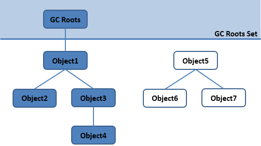

  * 在Java, 可作为**GC Roots**的对象包括:   

    1. 方法区: 类静态属性引用的对象;
    2. 方法区: 常量引用的对象;
    3. 虚拟机栈(本地变量表)中引用的对象.
    4. 本地方法栈JNI(Native方法)中引用的对象。

> 注: 即使在**可达性分析算法**中不可达的对象, VM也并不是马上对其回收, 因为要真正宣告一个对象死亡, 至少要经历两次标记过程:
第一次是在可达性分析后发现没有与GC Roots相连接的引用链,
第二次是GC对在**F-Queue**执行队列中的对象进行的小规模标记(对象需要覆盖`finalize()`方法且没被调用过).

 
###III. GC原理- 垃圾收集算法

####分代收集算法 VS 分区收集算法

  * 分代收集   
当前主流VM垃圾收集都采用”分代收集”(Generational Collection)算法, 这种算法会根据对象存活周期的不同将内存划分为几块,如JVM中的 **新生代**、**老年代**、**永久代**. 这样就可以根据各年代特点分别采用最适当的GC算法:  

    * 在新生代: 每次垃圾收集都能发现大批对象已死, 只有少量存活. 因此选用复制算法, **_只需要付出少量存活对象的复制成本就可以完成收集_**.
    * 在老年代: 因为对象存活率高、没有额外空间对它进行分配担保, 就必须采用**“标记—清理”**或**“标记—整理”**算法来进行回收, **_不必进行内存复制, 且直接腾出空闲内存_**.
  * 分区收集   
上面介绍的分代收集算法是将对象的生命周期按长短划分为两个部分, 而分区算法则将整个堆空间划分为连续的不同小区间, 每个小区间独立使用, 独立回收.
这样做的好处是**可以控制一次回收多少个小区间**.  

在相同条件下, 堆空间越大, 一次GC耗时就越长, 从而产生的停顿也越长. 为了更好地控制GC产生的停顿时间, 将一块大的内存区域分割为多个小块,
根据目标停顿时间, 每次合理地回收若干个小区间(而不是整个堆), 从而减少一次GC所产生的停顿.
 

####分代收集

#####新生代-复制算法

该算法的核心是**将可用内存按容量划分为大小相等的两块, 每次只用其中一块, 当这一块的内存用完, 就将还存活的对象复制到另外一块上面,
然后把已使用过的内存空间一次清理掉**.  

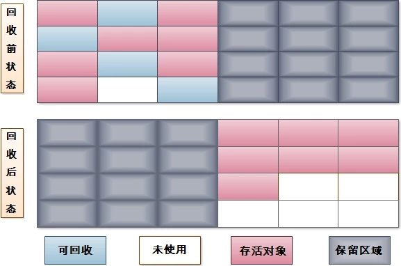  
(图片来源: [jvm垃圾收集算法](https://my.oschina.net/winHerson/blog/114391))

这使得每次只对其中一块内存进行回收, 分配也就不用考虑内存碎片等复杂情况, 实现简单且运行高效.  

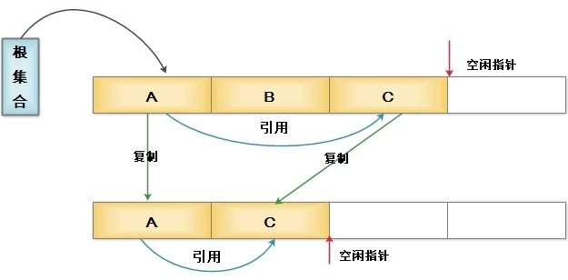
  
现代商用VM的新生代均采用复制算法, 但由于新生代中的98%的对象都是生存周期极短的, 因此并不需完全按照1∶1的比例划分新生代空间,而是**将新生代划分为一块较大的Eden区和两块较小的Survivor区**(HotSpot默认Eden和Survivor的大小比例为8∶1),每次只用Eden和其中一块Survivor. 当发生MinorGC时, 将Eden和Survivor中还存活着的对象一次性地拷贝到另外一块Survivor上, 最后清理掉Eden和刚才用过的Survivor的空间.当Survivor空间不够用(不足以保存尚存活的对象)时, 需要依赖老年代进行空间分配担保机制, 这部分内存直接进入老年代.

#####老年代-标记清除算法

该算法分为“标记”和“清除”两个阶段: _首先标记出所有需要回收的对象(可达性分析), 在标记完成后统一清理掉所有被标记的对象_.  

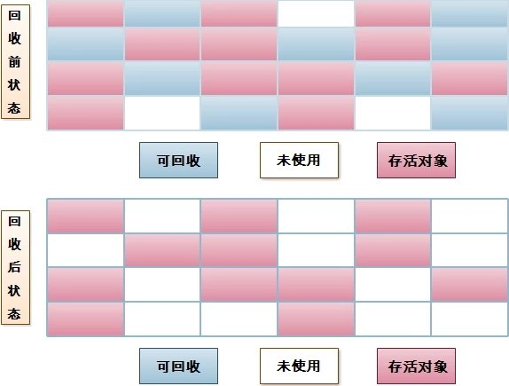 
 
该算法会有以下两个问题:  
1. 效率问题: 标记和清除过程的效率都不高;  
2. 空间问题: 标记清除后会产生大量不连续的内存碎片,空间碎片太多可能会导致在运行过程中需要分配较大对象时无法找到足够的连续内存而不得不提前触发另一次垃圾收集. 
 
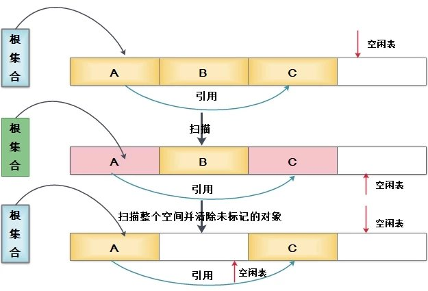

 

#####老年代-标记整理算法

标记清除算法会产生内存碎片问题, 而复制算法需要有额外的内存担保空间, 于是针对老年代的特点, 又有了**标记整理算法**.
标记整理算法的标记过程与标记清除算法相同, 但后续步骤不再对可回收对象直接清理, 而是让所有存活的对象都向一端移动,然后清理掉端边界以外的内存.
 
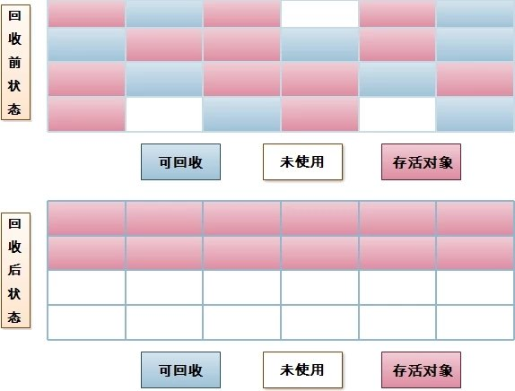

#####永久代-方法区回收

  * 在方法区进行垃圾回收一般”性价比”较低, 因为在方法区主要回收两部分内容: **废弃常量**和**无用的类**. 回收废弃常量与回收其他年代中的对象类似, 但要判断一个类是否无用则条件相当苛刻:   

    1. 该类所有的实例都已经被回收, Java堆中不存在该类的任何实例;
    2. 该类对应的`Class`对象没有在任何地方被引用(也就是在任何地方都无法通过反射访问该类的方法);
    3. 加载该类的**ClassLoader**已经被回收.

但即使满足以上条件也未必一定会回收, Hotspot VM还提供了**-Xnoclassgc**参数控制(关闭CLASS的垃圾回收功能).
因此在大量使用动态代理、CGLib等字节码框架的应用中一定要关闭该选项, 开启VM的类卸载功能, 以保证方法区不会溢出.

 
####补充: 空间分配担保

在执行Minor GC前, VM会首先检查老年代是否有足够的空间存放新生代尚存活对象, 由于新生代使用**复制收集算法**, 为了提升内存利用率,只使用了其中一个**Survivor**作为轮换备份, 因此当出现大量对象在Minor GC后仍然存活的情况时, 就需要老年代进行分配担保,让Survivor无法容纳的对象直接进入老年代, 但前提是老年代需要有足够的空间容纳这些存活对象. 但存活对象的大小在实际完成GC前是无法明确知道的,因此Minor GC前, VM会先**首先检查老年代连续空间是否大于新生代对象总大小或历次晋升的平均大小**, 如果条件成立, 则进行Minor GC,
否则进行Full GC(让老年代腾出更多空间).  
然而取历次晋升的对象的平均大小也是有一定风险的, 如果某次Minor GC存活后的对象突增,远远高于平均值的话,依然可能导致担保失败(Handle Promotion Failure, 老年代也无法存放这些对象了), 此时就只好在失败后重新发起一次Full GC(让老年代腾出更多空间).

###IX. GC实现- 垃圾收集器

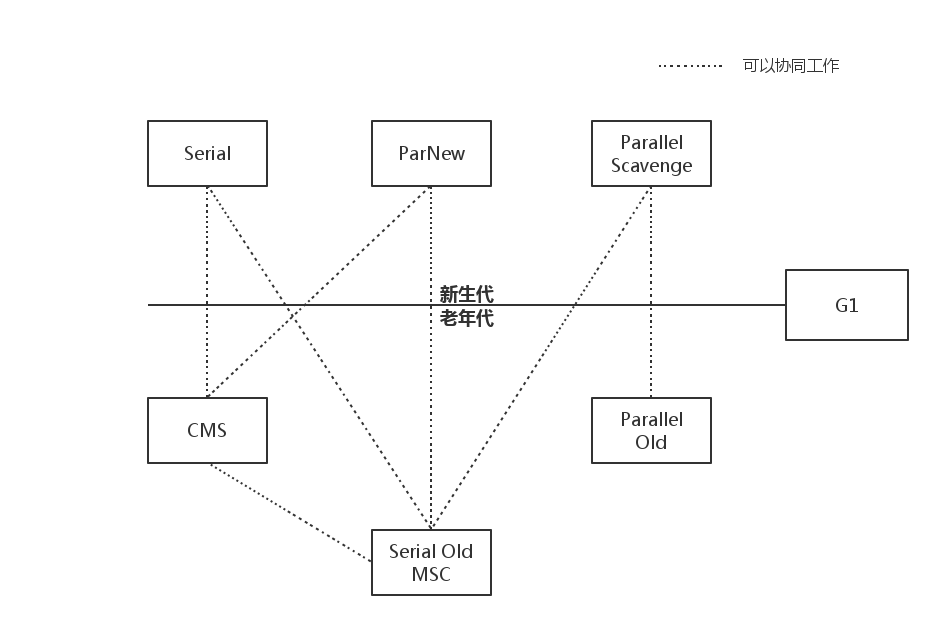

> GC实现目标: 准确、高效、低停顿、空闲内存规整.

####新生代

#####1. Serial收集器

Serial收集器是Hotspot运行在Client模式下的**默认新生代收集器**, 它的特点是 **只用一个CPU/一条收集线程去完成GC工作,且在进行垃圾收集时必须暂停其他所有的工作线程(“Stop The World” -后面简称STW)**.  

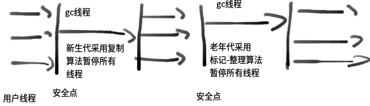 
 
虽然是单线程收集, 但它却简单而高效, 在VM管理内存不大的情况下(收集几十M~一两百M的新生代), 停顿时间完全可以控制在几十毫秒~一百多毫秒内.

#####2. ParNew收集器

ParNew收集器其实是前面**Serial的多线程版本**, 除**使用多条线程进行GC**外,包括Serial可用的所有控制参数、收集算法、STW、对象分配规则、回收策略等都与Serial完全一样(也是VM启用CMS收集器`-XX:+UseConcMarkSweepGC`的默认新生代收集器).  

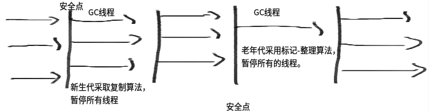  

由于存在线程切换的开销, ParNew在单CPU的环境中比不上Serial,且在通过超线程技术实现的两个CPU的环境中也不能100%保证能超越Serial. 但随着可用的CPU数量的增加,收集效率肯定也会大大增加(ParNew收集线程数与CPU的数量相同, 因此在CPU数量过大的环境中,可用`-XX:ParallelGCThreads`参数控制GC线程数).

#####3. Parallel Scavenge收集器

与ParNew类似, Parallel Scavenge也是**使用复制算法**, 也是**并行多线程收集器**.
但与其他收集器关注_尽可能缩短垃圾收集时间_不同, Parallel Scavenge更关注**系统吞吐量**:

系统吞吐量=运行用户代码时间(运行用户代码时间+垃圾收集时间)

停顿时间越短就越适用于用户交互的程序-良好的响应速度能提升用户的体验;而高吞吐量则适用于后台运算而不需要太多交互的任务-可以最高效率地利用CPU时间,尽快地完成程序的运算任务. Parallel Scavenge提供了如下参数设置系统吞吐量:

Parallel Scavenge参数 描述

`MaxGCPauseMillis`

(毫秒数) 收集器将尽力保证内存回收花费的时间不超过设定值, 但如果太小将会导致GC的频率增加.

`GCTimeRatio`

(整数:`0 < GCTimeRatio < 100`) 是垃圾收集时间占总时间的比率

`-XX:+UseAdaptiveSizePolicy`

启用GC自适应的调节策略:
不再需要手工指定`-Xmn`、`-XX:SurvivorRatio`、`-XX:PretenureSizeThreshold`等细节参数,VM会根据当前系统的运行情况收集性能监控信息, 动态调整这些参数以提供最合适的停顿时间或最大的吞吐量 

####老年代

#####Serial Old收集器

Serial Old是Serial收集器的老年代版本, 同样是**单线程收集器**,使用**“标记-整理”算法**:  

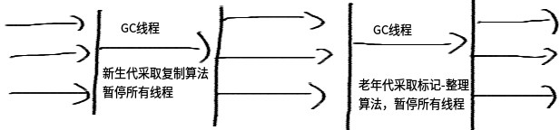

  * Serial Old应用场景如下:   

    * JDK 1.5之前与Parallel Scavenge收集器搭配使用;
    * 作为CMS收集器的后备预案, 在并发收集发生`Concurrent Mode Failure`时启用(见下:CMS收集器).

#####Parallel Old收集器

Parallel Old是Parallel Scavenge收老年代版本, 使用**多线程和“标记－整理”算法, 吞吐量优先**, 主要与Parallel
Scavenge配合在 _注重吞吐量_ 及 _CPU资源敏感_ 系统内使用: 
 
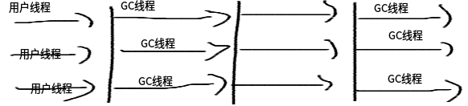

#####CMS收集器

CMS(Concurrent Mark Sweep)收集器是一款具有划时代意义的收集器, 一款真正意义上的并发收集器,虽然现在已经有了理论意义上表现更好的G1收集器, 但现在主流互联网企业线上选用的仍是CMS(如Taobao、微店).  
CMS是一种以**获取最短回收停顿时间为目标的收集器**(CMS又称_多并发低暂停的收集器_), 基于”标记-清除”算法实现,整个GC过程分为以下4个步骤:  
1. **初始标记**(CMS initial mark)  
2. 并发标记(CMS concurrent mark: GC Roots Tracing过程)  
3. **重新标记**(CMS remark)  
4. 并发清除(CMS concurrent sweep: 已死象将会就地释放, 注意: _此处没有压缩_)  
其中两个加粗的步骤(**初始标记**、**重新标记**)仍需STW. 但初始标记仅只标记一下GC Roots能直接关联到的对象, 速度很快;而重新标记则是为了修正并发标记期间因用户程序继续运行而导致标记产生变动的那一部分对象的标记记录, 虽然一般比初始标记阶段稍长, 但要远小于并发标记时间.  

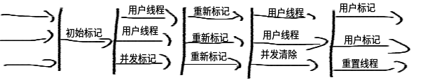 
 
(由于整个GC过程**耗时最长的并发标记和并发清除阶段的GC线程可与用户线程一起工作**, 所以总体上CMS的GC过程是与用户线程一起并发地执行的.

由于CMS收集器将整个GC过程进行了更细粒度的划分, 因此可以实现**并发收集、低停顿**的优势, 但它也并非十分完美, 其存在缺点及解决策略如下:

  1. CMS默认启动的回收线程数=(CPU数目+3)4

当CPU数>4时, GC线程最多占用不超过`25%`的CPU资源, 但是当CPU数<=4时, GC线程可能就会过多的占用用户CPU资源,从而导致应用程序变慢, 总吞吐量降低.

  2. 无法处理浮动垃圾, 可能出现_Promotion Failure_、_Concurrent Mode Failure_而导致另一次Full GC的产生: 浮动垃圾是指在CMS并发清理阶段用户线程运行而产生的新垃圾. 由于在GC阶段用户线程还需运行, 因此还需要预留足够的内存空间给用户线程使用, 导致CMS不能像其他收集器那样等到老年代几乎填满了再进行收集. 因此CMS提供了`-XX:CMSInitiatingOccupancyFraction`参数来设置GC的触发百分比(以及`-XX:+UseCMSInitiatingOccupancyOnly`来启用该触发百分比), 当老年代的使用空间超过该比例后CMS就会被触发(JDK 1.6之后默认92%). 但当CMS运行期间预留的内存无法满足程序需要, 就会出现上述_Promotion Failure_等失败, 这时VM将启动后备预案: 临时启用Serial Old收集器来重新执行Full GC(CMS通常配合大内存使用, 一旦大内存转入串行的Serial GC, 那停顿的时间就是大家都不愿看到的了).
  3. 最后, 由于CMS采用”标记-清除”算法实现, 可能会产生大量内存碎片. 内存碎片过多可能会导致无法分配大对象而提前触发Full GC. 因此CMS提供了`-XX:+UseCMSCompactAtFullCollection`开关参数, 用于在Full GC后再执行一个碎片整理过程. 但内存整理是无法并发的, 内存碎片问题虽然没有了, 但停顿时间也因此变长了, 因此CMS还提供了另外一个参数`-XX:CMSFullGCsBeforeCompaction`用于设置在执行N次不进行内存整理的Full GC后, 跟着来一次带整理的(默认为0: 每次进入Full GC时都进行碎片整理).

####分区收集- G1收集器

> G1(Garbage-First)是一款面向服务端应用的收集器, 主要目标用于配备多颗CPU的服务器治理大内存.  
\- G1 is planned as the long term replacement for the Concurrent Mark-Sweep
Collector (CMS).  
\- `-XX:+UseG1GC` 启用G1收集器.

与其他基于分代的收集器不同, G1将整个Java堆划分为多个大小相等的独立区域(Region), 虽然还保留有新生代和老年代的概念,但新生代和老年代不再是物理隔离的了, 它们都是一部分Region(不需要连续)的集合.  

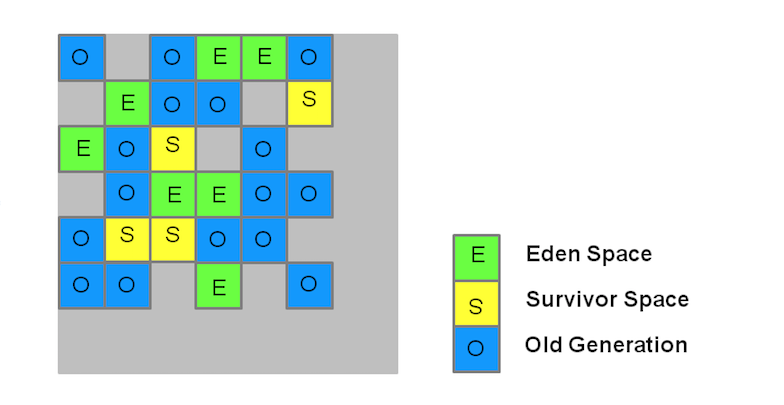  

每块区域既有可能属于O区、也有可能是Y区, 因此不需要一次就对整个老年代/新生代回收. 而是**当线程并发寻找可回收的对象时,有些区块包含可回收的对象要比其他区块多很多. 虽然在清理这些区块时G1仍然需要暂停应用线程,但可以用相对较少的时间优先回收垃圾较多的Region**(这也是G1命名的来源). 这种方式保证了G1可以在有限的时间内获取尽可能高的收集效率.

#####新生代收集

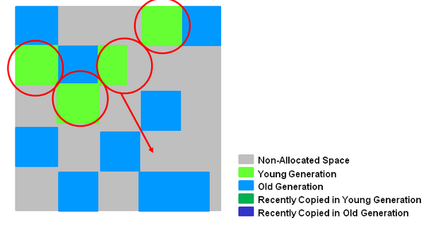

G1的新生代收集跟ParNew类似: 存活的对象被转移到一个/多个**Survivor Regions**. 如果存活时间达到阀值, 这部分对象就会被提升到老年代.  

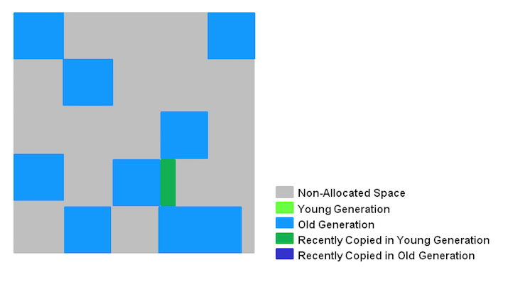

  * G1的新生代收集特点如下:   

    * 一整块堆内存被分为多个Regions.
    * 存活对象被拷贝到新的Survivor区或老年代.
    * 年轻代内存由一组不连续的heap区组成, 这种方法使得可以动态调整各代区域尺寸.
    * Young GCs会有STW事件, 进行时所有应用程序线程都会被暂停.
    * 多线程并发GC.

 

#####老年代收集

G1老年代GC会执行以下阶段:

> 注: 一下有些阶段也是年轻代垃圾收集的一部分.

index Phase Description

(1)

初始标记 (Initial Mark: Stop the World Event)

在G1中, 该操作附着一次年轻代GC, 以标记Survivor中有可能引用到老年代对象的Regions.

(2)

扫描根区域 (Root Region Scanning: 与应用程序并发执行)

扫描Survivor中能够引用到老年代的references. 但必须在Minor GC触发前执行完.

(3)

并发标记 (Concurrent Marking : 与应用程序并发执行)

在整个堆中查找存活对象, 但该阶段可能会被Minor GC中断.

(4)

重新标记 (Remark : Stop the World Event)

完成堆内存中存活对象的标记. 使用**snapshot-at-the-beginning(SATB, 起始快照)**算法,
比CMS所用算法要快得多(空Region直接被移除并回收, 并计算所有区域的活跃度).

(5)

清理 (Cleanup : Stop the World Event and Concurrent)

见下 5-1、2、3

5-1 (Stop the world)

在含有存活对象和完全空闲的区域上进行统计

5-2 (Stop the world)

擦除Remembered Sets.

5-3 (Concurrent)

重置空regions并将他们返还给空闲列表(free list)

(*)

Copying/Cleanup (Stop the World Event)

选择”活跃度”最低的区域(这些区域可以最快的完成回收). 拷贝/转移存活的对象到新的尚未使用的regions. 该阶段会被记录在gc-
log内(只发生年轻代`[GC pause (young)]`, 与老年代一起执行则被记录为`[GC Pause (mixed)]`.

> 详细步骤可参考 [Oracle官方文档-The G1 Garbage Collector Step by Step](http://www.oracle.com/webfolder/technetwork/tutorials/obe/java/G1GettingStarted/index.html#t5).

  * G1老年代GC特点如下:   

    * 并发标记阶段(index 3)   

      1. 在与应用程序并发执行的过程中会计算活跃度信息.
      2. 这些活跃度信息标识出那些regions最适合在STW期间回收(_which regions will be best to reclaim during an evacuation pause_).
      3. 不像CMS有清理阶段.
    * 再次标记阶段(index 4)   

      1. 使用Snapshot-at-the-Beginning(SATB)算法比CMS快得多.
      2. 空region直接被回收.
    * 拷贝/清理阶段(Copying/Cleanup Phase)   

      * 年轻代与老年代同时回收.
      * 老年代内存回收会基于他的活跃度信息. 

#####补充: 关于Remembered Set

G1收集器中, Region之间的对象引用以及其他收集器中的新生代和老年代之间的对象引用都是**使用Remembered Set来避免扫描全堆**.
G1中每个Region都有一个与之对应的Remembered Set, VM发现程序对Reference类型数据进行写操作时, 会产生一个Write Barrier暂时中断写操作, 检查Reference引用的对象是否处于不同的Region中(在分代例子中就是检查是否老年代中的对象引用了新生代的对象),如果是, 便通过CardTable把相关引用信息记录到被引用对象所属的Region的Remembered Set中. 当内存回收时,在GC根节点的枚举范围加入Remembered Set即可保证不对全局堆扫描也不会有遗漏.

###V. JVM小工具

在${JAVA_HOME}/bin/目录下Sun/Oracle给我们提供了一些处理应用程序性能问题、定位故障的工具, 包含

bin 描述 功能

jps

打印Hotspot VM进程

VMID、JVM参数、`main()`函数参数、主类名/Jar路径

jstat

查看Hotspot VM **运行时**信息

类加载、内存、GC[**可分代查看**]、JIT编译

jinfo

查看和修改虚拟机各项配置

`-flag name=value`

jmap

heapdump: 生成VM堆转储快照、查询finalize执行队列、Java堆和永久代详细信息

`jmap -dump:live,format=b,file=heap.bin [VMID]`

jstack

查看VM当前时刻的线程快照: 当前VM内每一条线程正在执行的方法堆栈集合

`Thread.getAllStackTraces()`提供了类似的功能

javap

查看经javac之后产生的JVM字节码代码

自动解析`.class`文件, 避免了去理解class文件格式以及手动解析class文件内容

jcmd

一个多功能工具, 可以用来导出堆, 查看Java进程、导出线程信息、 执行GC、查看性能相关数据等

几乎集合了jps、jstat、jinfo、jmap、jstack所有功能

**_jconsole_**
基于JMX的可视化监视、管理工具

可以查看内存、线程、类、CPU信息, 以及对JMX MBean进行管理

**_jvisualvm_**
JDK中最强大运行监视和故障处理工具

可以监控内存泄露、跟踪垃圾回收、执行时内存分析、CPU分析、线程分析…

###VI. VM常用参数整理

参数 描述

`-Xms`

最小堆大小

`-Xmx`

最大堆大小

`-Xmn`

新生代大小

`-XX:PermSize`

永久代大小

`-XX:MaxPermSize`

永久代最大大小

`-XX:+PrintGC`

输出GC日志

`-verbose:gc`

-

`-XX:+PrintGCDetails`

输出GC的详细日志

`-XX:+PrintGCTimeStamps`

输出GC时间戳(以基准时间的形式)

`-XX:+PrintHeapAtGC`

在进行GC的前后打印出堆的信息

`-Xloggc:/path/gc.log`

日志文件的输出路径

`-XX:+PrintGCApplicationStoppedTime`

打印由GC产生的停顿时间

> 在此处无法列举所有的参数以及他们的应用场景, 详细移步[Oracle官方文档-Java HotSpot VM Options](http://www.oracle.com/technetwork/java/javase/tech/vmoptions-jsp-140102.html).

