 
<!--BEGIN_DATA
{
    "create_date": "2022-05-26 15:10", 
    "modify_date": "2022-05-26 15:10", 
    "is_top": "0", 
    "summary": "深入理解Linux内存管理", 
    "tags": "Linux、系统", 
    "file_name": "深入理解Linux内存管理.md"
}
END_DATA-->

#### <p>原文出处：<a href='https://mp.weixin.qq.com/s/nlMGEhuaDUYqV6r8A4cRlA' target='blank'>深入理解Linux内存管理</a></p>

## 一、内存管理概览

内存是计算机最重要的资源之一，内存管理是操作系统最重要的任务之一。内存管理并不是简单地管理一下内存而已，它还直接影响着操作系统的风格以及用户空间编程的模式。可以说内存管理的方式是一个系统刻入DNA的秉性。既然内存管理那么重要，那么今天我们就来全面系统地讲一讲Linux内存管理。  

### 1.1 内存管理的意义

外存是程序存储的地方，内存是进程运行的地方。外存相当于是军营，内存相当于是战场。选择一个良好的战场才有利于军队打胜仗，实现一个完善的内存管理机制才能让进程多快好省地运行。如何更好地实现内存管理一直是操作系统发展的一大主题。在此过程中内存管理的基本模式也经历了好几代的发展，下面我们就来看一下。  

### 1.2 原始内存管理

最初的时候，内存管理是十分的简陋，大家都运行在物理内存上，内核和进程运行在一个空间中，内存分配算法有首次适应算法(FirstFit)、最佳适应算法(Best Fit)、最差适应算法(WorstFit)等。显然，这样的内存管理方式问题是很明显的。内核与进程之间没有做隔离，进程可以随意访问(干扰、窃取)内核的数据。而且进程和内核没有权限的区分，进程可以随意做一些敏感操作。还有一个问题就是当时的物理内存非常少，能同时运行的进程比较少，运行进程的吞吐量比较少。  

### 1.3 分段内存管理

于是第二代内存管理方式，分段内存管理诞生了。分段内存管理需要硬件的支持和软件的配合。在分段内存中，软件可以把物理内存分成一个一个的段，每个段都有段基址和段限长，还有段类型和段权限。段基址和段限长确定一个段的范围，可以防止内存访问越界。段与段之间也可以互相访问，但是不能随便访问，有一定的规则限制。段类型分为代码段和数据段，正好对应程序的代码和数据，代码段是只读和可执行的，数据段有只读数据段和读写数据段。代码段是不可写的，只读数据段也是不可写，数据段是不可执行的，这样又增加了一层安全性。段权限分为有特权(内核权限)和无特权(用户权限)，内核的代码段和数据段都设置为特权段，进程的代码段和数据段都设置为用户段，这样进程就不能随意访问内核了。当CPU执行特权段代码的时候会把自己设置为特权模式，此时CPU可以执行所以的指令。当CPU执行用户段代码的时候会把自己设置为用户模式，此时CPU只能执行普通指令，不能执行敏感指令。

至此，分段内存管理完美解决了原始内存管理存在的大部分问题：进程与内核之间的隔离实现了，进程不能随意访问内核了；CPU特权级实现了，进程无法再执行敏感指令了；内存访问的安全性提高了，越界访问和野指针问题得到了一定程度的遏制。但是分段内存管理还有一个严重的问题没有解决，那就是当时的物理内存非常少的问题。为此当时想的办法是用软件方法来解决，而且是进程自己解决。程序员在编写程序的时候就要想好，把程序分成几个模块，关联不大的模块，它们占用相同的物理地址。然后再编写一个overlay manager，在程序运行的时候，动态地加载即将会运行的模块，覆盖掉暂时不用的模块。这样一个程序占用较少的物理内存，也能顺利地运行下去。显然这样的方法很麻烦，每个程序都要写overlay manager也不太优雅。  

### 1.4 分页内存管理

于是第三代内存管理方式，虚拟内存管理(分页内存管理)诞生了。虚拟内存管理也是需要硬件的支持和软件的配合。在虚拟内存中，CPU访问任何内存都是通过虚拟内存地址来访问的，但是实际上最终访问内存还是得用物理内存地址。所以在CPU中存在一个MMU，负责把虚拟地址转化为物理地址，然后再去访问内存。而MMU把虚拟地址转化为物理的过程需要页表的支持，页表是由内核负责创建和维护的。一套页表可以用来表达一个虚拟内存空间，不同的进程可以用不同的页表集，页表集是可以不停地切换的，哪个进程正在运行就切换到哪个进程的页表集。于是一个进程就只能访问自己的虚拟内存空间，而访问不了别人的虚拟内存空间，这样就实现了进程之间的隔离。一个虚拟内存空间又分为两部分，内核空间和用户空间，内核空间只有一个，用户空间有N个，所有的虚拟内存空间都共享同一个内核空间。内核运行在内核空间，进程运行在用户空间，内核空间有特权，用户空间无特权，用户空间不能随意访问内核空间。这样进程和内核之间的隔离就形成了。内核空间的代码运行的时候，CPU会把自己设置为特权模式，可以执行所有的指令。用户空间运行的时候，CPU会把自己设置为用户模式，只能执行普通指令，不能执行敏感指令。

至此，分段内存实现的功能，虚拟内存都做到了，下面就是虚拟内存如何解决物理内存不足的问题了。系统刚启动的时候还是运行在物理内存上的，内核也被全部加载到了物理内存。然后内核建立页表体系并开启分页机制，内核的物理内存和虚拟内存就建立映射了，整个系统就运行在虚拟内存上了。后面运行进程的时候就不是这样了，内核会记录进程的虚拟内存分配情况，但是并不会马上分配物理内存建立页表映射，而是让进程先运行着。进程运行的时候，CPU都是通过MMU访问虚拟内存地址的，MMU会用页表去解析虚拟内存，如果找到了其对应的物理地址就直接访问，如果页表项是空的，就会触发缺页异常，在缺页异常中会去分配物理内存并建立页表映射。然后再重新执行刚才的那条指令，然后CPU还是通过MMU访问内存，由于页表建立好了，这下就可以访问到物理内存了。当物理内存不足的时候，内核还会把一部分物理内存解除映射，把其内容存放到外存中，等其再次需要的时候再加载回来。这样，一个进程运行的时候并不需要立马加载其全部内容到物理内存，进程只需要少量的物理内存就能顺利地运行，于是系统运行进程的吞吐量就大大提高了。

分页内存管理不仅实现了分段内存管理的功能，还有额外的优点，于是分段内存管理就没有存在的意义了。但是这里面还有一个历史包袱问题。对于那些比较新的CPU，比如ARM、RISC-V，它们没有历史包袱，直接实现的就是分页内存管理，根本不存在分段机制。但是对于x86就不一样了，x86是从直接物理内存、分段内存、分页内存一步一步走过来的，有着沉重的历史包袱。在x86 32上，分段机制和分页机制是并存的，系统可以选择只使用分段机制或者两种机制都使用。Linux的选择是使用分页机制，并在逻辑上屏蔽分段机制，因为分段机制是不能禁用的。逻辑上屏蔽分段机制的方法是，所有段的段基址都是0，段限长都是最大值，这样就相当于是不分段了。分段机制无法禁用的原因是因为CPU特权级是在分段机制中实现的，分页机制没有单独的CPU特权级机制。所以Linux创建了4个段，`__KERNEL_CS`、`__KERNEL_DS`用于内核空间，`__USER_CS`、`__USER_DS`用于用户空间，它们在会空间切换时自动切换，这样CPU特权级就跟着切换了。对于x86 64，从硬件上基本屏蔽了分段，因为硬件规定CS、DS、ES、SS这些段的段基址必须是0，段限长必须是最大值，软件设置其它值也没用。

因此我们在这里要强调一句，分段机制早就是历史了，x86 64已经从硬件上屏蔽了分段机制，Linux早就从软件上屏蔽了分段机制。X86 CPU的寄存器CS、DS、ES、FS和内核的`__KERNEL_CS`、`__KERNEL_DS`、`__USER_CS`、`__USER_DS`，已经不具有分段的意义了，它们的作用是为了实现CPU特权级的切换。  

### 1.5 内存管理的目标

内存管理的目标除了前面所说的进程之间的隔离、进程与内核之间的隔离、减少物理内存并发使用的数量之外，还有以下几个目标。

1. 减少内存碎片，包括外部碎片和内部碎片。外部碎片是指还在内存分配器中的内存，但是由于比较分散，无法满足用户大块连续内存分配的申请。内部碎片是指你申请了5个字节的内存，分配器给你分配了8个字节的内存，其中3个字节的内存是内部碎片。内存管理要尽量同时减少外部碎片和内部碎片。

2. 内存分配接口要灵活多样，同时满足多种不同的内存分配需求。既要满足大块连续内存分配的需求，又能满足小块零碎内存分配的需求。

3. 内存分配效率要高。内存分配要尽量快地完成，比如说你设计了一种算法，能完全解决内存碎片问题，但是内存算法实现得特别复杂，每次分配都需要1毫秒的时间，这就不可取了。

4. 提高物理内存的利用率。比如及时回收物理内存、对内存进行压缩。  

### 1.6 Linux内存管理体系

Linux内存管理的整体模式是虚拟内存管理(分页内存管理)，并在此基础上建立了一个庞大的内存管理体系。我们先来看一下总体结构图。

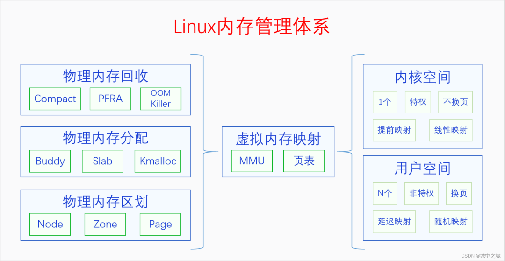

整个体系分为3部分，左边是物理内存，右边是虚拟内存，中间是虚拟内存映射(分页机制)。我们先从物理内存说起，内存管理的基础还是物理内存的管理。

物理内存那么大，应该怎么管理呢？首先要对物理内存进行层级区划，其原理可以类比于我国的行政区划管理。我国幅员辽阔，国家直接管理个人肯定是不行的，我国采取的是省县乡三级管理体系。把整个国家按照一定的规则和历史原因分成若干个省，每个省由省长管理。每个省再分成若干个县，每个县由县长管理。每个县再分成若干个乡，每个乡由乡长管理，乡长直接管理个人。(注意，类比是理解工具，不是论证工具)。对应的，物理内存也是采用类似的三级区域划分的方式来管理的，三个层级分别叫做节点(node)、区域(zone)、页面(page)，对应到省、县、乡。系统首先把整个物理内存划分为N个节点，内存节点只是叫节点，大家不能把它看成一个点，要把它看成是相当于一个省的大区域。每个节点都有一个节点描述符，相当于是省长。节点下面再划分区域，每个区域都有区域描述符，相当于是县长。区域下面再划分页面，每个页面都有页面描述符，相当于是乡长。页面再下面就是字节了，相当于是个人。

对物理内存建立三级区域划分之后，就可以在其基础之上建立分配体系了。物理内存的分配体系可以类比于一个公司的销售体系，有工厂直接进行大额销售，有批发公司进行大量批发，有小卖部进行日常零售。物理内存的三级分配体系分别是buddy system、slab allocator和kmalloc。buddy system相当于是工厂销售，slab allocator相当于是批发公司，kmalloc相当于是小卖部，分别满足人们不同规模的需求。

物理内存有分配也有释放，但是当分配速度大于释放速度的时候，物理内存就会逐渐变得不够用了。此时我们就要进行内存回收了。内存回收首先考虑的是内存规整，也就是内存碎片整理，因为有可能我们不是可用内存不足了，而是内存太分散了，没法分配连续的内存。内存规整之后如果还是分配不到内存的话，就会进行页帧回收。内核的物理内存是不换页的，所以内核只会进行缓存回收。用户空间的物理内存是可以换页的，所以会对用户空间的物理内存进行换页以便回收其物理内存。用户空间的物理内存分为文件页和匿名页。对于文件页，如果其是clean的，可以直接丢弃内容，回收其物理内存，如果其是dirty的，则会先把其内容写回到文件，然后再回收内存。对于匿名页，如果系统配置的有swap区的话，则会把其内容先写入swap区，然后再回收，如果系统没有swap区的话则不会进行回收。把进程占用的但是当前并不在使用的物理内存进行回收，并分配给新的进程来使用的过程就叫做换页。进程被换页的物理内存后面如果再被使用到的话，还会通过缺页异常再换入内存。如果页帧回收之后还没有得到足够的物理内存，内核将会使用最后一招，OOM Killer。OOM Killer会按照一定的规则选择一个进程将其杀死，然后其物理内存就被释放了。

内核还有三个内存压缩技术zram、zswap、zcache，图里并没有画出来。它们产生的原因并不相同，zram和zswap产生的原因是因为把匿名页写入swap区是IO操作，是非常耗时的，使用zram和zswap可以达到用空间换时间的效果。zcache产生的原因是因为内核一般都有大量的pagecache，pagecache是对文件的缓存，有些文件缓存暂时用不到，可以对它们进行压缩，以节省内存空间，到用的时候再解压缩，以达到用时间换空间的效果。

物理内存的这些操作都是在内核里进行的，但是CPU访问内存用的并不是物理内存地址，而是虚拟内存地址。内核需要建立页表把虚拟内存映射到物理内存上，然后CPU就可以通过MMU用虚拟地址来访问物理内存了。虚拟内存地址空间分为两部分，内核空间和用户空间。内核空间只有一个，其页表映射是在内核启动的早期就建立的。用户空间有N个，用户空间是随着进程的创建而建立的，但是其页表映射并不是马上建立，而是在程序的运行过程中通过缺页异常逐步建立的。内核页表建立好了之后就不会再取消了，所以内核是不换页的，用户页表建立之后可能会因为内存回收而取消，所以用户空间是换页的。内核页表是在内核启动时建立的，所以内核空间的映射是线性映射，用户空间的页表是在运行时动态创建的，不可能做到线性映射，所以是随机映射。

有些书上会说用户空间是分页的，内核是不分页的，这是对英语paging的错误翻译，paging在这里不是分页的意思，而是换页的意思。分页是指整个分页机制，换页是内存回收中的操作，两者的含义是完全不同的。

现在我们对Linux内存管理体系已经有了宏观上的了解，下面我们就来对每个模块进行具体地分析。  

## 二、物理内存区划

内核对物理内存进行了三级区划。为什么要进行三级区划，具体怎么划分的呢？这个不是软件随意决定的，而是和硬件因素有关。下面我们来看一下每一层级划分的原因，以及软件上是如果描述的。

### 2.1 物理内存节点

我国的省为什么要按照现在的这个形状来划分呢，主要是依据山川地形还有民俗风情等历史原因。那么物理内存划分为节点的原因是什么呢？这就要从UMA、NUMA说起了。我们用三个图来看一下。

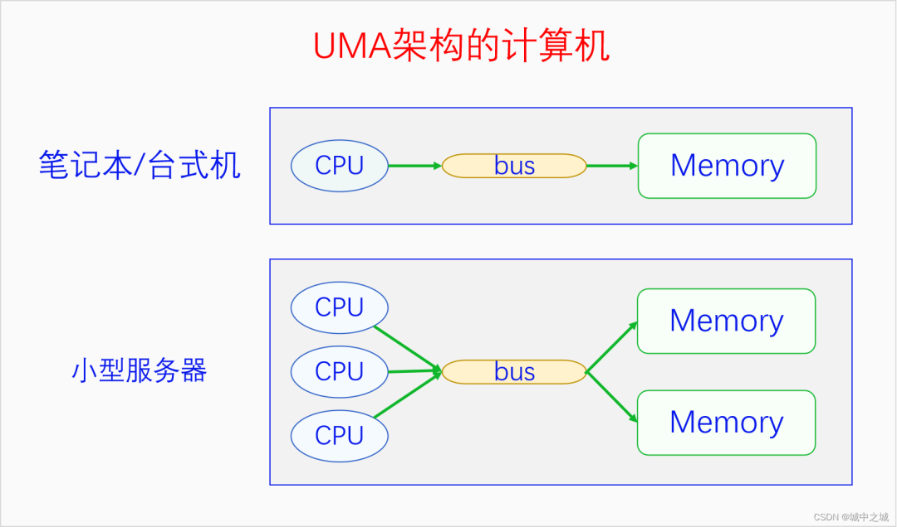

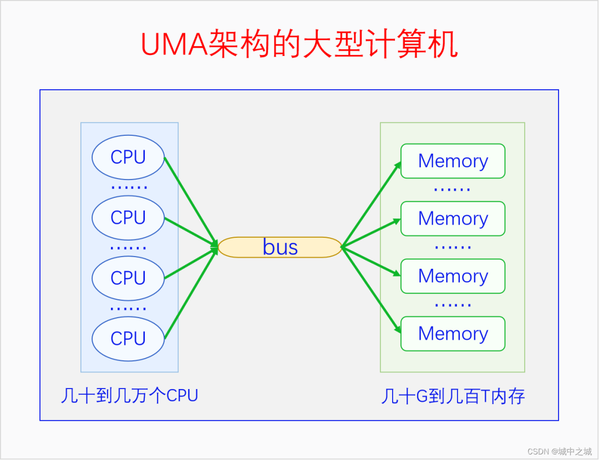

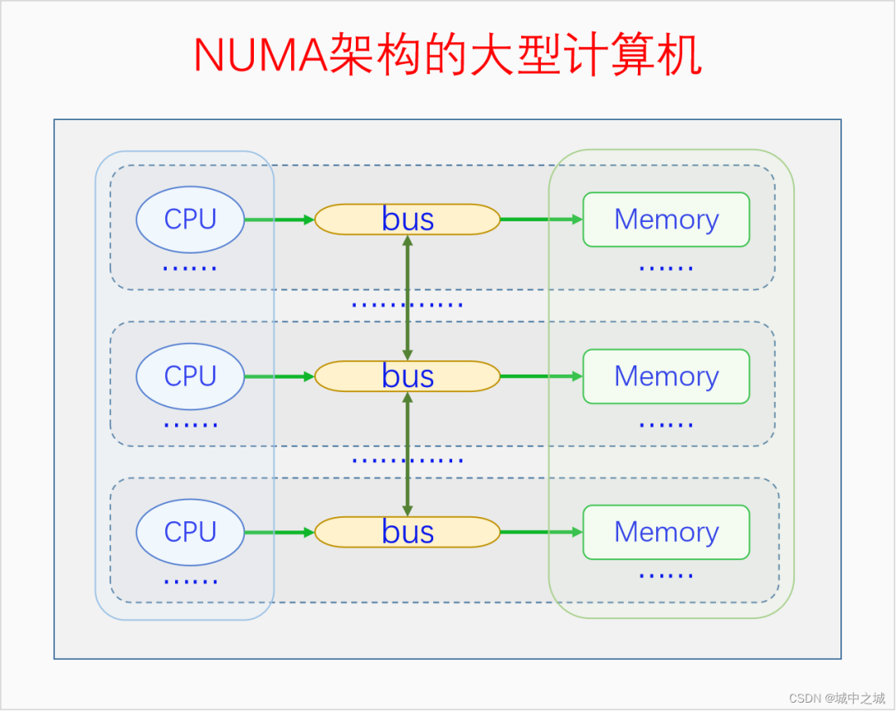

图中的CPU都是物理CPU。当一个系统中的CPU越来越多、内存越来越多的时候，内存总线就会成为一个系统的瓶颈。如果大家都还挤在同一个总线上，速度必然很慢。于是我们可以采取一种方法，把一部分CPU和一部分内存直连在一起，构成一个节点，不同节点之间CPU访问内存采用间接方式。节点内的内存访问速度就会很快，节点之间的内存访问速度虽然很慢，但是我们可以尽量减少节点之间的内存访问，这样系统总的内存访问速度就会很快。

Linux中的代码对UMA和NUMA是统一处理的，因为UMA可以看成是只有一个节点的NUMA。如果编译内核时配置了`CONFIG_NUMA`，内核支持NUMA架构的计算机，内核中会定义节点指针数组来表示各个node。如果编译内核时没有配置`CONFIG_NUMA`，则内核只支持UMA架构的计算机，内核中会定义一个内存节点。这样所有其它的代码都可以统一处理了。

下面我们先来看一下节点描述符的定义。linux-src/include/linux/mmzone.h

```c
typedef struct pglist_data {
 /*
  * node_zones contains just the zones for THIS node. Not all of the
  * zones may be populated, but it is the full list. It is referenced by
  * this node's node_zonelists as well as other node's node_zonelists.
  */
 struct zone node_zones[MAX_NR_ZONES];

 /*
  * node_zonelists contains references to all zones in all nodes.
  * Generally the first zones will be references to this node's
  * node_zones.
  */
 struct zonelist node_zonelists[MAX_ZONELISTS];

 int nr_zones; /* number of populated zones in this node */
#ifdef CONFIG_FLATMEM /* means !SPARSEMEM */
 struct page *node_mem_map;
#ifdef CONFIG_PAGE_EXTENSION
 struct page_ext *node_page_ext;
#endif
#endif
#if defined(CONFIG_MEMORY_HOTPLUG) || defined(CONFIG_DEFERRED_STRUCT_PAGE_INIT)
 /*
  * Must be held any time you expect node_start_pfn,
  * node_present_pages, node_spanned_pages or nr_zones to stay constant.
  * Also synchronizes pgdat->first_deferred_pfn during deferred page
  * init.
  *
  * pgdat_resize_lock() and pgdat_resize_unlock() are provided to
  * manipulate node_size_lock without checking for CONFIG_MEMORY_HOTPLUG
  * or CONFIG_DEFERRED_STRUCT_PAGE_INIT.
  *
  * Nests above zone->lock and zone->span_seqlock
  */
 spinlock_t node_size_lock;
#endif
 unsigned long node_start_pfn;
 unsigned long node_present_pages; /* total number of physical pages */
 unsigned long node_spanned_pages; /* total size of physical page
          range, including holes */
 int node_id;
 wait_queue_head_t kswapd_wait;
 wait_queue_head_t pfmemalloc_wait;
 struct task_struct *kswapd; /* Protected by
        mem_hotplug_begin/end() */
 int kswapd_order;
 enum zone_type kswapd_highest_zoneidx;

 int kswapd_failures;  /* Number of 'reclaimed == 0' runs */

#ifdef CONFIG_COMPACTION
 int kcompactd_max_order;
 enum zone_type kcompactd_highest_zoneidx;
 wait_queue_head_t kcompactd_wait;
 struct task_struct *kcompactd;
 bool proactive_compact_trigger;
#endif
 /*
  * This is a per-node reserve of pages that are not available
  * to userspace allocations.
  */
 unsigned long  totalreserve_pages;

#ifdef CONFIG_NUMA
 /*
  * node reclaim becomes active if more unmapped pages exist.
  */
 unsigned long  min_unmapped_pages;
 unsigned long  min_slab_pages;
#endif /* CONFIG_NUMA */

 /* Write-intensive fields used by page reclaim */
 ZONE_PADDING(_pad1_)

#ifdef CONFIG_DEFERRED_STRUCT_PAGE_INIT
 /*
  * If memory initialisation on large machines is deferred then this
  * is the first PFN that needs to be initialised.
  */
 unsigned long first_deferred_pfn;
#endif /* CONFIG_DEFERRED_STRUCT_PAGE_INIT */

#ifdef CONFIG_TRANSPARENT_HUGEPAGE
 struct deferred_split deferred_split_queue;
#endif

 /* Fields commonly accessed by the page reclaim scanner */

 /*
  * NOTE: THIS IS UNUSED IF MEMCG IS ENABLED.
  *
  * Use mem_cgroup_lruvec() to look up lruvecs.
  */
 struct lruvec  __lruvec;

 unsigned long  flags;

 ZONE_PADDING(_pad2_)

 /* Per-node vmstats */
 struct per_cpu_nodestat __percpu *per_cpu_nodestats;
 atomic_long_t  vm_stat[NR_VM_NODE_STAT_ITEMS];
} pg_data_t;
```

对于UMA，内核会定义唯一的一个节点。linux-src/mm/memblock.c

```c
#ifndef CONFIG_NUMA  
struct pglist_data __refdata contig_page_data;  
EXPORT_SYMBOL(contig_page_data);  
#endif  
```

查找内存节点的代码如下：linux-src/include/linux/mmzone.h

```c
extern struct pglist_data contig_page_data;  
static inline struct pglist_data *NODE_DATA(int nid)  
{  
 return &contig_page_data;  
}  
```

对于NUMA，内核会定义内存节点指针数组，不同架构定义的不一定相同，我们以x86为例。linux-src/arch/x86/mm/numa.c

```c
struct pglist_data *node_data[MAX_NUMNODES] __read_mostly;  
EXPORT_SYMBOL(node_data);  
```

查找内存节点的代码如下：linux-src/arch/x86/include/asm/mmzone_64.h

```c
extern struct pglist_data *node_data[];  
#define NODE_DATA(nid)  (node_data[nid])  
```

可以看出对于UMA，Linux是统一定义一个内存节点的，对于NUMA，Linux是在各架构代码下定义内存节点的。由于我们常见的电脑手机都是UMA的，后面的我们都以UMA为例进行讲解。`pglist_data`各自字段的含义我们在用到时再进行分析。  

### 2.2 物理内存区域

内存节点下面再划分为不同的区域。划分区域的原因是什么呢？主要是因为各种软硬件的限制导致的。目前Linux中最多可以有6个区域，这些区域并不是每个都必然存在，有的是由config控制的。有些区域就算代码中配置了，但是在系统运行的时候也可能为空。下面我们依次介绍一下这6个区域。

**`ZONE_DMA`：**由配置项CONFIG_ZONE_DMA决定是否存在。在x86上DMA内存区域是物理内存的前16M，这是因为早期的ISA总线上的DMA控制器只有24根地址总线，只能访问16M物理内存。为了兼容这些老的设备，所以需要专门开辟前16M物理内存作为一个区域供这些设备进行DMA操作时去分配物理内存。

**`ZONE_DMA32`：**由配置项`CONFIG_ZONE_DMA32`决定是否存在。后来的DMA控制器有32根地址总线，可以访问4G物理内存了。但是在32位的系统上最多只支持4G物理内存，所以没必要专门划分一个区域。但是到了64位系统时候，很多CPU能支持48位到52位的物理内存，于是此时就有必要专门开个区域给32位的DMA控制器使用了。

**`ZONE_NORMAL`：**常规内存，无配置项控制，必然存在，除了其它几个内存区域之外的内存都是常规内存`ZONE_NORMAL`。

**`ZONE_HIGHMEM`：**高端内存，由配置项`CONFIG_HIGHMEM`决定是否存在。只在32位系统上有，这是因为32位系统的内核空间只有1G，这1G虚拟空间中还有128M用于其它用途，所以只有896M虚拟内存空间用于直接映射物理内存，而32位系统支持的物理内存有4G，大于896M的物理内存是无法直接映射到内核空间的，所以把它们划为高端内存进行特殊处理。对于64位系统，从理论上来说，内核空间最大263-1，物理内存最大264，好像内核空间还是不够用。但是从现实来说，内核空间的一般配置为247，高达128T，物理内存暂时还远远没有这么多。所以从现实的角度来说，64位系统是不需要高端内存区域的。

**`ZONE_MOVABLE`：**可移动内存，无配置项控制，必然存在，用于可热插拔的内存。内核启动参数movablecore用于指定此区域的大小。内核参数kernelcore也可用于指定非可移动内存的大小，剩余的内存都是可移动内存。如果两者同时指定的话，则会优先保证非可移动内存的大小至少有kernelcore这么大。如果两者都没指定，则可移动内存大小为0。

**`ZONE_DEVICE`：**设备内存，由配置项CONFIG_ZONE_DEVICE决定是否存在，用于放置持久内存(也就是掉电后内容不会消失的内存)。一般的计算机中没有这种内存，默认的内存分配也不会从这里分配内存。持久内存可用于内核崩溃时保存相关的调试信息。

下面我们先来看一下这几个内存区域的类型定义。linux-src/include/linux/mmzone.h

```c
enum zone_type {  
#ifdef CONFIG_ZONE_DMA  
 ZONE_DMA,  
#endif  
#ifdef CONFIG_ZONE_DMA32  
 ZONE_DMA32,  
#endif  
 ZONE_NORMAL,  
#ifdef CONFIG_HIGHMEM  
 ZONE_HIGHMEM,  
#endif  
 ZONE_MOVABLE,  
#ifdef CONFIG_ZONE_DEVICE  
 ZONE_DEVICE,  
#endif  
 __MAX_NR_ZONES  
};  
```

我们再来看一下区域描述符的定义。linux-src/include/linux/mmzone.h

```c
struct zone {
 /* Read-mostly fields */

 /* zone watermarks, access with *_wmark_pages(zone) macros */
 unsigned long _watermark[NR_WMARK];
 unsigned long watermark_boost;

 unsigned long nr_reserved_highatomic;

 /*
  * We don't know if the memory that we're going to allocate will be
  * freeable or/and it will be released eventually, so to avoid totally
  * wasting several GB of ram we must reserve some of the lower zone
  * memory (otherwise we risk to run OOM on the lower zones despite
  * there being tons of freeable ram on the higher zones).  This array is
  * recalculated at runtime if the sysctl_lowmem_reserve_ratio sysctl
  * changes.
  */
 long lowmem_reserve[MAX_NR_ZONES];

#ifdef CONFIG_NUMA
 int node;
#endif
 struct pglist_data *zone_pgdat;
 struct per_cpu_pages __percpu *per_cpu_pageset;
 struct per_cpu_zonestat __percpu *per_cpu_zonestats;
 /*
  * the high and batch values are copied to individual pagesets for
  * faster access
  */
 int pageset_high;
 int pageset_batch;

#ifndef CONFIG_SPARSEMEM
 /*
  * Flags for a pageblock_nr_pages block. See pageblock-flags.h.
  * In SPARSEMEM, this map is stored in struct mem_section
  */
 unsigned long  *pageblock_flags;
#endif /* CONFIG_SPARSEMEM */

 /* zone_start_pfn == zone_start_paddr >> PAGE_SHIFT */
 unsigned long  zone_start_pfn;

 atomic_long_t  managed_pages;
 unsigned long  spanned_pages;
 unsigned long  present_pages;
#if defined(CONFIG_MEMORY_HOTPLUG)
 unsigned long  present_early_pages;
#endif
#ifdef CONFIG_CMA
 unsigned long  cma_pages;
#endif

 const char  *name;

#ifdef CONFIG_MEMORY_ISOLATION
 /*
  * Number of isolated pageblock. It is used to solve incorrect
  * freepage counting problem due to racy retrieving migratetype
  * of pageblock. Protected by zone->lock.
  */
 unsigned long  nr_isolate_pageblock;
#endif

#ifdef CONFIG_MEMORY_HOTPLUG
 /* see spanned/present_pages for more description */
 seqlock_t  span_seqlock;
#endif

 int initialized;

 /* Write-intensive fields used from the page allocator */
 ZONE_PADDING(_pad1_)

 /* free areas of different sizes */
 struct free_area free_area[MAX_ORDER];

 /* zone flags, see below */
 unsigned long  flags;

 /* Primarily protects free_area */
 spinlock_t  lock;

 /* Write-intensive fields used by compaction and vmstats. */
 ZONE_PADDING(_pad2_)

 /*
  * When free pages are below this point, additional steps are taken
  * when reading the number of free pages to avoid per-cpu counter
  * drift allowing watermarks to be breached
  */
 unsigned long percpu_drift_mark;

#if defined CONFIG_COMPACTION || defined CONFIG_CMA
 /* pfn where compaction free scanner should start */
 unsigned long  compact_cached_free_pfn;
 /* pfn where compaction migration scanner should start */
 unsigned long  compact_cached_migrate_pfn[ASYNC_AND_SYNC];
 unsigned long  compact_init_migrate_pfn;
 unsigned long  compact_init_free_pfn;
#endif

#ifdef CONFIG_COMPACTION
 /*
  * On compaction failure, 1<<compact_defer_shift compactions
  * are skipped before trying again. The number attempted since
  * last failure is tracked with compact_considered.
  * compact_order_failed is the minimum compaction failed order.
  */
 unsigned int  compact_considered;
 unsigned int  compact_defer_shift;
 int   compact_order_failed;
#endif

#if defined CONFIG_COMPACTION || defined CONFIG_CMA
 /* Set to true when the PG_migrate_skip bits should be cleared */
 bool   compact_blockskip_flush;
#endif

 bool   contiguous;

 ZONE_PADDING(_pad3_)
 /* Zone statistics */
 atomic_long_t  vm_stat[NR_VM_ZONE_STAT_ITEMS];
 atomic_long_t  vm_numa_event[NR_VM_NUMA_EVENT_ITEMS];
} ____cacheline_internodealigned_in_smp;
```

Zone结构体中各个字段的含义我们在用到的时候再进行解释。  

### 2.3 物理内存页面

每个内存区域下面再划分为若干个面积比较小但是又不太小的页面。页面的大小一般都是4K，这是由硬件规定的。内存节点和内存区域从逻辑上来说并不是非得有，只不过是由于各种硬件限制或者特殊需求才有的。内存页面倒不是因为硬件限制才有的，主要是出于逻辑原因才有的。页面是分页内存机制和底层内存分配的最小单元。如果没有页面的话，直接以字节为单位进行管理显然太麻烦了，所以需要有一个较小的基本单位，这个单位就叫做页面。页面的大小选多少合适呢？太大了不好，太小了也不好，这个数值还得是2的整数次幂，所以4K就非常合适。为啥是2的整数次幂呢？因为计算机是用二进制实现的，2的整数次幂做各种运算和特殊处理比较方便，后面用到的时候就能体会到。为啥是4K呢？因为最早Intel选择的就是4K，后面大部分CPU也都跟着选4K作为页面的大小了。

物理内存页面也叫做页帧。物理内存从开始起每4K、4K的，构成一个个页帧，这些页帧的编号依次是0、1、2、3......。页帧的编号也叫做pfn(page frame number)。很显然，一个页帧的物理地址和它的pfn有一个简单的数学关系，那就是其物理地址除以4K就是其pfn，其pfn乘以4K就是其物理地址。由于4K是2的整数次幂，所以这个乘除运算可以转化为移位运算。下面我们看一下相关的宏操作。

linux-src/include/linux/pfn.h

```c
#define PFN_ALIGN(x) (((unsigned long)(x) + (PAGE_SIZE - 1)) & PAGE_MASK)  
#define PFN_UP(x) (((x) + PAGE_SIZE-1) >> PAGE_SHIFT)  
#define PFN_DOWN(x) ((x) >> PAGE_SHIFT)  
#define PFN_PHYS(x) ((phys_addr_t)(x) << PAGE_SHIFT)  
#define PHYS_PFN(x) ((unsigned long)((x) >> PAGE_SHIFT))  
```

PAGE_SHIFT的值在大部分平台上都是等于12，2的12次方幂正好就是4K。

下面我们来看一下页面描述符的定义。linux-src/include/linux/mm_types.h

```c
struct page {
 unsigned long flags;  /* Atomic flags, some possibly
      * updated asynchronously */
 /*
  * Five words (20/40 bytes) are available in this union.
  * WARNING: bit 0 of the first word is used for PageTail(). That
  * means the other users of this union MUST NOT use the bit to
  * avoid collision and false-positive PageTail().
  */
 union {
  struct { /* Page cache and anonymous pages */
   /**
    * @lru: Pageout list, eg. active_list protected by
    * lruvec->lru_lock.  Sometimes used as a generic list
    * by the page owner.
    */
   struct list_head lru;
   /* See page-flags.h for PAGE_MAPPING_FLAGS */
   struct address_space *mapping;
   pgoff_t index;  /* Our offset within mapping. */
   /**
    * @private: Mapping-private opaque data.
    * Usually used for buffer_heads if PagePrivate.
    * Used for swp_entry_t if PageSwapCache.
    * Indicates order in the buddy system if PageBuddy.
    */
   unsigned long private;
  };
  struct { /* page_pool used by netstack */
   /**
    * @pp_magic: magic value to avoid recycling non
    * page_pool allocated pages.
    */
   unsigned long pp_magic;
   struct page_pool *pp;
   unsigned long _pp_mapping_pad;
   unsigned long dma_addr;
   union {
    /**
     * dma_addr_upper: might require a 64-bit
     * value on 32-bit architectures.
     */
    unsigned long dma_addr_upper;
    /**
     * For frag page support, not supported in
     * 32-bit architectures with 64-bit DMA.
     */
    atomic_long_t pp_frag_count;
   };
  };
  struct { /* slab, slob and slub */
   union {
    struct list_head slab_list;
    struct { /* Partial pages */
     struct page *next;
#ifdef CONFIG_64BIT
     int pages; /* Nr of pages left */
     int pobjects; /* Approximate count */
#else
     short int pages;
     short int pobjects;
#endif
    };
   };
   struct kmem_cache *slab_cache; /* not slob */
   /* Double-word boundary */
   void *freelist;  /* first free object */
   union {
    void *s_mem; /* slab: first object */
    unsigned long counters;  /* SLUB */
    struct {   /* SLUB */
     unsigned inuse:16;
     unsigned objects:15;
     unsigned frozen:1;
    };
   };
  };
  struct { /* Tail pages of compound page */
   unsigned long compound_head; /* Bit zero is set */

   /* First tail page only */
   unsigned char compound_dtor;
   unsigned char compound_order;
   atomic_t compound_mapcount;
   unsigned int compound_nr; /* 1 << compound_order */
  };
  struct { /* Second tail page of compound page */
   unsigned long _compound_pad_1; /* compound_head */
   atomic_t hpage_pinned_refcount;
   /* For both global and memcg */
   struct list_head deferred_list;
  };
  struct { /* Page table pages */
   unsigned long _pt_pad_1; /* compound_head */
   pgtable_t pmd_huge_pte; /* protected by page->ptl */
   unsigned long _pt_pad_2; /* mapping */
   union {
    struct mm_struct *pt_mm; /* x86 pgds only */
    atomic_t pt_frag_refcount; /* powerpc */
   };
#if ALLOC_SPLIT_PTLOCKS
   spinlock_t *ptl;
#else
   spinlock_t ptl;
#endif
  };
  struct { /* ZONE_DEVICE pages */
   /** @pgmap: Points to the hosting device page map. */
   struct dev_pagemap *pgmap;
   void *zone_device_data;
   /*
    * ZONE_DEVICE private pages are counted as being
    * mapped so the next 3 words hold the mapping, index,
    * and private fields from the source anonymous or
    * page cache page while the page is migrated to device
    * private memory.
    * ZONE_DEVICE MEMORY_DEVICE_FS_DAX pages also
    * use the mapping, index, and private fields when
    * pmem backed DAX files are mapped.
    */
  };

  /** @rcu_head: You can use this to free a page by RCU. */
  struct rcu_head rcu_head;
 };

 union {  /* This union is 4 bytes in size. */
  /*
   * If the page can be mapped to userspace, encodes the number
   * of times this page is referenced by a page table.
   */
  atomic_t _mapcount;

  /*
   * If the page is neither PageSlab nor mappable to userspace,
   * the value stored here may help determine what this page
   * is used for.  See page-flags.h for a list of page types
   * which are currently stored here.
   */
  unsigned int page_type;

  unsigned int active;  /* SLAB */
  int units;   /* SLOB */
 };

 /* Usage count. *DO NOT USE DIRECTLY*. See page_ref.h */
 atomic_t _refcount;

#ifdef CONFIG_MEMCG
 unsigned long memcg_data;
#endif

 /*
  * On machines where all RAM is mapped into kernel address space,
  * we can simply calculate the virtual address. On machines with
  * highmem some memory is mapped into kernel virtual memory
  * dynamically, so we need a place to store that address.
  * Note that this field could be 16 bits on x86 ... ;)
  *
  * Architectures with slow multiplication can define
  * WANT_PAGE_VIRTUAL in asm/page.h
  */
#if defined(WANT_PAGE_VIRTUAL)
 void *virtual;   /* Kernel virtual address (NULL if
        not kmapped, ie. highmem) */
#endif /* WANT_PAGE_VIRTUAL */

#ifdef LAST_CPUPID_NOT_IN_PAGE_FLAGS
 int _last_cpupid;
#endif
} _struct_page_alignment;
```

可以看到页面描述符的定义非常复杂，各种共用体套共用体。为什么这么复杂呢？这是因为物理内存的每个页帧都需要有一个页面描述符。对于4G的物理内存来说，需要有4G/4K=1M也就是100多万个页面描述符。所以竭尽全力地减少页面描述符的大小是非常必要的。又由于页面描述符记录的很多数据不都是同时在使用的，所以可以使用共用体来减少页面描述符的大小。页面描述符中各个字段的含义，我们在用到的时候再进行解释。  

### 2.4 物理内存模型

计算机中有很多名称叫做内存模型的概念，它们的含义并不相同，大家要注意区分。此处讲的内存模型是Linux对物理内存地址空间连续性的抽象，用来表示物理内存的地址空间是否有空洞以及该如何处理空洞，因此这个概念也被叫做内存连续性模型。由于内存热插拔也会导致物理内存地址空间产生空洞，因此Linux内存模型也是内存热插拔的基础。

最开始的时候是没有内存模型的，后来有了其它的内存模型，这个最开始的情况就被叫做平坦内存模型(Flat Memory)。平坦内存模型看到的物理内存就是连续的没有空洞的内存。后来为了处理物理内存有空洞的情况以及内存热插拔问题，又开发出了离散内存模型(Discontiguous Memory)。但是离散内存模型的实现复用了NUMA的代码，导致NUMA和内存模型的耦合，实际上二者在逻辑上是正交的。内核后来又开发了稀疏内存模型(Sparse Memory)，其实现和NUMA不再耦合在一起了，而且稀疏内存模型能同时处理平坦内存、稀疏内存、极度稀疏内存，还能很好地支持内存热插拔。于是离散内存模型就先被弃用了，后又被移出了内核。现在内核中就只有平坦内存模型和稀疏内存模型了。而且在很多架构中，如x86、ARM64，稀疏内存模型已经变成了唯一的可选项了，也就是必选内存模型。

系统有一个页面描述符的数组，用来描述系统中的所有页帧。这个数组是在系统启动时创建的，然后有一个全局的指针变量会指向这个数组。这个变量的名字在平坦内存中叫做`mem_map`，是全分配的，在稀疏内存中叫做vmemmap，内存空洞对应的页表描述符是不被映射的。学过C语言的人都知道指针与数组之间的关系，指针之间的减法以及指针与整数之间的加法与数组下标的关系。因此我们可以把页面描述符指针和页帧号相互转换。

我们来看一下页面描述符数组指针的定义和指针与页帧号之间的转换操作。linux-src/mm/memory.c

```c
#ifndef CONFIG_NUMA  
struct page *mem_map;  
EXPORT_SYMBOL(mem_map);  
#endif  
```

linux-src/arch/x86/include/asm/pgtable_64.h

```c
#define vmemmap ((struct page *)VMEMMAP_START)  
```
linux-src/arch/x86/include/asm/pgtable_64_types.h

```c
#ifdef CONFIG_DYNAMIC_MEMORY_LAYOUT  
# define VMEMMAP_START  vmemmap_base  
#else  
# define VMEMMAP_START  __VMEMMAP_BASE_L4  
#endif /* CONFIG_DYNAMIC_MEMORY_LAYOUT */  
```

linux-src/include/asm-generic/memory_model.h

```c
#if defined(CONFIG_FLATMEM)

#ifndef ARCH_PFN_OFFSET
#define ARCH_PFN_OFFSET  (0UL)
#endif

#define __pfn_to_page(pfn) (mem_map + ((pfn) - ARCH_PFN_OFFSET))
#define __page_to_pfn(page) ((unsigned long)((page) - mem_map) + \
     ARCH_PFN_OFFSET)

#elif defined(CONFIG_SPARSEMEM_VMEMMAP)

/* memmap is virtually contiguous.  */
#define __pfn_to_page(pfn) (vmemmap + (pfn))
#define __page_to_pfn(page) (unsigned long)((page) - vmemmap)

#elif defined(CONFIG_SPARSEMEM)
/*
 * Note: section's mem_map is encoded to reflect its start_pfn.
 * section[i].section_mem_map == mem_map's address - start_pfn;
 */
#define __page_to_pfn(pg)     \
({ const struct page *__pg = (pg);    \
 int __sec = page_to_section(__pg);   \
 (unsigned long)(__pg - __section_mem_map_addr(__nr_to_section(__sec))); \
})

#define __pfn_to_page(pfn)    \
({ unsigned long __pfn = (pfn);   \
 struct mem_section *__sec = __pfn_to_section(__pfn); \
 __section_mem_map_addr(__sec) + __pfn;  \
})
#endif /* CONFIG_FLATMEM/SPARSEMEM */

/*
 * Convert a physical address to a Page Frame Number and back
 */
#define __phys_to_pfn(paddr) PHYS_PFN(paddr)
#define __pfn_to_phys(pfn) PFN_PHYS(pfn)

#define page_to_pfn __page_to_pfn
#define pfn_to_page __pfn_to_page
```  

### 2.5 三级区划关系

我们对物理内存的三级区划有了简单的了解，下面我们再对它们之间的关系进行更进一步地分析。虽然在节点描述符中包含了所有的区域类型，但是除了第一个节点能包含所有的区域类型之外，其它的节点并不能包含所有的区域类型，因为有些区域类型(DMA、DMA32)必须从物理内存的起点开始。Normal、HighMem和Movable是可以出现在所有的节点上的。页面编号(pfn)是从物理内存的起点开始编号，不是每个节点或者区域重新编号的。所有区域的范围都必须是整数倍个页面，不能出现半个页面。节点描述符不仅记录自己所包含的区域，还会记录自己的起始页帧号和跨越页帧数量，区域描述符也会记录自己的起始页帧号和跨越页帧数量。

下面我们来画个图看一下节点与页面之间的关系以及x86上具体的区分划分情况。

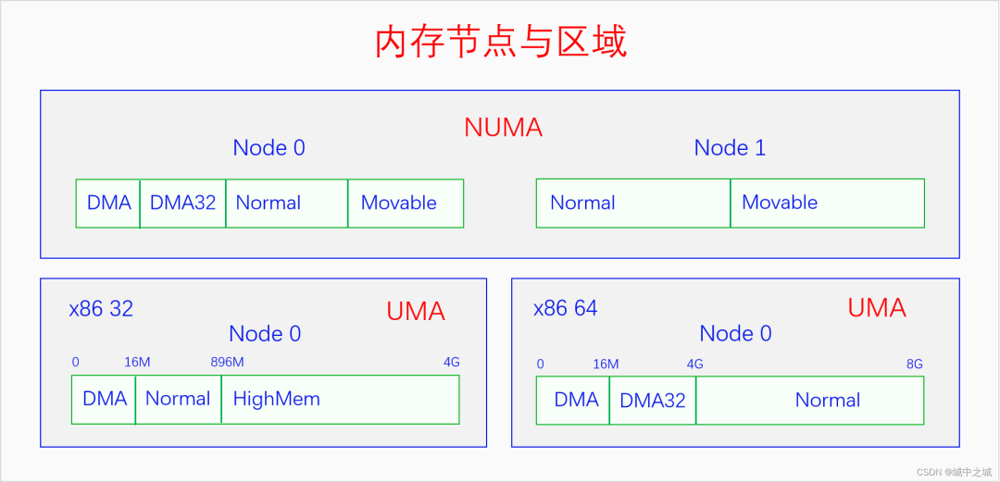  

## 三、物理内存分配

当我们把物理内存区划弄明白之后，再来学习物理内存分配就比较容易了。物理内存分配最底层的是页帧分配。页帧分配的分配单元是区域，分配粒度是页面。如何进行页帧分配呢？Linux采取的算法叫做伙伴系统(buddy system)。只有伙伴系统还不行，因为伙伴系统进行的是大粒度的分配，我们还需要批发与零售，于是便有了slab allocator和kmalloc。这几种内存分配方法分配的都是线性映射的内存，当系统连续内存不足的时候，Linux还提供了vmalloc用来分配非线性映射的内存。下面我们画图来看一下它们之间的关系。

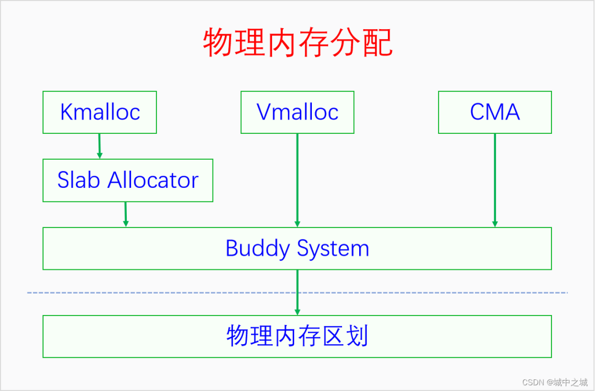

Buddy System既是直接的内存分配接口，也是所有其它内存分配器的底层分配器。Slab建立在Buddy的基础之上，Kmalloc又建立在Slab的基础之上。Vmalloc和CMA也是建立在Buddy的基础之上。Linux采取的这种内存分配体系提供了丰富灵活的内存接口，还能同时减少外部碎片和内部碎片。  

### 3.1 Buddy System

伙伴系统的基本管理单位是区域，最小分配粒度是页面。因为伙伴系统是建立在物理内存的三级区划上的，所以最小分配粒度是页面，不能比页面再小了。基本管理单位是区域，是因为每个区域的内存都有特殊的用途或者用法，不能随便混用，所以不能用节点作为基本管理单位。伙伴系统并不是直接管理一个个页帧的，而是把页帧组成页块(pageb lock)来管理，页块是由连续的2^n^个页帧组成，n叫做这个页块的阶，n的范围是0到10。而且2^n^个页帧还有对齐的要求，首页帧的页帧号(pfn)必须能除尽2^n^，比如3阶页块的首页帧(pfn)必须除以8(2^3^)能除尽，10阶页块的首页帧必须除以1024(2^10^)能除尽。0阶页块只包含一个页帧，任意一个页帧都可以构成一个0阶页块，而且符合对齐要求，因为任何整数除以1(2^0^)都能除尽。  

#### 3.1.1 伙伴系统的内存来源

伙伴系统管理的内存并不是全部的物理内存，而是内核在完成初步的初始化之后的未使用内存。内核在刚启动的时候有一个简单的早期内存管理器，它会记录系统的所有物理内存以及在它之前就被占用的内存，并为内核提供早期的内存分配服务。当内核的基础初始化完成之后，它就会把所有剩余可用的物理内存交给伙伴系统来管理，然后自己就退出历史舞台了。早期内存管理器会首先尝试把页帧以10阶页块的方式加入伙伴系统，不够10阶的以9阶页块的方式加入伙伴系统，以此类推，直到以0阶页块的方式把所有可用页帧都加入到伙伴系统。显而易见，内核刚启动的时候高阶页块比较多，低阶页块比较少。早期内存管理器以前是bootmem，后来是bootmem和memblock共存，可以通过config选择使用哪一个，现在是只有memblock了，bootmem已经被移出了内核。  

#### 3.1.2 伙伴系统的管理数据结构

伙伴系统的管理数据定义在区域描述符中，是结构体free_area的数组，数组大小是11，因为从0到10有11个数。free_area的定义如下所示：linux-src/include/linux/mmzone.h

```c
struct free_area {  
 struct list_head free_list[MIGRATE_TYPES];  
 unsigned long  nr_free;  
};  

enum migratetype {  
 MIGRATE_UNMOVABLE,  
 MIGRATE_MOVABLE,  
 MIGRATE_RECLAIMABLE,  
 MIGRATE_PCPTYPES, /* the number of types on the pcp lists */  
 MIGRATE_HIGHATOMIC = MIGRATE_PCPTYPES,  
#ifdef CONFIG_CMA  
 /*  
  * MIGRATE_CMA migration type is designed to mimic the way  
  * ZONE_MOVABLE works.  Only movable pages can be allocated  
  * from MIGRATE_CMA pageblocks and page allocator never  
  * implicitly change migration type of MIGRATE_CMA pageblock.  
  *  
  * The way to use it is to change migratetype of a range of  
  * pageblocks to MIGRATE_CMA which can be done by  
  * __free_pageblock_cma() function.  What is important though  
  * is that a range of pageblocks must be aligned to  
  * MAX_ORDER_NR_PAGES should biggest page be bigger than  
  * a single pageblock.  
  */  
 MIGRATE_CMA,  
#endif  
#ifdef CONFIG_MEMORY_ISOLATION  
 MIGRATE_ISOLATE, /* can't allocate from here */  
#endif  
 MIGRATE_TYPES  
};  
```

可以看到`free_area`的定义非常简单，就是由`MIGRATE_TYPES`个链表组成，链表连接的是同一个阶的迁移类型相同的页帧。迁移类型是内核为了减少内存碎片而提出的技术，不同区域的页块有不同的默认迁移类型，比如DMA、NORMAL默认都是不可迁移(`MIGRATE_UNMOVABLE`)的页块,HIGHMEM、MOVABLE区域默认都是可迁移(`MIGRATE_UNMOVABLE`)的页块。我们申请的内存有时候是不可移动的内存，比如内核线性映射的内存，有时候是可以移动的内存，比如用户空间缺页异常分配的内存。我们把不同迁移类型的内存分开进行分配，在进行内存碎片整理的时候就比较方便，不会出现一片可移动内存中夹着一个不可移动的内存(这种情况就很碍事)。如果要分配的迁移类型的内存不足时就需要从其它的迁移类型中进行盗页了。内核定义了每种迁移类型的后备类型，如下所示：linux-src/mm/page_alloc.c

```c
/*  
 * This array describes the order lists are fallen back to when  
 * the free lists for the desirable migrate type are depleted  
 */  
static int fallbacks[MIGRATE_TYPES][3] = {  
 [MIGRATE_UNMOVABLE]   = { MIGRATE_RECLAIMABLE, MIGRATE_MOVABLE,   MIGRATE_TYPES },  
 [MIGRATE_MOVABLE]     = { MIGRATE_RECLAIMABLE, MIGRATE_UNMOVABLE, MIGRATE_TYPES },  
 [MIGRATE_RECLAIMABLE] = { MIGRATE_UNMOVABLE,   MIGRATE_MOVABLE,   MIGRATE_TYPES },  
#ifdef CONFIG_CMA  
 [MIGRATE_CMA]         = { MIGRATE_TYPES }, /* Never used */  
#endif  
#ifdef CONFIG_MEMORY_ISOLATION  
 [MIGRATE_ISOLATE]     = { MIGRATE_TYPES }, /* Never used */  
#endif  
};  
```

一种迁移类型的页块被盗页之后，它的迁移类型就改变了，所以一个页块的迁移类型是会改变的，有可能变来变去。当物理内存比较少时，这种变来变去就会特别频繁，这样迁移类型带来的好处就得不偿失了。因此内核定义了一个变量`page_group_by_mobility_disabled`，当物理内存比较少时就禁用迁移类型。

伙伴系统管理页块的方式可以用下图来表示：

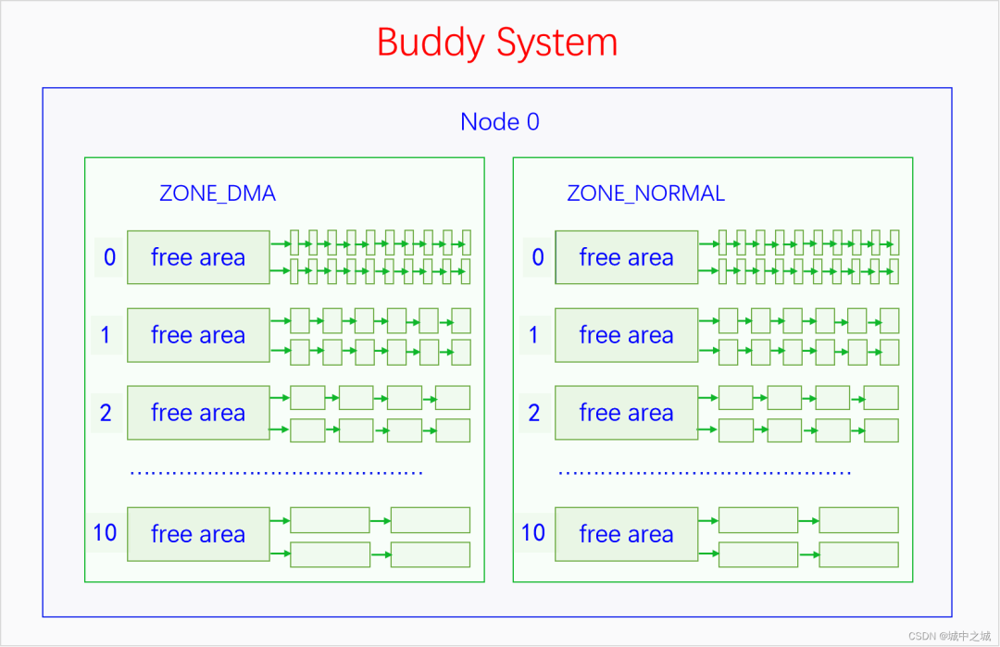  

#### 3.1.3 伙伴系统的算法逻辑

伙伴系统对外提供的接口只能分配某一阶的页块，并不能随意分配若干个页帧。当分配n阶页块时，伙伴系统会优先查找n阶页块的链表，如果不为空的话就拿出来一个分配。如果为空的就去找n+1阶页块的链表，如果不为空的话，就拿出来一个，并分成两个n阶页块，其中一个加入n阶页块的链表中，另一个分配出去。如果n+1阶页块链表也是空的话，就去找n+2阶页块的链表，如果不为空的话，就拿出来一个，然后分成两个n+1阶的页块，其中一个加入到n+1阶的链表中去，剩下的一个再分成两个n阶页块，其中一个放入n阶页块的链表中去，另一个分配出去。如果n+2阶页块的链表也是空的，那就去找n+3阶页块的链表，重复此逻辑，直到找到10阶页块的链表。如果10阶页块的链表也是空的话，那就去找后备迁移类型的页块去分配，此时从最高阶的页块链表往低阶页块的链表开始查找，直到查到为止。如果后备页块也分配不到内存，那么就会进行内存回收，这是下一章的内容。

用户用完内存还给伙伴系统的时候，并不是直接还给其对应的n阶页块的链表就行了，而是会先进行合并。比如你申请了一个0阶页块，用完了之后要归还，我们假设其页帧号是5，来推演一下其归还过程。如果此时发现4号页帧也是free的，则4和5会合并成一个1阶页块，首页帧号是4。如果4号页帧不是free的，则5号页帧直接还给0阶页块链表中去。如果6号页帧free呢，会不会和5号页帧合并？不会，因为不满足页帧号对齐要求。如果5和6合并，将会成为一个1阶页块，1阶页块要求其首页帧的页号必须除以2(2^1^)能除尽，而5除以2除不尽，所以5和6不能合并。而4和5合并之后，4除以2(2^1^)是能除尽的。4和5合并成一个1阶页块之后还要查看是否能继续合并，如果此时有一个1阶页块是free的，由6和7组成的，此时它们就会合并成一个2阶页块，包含4、5、6、7共4个页帧，而且符合对齐要求，4除以4(2^2^)是能除尽的。如果此时有一个1阶页块是free的，由2和3组成的，那么就不能合并，因为合并后的首页帧是2，2除以4(2^2^)是除不尽的。继续此流程，如果合并后的n阶页块的前面或者后面还有free的同阶页块，而且也符合对齐要求，就会继续合并，直到无法合并或者已经到达了10阶页块，才会停止合并，然后把其插入到对应的页块链表中去。  

#### 3.1.4 伙伴系统的接口

下面我们来看一下伙伴系统的接口。伙伴系统提供了两类接口，一类是返回页表描述符的，一类是返回虚拟内存地址的。linux-src/include/linux/gfp.h

```c
struct page *alloc_pages(gfp_t gfp, unsigned int order);  
#define alloc_page(gfp_mask) alloc_pages(gfp_mask, 0)  
struct page *alloc_pages_node(int nid, gfp_t gfp_mask,unsigned int order);  
void __free_pages(struct page *page, unsigned int order);  
#define __free_page(page) __free_pages((page), 0)  
```

释放的接口很简单，只需要一个页表描述符指针加一个阶数。分配的接口中，有的会指定nodeid，就从那个节点中分配内存。不指定nodeid的接口，如果是在UMA中，那就从唯一的节点中分配内存，如果是NUMA，会按照一定的策略选择在哪个节点中分配内存。最复杂的参数是gfp，gfp是标记参数，可以分为两类标记，一类是指定分配区域的，一类是指定分配行为的，下面我们来看一下。linux-src/include/linux/gfp.h

```C
#define ___GFP_DMA  0x01u  
#define ___GFP_HIGHMEM  0x02u  
#define ___GFP_DMA32  0x04u  
#define ___GFP_MOVABLE  0x08u  
#define ___GFP_RECLAIMABLE 0x10u  
#define ___GFP_HIGH  0x20u  
#define ___GFP_IO  0x40u  
#define ___GFP_FS  0x80u  
#define ___GFP_ZERO  0x100u  
#define ___GFP_ATOMIC  0x200u  
#define ___GFP_DIRECT_RECLAIM 0x400u  
#define ___GFP_KSWAPD_RECLAIM 0x800u  
#define ___GFP_WRITE  0x1000u  
#define ___GFP_NOWARN  0x2000u  
#define ___GFP_RETRY_MAYFAIL 0x4000u  
#define ___GFP_NOFAIL  0x8000u  
#define ___GFP_NORETRY  0x10000u  
#define ___GFP_MEMALLOC  0x20000u  
#define ___GFP_COMP  0x40000u  
#define ___GFP_NOMEMALLOC 0x80000u  
#define ___GFP_HARDWALL  0x100000u  
#define ___GFP_THISNODE  0x200000u  
#define ___GFP_ACCOUNT  0x400000u  
#define ___GFP_ZEROTAGS  0x800000u  
#define ___GFP_SKIP_KASAN_POISON 0x1000000u  
#ifdef CONFIG_LOCKDEP  
#define ___GFP_NOLOCKDEP 0x2000000u  
#else  
#define ___GFP_NOLOCKDEP 0  
#endif  
```

其中前4个是指定分配区域的，内核里一共定义了6类区域，为啥只有4个指示符呢？因为ZONE_DEVICE有特殊用途，不在一般的内存分配管理中，当不指定区域类型时默认就是`ZONE_NORMAL`，所以4个就够了。是不是指定了哪个区域就只能在哪个区域分配内存呢，不是的。每个区域都有后备区域，当其内存不足时，会从其后备区域中分配内存。后备区域是在节点描述符中定义，我们来看一下：linux-src/include/linux/mmzone.h

```c
typedef struct pglist_data {  
 struct zonelist node_zonelists[MAX_ZONELISTS];  
} pg_data_t;  

enum {  
 ZONELIST_FALLBACK, /* zonelist with fallback */  
#ifdef CONFIG_NUMA  
 /*  
  * The NUMA zonelists are doubled because we need zonelists that  
  * restrict the allocations to a single node for __GFP_THISNODE.  
  */  
 ZONELIST_NOFALLBACK, /* zonelist without fallback (__GFP_THISNODE) */  
#endif  
 MAX_ZONELISTS  
};  

struct zonelist {  
 struct zoneref _zonerefs[MAX_ZONES_PER_ZONELIST + 1];  
};  

struct zoneref {  
 struct zone *zone; /* Pointer to actual zone */  
 int zone_idx;  /* zone_idx(zoneref->zone) */  
};  
```

在UMA上，后备区域只有一个链表，就是本节点内的后备区域，在NUMA中后备区域有两个链表，包括本节点内的后备区域和其它节点的后备区域。这些后备区域是在内核启动时初始化的。对于本节点的后备区域，是按照区域类型的id排列的，高id的排在前面，低id的排在后面，后面的是前面的后备，前面的区域内存不足时可以从后面的区域里分配内存，反过来则不行。比如MOVABLE区域的内存不足时可以从NORMAL区域来分配，NORMAL区域的内存不足时可以从DMA区域来分配，反过来则不行。对于其它节点的后备区域，除了会符合前面的规则之外，还会考虑后备区域是按照节点优先的顺序来排列还是按照区域类型优先的顺序来排列。

下面我们再来看一下分配行为的flag都是什么含义。

`__GFP_HIGH`：调用者的优先级很高，要尽量满足分配请求。

`__GFP_ATOMIC`：调用者处在原子场景中，分配过程不能回收页或者睡眠，一般是中断处理程序会用。

`__GFP_IO`：可以进行磁盘IO操作。

`__GFP_FS`：可以进行文件系统的操作。

`__GFP_KSWAPD_RECLAIM`：当内存不足时允许异步回收。

`__GFP_RECLAIM`：当内存不足时允许同步回收和异步回收。

`__GFP_REPEAT`：允许重试，重试多次以后还是没有内存就返回失败。

`__GFP_NOFAIL`：不能失败，必须无限次重试。

`__GFP_NORETRY`：不要重试，当直接回收和内存规整之后还是分配不到内存的话就返回失败。

`__GFP_ZERO`：把要分配的页清零。

还有一些其它的flag就不再一一进行介绍了。

如果我们每次分配内存都把这些flag一一进行组合，那就太麻烦了，所以系统为我们定义了一些常用的组合，如下所示：linux-src/include/linux/gfp.h

```c
#define GFP_ATOMIC (__GFP_HIGH|__GFP_ATOMIC|__GFP_KSWAPD_RECLAIM)  
#define GFP_KERNEL (__GFP_RECLAIM | __GFP_IO | __GFP_FS)  
#define GFP_NOIO (__GFP_RECLAIM)  
#define GFP_NOFS (__GFP_RECLAIM | __GFP_IO)  
#define GFP_USER (__GFP_RECLAIM | __GFP_IO | __GFP_FS | __GFP_HARDWALL)  
#define GFP_DMA  __GFP_DMA  
#define GFP_DMA32 __GFP_DMA32  
#define GFP_HIGHUSER (GFP_USER | __GFP_HIGHMEM)  
#define GFP_HIGHUSER_MOVABLE (GFP_HIGHUSER | __GFP_MOVABLE | __GFP_SKIP_KASAN_POISON)  
```

中断中分配内存一般用GFP_ATOMIC，内核自己使用的内存一般用`GFP_KERNEL`，为用户空间分配内存一般用`GFP_HIGHUSER_MOVABLE`。

我们再来看一下直接返回虚拟内存的接口函数。linux-src/include/linux/gfp.h

```c
unsigned long __get_free_pages(gfp_t gfp_mask, unsigned int order);  
#define __get_free_page(gfp_mask)  __get_free_pages((gfp_mask), 0)  
#define __get_dma_pages(gfp_mask, order) __get_free_pages((gfp_mask) | GFP_DMA, (order))  
unsigned long get_zeroed_page(gfp_t gfp_mask);  
void free_pages(unsigned long addr, unsigned int order);  
#define free_page(addr) free_pages((addr), 0)  
```

此接口不能分配HIGHMEM中的内存，因为HIGHMEM中的内存不是直接映射到内核空间中去的。除此之外这个接口和前面的没有区别，其参数函数也跟前面的一样，就不再赘述了。  

#### 3.1.5 伙伴系统的实现

下面我们再来看一下伙伴系统的分配算法。linux-src/mm/page_alloc.c

```c
/*  
 * This is the 'heart' of the zoned buddy allocator.  
 */  
struct page *__alloc_pages(gfp_t gfp, unsigned int order, int preferred_nid,  
       nodemask_t *nodemask)  
{  
 struct page *page;  
   
 /* First allocation attempt */  
 page = get_page_from_freelist(alloc_gfp, order, alloc_flags, &ac);  
 if (likely(page))  
  goto out;  
 page = __alloc_pages_slowpath(alloc_gfp, order, &ac);  
out:  
 return page;  
}  
```

伙伴系统的所有分配接口最终都会使用`__alloc_pages`这个函数来进行分配。对这个函数进行删减之后，其逻辑也比较简单清晰，先使用函数`get_page_from_freelist`直接从`free_area`中进行分配，如果分配不到就使用函数`__alloc_pages_slowpath`进行内存回收。内存回收的内容在下一章里面讲。  

### 3.2 Slab Allocator

伙伴系统的最小分配粒度是页面，但是内核中有很多大量的同一类型结构体的分配请求，比如说进程的结构体`task_struct`，如果使用伙伴系统来分配显然不合适，如果自己分配一个页面，然后可以分割成多个`task_struct`，显然也很麻烦，于是内核中给我们提供了slab分配机制来满足这种需求。Slab的基本思想很简单，就是自己先从伙伴系统中分配一些页面，然后把这些页面切割成一个个同样大小的基本块，用户就可以从slab中申请分配一个同样大小的内存块了。如果slab中的内存不够用了，它会再向伙伴系统进行申请。不同的slab其基本块的大小并不相同，内核的每个模块都要为自己的特定需求分配特定的slab，然后再从这个slab中分配内存。

刚开始的时候内核中就只有一个slab，其接口和实现都叫slab。但是后来内核中又出现了两个slab实现，slob和slub。slob是针对嵌入式系统进行优化的，slub是针对内存比较多的系统进行优化的，它们的接口还是slab。由于现在的计算机内存普遍都比较大，连手机的的内存都6G、8G起步了，所以现在除了嵌入式系统之外，内核默认使用的都是slub。下面我们画个图看一下它们的关系。


可以看到Slab在不同的语境下有不同的含义，有时候指的是整个Slab机制，有时候指的是Slab接口，有时候指的是Slab实现。如果我们在讨论问题的时候遇到了歧义，可以加上汉语后缀以明确语义。  

#### 3.2.1 Slab接口

下面我们来看一下slab的接口：linux-src/include/linux/slab.h

```c
struct kmem_cache *kmem_cache_create(const char *name, unsigned int size,  
   unsigned int align, slab_flags_t flags,  
   void (*ctor)(void *));  
void kmem_cache_destroy(struct kmem_cache *);  
void *kmem_cache_alloc(struct kmem_cache *, gfp_t flags);  
void kmem_cache_free(struct kmem_cache *, void *);  
```

我们在使用slab时首先要创建slab，创建slab用的是接口`kmem_cache_create`，其中最重要的参数是size，它是基本块的大小，一般我们都会传递sizeof某个结构体。创建完slab之后，我们用`kmem_cache_alloc`从slab中分配内存，第一个参数指定哪个是从哪个slab中分配，第二个参数gfp指定如果slab的内存不足了如何从伙伴系统中去分配内存，gfp的函数和前面伙伴系统中讲的相同，此处就不再赘述了，函数返回的是一个指针，其指向的内存大小就是slab在创建时指定的基本块的大小。当我们用完一块内存时，就要用`kmem_cache_free`把它还给slab，第一个参数指定是哪个slab，第二个参数是我们要返回的内存。如果我们想要释放整个slab的话，就使用接口`kmem_cache_destroy`。  

#### 3.2.2 Slab实现

暂略  

#### 3.2.3 Slob实现

暂略  

#### 3.2.4 Slub实现

暂略  

### 3.3 Kmalloc

内存中还有一些偶发的零碎的内存分配需求，一个模块如果仅仅为了分配一次5字节的内存，就去创建一个slab，那显然不划算。为此内核创建了一个统一的零碎内存分配器kmalloc，用户可以直接请求kmalloc分配若干个字节的内存。Kmalloc底层用的还是slab机制，kmalloc在启动的时候会预先创建一些不同大小的slab，用户请求分配任意大小的内存，kmalloc都会去大小刚刚满足的slab中去分配内存。

下面我们来看一下kmalloc的接口：linux-src/include/linux/slab.h

```c
void *kmalloc(size_t size, gfp_t flags);  
void kfree(const void *);  
```

可以看到kmalloc的接口很简单，使用接口kmalloc就可以分配内存，第一个参数是你要分配的内存大小，第二个参数和伙伴系统的参数是一样的，这里就不再赘述了，返回值是一个内存指针，用这个指针就可以访问分配到的内存了。内存使用完了之后用kfree进行释放，参数是刚才分配到的内存指针。

我们以slub实现为例讲一下kmalloc的逻辑。Kmalloc中会定义一个全局的slab指针的二维数组，第一维下标代表的是kmalloc的类型，默认有四种类型，分别有DMA和NORMAL，这两个代表的是gfp中的区域，还有两个是CGROUP和RECLAIM，CGROUP代表的是在memcg中分配内存，RECLAIM代表的是可回收内存。第二维下标代表的是基本块大小的2的对数，不过下标0、1、2是例外，有特殊含义。在系统初始化的时候，会初始化这个数组，创建每一个slab，下标0除外，下标1对应的slab的基本块大小是96，下标2对应的slab的基本块的大小是192。在用kmalloc分配内存的时候，会先处理特殊情况，当size是0的时候直接返回空指针，当size大于8k的时候会则直接使用伙伴系统进行分配。然后先根据gfp参数选择kmalloc的类型，再根据size的大小选择index。如果2^n-1^+1 < size <= 2^n^，则index等于n，但是有特殊情况，当 64 < size <= 96时，index等于1，当 128 < size <= 192时，index等于2。Type和index都确定好之后，就找到了具体的slab了，就可以从这个slab中分配内存了。  

### 3.4 Vmalloc

暂略  

### 3.5 CMA

暂略  

## 四、物理内存回收

内存作为系统最宝贵的资源，总是不够用的。当内存不足的时候就要对内存进行回收了。内存回收按照回收时机可以分为同步回收和异步回收，同步回收是指在分配内存的时候发现无法分配到内存就进行回收，异步回收是指有专门的线程定期进行检测，如果发现内存不足就进行回收。内存回收的类型有两种，一是内存规整，也就是内存碎片整理，它不会增加可用内存的总量，但是会增加连续可用内存的量，二是页帧回收，它会把物理页帧的内容写入到外存中去，然后解除其与虚拟内存的映射，这样可用物理内存的量就增加了。内存回收的时机和类型是正交关系，同步回收中会使用内存规整和页帧回收，异步回收中也会使用内存规整和页帧回收。在异步回收中，内存规整有单独的线程kcompactd，此类线程一个node一个，线程名是[kcompactd/nodeid]，页帧回收也有单独的线程kswapd，此类线程也是一个node一个，线程名是[kswapd/nodeid]。在同步回收中，还有一个大杀器，那就是OOM Killer，OOM是内存耗尽的意思，当内存耗尽，其它所有的内存回收方法也回收不到内存的时候，就会使用这个大杀器。下面我们画个图来看一下：

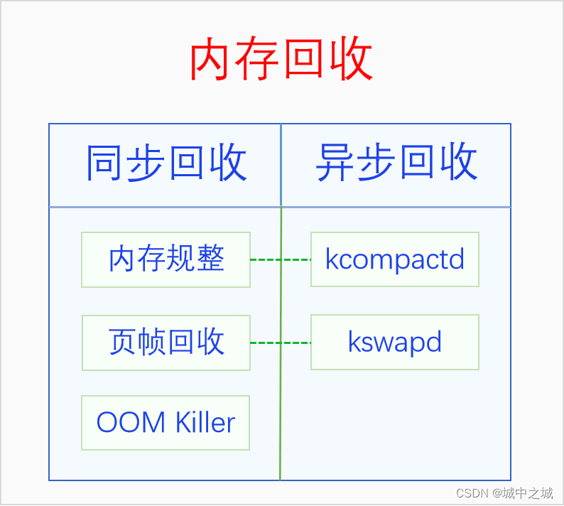  

### 4.1 内存规整

系统运行的时间长了，内存一会儿分配一会儿释放，慢慢地可用内存就会变得很碎片化不连续。虽然总的可用内存还不少，但是却无法分配大块连续内存，此时就需要进行内存规整了。内存规整是以区域为基本单位，找到可用移动的页帧，把它们都移到同一端，然后连续可用内存的量就增大了。其逻辑如下图所示：

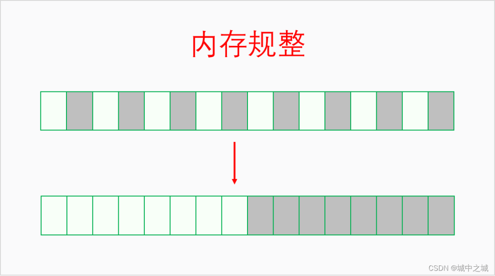  

### 4.2 页帧回收

内存规整只是增加了连续内存的量，但是可用内存的量并没有增加，当可用内存量不足的时候就要进行页帧回收。对于内核来说，其虚拟内存和物理内存的映射关系是不能解除的，所以必须同时回收物理内存和虚拟内存。对此采取的办法是让内核的每个模块都注册shrinker，当内存紧张时通过shrinker的回调函数通知每个模块尽量释放自己暂时用不到的内存。对于用户空间，其虚拟内存和物理内存的映射关系是可以解除的，我们可以先把其物理内存上的内容保存到外存上去，然后再解除映射关系，这样其物理内存就被回收了，就可以拿做它用了。如果程序后来又用到了这段内存，程序访问其虚拟内存的时候就会发生缺页异常，在缺页异常里再给它分配物理内存，并把其内容从外存中加载建立，这样程序还是能正常运行的。进程的内存页可以分为两种类型：一种是文件页，其内容来源于文件，如程序的代码区、数据区；一种是匿名页，没有内容来源，由内核直接为其分配内存，如进程的堆和栈。对于文件页，有两种情况：一种情况是文件页是clean的，也就是和外存中的内容是一样的，此时我们可以直接丢弃文件页，后面用到时再从外存中加载进来；另一种情况是文件页是dirty的，也就是其经历过修改，和外存中的内容不同，此时要先把文件页的内容写入到外存中，然后才能回收其内存。对于匿名页，由于其没有文件做后备，没办法对其进行回收。此时就需要swap作为匿名页的后备存储了，有了swap之后，匿名页也可以进行回收了。Swap是外存中的一片空间，可以是一个分区，也可以是文件，具体原理请看下一节。

页帧回收时如何选择回收哪些文件页、匿名页，不回收哪些文件页、匿名页呢，以及文件页和匿名页各回收多少比例呢？内核把所有的文件页放到两个链表上，活跃文件页和不活跃文件页，回收的时候只会回收不活跃文件页。内核把所有的匿名页也放到两个链表上，活跃匿名页和不活跃匿名页，回收的时候只会回收不活跃匿名页。有一个参数/proc/sys/vm/swappiness控制着匿名页和文件页之间的回收比例。

在回收文件页和匿名页的时候是需要把它们的虚拟内存映射给解除掉的。由于一个物理页帧可能会同时映射到多个虚拟内存上，包括映射到多个进程或者同一个进程的不同地址上，所以我们需要找到一个物理页帧所映射的所有虚拟内存。如何找到物理内存所映射的虚拟内存呢，这个过程就叫做反向映射(rmap)。之所以叫反向映射是因为正常的映射都是从虚拟内存映射到物理内存。  

### 4.3 交换区

暂略  

### 4.4 OOM Killer

如果用尽了上述所说的各种办法还是无法回收到足够的物理内存，那就只能使出杀手锏了，OOM Killer，通过杀死进程来回收内存。其触发点在`linux-src/mm/page_alloc.c:__alloc_pages_may_oom`，当使用各种方法都回收不到内存时会调用`out_of_memory`函数。

下面我们来看一下`out_of_memory`函数的实现(经过高度删减)：`linux-src/mm/oom_kill.c:out_of_memory`

```c
bool out_of_memory(struct oom_control *oc)  
{  
    select_bad_process(oc);  
    oom_kill_process(oc, "Out of memory");  
}  
```

`out_of_memory`函数的代码逻辑还是非常简单清晰的，总共有两步，1.先选择一个要杀死的进程，2.杀死它。`oom_kill_process`函数的目的很简单，但是实现过程也有点复杂，这里就不展开分析了，大家可以自行去看一下代码。我们重点分析一下`select_bad_process`函数的逻辑，`select_bad_process`主要是依靠`oom_score`来进行进程选择的。我们先来看一下和`oom_score`有关的三个文件。

`/proc//oom_score` 系统计算出来的`oom_score`值，只读文件，取值范围0 –- 1000，0代表never kill，1000代表aways kill，值越大，进程被选中的概率越大。

`/proc//oom_score_adj` 让用户空间调节`oom_score`的接口，root可读写，取值范围 -1000 --- 1000，默认为0，若为 -1000，则oom_score加上此值一定小于等于0，从而变成never
kill进程。OS可以把一些关键的系统进程的`oom_score_adj`设为-1000，从而避免被oom kill。

`/proc//oom_adj` 旧的接口文件，为兼容而保留，root可读写，取值范围 -16 — 15，会被线性映射到`oom_score_adj`，特殊值-17代表 `OOM_DISABLE`。大家尽量不要再用此接口。

下面我们来分析一下`select_bad_process`函数的实现：

```c
static void select_bad_process(struct oom_control *oc)  
{  
 oc->chosen_points = LONG_MIN;  
 struct task_struct *p;  
 rcu_read_lock();  
 for_each_process(p)  
  if (oom_evaluate_task(p, oc))  
   break;  
 rcu_read_unlock();  
}  
```

函数首先把`chosen_points`初始化为最小的Long值，这个值是用来比较所有的`oom_score`值，最后谁的值最大就选中哪个进程。然后函数已经遍历所有进程，计算其`oom_score`，并更新`chosen_points`和被选中的task，有点类似于选择排序。我们继续看`oom_evaluate_task`函数是如何评估每个进程的函数。

```c
static int oom_evaluate_task(struct task_struct *task, void *arg)
{
 struct oom_control *oc = arg;
 long points;
 if (oom_unkillable_task(task))
  goto next;
 /* p may not have freeable memory in nodemask */
 if (!is_memcg_oom(oc) && !oom_cpuset_eligible(task, oc))
  goto next;
 if (oom_task_origin(task)) {
  points = LONG_MAX;
  goto select;
 }
 points = oom_badness(task, oc->totalpages);
 if (points == LONG_MIN || points < oc->chosen_points)
  goto next;
select:
 if (oc->chosen)
  put_task_struct(oc->chosen);
 get_task_struct(task);
 oc->chosen = task;
 oc->chosen_points = points;
next:
 return 0;
abort:
 if (oc->chosen)
  put_task_struct(oc->chosen);
 oc->chosen = (void *)-1UL;
 return 1;
}
```

此函数首先会跳过所有不适合kill的进程，如init进程、内核线程、`OOM_DISABLE`进程等。然后通过`select_bad_process`算出此进程的得分points 也就是`oom_score`，并和上一次的胜出进程进行比较，如果小的会话就会goto next 返回，如果大的话就会更新oc->chosen的task 和 `chosen_points` 也就是目前最高的`oom_score`。那么 `oom_badness`是如何计算的呢？

```c
long oom_badness(struct task_struct *p, unsigned long totalpages)  
{  
 long points;  
 long adj;  
 if (oom_unkillable_task(p))  
  return LONG_MIN;  
 p = find_lock_task_mm(p);  
 if (!p)  
  return LONG_MIN;  
 adj = (long)p->signal->oom_score_adj;  
 if (adj == OOM_SCORE_ADJ_MIN ||  
   test_bit(MMF_OOM_SKIP, &p->mm->flags) ||  
   in_vfork(p)) {  
  task_unlock(p);  
  return LONG_MIN;  
 }  
 points = get_mm_rss(p->mm) + get_mm_counter(p->mm, MM_SWAPENTS) +  
  mm_pgtables_bytes(p->mm) / PAGE_SIZE;  
 task_unlock(p);  
 adj *= totalpages / 1000;  
 points += adj;  
 return points;  
}  
```

`oom_badness`首先把unkiller的进程也就是init进程内核线程直接返回 `LONG_MIN`，这样它们就不会被选中而杀死了，这里看好像和前面的检测冗余了，但是实际上这个函数还被`/proc//oom_score`的show函数调用用来显示数值，所以还是有必要的，这里也说明了一点，`oom_score`的值是不保留的，每次都是即时计算。然后又把`oom_score_adj`为-1000的进程直接也返回LONG_MIN，这样用户空间专门设置的进程就不会被kill了。最后就是计算`oom_score`了，计算方法比较简单，就是此进程使用的RSS驻留内存、页表、swap之和越大，也就是此进程所用的总内存越大，`oom_score`的值就越大，逻辑简单直接，谁用的物理内存最多就杀谁，这样就能够回收更多的物理内存，而且使用内存最多的进程很可能是内存泄漏了，所以此算法虽然很简单，但是也很合理。

可能很多人会觉得这里讲的不对，和自己在网上的看到的逻辑不一样，那是因为网上有很多讲`oom_score`算法的文章都是基于2.6版本的内核讲的，那个算法比较复杂，会考虑进程的nice值，nice值小的，`oom_score`会相应地降低，也会考虑进程的运行时间，运行时间越长，`oom_score`值也会相应地降低，因为当时认为进程运行的时间长消耗内存多是合理的。但是这个算法会让那些缓慢内存泄漏的进程逃脱制裁。因此后来这个算法就改成现在这样的了，只考虑谁用的内存多就杀谁，简洁高效。  

## 五、物理内存压缩

暂略  

### 5.1 ZRAM

### 5.2 ZSwap

### 5.3 ZCache

## 六、虚拟内存映射

开启分页内存机制之后，CPU访问一切内存都要通过虚拟内存地址访问，CPU把虚拟内存地址发送给MMU，MMU把虚拟内存地址转换为物理内存地址，然后再用物理内存地址通过MC(内存控制器)访问内存。MMU里面有两个部件，TLB和PTW。TLB可以意译地址转换缓存器，它是缓存虚拟地址解析结果的地方。PTW可以意译为虚拟地址解析器，它负责解析页表，把虚拟地址转换为物理地址，然后再送去MC进行访问。同时其转换结果也会被送去TLB进行缓存，下次再访问相同虚拟地址的时候就不用再去解析了，可以直接用缓存的结果。

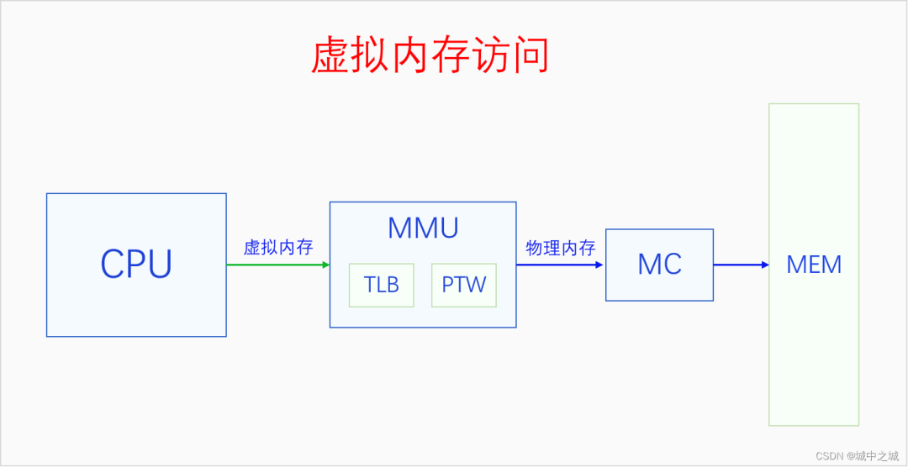  

### 6.1 页表

虚拟地址映射的基本单位是页面不是字节，一个虚拟内存的页面会被映射到一个物理页帧上。MMU把虚拟地址转换为物理地址的方法是通过查找页表。一个页表的大小也是一个页面，4K大小，页表的内容可以看做是页表项的数组，一个页表项是一个物理地址，指向一个物理页帧，在32位系统上，物理地址是32位也就是4个字节，所以一个页表有4K/4=1024项，每一项指向一个物理页帧，大小是4K，所以一个页表可以表达4M的虚拟内存,要想表达4G的虚拟内存空间，需要有1024个页表才行，每个页表4K，一共需要4M的物理内存。4M的物理内存看起来好像不大，但是每个进程都需要有4M的物理内存做页表，如果有100个进程，那就需要有400M物理内存，这就太浪费物理内存了，而且大部分时候，一个进程的大部分虚拟内存空间并没有使用。为此我们可以采取两级页表的方法来进行虚拟内存映射。在多级页表体系中，最后一级页表还叫页表，其它的页表叫做页目录，但是我们有时候也会都叫做页表。对于两级页表体系，一级页表还是一个页面，4K大小，每个页表项还是4个字节，一共有1024项，一级页表的页表项是二级页表的物理地址，指向二级页表，二级页表的内容和前面一样。一级页表只有一个，4K，有1024项，指向1024个二级页表，一个一级页表项也就是一个二级页表可以表达4M虚拟内存，一级页表总共能表达4G虚拟内存，此时所有页表占用的物理内存是4M加4K。看起来使用二级页表好像还多用了4K内存，但是在大多数情况下，很多二级页表都用不上，所以不用分配内存。如果一个进程只用了8M物理内存，那么它只需要一个一级页表和两个二级页表就行了，一级页表中只需要使用两项指向两个二级页表，两个二级页表填充满，就可以表达8M虚拟内存映射了，此时总共用了3个页表，12K物理内存，页表的内存占用大大减少了。所以在32位系统上，采取的是两级页表的方式，每级的一个页表都是1024项，32位虚拟地址正好可以分成三份，10、10、12，第一个10位可以用于在一级页表中寻址，第二个10位在二级页表中寻址，最后12位可以表达一个页面中任何一个字节。

在64位系统上，一个页面还是4K大小，一个页表还是一个页面，但是由于物理地址是64位的，所以一个页表项变成了8个字节，一个页表就只有512个页表项了，这样一个页表就只能表达2M虚拟内存了。寻址512个页表项只需要9位就够了。在x86 64上，虚拟地址有64位，但是64位的地址空间实在是太大了，所以我们只需要用其中一部分就行了。x86 64上有两种虚拟地址位数可选，48位和57位，分别对应着四级页表和五级页表。为啥是四级页表和五级页表呢？因为48=9+9+9+12,57=9+9+9+9+12,12可以寻址一个页面内的每一个字节，9可以寻址一级页表中的512个页表项。

Linux内核最多支持五级页表，在五级页表体系中，每一级页表分别叫做PGD、P4D、PUD、PMD、PTE。如果页表不够五级的，从第二级开始依次去掉一级。

页表项是下一级页表或者最终页帧的物理地址，页表也是一个页帧，页帧的地址都是4K对齐的，所以页表项中的物理地址的最后12位一定都是0，既然都是0，那么就没必要表示出来了，我们就可以把这12位拿来做其它用途了。下面我们来看一下x86的页表项格式。


这是32位的页表项格式，其中12-31位是物理地址。

P，此页表项是否有效，1代表有效，0代表无效，为0时其它字段无意义。

R/W，0代表只读，1代表可读写。

U/S，0代表内核页表，1代表用户页面。

PWT，Page-level write-through

PCD，Page-level cache disable

A，Accessed; indicates whether software has accessed the page

D，Dirty; indicates whether software has written to the page

PAT，If the PAT is supported, indirectly determines the memory type used to access the page

G，Global; determines whether the translation is global

64位系统的页表项格式和这个是一样的，只不过是物理地址扩展到了硬件支持的最高物理地址位数。  

### 6.2 MMU

MMU是通过遍历页表把虚拟地址转换为物理地址的。其过程如下所示：

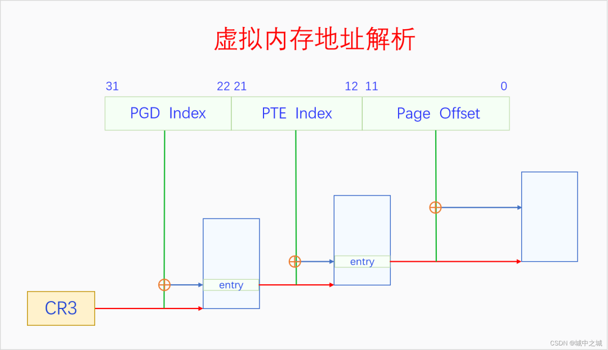

CR3是CPU的寄存器，存放的是PGD的物理地址。MMU首先通过CR3获取PGD的物理地址，然后以虚拟地址的31-22位为index，在PGD中找到相应的页表项，先检测页表项的P是否存在，R/W是否有读写权限，U/S是否有访问权限，如果检测都通过了，则进入下一步，如果没通过则触发缺页异常。关于中断与异常的基本原理请参看《深入理解Linux中断机制》。如果检测通过了，页表项的31-12位代表PTE的物理地址，取虚拟地址中的21-12位作为index，在PTE中找到对应的页表项，也是先各种检测，如果没通过则触发缺页异常。如果通过了，则31-12位代表最终页帧的物理地址，然后把虚拟地址的11-0位作为页内偏移加上去，就找到了虚拟地址对应的物理地址了，然后送到MC进行访问。64位系统的逻辑和32位是相似的，只不过是多了几级页表而已，就不再赘述了。

一个进程的所有页表通过页表项的指向构成了一个页表树，页表树的根节点是PGD，根指针是CR3。页表树中所有的地址都是物理地址，MMU在遍历页表树时使用物理地址可以直接访问内存。一个页表只有加入了某个页表树才有意义，孤立的页表是没有意义的。每个进程都有一个页表树，切换进程就会切换页表树，切换页表树的方法是给CR3赋值，让其指向当前进程的页表树的根节点也就是PGD。进程的虚拟内存空间分为两部分，内核空间和用户空间，所有进程的内核空间都是共享的，所以所有进程的页表树根节点的内核子树都相同。

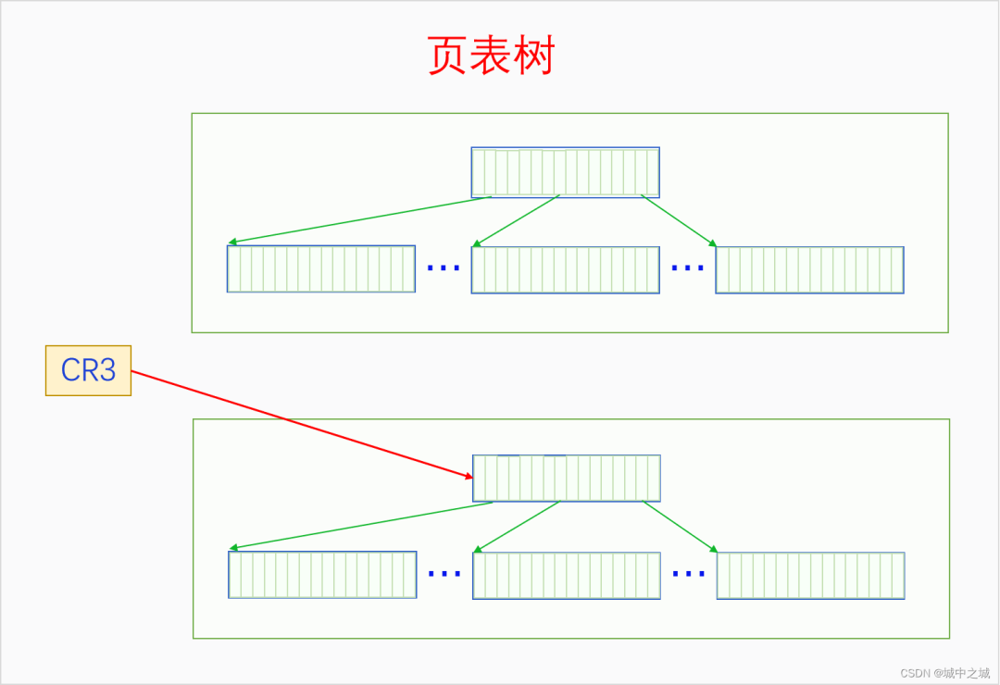  

### 6.3 缺页异常

MMU在解析虚拟内存时如果发现了读写错误或者权限错误或者页表项无效，就会触发缺页异常让内核来处理。下面我们来看一下x86的缺页异常处理的过程。linux-src/arch/x86/mm/fault.c

```c
DEFINE_IDTENTRY_RAW_ERRORCODE(exc_page_fault)
{
 unsigned long address = read_cr2();
 irqentry_state_t state;

 prefetchw(&current->mm->mmap_lock);

 if (kvm_handle_async_pf(regs, (u32)address))
  return;

 state = irqentry_enter(regs);

 instrumentation_begin();
 handle_page_fault(regs, error_code, address);
 instrumentation_end();

 irqentry_exit(regs, state);
}

static __always_inline void
handle_page_fault(struct pt_regs *regs, unsigned long error_code,
         unsigned long address)
{
 trace_page_fault_entries(regs, error_code, address);

 if (unlikely(kmmio_fault(regs, address)))
  return;

 /* Was the fault on kernel-controlled part of the address space? */
 if (unlikely(fault_in_kernel_space(address))) {
  do_kern_addr_fault(regs, error_code, address);
 } else {
  do_user_addr_fault(regs, error_code, address);
  /*
   * User address page fault handling might have reenabled
   * interrupts. Fixing up all potential exit points of
   * do_user_addr_fault() and its leaf functions is just not
   * doable w/o creating an unholy mess or turning the code
   * upside down.
   */
  local_irq_disable();
 }
}

static void
do_kern_addr_fault(struct pt_regs *regs, unsigned long hw_error_code,
     unsigned long address)
{
 WARN_ON_ONCE(hw_error_code & X86_PF_PK);

#ifdef CONFIG_X86_32
 if (!(hw_error_code & (X86_PF_RSVD | X86_PF_USER | X86_PF_PROT))) {
  if (vmalloc_fault(address) >= 0)
   return;
 }
#endif

 if (is_f00f_bug(regs, hw_error_code, address))
  return;

 /* Was the fault spurious, caused by lazy TLB invalidation? */
 if (spurious_kernel_fault(hw_error_code, address))
  return;

 /* kprobes don't want to hook the spurious faults: */
 if (WARN_ON_ONCE(kprobe_page_fault(regs, X86_TRAP_PF)))
  return;

 bad_area_nosemaphore(regs, hw_error_code, address);
}

static inline
void do_user_addr_fault(struct pt_regs *regs,
   unsigned long error_code,
   unsigned long address)
{
 struct vm_area_struct *vma;
 struct task_struct *tsk;
 struct mm_struct *mm;
 vm_fault_t fault;
 unsigned int flags = FAULT_FLAG_DEFAULT;

 tsk = current;
 mm = tsk->mm;

 if (unlikely((error_code & (X86_PF_USER | X86_PF_INSTR)) == X86_PF_INSTR)) {
  /*
   * Whoops, this is kernel mode code trying to execute from
   * user memory.  Unless this is AMD erratum #93, which
   * corrupts RIP such that it looks like a user address,
   * this is unrecoverable.  Don't even try to look up the
   * VMA or look for extable entries.
   */
  if (is_errata93(regs, address))
   return;

  page_fault_oops(regs, error_code, address);
  return;
 }

 /* kprobes don't want to hook the spurious faults: */
 if (WARN_ON_ONCE(kprobe_page_fault(regs, X86_TRAP_PF)))
  return;

 /*
  * Reserved bits are never expected to be set on
  * entries in the user portion of the page tables.
  */
 if (unlikely(error_code & X86_PF_RSVD))
  pgtable_bad(regs, error_code, address);

 /*
  * If SMAP is on, check for invalid kernel (supervisor) access to user
  * pages in the user address space.  The odd case here is WRUSS,
  * which, according to the preliminary documentation, does not respect
  * SMAP and will have the USER bit set so, in all cases, SMAP
  * enforcement appears to be consistent with the USER bit.
  */
 if (unlikely(cpu_feature_enabled(X86_FEATURE_SMAP) &&
       !(error_code & X86_PF_USER) &&
       !(regs->flags & X86_EFLAGS_AC))) {
  /*
   * No extable entry here.  This was a kernel access to an
   * invalid pointer.  get_kernel_nofault() will not get here.
   */
  page_fault_oops(regs, error_code, address);
  return;
 }

 /*
  * If we're in an interrupt, have no user context or are running
  * in a region with pagefaults disabled then we must not take the fault
  */
 if (unlikely(faulthandler_disabled() || !mm)) {
  bad_area_nosemaphore(regs, error_code, address);
  return;
 }

 /*
  * It's safe to allow irq's after cr2 has been saved and the
  * vmalloc fault has been handled.
  *
  * User-mode registers count as a user access even for any
  * potential system fault or CPU buglet:
  */
 if (user_mode(regs)) {
  local_irq_enable();
  flags |= FAULT_FLAG_USER;
 } else {
  if (regs->flags & X86_EFLAGS_IF)
   local_irq_enable();
 }

 perf_sw_event(PERF_COUNT_SW_PAGE_FAULTS, 1, regs, address);

 if (error_code & X86_PF_WRITE)
  flags |= FAULT_FLAG_WRITE;
 if (error_code & X86_PF_INSTR)
  flags |= FAULT_FLAG_INSTRUCTION;

#ifdef CONFIG_X86_64
 /*
  * Faults in the vsyscall page might need emulation.  The
  * vsyscall page is at a high address (>PAGE_OFFSET), but is
  * considered to be part of the user address space.
  *
  * The vsyscall page does not have a "real" VMA, so do this
  * emulation before we go searching for VMAs.
  *
  * PKRU never rejects instruction fetches, so we don't need
  * to consider the PF_PK bit.
  */
 if (is_vsyscall_vaddr(address)) {
  if (emulate_vsyscall(error_code, regs, address))
   return;
 }
#endif

 /*
  * Kernel-mode access to the user address space should only occur
  * on well-defined single instructions listed in the exception
  * tables.  But, an erroneous kernel fault occurring outside one of
  * those areas which also holds mmap_lock might deadlock attempting
  * to validate the fault against the address space.
  *
  * Only do the expensive exception table search when we might be at
  * risk of a deadlock.  This happens if we
  * 1. Failed to acquire mmap_lock, and
  * 2. The access did not originate in userspace.
  */
 if (unlikely(!mmap_read_trylock(mm))) {
  if (!user_mode(regs) && !search_exception_tables(regs->ip)) {
   /*
    * Fault from code in kernel from
    * which we do not expect faults.
    */
   bad_area_nosemaphore(regs, error_code, address);
   return;
  }
retry:
  mmap_read_lock(mm);
 } else {
  /*
   * The above down_read_trylock() might have succeeded in
   * which case we'll have missed the might_sleep() from
   * down_read():
   */
  might_sleep();
 }

 vma = find_vma(mm, address);
 if (unlikely(!vma)) {
  bad_area(regs, error_code, address);
  return;
 }
 if (likely(vma->vm_start <= address))
  goto good_area;
 if (unlikely(!(vma->vm_flags & VM_GROWSDOWN))) {
  bad_area(regs, error_code, address);
  return;
 }
 if (unlikely(expand_stack(vma, address))) {
  bad_area(regs, error_code, address);
  return;
 }

 /*
  * Ok, we have a good vm_area for this memory access, so
  * we can handle it..
  */
good_area:
 if (unlikely(access_error(error_code, vma))) {
  bad_area_access_error(regs, error_code, address, vma);
  return;
 }

 /*
  * If for any reason at all we couldn't handle the fault,
  * make sure we exit gracefully rather than endlessly redo
  * the fault.  Since we never set FAULT_FLAG_RETRY_NOWAIT, if
  * we get VM_FAULT_RETRY back, the mmap_lock has been unlocked.
  *
  * Note that handle_userfault() may also release and reacquire mmap_lock
  * (and not return with VM_FAULT_RETRY), when returning to userland to
  * repeat the page fault later with a VM_FAULT_NOPAGE retval
  * (potentially after handling any pending signal during the return to
  * userland). The return to userland is identified whenever
  * FAULT_FLAG_USER|FAULT_FLAG_KILLABLE are both set in flags.
  */
 fault = handle_mm_fault(vma, address, flags, regs);

 if (fault_signal_pending(fault, regs)) {
  /*
   * Quick path to respond to signals.  The core mm code
   * has unlocked the mm for us if we get here.
   */
  if (!user_mode(regs))
   kernelmode_fixup_or_oops(regs, error_code, address,
       SIGBUS, BUS_ADRERR,
       ARCH_DEFAULT_PKEY);
  return;
 }

 /*
  * If we need to retry the mmap_lock has already been released,
  * and if there is a fatal signal pending there is no guarantee
  * that we made any progress. Handle this case first.
  */
 if (unlikely((fault & VM_FAULT_RETRY) &&
       (flags & FAULT_FLAG_ALLOW_RETRY))) {
  flags |= FAULT_FLAG_TRIED;
  goto retry;
 }

 mmap_read_unlock(mm);
 if (likely(!(fault & VM_FAULT_ERROR)))
  return;

 if (fatal_signal_pending(current) && !user_mode(regs)) {
  kernelmode_fixup_or_oops(regs, error_code, address,
      0, 0, ARCH_DEFAULT_PKEY);
  return;
 }

 if (fault & VM_FAULT_OOM) {
  /* Kernel mode? Handle exceptions or die: */
  if (!user_mode(regs)) {
   kernelmode_fixup_or_oops(regs, error_code, address,
       SIGSEGV, SEGV_MAPERR,
       ARCH_DEFAULT_PKEY);
   return;
  }

  /*
   * We ran out of memory, call the OOM killer, and return the
   * userspace (which will retry the fault, or kill us if we got
   * oom-killed):
   */
  pagefault_out_of_memory();
 } else {
  if (fault & (VM_FAULT_SIGBUS|VM_FAULT_HWPOISON|
        VM_FAULT_HWPOISON_LARGE))
   do_sigbus(regs, error_code, address, fault);
  else if (fault & VM_FAULT_SIGSEGV)
   bad_area_nosemaphore(regs, error_code, address);
  else
   BUG();
 }
}
```

缺页异常首先从CR2寄存器中读取发生异常的虚拟内存地址。然后根据此地址是在内核空间还是在用户空间，分别调用`do_kern_addr_fault`和`do_user_addr_fault`来处理。使用vmalloc时会出现内核空间的缺页异常。用户空间地址的缺页异常在做完各种检测处理之后会调用所有架构都通用的函数`handle_mm_fault`来处理。下面我们来看一下这个函数是怎么处理的。linux-src/mm/memory.c

```c
vm_fault_t handle_mm_fault(struct vm_area_struct *vma, unsigned long address,
      unsigned int flags, struct pt_regs *regs)
{
 vm_fault_t ret;

 __set_current_state(TASK_RUNNING);

 if (!arch_vma_access_permitted(vma, flags & FAULT_FLAG_WRITE,
         flags & FAULT_FLAG_INSTRUCTION,
         flags & FAULT_FLAG_REMOTE))
  return VM_FAULT_SIGSEGV;

 if (flags & FAULT_FLAG_USER)
  mem_cgroup_enter_user_fault();

 if (unlikely(is_vm_hugetlb_page(vma)))
  ret = hugetlb_fault(vma->vm_mm, vma, address, flags);
 else
  ret = __handle_mm_fault(vma, address, flags);

 return ret;
}

static vm_fault_t __handle_mm_fault(struct vm_area_struct *vma,
  unsigned long address, unsigned int flags)
{
 struct vm_fault vmf = {
  .vma = vma,
  .address = address & PAGE_MASK,
  .flags = flags,
  .pgoff = linear_page_index(vma, address),
  .gfp_mask = __get_fault_gfp_mask(vma),
 };
 unsigned int dirty = flags & FAULT_FLAG_WRITE;
 struct mm_struct *mm = vma->vm_mm;
 pgd_t *pgd;
 p4d_t *p4d;
 vm_fault_t ret;

 pgd = pgd_offset(mm, address);
 p4d = p4d_alloc(mm, pgd, address);
 if (!p4d)
  return VM_FAULT_OOM;

 vmf.pud = pud_alloc(mm, p4d, address);

 return handle_pte_fault(&vmf);
}

static vm_fault_t handle_pte_fault(struct vm_fault *vmf)
{
 pte_t entry;

 if (!vmf->pte) {
  if (vma_is_anonymous(vmf->vma))
   return do_anonymous_page(vmf);
  else
   return do_fault(vmf);
 }

 if (!pte_present(vmf->orig_pte))
  return do_swap_page(vmf);

 if (pte_protnone(vmf->orig_pte) && vma_is_accessible(vmf->vma))
  return do_numa_page(vmf);

 vmf->ptl = pte_lockptr(vmf->vma->vm_mm, vmf->pmd);
 spin_lock(vmf->ptl);
 entry = vmf->orig_pte;
 if (unlikely(!pte_same(*vmf->pte, entry))) {
  update_mmu_tlb(vmf->vma, vmf->address, vmf->pte);
  goto unlock;
 }
 if (vmf->flags & FAULT_FLAG_WRITE) {
  if (!pte_write(entry))
   return do_wp_page(vmf);
  entry = pte_mkdirty(entry);
 }
 entry = pte_mkyoung(entry);
 if (ptep_set_access_flags(vmf->vma, vmf->address, vmf->pte, entry,
    vmf->flags & FAULT_FLAG_WRITE)) {
  update_mmu_cache(vmf->vma, vmf->address, vmf->pte);
 } else {
  if (vmf->flags & FAULT_FLAG_TRIED)
   goto unlock;
  if (vmf->flags & FAULT_FLAG_WRITE)
   flush_tlb_fix_spurious_fault(vmf->vma, vmf->address);
 }
unlock:
 pte_unmap_unlock(vmf->pte, vmf->ptl);
 return 0;
}

static vm_fault_t do_fault(struct vm_fault *vmf)
{
 struct vm_area_struct *vma = vmf->vma;
 struct mm_struct *vm_mm = vma->vm_mm;
 vm_fault_t ret;

 if (!vma->vm_ops->fault) {
  if (unlikely(!pmd_present(*vmf->pmd)))
   ret = VM_FAULT_SIGBUS;
  else {
   vmf->pte = pte_offset_map_lock(vmf->vma->vm_mm,
             vmf->pmd,
             vmf->address,
             &vmf->ptl);
   if (unlikely(pte_none(*vmf->pte)))
    ret = VM_FAULT_SIGBUS;
   else
    ret = VM_FAULT_NOPAGE;

   pte_unmap_unlock(vmf->pte, vmf->ptl);
  }
 } else if (!(vmf->flags & FAULT_FLAG_WRITE))
  ret = do_read_fault(vmf);
 else if (!(vma->vm_flags & VM_SHARED))
  ret = do_cow_fault(vmf);
 else
  ret = do_shared_fault(vmf);

 if (vmf->prealloc_pte) {
  pte_free(vm_mm, vmf->prealloc_pte);
  vmf->prealloc_pte = NULL;
 }
 return ret;
}
```

可以看到`handle_mm_fault`最终会调用`handle_pte_fault`进行处理。在`handle_pte_fault`中，会根据缺页的内存的类型进行相
应的处理。  

## 七、虚拟内存空间

CPU开启了分页内存机制之后，就只能通过虚拟内存来访问内存了。内核通过构建页表树来创建虚拟内存空间，一个页表树对应一个虚拟内存空间。虚拟内存空间又分为两部分，内核空间和用户空间。所有的页表树都共享内核空间，它们内核页表子树是相同的。内核空间和用户空间不仅在数量上不同，在权限上不同，在构建方式上也不同。内核空间在系统全局都只有一个，不仅在UP上是如此，在SMP上也是只有一个，多个CPU共享同一个内核空间。内核空间是特权空间，可以执行所有的操作，也可以访问用户空间。用户空间是非特权空间，很多操作不能做，也不能随意访问内核，唯一能访问内核的方式就是通过系统调用。内核空间和用户空间最大的不同是构建方式。内核空间是在系统启动时就构建好的，是完整构建的，物理内存和虚拟内存是直接一次就映射好的，而且是不会销毁的，因为系统运行着内核就要一直存在。用户空间是在创建进程时构建的，但是并没有完整构建，虚拟内存到物理内存的映射是随着进程的运行通过触发缺页异常一步一步构建的，而且在内存回收时还有可能被解除映射，最后随着进程的死亡，用户空间还会被销毁。下面我们看个图：

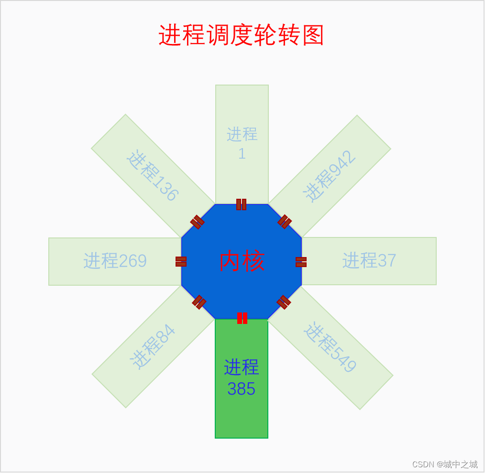

这个图是在讲进程调度时画的图，但是也能表明内核空间和用户空间的关系。下面我们再来看一下单个进程角度下内核空间与用户空间的关系图。

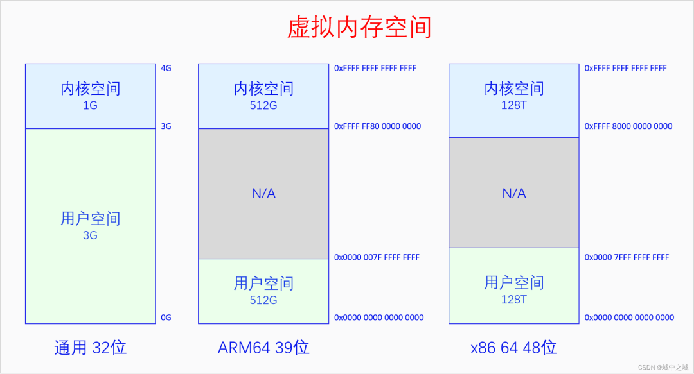

在32位系统上默认是内核占据上面1G虚拟空间，进程占据下面3G虚拟空间，有config选项可以选择其它比列，所有CPU架构都是如此。在64位系统上，由于64位的地址空间实在是太大了，Linux并没有使用全部的虚拟内存空间，而是只使用其中一部分位数。使用的方法是把用户空间的高位补0，内核空间的高位补1，这样从64位地址空间的角度来看就是只使用了两段，中间留空，方便以后往中间扩展。中间留空的是非法内存空间，不能使用。具体使用多少位，高位如何补0，不同架构的选择是不同的。ARM64在4K页面大小的情况下有39位和48位两种虚拟地址空间的选择。X86 64有48位和57位两种虚拟地址空间的选择。ARM64是内核空间和用户空间都有这么多的地址空间，x86 64是内核空间和用户空间平分这么多的地址空间，上图中的大小也可以反应出这一点。  

### 7.1 内核空间

系统在刚启动时肯定不可能直接就运行在虚拟内存之上。系统是先运行在物理内存上，然后去建立一部分恒等映射，恒等映射就是虚拟内存的地址和物理内存的地址相同的映射。恒等映射的范围不是要覆盖全部的物理内存，而是够当时内核的运行就可以了。恒等映射建立好之后就会开启分页机制，此时CPU就运行在虚拟内存上了。然后内核再进一步构建页表，把内核映射到其规定好的地方。最后内核跳转到其目标虚拟地址的地方运行，并把之前的恒等映射取消掉，现在内核就完全运行在虚拟内存上了。

由于内核是最先运行的，内核会把物理内存线性映射到自己的空间中去，而且是要把所有的物理内存都映射到内核空间。如果内核没有把全部物理内存都映射到内核空间，那不是因为不想，而是因为做不到。在x86 32上，内核空间只有1G，扣除一些其它用途保留的128M空间，内核能线性映射的空间只有896M，而物理内存可以多达4G，是没法都映射到内核空间的。所以内核会把小于896M的物理内存都映射到内核空间，大于896M的物理内存作为高端内存，可以动态映射到内核的vmalloc区。对于64位系统，就不存在这个烦恼了，虚拟内存空间远远大于物理内存的数量，所以内核会一下子把全部物理内存都映射到内核空间。

大家在这里可能有两个误解：一是认为物理内存映射就代表使用，不使用就不会映射，这是不对的，使用时肯定要映射，但是映射了不代表在使用，映射了可以先放在那，只有被内存分配器分配出去的才算是被使用；二是物理内存只会被内核空间或者用户空间两者之一映射，谁使用了就映射到谁的空间中去，这也是不对的，对于用户空间，只有其使用了物理内存才会去映射，但是对于内核空间，内核空间是管理者，它把所有物理内存都映射到自己的空间比较方便管理，而且映射了不代表使用。

64位和32位还有一个很大的不同。32位上是把小于896M的物理内存都线性映射到从3G开始的内核空间中去，32位上只有一个线性映射区间。64位上有两个线性映射区间，一是把内核代码和数据所在的物理内存映射到一个固定的地址区间中去，二是把所有物理内存都映射到某一段内存区间中去，显然内核本身所占用的物理内存被映射了两次。下面我们画图来看一看内核空间的布局。

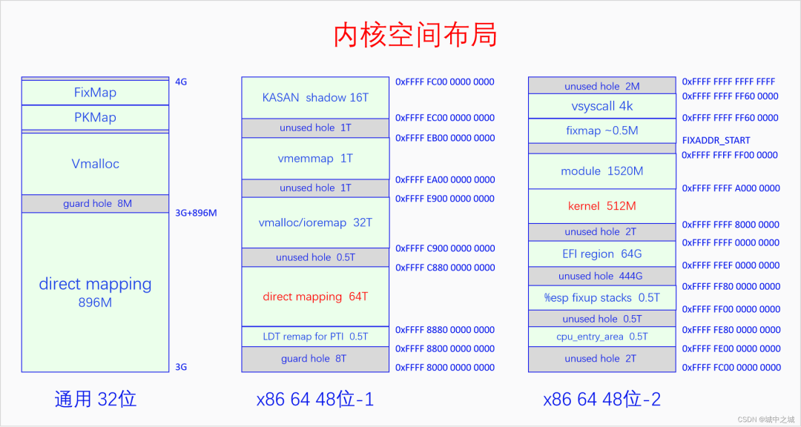

32位的内核空间布局比较简单，前896M是直接映射区，后面是8M的的隔离区，然后是大约100多M的vmalloc区，再后面是持久映射区和固定映射区，其位置和大小是由宏决定的。

64位的内核空间布局比较复杂，而且不同的架构之间差异非常大，我们以x86 64 48位虚拟地址为例说一下。图中一列画不下，分成了两列，我们从48位-1看起，首先是由一个8T的空洞，然后是LDT remap，然后是直接映射区有64T，用来映射所有的物理内存，目前来说对于绝大部分计算机都够用了，然后是0.5T的空洞，然后是vmalloc和ioremap区有32T，然后是1T的空洞，然后是vme mmap区有1T，vmemmap就是我们前面所讲的所有页面描述符的数组，然后是1T的空洞，然后是KASAN的影子内存有16T，紧接着再看48位-2，首先是2T的空洞，然后是cpu_entry_area，然后是0.5T的空洞，然后是%esp fixup stack，然后是444G的空洞，然后是EFI的映射区域，然后是2T的空洞，然后是内核的映射区有512M，然后是ko的映射区有1520M，然后是fixmap和vsyscall，最后是2M的空洞。如果开启了kaslr，内核和映射区会增加512M，相应的ko的映射区会减少512M。

64位的内核空间中有直接映射区和内核映射区两个线性映射区，这两个区域都是线性映射，只不过是映射的起点不同。为什么要把内核再单独映射一遍呢？而且既然直接映射区已经把所有的物理内存都映射一遍了，那么为什么还有这么多的内存映射区呢？直接映射区的存在是为了方便管理物理内存，因为它和物理内存只差一个固定值。各种其它映射区的存在是为了方便内核的运行和使用。比如vmalloc区是为了方便进行随机映射，当内存碎片化比较严重，我们需要的内存又不要求物理上必须连续时，就可以使用vmalloc，它能把物理上不连续的内存映射到连续的虚拟内存上。vmemmap区域是为了在物理内存有较大空洞时，又能够使得memmap在虚拟内存上看起来是个完整的数组。这些都方便了内核的操作。

对比32位和64位的虚拟内存空间可以发现，空间大了就是比较阔绰，动不动就来个1T、2T的空洞。  

### 7.2 用户空间

用户空间的逻辑和内核空间就完全不同了。首先用户空间是进程创建时动态创建的。其次，对于内核，虚拟内存和物理内存是提前映射好的，就算是vmalloc，也是分配时就映射好的，对于用户空间，物理内存的分配和虚拟内存的分配是割裂的，用户空间总是先分配虚拟内存不分配物理内存，物理内存总是拖到最后一刻才去分配。而且对于进程本身来说，它只能分配虚拟内存，物理内存的分配对它来说是不可见的，或者说是透明的。当进程去使用某一个虚拟内存时如果发现还没有分配物理内存则会触发缺页异常，此时才会去分配物理内存并映射上，然后再去重新执行刚才的指令，这一切对进程来说都是透明的，进程感知不到。

管理进程空间的结构体是`mm_struct`，我们先来看一下(代码有所删减)：linux-src/include/linux/mm_types.h

```c
struct mm_struct {  
 struct {  
  struct vm_area_struct *mmap;  /* list of VMAs */  
  struct rb_root mm_rb;  
  u64 vmacache_seqnum;                   /* per-thread vmacache */  
#ifdef CONFIG_MMU  
  unsigned long (*get_unmapped_area) (struct file *filp,  
    unsigned long addr, unsigned long len,  
    unsigned long pgoff, unsigned long flags);  
#endif  
  unsigned long mmap_base; /* base of mmap area */  
  unsigned long mmap_legacy_base; /* base of mmap area in bottom-up allocations */  
  unsigned long task_size; /* size of task vm space */  
  unsigned long highest_vm_end; /* highest vma end address */  
  pgd_t * pgd;  
  atomic_t mm_users;  
  atomic_t mm_count;  
#ifdef CONFIG_MMU  
  atomic_long_t pgtables_bytes; /* PTE page table pages */  
#endif  
  int map_count;   /* number of VMAs */  
  spinlock_t page_table_lock;   
  struct rw_semaphore mmap_lock;  
  struct list_head mmlist;   
  unsigned long hiwater_rss; /* High-watermark of RSS usage */  
  unsigned long hiwater_vm;  /* High-water virtual memory usage */  
  unsigned long total_vm;    /* Total pages mapped */  
  unsigned long locked_vm;   /* Pages that have PG_mlocked set */  
  atomic64_t    pinned_vm;   /* Refcount permanently increased */  
  unsigned long data_vm;    /* VM_WRITE & ~VM_SHARED & ~VM_STACK */  
  unsigned long exec_vm;    /* VM_EXEC & ~VM_WRITE & ~VM_STACK */  
  unsigned long stack_vm;    /* VM_STACK */  
  unsigned long def_flags;  
  unsigned long start_code, end_code, start_data, end_data;  
  unsigned long start_brk, brk, start_stack;  
  unsigned long arg_start, arg_end, env_start, env_end;  
  unsigned long saved_auxv[AT_VECTOR_SIZE]; /* for /proc/PID/auxv */  
   
  struct mm_rss_stat rss_stat;  
  struct linux_binfmt *binfmt;  
  mm_context_t context;  
  unsigned long flags; /* Must use atomic bitops to access */  
  struct core_state *core_state; /* coredumping support */  
  struct user_namespace *user_ns;  
  /* store ref to file /proc/<pid>/exe symlink points to */  
  struct file __rcu *exe_file;  
 } __randomize_layout;  
 unsigned long cpu_bitmap[];  
};  
```

可以看到`mm_struct`有很多管理数据，其中最重要的两个是mmap和pgd，它们一个代表虚拟内存的分配情况，一个代表物理内存的分配情况。pgd就是我们前面所说的页表树的根指针，当要运行我们的进程时就需要把pgd写到CR3上，这样MMU用我们页表树来解析虚拟地址就能访问到我们的物理内存了。不过pgd的值是虚拟内存，CR3需要物理内存，所以把pgd写到CR3上时还需要把pgd转化为物理地址。mmap是`vm_area_struct(vma)`的链表，它代表的是用户空间虚拟内存的分配情况。用户空间只能分配虚拟内存，物理内存的分配是自动的透明的。用户空间想要分配虚拟内存，最终的唯一的方法就是调用函数mmap来生成一个vma，有了vma就代表虚拟内存分配了，vma会记录虚拟内存的起点、大小和权限等信息。有了vma，缺页异常在处理时就有了依据。如果造成缺页异常的虚拟地址不再任何vma的区间中，则说明这是一个非法的虚拟地址，缺页异常就会给进程发SIGSEGV。如果异常地址在某个vma区间中并且权限也对的话，那么说明这个虚拟地址进程已经分配了，是个合法的虚拟地址，此时缺页异常就会去分配物理内存并映射到虚拟内存上。

调用函数mmap生成vma的方式有两种，一是内核为进程调用，就是在内核里直接调用了，二是进程自己调用，那就是通过系统调用来调用mmap了。生成的vma也有两种类型，文件映射vma和匿名映射vma，哪种类型取决于mmap的参数。文件映射vma，在发生缺页异常时，分配的物理内存要用文件的内容来初始化，其物理内存也被叫做文件页。匿名映射vma，在发生缺页异常时，直接分配物理内存并初始化为0，其物理内存也被叫做匿名页。

一个进程的text段、data段、堆区、栈区都是vma，这些vma都是内核为进程调用mmap生成的。进程自己也可以调用mmap来分配虚拟内存。堆区和栈区是比较特殊的vma，栈区的vma会随着栈的增长而自动增长，堆区的vma则需要进程用系统调用brk或者sbrk来增长。不过我们在分配堆内存的时候都不是直接使用的系统调用，而是使用libc给我们提供的malloc接口，有了malloc接口，我们分配释放堆内存就方便多了。Malloc接口的实现叫做malloc库，目前比较流行的malloc库有ptmalloc、jemalloc、scudo等。 

## 八、内存统计

暂略  

### 8.1 总体统计

### 8.2 进程统计

## 九、总结回顾

前面我们讲了这么多的东西，现在再来总结回顾一下。首先我们再重新看一下Linux的内存管理体系图，我们边看这个图边进行总结。


首先要强调的一点是，这么多的东西，都是在内核里进行管理的，内核是可以操作这一切的。但是对进程来说这些基本都是透明的，进程只能看到自己的虚拟内存空间，只能在自己空间里分配虚拟内存，其它的，进程什么也看不见、管不着。

目前绝大部分的操作系统采用的内存管理模式都是以分页内存为基础的虚拟内存机制。虚拟内存机制的中心是MMU和页表，MMU是需要硬件提供的，页表是需要软件来操作的。虚拟内存左边连着物理内存管理，右边连着虚拟内存空间，左边和右边有着复杂的关系。物理内存管理中，首先是对物理内存的三级区划，然后是对物理内存的三级分配体系，最后是物理内存的回收。虚拟内存空间中，首先可以分为内核空间和用户空间，两者在很多方面都有着显著的不同。内核空间是内核运行的地方，只有一份，永久存在，有特权，而且其内存映射是提前映射、线性映射，不会换页。用户空间是进程运行的地方，有N份，随着进程的诞生而创建、进程的死亡而销毁。用户空间中虚拟内存的分配和物理内存的分配是分开的，进程只能分配虚拟内存，物理内存的分配是在进程运行过程中动态且透明地分配的。用户空间的物理内存可以分为文件页和匿名页，页帧回收的主要逻辑就是围绕文件页和匿名页展开的。
