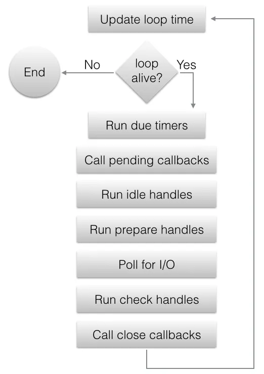

 
<!--BEGIN_DATA
{
    "create_date": "2023-04-14 10:59", 
    "modify_date": "2023-04-14 10:59", 
    "is_top": "0", 
    "summary": "深入理解libuv事件循环", 
    "tags": "算法、系统", 
    "file_name": "深入理解libuv事件循环.md"
}
END_DATA-->

### <p>原文出处：<a href='https://km.woa.com/articles/show/575333' target='blank'>深入理解libuv事件循环</a></p>

> libuv是一款跨平台的异步I/O库，已经被广泛应用于各个领域。作为跨平台底层库，libuv实现的功能非常齐全，本文详细介绍libuv事件循环机制，并从其中七个常规的用法深入分析libuv实现原理。（源码基于v1.44.2版本，commit id为0c1fa69，平台为MacOS）

libuv提供了快速实现异步IO的能力，但是在使用过程中常常会感到纠结。比如定时器如何保证时间间隔，异步回调如何知道调用时机、比如`uv_run`为什么在`UV_RUN_ONCE`模式下也会阻塞，在`UV_RUN_DEFAULT`模式下却会马上返回、比如udp、tcp同步接口和异步接口同时调用会不会有冲突，tcp能不能确保整包收发、比如多线程调用libuv函数会不会有异常等等。本文尝试剖析libuv事件循环机制，了解其实现原理，放心写下每一行libuv调用。

## 1、事件循环

### 1.1、uv_loop_t和双端队列

libuv离不开事件循环，事件循环离不开`uv_loop_t`，它几乎包含libuv提供能力所需要的完整上下文。在真正使用libuv之前，都需要初始化`uv_loop_t`，一个简单的样例是

```cpp
int main() {
 uv_loop_t* loop = uv_loop_new();
  // libuv也提供一个静态全局的默认loop
  // uv_loop_t* loop = uv_default_loop();

  // 基于loop添加事件

  // 运行事件循环
  uv_run(loop, UV_RUN_DEFAULT);

  uv_loop_close(loop);
  uv_loop_delete(loop);

  return 0;
}
```

其中`uv_loop_t`定义为

```cpp
struct uv_loop_s {
  /* User data - use this for whatever. */
  void* data;
  /* Loop reference counting. */
  unsigned int active_handles;
  void* handle_queue[2];
  union {
    void* unused;
    unsigned int count;
  } active_reqs;
  /* Internal storage for future extensions. */
  void* internal_fields;
  /* Internal flag to signal loop stop. */
  unsigned int stop_flag;
  UV_LOOP_PRIVATE_FIELDS
};
```

可以看到`uv_loop_t`包含了这种队列类型的成员变量

```cpp
void* handle_queue[2];
```

如果把`UV_LOOP_PRIVATE_FIELDS`展开的话会发现里面还有很多类似的变量，这是双端循环队列结构，一个指针指向队头，一个指针指向队尾。同时libuv还定义了操作双端循环队列的一系列宏定义

```cpp
#define QUEUE_DATA(ptr, type, field)
#define QUEUE_FOREACH(q, h)
#define QUEUE_EMPTY(q)
#define QUEUE_HEAD(q)
#define QUEUE_INIT(q)
#define QUEUE_ADD(h, n)
#define QUEUE_SPLIT(h, q, n)
#define QUEUE_MOVE(h, n)
#define QUEUE_INSERT_HEAD(h, q)
#define QUEUE_INSERT_TAIL(h, q)
#define QUEUE_REMOVE(q)
```

当我们知道`void* queue[2]`是双端循环队列结构，上面的宏对着源码简单推导下不难看出，都是对队列的基础操作，比如获取队头队尾元素，队头队尾插入元素，删除队列中某元素等等。既然是事件循环，自然会有队列这种数据结构，搞清楚相关的常用宏对理解会很有帮助。简单讲，**`uv_loop_t`是一个包含多个事件队列和事件循环需要记录的全局信息的结构体**。

### 1.2、 uv_run和异步事件

先来看看`uv_run`的代码

```cpp
int uv_run(uv_loop_t* loop, uv_run_mode mode) {
  int timeout;
  int r;
  int can_sleep;

  r = uv__loop_alive(loop);
  if (!r)
    uv__update_time(loop);

  while (r != 0 && loop->stop_flag == 0) {
    uv__update_time(loop);
    uv__run_timers(loop);

    can_sleep =
        QUEUE_EMPTY(&loop->pending_queue) && QUEUE_EMPTY(&loop->idle_handles);

    uv__run_pending(loop);
    uv__run_idle(loop);
    uv__run_prepare(loop);

    timeout = 0;
    if ((mode == UV_RUN_ONCE && can_sleep) || mode == UV_RUN_DEFAULT)
      timeout = uv__backend_timeout(loop);

    uv__io_poll(loop, timeout);

    /* Process immediate callbacks (e.g. write_cb) a small fixed number of
     * times to avoid loop starvation.*/
    for (r = 0; r < 8 && !QUEUE_EMPTY(&loop->pending_queue); r++)
      uv__run_pending(loop);

    /* Run one final update on the provider_idle_time in case uv__io_poll
     * returned because the timeout expired, but no events were received. This
     * call will be ignored if the provider_entry_time was either never set (if
     * the timeout == 0) or was already updated b/c an event was received.
     */
    uv__metrics_update_idle_time(loop);

    uv__run_check(loop);
    uv__run_closing_handles(loop);

    if (mode == UV_RUN_ONCE) {
      /* UV_RUN_ONCE implies forward progress: at least one callback must have
       * been invoked when it returns. uv__io_poll() can return without doing
       * I/O (meaning: no callbacks) when its timeout expires - which means we
       * have pending timers that satisfy the forward progress constraint.
       *
       * UV_RUN_NOWAIT makes no guarantees about progress so it's omitted from
       * the check.
       */
      uv__update_time(loop);
      uv__run_timers(loop);
    }

    r = uv__loop_alive(loop);
    if (mode == UV_RUN_ONCE || mode == UV_RUN_NOWAIT)
      break;
  }

  /* The if statement lets gcc compile it to a conditional store. Avoids
   * dirtying a cache line.
   */
  if (loop->stop_flag != 0)
    loop->stop_flag = 0;

  return r;
}
```

网上对`uv_run`有较好的总结图



理解`uv_loop_t`结构后，不难猜到`uv_run`是去执行`uv_loop_t`内部事件队列里的事件。事实也是如此，可以看到在`uv_run`函数内部，去取事件队列里的`handle`，并调用对应的`callback`，看到事件循环和事件队列，第一反应的理解是，每次循环从队头取出一个事件处理。然而并不是这样，这里一个小细节是，每次的循环是处理整个队列的事件，而不是只处理队头的事件。例如调用`uv__run_check`，会去处理整个check队列的所有元素。

```cpp
void uv__run_##name(uv_loop_t* loop) {                                      \
  uv_##name##_t* h;                                                         \
  QUEUE queue;                                                              \
  QUEUE* q;                                                                 \
  QUEUE_MOVE(&loop->name##_handles, &queue);                                \
  while (!QUEUE_EMPTY(&queue)) {                                            \
    q = QUEUE_HEAD(&queue);                                                 \
    h = QUEUE_DATA(q, uv_##name##_t, queue);                                \
    QUEUE_REMOVE(q);                                                        \
    QUEUE_INSERT_TAIL(&loop->name##_handles, q);                            \
    h->name##_cb(h);                                                        \
  }                                                                         \
}                                                                           \
```

从宏的这部分定义就可以看出，`uv__run_##name`的调用都会处理整个队列。这时候就会有疑惑，既然每次调用都把整个队列都处理完了，为什么还要去循环调用，第二次调用的时候队列不是已经空了吗？其实队列没有置空，取走整个队列后，取出元素调用`callback`，然后会`QUEUE_INSERT_TAIL(&loop->name##_handles, q);`重新插入队列，下一次的循环会再次处理整个队列。比如下面这个例子会调用3次`check_callback`。

```cpp
#include <uv.h>
#include <iostream>

uv_loop_t* loop;
uv_check_t check_handle;

void check_callback(uv_check_t* handle) {
  std::cout << "Check callback called" << std::endl;
}

int main() {
  loop = uv_default_loop();

  // 初始化check handle
  uv_check_init(loop, &check_handle);

  // 设置check handle的回调函数
  uv_check_start(&check_handle, check_callback);

  // 运行事件循环
  uv_run(loop, UV_RUN_NOWAIT);
  uv_run(loop, UV_RUN_NOWAIT);
  uv_run(loop, UV_RUN_NOWAIT);

  // 清理check handle
  uv_check_stop(&check_handle);
  uv_loop_close(loop);

  return 0;
}
```

这时候可能又会疑惑，这不就是遍历整个队列，然后对每个元素调用`callback`吗，为什么要整个`QUEUE_MOVE`出来再一个个`QUEUE_INSERT_TAIL`回去？原因很简单，如果没有`QUEUE_MOVE`出来，如果`callback`调用会往队列里插入元素的话，会有死循环的风险了。`QUEUE_MOVE`出来，`callback`往队列里插入的元素，会在下个事件循环周期才生效。其实，也并非所有的事件队列会一直保留队列元素，比如`timer_heap`定时器堆

```cpp
void uv__run_timers(uv_loop_t* loop) {
  struct heap_node* heap_node;
  uv_timer_t* handle;

  for (;;) {
    heap_node = heap_min(timer_heap(loop));
    if (heap_node == NULL)
      break;

    handle = container_of(heap_node, uv_timer_t, heap_node);
    if (handle->timeout > loop->time)
      break;

    uv_timer_stop(handle);
    uv_timer_again(handle);
    handle->timer_cb(handle);
  }
}
```

定时器会默认只生效一次，实现方式就是在事件循环处理`timer_heap`的时候，内部会调用`uv_timer_stop`停掉这个timer。同样的，前面提到的事件队列`handle`，如果也只想生效一次的话，在对应`callback`里调用`uv_##name##_stop`停掉就可以。比如这个例子，`check_callback`只会调用1次。

```cpp
#include <uv.h>
#include <iostream>

uv_loop_t* loop;
uv_check_t check_handle;

void check_callback(uv_check_t* handle) {
  std::cout << "Check callback called" << std::endl;
  // 清理check handle
  uv_check_stop(&check_handle);
}

int main() {
  loop = uv_default_loop();

  // 初始化check handle
  uv_check_init(loop, &check_handle);

  // 设置check handle的回调函数
  uv_check_start(&check_handle, check_callback);

  // 运行事件循环
  uv_run(loop, UV_RUN_NOWAIT);
  uv_run(loop, UV_RUN_NOWAIT);
  uv_run(loop, UV_RUN_NOWAIT);

  uv_loop_close(loop);

  return 0;
}
```

### 1.3、uv_run_mode和异步IO

前面提到的异步事件一般情况下都可以在事件循环下运转，原则上我们的异步事件执行不能过于耗时 卡住`uv_loop_t`，但是即使是耗时任务，只要异步事件没有bug，多花点时间还是可以执行完的。除非遇到IO事件，IO事件可能会导致阻塞。libuv对IO事件有一套完整的处理方法，**异步IO是libuv的重要组成部分**。

展开`uv_loop_t`结构内的`UV_LOOP_PRIVATE_FIELDS`宏，除了有异步事件队列外，还维护着异步IO列表。

```cpp
int backend_fd;
void* watcher_queue[2];
uv__io_t** watchers;
unsigned int nwatchers;
unsigned int nfds;
```

基于`uv_loop_t`开启一个IO事件，会将IO事件加入IO队列`watcher_queue`并且添加到`watchers`监听IO列表，在`uv__io_poll`调用中，会取出`watcher_queue`的IO事件，加入epoll监听列表。然后调用`epoll_wait`去监听IO事件，并在`epoll_wait`返回后去真正执行IO事件。所以`uv_run`不光要通过双端队列处理异步任务，还要通过IO监听列表和epoll机制处理异步IO。这里`backend_fd`是`epoll_create`创建的fd，`nwatchers`是数组长度，`nfds`是当前监听的fd数量。因为`watchers`数组是以fd为下标去寻址`watchers[fd]`，所以`nwatchers`和`nfds`是不相等的。

特别的，`uv_loop_t`内部会一直去监听两个IO事件

```cpp
uv__io_t async_io_watcher;
uv__io_t signal_io_watcher;
```

他们被用于处理异步信号和系统信号，在`uv_loop_t`初始化的时候，`async_io_watcher`和`signal_io_watcher`就会被开启，然后在第一次`uv_run`的时候就加入epoll监听列表。也就是说，即使没有基于`uv_loop_t`开启新的IO事件，IO事件也会一直存在于`uv_loop_t`的整个生命周期。

回到开篇的问题，`uv_run`为什么在`UV_RUN_ONCE`模式下也会阻塞，在`UV_RUN_DEFAULT`模式下却也可能会马上返回。理解异步任务和异步IO的关系后，uv_run_mode的三种模式就比较好理解了。

```cpp
typedef enum {
  UV_RUN_DEFAULT = 0,
  UV_RUN_ONCE,
  UV_RUN_NOWAIT
} uv_run_mode;
```

`UV_RUN_DEFAULT`模式：在这种模式下，只要基于`uv_loop_t`开启了异步任务或者异步IO（即`uv__loop_alive`为true），这种模式会一直去执行事件循环，并且在每次循环里都会调用`epoll_wait`去阻塞监听IO事件。那`UV_RUN_DEFAULT`模式执行`uv_run`便一直无法返回了吗？也不是，当`uv_loop_t`没有开启事件，此时`uv__loop_alive`为false，会退出循环，比如文章第一个样例初始化`uv_loop_t`后马上以`UV_RUN_DEFAULT`执行`uv_run`就会马上返回。另外调用`uv_stop`也会退出，比如

```cpp
#include <uv.h>
#include <iostream>

uv_async_t async;

void async_callback(uv_async_t* handle) {
  std::cout << "async_callback" << std::endl;
  uv_stop(handle->loop);
}

int main() {
  uv_loop_t* loop = uv_default_loop();

  uv_async_init(loop, &async, async_callback);
  uv_async_send(&async);

  uv_run(loop, UV_RUN_DEFAULT);

  return 0;
}
```

`UV_RUN_ONCE`模式：在这种模式下，事件循环只会跑一轮就退出，但是单次循环仍然会去执行所有异步事件和调用`epoll_wait`阻塞监听IO。所以即使在这种模式下，如果`epoll_wait`一直阻塞，`uv_run`就会一直阻塞。比如

```cpp
#include <uv.h>
#include <iostream>

uv_loop_t* loop;
uv_check_t check_handle;

void check_callback(uv_check_t* handle) {
  std::cout << "Check callback called" << std::endl;
}

int main() {
  loop = uv_default_loop();

  // 初始化check handle
  uv_check_init(loop, &check_handle);

  // 设置check handle的回调函数
  uv_check_start(&check_handle, check_callback);

  // 运行事件循环
  uv_run(loop, UV_RUN_ONCE);

  uv_loop_close(loop);

  return 0;
}
```

`UV_RUN_NOWAIT`模式：在这种模式下，事件循环同样只会跑一轮，该次循环也会处理异步事件和IO，但是调用`epoll_wait`的时候`timeout`为0不会阻塞。所以这个模式不保证等待IO事件，尽可能的跑一轮事件循环便返回。

**总之，三种模式都会去处理所有事件和IO，区别是`UV_RUN_DEFAULT`会一直循环，而`UV_RUN_ONCE`和`UV_RUN_NOWAIT`只会跑一轮。而基于IO事件`UV_RUN_DEFAULT`和`UV_RUN_ONCE`都是阻塞等待，`UV_RUN_NOWAIT`是非阻塞**。

## 2、异步IO

使用libuv主要是看中其异步IO的能力，下面从几个常规使用场景来看看libuv如何提供异步IO能力，在不同场景下各有什么特点。

### 2.1、网络

libuv提供了tcp、udp的socket调用，包括创建socket，收发包等等。使用原生socket的小伙伴知道，socket调用可能会有错误，可能会阻塞，也可能会有收发包数据不全等问题，libuv帮我们处理了这些问题，对外统一同步和异步调用接口，让我们能快速的实现高性能网络IO。

一个简单tcp server socket样例是

```cpp
#include <cstdlib>
#include <uv.h>

#define DEFAULT_IP "127.0.0.1"
#define DEFAULT_PORT 8080
#define DEFAULT_BACKLOG 128

void on_listen(uv_stream_t* server, int status);
void on_read(uv_stream_t* client, ssize_t nread, const uv_buf_t* buf);
void on_close(uv_handle_t* handle);

void alloc_buffer(uv_handle_t* handle, size_t suggested_size, uv_buf_t* buf) {
  buf->base = (char*)malloc(suggested_size);
  buf->len = suggested_size;
}

void on_listen(uv_stream_t* server, int status) {
  if (status < 0) {
    fprintf(stderr, "Connection error: %s\n", uv_strerror(status));
    return;
  }

  uv_tcp_t* client = (uv_tcp_t*)malloc(sizeof(uv_tcp_t));
  uv_tcp_init(server->loop, client);

  if (uv_accept(server, (uv_stream_t*)client) == 0) {
    printf("Client connected.\n");

    uv_read_start((uv_stream_t*)client, alloc_buffer, on_read);
  } else {
    uv_close((uv_handle_t*)client, on_close);
  }
}

void on_read(uv_stream_t* client, ssize_t nread, const uv_buf_t* buf) {
  if (nread < 0) {
    if (nread != UV_EOF) {
      fprintf(stderr, "Read error: %s\n", uv_strerror(nread));
    }
    uv_close((uv_handle_t*)client, on_close);
  } else if (nread > 0) {
    printf("Read %ld bytes: %.*s", nread, (int)nread, buf->base);
  }

  if (buf->base) {
    free(buf->base);
  }
}

void on_close(uv_handle_t* handle) {
  printf("Client disconnected.\n");
  free(handle);
}

int main() {
  uv_loop_t* loop = uv_default_loop();

  uv_tcp_t server;
  uv_tcp_init(loop, &server);

  struct sockaddr_in bind_addr;
  uv_ip4_addr(DEFAULT_IP, DEFAULT_PORT, &bind_addr);

  uv_tcp_bind(&server, (const struct sockaddr*)&bind_addr, 0);
  int r = uv_listen((uv_stream_t*)&server, DEFAULT_BACKLOG, on_listen);
  if (r) {
    fprintf(stderr, "Listen error: %s\n", uv_strerror(r));
    return 1;
  }

  printf("Server listening on port %d...\n", DEFAULT_PORT);

  uv_run(loop, UV_RUN_DEFAULT);
  uv_close((uv_handle_t*)&server, nullptr);

  return 0;
}
```

这个样例里，起了一个tcp socket并监听"127.0.0.1"的8080端口，连接建立后，监听这个socket的可读事件，当socket有可读数据后结果通过`on_read`回调通知。这里实际上屏蔽了很多细节，比如我们知道tcp的read操作不一定一次就能读一个整包（先不讨论粘包问题，这个需要应用层依据协议去保证，我们这里假设每个包长度是固定的），那这里每一次read调用的指定长度是多少，read的实际返回长度是多少，`on_read`会确保我们当实际读取的数据长度达到我们期望读取的长度后才回调，还是每次read调用就回调？

笔者尝试来分析下这些问题，在我们开始调用start开始监听可读事件时，需要传入`alloc_buffer`和`on_read`函数，触发可读事件后，会先调用`alloc_buffer`分配buffer，这里包含了read调用的指定长度，`on_read`返回的是实际读取长度。如果没有读全数据，下一次事件循环会再去读，同样再次调用`alloc_buffer`然后`on_read`，此时返回的数据会接上前一次，但是这里实际的返回长度也不会有什么保证，需要自己拼接。

这里提供的能力似乎使用起来还是有一定的负担，实际生产中，我们希望明确知道的是什么时候读完整包，而不太愿意去知道其他零碎的信息，一个可能的解决方法是（这里假设协议里头4个字节是表示这个包的长度，考虑粘包问题）

```cpp
uv_read_start（alloc_buffer 尝试读4个字节） // 这里会马上返回，然后等待on_read回调
-- on_read
---- uv_read_stop // 这里要stop一下，因为后续要重新指定期望读取的字节数
---- 1、如果4个字节读取成功，得到包长n。uv_read_start（alloc_buffer 尝试读剩下的n-4个字节）
------ 1.1、 如果剩下的所有字节读取成功，这个包读完，回到原点继续读下一个包
------ 1.2、 如果剩下n-4个字节没有读取成功，继续uv_read_start读剩下的字节直到去到1.1步骤
---- 2、如果4个字节没有读取成功。uv_read_start（alloc_buffer 尝试读剩下的所有字节）
------ 2.1、 如果剩下的字节读取成功，包头长度读完，去读整包去到步骤1
------ 2.2、 如果剩下的字节没有读取成功，继续uv_read_start读剩下的字节直到去到2.1步骤
```

按照这个方式，可以形成调用循环，实现整包读取的功能。同时合理的使用`uv_run`的话，监听可读事件是非阻塞或者有超时的阻塞的，在网络没有收包的时候，事件循环可以去处理别的事件。

除了可读事件，还有可写事件，一个简单的tcp client样例是

```cpp
#include <cstdlib>
#include <uv.h>

#define DEFAULT_IP "127.0.0.1"
#define DEFAULT_PORT 8080

void on_connect(uv_connect_t* req, int status);
void on_write(uv_write_t* req, int status);
void on_close(uv_handle_t* handle);

void on_connect(uv_connect_t* req, int status) {
  if (status < 0) {
    fprintf(stderr, "Connect error: %s\n", uv_strerror(status));
    return;
  }

  printf("Connected to server.\n");

  uv_stream_t* client = req->handle;

  uv_write_t* wrreq = (uv_write_t*)malloc(sizeof(uv_write_t));
  uv_buf_t wrbuf = uv_buf_init("Hello, server!\n", 15);
  uv_write(wrreq, client, &wrbuf, 1, on_write);
}

void on_write(uv_write_t* req, int status) {
  if (status < 0) {
    fprintf(stderr, "Write error: %s\n", uv_strerror(status));
  }
  free(req);
}

void on_close(uv_handle_t* handle) {
  printf("Disconnected from server.\n");
  free(handle);
}

int main() {
  uv_loop_t* loop = uv_default_loop();

  uv_tcp_t client;
  uv_tcp_init(loop, &client);

  struct sockaddr_in dest_addr;
  uv_ip4_addr(DEFAULT_IP, DEFAULT_PORT, &dest_addr);

  uv_connect_t connect_req;
  uv_tcp_connect(&connect_req, &client, (const struct sockaddr*)&dest_addr, on_connect);

  uv_run(loop, UV_RUN_DEFAULT);

  return 0;
}
```

这个样例是建立一个tcp socket去连"127.0.0.1"的8080端口，连接成功后，发一个包，然后退出。同样的，read操作存在的问题，write操作也会存在，但是解决方式是很不一样的，libuv同样屏蔽了这些细节，比如每一次write调用的指定长度是多少，write的实际返回长度是多少，`on_write`会确保我们当实际写入的数据长度达到我们期望写入的长度后才回调，还是每次write调用就回调，如果接力写，是不是后面的每次write调用都要在`on_write`后接起来，这样发包速率是不是被限制了，能不能同步write等等。

笔者尝试来分析下这些问题，首先调用`uv_write`需要带上发包buffer，这里会有期望写入的长度，那实际写入的长度呢，这里跟读操作不同，`uv_write`不会再告知实际写入长度，或者说屏蔽了多次写入的操作，在`on_write`的时候，会确保是在**整包写完之后再回调**，这里让我们在单包发送来说省心很多，内部是怎么实现的呢？截取部分源码

```cpp
n = uv__try_write(stream,
                  &(req->bufs[req->write_index]),
                  req->nbufs - req->write_index,
                  req->send_handle);

/* Ensure the handle isn't sent again in case this is a partial write. */
if (n >= 0) {
  req->send_handle = NULL;
  if (uv__write_req_update(stream, req, n)) {
    uv__write_req_finish(req);
    return;  /* TODO(bnoordhuis) Start trying to write the next request. */
  }
} else if (n != UV_EAGAIN)
  break;

/* If this is a blocking stream, try again. */
if (stream->flags & UV_HANDLE_BLOCKING_WRITES)
  continue;

/* We're not done. */
uv__io_start(stream->loop, &stream->io_watcher, POLLOUT);
```

可以看到，对于**整包**角度而言，如果没有写全，记录当前的索引，然后加入IO监听，监听到fd的可写事件后，再回来从索引处继续写入。直到全部写完后，再回调`on_write`。所有`on_write`调用的时候，是会确保当前包已经全部写完的。另外，再来对比下**多包**发送，基于读操作，来对比下下面两种写操作的区别。

第一种是

```cpp
uv_write
-- on_write
---- uv_write
------ on_write
...
```

跟读操作类似，这里每一次的`uv_write`操作都在`on_write`之后，首先逻辑上是没有问题的，但是这里没有高效利用网络IO，因为从一个`uv_write`到另一个`uv_write`，需要事件循环驱动，但是事件循环中可能会其他别的任务要处理，这里可能的问题就是，空闲的IO在等待忙碌的CPU，导致发包速率小。那为什么读操作和写操作会有这种区别呢，事实上，这里的读操作完全由IO监听来驱动，只能由IO监听事件去接力读，而写操作是由我们的逻辑代码去调用驱动的，这时操作空间更多，可以在IO真正忙碌的时候，再去监听IO事件去接力写。

由此，第二种方式是

```cpp
uv_write
uv_write
uv_write
uv_write
uv_write  // 假设在这个时候起IO忙碌，后面的uv_write无法直接写，加入libuv发送队列，并监听IO可写事件
uv_write
...
```

这里每个`uv_write`和`on_write`是完全独立的，这样在IO空闲的时候，write调用会“马上”执行，快速占满IO，当IO忙碌后，发包数据进入libuv发送队列，然后加入IO监听可写事件，触发可写事件后再继续write发送队列里的数据，截取`uv_write`的部分核心代码

```cpp
/* If the queue was empty when this function began, we should attempt to
 * do the write immediately. Otherwise start the write_watcher and wait
 * for the fd to become writable.
 */
if (stream->connect_req) {
  /* Still connecting, do nothing. */
}
else if (empty_queue) {
  uv__write(stream);
} else {
  /*
   * blocking streams should never have anything in the queue.
   * if this assert fires then somehow the blocking stream isn't being
   * sufficiently flushed in uv__write.
   */
  assert(!(stream->flags & UV_HANDLE_BLOCKING_WRITES));
  uv__io_start(stream->loop, &stream->io_watcher, POLLOUT);
  uv__stream_osx_interrupt_select(stream);
}
```

如果当前没有正在进行的写操作，那么这次的写操作将立即触发，否则就加入IO监听，等待可写事件触发，总之libuv的tcp接口**读操作默认异步，不支持整包，写操作默认优先同步，同步失败后转异步，支持整包**。

libuv同时也提供udp接口，除了udp的读写只能是整包的，其余原理是一样的，**读操作默认异步，整包读取，写操作默认优先同步，同步失败后转异步，整包发送**。但是这里提到udp会有额外的考量，在发包的时候发包接口无法直接得到结果，而是需要通过回调得知，如果对网络延时要求很高，不希望发送队列堆积太多的包，像`uv_write`和`uv_udp_send`这种异步接口是无法保证libuv的网络发送队列不会过度堆积的。此时libuv同时提供了同步调用的接口，以udp的`uv_udp_try_send`为例

```cpp
#include <uv.h>

int main() {
  uv_loop_t* loop = uv_default_loop();

  uv_udp_t send_socket;
  uv_udp_init(loop, &send_socket);

  uv_buf_t buffer = uv_buf_init("Hello, server!", 14);

  struct sockaddr_in send_addr;
  uv_ip4_addr("127.0.0.1", 8080, &send_addr);

  ssize_t result = uv_udp_try_send(&send_socket, &buffer, 1, (const struct sockaddr*)&send_addr);

  if (result >= 0) {
    printf("Data sent successfully! Sent %zd bytes.\n", result);
  } else {
    fprintf(stderr, "Error sending data: %s\n", uv_strerror(result));
  }

  uv_run(loop, UV_RUN_DEFAULT);

  return 0;
}
```

这个接口不会使用libuv的发送队列，直接返回结果。在对延时有严格要求的时候，在上层自定义延时保证策略。同时这两个接口混用也不会产生异常，libuv内部会处理相关冲突，以udp为例

```cpp
uv_udp_send
uv_udp_send
uv_udp_send
uv_udp_try_send  // 若前面几次uv_udp_send调用没有遇到IO忙碌，很顺利的write成功，没有IO监听，那么此次uv_udp_try_send会正常调用write
```

也会有另一种情况

```cpp
uv_udp_send
uv_udp_send
uv_udp_send
...
uv_udp_send // 在此刻已经IO繁忙，后续的调用都加入发送队列，监听IO可写事件
...
uv_udp_try_send  // 此时调用会马上返回失败，因为发送队列里仍有数据
```

相反的，`uv_udp_try_send`不会对后续的调用有什么影响，结果立即生效

```cpp
uv_udp_try_send
uv_udp_try_send
uv_udp_send  // 此次调用不会受到uv_udp_try_send的影响
```

截取部分代码分析，对于`uv_udp_send`

```cpp
/* It's legal for send_queue_count > 0 even when the write_queue is empty;
 * it means there are error-state requests in the write_completed_queue that
 * will touch up send_queue_size/count later.
 */
empty_queue = (handle->send_queue_count == 0);
...
...
...
if (empty_queue && !(handle->flags & UV_HANDLE_UDP_PROCESSING)) {
  uv__udp_sendmsg(handle);
  /* `uv__udp_sendmsg` may not be able to do non-blocking write straight
   * away. In such cases the `io_watcher` has to be queued for asynchronous
   * write.
   */
  if (!QUEUE_EMPTY(&handle->write_queue))
    uv__io_start(handle->loop, &handle->io_watcher, POLLOUT);
} else {
  uv__io_start(handle->loop, &handle->io_watcher, POLLOUT);
}
```

当发送队列有数据时，不会马上去发数据，而是监听IO可写事件。而对于`uv_udp_try_send`

```cpp
/* already sending a message */
if (handle->send_queue_count != 0)
  return UV_EAGAIN;
```

如果发送队列有数据，本次调用会马上返回错误。

由此可见，接口混用也不会有什么异常，但是如果没有正确理解，就可能没有达到我们预期想要的效果。同时tcp同样也提供同步写接口`uv_try_write`，原理一致，不再赘述。

### 2.2、文件

libuv提供了一系列的文件操作，包括打开文件或目录，读写文件，移动、拷贝文件等等。跟网络IO一样，文件IO也有类似的问题，读写IO阻塞如何解决，单次write调用写不全数据，read调用读不全数据等等。但是文件IO场景相对好一些，文件有多少数据都是“确定”的，基于这点，libuv不会去默认监听文件IO事件，一个简单的例子是

```cpp
#include <uv.h>
#include <cstdio>
#include <cstdlib>

void on_read(uv_fs_t* req) {
  if (req->result < 0) {
    fprintf(stderr, "Read error: %s\n", uv_strerror(req->result));
    return;
  }

  printf("Read completed: %.*s\n", req->result, req->bufsml[0].base);

  // 释放资源
  uv_fs_req_cleanup(req);
  free(req->bufsml[0].base);
  free(req);
}

int main() {
  uv_loop_t* loop = uv_default_loop();

  // 打开文件
  uv_fs_t open_req;
  uv_fs_open(loop, &open_req, "file.txt", O_RDONLY, 0, nullptr);

  // 读取数据
  uv_buf_t buf = uv_buf_init((char*)malloc(1024), 1024);
  uv_fs_t* read_req = (uv_fs_t*)malloc(sizeof(uv_fs_t));
  uv_fs_read(loop, read_req, open_req.result, &buf, 1, -1, on_read);

  // 进入事件循环
  uv_run(loop, UV_RUN_DEFAULT);

  return 0;
}
```

在这个样例中，用`uv_fs_read`去读文件，读取的结果在`on_read`返回，但是这次读操作只有一次，如果这次读的结果没有读取完整，不会再去监听这个fd的可读事件，想要确保读取完整在`on_read`里发现没有读取完整再继续从对应的offset继续读。同样的，写操作也是类似，不会确保一次写调用`uv_fs_write`会全部写完的时候再回调。

这里看的话，文件的读写调用都是一次性的，不会再继续监听这个文件fd的读写事件，读写事件触发后再去接力读写。那这里的异步IO体现在哪里呢？这里的异步其实是指，在`uv_fs_read`和`uv_fs_write`调用的时候，如果传入了回调函数，那么这次读写操作会推到libuv内部的线程池去完成，读写的结果再通过异步信号通知`uv_run`去执行回调。看一下`uv_fs_read`便知晓

```cpp
int uv_fs_read(uv_loop_t* loop, uv_fs_t* req,
               uv_file file,
               const uv_buf_t bufs[],
               unsigned int nbufs,
               int64_t off,
               uv_fs_cb cb) {
  INIT(READ);

  if (bufs == NULL || nbufs == 0)
    return UV_EINVAL;

  req->file = file;

  req->nbufs = nbufs;
  req->bufs = req->bufsml;
  if (nbufs > ARRAY_SIZE(req->bufsml))
    req->bufs = uv__malloc(nbufs * sizeof(*bufs));

  if (req->bufs == NULL)
    return UV_ENOMEM;

  memcpy(req->bufs, bufs, nbufs * sizeof(*bufs));

  req->off = off;
  POST;
}
```

前面都是在初始化`req`，关键看`POST`这个宏，这个宏是libuv所有文件操作的核心

```cpp
#define POST                                                                  \
  do {                                                                        \
    if (cb != NULL) {                                                         \
      uv__req_register(loop, req);                                            \
      uv__work_submit(loop,                                                   \
                      req->work_req,                                         \
                      UV__WORK_FAST_IO,                                       \
                      uv__fs_work,                                            \
                      uv__fs_done);                                           \
      return 0;                                                               \
    }                                                                         \
    else {                                                                    \
      uv__fs_work(req->work_req);                                            \
      return req->result;                                                     \
    }                                                                         \
  }                                                                           \
  while (0)
```

这里可以看到文件相关的调用，如果带了回调函数，都是通过`uv__work_submit`推到libuv内部的线程池里执行，执行结束后再通知`uv_run`去接收结果。那么如果不带回调呢，这里就变成单纯的同步IO调用了，在文件IO的样例里，调用`uv_fs_open`打开文件就没有带上回调，这个调用就是单纯的同步调用。

如果真的也想去监听文件IO的话，libuv提供了`uv_poll_start`，支持监听外部传入的裸fd。比如

```cpp
#include <uv.h>
#include <unistd.h>

void on_poll(uv_poll_t* handle, int status, int events) {
  if (status < 0) {
    fprintf(stderr, "Poll error: %s\n", uv_strerror(status));
    return;
  }

  if (events & UV_READABLE) {
    char buf[1024];
    int nread = read(STDIN_FILENO, buf, sizeof(buf));
    if (nread < 0) {
      fprintf(stderr, "Read error: %s\n", uv_strerror(nread));
      return;
    }
    if (nread > 0) {
      buf[nread] = '\0';
      printf("Read %d bytes: %s", nread, buf);
    }
  }
}

int main() {
  uv_loop_t* loop = uv_default_loop();

  uv_poll_t poll_handle;
  uv_poll_init(loop, &poll_handle, STDIN_FILENO);
  uv_poll_start(&poll_handle, UV_READABLE, on_poll);

  uv_run(loop, UV_RUN_DEFAULT);

  uv_poll_stop(&poll_handle);
  uv_close((uv_handle_t*)&poll_handle, NULL);

  return 0;
}
```

这个例子是监听标准IO输入，`uv_poll_init`只要传入你自己的fd，确认下监听事件，就可以达到要求。

总之，文件IO跟网络IO在场景上有差异，它不会默认去监听IO事件，并且实际的IO操作可能是在线程池运行的。但是理解事件循环和异步IO的工作原理的话，对比下其实内部实现原理是一样的，只是不同使用场景的封装不同。

### 2.3、定时器

libuv提供定时器功能，一个简单的例子是

```cpp
#include <uv.h>

uv_timer_t timer;

void timer_callback(uv_timer_t* handle) {
}

int main() {
    uv_loop_t* loop = uv_default_loop();
    uv_timer_init(loop, &timer);
    uv_timer_start(&timer, timer_callback, 1000, 0);
    uv_run(loop, UV_RUN_DEFAULT);
    return 0;
}
```

这个例子调用`uv_run`后，1000ms后会执行`timer_callback`，实现原理是`uv_loop_t`内部维护定时器堆，将最早要执行的定时器为基准去调整`epoll_wait`的阻塞时间，确保定时器能够按时唤醒执行。

### 2.4、异步信号

libuv提供异步信号唤醒功能，一个简单例子是

```cpp
#include <uv.h>

uv_loop_t* loop;

void async_callback(uv_async_t* handle) {
  uv_stop(handle->loop);
}

void thread_entry(uv_async_t* handle) {
  uv_run(handle->loop, UV_RUN_DEFAULT);
}

int main() {
  loop = uv_default_loop();

  uv_async_t async;
  uv_async_init(loop, &async, async_callback);

  uv_thread_t thread;
  uv_thread_create(&thread, reinterpret_cast<uv_thread_cb>(thread_entry), &async);

  uv_async_send(&async);
  uv_thread_join(&thread);

  return 0;
}
```

这里开了个uv线程并调用`uv_run`阻塞等待IO，main函数线程发了个异步信号后，会唤醒uv线程执行`async_callback`退出循环，线程执行结束。

前面提到`uv_loop_t`内部会维护一个异步信号IO`async_io_watcher`，每次事件循环的`epoll_wait`都会去监听异步信号IO，`uv_async_send`会往异步信号IO写数据，唤醒`epoll_wait`并执行IO事件`async_callback`。同时`uv_async_send`会用原子操作修改`uv_async_t`的状态机，确保了`uv_async_send`是线程安全的。

### 2.5、系统信号

除了可以处理用户线程的异步信号，`uv_loop_t`也可以处理系统信号，一个简单的例子是

```cpp
#include <uv.h>

uv_loop_t* loop;

void signal_callback(uv_signal_t* handle, int signum) {
    uv_signal_stop(handle);
}

int main() {
    loop = uv_default_loop();
    uv_signal_t signal;
    uv_signal_init(loop, &signal);
    uv_signal_start(&signal, signal_callback, SIGINT);
    uv_run(loop, UV_RUN_DEFAULT);
    return 0;
}
```

这里当程序收到SIGINT信号时，会唤醒uv线程调用`signal_callback`函数。 跟异步信号类似，前面提到`uv_loop_t`内部会维护一个系统信号IO`signal_io_watcher`，每次事件循环的`epoll_wait`会去监听系统信号IO，`uv_signal_start`会执行系统调用`sigaction`监听系统信号，收到系统信号的时候往`signal_io_watcher`的fd写数据唤醒uv线程执行对应的IO事件。

## 3、线程与同步

除了异步IO框架，libuv其实还提供了线程和线程同步的封装，本意还是方便我们在执行一些耗时异步任务的时候，可以抛到别的线程去执行而不会卡住我们的事件循环`uv_run`，同时基于多线程操作，libuv也提供了线程同步封装。

### 3.1、线程和线程池

用libuv创建一个线程也是比较方便的，一个简单的线程样例是

```cpp
#include <uv.h>
#include <iostream>

void thread_func(void* arg) {
  int* data = (int*)arg;
  std::cout << "thread_func started, data = " << *data << std::endl;
  // do some work
  std::cout << "thread_func finished, data = " << *data << std::endl;
}

int main() {
  uv_thread_t thread;
  int data = 123;
  uv_thread_create(&thread, thread_func, &data);
  uv_thread_join(&thread);
  return 0;
}
```

实际生产中使用线程的场景有很多，但是线程的频繁创建和销毁会影响性能，这种时候我们一般会有专门的线程池，libuv给我们提供了一个线程池，屏蔽了线程池创建和销毁的过程

一个简单的线程池样例是

```cpp
#include <uv.h>
#include <iostream>

typedef struct {
  uv_work_t req;
  int data;
} work_data_t;

void work_cb(uv_work_t* req) {
  auto* data = (work_data_t*)req->data;
  std::cout << "work_cb started, data = " << data->data << std::endl;
  // do some work
  std::cout << "work_cb finished, data = " << data->data << std::endl;
}

void after_work_cb(uv_work_t* req, int status) {
  auto* data = (work_data_t*)req->data;
  std::cout << "after_work_cb, data = " << data->data  << ", status = " << status << std::endl;
  delete data;
}

int main() {
  uv_loop_t* loop = uv_default_loop();

  auto* data = new work_data_t();
  data->data = 123;
  data->req.data = data;

  uv_queue_work(loop, &data->req, work_cb, after_work_cb);

  uv_run(loop, UV_RUN_DEFAULT);

  return 0;
}
```

这里`work_cb`会跑在线程池的线程里，`after_work_cb`会跑在`uv_run`的线程里。创建线程然后执行任务，我们可以维护这个线程的生命周期。但是线程池这里没有提供接口去创建和销毁，创建时机是懒加载，第一次使用线程池的时候初始化一次，销毁时机是调用`uv_library_shutdown`，如果没有手动调用，这个函数有`__attribute__((destructor))`修饰，程序退出的时候编译会帮忙调用。

### 3.2、同步原语

既然提供了线程和线程池，顺手也帮忙封装了线程同步相关调用，帮助确保线程安全。比如`uv_mutex_t`，`uv_rwlock_t`，`uv_sem_t`，`uv_cond_t`等，实际上就是封装好的，屏蔽了平台细节的互斥锁，读写锁，信号量，条件变量，这些封装不依赖`uv_loop_t`事件循环。

除此之外，还提供了`uv_barrier_t`线程屏障的功能

```cpp
struct _uv_barrier {
  uv_mutex_t mutex;
  uv_cond_t cond;
  unsigned threshold;
  unsigned in;
  unsigned out;
};
```

通俗讲就是强制让所有线程执行到同一个进度后，再继续往下执行，一个简单例子是

```cpp
#include <uv.h>

#define THREAD_COUNT 4

uv_barrier_t barrier;
int shared_data = 0;

void worker(void* arg) {
  int id = *(int*)arg;
  printf("Worker %d started.\n", id);
  // do some work
  shared_data += id;
  uv_barrier_wait(&barrier);
  printf("Worker %d finished.\n", id);
}

int main() {
  uv_thread_t threads[THREAD_COUNT];
  int thread_ids[THREAD_COUNT];

  uv_barrier_init(&barrier, THREAD_COUNT);

  for (int i = 0; i < THREAD_COUNT; i++) {
    thread_ids[i] = i + 1;
    uv_thread_create(&threads[i], worker, &thread_ids[i]);
  }

  for (int i = 0; i < THREAD_COUNT; i++) {
    uv_thread_join(&threads[i]);
  }

  uv_barrier_destroy(&barrier);

  printf("Shared data: %d\n", shared_data);

  return 0;
}
```

这个例子中，所有线程全都执行到`uv_barrier_wait`后，才会继续往下运行。实现方式也不复杂，看`uv_barrier_wait`函数

```cpp
int uv_barrier_wait(uv_barrier_t* barrier) {
  struct _uv_barrier* b;
  int last;

  if (barrier == NULL || barrier->b == NULL)
    return UV_EINVAL;

  b = barrier->b;
  uv_mutex_lock(&b->mutex);

  if (++b->in == b->threshold) {
    b->in = 0;
    b->out = b->threshold;
    uv_cond_signal(&b->cond);
  } else {
    do
      uv_cond_wait(&b->cond, &b->mutex);
    while (b->in != 0);
  }

  last = (--b->out == 0);
  uv_cond_signal(&b->cond);

  uv_mutex_unlock(&b->mutex);
  return last;
}
```

在线程执行到`uv_barrier_wait`时会去等待条件变量，当所有函数都执行到`uv_barrier_wait`，线程数达到阈值`threshold`后，一个一个的通知其他条件变量继续放下执行。

## 4、总结

除了上面所述，libuv还提供了其他的功能，因为使用场景较少，没有全部罗列,只要清楚了事件循环的原理，其他功能的实现方式大差不差。实际生产中，可能大多数时候不会直接使用libuv，libuv更多的作为更底层的基座去提供服务，但如果知道其背后的运转机制，让写下的代码没有“心理负担”，也没什么坏处。最后，协程的流行某种程度让libuv的异步IO的方式变得似乎没有那么“先进”和“高效”，笔者对协程使用不多，了解不深，后面有时间和机会再尝试去分析学习。


