<!--BEGIN_DATA
{
    "create_date": "2024-06-20 20:20", 
    "modify_date": "2024-06-20 20:20", 
    "is_top": "0", 
    "summary": "深入理解数据结构和算法", 
    "tags": "数据结构、算法", 
    "file_name": "深入理解数据结构和算法.md"
}
END_DATA-->

#### <p>原文出处：<a href='https://mp.weixin.qq.com/s/EMYi0X6Bu64zFDAS7FYIrA' target='blank'>深入理解数据结构和算法</a></p>

大家好，今天分享一些对数据结构和算法精华总结，希望对大家的面试或者工作有一定的帮助。

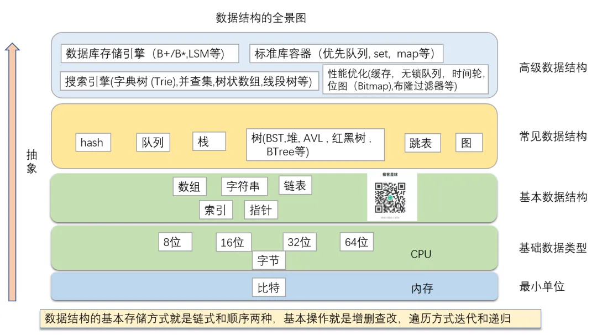

**来自极客星球-数据结构和算法精华总结.pdf 完整资料可以加入[极客星球](http://mp.weixin.qq.com/s?__biz=MzkyMTIzMTkzNA==&mid=2247615655&idx=1&sn=bf3cf0576ad3eb1df5fc78286b5e0a35&chksm=c185f3f6f6f27ae077ed1464defe3091ba942d70bf66dcaeea6feb23fbce26cd2e8744ca0b65&scene=21#wechat_redirect)获取**

**看完本文可以学到什么**

  * **知道哪些数据结构和算法在实际工作中最常用，最重要**

  * **理解一些设计上注意事项（经验总结）**

  * **掌握常用数据结构和算法核心知识点**

## 数据结构

工作中或者开源项目中最常用数据结构：**数组/list + hash + tree**  

O(n)结构：list/栈/队列

O(1)结构：数组/hash/位图

O(logn)树形结构：红黑树/B+树/skip list

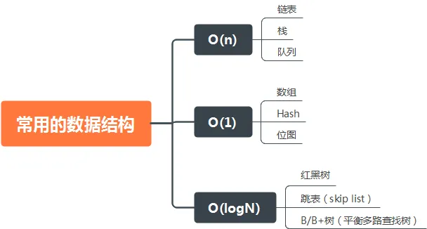

**数组**

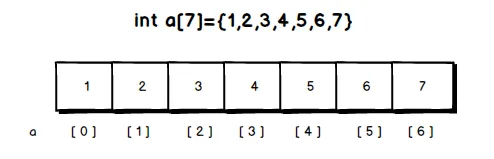

**核心点：**

1 内存空间大小固定，如果支持动态扩展，需要内存迁移，有一定的性能代价，比如C++ STL的vector结构；

2 内存连续，对CPU cache友好，如果内存空间足够，能用数组就最好用数组结构；

3 数组空间一般都是预分配的，不会频繁申请和释放，所以可以提供程序性能，这个做内存池优化的实现手段；

**链表**

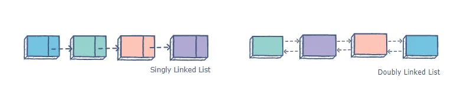

**核心点：**

  * 可以动态项扩缩容，比较节约空间；

  * 链表编程边界case检查： 

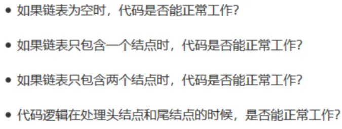

  * 每个节点必须有个“指针“要么指向其他节点，要么为空，这样才能把链表串起来，任何操作都必须保证链表完整性，不允许节点无故脱链，所以任何操作之前，都要思考会不会导致节点脱链，如果不下心脱链就会存在内存泄漏风险；

  * 链表作为最**基础数据结构**，很多高级结构：队列，栈，hash，二叉树，都是在链表基础上演化而来；

**编程技巧**

### 1. 头结点解决什么问题？

头结点:是虚拟出来的一个节点，不保存数据。头结点的next指针指向链表中的第一个节点。对于头结点，数据域可以不存储任何信息，也可存储如链表长度等附加信息。头结点不是链表所必需的。

头指针:是指向第一个结点的指针,如果链表没有引入头结点，那么头指针指向的是链表的第一个结点。头指针是链表所必需的。

[注意]无论是否有头结点，头指针始终指向链表的第一个结点。如果有头结点，头指针就指向头结点。

**1）对链表的删除、插入操作时，第一个结点的操作更方便**

如果链表没有头结点，那么头指针指向的是链表的第一个结点，当在第一个结点前插入一个节点时，那么头指针要相应指向新插入的结点，把第一个结点删除时，头指针的指向也要更新。也就是说如果没有头结点，我们需要维护着头指针的指向更新。因为头指针指向的是链表的第一个结点，如果引入头结点的话，那么头结点的next始终都是链表的第一个结点。

**2）统一空表和非空表的处理**

有了头结点之后头指针指向头结点，不论链表是否为空，头指针总是非空，而且头结点的设置使得对链表的第一个位置上的操作与在表中其它位置上的操作一致，**即统一空表和非空表的处理**。

### 2. 链表最常规操作

删除: 遍历链表，找到删除的节点，保存删除节点的pre节点和next节点；

然后pre和next 串起来

```c
static inline void __list_del(struct list_head * prev, struct list_head * next)  
{  
    next->prev = prev;  
    prev->next = next;  
}
```

再释放删除节点内存；

添加: 遍历链表找到要加入位置（或者节点），保存该节点的pre节点和next节点，然后把新接入插入到链表中：

```c
static inline void __list_add(struct list_head *new,  
      struct list_head *prev,  
      struct list_head *next)  
{  
    next->prev = new;  
    new->next = next;  
    new->prev = prev;  
    prev->next = new;  
}
```

2 **快慢指针**，快慢指针一般都初始化指向链表的头结点 head，前进时快指针 fast 在前，慢指针 slow在后，巧妙解决一些链表中的问题。比如：判定链表中是否含有环，寻找链表的中点, 寻找距离尾部第K个节点等；

3 **dummy node**，dummy node是链表问题中一个重要的技巧，中文翻译叫“哑节点”，使用通常针对单链表没有前向指针的问题，保证链表的head不会在删除操作中丢失，当链表的 head 有可能变化（被修改或者被删除）时，使用 dummy node 可以很好的简化代码，最终返回dummy.next 即新的链表。

4 通常链表有两种实现方式，一种是**抽象独立型**，一种是**传统耦合型**；

list作为常用数据结构，写代码时候经常会遇到，可以看一下传统list设计和抽象list设计有什么不一样。

一般的双向链表一般是如下的结构:

  * 有个单独的头结点(head)

  * 每个节点(node)除了包含必要的数据之外，还有2个指针(pre,next)

  * pre指针指向前一个节点(node)，next指针指向后一个节点(node)

  * 头结点(head)的pre指针指向链表的最后一个节点

  * 最后一个节点的next指针指向头结点(head)

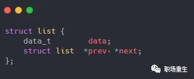

传统list如下图：

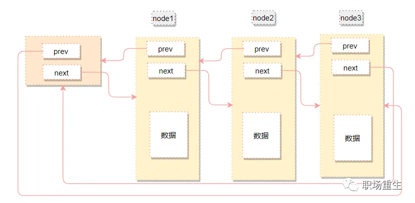

传统的链表不同node类型，需要重新定义结构，不够通用化，还需要为node实现脱链、入链操作等。

我们需要抽象出一个“基类”来实现链表的功能，其他数据结构只需要简单的继承这个链表类就可以了。

抽象型list设计如下：

  * 链表不是将用户数据保存在链表节点中，而是将链表节点保存在用户数据中

  * 链表节点只有2个指针(prev和next)

  * prev指针指向前一个节点的链表节点，next指针指向后一个节点(node)的链表节点

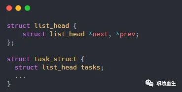

如下图：

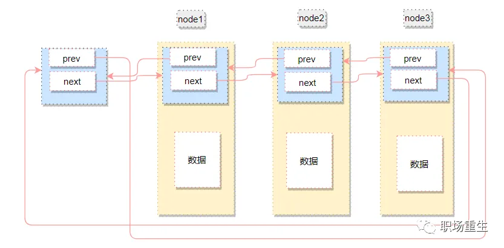

这样设计的好处是链表的节点将独立于用户数据之外，便于把链表的操作独立出来，和具体数据节点无关，这里可能有些人会问，数据节点怎么访问呢？通过一个`container_of`的宏从链表节点找到数据节点起始地址：

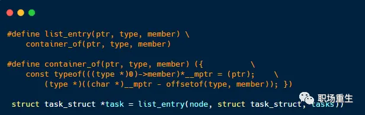

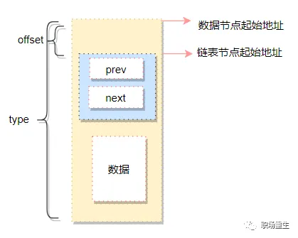

找到数据节点起始地址后，通过数据节点定义就可以访问数据。

5 链表最核心技巧，就是理解指针操作（包括安全检查-空指针判断），不要被指针复杂的赋值操作搞晕，多敲代码，找到经典的链表练习题（28原则）不断练习，比如：判断链表是否有环，反转链表，合并链表等，写好每一题，再认真总结，唯有熟才能生巧。

**栈**  

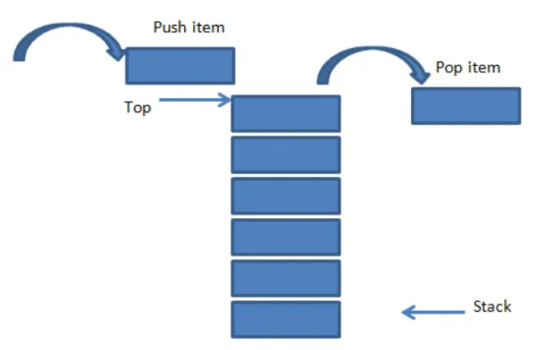

**核心点：**

  * 需要关注栈的深度大小（容量）；

  * 栈各个极端情况处理，比如空，满，溢出等；

  * 多线程下实现安全的栈操作；

  * 堆栈很容易被攻击(缓冲区溢出攻击)，程序员必须特别注意避免这些实现的陷阱, 防止代码产生安全漏洞；

**使用场景：**

1 操作系统程序运行栈，实现函数调用运行机制；

2 操作前进和后退，比如编辑器，浏览器等；  

3 编译器使用，比如表达式解析，语法检查等；

**队列**

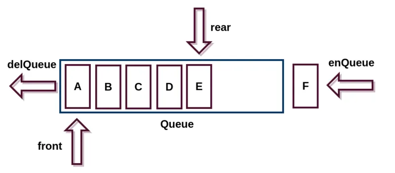

**核心点：**

  * 队列核心作用：应用耦合、异步处理、流量削锋（缓冲）；

  * 队列各个极端情况处理，比如空，满，溢出等；

  * 队列支持多线程并发操作，加锁或者**无锁队列**实现；

  * 队列**零拷贝优化**，比如队列操作零拷贝（操作指针地址或者索引），IO零拷贝；

**使用场景**：

1 各种消息队列中间件，比如RabbitMQ、RocketMQ、ActiveMQ、Kafka、ZeroMQ、MetaMq等；  

2 各种排队（缓冲区）系统，操作系统任务FIFO调度队列，数据包发送队列，凡是需要满足FIFO场景，都是可以用队列实现；

**Hash结构**

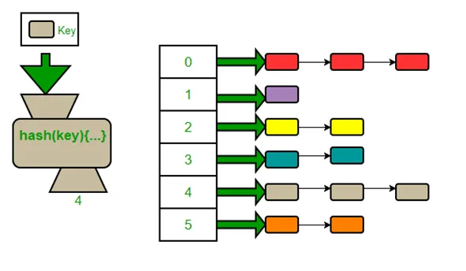

**hash结构核心点：**

  1. Hash是以空间换时间结构，需要评估好所有Hash头结构的内存使用量；

  2. Hash桶选择需要考虑到内存和冲突链长度大小（影响查找效率)；

  3. hash的优化 --解决hash冲突

    3.1 内存有限场景下，就需要优化冲突链结构（链表转红黑树）；
    
    3.2 优化hash函数，让hash结果更均匀；
    
    3.3 可以考虑双重hash（空间和时间，还有编码复杂度的一种折中方案）

  4. 需要考虑hash扩容

    4.1 在设计hash结构的时候，需要考虑未来可用户量增长后导致规格变大，这样原先hash结构已经不合适，冲突链太长，导致查询效率急速降低，所以再最初设计的时候，需要考虑到rehash设计（为什么不一次设置为最大，因为内存不是无限的，需要考虑一定时间还可以提供很好的服务，不需要升级版本），当hash冲突链太长后，进行rehash流程；

    4.2 rehash算法有很多，需要考虑几点：

      a. 要不要保证hash一致性，扩容后，重hash还是不变，这个在负载均衡网关里面很重要，需要保证hash选择RS后端服务节点不变，否则会到存量连接走到其他RS节点，让服务变得不可用，甚至断开（tcp需要建立会话，其他RS没有这个会话）等。所以这里可能会采用一致性hash算法，或者其他hash算法，保证相同client去相同RS。

      b. 在rehash过程中，由于需要保证业务正常，需要保证在修改过程中，所以为了减少锁影响，一般采用双份内存，逐步把原hash数据迁移到新hash结构（防止大规模rehash导致CPU性能瓶颈），当存量迁移完后，可以快速加锁切换hash结构，这样可以减少服务不可用时间；

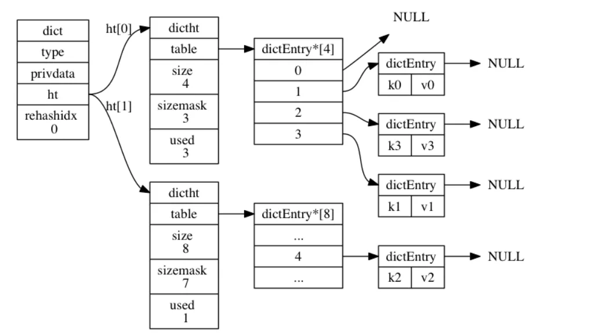

其实redis的rehash算法，就是类似这种，属于渐进式rehash算法， 好处在于它采取分而治之的方式， 将 rehash键值对所需的计算工作均滩到对字典的每个添加、删除、查找和更新操作上， 从而避免了集中式 rehash 而带来的庞大计算量。

业界还有其他扩容的算法，比如Linear Hash Tables是一种动态扩展空间的哈希表，会随着插入的元素的增多而自动扩展空间等；

**使用场景**：

1 redis的dict结构设计；

2 签名算法MD5算法；

3 数据包校验 CRC算法；

4 负载均衡LB选择后端服务器hash算法；

5 布隆过滤器：布隆过滤器被广泛用于黑名单过滤、垃圾邮件过滤、爬虫判重系统以及缓存穿透问题。对于数量小，内存足够大的情况，我们可以直接用hashMap或者hashSet就可以满足这个活动需求了。但是如果数据量非常大，比如5TB的硬盘上放满了用户的参与数据，需要一个算法对这些数据进行去重，取得活动的去重参与用户数。这种时候，布隆过滤器就是一种比较好的解决方案了。

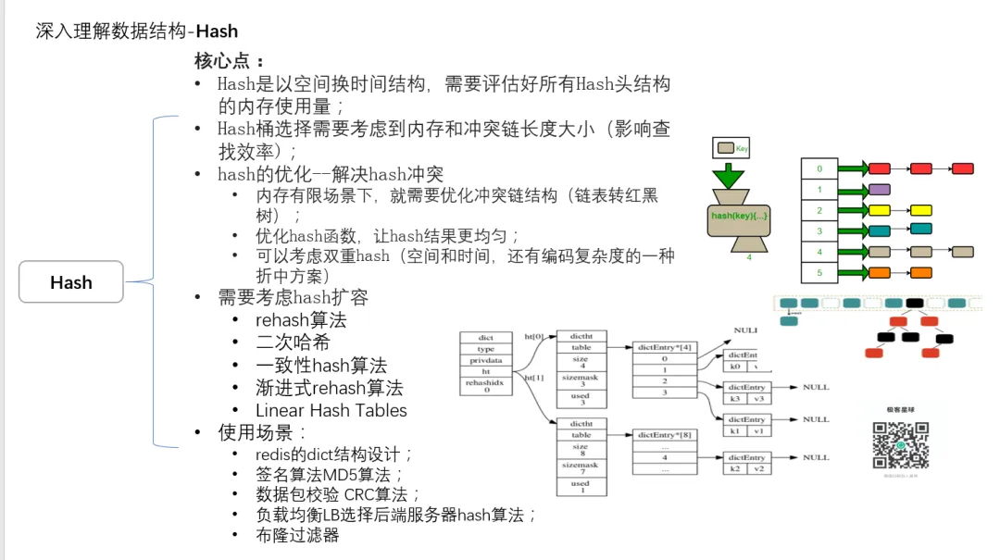

**位图（Bitmap）**

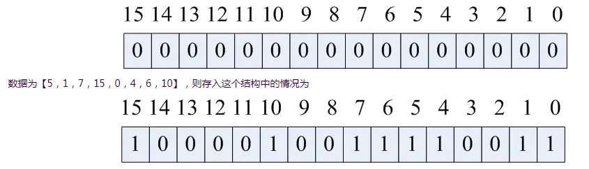

**核心点：**  

  * 即位（Bit）的集合，是一种数据结构，可用于记录大量的0-1状态，在很多地方都会用到，优势是可以在一个非常高的空间利用率下保存大量0-1状态。

  * 本质上是采用了bit位来表示元素状态，从而在特定场景下能够极大的节省存储空间，非常适合对海量数据的查找，判重，删除等问题的处理；

  * 数据稀疏。又比如要存入(10,8887983,93452134)这三个数据，我们需要建立一个 99999999 长度的 BitMap ，但是实际上只存了3个数据，这时候就有很大的空间浪费，碰到这种问题的话，可以通过引入 Roaring BitMap 来解决，就是通过压缩算法进行空间压缩。

  * 数据碰撞。比如将字符串映射到 BitMap 的时候会有碰撞的问题，那就可以考虑用 Bloom Filter 来解决，Bloom Filter 使用多个 Hash 函数来减少冲突的概率

**使用场景**：

1 在Java里面一个int类型占4个字节，假如要对于10亿个int数据进行处理呢？10亿*4/1024/1024/1024=4个G左右，需要4个G的内存。如果能够采用bit储,`10_0000_0000Bit=1_2500_0000byte=122070KB=119MB`, 那么在存储空间方面可以大大节省。在Java里面，BitMap已经有对应实现的数据结构类java.util.BitSet，BitSet的底层使用的是long类型的数组来存储元素。

2 redis bitmap；

3 布隆过滤器；

4 Linux内核（如inode，磁盘块）；

## 红黑树

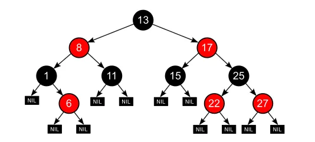

### **核心点**

  * ### 在已经有了AVL之类的BBST，为什么还需要引入红黑树？我们希望数据结构具有关联性，即相邻版本之间，比如说第一次插入，和第二次插入时，树的结构不能发生太大变化，应该可以经过O（1）次数就可以变化完成。对于AVL树来说，插入是满足这个条件的，删除却不满足这个条件。红黑树就满足这一特性，插入和删除操作后的拓扑变化不会超过O(1)。

  * 红黑树与AVL树相似，但提供更快的实时有界最坏情况下的插入和删除性能（分别达到最多两轮和三轮以平衡树），但速度稍慢（但仍为O（log n））查找时间；

  * 红黑树和AVL树一样都对插入时间、删除时间和查找时间提供了最好可能的最坏情况担保。这不只是使它们在时间敏感的应用，如实时应用（real time application）中有价值，而且使它们有在提供最坏情况担保的其他数据结构中作为基础模板的价值；例如，在计算几何中使用的很多数据结构都可以基于红黑树实现。

  * 红黑树在函数式编程中也特别有用，在这里它们是最常用的持久数据结构（persistent data structure）之一，它们用来构造关联数组和集合，每次插入、删除之后它们能保持为以前的版本。除了的时间之外，红黑树的持久版本对每次插入或删除需要的空间。

  * 红黑树相对于AVL树来说，牺牲了部分平衡性以换取插入/删除操作时少量的旋转操作，整体来说性能要优于AVL树。

  * 维护红黑树的平衡需要考虑7种不同的情况:


  * 红黑树为什么综合性能好？

因为**红黑树利用了缓存。**

Robert Sedgewick, 红黑树的发明人，在《算法（第4版）》 中说过， 红黑树等价于2-3树, 换句话说，对于每个2-3树，都存在至少一个数据元素是同样次序的红黑树。在2-3树上的插入和删除操作也等同于在红黑树中颜色翻转和旋转。这使得2-3树成为理解红黑树背后的逻辑的重要工具，这也是很多介绍算法的教科书在红黑树之前介绍2-3树的原因，尽管2-3树在实践中不经常使用。

其中2-节点 等价于普通平衡二叉树的节点，**3-节点 本质上是非平衡性的缓存**。

当需要再平衡（rebalance）时，增删操作时，2-节点 与 3-节点间 的 转化会吸收不平衡性，减少旋转次数，使再平衡尽快结束。

在综合条件下，增删操作相当时，数据的随机性强时，3-节点的非平衡性缓冲效果越明显。因此红黑树的综合性能更优。

继续追根溯源，红黑树的性能优势，**本质上是用空间换时间**。

**发展：**

我们将红黑树分成这么几种类型：左倾红黑树、右倾红黑树、AA树。

**左倾红黑树（LLRB，Left-Learning Red-Black Tree）**，一个节点如果有红色子节点，那么，它的红色子节点是向左倾斜的。

**右倾红黑树（RLRB，Right-Learning Red-Black Tree）**，也是一样的道理，即红色子节点向右倾斜。

**左倾红黑树（LLRB）**是一种类型的自平衡二叉查找树。它是红黑树的变体，并保证对操作相同渐近的复杂性，但被设计成更容易实现。

**AA树**是红黑树的一种变种，是Arne Andersson教授在1993年年在他的论文"Balanced search trees made simple"中介绍，设计的目的是减少红黑树考虑的不同情况，区别于红黑树的是，AA树的红节点只能作为右叶子，从而大大简化了维护2-3树的模拟，因为AA树有严格的条件(红节点只能为右节点)，故只需考虑2种情形:


**使用场景**：

**1 C++**

广泛用在C++的STL中。如map和set都是用红黑树实现的；

**2 Java**

Java TreeMap和TreeSet都是基于红黑树实现的，而JDK8 中 HashMap当链表长度大于8 时也会转化为红黑树

**3 Linux操作系统**

  * ‍‍‍‍‍‍CFS进程调度算法中，vruntime利用红黑树来进行存储，选择最小vruntime节点调度。

  * 高分辨率计时器代码使用rbtree来组织未完成的计时器请求。

  * ext3文件系统跟踪红黑树中的目录条目。

  * 虚拟内存结构管理（VMA）.。

  * 多路复用技术的Epoll的核心结构也是红黑树+双向链表。

  * 加密密钥和网络数据包均由红黑树跟踪。

**4 Linux应用程序**

nginx用红黑树管理timer等。

**5 实际工作中也会用到红黑树**  

1 我们做的是大流量网关，100G 流量，pps 实际是5000w pps 左右， 我们路由表项总共是5000w。

2 当时采用数据结构是hash+list，路由规模还会不断增大，但不能无脑增加hash桶，这个会增加内存，本身当时网关内存就不是很充裕，所以这里要把list换成红黑树。

3 但之前list都是用RCU锁（因为链表操作可以原子化（64位指针））实现多核并发访问，但红黑树这种树形结构要实现无锁多核并发一直是比较困难的点，每次变更可能会产生多次位移（旋转）操作，多个操作比较困实现原子化。

4 最终想到一个比较好方法是 双份指针，用空间换时间，红黑树维护两份指针（骨架），当前使用的active指针，更新操作backup指针，等更新backup指针后，再原子交换根节点，这样不妨碍其他核读，然后再同步指针拓扑关系到备份指针。

**跳表（skip list）**

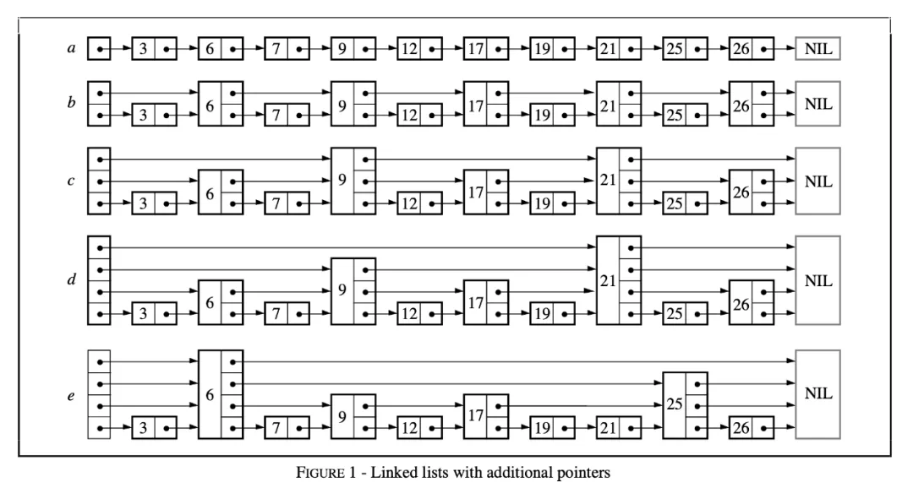

**核心点：**  

1 跳表本质上是对链表的一种优化，通过逐层跳步采样的方式构建索引，以加快查找速度。使用概率均衡的思路，确定新插入节点的层数，使其满足集合分布，在保证相似的查找效率简化了插入实现。

2 skiplist的复杂度和红黑树一样，而且实现起来更简单；

3 在并发环境下skiplist有另外一个优势，红黑树在插入和删除的时候可能需要做一些rebalance的操作，这样的操作可能会涉及到整个树的其他部分，而skiplist的操作显然更加局部性一些，锁需要盯住的节点更少，因此在这样的情况下性能好一些；

**使用场景**：

1 HBase MemStore 的数据结构：HBase 属于 LSM Tree 结构的数据库，LSM Tree结构的数据库有个特点，实时写入的数据先写入到内存，内存达到阈值往磁盘 flush 的时候，会生成类似于 StoreFile 的**有序文件**，而跳表恰好就是天然有序的，所以在 flush 的时候效率很高。

2 Google 开源的 key/value 存储引擎 LevelDB 以及 Facebook 基于 LevelDB 优化的 RocksDB 都是 LSM Tree 结构的数据库，他们内部的 MemTable 都是使用了跳表这种数据结构；

3 redis的sorted set内部实现；

**B/B+树（平衡多路查找树）**

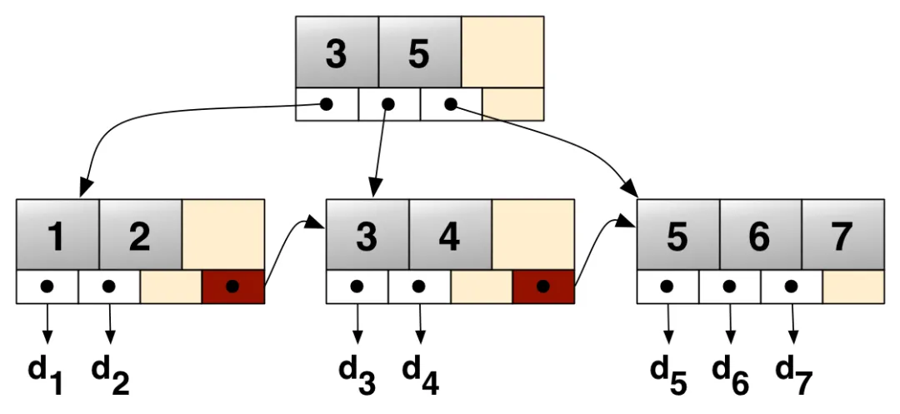

**核心点：**

1 Ｂ树和Ｂ＋树的出现是因为磁盘ＩＯ；众所周知，ＩＯ操作的效率很低，那么，当在大量数据存储中，查询时我们不能一下子将所有数据加载到内存中，只能逐一加载磁盘页，每个磁盘页对应树的节点。造成大量磁盘ＩＯ操作（最坏情况下为树的高度）。平衡二叉树由于树深度过大而造成磁盘IO读写过于频繁，进而导致效率低下。所以，我们为了减少磁盘ＩＯ的次数，就你必须降低树的深度，将“瘦高”的树变得“矮胖”。一个基本的想法就是：

  1. **每个节点存储多个元素**

  2. **摒弃二叉树结构，采用多叉树**

这样就引出来了一个新的查找树结构 ——多路查找树（multi-way search tree）。一颗平衡多路查找树自然可以使得数据的查找效率保证在`O(logN)`这样的对数级别上。

2 B-Tree是为磁盘等外存储设备设计的一种平衡查找树。系统从磁盘读取数据到内存时是以磁盘块（block）为基本单位的，位于同一个磁盘块中的数据会被一次性读取出来，B+Tree是在B-Tree基础上 的一种优化，使其更适合实现外存储索引结构；

3 B+Tree 只有叶子结点存储数据，所有非叶子结点（内部结点）不存储数据，只有指向子结点的指针。叶子结点均在同一层，且叶子结点之间类似于链表结构，即有指针指向下一个叶子结点；

4 由于B+树在内部节点上不包含数据信息，因此在内存页中能够存放更多的key。数据存放的更加紧密，具有更好的空间局部性。因此访问叶子节点上关联的数据也具有更好的缓存命中率

5 B+树的叶子结点都是相链的，因此对整棵树的便利只需要一次线性遍历叶子结点即可。而且由于数据顺序排列并且相连，所以便于区间查找和搜索。而B树则需要进行每一层的递归遍历，相邻的元素可能在内存中不相邻，所以缓存命中性没有B+树好，B树也有优点，其优点在于：由于B树的每一个节点都包含key和value，因此经常访问的元素可能离根节点更近，因此访问也更迅速。

**BTree 升级**

• B树：多路搜索树，每个结点存储M/2到M个关键字，非叶子结点存储指向关键字范围的子结点；所有关键字在整颗树中出现，且只出现一次，非叶子结点可以命中；

• B+树：在B-树基础上，为叶子结点增加链表指针，所有关键字都在叶子结点中出现，非叶子结点作为叶子结点的索引；B+树总是到叶子结点才命中；

• B*树：在B+树基础上，为非叶子结点也增加链表指针，将结点的最低利用率从1/2提高到2/3。

**LSM树（Log Structured Merge Tree）**

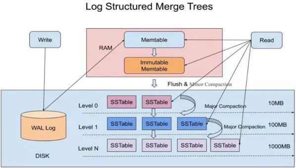

LSM树（Log Structured Merge Tree）设计思路是将数据拆分为几百M大小的Segments，并是顺序写入。将对数据的修改增量保持在内存中，达到指定的大小限制后将这些修改操作批量写入磁盘（由此提升了写性能,是一种基于硬盘的数据结构，与BTree相比，能显著地减少硬盘磁盘臂的开销。当然凡事有利有弊，LSM树和B+树相比，LSM树牺牲了部分读性能，用来大幅提高写性能,适合大量数据写入场景（比如各种NoSQL在大数据领域的应用）。

**使用场景**：

  * MySQL InnoDB存储引擎就是用B+Tree实现：

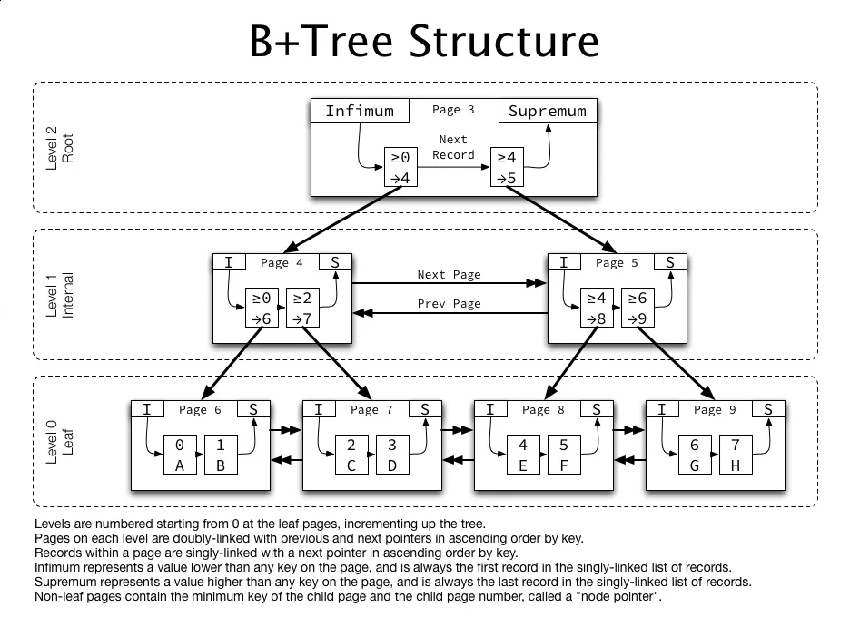

每个级别的所有页面都相互双向链接，并且在每个页面内，记录按升序单独链接。非叶页包含“指针”（包含子页码）而不是非关键行数据。

  * Rust的treeMap容器采用BTree，BTree在大部分场景下，可以让一些临近元素在内存中存放在一起，从而在大部分情况下，实践中得到比BST更好的性能。

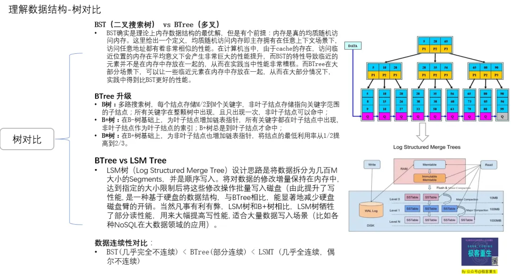

#### 算法

一些的重要算法，很多算法在工作中都经常使用；  

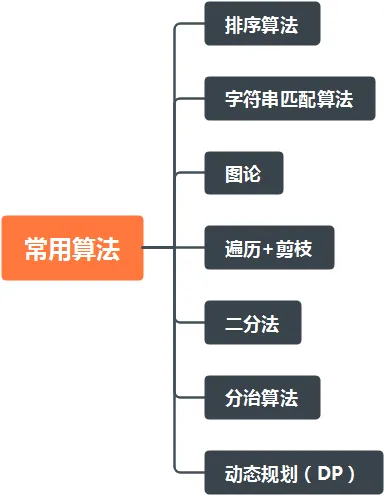

排序算法核心：

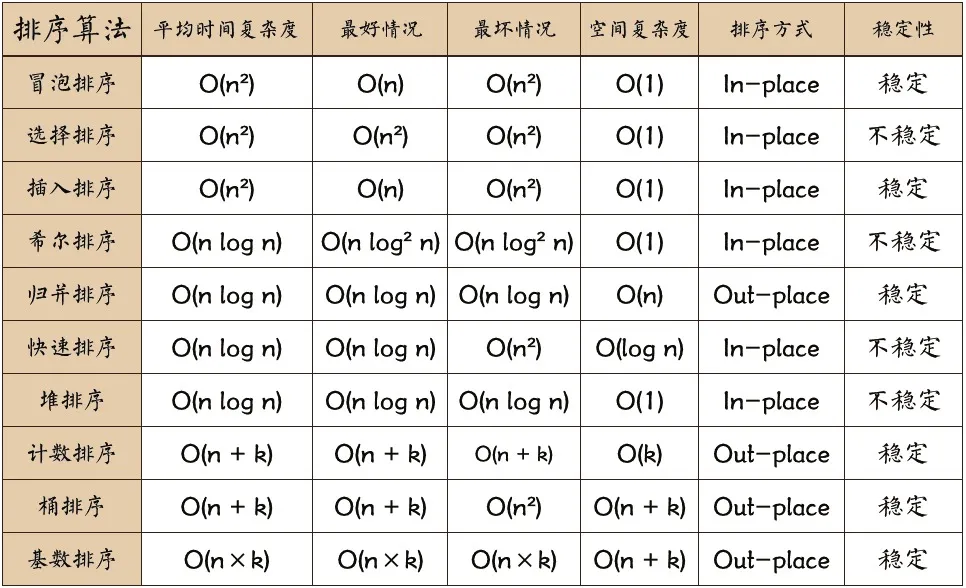

**核心点:**  

  * 稳定性得好处：从一个键上排序，然后再从另一个键上排序，第一个键排序的结果可以为第二个键排序所用，多重key值排序；

  * 大多数语言的标准库排序算法是**快速排序**：

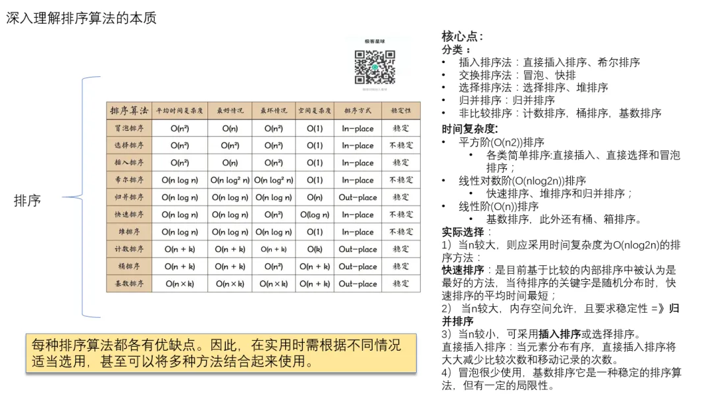

核心原理是通过选择一个元素作为基点，然后通过与基点比较，根据比较结果进行分类（移动元素），再递归下去，直到不能递归为止，这样整个数组就有序了；

标准库中的sort，是通过先快排，递归深度超过一个阀值就改成堆排，然后对最后的几个进行插入排序来实现的；

快速排序复杂度是nlogn，但实际综合性能最好；

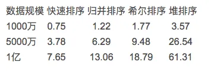

原因：

1. 快速排序中，每次数据移动都意味着该数据距离它正确的位置越来越近，而在其他同等级排序中，类似将堆尾部的数据移到堆顶这样的操作只会使相应的数据远离它正确的位置，后续必然有一些操作再将其移动，即“**做了好多无用功**”。

2. **快速排序通常比其他排序算法快得多**，因为它就地运行，无需创建任何辅助数组来保存临时值。与归并排序之类的东西相比，这可能是一个巨大的优势，因为分配和取消分配辅助数组所需的时间可能很明显。就地操作还提高了快速排序的局部性。‍‍‍‍‍‍‍‍‍‍‍‍‍‍‍‍‍

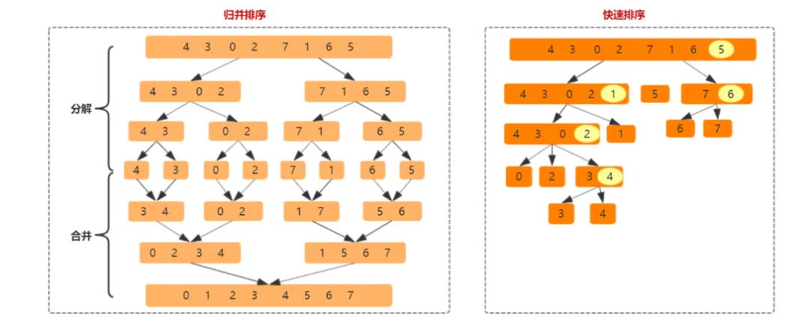

  * 增量型排序（比如实时计算topN这种）采用是堆排序（最小堆或者最大堆）；  

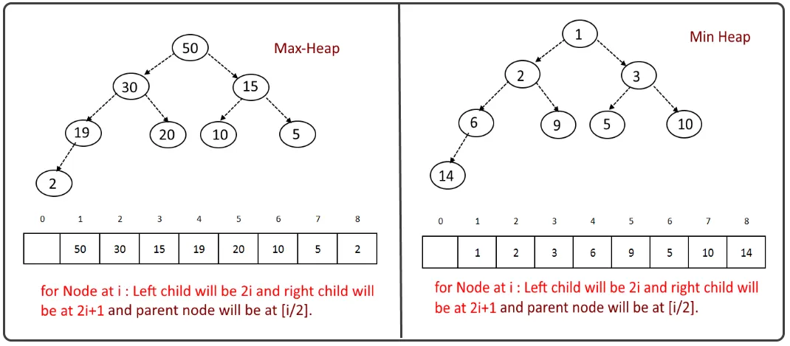

  * 标准库sort实现分析：  

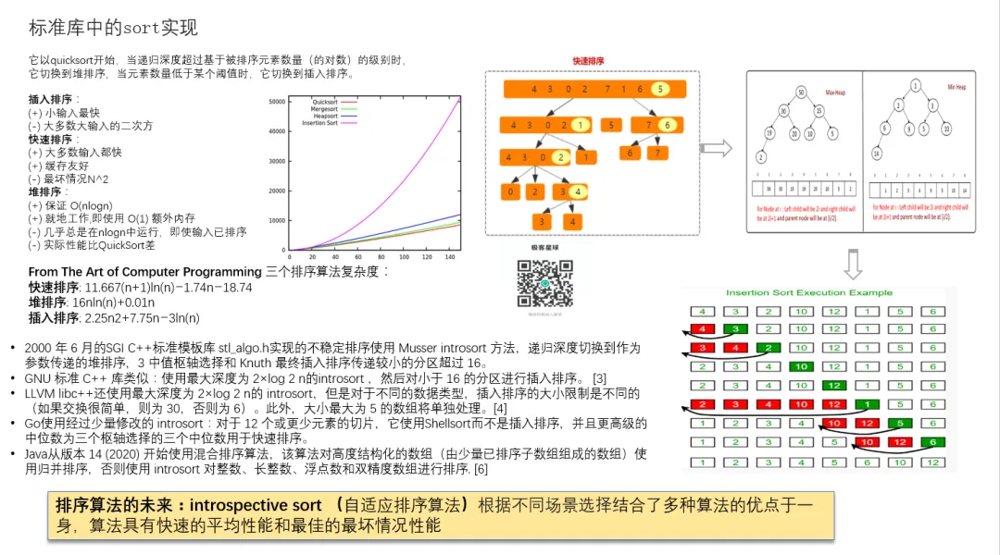

**字符串匹配算法**

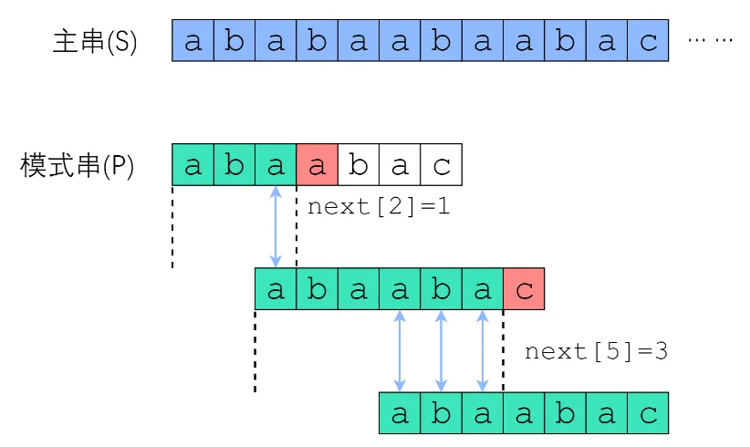

**核心点：**

  * 尽可能利用一切可以利用信息，比如模式串本身信息，后缀信息，比较后的残余信息等；

  * 掌握正则表达式语法；

  * 理解模式匹配：KMP、Boyer-Moore算法；

**使用场景：**  

1 linux文本处理三剑客 grep ，awk， sed 等用了大量正则表达式算法。

2 文本编辑器使用大量字符串匹配算法。

**图论**

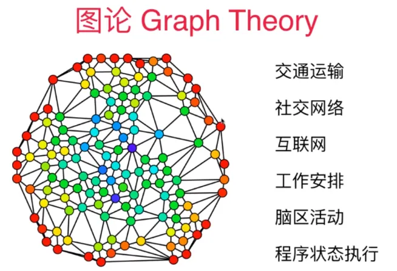

**核心点：**

  * 实际工作中网络会用到部分图算法，比如网络拓扑排序，OSPF路由协议（最短路径）；

  * 如果你要参加ACM or OJ 这种比赛，可以学一些常用图算法：最短路径、最小生成树、网络流建模；

**使用场景：**

1 游戏开发中会用到大量的图算法：路径搜索算法（BFS,DFS,A*)；

2 导航软件会用到大量的图算法：最短路径，路径搜索算法；

3 网络bridge的STP协议用到最小生成树算法；

4 网页排名中PageRank 算法；

**搜索(遍历)+剪枝**  

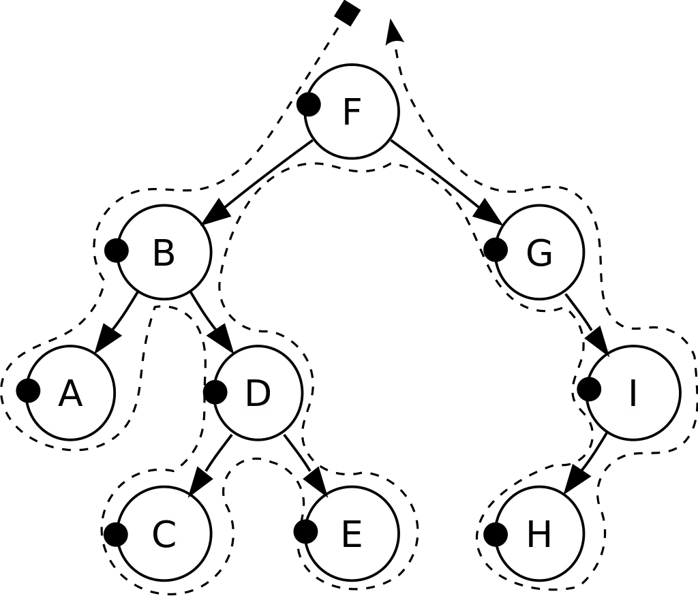

**核心点:**

  * 核心是减少解空间，穷举+排除法；

  * 核心是减少解空间，递归+判断；

**使用场景：**

1 深度优先搜索、广度优先搜索、A*算法、回溯算法、蒙特卡洛树搜索；

**二分法**

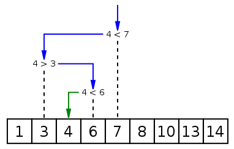

**核心点：**  

  * 前置条件，需要有序；

  * 全面考虑算法边界点，实现细节，溢出等问题；

  * 不能在线增量计算；

**使用场景：**

1 用二分法计算方程近似解；

2 机器学习二分分类算法；

3 有序序列快速查找场景;

### 分治算法

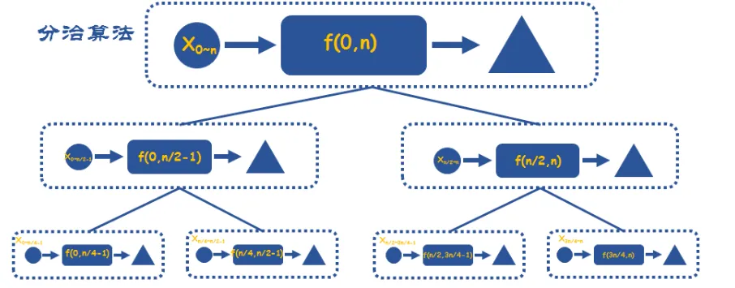

**核心点:**

  * 一是自顶向下分解问题，二是自底向上抽象合并；

  * 将一个难以直接解决的大问题，分割成一些规模较小的相同问题，以便**各个击破，分而治之**；‍  

**使用场景：**

1 二分搜索，排序算法(快速排序，归并排序)，动态规划；

2 傅立叶变换(快速傅立叶变换)；

3 程序模块化设计；

**动态规划（DP）**  

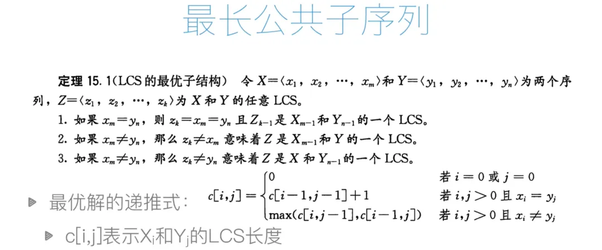

**核心点:**

  * 实际工作中很少用到，工作多年，从来没有在工作中使用过动态规划。

  * 核心是了解其思想和原理:

  1. **动态规划**最核心的思想，就在于拆分子问题，记住过往，减少重复计算；

  2. 深刻理解最优子结构，重叠子问题，状态转移方程，无后效性，以及边界条件；

  3. 进阶（适合ACM选手）：熟悉各种类型DP特点，普通DP，区间DP，树形DP，数位DP，状态压缩DP等；  

  * 应对面试，刷几道题就行，一般面试很少出动态规划的题，校招可能会出，社招基本上不会出；

  * 如果你要参加ACM or OJ 这种比赛，必须掌握, 这个区分菜鸟的分界点。

**使用场景：**

1 切割钢条问题, Floyd最短路问题,最大不下降子序列,矩阵链乘,凸多边形三角剖分,0-1背包,最长公共子序列,最优二分搜索树；

2 运筹学，经济学等；

## 最后总结

**程序 = 数据结构 + 算法**

--Niklaus EmilWirth

**程序本质是数据结构+算法**，任何一门语言都可以这样理解，这个公式对计算机科学的影响程度足以类似物理学中爱因斯坦的“E=MC^2”——一个公式展示出了**程序的本质**。

其实在工作中，最重要是设计好数据结构，因为在设计数据结构的时候，就是**性能和实现难度的权衡**，程序当然是越简单越好，但为了性能，有时候不得不设计出像红黑树这种复杂数据结构。  

希望我们都可以掌握好**算法核心思想**，和常见**数据结构精妙设计**，帮助我们在面试和工作中打好坚实的基础；  

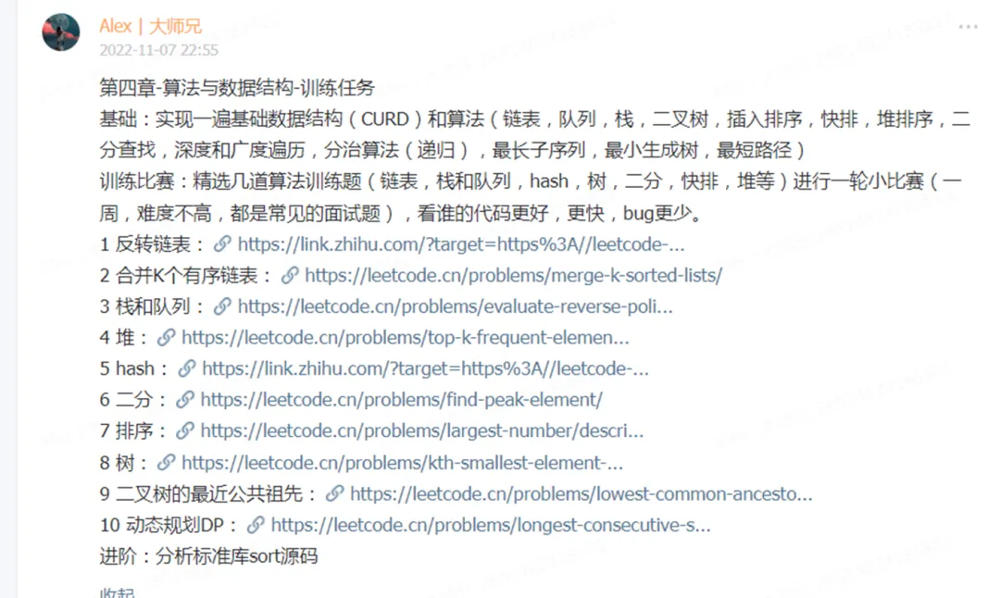

## 扩展阅读  

* https://www.cnblogs.com/binarylei/p/12419863.html
* https://en.wikipedia.org/wiki/Quicksort
* https://mp.weixin.qq.com/s/7PZ6L1YzPZdiMNK25sUqjg
* https://blog.jcole.us/2013/01/10/btree-index-structures-in-innodb/
* https://www.drdobbs.com/parallel/choose-concurrency-friendly-data-structu/208801371
* https://cloud.tencent.com/developer/article/1136054
* Robert Sedgewick. Left-leaning Red–Black Trees
* https://cloud.tencent.com/developer/news/652039
* https://github.com/greyireland/algorithm-pattern
* https://www.huaweicloud.com/articles/1bce95370dbe6348fe3f277968cf078c.html
