 
<!--BEGIN_DATA
{
    "create_date": "2022-03-18 12:20", 
    "modify_date": "2022-03-18 12:20", 
    "is_top": "0", 
    "summary": "深入理解跳表及其在Redis中的应用", 
    "tags": "数据结构", 
    "file_name": "深入理解跳表及其在Redis中的应用.md"
}
END_DATA-->

#### <p>原文出处：<a href='https://mp.weixin.qq.com/s/0Pm1n-tHGSRUht8bWVGjWQ?version=4.0.3.99066&platform=mac' target='blank'>深入理解跳表及其在Redis中的应用</a></p>

## 跳跃链表的基本概念

### 初识跳表

跳跃列表是一种数据结构。它允许快速查询一个有序连续元素的数据链表。跳跃列表的平均查找和插入时间复杂度都是O(log n)，优于普通队列的O(n)。

跳跃列表由威廉·普发明，发明者对跳跃列表的评价：`跳跃链表是在很多应用中有可能替代平衡树而作为实现方法的一种数据结构。`

跳跃列表的算法有同平衡树一样的渐进的预期时间边界，并且更简单、更快速和使用更少的空间。

这种数据结构是由William Pugh(音译为威廉·普)发明的，最早出现于他在1990年发表的论文《Skip Lists: A Probabilistic Alternative to Balanced Trees》。

大白在谷歌上找到一篇作者关于跳表的论文，感兴趣强烈建议下载阅读：

> https://epaperpress.com/sortsearch/download/skiplist.pdf

看下这篇论文的摘要部分：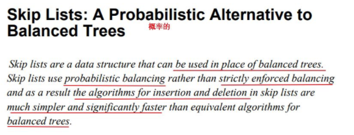

从中我们获取到的信息是：`跳表在动态查找过程中使用了一种非严格的平衡机制来让插入和删除都更加便利和快捷，这种非严格平衡是基于概率的，而不是平衡树的严格平衡。`

说到非严格平衡，首先想到的是红黑树RbTree，它同样采用非严格平衡来避免像AVL那样调整树的结构，这里就不展开讲红黑树了，看来跳表也是类似的路子，但是是基于概率实现的。

### 动态查找的数据结构

所谓动态查找就是查找的过程中存在元素的删除和插入，这样就对实现查找的数据结构有一定的挑战，因为在每次删除和插入时都要调整数据结构，来保持秩序。

可以作为查找数据结构的包括：

  * 线性结构：数组、链表
  * 非线性结构：平衡树

来分析一下各种数据结构在应对动态查找时的优劣吧！

#### 数组结构

数组结构简单内存连续，可以实现二分查找等基于下标的操作，我一直认为数组的杀手锏就是下标，连续的内存也带来了问题。

当进行插入和删除时就面临着整体的调整，就像在火车站排队买票，队头走一个整个队伍向前挪一步，有加塞的后面的又整体向后挪一步，这种整体移动操作在数组结构中性能损
耗很大，并且在大数据量时对连续内存要求很高，当然这个在大内存机器上可能没有什么问题。

如图插入6和删除5时 数组元素的移动：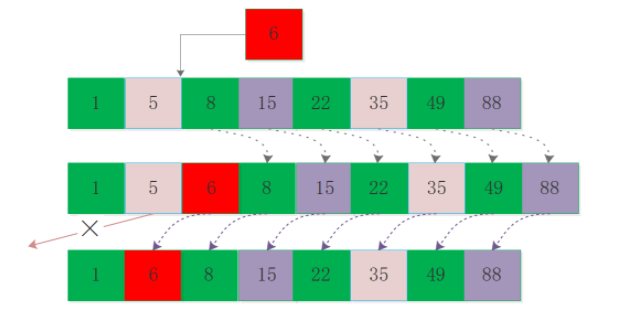

#### 链表结构

链表结构也比较简单，但是不要求内存连续，不连续也就没有下标可以加速，但是链表在执行删除和插入时影响的只是插入删除点的前后元素，影响非常小。

但是每次查找元素是需要进行遍历，就算我知道某个元素一定在大致的什么位置，也只能一步步走过去，看到这里要觉得有优化的空间，那你也蛮厉害的了，说不定早几年跳表就是你的发明了。

如图删除元素5和插入元素49时的处理：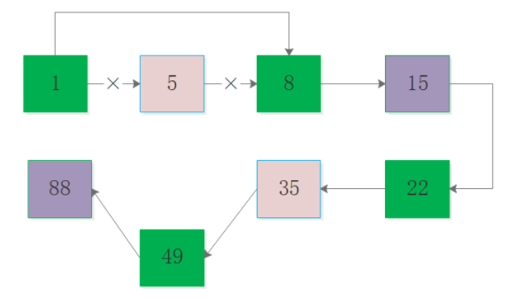

#### 平衡树

平衡树也是处理动态查找问题的一把好手，树一般是基于链表实现的，只不过树的节点之间并不是链表简单的线性关系，会有兄弟姐妹父亲等节点，并且各个层级有数量的限制，可以看到树其实还是蛮复杂的。

节点需要存储的信息很多，各个指针指来指去，复杂的结构增加了调整平衡性的难度，不同情况下的左旋右旋，所以出现了红黑树这种工程版本的AVL，但是在实际场景中可能并不需要这些兄弟姐妹父亲关系，有种杀鸡宰牛刀的意味了。

红黑树的节点结构定义：

```c
#define COLOR_RED  0x0  
#define COLOR_BLACK 0x1 

typedef struct RBNode{  
   int key;  
   unsigned char color;  
   struct RBNode *left;  
   struct RBNode *right;  
   struct RBNode *parent;  
}rb_node_t, *rb_tree_t;  
```

另外红黑树调整属性过程中插入分为3种情况，删除分为4种情况，还是比较难以理解的，除非你穿红上衣&黑裤子来疯狂暗示面试官，要不然被问到的概率还不太大。

#### 三种结构对比

从上面的对比可以看到：数组并不能很好满足要求，链表在搜索过程又显得更笨拙，平衡树又有点复杂，到底该怎么办？

##### 跳表的雏形

上面的三类结构都存在一些问题，所以要进行改造，可以看到数组和平衡树的某些特性决定了它们不容易被改造(数组内存连续性、平衡树节点多指针和层级关系)，相反链表最有潜力被改造优化。

在有序链表中插入和删除都比较简单，搜索时无法依靠下标只能遍历，但是明明知道要走两步可以到达目的地，偏偏只能一步步走，这就是痛点。

如图演示了O(n)遍历元素35和跳跃搜索元素35的过程：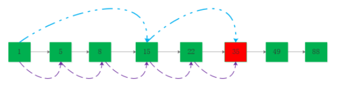

貌似看到了曙光，那么如何实现跳跃呢？  

没错！给链表加索引，让索引告诉我们下一步该跳到哪里。

看到这里又让我想起来那个经典的中间层理论，遇到问题，试着加个中间层试试，或许就完美解决了。

## 跳跃链表的实现原理

前面说了可以给普通链表加索引来解决，但是具体该怎么操作，以及其中有什么难点？一步步来分析。

在工程中对跳表索引层数和结点是否作为索引结点，是其很重要的属性，后面就详细讲一下，现在先看一种简单场景，说明索引带来的便利性。

### 简单的索引

选择每隔1个结点为索引结点，并且索引为一层，虽然在工程中这种形式比较标准化，不过足以说明索引带来的加速。

可以将链表中的偶数序号节点增加一层指针，让其指向下一个偶数节点，如图所示：

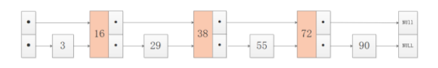

**搜索过程：**  

加入要搜索值为55的节点，则先在上层进行搜索，由16跳到38，在38的下一跳将到达72，因此向下降一级继续类似的搜索，则找到55。

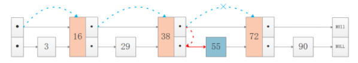

### 多级索引

基于偶数节点增加索引并且只有两层的情况下，最高层的节点数是n/2，整体来看搜索的复杂度降低为O(n/2)，并不要小看这个1/2的系数，看到这里会想增加索引层数到k，那么复杂度将指数降低为O(n/2^k)。

索引层数不是无休止增加的，取决于该层索引的节点数量，如果该层的索引的节点数量等于2了，那么再往上加层也就没有意义了，画个图看一下：

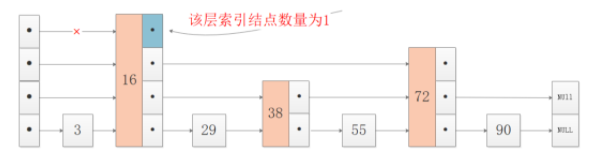

这个非常好理解，如果所在层索引结点只有1个，比如4层索引的结点16，只能顺着16向下遍历，无法向后跳到4层其他结点，因此当所在层索引结点数量等于2，则到达最高索引层，这个约束在分析跳表复杂度时很重要。

### 索引层数和索引结点密度

跳表的复杂度和索引层数、索引结点的稀疏程度有很大关系。

索引层数我们从上面也看到了，稀疏程度相当于索引结点的数量比例，如果跳表的索引结点数量很少，那么将接近退化为普通链表，这种情况在数据量是较大时非常明显，画图看下(蓝色部分表示有很多结点)：

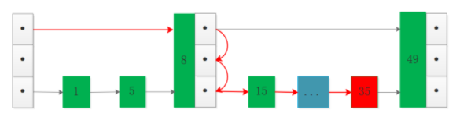

图中可以看到虽然有索引层，但是索引结点数量相对全部数据比例较低，这种情况下搜索35相比无索引情况优势并不明显。

所以跳表的效率和索引层数和索引结点的密度有密切的关系，当然索引结点太多也就等于没有索引了。

`太少的索引结点和太多的索引结点都是一样的低效。`

### 复杂度分析

从前面的分析可知，跳表的复杂度和索引层数m以及索引结点间隙d有直接关系，其中索引结点间隙理解为相隔几个结点出现索引结点，体现了对应层索引结点的稀疏程度，在无索引结点时只能遍历无法跳跃。

**如何确定最高索引层数m呢？**

如果一个链表有 n 个结点，如果每两个结点取出一个结点建立索引，那么第一级索引的结点数是 n/2，第二级索引的结点数是n/4，以此类推第 m 级索引的结点数为 n/(2^m)，前面说过最高层结点数为2，因此存在关系：

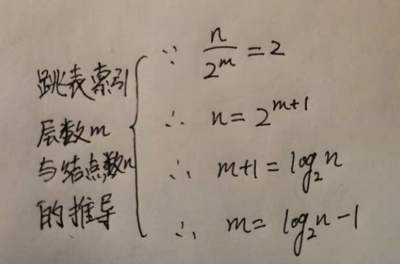

算上最底层的原始链表，整个跳表的高度为h=logn(底数为2)，每一层需要遍历的结点数是d，那么整个过程的复杂度为:`O(d*logn)`。

d表明了层间结点的稀疏程度，也就是每隔2个结点选取索引结点、或者每隔3个结点选取索引结点，每个4个结点选取索引结点......

最密集的情况下d=2，借用知乎某大佬的文章的图片：

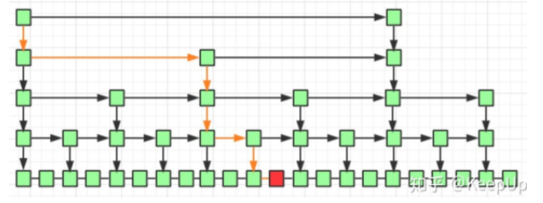

但是索引结点密集也意味着存储空间的增加，跳表相比较普通链表就是典型的用空间换时间的数据结构，这样就达到了AVL的复杂度O(logn)。

### 跳表的空间存储

以d=2的最密集情况为例，计算跳表的索引结点总数：`2+4+8+......n/8+n/4+n/2=n-2`

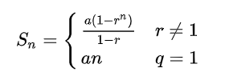

由等比数列求和公式得d=2的跳表额外空间为O(n-2)。

### 跳表的插入和删除

工程中的跳表并不严格要求索引层结点数量遵循2:1的关系，因为这种要求将导致插入和删除数据时的调整，成本很大.

跳表的每个插入的结点在插入时进行选择是否作为索引结点，如果作为索引结点则随机出层数，整个过程都是基于概率的，但是在大数据量时却能很好地解决索引层数和结点数的权衡。

我们针对插入和删除来看下基本的操作过程吧！

#### 跳表元素17插入：

链表的插入和删除是结合搜索过程完成的，贴一张William Pugh在论文中给出的在跳表中插入元素17的过程图(暂时忽略结点17是否作为索引结点以及索引层数，后面会详细说明)：

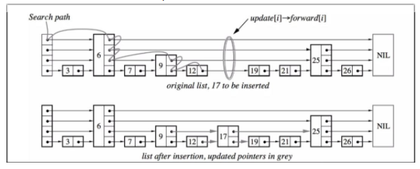

#### 跳表元素1删除：

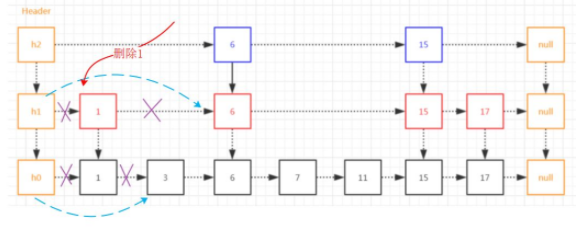

跳表元素的删除与普通链表相比增加了索引层的判断，如果结点是非索引结点则正常处理，如果结点是索引结点那边需要进行索引层结点的处理。

## 跳跃链表的应用

一般讨论查找问题时首先想到的是平衡树和哈希表，但是跳表这种数据结构也非常犀利，性能和实现复杂度都可以和红黑树媲美，甚至某些场景由于红黑树，从1990年被发明目前广泛应用于多种场景中，包括Redis、LevelDB等数据存储引擎中，后续将详细介绍。

### 跳表在Redis中的应用

ZSet结构同时包含一个字典和一个跳跃表，跳跃表按score从小到大保存所有集合元素。字典保存着从member到score的映射。这两种结构通过指针共享相同元素的member和score，不会浪费额外内存。

```c
typedef struct zset {  
    dict *dict;  
    zskiplist *zsl;  
} zset;  
```

ZSet中的字典和跳表布局：

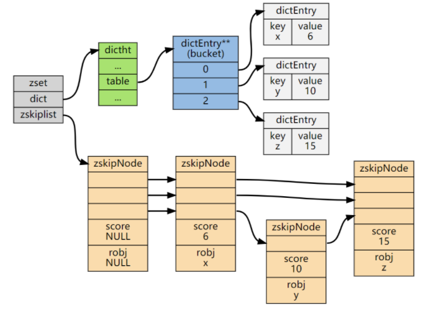

### ZSet中跳表的实现细节

#### 随机层数的实现原理

跳表是一个概率型的数据结构，元素的插入层数是随机指定的。Willam Pugh在论文中描述了它的计算过程如下：指定节点最大层数 MaxLevel，指定概率p， 默认层数 lvl 为1

`生成一个0~1的随机数r，若r<p，且lvl<MaxLevel ，则lvl++`

重复第 2 步，直至生成的r >p 为止，此时的 lvl 就是要插入的层数。

论文中生成随机层数的伪码：

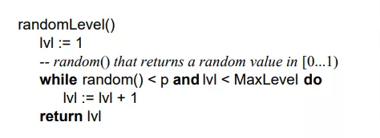

在Redis中对跳表的实现基本上也是遵循这个思想的，只不过有微小差异，看下Redis关于跳表层数的随机源码`src/z_set.c`：

```c
/* Returns a random level for the new skiplist node we are going to create.  
 * The return value of this function is between 1 and ZSKIPLIST_MAXLEVEL  
 * (both inclusive), with a powerlaw-alike distribution where higher  
 * levels are less likely to be returned. */  
int zslRandomLevel(void) {  
    int level = 1;  
    while ((random()&0xFFFF) < (ZSKIPLIST_P * 0xFFFF))  
        level += 1;  
    return (level<ZSKIPLIST_MAXLEVEL) ? level : ZSKIPLIST_MAXLEVEL;  
}  
```

其中两个宏的定义在redis.h中：

```c
#define ZSKIPLIST_MAXLEVEL 32 /* Should be enough for 2^32 elements */  
#define ZSKIPLIST_P 0.25      /* Skiplist P = 1/4 */  
```

可以看到while中的：

```c
(random()&0xFFFF) < (ZSKIPLIST_P*0xFFFF)  
```

第一眼看到这个公式，因为涉及位运算有些诧异，需要研究一下Antirez为什么使用位运算来这么写？

最开始的猜测是random()返回的是浮点数[0-1]，于是乎在线找了个浮点数转二进制的工具，输入0.5看了下结果：

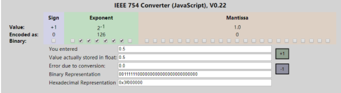

可以看到0.5的32bit转换16进制结果为0x3f000000，如果与0xFFFF做与运算结果还是0，不符合预期。

我印象中C语言的math库好像并没有直接random函数，所以就去Redis源码中找找看，于是下载了3.2版本代码，也并没有找到random()的实现，不过找到了其他几个地方的应用：

  * random()在dict.c中的使用：

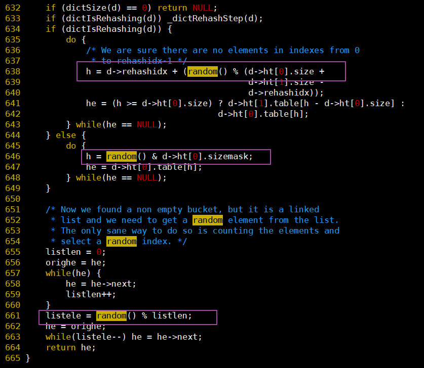

  * random()在cluster.c中的使用：

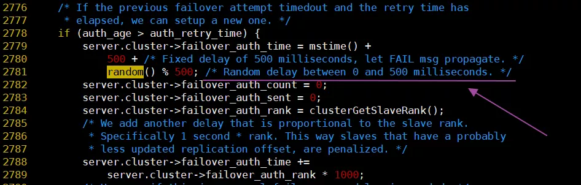

看到这里的取模运算，后知后觉地发现原以为random()是个[0-1]的浮点数，但是现在看来是uint32才对，这样Antirez的式子就好理解了。

```c
ZSKIPLIST_P*0xFFFF  
```

由于ZSKIPLIST_P=0.25，所以相当于0xFFFF右移2位变为0x3FFF，假设random()比较均匀，在进行0xFFFF高16位清零之后，低16位取值就落在0x0000-0xFFFF之间，这样while为真的概率只有1/4，更一般地说为真的概率为`1/ZSKIPLIST_P`。

对于随机层数的实现并不统一，重要的是随机数的生成，在LevelDB中对跳表层数的生成代码是这样的：

```c
template <typename Key, typename Value>  
int SkipList<Key, Value>::randomLevel() {  
  static const unsigned int kBranching = 4;  
  int height = 1;  
  while (height < kMaxLevel && ((::Next(rnd_) % kBranching) == 0)) {  
    height++;  
  }  
  assert(height > 0);  
  assert(height <= kMaxLevel);  
  return height;  
}  

uint32_t Next( uint32_t& seed) {  
  seed = seed & 0x7fffffffu;  
  if (seed == 0 || seed == 2147483647L) {   
    seed = 1;  
  }  
  static const uint32_t M = 2147483647L;  
  static const uint64_t A = 16807;  
  uint64_t product = seed * A;  
  seed = static_cast<uint32_t>((product >> 31) + (product & M));  
  if (seed > M) {  
    seed -= M;  
  }  
  return seed;  
}  
```

可以看到leveldb使用随机数与kBranching取模，如果值为0就增加一层，这样虽然没有使用浮点数，但是也实现了概率平衡。

#### 跳表结点的平均层数

我们很容易看出，产生越高的节点层数出现概率越低，无论如何层数总是满足幂次定律越大的数出现的概率越小。

> 如果某件事的发生频率和它的某个属性成幂关系，那么这个频率就可以称之为符合幂次定律。

> 幂次定律的表现是少数几个事件的发生频率占了整个发生频率的大部分， 而其余的大多数事件只占整个发生频率的一个小部分。

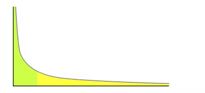

幂次定律应用到跳表的随机层数来说就是大部分的节点层数都是黄色部分，只有少数是绿色部分，并且概率很低。

定量的分析如下：

  * 节点层数至少为1，大于1的节点层数满足一个概率分布。
  * 节点层数恰好等于1的概率为`p^0(1-p)`
  * 节点层数恰好等于2的概率为`p^1(1-p)`
  * 节点层数恰好等于3的概率为`p^2(1-p)`
  * 节点层数恰好等于4的概率为`p^3(1-p)`

依次递推节点层数恰好等于K的概率为`p^(k-1)(1-p)`

因此如果我们要求节点的平均层数，那么也就转换成了求概率分布的期望问题了，灵魂画手大白再次上线：

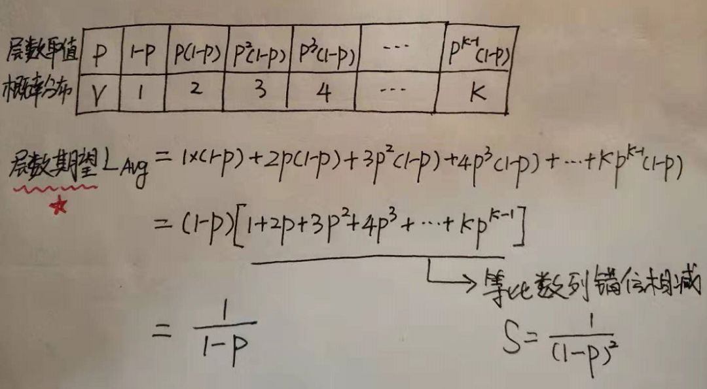

表中P为概率，V为对应取值，给出了所有取值和概率的可能，因此就可以求这个概率分布的期望了。

方括号里面的式子其实就是高一年级学的等比数列，常用技巧错位相减求和，从中可以看到结点层数的期望值与1-p成反比。

对于Redis而言，当p=0.25时结点层数的期望是1.33。

在Redis源码中有详尽的关于插入和删除调整跳表的过程，本文就不再展开了，代码并不算难懂，都是纯C写的没有那么多炫技的特效，放心大胆读起来。

## 小结

本文主要讲述了跳表的基本概念和简单原理、以及索引结点层级、时间和空间复杂度等相关部分，并没有涉及概率平衡以及工程实现部分，并且以Redis中底层的数据结构zset作为典型应用来展开，进一步看到跳跃链表的实际应用。

需要注意的是跳跃链表的原理、应用、实现细节也是面试的热点问题，值得大家花费时间来研究掌握。

