 
<!--BEGIN_DATA
{
    "create_date": "2020-11-03 11:38", 
    "modify_date": "2020-11-03 11:38", 
    "is_top": "0", 
    "summary": "深度揭秘垃圾回收底层，这次让你彻底弄懂她", 
    "tags": "Java、C/C++、算法", 
    "file_name": "深度揭秘垃圾回收底层，这次让你彻底弄懂她.md"
}
END_DATA-->

#### 
原文出处：<a href='https://mp.weixin.qq.com/s/_wcTxJOCmZXS5MwHMNqbdQ' target='blank'>深度揭秘垃圾回收底层，这次让你彻底弄懂她</a>

> Java 与 C++ 之间有一堵由内存动态分配和垃圾收集技术所围成的高墙 ---《深入理解Java虚拟机》

我们知道手动管理内存意味着自由、精细化地掌控，但是却极度依赖于开发人员的水平和细心程度。

如果使用完了忘记释放内存空间就会发生内存泄露，再如释放错了内存空间或者使用了悬垂指针则会发生无法预知的问题。

这时候 Java 带着 GC 来了（GC，Garbage Collection 垃圾收集，早于 Java 提出），将内存的管理交给 GC来做，减轻了程序员编程的负担，提升了开发效率。

所以并不是用 Java 就不需要内存管理了，只是因为 GC 在替我们负重前行。

但是 GC 并不是那么万能的，不同场景适用不同的 GC 算法，需要设置不同的参数，所以我们不能就这样撒手不管了，只有深入地理解它才能用好它。

关于 GC 内容相信很多人都有所了解。我最早得知有关 GC 的知识是来自《深入理解Java虚拟机》，但是有关 GC 的内容单看这本书是不够的。

当时我以为我懂很多了，后来经过了一番教育之后才知道啥叫无知者无畏。

而且过了一段时间很多有关 GC 的内容都说不上来了，其实也有很多同学反映有些知识学了就忘，有些内容当时是理解的，过一段时间啥都不记得了。

大部分情况是因为这块内容在脑海中没有形成体系，没有搞懂前因后果，没有把一些知识串起来。

近期我整理了下 GC 相关的知识点，想由点及面展开有关 GC 的内容，顺带理一理自己的思路，所以输出了这篇文章，希望对你有所帮助。

有关 GC 的内容其实有很多，但是对于我们这种一般开发而言是不需要太深入的，所以我就挑选了一些我认为重要的整理出来，本来还有一些源码的我也删了，感觉没必要，重要的是在概念上理清。

本来还打算分析有关 JVM 的各垃圾回收器，但是文章太长了，所以分两篇写，下篇再发。

本篇整理的 GC 内容不限于 JVM 但大体上还是偏 JVM，如果讲具体的实现默认指的是  HotSpot。

### 正文

首先我们知道根据 「Java虚拟机规范」，Java 虚拟机运行时数据区分为程序计数器、虚拟机栈、本地方法栈、堆、方法区。

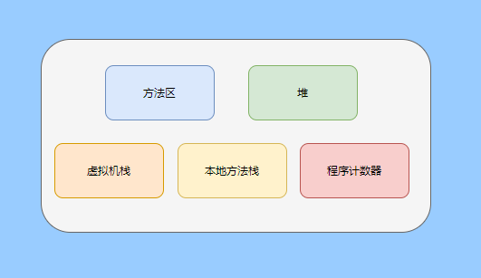

而程序计数器、虚拟机栈、本地方法栈这 3 个区域是线程私有的，会随线程消亡而自动回收，所以不需要管理。

因此垃圾收集只需要关注堆和方法区。

而方法区的回收，往往性价比较低，因为判断可以回收的条件比较苛刻。

比如类的卸载需要此类的所有实例都已经被回收，包括子类。然后需要加载的类加载器也被回收，对应的类对象没有被引用这才允许被回收。

就类加载器这一条来说，除非像特意设计过的 OSGI 等可以替换类加载器的场景，不然基本上回收不了。

而垃圾收集回报率高的是堆中内存的回收，因此我们重点关注堆的垃圾收集。

### 如何判断对象已成垃圾？

既然是垃圾收集，我们得先判断哪些对象是垃圾，然后再看看何时清理，如何清理。

常见的垃圾回收策略分为两种：一种是直接回收，即引用计数；另一种是间接回收，即追踪式回收（可达性分析）。

大家也都知道引用计数有个致命的缺陷-循环引用，所以 Java 用了可达性分析。

那为什么有明显缺陷的计数引用还是有很多语言采用了呢？

比如 CPython ，由此看来引用计数还是有点用的，所以咱们就先来盘一下引用计数。

### 引用计数

引用计数其实就是为每一个内存单元设置一个计数器，当被引用的时候计数器加一，当计数器减少为 0 的时候就意味着这个单元再也无法被引用了，所以可以立即释放内存。

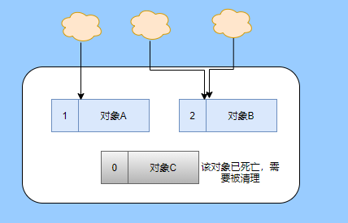

如上图所示，云朵代表引用，此时对象 A 有 1 个引用，因此计数器的值为 1。

对象 B 有两个外部引用，所以计数器的值为 2，而对象 C  没有被引用，所以说明这个对象是垃圾，因此可以立即释放内存。

由此可以知晓引用计数需要占据额外的存储空间，如果本身的内存单元较小则计数器占用的空间就会变得明显。

其次引用计数的内存释放等于把这个开销平摊到应用的日常运行中，因为在计数为 0 的那一刻，就是释放的内存的时刻，这其实对于内存敏感的场景很适用。

如果是可达性分析的回收，那些成为垃圾的对象不会立马清除，需要等待下一次 GC 才会被清除。

引用计数相对而言概念比较简单，不过缺陷就是上面提到的循环引用。

### 那像 CPython 是如何解决循环引用的问题呢？

首先我们知道像整型、字符串内部是不会引用其他对象的，所以不存在循环引用的问题，因此使用引用计数并没有问题。

那像 List、dictionaries、instances 这类容器对象就有可能产生循环依赖的问题，因此 Python 在引用计数的基础之上又引入了标记-清除来做备份处理。

但是具体的做法又和传统的标记-清除不一样，它采取的是找不可达的对象，而不是可达的对象。

Python 使用双向链表来链接容器对象，当一个容器对象被创建时，它被插入到这个链表中，当它被删除时则移除。

然后在容器对象上还会添加一个字段 gc_refs，现在咱们再来看看是如何处理循环引用的：

  1. 对每个容器对象，将 gc_refs 设置为该对象的引用计数。

  2. 对每个容器对象，查找它所引用的容器对象，并减少找到的被引用的容器对象的 gc_refs 字段。

  3. 将此时 gc_refs 大于 0 的容器对象移动到不同的集合中，因为 gc_refs 大于 0 说明有对象外部引用它，因此不能释放这些对象。

  4. 然后找出 gc_refs 大于 0 的容器对象所引用的对象，它们也不能被清除。

  5. 最后剩下的对象说明仅由该链表中的对象引用，没有外部引用，所以是垃圾可以清除。

具体如下图示例，A 和 B 对象循环引用， C 对象引用了 D 对象。

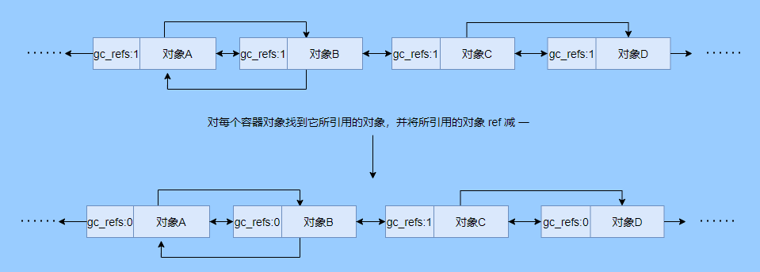

为了让图片更加清晰，我把步骤分开截图了，上图是 1-2 步骤，下图是 3-4 步骤。

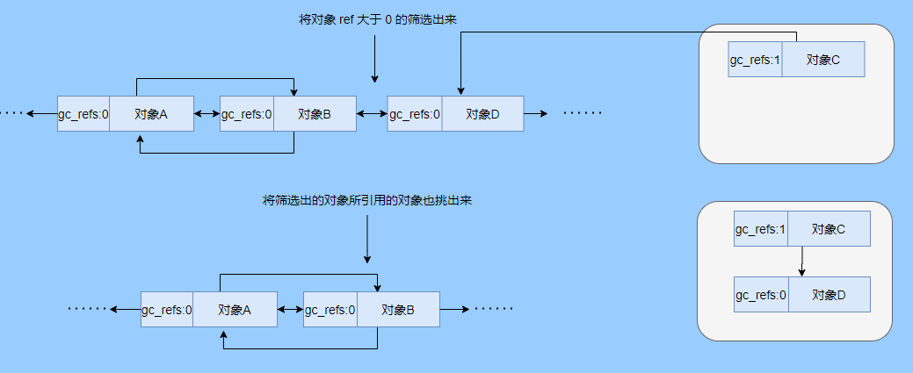

最终循环引用的 A 和 B 都能被清理，但是天下没有免费的午餐，最大的开销之一是每个容器对象需要额外字段。

还有维护容器链表的开销。根据 pybench，这个开销占了大约 4% 的减速。

至此我们知晓了引用计数的优点就是实现简单，并且内存清理及时，缺点就是无法处理循环引用，不过可以结合标记-清除等方案来兜底，保证垃圾回收的完整性。

所以 Python 没有解决引用计数的循环引用问题，只是结合了非传统的标记-清除方案来兜底，算是曲线救国。

其实极端情况下引用计数也不会那么及时，你想假如现在有一个对象引用了另一个对象，而另一个对象又引用了另一个，依次引用下去。

那么当第一个对象要被回收的时候，就会引发连锁回收反应，对象很多的话这个延时就凸显出来了。

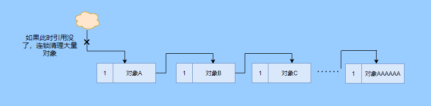

### 可达性分析

可达性分析其实就是利用标记-清除(mark-sweep)，就是标记可达对象，清除不可达对象。至于用什么方式清，清了之后要不要整理这都是后话。

标记-清除具体的做法是定期或者内存不足时进行垃圾回收，从根引用(GC Roots)开始遍历扫描，将所有扫描到的对象标记为可达，然后将所有不可达的对象回收了。

所谓的根引用包括全局变量、栈上引用、寄存器上的等。

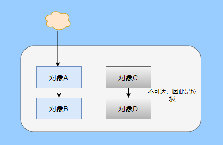

看到这里大家不知道是否有点感觉，我们会在内存不足的时候进行 GC，而内存不足时也是对象最多时，对象最多因此需要扫描标记的时间也长。

所以标记-清除等于把垃圾积累起来，然后再一次性清除，这样就会在垃圾回收时消耗大量资源，影响应用的正常运行。

所以才会有分代式垃圾回收和仅先标记根节点直达的对象再并发 tracing 的手段。

但这也只能减轻无法根除。

我认为这是标记-清除和引用计数的思想上最大的差别，一个攒着处理，一个把这种消耗平摊在应用的日常运行中。

而不论标记-清楚还是引用计数，其实都只关心引用类型，像一些整型啥的就不需要管。

所以 JVM 还需要判断栈上的数据是什么类型，这里又可以分为保守式 GC、半保守式 GC、和准确式 GC。

#### 保守式 GC

保守式 GC 指的是 JVM 不会记录数据的类型，也就是无法区分内存上的某个位置的数据到底是引用类型还是非引用类型。

因此只能靠一些条件来猜测是否有指针指向。比如在栈上扫描的时候根据所在地址是否在 GC 堆的上下界之内，是否字节对齐等手段来判断这个是不是指向 GC堆中的指针。

之所以称之为保守式 GC 是因为不符合猜测条件的肯定不是指向 GC 堆中的指针，因此那块内存没有被引用，而符合的却不一定是指针，所以是保守的猜测。

我再画一张图来解释一下，看了图之后应该就很清晰了。

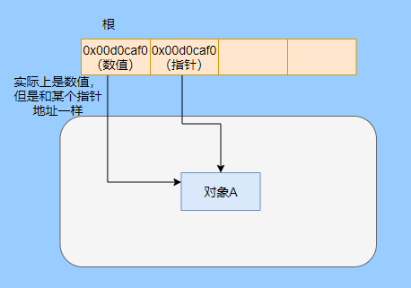

前面我们知道可以根据指针指向地址来判断，比如是否字节对齐，是否在堆的范围之内，但是就有可能出现恰好有数值的值就是地址的值。

这就混乱了，所以就不能确定这是指针，只能保守认为就是指针。

因此肯定不会有误杀对象的情况。只会有对象已经死了，但是有疑似指针的存在指向它，误以为它还活着而放过了它的情况发生。

所以保守式 GC 会有放过一些“垃圾”，对内存不太友好。

并且因为疑似指针的情况，导致我们无法确认它是否是真的指针，所以也就无法移动对象，因为移动对象就需要改指针。

有一个方法就是加个中间层，也就是句柄层，引用会先指到句柄，然后再从句柄表找到实际对象。

所以直接引用不需要改变，如果要移动对象只需要修改句柄表即可。不过这样访问就多了一层，效率就变低了。

#### 半保守式GC

半保守式GC，在对象上会记录类型信息而其他地方还是没有记录，因此从根扫描的话还是一样，得靠猜测。

但是得到堆内对象了之后，就能准确知晓对象所包含的信息了，因此之后 tracing 都是准确的，所以称为半保守式 GC。

现在可以得知半保守式 GC 只有根直接扫描的对象无法移动，从直接对象再追溯出去的对象可以移动，所以半保守式 GC 可以使用移动部分对象的算法，也可以使用标记-清除这种不移动对象的算法。

而保守式 GC 只能使用标记-清除算法。

#### 准确式 GC

相信大家看下来已经知道准确意味 JVM 需要清晰的知晓对象的类型，包括在栈上的引用也能得知类型等。

能想到的可以在指针上打标记，来表明类型，或者在外部记录类型信息形成一张映射表。

HotSpot 用的就是映射表，这个表叫 OopMap。

在 HotSpot 中，对象的类型信息里会记录自己的OopMap，记录了在该类型的对象内什么偏移量上是什么类型的数据，而在解释器中执行的方法可以通过解释器里的功能自动生成出 OopMap 出来给 GC 用。

被 JIT 编译过的方法，也会在特定的位置生成 OopMap，记录了执行到该方法的某条指令时栈上和寄存器里哪些位置是引用。

这些特定的位置主要在：

  1. 循环的末尾（非 counted 循环）

  2. 方法临返回前 / 调用方法的call指令后

  3. 可能抛异常的位置

这些位置就叫作安全点(safepoint)。

那为什么要选择这些位置插入呢？因为如果对每条指令都记录一个 OopMap 的话空间开销就过大了，因此就选择这些个关键位置来记录即可。

所以在 HotSpot 中 GC 不是在任何位置都能进入的，只能在安全点进入。

至此我们知晓了可以在类加载时计算得到对象类型中的 OopMap，解释器生成的 OopMap 和 JIT 生成的 OopMap ，所以 GC 的时候已经有充足的条件来准确判断对象类型。

因此称为准确式 GC。

其实还有个 JNI 调用，它们既不在解释器执行，也不会经过 JIT 编译生成，所以会缺少 OopMap。

在 HotSpot 是通过句柄包装来解决准确性问题的，像 JNI 的入参和返回值引用都通过句柄包装起来，也就是通过句柄再访问真正的对象。

这样在 GC 的时候就不用扫描 JNI 的栈帧，直接扫描句柄表就知道 JNI 引用了 GC 堆中哪些对象了。

### 安全点

我们已经提到了安全点，安全点当然不是只给记录 OopMap 用的，因为 GC 需要一个一致性快照，所以应用线程需要暂停，而暂停点的选择就是安全点。

我们来捋一遍思路。首先给个 GC 名词，在垃圾收集场景下将应用程序称为 mutator 。

一个能被 mutator 访问的对象就是活着的，也就是说 mutator 的上下文包含了可以访问存活对象的数据。

这个上下文其实指的就是栈、寄存器等上面的数据，对于 GC 而言它只关心栈上、寄存器等哪个位置是引用，因为它只需要关注引用。

但是上下文在 mutator 运行过程中是一直在变化的，所以 GC 需要获取一个一致性上下文快照来枚举所有的根对象。

而快照的获取需要停止 mutator 所有线程，不然就得不到一致的数据，导致一些活着对象丢失，这里说的一致性其实就像事务的一致性。

而 mutator 所有线程中这些有机会成为暂停位置的点就叫 safepoint 即安全点。

openjdk 官网对安全点的定义是：

> A point during program execution at which all GC roots are known and all heap object contents are consistent. From a global point of view, all threads must block at a safepoint before the GC can run.

不过 safepoint 不仅仅只有 GC 有用，比如 deoptimization、Class redefinition 都有，只是 GC safepoint 比较知名。

我们再来想一下可以在哪些位置放置这个安全点。

对于解释器来说其实每个字节码边界都可以成为一个安全点，对于 JIT 编译的代码也能在很多位置插入安全点，但是实现上只会在一些特定的位置插入安全点。

因为安全点是需要 check 的，而 check 需要开销，如果安全点过多那么开销就大了，等于每执行几步就需要检查一下是否需要进入安全点。

其次也就是我们上面提到的会记录 OopMap ，所以有额外的空间开销。

那 mutator 是如何得知此时需要在安全点暂停呢？

其实上面已经提到了是 check，再具体一些还分解释执行和编译执行时不同的 check。

在解释执行的时候的 check 就是在安全点 polling 一个标志位，如果此时要进入 GC 就会设置这个标志位。

而编译执行是 polling page 不可读，在需要进入 safepoint 时就把这个内存页设为不可访问，然后编译代码访问就会发生异常，然后捕获这个异常挂起即暂停。

这里可能会有同学问，那此时阻塞住的线程咋办？它到不了安全点啊，总不能等着它吧？

这里就要引入安全区域的概念，在这种引用关系不会发生变化的代码段中的区域称为安全区域。

在这个区域内的任意地方开始 GC 都是安全的，这些执行到安全区域的线程也会标识自己进入了安全区域，

所以会 GC 就不用等着了，并且这些线程如果要出安全区域的时候也会查看此时是否在 GC ，如果在就阻塞等着，如果 GC 结束了那就继续执行。

可能有些同学对counted 循环有点疑问，像`for (int i...)` 这种就是 counted 循环，这里不会埋安全点。

所以说假设你有一个 counted loop 然后里面做了一些很慢的操作，所以很有可能其他线程都进入安全点阻塞就等这个 loop 的线程完毕，这就卡顿了。

### 分代收集

前面我们提到标记-清除方式的 GC 其实就是攒着垃圾收，这样集中式回收会给应用的正常运行带来影响，所以就采取了分代收集的思想。

因为研究发现有些对象基本上不会消亡，存在的时间很长，而有些对象出来没多久就会被咔嚓了。这其实就是弱分代假说和强分代假说。

所以将堆分为新生代和老年代，这样对不同的区域可以根据不同的回收策略来处理，提升回收效率。

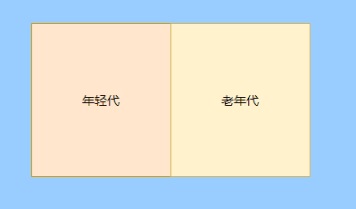

比如新生代的对象有朝生夕死的特性，因此垃圾收集的回报率很高，需要追溯标记的存活对象也很少，因此收集的也快，可以将垃圾收集安排地频繁一些。

新生代每次垃圾收集存活的对象很少的话，如果用标记-清除算法每次需要清除的对象很多，因此可以采用标记-复制算法，每次将存活的对象复制到一个区域，剩下了直接全部清除即可。

但是朴素的标记-复制算法是将堆对半分，但是这样内存利用率太低了，只有 50%。

所以 HotSpot 虚拟机分了一个 Eden 区和两个Survivor，默认大小比例是8∶1：1，这样利用率有 90%。

每次回收就将存活的对象拷贝至一个 Survivor 区，然后清空其他区域即可，如果 Survivor 区放不下就放到 老年代去，这就是分配担保机制。

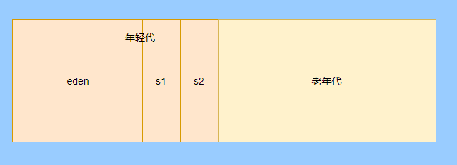

而老年代的对象基本上都不是垃圾，所以追溯标记的时间比较长，收集的回报率也比较低，所以收集频率安排的低一些。

这个区域由于每次清除的对象很少，因此可以用标记-清除算法，但是单单清除不移动对象的话会有很多内存碎片的产生，所以还有一种叫标记-整理的算法，等于每次清除了之后需要将内存规整规整，需要移动对象，比较耗时。

所以可以利用标记-清除和标记-整理两者结合起来收集老年代，比如平日都用标记-清除，当察觉内存碎片实在太多了就用标记-整理来配合使用。

可能还有很多同学对的标记-清除，标记-整理，标记-复制算法不太清晰，没事，咱们来盘一下。

### 标记-清除

分为两个阶段：

标记阶段：tracing 阶段，从根（栈、寄存器、全局变量等）开始遍历对象图，标记所遇到的每个对象。

清除阶段：扫描堆中的对象，将为标记的对象作为垃圾回收。

基本上就是下图所示这个过程：

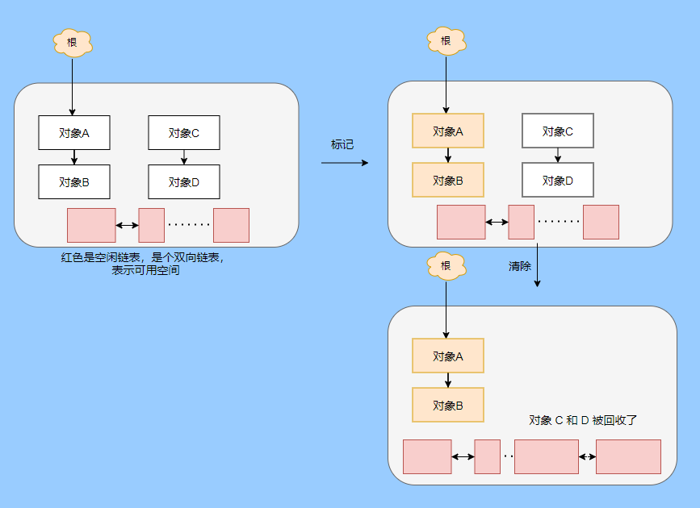

清除不会移动和整理内存空间，一般都是通过空闲链表(双向链表)来标记哪一块内存空闲可用，因此会导致一个情况：空间碎片。

这会使得明明总的内存是够的，但是申请内存就是不足。

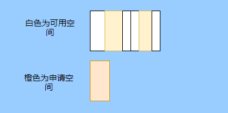

而且在申请内存的时候也有点麻烦，需要遍历链表查找合适的内存块，会比较耗时。

所以会有多个空闲链表的实现，也就是根据内存分块大小组成不同的链表，比如分为大分块链表和小分块链表，这样根据申请的内存分块大小遍历不同的链表，加快申请的效率。

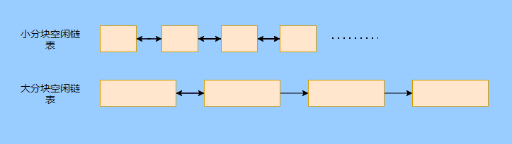

当然还可以分更多个链表。

还有标记，标记的话一般我们会觉得应该是标记在对象身上，比如标记位放在对象头中，但是这对写时复制不兼容。

等于每一次 GC 都需要修改对象，假设是 fork 出来的，其实是共享一块内存，那修改必然导致复制。

所以有一种位图标记法，其实就是将堆的内存某个块用一个位来标记。就像我们的内存是一页一页的，堆中的内存可以分成一块一块，而对象就是在一块，或者多块内存上。

根据对象所在的地址和堆的起始地址就可以算出对象是在第几块上，然后用一个位图中的第几位在置为 1 ，表明这块地址上的对象被标记了。

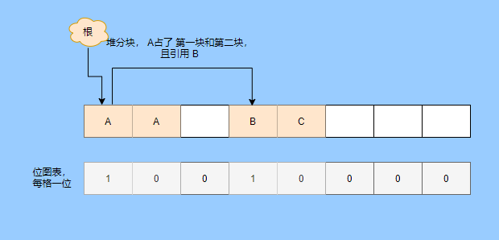

而且用位图表格法不仅可以利用写时复制，清除也更加高效，如果标记在对象头上，那么需要遍历整个堆来扫描对象，现在有了位图，可以快速遍历清除对象。

但是不论是标记对象头还是利用位图，标记-清除的碎片问题还是处理不了。

因此就引出了标记-复制和标记-整理。

### 标记-复制

首先这个算法会把堆分为两块，一块是 From、一块是 To。

对象只会在 From 上生成，发生 GC 之后会找到所有存活对象，然后将其复制到 To 区，之后整体回收 From 区。

再将 To 区和 From 区身份对调，即 To 变成 From ， From 变成 To，我再用图来解释一波。

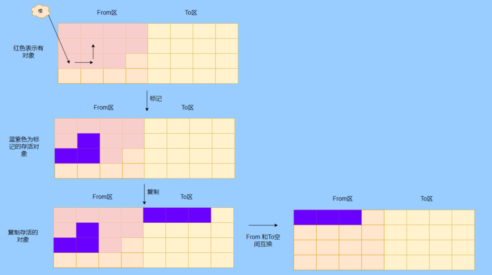

可以看到内存的分配是紧凑的，不会有内存碎片的产生。

不需要空闲链表的存在，直接移动指针分配内存，效率很高。

对 CPU缓存亲和性高，因为从根开始遍历一个节点，是深度优先遍历，把关联的对象都找到，然后内存分配在相近的地方。

这样根据局部性原理，一个对象被加载了那它所引用的对象也同时被加载，因此访问缓存直接命中。、

当然它也是有缺点的，因为对象的分配只能在 From 区，而 From 区只有堆一半大小，因此内存的利用率是 50%。

其次如果存活的对象很多，那么复制的压力还是很大的，会比较慢。

然后由于需要移动对象，因此不适用于上文提到的保守式 GC。

当然我上面描述的是深度优先就是递归调用，有栈溢出风险，还有一种 Cheney 的 GC 复制算法，是采用迭代的广度优先遍历，具体不做分析了，有兴趣自行搜索。

### 标记-整理

标记-整理其实和标记-复制差不多，区别在于复制算法是分为两个区来回复制，而整理不分区，直接整理。

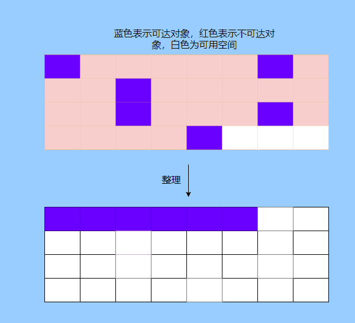

算法思路还是很清晰的，将存活的对象往边界整理，也没有内存碎片，也不需要复制算法那样腾出一半的空间，所以内存利用率也高。

缺点就是需要对堆进行多次搜索，毕竟是在一个空间内又标记，又移动的，所以整体而言花费的时间较多，而且如果堆很大的情况，那么消耗的时间将更加突出。

至此相信你对标记-清除、标记-复制和标记-整理都清晰了，让我们再回到刚才提到的分代收集。

### 跨代引用

我们已经根据对象存活的特性进行了分代，提高了垃圾收集的效率，但是像在回收新生代的时候，有可能有老年代的对象引用了新生代对象，所以老年代也需要作为根，但是如果扫描整个老年代的话效率就又降低了。

所以就搞了个叫记忆集（Remembered Set）的东西，来记录跨代之间的引用而避免扫描整体非收集区域。

因此记忆集就是一种用于记录从非收集区域指向收集区域的指针集合的抽象数据结构。根据记录的精度分为

  * 字长精度，每条记录精确到机器字长。

  * 对象精度，每条记录精确到对象。

  * 卡精度，每条记录精确到一块内存区域。

最常见的是用卡精度来实现记忆集，称之为卡表。

我来解释下什么叫卡。

拿对象精度来距离，假设新生代对象 A 被老年代对象 D 引用了，那么就需要记录老年代 D 所在的地址引用了新生代对象。

那卡的意思就是将内存空间分成很多卡片。假设新生代对象 A 被老年代 D 引用了，那么就需要记录老年代 D 所在的那一块内存片有引用新生代对象。

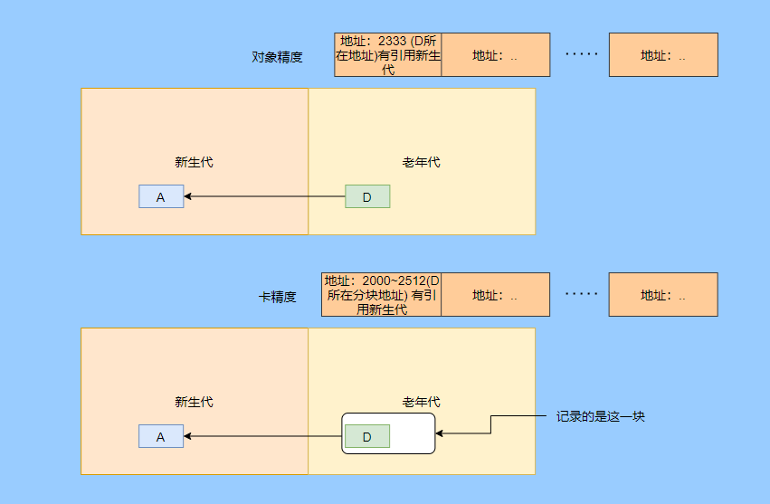

也就是说堆被卡切割了，假设卡的大小是 2，堆是 20，那么堆一共可以划分成 10 个卡。

因为卡的范围大，如果此时 D 旁边在同一个卡内的对象也有引用新生代对象的话，那么就只需要一条记录。

一般会用字节数组来实现卡表，卡的范围也是设为 2 的 N 次幂大小。来看一下图就很清晰了。

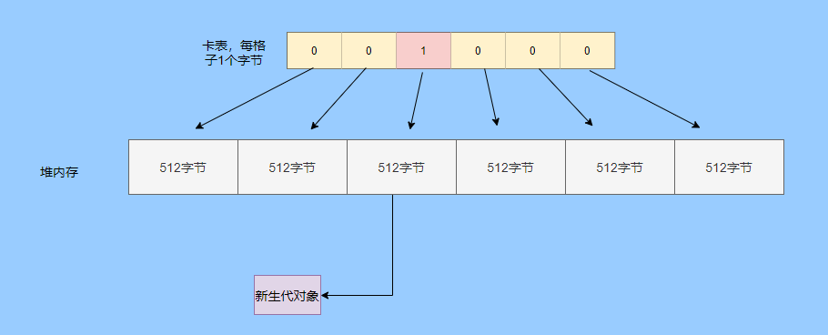

假设地址从 0x0000 开始，那么字节数组的 0号元素代表 0x0000～0x01FF，1 号代表0x0200～0x03FF，依次类推即可。

然后到时候回收新生代的时候，只需要扫描卡表，把标识为 1 的脏表所在内存块加入到 GC Roots 中扫描，这样就不需要扫描整个老年代了。

用了卡表的话占用内存比较少，但是相对字长、对象来说精度不准，需要扫描一片。所以也是一种取舍，到底要多大的卡。

还有一种多卡表，简单的说就是有多张卡表，这里我画两张卡表示意一下。

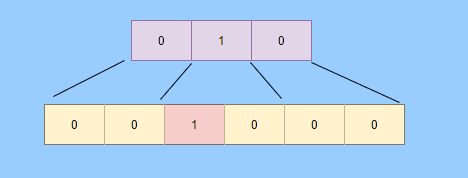

上面的卡表表示的地址范围更大，这样可以先扫描范围大的表，发现中间一块脏了，然后再通过下标计算直接得到更具体的地址范围。

这种多卡表在堆内存比较大，且跨代引用较少的时候，扫描效率较高。

而卡表一般都是通过写屏障来维护的，写屏障其实就相当于一个 AOP，在对象引用字段赋值的时候加入更新卡表的代码。

这其实很好理解，说白了就是当引用字段赋值的时候判断下当前对象是老年代对象，所引用对象是新生代对象，于是就在老年代对象所对应的卡表位置置为1，表示脏，待会需要加入根扫描。

不过这种将老年代作为根来扫描会有浮动垃圾的情况，因为老年代的对象可能已经成为垃圾，所以拿垃圾来作为根扫描出来的新生代对象也很有可能是垃圾。

不过这是分代收集必须做出的牺牲。

### 增量式 GC

所谓的增量式 GC 其实就是在应用线程执行中，穿插着一点一点的完成 GC，来看个图就很清晰了

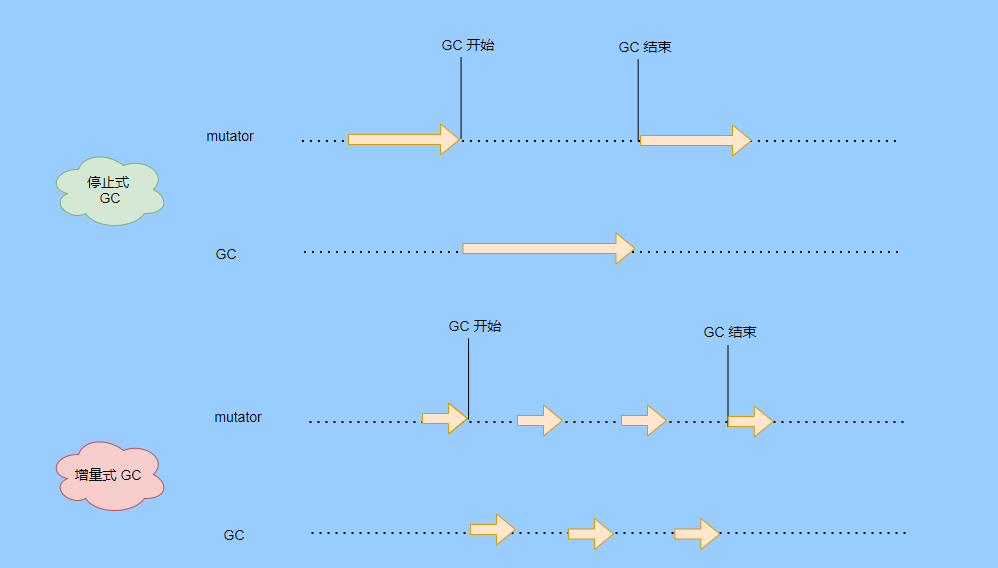

这样看起来 GC 的时间跨度变大了，但是 mutator 暂停的时间变短了。

对于增量式 GC ，Dijkstra 等人抽象除了三色标记算法，来表示 GC 中对象三种不同状况。

#### 三色标记算法

白色：表示还未搜索到的对象。灰色：表示正在搜索还未搜索完的对象。黑色：表示搜索完成的对象。

下面这图从维基百科搞得，虽说颜色没对上，但是意思是对的（black 画成了蓝色，grey画成了黄色）。

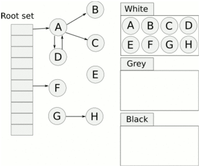

我再用文字概述一下三色的转换。

GC 开始前所有对象都是白色，GC 一开始所有根能够直达的对象被压到栈中，待搜索，此时颜色是灰色。

然后灰色对象依次从栈中取出搜索子对象，子对象也会被涂为灰色，入栈。当其所有的子对象都涂为灰色之后该对象被涂为黑色。

当 GC 结束之后灰色对象将全部没了，剩下黑色的为存活对象，白色的为垃圾。

一般增量式标记-清除会分为三个阶段：

  1. 根查找，需要暂停应用线程，找到根直接引用的对象。

  2. 标记阶段，和应用线程并发执行。

  3. 清除阶段。

这里解释下 GC 中两个名词的含义。

并发：应用线程和 GC 线程一起执行。并行：多个 GC 线程一起执行。

看起来好像三色标记没啥问题？来看看下图。

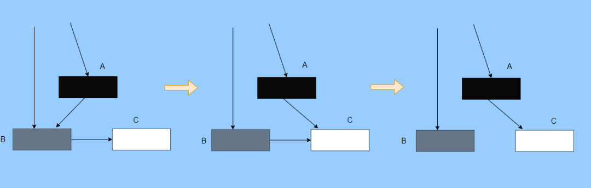

第一个阶段搜索到 A 的子对象 B了，因此 A 被染成了黑色，B 为灰色。此时需要搜索 B。

但是在 B 开始搜索时，A 的引用被 mutator 换给了 C，然后此时 B 到 C 的引用也被删了。

接着开始搜索 B ，此时 B 没有引用因此搜索结束，这时候 C 就被当垃圾了，因此 A 已经黑色了，所以不会再搜索到 C 了。

这就是出现漏标的情况，把还在使用的对象当成垃圾清除了，非常严重，这是 GC 不允许的，宁愿放过，不能杀错。

还有一种情况多标，比如 A 变成黑色之后，根引用被 mutator 删除了，那其实 A 就属于垃圾，但是已经被标记为黑色了，那就得等下次 GC 清除了。

这其实就是标记过程中没有暂停 mutator 而导致的，但这也是为了让 GC 减少对应用程序运行的影响。

多标其实还能接受，漏标的话就必须处理了，我们可以总结一下为什么会发生漏标：

  1. mutator 插入黑色对象 A 到白色对象 C 的一个引用

  2. mutator 删除了灰色对象 B 到白色对象 C 的一个引用

只要打破这两个条件任意一个就不会发生漏标的情况。

这时候可以通过以下手段来打破两个条件：

利用写屏障在黑色引用白色对象时候，将白色对象置为灰色，这叫增量更新。

利用写屏障在灰色对象删除对白色对象的引用时，将白色对象置为灰，其实就是保存旧的引用关系。这叫STAB（snapshot-at-the-beginning）。

### 总结

至此有关垃圾回收的关键点和思路都差不多了，具体有关 JVM 的垃圾回收器等我下篇再作分析。

现在我们再来总结一下。

关于垃圾回收首先得找出垃圾，而找出垃圾分为两个流派，一个是引用计数，一个是可达性分析。

引用计数垃圾回收的及时，对内存较友好，但是循环引用无法处理。

可达性分析基本上是现代垃圾回收的核心选择，但是由于需要统一回收比较耗时，容易影响应用的正常运行。

所以可达性分析的研究方向就是往如何减少对应用程序运行的影响即减少 STW(stop the world) 的时间。

因此根据对象分代假说研究出了分代收集，根据对象的特性划分了新生代和老年代，采取不同的收集算法，提升回收的效率。

想方设法的拆解 GC 的步骤使得可以与应用线程并发，并且采取并行收集，加快收集速度。

还有往评估的方向的延迟回收或者说回收部分垃圾来减少 STW 的时间。

总的而言垃圾回收还是很复杂的，因为有很多细节，我这篇就是浅显的纸上谈兵，不要被我的标题骗了哈哈哈哈。

### 最后

这篇文章写了挺久的，主要是内容很多如何编排有点难，我也选择性的剪了很多了，但还是近 1W 字。

期间也查阅了很多资料，不过个人能力有限，如果有纰漏的地方请抓紧联系我。

巨人的肩膀

http://arctrix.com/nas/python/gc/

https://openjdk.java.net/groups/hotspot/docs/HotSpotGlossary.html

《The Garbage Collection Handbook 》

https://www.iteye.com/blog/user/rednaxelafx R大的博客

https://www.jianshu.com/u/90ab66c248e6 占小狼的博客
