 
<!--BEGIN_DATA
{
    "create_date": "2021-02-03 20:30", 
    "modify_date": "2021-02-03 20:30", 
    "is_top": "0", 
    "summary": "源码篇：Handler那些事", 
    "tags": "Android", 
    "file_name": "源码篇：Handler那些事"
}
END_DATA-->

#### <p>原文出处：<a href='https://juejin.cn/post/6950146347731255327' target='blank'>源码篇：Handler那些事</a></p>

## 前言

Handler属于八股文中非常经典的一个考题了，导致这个知识点很多时候，考官都懒得问了；这玩意很久之前就看过，但是过了一段时间，就很容易忘记，但是处理内存泄漏，IdleHandler之类的考点答案肯定很难忘。。。虽然考官很多时候不屑问，但是要是问到了，你忘了且不知道怎么回答，那就很尴尬了

鄙人也来炒个剩饭，力求通俗易懂的来描述下Handler机制的整个流程；相关知识点，画了一些流程图，时序图来展示其运行机制，力争让本文图文并茂！

文章中关键方法源码，可以直接点击方法名，跳转查看对应方法的源码

如果看了没收获，喷我！

## 总流程

> 开头需要建立个handler作用的总体印象，下面画了一个总体的流程图

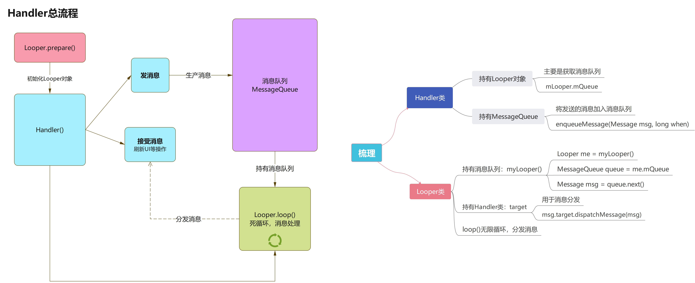

从上面的流程图可以看出，总体上是分几个大块的

  * Looper.prepare()、Handler()、Looper.loop() 总流程
  * 收发消息
  * 分发消息

**相关知识点大概涉及到这些，下面详细讲解下！**

  * 需要详细的查看该思维导图，请右键下载后查看


## 使用

> 先来看下使用，不然源码，原理图搞了一大堆，一时想不起怎么用的，就尴尬了
>
> 使用很简单，此处仅做个展示，大家可以熟悉下
>
> 演示代码尽量简单是为了演示，关于静态内部类持有弱引用或者销毁回调中清空消息队列之类，就不在此处展示了

  * 来看下消息处理的分发方法：[dispatchMessage(msg)](https://cs.android.com/android/platform/superproject/+/master:frameworks/base/core/java/android/os/Handler.java;drc=master;l=97)
    
```java
Handler.java
...
public void dispatchMessage(@NonNull Message msg) {
    if (msg.callback != null) {
        handleCallback(msg);
    } else {
        if (mCallback != null) {
            if (mCallback.handleMessage(msg)) {
                return;
            }
        }
        handleMessage(msg);
    }
}
...
```

从上面源码可知，handler的使用总的来说，分俩大类，细分三小类

  * 收发消息一体 
    * handleCallback(msg)
  * 收发消息分开 
    * mCallback.handleMessage(msg)
    * handleMessage(msg)

### 收发一体

  * handleCallback(msg)
  * 使用post形式，收发都是一体，都在post()方法中完成，此处不需要创建Message实例等，post方法已经完成这些操作
    
```java
public class MainActivity extends AppCompatActivity {
    private TextView msgTv;
    private Handler mHandler = new Handler();

    @Override
    protected void onCreate(Bundle savedInstanceState) {
        super.onCreate(savedInstanceState);
        setContentView(R.layout.activity_main);
        msgTv = findViewById(R.id.tv_msg);
        //消息收发一体
        new Thread(new Runnable() {
            @Override public void run() {
                String info = "第一种方式";
                mHandler.post(new Runnable() {
                    @Override public void run() {
                        msgTv.setText(info);
                    }
                });
            }
        }).start();
    }
}
```

### 收发分开

#### mCallback.handleMessage(msg)

  * 实现Callback接口
    
```java
public class MainActivity extends AppCompatActivity {
    private TextView msgTv;
    private Handler mHandler = new Handler(new Handler.Callback() {
        //接收消息,刷新UI
        @Override public boolean handleMessage(@NonNull Message msg) {
            if (msg.what == 1) {
                msgTv.setText(msg.obj.toString());
            }
            //false 重写Handler类的handleMessage会被调用,  true 不会被调用
            return false;
        }
    });

    @Override
    protected void onCreate(Bundle savedInstanceState) {
        super.onCreate(savedInstanceState);
        setContentView(R.layout.activity_main);
        msgTv = findViewById(R.id.tv_msg);
        //发送消息
        new Thread(new Runnable() {
            @Override public void run() {
                Message message = Message.obtain();
                message.what = 1;
                message.obj = "第二种方式 --- 1"; 
                mHandler.sendMessage(message);
            }
        }).start();
    }
}
```

#### handleMessage(msg)

  * 重写Handler类的handlerMessage(msg)方法
    
```java
public class MainActivity extends AppCompatActivity {
    private TextView msgTv;
    private Handler mHandler = new Handler() {
        //接收消息,刷新UI
        @Override public void handleMessage(@NonNull Message msg) {
            super.handleMessage(msg);
            if (msg.what == 1) {
                msgTv.setText(msg.obj.toString());
            }
        }
    };

    @Override
    protected void onCreate(Bundle savedInstanceState) {
        super.onCreate(savedInstanceState);
        setContentView(R.layout.activity_main);
        msgTv = findViewById(R.id.tv_msg);
        //发送消息
        new Thread(new Runnable() {
            @Override public void run() {
                Message message = Message.obtain();
                message.what = 1;
                message.obj = "第二种方式 --- 2";
                mHandler.sendMessage(message);
            }
        }).start();
    }
}
```

## prepare和loop

大家肯定有印象，在子线程和子线程的通信中，就必须在子线程中初始化Handler，必须这样写

  * prepare在前，loop在后，固化印象了
    
```java
new Thread(new Runnable() {
    @Override public void run() {
        Looper.prepare();
        Handler handler = new Handler();
        Looper.loop();
    }
});
```

  * 为啥主线程不需要这样写，聪明你肯定想到了，在入口出肯定做了这样的事
    
```java
ActivityThread.java
...
public static void main(String[] args) {
    ...
    //主线程Looper
    Looper.prepareMainLooper();
    ActivityThread thread = new ActivityThread();
    thread.attach(false);
    if (sMainThreadHandler == null) {
        sMainThreadHandler = thread.getHandler();
    }
    //主线程的loop开始循环
    Looper.loop();
    ...
}
...
```

> 为什么要使用prepare和loop？我画了个图，先让大家有个整体印象

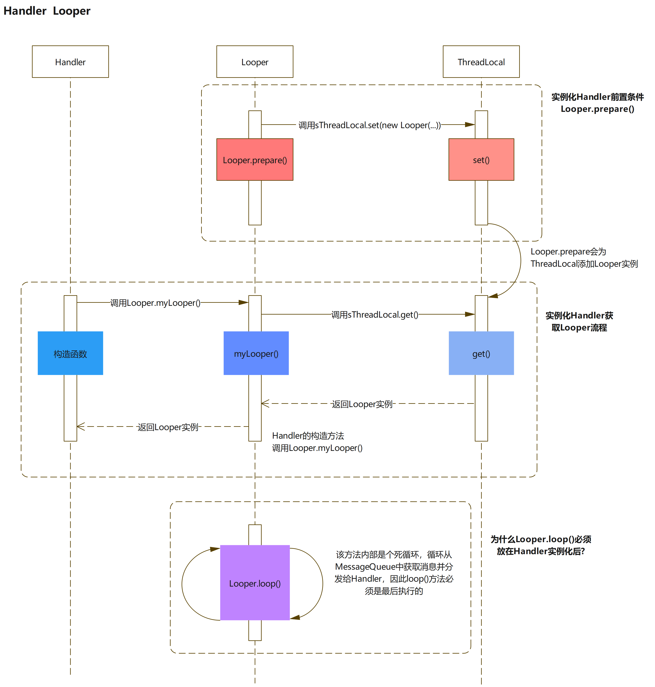

  * 上图的流程，鄙人感觉整体画的还是比较清楚的
  * 总结下就是 
    * Looper.prepare()：生成Looper对象，set在ThreadLocal里
    * handler构造函数：通过Looper.myLooper()获取到ThreadLocal的Looper对象
    * Looper.loop()：内部有个死循环，开始事件分发了；这也是最复杂，干活最多的方法

> 具体看下每个步骤的源码，这里也会标定好链接，方便大家随时过去查看

  * [Looper.prepare()](https://cs.android.com/android/platform/superproject/+/master:frameworks/base/core/java/android/os/Looper.java;l=107)
    * 可以看见，一个线程内，只能使用一次prepare()，不然会报异常的
    
```java 
Looper.java
...
    public static void prepare() {
    prepare(true);
}
private static void prepare(boolean quitAllowed) {
    if (sThreadLocal.get() != null) {
        throw new RuntimeException("Only one Looper may be created per thread");
    }
    sThreadLocal.set(new Looper(quitAllowed));
}
...
```

  * [Handler()](https://cs.android.com/android/platform/superproject/+/master:frameworks/base/core/java/android/os/Handler.java;l=214)
    * 这里通过Looper.myLooper() ---> sThreadLocal.get()拿到了Looper实例
    
```java
Handler.java
...
@Deprecated
public Handler() {
    this(null, false);
}
public Handler(@Nullable Callback callback, boolean async) {
    if (FIND_POTENTIAL_LEAKS) {
        final Class<? extends Handler> klass = getClass();
        if ((klass.isAnonymousClass() || klass.isMemberClass() || klass.isLocalClass()) &&
            (klass.getModifiers() & Modifier.STATIC) == 0) {
            Log.w(TAG, "The following Handler class should be static or leaks might occur: " +
                    klass.getCanonicalName());
        }
    }

    mLooper = Looper.myLooper();
    if (mLooper == null) {
        throw new RuntimeException(
            "Can't create handler inside thread " + Thread.currentThread()
            + " that has not called Looper.prepare()");
    }
    mQueue = mLooper.mQueue;
    mCallback = callback;
    mAsynchronous = async;
}
...
```
    
```java
Looper.java
...
public static @Nullable Looper myLooper() {
    return sThreadLocal.get();
}
...
```

  * [Looper.loop()](https://cs.android.com/android/platform/superproject/+/master:frameworks/base/core/java/android/os/Looper.java;l=154)：该方法分析，在`分发消息`里讲 
    * 精简了大量源码，详细的可以点击上面方法名
    * Message msg = queue.next()：遍历消息
    * msg.target.dispatchMessage(msg)：分发消息
    * msg.recycleUnchecked()：消息回收，进入消息池
    
```java 
Looper.java
...
public static void loop() {
    final Looper me = myLooper();
    ...
    final MessageQueue queue = me.mQueue;
    ...
    for (;;) {
        Message msg = queue.next(); // might block
        if (msg == null) {
            // No message indicates that the message queue is quitting.
            return;
        }
        ...
        try {
            msg.target.dispatchMessage(msg);
            if (observer != null) {
                observer.messageDispatched(token, msg);
            }
            dispatchEnd = needEndTime ? SystemClock.uptimeMillis() : 0;
        } catch (Exception exception) {
            if (observer != null) {
                observer.dispatchingThrewException(token, msg, exception);
            }
            throw exception;
        } finally {
            ThreadLocalWorkSource.restore(origWorkSource);
            if (traceTag != 0) {
                Trace.traceEnd(traceTag);
            }
        }
        ....
        msg.recycleUnchecked();
    }
}
...
```

## 收发消息

> 收发消息的操作口都在Handler里，这是我们最直观的接触的点

下方的思维导图整体做了个概括

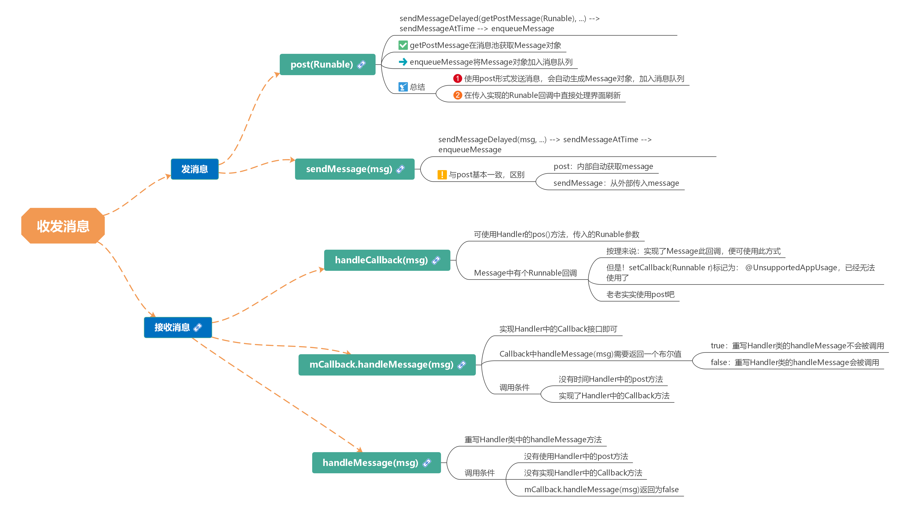

### 前置知识

> 在说发送和接受消息之前，必须要先解释下，Message中一个很重要的属性：when

when这个变量是Message中的，发送消息的时候，我们一般是不会设置这个属性的，实际上也无法设置，只有内部包才能访问写的操作；将消息加入到消息队列的时候会给发送的消息设置该属性。消息加入消息队列方法：[enqueueMessage(...)](https://cs.android.com/android/platform/superproject/+/master:frameworks/base/core/java/android/os/MessageQueue.java;drc=master;l=549)

在我们使用sendMessage发送消息的时候，实际上也会调用sendMessageDelayed延时发送消息发放，不过此时传入的延时时间会默认为0，来看下延时方法：sendMessageDelayed

    
```java
public final boolean sendMessageDelayed(@NonNull Message msg, long delayMillis) {
    if (delayMillis < 0) {
        delayMillis = 0;
    }
    return sendMessageAtTime(msg, SystemClock.uptimeMillis() + delayMillis);
}
```

这地方调用了sendMessageAtTime方法，此处！做了一个时间相加的操作：SystemClock.uptimeMillis() + delayMillis

  * SystemClock.uptimeMillis()：这个方法会返回一个毫秒数值，返回的是，打开设备到此刻所消耗的毫秒时间，这很明显是个相对时间刻！
  * delayMillis：就是我们发送的延时毫秒数值

**后面会将这个时间刻赋值给when：when = SystemClock.uptimeMillis() + delayMillis**

**说明when代表的是开机到现在的一个时间刻，通俗的理解，when可以理解为：现实时间的某个现在或未来的时刻（实际上when是个相对时刻，相对点就是开机的时间点）**

### 发送消息

发送消息涉及到俩个方法：post(...)和sendMessage(...)

  * [post(Runnable)](https://cs.android.com/android/platform/superproject/+/master:frameworks/base/core/java/android/os/Handler.java;l=426)：发送和接受消息都在post中完成
  * [sendMessage(msg)](https://cs.android.com/android/platform/superproject/+/master:frameworks/base/core/java/android/os/Handler.java;l=634)：需要自己传入Message消息对象
  * 看下源码 
    * 使用post会自动会通过getPostMessage方法创建Message对象
    * 在enqueueMessage中将生成的Message加入消息队列，注意 
      * **此方法给msg的target赋值当前handler之后，才进行将消息添加的消息队列的操作**
      * msg.setAsynchronous(true)：设置Message属性为异步，默认都为同步；设置为异步的条件，需要手动在Handler构造方法里面设置
    
```java
Handler.java
...
//post
public final boolean post(@NonNull Runnable r) {
    return  sendMessageDelayed(getPostMessage(r), 0);
}

//生成Message对象
private static Message getPostMessage(Runnable r) {
    Message m = Message.obtain();
    m.callback = r;
    return m;
}

//sendMessage方法
public final boolean sendMessage(@NonNull Message msg) {
    return sendMessageDelayed(msg, 0);
}

public final boolean sendMessageDelayed(@NonNull Message msg, long delayMillis) {
    if (delayMillis < 0) {
        delayMillis = 0;
    }
    return sendMessageAtTime(msg, SystemClock.uptimeMillis() + delayMillis);
}

public boolean sendMessageAtTime(@NonNull Message msg, long uptimeMillis) {
    MessageQueue queue = mQueue;
    if (queue == null) {
        RuntimeException e = new RuntimeException(
            this + " sendMessageAtTime() called with no mQueue");
        Log.w("Looper", e.getMessage(), e);
        return false;
    }
    return enqueueMessage(queue, msg, uptimeMillis);
}

///将Message加入详细队列 
private boolean enqueueMessage(@NonNull MessageQueue queue, @NonNull Message msg,
                                long uptimeMillis) {
    //设置target
    msg.target = this;
    msg.workSourceUid = ThreadLocalWorkSource.getUid();
    if (mAsynchronous) {
        //设置为异步方法
        msg.setAsynchronous(true);
    }
    return queue.enqueueMessage(msg, uptimeMillis);
}
...
```

  * [enqueueMessage(...)](https://cs.android.com/android/platform/superproject/+/master:frameworks/base/core/java/android/os/MessageQueue.java;drc=master;l=549)：精简了一些代码，完整代码，可点击左侧方法名 
    * Message通过enqueueMessage加入消息队列
    * 请明确：when = SystemClock.uptimeMillis() + delayMillis，when代表的是一个时间刻度，消息进入到消息队列，是按照时间刻度排列的，**时间刻度按照从小到大排列**，也就是说**消息在消息队列中：按照从现在到未来的循序排队**
    * 这地方有几种情况，记录下：mMessage为当前消息分发到的消息位置 
      * mMessage为空，传入的msg则为消息链表头，next置空
      * mMessage不为空、消息队列中没有延时消息的情况：从当前分发位置移到链表尾，将传入的msg插到链表尾部，next置空
    * mMessage不为空、含有延时消息的情况：举个例子 
      * A，B，C消息依次发送，三者分边延时：3秒，1秒，2秒 { A(3000)、B(1000)、C(2000) }
      * 这是一种理想情况：三者依次进入，进入之间的时间差小到忽略，这是为了方便演示和说明
      * 这种按照时间远近的循序排列，可以保证未延时或者延时时间较小的消息，能够被及时执行
      * 在消息队列中的排列为：B ---> C ---> A
    
```java    
MessageQueue.java
...
boolean enqueueMessage(Message msg, long when) {
    ...
    synchronized (this) {
        ...
        msg.markInUse();
        msg.when = when;
        Message p = mMessages;
        boolean needWake;
        if (p == null || when == 0 || when < p.when) {
            // New head, wake up the event queue if blocked.
            msg.next = p;
            mMessages = msg;
            needWake = mBlocked;
        } else {
            // Inserted within the middle of the queue.  Usually we don't have to wake
            // up the event queue unless there is a barrier at the head of the queue
            // and the message is the earliest asynchronous message in the queue.
            needWake = mBlocked && p.target == null && msg.isAsynchronous();
            Message prev;
            for (;;) {
                prev = p;
                p = p.next;
                if (p == null || when < p.when) {
                    break;
                }
                if (needWake && p.isAsynchronous()) {
                    needWake = false;
                }
            }
            msg.next = p; // invariant: p == prev.next
            prev.next = msg;
        }
        // We can assume mPtr != 0 because mQuitting is false.
        if (needWake) {
            nativeWake(mPtr);
        }
    }
    return true;
}
...
```

  * 来看下发送的消息插入消息队列的图示

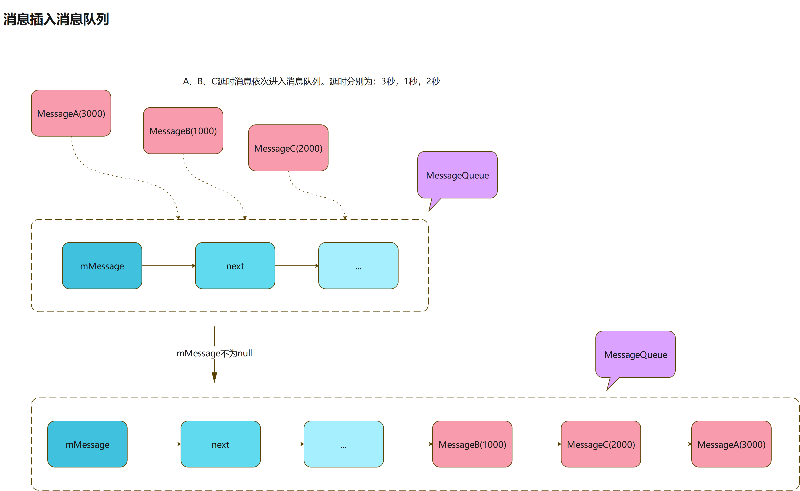

### 接收消息

接受消息相对而言就简单多

  * [dispatchMessage(msg)](https://cs.android.com/android/platform/superproject/+/master:frameworks/base/core/java/android/os/Handler.java;drc=master;l=97)：关键方法呀
    
```java 
Handler.java
...
public void dispatchMessage(@NonNull Message msg) {
    if (msg.callback != null) {
        handleCallback(msg);
    } else {
        if (mCallback != null) {
            if (mCallback.handleMessage(msg)) {
                return;
            }
        }
        handleMessage(msg);
    }
} 
...
```

  * handleCallback(msg)

    * 触发条件：Message消息中实现了handleCallback回调
    * 现在基本上只能使用post()方法了，setCallback(Runnable r) 被表明为@UnsupportedAppUsage，被hide了，没法调用，如果使用反射倒是可以调用，但是没必要。。。
  * mCallback.handleMessage(msg)

    * 触发条件 
      * 使用sendMessage方法发送消息（必须）
      * 实现Handler的Callback回调
    * 分发的消息，会在Handler中实现的回调中分发
  * handleMessage(msg)

    * 触发条件 
      * 使用sendMessage方法发送消息（必须）
      * 未实现Handler的Callback回调
      * 实现了Handler的Callback回调，返回值为false（mCallback.handleMessage(msg)）
    * 需要重写Handler类的handlerMessage方法

## 分发消息

> 消息分发是在loop()中完成的，来看看loop()这个重要的方法

  * [Looper.loop()](https://cs.android.com/android/platform/superproject/+/master:frameworks/base/core/java/android/os/Looper.java;l=154)：精简了巨量源码，详细的可以点击左侧方法名 
    * Message msg = queue.next()：遍历消息
    * msg.target.dispatchMessage(msg)：分发消息
    * msg.recycleUnchecked()：消息回收，进入消息池
    
```java 
Looper.java
...
public static void loop() {
    final Looper me = myLooper();
    ...
    final MessageQueue queue = me.mQueue;
    ...
    for (;;) {
        //遍历消息池,获取下一可用消息
        Message msg = queue.next(); // might block
        ...
        try {
            //分发消息
            msg.target.dispatchMessage(msg);
            ...
        } catch (Exception exception) {
            ...
        } finally {
            ...
        }
        ....
        //回收消息,进图消息池
        msg.recycleUnchecked();
    }
}
...
```

### 遍历消息

遍历消息的关键方法肯定是下面这个

  * Message msg = queue.next()：Message类中的next()方法；当然这必须要配合外层for（无限循环）来使用，才能遍历消息队列

来看看这个Message中的next()方法吧

  * [next()](https://cs.android.com/android/platform/superproject/+/master:frameworks/base/core/java/android/os/MessageQueue.java;drc=master;l=319)：精简了一些源码，完整的点击左侧方法名
    
```java 
MessageQueue.java
...
Message next() {
    final long ptr = mPtr;
    ...
    int pendingIdleHandlerCount = -1; // -1 only during first iteration
    int nextPollTimeoutMillis = 0;
    for (;;) {
        ...
        //阻塞，除非到了超时时间或者唤醒
        nativePollOnce(ptr, nextPollTimeoutMillis);
        synchronized (this) {
            // Try to retrieve the next message.  Return if found.
            final long now = SystemClock.uptimeMillis();
            Message prevMsg = null;
            Message msg = mMessages;
            // 这是关于同步屏障（SyncBarrier）的知识，放在同步屏障栏目讲
            if (msg != null && msg.target == null) {
                do {
                    prevMsg = msg;
                    msg = msg.next;
                } while (msg != null && !msg.isAsynchronous());
            }
            if (msg != null) {
                if (now < msg.when) {
                    //每个消息处理有耗时时间，之间存在一个时间间隔（when是将要执行的时间点）。
                    //如果当前时刻还没到执行时刻（when），计算时间差值，传入nativePollOnce定义唤醒阻塞的时间
                    nextPollTimeoutMillis = (int) Math.min(msg.when - now, Integer.MAX_VALUE);
                } else {
                    mBlocked = false;
                    //该操作是把异步消息单独从消息队列里面提出来,然后返回,返回之后,该异步消息就从消息队列里面剔除了
                    //mMessage仍处于未分发的同步消息位置
                    if (prevMsg != null) {
                        prevMsg.next = msg.next;
                    } else {
                        mMessages = msg.next;
                    }
                    msg.next = null;
                    if (DEBUG) Log.v(TAG, "Returning message: " + msg);
                    msg.markInUse();
                    //返回符合条件的Message
                    return msg;
                }
            } else {
                // No more messages.
                nextPollTimeoutMillis = -1;
            }
            //这是处理调用IdleHandler的操作,有几个条件
            //1、当前消息队列为空(mMessages == null)
            //2、已经到了可以分发下一消息的时刻（now < mMessages.when）
            if (pendingIdleHandlerCount < 0
                && (mMessages == null || now < mMessages.when)) {
                pendingIdleHandlerCount = mIdleHandlers.size();
            }
            if (pendingIdleHandlerCount <= 0) {
                // No idle handlers to run.  Loop and wait some more.
                mBlocked = true;
                continue;
            }
            if (mPendingIdleHandlers == null) {
                mPendingIdleHandlers = new IdleHandler[Math.max(pendingIdleHandlerCount, 4)];
            }
            mPendingIdleHandlers = mIdleHandlers.toArray(mPendingIdleHandlers);
        }
        for (int i = 0; i < pendingIdleHandlerCount; i++) {
            final IdleHandler idler = mPendingIdleHandlers[i];
            mPendingIdleHandlers[i] = null; // release the reference to the handler
            boolean keep = false;
            try {
                keep = idler.queueIdle();
            } catch (Throwable t) {
                Log.wtf(TAG, "IdleHandler threw exception", t);
            }
            if (!keep) {
                synchronized (this) {
                    mIdleHandlers.remove(idler);
                }
            }
        }
        // Reset the idle handler count to 0 so we do not run them again.
        pendingIdleHandlerCount = 0;
        // While calling an idle handler, a new message could have been delivered
        // so go back and look again for a pending message without waiting.
        nextPollTimeoutMillis = 0;
    }
}
```

总结下源码里面表达的意思

  1. next()内部是个死循环，你可能会疑惑，只是拿下一节点的消息，为啥要死循环？
    * 为了执行延时消息以及同步屏障等等，这个死循环是必要的
  2. nativePollOnce阻塞方法：到了超时时间(nextPollTimeoutMillis)或者通过唤醒方式(nativeWake)，会解除阻塞状态
    * nextPollTimeoutMillis大于等于零，会规定在此段时间内休眠，然后唤醒
    * 消息队列为空时，nextPollTimeoutMillis为-1，进入阻塞；重新有消息进入队列，插入头结点的时候会触发nativeWake唤醒方法
  3. 如果 msg.target == null为零，会进入同步屏障状态
    * 会将msg消息死循环到末尾节点，除非碰到异步方法
    * 如果碰到同步屏障消息，理论上会一直死循环上面操作，并不会返回消息，除非，同步屏障消息被移除消息队列
  4. 当前时刻和返回消息的when判定
    * **消息when代表的时刻：一般都是发送消息的时刻，如果是延时消息，就是 发送时刻+延时时间**
    * 当前时刻小于返回消息的when：进入阻塞，计算时间差，给nativePollOnce设置超时时间，超时时间一到，解除阻塞，重新循环取消息
    * 当前时刻大于返回消息的when：获取可用消息返回
  5. 消息返回后，会将mMessage赋值为返回消息的下一节点（只针对不涉及同步屏障的同步消息）

这里简单的画了个流程图

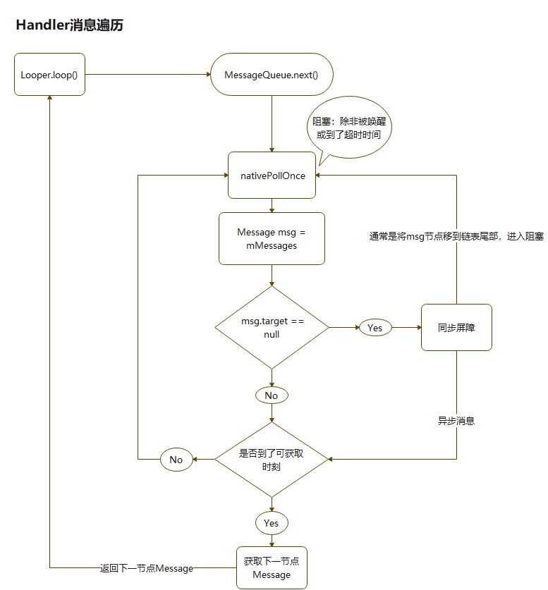

### 分发消息

分发消息主要的代码是： msg.target.dispatchMessage(msg);

也就是说这是Handler类中的dispatchMessage(msg)方法

  * [dispatchMessage(msg)](https://cs.android.com/android/platform/superproject/+/master:frameworks/base/core/java/android/os/Handler.java;drc=master;l=97)
    
```java
public void dispatchMessage(@NonNull Message msg) {
    if (msg.callback != null) {
        handleCallback(msg);
    } else {
        if (mCallback != null) {
            if (mCallback.handleMessage(msg)) {
                return;
            }
        }
        handleMessage(msg);
    }
}
```

可以看到，这里的代码，在收发消息栏目的接受消息那块已经说明过了，这里就无须重复了

### 消息池

msg.recycleUnchecked()是处理完成分发的消息，完成分发的消息并不会被回收掉，而是会进入消息池，等待被复用

  * [recycleUnchecked()](https://cs.android.com/android/platform/superproject/+/master:frameworks/base/core/java/android/os/Message.java;drc=master;l=324)：回收消息的代码还是蛮简单的，来分析下 
    * 首先会将当前已经分发处理的消息，相关属性全部重置，flags也标志可用
    * 消息池的头结点会赋值为当前回收消息的下一节点，当前消息成为消息池头结点
    * 简言之：回收消息插入消息池，当做头结点
    * 需要注意的是：消息池有最大的容量，如果消息池大于等于默认设置的最大容量，将不再接受回收消息入池 
      * 默认最大容量为50： MAX_POOL_SIZE = 50
    
```java 
Message.java
...
void recycleUnchecked() {
    // Mark the message as in use while it remains in the recycled object pool.
    // Clear out all other details.
    flags = FLAG_IN_USE;
    what = 0;
    arg1 = 0;
    arg2 = 0;
    obj = null;
    replyTo = null;
    sendingUid = UID_NONE;
    workSourceUid = UID_NONE;
    when = 0;
    target = null;
    callback = null;
    data = null;
    synchronized (sPoolSync) {
        if (sPoolSize < MAX_POOL_SIZE) {
            next = sPool;
            sPool = this;
            sPoolSize++;
        }
    }
}
```

来看下消息池回收消息图示

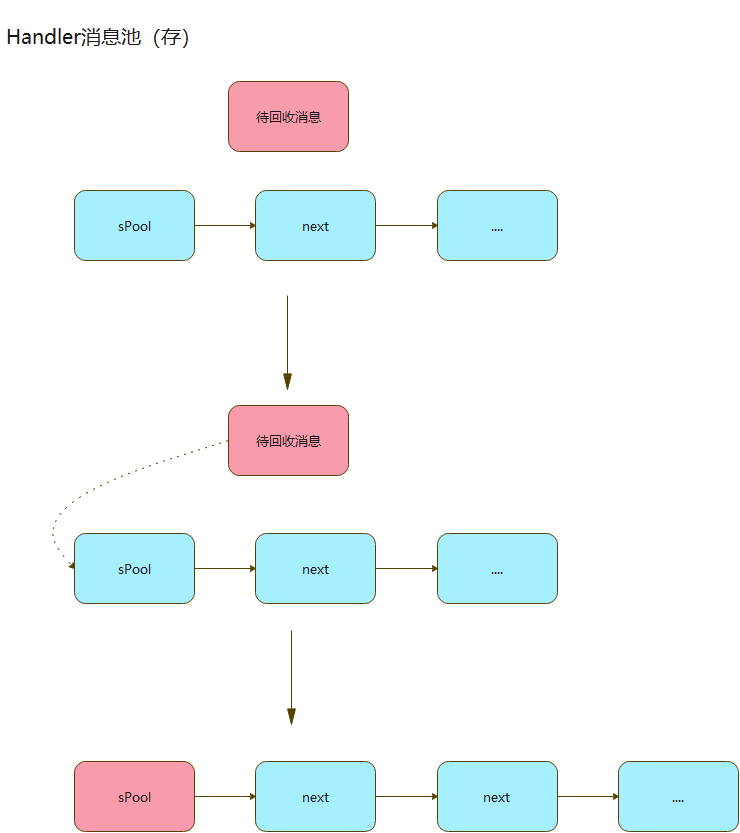

> 既然有将已使用的消息回收到消息池的操作，那肯定有获取消息池里面消息的方法了

  * [obtain()](https://cs.android.com/android/platform/superproject/+/master:frameworks/base/core/java/android/os/Message.java;l=153;drc=master)：代码很少，来看看 
    * 如果消息池不为空：直接取消息池的头结点，被取走头结点的下一节点成为消息池的头结点
    * 如果消息池为空：直接返回新的Message实例
    
```java 
Message.java
...
public static Message obtain() {
    synchronized (sPoolSync) {
        if (sPool != null) {
            Message m = sPool;
            sPool = m.next;
            m.next = null;
            m.flags = 0; // clear in-use flag
            sPoolSize--;
            return m;
        }
    }
    return new Message();
}
```

来看下从消息池取一个消息的图示

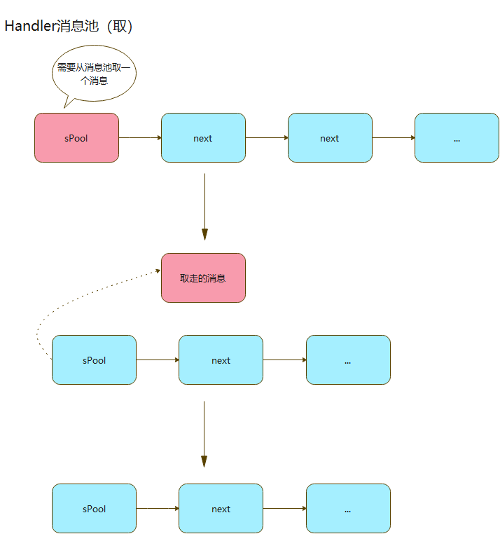

## IdleHandler

> 在MessageQueue类中的next方法里，可以发现有关于对IdleHandler的处理，大家可千万别以为它是什么Handler特殊形式之类，这玩意
就是一个interface，里面抽象了一个方法，结构非常的简单

  * [next()](https://cs.android.com/android/platform/superproject/+/master:frameworks/base/core/java/android/os/MessageQueue.java;drc=master;l=319)：精简了大量源码，只保留IdleHandler处理的相关逻辑；完整的点击左侧方法名
    
```java 
MessageQueue.java
...
Message next() {
    final long ptr = mPtr;
    ...
    int pendingIdleHandlerCount = -1; // -1 only during first iteration
    int nextPollTimeoutMillis = 0;
    for (;;) {
        ...
        //阻塞，除非到了超时时间或者唤醒
        nativePollOnce(ptr, nextPollTimeoutMillis);
        synchronized (this) {
            // Try to retrieve the next message.  Return if found.
            final long now = SystemClock.uptimeMillis();
            Message prevMsg = null;
            Message msg = mMessages;
            ...
            //这是处理调用IdleHandler的操作,有几个条件
            //1、当前消息队列为空(mMessages == null)
            //2、未到到了可以分发下一消息的时刻（now < mMessages.when）
            //3、pendingIdleHandlerCount < 0表明：只会在此for循环里执行一次处理IdleHandler操作
            if (pendingIdleHandlerCount < 0
                && (mMessages == null || now < mMessages.when)) {
                pendingIdleHandlerCount = mIdleHandlers.size();
            }
            if (pendingIdleHandlerCount <= 0) {
                mBlocked = true;
                continue;
            }
            if (mPendingIdleHandlers == null) {
                mPendingIdleHandlers = new IdleHandler[Math.max(pendingIdleHandlerCount, 4)];
            }
            mPendingIdleHandlers = mIdleHandlers.toArray(mPendingIdleHandlers);
        }
        for (int i = 0; i < pendingIdleHandlerCount; i++) {
            final IdleHandler idler = mPendingIdleHandlers[i];
            mPendingIdleHandlers[i] = null; // release the reference to the handler
            boolean keep = false;
            try {
                keep = idler.queueIdle();
            } catch (Throwable t) {
                Log.wtf(TAG, "IdleHandler threw exception", t);
            }
            if (!keep) {
                synchronized (this) {
                    mIdleHandlers.remove(idler);
                }
            }
        }
        pendingIdleHandlerCount = 0;
        nextPollTimeoutMillis = 0;
    }
}
```

> 实际上从上面的代码里面，可以分析出很多信息

**IdleHandler相关信息**

  * 调用条件
    * 当前消息队列为空(mMessages == null) 或 未到分发返回消息的时刻
    * 在每次获取可用消息的死循环中，IdleHandler只会被处理一次：处理一次后pendingIdleHandlerCount为0，其循环不可再被执行
  * 实现了IdleHandler中的queueIdle方法
    * 返回false，执行后，IdleHandler将会从IdleHandler列表中移除，只能执行一次：默认false
    * 返回true，每次分发返回消息的时候，都有机会被执行：处于`保活`状态
  * IdleHandler代码

```java    
MessageQueue.java
...
/**
    * Callback interface for discovering when a thread is going to block
    * waiting for more messages.
    */
public static interface IdleHandler {
    /**
        * Called when the message queue has run out of messages and will now
        * wait for more.  Return true to keep your idle handler active, false
        * to have it removed.  This may be called if there are still messages
        * pending in the queue, but they are all scheduled to be dispatched
        * after the current time.
        */
    boolean queueIdle();
}

public void addIdleHandler(@NonNull IdleHandler handler) {
    if (handler == null) {
        throw new NullPointerException("Can't add a null IdleHandler");
    }
    synchronized (this) {
        mIdleHandlers.add(handler);
    }
}

public void removeIdleHandler(@NonNull IdleHandler handler) {
    synchronized (this) {
        mIdleHandlers.remove(handler);
    }
}
```

  * 怎么使用IdleHandler呢？

    * 这里简单写下用法，可以看看，留个印象

```java
public class MainActivity extends AppCompatActivity {
    private TextView msgTv;
    private Handler mHandler = new Handler();
    @Override
    protected void onCreate(Bundle savedInstanceState) {
        super.onCreate(savedInstanceState);
        setContentView(R.layout.activity_main);
        msgTv = findViewById(R.id.tv_msg);
        //添加IdleHandler实现类
        mHandler.getLooper().getQueue().addIdleHandler(new InfoIdleHandler("我是IdleHandler"));
        mHandler.getLooper().getQueue().addIdleHandler(new InfoIdleHandler("我是大帅比"));
        //消息收发一体
        new Thread(new Runnable() {
            @Override public void run() {
                String info = "第一种方式";
                mHandler.post(new Runnable() {
                    @Override public void run() {
                        msgTv.setText(info);
                    }
                });
            }
        }).start();
    }
    //实现IdleHandler类
    class InfoIdleHandler implements MessageQueue.IdleHandler {
        private String msg;
        InfoIdleHandler(String msg) {
            this.msg = msg;
        }
        @Override
        public boolean queueIdle() {
            msgTv.setText(msg);
            return false;
        }
    }
}
```

### 总结

  * 通俗的讲：当所有消息处理完了 或者 你发送了延迟消息，在这俩种空闲时间里，都满足执行IdleHandler的条件 
    * 这地方需要说明下，如果延迟消息时间设置过短的；IdleHandler可能会在发送消息后执行，毕竟运行到next这步也需要一点时间，延迟时间设置长点，你就可以很明显得发现，IdleHandler在延迟的空隙间执行了！
  * 从其源码上，可以看出来，IdlerHandler是在消息分发的空闲时刻，专门用来处理相关事物的

## 同步屏障

> 来到最复杂的模块了
>
> 在理解同步屏障的概念前，我们需要先搞懂几个前置知识

### 前置知识

#### 同步和异步消息

什么是同步消息？什么是异步消息？

  * 讲真的，异步消息和同步消息界定，完成是通过一个方法去界定的
  * [isAsynchronous()](https://cs.android.com/android/platform/superproject/+/master:frameworks/base/core/java/android/os/Message.java;l=479;drc=master)：来分析下 
    * FLAG_ASYNCHRONOUS = 1 << 1：所以FLAG_ASYNCHRONOUS为2
    * 同步消息：flags为0或者1的时候，isAsynchronous返回false，此时该消息标定为同步消息 
      * flags为0，1：同步消息
    * 异步消息：理论上只要按照位操作，右往左，第二位为1的数，isAsynchronous返回true；但是，Message里面基本只使用了：0，1，2，可得出结论 
      * flags为2：异步消息
    
```java   
public boolean isAsynchronous() {
    return (flags & FLAG_ASYNCHRONOUS) != 0;
}
```

  * [setAsynchronous(boolean async)](https://cs.android.com/android/platform/superproject/+/master:frameworks/base/core/java/android/os/Message.java;l=509;drc=master)：这个方法会影响flags的值 
    * 因为flags是int类型，没有赋初值，故其初始值为0
    * setAsynchronous传入true的话，或等于操作，会将flags数值改成2
    
```java 
msg.setAsynchronous(true);

public void setAsynchronous(boolean async) {
    if (async) {
        flags |= FLAG_ASYNCHRONOUS;
    } else {
        flags &= ~FLAG_ASYNCHRONOUS;
    }
}
```

  * 怎么生成异步消息？so easy
    
```java
Message msg = Message.obtain();
//设置异步消息标记
msg.setAsynchronous(true);
```

  * 一般来说：默认消息不做设置，flags都为0，故默认为同步消息，下面栏目将分析下setAsynchronous在何处使用了

#### 默认消息类型

我们正常情况下，很少会使用`setAsynchronous`方法的，那么在不使用该方法的时候，消息的默认类型是什么呢？

  * 在生成消息，然后发送消息的时候，都会经过下述方法
  * [enqueueMessage](https://cs.android.com/android/platform/superproject/+/master:frameworks/base/core/java/android/os/Handler.java;l=770;drc=master)：正常发送消息（post、延迟和非延迟之类），都会经过此方法 
    * 因为发送的所有消息都会经过enqueueMessage方法，然后加入消息队列，可以看见所有的消息都被处理过
    * msg.target = this 
      * 这地方给Message类的target赋值了！
      * 说明：只要使用post或sendMessage之类发送消息，其消息就绝不可能是同步屏障消息！
    * 关于同步异步，可以看见和mAsynchronous息息相关 
      * 只要mAsynchronous为true的话，我们的消息都会异步消息
      * 只要mAsynchronous为false的话，我们的消息都会同步消息
    
```java 
private boolean enqueueMessage(@NonNull MessageQueue queue, @NonNull Message msg,long uptimeMillis) {
    msg.target = this;
    msg.workSourceUid = ThreadLocalWorkSource.getUid();
    if (mAsynchronous) {
        msg.setAsynchronous(true);
    }
    return queue.enqueueMessage(msg, uptimeMillis);
}
```

  * mAsynchronous在哪设置的呢？ 
    * 这是在构造方法里面给mAsynchronous赋值了
    
```java 
public Handler(@Nullable Callback callback, boolean async) {
    if (FIND_POTENTIAL_LEAKS) {
        final Class<? extends Handler> klass = getClass();
        if ((klass.isAnonymousClass() || klass.isMemberClass() || klass.isLocalClass()) &&
            (klass.getModifiers() & Modifier.STATIC) == 0) {
            Log.w(TAG, "The following Handler class should be static or leaks might occur: " +
                    klass.getCanonicalName());
        }
    }
    mLooper = Looper.myLooper();
    if (mLooper == null) {
        throw new RuntimeException(
            "Can't create handler inside thread " + Thread.currentThread()
            + " that has not called Looper.prepare()");
    }
    mQueue = mLooper.mQueue;
    mCallback = callback;
    mAsynchronous = async;
}

public Handler(@NonNull Looper looper, @Nullable Callback callback, boolean async) {
    mLooper = looper;
    mQueue = looper.mQueue;
    mCallback = callback;
    mAsynchronous = async;
}
```

  * 看看一些通用的构造方法
    
```java    
public Handler() {
    this(null, false);
}

public Handler(@NonNull Looper looper) {
    this(looper, null, false);
}

public Handler(@NonNull Looper looper, @Nullable Callback callback) {
    this(looper, callback, false);
}
```

  * 总结下 
    * 这下清楚了！如果不做特殊设置的话：**默认消息都是同步消息**
    * 默认消息都会给其target变量赋值：**默认消息都不是同步屏障消息**

#### 生成同步屏障消息

在next方法中发现，target为null的消息被称为同步屏障消息，那他为啥叫同步屏障消息呢？

  * [postSyncBarrier(long when)](https://cs.android.com/android/platform/superproject/+/master:frameworks/base/core/java/android/os/MessageQueue.java;l=476)
    * sync：同步 barrier：屏障，障碍物 ---> 同步屏障
    * 同步屏障实际挺能代表其含义的，它能屏蔽消息队列中后续所有的同步方法分发
    
```java    
MessageQueue.java
...
@UnsupportedAppUsage
@TestApi
public int postSyncBarrier() {
    return postSyncBarrier(SystemClock.uptimeMillis());
}

private int postSyncBarrier(long when) {
    // Enqueue a new sync barrier token.
    // We don't need to wake the queue because the purpose of a barrier is to stall it.
    synchronized (this) {
        final int token = mNextBarrierToken++;
        final Message msg = Message.obtain();
        msg.markInUse();
        msg.when = when;
        msg.arg1 = token;
        Message prev = null;
        Message p = mMessages;
        if (when != 0) {
            while (p != null && p.when <= when) {
                prev = p;
                p = p.next;
            }
        }
        if (prev != null) { // invariant: p == prev.next
            msg.next = p;
            prev.next = msg;
        } else {
            msg.next = p;
            mMessages = msg;
        }
        return token;
    }
}
```

  * mMessage这个变量，表明是将要被处理的消息，将要被返回的消息，也可以认为，他是未处理消息队列的头结点消息
  * 关于同步屏障消息 
    * 从消息池取一个可用消息
    * 这地方有个很有意思的循环操作，这while操作的，会将mMessages头结点赋值给p变量，将p节点移到当前时刻消息的下一节点
    * 头结点（mMessage）是否为空 
      * 不为空：因为上面的循环操作，会让p节点的消息，肯定是刚好大于当前时间刻，p节点的上一节点消息为当前时刻过去时刻的消息，此时！咱们的同步屏障消息msg，就插在这俩者之间！
      * 为空：成为头结点
  * 同步屏障消息是直接插到消息队列，他没有设置target属性且不经过enqueueMessage方法，故其target属性为null

**总结下：**

**同步屏障消息插入消息队列的规律，和上面正常发送消息插入基本是一致的；如果消息队列有延时消息，延时消息的时刻大于目前的时刻，同步消息会在这些延时消息之前。**

**OK，同步屏障消息插入，基本可以理解为：正常的非延时消息插入消息队列！**

  * 同步屏障消息插入消息队列流程图

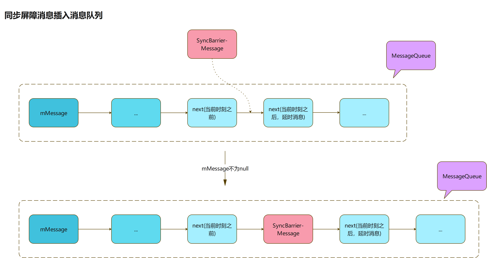

### 同步屏障流程

  * [next()](https://cs.android.com/android/platform/superproject/+/master:frameworks/base/core/java/android/os/MessageQueue.java;drc=master;l=319)：精简了大量源码码，只保留和同步屏障有关的代码；完整的点击左侧方法名
    
```java
MessageQueue.java
...
Message next() {
    final long ptr = mPtr;
    ...
    int pendingIdleHandlerCount = -1; // -1 only during first iteration
    int nextPollTimeoutMillis = 0;
    for (;;) {
        ...
        //阻塞，除非到了超时时间或者唤醒
        nativePollOnce(ptr, nextPollTimeoutMillis);
        synchronized (this) {
            // Try to retrieve the next message.  Return if found.
            final long now = SystemClock.uptimeMillis();
            Message prevMsg = null;
            Message msg = mMessages;
            // 这是关于同步屏障（SyncBarrier）的逻辑块
            if (msg != null && msg.target == null) {
                do {
                    prevMsg = msg;
                    msg = msg.next;
                } while (msg != null && !msg.isAsynchronous());
            }
            if (msg != null) {
                if (now < msg.when) {
                    //每个消息处理有耗时时间，之间存在一个时间间隔（when是将要执行的时间点）。
                    //如果当前时刻还没到执行时刻（when），计算时间差值，传入nativePollOnce定义唤醒阻塞的时间
                    nextPollTimeoutMillis = (int) Math.min(msg.when - now, Integer.MAX_VALUE);
                } else {
                    mBlocked = false;
                    //该操作是把异步消息单独从消息队列里面提出来,然后返回,返回之后,该异步消息就从消息队列里面剔除了
                    //mMessage仍处于未分发的同步消息位置
                    if (prevMsg != null) {
                        prevMsg.next = msg.next;
                    } else {
                        mMessages = msg.next;
                    }
                    msg.next = null;
                    if (DEBUG) Log.v(TAG, "Returning message: " + msg);
                    msg.markInUse();
                    //返回符合条件的Message
                    return msg;
                }
            } else {
                // No more messages.
                nextPollTimeoutMillis = -1;
            }
            ...
        }
        ...
    }
}
```

去掉大量我们无需关注的代码，发现这也没啥嘛，就是一堆if eles for之类的，来​分析分析

  1. Message msg = mMessages：这步赋值是非常重要的，表示即使我们对msg一顿操作，mMessage还是保留消息队列头结点消息的位置
  2. msg.target == null：遇到同步屏障消息 
    1. 首先是一个while循环，内部逻辑，不断将msg节点的位置后移
    2. 结束while的俩个条件 
      * msg移到尾结点，也就是移到了消息队列尾结点，将自身赋值为null（尾结点的next）
      * 遇上标记为异步的消息，放行该消息进行后续分发
  3. 分析下，俩个放行条件产生的不同影响 
    1. 消息队列不含异步消息 
      * 当我们在同步屏障逻辑里面，将msg自身移到尾结点，并赋值为null（尾结点的next）
      * msg为null，是无法进行后续分发操作，会重新进行循环流程
      * mMessage头结点重新将自身位置赋值给msg，继续上述的重复过程
      * 可以发现，上述逻辑确实起到了**同步屏障**的作用，屏蔽了其所有后续同步消息的分发；只有移除消息队列中的该条同步屏障消息，才能继续进行同步消息的分发
    2. 消息队列含有异步消息 
      * 消息队列中如果有异步消息，同步屏障的逻辑会放行异步消息
      * 同步屏障里面堆prevMsg赋值了！请记住在整个方法里面，只有同步屏障逻辑里面堆prevMsg赋值了！这个参数为null与否，对消息队列节点影响很大
      * prevMsg为空：会直接将msg的next赋值给mMessage；说明分发完消息后，会直接移除头结点，将头结点的下一节点赋值为头结点
      * prevMsg不为空：不会对mMessage投节点操作；会将分发消息的上一节点的下一节点位置，换成分发节点的下一节点，有点绕
      * 通过上面分析，可知；异步消息分发完后，会将其直接从消息队列中移除，头结点位置不变

文字写了一大堆，我也是尽可能详细描述，同步屏障逻辑代码块会产生的影响，整个图，加深下印象！

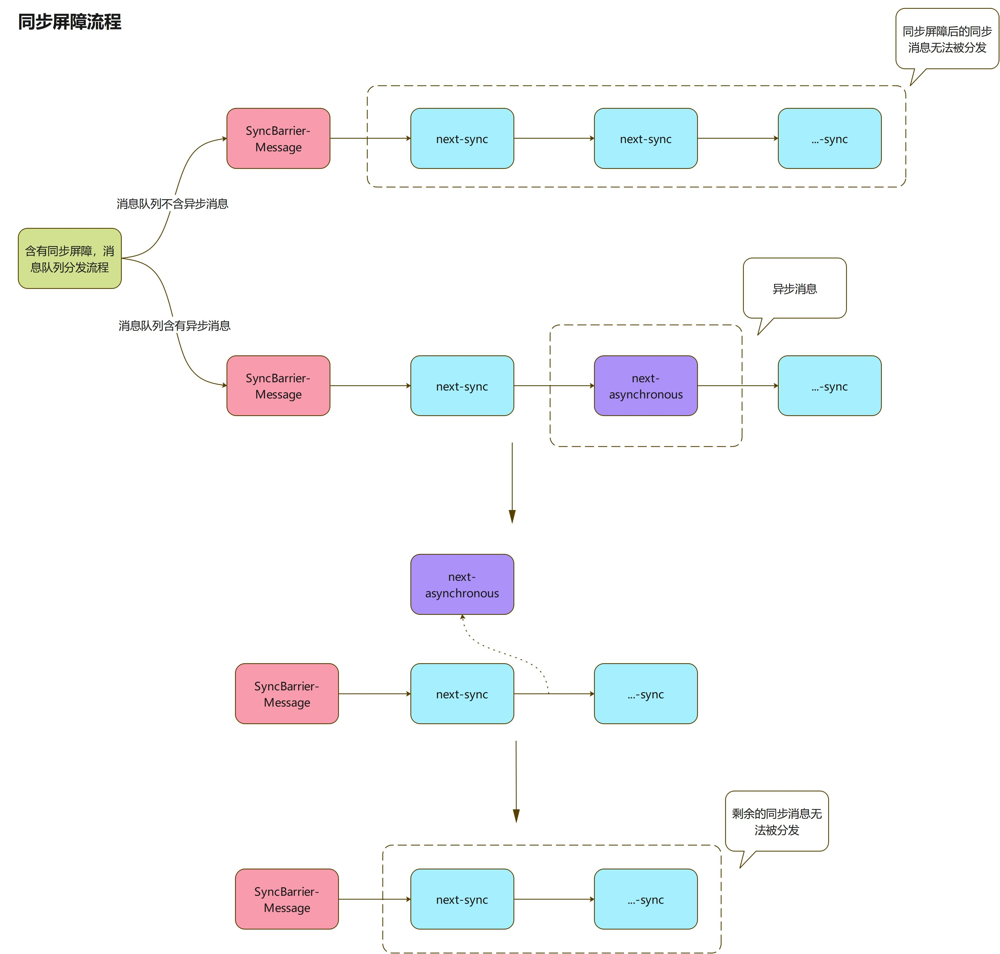

### 同步屏障作用

> 那么这个同步屏障有什么作用呢？
>
> 有个急需的问题，就是什么地方用到了postSyncBarrier(long when)方法，这个方法对外是不暴露的，只有内部包能够调用

**搜索了整个源码包，发现只有几个地方使用了它，剔除测试类，MessageQueue类，有作用的就是：ViewRootImpl类和Device类**

#### Device类

  * [pauseEvents()](https://cs.android.com/android/platform/superproject/+/master:frameworks/base/cmds/hid/src/com/android/commands/hid/Device.java;l=153)：Device内部涉及的是打开设备的时候，会添加一个同步屏障消息，屏蔽后续所有的同步消息处理

    * pauseEvents()是Device类中私有内部类DeviceHandler的方法 
      * 这说明，我们无法调用这个方法；事实上，我们连Device类都无法调用，Device属于被隐藏的类，和他同一目录的还有Event和Hid，这些类系统都不想对外暴露
      * 这就很鸡贼了，说明插入同步屏障的消息的方法，系统确实不想对外暴露；当然不包括非常规方法：反射
  * 同步屏障添加：开机时，添加同步屏障

```java    
Device.java
...
private class DeviceHandler extends Handler {
    ...
    @Override
    public void handleMessage(Message msg) {
        switch (msg.what) {
            case MSG_OPEN_DEVICE:
                ...
                pauseEvents();
                break;
            ...
        }
    }
    public void pauseEvents() {
        mBarrierToken = getLooper().myQueue().postSyncBarrier();
    }
    public void resumeEvents() {
        getLooper().myQueue().removeSyncBarrier(mBarrierToken);
        mBarrierToken = 0;
    }
}
```

  * 同步屏障移除：完成开机后，移除同步屏障

```java
Device.java
...
private class DeviceHandler extends Handler {
    ...
    public void pauseEvents() {
        mBarrierToken = getLooper().myQueue().postSyncBarrier();
    }
    public void resumeEvents() {
        getLooper().myQueue().removeSyncBarrier(mBarrierToken);
        mBarrierToken = 0;
    }
}

private class DeviceCallback {
    public void onDeviceOpen() {
        mHandler.resumeEvents();
    }
    ....
}
```

  * Device中使用同步屏障整体过程比较简单，这里简单描述下

    * 打开设备时，会发送一个同步屏障消息，屏蔽后续所有同步消息
    * 完成开机后，移除同步屏障消息
    * 总结：很明显，这是尽量的提升打开设备速度，不被其它次等重要的事件干扰

#### ViewRootImpl类

> 该栏目的分析，必须引用一个非常重要的结论，给出该结论的文章：[源码分析_AndroidUI何时刷新_Choreographer](https://www.jianshu.com/p/d7be5308d06e)

  * [scheduleTraversals()](https://cs.android.com/android/platform/superproject/+/master:frameworks/base/core/java/android/view/ViewRootImpl.java;l=1919)：非常重要的方法

```java    
ViewRootImpl.java
...
void scheduleTraversals() {
    if (!mTraversalScheduled) {
        mTraversalScheduled = true;
        mTraversalBarrier = mHandler.getLooper().getQueue().postSyncBarrier();
        mChoreographer.postCallback(
            Choreographer.CALLBACK_TRAVERSAL, mTraversalRunnable, null);
        notifyRendererOfFramePending();
        pokeDrawLockIfNeeded();
    }
}
```

  * 结论：[源码分析_Android UI何时刷新_Choreographer](https://www.jianshu.com/p/d7be5308d06e)

    * 关于上面的方法的分析，整体流程比较麻烦，涉及到整个刷新过程的分析
    * 这边前辈的文章分析完UI刷新流程，给出了一个非常重要的结论

> 我们调用View的requestLayout或者invalidate时，最终都会触发ViewRootImp执行scheduleTraversals()方法。这个方法中ViewRootImp会通过Choreographer来注册个接收Vsync的监听，当接收到系统体层发送来的Vsync后我们就执行doTraversal()来重新绘制界面。**通过上面的分析我们调用invalidate等刷新操作时，系统并不会立即刷新界面，而是等到Vsync消息后才会刷新页面。**

我们这边已经有了前辈给出的结论，我们知道了界面刷新（requestLayout或者invalidate）的过程一定会触发scheduleTraversals()方法，这说明会添加同步屏障消息，那肯定有移除同步屏障消息的步骤，这个步骤很有可能存在doTraversal()方法中，来看下这个方法

  * [doTraversal()](https://cs.android.com/android/platform/superproject/+/master:frameworks/base/core/java/android/view/ViewRootImpl.java;l=1939)：removeSyncBarrier！我giao！果然在这地方！ 
    * 这地方做了俩件事：移除同步屏障（removeSyncBarrier）、绘制界面（performTraversals）
    
```java
void doTraversal() {
    if (mTraversalScheduled) {
        mTraversalScheduled = false;
        mHandler.getLooper().getQueue().removeSyncBarrier(mTraversalBarrier);
        if (mProfile) {
            Debug.startMethodTracing("ViewAncestor");
        }
        performTraversals();
        if (mProfile) {
            Debug.stopMethodTracing();
            mProfile = false;
        }
    }
}
```

  * doTraversal()是怎么被调用呢？

    * 调用：mTraversalRunnable在[scheduleTraversals()](https://cs.android.com/android/platform/superproject/+/master:frameworks/base/core/java/android/view/ViewRootImpl.java;l=1919)中使用了

```java        
final TraversalRunnable mTraversalRunnable = new TraversalRunnable();

void scheduleTraversals() {
    if (!mTraversalScheduled) {
        ...
        mChoreographer.postCallback(
            Choreographer.CALLBACK_TRAVERSAL, mTraversalRunnable, null);
        ...
    }
}

final class TraversalRunnable implements Runnable {
    @Override
    public void run() {
        doTraversal();
    }
}
```

  * postCallback是Choreographer类中方法，该类涉及巨多的消息传递，而且都是使用了异步消息`setAsynchronous(true)`，这些都是和界面刷新相关，所以都是优先处理，完整的流程可以看上面贴的文章

  * **postCallback的核心就是让DisplayEventReceiver注册了个Vsync的通知，后期收到送来的Vsync后，我们就执行doTraversal()来重新绘制界面**

#### 总结

  * 通过上面的对ViewRootImpl说明，需要来总结下同步屏障对界面绘制过程的影响
  * 详细版总结（不讲人话版）

> 调用View的requestLayout或者invalidate时，最终都会执行scheduleTraversals()，此时会在主线程消息队列中插入一个同步屏障消息（停止所有同步消息分发），会将mTraversalRunnable添加到mCallbackQueues中，并注册接收Vsync的监听，当接受到Vsync通知后，会发送一个异步消息，触发遍历执行mCallbackQueues的方法，这会执行我们添加的回调mTraversalRunnable，从而执行doTraversal()，此时会移除主线程消息队列中同步屏障消息，最后执行绘制操作

  * 通俗版总结

> **调用requestLayout或者invalidate时，会在主线程消息队列中插入一个同步屏障消息，同时注册接收Vsync的监听；当接受到Vsync通知，会发送一个异步消息，执行真正的绘制事件：此时会移除消息队列中的同步屏障消息，然后才会执行绘制操作**

  * 下面给不讲人话版画了个流转图示

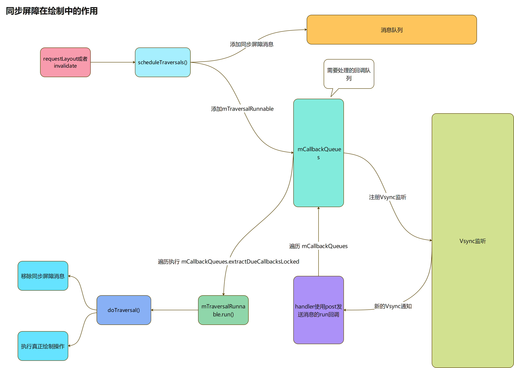

### 总结

#### 消息插入对比

  * 有个很重要的事情，我们再来看下：正常发送消息和同步屏障消息插入消息队列直接的区别，见下图 
    * 取消息：关于取消息，都是取的mMessage，可以理解为，取消息队列的头结点
    * 非延时消息在同步屏障消息之前发送，都会排在同步屏障消息之前
    * 延时消息，如果时刻大于发送同步屏障消息的时刻，会排在同步屏障消息之后

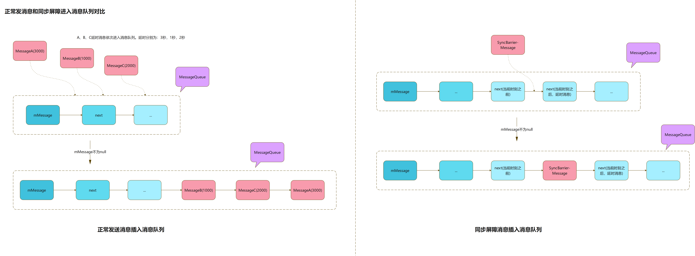

#### Vsync

  * 关于Vsync
    * Vsync 信号一般是由硬件产生的，现在手机一般为60hz~120hz，每秒刷新60到120次，一个时间片算一帧
    * 每个 Vsync 信号之间的时间就是一帧的时间段
  * 来看下执行同步消息时间片：这图真吉儿不好画，吐血

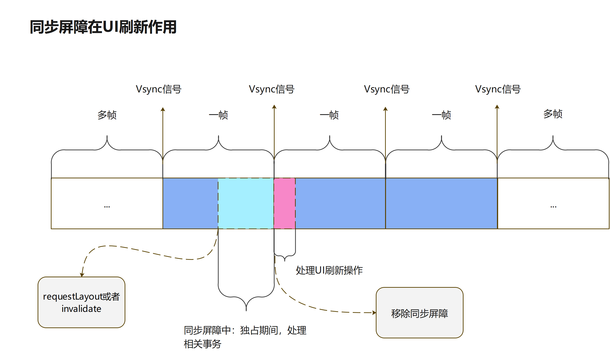

  * 由上图可知：某种极端情况，你所发送的消息，在分发的时候，可能存在一帧的延时

#### 总结

> 相关总结

  * 同步屏障能确保消息队列中的异步消息，会被优先执行
  * 鉴于正常消息和同步屏障消息插入消息队列的区别：同步屏障能够及时的屏障队列中的同步消息
  * 某些极端场景：发送的消息，在分发的时候，可能会存一帧延时 
    * 极端场景：Vsync信号到来之后，立马执行了RequestLayout等操作
  * 同步屏障能确保在UI刷新中：Vsync信号到来后，能够立马执行真正的绘制页面操作

> 同步消息和异步消息使用建议

在正常的情况，肯定不建议使用异步消息，此处假设一个场景：因为某种需求，你发送了大量的异步消息，由于消息进入消息队列的特殊性，系统发送的异步消息，也只能乖乖的排在你的异步消息后面，假设你的异步消息占据了大量的时间片，甚至占用了几帧，导致系统UI刷新的异步消息无法被及时执行，此时很有可能发生掉帧

当然，如果你能看明白这个同步屏障栏目所写的东西，相信什么时候设置消息为异步，心中肯定有数

  * 正常情况，请继续使用同步消息
  * 特殊情况，需要自己发送的消息被优先处理：可以使用异步消息

## 考点

> 上面源码基本就分析到这边了，咱们看看能根据这些知识点，能提一些什么问题呢？

**1、先来个自己想的问题：Handler中主线程的消息队列是否有数量上限？为什么？**

这问题整的有点鸡贼，可能会让你想到，是否有上限这方面？而不是直接想到到上限数量是多少？

解答：Handler主线程的消息队列肯定是有上限的，每个线程只能实例化一个Looper实例（上面讲了，Looper.prepare只能使用一次），不然会抛异常，消息队列是存在Looper()中的，且仅维护一个消息队列

重点：每个线程只能实例化一次Looper()实例、消息队列存在Looper中

拓展：MessageQueue类，其实都是在维护mMessage，只需要维护这个头结点，就能维护整个消息链表

**2、Handler中有Loop死循环，为什么没有卡死？为什么没有发生ANR？**

先说下ANR：5秒内无法响应屏幕触摸事件或键盘输入事件；广播的`onReceive()`函数时10秒没有处理完成；前台服务20秒内，后台服务在200秒内没有执行完毕；ContentProvider的publish在10s内没进行完。所以大致上Loop死循环和ANR联系不大，问了个正确的废话，所以触发事件后，耗时操作还是要放在子线程处理，handler将数据通讯到主线程，进行相关处理。

线程实质上是一段可运行的代码片，运行完之后，线程就会自动销毁。当然，我们肯定不希望主线程被over，所以整一个死循环让线程保活。

为什么没被卡死：在事件分发里面分析了，在获取消息的next()方法中，如果没有消息，会触发nativePollOnce方法进入线程休眠状态，释放CPU资源，MessageQueue中有个原生方法nativeWake方法，可以解除nativePollOnce的休眠状态，ok，咱们在这俩个方法的基础上来给出答案

  * 当消息队列中消息为空时，触发MessageQueue中的nativePollOnce方法，线程休眠，释放CPU资源

  * 消息插入消息队列，会触发nativeWake唤醒方法，解除主线程的休眠状态

    * 当插入消息到消息队列中，为消息队列头结点的时候，会触发唤醒方法
    * 当插入消息到消息队列中，在头结点之后，链中位置的时候，不会触发唤醒方法
  * 综上：消息队列为空，会阻塞主线程，释放资源；消息队列为空，插入消息时候，会触发唤醒机制

    * 这套逻辑能保证主线程最大程度利用CPU资源，且能及时休眠自身，不会造成资源浪费
  * 本质上，主线程的运行，整体上都是以事件（Message）为驱动的

**3、为什么不建议在子线程中更新UI？**

多线程操作，在UI的绘制方法表示这不安全，不稳定。

假设一种场景：我会需要对一个圆进行改变，A线程将圆增大俩倍，B改变圆颜色。A线程增加了圆三分之一体积的时候，B线程此时，读取了圆此时的数据，进行改变颜色的操作；最后的结果，可能会导致，大小颜色都不对。。。

**4、可以让自己发送的消息优先被执行吗？原理是什么？**

这个问题，我感觉只能说：在有同步屏障的情况下是可以的。

同步屏障作用：在含有同步屏障的消息队列，会及时的屏蔽消息队列中所有同步消息的分发，放行异步消息的分发。

在含有同步屏障的情况，我可以将自己的消息设置为异步消息，可以起到优先被执行的效果。

**5、子线程和子线程使用Handler进行通信，存在什么弊端？**

子线程和子线程使用Handler通信，某个接受消息的子线程肯定使用实例化handler，肯定会有Looper操作，Looper.loop()内部含有一个死循环，会导致线程的代码块无法被执行完，该线程始终存在。

如果在完成通信操作，我们一般可以使用： mHandler.getLooper().quit() 来结束分发操作

  * 说明下：quit()方法会进行几项操作 
    * 清空消息队列（未分发的消息，不再分发了）
    * 调用了原生的销毁方法 `nativeDestroy`（猜测下：可能是一些资源的释放和销毁）
    * 拒绝新消息进入消息队列
    * 它可以起到结束loop()死循环分发消息的操作
  * 拓展：quitSafely() 可以确保所有未完成的事情完成后，再结束消息分发

**6、Handler中的阻塞唤醒机制？**

这个阻塞唤醒机制是基于 Linux 的 I/O 多路复用机制 epoll 实现的，它可以同时监控多个文件描述符，当某个文件描述符就绪时，会通知对应程序进行读/写操作.

MessageQueue 创建时会调用到 nativeInit，创建新的 epoll 描述符，然后进行一些初始化并监听相应的文件描述符，调用了epoll_wait方法后，会进入阻塞状态；nativeWake触发对操作符的 `write` 方法，监听该操作符被回调，结束阻塞状态

详细请查看：[同步屏障？阻塞唤醒？和我一起重读 Handler 源码](https://xiaozhuanlan.com/topic/0843791256)

**7、什么是IdleHandler？什么条件下触发IdleHandler？**

IdleHandler的本质就是接口，为了在消息分发空闲的时候，能处理一些事情而设计出来的

具体条件：消息队列为空的时候、发送延时消息的时候

**8、消息处理完后，是直接销毁吗？还是被回收？如果被回收，有最大容量吗？**

Handler存在消息池的概念，处理完的消息会被重置数据，采用头插法进入消息池，取的话也直接取头结点，这样会节省时间

消息池最大容量为50，达到最大容量后，不再接受消息进入

**9、不当的使用Handler，为什么会出现内存泄漏？怎么解决？**

先说明下，Looper对象在主线程中，整个生命周期都是存在的，MessageQueue是在Looper对象中，也就是消息队列也是存在在整个主线程中；我们知道Message是需要持有Handler实例的，Handler又是和Activity存在强引用关系

存在某种场景：我们关闭当前Activity的时候，当前Activity发送的Message，在消息队列还未被处理，Looper间接持有当前activity引用，因为俩者直接是强引用，无法断开，会导致当前Activity无法被回收

思路：断开俩者之间的引用、处理完分发的消息，消息被处理后，之间的引用会被重置断开

解决：使用静态内部类弱引Activity、清空消息队列
