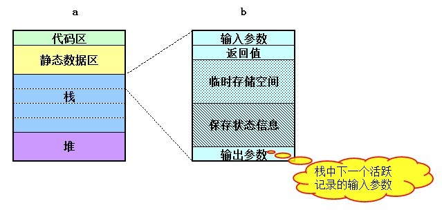
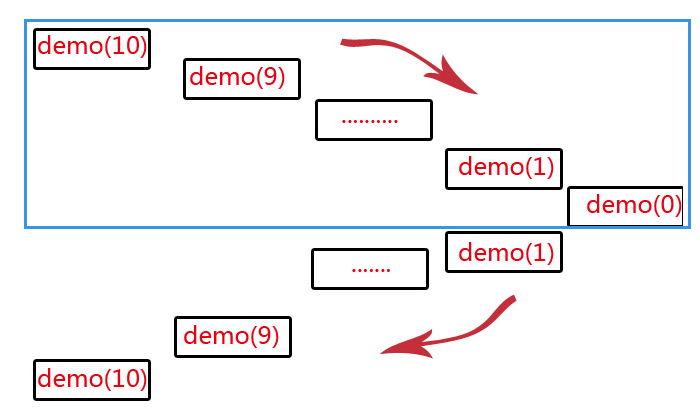
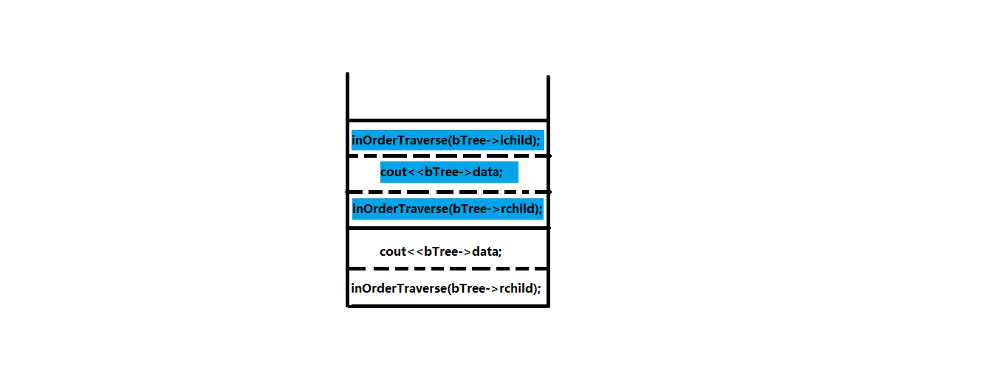
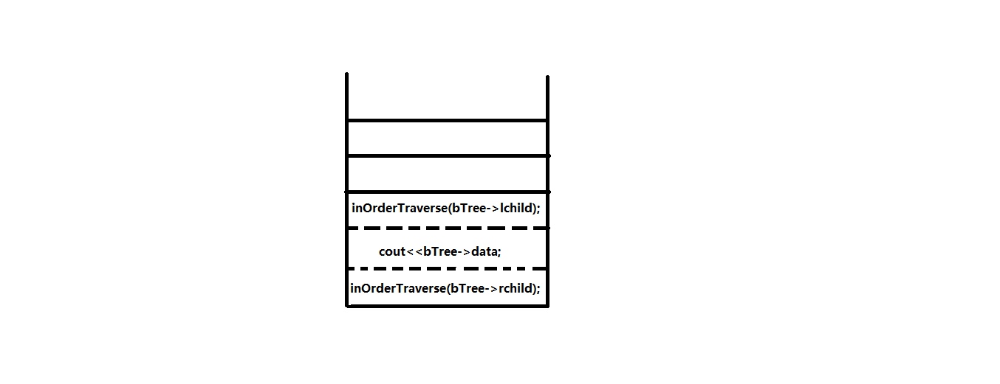

 
<!--BEGIN_DATA
{
    "create_date": "2020-05-07 23:10", 
    "modify_date": "2020-05-07 23:10", 
    "is_top": "0", 
    "summary": "漫谈递归转非递归<br>递归与非递归的转换(树的非递归遍历)", 
    "tags": "算法、C/C++", 
    "file_name": "漫谈递归转非递归.md"
}
END_DATA-->

####<p>原文出处：<a href='https://www.cnblogs.com/bakari/p/5349383.html' target='blank'>漫谈递归转非递归</a></p>

**一：递归的思想**

之前面试腾讯，面试官问了一个问题：说说递归和循环的区别？当时没有答出问题的本质，只是简单地解释了这两个词的意思，囧，今天就借由这篇文章来谈谈自己对递归的理解。

我们一般对递归的印象就是一个函数反复的"自己调用自己"，代码精炼，便于阅读。但是，从本质上来说，递归并不是简单的自己调用自己，而是一种分析和解决问题的方法和思想。简单来说，递归思想就是：把问题分解成规模更小，但和原问题有着相同解法的问题。典型的问题有汉诺塔问题，斐波那契数列，二分查找问题，快速排序问题等。PS：其实像我们常见的分治法和动态规划法都是递归思想的经典应用。


既然的递归的思想是把问题分解成规模更小但和原问题有着相同解法的问题，那是不是所有具有这样特性的问题都能用递归来解决呢？答案是否定的。除了这个特性，能用递归解决的问题还必须具有一个特性：存在一种简单情境，能让递归在简单情境下退出，也就是要有一个递归出口。总结一下就是，能用递归解决的问题，必须满足以下两个条件：


* 一个问题能够分解成规模更小，且与原问题有着相同解的问题；
* 存在一个能让递归调用退出的简单出口。


比如，**阶乘问题**：fact(n) = n*fact(n-1)，当n = 1时，存在简单情境：fact(1) = 1。**斐波那契数列问题**：fib(n) = fib(n-1) + fib(n-2)，当n = 1和n = 2时，存在简单情境：fib(1) = 1, fib(2) = 1。上述两个问题仅存在一种简单情境，有些问题可能存在两种以上的简单情境（在写代码时务必都要考虑到），比如：**二分查找问题**：第一种简单情境是需要查找的元素与中值元素相等；第二种简单情境是：待查找的元素没在序列中，则通过比较待查找元素和最后一个划分的元素来确定结果。

```
bool BinarySearch(int *arr, int n, int key)
{

    if (n == 1) //第二种简单情境
        return (arr[0] == key);
    else {
        int mid = n/2;
        if (key == arr[mid-1]) //第一种简单情境
            return true;
        else if (key < arr[mid-1])
            return BinarySearch(arr, mid, key);
        else
            return BinarySearch(arr+mid, n-mid, key);
    }
}
```

再说一个例子，判断一个序列是否是**回文串**（形如"level", "abba"这样的字符串），这个问题也可以分解成解相同的子问题（去掉首尾的字符），仔细分析可以看出，同样也存在两种递归的简单情境，分别为当字符个数为奇数和偶数的情况下，当n=even时，简单情境为空字符串，空字符串也是回文串，当n=odd，简单情境为只有一个字符，同样也为回文串。

```
//递归判断一个字符串是否为回文串level, abba;
bool isPalinString(int n, char* str)
{
    if (n == 1 || n == 0) //两种简单情境
        return true;
    else return str[0] == str[n-1] ? isPalinString(n-2, str+1): false;
}
```

**二：递归的效率**


递归导致一个函数反复调用自己，我们知道函数调用是通过一个工作栈来实现的，在大多数机器上，每次调用函数时大致要做三个工作：调用前先保存寄存器，并在返回时恢复；复制实参；程序必须转向一个新位置执行。其中，具体要保存的内容包括：局部变量、形参、调用函数地址、返回值。那么，如果递归调用N次，就要分配N*局部变量、N*形参、N*调用函数地址、N*返回值。这势必是影响效率的。在C++中，inline函数就是为了改善函数调用所带来的效率问题而做的一种优化。递归就是利用系统的堆栈保存函数当中的局部变量来解决问题的，说白了就是利用堆栈上的一堆指针指向内存中的对象，并且这些对象一直不被释放，直到遇到简单情境时才一一出栈释放，所以总的开销就很大。栈空间都是有限的，如果没有设置好出口，或者调用层级太多，有可能导致栈空间不够，而出现栈溢出的问题。为了防止无穷递归现象，有些语言是规定栈的长度的，比如python语言规定堆栈的长度不能超过1000。还有就是当规模很大的时候，尽量不使用递归，而改为非递归的形式，或者优化成尾递归的形式（后面讲）。




与递归相关联的有几个词，分别是循环，迭代和遍历。咋一看，都有重复的意思，但有的好像又不只是重复，具体它们之间有什么区别呢？我的理解是这样的：

* 递归：一个函数反复调用自身的行为，特指函数本身；
* 循环：满足一定条件下，重复执行某些行为，如while结构；
* 迭代：按某种规则执行一个序列中的每一项，如for结构；
* 遍历：按某种规则访问图形结构中每一个节点，特指图形结构。

递归由于效率低的问题，经常要求转换成循环结构的非递归形式。

** 三：递归转尾递归**

有些简单的递归问题，可以不借助堆栈结构而改成循环的非递归问题。这里说的简单，是指可以通过一个简单的数学公式来进行推导，如阶乘问题和斐波那契数列数列问题。这些可以转换成循环结构的递归问题，一般都可以优化成尾递归的形式。很多编译器都能够将尾递归的形式优化成循环的形式。那什么是尾递归呢？

我们先讨论一个概念：尾调用。顾名思义，一个函数的调用返回都集中在尾部，单个函数调用就是最简单的尾调用。如果两个函数调用：函数A调用函数B，当函数B返回时，函数A也返回了。同理，多个函数也是同样的情况。这就相当于执行完函数B后，函数A也执行完了，从数据结构上看，在执行函数B时，函数A的堆栈已经大部分被函数B修改或替换了，所以，栈空间没有递增或者说递增的程度没有普通递归那么大。这样在效率上就大大降低了。



尾递归就是基于尾调用形式的递归，只不过上述的函数B就是函数A本身。可见，尾递归其实是将普通递归转换成一种迭代的形式，下一层递归所用的栈帧可以与上一层有重叠，局部变量可重复利用，不需要额外消耗栈空间，也没有push和pop。 这样就大大减少了递归调用栈的开销。下面举两个简单的例子，看看怎么将递归转换成尾递归？

1、阶乘函数：fact(n) = n*fact(n-1)

前面说过，尾递归其实是具有迭代特性的递归，时间复杂度为O(n)。我们可以抓住这个特点进行转化，既然是迭代形式，那么一定要有迭代的统计步数。我们记录当统计步数到达临界条件时，就退出（临界条件可以有两种，一种是递增到n；一种是递减到简单情境）。所以，对应就有两种转化思路：

**思路一：**统计步数从简单情境递增到n。

```
int fact(int n, int i, int ret)
{
    if (n < 1)
        return -1;
    if (n == 1)
        return n;
    else if (i == n)
        return i*ret;
    else return fact(n, i + 1, ret*i);
}
```


用5！来举例子：


```
fact(5, 1, 1)
fact(5, 2, 1)
fact(5, 3, 2)
fact(5, 4, 6)
fact(5, 5, 24)
```

**思路二：**统计步数从n递减到简单情境。


```
int fact1(int n, int i, int ret) 
{
    if (n == 0)
        return ret;
    else 
        return fact1(n-1, i + 1, ret * i);
}
```


```
fact1(5, 1, 1)
fact1(4, 2, 1)
fact1(3, 3, 2)
fact1(2, 4, 6)
fact1(1, 5, 24)
fact1(0, 6, 120)
```

2、斐波那契数列：fib(n) = fib(n-1) + fib(n-2)  同阶乘函数，该问题也有两种转化思路。


**思路一：**统计步数从简单情境递增到n。


```
int fib(int n, int i, int pre, int cur)
{
    if (n <= 2)
        return 1;
    else if (i == n)
        return cur;
    else 
        return fib(n, i + 1, cur, pre+cur);
}
```


```
fib(5, 2, 1, 1)
fib(5, 3, 1, 2)
fib(5, 4, 2 ,3)
fib(5, 5, 3, 5)
```

**思路二：**统计步数从n递减到简单情境。

```
int fib1(int i, int pre, int cur)
{
    if (i <= 2)
        return cur;
    else 
        return fib1(i-1, cur, pre+cur);
}
```


```
fib1(5, 1, 1)
fib1(4, 1, 2)
fib1(3, 2, 3)
fib1(2, 3, 5)
```

** 四：递归转非递归**

不可否认，递归便于算法的理解，代码精炼，容易阅读，但递归的效率往往是我们最在意的问题。如果能用循环解决递归问题，就尽可能使用循环；如果用循环解决不了，或者能解决但代码很冗长且晦涩，则尽可能使用递归。另外，有些低级语言（如汇编）一般不支持递归。很多时候我们需要把递归转化成非递归形式，这不仅能让我们加深对递归的理解，而且能提升问题解决的效率。这时候就需要掌握一些转化的技巧，便于我们在用到时信手捏来。

一般来说，递归转化为非递归有两种情况：

**第一种情况：**正如第三节所说的递归转尾递归的问题，这类问题可以不借助堆栈结构将递归转化为循环结构。

**第二种情况：**借助堆栈将递归转化为非递归（PS：任何递归都可以借助堆栈转化成非递归，第一种情况严格意义上来说不能看做是一种情况）。

其中，第二种情况又可以进一步分为两种转化方法：

**第一种方法：**借助堆栈模拟递归的执行过程。这种方法几乎是通用的方法，因为递归本身就是通过堆栈实现的，我们只要把递归函数调用的局部变量和相应的状态放入到一个栈结构中，在函数调用和返回时做好push和pop操作，就可以了（后面有一个模拟快排的例子）。

**第二种方法：**借助堆栈的循环结构算法。这种方法常常适用于某些局部变量有依赖关系，且需要重复执行的场景，例如二叉树的遍历算法，就采用的这种方法。

最后，通过一个用堆栈模拟快排的例子来结束本文。通过一个结构体record来记录函数的局部变量和相应的状态。


```
void qsort(int a[],int l,int r){
    //boundary case
    if(l>=r)       
        return;
    //state 0
    int mid=partition(a,l,r); 
    qsort(a,l,mid-1);
    //state 1
    qsort(a,mid+1,r);         
    //state 2
}
struct recorc{
    int l,r,mid; //local virables.
    int state;
}stack[100000];

void nun_recursive_qsort(int a[],int l,int r){
    int state=0,top=0;
    int mid;
    while(1){
        if(l>=r){ //boundary case, return previous level
            if(top == 0)
                break;//end of recursion
            top--;
            l=stack[top].l;//end of function, update to previous state
            r=stack[top].r;
            mid=stack[top].mid;
            state=stack[top].state;
        }
        else if(state == 0){
            mid=partition(a,l,r);
            stack[top].l=l;    //recutsive call, push current state into stack
            stack[top].r=r;
            stack[top].mid=mid;
            stack[top].state=1;
            top++;
            r=mid-1;
            state=0; //don't forget to update state value
        }
        else if(state == 1){
            stack[top].l=l;        
            stack[top].r=r;     //recursive call, push current state into stack
            stack[top].mid=mid;
            stack[top].state=2;
            top++;
            l=mid+1;
            state=0;
        }
        else if(state == 2){
            if(top == 0)
                break;  //end of recursion
            top--;
            l=stack[top].l;
            r=stack[top].r;
            mid=stack[top].mid;
            state=stack[top].state;
        }
    }
}
```

借助堆栈人工模拟快排


引申：这个地方跟前面的主题没有直接关系，属于斐波那契数列的引申问题。在斐波那契数列中，如果兔子永远不死，一直繁衍下去，则怎么解？很明显，这是个大数问题，有兴趣的同学可以尝试去写写代码，下面贴上我自己写的。


```
#include<iostream>
using namespace std;
const int M=1000;
int main()
{
    void func(int n);
    int n;
    while((scanf("%d",&n))!=EOF)
    {
        if(n<3)
            cout<<1<<endl;
        else
            func(n);
           cout<<endl;
    }
    return 0;
}
void func(int n)
{
    int  a[M]={0},b[M]={0},c[M]={0};
    int nCurNum[M]={0},nPreNum[M]={0},nResult[M]={0};
    a[M-1]=1;
    b[M-1]=1;
    for(int i=0;i<M/2;i++)
        {    
        nCurNum[i]=a[M-i-1];
        nPreNum[i]=b[M-i-1];
        }
    for(int idx=3;idx<=n;idx++)
    {
            
        /*for(int i=0;i<M;i++)
        {
        nr[i]=nc[i]+np[i]+nr[i];
        nr[i+1]=nr[i+1]+nr[i]/10;
        nr[i]=nr[i]%10;

        }*/
        for(int i=0;i<M;i++)
        {
                nResult[i]=nCurNum[i]+nPreNum[i];}
                for(int i=0;i<M;i++)
                { 
            nResult[i+1]=nResult[i+1]+nResult[i]/10;
                    nResult[i]%=10;
                }
                       
        for(int i=0;i<M;i++)
        {
            nCurNum[i]=nPreNum[i];
            nPreNum[i]=nResult[i];
        }
    }
 for(int i=M-1;i>=0;i--)
 {
     c[i]=nResult[M-i-1];
 }
 int k=0;
 while(!c[k]) k++;
 for(int i=k;i<M;i++)
     cout<<c[i];
}
```

参考：[Veda原型：漫谈递归](http://www.nowamagic.net/librarys/veda/)


<hr>


####<p>原文出处：<a href='https://www.jianshu.com/p/2b49eb904806' target='blank'>递归与非递归的转换(树的非递归遍历)</a></p>

####0. 前言

递归是计算机中基本而实用的算法思想。

主要用于解决有边界的重复性操作问题，即满足数学归纳法特性的问题。比如斐波那契数列。

可递归却有不少缺陷：运行效率低下、递归过多容易栈溢出等等。

但作为一把锋刃的解题利器，我们也不能抛弃它。众所周知，递归的本质即为栈，它运行在内存中，受操作系统控制，一个函数就是栈中的一个单位(栈帧)。递归的过程，就是内存中栈的入栈出栈操作。

因而，我们必然可以用自定义的栈来实现这个过程，即将递归转化为非递归。

那如何快速地将一个递归程序转化为一个非递归程序呢？我想用树的先、中、后序遍历，来表述我的一己之见。

####1. 树的先、中、后序遍历(递归模式)

#####1.1. 先中后序遍历解释

对于一棵树，先序遍历先输出根结点的数据、再输出左孩子树的数据、最后输出右孩子树的数据。简而言之，输出顺序为根—左—右。

以此类推，中序和后序遍历的输出顺序分别为：左—根—右、左—右—根。

#####1.2. 示例

对于如下的一棵树：


```
          A
      B       C
   D     E      F
       G   H     J
     I    K  L
```

先序遍历：`ABDEGIHKLCFJ`
中序遍历：`DBIGEKHLACFJ`
后序遍历：`DIGKLHEBJFCA`

#####1.3. 递归实现遍历

先中后序遍历一棵树，代码十分简单。如下：


```
// 树的数据结构
typedef struct BTNode {
    char data;
    BTNode *lchild, *rchild;
}BTNode, *BiTree;
```

```
// 先序遍历，递归
void preOrderTraverse(BiTree bTree) {
    if (bTree) {
        cout<<bTree->data;               // 先输出根节点的数据
        preOrderTraverse(bTree->lchild); // 输出左子树的数据
        preOrderTraverse(bTree->rchild); // 输出右子树的数据
    }
}

// 中序遍历，递归
void inOrderTraverse(BiTree bTree) {
    if (bTree) {
        inOrderTraverse(bTree->lchild);
        cout<<bTree->data;
        inOrderTraverse(bTree->rchild);
    }
}

// 后序遍历，递归
void postOrderTraverse(BiTree bTree) {
    if (bTree) {
        postOrderTraverse(bTree->lchild);
        postOrderTraverse(bTree->rchild);
        cout<<bTree->data;
    }
}
```

####2. 非递归遍历

#####2.1. 递归到非递归转换分析

对于递归的非递归转换，我们以函数栈的角度去解析就十分简单了。

以中序的递归遍历为例：

```
typedef struct BTNode {
    char data;
    BTNode *lchild, *rchild;
} BTNode, *BiTree;

// 中序遍历，递归
void inOrderTraverse(BiTree bTree) {
    if (bTree) {
        inOrderTraverse(bTree->lchild);
        cout<<bTree->data;
        inOrderTraverse(bTree->rchild);
    }
}
```

当主函数`inOrderTraverse(bTree)`中第一个`inOrderTraverse(bTree->lchild)`子函数被调用时，主函数中剩余的数据和步骤被保留在当前的函数栈帧中。而子函数入函数栈，成为栈顶函数。当子函数运行结束，返回时，子函数出栈，栈顶又变为主函数。然后，程序继续执行主函数中的剩余步骤。

同理子函数的子函数也是如此操作。过程如下：

主函数入栈：



主函数调用第一个子函数的操作出栈，剩余步骤保存在栈中，而被调用子函数(蓝色)入栈：



显而易见，这就是一个出栈入栈的过程。函数保存在栈帧中的操作和数据，我们可以通过自定义的栈来储存。

#####2.2. 非递归的实现
如果，栈中可以存放操作语句，那非递归的实现将会变得十分容易，可惜，栈中只能存放数据。

不过，幸运的是，递归的操作都是重复的，我们只要将数据统一，并根据数据进行相对应操作即可。

在树的递归遍历中，其实只有一个操作，那就是输出结点数据，而剩余函数只是个入栈的过程。

以中序递归遍历为例：

依次将右孩子（第二个子函数）、根结点（输出数据操作）、左孩子（第一个子函数）入栈。

然后检测栈顶过程中，遇到不为空的左/右孩子，则重复上述入栈操作；遇到根结点则输出数据；栈顶指针为空则出栈。

但是，如何判断是孩子、还是根结点呢？我认为可以有两种方法：

（1）设计一个结构体作为栈基本单位。该结构体有两个值：一个用来判断是根结点（`根结点`则`输出数据`）还是孩子（`孩子`则`右-根-左入栈`）的标志位，另一个是指向树的指针：


```
// 中序遍历，非递归第一种方法
typedef struct {
    bool flag;      // 用来判断是根结点(true)还是孩子(false)
    BiTree bTree;   // 树指针
}Node;

void inOrderTraverse1(BiTree bTree) {
    if (!bTree) {
        cout<<"该树为空！";
        return;
    }

    cout<<"非递归中序遍历：";
    stack<Node> s;
    Node temp, top;
    temp.flag = false;
    temp.bTree = bTree;
    s.push(temp);
    while (!s.empty()) {
        top = s.top();
        s.pop();
        // 如果栈顶树指针为空，则不操作
        if (top.bTree == NULL) continue;
        // 如果是根结点
        if (top.flag) {
            cout << top.bTree->data;
        }
        // 如果是孩子
        else {
            temp.flag = false;
            temp.bTree = top.bTree->rchild;
            s.push(temp);

            temp.flag = true;
            temp.bTree = top.bTree;
            s.push(temp);

            temp.flag = false;
            temp.bTree = top.bTree->lchild;
            s.push(temp);
        }
    }
    cout << endl;
}
```

（2）将树结点作为栈的基本单位。设置一种数据结点，只存放数据，而左右孩子为空。每次检测栈顶结点，若左右孩子为空则输出，否则依次将`不为空的右孩子`、`根结点的数据结点`、`不为空的左孩子`入栈：


```
// 中序非递归遍历，第二种算法
void inOrderTraverse2(BiTree bTree) {
    if (!bTree) {
        cout<<"该树为空！";
        return;
    }

    cout<<"非递归中序遍历：";
    stack<BTNode> s;
    s.push(*bTree);
    BTNode temp, dataBTNode;
    dataBTNode.lchild = dataBTNode.rchild = NULL;
    while (!s.empty()) {
        temp = s.top();
        s.pop();

        if (!temp.lchild && !temp.rchild) cout<<temp.data;
        else {
            dataBTNode.data = temp.data;

            if (temp.rchild) s.push(*temp.rchild);
            s.push(dataBTNode);
            if (temp.lchild) s.push(*temp.lchild);
        }
    }
    cout<<endl;
}
```

####3. 后话
实际上，递归并非我们想象中那么拖慢效率。在不至于递归栈爆的情况下，我们还是可以放心地使用递归的。
