 
<!--BEGIN_DATA
{
    "create_date": "2017-01-06 18:33", 
    "modify_date": "2017-01-06 18:33", 
    "is_top": "0", 
    "summary": "用机器学习做个艺术画家-Prisma", 
    "tags": "机器学习、Python", 
    "file_name": "用机器学习做个艺术画家-Prisma.md"
}
END_DATA-->

####
原文出处：<a href='http://www.jianshu.com/p/64a3b4e3f548' target='blank'>用机器学习做个艺术画家-Prisma(上)</a>

##用机器学习做个艺术画家-Prisma(上)

  * [用机器学习做个艺术画家 上](http://www.jianshu.com/p/64a3b4e3f548)
  * [用机器学习做个艺术画家 中](http://www.jianshu.com/p/2bd096179dd8)
  * [用机器学习做个艺术画家 下](http://www.jianshu.com/p/e1629d69a66a)

> 所谓深度学习（Deep Learning）中的 “深度（Deep）” 即意为层数。神经网络的每一层都会对图片特征进行提取，而 “艺术风格”则是各层提取结果的叠加在人类的视觉系统中，从眼睛看到一件实体，到在脑中形成图像的概念，中间经历了无数层神经元的传递。底层的神经元获取到的信息是具体的，越到高层越抽象。

在人类的视觉系统中，从眼睛看到一件实体，到在脑中形成图像的概念，中间经历了无数层神经元的传递。底层的神经元获取到的信息是具体的，越到高层越抽象 
使用计算机模拟这个网络，将每一层的结构分析出来，能看到在采样过程中，底层网络对于图像的细节表达得特别清楚，越到高层像素保留得越少，轮廓信息越多

使用深度学习作画最早是三个德国研究员想把计算机调教成梵高，他们研发了一种算法，模拟人类视觉的处理方式。具体是通过训练多层卷积神经网络（CNN），让计算机识别，并学会梵高的 “风格”、然后将任何一张普通的照片变成梵高的《星空》

大致实现思路如下：

  1. 吸收用户拍摄的照片
  2. 让计算机学会星空图的风格
  3. 计算机输出自己做的“新画”

他们开创了Deep Art公司，他们的用户可以花上 19 欧买一张适合明信片用的作品，或者多掏 100 欧，买一张大尺寸油画级别的艺术画

Prisma 比 Deep Art 先进的地方在于，它大大缩短了图像处理的时间，每张照片在 Prisma 系统内的处理时间控制在秒级别。 prisma诞生于俄罗斯，是一个仅有4个年轻人历时一个半月开发出的图片处理应用，将照片赋予毕加索式的艺术风格，是它们的广告语，它的核心技术思想就是**卷积神经网络可以被看做是一个机器艺术家**。

**prisma在中国基本上是连接不上，没办法使用的状态，没用过也不用下载了**

本章内容主要讲述我封装的两套实现prisma效果的代码使用。你不需要有任何机器学习，图像处理理论基础，读完这篇文章后，下载github上的代码，安装好环境（caffe的安装环境比较复杂）仿照这里的使用方式你就可以自己制作私人的艺术风格照片了

如下地址为git上项目的最终演示使用视频，可以先有个直观感受

[youku 阿布Prisma演示视频](http://v.youku.com/v_show/id_XMTg0MDE3NTM3Mg==.html)  
[更多风格图像展示墙](http://www.yabeetu.com/)  
[项目git地址](https://github.com/bbfamily/prisma_abu)

首先导入库

    
    
    from __future__ import division
    import matplotlib.pylab as plt
    %matplotlib inline
    import os
    from PrismaCaffe import CaffePrismaClass
    from PrismaTensor import TensorPrismaClass
    import PrismaTensor
    import PrismaHelper
    import glob
    import numpy as np
    import PIL.Image
    import ZCommonUtil
    import itertools

####1 基于caffe框架实现prisma

1.1 首先我们直观感受一下什么叫做机器艺术家

如下代码显示出所有演示实例图片（主角还是我家阿布🐶）

    
    
    sample_list = glob.glob("../sample/*.jpg")
    fig, axs = plt.subplots(nrows=2, ncols=4, figsize=(15, 6));
    axs_list = list(itertools.chain.from_iterable(axs))
    for ind, ax in zip(range(2 * 4), axs_list):
        iter_fn = sample_list[ind]
        iter_img = plt.imread(iter_fn)
        ax.set_title(os.path.basename(iter_fn))
        ax.imshow(iter_img);
        ax.set_axis_off()

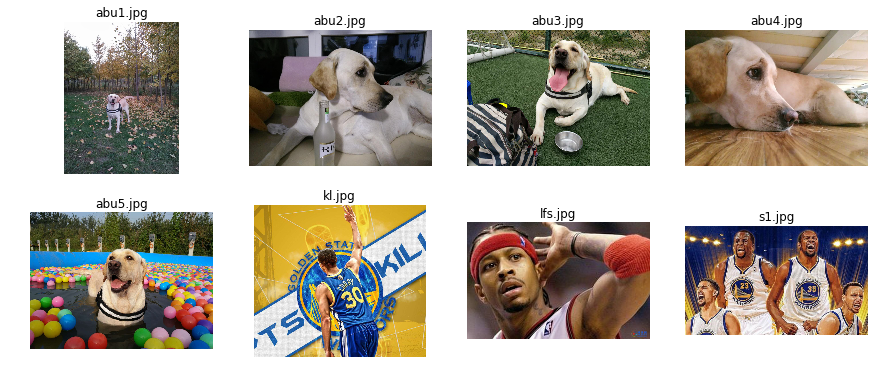  

使用caffe封装的大名鼎鼎的google deepdream来看看效果

下面的代码初始化一个CaffePrisma工作实例，显示阿布美照，打印出模型网络的前几个浅层指令

    
    
    cp  = CaffePrismaClass(dog_mode=False)
    nbks = filter(lambda nbk: nbk[-8:-1] <> '_split_', cp.net.blobs.keys()[1:-2])[:10]
    abu4_file = '../sample/abu4.jpg' 
    PrismaHelper.show_array_ipython(np.float32(cp.resize_img(PIL.Image.open(abu4_file))))
    nbks

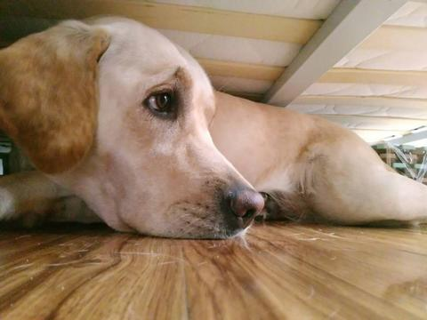  

    
    
    ['conv1/7x7_s2',
     'pool1/3x3_s2',
     'pool1/norm1',
     'conv2/3x3_reduce',
     'conv2/3x3',
     'conv2/norm2',
     'pool2/3x3_s2',
     'inception_3a/1x1',
     'inception_3a/3x3_reduce',
     'inception_3a/3x3']

下面我们用这几个浅层神经元对原图风格化的效果展示

    
    
    for nbk in nbks[2:-2]:
        d_img = cp.fit_img(abu4_file, resize=True, nbk=nbk, iter_n=10)
        PrismaHelper.show_array_ipython(np.float32(d_img))

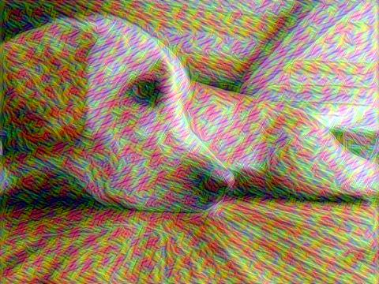  

  

  

  

  

  

本章的内容的代码及示例并不能做出如下所示的效果的风格图像，如下所示的风格图像将在下一章详细讲解原理及代码，本章是基础

    
    
    fig, axs = plt.subplots(nrows=1, ncols=3, figsize=(20, 10));
    up_list = ['../show/up2.jpg', '../show/up3.jpg', '../show/up4.jpg']
    for ind, ax in zip(range(1 * 3), axs):
        iter_fn = up_list[ind]
        iter_img = plt.imread(iter_fn)
        ##ax.set_title(os.path.basename(iter_fn))
        ax.imshow(iter_img);
        ax.set_axis_off()

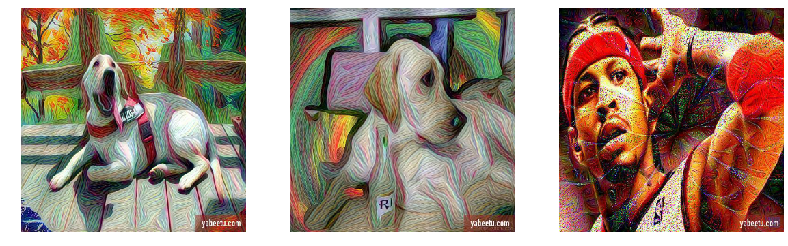  

**当然如果你只是想要得到这样效果的照片，对技术没有兴趣，可以把照片图像发给我，我做好后再次传给你！**

有没有感觉到特征的识别由浅入深的一步一步增强，也就是从edge，到shape，再到复杂的shape循序渐进的过程，试着感觉一下有没有慢慢一点点睁开眼睛的感觉，这里主要是把每层的特质放大进行夸张凸显

看一下CaffePrismaClass初始化代码

    
    
    class CaffePrismaClass(BasePrismaClass):
        def __init__(self, dog_mode=False):
            self.net_fn = '../mode/deploy.prototxt'
            if not dog_mode:
                self.param_fn = '../mode/bvlc_googlenet.caffemodel'
                mu = np.float32([104.0, 117.0, 123.0])
            else:
                self.param_fn = '../mode/dog_judge_train_iter_5000.caffemodel'
                model_mean_file = '../mode/mean.binaryproto'
                mean_blob = caffe.proto.caffe_pb2.BlobProto()
                mean_blob.ParseFromString(open(model_mean_file, 'rb').read())
                mean_npy = caffe.io.blobproto_to_array(mean_blob)
                mu = np.float32(mean_npy.mean(2).mean(2)[0])
            model = caffe.io.caffe_pb2.NetParameter()
            text_format.Merge(open(self.net_fn).read(), model)
            model.force_backward = True
            open('tmp.prototxt', 'w').write(str(model))
            self.net = caffe.Classifier('tmp.prototxt', self.param_fn,
                                        mean=mu,
                                        channel_swap=(
                                            2, 1, 0))

注意到上面的 [bvlc_googlenet.caffemodel](https://pan.baidu.com/s/1i5NosiL)是google已经训练好的模型，可以通过我的网盘链接下载，提取码为eup6

至于下面代码中的../mode/dog_judge_train_iter_5000.caffemodel这个是我在[爬取百度图片各种狗狗的图片，使用caffe训练模型分类](http://www.jianshu.com/p/6942241d4ad9)中自己训练好的模型，你可以不必管

备注：上面的代码中mu = np.float32([104.0, 117.0, 123.0])常数的选择是从模型训练时的网络配置中决定的，它们只是为了提高训练识别速度，如下配置

    
    
      transform_param {
        mirror: true
        crop_size: 224
        mean_value: 104
        mean_value: 117
        mean_value: 123
      }

[更详尽的网络配置](https://github.com/BVLC/caffe/blob/master/models/bvlc_googlenet/train_val.prototxt)

下面我们使用abu1来逐步介绍封装类的具体使用方式

    
    
    abu1_file = '../sample/abu1.jpg'
    PrismaHelper.show_array_ipython(np.float32(cp.resize_img(PIL.Image.open(abu1_file))))

  

1.2 直接使用某个神经元层的效果

    
    
    d_img = cp.fit_img(abu1_file, resize=True, nbk='conv1/7x7_s2', iter_n=10)
    PrismaHelper.show_array_ipython(np.float32(d_img))

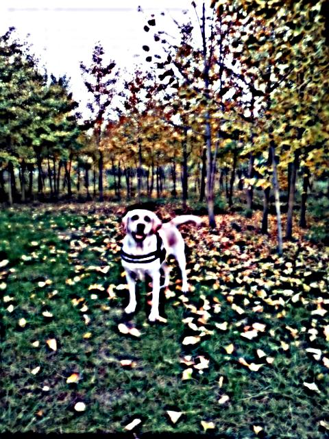  

1.3 配合PIL预处理方式处理图像

你如果用过prisma，你一定会知道prisma有很多效果比如黑白，水墨，怎么以实现吗，我们如下代码使用PIL库预处理一下图片，然后再做处理，如下的基类封装了接口和预处理操作

    
    
    class BasePrismaClass(six.with_metaclass(ABCMeta, object)):
        @abstractmethod
        def fit_guide_img(self, img_path, gd_path, resize=False, size=480, enhance=None, iter_n=10, **kwargs):
            pass
        @abstractmethod
        def fit_img(self, img_path, resize=False, size=480, enhance=None, iter_n=10, **kwargs):
            pass
        @abstractmethod
        def gd_features_make(self, *args, **kwargs):
            pass
        @abstractmethod
        def do_prisma(self, *args, **kwargs):
            pass
        def resize_img(self, r_img, base_width=480, keep_size=True):
            if keep_size:
                w_percent = (base_width / float(r_img.size[0]))
                h_size = int((float(r_img.size[1]) * float(w_percent)))
            else:
                h_size = base_width
            r_img = r_img.resize((base_width, h_size), PIL.Image.ANTIALIAS)
            return r_img
        def handle_enhance(self, r_img, enhance, sharpness=8.8, brightness=1.8, contrast=2.6, color=7.6, contour=2.6):
            if enhance == 'Sharpness':
                enhancer = ImageEnhance.Sharpness(r_img)
                s_img = enhancer.enhance(sharpness)
                img = s_img
            elif enhance == 'Brightness':
                enhancer = ImageEnhance.Brightness(r_img)
                b_img = enhancer.enhance(brightness)
                img = b_img
            elif enhance == 'Contrast':
                enhancer = ImageEnhance.Contrast(r_img)
                t_img = enhancer.enhance(contrast)
                img = t_img
            elif enhance == 'Color':
                enhancer = ImageEnhance.Color(r_img)
                c_img = enhancer.enhance(color)
                img = c_img
            elif enhance == 'CONTOUR':
                enhancer = ImageEnhance.Contrast(r_img)
                t_img = enhancer.enhance(contour)
                fc_img = t_img.filter(ImageFilter.CONTOUR)
                img = fc_img
            elif enhance == 'EDGES':
                ffe_img = r_img.filter(ImageFilter.FIND_EDGES)
                img = ffe_img
            elif enhance == 'EMBOSS':
                feb_img = r_img.filter(ImageFilter.EMBOSS)
                img = feb_img
            elif enhance == 'EEM':
                feem_img = r_img.filter(ImageFilter.EDGE_ENHANCE_MORE)
                img = feem_img
            elif enhance == 'EE':
                fee_img = r_img.filter(ImageFilter.EDGE_ENHANCE)
                img = fee_img
            else:
                img = r_img
            return img

下面使用conv2/3x3和预处理效果综合显示效果看看(由于篇幅只运行两个效果，其它的读者可自行打开注释的代码查看效果)

    
    
    d_img = cp.fit_img(abu1_file, resize=True, nbk='conv2/3x3', iter_n=10)
    PrismaHelper.show_array_ipython(np.float32(d_img))
    d_img = cp.fit_img(abu1_file, resize=True, nbk='conv2/3x3', enhance='Sharpness', iter_n=10)
    PrismaHelper.show_array_ipython(np.float32(d_img))
    d_img = cp.fit_img(abu1_file, resize=True, nbk='conv2/3x3', enhance='Contrast', iter_n=10)
    PrismaHelper.show_array_ipython(np.float32(d_img))
    ##d_img = cp.fit_img(abu1_file, resize=True, nbk='conv2/3x3', enhance='Brightness', iter_n=10)
    ##PrismaHelper.show_array_ipython(np.float32(d_img))
    ##d_img = cp.fit_img(abu1_file, resize=True, nbk='conv2/3x3', enhance='CONTOUR', iter_n=10)
    ##PrismaHelper.show_array_ipython(np.float32(d_img))
    ##d_img = cp.fit_img(abu1_file, resize=True, nbk='conv2/3x3', enhance='Color', iter_n=10)
    ##PrismaHelper.show_array_ipython(np.float32(d_img))
    ##d_img = cp.fit_img(abu1_file, resize=True, nbk='conv2/3x3', enhance='EEM', iter_n=10)
    ##PrismaHelper.show_array_ipython(np.float32(d_img))
    ##d_img = cp.fit_img(abu1_file, resize=True, nbk='conv2/3x3', enhance='EE', iter_n=10)
    ##PrismaHelper.show_array_ipython(np.float32(d_img))

  

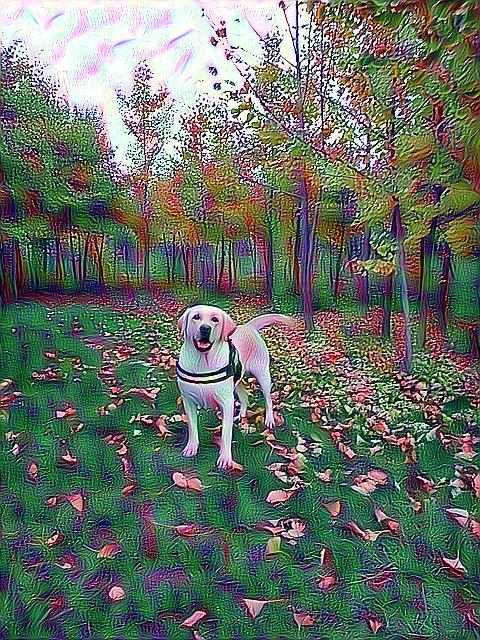  

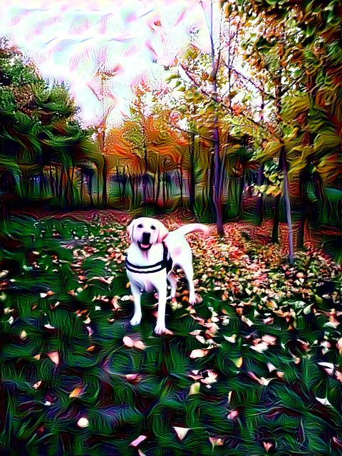  

以上的这些预处理操作会有很多种组合及变种，比如我在代码中针对CONTOUR的处理是先做了个Contrast然后再CONTOUR这样效果针对CONTOUR效果会更好

    
    
    elif enhance == 'CONTOUR':
        enhancer = ImageEnhance.Contrast(r_img)
        t_img = enhancer.enhance(contour)
        fc_img = t_img.filter(ImageFilter.CONTOUR)
        img = fc_img

如果你想做批处理风格画操作，使用fit_batch_img，其实这里没有完善，后期会修改为类似tensor
prisma的批量处理实现方式，使用卷积层识别指令和图像预处理指令做product求笛卡尔积，遍历所有风格画组合

    
    
        def fit_batch_img(self, img_path, resize=False, size=480, enhance=None):
            """
            批量处理，但不支持并行，后修改为类似tensor prisma中的并行模式
            :param img_path:
            :param resize:
            :param size:
            :param enhance:
            :return:
            """
            r_img = PIL.Image.open(img_path)
            if resize:
                r_img = self.resize_img(r_img, size)
            org_img = self.handle_enhance(r_img, enhance)
            e_str = '' if enhance is None else '_' + enhance.lower()
            save_path = os.path.dirname(img_path) + '/batch_caffe/' + e_str
            ZCommonUtil.ensure_dir(save_path)
            org_img_path = save_path + 'org.jpeg'
            with open(org_img_path, 'w') as f:
                org_img.save(f, 'jpeg')
            org_img = np.float32(org_img)
            start = 1
            end = self.net.blobs.keys().index('inception_4c/pool')
            nbks = self.net.blobs.keys()[start:end]
            """
                不能使用多进程方式在这里并行执行，因为caffe.classifier.Classifier不支持序列化
                Pickling of "caffe.classifier.Classifier" instances is not enabled
                so mul process no pass
            """
            for nbk in nbks:
                if nbk[-8:-1] == '_split_':
                    continue
                fn = save_path + nbk.replace('/', '_') + '.jpg'
                deep_img = self.do_prisma(org_img, iter_n=10, end=nbk)
                PrismaHelper.save_array_img(deep_img, fn)
            return save_path

封装的代码是deepdream的代码它由imagenet大量的图片数据来训练神经网络，并且使用google_lenet的深度模型网络大大提高了识别度，使这个网络可以判断出图片中的事物，类似于之前我的文章训练狗狗图片，对狗狗进行分类识别，风格画的实现原理是不止识别，它还把图片的特质从它的模型中选取图像重新在原图进行渲染，下一章将有重点介绍这部分的实现代码原理，这里暂且带过。具体请查看git上文件PrismaCaffe.py，核心代码如下

    
    
    def _objective_l2(self, dst):
        dst.diff[:] = dst.data
    def _objective_guide_features(self, dst, guide_features):
        x = dst.data[0].copy()
        y = guide_features
        ch = x.shape[0]
        x = x.reshape(ch, -1)
        y = y.reshape(ch, -1)
        a = x.T.dot(y)
        dst.diff[0].reshape(ch, -1)[:] = y[:, a.argmax(1)]
    def do_prisma_step(self, step_size=1.5, end='inception_4c/output',
                       jitter=32, objective=None):
        if objective is None:
            raise ValueError('make_step objective is None!!!')
        src = self.net.blobs['data']
        dst = self.net.blobs[end]
        ox, oy = np.random.randint(-jitter, jitter + 1, 2)
        src.data[0] = np.roll(np.roll(src.data[0], ox, -1), oy, -2)
        self.net.forward(end=end)
        objective(dst)
        self.net.backward(start=end)
        g = src.diff[0]
        src.data[:] += step_size / np.abs(g).mean() * g
        src.data[0] = np.roll(np.roll(src.data[0], -ox, -1), -oy, -2)
    def do_prisma(self, base_img, iter_n=10, octave_n=4, octave_scale=1.4,
                  end='inception_4c/output', **step_params):
        octaves = [PrismaHelper.preprocess_with_roll(base_img, self.mean_pixel)]
        for i in xrange(octave_n - 1):
            octaves.append(nd.zoom(octaves[-1], (1, 1.0 / octave_scale, 1.0 / octave_scale), order=1))
        src = self.net.blobs['data']
        detail = np.zeros_like(octaves[-1])
        for octave, octave_base in enumerate(octaves[::-1]):
            h, w = octave_base.shape[-2:]
            if octave > 0:
                h1, w1 = detail.shape[-2:]
                detail = nd.zoom(detail, (1, 1.0 * h / h1, 1.0 * w / w1), order=1)
            src.reshape(1, 3, h, w)
            src.data[0] = octave_base + detail
            for i in xrange(iter_n):
                self.do_prisma_step(end=end, **step_params)
            detail = src.data[0] - octave_base
        return PrismaHelper.deprocess_with_stack(src.data[0], self.mean_pixel)
    def gd_features_make(self, guide, end):
        h, w = guide.shape[:2]
        src, dst = self.net.blobs['data'], self.net.blobs[end]
        src.reshape(1, 3, h, w)
        src.data[0] = PrismaHelper.preprocess_with_roll(guide, self.mean_pixel)
        self.net.forward(end=end)
        guide_features = dst.data[0].copy()
        return guide_features
        def fit_batch_img(self, img_path, resize=False, size=480, enhance=None):
            """
            批量处理，但不支持并行，后修改为类似tensor primsma中的并行模式
            :param img_path:
            :param resize:
            :param size:
            :param enhance:
            :return:
            """
            r_img = PIL.Image.open(img_path)
            if resize:
                r_img = self.resize_img(r_img, size)
            org_img = self.handle_enhance(r_img, enhance)
            e_str = '' if enhance is None else '_' + enhance.lower()
            save_path = os.path.dirname(img_path) + '/batch_caffe/' + e_str
            ZCommonUtil.ensure_dir(save_path)
            org_img_path = save_path + 'org.jpeg'
            with open(org_img_path, 'w') as f:
                org_img.save(f, 'jpeg')
            org_img = np.float32(org_img)
            start = 1
            end = self.net.blobs.keys().index('inception_4c/pool')
            nbks = self.net.blobs.keys()[start:end]
            """
                不能使用多进程方式在这里并行执行，因为caffe.classifier.Classifier不支持序列化
                Pickling of "caffe.classifier.Classifier" instances is not enabled
                so mul process no pass
            """
            for nbk in nbks:
                if nbk[-8:-1] == '_split_':
                    continue
                fn = save_path + nbk.replace('/', '_') + '.jpg'
                deep_img = self.do_prisma(org_img, iter_n=10, end=nbk)
                PrismaHelper.save_array_img(deep_img, fn)
            return save_path

使用预处理再加上一些其它参数微调配合浅层特征就可以做出一些比较好看的效果，如使用演示视频中的GUI可对效果进行比较好的控制，如下效果，下一章详细介绍使用方式：

    
    
    def show_lydw(fd_fn):
        sample_list = glob.glob(fd_fn)
        sample_list = sample_list[::-1]
        fig, axs = plt.subplots(nrows=1, ncols=2, figsize=(20, 10));
        for ind, ax in zip(range(1 * 2), axs):
            iter_fn = sample_list[ind]
            iter_img = plt.imread(iter_fn)
            ax.set_title(os.path.basename(iter_fn))
            ax.imshow(iter_img);
            ax.set_axis_off()
    
    
    show_lydw('../show/bj*.jpg')

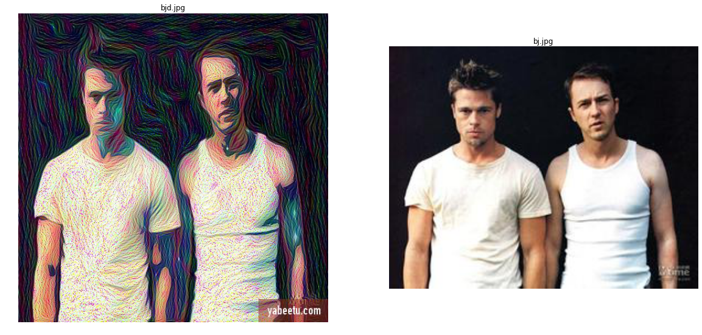  

[风格图像墙中地址](http://www.yabeetu.com/design/L3N0YXRpYy90ZW1wLzE0ODA4NTc0NzAuNzMwLjg5Mzg4NzQ2NzIwNS8uL2N2dC5qcGc=)

    
    
    show_lydw('../show/nr*.jpg')

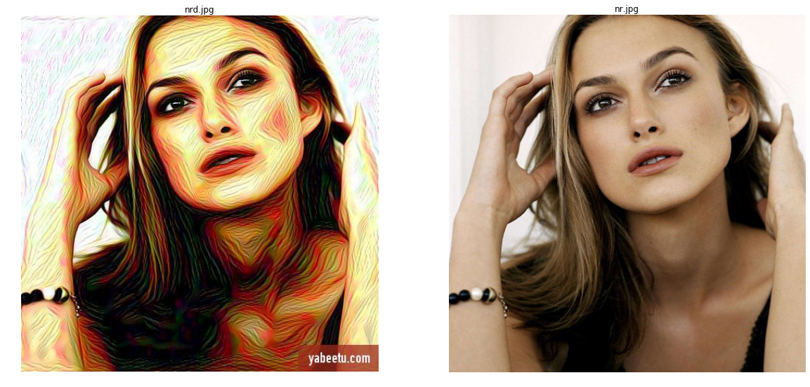  

[风格图像墙中地址](http://www.yabeetu.com/design/L3N0YXRpYy90ZW1wLzE0ODA4NTgxMjIuODIwLjQ2MDc4NDE0MzI1NS8uL2N2dC5qcGc=)

上面使用的原始图像的分辨率都很低，我自己风格化了很多30w像素nokia年代拍出的照片，风格化后由于技术特点不会感觉不清晰，反而更有味道，回味了一把30w像素年代的爱情往事💞

1.4 使用引导图进行风格引导

最后本小节我们看看prisma中会有很多风格引导，我们怎样使用CaffePrismaClass实现呢

首先将风格引导图都转换为224大小为了符合模型中对图片的要求(关于模型结构可以从代码中mode/deploy.prototxt查看详情)

    
    
    img_gd_list = glob.glob("../prisma_gd/*.jpg")
    for img_gd in img_gd_list:
        width = 224
        hsize = 224
        org_img_gd = PIL.Image.open(img_gd)
        r_img_gd = org_img_gd.resize((width, hsize), PIL.Image.ANTIALIAS)
        filen_ame = '../prisma_gd_224/' + os.path.basename(img_gd)
        ZCommonUtil.ensure_dir(filen_ame)
        with open(filen_ame, 'w') as f:
            r_img_gd.save(f, 'jpeg')

选出一张看看

    
    
    img_gd_list = glob.glob("../prisma_gd_224/*.jpg")
    gd_path = '../prisma_gd_224/tooopen_sy_127260228921.jpg'
    guide = np.float32(PIL.Image.open(gd_path))
    PrismaHelper.show_array_ipython(guide)

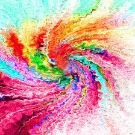  

如下代码展示使用风格引导的风格画，和不使用风格引导做的风格画的区别

    
    
    d_img = cp.fit_img(abu1_file, resize=True, nbk='conv2/3x3_reduce', iter_n=10)
    PrismaHelper.show_array_ipython(np.float32(d_img))
    d_img = cp.fit_guide_img(abu1_file, gd_path, resize=True, nbk='conv2/3x3_reduce', iter_n=10)
    PrismaHelper.show_array_ipython(np.float32(d_img))

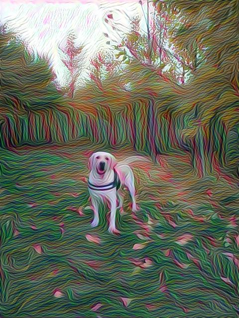  

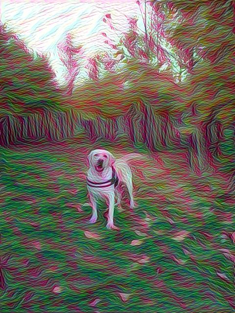  

观察结果可以发现，引导图的特征并没有很多的嵌入原图中，这是由于deepdream实现的的机制是等权重的方式抽取特征导致（当然你也可以修改权重，但问题又会转移到如何分配才能达到视觉上的效果好）。

总结一下CaffePrismaClass的优点就是不需要太多次的迭代训练就可以创造出一副艺术画，缺点就是针对风格引导的渲染绘制显然欠缺。

* * *

停下来休息一下，这么长的文章我也不知道能有几个人看到这里，更何况有几个人能看到最后一章呢，我发现我之前写的[打开股票量化的黑箱](http://www.jianshu.com/p/4ba3a10ea9e5) 只有第一章有一些人看，其实后面的才是重点，当然这主要怪我自己能力不足，写的不足以打动读者。

所以我要在这里把正事办了✊， **prisma的最后一章我会把汪汪喵呜孤儿院中等待领养的小动物的照片做风格艺术图像, 它们的大概情况及具体领养地址**,这里我先把一些小动物的图像墙的地址列在下面，希望大家在自己的能力范围内，帮助这些流浪动物，领养，助养或者只是转发一下。

汪汪喵呜孤儿院中等待领养的小动物的照片做风格艺术图像，它们没有纯种的血统，猫的话可能就是叫白猫，黑猫，花猫。狗的话还有个名字‘中华田园犬’，作为经常去喂流浪狗食物的人们来说它们的名字一般是大黄，小黑，但请你发现它们的美，看着它们的眼睛，每一个都是那么的可爱漂亮，真心希望每一个天使都可以找到好的主人，幸福的过完它们本来就不长的一生，也希望你不要再犹豫去迎接这些可爱善良的天使，毕竟我们的生命都不长。

  * [玛瑙 短毛黄白花](http://www.yabeetu.com/design/L3N0YXRpYy90ZW1wLzE0ODA4NTgwMjAuMzgwLjE0ODQzODgxOTc2Ni8uL2N2dC5qcGc=)
  * [普洱 中华田园犬](http://www.yabeetu.com/design/L3N0YXRpYy90ZW1wLzE0ODA4NTc2MDIuNjgwLjU4NzUyMzgzMjQ5Ny8uL2N2dC5qcGc=)
  * [琥珀 长毛黑狸花猫](http://www.yabeetu.com/design/L3N0YXRpYy90ZW1wLzE0ODExMTU5MjYuNjcwLjQ3NTE2NzQ1NzE0OC8uL2N2dC5qcGc=)
  * [小黑 金毛混血儿](http://www.yabeetu.com/design/L3N0YXRpYy90ZW1wLzE0ODA4NTg2MDYuNDgwLjc5Njg2ODA1MTA3My8uL2N2dC5qcGc=)
  * [虎妞 中华田园犬](http://www.yabeetu.com/design/L3N0YXRpYy90ZW1wLzE0ODA4NTc2NzEuODYwLjcxODY3NDM1NDIvLi9jdnQuanBn)
  * [火娃 三花猫](http://www.yabeetu.com/design/L3N0YXRpYy90ZW1wLzE0ODA4NTgwNDAuODgwLjcxMDI0NTYxMzE5OC8uL2N2dC5qcGc=)
  * [杰克 中华田园犬](http://www.yabeetu.com/design/L3N0YXRpYy90ZW1wLzE0ODA4NTc2OTguNTMwLjY2MDI4MTQyMzcyMS8uL2N2dC5qcGc=)

另外最近总是听到有认识的人要准备生小孩子，要把一直养的猫或者狗送老家，难道你们不是把狗狗当孩子养的吗，我会一直教育我的孩子把阿布当作家人看待的，是姐姐，希望所有人都能理性科学的对待小孩子和猫狗的关系，不要让这些事情变成一种传统，愿它们本来就不长的生命都能幸福。

[求下面的图像点赞](http://www.yabeetu.com/design/L3N0YXRpYy90ZW1wLzE0ODA4NTc0OTguNDkwLjg3ODI2MjEzOTc1Ni8uL2N2dC5qcGc=)

    
    
    show_lydw('../show/bz*.jpg')

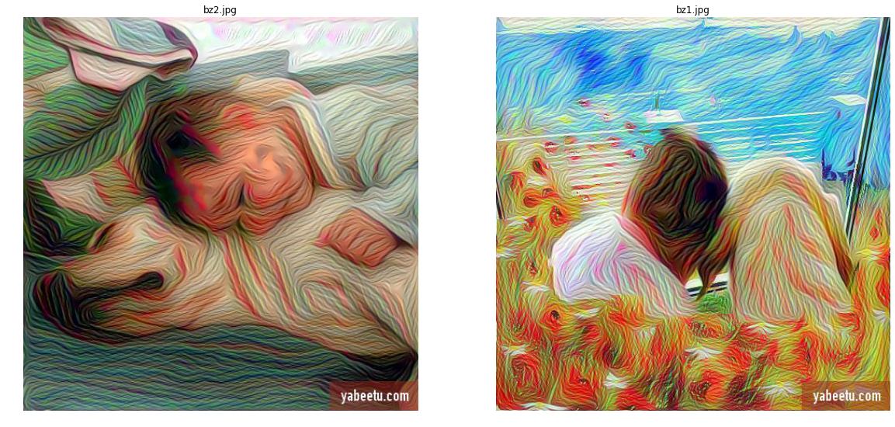  

请关注[狗与爱](http://www.jianshu.com/collection/413d333d9510)将定期发布流浪狗领养，狗狗相亲等信息

####2 基于tensorflow框架实现prisma

首先看看我们的风格引导图下都有什么

    
    
    img_gd_list = glob.glob("../prisma_gd/*.jpg")
    fig, axs = plt.subplots(nrows=5, ncols=8, figsize=(30, 15));
    axs_list = list(itertools.chain.from_iterable(axs))
    for ind, ax in zip(range(5 * 8), axs_list):
        iter_fn = img_gd_list[ind]
        iter_img = plt.imread(iter_fn)
        ax.set_title(os.path.basename(iter_fn).split('.')[0])
        ax.imshow(iter_img);
        ax.set_axis_off()

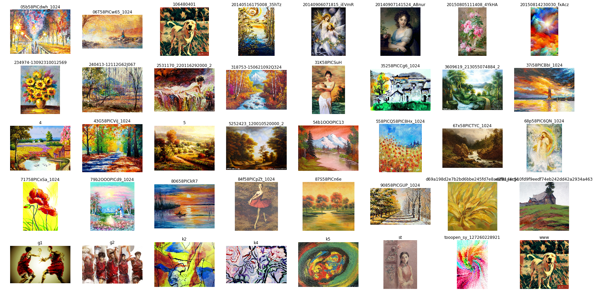  

2.1 实例化一个封装好的tensorflow风格画实例

    
    
    tp = TensorPrismaClass()
    tp
    
    
    mean_pixel: [ 123.68   116.779  103.939]

注意代码中的 [K_VGG_MAT_PATH = '../mode/vgg_imagenet.mat'](https://pan.baidu.com/s/1bpssvPP)是vgg模型，可以通过我的网盘链接下载，提取码为gunt

TensorPrismaClass实现原理是低层次的卷积核学习特征纹理颜色，边界等粗线条，高层次卷积核学到的是底层特征叠加所产生的形状内容特征，最终风格画的效果是由各个层特征分配权重组合而成，不断迭代计算loss function，来寻找图像的特征分配权重，详情代码请查阅github上的PrismaTensor.py，核心代码如下：

    
    
    def _conv2d(self, img, w, b):
        return tf.nn.bias_add(tf.nn.conv2d(img, tf.constant(w), strides=[1, 1, 1, 1], padding='SAME'), b)
    def _max_pool(self, img, k):
        return tf.nn.max_pool(img, ksize=[1, k, k, 1], strides=[1, k, k, 1], padding='SAME')
    def __init__(self):
        self.net_fn = K_VGG_MAT_PATH
        if not ZCommonUtil.file_exist(self.net_fn):
            raise RuntimeError('self.net_fn not exist!!!')
        self.net_layers = K_NET_LAYER
        self.net_data = scipy.io.loadmat(self.net_fn)
        self.mean = self.net_data['normalization'][0][0][0]
        self.mean_pixel = np.mean(self.mean, axis=(0, 1))
        self.weights = self.net_data['layers'][0]
    def _build_vgg_net(self, shape, image_tf=None):
        if image_tf is None:
            image_tf = tf.placeholder('float', shape=shape)
        net = dict()
        current = image_tf
        for ind, name in enumerate(self.net_layers):
            kind = name[:4]
            if kind == 'conv':
                kernels, bias = self.weights[ind][0][0][0][0]
                kernels = np.transpose(kernels, (1, 0, 2, 3))
                bias = bias.reshape(-1)
                current = self._conv2d(current, kernels, bias)
            elif kind == 'relu':
                current = tf.nn.relu(current)
            elif kind == 'pool':
                current = self._max_pool(current, 2)
            net[name] = current
        return net, image_tf
    def _features_make(self, img, image_tf, net, features, guide):
        preprocess = np.array([img - self.mean_pixel])
        if guide:
            for gl in K_GUIDE_LAYERS:
                fs = net[gl].eval(feed_dict={image_tf: preprocess})
                fs = np.reshape(fs, (-1, fs.shape[3]))
                features[gl] = np.matmul(fs.T, fs) / fs.size
        else:
            features[K_ORG_LAYER] = net[K_ORG_LAYER].eval(feed_dict={image_tf: preprocess})
    def _tensor_size(self, tensor):
        return reduce(mul, (d.value for d in tensor.get_shape()), 1)
    def gd_features_make(self, org_img, guide_img):
        ##noinspection PyUnusedLocal
        with tf.Graph().as_default(), tf.Session() as sess:
            org_shape = (1,) + org_img.shape
            org_net, org_img_tf = self._build_vgg_net(org_shape)
            org_features = dict()
            self._features_make(org_img, org_img_tf, org_net, org_features, False)
            guide_shapes = (1,) + guide_img.shape
            guide_net, guide_img_tf = self._build_vgg_net(guide_shapes)
            guide_features = dict()
            self._features_make(guide_img, guide_img_tf, guide_net, guide_features, True)
        return org_features, guide_features
    def do_prisma(self, org_img, guide_img, ckp_fn, iter_n):
        org_shape = (1,) + org_img.shape
        org_features, guide_features = self.gd_features_make(org_img, guide_img)
        with tf.Graph().as_default():
            ##out_v = tf.zeros(org_shape, dtype=tf.float32, name=None)
            out_v = tf.random_normal(org_shape) * 0.256
            out_img = tf.Variable(out_v)
            out_net, _ = self._build_vgg_net(org_shape, out_img)
            org_loss = K_ORG_WEIGHT * (2 * tf.nn.l2_loss(
                out_net[K_ORG_LAYER] - org_features[K_ORG_LAYER]) /
                                       org_features[K_ORG_LAYER].size)
            style_loss = 0
            for guide_layer in K_GUIDE_LAYERS:
                layer = out_net[guide_layer]
                _, height, width, number = map(lambda x: x.value, layer.get_shape())
                size = height * width * number
                feats = tf.reshape(layer, (-1, number))
                gram = tf.matmul(tf.transpose(feats), feats) / size
                style_gram = guide_features[guide_layer]
                style_loss += K_GUIDE_WEIGHT * 2 * tf.nn.l2_loss(gram - style_gram) / style_gram.size
            tv_y_size = self._tensor_size(out_img[:, 1:, :, :])
            tv_x_size = self._tensor_size(out_img[:, :, 1:, :])
            tv_loss = K_TV_WEIGHT * 2 * (
                (tf.nn.l2_loss(out_img[:, 1:, :, :] - out_img[:, :org_shape[1] - 1, :, :]) /
                 tv_y_size) +
                (tf.nn.l2_loss(out_img[:, :, 1:, :] - out_img[:, :, :org_shape[2] - 1, :]) /
                 tv_x_size))
            loss = org_loss + style_loss + tv_loss
            train_step = tf.train.AdamOptimizer(K_LEARNING_RATE).minimize(loss)
            ##noinspection PyUnresolvedReferences
            def print_progress(ind, last=False):
                if last or (ind > 0 and ind % K_PRINT_ITER == 0):
                    ZLog.info('Iteration %d/%d\n' % (ind + 1, iter_n))
                    ZLog.debug('  content loss: %g\n' % org_loss.eval())
                    ZLog.debug('    style loss: %g\n' % style_loss.eval())
                    ZLog.debug('       tv loss: %g\n' % tv_loss.eval())
                    ZLog.debug('    total loss: %g\n' % loss.eval())
            best_loss = float('inf')
            best = None
            with tf.Session() as sess:
                sess.run(tf.initialize_all_variables())
                for i in range(iter_n):
                    last_step = (i == iter_n - 1)
                    if not g_doing_parallel:
                        print_progress(i, last=last_step)
                    train_step.run()
                    if (i > 0 and i % K_CKP_ITER == 0) or last_step:
                        ##noinspection PyUnresolvedReferences
                        this_loss = loss.eval()
                        if this_loss < best_loss:
                            best_loss = this_loss
                            best = out_img.eval()
                        if not last_step:
                            ckp_fn_iter = K_CKP_FN_FMT % (ckp_fn, i)
                            PrismaHelper.save_array_img(best.reshape(org_shape[1:]) + self.mean_pixel, ckp_fn_iter)
                return best.reshape(org_shape[1:]) + self.mean_pixel

使用K5做为引导风格查看效果

    
    
    gd_path = '../prisma_gd/k5.jpg'
    guide = np.float32(tp.resize_img(PIL.Image.open(gd_path)))
    PrismaHelper.show_array_ipython(guide)

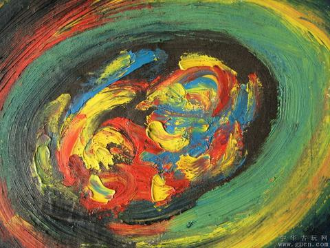  

    
    
    PrismaHelper.show_array_ipython(tp.fit_guide_img(abu1_file, gd_path, resize=True, iter_n=1800))

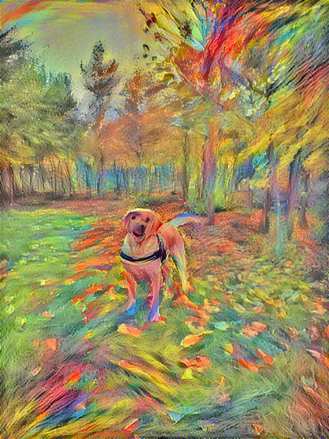  

如上所示经过几个小时1800次迭代完整了这幅画，我们下面看看每100次迭代的对比图，首先如下代码所示，对每100次迭代的保存的图形进行排序

    
    
    k5_list = glob.glob("../sample/batch_tensor/k5*.jpeg")
    k5_ind = map(lambda fn: int(fn.rsplit('.')[2].rsplit('_')[-1]), k5_list)
    k5_sorted = sorted(zip(k5_ind, k5_list))
    k5_sorted
    
    
    [(100, '../sample/batch_tensor/k51051051372_100.jpeg'),
     (200, '../sample/batch_tensor/k51051051372_200.jpeg'),
     (300, '../sample/batch_tensor/k51051051372_300.jpeg'),
     (400, '../sample/batch_tensor/k51051051372_400.jpeg'),
     (500, '../sample/batch_tensor/k51051051372_500.jpeg'),
     (600, '../sample/batch_tensor/k51051051372_600.jpeg'),
     (700, '../sample/batch_tensor/k51051051372_700.jpeg'),
     (800, '../sample/batch_tensor/k51051051372_800.jpeg'),
     (900, '../sample/batch_tensor/k51051051372_900.jpeg'),
     (1000, '../sample/batch_tensor/k51051051372_1000.jpeg'),
     (1100, '../sample/batch_tensor/k51051051372_1100.jpeg'),
     (1200, '../sample/batch_tensor/k51051051372_1200.jpeg'),
     (1300, '../sample/batch_tensor/k51051051372_1300.jpeg'),
     (1400, '../sample/batch_tensor/k51051051372_1400.jpeg'),
     (1500, '../sample/batch_tensor/k51051051372_1500.jpeg'),
     (1600, '../sample/batch_tensor/k51051051372_1600.jpeg'),
     (1700, '../sample/batch_tensor/k51051051372_1700.jpeg'),
     (1800, '../sample/batch_tensor/k51051051372_1800.jpeg')]

展示从第100次迭代结果到第1800次迭代结果的图像风格化的过程，特征的识别渲染由浅入深的一步一步增强，从edge，到shape。

    
    
    fig, axs = plt.subplots(nrows=3, ncols=6, figsize=(18, 9));
    axs_list = list(itertools.chain.from_iterable(axs))
    for ind, ax in zip(range(3 * 6), axs_list):
        iter_cnt, iter_fn = k5_sorted[ind]
        iter_img = plt.imread(iter_fn)
        ax.imshow(iter_img);
        ax.set_title("k5 iter: {}".format(iter_cnt))
        ax.set_axis_off()

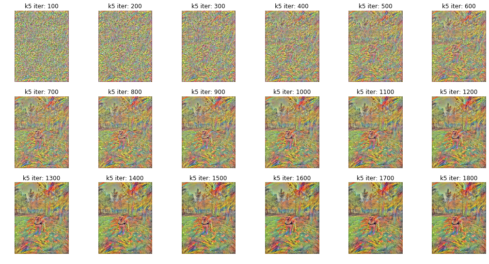  

TensorPrismaClass可以胜任风格画渲染的使命，但问题就是速度太慢了，而且你可以查看代码类函数_features_make它对特征的筛选是引导图只使用浅层特征K_GUIDE_LAYERS = ('relu1_1', 'relu2_1', 'relu3_1', 'relu4_1',
'relu5_1')，原始图像使用K_ORG_LAYER = 'relu4_2'这样很明显无法作出一幅主题非常突出鲜明的图像，所以感觉这种方式比较定向适合特定类型的图像，普遍适应存在很大的问题

2.2 预处理图像和事后处理图像

下面换一个库日天试试（话说今天勇士赢了，好高兴😀）

    
    
    kl_file = '../sample/kl.jpg'
    kl_img = np.float32(tp.resize_img(PIL.Image.open(kl_file)))
    PrismaHelper.show_array_ipython(kl_img)
    cx6_file = '../prisma_gd/cx6.jpg'
    cx6_img = np.float32(tp.resize_img(PIL.Image.open(cx6_file)))
    PrismaHelper.show_array_ipython(cx6_img)

  

  

    
    
    tn_img = tp.fit_guide_img(kl_file, cx6_file, resize=True, iter_n=3500)
    PrismaHelper.show_array_ipython(tn_img)

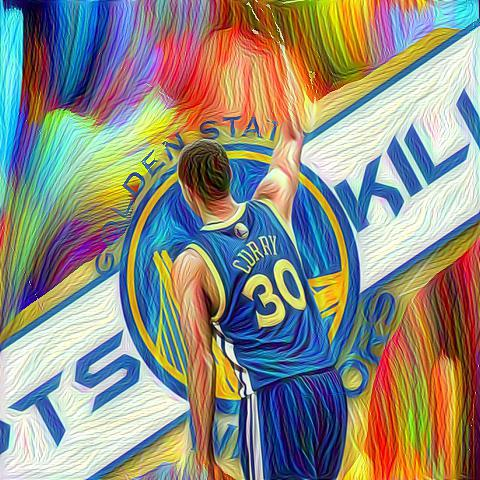  

[风格图像展示墙中地址](http://www.yabeetu.com/design/L3N0YXRpYy90ZW1wLzE0ODA4NTc5MTcuMzcwLjcxOTAyMDMwOTMyOC8uL2N2dC5qcGc=)

如上代码所示提高迭代次数到3500次，减小K_RNLEAING_RATE值，不断调整K_TV_WEIGHT，K_ORG_WEIGHT，K_GUIDE_WEIGHT训练了好长时间才得到了上面的风格照片，但是下一章介绍的prisma方式，只需要秒级就能做出这样的效果，甚至更好。

如果迭代次数不足的话，毕竟这种方式太耗时了，我们有什么办法呢，最简单的方式整体提高rgb值，如下

    
    
    ##整体提高rgb值
    tnn_br = tn_img * 1.3
    PrismaHelper.show_array_ipython(tnn_br)

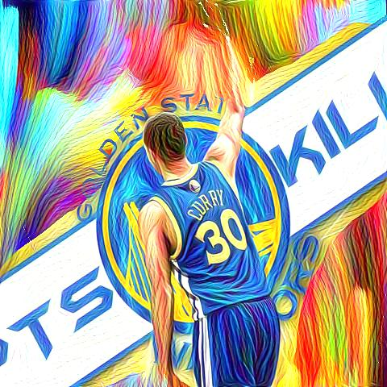  

更通用有效的方式，使用base中封装好的pil对图像的预置处理函数，进行事后图像处理，如下所示

    
    
    ft = PIL.Image.fromarray(np.uint8(tn_img))
    ##使用base中封装好的pil对图像的预置处理函数，进行事后图像处理
    ft = tp.handle_enhance(ft, 'Contrast')
    ft

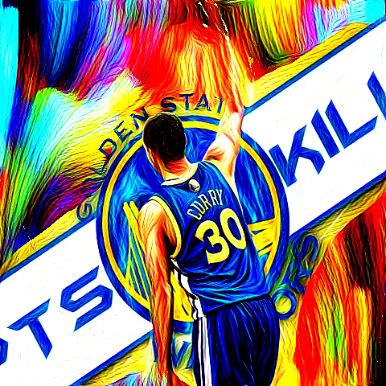  

    
    
    ##也可以在变换的基础上再次使用CaffePrismaClass
    img_np = np.float32(ft)
    d_img = cp.fit_img('', resize=True, nbk='conv2/3x3', iter_n=10, img_np=img_np)
    PrismaHelper.show_array_ipython(np.float32(d_img))

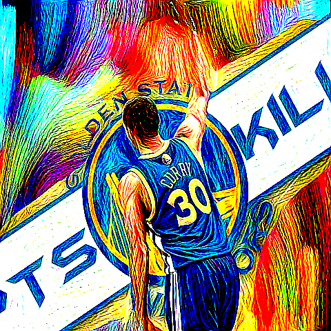  

当然上面的方式，更优的写完是写一个pipeline clss在流水线中定义你的操作组合方式，一步完成所需所有代码的组合，并且缓存流水线中每一步操作的图像结果，等流水线中全部的操作完成后，再去缓存文件夹中去寻找你最满意的图像，github上的代码暂时没有实现，等日后完善

2.3 一个有意思的实验

如果我用prisma做出一个图像，然后我用它作为特征图像去引导新的图像生成会有什么效果呢

    
    
    guide = np.float32(tp.resize_img(PIL.Image.open('../prisma_gd/106480401.jpg')))
    PrismaHelper.show_array_ipython(guide)

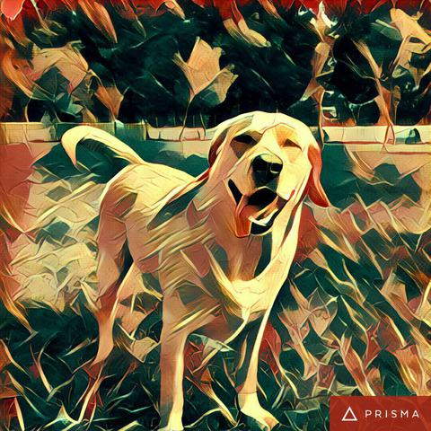  

如下所示，有些特征还是挖掘到了，哈哈

    
    
    PrismaHelper.show_array_ipython(tp.fit_guide_img(s_file, gd_path, resize=True, size=640, iter_n=1500))

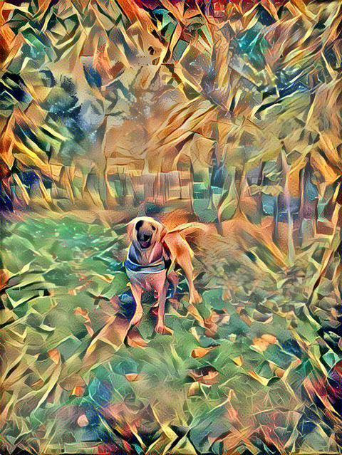  

2.4 批量转换风格画接口的使用

批量风格画图片可以使用PrismaTensor.fit_parallel_img，如下所示

    
    
    def do_fit_parallel_img(path_product, resize, size, enhance, iter_n):
        global g_doing_parallel
        """
            要在每个进程设置模块全局变量
        """
        g_doing_parallel = True
        img_path = path_product[0]
        gd_path = path_product[1]
        prisma_img = TensorPrismaClass().fit_guide_img(img_path, gd_path, resize=resize, size=size, enhance=enhance,
                                                       iter_n=iter_n)
        g_doing_parallel = False
        return path_product, prisma_img
    def fit_parallel_img(img_path, gd_path, resize=False, size=480, enhance=None, iter_n=800, n_jobs=-1):
        if not isinstance(img_path, list) or not isinstance(gd_path, list):
            raise TypeError('img_path or gd_path must list for mul process handle!')
        parallel = Parallel(
            n_jobs=n_jobs, verbose=0, pre_dispatch='2*n_jobs')
        out = parallel(delayed(do_fit_parallel_img)(path_product, resize, size, enhance, iter_n) for path_product in
                       product(img_path, gd_path))
        return out

这里使用了sklearn.externals.joblib中的Parallel做并行处理，但是实际上由于tensorflow的底层的并行效率极高，所以实际并行提速是很有限的，  
itertools.product计算输入图像路径和特征引导图像路径的笛卡尔积

这种方式的实现的prisma的优点就是在迭代足够多的次数引导风格可以极大的渲染作用于原始输入图像上，缺点就是速度非常慢，基本单位是以小时计算的。

针对这种实现方法还有类似的开源项目可以参考[Neural-Style-Transfer](https://github.com/titu1994/Neural-Style-Transfer)它使用keras框架，BFGS计算梯度loss function最小值，这样限制了输入图像必须是必须是正方形，这里我没有再次封装，因为它的耗时单位也是无法忍受的在使用cpu的情况下，也许gpu会好点，其实也就没有实际的意义，真正的prisma肯定不是使用这些方法去实现的，下一章节开始我讲使用自己的方式实现快速prisma，在渲染效果和速度上都优于以上解决方案

如果您不想太麻烦搭建风格画的平台，可以把需要处理的图像照片发给我，特别是您家里的狗狗，猫，或者小孩子的照片（如果您家有雄性的拉不拉多且在适合交配的年龄，可以和我保持长久联系，我为我家阿布征婚，父母包办🎎）

另外针对caffe及tensorflow的一些使用问题可以查看我的其它两篇文章:  
[打开股票量化的黑箱(自己动手写一个印钞机) 第三章](http://www.jianshu.com/p/056d8b28f581)  
[ 或者关注 股票量化专题](http://www.jianshu.com/collection/0a774f78050a)  
[爬取百度图片各种狗狗的图片，使用caffe训练模型分类](http://www.jianshu.com/p/6942241d4ad9)  
[ 或者关注 机器学习专题](http://www.jianshu.com/collection/7c9da6c79a89)

**更多关于深度学习理论及实例请关注我将出版的一本关于深度学习方面的书籍**

####
原文出处：<a href='http://www.jianshu.com/p/2bd096179dd8' target='blank'>用机器学习做个艺术画家-Prisma(中)</a>

##用机器学习做个艺术画家-Prisma(中)

上一章使用的两种方式实现prisma，都存在问题，这章要使用的方式是我自己原创的方法，我实际上并不知道prisma到底使用了什么方式使图像效果又好，速度又快，但是大概猜测的方向也就这几种可能：

  1. 大量的多cpu，gpu的机器（绝对不现实，成本根本无法控制）
  2. 优化算法，优化网络框架（就算是这样，我没能力在这方面优化🙈）
  3. 拥有很大的图像数据库，可以很快的检索出与输入图像相似度最高的图像，之后相似特征提取权重渲染（我没资源，而且这种方式的瓶颈在检索和相似度计算上也很消耗资源，只是一种可能）
  4. 针对图像部分使用机器学习算法特征层放大，部分使用一些图像处理技术，提升渲染速度

我下面讲的内容是针对第四点展开试验的，可以在速度及渲染效果上都能达到比较满意的效果，因为速度上可以忽略，效果还挺好，唯一的缺陷就是在适用性上可能会需要调整一下参数（在适用性上可以结合上述第三种方式，针对一定数量的样本作为训练集x，对应的y是效果参数，对输入进行分类，再配合使用相似度等提高自动适配的能力）

如下地址为git上项目的最终演示使用视频，使用本章介绍的技术实现，可以先有个直观感受  
[youku 阿布Prisma演示视频](http://v.youku.com/v_show/id_XMTg0MDE3NTM3Mg==.html)  
[更多风格图像展示墙](http://www.yabeetu.com/)  
[项目git地址](https://github.com/bbfamily/prisma_abu)

####1 主要实现思路分解讲解

我还是使用abu1这张图片作为输入

    
    
    from __future__ import division
    import matplotlib.pylab as plt
    %matplotlib inline
    import os
    from PrismaCaffe import CaffePrismaClass
    import PrismaHelper
    import glob
    import numpy as np
    import PIL.Image
    import ZCommonUtil
    import itertools
    from functools import partial
    abu1_file = '../sample/abu1.jpg'
    cp  = CaffePrismaClass(dog_mode=False)
    PrismaHelper.show_array_ipython(np.float32(cp.resize_img(PIL.Image.open(abu1_file))))

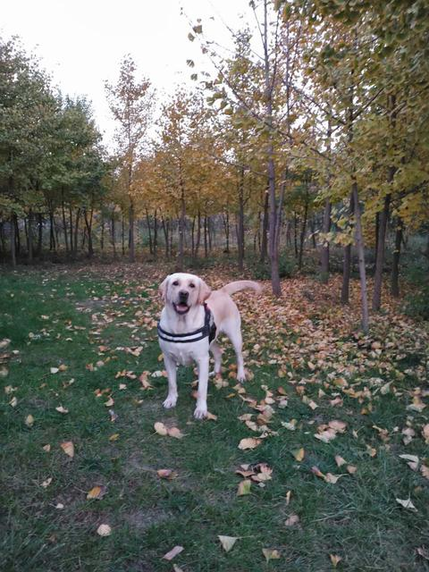  

然后挑一张引导特征图像

    
    
    gd_path = '../prisma_gd/tooopen_sy_127260228921.jpg'
    guide_img = np.float32(cp.resize_img(PIL.Image.open(gd_path), base_width=480, keep_size=False))
    PrismaHelper.show_array_ipython(guide_img)

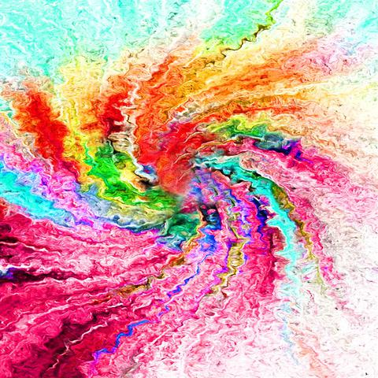  

导入一些相关图像处理的基础包

    
    
    from skimage import filters
    from skimage import segmentation
    from skimage.feature import corner_harris, corner_subpix, corner_peaks
    from scipy.signal import convolve2d
    from scipy import ndimage
    from scipy import misc

如下图所示，首先将图像转化为单通道，用otsu寻找mask, 通过mask确定border和edges

备注：  
otsu(大津算法, 自适应阈值)

  * [关于skimage otsu等使用请参考](http://scikit-image.org/)
  * [关于scipy ndimage等使用请参考](https://docs.scipy.org)
    
    
	    r_img = cp.resize_img(PIL.Image.open(abu1_file), base_width=480, keep_size=False)
		# rgb转化为单通道灰阶图像
		l_img = np.float32(r_img.convert('L'))
		# filters.threshold_otsu需要－1， 1之间
		l_img = np.float32(l_img / 255) 
		r_img = np.float32(r_img)
		
		# 找出大于otsu的阀值作为mask，需找border
		mask = l_img > filters.threshold_otsu(l_img)
		# 不是适用所有图像都要clear border，比如图像主题大部分是需要保留就不需要
		clean_border = segmentation.clear_border(mask).astype(np.int)
		coins_edges = segmentation.mark_boundaries(l_img, clean_border)
		# 将值再次转换到0-255
		clean_border_img = np.float32(clean_border * 255)
		clean_border_img = np.uint8(np.clip(clean_border_img, 0, 255))
		
		PrismaHelper.show_array_ipython(clean_border_img)

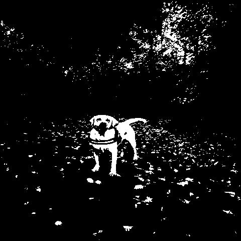  

目标就是只想摘取阿布的图像，其它的都认为是噪音，可以使用如下ndimage.binary_opening达到效果吗，试试看

    
    
    clean_border_img = ndimage.binary_opening(np.float32(clean_border_img / 255), structure=np.ones((5,5))).astype(np.int)
    clean_border_img = ndimage.binary_opening(clean_border_img).astype(np.int)
    PrismaHelper.show_array_ipython(clean_border_img * 255)

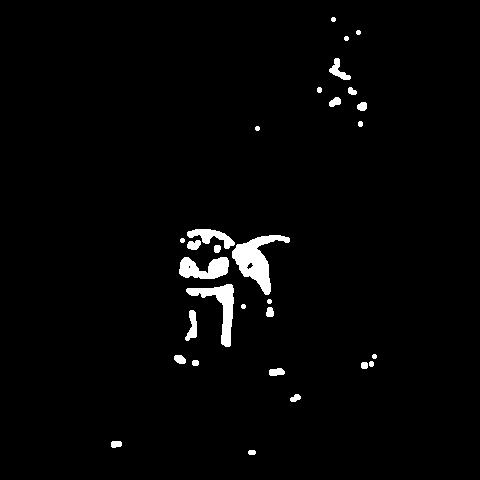  

效果其实不太好，ndimage.binary_opening效果与cnn中的最小池化层相似，目的就是remove small object，我们下面通过自定义简单卷积核来过滤，实现我们的需求，代码如下

    
    
    ##最小的卷积核目的是保留大体图像结构
    n= 5
    small_window = np.ones((n, n))
    small_window /= np.sum(small_window)
    clean_border_small = convolve2d(clean_border_img, small_window, mode="same", boundary="fill")
    ##中号的卷积核是为了保留图像的内嵌部分，这里的作用就是阿布的黑鼻子和嘴那部分，如果没有这层，就无法保留
    n= 25
    median_window = np.ones((n, n))
    median_window /= np.sum(median_window)
    clean_border_convd_median = convolve2d(clean_border_img, median_window, mode="same", boundary="fill")
    ##最大号的卷积核，只是为了去除散落的边缘，很多时候没有必要，影响速度和效果
    n= 180
    big_window = np.ones((n, n))
    big_window /= np.sum(big_window)
    clean_border_convd_big = convolve2d(clean_border_img, big_window, mode="same", boundary="fill")
    l_imgs = []
    for d in range(3):
        ##分别对rgb三个通道进行滤波
        rd_img = r_img[:,:,d]
        gd_img = guide_img[:,:,d]
        ##符合保留条件的使用原始图像，否则使用特征图像
        d_img = np.where(np.logical_or(clean_border_convd_median > 5 * clean_border_convd_big.mean(), 
                np.logical_and(clean_border_small > 0, clean_border_convd_big > 2 * clean_border_convd_big.mean())), 
                rd_img, gd_img)
        l_imgs.append(d_img)
    img_cvt = np.stack(l_imgs, axis=2).astype("uint8")
    ##对转换出的图像进行一次简单浅层特征放大
    d_img = cp.fit_img(nbk='conv2/3x3_reduce', iter_n=10, img_np=img_cvt)
    PrismaHelper.show_array_ipython(np.float32(d_img))

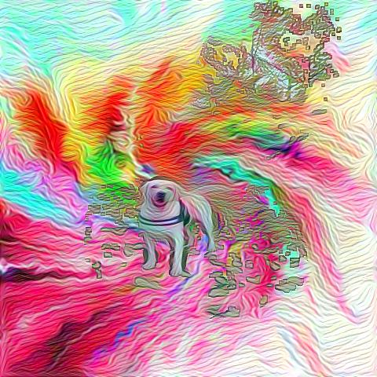  

[风格图像展示墙中地址](http://www.yabeetu.com/design/L3N0YXRpYy90ZW1wLzE0ODA4NTczNDkuNzYwLjQzNzcwNTI4MTgwMy8uL2N2dC5qcGc=)

代码并不多，主要思路如下：

  1. 通过filters.threshold_otsu找出图像的mask
  2. segmentation.clear_border(mask)抽取图像border, edges
  3. 使用三个卷积核对图像进行滤波处理，这里的三个卷积核的分工请看上面代码注释，这里的滤波是就是引导特征和原始图像的权重分配

卷积的意义简单理解就是**加权叠加**, 针对输入的单位相应得到输出，为什么要用卷积呢，其实就是为了效率，如果上面的代码你从目的出发，知道要滤除什么样的像素
点，保留什么样的像素点，使用for循环针对每一个像素点，计算像素点一定范围内（上面说的核大小）使用for循环一步一步的前进，你其实也能得出结果，但是运算的时间复杂度将大出几个数量级，这就类似很多最优问题你可以使用蒙特卡洛方法求最优解，但是由于计算量太大，实际上无法做到遍历所有路径，所以才会使用凸优化等数学方式求最优解，并且很多时候也是先求个大概的全局最优，然后在这个全局最优的基础上求解局部最优解。

另外针对caffe及tensorflow的一些使用问题可以查看我的其它两篇文章:  
[打开股票量化的黑箱(自己动手写一个印钞机) 第三章](http://www.jianshu.com/p/056d8b28f581)  
[ 或者关注 股票量化专题](http://www.jianshu.com/collection/0a774f78050a)  
[爬取百度图片各种狗狗的图片，使用caffe训练模型分类](http://www.jianshu.com/p/6942241d4ad9)  
[ 或者关注 机器学习专题](http://www.jianshu.com/collection/7c9da6c79a89)

**更多关于深度学习理论及实例请关注我将出版的一本关于深度学习方面的书籍**

####2. 使用图像特征作为mask

上面的方法使用otsu寻找图像边缘作为mask的依据，下面我使用skimage中的corner_peaks抽取**图像特征**作为mask

    
    
    def show_features(gd_file):
        r_img = cp.resize_img(PIL.Image.open(gd_file), base_width=480, keep_size=False)
        l_img = np.float32(r_img.convert('L'))
        ll_img = np.float32(l_img / 255)
        coords = corner_peaks(corner_harris(ll_img), min_distance=5)
        coords_subpix = corner_subpix(ll_img, coords, window_size=25)
        plt.figure(figsize=(8, 8))
        plt.imshow(r_img, interpolation='nearest')
        plt.plot(coords_subpix[:, 1], coords_subpix[:, 0], '+r', markersize=15, mew=5)
        plt.plot(coords[:, 1], coords[:, 0], '.b', markersize=7)
        plt.axis('off')
        plt.show()
    def find_features(gd_file=None, r_img=None, l_img=None, loop_factor=1, show=False):
        if gd_file is not None:
            r_img = cp.resize_img(PIL.Image.open(gd_file), base_width=480, keep_size=False)
            l_img = np.float32(r_img.convert('L'))
            l_img = np.float32(l_img / 255)
        coords = corner_peaks(corner_harris(l_img), min_distance=5)
        coords_subpix = corner_subpix(l_img, coords, window_size=25)
        r_img_copy = np.zeros_like(l_img)
        rd_img = np.float32(r_img)
        r_img_copy[coords[:, 0], coords[:, 1]] = 1
        f_loop = int(rd_img.shape[1]/10 * loop_factor)
        for _ in np.arange(0, f_loop):
            """
                放大特征点，使用loop_factor来控制特征放大倍数
            """
            r_img_copy = ndimage.binary_dilation(r_img_copy).astype(r_img_copy.dtype)
        r_img_copy_ret = r_img_copy * 255
        if show:
            r_img_copy_d = [rd_img[:,:,d] * r_img_copy for d in range(3)]
            r_img_copy = np.stack(r_img_copy_d, axis=2)
            PrismaHelper.show_array_ipython(r_img_copy) 
        return r_img_copy_ret

如下显示的图抽取出图像特征点

    
    
    show_features('../prisma_gd/71758PICxSa_1024.jpg')

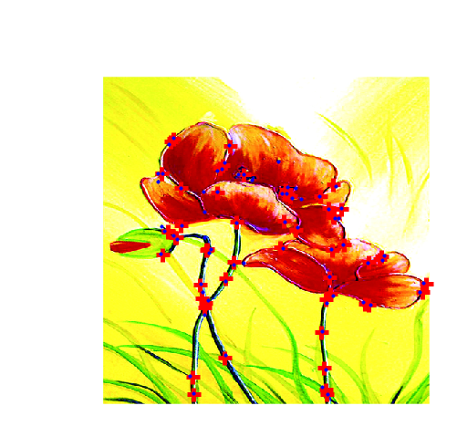  

find_features使用ndimage.binary_dilation来**放大**特征点，使用loop_factor来控制特征放大倍数，目的是结合引导特征做渲染时提升原始图像的特征权重，如下所示find_features提取后的结果

    
    
    _ = find_features('../prisma_gd/71758PICxSa_1024.jpg', loop_factor=1, show=True)

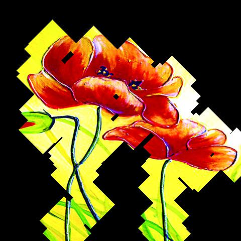  

下面用ipython notebook的可交互形式更直观的看一下特征的抽取与放大

    
    
    from ipywidgets import interact
    def find_features_interact(gd_file, loop_factor):
        r_img = cp.resize_img(PIL.Image.open(gd_file), base_width=480, keep_size=False)
        l_img = np.float32(r_img.convert('L'))
        l_img = np.float32(l_img / 255)
        coords = corner_peaks(corner_harris(l_img), min_distance=5)
        coords_subpix = corner_subpix(l_img, coords, window_size=25)
        r_img_copy = np.zeros_like(l_img)
        rd_img = np.float32(r_img)
        r_img_copy[coords[:, 0], coords[:, 1]] = 1
        f_loop = int(rd_img.shape[1]/10 * loop_factor)
        for _ in np.arange(0, f_loop):
            """
                放大特征点，使用loop_factor来控制特征放大倍数
            """
            r_img_copy = ndimage.binary_dilation(r_img_copy).astype(r_img_copy.dtype)
        r_img_copy_ret = r_img_copy * 255
        r_img_copy_d = [rd_img[:,:,d] * r_img_copy for d in range(3)]
        r_img_copy = np.stack(r_img_copy_d, axis=2)
        PrismaHelper.show_array_ipython(r_img_copy) 
    gd_file = ('../prisma_gd/71758PICxSa_1024.jpg', '../prisma_gd/st.jpg', '../prisma_gd/g1.jpg', '../prisma_gd/31K58PICSuH.jpg')
    loop_factor = (0, 2, 0.1)
    interact(find_features_interact, gd_file=gd_file, loop_factor=loop_factor)

如果不是使用ipython notebook版本的可以下载gif看效果
[下载地址](https://github.com/bbfamily/monitor_parallel/blob/master/ft.gif)

####3\. 使用统计参数期望与标准差寻找mask

mask的抽取方法可以有很多种方式，比如我下面这股票量化统计中经常使用的均值回复分析，使用图像的均值和标准差来做滤波器，提取图像的mask  
下图是股票量化中均值回复策略图，对股票量化感兴趣的可以看我之前的文章[打开股票量化的黑箱](http://www.jianshu.com/p/4ba3a10ea9e5)

下面我们重构一下代码，分别使用三种滤波图像的方式生成mask查看效果

  1. def do_otsu(r_img, l_img, cb)(最开始介绍的方式的代码封装)
  2. def do_features(r_img, l_img, cb, loop_factor=1.0)(上面介绍的那种抽取图像点集特征放大的方式)
  3. def do_stdmean(r_img, l_img, cb, std_factor=1.0): (均值标准差统计方式抽取mask)

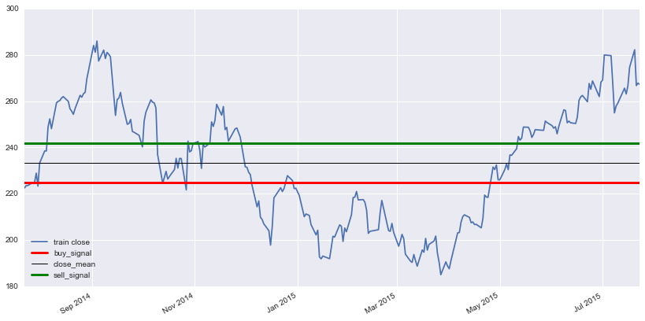  

output_23_0.png

####4\. 使用多种方式prisma图像

    
    
    def do_otsu(r_img, l_img, cb, dd=True):
        mask = l_img > filters.threshold_otsu(l_img) if dd else l_img < filters.threshold_otsu(l_img)
        clean_border = mask
        if cb:
            clean_border = segmentation.clear_border(mask).astype(np.int)
        clean_border_img = np.float32(clean_border * 255)
        clean_border_img = np.uint8(np.clip(clean_border_img, 0, 255))
        return clean_border_img
    def do_features(r_img, l_img, cb, loop_factor=1.0):
        mask = find_features(r_img=r_img, l_img=l_img, loop_factor=loop_factor)
        clean_border = mask
        if cb:
            clean_border = segmentation.clear_border(mask).astype(np.int)
        clean_border_img = np.float32(clean_border * 255)
        clean_border_img = np.uint8(np.clip(clean_border_img, 0, 255))
        return clean_border_img
    """
        可以结合上面股票的图感受一下图像滤波的部分
    """
    def do_stdmean(r_img, l_img, cb, std_factor=1.0):
        mean_img = l_img.mean()
        std_img = l_img.std()
        mask1 = l_img > mean_img + (std_img * std_factor)
        mask2 = l_img < mean_img - (std_img * std_factor)
        clean_border = mask1
        if cb:
            clean_border = segmentation.clear_border(mask1).astype(np.int)
        clean_border_img1 = np.float32(clean_border * 255)
        clean_border_img1 = np.uint8(np.clip(clean_border_img1, 0, 255))
        clean_border = mask2
        if cb:
            clean_border = segmentation.clear_border(mask2).astype(np.int)
        clean_border_img2 = np.float32(clean_border * 255)
        clean_border_img2 = np.uint8(np.clip(clean_border_img2, 0, 255))
        ##上下两部分组合
        clean_border_img = clean_border_img1 + clean_border_img2
        clean_border_img = np.uint8(np.clip(clean_border_img, 0, 255))
        return clean_border_img
    """
        将多个mask func组合与的形式，组合mask滤波器
        exp: tgt_mask_func = partial(together_mask_func, func_list=[do_otsu, mask_stdmean_func, mask_features_func])
    """
    def together_mask_func(r_img, l_img, cb, func_list):
        clean_border_img = None
        for func in func_list:
            if not callable(func):
                raise TypeError("together_mask_func must a func!!!")
            border_img = func(r_img, l_img, cb)
            if clean_border_img is None:
                clean_border_img = border_img
            else:
                clean_border_img = clean_border_img + border_img
        clean_border_img = np.uint8(np.clip(clean_border_img, 0, 255))
        return clean_border_img
    """
        使用partial统一mask函数接口形式
    """
    mask_stdmean_func = partial(do_stdmean, std_factor=1.0)
    mask_features_func = partial(do_features, loop_factor=0.88)
    def do_convd_filter(n1, n2, n3, rb_rate, r_img, guide_img, clean_border_img, convd_median_factor, convd_big_factor):
        n= n1
        small_window = np.ones((n, n))
        small_window /= np.sum(small_window)
        clean_border_small = convolve2d(clean_border_img, small_window, mode="same", boundary="fill")
        n= n2
        median_window = np.ones((n, n))
        median_window /= np.sum(median_window)
        clean_border_convd_median = convolve2d(clean_border_img, median_window, mode="same", boundary="fill")
        n= n3
        big_window = np.ones((n, n))
        big_window /= np.sum(big_window)
        clean_border_convd_big = convolve2d(clean_border_img, big_window, mode="same", boundary="fill")
        l_imgs = []
        for d in range(3):
            """
                针对rgb各个通道处理
            """
            rd_img = r_img[:,:,d]
            gd_img = guide_img[:,:,d]
            wn = []
            for _ in np.arange(0, rd_img.shape[1]):
                """
                    二项式概率分布
                """
                wn.append(np.random.binomial(1, rb_rate, rd_img.shape[0]))
            if rb_rate <> 1:
                """
                    针对rgb通道阶梯下降二项式概率
                """
                rb_rate = rb_rate - 0.1
            w = np.stack(wn, axis=1)
            d_img = np.where(np.logical_or(
                             np.logical_and(clean_border_convd_median > convd_median_factor * clean_border_convd_big.mean(), w == 1),
                             np.logical_and(np.logical_and(clean_border_small > 0, w == 1), 
                                            clean_border_convd_big > convd_big_factor * clean_border_convd_big.mean(), 
                                            )), 
                             rd_img, gd_img)
            l_imgs.append(d_img)
        img_cvt = np.stack(l_imgs, axis=2).astype("uint8")
        return img_cvt
    def mix_mask_with_convd(do_mask_func, org_file=None, gd_file=None, nbk=None, enhance=None, n1=5, n2=38, n3=1, 
                            convd_median_factor=5.0, convd_big_factor=0.0, cb=False, 
                            rb_rate=1, r_img=None, guide_img=None, all_mask=False, show=False):
        if r_img is None:
            r_img = cp.resize_img(PIL.Image.open(org_file), base_width=480, keep_size=False)
        l_img = np.float32(r_img.convert('L'))
        l_img = np.float32(l_img / 255) 
        r_img = np.float32(r_img)
        if show:
            PrismaHelper.show_array_ipython(np.float32(r_img))
        if not callable(do_mask_func):
            raise TypeError('mix_mask_with_convd must do_mask_func a func')
        clean_border_img = np.ones_like(l_img) * 255 if all_mask else do_mask_func(r_img=r_img, l_img=l_img, cb=cb)
        if show:
            PrismaHelper.show_array_ipython(np.float32(clean_border_img))
        if guide_img is None:
            if gd_file is not None:
                guide_img = np.float32(cp.resize_img(PIL.Image.open(gd_file), base_width=480, keep_size=False))
            else:
                guide_img = np.zeros_like(r_img)
        img_cvt = do_convd_filter(n1, n2, n3, rb_rate, r_img, guide_img, clean_border_img, 
                                  convd_median_factor=convd_median_factor, convd_big_factor=convd_big_factor)
        if nbk is not None:
            img_cvt = cp.fit_img(org_file, nbk=nbk, iter_n=10, enhance=enhance, img_np=img_cvt)
        if show:
            PrismaHelper.show_array_ipython(np.float32(img_cvt))
        return img_cvt

如下使用特征do_features mask方式，注意rb_rate=0.66的使用，这里使用它目的是使**特征边缘平滑过渡**到引导特征中,

当然这里还可以有各种优化方式，比如向下调整convd_median_factor使原始特征边缘提取更加圆润平滑

    
    
    _ = mix_mask_with_convd(partial(do_features, loop_factor=1.1), '../prisma_gd/71758PICxSa_1024.jpg', 
                            '../prisma_gd/cx6.jpg', 'conv2/3x3_reduce', rb_rate=0.66, show=True)

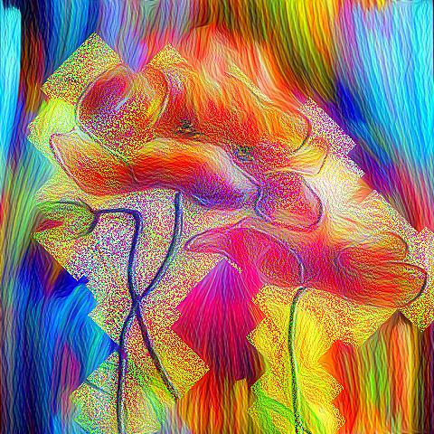  

[风格图像展示墙中地址](http://www.yabeetu.com/design/L3N0YXRpYy90ZW1wLzE0ODA4NTc1MzIuMjgwLjc4NjM3MzE1Njc1Mi8uL2N2dC5qcGc=)

如下库日天这张图使用均值回复mask方式可以对图片产生比较好的效果，使用其它两种效果均不佳，读者可自行测试

    
    
    _ = mix_mask_with_convd(mask_stdmean_func, '../sample/kl.jpg', '../prisma_gd/cx7.jpg', 'conv2/3x3_reduce', 
                            n2=88, convd_median_factor=0.1, rb_rate=1, show=True)

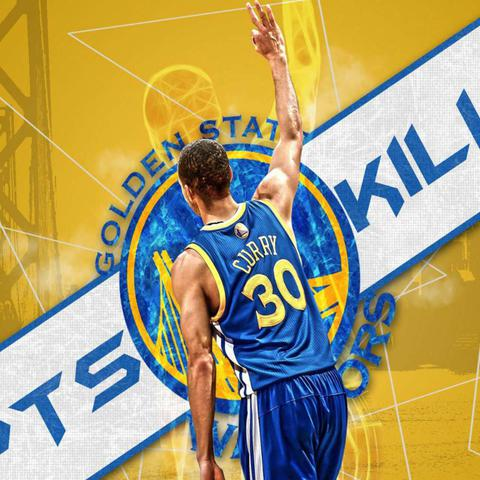  

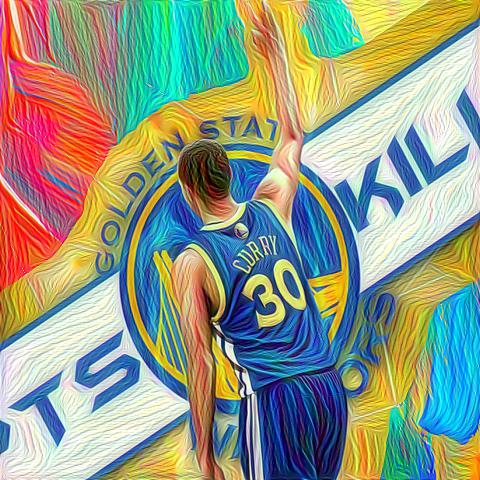  

[风格图像墙中地址](http://www.yabeetu.com/design/L3N0YXRpYy90ZW1wLzE0ODA4NTc5MTcuMzcwLjcxOTAyMDMwOTMyOC8uL2N2dC5qcGc=)

下面继续使用abu的照片作为示例（还是用abu的照片做效果心里比较高兴，如果您不想太麻烦搭建风格画的平台，可以把照片发给我，特别是**您家里的狗狗，猫，或者
小孩子的照片**）

使用abu2看看现在的方式的运行效率，%time计算一下耗时，请注意参数，n3=1，convd_median_factor=0.2,convd_big_factor=0.0  
也就是不使用最大的卷积核了，速度会非常快, 只用了5.62 s，而且这个速度还是做了一些其它工作，如显示原图等工作的情况下

    
    
    %time _ = mix_mask_with_convd(do_otsu, '../sample/abu2.jpg', '../prisma_gd/k5.jpg', 'conv2/3x3_reduce', n3=1, \
                            convd_median_factor=0.2, convd_big_factor=0.0, show=True)

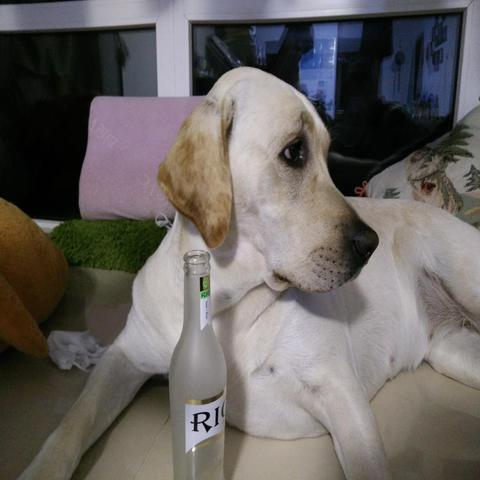  

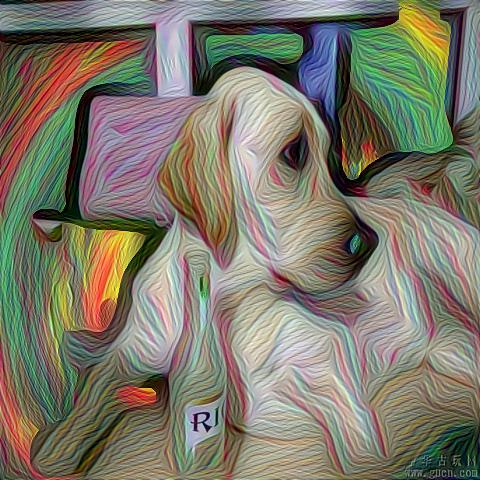  

    
    
    CPU times: user 5.62 s, sys: 99.4 ms, total: 5.71 s
    Wall time: 4.2 s

[风格图像墙中地址](http://www.yabeetu.com/design/L3N0YXRpYy90ZW1wLzE0ODA4NTczNTguNTYwLjE4NDk0MDA1MjM1NS8uL2N2dC5qcGc=)

abu5使用partial(together_mask_func, func_list=[do_otsu, mask_features_func]), 组合多个特征抽取mask函数，多个滤波函数以'与的关系'进行组合，对图像进行mask，这里如果不是用together_mask_func的话，单独每个都要再次调整一些参数，比如单独使用do_otsu，要调大n2核的大小，影响速度，mask函数合并特征完美快速实现了需求

    
    
    tgt_mask_func = partial(together_mask_func, func_list=[do_otsu, mask_features_func])
    _ = mix_mask_with_convd(tgt_mask_func, '../sample/abu3.jpg', '../prisma_gd/cx3.jpg', 'conv2/3x3_reduce', cb=False, 
                            n2=68, n3=1, convd_median_factor=1, convd_big_factor=0.0, show=True)

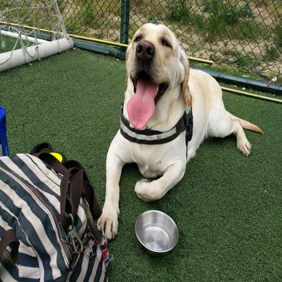  

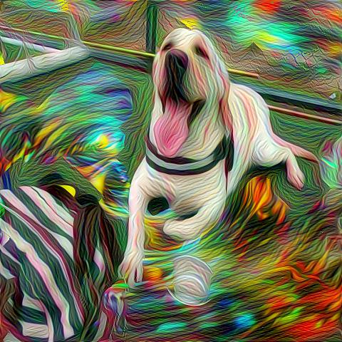  

[风格图像墙中地址](http://www.yabeetu.com/design/L3N0YXRpYy90ZW1wLzE0ODA4NTc0MTEuOTkwLjE3OTcyNjc4MjExMy8uL2N2dC5qcGc=)

####5. 配合使用预处理图像增强，随机rgb浅层edges等增强prisma效果

一生的偶像艾弗森，使用**图像预处理**的方式来做图，首先用Contrast看看，注意这里设置了参数rb_rate=0.88，看代码它的作用是

    
    
        wn = []
        for _ in np.arange(0, rd_img.shape[0]):
            wn.append(np.random.binomial(1, rb_rate, rd_img.shape[1]))
        if rb_rate <> 1:
            rb_rate = rb_rate - 0.1
        w = np.stack(wn, axis=1)
        d_img = np.where(np.logical_or(
                 np.logical_and(clean_border_convd_median > convd_median_factor * clean_border_convd_big.mean(), w == 1),
                 np.logical_and(np.logical_and(clean_border_small > 0, w == 1), 
                                clean_border_convd_big > convd_big_factor * clean_border_convd_big.mean(), 
                                )), 
                 rd_img, gd_img)

  * 逻辑和中np.logical_and添加w == 1的判断， 这里使用二项式分布，增强渲染的迷幻效果，即随机在rgb某一个通道中渲染一下引导特征
  * rb_rate = rb_rate - 0.1 的作用是3个通道的随机渲染概率阶梯下降, 这里也可以有其它各种渲染变种

再具体形象点举例这里的w二项式分布矩阵就类似下面这个示例矩阵所示，0.8的概率为1  

针对图像中每一个像素点

    
    
    wn = []
    for _ in np.arange(0, 20):
        wn.append(np.random.binomial(1, 0.8, 20))
    w = np.stack(wn, axis=1)
    w
    
    
    array([[1, 1, 1, 1, 1, 1, 1, 0, 1, 0, 1, 1, 1, 1, 1, 1, 1, 1, 1, 1],
           [1, 1, 1, 1, 1, 1, 0, 0, 1, 1, 0, 1, 1, 1, 0, 1, 1, 0, 0, 1],
           [1, 1, 1, 1, 1, 0, 0, 1, 1, 1, 1, 0, 1, 0, 1, 0, 1, 1, 1, 0],
           [1, 1, 1, 1, 1, 0, 0, 1, 0, 0, 1, 0, 1, 1, 1, 1, 1, 1, 0, 0],
           [1, 1, 1, 1, 1, 0, 1, 1, 1, 0, 1, 0, 1, 1, 1, 1, 1, 1, 1, 1],
           [1, 1, 1, 0, 1, 1, 1, 1, 1, 1, 1, 1, 1, 1, 1, 1, 1, 1, 1, 1],
           [1, 1, 1, 1, 1, 0, 0, 0, 1, 1, 1, 0, 1, 1, 1, 1, 1, 1, 1, 1],
           [0, 1, 1, 0, 1, 0, 1, 1, 1, 1, 1, 0, 1, 1, 1, 0, 0, 0, 1, 1],
           [1, 1, 1, 1, 1, 0, 1, 0, 0, 0, 1, 1, 1, 0, 0, 1, 1, 1, 0, 1],
           [1, 0, 1, 1, 1, 1, 1, 1, 0, 1, 1, 1, 1, 0, 0, 1, 1, 1, 1, 0],
           [1, 1, 1, 1, 1, 1, 0, 1, 1, 0, 0, 1, 1, 1, 0, 1, 1, 1, 0, 1],
           [0, 1, 0, 1, 1, 1, 1, 0, 1, 1, 0, 1, 1, 1, 1, 1, 1, 1, 0, 1],
           [1, 0, 1, 0, 0, 1, 1, 0, 1, 0, 1, 0, 1, 1, 1, 0, 1, 0, 1, 1],
           [1, 1, 0, 0, 1, 1, 0, 1, 1, 1, 1, 1, 1, 1, 1, 0, 1, 1, 1, 0],
           [1, 0, 0, 1, 1, 0, 1, 1, 1, 1, 0, 1, 0, 1, 1, 1, 1, 1, 1, 0],
           [1, 1, 1, 1, 1, 1, 0, 0, 1, 0, 1, 1, 1, 1, 1, 1, 1, 1, 0, 1],
           [1, 1, 1, 1, 1, 1, 0, 1, 1, 0, 1, 1, 1, 0, 0, 1, 1, 1, 1, 1],
           [1, 1, 0, 0, 0, 1, 1, 1, 1, 1, 1, 1, 1, 0, 1, 0, 1, 1, 1, 1],
           [0, 1, 1, 1, 1, 1, 0, 0, 1, 1, 1, 0, 1, 1, 1, 1, 0, 0, 1, 1],
           [1, 1, 1, 1, 0, 0, 1, 1, 0, 1, 1, 1, 1, 1, 1, 0, 1, 1, 1, 1]])
    
    
    tgt_mask_func = partial(together_mask_func, func_list=[do_otsu, mask_stdmean_func])
    _ = mix_mask_with_convd(tgt_mask_func, '../sample/lfs.jpg', '../prisma_gd/cx11.jpg', 
                            'conv2/norm2', enhance='Contrast', rb_rate=0.88, n2=180, n3=1,
                            convd_median_factor=0.01, convd_big_factor=0.0, show=True)

  

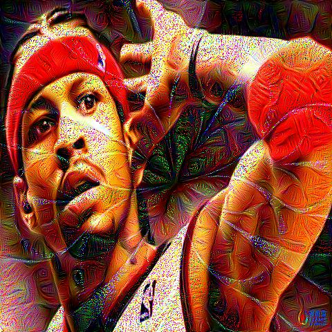  

[风格图像墙中地址](http://www.yabeetu.com/design/L3N0YXRpYy90ZW1wLzE0ODExMDQyNjkuNjAuNDE5NDg5NDYyNzQ2Ly4vY3Z0LmpwZw==)

感觉不是很帅，那怎么行，前置一个Sharpness预处理效果，看看

    
    
    _ = mix_mask_with_convd(do_otsu, '../sample/lfs.jpg', '../prisma_gd/cx11.jpg', 'conv2/norm2', 
                            enhance='Sharpness', rb_rate=0.88, cb=False, n2=188, n3=1,
                            convd_median_factor=0.01, convd_big_factor=0.0, show=True)

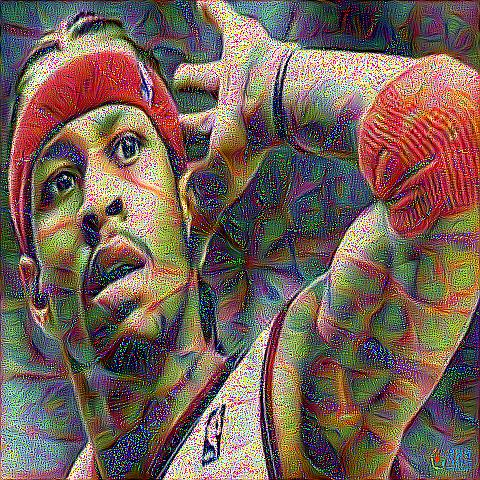  

[风格图像墙中地址](http://www.yabeetu.com/design/L3N0YXRpYy90ZW1wLzE0ODExMDQyNjkuNjAuNDE5NDg5NDYyNzQ2Ly4vY3Z0LmpwZw==)

上面两个作出的效果，仔细观察你会发现，其实他们并没有使用引导图的sharp特征，只是通过阶梯rgb渲染，在原始图像上泼上了一层浅层的edges特征，这样的话  

实际上你不需使用上面这种实现方式，注意mix_mask_with_convd的参数all_mask，当all_mask为True时，将整个图像的mask全设置255，代码如下：

    
    
    clean_border_img = np.ones_like(l_img) * 255 if all_mask else do_mask_func(r_img=r_img, l_img=l_img, cb=cb)

所以如果要使用浅层特征edges直接设置all_mask就ok

####6. 最终git上工程代码封装结构及使用示例

将上面的代码再次重构到文件PrismaWorker中, 代码详情请查阅PrismaWorker.py

    
    
    from PrismaWorker import PrismaWorkerClass
    
    
    pw = PrismaWorkerClass()

下面使用两个GTA5的图片，融合摩托车大哥到大部队中

如下为引导特征图

    
    
    pw.cp.resize_img(PIL.Image.open('../prisma_gd/gta2.jpg'), base_width=480, keep_size=False)

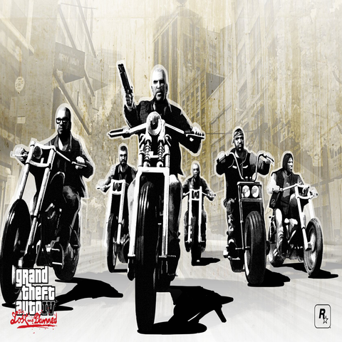  

注意partial(do_otsu, dd=False)中的dd参数代表otsu后取内部还是反向的外部，如下的黑白mask图，dd=False可以取到骑手，否则将取到外部背景

    
    
    _ = pw.mix_mask_with_convd(partial(pw.do_otsu, dd=False), '../sample/gta4.jpg', '../prisma_gd/gta2.jpg', 'conv2/3x3_reduce', 
                               enhance='Sharpness',  n2=88, n3=1, 
                               convd_median_factor=1.5, convd_big_factor=0.0, show=True)

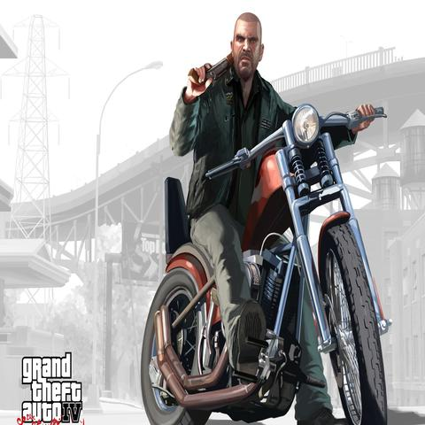  

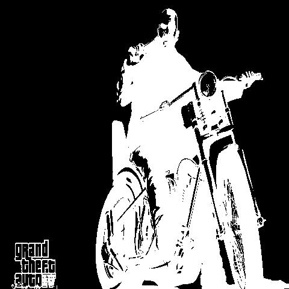  

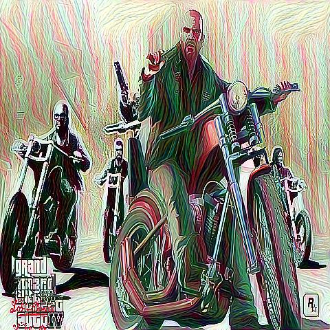  

[风格图像墙中地址](http://www.yabeetu.com/design/L3N0YXRpYy90ZW1wLzE0ODA4NTc4MzcuOTAuODU0NTA0NjMzNDM0Ly4vY3Z0LmpwZw==)

如上图所示，效果还算不错，除了左下脚两个标准的重叠

接下来使用批量处理引导图像，预处理，特征放大层等参数排列组合使用PrismaMaster，详情查询代码PrismaMaster.py

如下代码所示，可以生成所有参数排列组合的输出结果

    
    
    import PrismaMaster
    cb=False
    n1 = 5
    n2=38
    n3=1
    convd_median_factor=0.6
    convd_big_factor=0.0
    loop_factor = 1.0
    std_factor = 0.88
    nbk_list = filter(lambda nbk: nbk[-8:-1] <> '_split_', cp.net.blobs.keys()[1:-2])[:10]
    org_file_list = ['../sample/bz1.jpg']
    gd_file_list = [None, '../cx/cx3.jpg', '../cx/cx6.jpg', '../cx/cx7.jpg','../cx/cx10.jpg']
    enhance_list = [None, 'Sharpness', 'Contrast']
    rb_rate_list = [0.85, 1.0]
    save_dir = '../out/2016_11_24'
    PrismaMaster.product_prisma(org_file_list, gd_file_list, nbk_list, enhance_list, rb_rate_list, 'otsu_func',
                                n1, n2, n3, std_factor, loop_factor, convd_median_factor, 
                                convd_median_factor, cb, save_dir)

输出的图像可以从中选择喜欢的，不必一个个的试效果了

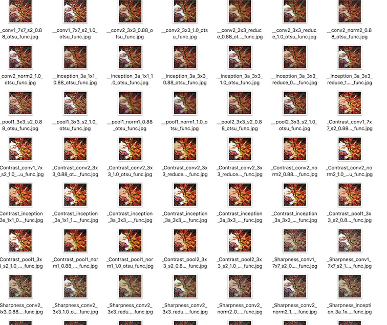  

接下来再做一个gui的可视化操作界面PrismaController, 使用了traitsui库，详情查看了PrismaController.py

具体使用方式请参看 [youku
阿布Prisma演示视频](http://v.youku.com/v_show/id_XMTg0MDE3NTM3Mg==.html)

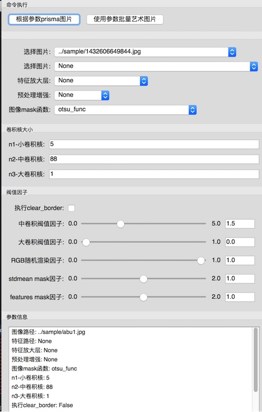  

基于这样一个方便微调的gui下可以很方便的对图像进行微调，非常容易的做出很多酷炫屌炸的图像，比如下面做的两张基于GTA风格的图像

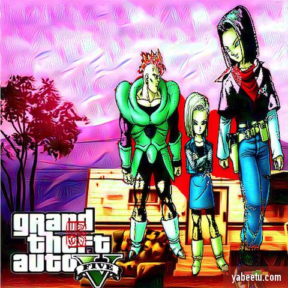  

[风格图像墙中地址](http://www.yabeetu.com/design/L3N0YXRpYy90ZW1wLzE0ODA4NTc4NDguMzQwLjYyNDU3OTQ1MTIyOS8uL2N2dC5qcGc=)

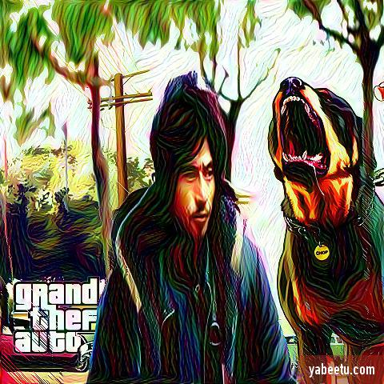  

[风格图像墙中地址](http://www.yabeetu.com/design/L3N0YXRpYy90ZW1wLzE0ODA4NTc4NjMuNjIwLjIzMTU5OTUwMDQ5Ny8uL2N2dC5qcGc=)

上面这张犀利哥和GTA5合体的原图和引导特征图如下

    
    
    fig, axs = plt.subplots(nrows=1, ncols=2, figsize=(20, 10));
    up_list = ['../sample/xlg.jpg', '../prisma_gd/gta1.jpg']
    for ind, ax in zip(range(1 * 2), axs):
        iter_fn = up_list[ind]
        iter_img = plt.imread(iter_fn)
        ##ax.set_title(os.path.basename(iter_fn))
        ax.imshow(iter_img);
        ax.set_axis_off()

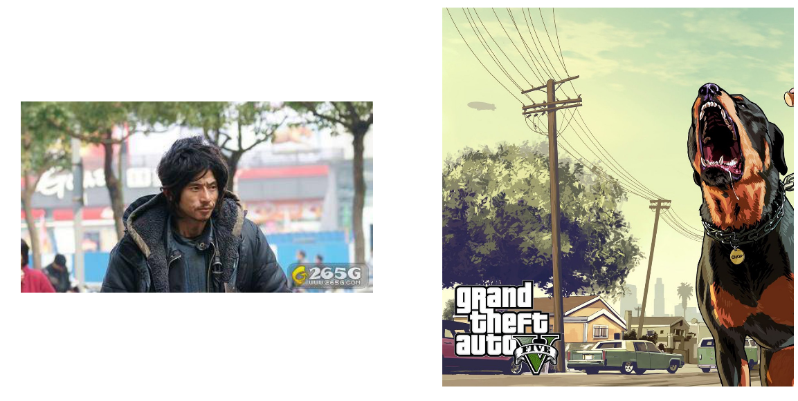  

如果你不知道什么样效果最好或者想要所有可能的效果图，你可以看到gui的界面上还有个按钮‘使用参数批量艺术图片’，它的作用是使用刚刚调整好的n1, n2, d
d......等等参数作为固定参数，引导特征图，放大层特征，预处理增强等等作为所有可能的排列组合，通过一键生成几百上千张的风格图像，代码详情查看了Prism
aController.py

    
    
    def _master_img_fired(self):
        nbk_list = ['conv2/3x3_reduce', 'conv2/3x3', 'conv2/norm2'] if g_use_min_batch_set else filter(
            lambda nbk: nbk[-8:-1] <> '_split_',
            self.prisma_worker.cp.net.blobs.keys()[1:-2])[:10]
        org_file_list = [self.org_file]
        gd_file_list = glob.glob('../prisma_gd/*.jpg')
        if g_use_min_batch_set:
            """
                小数据集只取 sm*.jpg
            """
            gd_file_list = filter(lambda fn: os.path.basename(fn).startswith('sm'), gd_file_list)
        ##gd_file_list.insert(0, None)
        enhance_list = [None, 'Sharpness', 'Contrast'] if g_use_min_batch_set else [None, 'Sharpness', 'Contrast', 'CONTOUR']
        rb_rate_list = [1.0] if g_use_min_batch_set else [0.88, 1.0]
        ##all_mask = self.all_mask
        all_mask = True
        save_dir = '../out/' + str(datetime.date.today())[:10]
        PrismaMaster.product_prisma(org_file_list, gd_file_list, nbk_list, enhance_list, rb_rate_list,
                                    self.mask_enum, self.n1_convd, self.n2_convd, self.n3_convd, self.dd,
                                    self.stdmean_func_factor, self.features_func_factor, self.convd_median_factor,
                                    self.convd_big_factor, self.cb, all_mask, save_dir)

搭建风格画的平台需要环境确实比较复杂，我也没有做一个pip安装工具，后期我看需求情况吧

如果您不想太麻烦搭建风格画的平台，可以把需要处理的图像照片发给我，特别是**您家里的狗狗，猫，或者小孩子的照片**，我会很开心的为他们制作艺术风格照片的

本章后记：

  1. 本文所讲的这种实现prisma的方式，不代表任何真实情况，只是一种可能的技术实现思路，并且在这种思路下还需要做很多的工作，比如针对适用性的问题也许要保存大量字典，字典的key可以是图像矩阵特征，value对应着处理参数，然后针对输入的图像进行分类或者特征相似度匹配来认定该使用那些参数等等复杂问题需要处理。

  2. 本文git上的代码并没有过多关心代码运行效率等问题，比如针对图像保存，读取scipy.misc比用PIL的实现方式效率要高很多，但为了代码可读性，这里选择使用PIL

####
原文出处：<a href='http://www.jianshu.com/p/e1629d69a66a' target='blank'>用机器学习做个艺术画家-Prisma(下)</a>

##用机器学习做个艺术画家-Prisma(下)
    
    
    from __future__ import division
    import matplotlib.pylab as plt
    import glob
    import os
    import itertools
    from PrismaWorker import PrismaWorkerClass
    import PrismaHelper
    import PIL.Image
    import numpy as np
    from scipy import ndimage
    from functools import partial
    %matplotlib inline

本章主要针对deepdream的特征识别增强替换做技术探讨，如果我们可以从引导图中发现图像特征，上一章已介绍了如何从图像中寻找特征，但是要想运用特征还需要做很多工作，比如从多个特征中寻找存在的对象，将这个特征融合到另一个图像中做特征融合，这里只做最初步的技术探讨，如果能将特征识别融合做到极致，就可以完成如下假想场景。

  1. 抬起头看到天边一朵云，看起来好像我家阿布呢，是不是可以替换一下呢
  2. 用手机拍下这朵云，将阿布的照片和云的照片发到云端进行特征识别融合
  3. 云端将融合好后的图像发回给用户

流程如下图所示：

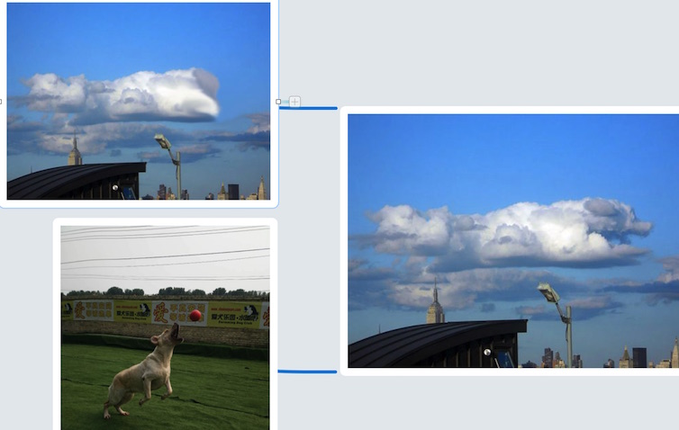  

再次发回给用户的图像类似如下所示：

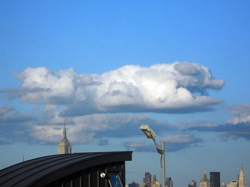  

如下地址为git上项目的最终演示使用视频，使用本章介绍的技术实现，可以先有个直观感受  
[youku 阿布Prisma演示视频](http://v.youku.com/v_show/id_XMTg0MDE3NTM3Mg==.html)  
[更多风格图像展示墙](http://www.yabeetu.com/)  
[项目git地址](https://github.com/bbfamily/prisma_abu)

  1. 基于caffe的google deepdream中的很多Concat层可以把训练好的模型中的很多sharp在输入的图像中进行识别并且融合特征，如inception_4c/output
    
         layer {
	       name: "inception_4c/output"
	       type: "Concat"
	       bottom: "inception_4c/1x1"
	       bottom: "inception_4c/3x3"
	       bottom: "inception_4c/5x5"
	       bottom: "inception_4c/pool_proj"
	       top: "inception_4c/output"
	     }

对inception_4c/1x1(ReLU), inception_4c/3x3(Convolution),
inception_4c/5x5(Convolution), inception_4c/pool_proj(Convolution) Concat

[详情网络配置](https://github.com/BVLC/caffe/blob/master/models/bvlc_googlenet/train_val.prototxt)

其实deepdream中把识别出的物体融合到有时我感觉挺可怕的地步，如下iter_n 10，30，100次的对比，话说对不住阿布了，变的这么丑，这特么是狼还是驴阿，头上长犄角身后长尾巴的，不知道有没有人想要我帮他做这种风的格图像呢，如果你需要这样的，也可以把照片发给我，不过你要想好，别吓着自己！

使用abu1.jpg, abu5.jpg作为示例图像，实例化一个PrismaWorkerClass

    
    
    abu1_fn = '../sample/abu1.jpg'
    abu5_fn = '../sample/abu5.jpg'
    pw = PrismaWorkerClass()
    
    
    d_img = pw.cp.fit_img(abu1_fn, resize=True, nbk='inception_4c/output', iter_n=10)
    PrismaHelper.show_array_ipython(np.float32(d_img))

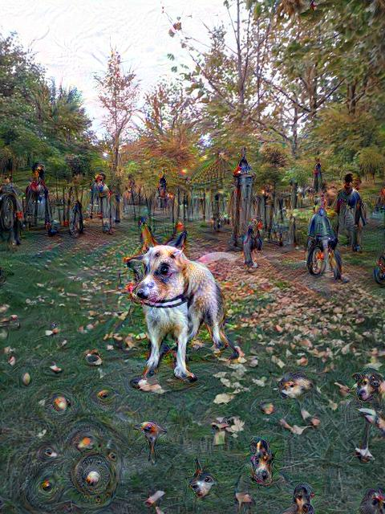  

    
    
    d_img = pw.cp.fit_img(abu1_fn, resize=True, nbk='inception_4c/output', iter_n=30)
    PrismaHelper.show_array_ipython(np.float32(d_img))

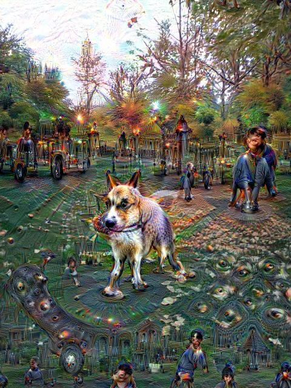  

    
    
    d_img = pw.cp.fit_img(abu1_fn, resize=True, nbk='inception_4c/output', iter_n=100)
    PrismaHelper.show_array_ipython(np.float32(d_img))

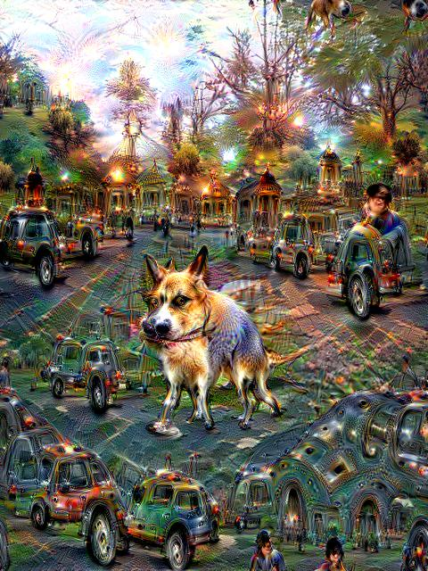  

通过上面特征融合后的图像来看迭代次数越多模型中的sharp融合到输入图像的权重就越大，但是这种方式本身的问题主要还是训练成本高，识别融合效率低，最后输出不稳
定的问题，下面使用图像处理中的一些技术来演示特征融合的过程，希望可以对你有所帮助

####2\. 从图像特征中准确需找物体对象

`find_img_main_feature`将从特征中抽取只包含阿布的图像部分，使用之前PrismaWorkerClass中封装的find_features方法提取特征

  * 使用img_cvt > img_cvt.mean()寻找mask
  * ndimage.label(mask)对存在的图像进行分类
  * 针对阀值找打remove_pixel再使用searchsorted
  * 最后使用ndimage.find_objects找到特征图像，代码如下所示

[关于scipy ndimage等使用请参考](https://docs.scipy.org)

备注：这里的函数封装不具备通用性，只是为了方便阅读

    
    
    def find_img_main_feature(pw, guid_file, threshold=1000, show=False):
        r_img_copy, org_img = pw.find_features(guid_file, loop_factor=1.0, show=show)
        r_img_copy = PIL.Image.fromarray(np.uint8(r_img_copy))
        l_img = np.float32(r_img_copy.convert('L'))
        l_img = np.float32(l_img / 255) 
        img_cvt = pw.do_otsu(r_img_copy, l_img, cb=True)
        img_cvt = PIL.Image.fromarray(np.uint8(img_cvt)).convert('L')
        img_cvt = np.float32(img_cvt)
        mask = img_cvt > img_cvt.mean()
        label_cvt, nb_labels = ndimage.label(mask)
        sizes = ndimage.sum(mask, label_cvt, range(nb_labels + 1))
        mask_size = sizes < threshold
        remove_pixel = mask_size[label_cvt]
        label_cvt[remove_pixel] = 0
        labels = np.unique(label_cvt)
        label_cvt = np.searchsorted(labels, label_cvt)
        slice_x, slice_y = ndimage.find_objects(label_cvt==np.unique(label_cvt)[-1])[0]
        org_img = np.float32(org_img)
        roi_main = org_img[slice_x, slice_y]
        if show:
            plt.figure(figsize=(4, 2))
            plt.axes([0, 0, 1, 1])
            plt.imshow(roi_main * 255)
            plt.axis('off')
        return roi_main, org_img
    
    
    img_cvt, abu1_img = find_img_main_feature(pw, abu1_fn, show=True)

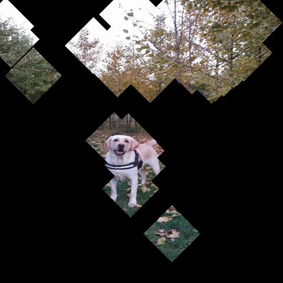  

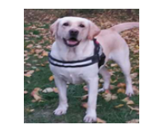  

接下来使用相同的方式从abu5中抽取两边两个海洋球的物体对象及其坐标，再次强调这里的函数封装无通用性，只是便于阅读

    
    
    def suit_img_feature(pw, img_file, threshold=1000, show=False):
        r_img_copy, org_img = pw.find_features(img_file, loop_factor=1.0)
        r_img_copy = PIL.Image.fromarray(np.uint8(r_img_copy))
        l_img = np.float32(r_img_copy.convert('L'))
        l_img = np.float32(l_img / 255) 
        img_cvt = pw.do_otsu(r_img_copy, l_img, cb=True)
        mask = img_cvt > img_cvt.mean()
        label_cvt, nb_labels = ndimage.label(mask)
        sizes = ndimage.sum(mask, label_cvt, range(nb_labels + 1))
        mask_size = sizes < threshold
        remove_pixel = mask_size[label_cvt]
        label_cvt[remove_pixel] = 0
        labels = np.unique(label_cvt)
        print labels
        label_cvt = np.searchsorted(labels, label_cvt)
        print np.unique(label_cvt)
        org_img = np.float32(org_img) * 255
        slice_feature1 = ndimage.find_objects(label_cvt==2)[0]
        feature1 = org_img[slice_feature1[0], slice_feature1[1]]
        slice_feature12 = ndimage.find_objects(label_cvt==4)[0]
        feature2= org_img[slice_feature12[0], slice_feature12[1]]
        org_img = org_img / 255
        if show:
            plt.figure(figsize=(6, 3))
            plt.subplot(121)
            plt.imshow(feature1)
            plt.axis('off')
            plt.subplot(122)
            plt.imshow(feature2)
            plt.axis('off')
        return org_img, feature1, feature2, slice_feature1, slice_feature12
    
    
    abu5_img, feature1, feature2, slice_feature1, slice_feature2 = suit_img_feature(pw, abu5_fn, threshold=500, show=True)
    PrismaHelper.show_array_ipython(np.float32(abu5_img))
    
    
    [  0   1 801 802 803 806]
    [0 1 2 3 4 5]

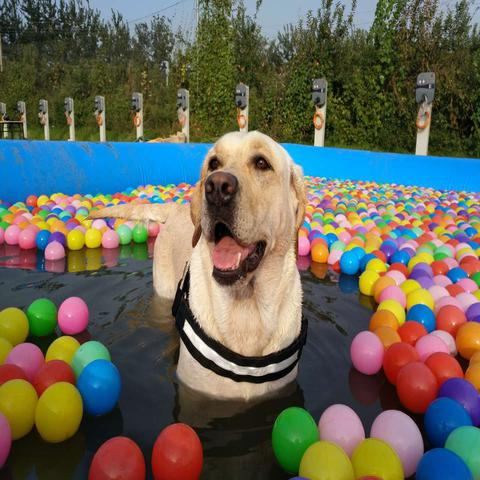  

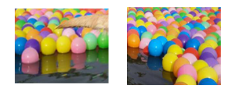  

####3. 模型中特征与输入图像特征的融合

接下来将阿布的图像和两个海洋球的图像及坐标传入mix_feature进行特征融合放大

  * 将特征之间需要融合的部分进行融合
  * 将融合好的新特征带入图像
  * 新的图像进行浅层特征放大
    
    
	    def mix_feature(img_cvt, org_img, feature1, feature2, slice_feature1, slice_feature2, threshold=1000, show=False):
	        t = PIL.Image.fromarray(np.uint8(img_cvt))
	        guide_img = PIL.Image.fromarray(np.uint8(feature1))
	        guide_img = guide_img.resize((t.width, t.height), PIL.Image.ANTIALIAS)
	        guide_img = np.float32(guide_img)
	        mix_feature1 = pw.mix_mask_with_convd(pw.do_otsu, n1=5, n2=22, n3=1, convd_median_factor=1, convd_big_factor=0, 
	                                 r_img=t, guide_img=guide_img, cb=False, show=show)
	        guide_img = PIL.Image.fromarray(np.uint8(feature2))
	        guide_img = guide_img.resize((t.width, t.height), PIL.Image.ANTIALIAS)
	        guide_img = np.float32(guide_img)
	        mix_feature2 = pw.mix_mask_with_convd(pw.do_otsu, n1=5, n2=22, n3=1, convd_median_factor=1, convd_big_factor=0, 
	                                           r_img=t, guide_img=guide_img, cb=False, show=show)
	        mix_feature1 = PIL.Image.fromarray(np.uint8(mix_feature1)).resize((feature1.shape[1], feature1.shape[0]), PIL.Image.ANTIALIAS)
	        mix_feature2 = PIL.Image.fromarray(np.uint8(mix_feature2)).resize((feature2.shape[1], feature2.shape[0]), PIL.Image.ANTIALIAS)
	        org_img = np.float32(org_img)
	        org_img[slice_feature1[0], slice_feature1[1]] = np.float32(mix_feature1) 
	        org_img[slice_feature2[0], slice_feature2[1]] = np.float32(mix_feature2)
	        d_img = pw.cp.fit_img(None, resize=True, nbk='conv2/3x3', iter_n=10, img_np=org_img)
	        PrismaHelper.show_array_ipython(np.float32(d_img))

整个流程如下图像所示，最后显示出引导图的特征在新的图像中融合的图像

    
    
    mix_feature(img_cvt, org_img, feature1, feature2, slice_feature1, slice_feature2, show=True)

  

  

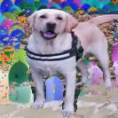  

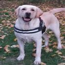  

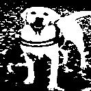  

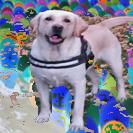  

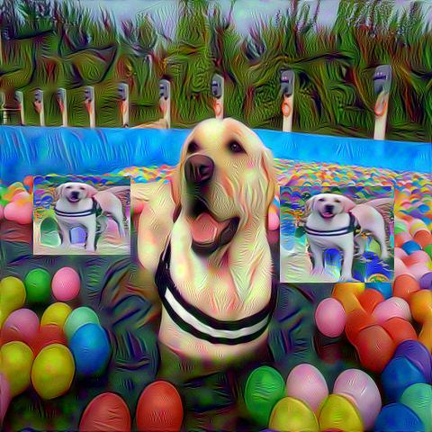  

最后的融合效果并没有惊艳出彩，但是这里只是个演示思路的demo，更多细节处理，比如特征相似度匹配，边缘平滑过度等等都没有使用，这里只是想使用最简单粗暴的方式
让你理解一下整个过程。  

Prisma的理论研究和demo工程暂时讲到这里，**更多关于深度学习理论及实例请关注我将出版的一本关于深度学习方面的书籍**

看到这里你可能得骂我：我裤子都脱了你就让我看这个阿！别着急，请继续向下看，下面有大片！

####后记随笔：

天气越来越冷了，昨天和朋友在一起吃饭，他们说马上就要下雪❄️了很期待，一定很好看，但是我却希望尽量不要下大雪，大街上那么多的流浪动物，在这个冬天又能有多少挺过来呢，每个夜晚看到它们匆忙惶恐的穿梭在这个城市，翻着一个个的垃圾桶，小心害怕的躲避着每一个身边的路人，捡到一块腐烂变质的肉都可以高兴的跳起来，为了活下来不停的奔波流浪，寻找一口食物，一块席子，每当看着它们干净单纯的眼睛，希望可以为它们做些什么，让这个世界更好！

社交网站Facebook的创始人马克·扎克伯格可以做到真的几乎把自己所有的钱回报给整个社会，努力的让这个世界变的更好，我讨厌中国很多成功的企业家，他们嘴里说
着自己有太多的财富其实也不是好事，只是为国家管理资金，我并没有感觉到他们会为了这个世界变的更好做出努力，仍然不停着榨取着全民的财富，乃至为了公司财报的好看，股价的上升，不择手段的谋取商业利益！

下面我将使用[汪汪喵呜孤儿院](http://www.pohome.cn/)中等待领养的小动物的照片做风格艺术图像，它们没有纯种的血统，猫的话可能就是叫白猫，黑猫，花猫。狗的话还有个名字‘中华田园犬’，作为经常去喂流浪狗食物的人们来说它们的名字一般是大黄，小黑，但请你发现它们的美，看着它们的眼睛，每一个都是那么的可爱漂亮，真心希望每一个天使都可以找到好的主人，幸福的过完它们本来就不长的一生，也希望你不要再犹豫去迎接这些可爱善良的天使，毕竟我们的生命都不长，不能只用它来悲伤。

备注：汪汪喵呜孤儿院（Pet Orphans Home）成立于2007年，是由年轻人组成的一家非营利、公益性的动物领养中心。自07年成立至今，在北京地区拥有数百名志愿者和几十家合作伙伴，成功救助了千余只流浪动物并帮助它们重新回归家庭。  
汪汪喵呜孤儿院在北京良乡和天通苑社区建有两处领养中心，可同时容纳70只动物健康生活、医疗养护、行为养成、领养沟通，还兼顾线上线下活动宣传、志愿者培训等。同时，根据国际通用的动物福利标准，我们一直在不断改善领养中心的设施及管理系统。与许多公益组织一样，汪汪喵呜孤儿院也需要更多义工的帮助和来自社会各界的捐款

    
    
    def show_lydw(fd_fn):
        sample_list = glob.glob(fd_fn)
        sample_list = sample_list[::-1]
        fig, axs = plt.subplots(nrows=1, ncols=2, figsize=(20, 10));
        for ind, ax in zip(range(1 * 2), axs):
            iter_fn = sample_list[ind]
            iter_img = plt.imread(iter_fn)
            ax.set_title(os.path.basename(iter_fn))
            ax.imshow(iter_img);
            ax.set_axis_off()

