 
<!--BEGIN_DATA
{
    "create_date": "2019-12-27 11:37", 
    "modify_date": "2019-12-27 11:37", 
    "is_top": "0", 
    "summary": "由STGW下载慢问题引发的网络传输学习之旅", 
    "tags": "网络、C/C++、Linux、系统", 
    "file_name": "由STGW下载慢问题引发的网络传输学习之旅.md"
}
END_DATA-->

####<p>原文出处：<a href='https://blog.csdn.net/Tencent_TEG/article/details/103724638' target='blank'>由STGW下载慢问题引发的网络传输学习之旅</a></p>


> 导语：本文分享了笔者现网遇到的一个文件下载慢的问题。最开始尝试过很多办法，包括域名解析，网络链路分析，AB环境测试，网络抓包等，但依然找不到原因。然后利用网络命令和报文得到的蛛丝马迹，结合内核网络协议栈的实现代码，找到了一个内核隐藏很久但在最近版本解决了的BUG。如果你也想了解如何分析和解决诡异的网络问题，如果你也想温习一下课堂上曾经学习过的慢启动、拥塞避免、快速重传、AIMD等老掉牙的知识，如果你也渴望学习课本上完全没介绍过的TCP的一系列优化比如混合慢启动、尾包探测甚至BBR等，那么本文或许可以给你一些经验和启发。

**问题背景**

线上用户经过STGW（Secure Tencent Gateway，腾讯安全网关-七层转发代理）下载一个50M左右的文件，与直连用户自己的服务器相比，下载速度明显变慢，需要定位原因。在了解到用户的问题之后，相关的同事在线下做了如下尝试：  

1. 从广州和上海直接访问用户的回源VIP（Virtual IP，提供服务的公网IP地址）下载，都耗时4s+，正常；


2. 只经过TGW（Tencent Gateway，腾讯网关-四层负载均衡系统），不经过STGW访问，从广州和上海访问上海的TGW，耗时都是4s+，正常；


3. 经过STGW，从上海访问上海的STGW VIP，耗时4s+，正常；


4. 经过STGW，从广州访问上海的STGW VIP，耗时12s+，异常。


前面的三种情况都是符合预期，而第四种情况是不符合预期的，这个也是本文要讨论的问题。

**前期定位排查**

发现下载慢的问题后，我们分析了整体的链路情况，按照链路经过的节点顺序有了如下的排查思路：  

（1）从客户端侧来排查，DNS解析慢，客户端读取响应慢或者接受窗口小等；

（2）从链路侧来排查，公网链路问题，中间交换机设备问题，丢包等；

（3）从业务服务侧来排查，业务服务侧发送响应较慢，发送窗口较小等；

（4）从自身转发服务来排查，TGW或STGW转发程序问题，STGW拥塞窗口缓存等；

按照上面的这些思路，我们分别做了如下的排查：

**1.是否是由于异常客户端的DNS服务器解析慢导致的？**

用户下载小文件没有问题，并且直接访问VIP，配置hosts访问，发现问题依然复现，排除。

**2.是否是由于客户端读取响应慢或者接收窗口较小导致的？**

抓包分析客户端的数据包处理情况，发现客户端收包处理很快，并且接收窗口一直都是有很大空间。排除。

**3.是否是广州到上海的公网链路或者交换机等设备问题，导致访问变慢？**

从广州的客户端上ping上海的VIP，延时很低，并且测试不经过STGW，从该客户端直接访问TGW再到回源服务器，下载正常，排除。

**4.是否是STGW到回源VIP这条链路上有问题？**

在STGW上直接访问用户的回源VIP，耗时4s+，是正常的。并且打开了STGW LD（LoadBalance Director，负载均衡节点）与后端server之间的响应缓存，抓包可以看到，后端数据4s左右全部发送到STGW LD上，是STGW LD往客户端回包比较慢，基本可以确认是Client->STGW这条链路上有问题。排除。

**5.是否是由于TGW或STGW转发程序有问题？**

由于异地访问必定会复现，同城访问就是正常的。而TGW只做四层转发，无法感知源IP的地域信息，并且抓包也确认TGW上并没有出现大量丢包或者重传的现象。STGW是一个应用层的反向代理转发，也不会对于不同地域的cip有不同的处理逻辑。排除。

**6.是否是由于TGW是fullnat影响了拥塞窗口缓存？**

因为之前由于fullnat出现过一些类似于本例中下载慢的问题，当时定位的原因是由于STGW LD上开启了拥塞窗口缓存，在fullnat的情况下，会影响拥塞窗口缓存的准确性，导致部分请求下载慢。但是这里将拥塞窗口缓存选项 sysctl -w net.ipv4.tcp\_no\_metrics\_save=1关闭之后测试，发现问题依然存在，并且线下用另外一个fullnat的vip测试，发现并没有复现用户的问题。排除。

根据一些以往的经验和常规的定位手段都尝试了以后，**发现仍然还是没有找到原因，那到底是什么导致的呢**？

**问题分析**

首先，在复现的STGW LD上抓包，抓到Client与STGW LD的包如下图，从抓包的信息来看是STGW回包给客户端很慢，每次都只发很少的一部分到Client。

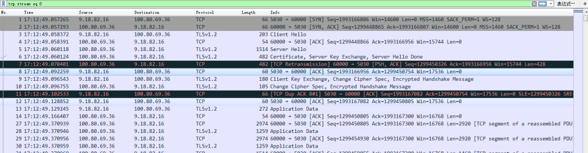

这里有一个很奇怪的地方就是为什么第7号包发生了重传？不过暂时可以先将这个疑问放到一边，因为就算7号包发生了一个包的重传，这中间也并没有发生丢包，LD发送数据也并不应该这么慢。那既然LD发送数据这么慢，肯定要么是Client的接收窗口小，要么是LD的拥塞窗口比较小。

对端的接收窗口，抓包就可以看到，实际上Client的接收窗口并不小，而且有很大的空间。那是否有办法可以看到LD的发送窗口呢？答案是肯定的：ss -it，这个指令可以看到每条连接的rtt，ssthresh，cwnd等信息。有了这些信息就好办了，再次复现，并写了个命令将cwnd等信息记录到文件：

    
    while true; do date +"%T.%6N" >> cwnd.log; ss -it >> cwnd.log; done
    

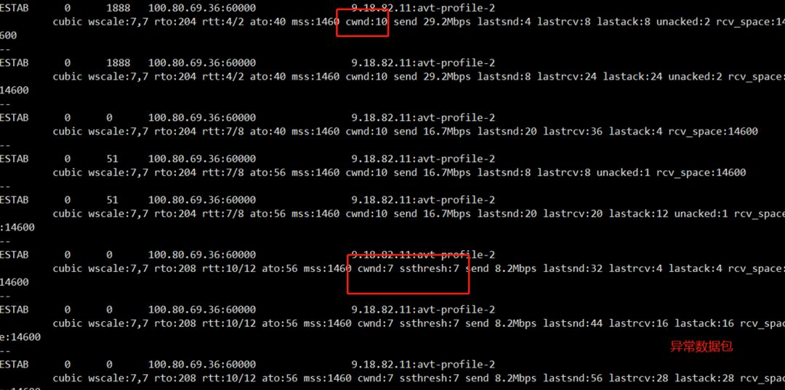  

复现得到的cwnd.log如上图，找到对应的连接，grep出来后对照来看。果然发现在前面几个包中，拥塞窗口就直接被置为7，并且ssthresh也等于7，并且可以看到后面窗口增加的很慢，直接进入了拥塞避免，这么小的发送窗口，增长又很缓慢，自然发送数据就会很慢了。

那么到底是什么原因导致这里直接在前几个包就进入拥塞避免呢？从现有的信息来看，没办法直接确定原因，只能去啃代码了，但tcp拥塞控制相关的代码这么多，**如何能快速定位呢**？

观察上面异常数据包的cwnd信息，可以看到一个很明显的特征，最开始ssthresh是没有显示出来的，经过了几个数据包之后，ssthresh与cwnd是相等的，所以尝试按照"snd\_ssthresh ="和"snd\_cwnd ="的关键字来搜索，按照snd\_cwnd = snd\_ssthresh的原则来找，排除掉一些不太可能的函数之后，最后找到了tcp\_end\_cwnd\_reduction这个函数。

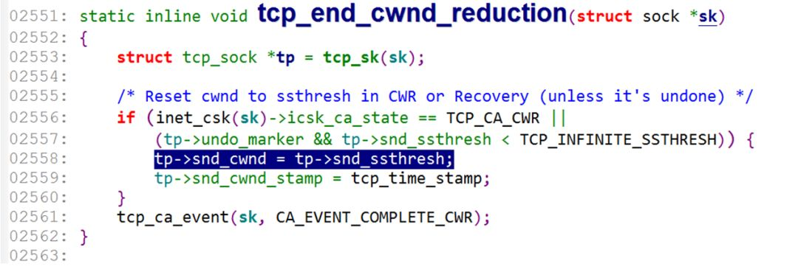

再查找这个函数引用的地方，有两处：tcp\_fastretrans\_alert和tcp\_process\_tlp\_ack这两个函数。

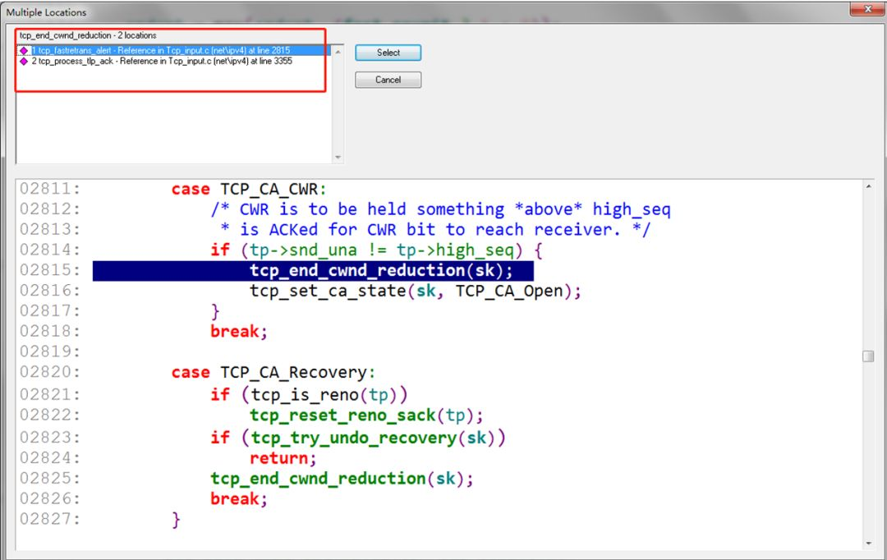

tcp\_fastretrans\_alert看名字就知道是跟快速重传相关的函数，我们知道快速重传触发的条件是收到了三个重复的ack包。但根据前面的抓包及分析来看，并不满足快速重传的条件，所以疑点就落在了这个tcp\_process\_tlp\_ack函数上面。**那么到底什么是TLP呢**？

**什么是TLP（Tail Loss Probe）**

在讲TLP之前，我们先来回顾下大学课本里学到的拥塞控制算法，祭出这张经典的拥塞控制图。

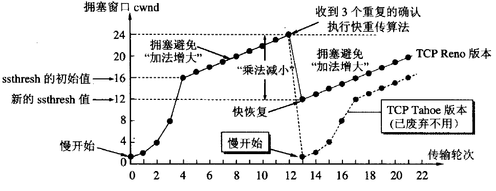

TCP的拥塞控制主要分为四个阶段：慢启动，拥塞避免，快重传，快恢复。长久以来，我们听到的说法都是，最开始拥塞窗口从1开始慢启动，以指数级递增，收到三个重复的ack后，将ssthresh设置为当前cwnd的一半，并且置cwnd=ssthresh，开始执行拥塞避免，cwnd加法递增。

这里我们来思考一个问题，发生丢包时，为什么要将ssthresh设置为cwnd的一半？

想象一个场景，A与B之间发送数据，假设二者发包和收包频率是一致的，由于A与B之间存在空间距离，中间要经过很多个路由器，交换机等，A在持续发包，当B收到第一个包时，这时A与B之间的链路里的包的个数为N，此时由于B一直在接收包，因此A还可以继续发，直到第一个包的ack回到A，这时A发送的包的个数就是当前A与B之间最大的拥塞窗口，即为2N，因为如果这时A多发送，肯定就丢包了。

ssthresh代表的就是当前链路上可以发送的最大的拥塞窗口大小，理想情况下，ssthresh就是2N，但现实的环境很复杂，不可能刚好cwnd经过慢启动就可以直接到达2N，发送丢包的时候，肯定是N<1/2*cwnd<2N，因此此时将ssthresh设置为1/2*cwnd，然后再从此处加法增加慢慢的达到理想窗口，不能增长过快，因为要“避免拥塞”。

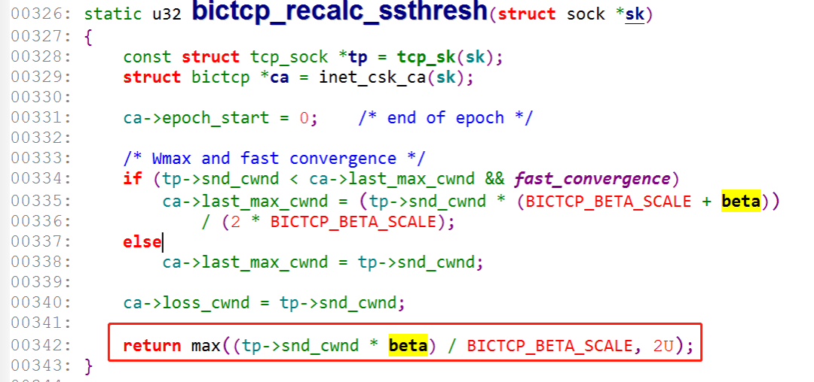

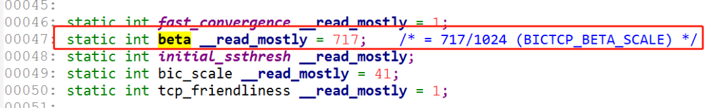

实际上，各个拥塞控制算法都有自己的实现，初始cwnd的值也一直在优化，在linux 3.0版本以后，内核CUBIC的实现里，采用了Google在RFC6928的建议，将初始的cwnd的值设置为10。而在linux 3.0版本之前，采取的是RFC3390中的策略，根据不同的MSS，设置了不同的初始化cwnd。具体的策略为：

```
If (MSS <= 1095 bytes)
    then cwnd=4;

If (1095 bytes < MSS < 2190 bytes)

    then cwnd=3;

If (2190 bytes <= MSS)

    then cwnd=2;
```

并且在执行拥塞避免时，当前CUBIC的实现里也不是将ssthresh设置为cwnd的一半，而是717/1024≈0.7左右，RFC8312也提到了这样做的原
因。

> Principle 4: To balance between the scalability and convergence speed, CUBIC sets the multiplicative window decrease factor to 0.7 while Standard TCP uses 0.5. While this improves the scalability of CUBIC, a side effect of this decision is slower convergence, especially under low statistical multiplexing environments.

从上面的描述可以看到，在TCP的拥塞控制算法里，最核心的点就是ssthresh的确定，如何能快速准确的确定ssthresh，就可以更加高效的传输。而现实的网络环境很复杂，在有些情况下，没有办法满足快速重传的条件，**如果每次都以丢包作为反馈，代价太大**。比如，考虑如下的几个场景：

  * 是否可以探测到ssthresh的值，不依赖丢包来触发进入拥塞避免，主动退出慢启动？

  * 如果没有足够的dup ack（大于0，小于3）来触发快速重传，如何处理？

  * 如果没有任何的dup ack（等于0），比如尾丢包的情况，如何处理？

  * 是否可以主动探测网络带宽，基于反馈驱动来调整窗口，而不是丢包等事件驱动来执行拥塞控制？

针对上面的前三种情况，TCP协议栈分别都做了相应的优化，对应的优化算法分别为：hystart（Hybrid Slow Start），ER（Early Retransmit）和TLP（Tail Loss Probe）。对于第四种情况，Google给出了答案，创造了一种新的拥塞控制算法，它的名字叫BBR，从linux 4.19开始，内核已经将默认的拥塞控制算法 从CUBIC改成了BBR。受限于本文的篇幅有限，无法对BBR算法做详尽的介绍，下面仅结合内核CUBIC的代码来分别介绍前面的这三种优化算法。

####**1. 慢启动的hystart优化**

混合慢启动的思想是在论文《Hybrid Slow Start for High-Bandwidth and Long-Distance Networks》里首次提出的，前面我也说过，如果每次判断拥塞都依赖丢包来作为反馈，代价太大，hystart也是在这个方向上做优化，它主要想解决的问题就是不依赖丢包作为反馈来退出慢启动，它提出的退出条件有两类：

  * 判断在同一批发出去的数据包收到的ack包（对应论文中的acks train length）的总时间大于min(rtt)/2；

  * 判断一批样本中的最小rtt是否大于全局最小rtt加一个阈值的和；

内核CUBIC的实现里默认都是开启了hystart，在bictcp\_init函数里判断是否开启并做初始化
    
```
static inline void bictcp_hystart_reset(struct sock *sk)
{
  struct tcp_sock *tp = tcp_sk(sk);
  struct bictcp *ca = inet_csk_ca(sk);
  ca->round_start = ca->last_ack = bictcp_clock();
  ca->end_seq = tp->snd_nxt;
  ca->curr_rtt = 0;
  ca->sample_cnt = 0;
}
static void bictcp_init(struct sock *sk)
{
  struct bictcp *ca = inet_csk_ca(sk);
  bictcp_reset(ca);
  ca->loss_cwnd = 0;
  if (hystart)//如果开启了hystart，那么做初始化
    bictcp_hystart_reset(sk);
  if (!hystart && initial_ssthresh)
    tcp_sk(sk)->snd_ssthresh = initial_ssthresh;
}
```

核心的判断是否退出慢启动的函数在hystart\_update里

```
static void hystart_update(struct sock *sk, u32 delay)
{
  struct tcp_sock *tp = tcp_sk(sk);
  struct bictcp *ca = inet_csk_ca(sk);
  if (!(ca->found & hystart_detect)) {
    u32 now = bictcp_clock();
    /* first detection parameter - ack-train detection */
    //判断如果连续两个ack的间隔小于hystart_ack_delta(2ms)，则为一个acks train
    if ((s32)(now - ca->last_ack) <= hystart_ack_delta) {
      ca->last_ack = now;
      //如果ack_train的总长度大于1/2 * min_rtt，则退出慢启动，ca->delay_min = 8*min_rtt
      if ((s32)(now - ca->round_start) > ca->delay_min >> 4)
        ca->found |= HYSTART_ACK_TRAIN;
    }
    /* obtain the minimum delay of more than sampling packets */
    //如果小于HYSTART_MIN_SAMPLES(8)个样本则直接计数
    if (ca->sample_cnt < HYSTART_MIN_SAMPLES) {
      if (ca->curr_rtt == 0 || ca->curr_rtt > delay)
        ca->curr_rtt = delay;
      ca->sample_cnt++;
    } else {
      /*
      * 否则，判断这些样本中的最小rtt是否要大于全局的最小rtt+有范围变化的阈值，
      * 如果是，则说明发生了拥塞
      */
      if (ca->curr_rtt > ca->delay_min +
          HYSTART_DELAY_THRESH(ca->delay_min>>4))
        ca->found |= HYSTART_DELAY;
    }
    /*
     * Either one of two conditions are met,
     * we exit from slow start immediately.
     */
     //判断ca->found如果为真，则退出慢启动，进入拥塞避免
    if (ca->found & hystart_detect)
      tp->snd_ssthresh = tp->snd_cwnd;
  }
}
```

####**2. ER（Early Retransmit）算法**

我们知道，快重传的条件是必须收到三个相同的dup ack，才会触发，那如果在有些情况下，没有足够的dup ack，只能依赖rto超时，再进行重传，并且开始执行慢启动，这样的代价太大，ER算法就是为了解决这样的场景，RFC5827详细介绍了这个算法。

算法的基本思想：

```
ER_ssthresh = 3 //ER_ssthresh代表触发快速重传的dup ack的个数
if (unacked segments < 4 && no new data send)
    if (sack is unable)  // 如果SACK选项不支持，则使用还未ack包的个数减一作为阈值
        ER_ssthresh = unacked segments - 1
    elif (sacked packets == unacked segments - 1)  // 否则，只有当还有一个包还未sack，才能启用ER，并且置阈值为还未ack包的个数减一
        ER_ssthresh = unacked segments - 1
```

对应到代码里的函数为tcp\_time\_to\_recover：

```
static bool tcp_time_to_recover(struct sock *sk, int flag)
{
  ...
  /* Trick#6: TCP early retransmit, per RFC5827.  To avoid spurious
   * retransmissions due to small network reorderings, we implement
   * Mitigation A.3 in the RFC and delay the retransmission for a short
   * interval if appropriate.
   */
  if (tp->do_early_retrans //开启ER算法
        && !tp->retrans_out  //没有重传数据
        && tp->sacked_out    //当前收到了dupack包
        && (tp->packets_out >= (tp->sacked_out + 1) && tp->packets_out < 4) //满足ER的触发条件
        && !tcp_may_send_now(sk)) //没有新的数据发送
         return !tcp_pause_early_retransmit(sk, flag);//判断是立即进入ER还是需要delay 1/4 rtt
  return false;
}
/*
 * 这里内核的实现与rfc5827有一点不同，就是引入了delay ER的概念，主要是防止过多减小的dupack 阈值带来的
 * 无效的重传，所以默认加了一个1/4 RTT的delay，在ER的基础上又做了一个折中，等一段时间再判断是否要重传。
 * 如果是false，则立即进入ER，如果是true，则delay max(RTT/4,2msec)再进入ER
 */
static bool tcp_pause_early_retransmit(struct sock *sk, int flag)
{
  struct tcp_sock *tp = tcp_sk(sk);
  unsigned long delay;
  /* Delay early retransmit and entering fast recovery for
   * max(RTT/4, 2msec) unless ack has ECE mark, no RTT samples
   * available, or RTO is scheduled to fire first.
   */
   //内核提供了一个参数tcp_early_retrans来控制ER和delay ER，等于2和3时，是打开了delay ER
  if (sysctl_tcp_early_retrans < 2 || sysctl_tcp_early_retrans > 3 ||
      (flag & FLAG_ECE) || !tp->srtt)
    return false;
  delay = max_t(unsigned long, (tp->srtt >> 5), msecs_to_jiffies(2));
  if (!time_after(inet_csk(sk)->icsk_timeout, (jiffies + delay)))
    return false;
  //设置delay ER的定时器
  inet_csk_reset_xmit_timer(sk, ICSK_TIME_EARLY_RETRANS, delay,
          TCP_RTO_MAX);
  return true;
}
```

delay ER的定时器超时的处理函数tcp\_resume\_early\_retransmit。

```
void tcp_resume_early_retransmit(struct sock *sk)
{
  struct tcp_sock *tp = tcp_sk(sk);
  tcp_rearm_rto(sk);
  /* Stop if ER is disabled after the delayed ER timer is scheduled */
  if (!tp->do_early_retrans)
    return;
  //执行快速重传
  tcp_enter_recovery(sk, false);
  tcp_update_scoreboard(sk, 1);
  tcp_xmit_retransmit_queue(sk);
}
```

内核提供了一个开关，tcp\_early\_retrans用于开启和关闭TLP和ER算法，默认是3，即打开了delay ER和TLP算法。

```
sysctl_tcp_early_retrans (defalut:3)
    0 disables ER
    1 enables ER
    2 enables ER but delays fast recovery and fast retransmit by a fourth of RTT.
    3 enables delayed ER and TLP.
    4 enables TLP only.
```

到此，这就是内核设计ER算法的相关的代码。ER算法在cwnd比较小的情况下，是可以有一些改善的，但个人认为，实际的效果可能一般。因为如果cwnd较小，执行慢启动与执行快速重传再进入拥塞避免相比，二者的实际传输效率可能相差并不大。

####**3.TLP（Tail Loss Probe）算法**

TLP想解决的问题是：**如果尾包发生了丢包，没有新包可发送触发多余的dup ack来实现快速重传，如果完全依赖RTO超时来重传，代价太大，那如何能优化解决这种尾丢包的情况。**

TLP算法是2013年谷歌在论文《Tail Loss Probe (TLP): An Algorithm for Fast Recovery of Tail Losses》中提出来的，它提出的基本思想是：

>在每个发送的数据包的时候，都更新一个定时器PTO（probe timeout），这个PTO是动态变化的，当发出的包中存在未ack的包，并且在PTO时间内都未收到一个ack，那么就会发送一个新包或者重传最后的一个数据包，探测一下当前网络是否真的拥塞发生丢包了。
>
>如果收到了tail包的dup ack，则说明没有发生丢包，继续执行当前的流程；否则说明发生了丢包，需要执行减窗，并且进入拥塞避免。

这里其中一个比较重要的点是PTO如何设置，设置的策略如下：

```
if unacked packets == 0:
    no need set PTO
else if unacked packets == 1:
    PTO=max(2rtt, 1.5*rtt+TCP_DELACK_MAX, 10ms)
else:
    PTO=max(2rtt, 10ms)
注：TCP_DELACK_MAX = 200ms
```

对应到代码里的tcp\_schedule\_loss\_probe函数：

```
bool tcp_schedule_loss_probe(struct sock *sk)
{
  struct inet_connection_sock *icsk = inet_csk(sk);
  struct tcp_sock *tp = tcp_sk(sk);
  u32 timeout, tlp_time_stamp, rto_time_stamp;
  u32 rtt = tp->srtt >> 3;
  if (WARN_ON(icsk->icsk_pending == ICSK_TIME_EARLY_RETRANS))
    return false;
  /* No consecutive loss probes. */
  if (WARN_ON(icsk->icsk_pending == ICSK_TIME_LOSS_PROBE)) {
    tcp_rearm_rto(sk);
    return false;
  }
  /* Don't do any loss probe on a Fast Open connection before 3WHS
   * finishes.
   */
  if (sk->sk_state == TCP_SYN_RECV)
    return false;
  /* TLP is only scheduled when next timer event is RTO. */
  if (icsk->icsk_pending != ICSK_TIME_RETRANS)
    return false;
  /* Schedule a loss probe in 2*RTT for SACK capable connections
   * in Open state, that are either limited by cwnd or application.
   */
   //判断是否开启了TLP及一些触发条件
  if (sysctl_tcp_early_retrans < 3 || !rtt || !tp->packets_out ||
      !tcp_is_sack(tp) || inet_csk(sk)->icsk_ca_state != TCP_CA_Open)
    return false;
  if ((tp->snd_cwnd > tcp_packets_in_flight(tp)) &&
       tcp_send_head(sk))
    return false;
  /* Probe timeout is at least 1.5*rtt + TCP_DELACK_MAX to account
   * for delayed ack when there's one outstanding packet.
   */
   //这个与上面描述的策略是一致的
  timeout = rtt << 1;
  if (tp->packets_out == 1)
    timeout = max_t(u32, timeout,
        (rtt + (rtt >> 1) + TCP_DELACK_MAX));
  timeout = max_t(u32, timeout, msecs_to_jiffies(10));
  /* If RTO is shorter, just schedule TLP in its place. */
  tlp_time_stamp = tcp_time_stamp + timeout;
  rto_time_stamp = (u32)inet_csk(sk)->icsk_timeout;
  if ((s32)(tlp_time_stamp - rto_time_stamp) > 0) {
    s32 delta = rto_time_stamp - tcp_time_stamp;
    if (delta > 0)
      timeout = delta;
  }
  //设置PTO定时器
  inet_csk_reset_xmit_timer(sk, ICSK_TIME_LOSS_PROBE, timeout,
          TCP_RTO_MAX);
  return true;
}
```

PTO超时之后，会触发tcp\_send\_loss\_probe发送TLP包：

```
/* When probe timeout (PTO) fires, send a new segment if one exists, else
 * retransmit the last segment.
 */
void tcp_send_loss_probe(struct sock *sk)
{
  struct tcp_sock *tp = tcp_sk(sk);
  struct sk_buff *skb;
  int pcount;
  int mss = tcp_current_mss(sk);
  int err = -1;
  //如果还可以发送新数据，那么就发送新数据
  if (tcp_send_head(sk) != NULL) {
    err = tcp_write_xmit(sk, mss, TCP_NAGLE_OFF, 2, GFP_ATOMIC);
    goto rearm_timer;
  }
  /* At most one outstanding TLP retransmission. */
  //一次最多只有一个TLP探测包
  if (tp->tlp_high_seq)
    goto rearm_timer;
  /* Retransmit last segment. */
  //如果没有新数据可发送，就重新发送最后的一个数据包
  skb = tcp_write_queue_tail(sk);
  if (WARN_ON(!skb))
    goto rearm_timer;
  pcount = tcp_skb_pcount(skb);
  if (WARN_ON(!pcount))
    goto rearm_timer;
  if ((pcount > 1) && (skb->len > (pcount - 1) * mss)) {
    if (unlikely(tcp_fragment(sk, skb, (pcount - 1) * mss, mss)))
      goto rearm_timer;
    skb = tcp_write_queue_tail(sk);
  }
  if (WARN_ON(!skb || !tcp_skb_pcount(skb)))
    goto rearm_timer;
  err = __tcp_retransmit_skb(sk, skb);
  /* Record snd_nxt for loss detection. */
  if (likely(!err))
    tp->tlp_high_seq = tp->snd_nxt;
rearm_timer:
  inet_csk_reset_xmit_timer(sk, ICSK_TIME_RETRANS,
          inet_csk(sk)->icsk_rto,
          TCP_RTO_MAX);
  if (likely(!err))
    NET_INC_STATS_BH(sock_net(sk),
         LINUX_MIB_TCPLOSSPROBES);
  return;
}
```

发送TLP探测包后，在tcp\_process\_tlp\_ack里判断是否发生了丢包，做相应的处理：

```
/* This routine deals with acks during a TLP episode.
 * Ref: loss detection algorithm in draft-dukkipati-tcpm-tcp-loss-probe.
 */
static void tcp_process_tlp_ack(struct sock *sk, u32 ack, int flag)
{
  struct tcp_sock *tp = tcp_sk(sk);
  //判断这个包是否是tlp包的dup ack包
  bool is_tlp_dupack = (ack == tp->tlp_high_seq) &&
           !(flag & (FLAG_SND_UNA_ADVANCED |
               FLAG_NOT_DUP | FLAG_DATA_SACKED));
  /* Mark the end of TLP episode on receiving TLP dupack or when
   * ack is after tlp_high_seq.
   */
  //如果是dup ack，说明没有发生丢包，继续当前的流程
  if (is_tlp_dupack) {
    tp->tlp_high_seq = 0;
    return;
  }
  //否则，减窗，并进入拥塞避免
  if (after(ack, tp->tlp_high_seq)) {
    tp->tlp_high_seq = 0;
    /* Don't reduce cwnd if DSACK arrives for TLP retrans. */
    if (!(flag & FLAG_DSACKING_ACK)) {
      tcp_init_cwnd_reduction(sk, true);
      tcp_set_ca_state(sk, TCP_CA_CWR);
      tcp_end_cwnd_reduction(sk);
      tcp_try_keep_open(sk);
      NET_INC_STATS_BH(sock_net(sk),
           LINUX_MIB_TCPLOSSPROBERECOVERY);
    }
  }
}
```

TLP算法的设计思路还是挺好的，主动提前发现网络是否拥塞，而不是被动的去依赖丢包来作为反馈。在大多数情况下是可以提高网络传输的效率的，但在某些情况下可能会"适得其反"，而本文遇到的问题就是"适得其反"的一个例子。

**问题的解决**

回到我们的这个问题上，**如何确认确实是由于TLP引起的呢**？  

继续查看代码可以看到，TLP的loss probe和loss recovery次数，内核都有相应的计数器跟踪。

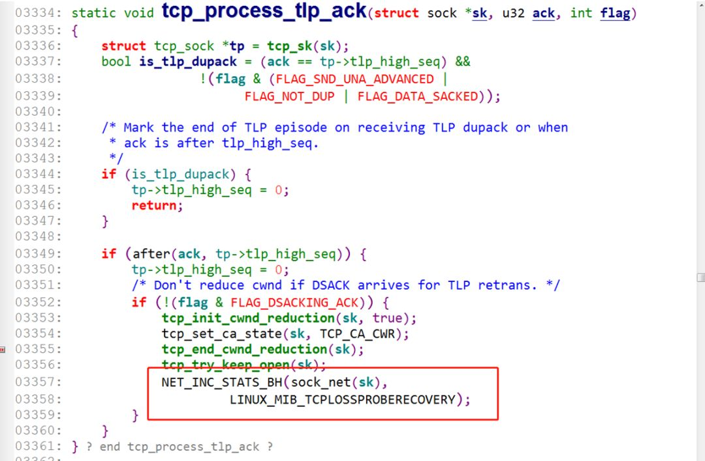

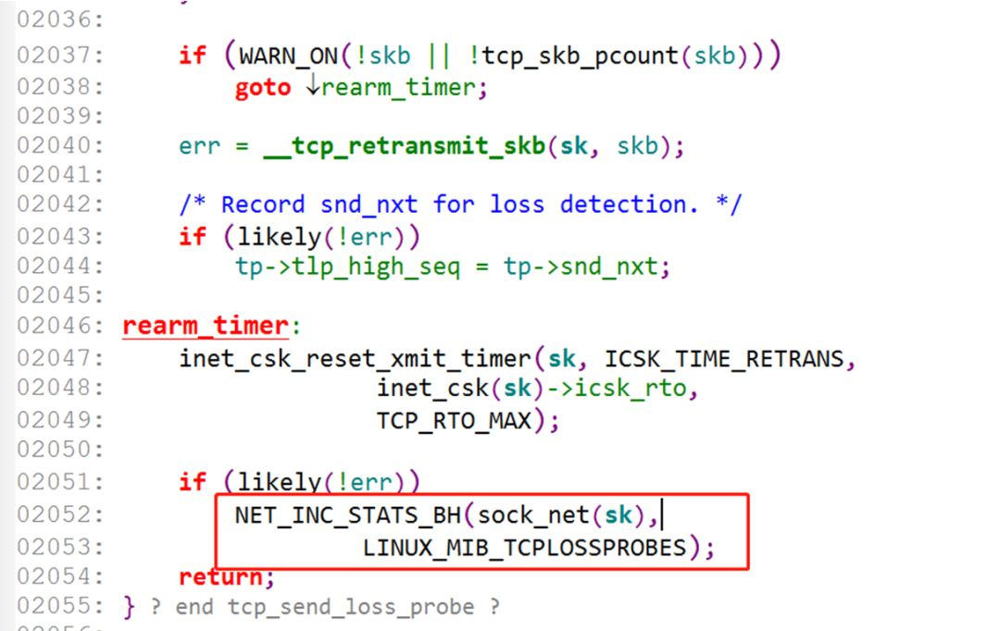

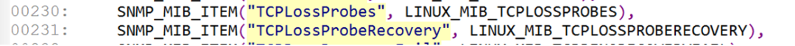

既然有计数器就好办了，复现的时候netstat -s就可以查看是否命中TLP了。写了个脚本将结果写入到文件里。

    
    while true; do date +"%T.%6N" >> loss.log; netstat -s | grep Loss >> loss.log; done
    

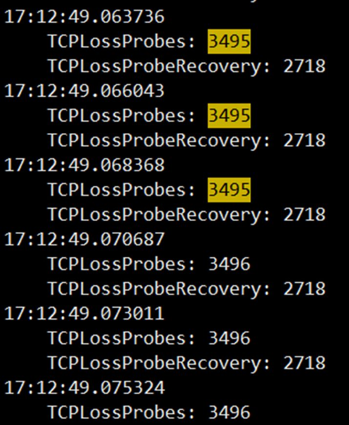  

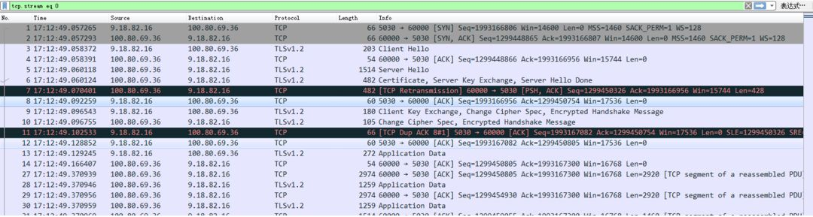

查看计数器增长的情况，结合抓包文件来看，基本确认肯定是命中TLP了。知道原因那就好办了，关掉TLP验证一下应该就可以解决了。

如上面介绍ER算法时提到，内核提供了一个开关，tcp\_early\_retrans可用于开启和关闭ER和TLP，默认是3（enable TLP and delayed ER），sysctl -w net.ipv4.tcp\_early\_retrans=2 关掉TLP，再次重新测试，发现问题解决了：

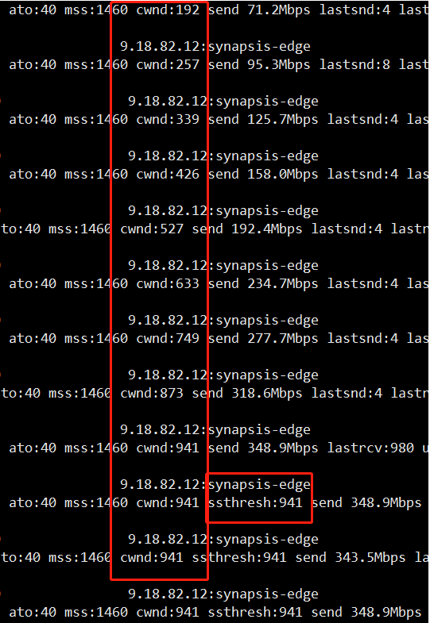

窗口增加的很快，最终的ssthresh为941，下载速度4s+，也是符合预期，到此用户的问题已经解决，**但所有的疑问都得到了正确的解答了吗**？

**真正的真相**

虽然用户的问题已经得到了解决，但至少还有两个问题没有得到答案：  

**1. 为什么会每次都在握手完的前几个包里就会触发TLP？**

**2. 虽然触发了TLP，但从抓包来看，已经收到了尾包的dup ack包，那说明没有发生丢包，为什么还是进入了拥塞避免？**

先回答第一个问题，根据文章最前面的网络结构图可以看到，STGW是挂在TGW的后面。在本场景中，用户访问的是TGW的高防VIP，高防VIP有一个默认开启的功能就是SYN代理。

> syn代理指的是client发起连接时，首先是由tgw代答syn ack包，client真正开始发送数据包时，tgw再发送三次握手的包到rs，并转发数据包。

在本例中，tgw的rs就是stgw，也就是说，stgw的收到三次握手包的rtt是基于与tgw计算出来的，而后面的数据包才是真正与client之间的通信。前面背景描述中提到，用户同城访问（上海client访问上海的vip）也是没有问题的，跨城访问就有问题。

这是因为同城访问的情况下，tgw与stgw之间的rtt与client与stgw之间的rtt，相差并不大，并没有满足触发tlp的条件。而跨城访问后，三次握手的数据包的rtt是基于与tgw来计算的，比较小，后面收到数据包后，计算的是client到stgw之间的rtt，一下子增大了很多，并且满足了tlp的触发条件

    
    PTO=max(2rtt, 10ms)
    

设置的PTO定时器超时了，协议栈认为是不是由于网络发生了拥塞，所以重传了尾包探测一下查看是否真的发生了拥塞，这就是为什么每次都是在握手完随后的几个包里就会有重传包，触发了TLP的原因。  

再回到第二个问题，从抓包来看，很明显，网络并没有发生拥塞或丢包，stgw已经收到了尾包的dup ack包，按照TLP的原理来看，不应该进入拥塞避免的，到底是什么原因导致的。百思不得其解，只能再继续啃代码了，再回到tlp\_ack的这一部分代码来看。

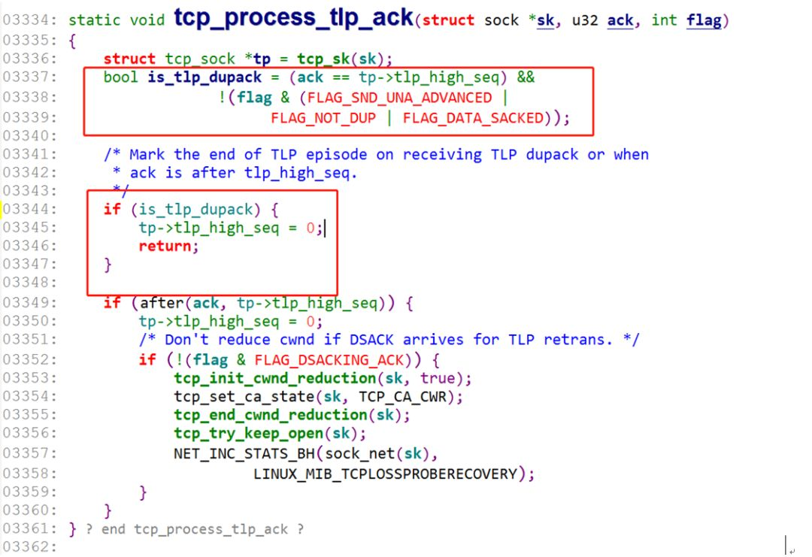

只有当is\_tlp\_dupack为false时，才会进入到下面部分，进入拥塞避免，也就是说这里is\_tlp\_dupack肯定是为false的。ack == tp->tlp\_high\_seq这个条件是满足的，那么问题就出在了几个flag上面，看下几个flag的定义：

```
#define FLAG_SND_UNA_ADVANCED  0x400
#define FLAG_NOT_DUP    (FLAG_DATA|FLAG_WIN_UPDATE|FLAG_ACKED)
#define FLAG_DATA_SACKED  0x20 /* New SACK.
```

也就是说，只要flag包含了上面几个中的任意一个，都会将is\_tlp\_dupack置为false，那到底flag包含了哪一个呢？**如何继续排查呢**？

调试内核信息，最常用的工具就是**ftrace**及**systemtap**。

这里首先尝试了ftrace，发现它并不能满足我的需求。ftrace最主要的功能是可以跟踪函数的调用信息，并且可以知道各个函数的执行时间，在有些场景下非常好用，但原生的ftrace命令用起来很不方便，ftrace团队也意识到了这个问题，因此提供了另外一个工具trace-cmd，使用起来非常简单。

```
trace-cmd record -p function_graph -P 3252 //跟踪pid 3252的函数调用情况
trace-cmd report > report.log //以可视化的方式展示ftrace的结果并重定向到文件里
```

下图是使用trace-cmd跟踪的一个例子部分截图，可以看到完整打印了内核函数的调用信息及对应的执行时间。

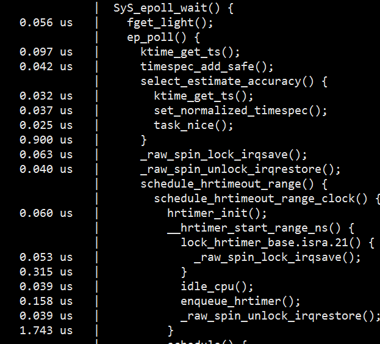

但在当前的这个问题里，主要是想确认flag这个变量的值，ftrace没有办法打印出变量的值，因此考虑下一个强大的工具：**systemtap**。

systemtap是一个很强大的动态追踪工具，利用它可以很方便的调试内核信息，跟踪内核函数，打印变量信息等，很显然它是符合我们的需求的。systemptap的使用需要安装内核调试信息包（kernel-debuginfo），但由于复现的那台机器上的内核版本较老，没有debug包，无法使用stap工具，因此这条路也走不通。

最后，联系了h\_tlinux\_Helper寻求帮助，他帮忙找到了复现机器内核版本的dev包，并在tcp\_process\_tlp\_ack函数里打印了一些变量，并输出堆栈信息。重新安装了调试的内核，复现后打印了如下的堆栈及变量信息：

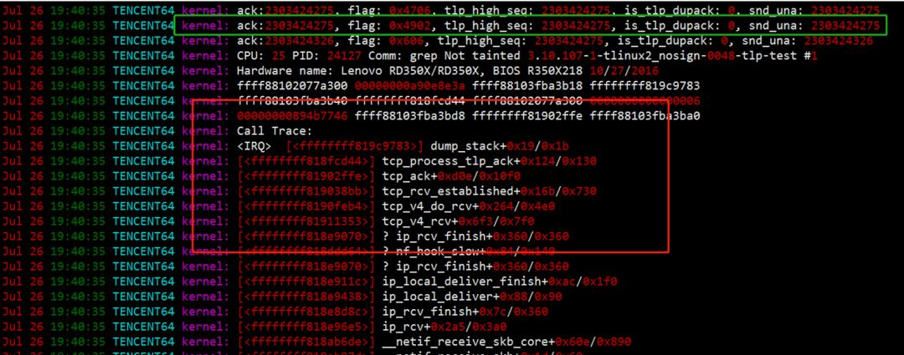

绿色标记处的那一行，就是收到的dup ack的那个包，可以看到flag的标记为0x4902，换算成宏定义为：

    
    FLAG_UPDATE_TS_RECENT | FLAG_DSACKING_ACK | FLAG_SLOWPATH | FLAG_WIN_UPDATE
    

再对照tcp\_process\_tlp\_ack函数看一下，正是FLAG\_WIN\_UPDATE这个标记导致了is\_tlp\_dupack = false。**那在什么情况下，flag会被置为FLAG\_WIN\_UPDATE呢**？

继续看代码，对端回复的每个ack包基本会进入到tcp\_ack\_update\_window函数。

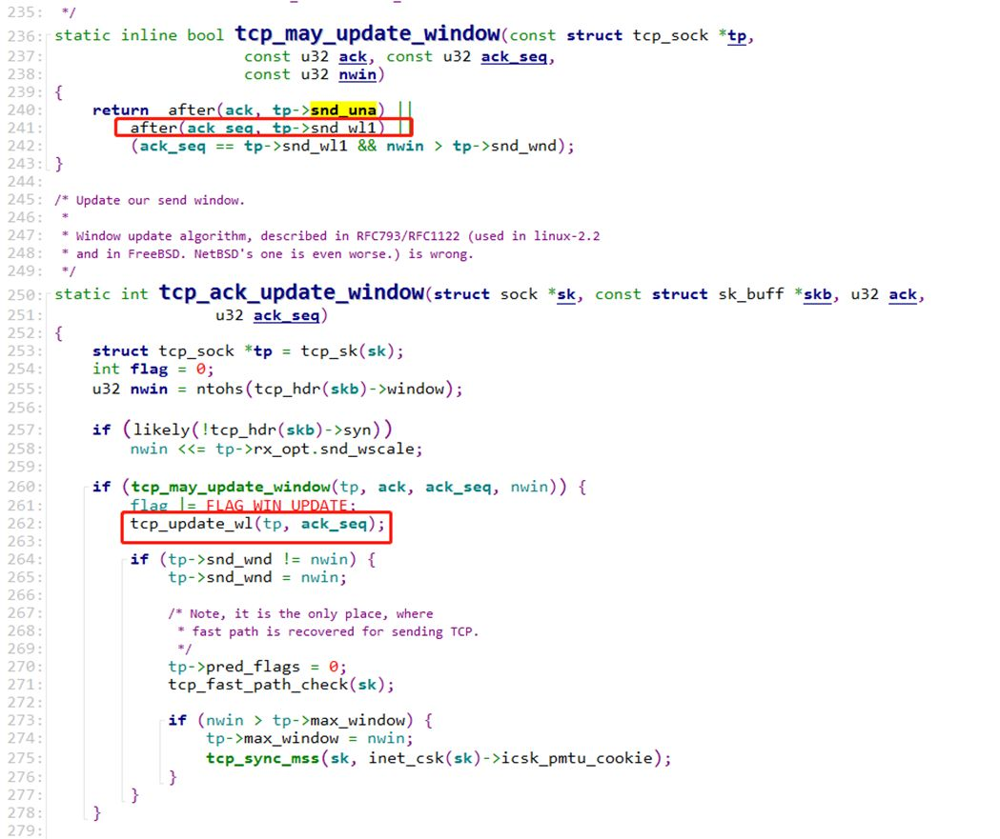

看到这里flag被置为FLAG\_WIN\_UPDATE的条件是tcp\_may\_update\_window返回true。


再看到tcp\_may\_update\_window函数这里，after(ack\_seq, tp->snd\_wl1)是基本都会命中的，因为不管窗口有没有变化，ack\_seq都会比snd\_wl1 大的，ack\_seq都是递增的，snd\_wl1在tcp\_update\_wl中又会被更新成上一次的ack\_seq。因此绝大多数的包的flag都会被打上FLAG\_WIN\_UPDATE标记。

如果是这样的话，那is\_tlp\_dupack不就是都为false了吗？不管有没有收到dup ack包，TLP都会进入拥塞避免，这个就不符合TLP的设计初衷了，**这里是否是内核实现的Bug**？

随后我查看了linux 4.14内核代码：

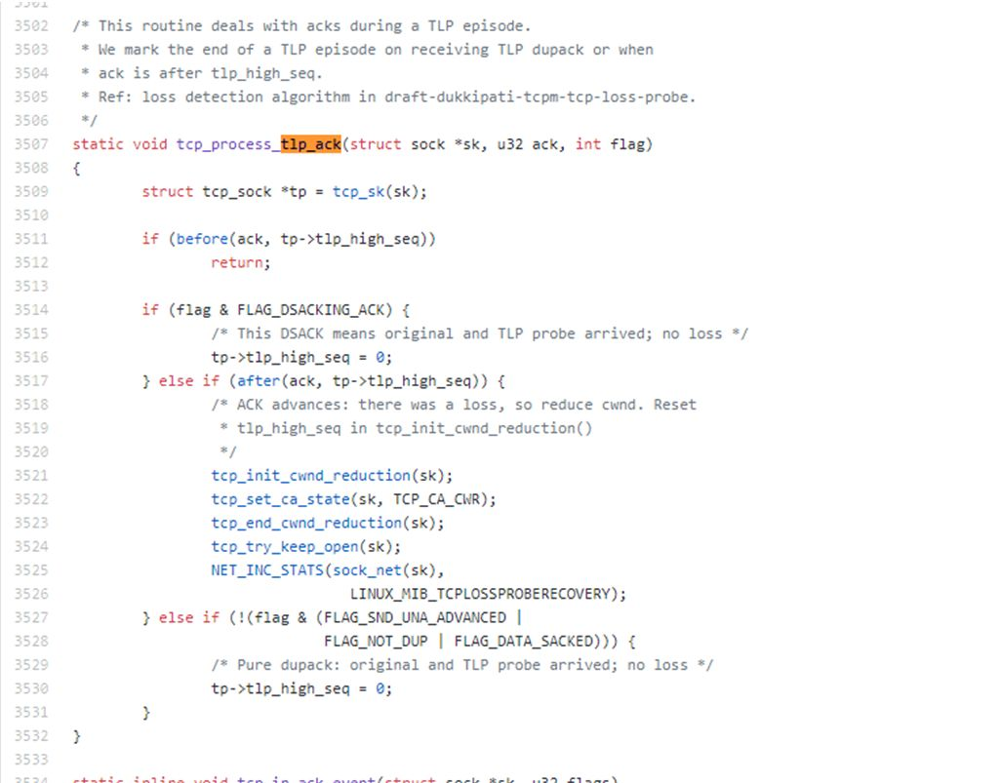

**发现从内核版本linux 4.0开始，BUG就已经被修复了**，去掉了flag的一些不合理的判断条件，这才是真正的符合TLP的设计原理。

**到此，整个问题的所有疑点才都得到了解释。**

**总结**

本文从一个下载慢的线上问题入手，首先介绍了一些常规的排查思路和手段，发现仍然不能定位到原因。然后分享了一个可以查询每条连接的拥塞窗口命令，结合内核代码分析了TCP拥塞控制ssthresh的设计理念及混合慢启动，ER和尾包探测（TLP）等优化算法，并介绍了两个常用的内核调试工具：ftrace和systemtap，最终定位到是内核的TLP实现BUG导致的下载慢的问题，从内核4.0版本之后已经修复了这个问题。

