 <!--BEGIN_DATA
{
    "create_date": "2022-03-01 22:00", 
    "modify_date": "2022-03-01 22:00", 
    "is_top": "0", 
    "summary": "百度C++工程师的那些极限优化（内存篇）", 
    "tags": "C/C++", 
    "file_name": "百度C++工程师的那些极限优化（内存篇）.md"
}
END_DATA-->

#### <p>原文出处：<a href='https://mp.weixin.qq.com/s/BSZTIPTYpNt9I5_0DeAUww' target='blank'>百度C++工程师的那些极限优化（内存篇）</a></p>


> **导读：**在百度看似简简单单的界面后面，是遍布全国的各个数据中心里，运转着的海量C++服务。如何提升性能，降低延时和成本就成了百度C++工程师的必修功课。伴随着优化的深入攻坚，诞生并积累下来一系列的性能优化理论和方案，其中不乏一些冷门但精巧实用的经验和技巧。本文从内存访问角度，收集总结了一些具有通用意义的典型案例，分享出来和大家学习交流。

## 1、背景

在百度看似简简单单的界面后面，是遍布全国的各个数据中心里，运转着的海量C++服务。对C++的重度应用是百度的一把双刃剑，学习成本陡峭，指针类错误定位难、扩散性广另很多开发者望而却步。然而在另一方面，语言层引入的额外开销低，对底层能力可操作性强，又能够为追求极致性能提供优异的实践环境。

因此，对百度的C++工程师来说，掌握底层特性并加以利用来指导应用的性能优化，就成了一门必要而且必须的技能。久而久之，百度工程师就将这种追求极致的性能优化，逐渐沉淀成了习惯，甚至形成了对技术的信仰。下面我们就来盘点和分享一些，在性能优化的征途上，百度C++工程师积累下来的理论和实践，以及那些为了追求极致，所发掘的『奇技淫巧』。

## 2、重新认识性能优化

作为程序员，大家或多或少都会和性能打交道，尤其是以C++为主的后端服务工程师，但是每个工程师对性能优化概念的理解在细节上又是千差万别的。下面先从几个优化案例入手，建立一个性能优化相关的感性认识，之后再从原理角度，描述一下本文所讲的性能优化的切入角度和方法依据。  

### 2.1 从字符串处理开始

#### 2.1.1 string as a buffer

为了调用底层接口和集成一些第三方库能力，在调用界面层，会存在对C++字符串和C风格字符串的交互场景，典型是这样的：

```cpp
size_t some_c_style_api(char* buffer, size_t size);
void some_cxx_style_function(std::string& result) {
    // 首先扩展到充足大小
    result.resize(estimate_size);
    // 从c++17开始，string类型支持通过data取得非常量指针
    auto acture_size = some_c_style_api(result.data(), result.size());
    // 最终调整到实际大小
    result.resize(acture_size);
}
```

这个方法存在一个问题，就是在首次resize时，string对`estimate_size`内的存储区域全部进行了0初始化。但是这个场景中，实际的有效数据其实是在`some_c_style_api`内部被写入的，所以resize时的初始化动作其实是冗余的。在交互buffer的size较大的场景，例如典型的编码转换和压缩等操作，这次冗余的初始化引入的开销还是相当可观的。

为了解决这个问题，大约从3年前开始，已经有人在持续尝试推动标准改进。

> http://www.open-std.org/jtc1/sc22/wg21/docs/papers/2021/p1072r7.html

注：在这个问题上使用clang + libc++的同学有福，较新版本的libc++中已经非标实现了`resize_default_init`功能，可以开始尝鲜使用。

在标准落地前，为了能够在百度内部（目前广泛使用gcc8和gcc10编译器）提前使用起来，我们专门制作了适用于gcc的`resize_uninitialized`，类似于上面的功能，在百度，可以这样编码：

```cpp
size_t some_c_style_api(char* buffer, size_t size);
void some_cxx_style_function(std::string& result) {
    auto* buffer = babylon::resize_uninitialized(result, estimate_size);
    auto acture_size = some_c_style_api(buffer, result.size());
    result.resize(acture_size);
}
```

#### 2.1.2 split string

实际业务中，有一个典型场景是一些轻schema数据的解析，比如一些标准分隔符，典型是'_'或者'\t'，简单分割的分列数据（这在日志等信息的粗加工处理中格外常见）。由于场景极其单纯，可能的算法层面优化空间一般认为较小，而实际实现中，这样的代码是广为存在的：

```cpp
std::vector<std::string> tokens;
// boost::split
boost::split(token, str, [] (char c) {return c == '\t';});
// absl::StrSplit
for (std::string_view sv : absl::StrSplit(str, '\t')) {
    tokens.emplace_back(sv);
}
// absl::StrSplit no copy
for (std::string_view sv : absl::StrSplit(str, '\t')) {
    direct_work_on_segment(sv);
}
```

boost版本广泛出现在新工程师的代码中，接口灵活，流传度高，但是实际业务中效率其实并不优秀，例如和google优化过的absl相比，其实有倍数级的差距。尤其如果工程师没有注意进行单字符优化的时候（直接使用了官方例子中的`is_any_of`），甚至达到了数量级的差距。进一步地，如果联动思考业务形态，一般典型的分割后处理是可以做到零拷贝的，这也可以进一步降低冗余拷贝和大量临时对象的创建开销。

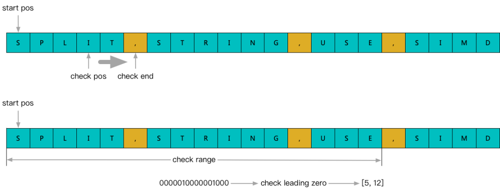

最后，再考虑到百度当前的内部硬件环境有多代不同型号的CPU，进一步改造spilt显式使用SIMD优化，并自适应多代向量指令集，可以取得进一步的性能提升。尤其是bmi指令加速后，对于一个SIMD步长内的连续分隔符探测，比如密集短串场景，甚至可以取得数量级的性能提升。

最终在百度，我们可以这样编码实现：

```cpp
babylon::split([] (std::string_view sv) {
  direct_work_on_segment(sv);
}, str, '\t'};
```

#### 2.1.3 magic of protobuf

随着brpc在百度内部的广泛应用，protobuf成为了百度内部数据交换的主流方式，解析、改写、组装protobuf的代码在每个服务中几乎都会有一定的占比。尤其是近几年，进一步叠加了微服务化的发展趋势之后，这层数据交换边界就变得更加显著起来。

在有些场景下，例如传递并增加一个字段，或者从多个后端存储获取分列表达的数据合并后返回，利用标准的C++API进行反序列化、修改、再序列化的成本，相对于实际要执行的业务来说，额外带来的性能开销会显著体现出来。

举例来说，比如我们定义了这样的message：

```cpp
message Field {

    bytes column = 1;
    bytes value = 2;
};
message Record {
    bytes key = 1;
    repeated Field field = 2;
};
message Response {
    repeated Record record = 1;
    bytes error_message = 2;
};
```

我们设想一个场景，一个逻辑的record分散于多个子系统，那么我们需要引入一个proxy层，完成多个partial record的merge操作，常规意义上，这个merge动作一般是这样的：

```cpp
one_sub_service.query(&one_controller, &request, &one_sub_response, nullptr);
another_sub_service.query(&another_controller, &request, &another_sub_response, nullptr);
...
for (size_t i = 0; i < record_size; ++i) {
    final_response.mutable_record(i).MergeFrom(one_sub_response.record(i));
    final_response.mutable_record(i).MergeFrom(another_sub_response.record(i));
    ...
}
```

对于一个轻量级proxy来说，这一层反复对后端的解析、合并、再序列化引入的成本，就会相对凸现出来了。进一步的消除，就要先从protobuf的本质入手。

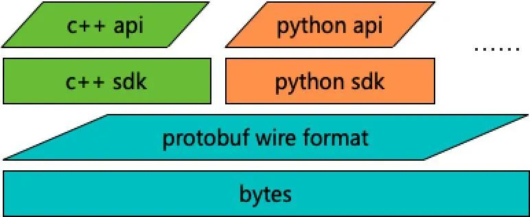

protobuf的根基先是一套公开标准的wire format，其上才是支持多语言构造和解析的SDK，因此尝试降低对解析和合并等操作的进一步优化，绕过c++api，深入wire format层来尝试是一种可行且有效的手段。那么我们先来看一下一些wire format层的特性。

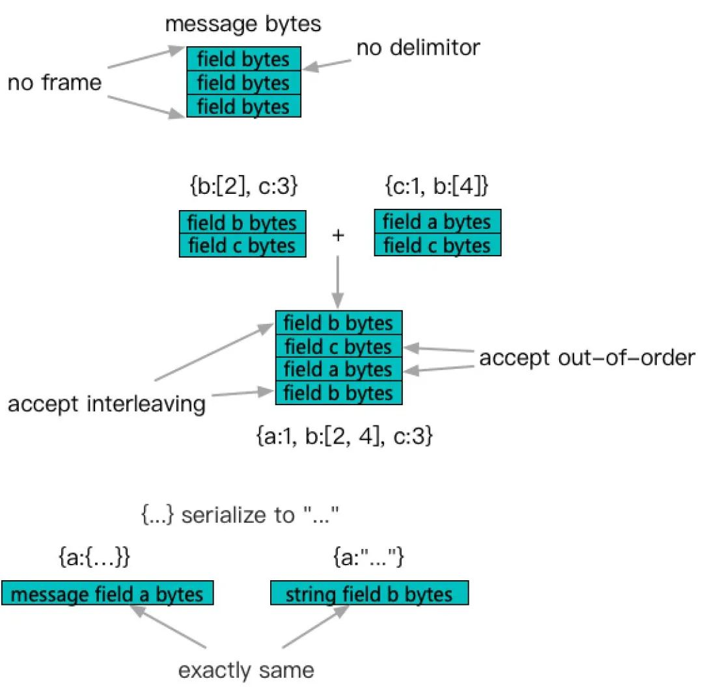

即message的构成直接由内部包含的field的序列化结果堆砌而成，field之间不存在分割点，在整个message外部，也不存在框架信息。基于这个特性，一些合并和修改操作可以在序列化的bytes结果上被低成本且安全地操作。而另一方面，message field的格式和string又是完全一致的，也就是定义一个message field，或者定义一个string field而把对应message序列化后存入，结果是等价的（而且这两个特性是被官方承诺的）。

> https://developers.google.com/protocol-buffers/docs/encoding#optional

结合这些特性，之前的合并操作在实现上我们改造为：

```cpp
message ProxyResponse {
    // 修改proxy侧的message定义，做到不深层解析
    repeated string record = 1;
    bytes error_message = 2;
};

one_sub_service.query(&one_controller, &request, &one_sub_response, nullptr);
another_sub_service.query(&another_controller, &request, &another_sub_response, nullptr);
...
for (size_t i = 0; i < record_size; ++i) {
    // 利用string追加替换message操作
    final_response.mutable_record(i).append(one_sub_response.record(i));
    final_response.mutable_record(i).append(another_sub_response.record(i));
    ...
}
```

在微服务搭的环境下，类似的操作可以很好地控制额外成本的增加。

### 2.2 回头来再看看性能优化

一般来讲，一个程序的性能构成要件大概有三个，即算法复杂度、IO开销和并发能力。

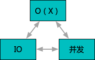

首要的影响因素是大家都熟悉的算法复杂度。一次核心算法优化和调整，可以对应用性能产生的影响甚至是代差级别的。例如LSM Tree对No-SQL吞吐的提升，又例如事件触发对epoll大并发能力的提升。然而正因为关注度高，在实际工程实现层面，无论是犯错几率，还是留下的优化空间，反而会大为下降。甚至极端情况下，可能作为非科研主导的工程师，在进行性能优化时鲜少遇到改良算法的场景，分析问题选择合适算法会有一定占比，但是可能范围也有限。

更多情况下需要工程师解决的性能问题，借用一句算法竞赛用语，用『卡常数』来形容可能更贴切。也就是采用了正确的合适的算法，但是因为没有采用体系结构下更优的实现方案，导致在O(X)上附加了过大的常数项，进而造成的整体性能不足。虽然在算法竞赛中，卡常数和常数优化是出题人和解题人都不愿意大量出现的干扰项（因为毕竟是以核心算法本身为目标），但是转换到实际项目背景下，常数优化却往往是性能优化领域的重要手段。

现在我们再来回顾一下上面引出问题的三个优化案例。可以看到，其中都不包含算法逻辑本身的改进，但是通过深入利用底层（比如依赖库或指令集）特性，依然能够取得倍数甚至数量级的优化效果。这和近些年体系结构变得越发复杂有很大关联，而这些变化，典型的体现场景就是IO和并发。并发的优化，对于工程经验比较丰富的同学应该已经不陌生了，但是关于IO，尤其是『内存IO』可能需要特别说明一下。

与代码中显示写出的read/write/socket等设备IO操作不同，存储系统的IO很容易被忽略，因为这些IO透明地发生在普通CPU指令的背后。先列举2009年Jeff Dean的一个经典讲座中的一页数字。

> https://www.cs.cornell.edu/projects/ladis2009/talks/dean-keynote-ladis2009.pdf

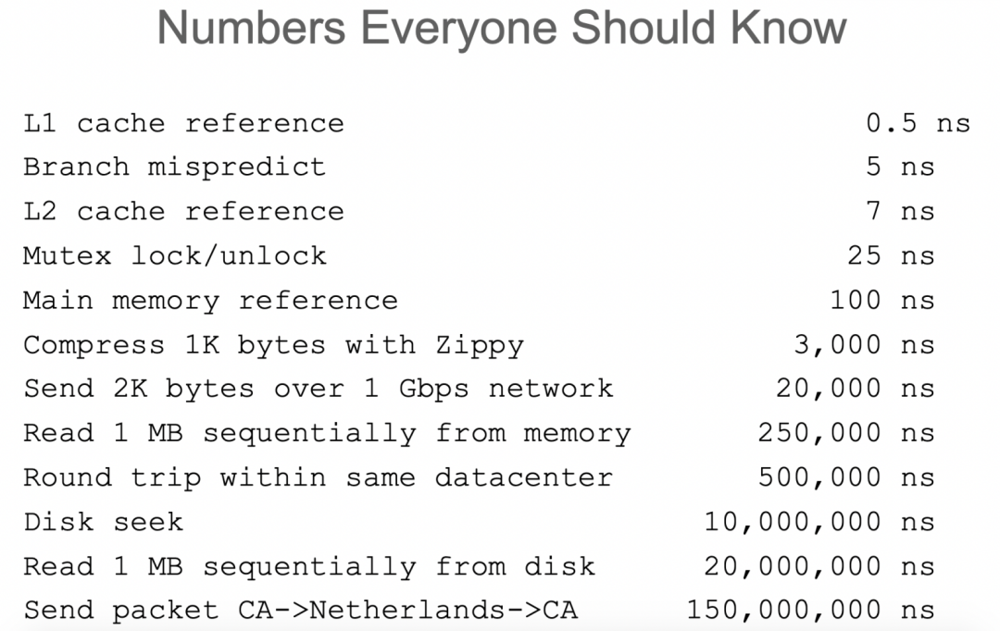

虽然已经是十多年前的数据，但是依然可以看出，最快速的L1 cache命中和Main memory访问之间，已经拉开了多个数量级的差距。这些操作并不是在代码中被显式控制的，而是CPU帮助我们透明完成的，在简化编程难度的同时，却也引入了问题。也就是，如果不能良好地适应体系结构的特性，那么看似同样的算法，在常数项上就可能产生数量级的差异。而这种差异因为隐蔽性，恰恰是最容易被新工程师所忽略的。下面，我们就围绕内存访问这个话题，来盘点一下百度C++工程师的一些『常数优化』。

## 3、从内存分配开始

要使用内存，首先就要进行内存分配。进入了c++时代后，随着生命周期管理的便捷化，以及基于class封装的各种便捷容器封装的诞生，运行时的内存申请和释放变得越来越频繁。但是因为地址空间是整个进程所共享的一种资源，在多核心系统中就不得不考虑竞争问题。有相关经验的工程师应该会很快联想到两个著名的内存分配器，tcmalloc和jemalloc，分别来自google和facebook。下面先来对比一下两者的大致原理。

### 3.1 先看看tcmalloc和jemalloc

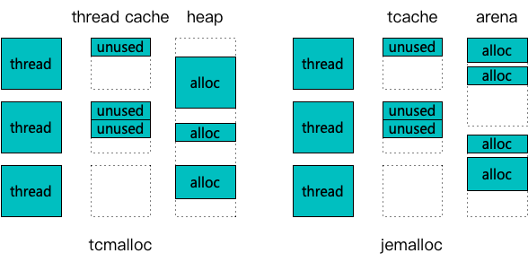

针对多线程竞争的角度，tcmalloc和jemalloc共同的思路是引入了线程缓存机制。通过一次从后端获取大块内存，放入缓存供线程多次申请，降低对后端的实际竞争强度。而典型的不同点是，当线程缓存被击穿后，tcmalloc采用了单一的page heap（简化了中间的transfer cache和central cache，他们也是全局唯一的）来承载，而jemalloc采用了多个arena（默认甚至超过了服务器核心数）来承载。因此和网上流传的主流评测推导原理一致，在线程数较少，或释放强度较低的情况下，较为简洁的tcmalloc性能稍胜过jemalloc。而在核心数较多、申请释放强度较高的情况下，jemalloc因为锁竞争强度远小于tcmalloc，会表现出较强的性能优势。

一般的评测到这里大致就结束了，不过我们可以再想一步，如果我们愿意付出更多的内存到cache层，将后端竞争压力降下来，那么是否tcmalloc依然可以回到更优的状态呢？如果从上面的分析看，应该是可以有这样的推论的，而且近代服务端程序的瓶颈也往往并不在内存占用上，似乎是一个可行的方案。

不过实际调整过后，工程师就会发现，大多数情况下，可能并不能达到预期效果。甚至明明从perf分析表现上看已经观测到竞争开销和申请释放动作占比很小了，但是整个程序表现依然不尽如人意。

这实际上是内存分配**连续性**的对性能影响的体现，即线程缓存核心的加速点在于将**申请批量化**，而非单纯的降低后端压力。缓存过大后，就会导致持续反复的申请和释放都由缓存承担，结果是缓存中存放的内存块地址空间分布越来越零散，呈现一种**洗牌**效果。

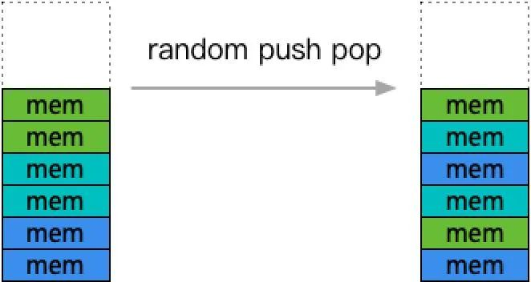

体系结构的缓存优化，一般都是以局部性为标准，也就是说，程序近期访问的内存附近，大概率是后续可能被访问的热点。因此，如果程序连续申请和访问的内存呈跳跃变化，那么底层就很难正确进行缓存优化。体现到程序性能上，就会发现，虽然分配和释放动作都变得开销很低了，但是程序整体性能却并未优化（因为真正运行的算法的访存操作常数项增大）。

### 3.2 那么理想的malloc模型是什么？

通过前面的分析，我们大概得到了两条关于malloc的核心要素，也就是竞争性和连续性。那么是否jemalloc是做到极致了呢？要回答这个问题，还是要先从实际的内存使用模型分析开始。

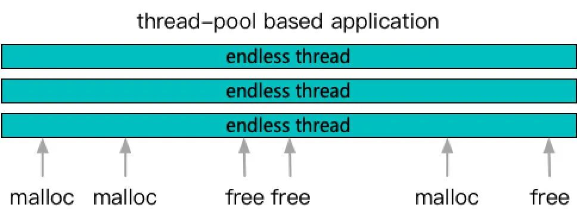

这是一个很典型的程序，核心是一组持续运行的线程池，当任务到来后，每个线程各司其职，完成一个个的任务。在malloc看来，就是多个长生命周期的线程，随机的在各个时点发射malloc和free请求。如果只是基于这样的视图，其实malloc并没有办法做其他假定了，只能也按照基础局部性原理，给一个线程临近的多次malloc，尽量分配连续的地址空间出来。同时利用线程这一概念，将内存分区隔离，减少竞争。这也就是tcmalloc和jemalloc在做的事情了。

但是内存分配这件事和程序的边界就只能在这里了吗？没有更多的业务层输入，可以让malloc做的更好了吗？那么我们再从业务视角来看一下内存分配。

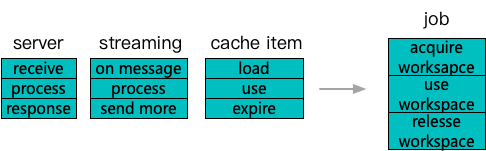

微服务、流式计算、缓存，这几种业务模型几乎涵盖了所有主流的后端服务场景。而这几种业务对内存的应用有一个重要的特征，就是拥有边界明确的生命周期。回退到早期的程序设计年代，其实server设计中每个请求单独一个启动线程处理，处理完整体销毁是一个典型的方案。即使是使用线程池，一个请求接受后从头到尾一个线程跟进完成也是持续了相当长时间的成熟设计。

而针对这种早期的业务模型，其实malloc是可以利用到更多业务信息的，例如线程动态申请的内存，大概率后续某个时点会全部归还，从tcmalloc的线程缓存调整算法中也可以看出对这样那个的额外信息其实是专门优化过的。

但是随着新型的子任务级线程池并发技术的广泛应用，即请求细分为多个子任务充分利用多核并发来提升计算性能，到malloc可见界面，业务特性几乎已经不复存在。只能看到持续运行的线程在随机malloc和free，以及大量内存的malloc和free漂移在多个线程之间。

那么在这样job化的背景下，怎样的内存分配和释放策略能够在竞争性和局部性角度工作的更好呢？下面我们列举两个方案。

#### 3.2.1 job arena

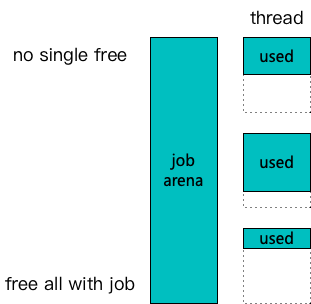

第一种是基础的job arena方案，也就是每个job有一个独立的内存分配器，job中使用的动态内存注册到job的arena中。因为job生命周期明确，中途释放的动态内存被认为无需立即回收，也不会显著增大内存占用。在无需考虑回收的情况下，内存分配不用再考虑分块对齐，每个线程内可以完全连续。最终job结束后，整块内存直接全部释放掉，大幅减少实际的竞争发生。

显而易见，因为需要感知业务生命周期，malloc接口是无法获得这些信息并进行支持的，因此实际会依赖运行时使用的容器能够单独暴露内存分配接口出来。幸运的是，在STL的带动下，现实的主流容器库一般都实现了allocator的概念，尽管细节并不统一。

例如重度使用的容器之一protobuf，从protobuf 3.x开始引入了Arena的概念，可以允许Message将内存结构分配通过Arena完成。可惜直到最新的3.15版本，string field的arena分配依然没有被官方支持。

> https://github.com/protocolbuffers/protobuf/issues/4327

但是，因为string/bytes是业务广为使用的类型，如果脱离Arena的话，实际对连续性的提升就会大打折扣。因此在百度，我们内部维护了一个ArenaString的patch，重现了issue和注释中的表达，也就是在Arena上分配一个『看起来像』string的结构。对于读接口，因为和string的内存表达一致，可以直接通过const string&呈现。对于mutable接口，会返回一个替代的ArenaString包装类型，在使用了auto技术的情况下，几乎可以保持无缝切换。  

另外一个重度使用的容器就是STL系列了，包括STL自身实现的容器，以及boost/tbb/absl中按照同类接口实现的高级容器。从C++17开始，STL尝试将之前混合在allocator中的内存分配和实例构造两大功能进行拆分，结果就是产生了PMR（Polymorphic Memory Resouce）的概念。在解耦了构造器和分配器之后，程序就不再需要通过修改模板参数中的类型，来适应自己的内存分配方法了。其实PMR自身也给出了一种连续申请，整体释放的分配器实现，即`monotonic_buffer_resource`，但是这个实现是非线程安全的。

结合上面两个内存分配器的概念，在实际应用中，我们利用线程缓存和无锁循环队列（降低竞争），整页获取零散供给（提升连续）实现了一个SwissMemoryResource，通过接口适配统一支持STL和protobuf的分配器接口。最终通过protocol插件集成到brpc中，在百度，我们可以如下使用：

```cpp
babylon::ReusableRPCProtocol::register_protocol();
::baidu::rpc::ServerOptions options;
options.enabled_protocols = "baidu_std_reuse";

class SomeServiceImpl : public SomeService {
public:
    // request和response本身采用了请求级别的memory resource来分配
    virtual void some_method(google::protobuf::RpcController* controller,
            const SomeRequest* request,
            SomeResponse* response,
            google::protobuf::Closure* done) {
        baidu::rpc::ClosureGuard guard(done);
        // 通过转换到具体实现来取得MemoryResource
        auto* closure = static_cast<babylon::ReusableRPCProtocol::Closure*>(done);
        auto& resource = closure->memory_resource();
        // 做一些请求级别的动态容器
        std::pmr::vector<std::pmr::string> tmp_vector(&resource);
        google::protobuf::Arena::CreateMessage<SomeOtherMessage>(&(Arena&)resource);
        ...
        // done->Run时请求级内存整体释放
    }
};
```

### 3.2.2 job reserve

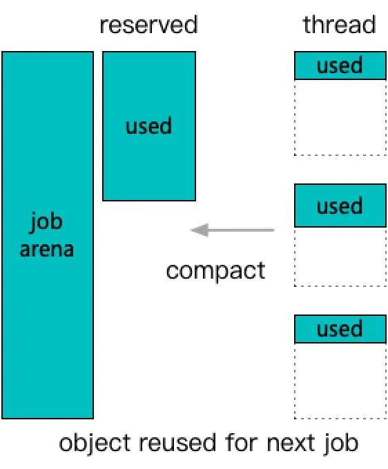

更复杂一些的是job reserve方案，在job arena的基础上，结合了job结束后不析构中间结构，也不释放内存，转而定期进行紧凑重整。这就进一步要求了中间结构是可以在保留内存的情况下完成重置动作的，并且能够进行容量提取，以及带容量重新构建的功能。这里用vector<string>为例解释一下：

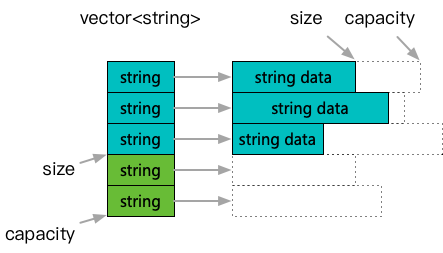

和典型的vector处理主要不同点是，在clear或者pop_back等操作缩减大小之后，内容对象并没有实际析构，只是清空重置。

因此，再一次用到这个槽位的时候，可以直接拿到已经构造好的元素，而且其capacity之内的内存也依然持有。可以看到反复使用同一个实例，容器内存和每个元素自身的capacity都会逐渐趋向于饱和值，反复的分配和构造需求都被减少了。了解过protobuf实现原理的工程师可以对照参考，这种保留实例的clear动作，也是protobuf的message锁采用的方法。

不过关注到之前提过局部性的工程师可能会发现，尽管分配需求降低了，但是最终饱和态的内存分布在连续性上仍不理想，毕竟中途的动态分配是按需进行，而未能参考局部性了。因此容器还需要支持一个动作，也就是重建。

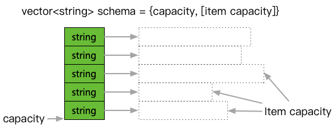

也就是，当重复利用多次，发生了较多临时申请之后，需要能够提取出当前的容量schema，在新的连续空间中做一次原样重建，让内存块重新回归连续。

### 3.3 总结一下内存分配

通过分析malloc的性能原理，引入这两种细粒度的内存分配和管理方案，可以在更小的竞争下，得到更好的内存连续性。

在实测中，简单应用做到job arena一般就可以取得大部分性能收益，一般能够达到倍数级提升，在整体服务角度也能够产生可观测的性能节省。而job reserve，虽然可以获得进一步地性能提升，但一方面是因为如果涉及非protobuf容器，需要实现自定义的schema提取和重建接口，另一方面趋于饱和的capacity也会让内存使用增大一些。引入成本会提高不少，因此实际只会在性能更为紧要的环节进行使用。

## 4、再来看看内存访问

内存分配完成后，就到了实际进行内存访问的阶段了。一般我们可以将访存需求拆解到两个维度，一个是单线程的连续访问，另一个是多个线程的共享访问。下面就分拆到两个部分来分别谈谈各个维度的性能优化方法。

### 4.1 顺序访存优化

一般来说，当我们要执行大段访存操作时，如果访问地址连续，那么实际效率可以获得提升。典型例如对于容器遍历访问操作，数组组织的数据，相比于比链表组织的数据，一般会有显著的性能优势。其实在内存分配的环节，我们引入的让连续分配（基本也会是连续访问）的空间地址连续性更强，也是出于这一目的。

那么下面我们先来看一看，连续性的访问产生性能差异的原理是什么。

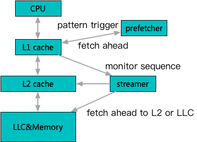

这里以Intel CPU为例来简要描述一下预取过程。详见：

> https://www.intel.com/content/dam/www/public/us/en/documents/manuals/64-ia-32-architectures-optimization-manual.pdf

当硬件监测到连续地址访问模式出现时，会激活多层预取器开始执行，参考当前负载等因素，将预测将要访问的数据加载到合适的缓存层级当中。这样，当后续访问真实到来的时候，能够从更近的缓存层级中获取到数据，从而加速访问速度。因为L1容量有限，L1的硬件预取步长较短，加速目标主要为了提升L2到L1，而L2和LLC的预取步长相对较长，用于将主存提升到cache。  

在这里局部性概念其实充当了软硬件交互的某种约定，因为程序天然的访问模式总有一些局部性，硬件厂商就通过预测程序设计的局部性，来尽力加速这种模式的访问请求，力求做到通用提升性能。而软件设计师，则通过尽力让设计呈现更多的局部性，来激活硬件厂商设计的优化路径，使具体程序性能得到进一步优化。某种意义上讲，z不失为一个相生相伴的循环促进。

这里通过一个样例来验证体现一下如何尊重局部性，以及局部性对程序的影响。

```cpp
// 设计一块很大的存储区域用于存储固定维度的浮点向量
// vecs中存储每个浮点向量的起始地址
std::vector<float> large_memory_buffer;
std::vector<float*> vecs;

std::shuffle(vecs.begin(), vecs.end(), random_engine);

for (size_t i = 0; i < vecs.size(); ++i) {
    __builtin_prefetch(vecs[i + step]);
    dot_product(vecs[i], input);
}
```

这是一个推荐/搜索系统中常见的内积打分场景，即通过向量计算来进行大规模打分。同样的代码，依据shuffle和prefetch存在与否，产生类似如下的表现：

  1. `shuffle & no prefetch：44ms`

  2. `shuffle & prefetch：36ms`

  3. `shuffle & no prefetch：13ms`

  4. `shuffle & prefetch：12ms`

从1和3的区别可以看出，完全相同的指令，在不同的访存顺序下存在的性能差距可以达到倍数级。而从1和2的区别可以看出，手动添加预取操作后，对性能有一定改善，预期更精细地指导预取步长和以及L1和L2的分布还有改善空间。不过指令执行周期和硬件效率很难完备匹配，手动预取一般用在无法改造成物理连续的场景，但调参往往是一门玄学。最后3和4可以看出，即使连续访存下，预取依然有一些有限的收益，推测和硬件预取无法跨越页边界造成的多次预测冷启动有关，但是影响已经比较微弱了。

最具备指导意义的可能就是类似这个内积打分的场景，有时为了节省空间，工程师会将程序设计为，从零散的空间取到向量指针，并组成一个数组或链表系统来管理。天然来讲，这样节省了内存的冗余，都引用向一份数据。但是如果引入一些冗余，将所需要的向量数据一同拷贝构成连续空间，对于检索时的遍历计算会带来明显的性能提升。

### 4.2 并发访问优化

提到并发访问，可能要先从一个概念，缓存行（cache line）说起。

为了避免频繁的主存交互，其实缓存体系采用了类似malloc的方法，即划分一个最小单元，叫做缓存行（主流CPU上一般64B），所有内存到缓存的操作，以缓存行为单位整块完成。

例如对于连续访问来说第一个B的访问就会触发全部64B数据都进入L1，后续的63B访问就可以直接由L1提供服务了。所以并发访问中的第一个问题就是要考虑缓存行隔离，也就是一般可以认为，位于不同的两个缓存行的数据，是可以被真正独立加载/淘汰和转移的（因为cache间流转的最小单位是一个cache line）。

典型的问题一般叫做false share现象，也就是不慎将两个本无竞争的数据，放置在一个缓存行内，导致因为体系结构的原因，引入了『本不存在的竞争』。这点在网上资料比较充足，例如brpc和disruptor的设计文档都比较详细地讲解了这一点，因此这里就不再做进一步的展开了。

### 4.3 那先来聊聊缓存一致性

排除了false share现象之后，其余就是真正的共享问题了，也就是确实需要位于同一个缓存行内的数据（往往就是同一个数据），多个核心都要修改的场景。由于在多核心系统中cache存在多份，因此就需要考虑这多个副本间一致性的问题。这个一致性一般由一套状态机协议保证（MESI及其变体）。

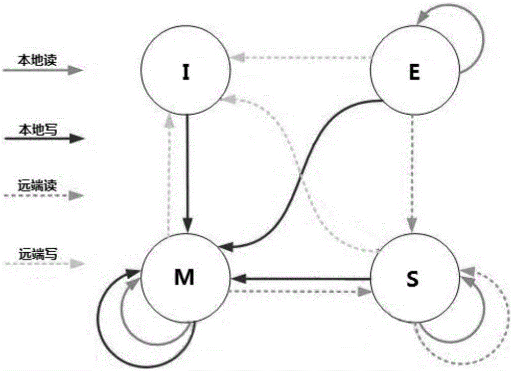

大体是，当竞争写入发生时，需要竞争所有权，未获得所有权的核心，只能等待同步到修改的最新结果之后，才能继续自己的修改。这里要提一下的是有个流传甚广的说法是，因为缓存系统的引入，带来了不一致，所以引发了各种多线程可见性问题。

这么说其实有失偏颇，MESI本质上是一个『一致性』协议，也就是遵守协议的缓存系统，其实对上层CPU多个核心做到了顺序一致性。比如对比一下就能发现，缓存在竞争时表现出来的处理动作，其实和只有主存时是一致的。

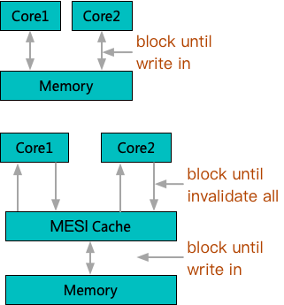

只是阻塞点从竞争一个物理主存单元的写入，转移到了虽然是多个缓存物理单元，但是通过协议竞争独占上。不过正因为竞争阻塞情况并没有缓解，所以cache的引入其实搭配了另一个部件也就是写缓冲（store buffer）。

注：写缓存本身引入其实同时收到乱序执行的驱动，在《并发篇》会再次提到。

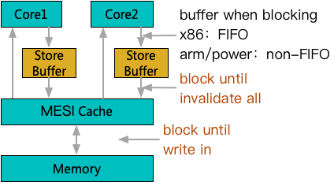

写缓冲的引入，真正开始带来的可见性问题。

以x86为例，当多核发生写竞争时，未取得所有权的写操作虽然无法生效到缓存层，但是可以在改为等待在写缓冲中。而CPU在一般情况下可以避免等待而先开始后续指令的执行，也就是虽然CPU看来是先进行了写指令，后进行读指令，但是对缓存而言，先进行的是读指令，而写指令被阻塞到缓存重新同步之后才能进行。要注意，如果聚焦到缓存交互界面，整体依然是保证了顺序一致，但是在指令交互界面，顺序发生了颠倒。这就是典型的StoreLoad乱序成了LoadStore，也是x86上唯一的一个乱序场景。而针对典型的RISC系统来说（arm/power），为了流水线并行度更高，一般不承诺写缓冲FIFO，当一个写操作卡在写缓冲之后，后续的写操作也可能被先处理，进一步造成StoreStore乱序。

写缓冲的引入，让竞争出现后不会立即阻塞指令流，可以容忍直到缓冲写满。但因为缓存写入完成需要周知所有L1执行作废操作完成，随着核心增多，会出现部分L1作废长尾阻塞写缓冲的情况。因此一些RISC系统引入了进一步的缓冲机制。

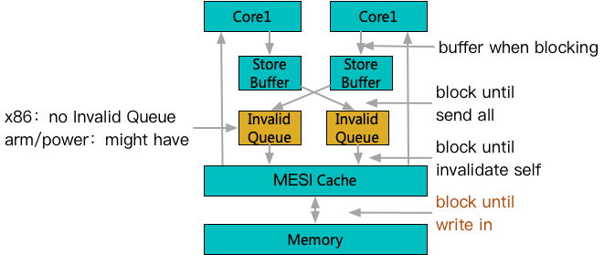

进一步的缓冲机制一般叫做失效队列，也就是当一个写操作只要将失效消息投递到每个L1的失效队列即视为完成，失效操作长尾不再影响写入。这一步改动甚至确实地部分破坏了缓存一致性，也就是除非一个核心等待当前失效消息排空，否则可能读取到过期数据。

到这里已经可以感受到，为了对大量常规操作进行优化，近代体系结构设计中引入了多个影响一致性的机制。但是为了能够构建正确的跨线程同步，某些关键节点上的一致性又是必不可少的。

因此，配套的功能指令应运而生，例如x86下mfence用于指导后续load等待写缓冲全部生效，armv8的lda用于确保后续load等待invalid生效完成等。这一层因为和机型与指令设计强相关，而且指令的配套使用又能带来多种不同的内存可见性效果。这就大幅增加了工程师编写正确一致性程序的成本，而且难以保证跨平台可移植。于是就到了标准化发挥作用的时候了，这个关于内存一致性领域的标准化规范，就是内存序（memory order）。

### 4.4 再谈一谈memory order

作为一种协议机制，内存序和其他协议类似，主要承担了明确定义接口层功能的作用。体系结构专家从物理层面的优化手段中，抽象总结出了多个不同层级的逻辑一致性等级来进行刻画表达。这种抽象成为了公用边界标准之后，硬件和软件研发者就可以独立开展各自的优化工作，而最终形成跨平台通用解决方案。

对于硬件研发者来说，只要能够最终设计一些特定的指令或指令组合，支持能够实现这些内存序规范的功能，那么任意的设计扩展原理上都是可行的，不用考虑有软件兼容性风险。同样，对于软件研发者来说，只要按照标准的逻辑层来理解一致性，并使用正确的内存序，就可以不用关注底层平台细节，写出跨平台兼容的多线程程序。

内存序在官方定义里，是洋洋洒洒一大篇内容，为了便于理解，下面从开发程序须知角度，抽出一些简洁精炼的概念（虽不是理论完备的）来辅助记忆和理解。

首先来看看，内存序背后到底发生了啥。

```cpp
int payload = 0;
int flag = 0;

void normal_writer(int i) {
  payload = flag + i;
  flag = 1;
}

int normal_reader() {
  while (flag == 0) {
  }
  return payload;
}
```

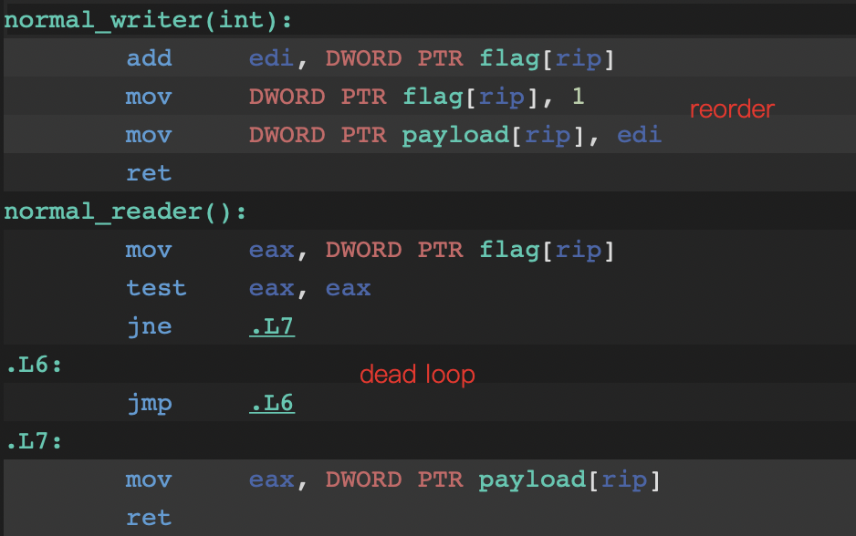

在这个样例中可以看到，在编译层，默认对于无关指令，会进行一定程度的顺序调整（不影响正确性的前提下）。另一方面，编译器默认可以假定不受其他线程影响，因此同一个数据连续的多次内存访问可以省略。

下面看一下最基础的内存序等级，relaxed。

```cpp
int payload = 0;
std::atomic<int> flag {0};

void relaxed_writer(int i) {
    payload = flag.load(std::memory_order_relaxed) + i;
    flag.store(1, std::memory_order_relaxed);
}

int relaxed_reader() {
    while (flag.load(std::memory_order_relaxed) == 0) {
    }
    return payload;
}
```

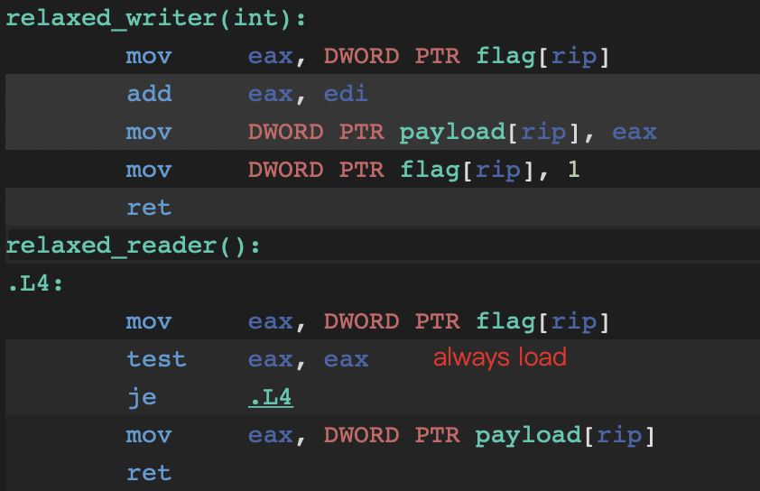

在使用了基础的内存序等级relaxed之后，编译器不再假设不受其他线程影响，每个循环都会重新加载flag。另外可以观测到flag和payload的乱序被恢复了，不过原理上relaxed并不保证顺序，也就是这个顺序并不是一个编译器的保证承诺。总体来说，relaxed等级和普通的读写操作区别不大，只是保证了对应的内存访问不可省略。

更进一步的内存序等级是consume-release，不过当前没有对应的实现案例，一般都被默认提升到了下一个等级，也就是第一个真实有意义的内存序等级acquire-release。先从原理上讲，一般可以按照满足条件/给出承诺的方式来简化理解，即：

  * **要求：**对同一变量M分别进行写（release）A和读（acquire）B，B读到了A写入的值。

  * **承诺：**A之前的所有其他写操作，对B之后的读操作可见。

  * **实际影响：**

    1. 涉及到的操作不会发生穿越A/B操作的重排；

    2. X86：无额外指令；

    3. ARMv8：A之前排空store buffer，B之后排空invalid queue，A/B保序；

    4. ARMv7&Power：A之前全屏障，B之后全屏障。

```cpp
int payload = 0;
std::atomic<int> flag {0};

void release_writer(int i) {
    payload = flag.load(std::memory_order_relaxed) + i;
    flag.store(1, std::memory_order_release);
}

int acquire_reader() {
    while (flag.load(std::memory_order_acquire) == 0) {
    }
    return payload;
}
```

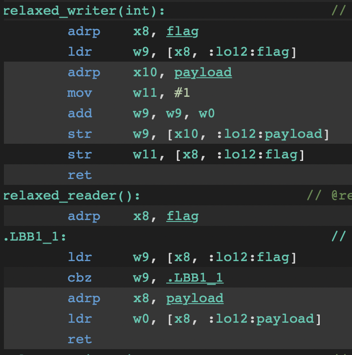

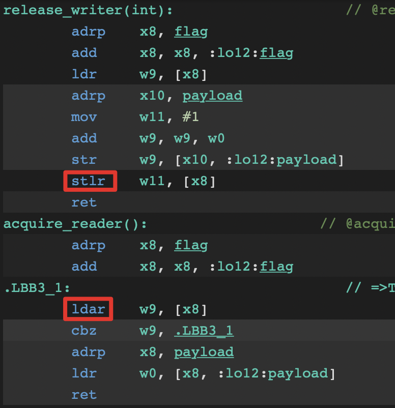

由于x86默认内存序不低于acquire-release，这里用ARMv8汇编来演示效果。可以看出对应指令发生了替换，从st/ld变更到了stl/lda，从而利用armv8的体系结构实现了相应的内存序语义。

再进一步的内存序，就是最强的一级sequentially-consistent，其实就是恢复到了MESI的承诺等级，即顺序一致。同样可以按照满足条件/给出承诺的方式来简化理解，即：

  * **要求：**对两个变量M，N的（Sequentially Consistent）写操作Am，An。在任意线程中，通过（Sequentially Consistent）的读操作观测到Am先于An。

  * **承诺：**在其他线程通过（Sequentially Consistent）的读操作B也会观测到Am先于An。

  * **实际影响：**

    1. X86：Am和An之后清空store buffer，读操作B无额外指令；

    2. ARMv8：Am和An之前排空store buffer， B之后排空invalid queue，A/B保序；

    3. ARMv7：Am和An前后全屏障，B之后全屏障；

    4. POWER：Am和An前全屏障，B前后全屏障。

值得注意的是，ARMv8开始，特意优化了sequentially-consistent等级，省略了全屏障成本。推测是因为顺序一致在std::atomic实现中作为默认等级提供，为了通用意义上提升性能做了专门的优化。

### 4.5 理解memory order如何帮助我们

先给出一个基本测试的结论，看一下一组对比数据：

  1. 多线程竞争写入近邻地址sequentially-consistent：0.71单位时间

  2. 多线程竞争写入近邻地址release：0.006单位时间

  3. 多线程竞争写入cache line隔离地址sequentially-consistent：0.38单位时间

  4. 多线程竞争写入cache line隔离地址release：0.02单位时间

这里可以看出，做cache line隔离，对于sequentially-consistent内存序下，有一定的收益，但是对release内存序，反而有负效果。这是由于release内存序下，因为没有强内存屏障，写缓冲起到了竞争缓解的作用。而在充分缓解了竞争之后，因为cache line隔离引入了相同吞吐下更多cache line的传输交互，反而开销变大。

在这个信息指导下，我们在实现无锁队列时，采用了循环数组 + 分槽位版本号的模式来实现。因为队列操作只需要acquire-release等级，分槽位版本号间无需采用cache line隔离模式设计，整体达到了比较高的并发性能。

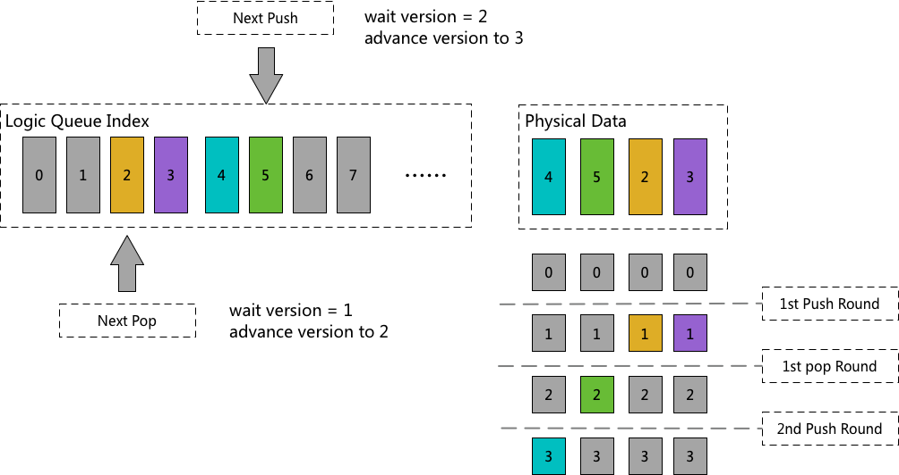
