 
<!--BEGIN_DATA
{
    "create_date": "2022-04-09 12:20", 
    "modify_date": "2022-04-09 12:20", 
    "is_top": "0", 
    "summary": "直播卡顿问题及优化方案", 
    "tags": "音视频", 
    "file_name": "直播卡顿问题及优化方案.md"
}
END_DATA-->

#### 
原文出处：<a href='https://mp.weixin.qq.com/s/mTbd6hUUTltgfyDAT278CA' target='blank'>直播卡顿问题及优化方案</a>

本期内容主要包括四个方面：直播链路监控、卡顿质量指标、卡顿原因分析以及推荐优化方案。

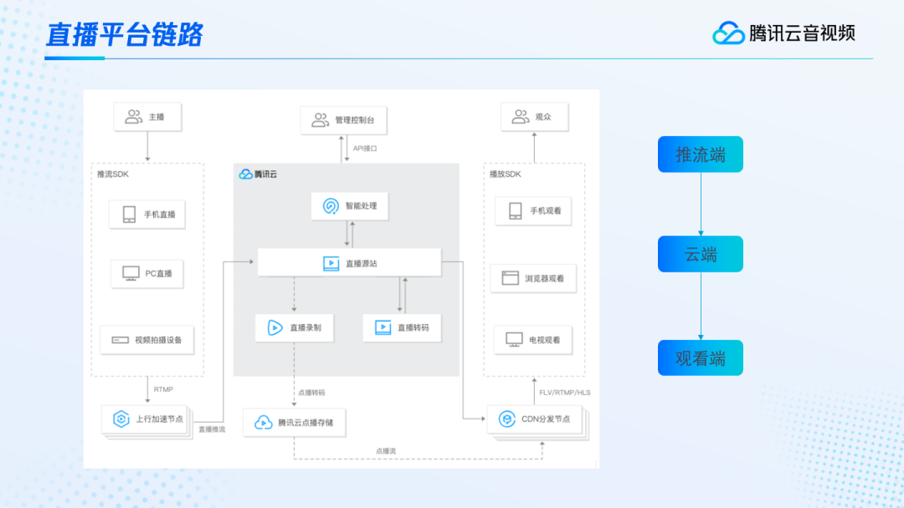

上图是我们整个直播平台的链路示意图。我们的主播在推流端，通过手机、PC或者是专业的视频拍摄设备进行推流。常规使用RTMP协议推流至服务端，也就是云端。云端进行智能处理、录制、转码等一系列操作后，通过CDN分发到全国甚至是全球各地的观众进行观看。这里的播放端包括手机、浏览器、电视等方式。简单总结的话，整个直播链路可以分成推流端、云端以及播放端三块。我们后面的内容，都会围绕这三端来进行展开。  

以上是直播的整个链路，我们再介绍一下如何监控直播质量的好坏。一般情况下，业界通常使用QoE和QoS两种指标。

  * **QoE是一种与用户体验相关的指标**，通常包括观看时长、在线人数、完播率、评论数以及GMV/打赏等指标。这类指标以用户的主观感受为主。
  * **QoS是相对客观的服务质量指标**，其中包括卡顿、秒开、端到端延时、开播成功率，开播跳帧等等。

这些指标中，卡顿是用户最为敏感的。因为一旦出现卡顿，用户的观看体验就会大打折扣。所以我们今天就重点介绍一下卡顿的质量指标及优化情况。

我们经常在观看直播或长短视频的过程中，出现一些“卡了”的情况。它的具体表现可能是视频正在加载中、显示loading、或者画面卡住不动。那我们怎么去描述这种现象呢？**我们给这种现象一个简单的定义：在直播的播放过程中因网络不稳、设备性能不足、直播流内容异常等导致的音视频播放不连续的现象**。简单来讲就是这个音视频的播放不连续了。出现这种情况，我们直观上会首先认为是自身网络问题导致视频下载不下来，所以出现卡顿。但我们具体从底层的技术上来看，又是为什么出现卡顿呢？

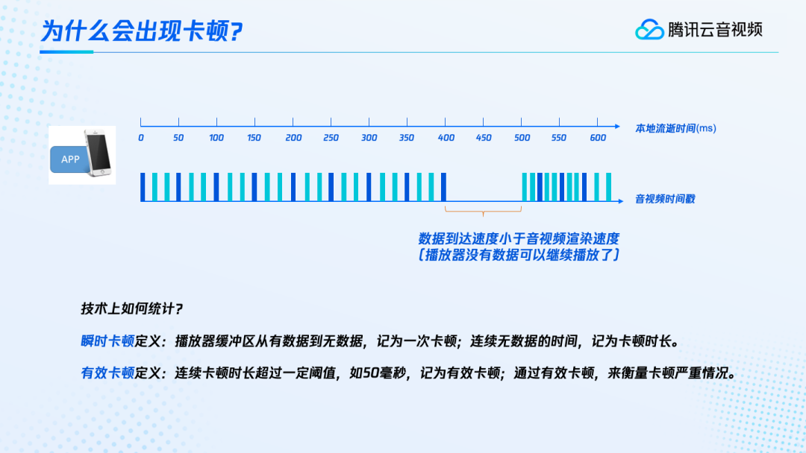  

假设有一个APP在手机上播放帧率为20fps的视频，随着本地流逝时间如上面坐标轴这样，从0-600ms均匀的流逝，正常情况下，每50ms就会收到一帧视频帧。这里用蓝色柱表示一帧视频，绿色柱表示一帧音频，如果是网络稳定，音视频的数据就会均匀的接收和渲染，其中的时间戳也均匀的前进。但是如果由于网络或者视频本身等各种原因，导致数据里面时间戳的增加速度小于音视频的渲染速度，这时候就会出现卡顿。此时播放器没有数据可以继续渲染播放，用户的画面也就会出现暂停、跳帧等情况。  

那在技术上我们如何对卡顿进行统计呢？在统计之前，我们得先在技术上对卡顿进行定义。**我们把播放器缓冲区从有数据到无数据，记为一次卡顿，连续无数据的时间记为卡顿时长**。但是由于人眼对几毫秒甚至几十毫秒的卡顿，并不敏感，同时音视频的到达本身具有间隔，所以我们通常会添加一个buffer，**当连续卡顿时长超过一定的阈值，比如50ms的时候，才将其记作有效卡顿**。有效卡顿是我们衡量卡顿严重情况的依据。  

有了卡顿的定义，我们具体通过什么指标来统计卡顿的严重情况？业界常用的指标包括客户端的百秒卡顿时长、百秒卡顿次数、视频渲染百秒卡顿时长、视频渲染百秒卡顿次数以及服务端的接收慢速、发送慢速、流畅度。

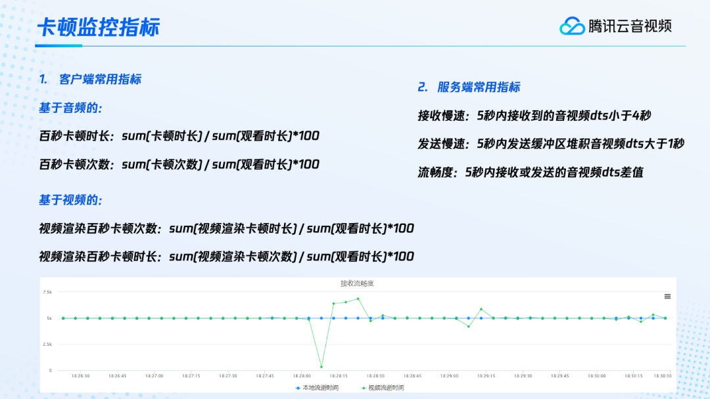 

客户端大部分是基于音频来统计卡顿的。其中百秒卡顿时长就是将所有参与评价的直播观看行为中出现的音频卡顿时长加和，然后除以全部直播观看时长加和，再乘以100。百秒卡顿次数也是类似的定义。除了音频外，还有一些APP会基于视频进行卡顿统计。这就是视频渲染百秒卡顿时长和次数，它统计的卡顿是基于视频帧的卡顿，只看视频帧的缺失或渲染缺失的情况。此时求和的便是视频渲染的卡顿时长或次数，然后除以整体观看时长的加和再乘以100。  

在服务端或云端，因为它没有客户端那样的直观数据，所以我们会有一个慢速指标。比如说接收慢速就是指5秒内接收到的音视频dts小于4秒。也就是说5秒只接收了不到4秒的音视频数据，缺了1秒，那我们就认为很可能会产生卡顿。发送慢速也是类似的，5秒内，发送缓冲区堆积的音视频大于1秒，即5秒内只发送了不到4秒的数据，那我们就认为客户端很可能会发生卡顿。**慢速这个指标我们在理解或是观看上不是特别直观，所以又有了流畅度这个指标。它指5秒钟接收到或者发送出的音视频dts差值**。这项指标的呈现非常直观。上图中是一条接收流畅度的曲线。蓝色线条是本地流逝时间，即5秒钟均匀的流逝。绿色线条是视频的流逝时间，也就是每5秒钟接收到的视频第一帧跟最后一帧的时间戳差值。在视频及网络均正常的情况下，这个值基本上也是接近5秒的。当因各种原因出现接收数据不及时的情况，就会出现一个明显的下跌。恢复后数据再次传过来，接收到的数据时间就会上涨，便会形成类似上图这样波动的曲线，非常的直观。通过抖动的情况，我们就可以很容易地看到视频的稳定性以及直播流的质量。当然，这个5秒的间隔，我们可以根据实际的情况来进行调整。

上面是卡顿的监控指标，下面我们就结合卡顿指标来具体分析一下卡顿产生的原因有哪些。推流端、云端以及播放端这三端，每个都有自己的一套流程。推流端有采集、编码、上传，云端有接收、音视频处理以及分发，播放端则要拉流、解码、渲染等等。实际上，任何一个环节出现了异常，都有可能导致这条直播流最终在观看时出现卡顿。我们把可能的问题梳理一下，有这么几种常见的大类。

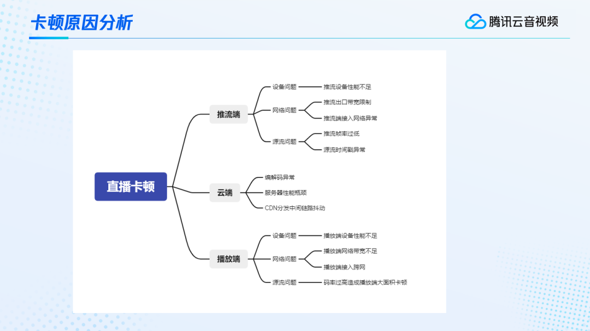  

首先还是推流端、云端、播放端这三大类。从推流端来看，一般有设备本身的问题、网络问题以及源流本身的问题。比如说设备问题常常是由于推流设备性能不足，设备老旧，CPU跟不上，所以会出现卡顿。网络问题常常遇到的是出口带宽限制，带宽达不到推流码率的要求。还有就是推流端的接入网络异常，常常是一些中小运营商或者是localDNS异常时，会出现跨运营商等情况，引起网络受限。另外源流本身也可能存在问题，比如说推流帧率过低，当帧率低于十帧以下，观看端可能就会感受到卡顿。还有源流的时间戳异常，不是递增或有回退、跳变等等情况，那观看端的播放器行为可能就会有等待，回退甚至往前跳等卡顿现象。在云端会有编解码异常，服务器性能瓶颈，CDN分发中间链路抖动等等问题，这些都有可能会产生卡顿。在播放端也是一样，存在设备性能不足、网络带宽不足、源流码率过高等等可能导致卡顿的问题。

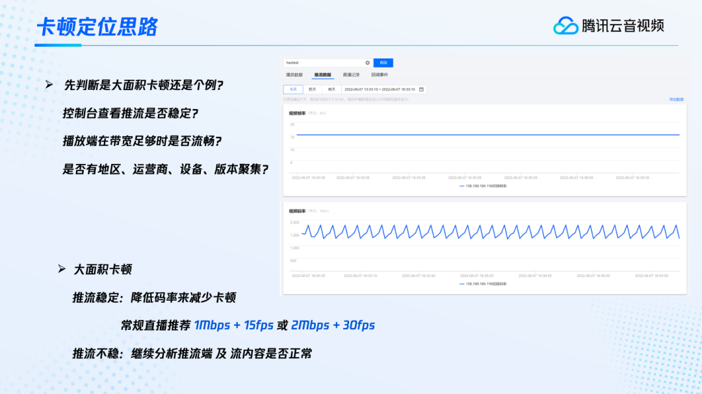 

面对这么多问题，当你拿到一个卡顿case反馈时，应该如何定位导致卡顿的原因呢？我们推荐的卡顿定位思路是**首先判断是大面积卡顿还是个例卡顿**。这里，我们有几种方式来辅助进行判断。**第一，通过控制台查看推流是否稳定**。上图右侧的截图是腾讯云官网的控制台，这里可以查到每一条流的推流数据，包括这条流的推流帧率、码率等情况。图中可以看到码率有一些抖动，这是正常的，因为码率会随着画面，码控方式选择等等原因产生一些抖动。但是一般情况下，帧率都是比较平稳的。所以我们可以根据帧率来判断推流是否稳定。**第二，可以试一下在播放端带宽充足的情况下是否流畅**。比如在网络带宽良好的情况下，自己来播一下这个流，看看卡不卡。如果不卡，那至少证明推流端或者CDN那里大概率是没有问题的。如果卡顿比较多，我们可以**看是否有地区、运营商、设备、版本聚焦**，这些都可以辅助我们进行定位。  

如果我们定位后，认为存在大面积的卡顿。这个时候我们再来结合右侧的图辅助看一下推流端是否稳定。假如推流比较稳，但存在大面积卡顿，我们推荐可以用降低码率的方法来减少卡顿。常规的直播一般采用1Mbps的码率加15fps的帧率或2Mbps码率加30fps的帧率就可以了。除非是一些特殊的活动，或者对高清有特别需求的，码率可以再高一些。但帧率的话，30fps基本上就够了。  

假如说我们发现推流并不稳定，就需要继续分析推流端以及流内容是否正常。推流不稳的原因也很多。下面我们将结合平时遇到的一些真实案例，给大家介绍一些常见的问题场景。

  

这里首先从推流端的性能开始分析。在这个案例中我们接到一个反馈，推流不稳，导致观看卡顿。从工作台，我们看到服务端接收到的帧率确实存在较大抖动。在我们与客户的沟通中，用户反馈是通过OBS的多路推流插件来进行推流，同时推了四路流出来，每路流的码率是3Mbps，总共就需要十二兆的出口带宽。但是用户的实际上传带宽只有11Mbps左右，无法达到输出码率的要求。这样造成卡顿的问题就定位在网络受限了，解决方案也很简单，关闭其中一路流，整体输出码率变成9Mbps，帧率码率马上就恢复正常了。这是客户端推流带宽受限的一个场景，有的时候，我们甚至还会遇到通过服务端来进行推流，出现超过带宽上限的情况。这种往往会更难进行分析。

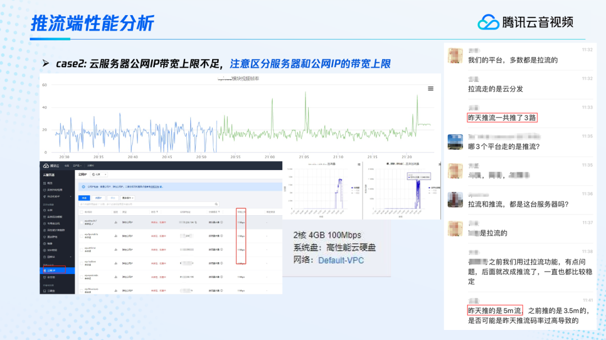  

比如说上面这个案例，我们在服务端看到，接收到的帧率很不稳定。经过各种的沟通，用户反馈也是推了三路流，同时每路流的码率都比较大。之后经过反复的沟通和定位，我们终于发现用户使用的云服务器的公网IP出带宽比较小，所以超过了公网IP的出带宽的上限，即这个带宽已经跑到了平峰，甚至还有很多被丢弃的出流量，这样就造成了视频的卡顿。像这种在服务端定位是比较困难的。因为这个用户的云服务器也在腾讯云上，所以我们联合云服务器以及公网IP的同事共同进行定位，才发现了这个问题。通过这个案例，我们在购买云服务器时一定要考虑到它的公网带宽上限以及公网IP的一个带宽上限。比如这个案例中，用户反馈他购买的时候，云服务器显示为两核四G上限一百兆的出口带宽。但是出口同时需要绑定一个公网IP，在用户反复的进行公网IP绑定调整的时候，最新公网IP的出口上限其实就没有那么大了。所以**我们在购买云服务器时要注意这个公网带宽上限，同时也要注意绑定公网IP的带宽上限**。

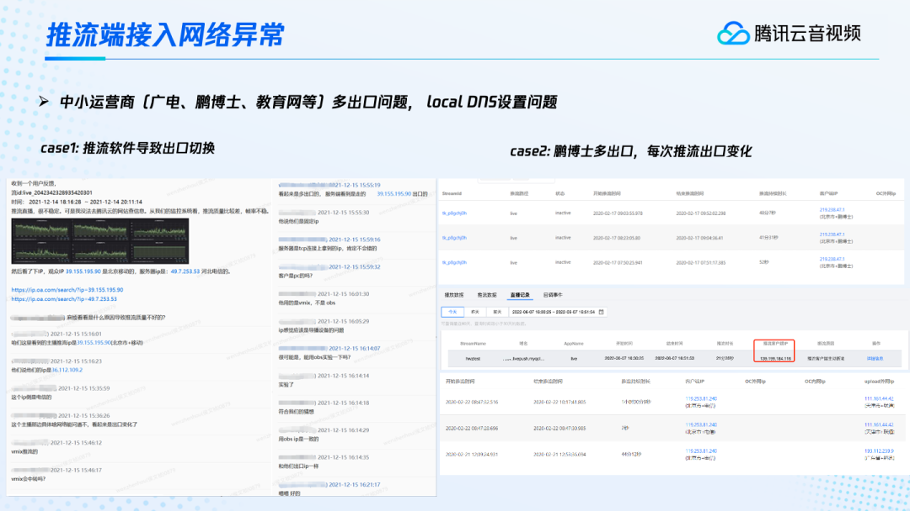

除了带宽的限制，我们还常常会遇到一些接入网络的异常，一般是中小运营商多出口或者localDNS设置异常问题。中小运营商是租借的三大运营商的出口。有时候为了自身的成本考虑，它们会在各个出口之间进行调度。这时就有可能出现跨运营商的情况。上面左边的这个案例，用户他在推流时发现比较卡顿。我们定位后发现是因为存在跨运营商接入的情况。用户看到自己的出口是北京移动，但我们看到的却是北京电信，出现了跨运营商的情况。最终定位下来发现是由于用户使用了一个叫做vmix的推流软件，不是OBS。用户在vmix中的一些设置可能修改了DNS或者使用了VPN等等，就导致出现了跨运营商。但我们用OBS进行试验，发现它的IP出口其实是一致的。右边这个案例，用户使用了中小运营商，他每次推流的时候，过一段时间出口的IP就会不停的变化，服务端接收的运营商也会不断的变化。有的时候，在变化中出现前次变化和中间推流出口不一致的情况，就形成了跨运营商，从而导致这卡顿。  

那这里大家可能会有一个疑问，我怎么知道我的实际客户端出口IP是什么呢？我们推荐你在腾讯云的云直播控制台上面查看，可以看到每一条流的推流记录。直播记录中还记录了这条流开始推流的时间，以及推流客户端IP。这个客户端IP实际上就是服务端从TTP连接上拿到的对端IP，所以它肯定是这次推流的准确客户端IP。 

另外，通过腾讯云的华佗诊断分析系统，我们也可以看到客户端IP以及localDNS的情况。[华佗系统](http://ping.huatuo.qq.cong/)可以从浏览器直接打开，在手机和PC端都可以查看，输入域名就可以进行检测，获得公网出口IP、localDNS、服务器域名等关键信息，这些都可以辅助我们进行本地网络的定位。  

上面介绍的这些是接入网络的一些问题。除了这些，我们还常常会遇到源流本身的问题，主要是时间戳等的不连续或者是帧率太低。

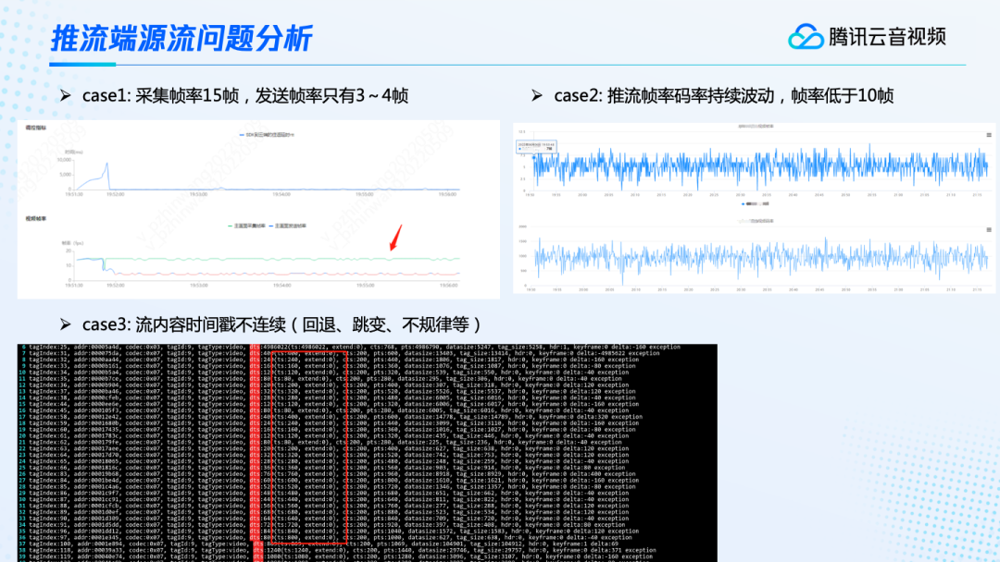  

比如说上面的这几个例子。第一个采集帧率是15帧，但是发送帧率只有3-4帧，这样子的话播放肯定会卡顿，因为帧率实在太低了。我们可以通过客户端的监控看到，开始有一段时间客户端探测到的RTT非常的大。于是客户端为了适应这种大RTT，就自动降低了推流的帧率。但是后面却没有恢复回来，导致持续的用3-4帧来进行推流，造成了卡顿。第二个则是推流的帧率码率持续的进行波动，很不稳定，而且它的帧率很低，都低于10帧。像这种案例，我们就必须要结合客户端的日志来查看当时推流的情况，以及CPU等的占用率情况。还有一些例子是流内容的时间戳不连续。第三个图我们可以看到帧率、码率都挺稳的，但是它的时间戳不连续，反复的进行跳变。这里我们的服务端用ffprobe进行查看，可以看到时间戳忽然跳大，然后又跳小，反复抖动。时间戳的不连续，最终在播放端就会导致播放器无法正常播放，产生各种卡顿的现象。  

上面是推流端的几种情况，一般推流端出现问题，就会引起大面积的卡顿。那如果是播放端出现问题的话，一般会是一些个例的问题。所以大面积的卡顿问题，我们就往推流端以及云端查找定位。那播放端的一些个例卡顿，我们推荐先确认一下设备的终端性能如何。我们可以结合客户端的日志来查看当时CPU等的占用率情况。之后可以通过前面介绍的ping.huatuo的工具，查看是否有跨网、localDNS异常等问题。我们还可以测一下本地的网络速度情况，可以使用speedtest这个工具来测试，它可以很方便的看到上传以及下载速度以及客户端IP等信息。

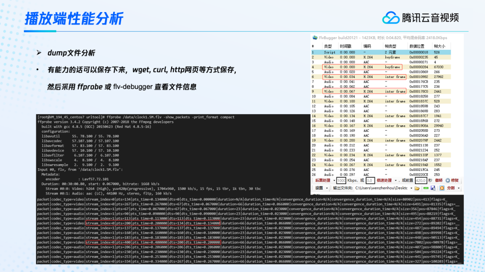  

播放端除了设备以及网络的问题，可能也同样存在一些源流本身的问题。**对于一些有能力的用户，我们建议通过wget 、curl、http网页等方式，将视频保存下来，之后辅助进行定位**。有了这些文件，我们就可以用ffprobe或者是flv-debugger等工具来查看它的文件信息。比如用ffprobe来查看文件的信息，我们就都可以看到它的编码格式、分辨率以及码率帧率等情况。最主要的是还可以看到它每一帧的dts以及pts情况，还可以看到它的dts差值等等。这个流视频的dts差值一般在66，音频的话大概都在23，如果这个值均匀，没有回退等情况，那这个视频就是一个比较好的视频。在windows 端，也有FlvBugger 等等一些工具，可以辅助大家进行查看。它也可以很方便的看到每一个视频、音频的信息，甚至它的视频是不是关键帧，每帧的时间戳等信息，辅助大家去定位这个源流本身是否有问题。  

推流端、播放端之外，还会有一些云端异常。比如说编解码的异常，一些新的编码格式可能还不支持，或者是一些硬件编码，编出来的格式不是特别的规范，导致云端兼容不了。还有服务器性能出现瓶颈。例如对一个帧率码率都很低的流，忽然提高它的码率，然后服务器没能及时将这个任务调度到资源充足的机器上去，就会出现性能瓶颈的问题。另外在CDN往全国甚至全球的外网进行分发的过程中，可能因为外网络的抖动，出现短暂的卡顿情况。不过这些大家不用太关注，一般情况下，如果用户在排除了推流端和播放端的问题以后，怀疑问题出在云端，可以提工单进行核实解决。

前文我们介绍了因各种问题导致卡顿的案例。那可能大家就会有一个想法，面对这么多的问题，如何在使用中规避这些问题呢？下面就给大家介绍一些常用工具的推荐使用方案。

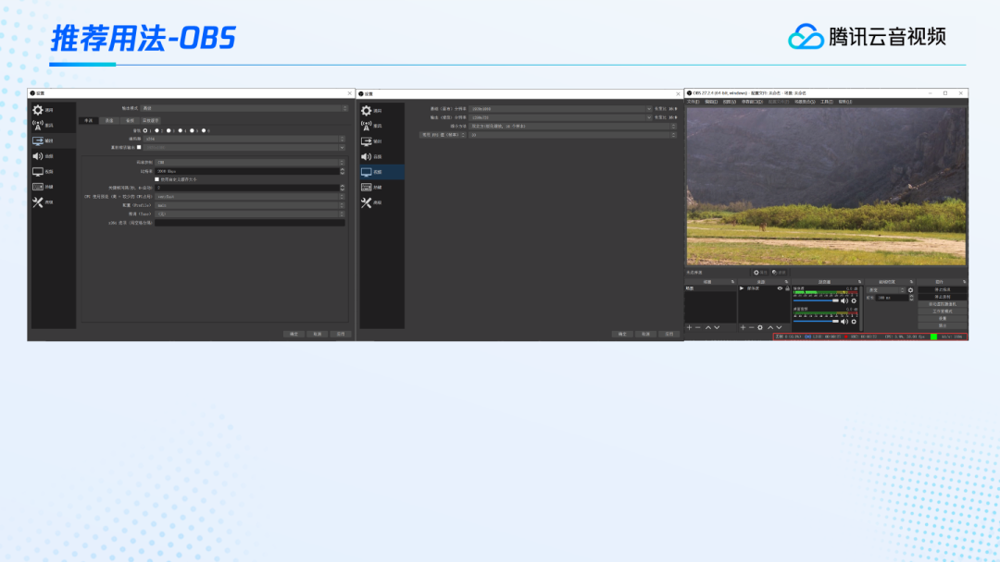

首先我们介绍一下OBS，这是在PC端推流的一个非常常用的工具。在这个工具中，我们可以在推流之前对各选项做一些设置。输出模式直接选择高级，**编码器推荐大家选X264，因为这个软件编码的适用性更好一些**。如果你选了硬件编码，那可能不同的硬件设备编出来的音视频格式或内容会有一些差异。下面的码率控制，如果没什么特殊要求，建议选CBR就可以了，这样推出来会比较平稳的。比特率，也就是码率，没有特殊的要求的话，1Mbps到2Mbps就够了，在一些特殊的高清场景，可以再选大一些。关于关键帧间隔，也就是我们说的GOP的大小，一般在1-4秒就好，尽量不要超过4秒。如果超过4秒可能会在延迟、兼容性等方面出现小问题。一般没有特殊要求，推荐选2秒就可以。关于CPU的预设，选择默认的veryfast就可以了。配置profile 一般没什么要求，选择main profile或者baseline都是可以的。  

输出分辨率这里一般按自己的要求，选择720P或者1080P来进行输出就可以。帧率FPS一般不用超过30。如果是一些静态的，像PPT等类型，15帧就够了。大部分情况下，都不需要超过30帧。  

选项配置好后，在推流的过程中，大家还可以实时的关注下面的这个状态栏。状态栏里面会显示一些很关键的信息，比如丢帧，当前的CPU占用率，帧率、码率，是否稳定等等。如果没有问题，就是一个绿色的状态栏。有条件的用户，推荐打开本地录制。将流录到本地，在后面遇到问题或者复盘反馈的时候都可以进行对比，辅助进行定位。  

这是PC端推流的OBS，如果我们要**用手机来进行推流的话，推荐使用腾讯云的视立方SDK**，它有非常完整的demo可以装在手机上，之后就可以直接进行推流了。当然它也可以作为SDK嵌入到你自己的APP里面，同样非常方便。

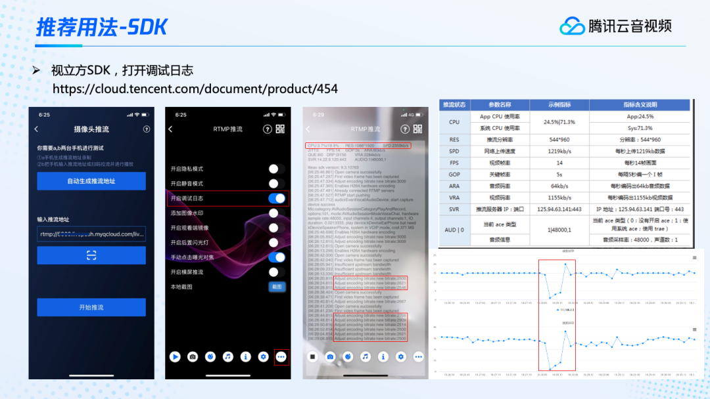  

这里简单讲解一下推流方法。比如使用摄像头推流，这里直接把推流地址输入进去，然后点击开始推流就可以了。但是对有条件的用户，非常建议大家，尤其是在定位问题的时候，把右下角的配置打开，开启调试日志后再进行推流，可以看到非常详细的日志信息。比如说它可以显示当前CPU的情况。有APP的CPU，还有设备总的CPU。当然还有分辨率、码率等等的情况。上图右侧的这个表格，有每一个指标对应的含义。如果是集成SDK的话，SDK中也有回调函数，可以拿到实时的状态信息。在左边的图里面，有一个很关键的信息，我一开始预设的推流码率是3Mbps也就是3000kbps，但如果网络不行，就会出现提示insufficient upstream bandwidth，也就是上行带宽不足。上行带宽不足后，推流端会自适应降低码率，比如降成2.5Mbps的码率进行推流。之后有一段时间持续在2.5到2.9之间来回波动。

虽然推流端会自适应降低码率，但实际上在服务端可能已经产生了一定程度的卡顿了。结合服务端的日志，我们可以看到，收到的帧率和码率都出现了降低。

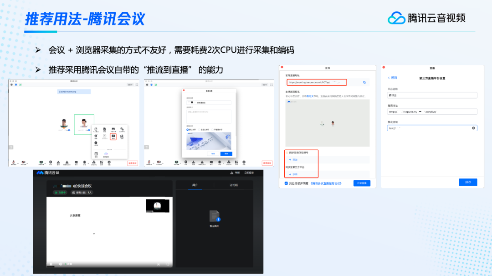  

还有一个使用腾讯会议的场景，在有些情况下，用户可能不想让太多的观众进入会议，比如为了保持会议的稳定等等。但同时又想让很多人能够看到这场会议的直播。所以有的用户会在打开腾讯会议的同时，又打开浏览器，或者是OBS来采集画面进行推流。其实这种方式并不是特别的友好，因为它需要耗费两次CPU进行采集和编码。腾讯会议有一次采集和编码，浏览器或者OBS也要再次进行采集和编码，这样就需要耗费两次CPU。在这种场景，我们推荐采用腾讯会议自带的「推流到直播」的能力，直接推到云端，在会议的过程，点开设置里面的直播按钮就可以了。直播的时候，我们可以设置自己的主题或者是水印等等，还可以设置自己的推流地址。如果采用官方的直播地址，那可以直接开始推流，然后用官方直播地址就可以进行观看了。当然我们也可以推到视频号，或者其他第三方平台。假如要推到第三方平台，我们可以在这里将推流地址和推流密钥填上去，然后开始推流就可以了。

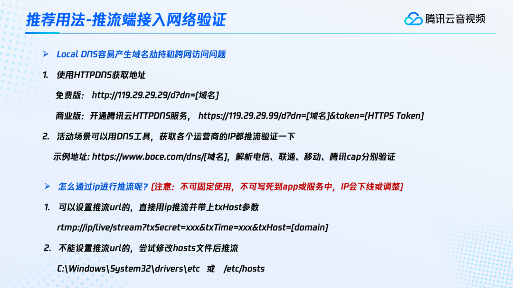

还有一些用户，因为活动很重要，想要确保不出问题，因此在推流之前想要验证一下推流端网络是否正常。这种时候怎样去避免因为localDNS产生的域名劫持和跨网访问的问题呢？我们可以采用HTTPDNS来获取地址。HTTPDNS 有一个免费的版本，但现在不推荐再使用了（官网已下线），建议使用商业版。商业版的话，我们可以开通腾讯云HTTPDNS的服务，就可以获取这个域名它对应的最优接入IP。这个腾讯云HTTPDNS的服务也非常便宜，几块钱就可以开通。如果不想用HTTPDNS的话，也可以自行搜索一些DNS的工具，获取各个运营商的IP都推流验证一下。  

在提前推流时，如何通过IP进行推流呢？这里先说一下，这个IP只是临时使用，千万不能写死到APP或服务中。因为这个IP随时可能会下线或者调整，从而导致这个IP不可用。对于这种情况，我们可以在设置推流url的时候，直接把IP放在RTMP推流协议里并带上txHost参数。这样就可以直接进行推流。对于一些不能设置推流url的情况，我们可以尝试修改hosts文件后推流。

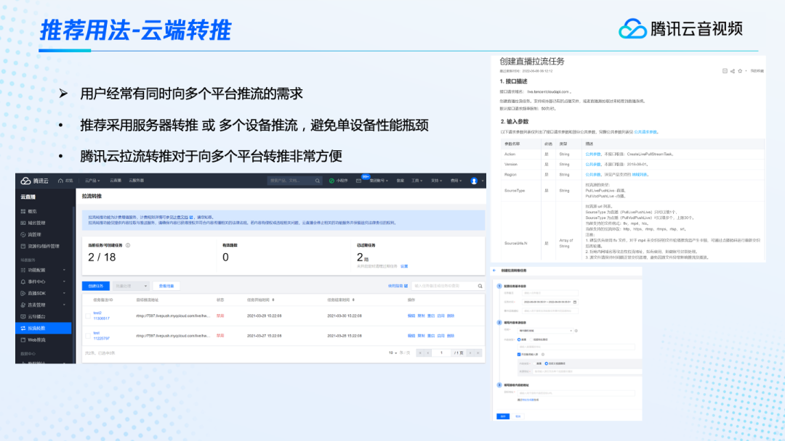  

向多个平台进行推流也是很多用户的需求。因为现在的直播平台非常多，大家可能同时往多个平台进行推流。**同时往多个平台推流，推荐的是采用服务器推流，或者采用多个设备推流，避免单设备的性能出现瓶颈**。除此之外，还有一个非常好用的，就是使用云端转推的能力。比如说，使用腾讯云拉流转推的功能。它可以非常方便的向多个平台进行转推。当要添加一个转推任务时，在控制台点击创建任务就可以了。创建任务只需要填三个信息。一个是时间，这个任务的起止时间。一个是源流的地址，源流地址就是我先推一路流出来，推到一个平台，然后拿它的播放地址作为源流地址。第三个是目标地址，就是我要转推的其他平台地址。这三个信息一填，就可以非常方便的创建一个转推任务。而且它还规避掉了自己进行服务器转推或者设备推流的各种不稳定的问题。因为它具有自动容灾，任务异常自动拉起等功能。  

在源流这里，**腾讯云拉流转推不仅支持直播源流，也能支持点播源流**。点播源流还支持多个点播文件同时进行推流。比如说我有三个点播文件，可以在第一个播完后自动播第二个，然后自动再播第三个，非常平滑的实现轮流播放的效果。还可以设置主备源，不管是直播还是点播，当主源出现问题时，备源就自动的切换进行使用，所以它的稳定性非常高。如果我们不想使用控制台进行创建的话，也可以API调用，非常方便的就能够实现云端转推的功能。

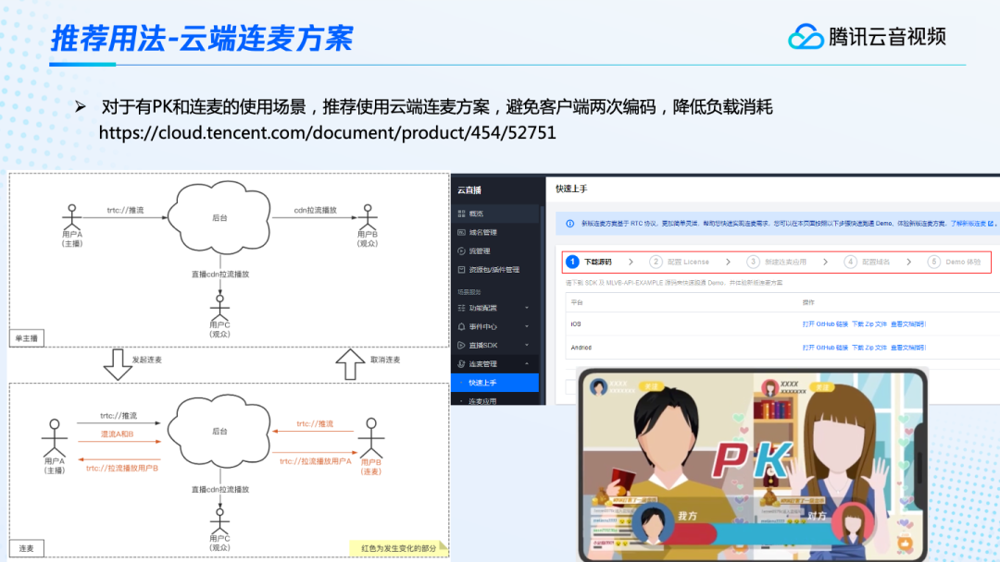  

最后，越来越多的APP都有PK和连麦的场景。这些虽然我们可以在APP端进行实现，比如在APP端，可以自己先获取两个画面，混好以后再推流出来。但是这对APP端的性能消耗比较大，甚至还需要同时推自己的单路流，以及混好后的流，产生两倍的采集编码以及发送的性能消耗。所以我们**推荐采用腾讯云云端连麦的方案，也可以非常方便的实现这种连麦、PK场景**。左边的图，上面是正常推流的情况。主播A进行推流，观众B和C在进行正常的观看。这时如果有观众B要发起连麦，那他就把自己的流推到云端。这个时候，主播也同时会拉一路用户B的流拉到自己的画面。这样A和B两个人都可以看到自己和对方的画面了。这时，主播只需要再发送一个混流信令，也就是往云端发一个HTTP请求，告诉云端把哪路两路流怎样混起来。云端马上就可以把这两路流混起来，其他的观众C就可以拉取混流后的画面。这套方案可以非常方便的实现混流的能力，不需要耗费客户端的性能。大家可以通过这个[链接](https://cloud.tencent.com/document/product/454/52751)，查看连麦的快速上手指引。按照指引，五步就可以非常方便的集成SDK，实现云端连麦的能力。
