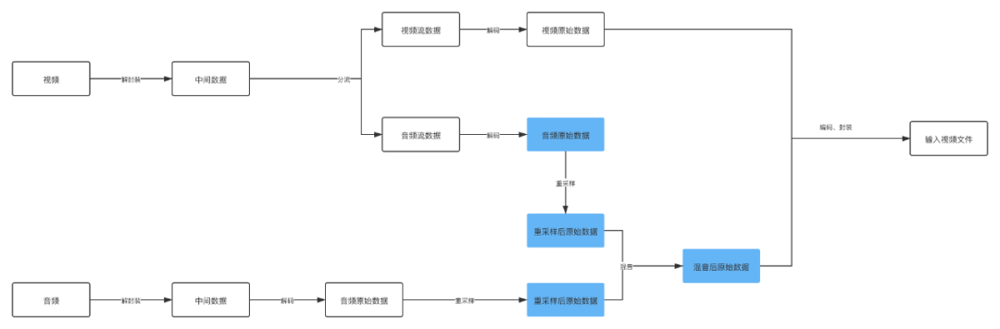
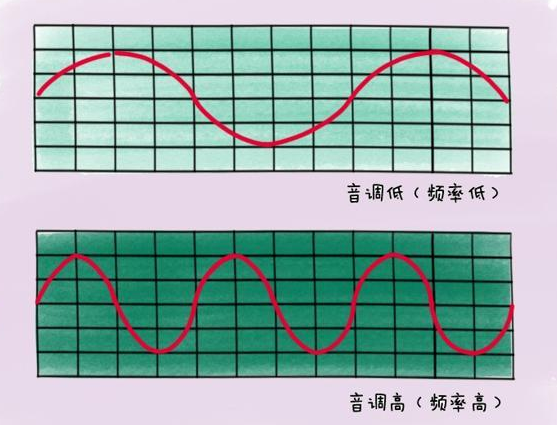
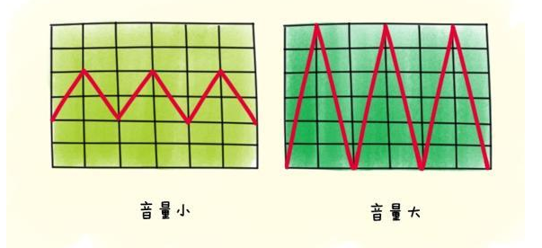
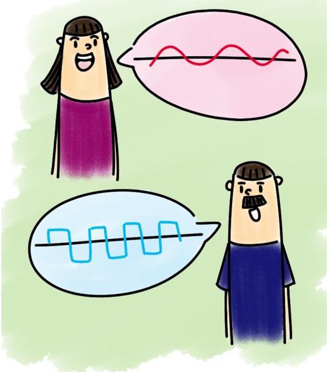
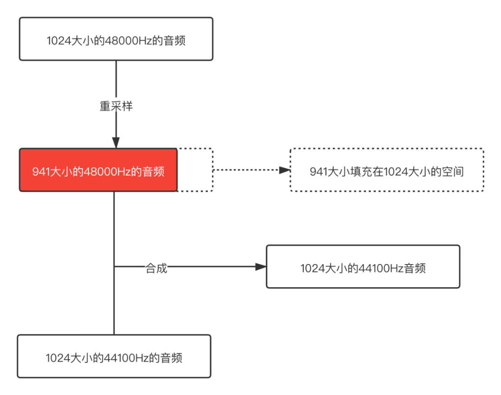

 
<!--BEGIN_DATA
{
    "create_date": "2022-02-18 12:20", 
    "modify_date": "2022-02-18 12:20", 
    "is_top": "0", 
    "summary": "短视频中解决音视频混音出现杂音的问题", 
    "tags": "音视频", 
    "file_name": "短视频中解决音视频混音出现杂音的问题.md"
}
END_DATA-->

#### <p>原文出处：<a href='https://mp.weixin.qq.com/s/3bSKUgn4YhAUIm5Y9WXcUQ' target='blank'>短视频中解决音视频混音出现杂音的问题</a></p>

## 1 你用过音视频合成吗？

现在抖音快手各种短视频也算是深入人心了，短视频剪辑中有一个非常重要的功能，就是音视频合成，选择一段视频和一段音频，然后将它们合成一个新的视频，新生成的视频中会有两个音频的混音。  

下面我们来拆分一下音视频合成的做法：



图中着重标记的几个流程可以看出来这是音频视频合成的重点，其实容易出错也是在这个地方。

重采样，这是一个什么知识点？在介绍重采样之前，可以先介绍介绍一下音频的一些性质了。

## 2 音频采集的指标

### 2.1 采样率

采样率就是俗称的取样频率，指每秒钟取得声音样本的次数，采样频率越高，声音的质量就越好，声音的还原也就越真实，但是采样频率比较高占用的资源就比较高。  

我们知道人耳正常情况下只能接收20Hz ~ 20kHz 音频范围声音，超过20kHz成为超声波，低于20Hz成为低声波，我们都是听不到的，这儿是说的声音的频率和采样率关系不大。言归正传，过高的采样率确实可以将声音刻画的比较细致，但是对人耳意义不大，所以还是要做好权衡，根据实际的应用来选择合适的采样率。

<table><tbody><tr><td width="146" valign="top" style="word-break: break-all;"><span style="font-size: 15px;">采样率<br></span></td><td width="389" valign="top" style="word-break: break-all;"><span style="font-size: 15px;">使用场景</span></td></tr><tr><td width="146" valign="top" style="word-break: break-all;"><span style="font-size: 15px;">8000 Hz<br></span></td><td width="389" valign="top" style="word-break: break-all;"><span style="font-family: -apple-system, system-ui, &quot;Segoe UI&quot;, Roboto, Ubuntu, Cantarell, &quot;Noto Sans&quot;, sans-serif, system-ui, &quot;Helvetica Neue&quot;, &quot;PingFang SC&quot;, &quot;Hiragino Sans GB&quot;, &quot;Microsoft YaHei&quot;, Arial;text-align: start;background-color: rgb(255, 255, 255);font-size: 15px;">家用电话的采样率</span></td></tr><tr><td width="146" valign="top" style="word-break: break-all;"><span style="font-size: 15px;">44100 Hz<br></span></td><td width="389" valign="top" style="word-break: break-all;"><span style="font-family: -apple-system, system-ui, &quot;Segoe UI&quot;, Roboto, Ubuntu, Cantarell, &quot;Noto Sans&quot;, sans-serif, system-ui, &quot;Helvetica Neue&quot;, &quot;PingFang SC&quot;, &quot;Hiragino Sans GB&quot;, &quot;Microsoft YaHei&quot;, Arial;text-align: start;background-color: rgb(252, 252, 252);font-size: 15px;">音乐CD的采样率</span></td></tr><tr><td width="146" valign="top" style="word-break: break-all;"><span style="font-size: 15px;">48000 Hz<br></span></td><td width="389" valign="top" style="word-break: break-all;"><span style="font-family: -apple-system, system-ui, &quot;Segoe UI&quot;, Roboto, Ubuntu, Cantarell, &quot;Noto Sans&quot;, sans-serif, system-ui, &quot;Helvetica Neue&quot;, &quot;PingFang SC&quot;, &quot;Hiragino Sans GB&quot;, &quot;Microsoft YaHei&quot;, Arial;text-align: start;background-color: rgb(255, 255, 255);font-size: 15px;">标准的音频采样率，目前手机大多数采用这个采样率</span></td></tr><tr><td width="146" valign="top" style="word-break: break-all;"><span style="font-size: 15px;">96000 Hz<br></span></td><td width="389" valign="top" style="word-break: break-all;"><span style="font-family: -apple-system, system-ui, &quot;Segoe UI&quot;, Roboto, Ubuntu, Cantarell, &quot;Noto Sans&quot;, sans-serif, system-ui, &quot;Helvetica Neue&quot;, &quot;PingFang SC&quot;, &quot;Hiragino Sans GB&quot;, &quot;Microsoft YaHei&quot;, Arial;text-align: start;background-color: rgb(252, 252, 252);font-size: 15px;">蓝光视频的采样率</span></td></tr></tbody></table>

其他的采样很多，不一一介绍了，大家感兴趣可以参考：

https://en.wikipedia.org/wiki/Sampling_%28signal_processing%29

### 2.2 采样位数

采样位数就是采样值或者取样值，本质就是将采样样本幅度量化，这是用来衡量声音波动变化的一个参数，也可以被认为是声音的“分辨率”，它的数值越大，说明声音的“分辨
率”越高，能发出的声音能力就越强，越细腻。  

每个采样数据记录的是振幅，采样精度取决于采样位数的大小：

  * 1字节：8bit，只能记录256个数，振幅只能划分为256个等级。

  * 2字节：16bit，可以细化到65536个数，正常的CD就是这个标准。

  * 4字节：32bit，可以细分到4294967296个数，划分比较细致，人耳识别不了这么细致的声音。

### 2.3 采样通道数

通道数就是声音采集的渠道有多少。常用的有立体声和单声道。

  * mono：单声道

  * stereo：双声道

  * 4.1声道：有4个发声点，前左、前右、后左、后右，同时增加一个低音道，增强对低频信号的处理。

  * 5.1声道：基于4.1声道，同时增加一个中置单元，这个中置单元负责传送低于80Hz的声音信号，增加了人声，一般用在电影院里面。

  * 7.1声道：在听者的周围建立起一套前后场相对平衡的声场，7.1声道在5.1声道的基础上加上了双路中后置，可以在听者在任意角度都能听到一致的声音。

## 3 声音的三个基本属性

### 3.1 音调

声音频率的高低叫做音调(Pitch),是声音的三个主要的主观属性,即音量(响度)、音调、音色(也称音品)之一。表示人的听觉分辨一个声音的调子高低的程度。音调主要由声音的频率决定,同时也与声音强度有关

波长长短是衡量声音音调的因素：



### 3.2 响度

人主观上感觉声音的大小（俗称音量），由“振幅”（amplitude）和人离声源的距离决定，振幅越大响度越大，人和声源的距离越小，响度越大。（单位：分贝dB）

声波的振幅表示声音的音量大小：



## 3.3 音色

又称音品，波形决定了声音的音色。声音因不同物体材料的特性而具有不同特性，音色本身是一种抽象的东西，但波形是把这个抽象直观的表现。音色不同，波形则不同。典型的音色波形有方波，锯齿波，正弦波，脉冲波等。不同的音色，通过波形，完全可以分辨的。

音色主要和声波的波纹有关：



## 4 为什么需要重采样

因为不同的平台不能支持所有的采样率，所以移植到其他平台播放的时候，如果不支持当前的音频采样率，就需要对音频采样率进行重新采样，就像视频的重新编解码一样的。不然播放音频会出现问题。无法将声音的原本特性还原出来。  

在音视频编辑中，经常用到的混音，就需要用到重采样的功能，保证两个音频混合起来，音频的采样率一定要标准化，是一样的采样率，这样播放出来的音频才不能失真。  

但是音频采样率一样就一定不会出现问题吗？

## 5 一个杂音的例子

需要合成的视频：

https://github.com/JeffMony/JianYing/blob/main/jeffmony_voice.mp4

```
Duration: 00:00:11.35, start: 0.000000, bitrate: 21123 kb/s
  Stream #0:0(eng): Video: h264 (High) (avc1 / 0x31637661), yuvj420p(pc, bt470bg/bt470bg/smpte170m), 1920x1080, 20341 kb/s, SAR 1:1 DAR 16:9, 30.02 fps, 30 tbr, 90k tbn, 180k tbc (default)
    Metadata:
      rotate          : 90
      creation_time   : 2021-08-04T07:59:58.000000Z
      handler_name    : VideoHandle
      vendor_id       : [0][0][0][0]
    Side data:
      displaymatrix: rotation of -90.00 degrees
  Stream #0:1(eng): Audio: aac (LC) (mp4a / 0x6134706D), 48000 Hz, stereo, fltp, 320 kb/s (default)
    Metadata:
      creation_time   : 2021-08-04T07:59:58.000000Z
      handler_name    : SoundHandle
      vendor_id       : [0][0][0][0]
```

需要合成的音频：

https://github.com/JeffMony/JianYing/blob/main/output.aac

```
Duration: 00:02:38.18, bitrate: 33 kb/s  
Stream #0:0: Audio: aac (HE-AACv2), 44100 Hz, stereo, fltp, 33 kb/s  
```

如果按照的正常的方式将它们合成：

https://github.com/JeffMony/JianYing/blob/main/output1.mp4

```
Duration: 00:00:09.99, start: 0.000000, bitrate: 5938 kb/s
  Stream #0:0(und): Video: h264 (Constrained Baseline) (avc1 / 0x31637661), yuv420p, 720x1280, 5814 kb/s, 30.12 fps, 30 tbr, 10k tbn, 60 tbc (default)
    Metadata:
      handler_name    : VideoHandler
      vendor_id       : [0][0][0][0]
  Stream #0:1(und): Audio: aac (LC) (mp4a / 0x6134706D), 44100 Hz, mono, fltp, 128 kb/s (default)
    Metadata:
      handler_name    : SoundHandler
      vendor_id       : [0][0][0][0]
```

这儿大家可以直接将例子下载下来看看，不好传视频和音频，所以大家将就看吧。  

输入的视频中的音频采样率是48000 Hz，输入的音频采样率是44100 Hz，最后合成后视频中音频的采样率是44100Hz，看上去实现了重采样了，但是输出的视频杂音非常严重，完全无法听。  

这儿就要多问一句了，为什么呢？

## 6 问题剖析

我们这儿是将音频统一按照44100 Hz重采样，然后混音处理。从48000 Hz 重采样至 44100 Hz，相同的buffer size的大小降低采样率之后buffer size也会降低，而我们要做混音的时，需要两个buffer都填充满，这种情况下有一个音频的buffer没有填充满。  

就像下面的示意图：



从这个示意图可以很明显的看出问题，48000 Hz重采样之后的音频buffer size已经变小了，但是用这个buffer和44100 Hz正常的buffer合并，那其中一个音频后面就是一段空数据，所以合成之后肯定会出现杂音的。

既然知道了是什么问题，那我们可以在合成之前将buffer填充满，然后再混音处理，这样就不会出现这个问题了。示意图如下：


后面依次填充不满的buffer，这样得到的就是完整的buffer了，不会有冗余的数据，混音之后输出的音频是正常的。

下面展示一下混音之后正常输出的文件：

https://github.com/JeffMony/JianYing/blob/main/output3.mp4

## 7 混音算法介绍

声音是由于物体的振动对周围的空气产生压力而传播的一种压力波，转成电信号后经过抽样，量化，仍然是连续平滑的波形信号，量化后的波形信号的频率与声音的频率对应，振幅与声音的音量对应，量化的语音信号的叠加等价于空气中声波的叠加，所以当采样率一致时，混音可以实现为将各对应信号的采样数据线性叠加。反应到音频数据上，也就是把同一个声道的数值进行简单的相加而问题的关键就是如何处理叠加后溢出问题。（通常的语音数据为16bit 容纳的范围是有限的 -32768 到 32767之间所以单纯的线性叠加是有可能出现溢出问题的。直接截断会产生噪音。所以需要平滑过度）

所以在进行混音之前要先保证需要混合的音频 采样率、通道数、采样精度一样。

### 7.1 平均法

将每一路的语音线性相加，再除以通道数，该方法虽然不会引入噪声，但是随着通道数成员的增多，各路语音的衰减将愈加严重。具体体现在随着通道数成员的增多，各路音量会逐步变小。

```
public static short[] mixRawAudioBytes(short[][] inputAudios) {
        int coloum = finalLength;//最终合成的音频长度
        // 音轨叠加
        short[] realMixAudio = new short[coloum];
        int mixVal;
        for (int trackOffset = 0; trackOffset < coloum; ++trackOffset) {
            mixVal = (inputAudios[0][trackOffset]+inputAudios[1][trackOffset])/2;
            realMixAudio[trackOffset] = (short) (mixVal);
        }
        return realMixAudio;
    }
```

### 7.2 归一化

全部乘个系数因子，使幅值归一化，但是个人认为这个归一化因子是不好确认的。

```
public static short[] mixRawAudioBytes(short[][] inputAudios) {
        int coloum = finalLength;//最终合成的音频长度
        float f = divisor;//归一化因子
        // 音轨叠加
        short[] realMixAudio = new short[coloum];
        float mixVal;
        for (int trackOffset = 0; trackOffset < coloum; ++trackOffset) {
            mixVal = (inputAudios[0][trackOffset]+inputAudios[1][trackOffset])*f;
            realMixAudio[trackOffset] = (short) (mixVal);

        }
        return realMixAudio;

    }
``` 

### 7.3 改进后的归一化

使用可变的衰减因子对语音进行衰减，该衰减因子代表了语音的权重，该衰减因子随着数据的变化而变化，当数据溢出时，则相应的使衰减因子变小，使后续的数据在衰减后处于
临界值以内，没有溢出时，让衰减因子慢慢增大，使数据变化相对平滑。

```
public static short[] mixRawAudioBytes(short[][] inputAudios) {
        int coloum = finalLength;//最终合成的音频长度
        float f = 1;//衰减因子 初始值为1
        //混音溢出边界
        int MAX = 32767;
        int MIN = -32768;
        // 音轨叠加
        short[] realMixAudio = new short[coloum];
        float mixVal;
        for (int trackOffset = 0; trackOffset < coloum; ++trackOffset) {
            mixVal = (inputAudios[0][trackOffset]+inputAudios[1][trackOffset])*f;
            if (mixVal>MAX){
                f = MAX/mixVal;
                mixVal = MAX;
            }
            if (mixVal<MIN){
                f = MIN/mixVal;
                mixVal = MIN;
            }
            if (f < 1)
            {
                //SETPSIZE为f的变化步长，通常的取值为(1-f)/VALUE,此处取SETPSIZE 为 32   VALUE值可以取 8, 16, 32,64,128.
                f += (1 - f) / 32;
            }
            realMixAudio[trackOffset] = (short) (mixVal);

        }
        return realMixAudio;

    }
```

### 7.4 newlc算法

if A < 0 && B < 0  
Y = A + B - (A * B / (-(2 pow(n-1) -1)))  
else  
Y = A + B - (A * B / (2 pow(n-1))

```
void Mix(char sourseFile[10][SIZE_AUDIO_FRAME],int number,char *objectFile)  
{  
    //归一化混音  
    int const MAX=32767;  
    int const MIN=-32768;  
 
    double f=1;  
    int output;  
    int i = 0,j = 0;  
    for (i=0;i<SIZE_AUDIO_FRAME/2;i++)  
    {  
        int temp=0;  
        for (j=0;j<number;j++)  
        {  
            temp+=*(short*)(sourseFile[j]+i*2);  
        }                  
        output=(int)(temp*f);  
        if (output>MAX)  
        {  
            f=(double)MAX/(double)(output);  
            output=MAX;  
        }  
        if (output<MIN)  
        {  
            f=(double)MIN/(double)(output);  
            output=MIN;  
        }  
        if (f<1)  
        {  
            f+=((double)1-f)/(double)32;  
        }  
        *(short*)(objectFile+i*2)=(short)output;  
    }  
}
```

## 参考文章

* https://www.git2get.com/av/104606126.html
* https://blog.csdn.net/dxpqxb/article/details/78329403

