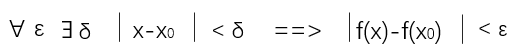
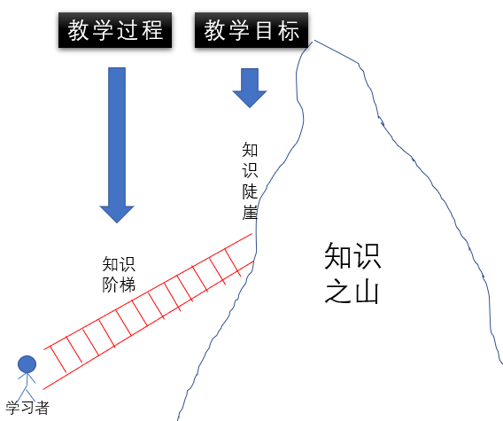

 
<!--BEGIN_DATA
{
    "create_date": "2020-07-28 20:41", 
    "modify_date": "2020-07-28 20:41", 
    "is_top": "0", 
    "summary": "科学教学法：类比", 
    "tags": "其它", 
    "file_name": "科学教学法：类比.md"
}
END_DATA-->

####
原文出处：<a href='https://mp.weixin.qq.com/s/59FC3XcUXj7AVLeuijNQNA' target='blank'>科学教学法：类比</a>

通过脑科学、学习科学的研究成果，王珏老师提炼了学习的“第一性原理”：

>**学习的本质，是“建立联接”——尤其是原有经验和外部信息的联接**。（详细内容可参见《理解学习的第一性原理 》一文）

那么，在开展教学时，如何才能将新知识，与学习者的原有经验，建立起有效的连接呢？

其中一种最为重要、且极为有效的方法就是：**类比！**

通过两件事情的类比（通常一旧、一新），可以自然而然地将学习者的原有经验，和需要学习的新知识，通过某种微妙的相似性，建立起联接，从而有效地理解新知识。

可以说，在教学中，对于一个知识或思维的难点， **只要能找到一个恰当的类比，瞬间就会让人觉得异常简单**！分分钟突破教学难点！

最后需要说明的是：本文的部分内容，来自于一本既 **非常易读**、又具有 **深刻启发性**的专著 **《表象与本质》**，强烈推荐大家学习。

###第一部分 类比是思考之源、思维之火

在思维中，“概念”和“类比”占有极为重要的地位。

因为如果 **没有概念，思维就无法开展**；而 **没有类比，概念就无法谈起**。

概念的形成过程，来源于将外界事物不停地进行 **分类**(归类)，这是人类认知方面的一个十分重要的能力。对事物进行分类的过程就叫做**范畴化**，这是在哲学和认知语言学中的一个非常重要的概念。

在人们遇到新的情境时，为了生存，总是需要将现在发生的事和过去发生的事进行对比，对已掌握的”范畴“和新的事物进行对比，以此帮助他们理解新事物、形成新概念。

在对比时产生的一连串粗线条的**类比**——要么彻底归入原有“范畴”中、或导致原有“范畴”的扩展或改变，要么通过原有“范畴”的某些特征来认知新事物——这**是思维过程的关键所在**。

在这一思维过程中，对新、旧事物之间从 **表面特征**、到 **深层特征**的方方面面进行类比，居于思维最核心的部分。

事实上，人类大脑中的每个概念，都来源于多年来在不知不觉中形成的一长串类比。正是这些 **“类比”，赋予每个“概念”以生命**。

可以说，通过类比进行范畴化，是人类不同层次思维的原动力。

一言以蔽之：类比，是思考之源、思维之火。

人类离开类比，就难以有效思考！

只有通过建立恰当的 **类比**，人们才能具备强大的**智慧**。类比能够帮人类在面临新环境时，迅速而准确地定位到长时记忆中的某个或一系列具有洞见的先例（范畴），从而在新环境中抓住重点、击中要害。

当然，类比不仅是一种极为重要的 **思维方法**，也是一种极为重要的 **教学方法**。

类比，完全符合王珏老师所提出的“学习的第一性原理”：学习的本质，是“建立联接”——尤其是原有经验和外部信息的联接。

通过类比，可以自然而然地将学习者的 **原有经验**，和需要学习的 **新知识**，通过某种 **微妙的相似性**，**建立起****联接**，从而有效地理解新知识。

在谈论“教学中的类比”这一中心主题之前，本文会先花大量篇幅，带领大家来了解“科学发展中的类比”。

之所以这样安排，原因很简单：

  * 学生头脑中尚未建立理解的新知识，和科学家尚未建立理解的新知识，二者是类同的 。

此时的学生和科学家一样，在未知规律面前都是那么无助、孱弱，而新的规律是多么陌生、难以理解和驾驭。

——想想在一个科学理论初创之时，给当时的 **科学家**带来多么大的 **不解和争论**。

  * 负数的出现、无理数的出现、虚数的出现，让多少数学家斥之以鼻，终生不能接受

  * 光是波还是粒子，两派物理学家热热闹闹地斗争了好几十年，而“波粒二象性”的惊世骇俗更是让大多数物理学家无法接受；

  * 今天广泛应用的量子力学，在发韧之初，争论无数，连创始人普朗克自己都不敢相信，爱因斯更是与玻尔打了半辈子的论战；

  * 说到化学家，听起来更加戏剧化：门捷列夫、凯库勒等牛人，在长时间难以突破之下，另辟蹊径， 居然 借助“梦境”创造了新的科学理论……

相信大家在以上描述中，不难发现：**科学家们**的表现和 **当今的学生**在学习这些知识时的那些表现。二者是 **何其相似**！

因此，如果“类比”能 **帮助科学家**开展有效的思维活动（科学创新），那么就应该能 **帮助学生**开展有效的思维活动（知识理解）。

或者说，如果对于站在人类智慧金字塔尖的 **科学家**，在从事思维活动时，都**不得不借助类比**的话，那么我们就没有任何理由怀疑：作为人类的普通一份子的学生，如果不通过恰当的类比，也难以建立对新知识的理解。

希望本系列文章，能够让大家真正体会到类比是“认知皇冠上的宝石”、甚至就是“认知皇冠”本身！类比是一种全人类都拥有的典型、且有效的思维方式，进而在教学活动中、在科学研究时予以最大的重视与采纳。

###二、哲学家与科学家眼中的类比

既然“类比”是一种认识世界和理解世界的方式，那就让我们先来看看此道高人——哲学家的眼中的类比。

**2.1 哲学家眼中的类比**

古代的哲学家们，有很多通过“类比”来思考问题、认识事物的推崇者和坚定践行者。

比如 **中国的老子**，其所创建的道教信奉“自然哲学”，认为要认识自然、认识社会、认识人自身，乃至解决一切问题，都可以从大自然的现象和规律中获得启示，所谓“道法自然”。

西方的 **柏拉图和亚里士多德**，认为类比不仅仅是一种修辞手法，还 为思维提供了丰富的素材。

康德认为：类比是所有 **创造力**的源泉。

尼彩甚至有一个著名的定义：真理就是“移动着的隐喻大军”。

——隐喻，一向被认为是“类比”的表兄弟，二者都是在两件事物之间（而且往往一件事物很熟悉、另一件事物很新鲜），借助某种相似性联接到一起，进而通过已有经验、来认识新事物。

当然，也有很多哲学家，如著名法国哲学家巴拉什， **视隐喻、类比为魔鬼**。 他写道：

**“一门接受比喻形象的科学，毫无疑问就是隐喻的受害者。因此，科学家们应该永不停止对比喻、类比和隐喻的斗争“。**

——相当讽刺的是：在这段话中，一门科学要”成为受害者“，科学家要与类比进行”斗争“，本身就使用了极为精妙的隐喻手法。**用一个隐喻批判另一个隐喻**，效果自然不言而喻！

**2.2 科学家眼中的“类比”**

我们再来看一看，科学界的那些伟人牛人，对于“类比”这种创造性思维方式的看法。

我们先来看看物理学。尽管许多物理学家撰写的教科书，将物理学描绘成一门纯粹的演绎学科，但也有许多物理学家提出了有力的反证。

更有一些最伟大的物理学家，试图详细描述他们自己的思路，讲述他们实现自己最重要的发现的具体过程。

在这些描述中他们总要讲述**类比的故事**，比如这些类比是怎样产生的，是怎样在刚刚发现的、新鲜的、尚未开发的物理现象，和旧的、充分探讨过的、被充分理解的物理现象之间建立联系的等等。

那些伟大的物理学家会把精力高度集中于某种令人困惑、值得深切关注的 **情境**，他们会仔细的环顾四周，从各个角度去观察。最终假如是幸运的，就有可能会发现一个 **视角**，使他们 **回想起某个已知的现象**。

而这个神秘的现象，以某种 **微妙而富有暗示的方式**与那个旧现象之间 **相通**。 通过这种聚合过程，一个天才终于看到了这个现象的，某个惊人的本质。

可以说，对于物理学家来说，**“通过类比去发现”**是一种高层次的感知能力和思维方式。

物理学伟人爱因斯坦在“通过类比去发现”方面，拥有极为杰出的造诣。它通过天才的头脑、灵敏的直觉、对事物内在相关性的觉察，提出了物理学界最丰富、最贴切的类比，并由此产出了丰硕的成果。

比如，爱因斯坦在成功创造狭义相对论后，曾经这样描述过他当时的感受：

一个如此具有概括性的原则（指伽利略的“相对性原理”），有一个现象领域（指力学）具有如此的准确性，却在另一个领域（指电磁学）无效，这先验地不太可能。

爱因斯坦貌似平常地对“相对性原理”的扩展（也不是力学原理与电磁学原理的类比），甚至深深地动摇了在他之前300年的物理学根基！

不仅如此，事实上，我们考察最近3个世纪以来的物理学发展，可以发现：物理学中的几乎所有领域都是依靠类比而建立起来的，其中都有一个**关键的、起决定性作用的类比**。 比如：

  * **引力——类比于一座山丘**（拉格朗日和拉普拉斯，1770） 

  * **电势——类比于引力势**（泊松，1811）

  * **磁势——类比于电势**（麦克斯韦，1855）

  * **四维空间——类比于三维空间**（闵可夫斯基，1907）

  * **电子是波——类比于光子是粒子**（德布罗意，1924）

  * **量子力学波动——类比于经典力学波动**（薛定谔，1926）

  * **关联粒子的同位旋——类比于量子自旋态**（海森堡，1936）

  * **弱核力——类比于电磁力**（费米，1931）

  * **矢量玻色子——类比于光子**（杨振宁和米尔斯，1954）

这样看来，几乎最伟大的物理学家，例如牛顿爱因斯坦、麦克斯韦，海森堡，以及许多其他牛人的每一次重大突破，都是一个或几个被其发现者**凭直觉嗅到了****“类比”的“果实”**。

事实上，在近几个世纪以来，”类比“已经深植于物理学家的思想之中：**若是有一个概念在某一领域已被研究透彻，物理学家们就会试着把它移植到另一个领域。**

比如：在“波”的认识中，由 **水是“波”**，类比得出（猜测） **声音是波**，再然后是类比得出（猜测） **光是波**。

——需要说明的是：对于今天的人们来说，声音是波、光是波只是一个常识。但在**真相尚未被充分揭示之时**，即使有人能够猜到声音和光的本质可能是“波”，也不过是“瞎猫碰到死耗子”。

这就象我们的古人认为 **“世界是由金木水火土组成的**”、古希腊人认为“ **世界是由水火土风组成的**”一样，就算古希腊的一位哲人曾经说过“**世界是由原子构成的**”，它也只不过是 **亿万种臆想中的一种**而已。

当我们回顾整个物理学发展的历程，我们甚至可以说：理论物理的研究在很大程度取决于何时作出合适的类比！

——正因为事物内部的运行规律是难以观察的，因此**通过类比去发现**，对于科学家来说，就成为一种高层次的感知能力和思维技能。

同样的情况，也出现在杰出的数学家身上。

例如，近来菲尔兹奖得主、法国数学家 **赛德里克·维拉尼**，在其著作《活的定理》一书中，为自己的数学风格画了一幅肖像。他的肖像和爱因斯坦的肖像有着完美的共鸣：

>”我作为数学家的名声有赖于在数学的不同领域之间**发现隐秘的连接**。这些连接是多么珍贵！它们可以让你在两个不同的领域同时有所发现。在我成为正教授3年后，我找到了一个可能性很小的连接……紧接着那个发现，我提出了“亚强制性理论”。这一理论**建立在另一个类比之上**。

法国数学家 **阿兰·科纳**则更加 清楚地说明了“类比”正是数学家从事创造的主要思维方式：

>我们在数学世界中的旅行不同于在现实世界中的旅行。**数学家旅行的运载工具是类比**。

最后，我们用法国数学家 **亨利**· **庞加莱**对“科学创造的性质”进行的一段精彩描述，来结束本小节：

>谁会认为，他们（数学家）总是一路向前，一步接一步，却对所要达到的目标没有任何清晰的认识？为了抵达目的，他们必须对正确路径作出猜测。为此，他们需要一个向导。**这个向导主要是“类比”**。

###三、科学发展中的“类比”思维——以“波”为例

**3.1 初创时的波：水波**

水波、或是麦浪，是一种常见的生活现象。人们逐渐从中看出了波具有起伏、摆动的本质，并成为 **后世物理学中各种波的类比之源**。

——说一句题外话：虽然通过水波的类比，物理学在”波“的概念上获得了极大的发展，但其实水波并不是”波“这一灵感的最佳源泉。因为水波中存在着相当复杂的现象。比如，表面波（水面上的涟漪），这与 **表面张力**相关；如果是海啸，与表面张力倒是无关，但又涉及到**重力对水向下的牵引力**；更为复杂的是，不同波长的水波以 **不同的速度传播**，当试着用数学的方法理解波时，这是一个相当复杂的因素。

幸运的是，水波的这些复杂规律，完完全全被早期的物理学家无视了——因为他们完全不了解！

事实往往如此：对于未知事物来说，即使是人类最聪明的人，也不可能一下子认识到事物的本质（即”内在特征“），而是**从最为明显的“表层特征”出发，开展类比的**。

——因此，通过“类比”来发展科学理论，确实需要好运气！这也是本系列文章第2篇中所说的“ 理论物理的研究在很大程度取决于何时作出合适的类比！”背后的含义。

最早的这些物理学家从水波中获得灵感，并创立了与之相关的最基本的概念，如 **“波长”**（连续波峰或波谷之间的距离）、**“周期”**（连续波峰或波谷抵达的间隔时间）、 **“频率”**等，以及由之而派生的 **“波速”**（波长除以周期）等概念，以及波的若干现象：**反射**（水的波纹被璧弹回）、 **折射**（波从一种介质穿到另一种时发生的细微偏折）、 **干涉**（不同来源的波交叉时的现象）等。

这些水波现象的发现，以及支配它们的数学法则，当然都是了不起的成就。但它们不过是 **先驱**罢了，后面还有着**更伟大的成就**，帮助我们理解其他重要的自然现象。

**3.2 通过类比得到的第2种波：声波**

大约在公元前240年，希腊哲学家克律西波斯 **猜测**，声音也是一种波。

200年后，古罗马建筑大师维特鲁威进一步发展了这一想法，他明确地 **把声波的扩散比作环行水波的散开**。

事实上，维特鲁威所做的，正符合所有物理学家的典型思维方式：

>找到一个熟悉的、可见的日常现象，然后观察它，在心中假设同样的现象发生在另一种介质中。

即便是后世最为杰出的物理学家卢瑟福、爱因斯坦、玻尔、薛定谔也是如此。

在声波这个例子中，物理学家所熟悉的现象是水波——不论它波长或是频率都十分明显。“新的介质”当然是指空气——声波的波长和频率则是无法被人感知的，而且事实上声波的频率与水波也很不一样。（比如：水波是横波、而声波是纵波；水波既包含上下移动、也包含前后摇摆着的移动；水波依其波长不同而具有不同的波速，而声波则不管波长是多少、均以相同的速度传播）。

正是由于这些极为显著的差异（甚至可以称为“天差地别”），维特鲁威所作的无疑是个大胆的假设，或者说是大胆的类比。在当时的人们看来，说是“异想天开”也不为过。

当然，即使通过类比，猜出“声音是波”，要想得到证明，后续的实验验证是必不可少的——不过，这并不在“理论物理”的讨论范畴里。

我们要讨论的主题是：当一切都完全未知的时候，需要在未知的世界中**找到一个方向**（虽然未必正确），并由此进行理论架构的建立，这才有后续实验物理的验证环节。

在本系列文章第2篇中，法国数学家庞加莱的如下这句话，对于物理学探索也同样成立：

  * 为了抵达目的，他们必须对正确路径作出猜测。为此，他们需要一个向导。 这个向导主要是“类比”。

**3.3 通过类比得到的第3种波：光波**

从看得见的起伏的水面，一跃到了看不见摆动的空气，从某种程度来说，这可谓是波这一概念在其发展进程中 **最伟大的飞跃**。

因为这使人们敢于 **在相似的事物之间进行大胆地跳跃**。

从声音到光，当然算得上是下一个勇敢的尝试。不过，从水到声音的飞跃早就为它铺平了道路。换句话说，**类比式跳跃**（从水到声音）已经有了成功的例子，而”从声音到光“的跳跃基于这个元类比，有什么理由会认为它不成功呢？

不过，当人们试图证明”光波“这一猜想的正确性时，却发现这与证明”声音是波“相比，有着非常显著的差别。

在17世纪，要想测量典型声波的波长和频率，设计一些实验并非什么难事。然后当时却没有任何办法可以对光进行测量——今天我们知道，可见光的波长微乎其微，而其频率又高得惊人，每秒要走过上百万亿个波峰与波谷。

而且，最初关于“光波”所具备的特性的猜想，却并不正确，因为这些基于声波的类比被过度简化了——这正是人类基于 **“朴素类比**”进行思维的固有特点。

但瑕不掩瑜，这一类比使得人类从对光一头雾水、一无所知，找到了一个思维的方向和着力点，从而为最终“光波”理论的构建提供了破门一脚！

直到19世纪早期，才由物理学家托马斯·杨等，经过实验看穿了上面的天真想法。他们指出**光不是纵向的，而是横向的**（即振荡摆动的方向和波运动的方向是垂直的）。

这真的让人 **大跌眼镜**，因为没有人能够对这种波的存在作出一个合理的解释——因为水波虽然是横向的，但显然是因为其受到重力的影响，然而光可以在没有重力的地方运动，所以光波和水波的类比也就不能成立了。

直到1860年，才有了物理学家麦克斯韦的惊人发现： **光****波与介质的运动一点关系也没有。**它们是周期性的波动，存在于我们生活的三维空间的每一点上，某些抽象实体的大小与方向被称为电场和磁场。传导光波的介质就像是布满了无数个无形的箭头，每一根箭头都存在于这个空间中的一点（事实上是两根，一磁一电）。它们的数值周期性地增大或减小。

与水波、麦浪这样看得见、摸得着的运动相比，这是一个截然不同的发现。 **很多物理学家都无法把这个高度抽象的概念与“波”联系在一起**，但为时已晚。

“波”这一概念以破竹之势变得越发抽象， **与“波”初始的含义渐行渐远**，概念的主流不断向边缘移动。

没过多久，物理学家们就意识到，在解释自然现象时“波”这个概念是多么丰富，不论是随时可见的声、光一类的现象，还是其他更冷门的例子，都涵盖其间。

任何时空都充斥着某种物质，或者抽象地说，可以被视作某种物质，该物质自身的波动会向相信的地方传播。因此波可以从源头向外延伸。

尽管如此，之前用来描述波的那些 **老概念**：波长、周期、速度、横波纵波、干涉、反射、折射、衍射等，却 **依旧适用**。还有许多**相同的公式被**十分恰当地从一种介质移到了另一种。

**3.4 更多的“波”如雨后春笋般涌现**

在20世纪早期， **无线电波**（其实就是波长很长的光波）被用来传送声波。换句话说，是**声波搭上了速度更快的****电磁波**。为此，必须要让声波进行调制，其中调幅是横向的，而调频是纵向的。调频，简单来说，是一种十分抽象的“**压缩波**”。在此，我们无法深入讨论其中的细节，但是让波搭载波这个绝妙又复杂的主意逐渐成为物理学的课题。

20世纪中期， 人们发现了“ **温度波**”。此外，还发现了 **“自旋波**”。接下来是“ **引力波**”。最后，在物理学中最重要的一种波是“**量子力学波**”，有时被称为“物质波”或“概率波”。

如果愿意的话，我们还可以继续列出几十种抽象的波，但上述这些例子应该已经足够了。

如前所述，今天“波”这个词在物理学中已经达到了一个极其抽象复杂的程度，然而所有这些最新的、最抽象的波，依旧与那个我们能看见、能感知的，或在水中、或在麦田的**最原始的波，通过“类比”与传承联系在一起**。

以上只是以一个“波”的案例，来说明“类比”的思维方法，对于科学理论创新是多么重要和有效！

事实上，不仅是物理学，数学、化学等很多学科的发展中，都在大量使用类比。不过，如果论起在科学发展过程中，**最擅长使用“类比”的，那非爱因斯坦莫属**！

比如，爱因斯坦在**从狭义相对论，发展到广义相对论**的过程中，就做了一长串类比：

  * **第一个类比**：引力场和加速参照系之间的类比

  * **第二个类比**：单一的力学原理和整体的物理学法则之间的类比

  * **第三个类比**：旋转参照系和二维非欧几何之间的类比

  * **第四个类比**：二维和四维非欧几何之间的类比

所有这些类比为爱因斯坦提供了他梦寐以求的，建立广义相对论的关键性的线索，为他提供了用数学方法处理引力的工具，最终创建出一套完善的广义相对论理论体系。

关于 **爱因斯坦丰富多产的伟大类比**，可以轻松的写一本专著，这里仅举一个小例子，以希望表明物理学的重大发展，不是个别天才孤立的数学推理和公式运算的结果，而是正相反——这些结果源于类比，通过个人的直觉和天赋，去发现 **深刻的概念相似性**和美丽的 **隐秘类比**。

在**《表象与本质》**一书中，对于爱因斯坦在他的狭义相对论、广义相对论的理论创新中，是如何多次巧妙使用了“类比”这一思维利器的，有长达50余页的详细描述。此外，还有很多在数学学科发展中，如何使用“类比”思维的案例。

这些案例轻松易读、引人入胜，向我们打开了一扇隐秘的科学创新思维之窗。

###四、“数”概念发展中的“类比”与“抽象”思维

在第3部分中，我们已经以“波”为例，说明了在物理学的发展中，“类比”思维的重要作用。

在本部分中，我们将以 **“数”的概念**发展和演化，来说明在数学发展过程中，数学家同样需要通过“**类比**”来发展新的概念，并且数学“居然”也和普通人一样，对概念的理解也受制于生活中所存在的“朴素类比”。

——重申一下本系列文章的目的：我们是希望借此来揭示 **“类比”，是全人类普遍擅长、且极为有效的思维方法**。

不借助类比，人就无法有效思考——只有充分理解了这一点，我们才能对教学中的“类比”、对于学习者有效思维的重要性，建立更为深刻的理解。

本文中所涉案例，来自于一本既 **非常易读**、又具有 **深刻启发性**的专著，强烈推荐大家阅读：

对于新手来说，每学一个数学概念，都需要依赖于与熟悉现象之间的“朴素类比”——比如加法是向盘子里增加蛋糕、除法就是均分蛋糕。

他们总要小心翼翼,尽量避免在抽象世界里摔跟头。因为，朴素的数学类会在非数学人士的头脑中终生不走,带他们进入死胡同,造成困惑谬误。为了避免这种命运,在接触逐渐变得复杂而抽象的数学概念时,必须不断修正自己的“范畴”系统。

【 **王珏老师简释**： “范畴”是一种非语义化的一类事物的心理表征——比如令我印象深刻但又感觉“怪怪”的事情。“范畴”与“概念”都是分类的产物，但概念是一种清晰的认知、并且能用语言精确描述，而范畴相对更加模糊、范围也更大。】

那么,专业数学人士是怎样呢?他们是否就不需要依赖“朴素类比”、以避免摔跟头呢？

——毕竟,在所有学科中,数学通常是被看作 **严谨和逻辑**的顶峰，直觉、预感、模棱两可这些词汇所占据的位置比在其他学科中要少得多。

然而,这不过是在数学和其他任何人类活动中同样适用的 **“偏见”**而已。

伟大的法国数学家庞加莱，深刻地思考了数学创造的性质，他给出了如下评论:

>谁会认为,他们总是一路向前,一步接一步,却对所要达到的目标没有任何清晰的认识?为了抵达目的,必须对正确路径作出猜测。为此,他们需要一个向导。**这个向导主要是类比。**

为了支撑庞加莱的观点,让大家清楚地理解"类比"这一“ **不精确的思维方式**”对于“**精确的数学思维**”的关键性作用，下面将以“数”这一数学基本概念的发展为例，进行说明。

一共是4个小故事。

**第1个故事 “三次方程的解”有何特征？**

在16世纪早期，欧洲的数学家正在试图解决形式为"ax^3 + bx^2+cx+d=0"的三次方程。

在此之前的1500年间,人们已经熟知形式为"ax^2+bx+c=0"的二次方程的解法。这个举世皆知的解的核心，是一个平方根,即某一个量(具体说是,b^2-4ac)的平方根。这个量可以从该二次方程中的3个系数a、b和c计算而得。

作为读者，如果现在问你， **3次方程的根具有怎样的特征**？你会如何思考？

或者说，如果我们根据2次方程的根的特点，来“猜测”3次方程的根的特点（如下），你会感到 **“理所当然**”吗？

  * 既然2次方程的解中含有 全部的系数 （a、b、c），所以3次方程的解也应该含有 全部的系数 （a、b、c、d）

  * 既然2次方程的解为全部系数的某种运算后再开 2次方根 ，所以3次方程的解就应该是所有系数的某种运算后再开 3次方根

确实，即使当时最严谨的数学家，也都是这样来“思考”的（也许叫“猜测”更加合适）！

为什么数学家会接受这样一个含糊、缺乏精确性的思想呢?

答案很简单:这两个方程形式如此相似,它们之间必然存在某种暗含的联系,即某种 **相似或类比**。

对于人类在来说，这样的类比是 **不可抗拒**的。

数学家,甚至最杰出的数学家,也是普通人。不需要任何有意识的思维过程,他们自然而然地预期这里存在着“类比”。

这个“从2向3滑动两次,再从3向4滑动一次” (这个 **概念滑动**本身就是一个**微型类比**,其形式为:"4之于3类似于3之于2,")的小猜测似乎微不足道。

但假如 **没有这类看似无关紧要的、在数学中俯拾皆是的“概念滑动”**，任何一点进步都是 **不可能**的！

**第2个故事 “负数”概念的摇摆**

第1个故事，其实只是个引子。下面，“负数”的故事才刚刚开场。

让我们重温一下求三次方程解法的故事。

大约500年前，意大利数学家卡尔达诺，综合前任们的发现,把三次方程的解法，发表在一本名为《大术》 (Ars Magna)的著作中。

让今人感到极为奇怪的是,卡尔达诺用了 **整整13章**才把三次方程的所有“不同”的解法罗列出来!

——与此相比,如今,整个解法只需要一个公式,一行就能写下,而且可以轻松教会高中生。

当初这个公式为什么如此复杂呢?

问题出在当时的人们不接受“负数”的存在。

负数对今天的地球人来说不言自明。在x^3+3x^2-7x=6这个等式中，第三项的系数是负数即-7。我们都知道：减去一个数与加上这个数的负数是相等的。可以把这个等式写成x^3+3x^2+（-7）x=6。

对于生活在卡尔达诺500年之后的我们来说,这两个等式完全可以互换。建立它们之间 **相等性的“概念滑动”**微不足道,甚至感觉不到这种滑动。

但对于500年前的人来说, -7的概念根本不存在。对于他来说,去掉多项式里的减法的唯一合理办法是将这个不合群的项移到等式的另一侧,因而创造出不同但相关的另一个等式,即x^3+3x^2=7x+6——即让等式里的所有系数都变成正数。

结果,为了处理好三次方程的各种不同的解法,卡尔达诺必须移动方程里的各项,让等式里不存在任何减法,最终变成只有加号,也就是 **只有正数的新等式**。

结果,这种安排产生了 **13种不同性质的三次方程**。在当时的专家眼里,每一个三次方程和其他12个都存在本质区别。

从当代人的角度看,卡尔达诺的做法可以比拟为：某人发明了13种开罐头的起子,每一种只开一种罐头。

也就是说,三次方程的解缺一把通用的“ **罐头起子**”。

但是,当时的人们没有意识到所有这些不同的方程式实际上是同一个方程式。在当时,这一目标是不可想象的。

卡尔达诺的13种解法看似不同,但实际上它们有 **惊人的相似之处**。这些相似之 处,也就是“**类比**”,给后来者以启迪,他们尽力将其融会贯通成一个等式。

但是,要实现统一,必须要 **对原有概念进行延伸、扩充或弯曲**。

显然,人们需要一个新的“ **概念跳跃**”，把数的范畴延伸，让它 **包括负数**。

**哪怕对于数学家来说，这都不是一个简单的过程！**

从古希腊开始,人们就已经知道一些非常简单的等式没有解,例如,2x+6=0。

作为当时的数学巨头，卡尔达诺本人知道,一些他称之为 **“虚拟数**”的数可以满足这类等式。

不过，他理所当然地—— **“轻蔑地”拒绝**接受这种数的存在。对于他来说,**-3的概念不可形象化,是荒谬的**。这种想法或许可以刺激思考,但必须被看作荒谬的,因为它们在现实世界中无法实现。卡尔达诺因为负数不能和现实世界中任何实体联系在一起,所以称它们为“虚拟的”,并弃之一旁。

但是,他的继承人,特别是拉斐尔·邦贝利，强烈地想要找到卡尔达诺13章里包含的令人困惑的复杂解法中缥缈的一致性。最终,在1570年，邦贝利接受了负数的概念,让它与正数概念平起平坐(或者几乎平等)。

**这一发展大大简化了三次方程的解**, 13家因此从容地汇成一家,与13家相关的13个解也融成了一个简洁的解法。

这个故事为前面章节里反复出现的主题提供了一个绝好的例证。它说明 **人的心智总要改变其范畴，**智能的增长有赖于 **概念的延伸**。

在这个具体的例子中,作出接受负数的决定是出于 **寻找统一的愿望**,结果导出令人满意的简化。从此谁也不愿意再回到从前的状态,不愿再看到一长串的特殊解法。

然而,将负数引入数的范畴在很长时间之内，并未被数学界广为接受。

甚至在负数出现的 **250年后,**符号逻辑发展的中心人物,英国数学家奥古斯塔斯·德摩根 **仍在抵制**这一概念。

他在1831年的《数学研究与难题》一书中写道:

“8-3"容易理解;3可以从8中取出,剩下5。但是"3-8"却不可能,因为你必须从3里面拿出比3大的数。这很荒唐。如果"3-8"这个式子是某个问题的答案,那或者说明这个问题本身是荒谬的,或者说把它换算成某个等式的方式是 **荒谬**的。

在该书同一章稍后部分,德摩根提供了一个更具体的例子:

一位父亲56岁,他的儿子29岁。问,什么时候父亲的年龄将会比儿子大一倍?

德摩根将这个文字题翻译成等式: 2 (29 +x)=56-x,其中x等于问题描述的情况实现所需的年数。

然后他求出解,很容易得出x为-2,但是,他认为这个结果很荒谬：

"需要-2年”,这是什么意思? “从现在起再过-2年”,是什么意思?这绝对没有任何意义,甚至比没有还少!

之后,他解释道:

本来不应该被“父亲的年龄将会”这几个词设置的陷阱所迷惑。相反,应该把x看作父亲比儿子大一倍之后过去了少年。这样想,就可以把这个等式写成2 (29-x)=56-x。答案则是x=2,与事实符,也就是说,父亲的年龄在两年前是儿子的年龄的2倍

只有在这种情况下,德摩根才感到满意,并且承认,"-2年将过去”和“已经过去2年”的意思是相等的。

所以,他其实也承认 **某个数值可以为负,但一段时间却不能为负**。

这样说来,可以假定德摩根对于出现在纯数学里的负数并没有任何芥蒂,尽管他认为负数不适用于现实世界。

然而,这位数学家事实上并没有转过弯来。因为，在稍后的讨论中，他“ **仍然**”没有把二次方程看作一个单个的、统一的问题,而是将它分解成了**6个不同的方程组**,用和卡尔达诺完全一样的方式强调方程中的3个系数都必须是正数!**（请注意：****这是“负数”被提出后的****250年后****）**

换句话来说，即使对数学家群体来说，“负数”的概念经过300年时间长河的洗礼，仍然顽固地徘徊在 **数学家的头脑之外**。

究其原因，不得不说，这与负数的概念 **难以在生活中建立“朴素类比”有关**。

德摩根的疑虑暴露了一个事实:**概念延伸依赖****“类比”的精神力量****的推动、和对****以“统一”为基础的美学****的追求**,这是一个渐进而主观性的过程。

对某个领域 **最有洞见的学者**在某些概念延伸面前也会犹豫,而这些延伸对后人来说可能会像羊羔一样天真无邪。

故事讲到这里，我们可以看到： **一些名望极高的数学家,例如德摩根,甚至在数的概念上也左右摇摆,在接受或禁止负数的问题上举棋不定。****对他来说,哪些数可以在计算中出现取决于文字题所描述的情形。**

——因此,事实上，数学家其实和普通人一样，都很容易受到“朴素类比”的影响。

下面，我们再换个角度来说，为什么今天“负数”的概念已经成为所有人的 **常识**了呢？

——这只能说明 **日常生活的世界和抽象的数学王国是多么紧密地联系**在一起！因为人们天天用负数来交流：冬天的气温降到零下,楼层中的负数表示地下、银行账单用负数表示支出、股票用负数表示下降……

就这样,曾经振聋发聩的智能成果，变成了常识性不加思考的习惯。——这仍然是 **“朴素类比”的力量**！

**第3个故事 “虚数”的挑战**

拉斐尔·邦贝利在1570年左右，终于完全接受了负数存在的现实。但是他又要面对一个更大的挑战——一个自从他开始接受这些奇怪的负数起，就让他困惑的迷。

问题的根源，仍然在于解三次方程式：这个解有时需要 **负数的平方根**。

邦贝利比任何人都清楚怎么计算带正负号的数的乘法——他毕竟是陈述其规则的一人。他知道两个负数相乘结果总是正的,正如两个正数相乘为正一样。没有任何一个数(我们今天称之为实数),其平方是负数。

简言之,所有平方都是正的(或0),因此,负数都没有平方根。

一切似乎都正常,但问题是,负数的平方根时常出现在非常普通的三次方程中。

例如,很容易证明,在x^3-15x=4这个方程式的多个解中,其中一个是x=4，其余的两个解都有着长长的代数表达式，其中中会出现两次**-121的平方根**。

面对这样一个**貌似荒谬**的局面,该怎么办?

幸好,邦贝利知道,这个令人挠头的代数表达式，其“功效”确实等同于那个极熟悉、极真实的4,对于这一点,他确信无疑。

这个问题其实是一个微妙的提示,邦贝利迈出了勇敢的一步,将这个谜一样的平方根“照单全收”——把它当作任何一个其他数一样,使用标准的代数规则对其进行运算。

虽然负数的平方根“没有”数学意义（对那个时代的人来说），但邦贝利逐渐意识到：他可以像运算其他任何“真正”的数一样运用根号下-121,这个**与更熟悉的数之间的****类比**，使这个新的类似的数多多少少可以被接受。

从此,邦贝利开始接受负数的平方根——尽管他 **丝毫不清楚这些数是什么**。

这些奇怪的表达式在许多方面和“正常”的数一样,并不会把人们带入悖论的泥潭,反而会丰富人们对数学世界的理解。

反对的声音因而逐渐消隐,数学界也向它们敞开大门,逐渐接受,尽管 **意见尚未完全统一**。

例如,在1702年, **莱布尼兹**是这样描述笛卡尔称之为"子虚乌有”的那些数的:

“在分析奇迹中发现的一个优而奇异的错觉,一个理想世界里的异数,几乎是 **存在和不存在之间**的一个两栖动物。"

甚至 **欧拉**,这位因为建立了复数理论的坚实基础而值得颁扬的瑞士天才,在负数的平方根这个问题上也有如下论断:

“不是无,也不是比无少,这使它们成为**子虚乌有，确实是不可能**的。”

无论如何,尽管存在伟大或平庸的数学家的各种抗议,在邦贝利的探索之后的数百年间,这些“子虚乌有”的数缓慢地站住了脚。

这一过程在很大程度上归功于人们发现了一种 **直观的方法**,就是把它们看作平面上的点，这种直观让他们看到了相加、相乘的**优美几何图解**。这一关键性的发展在福康涅和特纳著作《我们的思考方式》中有生动的描述。

几何直观在数学中非常重要。它赋予某些实体以几何诠释。如果没有几何诠释,这些实体的存在似乎都是 **反直觉**的,甚至是**自相矛盾**的。如果能够找到一种几何方式让我们 看到它们,总会有助于接受抽象的数学实体,因为这样的映射给这些实体一种实在感,使它们更容易被接受。

**第4个故事：N维空间**

本文的最后一个小故事，是关于空间的故事。

数学运算中 **平方数**的概念，其名称出自平面上的一个正方形几何图像。这个图像的四边等长,因此其面积是长的自乘的乘积。

同理,一个 **立方数**最初被理解为一个实在的立方体体积,即,三个相等长度相乘的积。

但是,**没有人敢超出立方体**,至少没有人敢这样去做,因为这样一个量要从一个可观察到的物体获得名字。

——所以,一则算数运算,如果写成"5x5x5x5"一点问题也没有, **只要没有人试图给它一个几何解释**。

当有人提出一个大胆的“类比”设想,认为5x5x5x5的积或许代表什么东西,或许像一个面积或体积那样,但却和四维空间相关时,人们都 **极力反对**,感到这**有悖于空间的本质**。

即使到了19世纪初,许多数学家仍然对此表示反对。

——我们再一次看到了，即使是数学家，理解一个数学概念，也不得不**依赖于“朴素类比”。**由于这种算式缺乏空间类比,这造成了维的概念不能延伸到三维以外。对数学家也是如此。

一直到19世纪后的很长时间后，这一魔咒才被打破。似乎在一瞬间，N维空间的思想——包括四、五、六、七维、甚至0.5维、3.1415926维……就很快被数学家所接受了。

具体是 **如何突破**的呢？

这个过程，受惠于 **在高维空间成立的定理**、和在熟悉的低维空间成立的定理 之间的紧密“类比”。

在地球的三维空间中、想象四维空间的最佳办法，是将自己想象成一个生存在二维空间的可怜人，他是如何推理三维空间的。然后，再使用“**4维之于3维，就类似于3维之于2维**”的 **“类比”**技能去扩展思维世界。

通过想象那个二维空间的人是如何超越他的局限,我们也试图超越自己的局限。障碍一旦被征服,这个类比的巨大力量就再也不会回到原来的状态。

潘多拉的盒子打开了,我们可以轻易地从四维跳到五维、六维,以至无穷。

“什么?!一个有无限维的空间?胡扯!”在19世纪末,许多数学家就是这样回应的。

然而,现代数学家对于这样的反应只是一笑而置之,因为对他们来说,多维空间的思想似乎是不言自明的。

包含可数的无穷维的空间被称为“ **希尔伯特空间**”。对于理论物理学家来说,量子力学就“住”在这个空间里。

也就是说,根据现代物理, **宇宙就建立在希尔伯特空间的数学之上**。与**现实世界的联系**使无限维空间的概念变得有道理、更容易被人理解与接受，从而摆脱“朴素类比”的束缚。

###结语

以上通过4个数学史上的小故事，我们不难感受到：

数学抽象的过程基本就如上面的例子一样，从一个“ **熟悉**”的概念开始，试图提取出其中的 **精华**，然后试图在数学的其他领域里找到某种**一样的或类似的东西**

—— **“人类认识陌生事物，依赖于与已知事物的类比”**，这和我们在前文所述中，物理学大厦的构建过程完全相同。（详情参见：科学教学法：类比(3)—以“波”为例，解析科学理论发展中的类比思维 ）

事实上，关于“抽象”，还有另一种路径：在不同领域的两个结构中，发现出某种 **相似性**，然后将注意力集中到它们 **共有的抽象结构**之上。

不过，由于新形成的“抽象”，又会变成一个可供研究的“具体”概念，因此你又可以继续将新的概念用以上两种抽象方式，进一步加以抽象，如此类推，无穷无尽……这也正是数学大厦越来越庞大、越来越繁杂、越来越抽象的内在原因。

###五、对于理解而言，术语有碍、类比更有效！

本文为系列文章的第5部分，力图说明：

  * 科研思维与教学思维是两种完全不同的思维方式，但又都基于全人类共通的思维方式：类比。

  * 科研思维所强调的“严谨性”、“术语表达”，对于教与学来说，反而会变成学生理解知识的重大阻碍。

  * 教学目标，并不等同于教学过程。有效的教学过程，是在 教学目 标与学 习者之间 “搭梯子”的过程。而“类比”正是一种“搭梯子”的好方法。

本系列的前4篇文章为：

大多数教育工作者，往往有一个关于学习的狭隘认识。他们往往假定：**书本知识，是完全独立于日常生活的**——或者说，日常生活中的常识是“反科学的”，因而最好不要与书本知识联系在一起。

这种理念鼓励人们在接受新思想新知识，不要涉及到日常生活中的常识。在这样的观念指导下，学校是个神奇的捷径，在这里，数千年来人类努力发展的思想可以在几年时间内，传授给任何一个人。

另一个关于课程设置（尤其是科学课程）的僵硬信条则主张：

  * 科学知识最好用严谨和正规的术语传授——特别是数学公式，这样可以更加严格、无歧义地表达那些微妙的观念

这种信条与专业人士的思路相吻合——显然，在科学研究过程中，这一点是必须的。但当他们把这种观念“移植”到教学中时，就会出现大问题。

因为，有极大的可能，连这些专业人士自己都忘了：**这个观念是他们在达到科学的高峰上才建立起来的——这是学习的结果、而非学习的过程——在攀登高峰的过程中，他们本人也并非象他们说的这样来学习的。**

甚至，他们自己所推崇的这些术语表达，有时也不是他们自己从事科学思维的方式。

比如，下面这个棘手的公式表达的意思是函数f(x)在点x0是连续的：

（倒置的A和反向的E是速记符号，分别代表”对所有“和”存在“；箭头则读作”如果……则……”。）

如果读者中有数学专业人士的话，不妨一起来验证一下如下观点：

  * 熟悉微积分的人真的总是在 脑子里想象和处理这些希腊字母 吗？

  * 娴熟使用了这个公式后，行家们就真的把关于连续性的 直觉概念都彻底抛弃 了吗？

（说实话，王珏老师个人对于这些**速记符号的引入**极为不解，因为引入速记符号、或直接写出相应的文字，与逻辑的严谨性完全没有关系。但从认知负荷理论的角度来看，速记符号的引入显然 **进一步加重了认知负荷**，使得学生本来就感到心惊胆颤的数学，又额外增添了一些莫名其妙——尤其是考虑到这样的速记符号可能是**仅此孤例**，很快就会被抛到九霄云外，这些速记符号的引入就显得更加**毫无意义**了。）

事实上，专家们并不是通过在脑海里来回倒腾这些希腊字母来思考连续性的。他们都有关于这些概念的**鲜明的视觉图像**。公式里的希腊字母只不过是图像转换的帮手而已……

重视严谨的术语与公式表达，而忽略类比表达、直观表达，这是一种由来已久的哲学假设所带来的结果，这种假设认为：逻辑思维高于类比思维和直觉思维。

具体来说，这种观点来自于对类比思维的刻板印象，这种刻板印象认为，依赖类比，初涉某一领域时或许有用，但基本上是小儿科的，一旦进入某一领域的实质部分，并开始严肃思考时，类比应当被迅速抛弃，就像抛弃拐杖一样。

基于这种刻板现象，很多人认为：**类比不属于推理的范围**，而属于 **“直觉”**的范围，它是 **非理性**的，不能也不应该被传授。

【以上内容来自于《表象与本质》一书。以下部分则为王珏老师的评论】

王珏老师认为：这种观念，把严格的正式定义与人们脑中关于概念的心理现实混为一谈，把教学的最终 **目标**、与达到目标的 **路径**视为同一件事情，是一种**科研思维主导下的“教学盲”的表现**。

关于 **“目标”与“路径”的关系**，我们不妨这样来类比：假如我们发现远处有一座高高的山峰（比如珠穆朗玛峰），我们希望爬上峰顶。这样，我们的目标就确定了。 但这一 **目标**的确定，却与如何达到和爬上这座山峰的**路径**、方法，是 **完全无关**的（显然，确定 珠穆朗玛峰为登山目标是相当容易的，而要想登顶则是极为困难的）。

也就是说：需要达到一个什么 **目标是一回事**（理解知识本质、掌握术语表征方法）， **如何达到这个目标则是另一回事**（如何开展教学才能达成教学目标）！

美国卡耐基基金会主席 **博耶教授**所提倡的“ **四种学术**”，也深谙此道。在四大学术中，“教学的学术”是独立于“探究的学术”的另一种学术。“**探究的学术**”关心的是如何发明新的知识（也就是“科研”）；而“**教学的学术**”关心的则是：如何有效地组织知识、呈现知识，设计各种教学行为，使知识对于学生来说更易接受、更有意义地掌握。

仍然以上面的“山峰”为例，“ **探究的学术**”相当于是“ **如何爬上一座全新的山峰**”；而“ **教学的学术**”则相当于“**教小白掌握爬上某一座山峰的路径与方法**”。

无论我们是从“四种学术”的解读中、还是“山峰”的类比中，都可以得到一个显而易见的结论：

  * 直接向学生出示教学目标本身（即用严谨的术语来表征知识）， 并不会“天然地”帮助 学生理解这一知识——甚至可以说， 会“天然地”阻碍 学生理解这一知识！

尤其对于高校教师来说，由于往往同时兼具“探究的学术”和“教学的学术”的实施者的角色，因此必须**时刻警醒**这二者在基本的工作目标、思维方式、实施方法，都是相当不同的；在从事不同的工作时，需要进行快速的 **角色转换**。

具体来说，在教师的教学工作中，不能直接把**“陡峭的”教学目标（理解知识的本质、并掌握术语表征方法）**直接暴露在“小白”学习者面前，并告诉他：我告诉你怎么爬，然后你必须要自己爬上这山顶。——这不是把学生视作**“小白”****学习者**，而是把学生视作自己在爬山（类比于科研）方面的 **“同行”**，显然这是极其荒谬的！

教师必须要在“陡峭的”教学目标与“小白”学习者之间，搭建一座 **坡度较缓的阶梯，**使得“小白”学习者有能力沿着缓梯，缓慢而坚实地爬到预定目标。

相信上图可以清晰地说明这一点： **教学过程与教学目标，完全不是一回事；**要想达到教学目标（**理解知识的本质、掌握术语表征方法**），必须要有一套与之相应的、但又截然不同的教学过程。

要想搭建好这个“知识阶梯”，不仅需要教师 **深刻理解知识本身**、 **了解学习者**的知识基础和认知特点，还需要掌握**科学的教学方法**——而这正是本系列文章的主题。

那么，什么样的教学方法，才能为学生理解搭建出一个合适的“**知识阶梯**”呢？在《表象与本质》一书中，非常明确地向我们揭示了一种符合全人类基本思维特点的方法： **类比**！

下面的内容，仍然是《表象与本质》一书中的原文。

如果我们在“ 逻辑思维高于类比思维”这一理念的指导下开展教学，就会忽略通过运用 **“类比”和“直觉”**方式建立恰当的范畴家族的方法——事实上，获得某一领域的知识，其实就是构建相关的“范畴”的过程。

因此，我们的看法与上述“逻辑思维中心”的观点不同。我们认为：**人们所依赖的并不是对情境进行“公式化”的感知，**每个人都具有将新情境、看成熟悉环境的能力，因为人脑天生具有“范畴化”（即通过分类建立范畴）的能力。

而**“类比”思维****，则是理解新情境和构建新概念（范畴化）的关键****。**而且，这一原理，**适用于所有人**——从**最没有把握的新手**、到游刃有余的专家。

【王珏老师的话：类比能够让最没有把握的新手，在思维时有所借力、助力，成为理解的抓手，取得关键性的突破，这对于“小白”学习者来说是极为关键的！】

事实上， **新手与专家的区别并不是他们的思维方式**——并非专家依靠逻辑思维，新手依靠类比思维——而是二者掌握的 **范畴库存**的不同，以及这些**范畴的组织方式**不同。

在前文所举的“函数连续性”的例子中，我们提到：

  * 专家们并不是通过在脑海里来回倒腾这些希腊字母来思考连续性的。他们都有关于这些概念的 鲜明的视觉图像 。公式里的希腊字母只不过是 图像转换的帮手 而已……

下面，我们将对此进行更加详细的解读，以期说明：即使“严谨的定义”是由专家提出的，但在专家的思维方式中，却是用其它方式来进行处理和思考的。

在专家的脑海中，会想象一个以点（x0,f(x0)）为中心的 **小方盒**。

“连续性”的意思是，无论你希望f(x)多么靠近f(x0)（这个想法可以转换成一个 **矮盒子**的形象，在其中所有的函数y值在垂直方向都非常近），你都可以**把盒子想象得非常窄**，窄到所需条件在其中任何地方都成立。

——在上句话中，“无论你希望f(x)多么靠近f(x0)”，这句话是的 **视觉表现**。

最终，一切都聚集到尺度任意小的函数图形上，因而 **与熟悉的事物有关**，例如：放大镜、显微镜，还有走向某个物体时，从远处看时模糊的部分逐渐变清晰。这些都是 **日常经历**，是一个精通数学的人理解连续性所依赖的经验。

所以，理解“连续性”这个丰富的概念就需要构建这样一个 **视觉图像**。 那些ε、δ只不过是帮助你 **达到目标的工具**。**勿勿用之，用后迅速弃之！**

通过以上对专家脑海中构建“连续性”概念的描述，我们可以感知到：即使是专家 ，其对知识的消化吸收过程也**不是完全形式化的**（也就是通过概念->概念的推理） ，而是通过**“朴素类比”**实现的。更遑论作为“小白”的学习者呢？！

（所谓“朴素类比”，也就是与学生所熟悉的范畴之间的类比——通常是日常生活或低级别的知识）。这些熟悉的范畴可以来自任何领域，而且经常来自没有在课堂上讲授过的领域。）

因此，**“朴素类比”虽然不够精确，甚至可能是错误的、误导的**，但其在人类的思维方式中，仍然起到至关重要的、不可磨灭的作用！学习者学习科学思想的过程和学习其他思想的过程，没有任何不同，**学习****科学思想也同样根植于“朴素类比”，这是普适的。**

（《表象与本质》一书中提供了大量相关案例，限于本文篇幅，只提供了一些结论性的文字，感兴趣的老师可购买此书、仔细品读）

王珏老师认为：既然我们已经弄清楚“类比”对于人类思维的重要性、不可或缺性，那么对于老师教学的 **挑战**，就**不是想办法绕开“类比”**这一全人类共通的思维方式，而是需要 **找到学生生活经验和知识之间的“恰当”类比**。

一旦做到这一点，不仅会让学习者更容易理解这个知识，而且对学习的效用周期也会更长。

关于这一点，王珏老师拥有 **充分的信心**。这种信心不仅来自于《表象与本质》一书中从“认知语言学”方面的理论研究，更深深地扎根于**广大老师的无数教学实践**之中。

选自：http://www.sohu.com/a/362574443_653979?spm=smpc.author.fd-d.6.1577932139711yYcjUb7

