 
<!--BEGIN_DATA
{
    "create_date": "2020-01-08 17:19", 
    "modify_date": "2020-01-08 17:19", 
    "is_top": "0", 
    "summary": "移动开发已进入App工厂时代！", 
    "tags": "架构、iOS、设计模式", 
    "file_name": "移动开发已进入App工厂时代！.md"
}
END_DATA-->

####
原文出处：<a href='https://baijiahao.baidu.com/s?id=1655144173846260864&wfr=spider&for=pc' target='blank'>移动开发已进入App工厂时代！</a>

>导语：App工厂，顾名思义，是一个能根据各种素材和组织形式生成App的工厂。更专业一点的描述，是根据一个具有完备组件库以及这些组件的依赖关系，组合成一个个App。

以往的单App研发架构，由于每次打包编译、版本发布都是一个全量的代码集合，所以不会也不需要考虑每一个组件之间的依赖和耦合关系。在多App场景下，由于存在一套代码，按需生成不同App所需要的代码，原有的架构、代码依赖关系、工程代码组织方式都需要相应的改变。

App工厂的目标是在特定架构和业务场景下，基于一套代码，按需生成目标App所需的代码。一套代码和按需生成是核心，缺一不可。特别是按需生成，意味着不携带任何不需要的代码，这个在实现的过程中非常具有挑战性。本文从iOS视角，分享58App在App工厂方面的理论和实践的探索。

作者 | 彭飞

###App工厂产生背景

####业务的快速试错催生多App

移动互联网不论是在上半场，还是在下半场，业务的创新从来没有停歇过。从微博到团购，从共享汽车到共享单车，从长视频到短视频，业务和模式的创新不断。近几年尤以头条系的业务试错见诸于各报端，从资讯到直播，再到短视频，是一波接一波。

当前不论是大的互联网公司，还是创业性的小公司，要想在新的领域摸索出一番天地，必须不断试错。移动领域的业务不断试错，要求能快速产出各业务对应的创新App。

####集团业务的逐步扩大与细化催生多App

互联网江湖早已三分天下，巨头已经建立，大的互联网平台很难形成。但越是大的互联网平台，越担心垂直细分业务的进攻。为应对进攻，集团业务也需要在一些领域逐步扩大和细化，垂直App应运而生。

垂直App与创新App的差距在于，垂直App是基于现有平台业务细分而来，而创新App是平台业务所没有的。

另外，为了应对应用市场的分发和对包大小敏感的用户，这几年极速包几乎成为各大公司的必备App。

####集团业务的合并融合催生多App交叉

业务的收购、合并也是大型互联网公司常有的事。收购合并后的业务如何融合，如何既能保持业务的独立性，又能节省集团研发资源，还能支持一套交叉业务（又称垂直业务）代码在各独立App运行，是一个重要又复杂的问题。比如今年58集团内安居客房产业务和原58房产业务的融合就是一个典型的案例。

###App工厂目标、架构与实施方法

####App工厂的实施目标

#####1.App工厂有以下目标：

标准化能力的产出，为App研发提效增速标准化能力是实现App工厂的基础，标准化能力与App业务代码无耦合关系，比如React Native SDK，网络库、缓存库等。

支持创新App、垂直App、极速App的生成和迭代同一套代码，根据配置，能按需生成不同App所需的代码。按需生成是关键和核心，不给App工厂生成的App代码携带任何无用代码，增加包大小。

支持垂直业务在独立App上的平移App工厂依附于58App框架代码上，马甲包、极速包与App工厂（58App）是一个子集与全集的关系。但类似安居客App与58App是两个独立App，有交集（公共底层代码或某些业务代码），业务代码集合不一样。

针对独立App的公共业务代码，定义为垂直业务。App工厂在统一底层服务的前提下，也要支持垂直业务在独立App上的平移。即一套业务代码，能在两个或多个独立App上运行。

###App工厂架构

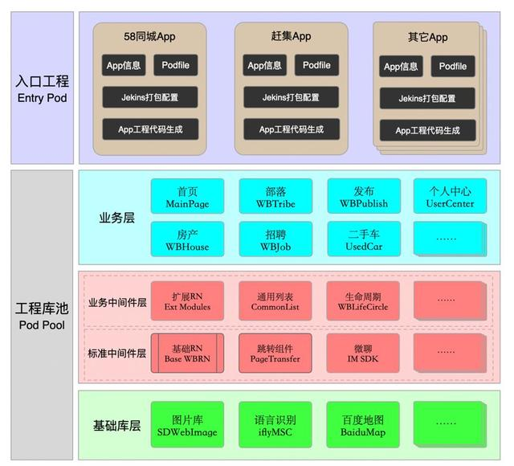

####名词解释

#####PODS

在iOS领域，pods特指cocoapods，是其缩写。cocoapods是对OC或swift Cocoa 工程的依赖管理。（CocoaPods is a dependency manager for Swift and Objective-C Cocoa projects. ）

#####中间件

中间件在软件领域的通用解释是：连接软件组件和应用的程序。在这里中间件体现的是连接和共用。连接的是业务层和基础库层，共用体现在业务层的公共服务。

中间件按照业务强相关与否分为业务中间件和标准中间件。

业务中间件：与业务强相关的中间件，在某一个独立App中通用。由于对当前App其它功能的过多依赖，所以不适用于其他独立App。标准中间件：与业务弱相关的中间件，不仅在某一个独立App中通用，在其它独立App中也通用，与App中的业务弱相关。最常见的是标准版的RNSDK。基础库

对其它pod不产生依赖的独立库。比如一些开源的三方库，是常见的基础库。除了第三方开源的，58集团内自封装的sdk，如果对其它pod不产生依赖，也可以归入基础库范围，比如Passport SDK，WPush SDK等；

#####入口工程

主要负责对App工厂生成的App所需代码进行配置。

入口工程pods：主要负责对App工厂生成的App所需代码进行配置，入口工程中包括的功能有：

* APPInfo：对App基础信息的设置，比如App名称，bundle identifier，版本号，证书等；
* Podfile：当前App对所需工程代码的依赖，比如招聘马甲包会依赖招聘业务pod以及其他基础服务pod和三方库pod；
* Regen.sh:一个可执行文件（本地RD研发调试用），读取podfile配置，拷贝App所需代码及配置，然后生成App所需代码；
* Reng_jenkins.sh:一个可执行文件（Jenkins服务打包用），读取podfile配置，拷贝App所需代码及配置，然后生成App所需代码；

#####工程库池

工程池是App工厂总的pod代码集合。

工程池是App工厂总的代码集合，每一个生成App所需代码都是从这个代码集合中获取，研发过程中代码更新也会同步更新到此代码集合中去。

* 业务pods：各独立业务工程代码，代码集合根据业务类型来划分，比如App首页pod、房产pod、招聘pod；
* 中间件pods：App工厂中间服务代码，是58自己封装的，区别于外界的第三方公开代码，故称为中间件代码。中间件根据对58App业务的是否强依赖分为：
  1. 业务中间件：与58App业务强相关，但是是58App中业务中通用中间服务，其应用场景在58App的业务场景内。
  2. 标准中间件：与58App业务弱相关，可以作为一个标准化中间件在其它独立App上引入。在标准中间件中可以看到有图标加了两条竖线，这表示此标准中间件某些功能的实现依赖接入App的实现，只开放了接口协议。以RN基础库标准中间件为例：中间件包含的内容是载体页及热更新的全部公共的与业务弱相关的内容，但对于一些扩展的组件（比如埋点）需要开放协议让接入方实现，中间件中不实现此逻辑。
* 三方库pods：外界的开源第三方库代码，基本在行业内有统一的引用标准；

#####架构解析

上图是App工厂架构图，大的方面分为上下两层：入口工程和工厂池。入口工程pod对工程池中的pod进行依赖，通过podfile配置每一个入口工程所在App所需的pod代码。

工程池中的pod分为业务层、中间件层和基础库层。其中中间件层根据代码是否强依赖58App业务，分为业务中间件和标准中间件。

#####在架构设计上，各层pods的依赖准则为：

上层可以依赖下层，但下层不可以依赖上层。比如上层中的业务pod中的首页（MainPage）可以依赖业务中间件中的生命周期（WBLifeCircle），但反之不能依赖。可以隔层依赖。比如业务pod可以依赖基础库pod；业务pod间不能产生依赖。比如房产pod不能依赖招聘pod。中间件pod和三方库pod可以单向依赖。比如RN所在pod可以对登录服务所在pod产生单向依赖。制定上述依赖准则，是为了在生产App时或者进行垂直业务平移时可以按需配置所需pod。

####如何借助App工厂架构达成设计目标

#####1.如何提供标准化的能力

所谓标准化能力，可以理解为独立无依赖的Framework或SDK，对应上述架构图中的标准中间件。比如RN基础库，封装了载体页、热更新等一整套公共服务，58App外的独立App可以无缝接入。

下图展示的一些标准中间件：

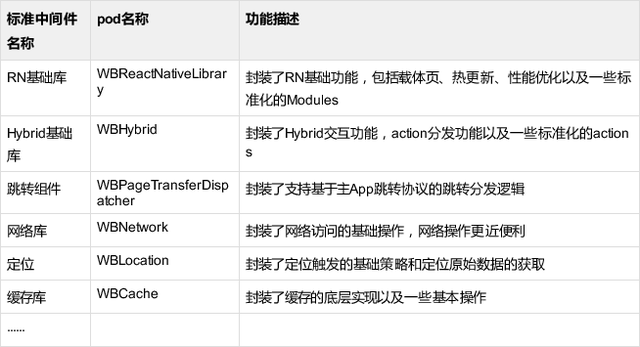

另外，还有一些集团内其他中台部门提供的标准化SDK，比如PassportSDK、IMSDK、Pay58SDK等。

#####2.如何支持创新App、极速App的生成

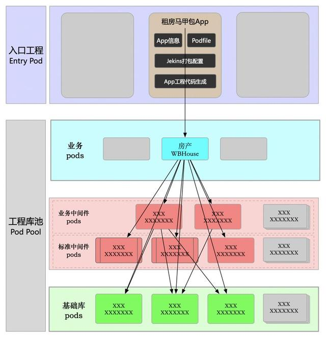

如上图所示，在理想工程架构状态下（即达到架构各层依赖准则），可以按需配置App所需功能，来生成马甲包或者极速包。

当然为了应对苹果审核（App之间必须保持差异性），还得针对马甲包或者极速包来做一些个性化的处理。这种个性化处理在先前的马赛克项目有完成，具体详见马赛克项目。

#####3.如何支持垂直业务的平移

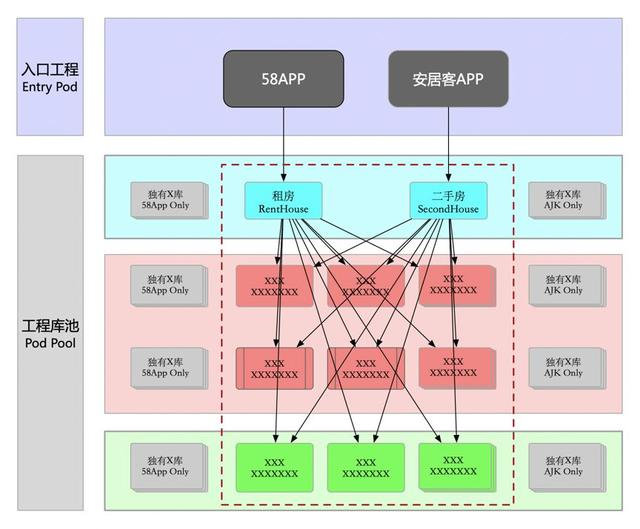

垂直业务：同一业务在多个App上呈现的业务称之为垂直业务。

垂直业务平移：并不是真的去移动，是指垂直业务及依赖的底层代码是一套公共代码，能够运行在不同App上。

上图所示的是租房和二手房这两个垂直业务需要达到一套代码，同时运行在58App和安居客App上。这就要求：

* 58App和安居客App共用垂直业务所依赖的底层代码（中间件代码+基础库代码）；
* 垂直业务代码及所依赖的底层代码对58App或安居客App中的独有代码没有任何耦合，这样就不会携带一些无关的不需要的代码，有利于控制包大小；

垂直业务代码及所依赖的底层代码必须满足App工厂架构中的分层原则和依赖原则，这样架构扩展性会比较灵活

####如何对存量代码实施App工厂

基于前文App工厂技术架构及各层pod的依赖准则，各层pod的依赖关系理想示意图如下图所示（以招聘业务pod依赖为例）：

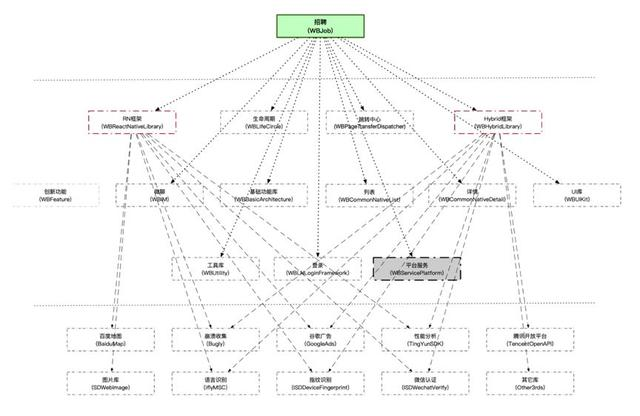

* 从业务层到中间件层再到基础库层，从上到下单向依赖，没有反向依赖和循环依赖
* 业务层之间没有依赖
* 中间件层和基础库层可以允许有单向依赖

有了上述理想的依赖关系后，在入口工程进行生成App所需代码进行配置时，就能按需配置，不会因为pod之间的反向依赖、循环依赖、整层依赖携带很多无用代码，增加包大小。

#####1. 业务层pod解耦

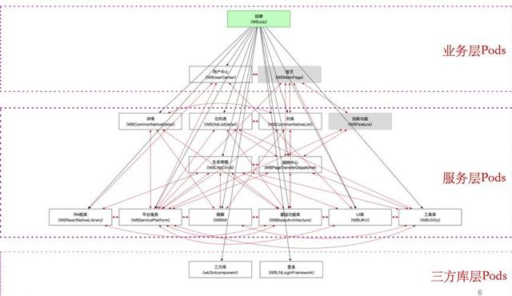

上图所示的招聘业务的依赖关系。黑色箭头表示的是pod的单向依赖，红色的双向箭头表示的pod的双向依赖。

**备注**：服务层对应中间件层，三方库层对应基础库层。

针对业务pod解耦主要处理下层pod对业务pod的依赖以及业务pod之间的依赖，如下图所示：

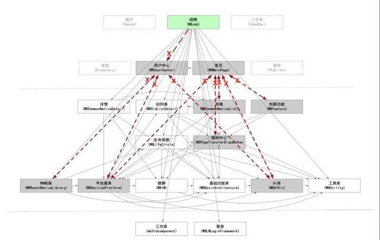

#####2. 中间件层pod解耦

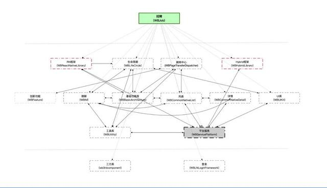

如上图中实线所示的是招聘pod所依赖的中间件层pod之间的耦合关系。

服务层pod解耦要解决以下两种耦合关系：

* pod之间的双向耦合
* pod之间的不必要单向依赖

服务层pod的解耦至关重要，直接涉及到对工具库pod的依赖处理。如不解除服务层pod的循环依赖关系，则会导致对工具库pod的整层依赖，没法按需配置所依赖的pod，造成包大小无法控制。

#####3. 基础库层pod解耦

由于基础库层pod是最底层pod，没有其他的依赖pod，所以也是这三层pod解耦工作量最少的。

目前58App内的基础库层pod全都是放在一个pod中，这层解耦所要作的是按照功能对这个pod进行拆分，拆成一个个上层pod可依赖的单元。

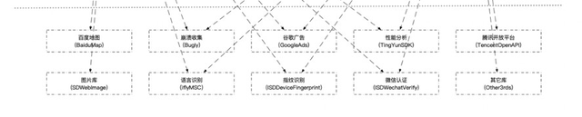

####如何保证APP工厂质量

App工厂的质量在版本迭代过程中的质量非常重要。如果在后续版本迭代过程中代码没有严格遵循App工厂的pod依赖准则，等到发现问题才去解决，会带来很大的额外工作量。

#####1. Pod依赖关系检测

这个是所有质量检测的基础。在本文看到的一些pod的依赖关系都是我们开发的pod依赖自动分析工具得出的。如果没有这个工具，在一些中大型的App中，靠人工方式去梳理这种依赖关系，将是一个极大的工作量。在这里大概说一下思路，有更好的方式欢迎交流：

* 扫描本地工程目录下所有pod代码文件夹，及里面的类文件，建立类文件与pod工程的映射关系 filePodDict。
* 扫描每一个pod下面类文件中的文件依赖部分（import部分），根据头文件依赖及上面的filePodDict，建立pod的直接依赖关系podDepenDict。
* 串联所有pod的直接依赖关系，形成pod依赖最终关系podFinalDepenGraph，并输出。最终Pod的依赖关系对应的数据结构是有向图。

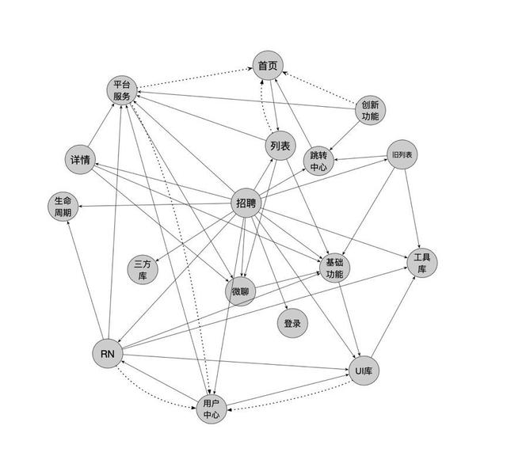

如上图所示，是基于招聘pod和其依赖的pod构建的有向图的示意图（为便于识别，将两个pod直接相互依赖的一条线画成了虚线）。基于这个数据结构，能实现前文所说的App工厂依赖准则的检测。

#####2. 下层Pod对上层pod反向依赖检测

下层pod对上层pod反向依赖，是App工厂依赖准则首要禁止内容。比如如果中间件层的WubaRN的这个pod依赖了上层首页pod，会导致在业务平移过程中因为依赖WubaRN，而需携带不需要的首页业务代码。

基于上述的有向图，反向检测在技术上很容易实现：

* 内置一份pod与层级的映射关系
* 遍历pod依赖关系有向图，检测当前pod所依赖的pod层级是否小于自己的层级，如果小于，则是反向依赖，并标记
* 将标记的反向依赖关系输出

#####3. Pod循环依赖检测

在App工厂中，除了业务层代码有非常明确的原因不能有依赖和环外，其它层的pod之间即使存在环，也有办法达到App工厂不携带多余代码的目标。但撇开App工厂不说，环的存在本质上是大多数情况两个pod之间存在公共代码没有下沉。所以为了使App工厂的依赖准则更简单和更易执行，就统一规定不能产生循环依赖。

检测有向图是否存在环，是一个基础的数据结构问题，在此不赘述。

#####4. 标准中间件污染检测

标准中间件是App工厂的核心，如果标准中间件在后续的业务迭代过程中被污染，即引入了不符合准则的依赖关系，将带来额外的维护成本和解耦成本。所以如果能在单分支研发的时候以及集成分支上进行检测，将被污染的概率降到最低。

在App工厂中，标准中间件只允许依赖基础库层的pod。所以检测策略也很简单：

遍历所有标准中间件遍历每一个标准中间件所依赖的pod，并判断所依赖的pod是否属于基础库层。如果不属于，则标记这个被污染的依赖关系。输出所有被污染的标准中间件及不合规的依赖关系。

####App工厂的实践经验

App工厂在58App上有着广泛的应用。目前已在房产垂直业务平移和招聘垂直App生成上进行了应用，并上线。

房产垂直业务平移实践（木星计划项目）

从去年开始，58同城房产业务和安居客房产业务进行了调整，租房和二手房业务在两个独立App上进行了重新拆分和整合。业务调整后原来的58同城租房和安居客二手房业务变成了垂直业务，即在58同城App和安居客App两个独立App上同时运行。业务的调整给技术架构带来了很大的挑战：

* 如何将58同城租房、安居客二手房从原有App中拆分出来？
* 如何在拆分过程中处理依赖代码，最大限度降低携带无关代码？可以想象一下，如果不基于App工厂要达成上述目标，会出现什么情况？
* 要么携带很多对方App所不需要的，或者重复的代码，造成包大小失控。
* 要么针对具体业务写非常多的协议（Protocol），各独立App针对协议做各自实现。但这个协议会非常多，尤其针对存量代码的改造成本非常高。

于是，58无线技术部与房产技术部（安居客房产技术部、58房产技术部）一拍即合，就将App工厂应用到房产垂直业务平移中。

#####1.项目里程碑

这里重点介绍一下项目里程碑，以说明在多App垂直业务平移过程中，接入App工厂的思路。

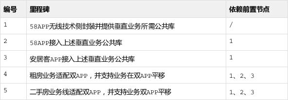

从上述表格及依赖关系可以看出项目主要分为三个阶段：

* 抽离出垂直业务所依赖的公共库
* 各App分别接入抽出的公共库
* 垂直业务做一些适配，能同时运行在双App上

第一个阶段公共库的抽离大概用了1个半月；第二个阶段各独立App接入公共库用了1-2个版本（平均3个星期一个版本），主要看测试资源的情况；第三个阶段垂直业务平移用了2-3个版本。

#####2.项目实施概述

######2.1 公共库的抽离

这里的公共库是指垂直业务所依赖的中间件层代码库和基础库层代码库。这一步非常重要，如果没有处理到位，后续业务在接入的过程中会不断返工。

具体垂直业务对中间件代码和基础库代码的耦合分析上文已详细介绍了，在此不重复描述。这里要讨论一个实践中很重要的问题：从两个独立App中抽离公共库，如何统一的问题？

这个问题很复杂，以网络中间件为例，各独立App都有自己的封装，而且封装的API差异很大，很难通过调整API协议去抹平差异。这种情况下最简单高效的方法是以一方App为基准，另一方App提兼容需求并放弃原有自己的代码，抽离出来后共同维护。

考虑到App的体量和对业务的影响，当时商量的是以58App为基准，安居客根据二手房业务代码的调用需求，提兼容需求。58App抽离出来后，安居客重新接入。

**最终剥离出的公共库（标准中间件）如下表所示：**

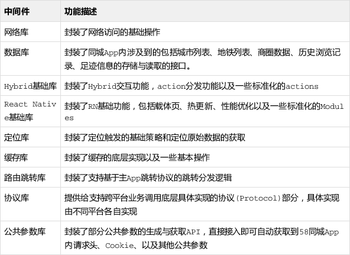

关于公共库的剥离有两个关键点要注意：

* 以要平移的业务所依赖的公共库为核心，不要贪多。以业务驱动来剥离公共库，随着业务的逐步接入和不断支持，公共库的数量和能力也逐渐上去了。
* 技术上剥离公共库不难，难的是最大限度降低对其它业务的影响，以及保证关联业务上线的稳定性。
* 如前文架构中介绍的，公共库有标准中间价和业务中间件。在这里没有具体介绍业务中间件的情况。因为业务中间件的依赖关系比较复杂。在具体拆分时一定要详细分析拆分成本。

######2.2 各独立App接入公共库

下表列举了实施过程中的其中有代表性的四个中间件在各独立App上的接入方案。

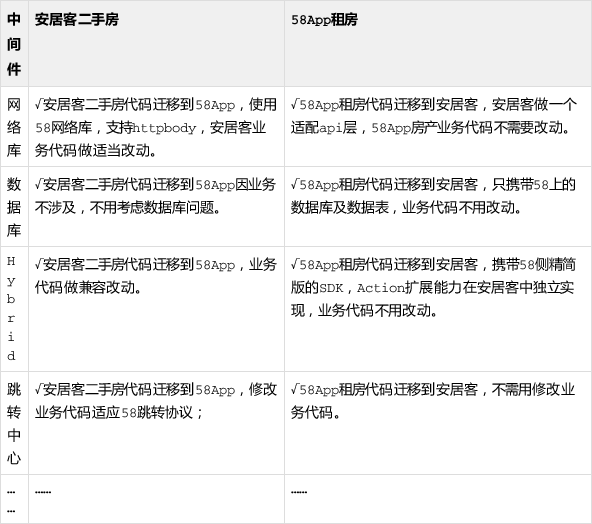

由于是基于58App抽离出的中间件，所以58App租房代码在平移的过程中，业务代码基本不用改动。但安居客的业务代码需要做相应的改动，这个成本是节省不了的。从当前上线的安居客二手房功能代码稳定性来看，这个部分改动很成功。

######2.3 垂直业务平移

上述垂直业务依赖的公共库在各个独立App接入后，并不意味着垂直业务就可以平移了。App工厂的一个核心目标是不携带无关代码。垂直业务除了对公共库有依赖，还对自身App中的其它模块代码有依赖。只有最大限度对这些非公共库代码摘除依赖，即拆分成业务中间件，才能真正满足App工厂目标。

这里不具体叙述如何去解藕业务中间件，主要介绍一下操作过程中的几个准则，只要把握好这个准则，基本没什么大的问题：

* 分析依赖代码能否做成业务中间件。业务中间件一定要满足前文叙述的单向依赖原则，否则在代码携带过程中无法做分析。
* 如果依赖代码只是少数几个文件，不足以拆分出业务中间件。在对包大小没有影响的前提下可以允许一些重复代码。
* 拆分业务中间件的过程中一定要保证对其它业务线不要产生影响。比如房产和招聘都依赖一块业务中间件代码，那在满足房产业务平移的过程中，要想办法不要对招聘代码产生影响。
* 对常见的解藕手段一定要注意选型，比如什么场景该用通知，什么场景该用runtime，什么场景该用protocol。

#####3.项目成果

这个项目是三方一起共同完成的，在这里仅说无线iOS侧的一些成果：

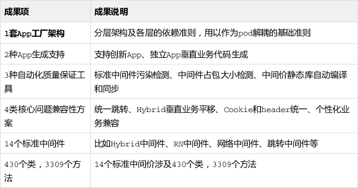

上述成果只涵盖了App工厂标准化成果，这些标准化成果不仅仅支持房产垂直业务平移，还适用于对其它业务的支持，比如58同城招聘App（已完成）、58同城租房App（即将进行）的生成和部落垂直业务平移（正在进行）。关于业务中间件的解耦与具体业务有关联，在此没有详细梳理。

App工厂在木星计划中对包大小的收益及接入后的稳定性如下表所示：

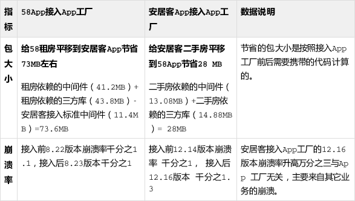

从上表可以看出，包大小上不论是对58App还是安居客App，都有非常大的收益。崩溃率在接入前后没有显著性变化，代码上线稳定表现良好。特别是针对崩溃率和功能稳定性，涉及这么大范围的变动，能做到没有线上事故确实不容易。

####58同城招聘App（创新App）生成实践

创新App、极速版App都是同一类型的App，大部分基础功能都可以使用App工厂基础能力。由于苹果在马甲包审核规则上的限制，功能的相似度超过一定程度会有较大的审核风险。所以不论是创新App还是极速版App，基于苹果审核的限制，肯定不能百分生成所需要的代码，有一部分代码需要额外开发。至于额外开发的代码需要占多大比例，没有确定答案，能向苹果解释得通业务模式差异，能通过苹果审核就是王道。

同木星计划项目中接入App工厂不同，创新App代码的生成下面将换一个角度来描述，重点介绍pod依赖的梳理与解耦。

#####1. Pod依赖的耦合梳理

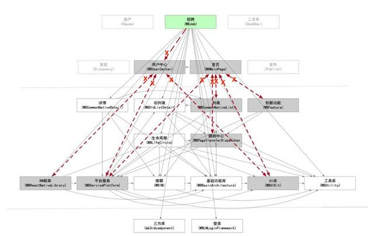

Pod依赖的耦合梳理的目标是：招聘pod依赖直接或间接依赖哪些pod，这些依赖关系哪些是不满足App工厂依赖准则，如何剪除某些依赖关系达到App工厂依赖准则？

上面的依赖关系图中有两根灰色的虚线，整个图被切成三部分，从上到下依次对应App工厂架构中的业务层、中间件层和基础库层。其中打叉号的箭头表示的是不符合App工厂依赖准则的：

* 业务pod横向依赖。比如招聘和用户中心pod都属于业务层，但招聘pod依赖了用户中心pod，属于同一层中的横向依赖，这个依赖需要剪除。
* 下层pod对上层pod有依赖。比如跳转中心pod依赖首页pod，跳转中心pod属于中间件pod，首页pod属于业务层pod，这种依赖就是下层的中间件pod依赖了上层的业务层pod，这个依赖需要剪除。

可以看到，如果将上述不符合App工厂依赖准则的依赖解除之后，招聘pod就与个人中心pod和首页pod没有依赖关系了，在App代码生成的时候也不会携带不需要的代码了（个人中心、首页pod的代码及其依赖的一堆代码）。

#####2. Pod间耦合解除措施

Pod间耦合解除最终是要落地到pod间代码的调用关系解除，比如招聘pod依赖了用户中心pod，肯定是招聘pod中的某个代码文件依赖了用户中心pod的代码文件，解耦的落地是找到代码文件中代码的耦合并根据情况解除。

我们常用的代码耦合解除手段有：

* **移动代码文件。**这是成本最低的一种手段，测试影响也相对最小，是最先推荐使用的方案。通过移动代码文件到一个合适的podFit中后，原有两个pod的耦合关系就自动解除了。选择这个合适的podFit的一个原则是，原有pod本来就对这个podFit有依赖关系，增加新的代码文件并不会带来新的依赖。但有的时候没有一个已有的合适的pod，这时候就要评估创建一个新的pod来解决这种情况了。
* **移动方法或公共属性。**这是成本次高的一种手段，方法或者公共属性所处类的位置发生变化后，需要梳理各种使用的业务逻辑，尤其是要注意runtime对方法的动态调用。
* **编译时耦合解除。**有好多代码间调用其实并不是必须的，比如招聘pod有一个投递简历的逻辑和个人中心我的简历业务耦合。一旦用户在招聘模块投递了一个简历，个人中心需要有相应的功能显示。招聘模块需要向个人中心模块传递一个消息，这个消息的传递可以用通知实现，也可以直接调用个人中心提供的API。但无论时是哪一种实现方式，这个消息传递并不影响招聘模块的业务独立性，即使个人中心这个模块功能没有，招聘模块也可以运行。这种情况下的解耦，只要保证在编译时代码不报错，将一些直接API调用的地方改用通知，或runtime调用方式即可。
* **公共代码下沉。**有好多代码间调用是运行时必须的，针对这些代码就没法使用编译时耦合解除的手段，需要将这部分代码下沉到下一层，比如中间件层。公共代码下沉的手段和前文提到的代码文件移动的手段有些交集，但又有差别。代码文件强调的是代码文件的移动，不一定要移动到下层pod；公共代码下沉既可能是代码文件下沉，也可能是某一个方法下沉。
* **基于协议的代码隔离。**还有一种常见情况需要重点提出来，就是有好多业务在不同App中表现形态不一样，很难用一套代码来解决。针对这种情况，需要抽离出一层协议，在公共代码中通过协议来调用，在接入App中基于协议来完成不同的实现。

Pod解耦，尤其涉及到业务层代码和中间件层代码的解耦，很难有一个标准衡量哪些pod的耦合在最开始做的是对的还是错的。因为好多业务在最开始的时候从产品层面，没有考虑到这个业务是一个垂直业务，会在多App上平移。但是一旦有一个业务被确定要支持多App后，这个业务涉及的pod的依赖关系必须满足App工厂的依赖准则。这一点在后续的业务持续迭代中要尤其注意。

####风险控制

App工厂的整个代码重构，涉及的面非常广。58App今年在App工厂上对代码的改动是之前所未有的。每个公司业务及架构不同，代码的复杂度和重构的难度也不一样，所以面临的线上风险也会各有差异。在重构过程中除了要有严格的技术方案评审、代码审查、全面的Case测试外，尤其要注意两点容易被忽视但很容易出问题的点：

**版本迭代合并遗漏风险**

在58App中，随着App工厂的不断深入和业务的逐步接入，中间件层和基础服务层拆分的越来越细了，pod的数据目前全部加起来已经超过50个了。App工厂项目进行的同时，还有日常版本需求项目并行开发。在这过程中，同一份代码既可能会在App工厂中改动，又会有相应新需求的研发。

App工厂项目跨度比较长，比如某一个中间价是基于8.0版本拉分支出来开发的，但是可能会跨几个版本才能上线。在这个过程中一定要不断合并新版本代码到当前App工厂分支。并且对一些有冲突的代码一定要细心处理。中间件层代码和基础服务层代码的变动测试一直是一个痛点，很难覆盖所有的业务场景，所以一定要对有冲突和有改动的代码进行细心处理，以防带来线上问题。

**数据耦合风险**

数据耦合指的是某些业务代码会操作且依赖某公共数据。但数据依赖在编译时和大部分运行时发现不了，这给发现问题带来很大的难度。比如App上的商圈数据、埋点数据、用户电话拨打记录、帖子收藏记录等，都属于数据耦合范畴。

与上面的版本合并遗漏问题一样，数据耦合风险处理的原则也是对所有影响数据的业务进行详细的梳理并解耦，要从开发、测试、灰度数据验证等多个关键节点进行全面处理。

####总结

任何架构都离不开业务，都是为了解决业务痛点、问题的，App工厂也不例外。由于每个公司的App架构不同、业务形式不同、部门协作研发的形式也不同，所以肯定没有一个放之四海而皆准的App工厂理论和实现准则。

58App在实施的过程中，也是通过业务的不断接入逐步完善App工厂的能力。而完善的这部分能力，有标准化的能力，也有非标准化的能力。而且标准化和非标准化随着后续业务的迭代还可能会相互转化。未来58App还会持续在更多业务上进行接入，以持续解决业务问题，给业务研发提效。

App工厂是团队协作的成果，感谢参与其中的同学。App工厂从构想到实施、再到业务接入，是近年来58无线技术少有的大动作。没有用户价值增长部各级老板的构想、规划、指导和组内同学的协同贯彻实施，没有房产技术部（安居客房产技术部、58赶集房产技术部）、招聘技术部等部门的老板和同学的精密协作和业务实践，是启动和完成不了这么一个大的工程。
