 
<!--BEGIN_DATA
{
    "create_date": "2024-06-01 11:55", 
    "modify_date": "2024-06-01 11:55", 
    "is_top": "0", 
    "summary": "移动端图形API通讲（一）-- 数据和提交<br/>移动端图形API通讲（二）-- 同步和内存<br/>移动端图形API通讲（三）--管线、数据和绘制指令", 
    "tags": "OpenGL、Game", 
    "file_name": "移动端图形API通讲.md"
}
END_DATA-->

#### <p>原文出处：<a href='https://km.woa.com/articles/show/580380' target='blank'>移动端图形API通讲（一）-- 数据和提交</a></p>

> | 导语 一直想整理下关于移动端图形编程API的文档。如果说图形编程的内功是计算机图形学的诸原理和算法，那么外功就是实实在在的硬件API。当我们设计引擎的渲染硬件接口层的时候，要面对移动端图形API的三座大山Gles，Vulkan，Metal。这系列文档的一个主要目的是把这三大API放在一起学习，但还有一个目的是试图比较总结他们背后的共性和差异，以试图更容易理解图形API设计上的通用思想，帮助大家一起练好外功。

## 引言

一直想整理下关于移动端图形编程API的文档。图形API为何重要？如果说图形编程的内功是计算机图形学的诸原理和算法，那么外功就是实实在在的硬件API。外功和内功都很重要，不能精通API的使用，就无法把内功的各种渲染特性合适高效的实现。

当我们设计引擎的渲染硬件接口层的时候，要面对移动端图形API的三座大山Gles，Vulkan，Metal，他们因为被封装在驱动里，是一些我们只看得到晦涩的接口而看不到实现的黑盒，这是初学者学习API的一个主要阻碍。其实把他们放在一起学习，放在一起横向比较，会更容易发现一些图形API设计上的哲学。

所以这系列文档的一个主要目的是把这三大API放在一起的学习的教学文档，但还有一个目的是试图比较总结他们背后的共性和差异，以试图更容易理解图形API设计上的通用思想。

Vulkan之于图形编程可比C++之于CPU编程，相比下OpenGLes更像脚本语言，所以传统上以Gles为入门API的学习因为看不到图形编程的底层和全貌反而更加不容易让人掌握。Vulkan虽然庞大复杂，但它是一个很纯粹，完整的理解图形编程的API，所以本文档将以Vulkan为主要脉络，以gles和metal为对比实现来讲解，以让读者先建立图形API设计的主要思想，然后看下gles和metal分别从基础和高级的倾向上如何在驱动中为我们隐藏一些实现的。

大多数VK/gles的入门教程都会试图用最简单的十几行代码叫我们如何画出一个三角形，但是读者不免会有疑问，为什么我用这样十几个API调用之后GPU就为我画了三角形，少调用其中某个API会怎样？这个文章我不以实现某个渲染效果为导向，也不使用类似Reference Document中介绍API使用的顺序，而是按照图形API设计的角度试图从基础到复杂来解构，将分成如下章节：

● 数据

● 提交

● 同步

● 内存

● 管线

● 对象

● 命令

● 扩展

● 其它

本篇将是第一篇，介绍最基础的数据和提交模型 希望争取后面每个月可以更新一篇。另外文字量较大，唯恐有重要点的遗漏之处，如有错误的表述和理解，欢迎指正。

## 一、数据

### 1.1数据类型

任何一个API都可以分成两部分，CPU一侧的驱动API和GPU一侧的shader代码，shader编程是一套相对自成体系的GPU编程内容，使用的是GPU一侧定义的数据类型，本文只介绍CPU一侧的API编程部分。在CPU一侧，API使用的基本数据结构可以分为几三类：

* 1.简单数据结构，因为这些API都是基于C++的，所以可以使用C++中的所有的数据类型，metal因为属于IOS的编程语言Obj-c/Swift的一部分，所以它的数据类型也是IOS编程语言的一部份，但是Vulkan/Gles一般都还会有一些额外的定义，大多为了跨平台的兼容考虑（布尔值，指针类型，各种精度的浮点数和定点数）。  
例如

<table><tbody><tr><td align="left"></td><td>Vulkan</td><td>gles</td></tr><tr><td align="left">布尔值</td><td>VkBool32/ VK_TRUE/VK_FALSE</td><td>glboolean</td></tr><tr><td align="left">地址</td><td>VkDeviceAddress</td><td></td></tr><tr><td align="left">浮点/定点数</td><td></td><td>glbitfield/glhalf/glfixed16<br>/GLfloat/GLclampf/...</td></tr></tbody></table>

* 2.device（GPU上的）资源

```
gl和vulkan在CPU一侧都将GPU资源看成一个handle  
GL上统一都用这个原始的handle （GLuint）表示  
Vulkan则将handle继续typedefine成新的数据类型，如VKBuffer VkImage  
Metal则将资源封装到实在的对象中，如MtlBuffer MtlImage  
```

* 3.提交相关的数据  

```
Gles为我们隐藏了提交的实现细节，所以没有定义这类数据  
而现代API则都需要抽象如下概念：  
图形设备 Device （如VKDevice MTLDevice）  
提交队列 Queue （如VKQueue MtlCommandQueue）  
提交指令 Command Buffer（如VkCmdBuffer MtlCommandBuffer）
```

这些数据大多数不是thread-safe的

### 1.2对象创建

这里指的是资源类和提交相关结构的实例创建。 一旦对象被创建，对象的结构一般是不变的，只有里面的数据会改变

**gles风格的创建API：**

gles为我们隐藏了创建的细节，大多数object是先通过GenObject产生handle，在BindObjec时同时创建object并bind到handle， 如创建buffer：

id = glGenBuffer() 产生一个buffer名字或handle

glBindBuffer(target, id) 创建这个buffer对象的实体，并把它通id这个handle绑定，后面用id来操纵对象

gldeletebuffer(id) 释放这个buffer对象，回收名字

也有少量的object有单独的创建api。

**高级API：**

一般有两种创建方式：

  1. 直接创建：由于性能不好，要低频使用

```
vk上如vkCreatexxx，一般用VKxxxCreateInfo作为参数  
对应vkDestroyxxx  
metal上如  
[device newBufferWithLength: bufferSize options:MTLResourceStorageModeShared];  
```

  2. 从池创建：性能较高  

```
首先需要先创建这个资源类型的资源池，再从池子中分配  
vk上如vkAllocatexxx，一般使用VKxxxallocateinfo作为参数，需要先创建这个池  
对应 vkFreexxx  
metal上则叫做从heap创建，一般要先创建一个metal heap，然后再heap上调用  
如[heap newBufferWithLength:bufferSize options:MTLResourceStorageModePrivate];创建一个buffer
```

### 1.3数据查询

我们有查询数据的需求，

要么查询全局上下文上的，如当前绑定的管线状态，

要么查询某种对象的，如某个handle的buffer的大小。

**Metal**上对象都有实在的数据结构，因此可以直接从这些对象上获取

**Gles**则依靠一些全局API获取，一般用glGetBoolean/interget/float/interger64v/pointer_v/string查询context上的属性

用各种GetXXX类型的API查询object上的属性，相对有些乱，如

GetvertexAttribute查询VAO相关，

GetBufferparameter查询一个buffer 对象的，

GetShader查询某个shader的，

GetSyncs查询某个syncobject对象等

**Vulkan**则不提供类似查询接口，因为事实上所有数据都是我们自己设置的，vulkan认为我们app测有能力记住这些数据（你会发现不维护多余数据和状态是vulkan的设计哲学之一）。

## 二、 提交

提交是API的终极目的，我们使用图形API编程的目的就是为了让CPU通过指令控制GPU工作，而最后的一道工序都是为了将指令提交给GPU，所以有必要先了解为了这个终极目的，各种API是怎样工作的，他们的差异很大，但是殊途同归。

### 2.1图形指令提交的基本模型

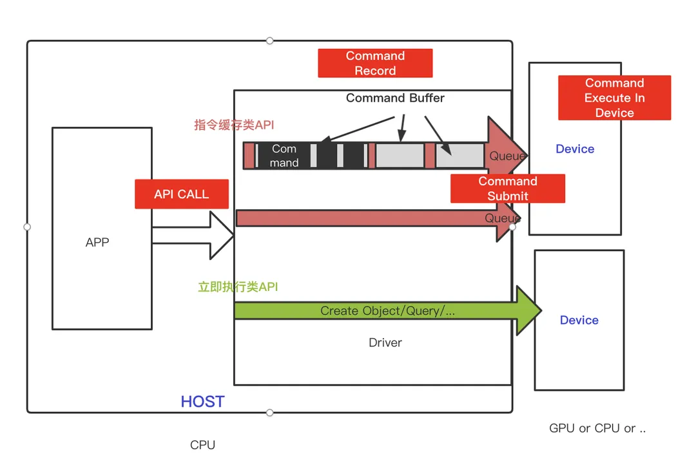
上图是APP使用图形处理器绘制图形的基本流程，APP通过调用图形API指挥显卡驱动调度GPU工作。首先明确这里面有四个重要的动作：

**API CALL， Command Record， Command Submit，Command Execute**。

另外他们工作在两个大的领域上，HOST和DEVICE，这是一个生产者-消费者模式。HOST为生产者，在Host上有我们的APP，有显卡driver，HOST会产生四个里面的三个关键动作：API CALL， Command Record，Command Submit。HOST一般在CPU上。

#### （1）API CALL

这发生在APP的渲染线程上，即APP调用图形API命令显卡工作，API一般又分为两大类型：立即执行类，和指令缓存类。

立即执行类API：这类工作立即调用执行，如对资源的创建，查询管线状态，在vulkan上所有不以vkcmd开头的指令都属于这一种，这类API的瓶颈直接出现在APP调用API时，如短时间大量的资源创建。

指令缓存类API：很多渲染工作可以被拆分成一系列的渲染指令，并存在先后时序，数量众多，如需要先设置rt，再设置各种管线状态，最后执行绘制，这些指令不可能每发生一次就去马上触达device，效率会比较差，因此这类型的渲染工作通常是先压入到一个大的command buffer里，再统一提交给device的。 在Vulkan中所有以vkcmd开头的API都是这类API。Metal上所有在Encoder上封装的API都是指令缓存类API，Gles中很难从API命名发现它是立即执行类还是缓存类，只能从功能区分指令缓存类API。一半包括如下四种功能：**设置管线状态、draw、dispatch、资源拷贝**。

指令缓存类API需要3个步骤才能彻底完成工作：Command Record， Command Submit，Command Execute。

#### （2）Command Record

将指令缓存类API做适当的解析并压缩到command buffer里，这发生在驱动里，随着API调用而发生，多个Command buffer又会按次序加入一个提交队列Queue中，现代API还支持多个并行的queue（如vulkan和metal，gles则只有单一的queue），这样可以在多线中完成命令的录制和API call。由于渲染指令众多，Command Record通常是移动端在渲染上的最大瓶颈，也是CPU测的最大渲染瓶颈。

#### （3）Command Submit

APP通过显示的提交类API将queue中的内容提交给device执行，支持多线程Command Record的API也支持多线程的Submit。Submit也发生在驱动里，随着API调用而发生，虽然submit的耗时较高，但是每一帧submit的数量非常有限，大多数情况只有1次，所以通常不会成为瓶颈。

Device为消费者，即消费渲染指令进行真正图形绘制的角色，一般就是指GPU，但是GPU和device绝不是对等的概念，事实上，对于图形API来说，只要实现其规范的处理器都可以被当作device，包括CPU，甚至音视频处理器。我们在一些设备调用vkEnumeratePhysicalDevices时经常可以找到CPU。Device上只发生一个动作，即

#### （4）Command Execute

它从device submit上来的queue中读取指令并执行。读取和执行指令的顺序不一定和command在queue中的次序有关，对于多个并行提交上来的queue，读取和执行也不保证queue的顺序，除非强行指定queue的依赖。一句话说host的录制和提交有显示的顺序，device侧的读取和执行则没有显示顺序，需要靠一系列同步指令进行保证，后面将会提到。Command execute的瓶颈是唯一的GPU上的渲染瓶颈，它发生于复杂的gpu绘制场景上。

### 2.2提交相关的基本数据结构

首先Gles没有暴露出它的提交相关数据结构，APP所知道的只有调用API CALL，驱动隐藏了对API Command的Record。至于Comman的Submit，则是通过一些API CALL（glfinish,glreadpixel...都可能)对驱动进行暗示，让驱动觉得自己该提交了，最终还是驱动决定的何时Submit。此外GLES也只有一个command queue，我们在多线程调用API CALL，可以解决提升直接执行类API的CPU性能，但是不能提升指令缓存类API的CPU性能。

Vulkan和Metal则有显示的提交相关数据结构，让APP侧决定怎样record和何时submit，甚至如何精细化command之间的同步，如何在多线程做分工，所以他们都暴露了Host，Device，Command Buffer，Queue的概念，这个才是现代API的精彩所在。

我们下面按照上图中从大到小的概念介绍。

#### Host

通常代表一个APP实例，管理host一侧的一些全局状态，这个结构较轻。
vk上需要创建一个全局的VkInstance，需要传入当前APP的信息，需要使用的extension，layer等。

Metal上不需要创建类似结构。

#### Device

代表一个物理上的Device实例，如机器上有两块gpu，一块实现了vk的cpu，那就可能出现3个device。他们都可以以被当前APP同时使用。

Vk上通过vkEnumeratePhysicalDevices查询到所有支持的VkPhysicalDevice，然后被后面使用。

Metal 上，对于IOS，只有一个device，使用MTLCreateSystemDefaultDevice创建这个唯一默认的即可，在mac上才可能存在多个，它返回的是一个`MtlDevice*` 类型。

**Device Group**

Vulkan上还有Device Group的概念，一个Device Group的Device才能被APP同时使用。通过API
vkEnumeratePhysicalDeviceGroups来枚举当前支持的所有的Group，以及每个Group内的Device。

Metal尤其在IOS上因为只有一个Device，所以没有这个概念。 Gles上则也因为不能同时使用多个Device而没有这个概念

**Device Property**

我们经常要了解当前Device支持的能力，以决定我们可以用哪些渲染特性，这个在vk和metal上也有显示的封装。

Vk上可以用vkGetPhysicalDeviceProperties2查询具体某个Device的属性。这里可知道当前的vk版本号，各种指标的limit，具体的vk版本就可以决定core api支持的特性，此外还要使用vkEnumerateDeviceExtensionProperties查询当前加载的extension。

Metal上则不依靠metal的版本号，而是依靠MTLGPUFamily的概念。Metal为不同设备定义了统一的一组GPU Family的概念。


其中

**Common1-3和Metal3**是可能支持各种硬件平台的，metal3支持a13之后的芯片。

**Apple2-8**针对IOS平台，例如我们一般认为支持apple3的A9处理器开始才算是目前主流移动端特性的分水岭（多数手游以A9的iphone6s为机型下限）。

**MAC2**则针对mac平台。 详细的所有gpu family的支持特性可参考<https://developer.apple.com/metal/Metal-Feature-Set-Tables.pdf>

至于Gles，通过glGetinterger/glGetstring获取当前的gles版本号和加载的扩展来推测其能力。

**Logical Device**

在vulkan上还特有一个VkDevice的概念，它并不是物理device，它是一个app侧管理device的一个实例，一个app可能有多个device使用，但是只有一个vkdevice，为了同物理的device区分，也可以称它为logic device。调用API vkCreateDevice（）创建。

```c
VkResult vkCreateDevice(
    VkPhysicalDevice                            physicalDevice,
    const VkDeviceCreateInfo*                   pCreateInfo,
    const VkAllocationCallbacks*                pAllocator,
    VkDevice*                                   pDevice);
```

创建Logical Device需要基于(Physical )Device创建，因为多数情况一般都使用一个Device（就是唯一的那个显卡），就直接指定这个physicalDevice对象，但是也可以同时使用多device，这时需要设置VkDeviceCreateInfo
参数中的pNext，将其设置为VkDeviceGroupDeviceCreateInfo，里面可以传入同physicalDevice group一样的多个device。

#### Queue

最终装载所有渲染指令，由Host发送到Device的数据存储，好比CPU开往GPU的列车。

它里面搭载的是一个个Command Buffer的队列（就像一节节车厢），多个Command Buffer按顺序放入一个queue中。一个Device可能同时有多个并行工作的queue。

Metal上Queue有明确的限制，最多可以容纳64个Command Buffer。

**Queue Type**

一个device支持的所有queue可以按照类型被划分。如有些queue用来提交图形绘制指令的，有些queue用于提交资源传输操作的。 一个Queue也可能同时支持多个type，如vulkan上，大多情况可以找到一个支持所有type的queue，理论上可以用它提交一切，但是使用更多的queue进行合理的分工意味着更多并行的可能。

**command同queue type的适配性：** 不同的指令command只能提交到支持它的特定type的queue中，这是非常重要的一个规则，在vulkan上，每一个VkCmd API的最后都有一个Supported Queue Types说明，要注意它是否提交到了正确类型的queue里面，在metal上，不存在这个困惑，因为metal上不同的queue具有的API本来就是不一样的。

Vulkan上这个queue type称为QueueFamily，并且有4种family，对应枚举类型VKQueueFlags:

**VK_QUEUE_GRAPHICS_BIT**:用于提交图形绘制指令，如draw call

**VK_QUEUE_COMPUTE_BIT**：用于提交CS计算指令，如 dispatch

**VK_QUEUE_TRANSFER_BIT** ：用于提交资源传输指令，如cpybuffer

**VK_QUEUE_SPARSE_BINDING_BIT**：用于提交sparse resource的内存绑定指令

Vulkan上没有API用来直接创建queue，而是打包在了创建logical device 的API vkCreateDevice中，作为logical device创建的一部份：

这里面要传入一个参数VkDeviceCreateInfo，用来指定当前logical device是由哪些queue组成的。这个参数里面有queueCreateInfoCount个VkDeviceQueueCreateInfo结构，

```c
typedef struct VkDeviceCreateInfo {
    VkStructureType                    sType;
    const void*                        pNext;
    VkDeviceCreateFlags                flags;
    uint32_t                           queueCreateInfoCount;
    const VkDeviceQueueCreateInfo*     pQueueCreateInfos;
    uint32_t                           enabledLayerCount;
    const char* const*                 ppEnabledLayerNames;
    uint32_t                           enabledExtensionCount;
    const char* const*                 ppEnabledExtensionNames;
    const VkPhysicalDeviceFeatures*    pEnabledFeatures;
} VkDeviceCreateInfo;
```

VkDeviceQueueCreateInfo结构如下，里面定义了创建queueCount个queueFamilyIndex类型的queue。

```c
typedef struct VkDeviceQueueCreateInfo {
    VkStructureType             sType;
    const void*                 pNext;
    VkDeviceQueueCreateFlags    flags;
    uint32_t                    queueFamilyIndex;
    uint32_t                    queueCount;
    const float*                pQueuePriorities;
} VkDeviceQueueCreateInfo;
```

也就是说，vulkan 的logical device里定义了要创建哪几种type的queue，每种type创建多少个。

这里的pQueuePriorities还可以为queue type指定优先级，但注意这是一个在cpu上处理的优先级，不是Device上的。

创建好vkdevice之后，我们就可以通过vkGetDeviceQueue（）来获取其中的某个queue的指针。

Metal上只有2种queue type：

Vk上的那四种在这里统一叫做普通queue ，**即Commandqueue**

另外还有一种Vk没有的用来从文件系统读取文件到Device的叫做**IOCommandQueue**

Metal上是通过调用MtlDevice的两个不同的API分别创建这两种类型的queue

newCommandQueue

newIOCommandQueue

#### Command Buffer

Command Buffer是Queue传输的基本单位，他是queue这趟列车的一节车厢，上面乘坐的每个乘客就是一个基本的（缓存类）渲染指令，它是记录指令的一块内存空间。

CommandBuffer通常由他所属的queue负责创建。

在Metal中，调用MtlCommandQueue/MtlIOCommandQueue的API commandBuffer来为这个queue创建一个Command Buffer。

在Vk上，Command Buffer不属于某个queue，而是全局上属于某个Type或QueueFamily的所有queue。

所以是通过vkCreateCommandPool(device, queufamilyindex)来指定为某个queuefamily的所有queue创建一个VkCmdBufferPool，再调用vkAllocateCommandBuffers从这个command buffer pool创建一个Cmd Buffer，并且这个command buffer也只能被提交到该queue family type的queue中。

**Command Buffer的主要操作**

如前面的图所示，我们对缓存类指令的操作主要是Record和Submit。这也是Command Buffer的两种主要操作。

##### Command Record：

Vulkan上使用了比较简单的做法，直接使用全局的API进行各种record操作，如调用一个drawcall，就直接调用vkcmddrawprimitive函数，vulkan中所有vkcmd开头的函数都是做record用的，这类函数的第一个参数都是它record的目的地VKCommandBuffer。如

```c
void vkCmdDrawIndexed(
    VkCommandBuffer                             commandBuffer,
    uint32_t                                    indexCount,
    uint32_t                                    instanceCount,
    uint32_t                                    firstIndex,
    int32_t                                     vertexOffset,
    uint32_t                                    firstInstance);
```

既然任何vkcmdXXX API都可以传入任何cmdbuffer作为参数，那么vulkan如何保证不同的command同queue type兼容性问题？或者说怎么保证上面调用dawindex时使用的cmdbuffer一定是个graphics类型的queuetype创建出来的？答案是没有保证，靠用户自己保证（这只是Vulkan设计哲学里，“不检查，不保证，一切靠你自己，调错就崩”的例证之一）那么你怎么保证？vulkan中cmdbuffer是基于queuefamily创建的，所以可以认为cmdbuffer本身是带有queue type属性的了，每一条vkcmdxxx函数API的下方都有一行叫做Supported Queue Types，详细写明了这个cmd可以进入的queue type，如果你把一条cs指令record 到一个不支持cs的cmdbuffer中，结果是未知的，可能崩溃，vkvalidation layer能够检查。

关于Command Record ，Metal上则较为复杂，它封装了一个单独的类型Encoder，它用来执行将指令Record 到cmd buffer的操作。

Encoder有5种类型，用于对不同类型的指令做record（或encode），分别用MtlCommandBuffer上的5个不同API创建(MtlIOCommandBuffer比较特殊，它不使用encoder，这里不讨论)：

**renderCommandEncoderWithDescriptor**： 创建一个 render encoder，encoder 图形相关指令

**computeCommandEncoderWithDescriptor**：创建一个Compute encoder, encoder compute shader相关指令 

**blitCommandEncoderWithDescriptor**：创建一个blit encoder，encoder资源传输类指令

**resourceStateCommandEncoderWithDescriptor**: 创建一个Resource state encoder，encode sparse resource相关指令。

**parallelRenderCommandEncoderWithDescriptor**:创建一个可以多线程并行record 指令的encoder。

可以看到metal虽然没有在queue级别做过多type区分，但是在record command buffer时对encoder做了相同的区分，还是殊途同归。

此外Metal还存在一种往argument buffer（用于GPU Pipeline，后面会提到）中encode指令的特殊encoder，MTLArgumentEncoder，它是从mtlArgumentBuffer创建。

Metal使用上面创建的各种Encoder，调用其各种API进行command的record到buffer的操作，不同类型Encoder所拥有的API是不一样的，如drawcall类型的API需要到rendercommandencoder中去找drawPrimitives函数。此外一个encoder在工作完成之前（即endencode（）之前），它所在的cmdbuffer，不能同时被另一个encoder操作，也可以这样理解，虽然metal上没有定义queue type，但一个command buffer一段时间只能看作是一种queue type的。Metal通过明确定义不同类型的encoder和不同名字的API显示保证了不同类型的command只能record到不同类型的queue中。

Encode是有生命周期的，它是一个一次性使用的对象，即endencode之后，就不能再被使用了，自动被回收，下次使用需要创建一个新的出来。

##### Command Submit：

vulkan上首先要将一些要提交的vkcommandbuffer封装到一个VkSubmitInfo2结构中，submitinfor中的cmdbufer按照数组中的顺序被提交。同时submitinfor也是commad buffer级别在Device一侧的基本同步单位，默认情况下，cmd buffer即使提交时有顺序，在device上执行也不保证顺序，所以submitinfor中可以定义同步结构vksemphone，它可以为submitinfor和submitinfor之间定义device执行顺序。

所以，不同的command buffer依据你的device测同步需求和使用的queue不同被装入不同的submitinfo中，最终调用vkQueueSubmit2(queue,VkSubmitInfo2,vkFence)提交给device。一组submitinfor只能提交到一个queue中。

metal上简单的调用MTLCommandBuffer的commit 进行提交。在提交前可以调用MTLCommandBufferd enqueue为他在queue上留有一个位置，buffer的enqueue的位置就是他们提交的顺序，如果没有调用过，commit也会自动为它调一下enqueue，这个提交顺序在Device上不一定严格保证还按照这个顺序执行，但是metal会自动检测到Renderpass之间的依赖关系合理的保证同步顺序，通常不需要我们额外关心。

我们用图来总结下Vulkan 和Metal 在Command Record和Submit这里的设计异同

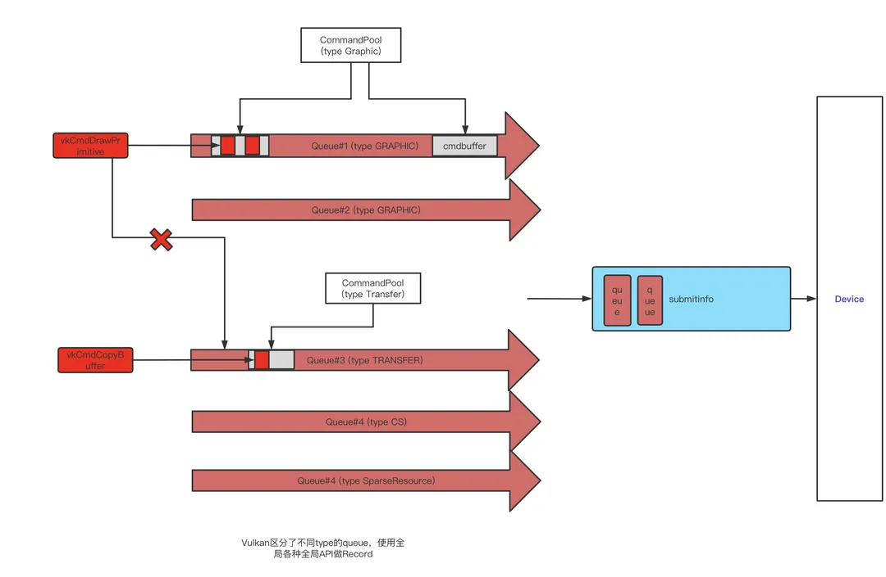

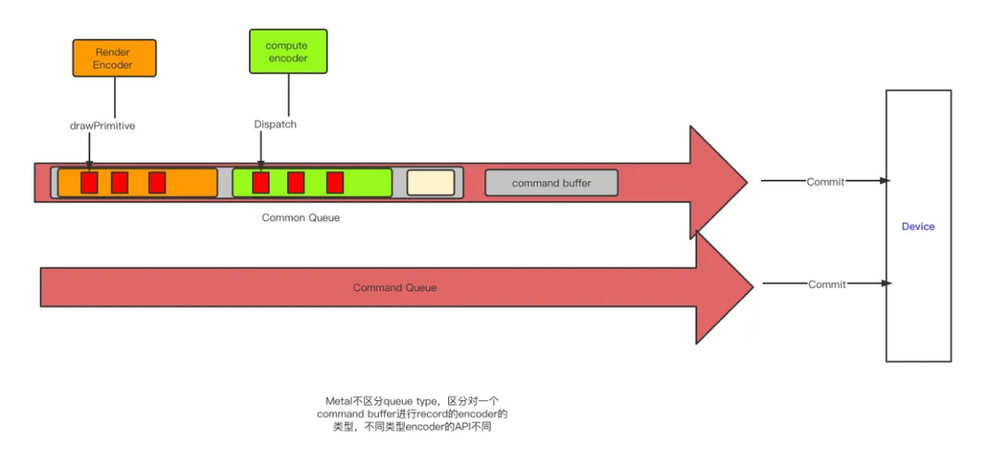

##### Command Buffer的生命周期

Command Buffer是容纳cmd的最小单位（一节火车箱），游戏过程中往往有大量的cmd buffer的参与，所以它的生命周期是个重要问题。

metal上非常简单 

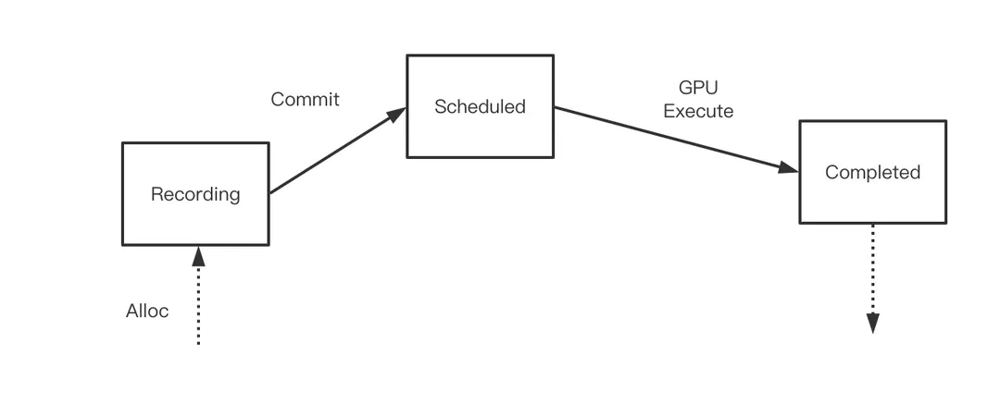
一个command buffer只有一次生命，不能被回收利用，分配出来后，经历record，commit，等GPU处理完之后自动被销毁回收。

Vulkan上这是一个相当复杂的事情，它彻底的暴露了底层cmdbuffer的所有管理行为，需要用户全程负责维护他的生命周期，它不仅可以被反复record，并且cmd buffer有着更复杂的行为，包括反复提交，多线程提交等行为也是在cmd buffer这层实现的，这也是VK编程中的难点之一。

**先看最简单的vkcmdbuffer的生命周期** 

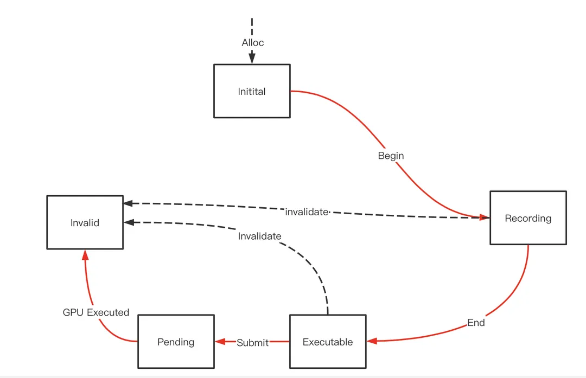 

cmd buffer被alloc出来后处于Initial状态，此时它不能接受任何cmd的record操作，必须经过VKBeginCommandBuffer后进入Recording状态才行，在Recording状态进行了各种api操作后（或者也可以不做任何cmd 录制），需要调用VkEndCommandBuffer将其结束后转变为Exuecutable状态，在这个状态下才能调用vksubmitqueue将其提交，提交后它将处于pending状态，意为等待GPU调度，最后GPU执行结束进入到Invalid状态。

到达Invalid状态意味着一次完整的录制-提交-执行的结束，如果Cmd Buffer不能支持重录制和重提交，这个cmd buffer的使命就结束了，只能调用VkFreeCommandBuffer将其回收回pool，此外在任何状态下都可以调用VkFreeCommandBuffer将其回收回pool，此时cmd buffer都等同进入invalida状态。

此外在整个循环的过程中，如果发生一些预期之外的资源问题，比如录制的指令牵扯到的资源被释放等，都会将其立即转到Invalid状态。

**可以重新录制的vkcmdbuffer**

开启条件：在创建vkcmdbufferpool等时候将VkCommandPoolCreateInfo中的VkCommandPoolCreateFlags设置为包含`VK_COMMAND_POOL_CREATE_RESET_COMMAND_BUFFER_BIT`。

这样当cmd buffer处于Recording（正在录制），Executable（录制结束）和Invalid（GPU执行完毕）状态下都可以重新调用vkbegincommandbuffer，使其清空之前的提交内容重现录制。（Pending状态不可以，此时GPU还在使用）。

此外每次调用vkbegincommandbuffer时底层会根据需要自动为我们加入一个VkResetCommandBuffer，意为清空缓存内容，当然在这三种状态我们也可以手动调用VkResetCommandBuffer，使其进入initial状态。 在实践中，我们一般都会开启Cmdbuffer的可重录制，反复复用有限的几个Cmdbuffer，这样相比重新从pool里拿可以减少内存的footprint（不过笔者确实没有经过对比测试）。

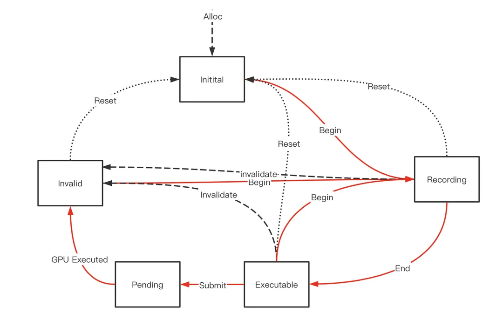

**可以重提交的vkcmdbuffer**

开启条件：在vkbegincommandbuffer的时候，将VkCommandBufferBeginInfo中的VkCommandBufferUsageFlags不要包含`VK_COMMAND_BUFFER_USAGE_ONE_TIME_SUBMIT_BIT`

这样在一次录制完成后，可以不经过重新录制，而将老的录制内容再次提交，这是一个强大的特性，这相当于对渲染指令做了缓存。（游戏中可以利用这个特性进行插帧渲染，或者将静态场景内容cache下来多次渲染等，而不需要重新走完整的渲染和API调用流程），可以重新录制且可重现提交的cmdbuffer的生命周期如下（注意，cmdbuffer可以只支持重提交，而不支持重录制） 

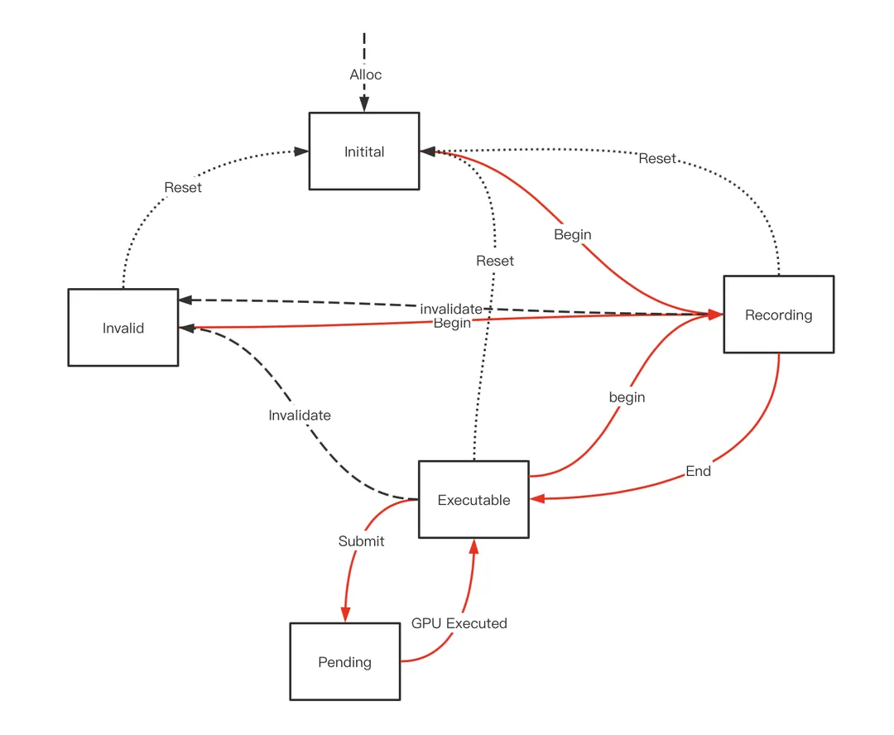 

在被GPU执行完后cmdbuffer不会进入invalid状态而是回到Executable状态，可以再次被submit，如此循环下去，如果想打破这个循环重新录制这个cmdbuffer，办法可以是在Executable状态下调用Begin使其重新进入录制状态，或者用vkfreecmdbuffer将其回收。

（在实际测试中，可以重提交的commad buffer，在不同的驱动上可能存在一些小问题，首先它在大部份机器上CPU一侧的处理时间要比一次性的要慢一些，另外在高通的驱动上，如果开启MSAA，可能导致mulitsampleresolve工作不正常，即带宽的增加。）

VK下的Command Buffer还有一个重要的特性 Secondary Command Buffer，因为这个和多线程相关，我们等到后面说完RenderPass再讲回来。

### 2.3 RenderPass

什么是RenderPass？简单的定义是使用同一套贴图作为渲染目标（RenderTarget）的一系列渲染指令组成了一个RenderPass。

那么为什么要定义RenderPass这个概念？

首先RenderTarget的改变尤其在移动端是一个非常重要且敏感的事情，移动端的硬件是Tile Based渲染，即在GPU的on-chip buffer上逐个RT子区域绘制。每一次RT的改变，将可能发生on-chip buffer和主存之间的内存交换。所以对于一个tile 渲染来说，一个renderpass内的所有drawcall一般都是合并在一起进行排序优化、绘制、内存同步的最小单元，renderpass之内的drawcall是被放在一起进行考虑的。例如不同renderpass上的drawcall尽管有提交顺序，但是并不一定有gpu渲染上的顺序，也不一定有内存上的读写顺序。

另外RenderPass定义了全局渲染管线状态的边界。我们知道渲染API维护了一个全局的管线的状态机，如当前管线上设置的depthtest属性，当前绑定的贴图都是当前状态机的一部份。前面指令设置的状态，对于后面的指令来说一般是有效的，前面一句API设置了depthtest为less，后面的drawcall都会应用这个状态，但是这个状态有效的边界在哪里，是否一直有效下去？定义了renderpass的概念就为这个状态的时效性定义了边界。一般来说，管线状态是不能跨renderpass生效的。因为事实上跨renderpass的指令甚至都不能保证执行的先后顺序。跨Command Buffer就更不会生效了。但是gles上因为可以认为就是一个全局的大command buffer，也没有明确的renderpass概念，所以一般设置过一次的管线状态会一直有效。

**RenderTarget的组成** RenderTarget是RenderPass的输出写入目的地，一个RT可以由N张可写入的贴图（或者gl上的RBO）组成，每个贴图也叫做attachement，被连接到其中的一个attachment slot上，大多数硬件含有多个color attachement slot，一个depth attachement slot和一个stencil attachment slot。 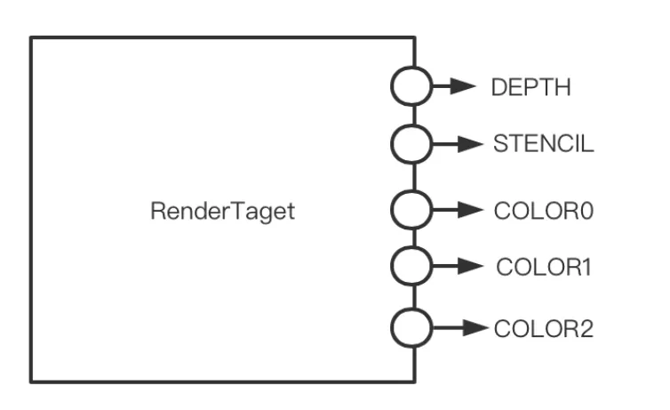

#### Load/Store Action

移动端，GPU在GPU片上的cache上进行绘制RT的一个小区域（tile），绘制好后将tile的结果拷贝回主存，这个内存行为叫做Store。 在每次设置RT的时候，如果不进行clear，GPU需要从主存上这个RT在某个小区域的内存，将它拷贝到GPU片上cache，以进行接下来的渲染，这个内存行为叫做Load。

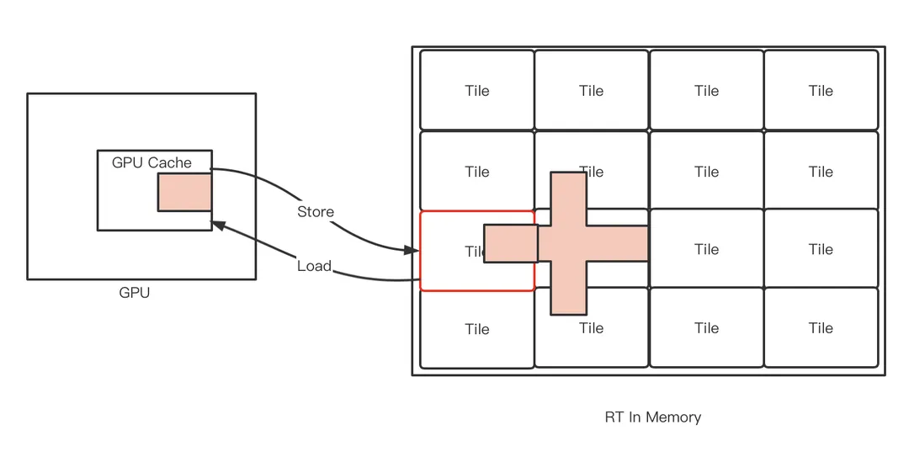 

Load和Store操作都要涉及到对内存的传递，这会产生带宽，提高功耗，在移动端是一个特别在意的事情，所以面向移动端的API都要明确声明这个Load/Store的内存行为。

**Load通常有以下几种行为：**

Dont Care：什么都不做，当前tile上是啥就是啥，通常这样做都是因为后面的drawcall都可以保证把每个像素都填充一遍，例如你的后处理pass，Dont Care相对是节省带宽的

Clear：将像素填充一个初始化的默认值，这个是大多数RT绘制前的常规操作，也是节省带宽的

Load：使用当前RT的值，例如你需要基于现有rt的像素继续对其进行blend，fetch等操作，这个会产生读带宽，尽量避免。

**Store的行为：**

Dont care：什么都不做，即将tile上的值丢弃，不给主存，有些rt它的生命周期可能只局限于tile内部，如只是用来做depth test的depth，并不需要回到主存，这是节省带宽的。

Store：将tile的内存写回，这可能是多数需要保存rt的行为，例如你的color rt。这产生写带宽。

MultiSampleStore：这也是一些移动端为了节省带宽专有的特性，对于MSAA的渲染来说，如果我们把multi sample的值写回主存，就意味着N倍的写带宽，在支持的硬件上，这个行为将在GPU cache上resolve multi sample的值到一个最终的值，然后写回主存，这将只有1倍写带宽，但也同时意味着这张RT在这次切换后丢失了multi sample信息，不能再当作MSAA渲染了。因为全部在gpu cache上发生，一般认为移动端的MSAA相比PC来说更廉价。

#### RT的读写操作

一张贴图可以用来作为渲染目标，此时为写入状态，也可以用来被贴图采样，此时为读取状态。对RT贴图来说读和写两种状态有什么区别？一个贴图可以同时被读被写么？这里来解释这个问题。

**贴图被写入的情形：**

● 作为RT被写入像素

● 在Compute Shader中被随机写入，也叫做Unordered Access View（UAV）

**贴图被读取的情形：**

● 作为RT，但是只被读取不被写入（如作为depth rt，但是当前管线关闭depth write）

● 作为贴图被采样

● 作为贴图做Framebufferfetch/Depthbufferfetch（只能读取当前RT上当前像素的内存，vk没有此概念，vk需要使用后面介绍的subrenderpass机制来实现）

● 作为depth/stencil RT做 depth/stencil测试

● 作为glreadpixel/copy的来源

这些操作有的发生在GPU的tile memory上，有的发生（或者可以被认为发生）在主存上,了解他们的发生场所，将有助于理解他们中的哪些可以共存，哪些不行。

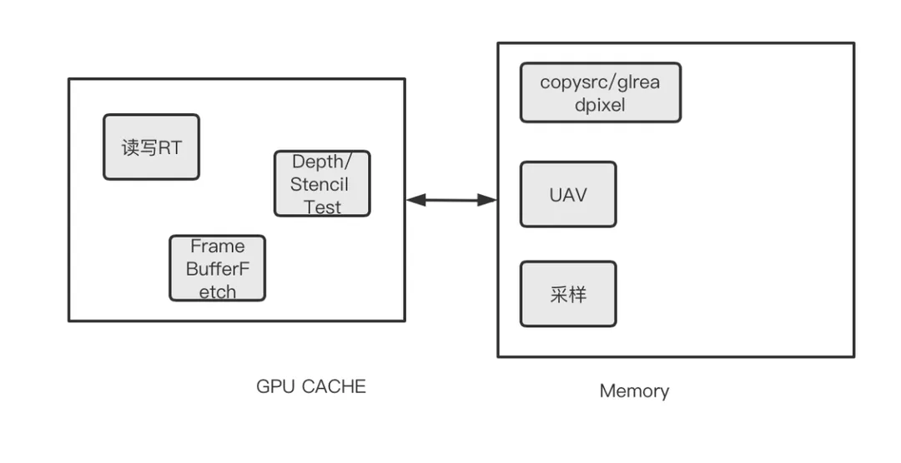

**不能共存的情形**

● 绝对禁止：同时作为写入RT，且同时被采样。这种行为在大多数硬件上会引起GPU 崩溃，这种行为也叫做FeedbackLoop，因为RT在tile上被写入，在主存上采样，写入的数据不能保证被同步到主存上。这种需求只能使用两张独立的RT，一张采样，一张写入。

● 部分API下有问题：同时作为写入RT，且同时做FrameBufferFetch，这种行为理论上是没有问题的，因为RT的写入和Fetch都是发生在tile上，对于某个像素而言，写入和Fetch必然顺序确定，且不存在像素间的影响。在gles和metal上的确没有问题。在vk上会遇到问题（后面讲vulkan image layout的时候会再次提到）。

其他情形没有问题。例如深度图同时被采样和做只读RT（关闭了 depth-write），是完全符合规范的

**读写转换**

一些API下，贴图在读和写状态之间切换需要显示的告诉API，例如Vulkan，有明确的image layout transiion规则，贴图在读的状态下做写入操作会产生问题（后面会详细提到）。

而在metal上，对于贴图只有一个优化API用来标记贴图为GPU访问优化还是为CPU访问优化（optimizeContentsForGPUAccess），本身和读写无关，且并不强制。

在gles上，则是驱动帮你做判断，APP并不知情。 之所以存在读写转换，是因为在不同的状态下，驱动可能为贴图做不同的存储优化，以提升读写效率。

#### 各API上的RenderPass

##### Gles

gles上没有显示的定义RenderPass的概念，随着用户对RT的切换而在驱动中实现renderpass的开始和结束。

gles上begin/end 一个renderpass的方法是先创建一个FrameBufferObject（FBO），然后将它绑定到写属性，再把一个贴图（或是一个RenderBufferObject RBO）连接（attach）到这个FBO上，就完成了一个rt的开启，详细过程

  1. `glGenFramebuffers()`创建一个FBO，他是一个GLuint的Handle，系统的backbuffer不需要创建，直接用0表示。

  2. `glBindFramebuffer(GL_DRAW_FRAMEBUFFER, FBO)`绑定FBO到写，如果FBO为0，则断掉所有color的attachment，将他绑定到default back buffer上，

  3. `glFramebufferTexture(GL_FRAMEBUFFER，GL_COLOR_ATTACHMENT0/1/../GL_DEPTH_ATTACHMENT/GL_STENCIL_ATTACHMENT, texture, miplevel)`将贴图绑定到RT的某个attachment slot上。

  4. `glDrawBuffers()`设置shader的每个output流向哪个attachment上。

**关于load/store：**

gles没有完整显示的对load/store做定义，gles上使用glInvalidateFramebuffer()来标记对于那个framebuffer的load和store设置为dont care，否则load/store的默认行为是store

gles上通过调用glclear()来将framebuffer的load设置为Clear，clear的值通过glClearColor设置。

gles的core api没有支持multisamplestore，但是可以通过扩展`EXT_multisampled_render_to_texture`来支持

**关于rt读写：**

gles上实质上不需要对Framebuffer显示的转换设置它的读写状态，但是要避免实质上发生上面所说的feddbackloop行为。（glBindFram ebuffer专门指给一个rt绑定到读或者写，这里的读指glreadpixel的来源，写只设置为rt，但是这里面可以同时绑定到读写，且绑定到写不影响它作为贴图被采样）

**RBO**

此外gles中还可以将某个Device上的buffer像贴图一样绑定在attachment上，即将渲染内容写到某个GPU的buffer上，这种buffer叫RenderBufferObject （RBO）。使用API

glBindRenderbuffer创建，

使用 API glFramebufferRenderbuffer连接到attachment slot。

使用RBO而不是Texture的目的是什么？首先RBO其实是FBO的底层数据，RBO的内存传输比texture效率高，它使用的gles 的internalformat而不是贴图的format，如果不考虑需要将RT继续当贴图采样，使用RBO效率更高。此外在CoreAPI版本里，它专门用来支持MSAA渲染，如果硬件缺少支持`EXT_multisampled_render_to_texture`的相关扩展，默认的texture不能支持msaa渲染，但是RBO可以，一般先使用glRenderbufferStorageMultisample渲染到MSAA的RBO，再使用glBlitFramebuffer将MDSAA的RBO resolve到一张正常的texture RT，VK和Metal没有RBO的概念。

##### Vulkan上的renderpass和subpass

vulkan和metal都有显示的RenderPas对象。通过显示的API创建，开始，并结束一个RenderPass，并且所有的draw类型的cmd都必须被包含在RenderPass的开始和结束中间，来标志这个drawcal属于哪个renderpass。所以一个Cmd
Buffer上的cmd分成两种，一种在RenderPass的包围之外，一种在RenderPass之内，在所有的vkcmdXXXAPI的定义下面都有一项叫做RenderPass Scope，用户需要在正确的Scope调用API，这个非常重要，不然可能引起崩溃。

这样一个Vulkan上Queue的组织结构看起来应该是这样的。

缓存式指令分为两种：

渲染相关的缓存式指令（绿色）：一定嵌入在renderpass之内，如管线状态设置，调用drawprimitive

非渲染相关的缓存式指令（红色）：一定在renderpass之外，如disaptch，资源的copy/clear

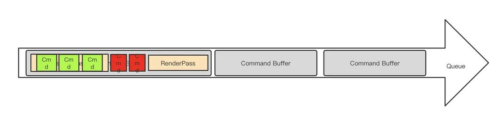

**SubRenderPass**

子RenderPass是Vulkan独有的概念，也是重要特性，它是组成RenderPass的基本单位，任何一个Renderpass都至少由1个Subrenderpass组成。 为什么需要设计这个概念？为了同步，为了在单个RT内做执行顺序上的同步和内存上的读写同步。

执行顺序的同步：subpass允许安排他们之间的依赖关系，以决定哪个subpass内的drawcall先被GPU执行（不是说谁先提交就谁先执行）

内存的读写同步：subpass允许将某个subpass的输出作为另外一个subpass的输入，这样就产生了内存上的先写后读。

Metal为什么没有这个概念？首先内存的读写同步，metal采用支持framebufferfetch来允许读取当前rt内容，且自动保证读写顺序。另外执行上的同步顺序metal没有把规则设计的这么复杂，而是简单的依靠rt的依赖自动帮助我们决定先后。（从这点上，Metal更像是在一个手动挡上封了一个更简单易用的自动档给APP）

**完整的表述subpass，他有如下特性：**

● 一个Renderpass内部的所有SubPass共享一个共同的RenderTarget作为output（当然有些subpass只用到其中的部份attachement）

● Subpass可以定义对其他Subpass的依赖关系，依赖关系中可以描述执行和内存的同步

● 通过显示的API 来从上一个Subpass切换到下一个，subpass的切换不会触发RT的load/store，因为RT没有被切换。

● 对于一个特定像素，在一个Subpass内可以读其他Subpass对当前像素的对RT的写入

● Subpass中可以定义该Subpass的MSAA状态，Resolve RT和规则。

● Subpass可以定义它preserve的attachment，一旦该RenderPass的某个attachement在某个subpass上没有被使用（即没被设置为它的attachement），这个attachment就会在tile上变成undefine状态，其值不被保证，如果想在这个subpass内保证它的值继续有效，就要把它声明为preserve的状态。

我们来看一个典型的renderpass的subpass组成和关系：

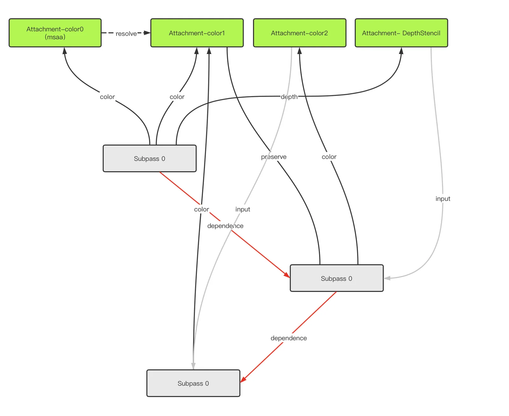 

subpass0先往msaa到color0上绘制不透明物体，color0的msaa data被 resolve到color1，写入深度

subpass1依赖subpass0，读取深度图做某种ao计算，并输出一些颜色到color2，color1这个pass不用，但是需要保留给后面

subpass2依赖subpass1，读取color2的结果，基于color1的结果做某种blend操作最终输出到color1上。

看，这简直就是一个render graph！

下面我们来介绍具体的API部分

**创建一个RenderPass**

```c
// Provided by VK_VERSION_1_0
VkResult vkCreateRenderPass(
    VkDevice                                    device,
    const VkRenderPassCreateInfo*               pCreateInfo,
    const VkAllocationCallbacks*                pAllocator,
    VkRenderPass*
```

```c
// Provided by VK_VERSION_1_0
typedef struct VkRenderPassCreateInfo {
    VkStructureType                   sType;
    const void*                       pNext;
    VkRenderPassCreateFlags           flags;
    uint32_t                          attachmentCount;
    const VkAttachmentDescription*    pAttachments;
    uint32_t                          subpassCount;
    const VkSubpassDescription*       pSubpasses;
    uint32_t                          dependencyCount;
    const VkSubpassDependency*        pDependencies;
} VkRenderPassCreateInfo;
```

这里面关键要声明这个renderpass的

所有subpass用到的Attachment（VkAttachmentDescription）

所有Subpass（VkSubpassDescription）

Subpass之间的依赖关系（VkSubpassDependency）

**Attachment**

```c
// Provided by VK_VERSION_1_0
typedef struct VkAttachmentDescription {
    VkAttachmentDescriptionFlags    flags;
    VkFormat                        format;
    VkSampleCountFlagBits           samples;
    VkAttachmentLoadOp              loadOp;
    VkAttachmentStoreOp             storeOp;
    VkAttachmentLoadOp              stencilLoadOp;
    VkAttachmentStoreOp             stencilStoreOp;
    VkImageLayout                   initialLayout;
    VkImageLayout                   finalLayout;
} VkAttachmentDescription;
```

这里定义了每个attachment slot上的贴图格式，msaa数量，load/store action，以及贴图进入和离开这个rt的layout（layout的概念后面再讲）,注意msaa用来在GPU上resolve出来的那个贴图也要放在这个里面。

**Subpass描述**

```c
// Provided by VK_VERSION_1_0
typedef struct VkSubpassDescription {
    VkSubpassDescriptionFlags       flags;
    VkPipelineBindPoint             pipelineBindPoint;
    uint32_t                        inputAttachmentCount;
    const VkAttachmentReference*    pInputAttachments;
    uint32_t                        colorAttachmentCount;
    const VkAttachmentReference*    pColorAttachments;
    const VkAttachmentReference*    pResolveAttachments;
    const VkAttachmentReference*    pDepthStencilAttachment;
    uint32_t                        preserveAttachmentCount;
    const uint32_t*                 pPreserveAttachments;
} VkSubpassDescription;
```

```c
// Provided by VK_VERSION_1_0
typedef struct VkAttachmentReference {
    uint32_t         attachment;
    VkImageLayout    layout;
} VkAttachmentReference;
```

这里定义了每个Subpass所使用的各种attachement（在pAttachments上的index，进入这个subpass时的layout），他们分为：

inputattachment:读取的其他依赖的subpass的output

colorattachemnt:color的output

resolveattachment:color 的msaa的resolve

depthstencilattachment:depthstencil的output

preserverattachment:reserve undefine的attachemnt

这里只看到color的msaa resolve，如果想要给depth做msaa resolve怎么办？需要使用并参考扩展`VK_KHR_depth_stencil_resolve`（vk1.2成为Core API）

**Subpass 依赖**

```c
// Provided by VK_VERSION_1_0
typedef struct VkSubpassDependency {
    uint32_t                srcSubpass;
    uint32_t                dstSubpass;
    VkPipelineStageFlags    srcStageMask;
    VkPipelineStageFlags    dstStageMask;
    VkAccessFlags           srcAccessMask;
    VkAccessFlags           dstAccessMask;
    VkDependencyFlags       dependencyFlags;
} VkSubpassDependency;
```

这里要定义依赖的subpass的source和dest，用于同步执行顺序和内存读写顺序的相关flag（这些flag会在后面同步的部份专门讲解）

**创建FrameBufferObject**

创建好了Renderpass之后，还需要创建Frame Buffer ，才能真正开启一个renderpass。

设计RenderPass对象和FrameBuffer两种对象是为了将规则和数据解耦，renderpass只定义规格，framebuffer才是真正的贴图数据。

创建的API：

```c
// Provided by VK_VERSION_1_0
VkResult vkCreateFramebuffer(
    VkDevice                                    device,
    const VkFramebufferCreateInfo*              pCreateInfo,
    const VkAllocationCallbacks*                pAllocator,
    VkFramebuffer*
```

```c
// Provided by VK_VERSION_1_0
typedef struct VkFramebufferCreateInfo {
    VkStructureType             sType;
    const void*                 pNext;
    VkFramebufferCreateFlags    flags;
    VkRenderPass                renderPass;
    uint32_t                    attachmentCount;
    const VkImageView*          pAttachments;
    uint32_t                    width;
    uint32_t                    height;
    uint32_t                    layers;
} VkFramebufferCreateInfo;
```

创建Framebuffer需要指定：

它适配的renderpass（Framebuffer创建时用的Renderpass必须和他被使用时管线上用的renderpass是规格适配的）

attachment 数量（也必须同renderpass的规格适配）

每个attachment上放的贴图

**开始renderpass**

vkCmdBeginRenderPass2，里面需要指定这个使用的renderpass和framebuffer

**进入下一个subpass**

vkCmdNextSubpass

**结束renderpass**

vkCmdEndRenderPass

注意所有msaa的resolve操作发生于endrenderpass里

**渲染状态是否可以跨越Subpass**

我们知道渲染状态不会跨越renderpass，对于subpass，一半也只有当前的RT是多个subpass共享的，其他渲染状态也是要重新设置的，在vk上subpass才是GPU执行的最小粒度，多个subpass之间如果不指定依赖和同步关系，也是不保证Device上执行的先后顺序的（尽管提交上可能有先后）。

在vulkan的实践中，甚至可以把整个一帧内所有的renderpass合成到一个大的renderpass中，以subpass到形式存在，这样全局就只有一个大的renderpass，减少了创建renderpass到开销，毕竟renderpass内部就是一个微型的render graph系统。

##### Metal

同vulkan比起来，metal的Renderpass的设置就显得过于容易了。

Metal上，renderpass的创建是RenderEncoder创建的一部份，并且metal没有分离renderpass和framebuffer两个概念。

API上是先要指定一个RenderPassDescriptor,设置每个attachement slot的texture，load/store action，最后用这个descriptor来创建一个rendercommandencoder，用于record渲染指令。

也就是说Metal上的一个render encoder就和一个renderpass 一一对应，一个render encoder内部不能切换多个renderpass，一个renderpass也不能跨越多个renderpass，一个renderencoderye只能为一个command buffer服务。

```c
_renderToTextureRenderPassDescriptor.colorAttachments[0].texture = _renderTargetTexture;
_renderToTextureRenderPassDescriptor.colorAttachments[0].loadAction = MTLLoadActionClear;
_renderToTextureRenderPassDescriptor.colorAttachments[0].clearColor = MTLClearColorMake(1, 1, 1, 1);
_renderToTextureRenderPassDescriptor.colorAttachments[0].storeAction = MTLStoreActionStore;
id<MTLRenderCommandEncoder> renderEncoder =
    [commandBuffer renderCommandEncoderWithDescriptor:_renderToTextureRenderPassDescriptor];
```

Metal上的queue，command buffer，renderpass，encoder的关系如图

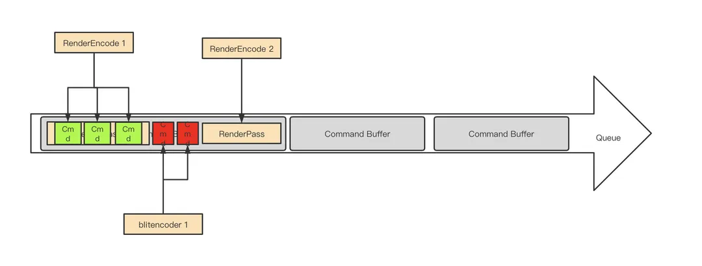

此外Metal上实现MSAA渲染是直接在attachement的属性中设置待resolve的贴图，例如将colorAttachments[0].texture设置为一张MSAA贴图，将colorAttachments[0].resolveTexture设置为它需要resolve到的贴图。

### 2.4 多线程提交

现代API一个显著的特性是对API的并发处理能力，Vk和Metal都可以对Command Buffer做复杂的多线程的录制和多线程的提交。

**数据结构的线程安全**

引入queue，并允许出现多个queue的意义就是为了可以多线程record和submit command，metal上queue本身就是thread safe的，我们可以在多线程操纵同一个queue，只要app能保证提交顺序，同一个queue分配出来的不同的cmdbuffer也可以在不同线程操作。

而vulkan中包括queue大多数类型都不是thread-safe的，需要APP自己做好同步。同样整个CommandBufferPool级别都不是线程安全的，不能在多线程上同时操纵和同一个CommandPool创建出来的cmdbuffer的内存相关的操作（alloc，begin，end，reset，submit等），例如一个cmdbufferA和cmdbufferB都是从一个CommandPool创建出来，在A线程调用cmdbufferA的begin，在B线程上对cmdbufferB调用reset，就是产生内存错误的操作，但是两个线程分别在不同的cmdbuffer上调用普通的渲染指令，如同时的vkcmddraw则不会产生问题，这是在vk上做多线程操作最容易发生而不容易发现的问题！

我们下面讨论API在CPU一侧的三个主要操作的并发

**首先是API CALL**

在任何平台下都可以多线程的调用API CALL，vulkan metal上的各种渲染API只要做好资源上的同步，可以随意的在多线程调用。

但是gles有诸多限制，最大特殊之处是需要创建多个glcontext，因为每个线程要绑定不同的context，而每个glcontext下创建的资源默认互不相认，需要将glcontext之间设置parent的方法来使其能够共享（在eglCreateContext的时候指定）。另外在gl上容器类的object不能被多线程共享，如FBO，VAO，Query，Transfrom Feedback，Programe Pipeline。同时如果一个Object在一个线程上被修改，在另外一个可以访问到它的线程上需要重新绑定这个object之后才会得到重新应用。在gles上因为只有单一的queue，所以只有那些非缓存类指令的API才能从多线程调用API CALL上获益，如多线程创建资源，多线程编译shader等，详细可参考我之前的一篇文章<https://km.woa.com/articles/show/524132>

**其次是Command Submit**

Vulkan 和metal有多个queue，所以可以在多线程上对不同的queue同时submit，可以设置如vksepmphore的信号量为queue之间指定GPU上的执行顺序。但是由于大部分APP通常一帧内都只会提交1次，所以submit一般不是瓶颈，较少实际应用中去应用多线程提交

**然后就是Command 的Record**

这个通常是最大的瓶颈，也是多线程处理的主要收益之处，因为一帧内有大量的渲染指令需要被录制，这个是drawcall真正的瓶颈，同样也只适用于vulkan和metal，我们详细介绍

我们再看一下Queue的结构 

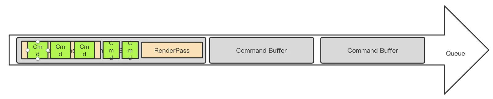 

我们可以观察到这样一个大前提：

渲染相关指令一定被RenderPass包含， 而RenderPass又必须被一个Command Buffer完整包含（renderpass不能跨越多个commandbuffer），并且无论是什么API，command buffer都不是内部保证thread-safe的。

这意味着我们首先考虑到的只能基于一个Renderpass为基本单位并行录制，即准备多个Command Buffer，各自包含不同的Renderpass，在多线程录制，这就是最简单的

##### RenderPass级别的并发

看起来像这样 

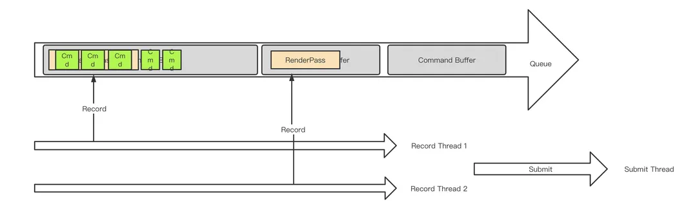

有多个独立的线程，把渲染指令按照renderpass拆解，renderpass放到不同的cmd buffer，在不同的线程record，在最终所有人完成时，在同一个线程将这些cmdbuffer一起提交，提交时的cmdbuffer在提交列表中的顺序就是提交顺序，还可以通过semphore来保证GPU的处理顺序。

但是在移动端我们为了减少带宽，减少rt切换，会尽量减少renderpass数量，尤其是vk下可能全局都只有一个renderpass（全都是subpass），对于pass内部的drawcall，我们难道要为了并发而故意切断renderpass么？这里就要产生这个需求

##### RenderPass内部Command 级别的并发

但是renderpass不能跨越多个cmd buffer怎么办？

首先看Vulkan的实现，这就回到了之前将Vk Command Buffer没有讲完了一个问题：

**Vulkan中的Secondary Command Buffer**

它专为多线程而设计，Vk中的cmd buffer分为两种，在调用vkAllocateCommandBuffers时，通过设置VkCommandBufferAllocateInfo上的VkCommandBufferLevel来指定：

**VK_COMMAND_BUFFER_LEVEL_PRIMARY**：这是我们前面讨论的默认情况，即Primary Buffer，这种buffer允许被录制，和提交

**VK_COMMAND_BUFFER_LEVEL_SECONDARY**：即Secondary Buffer，它允许被录制，不能提交，但是允许被录制到其他的primary buffer里（以vkexecutesecondary的方式执行），在primary被执行时执行到这个录制指令时将其上面的所有录制执行（就像是往primary buffer里插入一个指针，由primary间接执行）

secondary buffer内部不能包含renderpass相关指令，它像是从primary上分离出来的一小撮指令，其实就是专门用于分离出来在多线程录制。（所有的vkcmdXXX API的说明下面都会有一行 command buffer level用来说明该cmd可以放在primary或是secondarybuffer里）

secondary command buffer在使用上有以下两种情形。

● 完全内嵌在renderpass内的， 整个secondary command buffer完全包含在另一个primary buffer的某个renderpass里面，这说明他拆解出来的是绘制相关指令。

这需要在这个secondary buffer的vkBeginCommandBuffer时设置VkCommandBufferUsageFlagBits为`VK_COMMAND_BUFFER_USAGE_RENDER_PASS_CONTINUE_BIT`

下图展示了一个原本的cmdbuffer等价的拆成如下的使用secondary command buffer的形式，它可以用两个线程分别录制两个secondary cmd buffer，只在主cmdbuffer上录制begin/end pass和executesecondarycmdbuffer。

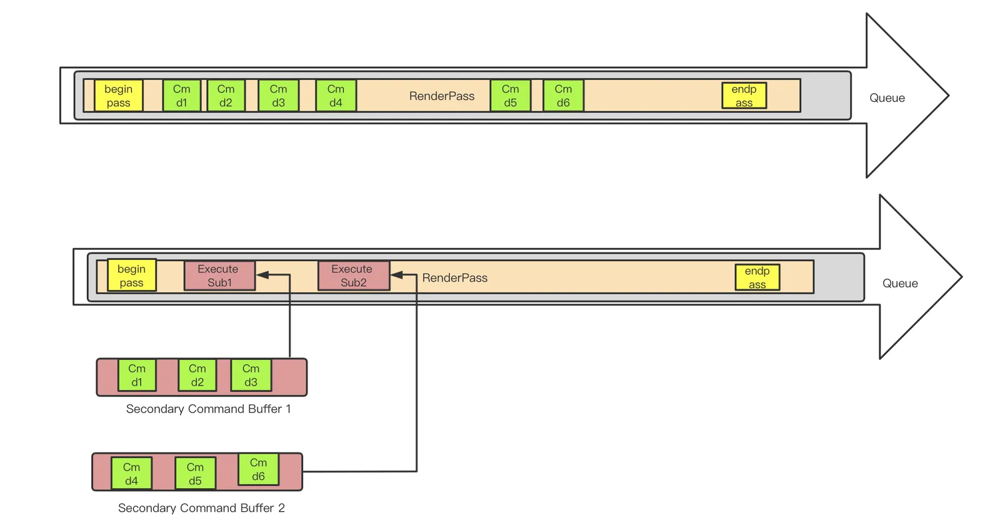

● 不内嵌在renderpass内，说明这个secondary buffer拆解的不是绘制相关指令，他可能是buffer的copy等其他API。

这需要在这个secondary buffer的vkBeginCommandBuffer时不能设置VkCommandBufferUsageFlagBits为`VK_COMMAND_BUFFER_USAGE_RENDER_PASS_CONTINUE_BIT`

如下图原本的cmd buffer可以被拆解成如下形式，其中的一块pass外等cmd被拆解到一个secondary中在线程上录制

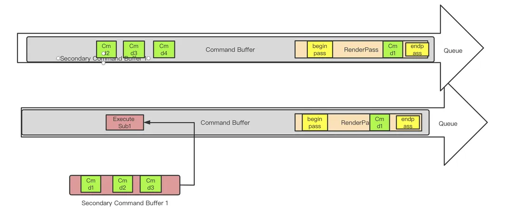

注意：一个secondary cmd buffer要么是完全嵌入renderpass的，要么是不嵌入renderpass的，只能选择其一。这意味着一个secondary cmd buffer中的内容要么全是渲染相关指令，要么全是非渲染相关指令，不能混杂。

除了secondary cmd buffer中的cmd不能“混杂”之外，renderpass也有一个不能混杂的原则，如下： 一个renderpass在一个subpass内要么全部执行vkexecutesecondary指令（我们称为subpassinline模式），要么全部不能执行vkexecutesecondary指令，即不能将vkexecutesecondary同其他绘制指令混杂一起。这通过在调vkCmdBeginRenderPass/vkCmdNextSubpass时设置VkSubpassContents是否为VK_SUBPASS_CONTENTS_INLINE来设定。

如下图所示的情形是非法的 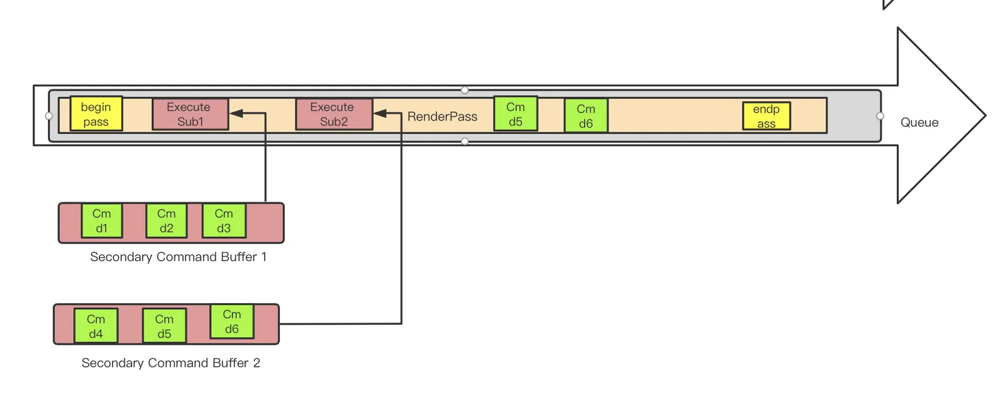

再总结下这里的一个重点，renderpass的subpassinline模式和secondary cmd buffer的`ENDER_PASS_CONTINUE_BIT`模式分别都是存在一个不能混合使用的规则的，

有了secondary cmd buffer概念，Vk中就可以做cmd级别的并发了，我们可以把一个renderpass中的所有cmd拆成几组，每一组封装到一个secondary cmd buffer里面，每个secondary cmd buffer分别在多线程上record即可。在primary cmd
buffer上同一个subpass内调用vkexecutesecondary的顺序就是这些secondary cmd buffer的提交顺序，也是他们在GPU上的执行顺序。

这个过程看起来像这个样子： 这里面有三个线程在并发录制，两个负责其中一个pass各一半的drawcall，第三个负责primary的renderpass

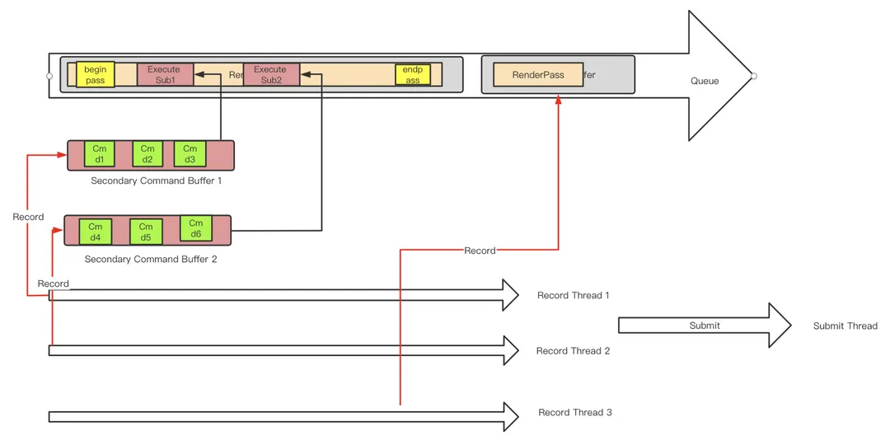

**Secondary Command Buffer中的RenderPass状态**

前面提到渲染状态不能跨越renderpass和command buffer，那么这里就有个问题，如果将本来在一个renderpass里面的一小撮指令拆出来到一个secondary cmd buffer里填充，这个secondary cmd buffer内部是不是就完全感知不到在原本renderpass里面靠前的一些api的状态设置了？

确实，在secondary cmd buffer你需要重新设置大部分和渲染状态相关的指令，例如原本你在原来完整的renderpass开头设置了depthtest为less，那么现在每个拆出来的secondary cmd buffer中都要加入此api。

但是只有renderpass是不需要设置的，因为在对secondary调用VkBeginCmdBuffer的时候，所传入的VkCommandBufferBeginInfo中的pInheritageInfo需要被设置。 这个结构的定义是

```c
// Provided by VK_VERSION_1_0
typedef struct VkCommandBufferInheritanceInfo {
    VkStructureType                  sType;
    const void*                      pNext;
    VkRenderPass                     renderPass;
    uint32_t                         subpass;
    VkFramebuffer                    framebuffer;
    VkBool32                         occlusionQueryEnable;
    VkQueryControlFlags              queryFlags;
    VkQueryPipelineStatisticFlags    pipelineStatistics;
} VkCommandBufferInheritanceInfo;
```

这里面描述了该secondary command buffer将以它原本所在的那个renderpass为它的renderpass。

当然引入secondary command buffer还是不可避免导致API调用增多一些，所以实践上我们拆分的粒度不要太细，要至少以比较大的渲染管线的异同来拆分。

**Metal上的ParallelRenderCommandEncoder**

Metal上又一次为我们简化了设计，没有制造出vulkan上这么复杂到令人发指的secondary command buffer的概念来，command buffer还是那个command buffer，只是改用了一种特殊的encoder。

首先在待拆分的command buffer上使用parallelRenderCommandEncoderWithDescriptor创建一个parallel encoder出来，这种encoder不能用来实际encode，只能进行commit。

我们在parallel encoder创建的时候设置当前renderpass的开始和它的rt，我们对这个renderpass的drawcall做拆分后，对于每个拆分的组，用这个parallel encoder调用paralleencoder产生一个新的render
encoder，用几个新产生的encoder去record每个组的绘制指令。

最终等待每个子render encoder完成end encoding之后，parallel encoder调用commit做一次提交。在paralle encoder上调用paralleencoder创建子encoder的顺序即是他们的提交顺序，也是他们在gpu上的执行顺序。

这个流程看起来如下 

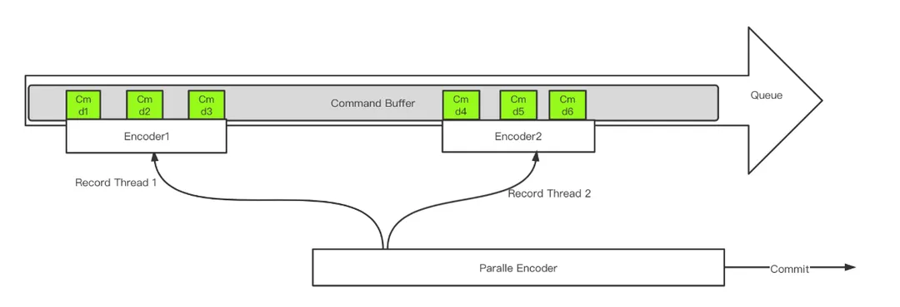

<hr/>

#### <p>原文出处：<a href='https://km.woa.com/articles/show/587075' target='blank'>移动端图形API通讲（二）-- 同步和内存</a></p>

> | 导语 在第一章节中我们讨论了图形API的基本数据结构和图形指令的提交机制，在指令的生成，提交，执行过程中，在复杂而又高度并行的GPU管线中，必然存在着指令和数据的同步机制，以保证逻辑上的正确执行和访问顺序，这是现代API编程的基石和难点，本章节我们先仔细讨论同步这个问题。 此外GPU上的一切数据和对象都存在于显存之中，而GPU上内存的分配，访问，释放，在高级API出现后已经不再是一个黑盒，如同CPU内存一样可以被开发者显示去使用，在进一步认识API中的对象之前，我们要先了解下显存如何使用。 本章节文字量较大，文章进度稍有搁置，敬请谅解～

## **三、同步**

### **3.1 图形指令和顺序**

我们透过API，将数据从CPU一侧发送到Device（GPU）上，从CPU一侧来说，数据的执行和访问在顺序上相对是可控的，但是GPU上则是一个高度并发的环境，很多时候我们并不能保证这个“顺序”。我们需要明确事情要按照顺序发生，就是“同步”，由于完全CPU一侧的同步都是C++编程规范中解决的问题，所以图形API这里特别关注的就是涉及到Device（GPU）一侧的同步。

我们先谈论这里面涉及到的几种顺序。

#### **3.1.1 提交顺序 submission order**

这是你在代码中最开始调用API进行指令录制和提交的顺序，来源来自于CPU一侧，如下图，我们可以说对于queue1来说，1，2，3指令存在提交顺序，对于queue2来说，4，5，6指令存在提交顺序（当然1和4可能是并行提交，需要依靠CPU一侧的同步机制保证提交顺序）

提交顺序仅仅在cpu一侧保证，取决于哪个指令先被submit，处于同一批submit数据中的指令取决于哪个指令先被record。

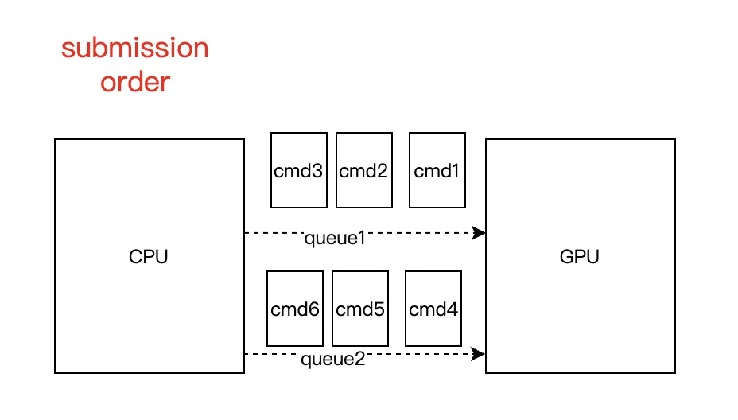

一旦图形指令被GPU接受就会对进入GPU的处理范围，这个时候提交顺序已经不能起太多作用了，GPU可能会按照自己的策略最优化的处理它接收到的指令。

cmd和cmd之间不一定保证提交顺序，同一个cmd 产生的不同primitive不一定保证顺序，同一个 产生的PS也不一定保证顺序。

但是这里对于屏幕上的的同一个ps的同一个sample来说，确存在一个和提交顺序相关的顺序，它叫光栅化顺序，这是个很重要的顺序

#### **3.1.2 光栅化顺序 rasterization order**

它是指对于同一个sample来说，在同样一个subpass之内，对于以下操作：

  1. Fragment operations。（PS）
  2. Blending，logic operations, color writes(注意不包括depth write）.

保证按照如下顺序执行：

  1. 首先按照cmd的提交顺序
  2. 同一个cmd之内，按照instance索引从小到达的顺序，同一个instance之内，按照IB访问从小到大的顺序。

如下图，p1这个sample点会经历从time1时刻点的绿色到time2点的黄色，但是不代表time2点，它隔壁的p2点也会是黄色，这个顺序只对于同一个sample点（不是同一个pixel），同一个subpass内来说，并且这个顺序不保证PS过程中产生的对其他内存的读写顺序。

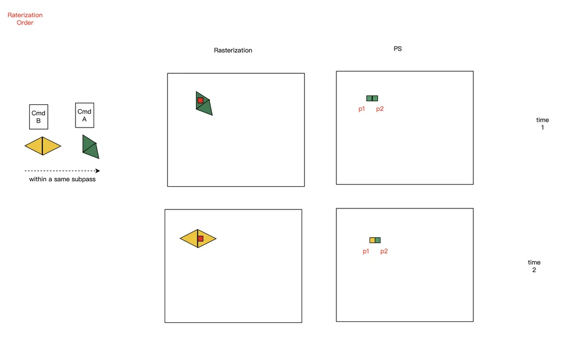

光栅化顺序是一个重要的顺序，它内在保证了ps着色的顺序，并且使得cpu的提交顺序对单个sample点的着色顺序产生影响。

光栅化顺序也几乎是GPU唯一能够内在帮我们保证的顺序了！

光栅化顺序可以抽象看作成：

对于一个renderpass之内的PS和之后的渲染管线阶段，基于单个sample指令执行和color attachment的写入顺序

但是，GPU上的管线状态不只有PS，比如我们有时候要保证VS的顺序，且有时要保证基于整个pixel甚至基于整个Framebuffer的写入顺序，他们不是局限在单个sample内，并且GPU上还有出color写入外的很多其他的内存读写操作，所有其余这些顺序都需要我们自己去保证，其余的这些顺序主要分成两类，在某种管线阶段区间指令的执行顺序，以及内存的访问顺序。

#### **3.1.3 指令执行顺序 execution order**

执行顺序的严格定义是：对于两个操作集合A和B，在特定的gpu管线阶段，保证A中的所有操作早于B中的任何操作完成。

例如定义了两组drawcall的执行顺序依赖，则后面一组drawcall的任何一个都要晚与前面一组drawcall的任何一个，但是这两组drawcall内部，哪个drawcall先被执行则不保证顺序。

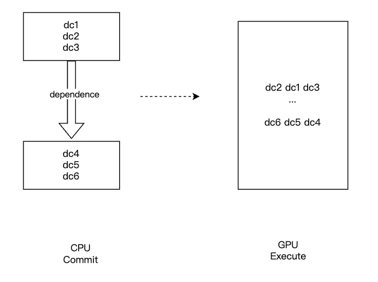

如果不牵扯到内存的访问，只考虑单pass内简单的ps着色，那么其实不需要自己保证这种指令执行顺序，因为内在的光栅化顺序已经可以保证对特性pixel，color的着色按照提交顺序来。但是一旦牵扯到内存访问，牵扯到非color的写入，牵扯到非单个pixel的作用域，牵扯到切换多个pass，就不一样了，例如前面的drawcall写入一个buffer，后面的drawcall读取一个buffer，就不得不加入执行顺序的同步，因为这个buffer的读写和colorrt的写入可能没有什么关系。

此外指令的执行会触发内存的访问，而执行顺序也不能等同于内存访问顺序。

例如相继利用两个API在一个RT上绘制两个个三角形，第一个绘制API发生后，不意味着RT的内存上就被马上写入完数据。甚至很有可能两个drawcall是依次发生的，但是后一个drawcall的数据在pixel A上反而先与第一个drawcall在pixel B上的写入。

所以还要考虑内存的访问顺序

#### **3.1.4 内存访问顺序 memory access order**

GPU上内存访问主要为读和写两种，只有写入的发生才引入依赖问题。

在给内存访问顺序下定义之前，先明确下内存写入主要有以下几种状态：

  1. availbility: 写入完成，可以被继续写入
  2. visibility：可以被其他人读
  3. domain：例如在Host上的写入操作对于Device来说是availbility的

avaibility和visibility是两种不同的状态，availbility之后你可以继续写入，visibility之后才可以继续被读。

所以内存访问顺序的严格定义是：对于两个操作集合A和B，在GPU的某个管线区间下，对某个内存M，B对A的内存访问依赖的严格定义包括两条：

  1. 对M的任何内存写入在A中是availble的（写入完成）
  2. M对于B是visible的（可以被读）

对于两个操作，如果是只读和先读后写只需要保证执行顺序即可，对于先写后读和同时写的情况一般除了执行顺序之外，都还要保证内存访问顺序。

#### **3.1.5 图像的可操作状态**

GPU上很重要的一类内存就是图像，对于图像的内存访问来说，除了需要关心它的顺序和同步关系之外，还需要额外关注它当前的可访问状态。

这是因为贴图在显存上的状态比较复杂，它的数据可能同时存在与tile mem上主mem上，它可能正在被读，也可能正在被写，（详细见本文第一章中的“RT读写操作”）。

所以在访问贴图内存前，还需要告诉API我们想要对贴图做的操作具体是什么，以便硬件可以做到：

  1. 为这些贴图资源做好一些准备，例如去采样一张RT，首先要保证它的内容全部从tile resolve到了主存
  2. 贴图的存储格式，位置等有多种选择，在不同的内存访问下，最佳的选择可能是不同的，如果硬件知道我们要对这个贴图做什么，他可以选择更好的存放策略。

因此，对贴图内存发生同步的时候，一般还要额外设置它的这种“当前可操作状态"。

不同平台上对这种“当前可操作状态"的定义和设置是不同的，这也是vulkan上几个复杂的概念之一。

**Vulkan**

在Vulkan上Image的这种“当前可操作状态"有明确的数据结构定义，叫image layout。

Vulkan定义了以下几种主要的layout：

```c
VK_IMAGE_LAYOUT_UNDEFINED = 0,

VK_IMAGE_LAYOUT_GENERAL = 1,

VK_IMAGE_LAYOUT_COLOR_ATTACHMENT_OPTIMAL = 2,

VK_IMAGE_LAYOUT_DEPTH_STENCIL_ATTACHMENT_OPTIMAL = 3,

VK_IMAGE_LAYOUT_DEPTH_STENCIL_READ_ONLY_OPTIMAL = 4,

VK_IMAGE_LAYOUT_SHADER_READ_ONLY_OPTIMAL = 5,

VK_IMAGE_LAYOUT_TRANSFER_SRC_OPTIMAL = 6,

VK_IMAGE_LAYOUT_TRANSFER_DST_OPTIMAL = 7,

VK_IMAGE_LAYOUT_PREINITIALIZED = 8,

VK_IMAGE_LAYOUT_DEPTH_READ_ONLY_STENCIL_ATTACHMENT_OPTIMAL = 1000117000,

VK_IMAGE_LAYOUT_DEPTH_ATTACHMENT_STENCIL_READ_ONLY_OPTIMAL = 1000117001,

VK_IMAGE_LAYOUT_DEPTH_ATTACHMENT_OPTIMAL = 1000241000,

VK_IMAGE_LAYOUT_DEPTH_READ_ONLY_OPTIMAL = 1000241001,

VK_IMAGE_LAYOUT_STENCIL_ATTACHMENT_OPTIMAL = 1000241002,

VK_IMAGE_LAYOUT_STENCIL_READ_ONLY_OPTIMAL = 1000241003,

VK_IMAGE_LAYOUT_READ_ONLY_OPTIMAL = 1000314000,

VK_IMAGE_LAYOUT_ATTACHMENT_OPTIMAL = 1000314001,
```

一个Image在某一时刻一定是处于其中的某个Layout状态，并且可以通过API进行Layout的设置（也叫layout的transition）。

上面的layout可以大致分为以下几种，其不同的功用是：

**_初始化的layout_**

一张Image创建的时候只能通过创建参数设置指定它为PREINITIALIZED或者UNDEFINED，并且没有任何其他layout可以转变成这两种状态。PREINITIALIZED可以被Host访问，UNDEFINED不可以。

**_General layout_**

General是支持任何情况的访问，理论上你可以把Image的layout设置成General后不用在管它，但是这显然是性能不优化的，但是对于Host访问，Compute Shader访问的情形一般都只能用General。

**_Transfer Layout_**

`Transfer_Source`和`Transfer_Dst`用于贴图的数据拷贝

**_用作RT和被图形管线读取_**，

这里面设计三种layout ：Attachment，Read，Shader_read，容易弄混，所以放一起看

首先Attachment和Read（`VK_IMAGE_LAYOUT_READ_ONLY_OPTIMAL`）两种layout都可以做RT，但是区别在于

Attachment：可以作为attachment写，可以作为attachment读（depth test， blend）

Read：不可以作为attachment 写，可以做为attachement读（depth test， blend），还可以作为shader读（采样和Input Attachment的Read）

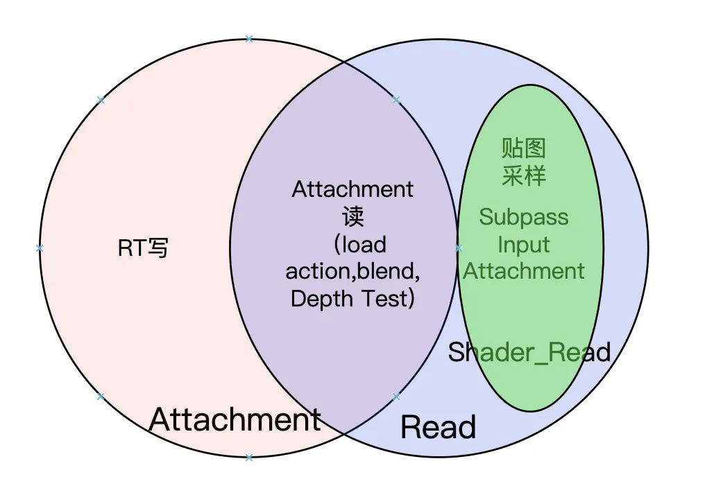

注意上面的attachement读和shader读是完全不一样的GPU对image 读操作，他们发生在不同的管线阶段，也操纵了不同领域的image内存。

如果贴图只需要作为Attachement读，如一张深度图在当前pass不会写深度，只作为深度测试，那么优先选择使用Read而不是Attachment，同等情况Read更优化。

如果只是用作shader读（图形管线采样或者InputAttachemnt），不作为Attachment读，那么更优化的是`VK_IMAGE_LAYOUT_SHADER_READ_ONLY_OPTIMAL` ，这是大多数普通非RT贴图该选择的layout。

同样从这张图可以看到，贴图永远不能:

1. 同时作为写入RT被写入和作为贴图被采样

2. 同时作为写入RT被写入和作为shader input attachment

所以再次强调下如果image只是被作为attachment 但是不会被写入（如关闭depth_write),同时作为贴图被采样或作为Input attach(framebufferfetch) ,是完全符合Vulkan规范的。

**Metal**

Vk的layout定义的过于复杂，而在metal上没有这个显示的概念，metal会根据你的API调用自动的对image的“layout”进行设置，只是在encoder上留了两个相当简单的API：

_optimizeContentsForGPUAccess_

_optimizeContentsForCPUAccess_

用来告诉硬件这个贴图的存储是优化成更易被GPU访问还是CPU访问。

**Gles**

在GLES上则完全没有这个概念，全部交给驱动根据API的调用做一些自动化的“layout”设置。

#### **3.1.6 同步粒度**

对于A和B两个指令集合，当谈到同步的时候，还要限定一个同步的粒度

**空间上的粒度**

即这个同步是指对一个sample来说有效，还是对一个pixel，一个tile，一整个frame buffer。对整个Framebuffer有效就意味着，A的操作要对整个Framebuffer都完成，才能发生B的操作。

光栅化顺序就是对于单个sample来说的，其他大多需要API保证的顺序一般都是按照tile或者framebuffer粒度的。

在vulkan上有一个枚举类型VkDependencyFlagBits里面定义了这种空间上的粒度，大多数同步API都需要这个类型的一个参数。

**时间上的粒度**

即这个同步的集合里面只包含一个command，还是一批command，还是一个subpass，一批subpass。如果是一批command，那么意味着A集合中的所有command都执行结束后，B集合中才能有command开始执行。

对于时间上的粒度，不同的API里面都会设计不同的数据结构，后面会具体讲解。

### **3.2 不同平台的同步机制实现**

前面提到的执行顺序，内存访问顺序的同步，图像可操作状态的转换等在不同的平台下需要靠不同的数据结构和API来实现，不过我们可能在gles编程中几乎感受不到同步这个概念和他带来的困扰，那是因为Gles API为我默默保证了很多同步顺序，但是也可以说我们在gles上做不到细粒度的同步，GPU也不能更好的提升并行效率。在vulkan和metal上同步API的使用都是经常性的操作，metal设计上很轻量，但确实vulkan的重难点之一。

这一节将先分析vulkan和metal的同步机制的实现，最后讲下gles的机制。不过在具体看他们的区别并进行对比前，我们先抽象一下同步这个概念，即在任何API中，都需要有这个抽象来实现同步，同步在API实现上就是关注“两个集合，一个barrier”的事情。

#### **3.2.1 两个集合，一个Barrier**

首先图形API都是以指令的形式发送到GPU的。

当考虑对顺序做保证等时候，一定是保证某些指令集合A和某些指令集合B之间的顺序，做到这一点，最可行的方案就是往指令流种插入一个特殊指令C，让这个特殊指令将指令流做切割，C之前的某些指令就会看做成A，C之后的某些指令就会看作成B。

这种特殊指令C就被称为同步指令，C插入，切割的逻辑可以多种多样，同步的时间粒度也不一致，这就造成了后面会看到的不同的实现不同的同步指令，但是不管怎样，都可以看作往指令流里面设置了一个“路障”，因此本文后面都把这种同步API称做“Barrier”。

如下图，对每个Barrier来说，都可以找到他的一个前置的集合A，和一个后置的集合B，Barrier，A，B三者之间保证了一个特定的顺序。

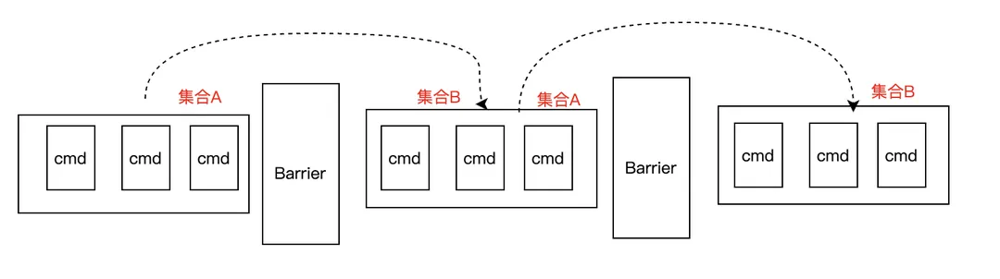

Barrier从设计和实现上看要考虑以下因素：

  * 同步的有效作用域：GPU上的指令从大到小可能存在于不同的范围内：如queue，comand buffer，renderpass。如果能够对不同的指令作用域使用不同的同步类型，性能一定会更好。如支持queue内部的同步机制一定比可以支持跨queue（线程）的高效。
  * 同步的时间粒度：是支持单个command之间的同步，还是只支持rendperass整体的同步，或者是支持command buffer整体的同步，性能也不一样。
  * 同步的空间粒度：是同步只保证单个pixel的尺度，还是要针对整个Framebuffer？
  * 同步所在的gpu管线阶段：因为一个渲染资源可能在渲染管线的不同阶段被进行访问，而现代GPU流水线上的不同渲染阶段也能被并行，因此如果对被依赖的指令执行和内存的等待只局限在特定的渲染管线阶段，就可以大大提高渲染的并行程度。

举个例子，某个image 在指令CmdA中被在PS中写入，而在指令CmdB中在PS中被读取。如果不考虑渲染阶段，那么这个依赖关系就是：

CmdB要晚与CmdA被GPU处理，image需要先被CmdA的流水线处理完，再被CmdB处理。

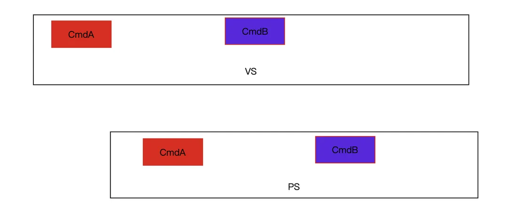

如上图一样，CmdB的执行一定要推迟到CmdA完全执行完。但事实上这里有并行度的浪费，因为明明可以这样

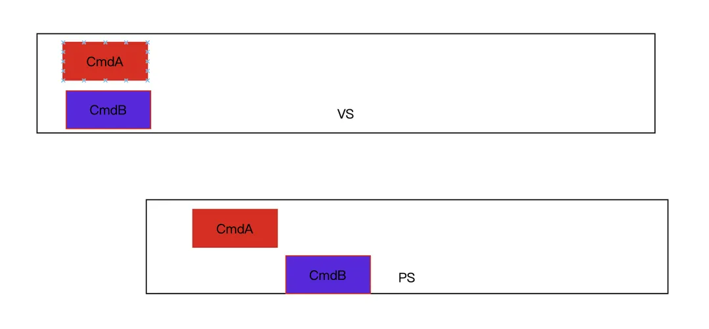

因为他们的VS是不存在依赖关系的，只有PS才存在，所以要考虑同步发生的管线阶段。

  * 是否在图像的同步结束后发生图像的可读写状态改变。

我们在分析后面的各种同步指令中，都要考虑上面的5点来选择合适的API，以达到最好的性能。

#### **3.2.3 Vulkan上GPU的同步机制**

对于GPU上的同步，Vulkan上设计了5种同步机制，他们的不同是为了方便上面讨论的关于不同同步需求的需要。先用一个表格简要列出这5种机制的区别，他们全都是同时支持指令顺序和内存访问顺序的同步。

<table><tbody><tr><td colspan="1" rowspan="1" width="113"></td>
<td colspan="1" rowspan="1" width="74">
<p><span>作用域</span></p>
</td>
<td colspan="1" rowspan="1" width="85">
<p><span>时间粒度</span></p>
</td>
<td colspan="1" rowspan="1" width="120">
<p><span>对管线阶段的定义</span></p>
</td>
<td colspan="1" rowspan="1" width="146">
<p><span>使用场景</span></p>
</td>
</tr><tr><td colspan="1" rowspan="1" width="113">
<p><span>Fence</span></p>
</td>
<td colspan="1" rowspan="1" width="74">
<p><span>--</span></p>
</td>
<td colspan="1" rowspan="1" width="85">
<p><span>SubmitInf</span></p>
</td>
<td colspan="1" rowspan="1" width="120">
<p><span>粗粒度</span></p>
</td>
<td colspan="1" rowspan="1" width="146">
<p><span>只存在Barrier之前的操作集合</span></p>
</td>
</tr><tr><td colspan="1" rowspan="1" width="113">
<p><span>Semaphore</span></p>
</td>
<td colspan="1" rowspan="1" width="74">
<p><span>Device</span></p>
</td>
<td colspan="1" rowspan="1" width="85">
<p><span>SubmitInf</span></p>
</td>
<td colspan="1" rowspan="1" width="120">
<p><span>粗粒度</span></p>
</td>
<td colspan="1" rowspan="1" width="146">
<p><span>最简单的Barrier</span></p>
</td>
</tr><tr><td colspan="1" rowspan="1" width="113">
<p><span>Event</span></p>
</td>
<td colspan="1" rowspan="1" width="74">
<p><span>Queue</span></p>
</td>
<td colspan="1" rowspan="1" width="85">
<p><span>Command</span></p>
</td>
<td colspan="1" rowspan="1" width="120">
<p><span>细粒度</span></p>
</td>
<td colspan="1" rowspan="1" width="146">
<p><span>Barrier的标准实现</span></p>
</td>
</tr><tr><td colspan="1" rowspan="1" width="113">
<p><span>PipelineBarrier</span></p>
</td>
<td colspan="1" rowspan="1" width="74">
<p><span>Queue</span></p>
</td>
<td colspan="1" rowspan="1" width="85">
<p><span>Command/RenderPass</span></p>
</td>
<td colspan="1" rowspan="1" width="120">
<p><span>细粒度</span></p>
</td>
<td colspan="1" rowspan="1" width="146">
<p><span>最易用版本的Barrier</span></p>
</td>
</tr><tr><td colspan="1" rowspan="1" width="113">
<p><span>Renderpass&nbsp;Dependency</span></p>
</td>
<td colspan="1" rowspan="1" width="74">
<p><span>Pass</span></p>
</td>
<td colspan="1" rowspan="1" width="85">
<p><span>SubPass</span></p>
</td>
<td colspan="1" rowspan="1" width="120">
<p><span>细粒度</span></p>
</td>
<td colspan="1" rowspan="1" width="146">
<p><span>subpass之间的barrier</span></p>
</td>
</tr></tbody></table>

##### **3.2.3.1 Vulkan上如何表达两个集合的依赖关系**

Vulkan API中首先要对这种“两个集合的依赖关系"定义成一些数据结构。

**管线阶段的表达**

前面提到同步需要考虑到所处的管线阶段。

**指令执行所在的管线阶段**

vulkan中叫做 **execution scope**

定义在vk的枚举类型

_VkPipelineStageFlags2_ 里面

它定义了如下主要阶段（列举了部分）

图形管线相关：

```c
VK_PIPELINE_STAGE_2_DRAW_INDIRECT_BIT

VK_PIPELINE_STAGE_2_VERTEX_INPUT_BIT

VK_PIPELINE_STAGE_2_VERTEX_SHADER_BIT

VK_PIPELINE_STAGE_2_TESSELLATION_CONTROL_SHADER_BIT

VK_PIPELINE_STAGE_2_GEOMETRY_SHADER_BIT

VK_PIPELINE_STAGE_2_FRAGMENT_SHADER_BIT

VK_PIPELINE_STAGE_2_EARLY_FRAGMENT_TESTS_BIT

VK_PIPELINE_STAGE_2_LATE_FRAGMENT_TESTS_BIT

VK_PIPELINE_STAGE_2_COLOR_ATTACHMENT_OUTPUT_BIT
```

这里有两个比较特殊的状态，但是比较常用，描述整个管线的最开始和最后面，例如一个很保守的执行顺序的同步是，后一个指令的top依赖于前一个指令的bottom，意味着两个指令的管线阶段完全被错开，没有交叠。

```c
VK_PIPELINE_STAGE_2_TOP_OF_PIPE_BIT

VK_PIPELINE_STAGE_2_BOTTOM_OF_PIPE_BIT
```

CS管线：

```c
VK_PIPELINE_STAGE_2_COMPUTE_SHADER_BIT
```

Transfer状态（copy贴图等）：

```c
VK_PIPELINE_STAGE_2_ALL_TRANSFER_BIT
```

这里的Host状态是指在CPU一侧进行处理的状态

```c
VK_PIPELINE_STAGE_2_HOST_BIT
```

**内存访问的管线阶段**

vulkan中叫做**Memory access scope**

定义在_VkAccessFlags2_ 中

里面常见的类型有：

可以看到在管线中各种对内存的访问情形

```c
VK_ACCESS_2_VERTEX_ATTRIBUTE_READ_BIT

VK_ACCESS_2_UNIFORM_READ_BIT

VK_ACCESS_2_INPUT_ATTACHMENT_READ_BIT

VK_ACCESS_2_SHADER_READ_BIT

VK_ACCESS_2_SHADER_WRITE_BIT

VK_ACCESS_2_COLOR_ATTACHMENT_READ_BIT

VK_ACCESS_2_COLOR_ATTACHMENT_WRITE_BIT

VK_ACCESS_2_TRANSFER_READ_BIT

VK_ACCESS_2_TRANSFER_WRITE_BIT

VK_ACCESS_2_HOST_READ_BIT

VK_ACCESS_2_HOST_WRITE_BIT
```

此外None是个特殊的情形，意味着不关心内存的操作。

```c
VK_ACCESS_2_NONE
```

**同步的空间粒度**

对于前面提到的同步所使用的空间粒度，Vulkan中使用VkDependencyFlagBits来定义

例如里面的一些值：

`VK_DEPENDENCY_BY_REGION_BIT`：同步是整个Framebuffer的，还是local的。

`VK_DEPENDENCY_VIEW_LOCAL_BIT`：同步是所有view下的，还是单个view下的。

`VK_DEPENDENCY_DEVICE_GROUP_BIT`：同步是基于一个device group下的所有device的，还是单个device的。

**两个集合的依赖关系**

基于上面的Execution Scope和Memory Access Scope 可以定义出VK上用来表达这种同步依赖关系的数据结构

**VK***MemoryBarrier**

虽然它被叫做memory barrier，但实际上里面也包含了指令执行的依赖关系，这种数据结构有很多种，包括_VkMemoryBarrier2/VkBufferMemoryBarrier2/VkImageMemoryBarrier2_

_VkMemoryBarrier2_

```c
typedef struct VkMemoryBarrier2 {
  VkPipelineStageFlags2    srcStageMask;
  VkAccessFlags2           srcAccessMask;
  VkPipelineStageFlags2    dstStageMask;
  VkAccessFlags2           dstAccessMask;
} VkMemoryBarrier2;
```

它是指对于当前Device上的任意资源内存为同步对象，是global的

里面定义了对于指令执行的管线阶段的依赖关系srcStageMask和dstStageMask，内存访问的管线阶段依赖关系srcAccessMask和dstAccessMask。即对于当前的全部内存对象，在同步API提交前提交的指令集合A和同步API提交后提交的指令集合B，任何B中的指令的dstStageMask的阶段的执行要晚与所有A中指令的srcStageMask阶段执行完，且B中指令在dstStageMask中产生的任何相关的对内存的的dstAccessMask访问要晚与A中指令在srcStageMask阶段产生的对内存的srcAccessMask操作。

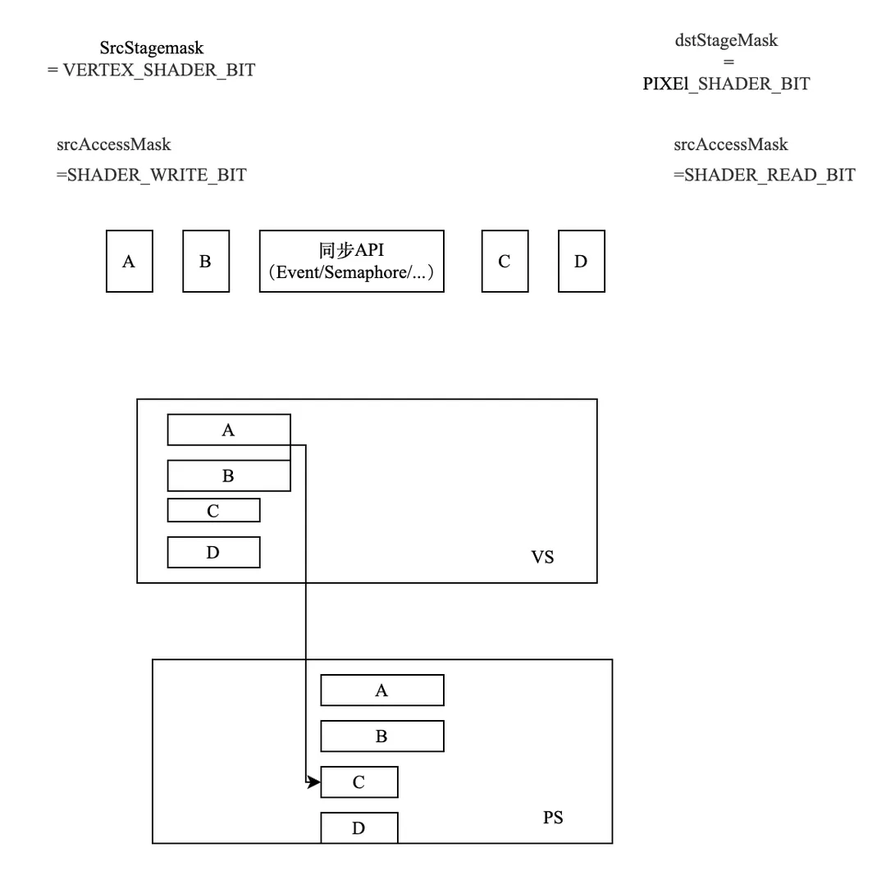

如上面的例子，当某个同步API使用这个VkMemoryBarrier2作为参数插入command buffer之后，c和d的ps依赖ab的vs，所有ABCD的vs理论上可以并行，但是cd一定要等完ABCD的vs结束后才能进入ps，而不是CD自己的vs结束，同时CD对所有内存在shader中的读取采样操作，都要等待AB在shader中将他们写入完成。

另外需要注意的是这里的srcStageMask同srcAccessMask，以及dstStageMask同dstAccessMask必须匹配，例如srcAccessMask如果为`SHADER_READ_BIT`，那么它能搭配使用的srcStageMask只能是`STAGE_*_SHADER_BIT`，这个需要查阅vk的规范。

_VkBufferMemoryBarrier2_

同VkMemoryBarrier2唯一不同的是他里面定义的保持同步的内存不是device上的全部资源内存，而是一个指定的Buffer对象。

```c
typedef struct VkBufferMemoryBarrier2 {
  VkStructureType          sType;
  const void*              pNext;
  VkPipelineStageFlags2    srcStageMask;
  VkAccessFlags2           srcAccessMask;
  VkPipelineStageFlags2    dstStageMask;
  VkAccessFlags2           dstAccessMask;
  uint32_t                 srcQueueFamilyIndex;
  uint32_t                 dstQueueFamilyIndex;
  VkBuffer                 buffer;
  VkDeviceSize             offset;
  VkDeviceSize             size;
} VkBufferMemoryBarrier2;
```

_VkImageMemoryBarrier2_

同VkMemoryBarrier2唯一不同的是他里面定义的保持同步的内存不是device上的全部资源内存，而是一个指定的Image对象。

```c
typedef struct VkImageMemoryBarrier2 {
  VkStructureType            sType;
const void*                pNext;
  VkPipelineStageFlags2      srcStageMask;
  VkAccessFlags2             srcAccessMask;
  VkPipelineStageFlags2      dstStageMask;
  VkAccessFlags2             dstAccessMask;
  VkImageLayout              oldLayout;
  VkImageLayout              newLayout;
uint32_t                   srcQueueFamilyIndex;
uint32_t                   dstQueueFamilyIndex;
  VkImage                    image;
  VkImageSubresourceRange    subresourceRange;
} VkImageMemoryBarrier2;
```

此外它还定义了图像可访问状态的改变，意思是经过这个API，这个image的layout会从oldlayout变成newlayout

_VkDependencyInfo_

上面的这些MemoryBarrier最终会进一步被包装到VkDependencyInfo这个数据结构种，它包含了上面的这些对于全局资源，特定image，特定buffer的memorybarrier和VkDependencyFlags，其中VkDependencyFlags用来定义Framebuffer-local Region。

```c
typedef struct VkDependencyInfo {
  VkStructureType                  sType;
const void*                      pNext;
  VkDependencyFlags                dependencyFlags;
uint32_t                         memoryBarrierCount;
const VkMemoryBarrier2*          pMemoryBarriers;
uint32_t                         bufferMemoryBarrierCount;
const VkBufferMemoryBarrier2*    pBufferMemoryBarriers;
uint32_t                         imageMemoryBarrierCount;
const VkImageMemoryBarrier2*     pImageMemoryBarriers;
} VkDependencyInfo;
```

VkDependencyInfo常作为参数用来表达细粒度的依赖关系出现在大部份的同步api中。

下面就可以介绍vk的5大同步机制了。

##### **3.2.3.2 Fence**

VkFence是最简单的同步机制，正如其名，它很像一个围栏，它的特点是只保证barrier之前的API要在barrier前被处理，值得注意的是，这里只定义了barrier和barrier的前置集合这一种依赖关系，没有定义后置集合，少了一个集合，也就是说不同barrier之间的API们并没有必然的依赖关系，他们依然可能存在某种并行。

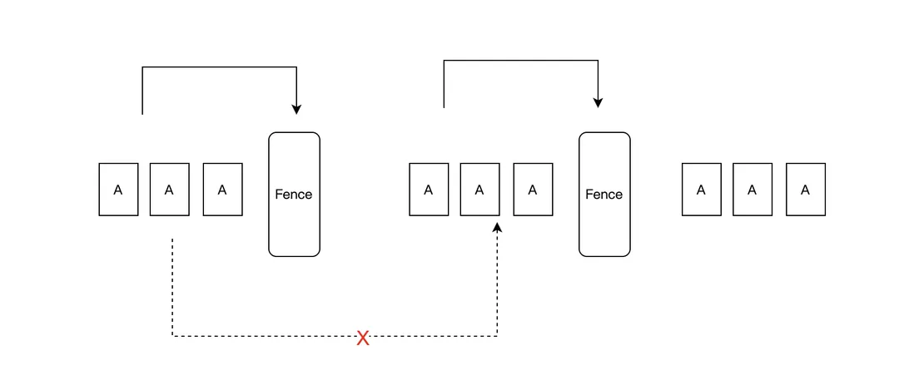

**时间粒度**

它只能对单个的submitinf（即一批command buffer）做同步

**使用**

在使用vkQueueSubmit 提交一个submitinf时，可以插入这个fence，当这个submitinf执行完触发fence的signal

因为没有后置集合，在GPU上不能wait一个Fence，只能在提交完毕时signal

（但是在CPU上可以wait）

**指令执行和内存访问的依赖**

Fence被插入command buffer后，会定义一对依赖关系如下：

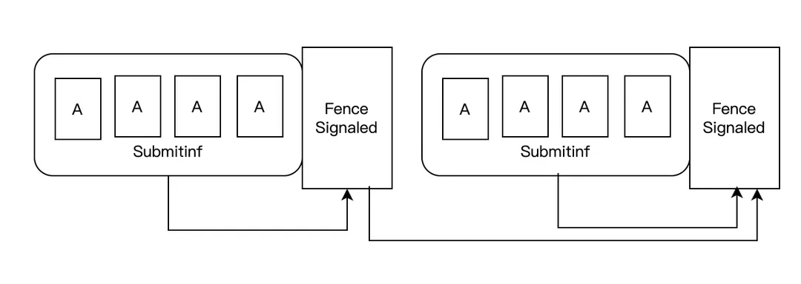

即这个fence的signal依赖它所在的submitinf中的所有cmd完成，以及之前所有signaled过的fence和semaphore。

**管线阶段限定：**

Fence不能携带类似VkMemoryBarrier2的参数来制定精细的指令执行和内存访问依赖。它的被依赖的指令执行阶段是submitinf中的所有指令的所有execution scope，内存依赖是device上的所有内存访问类型。

这是一种相当粗粒度的同步。

##### **3.2.3.3 Semaphore**

VkSemaphore是增强版本的Fence，它包含全部的两个同步集合，即比fence多了后置集合，如下

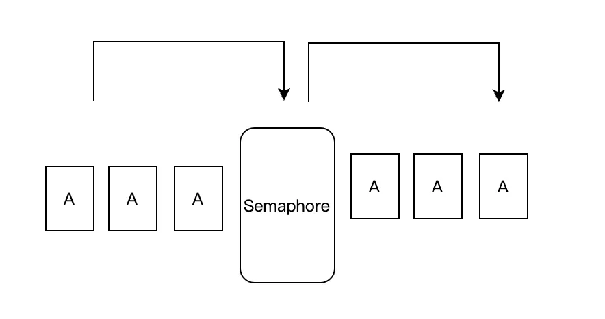

这是一种标准的barrier，对于Semaphore来说，这个barrier前的API结束后会导致这个barrier被设置成某种信号，barrier后的API的执行等待这个阻挡信号，因此这种barrier被称为信号量（semaphore）

**时间粒度和作用域**

对不同的submitinf（一批command buffer）之间的同步。这些submitinf可以是跨越queue的。

**使用**

同Fence类似，在提交API _vkqueusubmit_中，其提交参数VkSubmitInfo中指定了这个submitinf依赖的semaphore和它被gpu执行完之后会signaled的semaphore。

**指令执行和内存访问的依赖**

semaphore的signal和wait各自会定义一组依赖关系

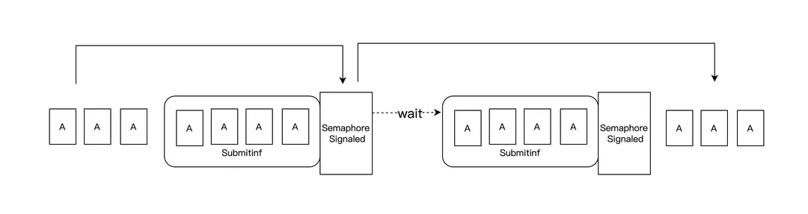

  1. signal定义了barrier的信号触发依赖于这个barrier之前提交的所有API完成（或者其他semaphore被定义），被依赖的指令执行阶段是所在submitinf中的所有指令的所有execution scope，内存依赖是所有device上的所有内存访问类型。
  2. wait定义了barrier之后的API的执行依赖于barrier被signal。依赖的指令执行阶段是所在submitinf中定义的pwaitdststagemask，内存依赖是所有device上的所有内存访问类型。

由于不能指定详细的管线阶段限定，sempahore同样是粗粒度的barrier。

##### **3.2.3.3 Event**

如果说fence和Semaphore是粗粒度的，那么Event就是细粒度版本的Barrier（当然粒度越细，性能可能就会更差），因为Event可以指定所在的管线阶段。

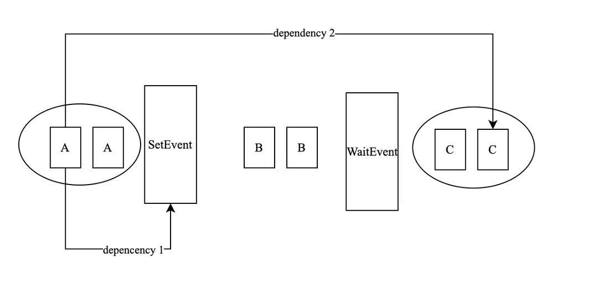

**时间粒度和作用域**

它可以指定单个Command之间的同步，但是需要限定在同个queue内部。

**使用**

使用_vkCmdSetEvent2_ 插入一个cmd，当这个cmd执行时设置为signaled

使用_vkCmdWaitEvent2_使其在同个queue上提交顺序更后的所有cmd（可以跨越cmd buffer）产生对signaled之前的cmd的执行顺序和内存访问的依赖。

**指令执行和内存访问的依赖**

同样这里会存在两对依赖

1. setevent这个API本身会依赖在它之前提交的API（part A），

2. waitevent之后的API（Part C）会依赖setevent之前的API（part A），这两种依赖可以指定不同的依赖参数。

**管线阶段指定**

上述API中都携带VkDependencyInfo参数，可以指定最细致的指令执行和内存访问的管线阶段依赖。

Event是标准版本的Barrier实现。

##### **3.2.3.4 PipelineBarrier**

在目前1.3的vk版本中，我们几乎可以认为pipeline barrier是一个语法上简化版本的event，它同样做细粒度的command之间的同步，同样支持指定细节的指令执行和内存访问的管线阶段依赖，layout的转换关系。只是这里不需要创建一个vkevent对象对他做set和wait，而只要插入一个pipleine barrier即可。（其实早期版本的vk中event只支持粗粒度的依赖，不具备vkdependencyinfo参数）。

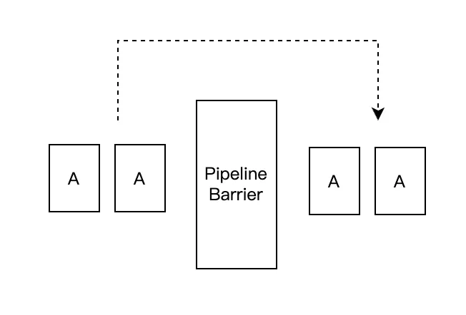

如图这里同event不同的是，把两种依赖关系简化成了只有一种依赖关系，Barrier后的API对之前的依赖。此外还有个不同点是，当pipeline barrier放在renderpass内部的时候，其作用范围只针对它所在的subpass内部有效。

因为简洁好用，另外vk编程中很多时候我们有紧紧需要改变Image的layout的需求，所以pipeline barrier可能是vk编程中最常被使用的同步API。

**使用**

直接使用

```c
void vkCmdPipelineBarrier2( VkCommandBuffer commandBuffer,
const VkDependencyInfo* pDependencyInfo);
```

来插入一个barrier。

##### **3.2.3.5 RenderPass Dependency**

通常在subpass切换期间会大量的存在指令执行和内存访问的同步，因此VK为subpass间定义了一种特殊的barrier。

我们在前面一个章节讲vksubpass的时候，讲到过定义一个vk的renderpass时需要一个参数定义subpass之间的依赖关系。

```c
// Provided by VK_VERSION_1_0
typedef struct VkSubpassDependency {
uint32_t                srcSubpass;
uint32_t                dstSubpass;
  VkPipelineStageFlags    srcStageMask;
  VkPipelineStageFlags    dstStageMask;
  VkAccessFlags           srcAccessMask;
  VkAccessFlags           dstAccessMask;
  VkDependencyFlags       dependencyFlags;
} VkSubpassDependency;
```

这里定义了dstsubpass要对srcsubpass产生依赖，后面的各种vkpipelinestageflags和accessfags，dependencyflags则用来指定细粒度的管线阶段和空间粒度。

它是专门为时间粒度为整个subpass而做的 barrier。

##### **3.2.3.6 RenderPass 结束时的layout转换**

事实上vulkan种还隐藏了一种形式的内存同步，即在一个renderpass结束的时候，会发生一次当前pass所用的attachmentRT的layout的转换（即对图像内存发生了一次同步，然后改变它的可访问状态）。

这个转换在定义一个renderpass的时候定义在VkAttachmentDescription中

```c
typedef struct VkAttachmentDescription {
  VkAttachmentDescriptionFlags    flags;
  VkFormat                        format;
  VkSampleCountFlagBits           samples;
  VkAttachmentLoadOp              loadOp;
  VkAttachmentStoreOp             storeOp;
  VkAttachmentLoadOp              stencilLoadOp;
  VkAttachmentStoreOp             stencilStoreOp;
  VkImageLayout                   initialLayout;
  VkImageLayout                   finalLayout;
} VkAttachmentDescription;
```

参数finalLayout即是这个rt在renderpass结束时会被转换到的layout。

这个layout转换发生的同步是不能被忽略的。

#### **3.2.4 Metal上GPU的同步机制**

Metal大幅度的简化了vulkan的5种同步机制。相当于只保留了简化版本的Event和PipelineBarrier。

同Vk相关概念简单的对比如下

<table><tbody><tr><td colspan="1" rowspan="1" width="150"></td>
<td colspan="1" rowspan="1" width="150">
<p><span>Vk中的类似概念</span></p>
</td>
<td colspan="1" rowspan="1" width="216">
<p><span>对vk概念的简化</span></p>
</td>
</tr><tr><td colspan="1" rowspan="1" width="150">
<p><span>MtlEvent</span></p>
</td>
<td colspan="1" rowspan="1" width="150">
<p><span>VkEvent</span></p>
</td>
<td colspan="1" rowspan="1" width="216">
<p>●&nbsp;<span>RenderPass级别</span></p>
<p>●&nbsp;<span>不做内存访问的同步</span></p>
<p>●&nbsp;<span>不做管线阶段限定</span></p>
</td>
</tr><tr><td colspan="1" rowspan="1" width="150">
<p><span>MtlFence</span></p>
</td>
<td colspan="1" rowspan="1" width="150">
<p><span>VkEvent</span></p>
</td>
<td colspan="1" rowspan="1" width="216">
<p>●&nbsp;<span>RenderPass级别</span></p>
<p>●&nbsp;<span>不做内存访问的同步</span></p>
</td>
</tr><tr><td colspan="1" rowspan="1" width="150">
<p><span>Metal&nbsp;MemoryBarrier</span></p>
</td>
<td colspan="1" rowspan="1" width="150">
<p><span>Vulkan&nbsp;PipelineBarrier</span></p>
</td>
<td colspan="1" rowspan="1" width="216">
<p>●&nbsp;<span>粗力度的内存访问同步</span></p>
<p>●&nbsp;<span>粗力度的管线阶段限定</span></p>
</td>
</tr></tbody></table>

##### **3.2.4.1 Event**

MtlEvent同VkEvent的作用类似，都是提供通过对一个event的set和wait来同步，如下，eventwait之后的renderpass要等待event signale之前的renderpass的执行完毕。

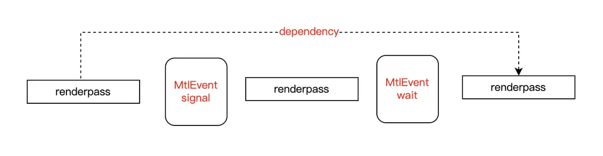

但是这里有很多不同之处：

**作用域：**

MtlEvent不是单个Command级别的，而是renderpass级别的，这要求event的signal和wait操作不能在一个renderpass内部调用。另外MtlEvent也可以是跨越Queue的。

**内存访问顺序和管线阶段限定：**

MtlEvent没有暴露出来内存访问顺序的同步，只有一个简单的执行顺序同步，但是在Metal中，RT的内存访问同步在很多情况是自动完成的，即API会自动根据Texture在Pass中的使用状况（何时被当作attachment写，何时被采样）而自动为我们做好RT的访问顺序同步，不需要开发者额外关心。

此外这里的Event同步也不能指定管线阶段，对于执行顺序来说，管线阶段就是全部阶段。

**使用：**

具体使用上 [encodeSignalEvent:value](https://developer.apple.com/documentation/metal/mtlcommandbuffer/2966542-encodesignalevent?language=objc)将一个mtlevent插入到cmdbuffer上，给他一个新的value， 等这个cmd之前的cmd都完成了，他会把旧的value更新成新的value

使用 [encodeWaitForEvent:value:](https://developer.apple.com/documentation/metal/mtlcommandbuffer/2966543-encodewaitforevent?language=objc)来等待这个event，直到这个event变成这个value，这个cmd后面的指令才会执行。

##### **3.2.4.2 Fence**

Metal中的fence完全不同于vulkan中的Fence（最低配版本的半个barrier），它反而更像是Event的升级版本，相比Event，它增加了管线阶段限定的功能。

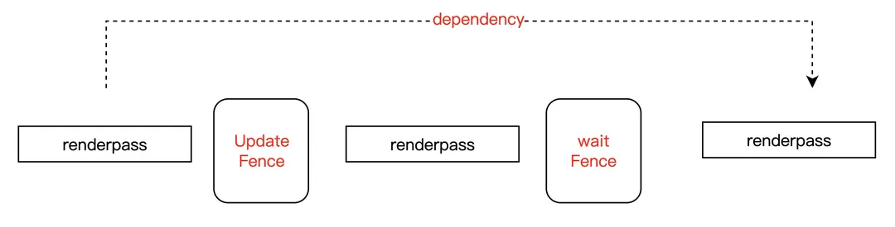

**作用域：**

同Event一样，它的时间粒度是整个renderpass，也是不能对单个command同步，同时它的作用域限定在单个queue内部，不能跨越queue。

**使用：**

它通过调用

```c
 -(void)waitForFence:fence 
        beforeStages:stages;
```

使得这个API之后的指令等待Fence被signal

通过调用

```c
- (void)updateFence:(id<MTLFence>)fence 
        afterStages:(MTLRenderStages)stages;
```

使得之前的指令早于这个Fence被signal之前完成。

注意这两个API调用必须在renderpass内部，当一个renderpass被提交时，metal会自动分析里面涉及到的wait和update的fence，如果一个renderpass同时wait和update同一个fence（例如你想让这个renderpass内部的所有ps完与所有vs），那么要先调用wait，再写update。

**内存访问顺序和管线阶段限定：**

同样不能指定内存访问的同步，但是可以指定指令执行的管线阶段，在参数MTLRenderStages中

不过metal上同样没有定义类似于Vulkan上VkPipelineStageFlags的复杂管线阶段定义。

只给了几个简单的枚举值定义，只有

[MTLRenderStageObject](https://developer.apple.com/documentation/metal/mtlrenderstages/mtlrenderstageobject?language=objc)

[MTLRenderStageMesh](https://developer.apple.com/documentation/metal/mtlrenderstages/mtlrenderstagemesh?language=objc)

[MTLRenderStageVertex](https://developer.apple.com/documentation/metal/mtlrenderstages/mtlrenderstagevertex?language=objc)

[MTLRenderStageFragment](https://developer.apple.com/documentation/metal/mtlrenderstages/mtlrenderstagefragment?language=objc)

[MTLRenderStageTile](https://developer.apple.com/documentation/metal/mtlrenderstages/mtlrenderstagetile?language=objc) 五个，从命名就能推测其含义。

##### **3.2.4.3 MemoryBarrier**

Metal中Memory Barrier是一个最接近Vulkan的Pipeline Barrier的概念了。它同样是插在command中的一个barrier，保证barrier后面的指令对前面指令的依赖。作用域同样是单个Command级别。

使用上直接调用[MTLRenderCommandEncoder](https://developer.apple.com/documentation/metal/mtlrendercommandencoder?language=objc)的API

```c
- (void)memoryBarrierWithScope:(MTLBarrierScope)scope 
                   afterStages:(MTLRenderStages)after 
                  beforeStages:(MTLRenderStages)before;
```

来往当前Command中插入一个Barrier。

但是它相比Vulkan还是做了极大的简化。

**内存访问顺序和管线阶段限定：**

metal同样没有定义类似于Vulkan上VkAccessFlags的结构定义内存访问所在的阶段，而只是给了一简单的枚举值

MTLBarrierScope类型，里面也只包含来三个数据

[MTLBarrierScopeBuffers](https://developer.apple.com/documentation/metal/mtlbarrierscope/mtlbarrierscopebuffers?language=objc)

[MTLBarrierScopeRenderTargets](https://developer.apple.com/documentation/metal/mtlbarrierscope/mtlbarrierscoperendertargets?language=objc)

[MTLBarrierScopeTextures](https://developer.apple.com/documentation/metal/mtlbarrierscope/mtlbarrierscopetextures?language=objc)

意味着对全局的所有buffer或者rt或者贴图做所有内存访问类型的同步。

它也通过MTLRenderStages来限制管线阶段，这是指令执行和内存访问共有的阶段。

#### **3.2.5 CPU-GPU同步**

上面介绍的都是GPU上到同步机制，有时我们需要在CPU-GPU之间进行同步，分为两种情况：

  1. CPU等待GPU的某个指令完成
  2. GPU等待某个CPU控制的信号被signal才能继续

上面多数的GPU上的Barrier同样可以做CPU-GPU间到同步。

**Vulkan**

VkFence:用_vkResetFences_在CPU一侧reset fence， 用_vkWaitForFences_在CPU一侧wait fence，但是不能在GPU等待

VKSemaphore：可以直接使用_vkSignalSemaphore/vkWaitSemaphores_一侧触发或等待一个semaphore

VkEvent：可以使用_vkSetEvent_直接在CPU一侧触发这个event，但是不能在CPU等待

**Metal**

metal则使用了MtlEvent的派生类型MtlSharedEvent来做CPU-GPU的同步。SharedEvent存储了一个value，

在创建一个SharedEvent之后，可以在CPU一侧block住直到value到达预期值，GPU一侧还是通过encodeWaitForEvent/encodeSignalEvent进行触发和等待。

#### **3.2.6 Gles上的同步机制**

前面谈到的都是metal和vulkan上到同步机制，而在gles上，一切都非常简单。

**执行顺序**

gles上的提交顺序即是gpu的执行顺序，gles也只有一个queue，所以保证指令record到queue的顺序就保证了最终gpu上的指令执行顺序。

正因为gles默认的保证gpu的指令执行顺序，所以把一个gles上的渲染逻辑移植到vulkan上可能会不注意同步而产生问题，一个最简单的例子是：在gles上顺序提交的两个renderpass，他们往同一个rt上绘制，由于他们在gpu上的处理顺序也是顺序完成绘制的，所以没什么问题。但是在vulkan上，这样的代码可能导致两个renderpass被并行或者倒序处理都是可能的，如果不加以barrier，很可能会发现后一个renderpass绘制的半透明经常被第一个renderpass的绘制遮盖住。

**SyncObject**

gles上因为也只支持多线程同时record指令的，这时候还是要考虑保证多个线程间record的顺序，当然可以用cpu一侧的同步机制，但是会导致cpu一侧发生block，因此gles还是提供了一个GPU侧的barrier机制保证执行顺序，即SyncObject。它的工作原理如下

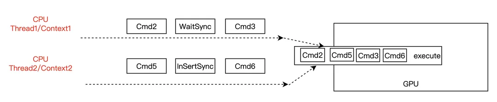

两个contex同时指令的record，context 2通过_glFenceSync_创建并插入一个SyncObject，context1中用_glwaitsync_等待这个SyncObject，这会导致GPU在执行cmd3的时候，保证Cmd5被执行完毕。

gles的SyncObject是Barrier的极简化版本，只包含粗力度的指令执行同步，多数用于gles上多个context并行record指令并涉及到有sharedobject的时候，例如一个线程负责shader编译，另一个线程负责draw，那么draw线程中就需要wait编译线程中某个shader编译好的syncobject。

此外SyncObject也是Gles用来做CPU-GPU同步的手段，使用_glWaitClientSync_可以在CPU一侧等待这个syncobject被signal。

**内存访问顺序**

gles上额外提供了一个相关简单的机制保证内存访问顺序的同步，就是

```c
void glMemoryBarrier(GLbitfield barriers);
```

首先Gles上同Metal类似，对于简单的用于Attachment的贴图的读写同步是可以内部进行粗粒度保证的，如一个rt前面pass被写，后面被读，因为pass在执行上保证同提交的顺序，这个rt的先写后读也可以被保证，且是在Framebuffer域保证。

但是对于一些其他渲染管线中用到的内存，还是需要依靠API保证。

glMemoryBarrier的行为不是像高级API那样逐个定义前后两个集合的指内存访问类型和同步所在的管线阶段，而是定义了一堆枚举值来枚举了各种典型的可以支持的同步情况。且这个同步的时间粒度是这个API之后的所有指令依赖API之前的所有指令。

这些值典型的有：

`GL_VERTEX_ATTRIB_ARRAY_BARRIER_BIT`：对于vb的使用依赖与前面shader对vb的使用

`GL_TEXTURE_FETCH_BARRIER_BIT`：对于贴图的采样依赖前面shader对贴图的写入

`GL_SHADER_IMAGE_ACCESS_BARRIER_BIT`：对于Image的读取依赖前面（compute shader）对image的写入

#### **3.2.7 关于默认的顺序**

正是因为在利用API编程时，同步如此重要，所以我们需要再次总结下在不同API上哪些同步机制是API默认提供给我们的，而除此之外都是需要我们主动思考保证的。

**Vulkan**

Vulkan显然是最麻烦的情形，因为在Vulkan上，只有一种顺序是默认情况下可以确定的，就是光栅化顺序，即对于同一个subpass中的同一个sample，它在ps中的执行和对attachment的内存写入按照光栅化顺序（即GPU的提交顺序）。其他任何顺序（驱动对command的处理，GPU对drawcall的绘制,不同的ps执行之间...）都可能是同你的提交顺序无关的，且大概率会被硬件按照它最优化的方式并行无序执行，这是一个非常极端的API。

**Metal**

除了光栅化顺序之外，Metal能够自动分析出RenderPass之间的依赖关系，对有明显依赖关系的RenderPass，一般不需要主动保证他们的指令执行和rt的同步关系，只有对于pass中涉及到的其他内存资源，需要主动去保证同步关系，此外没有依赖之间的renderpass也是会被metal并行执行。

**Gles**

Gles上GPU执行顺序等同于指令的提交顺序，加上gles上基本都会单线程提交drawcall，所以gles上的指令执行顺序是默认明确的。对于RT，同metal一样也可以自动保证其读写同步，只有对于渲染中涉及到的其他内存资源，才需要通过glmemorybarrier去进行同步。

## 四、 **内存**

图形API会在多大程度上触碰到内存？CPU一侧我们通过new/malloc等语法分配CPU上的内存，而图形API则通过特定的API接口间接的分配释放内存和显存。

我们首先可以把图形API能触碰到的内存分为Host和Device两种，Device一般就是我们为实际的渲染资源（如texture，buffer）在GPU一侧分配的内存（或叫做显存），而Host一般是API为了管理渲染结构在CPU一侧分配的内存，虽然在移动端HOST和Device在物理上可能是放在一起的。

### **4.1 Host内存**

为了维护渲染上下文，管理GPU上的渲染结构，准备渲染数据，API都会在CPU一侧在驱动内部分配大量的内存，这部分内存对开发者来说基本是不可控的，即你不能显示的决定这些内存在何时分配和销毁，它只是你调用API时的副产物。有时这部分内存占用可观，甚至超过图形资源实际占用的显存，在平台的内存分析工具中，它会统计到在你的app的native内存中，有时候我们自己的引擎在C++一侧分配的内存并没有那么多，这个差值的很大一部份就来源于API的Host内存分配，它由驱动所在的C++库分配。

**Gles**

gles上不能控制这部分内存的分配，它随API产生，如果要统计他们的大小也不容易，你可能需要hook 类似adreno.so这种显卡驱动的native内存分配，或者统计pmap指令中来自类似kgsl这种文件的mmap。Gles上的Host内存浪费是比较严重的。

**Vulkan**

Vulkan中默认Host内存也是驱动管理的，但是在相当大的程度上给了一个callback通知我们host内存的分配时机并允许我们使用自己的内存分配策略，这个相当友好，因为大多数引擎都有自己封装的更高级的内存分配器，这样也可以把他们给API的Host内存分配使用，有利于内存profile和内存的使用效率。

在大部分涉及到资源分配的的Vulkan API中，都允许传入一个类型为VkAllocationCallbacks的回掉。

```c
typedef struct VkAllocationCallbacks {
void*                                   pUserData;
    PFN_vkAllocationFunction                pfnAllocation;
    PFN_vkReallocationFunction              pfnReallocation;
    PFN_vkFreeFunction                      pfnFree;
    PFN_vkInternalAllocationNotification    pfnInternalAllocation;
    PFN_vkInternalFreeNotification          pfnInternalFree;
} VkAllocationCallbacks;
```

这里面定义了Alloc，realloc，Free时自定义的回掉函数，puserdata是允许往这些自定义回掉函数里传递的自定义数据，注意实践中自定义的alloc free要配对。

另外有一些内存分配释放行为不允许我们自己实现，但是我们能够得到通知，这些通知的回调就是其中的InternalAllocation和InternalFree。

**Metal**

metal上虽然也不能显示控制这部分内存的分配，但是可以通过xcode中的alloccation等工具方便的看到metal API对内存的分配状况。

### **4.2 Device内存的分配释放**

Device内存是API在GPU上分配的空间用于创建渲染资源。Device内存主要有种：

  * Image
  * Buffer
  * Shader
  * sampler，framebuffer等其他需要占用内存的对象

由于Image和Buffer是我们可以用多种方式操纵内存的大块内存对象，因此我们主要讨论他们用的内存（而其他对象的内存使用上相对固定，且被管线自动维护）。

Buffer是一段格式相对简单的一维内存数据，而Image则是有特定格式，多个维度的内存格式，一般当Image作为GPU读取的图像内存时多被称为texture，而图像内存也可以被GPU写入，这时候一般才叫做Image，本章节中，将统一用Image来称呼。

Device内存的分配主要是是为了Buffer和Image的对象实例的创建，API上内存分配方法有两种派别。

一种是Vulkan的内存分配+对象绑定方式，一种是gles和metal的简单的对象创建方式。

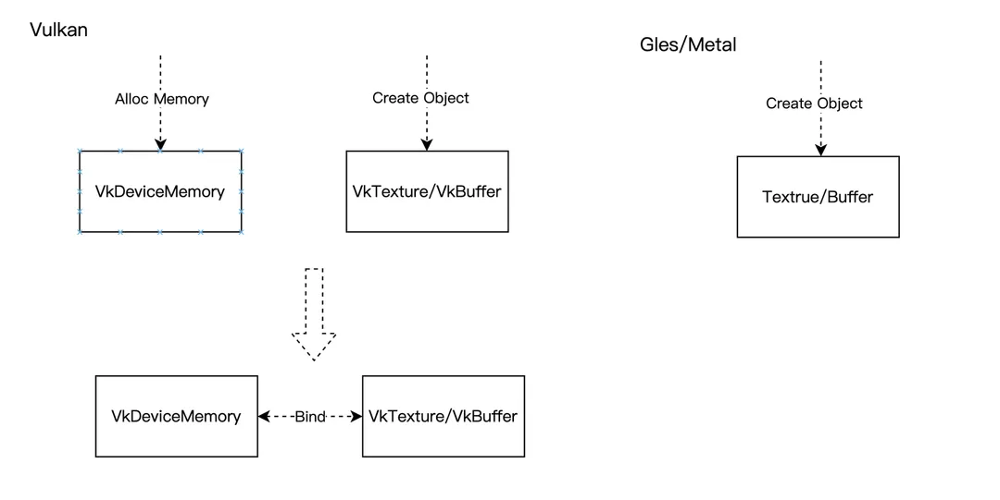

#### **4.2.1 Vulkan**

Vulkan上有单独的device内存对象VkDeviceMemory，vulkan上对于Texture和Buffer的内存，必须要先创建独立的内存对象（可以认为物理内存）和资源实例（只是资源描述），然后再将二者绑定。

**内存对象分配**

通过API _vkAllocateMemory _在某个MemType的Heap上分配一个内存对象

```c
VkResult vkAllocateMemory(
    VkDevice                                    device,
    const VkMemoryAllocateInfo*                 pAllocateInfo,
    const VkAllocationCallbacks*                pAllocator,
    VkDeviceMemory*                             pMemory);

typedef struct VkMemoryAllocateInfo {
    VkStructureType    sType;
    const void*        pNext;
    VkDeviceSize       allocationSize;
    uint32_t           memoryTypeIndex;
} VkMemoryAllocateInfo;
```

其中会指明需要的内存大小，以及这个memorytypeindex就是在前面_vkGetPhysicalDeviceMemoryProperties_查询到的memoryTypes中的索引，即某种类型的一个heap，即我们创建内存对象的时候就指明了这块内存的访问方式。

**资源对象创建和内存绑定**

有了内存对象后，对于image和buffer对象，通过对象创建的API _vkCreateBuffer_或_vkCreateImage_等创建出资源对象，最后通过API

```c
VkResult vkBindBufferMemory(
    VkDevice                                    device,
    VkBuffer                                    buffer,
    VkDeviceMemory                              memory,
    VkDeviceSize                                memoryOffset);

VkResult vkBindImageMemory(
    VkDevice                                    device,
    VkImage                                     image,
    VkDeviceMemory                              memory,
    VkDeviceSize                                memoryOffset);
```

对资源和内存绑定。

资源只有绑定内存后才能使用，这里在创建内存对象时需要知道资源所需的内存大小，可以通过API _vkGetBufferMemoryRequirements_ / _vkGetImageMemoryRequirements_ 来计算。

资源对象一旦绑定内存后不能重新绑定，也不能解绑

我们也可以在创建VkMemory时自动为他绑定给一个buffer或Image，在VkMemoryAllocateInfo中有个pnext扩展参数，将它指向一个VkMemoryDedicatedAllocateInfo类型。

因为vulkan的资源和对象是分离的，你甚至可以将多个资源对象绑定在同一个vkmemory上，只要他们的内存确定是可以共享的，并能维护好使用的冲突。

#### **4.2.2 Metal 和Gles**

Metal上直接使用

```c
- (id<MTLBuffer>)newBufferWithLength:(NSUInteger)length 
                             options:(MTLResourceOptions)options;

- (id<MTLTexture>)newTextureWithDescriptor:(MTLTextureDescriptor *)descriptor;
```

这样的API创建buffer和贴图对象，同时为他们分配内存，在创建的参数中都需要传入MTLResourceOptions来指定内存的访问方式。

Gles上则一般是先创建对象，再为对像分配内存。

如对于buffer，先通过glBindBuffer()创建一个buffer对象，再通过glBufferData（）创建和填充它的内容。对于Texture，先通过glBindTexture()创建一个贴图对象，再通过glTexImage2d()来创建和填充他的device内存。

#### **4.2.3 Gles上额外的内存对象**

Image和 Buffer抽象了Vulkan和Metal上我们可以自由操纵所有内存对象，Gles上则除此之外，还有一些额外的可以操纵内存的对象，这看上去是在此之上为了解决一些需求而打了很多补丁一样。它多了以下三种特殊的内存对象需要额外考虑。

**RenderBuffer**

我们知道正常情况下，Framebuffer都是同一张Texture关联，但是在gles下抽象出来了一种可以不是texture的纯内存形式的buffer同Framebuffer关联作为其attachment，它被认为比texture更加的纯粹，它不是为了采样，专门为了做渲染目的地，主要基于两个需求：

  * msaa渲染的硬伤，core API中不能将framebuffer渲染到一张multisample的texture上，可以渲染到一个multisample的renderbuffer上。
  * 性能的提升，如果不考虑image的继续采样等，单纯做一个rt，那么性能比texture要好。

**BackBuffer**

此外在gles上不能直接拿到backbuffer的image对象，这就造成了无法读取backbuffer的困境，因为gles在渲染时将Framebuffer的texture bind到0就意味着使用系统的backbuffer。

所以在gles的API中允许直接从Framebuffer层面读写该Framebuffer的内存内容，以达到对系统的屏幕缓存（所谓的backbuffer）的访问，这种设计在vulkan和metal上不存在，因为vulkan 和metal上的backbuffer也是能够获取到的Image对象。

**PixelBuffer**

gles上的Image（texture）在设计之处不能自由的同Buffer交换内存，这也是个硬伤，因为我们知道CPU对RT的写入读取在多数情况最好不要直接进行，这样会导致CPU和GPU的强同步，一般的选择是现在GPU上device内存内部将RT暂存到一个临时buffer上，等待合适的时机再从Buffer上读取内存回CPU，这需要texture和buffer传递内存的能力。

另外CPU对texture的写入，也可以先利用PBO将CPU内存写入到PBO，再从PBO拷贝到texure，在很多机型上要比直将CPU内存写入texture性能要好。

为了解决这个问题，gles 3.0版本又打了一个大大的补丁，引入了一种特殊的Buffer，注意它其实也是一个普通的buffer，应该算在buffer对象里面，只是有个特殊的类型flag叫做PIXEL_PACK_BUFFER和PIXEL_UNPACK_BUFFER，我们一般叫做Pixel BufferObject。但是它在数据传输过程中作用特殊。

PBO基本用来做对Texture内存访问的一个代理人的角色，texture和frambuffer不能直接将数据拷贝或从buffer读取，但是可以先同Pixel Buffer传输数据，再使用PBO同其他buffer打交道。PBO在API中通过一些标记触发到对他的使用。

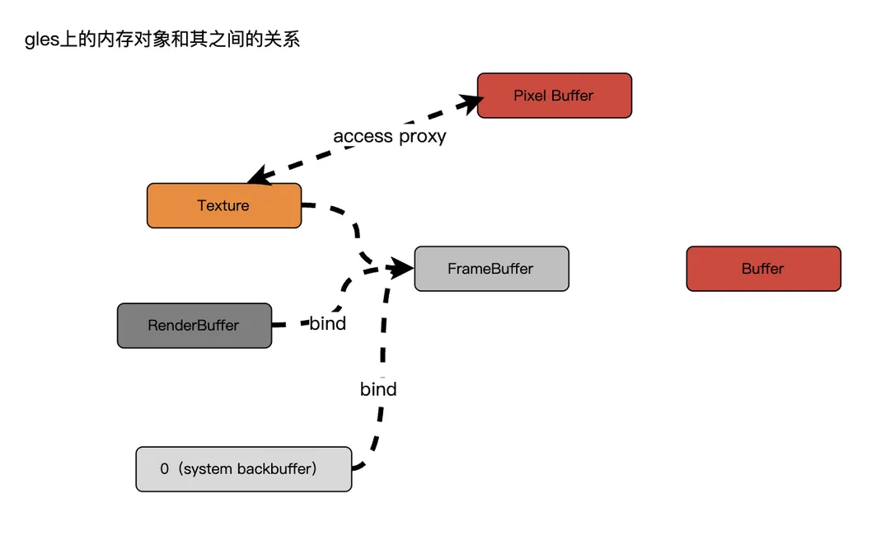

### **4.3 Device内存的访问**

Host内存的存储，访问都完全在Host一侧范围，所以管理上很简单，但是Device内存可能同时被Host和Device访问，尤其涉及到Device内存被Host访问，就要牵扯到复杂的机制。

对Deivce的内存数据访问一般有以下情况：

  * Device（GPU）侧的read
  * Device（GPU）侧 的write
  * Device侧的copy
  * Host（CPU）侧的read
  * Host（CPU）侧的write

#### **4.3.1 GPU Read Write**

##### **4.3.1.1 Access after Bind**

Device上的资源不同于Cpu上的，它存在一个设计好的硬件化的数据处理管线，管线上预留了一些资源绑定槽位，管线一般不能主动通过寻址的方式访问资源，一般都需要事先将对象绑定到相关位置上喂给管线才能被GPU访问。

如下图描述了基本的GPU管线上需要被绑定的槽位，上面的各种texture unit, uniform slots，arraybuffer，都是需要我们主动绑定给管线的资源。

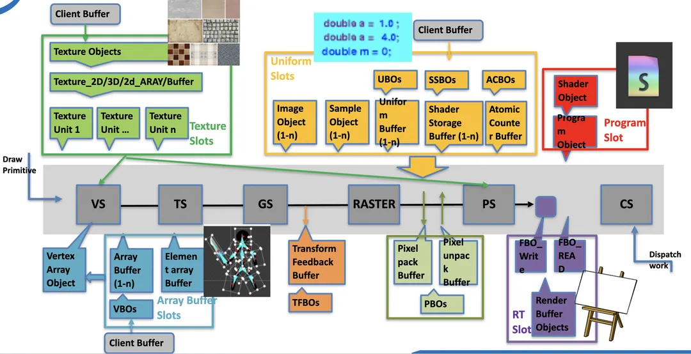

**Read**

GPU read是对device内存最原始最常用的访问情况，贴图创建后被采样，buffer创建后被索引，都是最常用的GPU使用方式，

例如对贴图的访问都需要先经过类似`glBindTexture/vkCmdBindDescriptorSets/[MtlRenderCommandEncodersetFragmentTexture]`这样的API将image资源 Bind到管线某个Index的贴图位置上，shader中就可以对它采样。

Image的读再GPU上一般有三种不同的情形，一种是Attachment 读（即被attach到frame buffer上，经过load action读入到当前像素，被用于ps的初始值，或者用于后面的test blend等）attachment 读操纵的是image的tile上的内存，另一种叫做shader读（一般是在shader中显示的对一张贴图做采样等），shader读操纵的是image的main memory上的内存。还有一种特殊情况叫做framebufferfetch（vulkan中的input attachment），它是在shader中显示的直接访问tile内存。

而buffer也是利用类似的`glBindBuffer/vkCmdBindDescriptorSets/[MtlRenderCommandEncodersetFragmentBuffer]`的函数绑定后被读取

**Write**

资源通过一些API还可以绑定到gpu管线上被GPU写入，典型的情况包括：

  * 作为renderpass的attachement被图形管线写入
  * 在computer shader中直接在image或buffer的内存上写入

vs和ps里面一般只能发生资源的读，而不能写入。

同时Image的写同读类似，也可以按照操纵的内存领域来分为两种，Attachment 写和shader 写。

##### **4.3.1.2 Clear**

对于Device资源，GPU还会发生一种特殊的写入操作，叫做Clear。将一个buffer 或Image的所有元素设置为某个值。

我们知道对于RT来说，通过把它绑定到renderpass上，然后设置renderpass的loadaction为clear，storeaction设置成store，设置好当前的clearcolor，然后启动这个renderpass，就可以做到对RT的clear，这种是基于图形管线的image clear。在一些API上提供了更简单的API。

**Vulkan**

对于Buffer，使用API

```c
void vkCmdFillBuffer(
    VkCommandBuffer                             commandBuffer,
    VkBuffer                                    dstBuffer,
    VkDeviceSize                                dstOffset,
    VkDeviceSize                                size,
    uint32_t                                    data);
```

注意可被clear的buffer需要带有`VK_BUFFER_USAGE_TRANSFER_DST_BIT`的创建参数

对于Image，如果想要在renderpass之外clear，使用API

_vkCmdClearColorImage 和 vkCmdClearDepthStencilImage_

注意此时的Image必须处于General或者Transfer_Dst layout

**这里不能支持压缩格式的Image**

如果想要在renderpass之内clear，使用API

_vkCmdClearAttachments_

这个API事实上是相当于发生了一个全屏的drawcall。

注意上述只有FillBuffer允许在单独的Transfer queue上执行。对于Image的clear仍然依赖于图形或计算管线。

**Metal**

metal上的Image只能通过设置renderpass进行clear，对buffer的clear可以使用

MtlBlitCommandEncoder中的API

```c
- (void)fillBuffer:(id<MTLBuffer>)buffer 
             range:(NSRange)range 
             value:(uint8_t)value;
```

**Gles**

gles上的Image只能通过设置成rt进行clear，对于buffer也没有很有效的API进行clear，只能通过glBufferData重新设置某个buffer的数据内容，注意如果glBufferData的中的地址设置为null，不代表clear，而是代表这段buffer没有初始化。

##### **4.3.1.3 BindLess **

更现代的API允许对texture 和buffer不事先绑定在管线上，而直接通过device内存上的地址对它进行读写，这种资源访问形式叫做bindless

vulkan在1.2版本之后正式支持buffer_device_address特性，通过APIvkGetBufferDeviceAddress可以获取到一个VkBuffer的device上的内存的64bit指针（不是handle，是直接的显存指针），在shader中，可以直接用这个指针访问buffer内存。

metal上则在1.3之后允许我们直接讲对texture和buffer的访问提前录制到Indirect Command Buffer中，以达到使用时不用预先bind。

#### **4.3.2 GPU Copy **

device上有一种特殊的经常发生的对device内存的读写操作，叫做copy，我们单独分析。

Copy的过程还可能从一种形式的对象到另一种形式，如从Image copy到Buffer。

Vulkan和metal上的device一侧数据传递接口简洁优雅，非常简单，不过gles上反而是非常繁杂的一块内容。

##### **4.3.2.1 Vukan **

vulkan下面的API非常明确，提供了4大类直观的API完成内存在Image和Buffer之间的两两组合形式的拷贝。

Buffer 到Buffer：

  * vkCmdCopyBuffer2 将A buffer的某个region拷贝到B buffer的某个region
  * vkCmdUpdateBuffer 这也叫做Inline copy，它将待源数据直接写入到Command Buffer中，然后copy 给vkbuffer对象，更加快速，但是数据必须足够小，一般小于64k。

Image 到 Image：

  * vkCmdCopyImage2 将A Image的某个mip的某个区域拷贝给B Image，单纯内存数据传输
  * vkCmdBlitImage 允许再不同的格式，缩放，贴图filter（点采样，和线性采样）之间拷贝，这不是单纯到数据搬运，还会对image数据做重解析，不支持multi sampled
  * vkCmdResolveImage 用于Multisample image的resolve，即将一个多重采样的Image按解析成单采样的

Buffer 到Image：

  * vkCmdCopyBufferToImage

Image 到Buffer：

  * vkCmdCopyImageToBuffer

上面这两个也常用与CPU读写Image的操作，这时一般都需要先讲Image同Buffer之间转换。

此外要注意，在上面Image的拷贝过程中，Image的layout都需要提前根据作为copy到源和目的设置为`VK_IMAGE_LAYOUT_TRANSFER_SRC_OPTIMAL`或者`VK_IMAGE_LAYOUT_TRANSFER_DST_OPTIMAL`。

另外所有的这些Device侧的copy指令的record一定要发生在renderpass之外，即他们的renderpass scope是OutSide的。

上述所有API都支持在Graphic/Compute/Transfer中任何一种queue中提交，也就是说这些GPU上的数据Copy可以放在一个单独的Transfer queue中执行。

##### **4.3.2.2 Metal**

metal下进行Device侧的数据copy要将其放在BlitCommandEncoder里面，即它也是同常规的渲染的RenderCommandEncoder分离开的。（Encoder的部分见我们前一个章节内容）。

BlitCommandEncoder里面封装了两个函数实现所有功能：

  * copyFromBuffer 将一个buffer内存copy 到另外一个buffer或texture
  * copyFromTexture 讲一个Texture内存copy 到另外一个buffer或texture

##### **4.3.2.3 Gles**

基于前面提到的gles上多了几种需要考虑的内存对象的，所以实际上要关心Buffer，Image，RenderBuffer，Framebuffer，（pixel）buffer 这5种类型资源之间的数据传递，涉及的API繁杂，API命名形式也互相没有什么关系，很考察记忆力，我们下面来捋一下.

**buffer之间的拷贝**

  * glCopyBufferSubData(GLenum readtarget, GLenum writetarget)

gles上的buffer若想发生数据copy，和渲染一样，必须也bind到管线上，因此这里需要指定的src和dst并不是某个具体的Buffer对象，而是管线的默认绑定点，例如 `GL_UNIFORM_BUFFER`， `GL_ARRAY_BUFFER`，但是为了copy把两个buffer绑定到关系上，事必占用了本该用作渲染点槽位影响现有管线状态，因此gles定义了两个专门用于copy的管线绑定点`GL_COPY_READ_BUFFER`和`GL_COPY_WRITE_BUFFER`，我们通常在copy之前需要把copy的src和dst绑定在这两个位置，但是记住他们绑在其他有意义的绑定点也可以。

**Image 之间的拷贝，RenderBuffer之间的拷贝，Image和RenderBuffer之间的拷贝**

  * glCopyImageSubData

用于在两个Texture和Renderbuffer之间做拷贝，它是一个单纯的内存拷贝，所以甚至两边尺寸不一样，但是总大小一致也可以完成，但是需要internal format是compatible的（这个具体要查阅文档）。

但是注意到renderbuffer使用的internalformat只能是可以渲染的，因此这里只能够支持那些可以作为rt的格式的textrure和rende rbuffer之间的拷贝，压缩格式等都是不行的。

**FrameBuffer 之间的拷贝**

  * glBlitFramebuffer

需要将src framebuffer绑定到 read framebuffer上，将dst framebuffer绑定到 draw framebuffer上。

**FrameBuffer到Image的拷贝**

  * glCopyTexImage2D

剩下两种涉及到Texture的copy都需要Pixel Buffer的参与了

**buffer到Image的拷贝**

只能从`PIXEL_UNPACK_BUFFER` 的buffer拷贝到texture

所以需要先

  * 将一个buffer绑定到`_BUFFER`，调用glCopyBufferSubData 将待拷贝buffer拷贝到`PIXEL_UNPACK_BUFFER`

再用

  * glTexImage2D

这个接口，这个API本身是用来从CPU地址写入texture的，如果将其中的CPU地址设置为0，则意味着从当前的绑定的`PIXEL_UNPACK_BUFFER`写入数据到texture。

**Image 到 buffer的拷贝**

gles只能从当前的framebuffer拷贝数据到`PIXEL_PACK_BUFFER`。所以这里的步骤就会很多，需要三步，且如果texture不是一个支持做RT的format，那不能进行

  * 将Image绑定到Framebuffer，并将Framebuffer绑定到当前的read framebuffer
  * 将一个buffer绑定到`PIXEL_PACK_BUFFER`,调用glReadPixels API

这个API本来是用来从当前的read framebuffer读取数据到CPU内存的，但是如果其中的CPU地址填写为0，他将拷贝到当前绑定的`PIXEL_PACK_BUFFER`

  * 用glCopyBufferSubData从`PIXEL_PACK_BUFFER`拷贝到目标buffer

**Framebuffer到buffer的拷贝**

其实就上面Image 到 buffer的拷贝的后两步。

**RenderBuffer到Buffer的拷贝**

同Texture 到 buffer的拷贝。

#### **4.3.3 CPU Read Write**

##### **4.3.3.1 Device内存的访问类型**

因为Device内存本来是在Device上的，如果被CPU读写，那么就会同GPU读写产生冲突，

还涉及到数据同步的效率问题，为了解决这个问题，不同的API设计了不同的Device—Host共同访问的策略，但是从根本上，从跨越API的角度上，我们把device内存的访问类型，大致可以抽象为以下5大类。

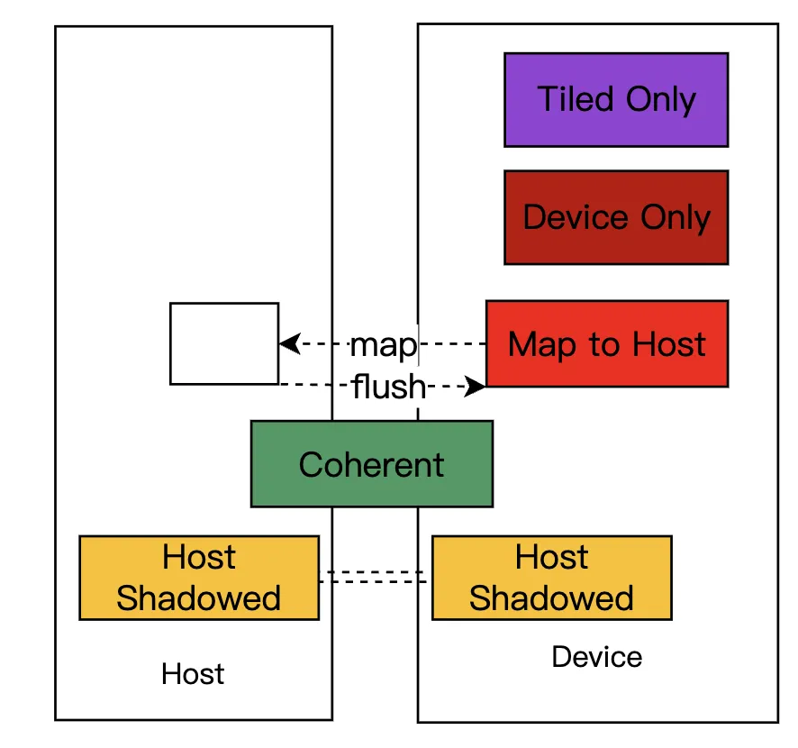

  * Tiled Only:最简单高效，只能在tile上被访问，这部分内存只存在于gpu cache上，生命周期只局限在tile上，这部分内存可以认为不占用我们的系统内存，这是移动端TBDR架构下的特有内存。
  * Device Only：这部分内存只能被Device访问，完全在GPU一侧，也很快。

以下三种策略都是host 可访问的：

  1. Map to Host：Device内存通过显示的接口Map/unmap暴露给Host，Host写入之后通过 接口Flush更新Device内存， 这是最经典的提供Host访问的方式，它兼顾了两侧的访问效率，也是gles上唯一的Device内存类型。

在实现上，一般会有一个显示的Map和Unmap接口，用来把一段device内存暴露出来， 这个map和unmap可以完全block住GPU对这段内存的使用，也可以不block住，map之后，Host就可以读取这段内存，也可以直接在上面写入，当写入完成，通常还需要一个flush接口，将写好的内容同步给Device。以下是Map to read/write的工作原理

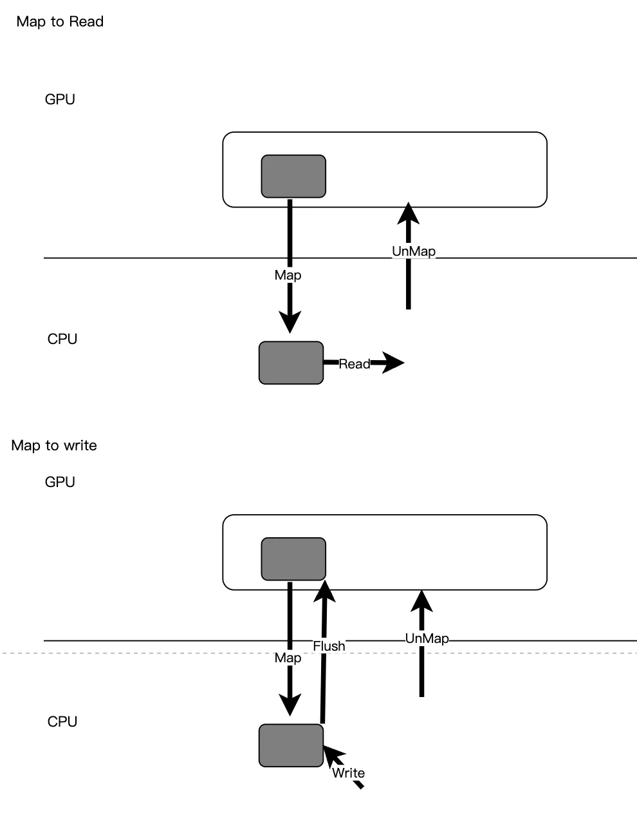

  * Coherent:这个一般只存在于移动端硬件上，因为移动端的host和device的内存在物理上可以是在一起的，Host和Device共享这块内存，这个内存可以同时被host和device访问，任何一端对其修改都是即可对另一端产生了影响，这种对于两侧共同访问情况下使用方便，但是对device这一侧来说性能可能比Map to Host这种实现更差。

这种内存的访问一般没有显示的API，CPU一侧可以直接读写这块内存，但是要主动的做好CPU和GPU对这块内存的访问冲突，保证不会发生同时读写的情况

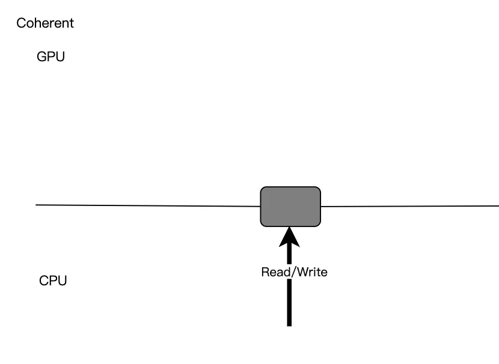

  * Host Shadowed：这种类型常见在PC硬件上，更优化于Host的访问，一般驱动内在Host一侧提供一个同样大小的内存，同device一侧在某些时刻拷贝数据，使得host一侧的读取更快速，但是一般需要逻辑去显示的同步这两份内存，GPU的sync同步之后一般会给CPU一侧一个回掉或者event，两边的访问效率都很高，但是内存消耗较高。

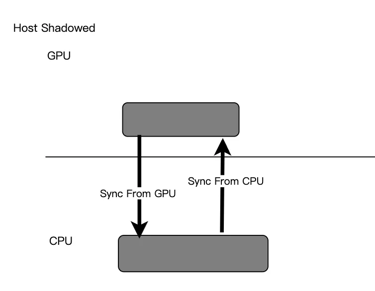

对应于不同的API，都是基于上面5中策略实现了不同的API

**Vulkan**

vk上的device内存被分成多个MemoryHeap，每个Heap 又被按照所支持的访问类型的不同分成多个 memory type， 一个VkMemoryType就是vulkan上一个Heap上的支持一种特定访问类型的内存堆，因为在vulkan上分配的内存的API则必须指定其所在的VkMemoryType，我们需要首先查询出来当前设备含有的所有VkMemoryType，

通过API _vkGetPhysicalDeviceMemoryProperties _查询

```c
void vkGetPhysicalDeviceMemoryProperties(
    VkPhysicalDevice                            physicalDevice,
    VkPhysicalDeviceMemoryProperties*           pMemoryProperties);

其中的包含了所有heap和type的信息。

typedef struct VkPhysicalDeviceMemoryProperties {
    uint32_t        memoryTypeCount;
    VkMemoryType    memoryTypes[VK_MAX_MEMORY_TYPES];
    uint32_t        memoryHeapCount;
    VkMemoryHeap    memoryHeaps[VK_MAX_MEMORY_HEAPS];
} VkPhysicalDeviceMemoryProperties;

typedef struct VkMemoryType {
    VkMemoryPropertyFlags    propertyFlags;
    uint32_t                 heapIndex;
} VkMemoryType;

// Provided by VK_VERSION_1_0
typedef struct VkMemoryHeap {
    VkDeviceSize         size;
    VkMemoryHeapFlags    flags;
} VkMemoryHeap;
```

这个结构要先看memoryHeaps，包含了所有的device memory heap，而每个heap可能包含多种类型不同的memory type，在memorytypes中描述了它的type和归属于哪一个heap，heap和type是一对多的关系。

不同的memtype则对应了不同的访问类型，通过属性中的VkMemoryPropertyFlags枚举定义，值有如下，在这里你会发现前面提到的几种内存访问方式在Vulkan中的体现：

**VK_MEMORY_PROPERTY_DEVICE_LOCAL_BIT**：它并不是单纯绝对的device only，而是更倾向为device访问做了优化，他可以同HOST_VISIBLE连用，同时给host访问。  

**VK_MEMORY_PROPERTY_HOST_VISIBLE_BIT**: Map to Host的。

**VK_MEMORY_PROPERTY_HOST_COHERENT_BIT** ：Coherent的，需要同HOST_VISIBLE连用

**VK_MEMORY_PROPERTY_HOST_CACHED_BIT** :host shadowed，需要同HOST_VISIBLE连用，也可以同时叠加HOST_COHERENT使用。

**VK_MEMORY_PROPERTY_LAZILY_ALLOCATED_BIT**：tiled only的，需要同device local连用，只能bind给带有`useflag VK_IMAGE_USAGE_TRANSIENT_ATTACHMENT_BIT`的image。

**VK_MEMORY_PROPERTY_PROTECTED_BIT**：需要同device local连用，允许 protected queue访问

**Metal**

Metal通过MTLResourceOptions这个枚举来定义不同的内存访问类型，这个枚举值参数被用于metal上texture和buffer创建的API中。

[MTLResourceStorageModeShared](https://developer.apple.com/documentation/metal/mtlresourceoptions/mtlresourcestoragemodeshared?language=objc)：coherent的，这也是metal在移动端texture和buffer默认的内存访问方式

[MTLResourceStorageModePrivate](https://developer.apple.com/documentation/metal/mtlresourceoptions/mtlresourcestoragemodeprivate?language=objc)：device only

[MTLResourceStorageModeMemoryless](https://developer.apple.com/documentation/metal/mtlresourceoptions/mtlresourcestoragemodememoryless?language=objc)： tiled only

[MTLResourceCPUCacheModeDefaultCache](https://developer.apple.com/documentation/metal/mtlresourceoptions/mtlresourcecpucachemodedefaultcache?language=objc)：对于host 可访问的内存，默认的host 一侧的cache方式，可以保证读写顺序

[MTLResourceCPUCacheModeWriteCombined](https://developer.apple.com/documentation/metal/mtlresourceoptions/mtlresourcecpucachemodewritecombined?language=objc)：对于host 可访问的内存，专门优化为在host一侧CPU只写不读的cache方式

只有PC端的metal上有host-shadowed这种访问方式，叫做MTLResourceStorageModeManaged，移动端不做讨论

**Gles**

Gles上不能指定一个device 内存的访问方式，也可以理解成gles上device 内存全都是map to host的，可被host访问，也没有太多专门的优化,只能通过一些扩展来支持堆tile 内存的使用。

用一张表格横向对比各个平台设置device 内存访问方式的情况

<table><tbody><tr><td colspan="1" rowspan="1" width="88">
<p><span>访问策略\平台</span></p>
</td>
<td colspan="1" rowspan="1" width="207">
<p><span>Vulkan</span></p>
</td>
<td colspan="1" rowspan="1" width="255">
<p><span>Metal</span></p>
</td>
<td colspan="1" rowspan="1" width="88">
<p><span>Gles</span></p>
</td>
</tr><tr><td colspan="1" rowspan="1" width="88">
<p><span>Tiled&nbsp;Only</span></p>
</td>
<td colspan="1" rowspan="1" width="207">
<p><span>VK_MEMORY_PROPERTY_LAZILY_ALLOCATED_BIT</span></p>
</td>
<td colspan="1" rowspan="1" width="255">
<p><a href="https://developer.apple.com/documentation/metal/mtlresourceoptions/mtlresourcestoragemodememoryless?language=objc"><span>MTLResourceStorageModeMemoryless</span></a></p>
</td>
<td colspan="1" rowspan="1" width="88">
<p><span>--</span></p>
</td>
</tr><tr><td colspan="1" rowspan="1" width="88">
<p><span>Device&nbsp;Only</span></p>
</td>
<td colspan="1" rowspan="1" width="207">
<p><span>VK_MEMORY_PROPERTY_DEVICE_LOCAL_BIT&nbsp;</span></p>
</td>
<td colspan="1" rowspan="1" width="255">
<p><a href="https://developer.apple.com/documentation/metal/mtlresourceoptions/mtlresourcestoragemodeprivate?language=objc"><span>MTLResourceStorageModePrivate</span></a></p>
</td>
<td colspan="1" rowspan="1" width="88">
<p><span>--</span></p>
</td>
</tr><tr><td colspan="1" rowspan="1" width="88">
<p><span>Map&nbsp;to&nbsp;Host</span></p>
</td>
<td colspan="1" rowspan="1" width="207">
<p><span>VK_MEMORY_PROPERTY_HOST_VISIBLE_BIT</span></p>
</td>
<td colspan="1" rowspan="1" width="255">
<p><span>--</span></p>
</td>
<td colspan="1" rowspan="1" width="88">
<p><span>ALL</span></p>
</td>
</tr><tr><td colspan="1" rowspan="1" width="88">
<p><span>Coherent</span></p>
</td>
<td colspan="1" rowspan="1" width="207">
<p><span>VK_MEMORY_PROPERTY_HOST_VISIBLE_BIT｜VK_MEMORY_PROPERTY_HOST_COHERENT_BIT&nbsp;</span></p>
</td>
<td colspan="1" rowspan="1" width="255">
<p><a href="https://developer.apple.com/documentation/metal/mtlresourceoptions/mtlresourcestoragemodeshared?language=objc"><span>MTLResourceStorageModeShared</span></a></p>
</td>
<td colspan="1" rowspan="1" width="88"></td>
</tr><tr><td colspan="1" rowspan="1" width="88">
<p><span>Host&nbsp;Shadowed</span></p>
</td>
<td colspan="1" rowspan="1" width="207">
<p><span>VK_MEMORY_PROPERTY_HOST_VISIBLE_BIT｜VK_MEMORY_PROPERTY_HOST_CACHED_BIT&nbsp;&nbsp;or&nbsp;VK_MEMORY_PROPERTY_HOST_VISIBLE_BIT｜VK_MEMORY_PROPERTY_HOST_CACHED_BIT|VK_MEMORY_PROPERTY_HOST_COHERENT_BIT&nbsp;</span></p>
</td>
<td colspan="1" rowspan="1" width="255">
<p><span>--</span></p>
</td>
<td colspan="1" rowspan="1" width="88">
<p><span>--</span></p>
</td>
</tr></tbody></table>

可以看到如果想让一个device内存被host访问，在vk上即可以选择map策略，也可以选择coherent策略，还可以选择shadowed策略，并且在一些平台甚至可以选择同时是coherent和shadowed，在移动端上，如果是频繁的host访问，倾向使用coherent，如果是偶尔，那么倾向map策略，如果是metal，只能选择coherent策略，如果是gles，只能选择map策略。当然如果这个内存只是非常非常偶尔的被host访问一次，还可以尝试使用device only策略，只有当host访问时，将其在gpu上拷贝到另一个coherent的内存上。

##### **4.3.3.2 平台API实现**

**Metal**

Metal在移动端只有Coherent一种方式，即StorageModeShared，对于buffer可以直接访问MtlBuffer的Contents接口进行读写。对于Image，使用MtlTexture的GetBytes进行CPU读，使用MtlTexture的ReplaceRegion进行CPU写入。

**Vulkan**

Vk有全部都三种方式可以选择:

如果使用Map方式：在VK_MEMORY_PROPERTY_HOST_VISIBLE_BIT的hep上创建内存，一般先用VkMapMemory()将一段内存map出来，然后可以对于上面的内存读写，如果是写入的情况，写入完成后要
vkFlushMappedMemoryRanges将它同步给GPU，如果map之后GPU上的内存发生变化，也需要vkInvalidateMappedMemoryRanges将GPU上的修改重新同步给CPU，操作完成后使用VkUnmapMemory释放掉CPU的使用。

注意直接Unmap不代表会发生flush操作。

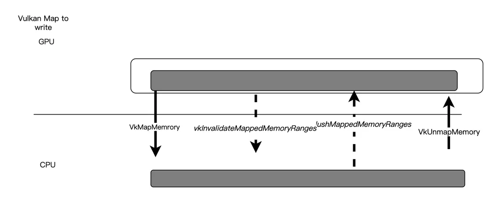

如果使用Coherent方式，在`VK_MEMORY_PROPERTY_HOST_VISIBLE_BIT｜VK_MEMORY_PROPERTY_HOST_COHERENT_BIT`的heap上创建内存，则不需要上面的flush和invalidate操作，但是还是需要把内存map出来操作，但是Host的读写会直接影响到device的内存

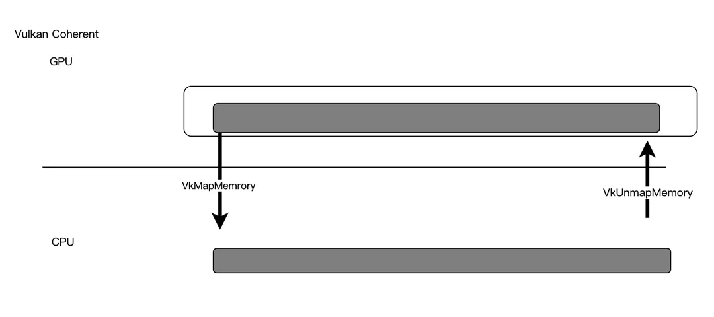

如果使用shadowed方式（多数移动端可能不支持，也不推荐），在`VK_MEMORY_PROPERTY_HOST_VISIBLE_BIT｜VK_MEMORY_PROPERTY_HOST_COHERENT_BIT`的`heap｜VK_MEMORY_PROPERTY_HOST_CACHED_BIT` 上或者是`VK_MEMORY_PROPERTY_HOST_VISIBLE_BIT｜VK_MEMORY_PROPERTY_HOST_CACHED_BIT`的heap上创建内存，也就是说这个内存可以同时使Coherent和Shadowed的，如果同时是Coherent那么访问方式同上面的Coherent，否则访问方式同map，但是这里的CPU访问要更快，因为Host一侧会存在一个Cache，当然也存在一个内存开销。

虽然Vulkan下面对Buffer和Image都可以用相同的VkMapMemory来进行CPU的写入，但是对于Image数据来说，因为其存在特殊的格式和对其规则，直接的内存写入是比较困难的，一般还是通过先将CPU数据写入到Buffer，再用 vkCmdCopyBufferToImage这样的API 从Buffer拷贝到Image的方式，因为这种API中可以指定待写入的image范围，mip等信息。同理对Image做CPU读取，也是一般先用vkCmdCopyImageToBuffer，再从Buffer中读取。

**Gles**

Gles上对于CPU-GPU的同时读写从驱动上为我们做了很多封装，用一些枚举给了我们一些策略选择，我们面对一个高度封装的策略时，就反而需要弄清楚不同策略下的性能问题，同时正因为这些策略参数，反而让gles的cpu读写规则显得更加复杂。

首先是Buffer的CPU读，gles只有map方式，使用

```c
void *glMapBufferRange( GLenum target,
  GLintptr offset,
  GLsizeiptr length,
  GLbitfield access);
```

将buffer的一部份内存map出来，map出来的内存既可以进行读写，通过 FlushMappedBufferRange将写入的内存通知给Device，不过同vk不同的是，map之后device上对内存的修改没有接口再反馈给Host，你需要重新unmap，map。

这里的access非常重要，它决定了这个内存是否可写，flush的机制，以及同步机制。

  * 读和写
    * `MAP_READ_BIT` ：可以被CPU读
    * `MAP_WRITE_BIT`: 可以被CPU写
  * flush机制
    * `MAP_FLUSH_EXLICIT_BIT`:同`MAP_WRITE_BIT`连用，标记这个内存CPU写入之后必须调用flush才能同步到device，如果没有这个标记，unmap会自动出发flush。
  * 同步机制

默认情况下，gles在map之前会等待GPU上所有对当前buffer的读写操作完成，也就是自动为我们做了一个GPU-CPU同步，因此这个API很有可能在CPU上造成block影响性能（你需要考虑使用下一小节提到的new-and-copy或者double buffer策略来优化性能）。

但是我们可以设定如下标记来不使用这个同步，这种情况不会卡住CPU，但是我们要自己保证逻辑正确。

  * `MAP_UNSYNCHONIZED_BIT`
  * `Invalidate优化`

在map的时候，API可以暗示硬件这段内存已经被HOST标记且马上要被HOST改写，不需要继续维护这段内存的内容，提升性能。

  * `MAP_INVALIDATE_RANGE_BIT`: 同`MAP_WRITE_BIT`连用，标记这段被map的内存的内容完全失效
  * `MAP_INVALIDATE_BUFFER_BIT`: 同上面标志类似，只是标记整个buffer都失效了。

我们还要注意的是map返回的这段内存地址只能被直接读取，写入，不能作为地址传给其他API继续使用（如glbufferdata）。

对buffer的CPU写入除了上面提到的map方法之外，gles还提供两个API。

  * glBufferData，即buffer的初始化API，buffer初始化时可以指定一个cpu上的内存地址， 将其copy到gpu上，因为这个是初始化的时候调用，所以不用考虑CPU-GPU同步的问题。另外glBufferData也可以反复的对一个buffer调用，以重新写入这个buffer内容，这时候使用glBufferData而不是glMap可能会带来一个性能优化，如果你确定这个buffer内容已经立即无效了，glBufferData将不考虑任何同步，直接使当前buffer全体内容标记为失效，立即重新写入。
  * glBufferSubData，可以将Buffer的特定区段内容更新。 有了glmapbuffer，为什么还定义这个函数？它相当于为更新buffer这件事情做了一个更加简便的函数，使用map我们需要完成map,copy,flush,unmap的一系列操作，这个就更加简便，且不用考虑同步问题，驱动会在何时的时候将cpu数据更新到device。不过从性能考虑出发，如果是对一个buffer做连续的更新，尤其是较大的buffer，那么将其map下来被认为是效率更高的。

**gles 上buffer被CPU访问的其他优化**

直观上gles只提供了map这一种CPU读写的方式，但是gles在调用对buffer做初始化的API

```c
void glBufferData( enum target, sizeiptr size, const void *data, enum usage );
```

的时候，其中传入的usage这个枚举值其实暗藏了让硬件对buffer的CPU读写做更多优化的可能，但是无论这个值传入什么，都要清楚这个值只是一个给驱动实现的hint，不是必然会发生的。

这个值有如下定义：

  * `STREAM_DRAW` :cpu只会初始化写入一次，然后被GPU使用一些次数但又不是很频繁，这可能暗示驱动用类似device only的方式去优化。
  * `STATIC_DRAW` :cpu只会初始化写入一次，然后被GPU使用大量次数，多数用于渲染绘制的buffer，这可能暗示驱动用类似device only的方式去优化。
  * `STREAM_READ` :这个内存会从gpu上copy数据初始化一次，然后被cpu读一些次数，用于cpu回读的buffer，这可能暗示驱动在host一侧cache这个数据。
  * `STATIC_READ`::这个内存会从gpu上copy数据初始化一次，然后被cpu频繁读取，用于cpu回读的buffer，这可能暗示驱动在host一侧cache这个数据。
  * `STREAM_COPY` :这个内存会从gpu上copy数据初始化一次，然后被gpu使用一些次数，用于来自copy数据的用与GPU绘制的buffer，这可能暗示驱动用类似device only的方式去优化。
  * `STATIC_COPY` :这个内存会从gpu上copy数据初始化一次，然后被gpu频繁使用，用于来自copy数据的用与GPU绘制的buffer，这可能暗示驱动用类似device only的方式去优化。
  * `DYNAMIC_DRAW` :这个内存可能反复的被CPU写入，又被GPU频繁读取，这是一个更新频繁的绘制用的buffer，这可能暗示驱动用类似map或者shadow的方式去优化。
  * `DYNAMIC_READ` :这个内存可能反复的GPU上copy得到数据，又频繁的被CPU读取，这是一个频繁用于CPU查询的内存数据，这可能暗示驱动用类似map或者shadow的方式去优化。
  * `DYNAMIC_COPY` :这个内存可能反复的GPU上copy得到数据，又频繁的被GPU使用，这是一个频繁的从另外一个buffer获得内容的用于绘制的buffer，这可能暗示驱动用类似device only的方式去优化。

对于buffer的CPU读写一定要注意选用合适的access和usage参数。

**gles对Image的读写**

Gles上使用glTexImage*D来从CPU写入Texture数据

Gles上没有一个简单直接的机制让CPU读取Image的数据，但是提供了接口glReadPixels读取Framebuffer上的数据回内存。glReadPixels又是一个会强行同步当前整个GPU指令完成的函数，性能消耗较大。

所以对于一般Image的cpu读取，如果是支持作为RT类型的Texture，可以先通过前面章节描述的将其attach 到framebuffer或者copy到RBO，在通过glReadPixels读回，而非RT类型的Texture没有运行时方法，因此gles上做CPU读Image不是常规操作，应用应该在CPU一侧做好cache。

##### **4.3.3.3 CPU-GPU的读写同步**

前面提到的所有CPU读写Device内存的API都不会考虑当同GPU共同访问时的读写同步问题。这些API一般都不是指令缓存形的，都是立即被执行的。

所以你都需要完全自己保证资源不同时被CPU和GPU同时访问，如果你不保证，那么内存上的内容就是不被保证的。你需要保证：

  * CPU 读时，之前提交的所有会产生的GPU对这块内存写入的操作都已经被执行完成。
  * CPU写时，之前提交的所有会产生的GPU对这块内存写入和读取的操作都已经执行完成。

如下图，这种cpu侧的write在之前一个gpu的read之后发生，那么一般都需要在前面的操作之后加一个barrier（vk上的fence/semaphore，metal上的sharedevent，gles上的SyncObject），等cpu测等待到这个barrier之后才能去write。

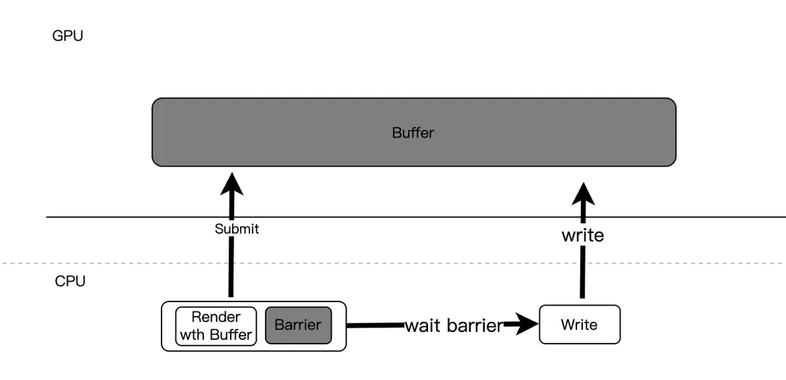

当然有时为了避免CPU产生这种等待，有也可以创建一个新的buffer共CPU写入，然后写入后，加一个GPU上的buffer copy指令推入指令缓存（当然中间要加一个barrier保证指令执行顺序），那当GPU用完老的buffer后，自然将其copy到老的buffer上，本文称为New-and-Copy策略，这种也是典型空间换时间的策略。

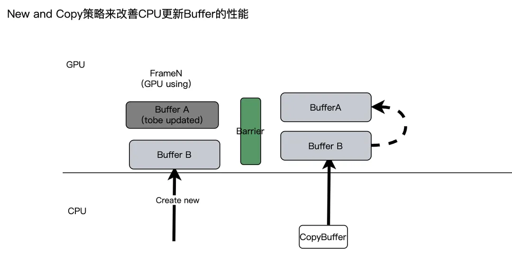

有时如果这种CPU的修改是每帧连续进行下去的，还可以选择使用双缓存策略，如奇数帧CPU往buffer A写入，GPU读bufferB，偶数帧CPU往buffer A写入， Gpu读buffer B，GPU的读总是延迟一帧。

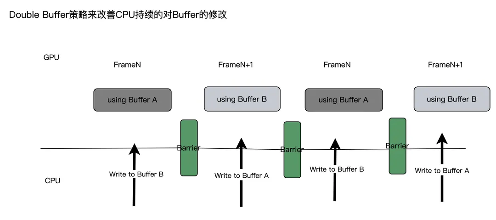

### **4.4 Pixel Format**

Buffer内存因为是一段简单的某种基本类型的数组，所以它的组织形式可以不多做讨论，但是Image内存都有其特定的数据组织格式，也就是我们通常所说的贴图格式，由于这个格式对于device上内存的组织和操作也很重要，比如前面在讨论image之间的GPU拷贝时，提到过需要遵循image格式的相互适配性，我们需要专门讨论下各个平台上Image的格式问题。

#### **4.4.1 Pixel Format**

在API中，对于image的内存格式，一般会抽象出一个范围更大的概念，pixel format，因为它不仅仅用于表达Image的格式，还用与和image数据传输行为等涉及到的格式概念。

Pixel Format通常由data type和format 两个属性组成：

##### **4.4.1.1 data type**

它用来描述传输时这个单位数据被看待成什么类型，是一个int的数组？还是float的？data type 还可以进一步分成两种

**基本类型**

包括`UNSIGNED_BYTE/ BYTE/HAL_FLOAT/FLOAT/UNSIGNED_SHOT/INT/...`等这种基本的数据结构，byte是1字节，half和short是2字节，int和float是4字节。

**packed 类型**

这些type虽然逻辑上是多个通道数据，但是存储上被pack到了一个单位数据，如以下这些

  * pack成一个ushort，如rgb565，rgb4444
  * pack 成一个unit，如bgr10a2,depth24stencil8,rg11b10float,rgb9e5float等

在上述pack的数据中，每个单个通道数据都会被解释成一个无符号整数，除了一些特例会解析成float

  * depth24stencil8中第一个24位解释成float
  * rg11b10float中每个通道解释称10或11bit的float
  * rgb9e5float的每个通道解释成一个浮点数，尾数有9bit，公用了一个5bit的指数

注意没有特殊说明的如bgr10a2解析出来的依然是无符号整数

##### **4.4.1.2 format**

这个是最终用来描述一个pixel的内存占用情况，要表达：

  * 它由那些通道组成，即是几个元素的数据
  * 每个通道元素占的内存大小

format同date type不是同一个概念，举个gles上的例子：

RGBA8是一个format，它的data type是unsigned byte，说明它的数据存储按照ubyte看待，每个pixel由4个通道组成，每个通道都是一个ubyte，读取一个像素等于跨越4个ubyte。

RGB10_A2UI是一个foramt，它的data type则是`USIGINED_INT_10_10_10_2_REV`。说明他的数据存储是一个packed成32bit的int，但是会被拆成10，10，10，2四个部分，而它的每个pixel是由4个通道rgba组成，其中RGB对应3个10bit的定点数，A对应2 bit的定点数。

每个format都会有它对应的特定的data type。

format基本分成两大类：

  * 非压缩 format
  * 压缩格式的format

不同的GPU和驱动实现可以支持硬件上的压缩格式的pixel fomat，如ASTC.

压缩格式的pixel format和普通的pixel format稍有不同：

  * 它的data type全都是ubyte,即数据统一被看作是单字节数据
  * 额外带有block width/height属性，表示一个压缩单元的像素尺寸。

API规范中会定义一些基本需要支持的压缩类型 pixel format，但是不同的硬件实现一般会支持更多。

##### **4.4.1.3 pixel数据的解释**

一个数据可能被存储成byte,float,int等各种基本形式，但是对于GPU来说，最终会如何解释他们？基本有以下几种情况

  * 解读成浮点数：对各种bit数的float来说，直接解读成浮点数
  * 定点数转化到浮点数：对于大部分的byte类型数据，他们其实是定点数，最终回被gpu解读成归一化的一个浮点数，注意16bit和24bit的depth也是定点数，在命名上，一般会对于归一化到-1-1之间的称为snorm，对于归一化到0-1之间的定点数称为unorm或没有特殊后缀
  * 解读成整数：int/uint类型
  * 解读成Indice：索引，一些以byte存储的数据，例如STENCIL
  * gles上还存在LUMINANCE类型的数据（也使用byte存储）

#### **4.4.2 GPU对pixel 数据的读取流程**

我们知道对于GPU来说，它只认识Image的RGBA四个通道，外加DEPTH STENCEIL两个特殊通道，那么当上面的某个pixel format的数据进入GPU之后，是如何正确的被解析到RGBADS这6种通道上的？大致经历如下4个过程：

  * unpack：如果是pack类型的data type，要先unpack出每个单独的数据（unint 或float）
  * convert to float：到这一步之前，所有数据可能是如上所说的浮点数/定点数/interger/Indice/LUMINANCE中的一种，如果是浮点数和定点数，被根据各种bit位的浮点数解释称gpu上的浮点数类型（一般只有float和half）
  * convert to RGB:如果当前是LUMINANCE类型，要按照规则转成RGB通道，到这一步之后，所有的数据都是RGBADS通道上的float/half/int/indice/float+indice
  * FInal to RGBA：对与DS通道的数据，保持当前数值不变，对于其他数据全部补成RGBA通道的数据，缺少RGB中的通道，用0补上，缺少A中的通道，用1不上，此步骤之后，所有数据都是要么RGBA的float/half/int，要么是 deppthstencil的float/indice，是GPU能够认识的数据。

如下图展示了一个`UNSIGNED_INT_10F_11F_11F_REV`类型的数据读取到gpu的流程。

当然gpu对数据的写入存储按照类似的相反流程进行。

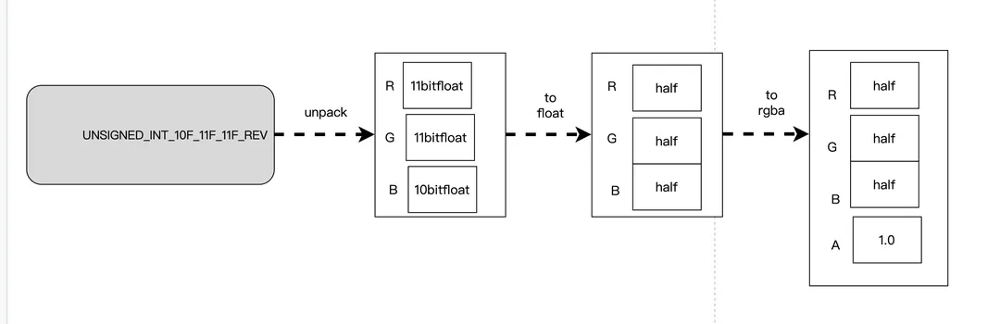

#### **4.4.3 Pixel format的应用范围**

API中定义的所有的pixel format 不是完全都能作为Image的格式来使用，他们用于image或者image的数据传输相关的API中

**可作为Image格式的pixel format**

可以作为image格式的pixel format仅仅是所有pixel format中的一个子集，不同的API要查询其版本的具体文档，但是绝大部分是支持的

**可被用在Framebuffer上的pixel format**

无论是以texture还是renderbuffer的形式提供给framebuffer渲染，它的格式就要进一步受到限制，这样的pixel format又是上面可作为Image的 pixel format中的子集，且不包括所有的压缩格式，具体要查阅相关API文档（一般会表明pixel format是否可以作为color rt或者depth stencil rt)

这些format的集合的关系大致如下：

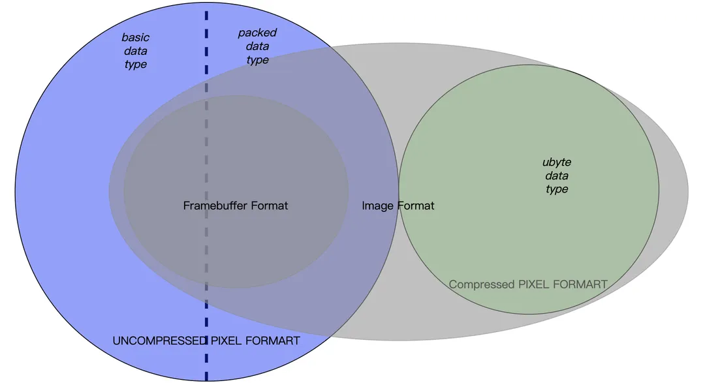

在vulkan中，使用 vkGetPhysicalDeviceFormatProperties 可以查询某个具体format的适用范围等特性

在metal中，一般要查阅Metal-Feature-Set-Tables的文档来获得metal上每个pixle format的特性

在gles中，要查询gles的spec文档中Correspondence of sized internal color formats 的表格。

#### **4.4.4 平台API中pixel format的定义**

**Vulkan**

Vulkan上使用VkFormat来定义pixel的format，使用类似 `VK_FORMAT_{component-format|compression-scheme}_{numeric-format}` 的命名规范。

**Metal**

Metal上使用枚举类型MTLPixelFormat来定义，其中按照普通类型，packed类型，压缩类型，depthstencil类型等分成了几个部分

**Gles**

gles上的pxiel format定义比较复杂，首先这个format在gles上应该被称为Sized Internal Format。因为gles上format要分成两部分：

  * Base Internal Format（有时用作参数时也叫做format）

它表示每个像素的基本布局，不考虑每个像素的位数，表达了通道数目和每个通道的意义有以下几种：

  * `RGB/RGBA/RG/RED`
  * `RGB_INTERGER/RGBA_INTERGER/RG_INTERGER/RED_INTERGER`
  * `DEPTH_COMPONENT`
  * `DEPTH_STENCIL`
  * `STENCIL_INDEX`
  * `LUMINANCE_ALPHA`
  * `LUMINANCE`
  * `ALPHA`
  * `Sized Internal Format（有时用作参数时也叫做internalformat）`

他表示基于Base Internal Format扩展出来的format，他们通常包含每个通道的位数和type信息，Sized Internal Format就是是我们通常所说的texture的格式。

gles上只有特定的type, base internal format, sized internal format这三者的结合才是合理的，gles上所有合理的pixel format要参考spec中 Valid combinations of format, type, and unsized inter- nalformat 的那张表格。

gles上的多数API需要使用pixel format的时候，都需要提供的是这个sized internal format 。

### **4.4 内存Alias**

#### **4.4.1 内存的复用问题**

在渲染流程中，我们经常会产生较多的临时性资源（transition resources），这些资源生命期只局限在某一帧的某一个时刻，但是却要占用较多的内存分配，我们希望能够复用这些资源。

例如在如下的流程中，有3个pass，每个pass需要用到的RT资源和其生命周期如下：

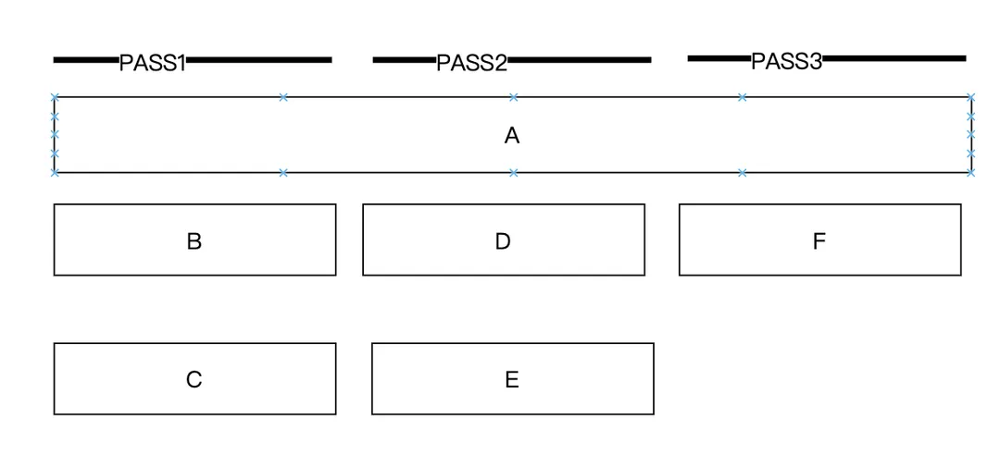

A需要一直被使用，BCDEF都是阶段性的被使用，我们最常用的做法是做一个RT池，反复利用相同尺寸格式的RT，这叫做

**High-level 资源复用**

例如其中的C和E是相同尺寸格式的RT，当CPU 编码pass1之后，将C回收回池，当开始编码pass2的时候，直接把C捞出来当作E放在Pass2上。

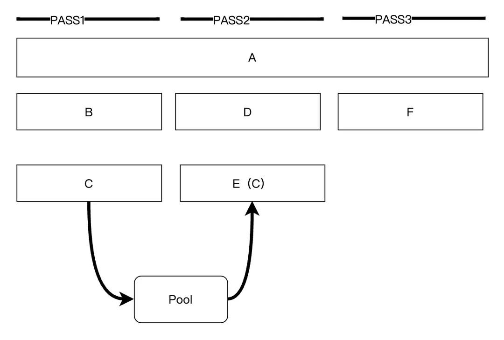

这样减少了E的内存占用。

但这个方式只能对尺寸规格完全一致的贴图起作用，如果对于大量的不一致的贴图则无能为力。对于Vulkan和Metal来说，都提供了更低级的资源复用方式，也叫做memory aliasing，它在内存的角度进行复用

**low-level 资源复用**

Alias的意思是一块内存可以同时绑定给多个GPU资源对象，只要这些对象能够对当前的内存解释的通，且不发生同时的读写冲突，上面的例子就会变成如下，虽然我们逻辑上还是分配了这么多对象，但是很有可能BDF overlap了同一快内存，CE也overlap的同一块，只是他们的生命周期不一样，所以互不冲突。

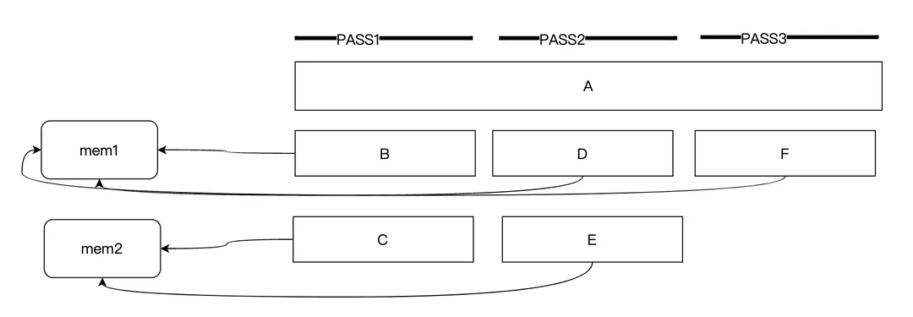

#### **4.4.2 平台实现**

**Vulkan**

Vukan的实现比较直接，因为Vulkan上的texture 和buffer对象必须显示的调用mapmemory通资源对象VkMemory绑定，因此可以直接将多个对象绑定到相同的VkMemory上。甚至这里可以是buffer和texture混合的alias。

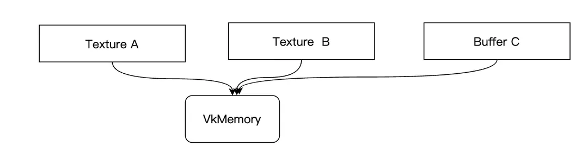

  * 单独访问

对于alias的memory，如果你不考虑对同一份内存，多个对象都可以同时解释的情况，例如上面的渲染管线的例子，那么没有太多限制，只要用barrier等机制保证不同时访问就行

  * 共同访问

如果多个对象可能同时解释一份数据，有一些限定：需要是buffer，或者linear tilling mode的并且处于preinitialized和genral的layout下的Image，并且他们对数据的解释相同，并且要设置image的创建flag `VK_IMAGE_CREATE_ALIAS_BIT`

上面的例子在Vulkan下，直接将BDF，CE分别用VkMapMemory到同一个VkMemory上就行了

**Metal**

Metal下，需要首先保证资源是从MetalHeap创建的，创建好后，调用它的makeAliasable（）标志着它可以被其他Resource复用内存，一旦变成aliasable之后不可逆。

这个机制可以解读成：

  * 资源必须用MetalHeap创建，而不能直接从MTLDevice创建。
  * 一个对象被标记成aliasable之后，其内存只能再被overlap一次，如果需要多次overlap，那需要在后面的资源上再次调用makeAliasable
  * 我们不能直接指定哪些对象overlap到哪个内存上，只能通知某个对象的内存可以被其他对象占用，如同它的内存被丢进回收池一样

所以在这个机制下，你需要能够自己规划好那些能够互相overlap的对象让他们在同一个heap上，不同的heap是相互不能overlap的内存。我们需要把生命周期一致的对象放在一个heap中。

在上面的例子中，需要分配两个Heap，一个Heap创建A，因为它通其他所有资源有交叠，再另外一个Heap复用BCDEF，流程如下

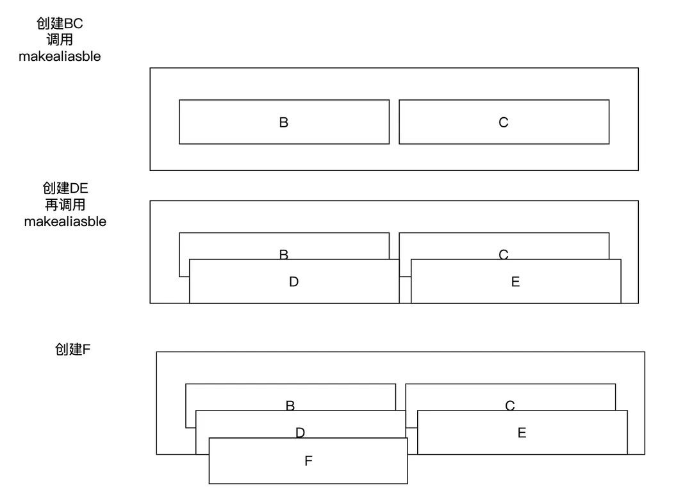

### **4.5 Sparse Resource**

在CPU上，虚拟内存可以远大于物理内存，因为虚存只在使用时才映射真正的物理内存，在GPU上，为了解决对超大资源的存储，也引入了类似的概念，这类超大资源叫做sparse resource。

#### **4.5.1 Sparse Bind, Residency, Alias**

Device上的正常资源对象，它需要在使用前就绑定给一个连续完整的分配好的内存对象。

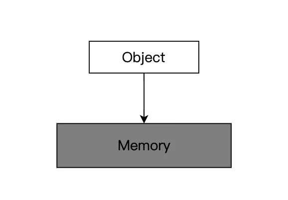

如果这个资源对象可以绑定在多个离散的已经分配好的内存对象上，我们就称它具有sparse bind能力。如一个Image它的不同的mip的不同的子区域的内存绑定给不同的memory。

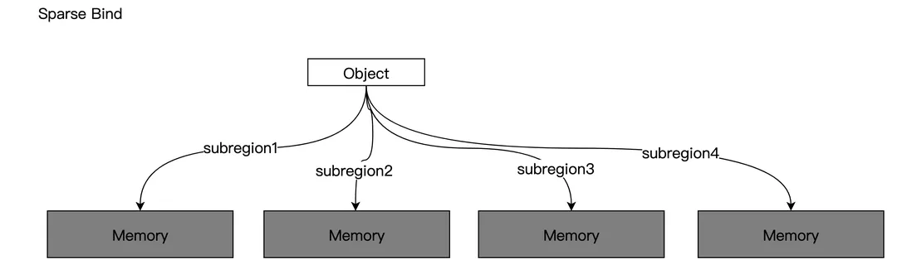

如果在上面的基础上，这个资源对象的某些区域可以不绑定一个内存对象，这个对象就可以被正常使用，且每个子区域可以动态的重新绑定内存对象，卸载内存对象，就称它具有sparse residency能力

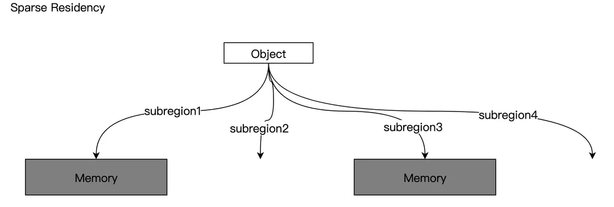

在residency的基础上，如果其中某些子区域的内存绑定可以复用（memory alias），复用范围包括单个资源内或者跨资源，那么就称它具有sparse alias能力。

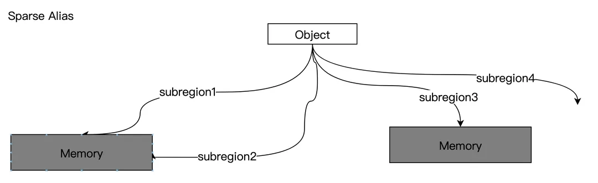

实际上我们至少需要Sparse Residency来实现我们的需求，例如我们把一张超大的贴图做成Sparse Texture，会根据运行时的需要，动态的bind和unbind你当前要访问部分的贴图内容对应的内存，这就是硬件级别支持的Virtual Texture。

#### **4.5.2 Sparse Resource的使用**

Sparse Resource可以帮助我们实现硬件级别支持的虚拟贴图（即不用自己软实现页表）等机制，使用Sparse Reousce的常用流程是，通常可以初始化不为他绑定任何memory，但是需要将资源做规划，拆分成N个子部分，并且能为每个子部分单独的map/unmap memory，当需要访问这个资源前，需要明确待访问的子部分范围，确保其对应的memory被map，而不被访问的子部分对应的memory可以被unmap节省内存。同时平台实现要能够保证及时访问到没有内存映射的区域也不会出错，可以返回特定值。

如下图是对一个spase texture 的常用访问流程。

Sparse Resource同CPU上虚拟内存的一个重要不同点是，Sparse Resource在unmap时不会负责备份数据到其他文件中，只是单纯的将内存释放，下次同一个区域的map之后需要重新填充这一块的数据。

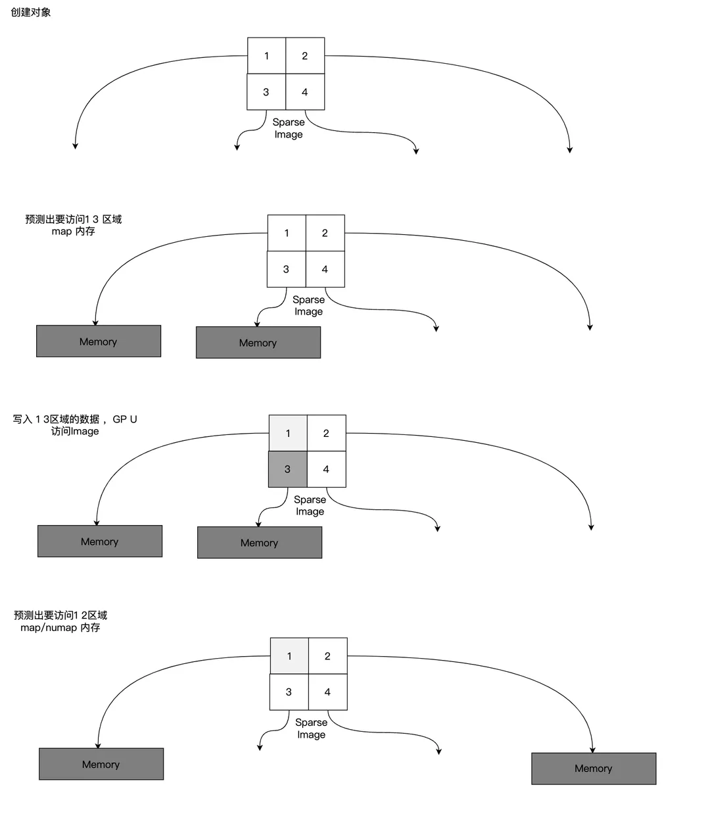

#### **4.5.3 平台实现**

**Metal**

在Metal中，只有Image对象能够支持Sparse Residency能力，buffer还不能。

需要从一个特殊的Heap类型创建

```c
MTLHeapDescriptor* descriptor = [MTLHeapDescriptor new];
descriptor.type = MTLHeapTypeSparse;
sparseHeap = [_device newHeapWithDescriptor: descriptor];
id<MTLTexture> sparseTexture = [_sparseHeap newTextureWithDescriptor:textureDescriptor];
```

SparseTexture的基本划分单位是tile，tile是一个mip上的一块子区域，获取特定格式贴图的一个tile能装下多少pixels，可以使用`[_device sparseTileSizeWithTextureType]`查询

Map和Unmap操作：

Sparse Resource的Map和Unmap操作都不是立即执行式的API，都需要写入到指令流缓存里面，发送给gpu执行。这里encoder指令也需要一个特殊的encoder MTLResourceStateCommandEncoder，它的接口是

```c
- (void)updateTextureMapping:(id<MTLTexture>)texture 
                        mode:(const MTLSparseTextureMappingMode)mode 
                      region:(const MTLRegion)region 
                    mipLevel:(const NSUInteger)mipLevel 
                       slice:(const NSUInteger)slice;
```

其中的Mode有两种map和unmap

region，miplevel，slice则指定了操作的子区域。

对于unmap的区域的GPU读取将得到0，写入则会被忽略。

通常一些很小的mip可以合并起来共用一个tile，叫做tail mipmaps，如果上面的miplevel设置为texture.firstMipmapInTail，那么整个tail的mip会作为集体一起map/unmap

**Vulkan**

在Vulkan中，对于Image和Buffer两种对象，根据硬件和驱动的能力，最多支持到sparse alias。首先需要查询VkPhysicalDeviceFeatures 来得到当前device对sparse resource的支持程度，如sparseBinding 、sparseResidencyBuffer 、sparseResidencyImage2D、sparseResidencyAliased 等

Vulkan需要使用带有`VK_QUEUE_SPARSE_BINDING_BIT`的queue来记录sparse resource相关的操作，有一个API用来做map和unmap

```c
VkResult vkQueueBindSparse(
    VkQueue                                     queue,
    uint32_t                                    bindInfoCount,
    const VkBindSparseInfo*                     pBindInfo,
    VkFence                                     fence);

typedef struct VkBindSparseInfo {
    VkStructureType                             sType;
    const void*                                 pNext;
    uint32_t                                    waitSemaphoreCount;
    const VkSemaphore*                          pWaitSemaphores;
    uint32_t                                    bufferBindCount;
    const VkSparseBufferMemoryBindInfo*         pBufferBinds;
    uint32_t                                    imageOpaqueBindCount;
    const VkSparseImageOpaqueMemoryBindInfo*    pImageOpaqueBinds;
    uint32_t                                    imageBindCount;
    const VkSparseImageMemoryBindInfo*          pImageBinds;
    uint32_t                                    signalSemaphoreCount;
    const VkSemaphore*                          pSignalSemaphores;
} VkBindSparseInfo;
```

这个API不是通过记录在cmdbuffer中的方式，而是直接将这个操作提交给queue，这不是一个command的record操作，而是一个submit操作。

此外这个操作不保证GPU上的执行顺序，因此相关的资源依赖的操作必须同这里的fence和semaphore做同步。

另外同这个API绑定的buffer或image创建时必须要有flag `VK_IMAGE/BUFFER_CREATE_SPARSE_BINDING_BIT`，另外如果为了支持sparse residency，还要有flag `VK_IMAGE/BUFFER_CREATE_SPARSE_RESIDENCY_BIT`

API里面的VkSparseBufferMemoryBindInfo、VkSparseImageOpaqueMemoryBindInfo、VkSparseImageMemoryBindInfo都是包含了sparse map和unmap的信息，分别用于buffer和两种情况下的image

  * Buffer里面描述buffer的每个子区域的内存绑定

```c
typedef struct VkSparseBufferMemoryBindInfo {
    VkBuffer                     buffer;
uint32_t                     bindCount;
const VkSparseMemoryBind*    pBinds;
} VkSparseBufferMemoryBindInfo;

typedef struct VkSparseMemoryBind {
    VkDeviceSize               resourceOffset;
    VkDeviceSize               size;
    VkDeviceMemory             memory;
    VkDeviceSize               memoryOffset;
    VkSparseMemoryBindFlags    flags;
} VkSparseMemoryBind;
```

  * fully-residency image

即这个image不支持sparse residency，那么他相当于需要预先绑定到一块连续的内存对象上才能被使用的

这个绑定信息描述为结构

```c
typedef struct VkSparseImageOpaqueMemoryBindInfo {
    VkImage                      image;
    uint32_t                     bindCount;
    const VkSparseMemoryBind*    pBinds;
} VkSparseImageOpaqueMemoryBindInfo;
```

这里传入的参数类似Buffer

  * partially-residendy image

即这个image支持sparse residency，他可以对每个子区域动态绑定内存对象，这个绑定信息描述为

```c
typedef struct VkSparseImageMemoryBindInfo {
    VkImage                           image;
    uint32_t                          bindCount;
    const VkSparseImageMemoryBind*    pBinds;
} VkSparseImageMemoryBindInfo;
typedef struct VkSparseImageMemoryBind {
    VkImageSubresource         subresource;
    VkOffset3D                 offset;
    VkExtent3D                 extent;
    VkDeviceMemory             memory;
    VkDeviceSize               memoryOffset;
    VkSparseMemoryBindFlags    flags;
} VkSparseImageMemoryBind;
```

上述参数中如果传入的VkDeviceMemory为null，则表示unmap

这个传入的参数可以描述每个子区域绑定的meomory。

**如何计算出来每个子区域需要占用的内存大小？**

对于Buffer和fully-residency的Image来说，这个子区域的大小时固定的，通过查询内存大小的接口vkGetImageMemoryRequirements/vkGetBufferMemoryRequirements 中的

VkMemoryRequirements::alignment 从系统中查询到，它即是对齐大小，也是块的大小。

对于partially-residency的image，通过 vkGetImageSparseMemoryRequirements 查询，它将返回一组VkSparseImageMemoryRequirements，每个表示这个image的其中一个aspect（指depthstencil这种两个逻辑image放在一起的情况）上的每个mip的子区域大小。

### **4.6 Metal Purgeable Resource**

对于Texture和Buffer这种资源对象，因为涉及到较大的内存分配和释放负担，我们常常需要在应用中使用各种池机制来复用，以减少他们的内存分配，释放操作。

在metal的框架内，它额外在底层给我们提供了一个特殊的内存池机制，使应用可以直接使用。

其实相当于Metal在操作系统范围内提供了一个内存池，它维护所有的MtlResource对象（mtlbuffer，mtltexture），应用通过API往里面回收和捞取资源对象，这提供了两个好处：

  * 系统为我们实现了池的管理策略，何时收缩池，何时扩张池，且策略同当前操作系统的总体情况有关。
  * 处于池中被回收的资源不计入具体APP的footprint，即你没有实际使用的资源再多也不会导致APP的out-of-memory，因为操作系统知道何时去释放这些没有的资源

Metal这套内存池的机制叫做purgeable resource，具体使用方法如下：

MTLResource有一个属性purgeable state，他可能是三种状态：

  * Volatile：该内存资源是暂时不被使用的，系统将在内存吃紧的时候回收掉它，使用这种类型资源前要查询该资源是否已经无效了（变成empty状态）。
  * Non_volatile：该内存资源一直有用，不能被回收
  * Empty：该内存资源明确不用了，需要立即释放。 

当我们不用这个资源就把他标记为volatile的，相当于回收进入池；

我们想用就从池拿出来，判断它是否为empty，这里有两种可能，需要先判断是否已经被释放，如果被释放了就重新创建，否则就能直接用，并且将其标记成`non_volatile`

这里面涉及到的API只有一个setPurgeableState，可以设置上面3中状态，如果传入KeepCurrent,则为查询当前的state。

如下图是 APP使用系统内存池的过程。

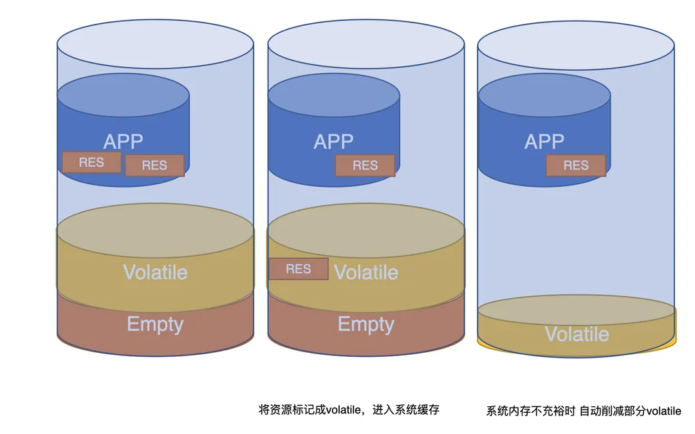

Buffer和Texture只是用户直接可操纵到内存的图形API对象，实际上Device上还有许许多多种对象，本章节的重点在内存操作这一侧的事情，下一章节将详细讨论这些对象及其在管线中如何被使用。

<hr/>

#### <p>原文出处：<a href='https://km.woa.com/articles/show/606262' target='blank'>移动端图形API通讲（三）--管线、数据和绘制指令</a></p>

> | 导语 距离第一章时隔一年终于完成了第三章...前面系列文章讨论了CPU通过提交渲染指令给GPU控制其工作，以及图形API中常用的数据结构，GPU上内存的分配方式，这里我们集中在GPU内部，探讨GPU本身是如何工作的，以及具体的这些控制其工作的渲染指令的设计。

## 五、管线

GPU专门为多数据单指令的计算而优化，因此GPU的硬件上存在专门的设计，它对处理的数据，和对数据的处理方式存在专门的约定，这种专门的约定意味着我们不能像处理CPU上C++编程一样随意的写代码逻辑，而是要遵循他的约定，按照约定调用图形API来完成。这就是GPU的管线。GPU管线即包括为了绘制出一张Image的渲染管线，也包括为通用性并行计算而设计的计算管线等。

### 5.1 管线的整体结构

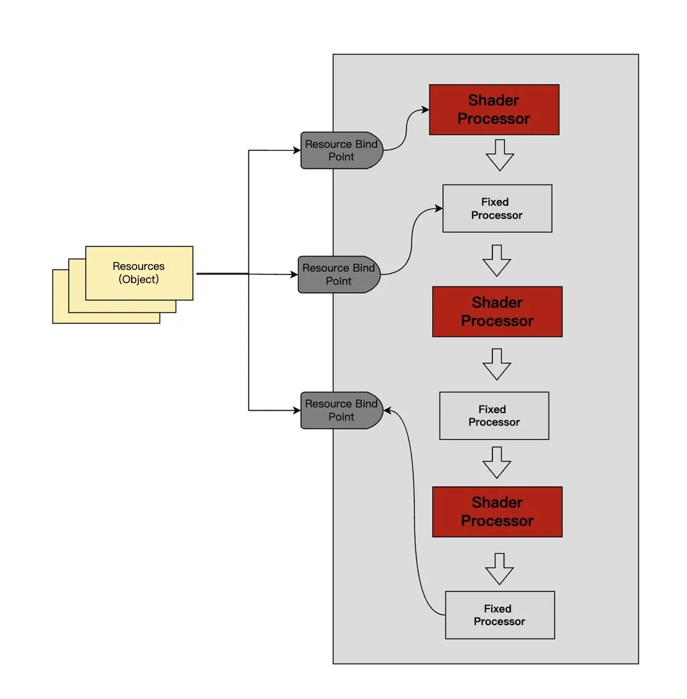

上图展示了GPU管线的最粗略的样子，它是一个由若干个处理节点按时序连接而成的数据处理系统，数据经过这个管线被处理后输出另一种数据（图形管线的输出是将数据写入到frame buffer，而计算管线的输出是将数据写入到image或者buffer）。

这个管线至少包含4个部份：

● 可编程的处理模块

这些模块需要我们自己编写运行代码，即shader，然后设置到管线上

● 固定的处理模块

这些模块是硬件固化的，我们不能改变逻辑，但是驱动暴露了很多开关和参数，允许我们调控

● 资源挂点

同CPU上的程序不同，目前主流的GPU管线上不能通过索引指针地址的方式访问资源，只能通过从固定的有限个数的资源挂接点处访问资源，一个资源若想被管线访问，必须
先讲它绑定到某个资源挂点上。

● 资源对象

那些需要被绑在资源挂点上的资源对象。虽然资源挂点数量有限，但是资源对象的创建数量并没有限制，因为我们可以切换资源的绑定。

从这4个部份也说明，我们若想通过API来操作GPU管线，通常要做以下4件事件：

● 设置管线的shader

● 调控固定管线的开关和参数

● 创建资源

● 绑定资源

以下分别讨论这四个问题再API上的实现。

### 5.2 管线的shader设置

#### 5.2.1 从 shader、program到pipeline

整个管线上是由多个可编程的shader组成的，一般把每一个单独的shader叫做一个shader，而把整个组成当前管线的这些shader集合叫做一个program。所以这里要先创建shader，再创建program。

我们一般从源码创建shader，这个过程叫做shader的编译，编译的结果shader一般会被表示成一个中间文件，他不能被执行，需要将当前管线上前后的所有shader放在一起再次进行链接才能产生最终可执行的机型特定的二进制文件，即program。

对于vulkan和metal来说，program的创建又通常需要知道其他的固定管线参数，所以在vulkan和metal上，有了shader之后，需要创建的是整个pipeline对象。

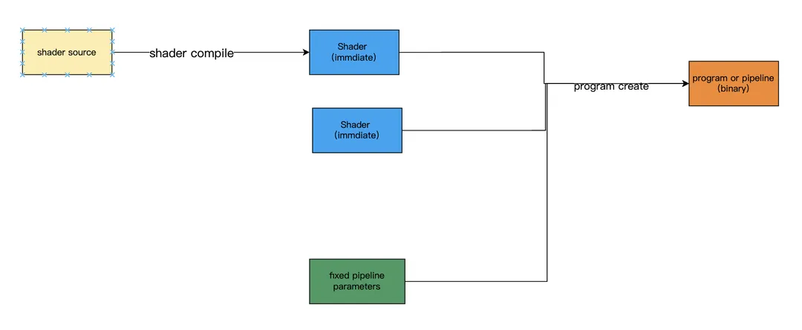

这样看来program的创建是一个耗时的操作，所以一些API都提供了直接从一个离线编译好的二进制文件直接创建program的操作，但是由于program一般是和机器强相关的machine code，所以binary文件不能跨机器使用，一般需要在当前机器上产生，下次复用在该机器上，而不能有一个跨机器通用的形式。

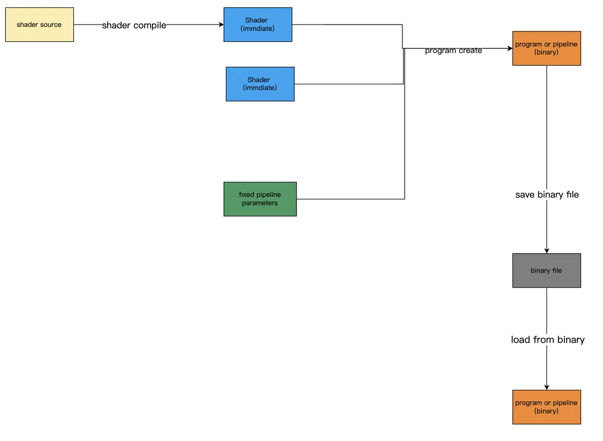

#### 5.2.2 shader的创建和编译

shader也是一种gpu上的对象，在使用之前需要先创建出来。

Gles下需先使用glCreateShader(type)先创建这个shader对象，然后用glShaderSource（）装填它的代码，最后用glCompileShader()将这个shader编译。

Vulkan下一般使用vkCreateShaderModule（）来创建并编译一个shader，参数里面需要指定shader的源码和类型，它产生的结果是一个VkShaderModule对象，代表一个shader。

Metal下的一个shader被称为一个MtlFunction，metal下为了优化一般把1个或多个mtlfunction打包再一起，称做一个MtlLibrary。我们需要先创建MtlLibrary，然后从这个libray创建MtlFunction。

使用Mtldevice的newLibraryWithSource接口可以从源码创建library，这个源码可以包含多个shader的source，再使用MtlLibrary的接口newFunctionWithName从里面找到相应名字的shader，创建成mtlfunction。

Metal下面允许直接通过接口newLibraryWithData加载一个已经离线编译好的二进制的mtllibrary文件，而不用运行时编译，且这个二进制文件因为只是中间文件，所以可以机型通用

**只有metal在shader编译这一层也提供了从二进制加载的方案。vulkan和gles只能在program/pipeline这一层提供了binary机制。**

metal的shader创建这一步稍微复杂，如图。

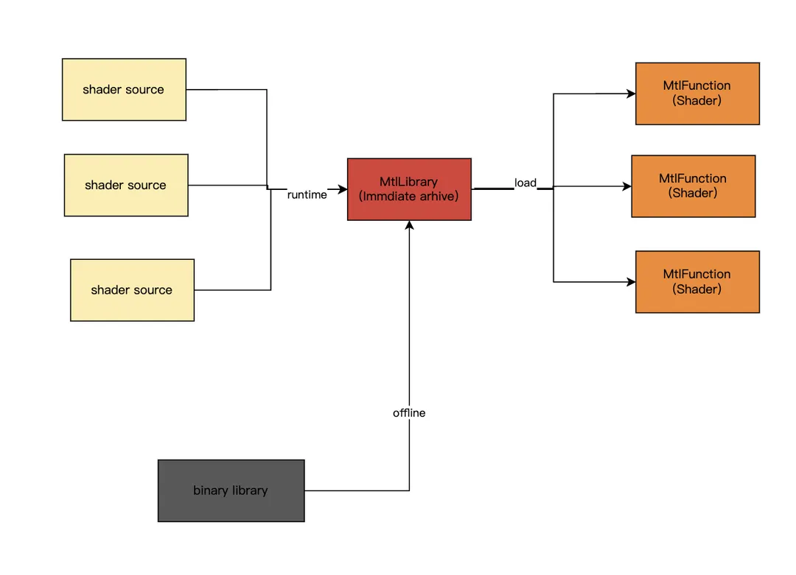

#### 5.2.3 创建Program或Pipeline

有了shader后，我们基于shader创建program，对于vulkan和metal来说，是联合其他固管参数创建pipeline。

Gles下，先使用glCreateProgram创建这个program对象，然后用glAttachShader往里加入shader，最后用glLinkProgram创建program。

Vulkan下，使用vkCreateGraphicsPipelines（或vkCreateComputePipelines）这个接口创建一个pipeline对象，传入的重要参数为VkGraphicsPipelineCreateInfo，它的定义如下

```c
typedef struct VkGraphicsPipelineCreateInfo {  
    VkStructureType                                  sType;  
    const void*                                      pNext;  
    VkPipelineCreateFlags                            flags;  
    uint32_t                                         stageCount;  
    const VkPipelineShaderStageCreateInfo*           pStages;  
    const VkPipelineVertexInputStateCreateInfo*      pVertexInputState;  
    const VkPipelineInputAssemblyStateCreateInfo*    pInputAssemblyState;  
    const VkPipelineTessellationStateCreateInfo*     pTessellationState;  
    const VkPipelineViewportStateCreateInfo*         pViewportState;  
    const VkPipelineRasterizationStateCreateInfo*    pRasterizationState;  
    const VkPipelineMultisampleStateCreateInfo*      pMultisampleState;  
    const VkPipelineDepthStencilStateCreateInfo*     pDepthStencilState;  
    const VkPipelineColorBlendStateCreateInfo*       pColorBlendState;  
    const VkPipelineDynamicStateCreateInfo*          pDynamicState;  
    VkPipelineLayout                                 layout;  
    VkRenderPass                                     renderPass;  
    uint32_t                                         subpass;  
    VkPipeline                                       basePipelineHandle;  
    int32_t                                          basePipelineIndex;  
} VkGraphicsPipelineCreateInfo;
```

可以看出一个pipeline的创建，不仅要设置shader，还要设置其使用的其他固定管线参数（文章后面会讲到）。

其中VkPipelineShaderStageCreateInfo stages这个结构里面就是要设置的所有shader的VkShaderModule。

Metal下使用MtlDevice的newRenderPipelineStateWithDescriptor（或newComputePipelineStateWithDescriptor）

接口来创建一个Pipeline，里面需要传入的重要参数是MTLRenderPipelineDescriptor，设置它的vertexFunction等变量来设置其所用的shader function。

#### 5.2.4 Program Binary

几乎所有API都能支持不经过前面的shader编译，link这两步，而直接从机型相关的二进制文件创建pipeline，这样效率是最高的。因为binary file是机器相关，所以都需要预先从当前设备上生成。（所以一些游戏上经常需要在首次启动时预先编译一些常用的programe/pipeline存储下来）

gles下面使用glGetProgramBinary获取一个program的binary 数据，保存后，下次使用glProgramBinary加载。

vulkan下面的binary文件保存的不只是program，而是整个pipeline，它已考虑一个叫做pipeline cache的机制。首先运行时需要通过vkCreatePipelineCache创建一个pipeline cache对象，然后在前面创建pipeline的接口vkCreateGraphicsPipelines中将此cache传入，即将pipeline同这个cache关联，通过vkGetPipelineCacheData可以获取这个cache中的所有pipeline的binary，可以保存下来。

复用的时候，调用函数是一样的，先vkCreatePipelineCache创建pipeline cache对象，只是其中的参数要传入之前的binary数据，后面创建pipeline的时候，将这个cache传入创建的API，就可以直接基于这个cache创建了。

Metal下面也是保存整个pipeline， 它的pipeline cache机制称作binary archive，这是一个IOS14以上才能支持的较新特性，首先第一次我们需要运行时调用MtlDevice的newBinaryArchiveWithDescriptor接口创建一个MtlBinaryArchive，然后使用它的API addRenderPipelineFunctionsWithDescriptor等将创建好的pipeline加入进去，最后用serializeToURL将binary file写出。

复用的时候，我们同样先用newBinaryArchiveWithDescriptor创建archieve，只是要将一个binary file的路径传入，等需要创建pipeline时，在上面原有的创建步骤基础上，对于传入的MTLRenderPipelineDescriptor，设置它的binaryArchives中包含这个archieve，这样就可以从这个archive中直接找到现有的binary复用了。

#### 5.2.5设置Program或pipeline

当programe/pipeline对象创建好后，需要设置给当前的管线。

gles下使用glUseProgram来设置

vulkan下使用 vkCmdBindPipeline将pipeline绑定

metal下使用 MtlRenderCommandEncoder的setRenderPipelineState函数设置

#### 5.2.6 Metal中的Dynamic Library

由于shader中也会像C++程序一样经常复用大量的代码（如一些公共函数等），而program的编译是一个个独立进行的，这些共用代码等于被反复重复编译了。为了解决这个问题,metal使用dynamic library机制将这些代码抽离出来，并允许动态加载，它自ios15以上支持。

首先我们将这些抽出来的shader代码打到一个单独的mtllibrary中，使用mtldevice的newDynamicLibrary函数从这个mtllibrary创建出MTLDynamicLibrary。（需要注意的是MTLDynamicLibrary名字虽然是library，其实是一个binary的code，所以它是机器特定的，不能跨机器使用），在创建pipeline的时候，需要将pipelinedescriptor的fragmentPreloadedLibraries中包含这个MTLDynamicLibrary以动态加载这个binary，这可以进一步提高链接生成pipeline的速度。

由于metal中设计shader和pipeline编译的概念众多，有时很难分清Binary Library，Binary Archive，Dynamic Library各自的作用，这里用一张图来直观表示

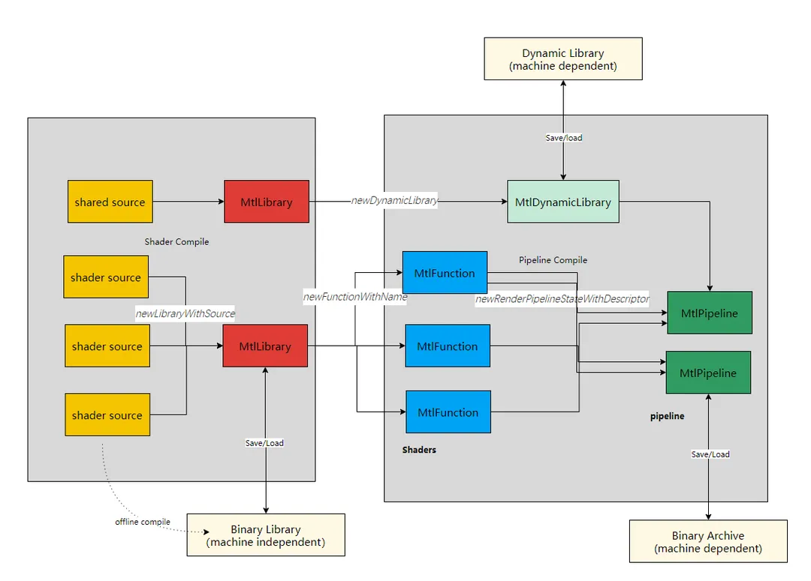

### 5.3固定管线参数设置

GPU管线上有着复杂而庞大的固定管线逻辑，这些逻辑是硬件和驱动预设好的，我们只能控制这些逻辑的开关和参数，而不能对其进行编程

#### 5.3.1 管线流程

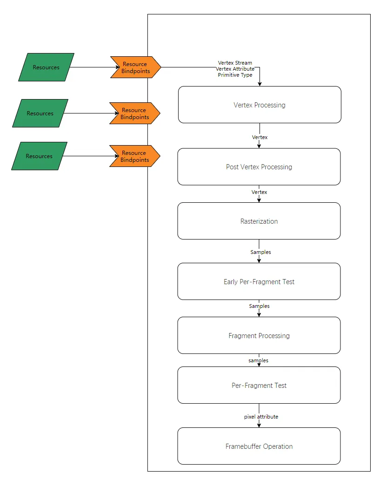

对于计算管线来说很简单，就一个单独的可编程的计算shader。

对于图形管线来说就复杂的多，可以分为以下几个大的范围阶段：

● Vertex Processing 顶点处理

● Post Vertex Processing 顶点后处理

● Rasterization 光栅化

● Early Per-Fragment Test 像素处理前的像素测试

● Fragment Processing 像素处理

● Per-Fragment Test 像素处理后多像素测试

● Framebuffer Operation 帧缓存上的像素操作

这里面的每一步都有很多的参数和开关供我们调整，后面我们将逐个介绍，在这之前，我们先介绍各大API如何设计对固定管线参数的设置API的。

#### 5.3.2 固定管线设置的API

对于固定管线参数的设置，一般有两种模式：

一是通过一个个独立的API去分别设置这些参数

另外一种是现代API使用的，将所有的固管参数（包括管线使用的shader）打包在一起，作为pipeline创建的参数，在创建pipeline时一起指定，这样固管参数同shader一起抽象出来的pipeline的数据，可以作为一个整体，进一步被序列化保存下来，可以被cache进行复用，这个pipeline也被称为pipeline state object （PSO）。

Gles只能使用分散的独立API设置

Vulkan和Metal都支持以整体的方式在创建pipeline的时候设置所有的固管参数，同时也还支持使用独立的API设置某个单独的参数。

Vulkan中创建pipeline的时候需要传入的VkGraphicsPipelineCreateInfo结构中包含了所有要使用的固管参数

metal在创建pipeline时传入的MTLRenderPipelineDescriptor也是类似的结构，但是metal的PSO（MTLRenderPipelineDescriptor)能包含的固管参数相比vulkan显得有限，还是有很多固管参数在metal上需要调用它的rendercommandencoder的相关API单独设置，而不能作为PSO创建的一部分。

如下是三大API可以设置的主要固定管线参数的对比

<table ><tbody><tr ><td>
<p><span></span><br></p>
</td>
<td>
<p><span></span><br></p>
</td>
<td>
<p><span>Gles</span><span></span></p>
<p><span>（单独API设置）</span><span></span></p>
</td>
<td>
<p><span>Metal</span><span></span></p>
<p><span>（封装在MTLRenderPipelineDescriptor的部分）</span><span></span></p>
</td>
<td>
<p><span>Metal</span><span></span></p>
<p><span>（只能通过encoder单独设置的部分）</span><span></span></p>
<p><span></span><br></p>
</td>
<td>
<p><span>Vulkan</span><span></span></p>
<p><span>（封装在VkGraphicsPipelineCreateInfo）</span><span></span></p>
</td>
</tr><tr ><td>
<p><span>shader/</span><span></span></p>
<p><span>program</span><span></span></p>
</td>
<td>
<p><span></span><br></p>
</td>
<td>
<p><span>glUseProgram</span><span></span><span>glProgramBinary</span><span></span></p>
</td>
<td>
<p><span>MTLRenderPipelineDescriptor</span><span></span></p>
</td>
<td>
<p><span></span><br></p>
</td>
<td>
<p><span>VkPipelineShaderStageCreateInfo</span><span></span></p>
</td>
</tr><tr ><td>
<p><span>Tessellation Control</span><span></span></p>
</td>
<td>
<p><span></span><br></p>
</td>
<td>
<p><span></span><br></p>
</td>
<td>
<p><span>TessellationFactor</span><span></span></p>
</td>
<td>
<p><span></span><br></p>
</td>
<td>
<p><span>VkPipelineTessellationStateCreateInfoT</span><span></span></p>
</td>
</tr><tr ><td>
<p><span>post vertex processing</span><span></span></p>
</td>
<td>
<p><span>viewport</span><span></span></p>
</td>
<td>
<p><span>glViewPort</span><span></span></p>
</td>
<td>
<p><span></span><br></p>
</td>
<td>
<p><span>setviewport</span><span></span></p>
</td>
<td>
<p><span>VkPipelineViewportStateCreateInfo</span><span></span></p>
</td>
</tr><tr ><td>
<p><span>rasterizaiton</span><span></span></p>
</td>
<td>
<p><span>Rasterization Enabled</span><span></span></p>
</td>
<td>
<p><span>glenable (RASTERIZER_DISCARD)</span><span></span></p>
</td>
<td>
<p><span></span><br></p>
<p><span></span><br></p>
</td>
<td>
<p><span>rasterizeEnabled</span><span></span></p>
</td>
<td>
<p><span>VkPipelineRasterizationStateCreateInfo</span><span></span></p>
</td>
</tr><tr ><td>
<p><span>sample shading</span><span></span></p>
</td>
<td>
<p><span>glenable（SAMPLE_SHADING）</span><span></span><span>glMinSampleShading</span><span></span></p>
</td>
<td>
<p><span>Not Supported</span><span></span></p>
<p><span></span><br></p>
</td>
<td>
<p><span></span><br></p>
</td>
<td>
<p><span>VkPipelineMultisampleStateCreateInfo</span><span></span></p>
</td>
</tr><tr ><td>
<p><span>Depth Offset</span><span></span></p>
</td>
<td>
<p><span>glLineWidth</span><span></span></p>
</td>
<td>
<p><span>Not Supported</span><span></span></p>
<p><span></span><br></p>
</td>
<td>
<p><span></span><br></p>
</td>
<td>
<p><span>VkPipelineRasterizationStateCreateInfo</span><span></span></p>
</td>
</tr><tr ><td>
<p><span>FrontFace/CullingMode</span><span></span></p>
</td>
<td>
<p><span>glFrontFace</span><span></span><span>glCullFace</span><span></span></p>
</td>
<td>
<p><span></span><br></p>
</td>
<td>
<p><span>setFrontFacingWinding</span><span></span></p>
<p><span>setCullMode</span><span></span></p>
</td>
<td>
<p><span>VkPipelineRasterizationStateCreateInfo</span><span></span></p>
</td>
</tr><tr ><td>
<p><span></span><br></p>
<p><span>Polygon Depth Offset</span><span></span></p>
</td>
<td>
<p><span>glenable(POLYGON_OFFSET_FILL)</span><span></span></p>
<p><span>glPolygonOffset()</span><span></span></p>
</td>
<td>
<p><span></span><br></p>
</td>
<td>
<p><span>SetDepthBias</span><span></span></p>
</td>
<td>
<p><span>VkPipelineRasterizationStateCreateInfo</span><span></span></p>
</td>
</tr><tr ><td>
<p><span>Early Per-Fragment Test</span><span></span></p>
</td>
<td>
<p><span>ScissorTest</span><span></span></p>
</td>
<td>
<p><span>glScissor</span><span></span></p>
</td>
<td>
<p><span></span><br></p>
</td>
<td>
<p><span>SetScissorRect</span><span></span></p>
</td>
<td>
<p><span>VkPipelineViewportStateCreateInfo</span><span></span></p>
</td>
</tr><tr ><td>
<p><span>Sample Coverage Mask</span><span></span></p>
</td>
<td>
<p><span>glSampleMask</span><span></span></p>
<p><span>glSampleCoverage</span><span></span></p>
</td>
<td>
<p><span>Not Supported</span><span></span></p>
<p><span></span><br></p>
</td>
<td>
<p><span></span><br></p>
</td>
<td>
<p><span>VkPipelineMultisampleStateCreateInfo</span><span></span></p>
</td>
</tr><tr ><td>
<p><span>Post Per-Fragment Test</span><span></span></p>
</td>
<td>
<p><span>AlphaToCoverage</span><span></span></p>
</td>
<td>
<p><span>glenable （SAMPLE_ALPHA_TOCOVERAGE)</span><span></span></p>
</td>
<td>
<p><span>alphaToCoverageEnabled</span><span></span></p>
</td>
<td>
<p><span></span><br></p>
</td>
<td>
<p><span>VkPipelineMultisampleStateCreateInfo</span><span></span></p>
</td>
</tr><tr ><td>
<p><span>Post （or Early）Per-Fragment Test</span><span></span></p>
</td>
<td>
<p><span>AlphaToOne</span><span></span></p>
</td>
<td>
<p><span>Not Supported</span><span></span></p>
<p><span></span><br></p>
</td>
<td>
<p><span>alphaToOneEnabled</span><span></span></p>
</td>
<td>
<p><span></span><br></p>
</td>
<td>
<p><span>VkPipelineMultisampleStateCreateInfo</span><span></span></p>
</td>
</tr><tr ><td>
<p><span>DepthBoundTest</span><span></span></p>
</td>
<td>
<p><span>Not Supported</span><span></span></p>
<p><span></span><br></p>
</td>
<td>
<p><span>Not Supported</span><span></span></p>
<p><span></span><br></p>
</td>
<td>
<p><span></span><br></p>
</td>
<td>
<p><span>VkPipelineDepthStencilStateCreateInfo+vkCmdSetDepthBounds</span><span></span></p>
</td>
</tr><tr ><td>
<p><span>StencilTest</span><span></span></p>
</td>
<td>
<p><span>glStencilFunc</span><span></span><span>glStencilOp</span><span></span><span>glStencilMask</span><span></span></p>
</td>
<td>
<p><span></span><br></p>
</td>
<td>
<p><span>setDepthStencilState</span><span></span></p>
</td>
<td>
<p><span>VkPipelineDepthStencilStateCreateInfo</span><span></span></p>
</td>
</tr><tr ><td>
<p><span>DepthTest</span><span></span></p>
</td>
<td>
<p><span>glEnable(GL_DEPTH_TEST)+</span><span></span><span>glDepthFunc</span><span></span><span></span><span>glDepthMask</span><span></span></p>
</td>
<td>
<p><span></span><br></p>
</td>
<td>
<p><span>setDepthStencilState</span><span></span></p>
</td>
<td>
<p><span>VkPipelineDepthStencilStateCreateInfo</span><span></span></p>
</td>
</tr><tr ><td>
<p><span>（Color）Framebuffer Operations</span><span></span></p>
</td>
<td>
<p><span>Blending(float)</span><span></span></p>
</td>
<td>
<p><span>glBlendFunc </span><span></span></p>
</td>
<td>
<p><span>作为colorAttachments的成员</span><span></span></p>
</td>
<td>
<p><span></span><br></p>
</td>
<td>
<p><span>VkPipelineColorBlendStateCreateInfo</span><span></span></p>
</td>
</tr><tr ><td>
<p><span>Logic Operation(int)</span><span></span></p>
</td>
<td>
<p><span>Not Supported</span><span></span></p>
</td>
<td>
<p><span></span><br></p>
</td>
<td>
<p><span></span><br></p>
</td>
<td>
<p><span>VkPipelineColorBlendStateCreateInfo</span><span></span></p>
</td>
</tr><tr ><td>
<p><span>Color Write Mask</span><span></span></p>
</td>
<td>
<p><span>glColorMask</span><span></span></p>
</td>
<td>
<p><span>作为colorAttachments的成员</span><span></span></p>
<p><span></span><br></p>
</td>
<td>
<p><span></span><br></p>
</td>
<td>
<p><span>VkPipelineColorBlendStateCreateInfo</span><span></span></p>
</td>
</tr></tbody></table>

下面将逐个讨论这些固管流程和用到的API（具体的API都在上表中统一列出，下面文本中不再重复），限于本文不是一个图形学教程，因此重点只讨论API的设计和使用，图形学原理不做深入讲解。

#### 5.3.3 Vertex Processing

所有用于产生供硬件光栅化的顶点和图形原语的阶段都统一叫做vertex 阶段（或geometry阶段），不知包含最重要的vertex shading，还包括geometry，tesselation,mesh等shading。

**Vertex Shading 阶段**

Vertex Shader阶段的固定管线设置主要是设置顶点数据流的获取方式，详细见5.4.2

**Tesselation 相关参数**

Tesselation阶段是vs之后的阶段，它是一个可以选择不配置的阶段，用于在原有的几何图原上扩充出新的图原，即加密网格。

Tesselation阶段还要细分成3个阶段。

● 首先是一个可编程多shader 叫做Tesselation Control Shader，metal上则是用一个computeshader实现，并且叫做Tesselation Factor Compute Kernel。它的输入是一个个patch，输出是每个patch的一些用于细分的参数，如内外level等，以及逐顶点和逐patch的其他变量。

● 然后是固定管线的Tesselation Generation阶段，管线基于前面输出的细分参数对patch进行细分，得到细分后到顶点。

● 最后一步是一个可编程等shader叫做Tesselation Eveluation Shader,用来对每个patch细分出来的新的顶点（可附带控制点）做一次顶点处理，计算最终的顶点属性（如位置等）。

注意在metal上，并没有一个单独的Tesselation Eveluation Shader概念，metal上还是复用Vertex Shader，也就是说在metal上，如果开启了tesselation，那么会先执行tesselation，再执行vertex shader。

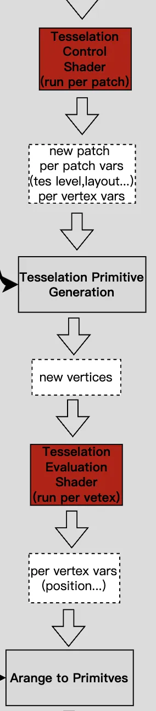

经过Tesselation之后，管线基于当前的图原类型将顶点组装成图原。

Tesselation阶段除了指定所需的两个shader外，我们能控制的参数比较少。

在gles上没有什么参数可以设置。

在vk上，只能设置控制点数量，即VkPipelineTessellationStateCreateInfo中的patchControlPoints。

在metal上，可以在MTLRenderPipelineDescriptor上设置一些关于控制点和内外factor相关的参数。

**Gemotry Shader**

大部份API在Primtive装配好之后，还有一个可编程的shader阶段，Geometry Shader，它对整个图原即primitive进行变换，输入是一个primitive，输出新的（可能是更多的）pritimive和新的的顶点，同时输出的primitive可以选择输出到特定layer的viewport上。因为可以对一个primitive 反复输出多次，我们也可以利用gs来达到做instancing 绘制的目的。

metal上没有这个阶段，但是metal存在一个类似的叫做vertex amplifacation的机制，它相当于在vs之后，生成多个一样的图原，并可以在shader中改变不同图原的顶点属性，也可以设置某个图原发送到哪个viewport。在MTLRenderPipelineDescriptor设置setMaxVertexAmplificationCount来设置重复的次数。

基于GS而不是GPU Instancing做instance 绘制的方法的好处是节省了Vertex Shader的处理时间，顶点只处理了一次。

GS阶段没有管线参数给我们设置。

#### 5.3.4 Post Vertex Processing

顶点阶段之后,需要对处理后的顶点做一些固定管线操作，才能继续进行光栅化。

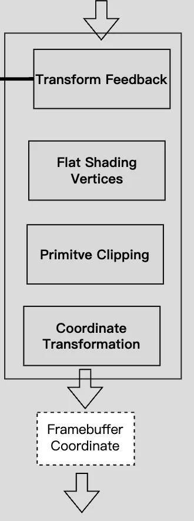

**transform feeback**

我们可以把管线到此时输出的顶点属性存储到一个buffer中，我们可以设置记录哪些属性，以及是否开启。事实上这个固定管线行为只在较老的API下存在，因为新的API下，我们可以在VS中直接将数据写到一个buffer中，所以Vulkan和metal都没有这个部份，不过vulkan确实有`VK_EXT_transform_feedback`这样一个扩展。

在gles下使用TransformFeedbackVaryings设置记录哪些属性，使用Begin/End/Pause/ResumeTransformFeedback控制开启这个流程。

**Flat Shading**

我们可以设置对于某个顶点属性或者变量，在一个图原上的所有顶点都设置成一样的（设成该图原的第一个顶点），这样光栅化也不会对其进行插值，这叫做flat shading，这个步骤就是做这个把一个primitive的所有顶点的值设成一致。一般int/uint形式的变量也都是flat shading的。这里没有可设置的管线参数。

**Primitive Clipping**

基于顶点阶段输出的顶点位置，剪裁掉那些不在视锥内的顶点，并在图原同视锥的交叉处产生新的顶点。这里没有可设置的管线参数

**Coordinate Transformation**

这步将剪裁坐标系下的坐标映射到frame buffer上的像素坐标。

这里我们可以设置两个重要参数：

1. 在Framebuffer上的绘制区域，我们并不一定要画满整个framebuffer，而是选取它的一个矩形区域绘制场景，这个区域也叫做viewport，它的单位是像素，默认是整个framebuffer，viewport决定了我们光栅化的规模，即光栅化出来多少个像素。

2. 深度映射关系，前面一步剪裁后的深度范围一般是诡异化的-1，1，这一步可以选择在framebuffer上这个深度值的范围，默认是到0，1。

在gles上，设置viewport绘制区域使用glViewport，设置深度映射使用glDepthRangef.

在Vulkan上，则在VkGraphicsPipelineCreateInfo里的结构VkPipelineViewportStateCreateInfo上设置，里面的VkViewport结构如下

```c
typedef struct VkViewport {  
  float    x;  
  float    y;  
  float    width;  
  float    height;  
  float    minDepth;  
  float    maxDepth;  
} VkViewport;  
```

x y width height 表达视口，minDepth，maxDepth表达映射到到深度范围。

在metal上通过单独API设置。

#### 5.3.5 Rasterization

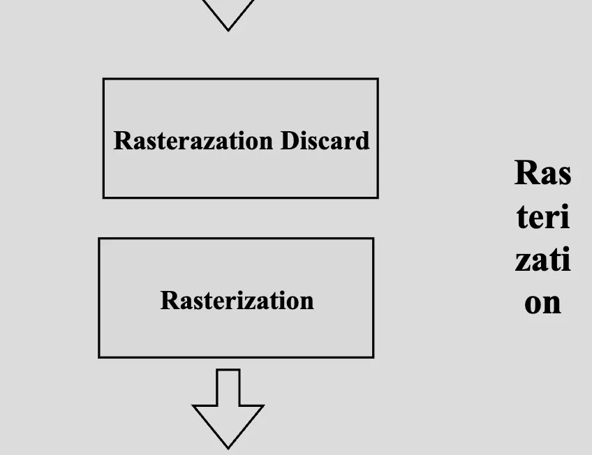

光栅化的流程中负责从顶点数据装配图元，然后将clip坐标范围内的图元根据viewport的像素大小离散成像素。

注意VS中标记成flat shading的output，不会被光栅化，而是给primitive的每个vertice相同的output

**Rasterization Discard**

一些图元允许不走光栅化及其之后的管线，例如做transform feedback时。

API见前面表格

**Rasterization**

考虑对point，line，polygon三种图元进行光栅化

● Point：point不是一个点，而是被光栅化成有一定大小的正方形，并且正方形内所有的像素的插值结果都是一样的，正方形的大小不是在api中指定的，而是在vs里面给built-in的变量赋值，默认是1，如gles中这个变量是gl_PositionSize

● Line：一般使用Breinham画线算法对线段进行离散化，可以指定线的宽度。

gles中glLinewidth，vk设置VkPipelineRasterizationStateCreateInfo的lineWidth，metal中不能设置线条宽度，若设置宽度，只能用plolygon模拟。

● polygon:因为一个多边形有正面和背面两个面，要考虑指定绘制哪个面，以及怎样定义正面。

定义正面：CCW规则-按顺序读取polygon的顶点（window坐标系下），如果他们是逆时针的，则面向我们的面是正面。CW规则则相反。

在非opengl系统下，一般默认是CW规则，模型在制作阶段也是按照CW规则保存顶点序列的，但是opengl下面，因为3D坐标系是Z轴朝外,和其他系统相反，所以为了保证一致，opengl下面默认要使用CCW规则认为是面朝向我们。

API见前面表格

depthoffset：可以将光栅化的多边形整体在深度上加微小位移（如解决z flipping的问题），这里面一般需要两个参数(m,n)得到这个位移：m × factor + r × unit

factor是polygon整体在深度上的斜率，unit则是在光栅化阶段能够度量的最小的差异。

使用这种方式指定位移和直接在vs里面偏移深度是不一样的，vs里面对深度的偏移不知道当前硬件最小可以偏移多少。

API见前面表格

#### 5.3.6 MultiSample

multisample是光栅化中的一个重要概念，光栅化阶段可能对同一个pixel再细化为多个sample，这就是MSAA（multi sample anti aliasing）

**开启的条件**

开启的条件是当前的framebuffer设置的sample数量大于1。具体到API上：

gles下面RenderBufferObject的SAMPLES 数量> 1 ,gles下面只有RBO（而不是FBO）可以做为multisample rt。

vk下面：VkAttachmentDescription 的samples > 1,同VkPipelineMultisampleStateCreateInfo 中的rasterizationSamples相等

metal下面：mtltexture的sample >1,同MTLRenderPipelineDescriptor的rasterSampleCount

相等

**sample coverage**

对于msaa的情况，每个pixel要有一个和sample数量相同bit位的值，称为sample coverage，标记某个sample被primitive覆盖的情况，这个sample coverage也是在光栅化产生的，这个coverage也用来被计算最终这个pixel的value。（例如最终需要将msaa的rt resolve成单sample的rt时，对每个sample来说，用coverage对其sample的value做加权平均）

sample 个数，sample的位置，sample的shading 量

在移动端，假设msaa的倍数为N，则实际上这个pixel有N个sample,每个sample有固定的位置，可以通过api查询，但是不能设置，实际上对sample shading的次数并不一定等于N，sample数量<=N（比如非边缘地区只需要产生1次sample shading，那其他的sample都都赋予相同的值）。我们可以强行控制对于1个pixel最少进行的sample shading数量，gles和vulkan设置见上表API，metal不能定义最小sample shading量。

#### 5.3.7 Early Per-Fragment Test

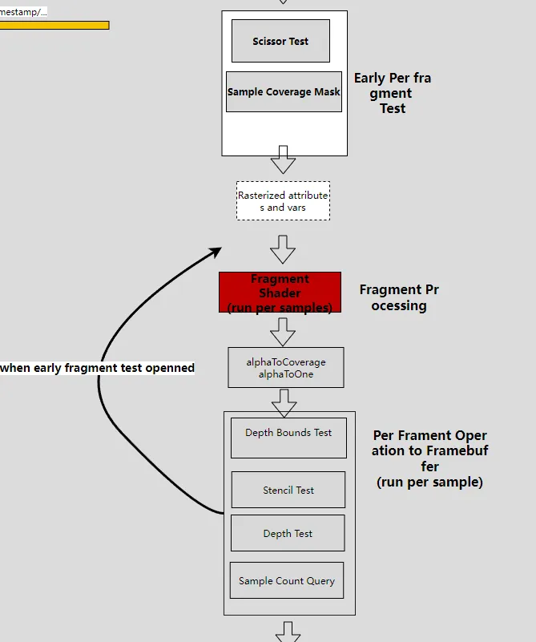

这是在Fragment Shader前后发生的两批固定光线阶段(Early Per- Fragment Tests 和 Per- Fragment Tests )。

管线可以控制将Per- Fragment Tests中的操作(除了alphatocoverage和alphatoone）也全都挪到Early Per- Fragment Tests中执行，即所有的 Per- Fragment Tests全在Fragment Shader 之前执行，因为在ps之前事实上就已经能获得了深度。

gles，vulkan，metal都是通过在shader中声明`early_fragment_tests`打开这个特性。

不过early test并不一定因为声明了就一定打开，例如在ps里面显示的写入了深度值，则一般会导致early z失败，因为这要求ps一定要得到执行之后才能获得深度。

如果不打开Early Tests，则这个early per fragment test阶段只包含如下两个固管流程：

**Scissor Test**

对FrameBuffer上的像素基于一个矩形区域做裁剪。

apI见前面表格

**Sample Coverage Mask**

（在msaa下）对于pixel的每一个sample进行mask测试，即将一个mask值同当前sample的coverage按位与，这样可以裁剪掉一些我们不想要的sample。

gles和vulkan的API见上表，metal没有这个阶段。

#### 5.3.8 Post Per-Fragment Test

**alpha to coverage /alpha to one**

第一步可选择将（color0 的）alpha值转化为coverage，我们知道msaa只对不透明物体的边缘有效，对alphatest的镂空边没有效果，这里对alphatest物件，将其alpha值转化到coverage之后，其镂空边部分也从全覆盖转成了半覆盖，在resolve最终color时同其他物体混合，在msaa下相当于对alphatest也做了类似msaa效果。

下一步可选择将（color0 的）alpha值统一转化为1，这样我们可以实现对alpha test的物体首先用alpha表示coverage，然后再转成1，以使得后面半透明对其blending时仍然把他当作不透明物体来看。

API见上表。注意gles不能支持alpha to one。

下面几个阶段都可以放在early test阶段。

**Depth Bounds Test**

裁剪处于一些depth 区间内的像素。只有Vulkan可以支持，API见上表。

**Stencil Test And Write**

按照stencil的值进行剪裁，然后写入stencil值。

即按照写入的bit位进行剪裁，通过API设置stencil的测试函数和测试之后的写入函数。

**Depth Test And Write**

按照depth的值进行剪裁。

通过API设置depth的测试函数和是否写入。

注意因为depth测试在后，Depth测试失败，依然会写入正确的stencil。

**Sample Count Query**

如果这个Primitive绘制前开启了occlusion query，那么在这里它的occlustion query sampler counter就会为每个coverage为1的sampler增加1个。在后面就可以查到这个primtive通过了遮挡。

#### 5.3.8 Framebuffer Operation

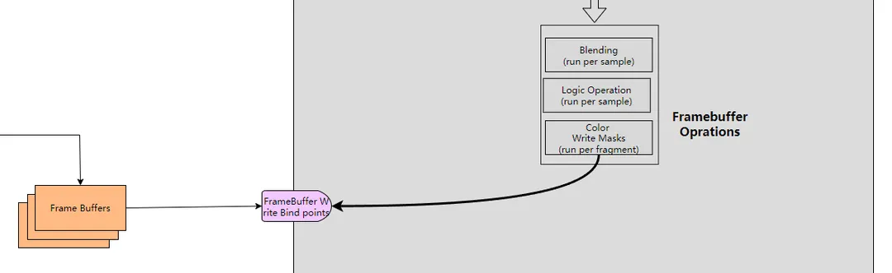

这是最后的一个固定管线阶段，完成color的framebuffer的合成。

**Blending**

将PS的输出的RT通道，同现有的Framebuffer上的值做混合。

只有float类型的RT才支持混和。

如果RT的格式时SRGB（存储gammar空间颜色），则要先将结果转化成linear颜色空间，再混合，最后再转为gammar空间存储。

此处需要API设置混合的函数，见前面表格。 其中gles的rgb和alpha放在一起指定混合函数，vk和metal可以分开指定。

**LogicOperation**

将当前的管线输出结果同现有framebuffer上的值做logic运算。

只有int类型才支持logic运算，这弥补了int类型不能进行blending的不足。

gles不支持logic 运算。vk和metal需要设置API指定运算方式，见上面的表格。

**Color Write Masks**

最后一步将color写入framebuffer。（depth stencil已经在前面test之后写入了）

这里还可以通过API控制哪个通道的哪个RGB component参与写入。即color mask。API见上面的表。

## 六、管线数据

GPU管线在运行的过程中，会访问各种存在于GPU上的内存数据，或GPU上的对象。

### 6.1管线可绑定的数据类型

管线由固定管线，可编程shader组成，当我们配置好了固定管线参数，设置好了shader代码之后，管线的骨架就已经形成了，这时我们还需要向管线中运送数据，以实现数据的处理。管线中需要运送数据的位置有如下：

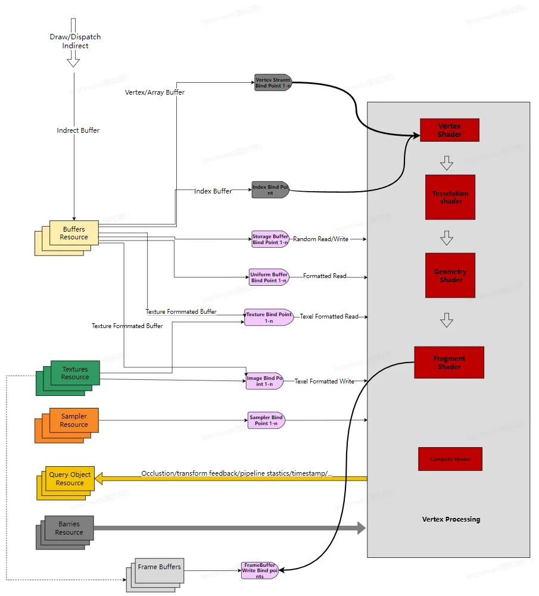

**数据绑定**

这些数据需要绑定到管线的特定的绑定点上,才能被管线获取使用，且这些数据大多数都是提供给可编程的shader部分使用，绑定的原始数据通常是在在Device上创建的，也称为资源，这些绑定点及其绑定的资源有：

顶点数据：

● Vertex Data : 顶点流数据，绑定buffer资源，

● Index Data： primitive的索引数据，绑定buffer资源

基于Buffer和Texture资源的数据：

● Uniform Buffer：按照一定的格式/数据布局只读的buffer，他其实是一个各种基本类型的参数的集合。在gles下面我们可以使用gluniform（）去单个设置shader 参数，但是在vk和metal上，都只能将这些参数打包成一个大的集合,存储在buffer中的形式提供给Shader。这里之所以叫做Uniform，是说这些参数在shader的每个线程中值都是一样的，因为是cpu传入进来后就不会被改变。

● Storage Buffer： 无序访问的可读又可写的Buffer，这个buffer的大小通常比较大（至少16M），所以它一般存储在GPU Memory上，而不是GPU 片上的L2 cache，它的读取效率差于Uniform Buffer，但是容量够大。虽然Vertex Buffer也同SSBO的存储特点类似（事实上很多硬件的VBO就是SSBO），但是通常Vertex  Buffer会有专门的硬件读取优化（所以例如把instance buffer放在VBO里面从顶点流读入要比放在SSBO里面读取或fetch要快）、

● （Sampled）Texture： 按照pixel format 只读访问的一块内存。不同于普通buffer，这块内存是以某种Poixel format编码存储的。Texture只能被采样（sample）或读取原始位置的信息（fetch），在硬件实现上，texuture的sample走TPU（Texture Processing Unit），而fetch走LSU（Load/Store Unit),所以sample的性能要好且适配性更好，且sample只能在PS中使用。

● Image：按照pixel format可读又可写入的一块内存，即texture的可写入版本。Image的访问只能从原始资源load/store，效率要比Texture的sample和fetch差、

● Buffer Texture:本质上是一个buffer，但是它按照一定的pixel format去sample或fetch其中的数据，就像sample或fetch一个texture 一样，是对buffer的封装，也叫buffer view。

● Storage Buffer Texture：本质上是一个buffer，但是它按照一定的pixel format去同时随机load/store其中的数据，就像load/store一个texture 一样，也是一种buffer view

这些基于buffer和texture的资源再在不同的平台还有其他的名字，如SRV，UAV等，其关系如下

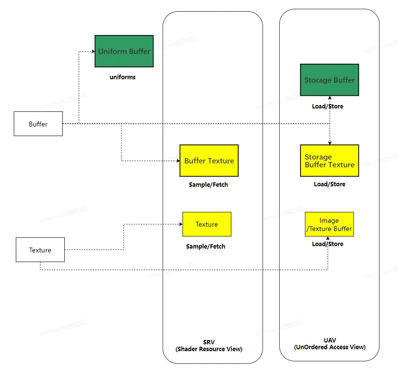

首先最根本的资源只有buffer和texture。一切都是在他们上面的封装。

Uniform Buffer通常特殊看待，因为大小有限（如十几K），以方便利用L2 cache，加速访问，携带CPU传递给shader的只读的参数。

其他的资源类型都可以很大，存在与GPU 显存上。一种是只读的（sample，fetch），也叫SRV，包括texture和基于buffer封装的buffer texture。

一种是可以同时被随机读写的，主要用在CS管线中，叫做UAV，包括storage buffer，image，和基于buffer封装的storage buffer texture。

另外从另一个维度来看，这里buffer的资源形式只有绿色的两种（只读和读写），texture的资源形式有黄色的四种（除了常规的两种，还包括从buffer翻译归来的两种）

其他：

● Framebuffer：表示fragment shader的输出，它一般来自于一个Texture（只有再gles上可以来自于一个buffer，即Render Buffer Object）。能用作Frame Buffer的Texture类型和能用做Texture sample的类型的集合是不等同的。

● samplers：用来定义如何对texture进行采样，多个texture可以复用一个

● Indirect Buffer：用来存储Indirect Draw/Dispatch的参数，一般由CS进行写入。

● Query Object：存储查询结果

● Barriers/Sync Object：用来插入渲染指令流中，做指令执行和内存的同步

下面我们对于这几种类型的管线数据逐个说明API上的设计和使用。

### 6.2顶点数据绑定

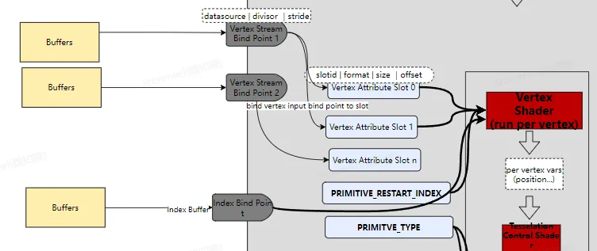

VS是整个管线的第一步，它的功能是从顶点数据流中读入顶点数据，对于每个顶点运行我们编好程序的vertex shader，输出逐顶点的输出数据。

这里有两个关键的数据要描述，数据流本身，以及顶点属性。

Vertex Data Stream ：顶点数据流，管线上预设了几个数据绑定点vertex input bind point，来接入读取源（buffer），我们要在这个绑定点上定义这个数据源的一些属性

● strider两个元素之间的间隔bytes（这不必然等于其中一个元素的属性大小长度）

● InputRate 用于定于逐instance的属性

Vertex Attribute：顶点属性，每个定点的数据还有多个属性（如位置，法线，颜色等），因此API定义了一组Vertex Attribute Slot，每个Slot对应一个属性，我们要为每个Vertex Attribute Slot定义它这个属性数据对于每一个顶点来说它在shader中的slotid，它的格式，数据大小，和这个属性数据在该顶点的所有数据中的偏移。

同一个buffer也可以同时绑定到多个bind point上形成多个数据源

一个Vertex Data Stream可以只关联一个Vertex Attribute，但是通常会关联多个顶点属性，如下图

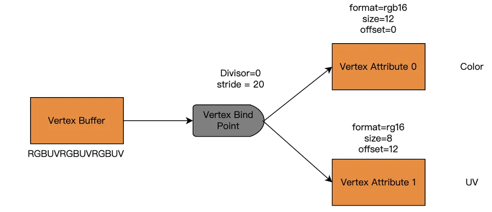

这个bind point上绑定的Buffer交叉存储来定点颜色rgb和定点的uv，且都是16bit的，则对于一个定点数据来说，它的stride是20个字节，对于第一个color的attribute来说，它的一个顶点读取的数据size是12个字节，offset为0，而对于第二个UV的attribute来说，它的一个顶点读取的数据size是8个字节，它读取到一个完整的20个字节的定点数据后，因为前面有12各位字节是color，要从第13个开始读取，所以它的offset是12。

**逐instance的属性**

当API支持GPU Instancing之后（即一个drawcall同时绘制多编图形），就需要一个特殊的Vertex Buffer存储逐instance而非逐vertex的属性，因为需要将两种类型的vertex stream区分开来，就要再vertex stream上增加额外的标记，多数API需要额外定义两个信息

● InputRateFunction ：标记这个顶点流是逐instance还是逐vertex数据

● InputRate：或叫做divisor，标记逐个数据是经过多少个（instance或vertex）之后才能拿到下一个数据

**Vertex Buffer还是Storage Buffer？**

通常在一些实现中我们也可以不使用固定管线的vertex stream去装填instance数据，而是使用storage buffer，在VS中从storage buffer中读取，这样更加灵活自由，但是移动端的storage buffer主动读取相比vertex buffer的”硬件填喂“可能性能更差一些。

甚至不止instance buffer，所有的逐顶点数据也可以在vs中从storage buffer中获取，尤其在PC端的现代的基于GPU scene的管线下，Vertex Buffer的作用和地位逐渐被storage buffer取代了（这时VB只包含一个极其简单图形的顶点数据，而一个完整模型被拆成了大量的简单图形，api中只是对逐个简单图形绘制多个instance，在vs中，从 storage buffer中根据当前的instance id和顶点id获取正确的顶点和instance属性，这就是cluster rendering的实现基础）。

**Index buffer**

我们可以直接从顶点组装成图原，但是为了复用顶点，一般会先从一个索引buffer中读取顶点在vertexstream中的索引，即index buffer，管线中只存在一个可以绑定index buffer的bind point，管线从这里获取图原的索引数据。

在API中还支持设置一个值叫做vertex restart index，它标志着在使用`traingle_fan`等类型绘制primitive的时候，读取到某个特定的索引值，就重启一个新的三角形（而不是继续接连在之前的三角形上）。

Vertex Attribute，Vertex Data Stream，Index buffer，图原类型，vertex restart index是vertex shader运行时要设置的全部管线参数。

**Vulkan**

Vulkan中VkGraphicsPipelineCreateInfo里面的参数VkPipelineVertexInputStateCreateInfo用来描述vertex属性相关的这些信息

```c
typedef struct VkPipelineVertexInputStateCreateInfo {  
  VkStructureType                             sType;  
  const void*                                 pNext;  
  VkPipelineVertexInputStateCreateFlags       flags;  
  uint32_t                                    vertexBindingDescriptionCount;  
  const VkVertexInputBindingDescription*      pVertexBindingDescriptions;  
  uint32_t                                    vertexAttributeDescriptionCount;  
  const VkVertexInputAttributeDescription*    pVertexAttributeDescriptions;  
} VkPipelineVertexInputStateCreateInfo;
```

其中VkVertexInputBindingDescription描述Vertex Data Stream，

VkVertexInputAttributeDescription描述Vertex Attribute，vkCmdBindVertexBuffers用来给某个binding 绑定buffer数据。

VkGraphicsPipelineCreateInfo里面的参数VkPipelineInputAssemblyStateCreateInfo则用来描述图原类型和restart index。

```c
typedef struct VkPipelineInputAssemblyStateCreateInfo {  
  VkStructureType                            sType;  
  const void*                                pNext;  
  VkPipelineInputAssemblyStateCreateFlags    flags;  
  VkPrimitiveTopology                        topology;  
  VkBool32                                   primitiveRestartEnable;  
} VkPipelineInputAssemblyStateCreateInfo;  
```

vkCmdBindIndexBuffer用来绑定buffer到index buffer上，index buffer不像vertex binding有多个流，它只有一个

Vk的VkVertexInputAttributeDescription只能描述逐个stream是顶点数据还是逐instance数，并不能描述inputrate，需要使用扩展`VK_EXT_vertex_attribute_divisor`。

**Metal**

Metal中MTLRenderPipelineDescriptor里面的参数结构MTLVertexDescriptor描述了Vertex data stream（layouts）和Vertex Attribute信息（attributes），用Encoder的SetVertexBuffer来绑定顶点的buffer数据

Metal的IndexBuffer不是预先绑定的，而是在调用绘制API 如drawIndexedPrimitives

时在参数中指定。

MTLRenderPipelineDescriptor里面的MTLRenderPipelineDescriptor描述图原类型。而metal中始终使用一个特殊的索引值0xFFFFFFFF表示restart。

**GLES**

gles中有多种方式定义顶点数据，且API较多。

1. 不使用vertex buffer，gles2.0的方式，直接使用API VertexAttrib{1234}f把数据从CPU传送给GPU上的某个attribute 

2. gles 2.0的方式，只支持使用单个vertex buffer（即gles上的generic vertex buffer）：

a. 先创建vertex buffer和index buffer，并用glBindBuffer将其绑定

b. 定义attributer并同buffer绑定：使用`VertexAttribPointer(uint index, int size, enum type,boolean normalized, sizei stride, constvoid *pointer)`，其中pointer是绑定再generic vertex buffer point上的buffer的数据位移

3. gles3.0的方式，支持使用多个 vertex buffer

a. 创建buffer本身：首先gles中用于vertex buffer的buffer 类型叫做ARRAY_BUFFER,用于index buffer的buffer类型叫做ELEMENT_ARRRAY_BUFFER,首先需要使用glbuffer()来创建buffer。

b. 绑定buffer到vertex bindpoint：这里不再使用通用的glbindbuffer()（因为这个API不能指定bind point index，它只能绑定在generic bind point上），这里用glBindVertexBuffer才能将某个buffer绑定到一个vertex input bind point上，并同时指定这个stream的属性。

c. 定义attribute：用VertexAttribFormat 定义vertex attribute的属性。

d. attribute同bindpoint绑定：用vertexattribbinding将某个vertex input bind point同某个vertex attribute相连。

e. 绑定index buffer，index buffer只有一个绑定点，所以使用通用的glbuffer绑定indexbuffer

4. 使用host一侧的buffer作为顶点数据：同样使用`VertexAttribPointer(uint index, int size, enum type,boolean normalized, sizei stride, constvoid *pointer)`，但是此时不要绑定vertex buffer，即将ARRAY_BUFFER绑定点绑定为0，pointer就是指向CPU上的内存。

另外要通过EnableVertexAttribArray来启用某个attribute，用VertexAttribDivisor来设置stream是逐instance的，。

用`Enable/Disable(PRIMITIVE_RESTART_FIXED_INDEX.)`来开启primitve restart。

gles下面设置图原类型的方式是包在了调用绘制指令时如glDrawElements。

### 6.3 Buffer和Texture来源的数据绑定

从上面的分类可以看出，Buffer 和 Texture一般是主要的渲染数据来源，所以我们谈渲染资源，一般狭义讲的就是buffer和texture。

绑定buffer和texture资源有两种方式：

● 单个绑定，通过单个API逐个资源进行

● 整体绑定，通过一个整体的（包含多个甚至整个管线所使用的全部资源）数据结构，一次性绑定，这是高级API支持的效能更高的方式

#### 6.3.1 Metal和Argument Buffer

##### 6.3.1.1 Metal上Buffer和texture的创建

Metal上可以直接创建资源，也可以从一个堆MtlHeap创建资源（后者对内存的利用性能更好）

**创建buffer**

```c
[device newBufferWithLength: bufferSize options:MTLResourceStorageModeShared];

[heap newBufferWithLength:bufferSize options:MTLResourceStorageModePrivate];
```

**创建texture**

```c
newTextureViewWithPixelFormat:(MTLPixelFormat pixelFormat)

heap newTextureWithDescriptor:(MTLPixelFormat pixelFormat)
```

**创建buffertexture**

在创建了buffer之后，再通过

MtlBuffer::newTextureWithDescriptor 创建。

##### 6.3.1.2 Metal 上buffer和texture的管线绑定

在Metal中，没有在API层面区分各种不同用处的vertex和 buffer，如uniform buffer 和storage buffer，或者texture和image，统一叫做buffer和texture，其设置给管线的API是一致的，至于具体怎样分类存储metal在底层自动进行，比如shader中使用const 修饰的buffer，metal就会认为是一个uniform buffer。

**单个绑定**

绑定给管线的接口是直接调用encoder的

setFragmentBuffer

setFragmentTexture

等接口

这里不能将基本数据类型单个绑定，需要将他们打包成uniformbuffer。

**整体绑定**

即ArgumentBuffer，它用一种特殊的buffer包含所有数据。典型用法

● 基于shader function创建一个argumentencoder，用来向argumentbuffer填充数据

```c
id <MTLArgumentEncoder> argumentEncoder =  
  [fragmentFunction newArgumentEncoderWithBufferIndex:bufferindex];  
```

其中bufferindex是整个argumentbuffer再shader中定义的index

● 基于argumentencoder的长度信息创建arugmentbuffer，并设置给这个encoder

```
_fragmentShaderArgumentBuffer = [_device newBufferWithLength:argumentEncoder.encodedLength options:0];  
[argumentEncoder setArgumentBuffer:_fragmentShaderArgumentBuffer offset:0]
```

● 往buffer里面设置管线数据

```c
[argumentEncoder setTexture:_texture atIndex:AAPLArgumentBufferIDExampleTexture];  
[argumentEncoder setSamplerState:_sampler atIndex:AAPLArgumentBufferIDExampleSampler];  
[argumentEncoder setBuffer:_indirectBuffer offset:0 atIndex:AAPLArgumentBufferIDExampleBuffer];  
```

可以设置的管线数据包括所有可以在uniformabuffer中定义的数据，以及buffer，texture，还包括indirect command buffer。

● 将argumentbuffer整体绑定给shader，就像设置一个普通的buffer一样

```c
[renderEncoder setFragmentBuffer:_fragmentShaderArgumentBuffer  
                        offset:0 atIndex:bufferindex];  
```

#### 6.3.2 Vulkan和Descriptor

##### 6.3.2.1 Vulkans上Buffer和Texture的创建

**创建Buffer**

```c
vkCreateBuffer(VkBufferCreateInfo* pCreateInfo )

typedef struct VkBufferCreateInfo {  
  VkStructureType        sType;  
  const void*            pNext;  
  VkBufferCreateFlags    flags;  
  VkDeviceSize           size;  
  VkBufferUsageFlags     usage;  
  VkSharingMode          sharingMode;  
  uint32_t               queueFamilyIndexCount;  
  const uint32_t*        pQueueFamilyIndices;  
} VkBufferCreateInfo;  
```

其中VkBufferUsageFlagBits要设置成正确的buffer资源用途，如

```c
VK_BUFFER_USAGE_UNIFORM_TEXEL_BUFFER_BIT = 0x00000004,  
VK_BUFFER_USAGE_STORAGE_TEXEL_BUFFER_BIT = 0x00000008,  
VK_BUFFER_USAGE_UNIFORM_BUFFER_BIT = 0x00000010,  
VK_BUFFER_USAGE_STORAGE_BUFFER_BIT = 0x00000020,  
```

**创建buffertexture**

vk里面把buffer texture叫做buffer view。创建bufferview通过在已有的一个buffer上调用

```c
VkResult vkCreateBufferView( VkDevice ，const VkBufferViewCreateInfo const
VkAllocationCallbacks VkBufferView* ，device, pCreateInfo, pAllocator, pView);

typedef struct VkBufferViewCreateInfo {  
  VkStructureType            sType;  
  const void*                pNext;  
  VkBufferViewCreateFlags    flags;  
  VkBuffer                   buffer;  
  VkFormat                   format;  
  VkDeviceSize               offset;  
  VkDeviceSize               range;  
} VkBufferViewCreateInfo;  
```

**创建Texture**

vulkan中最底层的Texture对象是VkImage，但是他不能直接当成资源用，要创建基于VkImage的VkImageView，才能设置给管线。

**创建VKImage**

```c
vkCreateImage( VkImageCreateInfo* pCreateInfo, VkImage)

typedef struct VkImageCreateInfo {  
  VkStructureType          sType;  
  const void*              pNext;  
  VkImageCreateFlags       flags;  
  VkImageType              imageType;  
  VkFormat                 format;  
  VkExtent3D               extent;  
  uint32_t                 mipLevels;  
  uint32_t                 arrayLayers;  
  VkSampleCountFlagBits    samples;  
  VkImageTiling            tiling;  
  VkImageUsageFlags        usage;  
  VkSharingMode            sharingMode;  
  uint32_t                 queueFamilyIndexCount;  
  const uint32_t*          pQueueFamilyIndices;  
  VkImageLayout            initialLayout;  
} VkImageCreateInfo;
```

其中的VkimagUsageFlags需要描述正确的用途，如采样，写入还是关联Framebuffer

```c
VK_IMAGE_USAGE_SAMPLED_BIT  
VK_IMAGE_USAGE_STORAGE_BIT  
VK_IMAGE_USAGE_COLOR_ATTACHMENT_BIT  
VK_IMAGE_USAGE_DEPTH_STENCIL_ATTACHMENT_BIT  
VK_IMAGE_USAGE_INPUT_ATTACHMENT_BIT
```

**创建ImageView**

```c
VkResult vkCreateImageView(VkDevice device,
                           const VkImageViewCreateInfo* pCreateInfo,）

typedef struct VkImageViewCreateInfo {  
  VkStructureType            sType;  
  const void*                pNext;  
  VkImageViewCreateFlags     flags;  
  VkImage                    image;  
  VkImageViewType            viewType;  
  VkFormat                   format;  
  VkComponentMapping         components;  
  VkImageSubresourceRange    subresourceRange;  
} VkImageViewCreateInfo;  
```

##### 6.3.2.2 Vulkan上Buffer和textuer的管线绑定

Vulkan上完全抛弃了单独绑定资源的接口，必须整体绑定，它与metal中argument buffer对应的概念叫做Resource Descriptor。

相比metal，vulkan的概念更抽象和解耦。

首先要定义一个资源的布局，他表示shader中一批资源的类型和位置，叫descripter set layout，其中包含了一些descripter的集合，每个descripter表示一个资源。

对于特定的一个drawcall，需要基于这个布局创建一个资源组的实例，其中每个成员是一个具体的要绑定的资源。

最终将descripter set整体绑定给shader

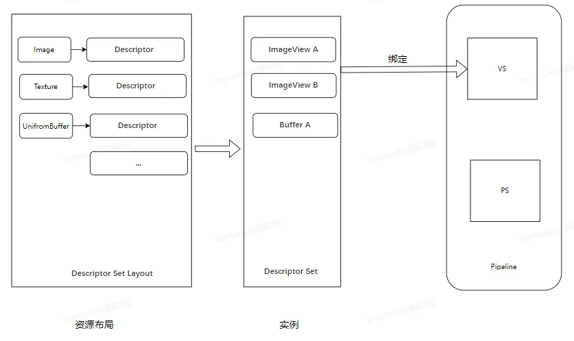

一个shader的所有的资源被分解到多个不同的descripter set layout上。

Descriptor要包含

● binding index，shader 中的binding index

● arraylement和count，如果是数组，它的起始位置和长度

● type 类型

所有的descripter type有：

● sampled image :texture for sample/fetch

● Combined image sampler: a sampler+ a sampled image

● Storage Image ：load/store/atomic op image

● sampler

● unitform texel buffer : buffer texture for sample/fetch

● storage texel buffer: buffer texture for load,store,atomic op

● uniform buffer

● storage buffer :buffer for load, store, atomic

● dynamic uniform buffer: uniformbuffer+offset ，dynamic buffer需要再绑定descripterset的时候指定它的offset

● dynamic storage buffer:storage buffer+offset

● inline uniform block: uniformbuffer 不来自一个普通的buffer，而是直接来自这个descripter set本身

● Input attachment : image view for subpass local load

我们对比vulkan的descripter和metal的augument buffer在存储数据上有一个最大的区别是，argument buffer中没有uniform buffer，而是直接写入各种基本类型及其数组，而descripter中不包含基本类型，要将他们统一封成uniform buffer。

**创建DescripterSetLayout**

```c
VkResult vkCreateDescriptorSetLayout(VkDevice device,
                                     const VkDescriptorSetLayoutCreateInfo* pCreateInfo,
                                     const VkAllocationCallbacks* pAllocator,
                                     VkDescriptorSetLayout* pSetLayout);

typedef struct VkDescriptorSetLayoutCreateInfo {  
  VkStructureType                        sType;  
  const void*                            pNext;  
  VkDescriptorSetLayoutCreateFlags       flags;  
  uint32_t                               bindingCount;  
  const VkDescriptorSetLayoutBinding*    pBindings;  
} VkDescriptorSetLayoutCreateInfo;  

typedef struct VkDescriptorSetLayoutBinding {  
  uint32_t              binding;  
  VkDescriptorType      descriptorType;  
  uint32_t              descriptorCount;  
  VkShaderStageFlags    stageFlags;  
  const VkSampler*      pImmutableSamplers;  
} VkDescriptorSetLayoutBinding  
```

需要定义这个setlayout里面的每个descripter的binding（位置），type，count（数量）

**创建Descripter Set**

Descripter Set使用池VKdescriptorPool来维护。

首先需要创建一个池

vkCreateDescriptorPool

然后从池子里面创建或回收descriptor set

vkAllocateDescriptorSets

填充DescriptorSet的数据，有write和copy，template三种方式

write和copy这两种方式通过同一个API

vkUpdateDescriptorSets

```c
void vkUpdateDescriptorSets(  
  VkDevice                                    device,  
  uint32_t                                    descriptorWriteCount,  
  const VkWriteDescriptorSet*                 pDescriptorWrites,  
  uint32_t                                    descriptorCopyCount,  
  const VkCopyDescriptorSet*                  pDescriptorCopies);
```

其中VkWriteDescriptorSet代表write进去的，VkCopyDescriptorSet为copy进去的。

write的结构

```c
typedef struct VkWriteDescriptorSet {  
  VkStructureType                  sType;  
  const void*                      pNext;  
  VkDescriptorSet                  dstSet;  
  uint32_t                         dstBinding;  
  uint32_t                         dstArrayElement;  
  uint32_t                         descriptorCount;  
  VkDescriptorType                 descriptorType;  
  const VkDescriptorImageInfo*     pImageInfo;  
  const VkDescriptorBufferInfo*    pBufferInfo;  
  const VkBufferView*              pTexelBufferView;  
} VkWriteDescriptorSet;  
```

其中image和sampler放在piamgeinfor里，buffer放在pbufferinfo里

copy的结构

```c
typedef struct VkCopyDescriptorSet {  
  VkStructureType    sType;  
  const void*        pNext;  
  VkDescriptorSet    srcSet;  
  uint32_t           srcBinding;  
  uint32_t           srcArrayElement;  
  VkDescriptorSet    dstSet;  
  uint32_t           dstBinding;  
  uint32_t           dstArrayElement;  
  uint32_t           descriptorCount;  
} VkCopyDescriptorSet;  
```

它从一个descripterset 拷贝到另外一个。

**基于模板更新**

有的时候，我们需要在多个descripterset之间复用一些数据，就可以把这些公用的数据抽象到一个template里面

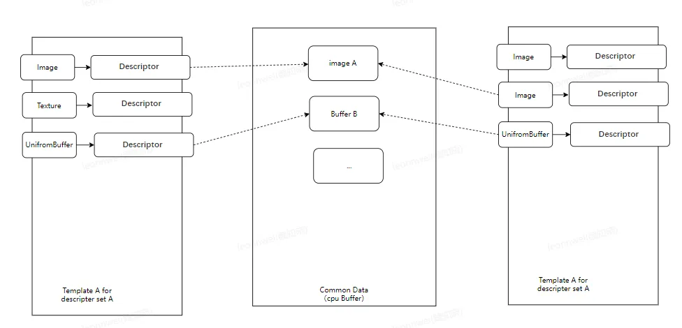

我们先创建一个cpu一侧的buffer，并写入这些公用数据，其中包含了要写入descripterset中的内容（buffer，image的handle）

再定义这个模板和数据的映射关系

vkCreateDescriptorUpdateTemplate

```c
typedef struct VkDescriptorUpdateTemplateCreateInfo {  
  VkStructureType                           sType;  
  const void*                               pNext;  
  VkDescriptorUpdateTemplateCreateFlags     flags;  
  uint32_t                                  descriptorUpdateEntryCount;  
  const VkDescriptorUpdateTemplateEntry*    pDescriptorUpdateEntries;  
  VkDescriptorUpdateTemplateType            templateType;  
  VkDescriptorSetLayout                     descriptorSetLayout;  
  VkPipelineBindPoint                       pipelineBindPoint;  
  VkPipelineLayout                          pipelineLayout;  
  uint32_t                                  set;  
} VkDescriptorUpdateTemplateCreateInfo;  

typedef struct VkDescriptorUpdateTemplateEntry {  
  uint32_t            dstBinding;  
  uint32_t            dstArrayElement;  
  uint32_t            descriptorCount;  
  VkDescriptorType    descriptorType;  
  size_t              offset;  
  size_t              stride;  
} VkDescriptorUpdateTemplateEntry;  
```

其中每个endtry代表一个映射关系，表示shader中的一个资源，包括它的binding位置，type等。还要定义他在前面的公用数据中对应的数据的offset和stride。

最后通过

```c
void vkUpdateDescriptorSetWithTemplate(VkDevice device,
                                       VkDescriptorSet descriptorSet,
                                       VkDescriptorUpdateTemplate descriptorUpdateTemplate,
                                       const void* pData);
```

完成这个更新

将descripter set绑定到管线

API是

```c
void vkCmdBindDescriptorSets(  
  VkCommandBuffer                             commandBuffer,  
  VkPipelineBindPoint                         pipelineBindPoint,  
  VkPipelineLayout                            layout,  
  uint32_t                                    firstSet,  
  uint32_t                                    descriptorSetCount,  
  const VkDescriptorSet*                      pDescriptorSets,  
  uint32_t                                    dynamicOffsetCount,  
  const uint32_t*                             pDynamicOffsets);
```

这里可以同时绑定多个descripterset给一个shader。

最后的pDynamicOffsets则是用来表述set中的dynamic buffer的offset

另外我们在创建vulkan pipeline的时候，需要提供这个pipeline所有shader stage用到的descriptersetlayout的集合，即pipelinelayout，通过API `vkCreatePipelineLayout`

#### 6.3.3 Gles

在gles中，只能逐个资源单独绑定到管线上，且每种资源的绑定API差异很大。

**uniform**

只有gles下允许修改shader中没有定义在任何uniform 里面的单个基本数据类型值，如其中定义的一个float。

通过

```c
ProgramUniform(program, location,v)

Uniform(location,v)
```

这样的接口

事实上gles下面所有的uniform都必须要在shader中定义在一个uniform block里面，这些没有定义在uniform block中的uniform其实是在default block里面

**uniform buffer**

对于定义在uniform block中的uniform，通过uniform buffer的形式更新整个uniform block

● 首先生成buffer，然后将那个buffer绑定到某个index上的uniform buffer bond point上，通过

```c
void glBindBufferBase(GLenum target,  
                      GLuint index,  
                      GLuint buffer);
```

● 将uniformbuffer绑定给某个uniform block

```c
void glUniformBlockBinding(GLuint program,  
                           GLuint uniformBlockIndex,  
                           GLuint uniformBlockBinding);
```

其中uniformblockindex是block的index，uniformblockbinding是绑定点的index

**Storage Buffer**

在gles中称为SSBO（Shader Storage Buffer Object）

SSBO同Uniform的API区别是，只需要生成并通过glBindBufferBase绑定SSBO到某个buffer绑定点上，不需要API将他绑定到ssbo的block上。因为在shader中，需要为ssbo的block声明它对应的buffer binding index。

**Texture**

● 首先设置当前要绑定的是哪个贴图绑定点

```c
void glActiveTexture(GLenum texture)
```

其中的texture形式如`GL_TEXTUREi`

● 将贴图绑定到当前active的贴图绑定点上

```c
void glBindTexture(GLenum target, GLuint texture);
```

**Image**

先创建好texture

使用API绑定

```c
void glBindImageTexture(	GLuint unit,  
  	GLuint texture,  
  	GLint level,  
  	GLboolean layered,  
  	GLint layer,  
  	GLenum access,  
  	GLenum format);  
```

其中要指定image的绑定点和绑定的texture

**Buffer Texture和Storage Buffer Texture**

对于绑定操作同普通的texture在API上是一致的，

只是在创建Texture时，调用glBindTexture时的target使用`GL_TEXTURE_BUFFER`。

然后调用API

```c
void glTexBuffer(GLenum target,  
              	 GLenum internalFormat,  
              	 GLuint buffer);  
```

将一个buffer同当前绑定的texture关联。

**Sampler**

使用API

```c
void glBindSampler(GLuint unit,  
                   GLuint sampler);  
```

将这个sampler绑定给unit位置的texture使用。

可以把一个sampler绑定给多个texture unit。

## 七、 绘制和Dispath指令

在管线设置好之后，需要启动绘制和dipatch指令来启动管线，这就好比准备好一切之后按下启动按钮，GPU收到绘制和dispatch指令后真正的执行工作。

### 7.1 Draw

对于绘制指令，按照是否使用了index buffer，分为两种。

按照是否使用gpu buffer存储指令参数，又分为直接绘制和间接绘制

#### 7.1.1 直接绘制

##### 7.1.1.1 不基于index buffer

基于当前绑定的vertex stream，描述从流中绘制哪个范围的顶点数据，以及instancing的数量。我们通常要指定：

● vertex offset/first vertex ：在vertex stream中的offset

● vertex count ：顶点数量

● instance offset/first instance：如果stream是逐instance的，那么在其中获取的元素的偏移

● instance count：实例绘制数量

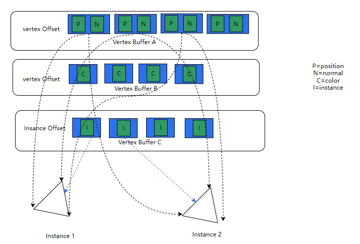

**Vulkan**

使用`vkCmdDraw(uint32_t vertexCount, uint32_t instanceCount, uint32_t firstVertex, uint32_t firstInstance)`

**Metal**

调用rendercommandencoder的drawPrimitives

**Gles**

使用

```c
void glDrawArraysInstanced(GLenum mode,  
                           GLint first,  
                           GLsizei count,  
                           GLsizei primcount);  
```

注意gles从core版本中不能支持在不基于indexbuffer的绘制时指定instance的偏移，但是在扩展EXT_base_instance中定义了DrawArraysInstancedBaseInstanceEXT这样的API。

##### 7.1.1.2基于index buffer

这时vertex 不是直接按顺序从vertex stream中拿到，而是先从index buffer中得到待绘制vertex在vertex stream中的index，再从该index处得到vertex数据，这样可以复用顶点数据。

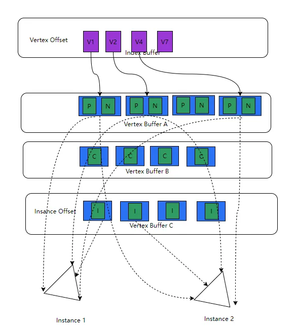

这时候我们通常要指定

● firstindex：在index buffer中的起始序号

● indexcount：绘制的顶点数

● vertexoffset：每次根据index拿顶点时在index上额外增加的偏移

● firstinstance：如果stream是逐instance的，那么在其中获取的元素的偏移

● instance count：instance的绘制数量

**Vulkan**

使用`vkCmdDrawIndexed(uint32_t indexCount, uint32_t instanceCount, uint32_t firstIndex, int32_t vertexOffset, uint32_t firstInstance)`

**Metal**

调用rendercommandencoder的drawIndexedPrimitives

**Gles**

使用

```c
void glDrawElementsInstancedBaseVertexBaseInstance(GLenum mode,  
  	GLsizei count,  
  	GLenum type,  
  	void *indices,  
  	GLsizei instancecount,  
  	GLint basevertex,  
  	GLuint baseinstance);  
```

其中Indices是indice的offset。如果当前没有绑定index buffer（即`ELEMENT_ARRAY_BUFFER`绑定给0），那么indices就是指向CPU一侧的index buffer（通常很少这样做了，这是为了兼容老版本）。

#### 7.1.2 间接绘制（基于Indirect Draw Bufer）

为了能够读取CS计算写出的绘制指令，而不是直接从cpu提供参数，api提供了间接绘制，通过CS上的逻辑计算需要绘制的具体的内容，是现代基于gpu的pipel ine的实现基础，这里的drawindirect只是用来告诉gpu从哪个buffer上获得绘制参数，实际并不包含要绘制的信息。这里的Buffer也叫做Indirect Draw Buffer（IDB）.这种间接绘制也叫做基于Indirect Draw Buffer的间接绘制。

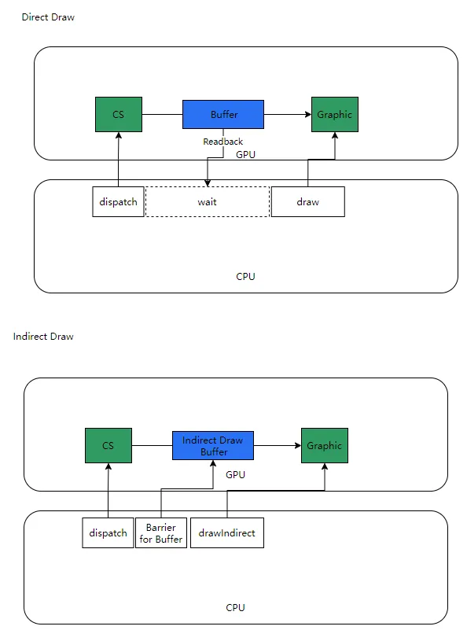

如上图，如果没有Indirect Draw机制，CPU要想根据CS计算的结果去判断该绘制什么，就要等待GPU执行完后回读CS的结果，导致CPU对GPU的强依赖。

API的Indirect Draw所需的参数通常就是一个gpu buffer(indirect draw buffer)，但是我们要按照API的规则填充整个buffer的内容。有些API可以在这个buffer中描述多个drawcall（称为multi inidrect draw），有些API只能描述一个。MultiIndirectdraw机制允许我们将同一个管线状态下多个不连续区段的vertex在一个drawcall中绘制，是一种可以利用做跨mesh的合批机制。

**Vulkan**

Vulkan的IDB中可以指定多个drawcall。基于非index buffer绘制的API为

```c
void vkCmdDrawIndirect(  
  VkCommandBuffer                             commandBuffer,  
  VkBuffer                                    buffer,  
  VkDeviceSize                                offset,  
  uint32_t                                    drawCount,  
  uint32_t                                    stride);  
```

其中指定了IDB的buffer，buffer上的offset，buffer上又多少个drawcall，每个drawcall距离下一个的数据长度。

其中buffer中的数据结构必须定义如下

```c
typedef struct VkDrawIndirectCommand {  
  uint32_t    vertexCount;  
  uint32_t    instanceCount;  
  uint32_t    firstVertex;  
  uint32_t    firstInstance;  
} VkDrawIndirectCommand;  
```

类似，还有基于index buffer间接绘制的API

vkCmdDrawIndexed和对应的buffer结构VkDrawIndexedIndirectCommand

此外VuvkCmdDrawIndirectCountlkan还能指定绘制数量本身从另一个buffer中读取，给出了两个API

和vkCmdDrawIndexedIndirectCount

**Gles**

Gles的Core API中只能支持定义1个drawcall在IDB 中。

API为glDrawElementsIndirect和glDrawArraysIndirect

Gles通过扩展`EXT_multi_draw_indirect`支持multi indirect draw，给出了两个API

MultiDrawArraysIndirectEXT和MultiDrawElementsIndirectEXT

**Metal**

metal中基于IDB的间接绘制也只能指定一个drawcall（但是Metal中，更推荐的方式是更强大的基于ICB的间接绘制，可以支持多个drawcall,见下一小节）。

同样是通过RenderEncoder的API

drawPrimitives和drawIndexedPrimitives。

#### 7.1.3 基于Indirect Command Buffer的间接绘制

前面基于IDB的间接绘制是让drawcall的参数从GPU buffer上获取。

还有另一种间接绘制，是让整个Command Buffer的内容从GPU buffer上获取，这个command buffer叫做indirect command buffer（ICB）。

我们传统的绘制是在CPU encode一个commandbuffer，gpu执行，在ICB下，这个commandbuffer是允许在GPU上由CS根据计算结果填充的，它比IDB的能力更加灵活，ICB不仅可以由GPU决定一系列的完整的drawcall的参数，还包括这些drawcall的管线状态。

只有Metal支持基于ICB的间接绘制。

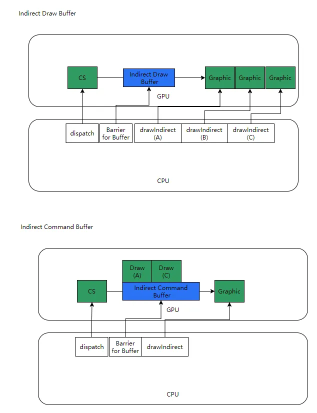

如上图，基于ICB相比IDB对于管线的效率又有了提升，例如在典型的gpu scene的绘制中，对与上面的IDB来说，我们并不能提前在cpu上知道裁剪结果，所以必须为每个材质都提交一个indirect draw，IDB中会被CS充填每个管线下instance的数量和index，即使这个管线的所有instance都被裁剪掉也要提交，只是最终绘制的instance count为0，这增加了不必要的drawcall。

在ICB下，cpu永远只有一个drawcall，因为所有的绘制结果都直接在gpu上编码进入buffer了。

**Metal中的API**

* 1 创建ICB

使用MTLIndirectCommandBufferDescriptor来创建

```c
MTLIndirectCommandBufferDescriptor* icbDescriptor = [MTLIndirectCommandBufferDescriptor new];  

// Indicate that the only draw commands will be standard (non-indexed) draw commands.  
icbDescriptor.commandTypes = MTLIndirectCommandTypeDraw;  
// Indicate that buffers will be set for each command IN the indirect command buffer.  
icbDescriptor.inheritBuffers = NO;  
// Indicate that a max of 3 buffers will be set for each command.  
icbDescriptor.maxVertexBufferBindCount = 3;  
icbDescriptor.maxFragmentBufferBindCount = 0;  

#if defined TARGET_MACOS || defined(__IPHONE_13_0)  
        // Indicate that the render pipeline state object will be set in the render command encoder  
        // (not by the indirect command buffer).  
        // On iOS, this property only exists on iOS 13 and later.  It defaults to YES in earlier  
        // versions  
        if (@available(iOS 13.0, *)) {  
            icbDescriptor.inheritPipelineState = YES;  
        }  
#endif  
        _indirectCommandBuffer = [_device newIndirectCommandBufferWithDescriptor:icbDescriptor  
                                                                 maxCommandCount:AAPLNumObjects  
                                                                         options:0];  
```

* 2 在CPU一侧或GPU一侧填充ICB

ICB上的每个drawcall抽象称为一个数据结构MTLIndirectRenderCommand。

**CPU一侧**

在ICB上生成MTLIndirectRenderCommand，并且调用api设置个dc的渲染管线状态和绘制参数

```c
id<MTLIndirectRenderCommand> ICBCommand =  
    [_indirectCommandBuffer indirectRenderCommandAtIndex:objIndex];  

[ICBCommand setVertexBuffer:_objectParameters  
                     offset:0  
                atIndex:AAPLVertexBufferIndexObjectParams];  

[ICBCommand drawPrimitives:MTLPrimitiveTypeTriangle  
               vertexStart:0  
               vertexCount:vertexCount  
             instanceCount:1  
              baseInstance:objIndex];  
```

**GPU一侧**

把ICB传给shader，在shader中获取某个位置的rendercommand，并设置管线状态和绘制参数

```c
render_command cmd(icb_container->commandBuffer, objectIndex);  

if(visible)  
{  
    cmd.set_vertex_buffer(object_params,   
    cmd.draw_primitives(primitive_type::triangle,  
    object_params[objectIndex].startVertex,object_params[objectIndex].numVertices, 1,  
                        objectIndex);  
}
```

* 3 执行ICB

调用RenderEncoder的API executeCommandsInBuffer，这就是真正的drawcall

同时还需要说明GPU在这个ICB中需要访问的资源

```c
[renderEncoder executeCommandsInBuffer:_indirectCommandBuffer withRange:NSMakeRange(0, AAPLNumObjects)];  
[renderEncoder useResource:_objectParameters usage:MTLResourceUsageRead];
```

### 7.2 Dispatch

Dispatch用来启动一个Compute 管线。

它也分为直接dispatch和间接dispatch两种。

Compute执行时要描述KernelThread的数量布局：

● warp的维度

● warp内thread的维度

他们一般都是三维的

Warp（或叫做Local WorkGroups、Frontwave...）是CS的kenal工作时的重要概念。

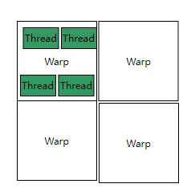

一个warp内的thread是指令流一致的，并且共享一些group内的高速缓存（即L1cache），跨warp的thread之间就只能共享全局的内存了(如L2 cache)。在dispatch的时候都要指定这个warp内的三个维度，如果是间接的dispatch，就是从一个buffer中读取这个维度值，用另一个cs决定这个cs的warp 维度。

Vulkan和Gles只需要在API层面声明Warp的维度，而warp内thread的维度是在Shader中声明的。

**Vulkan**

vkCmdDispatch

vkCmdDispatchIndirect

**Gles**

glDispatchComputeglDispatchComputeIndirect

**Metal**

需要同时声明warp和warp内thread的两种维度，使用computeencoder的API

dispatchThreads

dispatchThreadgroups

如果是indirect的则使用

dispatchThreadgroupsWithIndirectBuffer，它只能从buffer中读取warp的维度值，而thread的维度值需要直接指定

同render command类似，metal也支持对于cs的dispatch录制到ICB上。

首先在ICB上使用indirectComputeCommandAt创建一个MTLIndirectComputeCommand。然后设置这个cs管线的状态和warp，thread维度。

最后用Compute Encoder 的API executeCommandsInBuffer 执行这个ICB。
