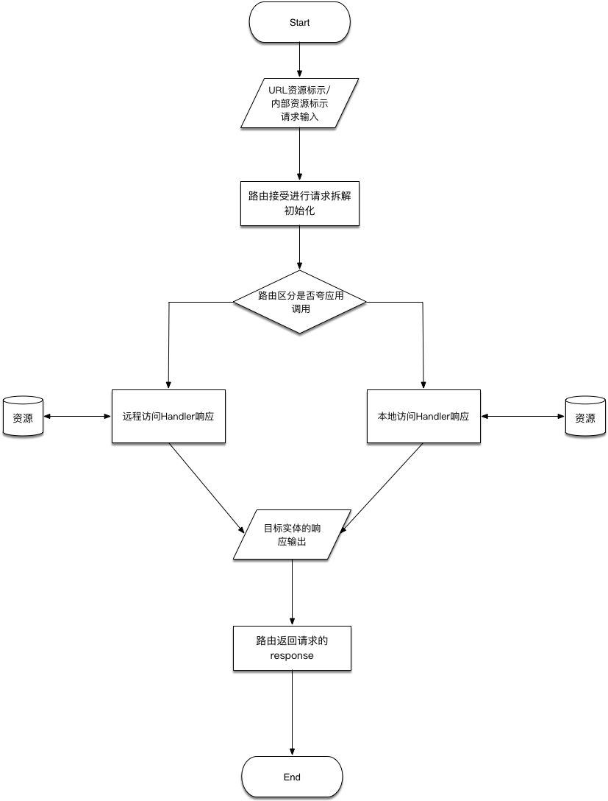
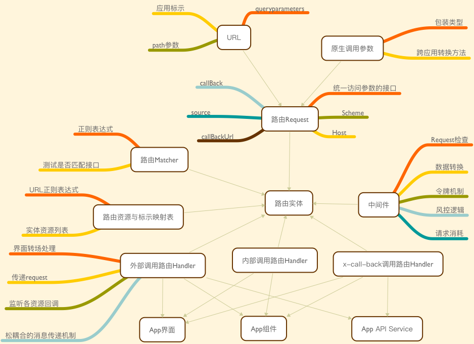
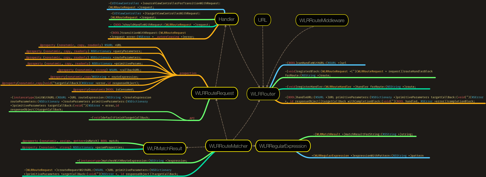
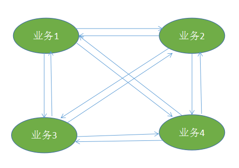
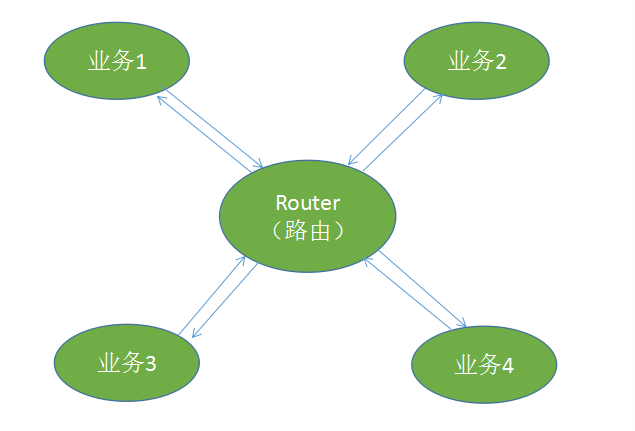
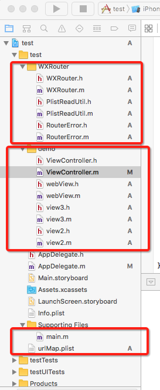
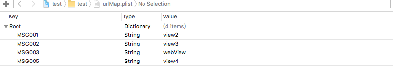
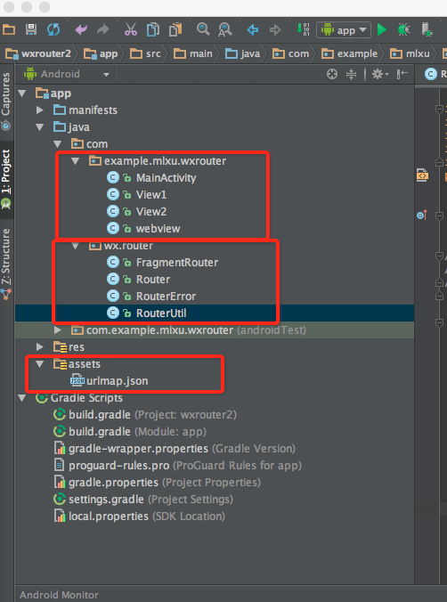

 
<!--BEGIN_DATA
{
    "create_date": "2017-01-05 16:26", 
    "modify_date": "2017-01-05 16:26", 
    "is_top": "0", 
    "summary": "移动端路由层设计", 
    "tags": "iOS、架构", 
    "file_name": "移动端路由层设计.md"
}
END_DATA-->

####
原文出处：<a href='http://www.jianshu.com/p/be7da3ed4100' target='blank'>移动端路由层设计</a>

####什么是移动端路由层：

路由层的概念在服务端是指url请求的分层解析，将一个请求分发到对应的应用处理程序。移动端的路由层指的是将诸如App内页面访问、H5与App访问的访问请求和App间的访问请求，进行分发处理的逻辑层。

####移动端路由层需要解决的问题：

  1. 对外部提供远程访问的功能，实现跨应用调用响应，包括H5应用调用、其他App应用调用、系统访问调用等
  2. 原生页面、模块、组件等定义，统称为资源(Resource)，在跨应用调用和路由层在不同端实现的业务表现需要一致的前提下，需要对资源进行定义，在路由提供内部请求分发的时候则可以提供不依赖对外进行资源定义的功能
  3. 外部调用如何使用统一标示(Uniform)进行表示资源
  4. 如何在移动端统一定义访问请求的过程，从而达成移动端与web端的统一性
  5. 如何更好的兼容iOS、Android的系统访问机制、App链接协议、web端路由机制与前端开发规范等
  6. 如何兼容各平台(Android、iOS)App页面导航机制
  7. 如何解决安全访问问题
  8. 移动端在客户端进行动态配置
  9. ####移动端路由所应用的场景：

  10. H5页面与App原生页面、模块与组件的交互
  11. App与App之间的相互访问
  12. App内部页面跳转、模块调度与组件加载等
  13. 推送与通知系统解除硬编码的逻辑，动态访问原生资源，更好的支持通过通知和推送完成动态页面访问和逻辑执行
  14. Extension等动态调用主App的资源
  15. App实现更复杂的架构MVVM或者是VIPER架构，提供解除业务相互依赖的能力
  16. 以组件化为目的的工程改造，隔离各个业务，以制作单独的组件

####对外如何定义资源

**在路由提供对外的资源请求转发的时候，因为要照顾到其他应用的请求表达方式，比如H5应用或者是其他App的应用的访问请求，定义单纯依赖业务的资源定义就显得有些必要了。**  

举个例子，一个H5的商品详情页，被用户分享，当其他用户看到这个H5应用的页面的时候，点击，如果该用户装了有对应这个H5商品详情页的App的时候，应该跳转到该App的原生商品详情页，如果没有安装则加载这个H5页面，在这个过程中，H5的页面是通过URL进行标识的，那这个URL的标识也应该对照到App的原生页面，但是要只依赖业务标识而不能依赖App的代码实现，比如说iOS端的App的商品详情页叫做DetailViewController，那这个URL是不能包含这个名字的，Android端可能叫DetailActivity，如果不单纯依赖业务，那H5应用就要根据平台来重新发送不同的资源定义的URL，就造成了硬编码问题，H5应用要依赖App的实现逻辑，如果有一天，原生App的页面代码实现变成了GoodDetailViewController，所有依赖DetailViewController这个资源标示的H5应用都要进行更改，就会出现问题。所以路由层的设计应该具备根据业务定义来映射App内的资源定义。
  
常常在设计路由层的时候，我们会更加关注通信行为的细节、如何改进特定通信机制的表现，常常忽略了一个事实，那就是改变应用程序的互动风格比改变协议对整体的表现有更大的影响。 
 
所谓资源，就是一个应用程序提供的不可分割的服务，从这个层面上看，App的资源即是一种实体的存在，可以进行获取和访问，必须进行良好的表示，在有些必要的情况下，必须是独一无二的识别符来表示一个应用程序所提供的服务是什么。表示资源我们更倾向于使用URI进行标示，因为移动端没有一个横跨iOS、Android、Web后端与H5应用的资源标示方式，而URI是web service模式的资源通用表示方式，包括后面将要提到的Android与iOS统一支持的universal link(通用链接)也是借用URI的概念，App路由层所涉及到的资源表示方法还是建议使用URI的标示方式，同时更应该借鉴RESTful风格来架构这一层，原因是App的页面、组件或者说一整套功能性的服务是非常复杂的，相比于H5有更加多与复杂的交互，相比于后端存在更加苛刻的网络环境与多设备多平台的技术考量，所以URI在标示横跨多平台多版本的资源的情况下，能够更好的表示某一个资源实体而不是资源的表现形式。  

在Android与iOS系统中，均支持URL Scheme，所以资源的标示通常会是这个样子：

    
    
    AppScheme://path
    //例如qq app:
    mqq:// 
    //支付宝:
    支付宝alipay://

如果协议是Http或者是Https标示的是Web应用或者是H5应用，你的App也是一个与WebService相同级别的应用，那么URL的协议部分应该是App的唯一标示符，这个主机部分和路径部分则需要我们使用RESTful的风格进行重新设计。  

重点是如何标示资源，例如表示App中的登录服务，那可以表示为：

    
    
    AppScheme://host/login

host为主机部分，在一般的WebService上，在业务表现形式上一般是比较大的业务条线的标示，比方说<https://news.sina.com.cn> ，主机部分是news.sina.com.cn，则标示新浪新闻这条业务线，在App内你的业务条线也应该是
清晰的，假如移动App的主UI框架是Tab分栏，那么每个Tab分栏就是你的业务条线的分割，这点跟WebService应用的导航栏类似，App的资源大多是页面或者是可交互的组件，与UI关系比较大，假如你的Tab有四个：分别叫首页、商品、发现、我的，那么我们可以这样定义：

    
    
    AppScheme://index/
    AppScheme://goods/
    AppScheme://discover/
    AppScheme://user/

当然，也可以有额外的定义，比方说App有Api服务，Api提供实现一个纯数据同步的服务标示，那么这个URL可以设计为：

    
    
    AppScheme://api-asycn/collections?action='insert'&value='***'&&userUoken='*******'&&source="https//***.***.com/collection.html"

由于RESTful风格强调URL的资源标示而不是行为表示，所以”AppScheme://api-asycn/collections”是一个良好的资源标示，表示了一个收藏功能的实体，而”?”后面的GET方式的参数实际上是不得已为之，因为实际上没有Web的http request的实体，所以只能勉强借助GET参数来替代RESTful风格中强调的Accept和Content-Type字段来标示表现层的行为描述。  

当然action与value这样的描述可以根据业务划分，但是重点是要用参数表现形式。

####iOS与Android的系统访问机制、统一的链接协议

苹果的URL Scheme由来已久： [Apple URLScheme](https://developer.apple.com/library/ios/featuredarticles/iPhoneURLScheme_Reference/Introduction/Introduction.html#//apple_ref/doc/uid/TP40007899)，Android平台同样也实现了该功能，使得App能够在沙盒机制的前提下，能够相互调用声明过的服务。由于URL Scheme天生没有返回的callBack机制，著名的App Drafts的作者联合Marco Arment、Justin Williams等人开发了x-callback-URL来做出统一跳转的协议: [x-callback-url](https://www.baidu.com/link?url=pzdBRiyLIyieuoKdc2cnsfULu9zXFtZg9pHcId4JBPjwN6nU3BmNzZfGG8LKDRv7&wd=&eqid=a585a8770000d4540000000458458d4a)，在此不过多表述。  
利用URL-Scheme的机制，可以定义如下的统一链接协议：

  1. 协议部分来标示App应用
  2. 主机Host部分用于标示业务线或者是应用提供的划分好的服务实体，比方说index、discover是业务条线，api-asycn是对外提供的api，pushService是App内部的推送服务等。
  3. 路径部分则可以是细分的页面、组件或者服务的标示
  4. 参数定义有一些是必要的，比如说action来标示动作，比方说可以使用get标示获取、insert增加，userToken表示安全的用户令牌，source表示来源，当然像是userToken与source这些都是路由层需要进行解析和验证的，而action则是业务相关的参数，这一点在路由曾设计的时候需要进行详细区分

####统一访问请求过程

  

route流程图.png

  
整个统一的访问请求过程如图，关于最后的response返回有一些说明：  
在WebService的工作栈中，http的request与response是有标准协议规范的，而App的路由层只是套用的URI的资源标示和RESTFul风格的交互，没有标准的request和response结构，这部分实现在App内部，response对外部调用系统而言关心的有三个重要元素，资源状态码、返回值与错误，在路由层在响应外部调用的时候需要返回这三种元素

####路由层逻辑结构

  

App Route逻辑结构图.png

####路由层安全

路由层的安全包含两个方面：

  1. 跨应用时，需要注意注入攻击，做到敏感参数加密防篡改，同时需要注意路由层应提供能够实现风控的机制
  2. 跨业务系统的时候，需要开启会话访问机制，通过令牌或者是session会话等来实现路由层身份认证

####路由层实现

敬请期待下一篇文章：《一步步构建iOS路由》

####番外：App孤岛、API经济与App开放性讨论

#####什么叫App孤岛

移动操作系统中的App一般都采用沙盒机制来严格限制访问权限，App与App之间是不通的，用户往往会安装大量的App，比方说找吃饭的地方是大众点评，聊天是微信，地图是高德等等，那么我们想象一下没有URL Scheme的世界，你在大众点评上找到了一个好吃的地方，然后需要切换到高德去找找在哪，然后脑子记录下来地址然后在微信上发给你的朋友，这么一个过程中，众多App之间是不能传递信息和相互协作的，那一个个App就成了信息孤岛，给用户带来极大的不便，而实现了URL Scheme的App一般都是大厂，用户过亿，给上亿人带来了方便。

#####打破App孤岛

本质上URL
Scheme是操作系统支持的，也就是说，打破App孤岛，必须过操作系统这一关，而无论是第三方开发者还是Apple与Google都在努力打破信息孤岛。  

Apple与Google分别在iOS9与Android M支持了universal link以打通H5应用和原生应用的屏障。 
 
Apple则在iOS操作系统中通过Spotlight应用内搜索、AppGroups、AppExtension、ShareExtension与SiriKit等打破原生应用之间的信息屏障。 
 
Google则通过PWA希望替代原生应用来实现大一统。
  
第三方开发者们也积极推动着这一趋势。比如说：  
前面提到的著名的App Drafts的作者联合Marco Arment、Justin Williams 等人开发了x-callback-URL来做出统一跳转的协议: [x-callback-url](https://www.baidu.com/link?url=pzdBRiyLIyieuoKdc2cnsfULu9zXFtZg9pHcId4JBPjwN6nU3BmNzZfGG8LKDRv7&wd=&eqid=a585a8770000d4540000000458458d4a)，希望大部分App开发者能够响应号召，更好的进行开发。  
国内的一些深度链接的开发者平台 [DeepShare - Share your App with the
world](http://deepshare.io/redirect-once/)  
锤子手机开源的onestep等等。  

作为一名开发者，构建安全高效而开放的路由实际上不仅仅满足技术架构的需求更能为打破App孤岛，更好的发展移动端生态做出贡献。

#####什么叫做API经济

> API经济是基于API所产生的经济活动的总和，在当今发展阶段主要包括API业务，以及通过API进行的业务功能、性能等方面的商业交易。API经济是当今各行
业（零售、金融、物联网、医疗等）中驱动数字变革的主要力量。 ———百度百科

为什么这里需要谈到API经济呢？我们都知道经济学的第一要务是效率优先原则，就像上面我们聊到的App孤岛，在日益便利的移动化时代，实际上降低了信息共享的效率，
而增加了用户的操作成本，则会阻碍这个平台上用户的活跃度，那上层利用移动平台的可能性就会被限制。比如，二维码和NFC解决了pos终端、商家与支付App之间的信息共享问题，就导致了繁盛的线下支付经济，同样的道理，各系统之间无论是App、WebServices或者是其他应用能够开放API则会形成平台或者产业上的信息共
享的规模效应，则会形成良性发展。  

作为App开发者，你需要实现路由这一层，才能够支持跨应用之间的调用，才能放开你想开发的API。  

如果一个App的后端Services能够和App一起开放API，那则更加具有优势。比方说微信，如果开放了收藏的WebService API接口，同时微信App也开放URLScheme的收藏接口，那么无论在浏览器、手机中都能无缝实现随时随地的收藏一切内容，极大的方便用户。

#####App开放性讨论

这个环节主要是讨论开放的时候要注意哪些：

  1. App类型(决定要不要开放)
  2. 路由安全(决定开放程度)
  3. 开放时机  
未完，希望大家多多评论，一起讨论。

####
原文出处：<a href='http://www.jianshu.com/p/3a902f274a3d' target='blank'>一步步构建iOS路由</a>

接上一篇[移动端路由层设计](http://www.jianshu.com/p/be7da3ed4100)  
为啥要说iOS路由呢？  

路由层其实在逻辑上的设计都是一样的，关于对界面跳转的实现部分却与Android平台和iOS平台上的导航机制有着非常紧密的关系，Android操作系统有着天然的架构优势，Intent机制可以协助应用间的交互与通讯，是对调用组件和数据传递的描述，本身这种机制就解除了代码逻辑和界面之间的依赖关系，只有数据依赖。而iOS的界面导航和转场机制则大部分依赖UI组件各自的实现，所以如何解决这个问题，iOS端路由的实现则比较有代表性。  

其实说白一点，路由层解决的核心问题就是原来界面或者组件之间相互调用都必须相互依赖，需要导入目标的头文件、需要清楚目标对象的逻辑，而现在全部都通过路由中转，只依赖路由，或者依靠一些消息传递机制连路由都不依赖。其次，路由的核心逻辑就是目标匹配，对于外部调用的情况来说，URL如何匹配Handler是最为重要的，匹配就必然用到正则表达式。了解这些关键点以后就有了设计的目的性，let‘s do it~

####设计类图：

  

RouteClassMap.png

  
这里面有如下几个类：

  1. WLRRouteRequest，路由层的请求，无论是跨应用的外部调用还是内部调用，最后都形成一个路由请求，该请求包含了URL上的queryparameters和路径参数，还有内部调用时直接传入的原生参数，还有请求发起者对目标预留的回调block
  2. WLRRouteHandler，路由层的handler处理，handler接收一个WLRRouteRequest对象，来完成是否是界面跳转，还是组件加载，还是内部逻辑
  3. WLRRouter，路由核心对象，内部持有注册的Handler，比方说负责界面跳转的Handler，负责组件加载的Handler，负责API的Handler等等，路由的作用就是将外部调用传入的URL或者是内部调用传入的target，在内部匹配上对应的handler，然后调用生命周期方法，完成处理过程，当然，图中还有route的中间件，实际上是预留AOP的口子，方面后期扩展
  4. WLRRouteMatcher，用以处理外部调用的URL是否能与预设的正则表达式匹配，在WLRRouter中，每一次注册一个handler，都会用一个URL匹配的表达式生成一个WLRRouteMatcher
  5. WLRRegularExpression，继承NSRegularExpression，用以匹配URL，WLRRouteMatcher内部有一个WLRRegularExpression对象，WLRRouteMatcher接受一个URL，会使用WLRRegularExpression生成一个WLRMatchResult对象，来确定是否匹配成功，如果匹配成果则将URL上的路径参数给取出来
  6. WLRMatchResult，用以描述WLRRegularExpression的匹配结果，包含路径参数

####工作流程：

  1. App启动实例化WLRRouter对象
  2. 实例化WLRRouteHandler对象
  3. WLRRouter对象挂载WLRRouteHandler实例与URL的表达式相对应，WLRRouter内部生成一个WLRRouteMatcher对象，与URL的表达式相对应
  4. 外部调用的URL和callback传入WLRRouter对象
  5. WLRRouter对象遍历内部持有的URL的匹配表达式，并找到每一个WLRRouteMatcher对象，将URL传入看是否能返回WLRRouteRequest对象
  6. 将WLRRouteRequest对象传入对应的WLRRouteHandler对象
  7. WLRRouteHandler对象根据WLRRouteRequest寻找到TargetViewController和SourceViewController，在生命周期函数里，完成参数传递与视图转场

####WLRRouteRequest:

了解了以上，我们从WLRRouteRequest入手。  
其实WLRRouteRequest跟NSURLRequest差不多，不过WLRRouteRequest继承NSObject，实现NSCopying协议，大概如下：

    
    
    #import <Foundation/Foundation.h>
    @interface WLRRouteRequest : NSObject<NSCopying>
    //外部调用的URL
    @property (nonatomic, copy, readonly) NSURL *URL;
    //URL表达式，比方说调用登录界面的表达式可以为：AppScheme://user/login/138********，那URL的匹配表达式可以是：/login/:phone([0-9]+),路径必须以/login开头，后面接0-9的电话号码数字，当然你也可以直接把电话号码的正则匹配写全
    @property(nonatomic,copy)NSString * routeExpression;
    //如果URL是AppScheme://user/login/138********?/callBack="",那么这个callBack就出现在这
    @property (nonatomic, copy, readonly) NSDictionary *queryParameters;
    //这里面会出现{@"phone":@"138********"}
    @property (nonatomic, copy, readonly) NSDictionary *routeParameters;
    //这里面存放的是内部调用传递的原生参数
    @property (nonatomic, copy, readonly) NSDictionary *primitiveParams;
    //自动检测窃取回调的callBack 的Url
    @property (nonatomic, strong) NSURL *callbackURL;
    //目标的viewcontrolller或者是组件可以通过这个
    @property(nonatomic,copy)void(^targetCallBack)(NSError *error,id responseObject);
    //用以表明该request是否被消费
    @property(nonatomic)BOOL isConsumed;
    //简便方法，用以下标法取参数
    - (id)objectForKeyedSubscript:(NSString *)key;
    //初始化方法
    -(instancetype)initWithURL:(NSURL *)URL routeExpression:(NSString *)routeExpression routeParameters:(NSDictionary *)routeParameters primitiveParameters:(NSDictionary *)primitiveParameters targetCallBack:(void(^)(NSError * error,id responseObject))targetCallBack;
    -(instancetype)initWithURL:(NSURL *)URL;
    //默认完成目标的回调
    -(void)defaultFinishTargetCallBack;
    @end

NSURLRequest其实应该是个值类型的对象，所以实现拷贝协议，该对象的实现部分没有什么可讲的，对照源代码查阅即可。

####WLRRouteHandler

    
    
    #import <Foundation/Foundation.h>
    @class WLRRouteRequest;
    @interface WLRRouteHandler : NSObject
    //即将handle某一个请求
    - (BOOL)shouldHandleWithRequest:(WLRRouteRequest *)request;
    //根据request取出调用的目标视图控制器
    -(UIViewController *)targetViewControllerWithRequest:(WLRRouteRequest *)request;
    //根据request取出来源的视图控制器
    -(UIViewController *)sourceViewControllerForTransitionWithRequest:(WLRRouteRequest *)request;
    //开始进行转场
    -(BOOL)transitionWithRequest:(WLRRouteRequest *)request error:(NSError *__autoreleasing *)error;
    @end

当WLRRouter对象完成了URL的匹配生成Request，并寻找到Handler的时候，首先会调用`\-(BOOL)shouldHandleWithRequest:(WLRRouteRequest *)request;`，来确定handler是否愿意处理，如果愿意，则调用`-(BOOL)transitionWithRequest:(WLRRouteRequest *)request error:(NSError *__autoreleasing *)error;`，内部则通过便利方法获取targetViewController与SourceViewController，然后进行转场，核心方法的实现为：

    
    
    -(BOOL)transitionWithRequest:(WLRRouteRequest *)request error:(NSError *__autoreleasing *)error{
        UIViewController * sourceViewController = [self sourceViewControllerForTransitionWithRequest:request];
        UIViewController * targetViewController = [self targetViewControllerWithRequest:request];
        if ((![sourceViewController isKindOfClass:[UIViewController class]])||(![targetViewController isKindOfClass:[UIViewController class]])) {
            *error = [NSError WLRTransitionError];
            return NO;
        }
        if (targetViewController != nil) {
            targetViewController.wlr_request = request;
        }
        if ([self preferModalPresentationWithRequest:request]||![sourceViewController isKindOfClass:[UINavigationController class]]) {
            [sourceViewController presentViewController:targetViewController animated:YES completion:nil];
        }
        else if ([sourceViewController isKindOfClass:[UINavigationController class]]){
            UINavigationController * nav = (UINavigationController *)sourceViewController;
            [nav pushViewController:targetViewController animated:YES];
        }
        return YES;
    }
    - (BOOL)preferModalPresentationWithRequest:(WLRRouteRequest *)request;{
        return NO;
    }

这里根据SourceController的类型进行判断，其实request对象的信息足够可以判断目标视图应该如何打开，从本质上来讲，URL的匹配表达式是跟业务强关联的也是跟UI交互逻辑强关联的，transitionWithRequest方法实现里，你大可以继承一下，然后重写转场过程，甚至你可以在这自己设置iOS7自定义的转场，提供动画控制器和实现转场协议的对象，进而可以整体的控制Appp内部的实现。

####WLRRegularExpression

该类继承NSRegularExpression

    
    
    #import <Foundation/Foundation.h>
    @class WLRMatchResult;
    @interface WLRRegularExpression : NSRegularExpression
    //传入一个URL返回一个匹配结果
    -(WLRMatchResult *)matchResultForString:(NSString *)string;
    //根据一个URL的表达式创建一个WLRRegularExpression实例
    +(WLRRegularExpression *)expressionWithPattern:(NSString *)pattern;
    @end

该对象主要的功能是将一个URL传入查看是否匹配，并且将表达式上声明的路径参数从URL上取下来。  
比说，我们设置的URL匹配的表达式是: login/:phone([0-9]+)，那AppScheme://user/login/138****** 这样的URL应该是匹配，并且将138的手机号取出来，对应到phone上，这个过程必须用到正则表达式的分组提取子串的功能，:phone是约定好的提取子串的值对应的key的名字，其实这个url的正则表达式应该是： /login/([0-9]+)$，**那么WLRRegularExpression对象需要知道需要提取所有子串的key还有将URL匹配的表达式转换为真正的正则表达式。**

    
    
    -(instancetype)initWithPattern:(NSString *)pattern options:(NSRegularExpressionOptions)options error:(NSError * _Nullable __autoreleasing *)error{
    //初始化方法中将URL匹配的表达式pattern转换为真正的正则表达式
        NSString *transformedPattern = [WLRRegularExpression transfromFromPattern:pattern];
    //用转化后的结果初始化父类
        if (self = [super initWithPattern:transformedPattern options:options error:error]) {
    //同时将需要提取的子串的值的Key保存到数组中
            self.routerParamNamesArr = [[self class] routeParamNamesFromPattern:pattern];
        }
        return self;
    }
    //转换为正则表达式
    +(NSString*)transfromFromPattern:(NSString *)pattern{
    //将pattern拷贝
        NSString * transfromedPattern = [NSString stringWithString:pattern];
    //利用:[a-zA-Z0-9-_][^/]+这个正则表达式，将URL匹配的表达式的子串key提取出来，也就是像 /login/:phone([0-9]+)/:name[a-zA-Z-_]这样的pattern，需要将:phone([0-9]+)和:name[a-zA-Z-_]提取出来
        NSArray * paramPatternStrings = [self paramPatternStringsFromPattern:pattern];
        NSError * err;
    //再根据:[a-zA-Z0-9-_]+这个正则表达式，将带有提取子串的key全部去除，比如将:phone([0-9]+)去除:phone改成([0-9]+)
        NSRegularExpression * paramNamePatternEx = [NSRegularExpression regularExpressionWithPattern:WLRRouteParamNamePattern options:NSRegularExpressionCaseInsensitive error:&err];
        for (NSString * paramPatternString in paramPatternStrings) {
            NSString * replaceParamPatternString = [paramPatternString copy];
            NSTextCheckingResult * foundParamNamePatternResult =[paramNamePatternEx matchesInString:paramPatternString options:NSMatchingReportProgress range:NSMakeRange(0, paramPatternString.length)].firstObject;
            if (foundParamNamePatternResult) {
                NSString *paramNamePatternString =[paramPatternString substringWithRange: foundParamNamePatternResult.range];
                replaceParamPatternString = [replaceParamPatternString stringByReplacingOccurrencesOfString:paramNamePatternString withString:@""];
            }
            if (replaceParamPatternString.length == 0) {
                replaceParamPatternString = WLPRouteParamMatchPattern;
            }
            transfromedPattern = [transfromedPattern stringByReplacingOccurrencesOfString:paramPatternString withString:replaceParamPatternString];
        }
        if (transfromedPattern.length && !([transfromedPattern characterAtIndex:0] == '/')) {
            transfromedPattern = [@"^" stringByAppendingString:transfromedPattern];
        }
    //最后结尾要用$符号
        transfromedPattern = [transfromedPattern stringByAppendingString:@"$"];
    //最后会将/login/:phone([0-9]+)转换为login/([0-9]+)$
        return transfromedPattern;
    }

在Matcher对象匹配一个URL的时候

    
    
    -(WLRMatchResult *)matchResultForString:(NSString *)string{
    //首先通过自身方法将URL进行匹配得出NSTextCheckingResult结果的数组
        NSArray * array = [self matchesInString:string options:0 range:NSMakeRange(0, string.length)];
        WLRMatchResult * result = [[WLRMatchResult alloc]init];
        if (array.count == 0) {
            return result;
        }
        result.match = YES;
        NSMutableDictionary * paramDict = [NSMutableDictionary dictionary];
    //遍历NSTextCheckingResult结果
        for (NSTextCheckingResult * paramResult in array) {
    //再便利根据初始化的时候提取的子串的Key的数组
            for (int i = 1; i<paramResult.numberOfRanges&&i <= self.routerParamNamesArr.count;i++ ) {
                NSString * paramName = self.routerParamNamesArr[i-1];
    //将值取出，然后将key和value放入到paramDict
                NSString * paramValue = [string substringWithRange:[paramResult rangeAtIndex:i]];
                [paramDict setObject:paramValue forKey:paramName];
            }
        }
    //最后赋值给WLRMatchResult对象
        result.paramProperties = paramDict;
        return result;
    }

核心代码总共80多行，源码大家可以详阅

####WLRRouteMatcher

    
    
    #import <Foundation/Foundation.h>
    @class WLRRouteRequest;
    @interface WLRRouteMatcher : NSObject
    //传入URL匹配的表达式，获取一个matcher实例
    +(instancetype)matcherWithRouteExpression:(NSString *)expression;
    //传入URL，如果能匹配上，则生成WLRRouteRequest对象，同时将各种参数解析好交由WLRRouteRequest携带
    -(WLRRouteRequest *)createRequestWithURL:(NSURL *)URL primitiveParameters:(NSDictionary *)primitiveParameters targetCallBack:(void(^)(NSError *, id responseObject))targetCallBack;
    @end

属性有如下：

    
    
    //scheme
    @property(nonatomic,copy) NSString * scheme;
    //WLRRegularExpression的实例 
    @property(nonatomic,strong)WLRRegularExpression * regexMatcher;
    //匹配的表达式
    @property(nonatomic,copy)NSString * routeExpressionPattern;

初始化方法：

    
    
    -(instancetype)initWithRouteExpression:(NSString *)routeExpression{
        if (![routeExpression length]) {
            return nil;
        }
        if (self = [super init]) {
    //将scheme与path部分分别取出
            NSArray * parts = [routeExpression componentsSeparatedByString:@"://"];
            _scheme = parts.count>1?[parts firstObject]:nil;
            _routeExpressionPattern =[parts lastObject];
    //将path部分当做URL匹配表达式生成WLRRegularExpression实例
            _regexMatcher = [WLRRegularExpression expressionWithPattern:_routeExpressionPattern];
        }
        return self;
    }

匹配方法：

    
    
    -(WLRRouteRequest *)createRequestWithURL:(NSURL *)URL primitiveParameters:(NSDictionary *)primitiveParameters targetCallBack:(void (^)(NSError *, id))targetCallBack{
        NSString * urlString = [NSString stringWithFormat:@"%@%@",URL.host,URL.path];
        if (self.scheme.length && ![self.scheme isEqualToString:URL.scheme]) {
            return nil;
        }
    //调用self.regexMatcher将URL传入，获取WLRMatchResult结果，看是否匹配
        WLRMatchResult * result = [self.regexMatcher matchResultForString:urlString];
        if (!result.isMatch) {
            return nil;
        }
    //如果匹配，则将result.paramProperties路径参数传入，初始化一个WLRRouteRequest实例
        WLRRouteRequest * request = [[WLRRouteRequest alloc]initWithURL:URL routeExpression:self.routeExpressionPattern routeParameters:result.paramProperties primitiveParameters:primitiveParameters targetCallBack:targetCallBack];
        return request;
    }

####WLRRouter

    
    
    @class WLRRouteRequest;
    @class WLRRouteHandler;
    @interface WLRRouter : NSObject
    //注册block回调的URL匹配表达式，可用作内部调用
    -(void)registerBlock:(WLRRouteRequest *(^)(WLRRouteRequest * request))routeHandlerBlock forRoute:(NSString *)route;
    //注册一个WLRRouteHandler对应的URL匹配表达式route
    -(void)registerHandler:(WLRRouteHandler *)handler forRoute:(NSString *)route;
    //判断url是否可以被handle
    -(BOOL)canHandleWithURL:(NSURL *)url;
    -(void)setObject:(id)obj forKeyedSubscript:(NSString *)key;
    -(id)objectForKeyedSubscript:(NSString *)key;
    //调用handleURL方法，传入URL、原生参数和targetCallBack和完成匹配的completionBlock
    -(BOOL)handleURL:(NSURL *)URL primitiveParameters:(NSDictionary *)primitiveParameters targetCallBack:(void(^)(NSError *, id responseObject))targetCallBack withCompletionBlock:(void(^)(BOOL handled, NSError *error))completionBlock;

在实现部分，有三个属性：

    
    
    //每一个URL的匹配表达式route对应一个matcher实例，放在字典中
    @property(nonatomic,strong)NSMutableDictionary * routeMatchers;
    //每一个URL匹配表达式route对应一个WLRRouteHandler实例
    @property(nonatomic,strong)NSMutableDictionary * routeHandles;
    //每一个URL匹配表达式route对应一个回调的block
    @property(nonatomic,strong)NSMutableDictionary * routeblocks;

在Route挂在Handler和回调的block的时候:

    
    
    -(void)registerBlock:(WLRRouteRequest *(^)(WLRRouteRequest *))routeHandlerBlock forRoute:(NSString *)route{
        if (routeHandlerBlock && [route length]) {
    //首先添加一个WLRRouteMatcher实例
            [self.routeMatchers setObject:[WLRRouteMatcher matcherWithRouteExpression:route] forKey:route];
    //删除route对应的handler对象
            [self.routeHandles removeObjectForKey:route];
    //将routeHandlerBlock和route存入对应关系的字典中
            self.routeblocks[route] = routeHandlerBlock;
        }
    }
    -(void)registerHandler:(WLRRouteHandler *)handler forRoute:(NSString *)route{
        if (handler && [route length]) {
    //首先生成route对应的WLRRouteMatcher实例
            [self.routeMatchers setObject:[WLRRouteMatcher matcherWithRouteExpression:route] forKey:route];
    //删除route对应的block回调
            [self.routeblocks removeObjectForKey:route];
    //设置route对应的handler
            self.routeHandles[route] = handler;
        }
    }

接下来完善handle方法:

    
    
    -(BOOL)handleURL:(NSURL *)URL primitiveParameters:(NSDictionary *)primitiveParameters targetCallBack:(void(^)(NSError *error, id responseObject))targetCallBack withCompletionBlock:(void(^)(BOOL handled, NSError *error))completionBlock{
        if (!URL) {
            return NO;
        }
        NSError * error;
        WLRRouteRequest * request;
        __block BOOL isHandled = NO;
    //遍历routeMatchers中的WLRRouteMatcher对象，将URL传入对象，看是否能得到WLRRouteRequest对象
        for (NSString * route in self.routeMatchers.allKeys) {
            WLRRouteMatcher * matcher = [self.routeMatchers objectForKey:route];
            WLRRouteRequest * request = [matcher createRequestWithURL:URL primitiveParameters:primitiveParameters targetCallBack:targetCallBack];
            if (request) {
    //如果得到WLRRouteRequest对象，说明匹配成功，则进行handler的生命周期函数调用或是这block回调
                isHandled = [self handleRouteExpression:route withRequest:request error:&error];
                break;
            }
        }
        if (!request) {
            error = [NSError WLRNotFoundError];
        }
    //在调用完毕block或者是handler的生命周期方法以后，回调完成的completionHandler
        [self completeRouteWithSuccess:isHandled error:error completionHandler:completionBlock];
        return isHandled;
    }
    //根据request进行handler的生命周期函数调用或者是block回调
    -(BOOL)handleRouteExpression:(NSString *)routeExpression withRequest:(WLRRouteRequest *)request error:(NSError *__autoreleasing *)error {
        id handler = self[routeExpression];
    //self.routeHandles和self.routeblocks拿到route对应的回调block或者是handler实例
        if ([handler isKindOfClass:NSClassFromString(@"NSBlock")]) {
            WLRRouteRequest *(^blcok)(WLRRouteRequest *) = handler;
    //调用回调的block
            WLRRouteRequest * backRequest = blcok(request);
    //判断block里面是否消费了此request，如果没有而目标设置了目标回调targetCallBack，那么在此进行默认回调
            if (backRequest.isConsumed==NO) {
                if (backRequest.targetCallBack) {
                    dispatch_async(dispatch_get_main_queue(), ^{
                        backRequest.targetCallBack(nil,nil);
                    });
                }
            }
            return YES;
        }
        else if ([handler isKindOfClass:[WLRRouteHandler class]]){
    //拿到url对应的handler对象后，先调用handler的shouldHandleWithRequest方法，如果返回YES，则调用进行转场的transitionWithRequest方法
            WLRRouteHandler * rHandler = (WLRRouteHandler *)handler;
            if (![rHandler shouldHandleWithRequest:request]) {
                return NO;
            }
           return [rHandler transitionWithRequest:request error:error];
        }
        return YES;
    }

以上我们可以看到，Route将匹配的逻辑单独封装到WLRRouteMatcher对象中，将匹配后的结果生成WLRRouteRequest实例以携带足够完整的
数据，同时将真正处理视图控制器的转场或者是组件的加载或者是未来可能拓展的handle业务封装到WLRRouteHandler实例中，匹配逻辑对应的处理逻辑干
净分离，匹配逻辑可单独塑造业务匹配，处理逻辑可以通过继承扩展或者冲洗WLRRouteHandler的生命周期函数来更好的处理回调业务。如果WLRRouteH
andler不能提供足够多的扩展性，则可以使用block回调最大限度的进行扩展。  
以上，就是路由部分的整体实现。

####转场的扩展

在WLRRouteHandler中，其实我们可以单独控制路由经过的页面跳转的转场。

    
    
    -(UIViewController *)targetViewControllerWithRequest:(WLRRouteRequest *)request{
    }
    -(UIViewController *)sourceViewControllerForTransitionWithRequest:(WLRRouteRequest *)request{
    }
    -(BOOL)transitionWithRequest:(WLRRouteRequest *)request error:(NSError *__autoreleasing *)error{
    }

这样的生命周期函数是不是很像UIViewControllerContextTransitioning转场上下文的协议的设定？`\- (nullable __kindof UIViewController *)viewControllerForKey:(UITransitionContextViewControllerKey)key;`方法使上下文提供目标控制器和源控制器，其实在handler中你完全可以自定义一个子类，在transitionWithRequest方法里，设置遵守UIViewControllerTransitioningDelegate的代理，然后在此提供遵守 UIViewControllerAnimatedTransitioning的动画控制器，然后自定义转场上下文，实现自定义UI转场，而对应的匹配逻辑是与此无关的，我们就可以在路由曾控制全局的页面转场效果。对自定义转场不太熟悉的同学请移步我之前的文章:  
[ContainerViewController的ViewController
转场](http://www.jianshu.com/p/85447e28f91d)

####路由的安全

有两个方面可以去做

  1. WLRRouteHandler实例中， `-(BOOL)shouldHandleWithRequest:(WLRRouteRequest *)request`中可以检测request中的参数，比方说效验source或者是效验业务参数完整等
  2. WLRRouter实例中handleURL方法，将在随后的WLRRoute的0.0.2版本中加入中间件的支持，就是在找到handler之前，将按照中间件注册的顺序回调中间件，而我们可以在中间件中实现风控业务、认证机制、加密验签等等

####路由的效率

目前我们实现的路由是一个同步阻塞型的，在处理并发的时候可能会出现一些问题，或者是在注册比较多的route表达式以后，遍历和匹配的过程会损耗性能，比较好的实现
方式是，将Route修改成异步非阻塞型的，但是API全部要换成异步API，起步我们先把同步型的搞定，随后慢慢提供异步版本的路由~

####路由的使用

在大部分App实践MVVM架构或者更为复杂的VIPER架构的时候，除了迫切需要一个比较解耦的消息传递机制，如何更好的剥离目标实体的获取和配合UIKit这一层的转场逻辑是一项比较复杂的挑战，路由实际上是充当MVVM的ViewModel中比较解耦的目标获取逻辑和VIPER中Router层，P与V的调用全部靠Router转发。  

在实施以组件化为目的的工程化改造中，如何抽离单独业务为组件，比较好的管理业务与业务之间的依赖，就必须使用一个入侵比较小的Route，WLRRoute入侵的地方在于WLRRouteHandler的transitionWithRequest逻辑中，通过一个UIViewController的扩展，给targetViewController.wlr_request = request;设置了WLRRouteRequest对象给目标业务，但虽然如此，你依旧可以重写WLRRouteHandler的transitionWithRequest方法，来构建你自己参数传递方式，这一点完全取决于你如何更好的使得业务无感知而使用路由。

最后附上代码地址：  
喜欢的来个星吧…  
<https://github.com/Neojoke/WLRRoute>  
12.27更新：  
感谢这位同学，写了一篇讨论性的 [文章](http://www.jianshu.com/p/a6f6086b54ac)，对我启发很大，我尊敬以及欣赏能够深入思考并且愿意分享自己的idea的人。

####
原文出处：<a href='http://www.jianshu.com/p/a6f6086b54ac' target='blank'>WLRRoute: 一个移动端路由</a>

看了一篇关于移动端路由的文章[一步步构建iOS路由](http://www.jianshu.com/p/3a902f274a3d?utm_campaign=hugo&utm_medium=reader_share&utm_content=note&utm_source=weibo), 感觉写的多, 写的也很好,所以我决定去看看源码, 在用我自己的语言来重新总结一下.

其实说到路由, 不由得就想起了组件化, 但是这两者是有本质化区别的, 路由只是实现组件化甚至插件化的一种手段而已, 作者之前也写过一篇关于组件化的文章,
就不多说了.

路由的作用在我看来就是把 任务/行为 都封装成一个一个请求,或者我们称之为任务. 然后由路由器统一管理和处理, 从而就可以很好地监听任务的执行.

其实更极端点的说法就是路由器就是一个任务调度中心, 我们可以获取整个任务的前因和后果, 其实这里是一个打印 log 的好地方, 集中处理记录所有的行为.
当然我们如果通过中间件这种方式来操作.

大家可以先看看原作者的博文, 再来看我这个狗尾续貂之作.

##简单说一下路由器的工作流吧

  1. 首先我们获取到一个 url, 可以是 内部调用 也可以是外部调用, `https://www.abc.com/123`, `action://doSomething` 这其中包括两个部分 scheme 和 path, 我们在适配的时候会根据这两部分得到对应的 handler
  2. 我们向路由器根据 url 注册 handler 和 blockHandler, 这里的 url 支持正则和如有参数, 以代码中的例子 
    
         [self.router registerHandler:[[WLRSignHandler alloc]init] forRoute:@"/signin/:phone([0-9]+)"];

  3. 我们还可以设置一些满足 WLRRouteMiddleware 协议的中间件, 来处理和终止我们的每次 request
  4. 之前都是一些配置工作,现在我们开始正式的工作流
  5. WLRRouter 去 handler 对应的 url, 如果 被适配器 WLRRouteMatcher适配到, 则生成对应的 WLRRouteRequest, 否则结束任务.
  6. 用所有的中间件依次处理 WLRRouteRequest, 发生错误或者任务被中间件中断则结束
  7. 找到对应的 handler 来执行 WLRRouteRequest

更细节的东西我建议大家去看源码,或者 WLRRoute 作者的博客.

##一些思考和改善

首先说现在的功能其实已经可以满足大多数的使用场景, 但是如果我们把路由看做一个功能强大的任务调度中心的话, 那么就引出了下面的我的一系列思考和问题.  
具体的解决方案我就不说了, 我希望大家自己想一下, 我提出的这些问题是否是有必要的, 如果有必要, 应该如何设计代码?

###中间件的优化?

目前的中间件能做的事情就是在任务开始之前得到 request , 然后进行操作, 可以返回结果结束任务, 或者直接抛出错误.  
但是, 我们的任务不仅仅是推出一个新的界面的话, 如果也包括执行一段逻辑的话, 那么是否中间件也要对 request 的 reponse 进行处理呢?
比如判断逻辑执行的效率, 计算执行时间等等.  
在我的想法中, 中间件是这么执行的, 感觉可以做很多事情的样子

    
    
    - Middleware1
       - Middleware2
           - handler
        -Middleware2
    - Middleware1

###任务异步执行?

其实现在作者是有任务执行的, 是使用 block 的时候, 但是在我看来其实都不应该分 block 和 handler, 应该都封装成 handler, 换句话暴露在外面的 block 接口只是一个语法糖, 里面改成 同时支持同步和异步执行的 handler

###添加上下文 Context?

移动端路由一个很大的不同就是传递参数比较纠结, 如果只通过 url, 我们只能传递一些字符串参数, 不能传递对象. 尤其是在 app 内唤起路由的时候, 往往传递对象参数是一个很重要的需求. 
庆幸的是,我们的请求被封装成了 WLRRouteRequest, 那么是否可以让这个对象持有这些参数, 在 handler 中直接读取呢?  
那么继续想下去, 我们其实有可能在处理任务的时候需要很多参数,有些参数可能是一些环境参数,把所有东西都放到 request 中? 我在想, 是否可以给每个request 创建 一个 context, 然后把这些参数都赋值给 上下文呢

###所有请求都使用统一的中间件?

目前, 我们的所有中间件都是全局的, 但是可能我你需要所有请求都执行对应的中间件呢?  
我其实期望的是可以针对对应的适配器添加对应的中间件, 比如我有一些任务是对数据库的操作, 那么我系网针对这些任务添加记录时间的中间件.

####组适配器?

如果我们有几个任务的 url 的前缀相同, 我们是否可以先通过前缀得到一个  
WLRGroupRouteMatcher, 然后再一一添加子适配器的 handler, 我认为这样的话可能逻辑更清晰, 而且可以做很多封装,把复杂的需要重复添加事情放到这里面.

####适配器的效率问题?

现在库中的适配器是每次遍历, 那么当适配器很多的时候, 肯定会发生效率问题, 那么我们是否可以根据 scheme, 前缀,某一个通用参数甚至是传进来一个参数来提高我们适配的效率呢

####异步的优化?

如果我们添加了很多异步 handler, 有两个问题必然会出现  
1 异步的调度, 我们需要使用 NSOperation 或者 GCD  
2 在一个异步路由任务中创建了一个新的异步路由任务

###结语

好吧,好吧,我都知道,我们在移动端可能根本就不需要一个这么复杂的路由器.  
这个听着更像是一个后端的网络框架的雏形.  
但是我想说的是, 闲着也是闲着, 随便瞎想想呗.

####
原文出处：<a href='http://www.jianshu.com/p/cc55ce2b3ff4' target='blank'>移动端基于动态路由的架构设计</a>

好久好久没写过文章了，一是最近项目太忙了，没时间写。二是也没有时间学习新的东西，想写点什么却又无从下笔。一味的去写这个API怎么用，那个新技术怎么用，又显的没意思。没有项目经验总结的技术知识讲解，总感觉有些苍白。最近在做混合App开发这块，从开始的ionic 框架，到后来的mui框架，让我在混合开发这块有了更深
的理解，如果在这块要写点什么无非漫天盖地的这个指令怎么用，那个模版怎么用，数据怎么进行双向绑定，等等，但是这些网上已经很多资料了，等不太忙了，我想我会总结一篇这些框架的使用心得吧。但是我今天不讲这个，我们来谈一谈在原生app中（iOS android）如何使用动态路由机制来搭建整个app的框架。  

路由机制在web开发中是比较常见的，app开发中还是很少听到这种概念的，目前有些大公司采用的组件化开发（手淘，携程，蘑菇街等），倒是跟我们讲的有很多相同之处，不过它们的比较复杂，而且网上很多组件化开发，路由机制，没有一个能给出完整代码示例的，看着让人云里雾里的。索性自己就借鉴它们的思想，加上一点个人的理解，搞出了一个简单实用的可行性demo出来。我们主要介绍以下三方面内容：

######1 什么是动态路由

######2 它能解决我们什么问题

######3 如何在项目中实现

* * *

######一 什么是动态路由

原生开发没这概念，我们借助angular路由机制来解释这一概念，所谓路由，就是一套路径跳转机制，事先通过配置文件定义好一个路径映射文件，跳转时根据key去找到具体页面，当然angular会做一些缓存，页面栈的管理等等一些操作，它大致的定义是这样的

    
    
            angular.module('app',[])
                .config('$routeProvider',function  ($routeProvider) {
                    $routeProvider
                        .when('/',{
                            templateUrl:'view/home.html',
                            controller:'homeCtrl'
                            }
                            )
                        .when('/',{
                            templateUrl:'view/home.html',
                            controller:'homeCtrl'
                            }
                            )
                        .when('/',{
                            templateUrl:'view/home.html',
                            controller:'homeCtrl'
                            }
                            )
                        .ontherwise({
                            redirective:'/'
                        })
                })
        </script>

config函数是一个配置函数。在使用$routeProvider这样的一个服务。when：代表当你访问这个“/”根目录的时候 去访问 templateUrl中的那个模板。
controller可想已知，就是我们配套的controller，就是应用于根目录的这个 模板时的controller。  
ontherwise 就是当你路径访问错误时，找不到。最后跳到这个默认的 页面。  
为此我们可以总结一下几个特点：  
1 一个映射配置文件  
2 路径出错处理机制  
这就是路由的基本意思，我们看看，在原生开发中，采用此种方式，他能解决我们什么问题。

* * *

######二 它能解决我们什么问题

首先我们来比较一下我们以前的结构模式以及与
加入路由机制后的项目结构，实现路由机制，不仅需要一个映射文件，还需要一套路由管理机制，那么采用路由机制，我们的项目架构就跟原来不一样了，如下图：

  

原先业务之间的调用关系.png

  

加入路由后的页面调用关系.png

接下来我们看一下平时我们采用的页面跳转方法：  
iOS 下  

`[self presentViewController:controller animated:YES completion:nil];`  

`[self.navigationController pushViewController:controller animated:YES];` 
 
android 下  

`Intent intent = new Intent(this, A.class);`
`startActivity(intent);`
`startActivityForResult(Intent intent, Int requestCode)`  

我们看一下它有哪些缺点：  
（1）都要在当前页面引入要跳转页面的class 类。这就造成了页面的耦合性很高。  
（2）遇到重大bug,不能够及时的修复问题，需要等待更新发版后才能解决。  
（3）推送消息，如果入口没有关与页面的引入处理，则不能跳转到指定页面。

引入路由机制后我们能否解决这些问题呢？  
试想一下，如果我们通过一个配置文件来映射页面跳转关系，而且通过反射机制来取消头文件的引入问题，是不是我们就可以解决以上那些弊端了呢，比如，我们线上应用出现bug, 导致某个页面一打开，app就跪了，那我们是不是就可以通过更新路由配置文件，把它映射到另一个页面去：一个错误提示文件，或者一个线上H5能实现相同功能的
页面。这样的话，原生app也具有了一定的动态更新能力，其实想想还有很多好处，比如项目功能太多原生开发要很长时间，但是领导又急着要上线，那么我们是不是就可以先开发一个网页版的模块，app路由映射到这个web页面，让用户先用着，等我们原生开发完了，然后再改一下映射文件，没升级的依旧用H5的路由，升级的就用原生的路由，如果H5页面我们要废弃了，那我们整体就可以路由到一个升级提升的页面去了。

总结一下路由机制能解决我们哪些问题：  
1 避免引入头文件，是页面之间的依赖大大变少了（通过反射动态生成页面实例）。  
2 线上出现重大bug,给我们提供了一个及时修补的入口  
3 网页和原生切换更方便，更自由。  
4 可以跳转任意页面
例如我们常用的推送，要打开指定的页面，以前我们怎么做的，各种启动判断，现在呢，我们只要给发送消息配个路由路径就行了，打开消息，就能够跳转到我们指定的页面。  
等等，其它好处自行发掘。

* * *

######三 如何在项目中实现

说了这么多概念性问题，下面我们就用代码来实现我们的构想， 下面先以IOS平台为例：  
我们先看一下demo结构

  

iOS demo结构图.png

  
说明：WXRouter 路由管理文件  
demo 路由使用示例  
urlMap.plist 路由配置文件  
我们主要讲解一下
WXRouter里面的几个文件，以及ViewController文件，还有urlmap.plist文件，其他请下载示例demo,文末我会给出demo地址。

    
    
     #import <Foundation/Foundation.h>
     #import <UIKit/UIKit.h>
    @interface WXRouter : NSObject
    +(id)sharedInstance;
    -(UIViewController *)getViewController:(NSString *)stringVCName;
    -(UIViewController *)getViewController:(NSString *)stringVCName withParam:(NSDictionary *)paramdic;
    @end
    
    
    #import "WXRouter.h"
    #import "webView.h"
    #import "RouterError.h"
    #import "PlistReadUtil.h"
    #define SuppressPerformSelectorLeakWarning(Stuff) \
    do {
    _Pragma("clang diagnostic push") \
    _Pragma("clang diagnostic ignored \"-Warc-performSelector-leaks\"") \
    Stuff; \
    _Pragma("clang diagnostic pop") \
    }
    while (0)
    @implementation WXRouter
    +(id)sharedInstance {
        static dispatch_once_t onceToken;
        static WXRouter * router;
        dispatch_once(&onceToken,^{
            router = [[WXRouter alloc] init];
    });
    return router;
    }
    -(UIViewController *)controller:(UIViewController *)controller withParam:(NSDictionary *)paramdic andVcname:(NSString *)vcName {
    SEL selector = NSSelectorFromString(@"iniViewControllerParam:");
        if(![controller respondsToSelector: selector]){  //如果没定义初始化参数方法，直接返回，没必要在往下做设置参数的方法
            NSLog(@"目标类:%@未定义:%@方法",controller,@"iniViewControllerParam:");
    return controller;
    }
    if(paramdic == nil) {
    //如果参数为空 URLKEY 页面唯一路径标识别
            paramdic = [[NSMutableDictionary alloc] init];
            [paramdic setValue: vcName forKey:@"URLKEY"];
    SuppressPerformSelectorLeakWarning([controller performSelector: selector withObject:paramdic]);
    }
    else {
    [paramdic setValue: vcName forKey:@"URLKEY"];
    }
    SuppressPerformSelectorLeakWarning( [controller performSelector:selector withObject:paramdic]);
        return controller;
    }
    -(UIViewController *)getViewController:(NSString *)stringVCName {
    NSString *viewControllerName = [PlistReadUtil plistValueForKey: stringVCName];
    Class class = NSClassFromString(viewControllerName);
        UIViewController *controller = [[class alloc] init];
        if(controller == nil){  //此处可以跳转到一个错误提示页面
            NSLog(@"未定义此类:%@",viewControllerName);
            return nil;
    }
    return controller;
    }
    -(UIViewController *)getViewController:(NSString *)stringVCName withParam:(NSDictionary *)paramdic {
    UIViewController *controller = [self getViewController: stringVCName];
    if(controller != nil){
            controller = [self controller: controller withParam:paramdic andVcname:stringVCName];
    }
    else {
    //异常处理  可以跳转指定的错误页面
            controller = [[RouterError sharedInstance] getErrorController];
    }
    return controller;
    }
    @end

说明：通过反射机制根据传入的string来获取viewcontroller实例，实现了两个方法，一个是不需要传入参数的，一个是需要传入参数的，当跳转到第二个页面需要传值
就使用第二个带参数的方法，所传的值通过NSDictionary来进行封装，跳转后的页面通过实现  `-(void)iniViewControllerParam:(NSDictionary *)dic` 方法来获取传过来的参数。

    
    
    #import <Foundation/Foundation.h>
    @interface PlistReadUtil : NSObject
    @property(nonatomic,strong) NSMutableDictionary *plistdata;
    +(id)sharedInstanceWithFileName:(NSString *)plistfileName;
    +(NSString *)plistValueForKey:(NSString *)key;
    @end
    
    
    #import "PlistReadUtil.h"
    @implementation PlistReadUtil
    +(id)sharedInstanceWithFileName:(NSString *)plistfileName {
        static dispatch_once_t onceToken;
        static PlistReadUtil * plistUtil;
        dispatch_once(&onceToken,^{
            plistUtil = [[PlistReadUtil alloc] init];
            NSString *plistPath = [[NSBundle mainBundle] pathForResource: plistfileName ofType:@"plist"];
        plistUtil.plistdata = [[NSMutableDictionary alloc] initWithContentsOfFile: plistPath];
    });
    return plistUtil;
    }
    +(NSString *)plistValueForKey:(NSString *)key {
    PlistReadUtil *plist =  [PlistReadUtil sharedInstanceWithFileName: @"urlMap"];
    return [plist.plistdata objectForKey: key];
    }
    @end

说明：路由配置文件读取工具类，我这里读取的是plist文件，我这里也可以读取json,或则访问网络获取后台服务器上的路由配置文件，这个根据我们业务需求的不同，可以添加不同的读取方法。

    
    
    #import <Foundation/Foundation.h>
    #import <UIKit/UIKit.h>
    @interface RouterError : NSObject
    +(id)sharedInstance;
    -(UIViewController *)getErrorController;
    @end
    
    
    #import "RouterError.h"
    #import "WXRouter.h"
    @implementation RouterError
    +(id)sharedInstance {
        static dispatch_once_t onceToken;
        static RouterError * routerError;
        dispatch_once(&onceToken,^{
            routerError = [[RouterError alloc] init];
    });
    return routerError;
    }
    #pragma mark  自定义错误页面 此页面一定确保能够找到，否则会进入死循环
    -(UIViewController *)getErrorController {
    NSDictionary *diction = [[NSMutableDictionary alloc] init];
        [diction setValue: @"https://themeforest.net/item/octopus-error-template/2562783" forKey:@"url"];
    UIViewController *errorController = [[WXRouter sharedInstance] getViewController: @"MSG003" withParam:diction];
    return errorController;
    }
    @end

说明：在读取配置文件时如果没有读到相应的路径，或者未定义相应的class,我们可以在这里处理，我这边处理的是如果出现错误，就返回一个webview页面，我们可以在项目里写一个统一的错误处理webview页面，其实每个页面默认都添加了一个参数`[paramdic setValue:vcName forKey:@"URLKEY"];` 就是这个URLKEY，这个key标示配置文件中每个跳转动作的key,这个key是唯一的，我们可以根据不同的URLKEY然后通过后台统一的一个接口来判断跳转到不同的错误处理H5页面。

    
    
    #import "ViewController.h"
    #import "view2.h"
    #import "WXRouter.h"
    #import "PlistReadUtil.h"
    @interface ViewController ()
    @end
    @implementation ViewController
    -(void)viewDidLoad {
        [super viewDidLoad];
        UILabel *lable = [[UILabel alloc] initWithFrame: CGRectMake(0, 0, 100, 50)];
        lable.textColor = [UIColor blueColor];
        lable.text =@"hello word";
        [self.view addSubview: lable];
        UIButton *button = [[UIButton alloc] initWithFrame: CGRectMake(0, 50, 200, 50)];
        [button setTitle: @"访问view1" forState:UIControlStateNormal];
        [button setTitleColor: [UIColor blackColor] forState:UIControlStateNormal];
        button.tag = 1;
        [button addTarget: self action:@selector(back:) forControlEvents:UIControlEventTouchUpInside];
        [self.view addSubview: button];
        UIButton *button2 = [[UIButton alloc] initWithFrame: CGRectMake(0, 110, 200, 50)];
        [button2 setTitle: @"访问view3" forState:UIControlStateNormal];
        [button2 setTitleColor: [UIColor blackColor] forState:UIControlStateNormal];
        button2.tag = 2;
        [button2 addTarget: self action:@selector(back:) forControlEvents:UIControlEventTouchUpInside];
        [self.view addSubview: button2];
        UIButton *butto3 = [[UIButton alloc] initWithFrame: CGRectMake(0, 170, 200, 50)];
        [butto3 setTitle: @"访问webview" forState:UIControlStateNormal];
        [butto3 setTitleColor: [UIColor blackColor] forState:UIControlStateNormal];
        butto3.tag = 3;
        [butto3 addTarget: self action:@selector(back:) forControlEvents:UIControlEventTouchUpInside];
        [self.view addSubview: butto3];
        UIButton *button4 = [[UIButton alloc] initWithFrame: CGRectMake(0, 230, 200, 50)];
        [button4 setTitle: @"访问wei定义的页面" forState:UIControlStateNormal];
        [button4 setTitleColor: [UIColor blackColor] forState:UIControlStateNormal];
        button4.tag = 4;
        [button4 addTarget: self action:@selector(back:) forControlEvents:UIControlEventTouchUpInside];
        [self.view addSubview: button4];
    }
    -(void)back:(UIButton *)btn {
        switch (btn.tag) {
            case 1: {
                NSMutableDictionary *dic = [[NSMutableDictionary alloc] init];
        [dic setValue: @"nihao shijie" forKey:@"title"];
        UIViewController *controller = [[WXRouter sharedInstance] getViewController: @"MSG001" withParam:dic];
        [self presentViewController: controller animated:YES completion:nil];
    }
    break;
            case 2: {
        NSMutableDictionary *dic = [[NSMutableDictionary alloc] init];
                [dic setValue: @"nihao shijie" forKey:@"title"];
        UIViewController *controller = [[WXRouter sharedInstance] getViewController: @"MSG002"  withParam:dic];
        [self presentViewController: controller animated:YES completion:nil];
    }
    break;
            case 3: {
        NSMutableDictionary *dic = [[NSMutableDictionary alloc] init];
                [dic setValue: @"https://www.baidu.com" forKey:@"url"];
        UIViewController *controller = [[WXRouter sharedInstance] getViewController: @"MSG003" withParam:dic];
        [self presentViewController: controller animated:YES completion:nil];
    }
    break;
            case 4: {
        UIViewController *controller = [[WXRouter sharedInstance] getViewController: @"MSG005"  withParam:nil];
        [self presentViewController: controller animated:YES completion:nil];
    }
    default:
                break;
    }
    }
    -(void)didReceiveMemoryWarning {
    [super didReceiveMemoryWarning];
        // Dispose of any resources that can be recreated.
    }
    @end

说明：这个是使用示例，为了获取最大的灵活性，这里我并没有把跳转动作presentViewcontroller,pushViewController,以及参数的组装封装在路由管理类里。看过很多大神写的路由库，有些也通过url schema的方式。类似于：xml:id/123/name/xu,这样的路径方式，但是个人感觉，如果界面之间传递图片对象，或者传嵌套的类对象，就有点麻烦了。因为怕麻烦，所以就先写个简单的吧。

    
    
    #import "view3.h"
    @interface view3 ()
    @end
    @implementation view3
    - (void)viewDidLoad {
        [super viewDidLoad];
        UILabel *lable = [[UILabel alloc] initWithFrame: CGRectMake(0, 0, 100, 50)];
        lable.textColor = [UIColor blueColor];
        lable.text =@"我是view3";
        [self.view addSubview: lable];
        UIButton *button = [[UIButton alloc] initWithFrame: CGRectMake(200, 200, 200, 200)];
        [button setTitle: @"back" forState:UIControlStateNormal];
        [button setTitleColor: [UIColor blackColor] forState:UIControlStateNormal];
        [button addTarget: self action:@selector(back) forControlEvents:UIControlEventTouchUpInside];
        [self.view addSubview: button];
    }
    -(void) back {
        [self dismissViewControllerAnimated: YES completion:nil];
    }
    -(void)iniViewControllerParam:(NSDictionary *)dic {
        self.title = [dic objectForKey: @"title"];
    }

说明：这个是要跳转的页面我们可以通过`iniViewControllerParam:(NSDictionary *)dic`方法获取上一个界面传过来的参数。

  

urlMap.plist

  
说明：路由配置文件，key:value的形式，页面里的每个跳转动作都会对应一个唯一的key,这里如果两个页面都跳转到同一个页面，就会产生不同的key 对应相同的value,感觉是有点冗余了，如果有更好的优化，我会更新下文章的，这里的配置文件我们可以怎么玩，由于我在android的这块的描述已经很详细了，所以这里就不再赘述。只是android的配置有点坑，类前需要加上包名，这点就没有iOS方便灵活了，至此iOS示例我就讲完了。

* * *

下面让我们来看下Android下的示例  
Android平台示例：

我们先看一下demo的结构

  

Paste_Image.png

  
说明：example.mixu.wxrouter 路由使用示例  
wx.router 路由管理文件  
assets 路由配置文件  
接下来，我们主要讲解一下，wx.router里面的文件，以及assets配置文件结构，还有MainActivity
文件,其他的请下载示例demo，文末我会给出demo地址。

    
    
    package com.example.mlxu.wxrouter;
    import android.app.Activity;
    import android.content.Intent;
    import android.os.Bundle;
    import android.view.View;
    import com.wx.router.Router;
    public class MainActivity extends Activity {
        @Override
        protected void onCreate(Bundle savedInstanceState) {
            super.onCreate(savedInstanceState);
            setContentView(R.layout.activity_main);
           Log.v("activity","activity:" + RouterUtil.getActivity(this, "MSG001"));
           Log.v("activity", "activity:" + RouterUtil.getActivity(this, "MSG002"));
           Log.v("activity", "activity:" + RouterUtil.getActivity(this, "MSG003"));
        }
        public void buttonClick(View v) {
            int id = v.getId();
            switch (id) {
                case R.id.btn1: {
                    startActivity(Router.initIntentWithActivityKey(this, "MSG001"));
                }
                break;
                case R.id.btn2: {
                    startActivity(Router.initIntentWithActivityKey(this, "MSG002"));
                }
                break;
                case R.id.btn3: {
                    Intent intent = Router.initIntentWithActivityKey(this, "MSG003");
                    intent.putExtra("url", "http://www.baidu.com");
                    startActivity(intent);
                }
                break;
                case R.id.btn4: {
                    Intent intent = Router.initIntentWithActivityKey(this, "MSG005");
                    intent.putExtra("url", "http://www.baidu.com");
                    startActivity(intent);
                }
                break;
            }
        }
    }

说明： 主要是调用`Router.initIntentWithActivityKey(Context context, String key)`方法来获取一个intent,这个intent里面会根据你传入的key去urlmap.json文件中查找对应的Activity,并设置好Intent要跳转的class,获
取这个intent 后你只需要再设置一些跳转需要传的参数就可以了，为了提供最大的灵活性，我并没有把跳转参数，以及跳转动作统一封装在一块，我们现在只做一个最简
单的路由跳转，虽然简单但我相信已经能够实现我们绝大部分需求了，此处也参考过一些大神的路由，他们都是机遇url schema的方式。有时还是感觉不太灵活，比如我要传图片对象，基与url 路径的就不太好传。有空再深入研究他们的实现细节吧，呵呵。

    
    
    package com.wx.router;
    import android.content.Context;
    import android.content.Intent;
    public class Router {
        public static Class getActivityClassForName(Context context, String name) {
            Class clazz;
            try {
                clazz = Class.forName(name);
            } catch (ClassNotFoundException e) {
                throw new RuntimeException(e);
            }
            return clazz;
        }
        public static Intent initIntentWithActivityKey(Context context, String key) {
            Class clazz;
            String activityName = RouterUtil.getActivity(context, key);
            try {
                if ((activityName == "") || (activityName == null)) {
                    clazz = RouterError.errorClass(context);
                } else {
                    clazz = Class.forName(activityName);
                }
            } catch (ClassNotFoundException e) {
                //            throw new RuntimeException(e);
                clazz = RouterError.errorClass(context);
            }
            Intent intent = new Intent(context, clazz);
            intent.putExtra("URLKEY", key); //??key??????????
            return intent;
        }
    }

说明：此处很简单，就是通过把字符串路径转换成class对象,然后通过`Intent setClass(Context packageContext, Class<?> cls)`设置好要跳转的 Activity.注意这行代码`intent.putExtra("URLKEY", key);`这个我把每个跳转页面都传入也一个参数，URLKey,就是我们配置文件（urlmap.json）中的key,这个key是唯一的，为什么设置这个参数，主要就是为了识别唯一的跳转动作，假如我们这个页面跳转出错了，我们让它跳转到一个统一的错误页面，那么我们根据URLKEY这个参数就能知道是哪个页面跳转出错，该做什么操作，我可以展示一个相应的错误页面，或者跳转到一个好的有相同功能的H5页面。

    
    
    package com.wx.router;
    import android.content.Context;
    import android.content.res.AssetManager;
    import android.util.Log;
    import org.json.JSONArray;
    import org.json.JSONException;
    import org.json.JSONObject;
    import java.io.BufferedReader;
    import java.io.IOException;
    import java.io.InputStreamReader;
    import java.util.HashMap;
    import java.util.Iterator;
    import java.util.Map;
    public class RouterUtil {
        private final static String fileName = "urlmap.json";
        private static Map<String,String> maplist;
        public static  void initMaplistOfFile(Context context, String fileName)
        {
            if(maplist == null){
                synchronized (RouterUtil.class){
                    if(maplist == null){
                        maplist = new HashMap<>();
                        StringBuffer sb = new StringBuffer();
                        AssetManager am = context.getAssets();
                        try {
                            BufferedReader bf = new BufferedReader(new InputStreamReader(am.open(fileName)));
                            String next = "";
                            while (null != (next = bf.readLine())){
                                sb.append(next);
                            }
                        }catch (IOException e){
                            e.printStackTrace();
                            sb.delete(0,sb.length());
                        }
                        try {
                            JSONArray jsonArray = new JSONArray(sb.toString().trim());
                            for(int i = 0; i < jsonArray.length(); i++){
                                JSONObject jsonObject = (JSONObject)jsonArray.get(i);
                                Iterator<String> keyIter= jsonObject.keys();
                                Map<String,String> map = new HashMap<String,String>();
                                String key;
                                Object value;
                                while (keyIter.hasNext()) {
                                    key = keyIter.next();
                                    value = jsonObject.get(key);
                                    maplist.put(key, (String)value);
                                }
                            }
                        } catch (JSONException e) {
                            e.printStackTrace();
                        }
                    }
                }
            }
        }
        public static String getActivity(Context context,String urlkey){
            initMaplistOfFile(context, fileName);
            String value = "";
            try {
                value = maplist.get(urlkey);
            }catch (Exception e){
                value = "";
                Log.w("UrlError",urlkey+"值不存在");
            }
            return value;
        }
    }

说明：路由读取工具类，就是读取urlmap.json文件，并转换成map,然后又提供一个根据key获取value的方法，在获取value时因为我们的配置文件也不能保证格式都是正确的，难免开发中会写错，我们要做一些异常捕获，并给出一些提示，我们有可能没配置key,也有可能没配置value,或者都没配置，一方配置出错，我们都无法实例化要跳转的Activity.

    
    
    package com.wx.router;
    import android.content.Context;
    public class RouterError {
      public static Class errorClass(Context context){
          return Router.getActivityClassForName(context,RouterUtil.getActivity(context,"MSG003"));
      }
    }

说明：路由错误类，如果配置文件中没配置相应的antivity,我们可以引导跳转到一个统一的错误页面。

    
    
    [  {"MSG001":"com.example.mlxu.wxrouter.View1"},  {"MSG002":"com.example.mlxu.wxrouter.View2"},  {"MSG003":"com.example.mlxu.wxrouter.webview"},  {"MSG004":"com.example.mlxu.wxrouter.webview1"}]

说明：路由配置文件，是一个json文件，里面都是键值对 MSG001是key,后面就是相应的activity,key是唯一的，每一个页面跳转动作都对应一个Key,当然了这边也有一个问题，当两个页面都跳转到同一个页面时，会出现重复的value.这个有时间再想下有没有好的解决方法， 当然了这个配置文件我们可以打包在app内，也可以从服务器上拉取，或者两者结合，配合版本控制，我们就能够动态指定页面跳转路径，比如说MSG001对应的页面是个支付页面，但是突然出现了大bug，支付不了了。那么我们可以把MSG001改成一个我们统一的webview页面，这个页面中，我们可以让它跳转到我们线上临时的H5页面。这里面我们可以让所有发生错误的页面，都跳转到统一的webview,然后访问同一个后台接口，后台根据我们传的参数不同，然后引导跳转到不同的线上H5页面。  
其实这里面还有个可以改进的，我们可以优化[ {"MSG001":"Native:com.example.mlxu.wxrouter.View1"}］  
{"MSG001":"web:[http://www.baidu.com"}］](http://www.baidu.com%22%7D%EF%BC%BD)加个前缀来识别自动跳转原生页面还是web页面，等等，想想的空间还很多，好了android 的demo 到这里也基本介绍完了。

总结：代码是简陋的，只是简单的实现了自己的构想，还有很多值得细细琢磨的地方，关键是架构思路，通过中间路由根据下发的路由配置文件来动态跳转页面，解决原生开发的遇到的一些问题，不同的项目有不同的业务逻辑，这种思路有什么缺陷，或者解决不了什么问题，大家一起讨论分享。基于这种思路搭建架子的话，对于将来的组件化开发，应该也会很方便转换吧。😊  

demo地址  
android：<https://github.com/lerpo/WXAndroidRouter.git>  
iOS :<https://github.com/lerpo/WXiOSRouter.git>

