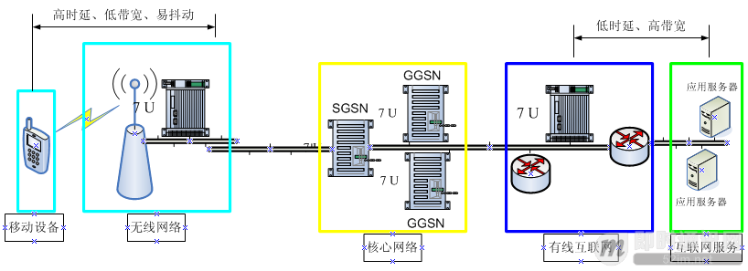
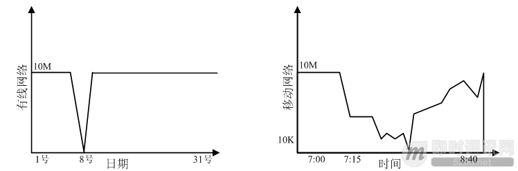
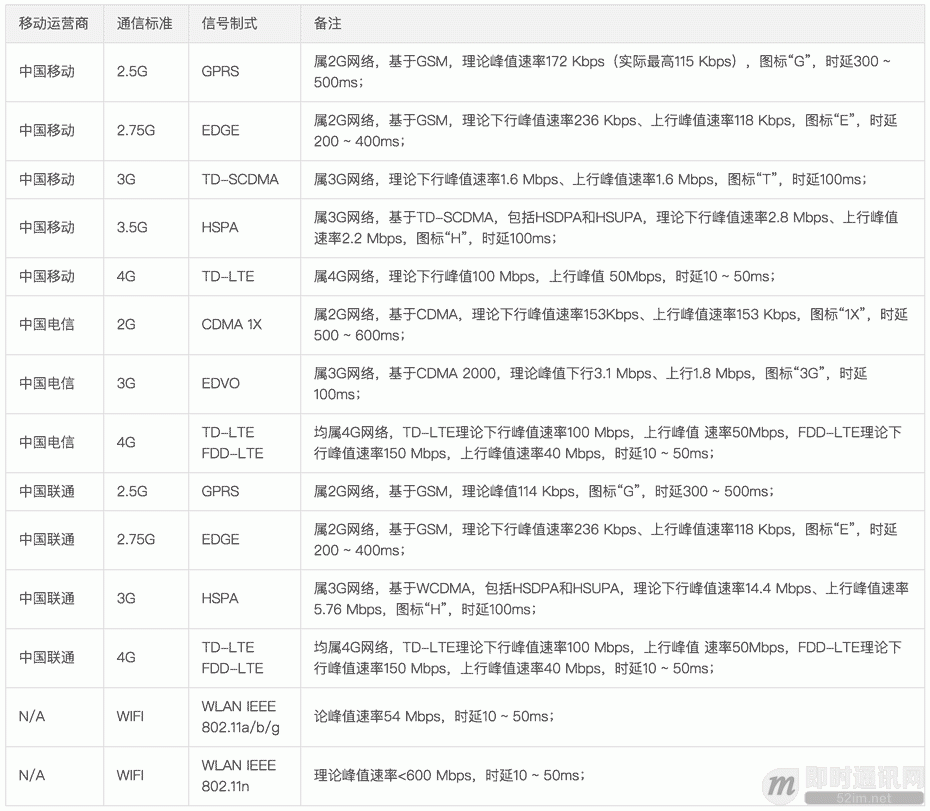
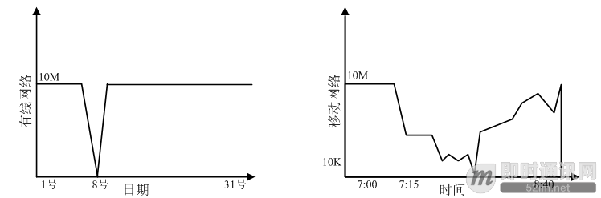
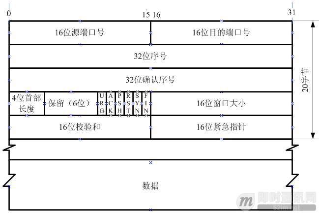

 
<!--BEGIN_DATA
{
    "create_date": "2020-01-14 17:49", 
    "modify_date": "2020-01-14 17:49", 
    "is_top": "0", 
    "summary": "移动网络的“弱”和“慢”与移动弱网络优化方法总结", 
    "tags": "网络、系统", 
    "file_name": "移动网络的“弱”和“慢”与移动弱网络优化方法总结.md"
}
END_DATA-->

####
原文出处：<a href='http://www.52im.net/thread-1587-1-1.html' target='blank'>通俗易懂，理解移动网络的“弱”和“慢”</a>

>本系列文章引用了腾讯技术专家樊华恒《海量之道系列文章之弱联网优化》的部分章节，感谢原作者。

###1、前言

随着移动互联网的高速发展，移动端IM以移动网络作为物理通信载体早已深入人心，这其中的成功者就包括微信、手机QQ、支付宝（从即时通讯产品的角度来看，支付宝已经算的上是半个IM了）等等，也为移动端即时通讯开发者带来了各种可以参考的标杆功能和理念：语音对讲、具有移动端体验特性的图片消息、全时在线的概念、真正突破物理体验的实时通知等。  
  
上述IM产品、功能和概念，在开发者间讨论时，无一例外都会被打上“移动端”这个特性，从网络通信的角度来说，这个特性的本质可以认为就是移动网络的特性。  
  
以文件发送为例，传统的PC端IM（可以简单地理解为传统有线网络上的IM）可以直接实时点对点发送（理论上无需经过服务器中转）。  
  
**但在移动端IM里我们并不能这么干，原因是：**  
  

  * 1）3G/4G/5G网络下P2P成功率并没有那么高（因为是对称型NAT，详见《[通俗易懂：快速理解P2P技术中的NAT穿透原理](http://www.52im.net/thread-1055-1-1.html)》）；
  * 2）移动网络的信号跳变、抖动很难预测（甚至在你转身的瞬间，信号可能会立马由强变弱）；
  * 3）移动网络的延迟、丢包、重传等导致通信体验很差（就像从国内访问国外的网站那种“慢”，体验上是相似的）；
  * 4）延迟、丢包、重传带来的另一个后果就是电量消耗、流量消耗过大，这些都是不可接受的；
  * 5）智能手机（主要是Android、iOS）的系统省电策略，导致网络可能被阻断，甚至进程被杀死，功能没办法在后台继续工作。  
  
所以，正是移动网络的这些特性，使得原本在传统PC端再普通不过的功能（比如上面说的文件发送），在移动端IM中却不得不另想办法：以文件发送为例——主流的移动端IM现在都是使用服务器中转来搞定的。使用类似技术实现的功能，还有移动端IM里语音短消息的AMR音频小文件、图片消息的图片文件等。  
  
**那么回归到本文的正题：**移动网络为什么会存在“弱”和“慢”这样的特性？  
  
这个问题网络工程师来回答最为合适，对但于应用层的程序员来说，有关移动网络的理论太生涩枯燥，太难理解了。而对于网络工程师来说，他们也不理解“你们这些程序员到底在纠结移动网络的什么鬼？”。  
  
就像黄品源的那首《那么爱你为什么》的歌曲里面莫文蔚的一段念白：“我讲又讲不清，你听又听不懂......”。这大概是应用层程序员很难能找到通俗易懂的有关移动网络资料的原因吧。  
  
所以本文的目的，就是希望以通俗易懂的语言，帮助移动端IM开发者更好地理解移动网络的各种特性，使得开发出的功能能更好地适应移动网络，给用户带来更好的使用体验。  
  
另外，《[现代移动端网络短连接的优化手段总结：请求速度、弱网适应、安全保障](http://www.52im.net/thread-1413-1-1.htm
l)》这篇文章也提到了本文所阐述的相关内容，强烈建议阅读。  

###2、系列文章

  
**▼ 本文是《移动端IM开发者必读》系列文章的第1篇：**  
  

  * 《[移动端IM开发者必读(一)：通俗易懂，理解移动网络的“弱”和“慢”](http://www.52im.net/thread-1587-1-1.html)》（本文）
  * 《[移动端IM开发者必读(二)：史上最全移动弱网络优化方法总结](http://www.52im.net/thread-1588-1-1.html)》  

  
如果您是IM开发初学者，强烈建议首先阅读《[新手入门一篇就够：从零开发移动端IM](http://www.52im.net/thread-464-1-1.html)》。  

###3、相关文章

**1）关于网络通信的基础文章：**  
  

  * 如果您对网络通信知识了解甚少，建议阅读《[网络编程懒人入门系列文章](http://www.52im.net/thread-1095-1-1.html)》、《[脑残式网络编程入门系列](http://www.52im.net/thread-1729-1-1.html)》，更高深的网络通信文章可以阅读《[不为人知的网络编程系列文章](http://www.52im.net/thread-1003-1-1.html)》。  

  
**2）涉及移动端网络特性的文章：**  

  * 《[现代移动端网络短连接的优化手段总结：请求速度、弱网适应、安全保障](http://www.52im.net/thread-1413-1-1.html)》
  * 《[谈谈移动端 IM 开发中登录请求的优化](http://www.52im.net/thread-282-1-1.html)》
  * 《[移动端IM开发需要面对的技术问题（含通信协议选择）](http://www.52im.net/thread-133-1-1.html)》
  * 《[简述移动端IM开发的那些坑：架构设计、通信协议和客户端](http://www.52im.net/thread-289-1-1.html)》
  * 《[微信对网络影响的技术试验及分析（论文全文）](http://www.52im.net/thread-195-1-1.html)》
  * 《[腾讯原创分享(一)：如何大幅提升移动网络下手机QQ的图片传输速度和成功率](http://www.52im.net/thread-675-1-1.html)》
  * 《[腾讯原创分享(二)：如何大幅压缩移动网络下APP的流量消耗（上篇）](http://www.52im.net/thread-696-1-1.html)》
  * 《[腾讯原创分享(二)：如何大幅压缩移动网络下APP的流量消耗（下篇）](http://www.52im.net/thread-697-1-1.html)》
  * 《[如约而至：微信自用的移动端IM网络层跨平台组件库Mars已正式开源](http://www.52im.net/thread-684-1-1.html)》  

  
**3）如果您觉得有些网络问题，已无法从应用层找到答案，那么以下这个系列是你的“菜”：**  
    以下文章为IM/推送技术开发的边界知识，但有助于你从物理层理解各种网络问题。如无兴趣，可忽略之！  

  * 《[IM开发者的零基础通信技术入门(一)：通信交换技术的百年发展史(上)](http://www.52im.net/thread-2354-1-1.html)》
  * 《[IM开发者的零基础通信技术入门(二)：通信交换技术的百年发展史(下)](http://www.52im.net/thread-2356-1-1.html)》
  * 《[IM开发者的零基础通信技术入门(三)：国人通信方式的百年变迁](http://www.52im.net/thread-2360-1-1.html)》
  * 《[IM开发者的零基础通信技术入门(四)：手机的演进，史上最全移动终端发展史](http://www.52im.net/thread-2369-1-1.html)》
  * 《[IM开发者的零基础通信技术入门(五)：1G到5G，30年移动通信技术演进史](http://www.52im.net/thread-2373-1-1.html)》
  * 《[IM开发者的零基础通信技术入门(六)：移动终端的接头人——“基站”技术](http://www.52im.net/thread-2375-1-1.html)》
  * 《[IM开发者的零基础通信技术入门(七)：移动终端的千里马——“电磁波”](http://www.52im.net/thread-2382-1-1.html)》
  * 《[IM开发者的零基础通信技术入门(八)：零基础，史上最强“天线”原理扫盲](http://www.52im.net/thread-2385-1-1.html)》
  * 《[IM开发者的零基础通信技术入门(九)：无线通信网络的中枢——“核心网”](http://www.52im.net/thread-2391-1-1.html)》
  * 《[IM开发者的零基础通信技术入门(十)：零基础，史上最强5G技术扫盲](http://www.52im.net/thread-2394-1-1.html)》
  * 《[IM开发者的零基础通信技术入门(十一)：为什么WiFi信号差？一文即懂！](http://www.52im.net/thread-2402-1-1.html)》
  * 《[IM开发者的零基础通信技术入门(十二)：上网卡顿？网络掉线？一文即懂！](http://www.52im.net/thread-2406-1-1.html)》
  * 《[IM开发者的零基础通信技术入门(十三)：为什么手机信号差？一文即懂！](http://www.52im.net/thread-2415-1-1.html)》
  * 《[IM开发者的零基础通信技术入门(十四)：高铁上无线上网有多难？一文即懂！](http://www.52im.net/thread-2419-1-1.html)》
  * 《[IM开发者的零基础通信技术入门(十五)：理解定位技术，一篇就够](http://www.52im.net/thread-2428-1-1.html)》  

  

###4、正文引言

移动互联网颠覆着我们的生活方式，这个每时每刻伴随着我们的网络到底有哪些特点，又是如何影响我们接入信息世界的体验呢。  
  
**以下场景如似曾相识，敬请对号入座：**  
  
1）上班路上收到朋友分享的一张美女图片，缩略图目测衣服用料相当节俭，立马兴奋点开欲详细钻研，却发现怎么脱也脱不下来，不对，是“拖”不是“脱”，仰望苍天，欲哭无泪。  
  
2）进电梯前收到女友一条消息：“你到底爱不爱我！”，当然马上回复“必须的必！”，电梯门关闭了，北风那个吹，菊花那个转，等到春暖梯开，满屏都是女友的问候“在吗！”、“这都要想那么久！”、“跟哪个MM聊天呢！”、“我生气了！”、“你是好人，再见！”，看着自己的回复刚刚发送成功，停在最后一行，整个互动信息一气呵成，都是眼泪。  
  
3）和朋友聚餐，菜端上先拍照分享，再大快朵颐，明明坐在对面，偏偏还得用手机聊天，世界最远的距离，莫过于我们坐在一起，却只能用手指切磋。  
  
有因有果，有道有术，不入虎穴焉得虎子，不扯了，进入正题。  

###5、移动网络的特点

  
**理论上说，我们看到移动网络有如下三个典型特点：**  
  

  * 1）移动状态网络信号不稳定，高时延、易抖动丢包、通道狭窄；
  * 2）移动状态网络接入类型和接入点变化频繁；
  * 3）移动状态用户使用高频化、碎片化、非WIFI流量敏感。  

为什么？  
  
**参考【图一 无线网络链路示意】，我们尝试从物理上追根溯源：**  

  
▲ 图一：无线网络链路示意  
  
根据“图一：无线网络链路示意”所示内容，我们可以得到以下信息。  
  
**第一、直观印象是通讯链路长而复杂：**从（移动）终端设备到应用服务器之间，相较有线互联网，要多经过基站、核心网、WAP网关（好消息是WAP网关正在被依法取缔）等环节，这就像送快递，中间环节越多就越慢，每个中转站的服务质量和服务效率不一，每次传递都要重新交接入库和分派调度，一不小心还能把包裹给弄丢了。  
  
**第二、这是个资源受限网络：**移动设备接入基站空中信道数量非常有限，信道调度更是相当复杂，如何复杂就不展开了，莫文蔚那首歌词用在这里正合适：“我讲又讲不清，你听又听不懂......”，最最重要的是分配的业务信道单元如果1秒钟不传数据就会立马被释放回收，六亲不认童叟无欺。  
  
**第三、这个链条前端（无线端）是高时延（除某些WIFI场景外）、低带宽（除某些WIFI场景外）、易抖动的网络：**无线各种制式网络带宽上限都比较低而传输时延比较大（参见【表一 运营商移动信号制式带宽标准】），并且，没事就能丢个包裹玩玩，最最重要的是，距离基站的远近，把玩手机的角度、地下室的深度等等都能影响无线信号的质量，让包裹在空中飞一会，再飞一会......。这些因素也造成了移动互联网网络质量稳定性差、接入变化频繁，与有线互联网对比更是天上人间的差别，从【图二 有线互联网和移动互联网网络质量差异】中可以有更直观的感受。  
  

  
▲ 图二：有线互联网和移动互联网网络质量差异  
  
**【表一 运营商移动信号制式带宽标准】数据来自互联网各种百科，定性不定量，仅供参考；**  

  
[【表一-运营商移动信号制式带宽标准】-清晰图.rar](http://www.52im.net/forum.php?mod=attachment&aid=NDIyM3wzYzBiNjc4ZXwxNTc4OTkzNzMxfDB8MTU4Nw%3D%3D) _(252.64 KB , 下载次数: 43 )_

  
**第四、这是个局部封闭网络：**空中信道接入后要做鉴权、计费等预处理，WAP网络甚至还要做数据过滤后再转发，在业务数据有效流动前太多中间代理人求参与，效率可想而知。产品研发为什么又慢又乱，广大程序猿心里明镜似的；最最重要的是，不同运营商之间跨网传输既贵且慢又有诸多限制，聪明的运营商便也用上了缓存技术，催生了所谓网络“劫持”的现象。  
  
如果我们再结合用户在移动状态下2G/3G/4G/WIFI的基站/AP之间，或者不同网络制式之间频繁的切换，情况就更加复杂了。  

###6、移动网络为什么“慢”
  
**我们在移动网络的特点介绍中，很容易的得到了三个关键字：**  

  * 1）“高时延”；
  * 2）“易抖动”；
  * 3）“通道窄”。  

这些物理上的约束确实限制了我们移动冲浪时的速度体验，那么，还有别的因素吗。  
  
**当然有，汗牛充栋、罄竹难书：**  
  
  * 1）DNS解析，这个在有线互联网上司空见惯的服务，在移动互联网上变成了一种负担，一个往复最少1s，还别提遇到移动运营商DNS故障时的尴尬；
  * 2）链路建立成本暨TCP三次握手，在一个高时延易抖动的网络环境，并且大部分业务数据交互限于一个HTTP的往返，建链成本尤其显著；
  * 3）TCP协议层慢启动、拥塞控制、超时重传等机制在移动网络下参数设定的不适宜；
  * 4）不好的产品需求规定或粗放的技术方案实现，使得不受控的大数据包、频繁的数据网络交互等，在移动网络侧TCP链路上传输引起的负荷；
  * 5）不好的协议格式和数据结构设计，使得协议封装和解析计算耗时、耗内存、耗带宽，甚至协议格式臃肿冗余，使得网络传输效能低下；
  * 6）不好的缓存设计，使得数据的加载和渲染计算耗时、耗内存、耗带宽。  

现在终于知道时间都去哪了，太浪费太奢侈，还让不让人愉快的玩手机了。天下武功，唯快不破，我们一起踏上“快”的探索之路吧。  
  
**更多有关TCP的基础理论性文章，可以看看下面的文章：**  

  * 《[TCP/IP详解](http://www.52im.net/topic-tcpipvol1.html) \- [第17章·TCP：传输控制协议](http://docs.52im.net/extend/docs/book/tcpip/vol1/17/)》
  * 《[TCP/IP详解](http://www.52im.net/topic-tcpipvol1.html) \- [第18章·TCP连接的建立与终止](http://docs.52im.net/extend/docs/book/tcpip/vol1/18/)》
  * 《[TCP/IP详解](http://www.52im.net/topic-tcpipvol1.html) \- [第21章·TCP的超时与重传](http://docs.52im.net/extend/docs/book/tcpip/vol1/21/)》
  * 《[通俗易懂-深入理解TCP协议（上）：理论基础](http://www.52im.net/thread-513-1-1.html)》
  * 《[通俗易懂-深入理解TCP协议（下）：RTT、滑动窗口、拥塞处理](http://www.52im.net/thread-515-1-1.html)》
  * 《[理论经典：TCP协议的3次握手与4次挥手过程详解](http://www.52im.net/thread-258-1-1.html)》  

  

###7、针对移动网络“弱”和“慢”的特点，有优化办法吗？

答案是：有。  
  
在移动互联网时代，对我们的产品和技术追求提出了更高的挑战，如何从容和优雅的面对，需要先从精神上做好充分的准备，用一套统一的思考和行动准则武装到牙齿。  
  
从来就没有什么救世主，只有程序猿征服一切技术问题的梦想在空中飘荡。屡败屡战，把过往实践中的经验教训总结出来，共同研讨。针对移动网络的特点，我们总结一些实用方法，请看下篇《移动端IM开发者必读(二)：针对移动弱网络特性的优化方法总结》。  

####
原文出处：<a href='http://www.52im.net/thread-1588-1-1.html' target='blank'>史上最全移动弱网络优化方法总结</a>

>本系列文章引用了腾讯技术专家樊华恒《海量之道系列文章之弱联网优化 gad.qq.com/article/detail/29546》的章节，感谢原作者。

###1、前言

  
本文接上篇《[移动端IM开发者必读(一)：通俗易懂，理解移动网络的“弱”和“慢”](http://www.52im.net/thread-1587-1-1.html)》，关于移动网络的主要特性，在上篇中已进行过详细地阐述，_本文将针对上篇中提到的特性，结合我们的实践经验，总结了四个方法来追求极致的“爽快”：快链路、轻往复、强监控、多异步，从理论讲到实践、从技术讲到产品，理论联系实际，举一反三，希望给您带来启发_。  
  
如果您还未阅读完上篇《[移动端IM开发者必读(一)：通俗易懂，理解移动网络的“弱”和“慢”](http://www.52im.net/thread-1587-1-1.html)》，建议您先行读完后再续本文。  
  
本篇的目的，就是希望以通俗易懂的语言，帮助移动端IM开发者更好地针对性优化移动网络的各种特性，使得开发出的功能给用户带来更好的使用体验。  
  
本文乃全网同类文章中，唯一内容最全、“粪”量最重者，请做好心理准备耐心读下去，不要辜负作者已打上石膏的双手和用废的键盘。  
  
另外，《[现代移动端网络短连接的优化手段总结：请求速度、弱网适应、安全保障](http://www.52im.net/thread-1413-1-1.html)》这篇文章也提到了本文所阐述的相关内容，强烈建议阅读。  

###2、系列文章
  
**▼ 本文是《移动端IM开发者必读》系列文章的第2篇：**  
  

  * 《[移动端IM开发者必读(一)：通俗易懂，理解移动网络的“弱”和“慢”](http://www.52im.net/thread-1587-1-1.html)》
  * 《[移动端IM开发者必读(二)：史上最全移动弱网络优化方法总结](http://www.52im.net/thread-1588-1-1.html)》（本文）  

  
如果您是IM开发初学者，强烈建议首先阅读《[新手入门一篇就够：从零开发移动端IM](http://www.52im.net/thread-464-1-1.h
tml)》。  

###3、相关文章

  
**1）关于网络通信的基础文章：**  
  

  * 如果您对网络通信知识了解甚少，建议阅读《[网络编程懒人入门系列文章](http://www.52im.net/thread-1095-1-1.html)》、《[脑残式网络编程入门系列](http://www.52im.net/thread-1729-1-1.html)》，更高深的网络通信文章可以阅读《[不为人知的网络编程系列文章](http://www.52im.net/thread-1003-1-1.html)》。  

###4、优化方法一：“快链路”

  
我们需要有一条（相对）快速、（相对）顺畅、（相对）稳定的网络通道承载业务数据的传输，这条路的最好是传输快、不拥堵、带宽大、收费少。生活中做个类比，我们计划驱车从深圳到广州，如果想当然走广深高速十之八九要杯具，首先这个高速略显破败更像省道，路况不佳不敢提速；其次这条路上的车时常如过江之鲫，如果身材不好操控不便，根本就快不起来；最后双向六车道虽然勉强可以接受，但收费居然比广深沿江高速双向八车道还贵；正确的选路方案目前看是走沿江高速，虽然可能要多跑一段里程，但是通行更畅快。  
  
实际上，真实情况要更复杂，就如同上篇中[【图二 有线互联网和移动互联网网络质量差异】](http://www.52im.net/thread-1587-1-1.html)所示（就是下图），漫漫征途中常常会在高速、国道、省道、田间小道上切换。  
  

####4.1TCP/IP协议栈参数调优

  
纯技术活，直接上建议得了，每个子项争取能大致有个背景交待，如果没说清楚，可以先看看以下资料：  
《[TCP/IP详解](http://www.52im.net/topic-tcpipvol1.html) \-
[第17章·TCP：传输控制协议](http://docs.52im.net/extend/docs/book/tcpip/vol1/17/)》  
《[TCP/IP详解](http://www.52im.net/topic-tcpipvol1.html) \-
[第18章·TCP连接的建立与终止](http://docs.52im.net/extend/docs/book/tcpip/vol1/18/)》  
《[TCP/IP详解](http://www.52im.net/topic-tcpipvol1.html) \-
[第21章·TCP的超时与重传](http://docs.52im.net/extend/docs/book/tcpip/vol1/21/)》  
《[通俗易懂-深入理解TCP协议（上）：理论基础](http://www.52im.net/thread-513-1-1.html)》  
《[通俗易懂-深入理解TCP协议（下）：RTT、滑动窗口、拥塞处理](http://www.52im.net/thread-515-1-1.html)》  
《[理论经典：TCP协议的3次握手与4次挥手过程详解](http://www.52im.net/thread-258-1-1.html)》  
《[不为人知的网络编程(一)：浅析TCP协议中的疑难杂症(上篇)](http://www.52im.net/thread-1003-1-1.html)》  
《[不为人知的网络编程(二)：浅析TCP协议中的疑难杂症(下篇)](http://www.52im.net/thread-1004-1-1.html)》  
《[不为人知的网络编程(三)：关闭TCP连接时为什么会TIME_WAIT、CLOSE_WAIT](http://www.52im.net/thread-10
07-1-1.html)》  
《[网络编程懒人入门(三)：快速理解TCP协议一篇就够](http://www.52im.net/thread-1107-1-1.html)》  
  
**① 控制传输包大小**  
  
控制传输包的大小在1400字节以下。暂时不讲为什么这样建议，先举个例子来类比一下，比如一辆大卡车满载肥猪正在高速上赶路，猪笼高高层叠好不壮观，这时前方突然出现一个隧道限高标识，司机发现卡车超限了，这下咋整。方案一，停车调头重新找路，而且十之八九找不到，最后只能哪来回哪；方案二，把其中一群猪卸下来放本地找人代养，到达目的地卸完货回来再取，你别说，这个机制在TCP/IP协议栈中也有，学名“IP分片”，后面会专门介绍。这个故事侧面证实美国计算机科学家也曾经蹲在高速路边观察生猪超载运输的过程，并饱受启发。且慢，每次遇到问题，想到一些方案后我们都应该再扪心自问：“还有没有更好的办法呢？”。当然有，参照最近流行的说法，找个台风眼，把猪都赶过去，飞一会就到了，此情此景想想也是醉了。  
  
回归正题，概括的说，我们设定1400这个阈值，目的是减少往复，提高效能。因为TCP/IP网络中也有类似高速限高的规定，如果在超限时想要继续顺畅传输，要么做IP分片要么把应用数据拆分为多个数据报文（意指因为应用层客户端或服务器向对端发送的请求或响应数据太大时，TCP/IP协议栈控制机制自动将其拆分为若干独立数据报文发送的情况，后面为简化讨论，都以IP分片这个分支为代表，相关过程分析和结论归纳对二者均适用）。而一旦一个数据报文发生了IP分片，便会在数据链路层引入多次的传输和确认，加上报文的拆分和拼接开销，令得整个数据包的发送时延大大增加，并且，IP分片机制中，任何一个分片出现丢失时还会带来整个IP数据报文从最初的发起端重传的消耗。有点枯燥了，更深入的理解，请参见：《[海量之道系列文章之弱联网优化（二）](https://cloud.tencent.com/developer/article/1005367)》。  
  
我们可以得出如下结论，TCP/IP数据报文大小超过物理网络层的限制时，会引发IP分片，从而增加时空开销。  
  
因此，设定合理的MSS至关重要，对于以太网MSS值建议是1400字节。什么，你的数学是体育老师教的吗？前面说以太网最大的传输数据大小是1500字节，IP数据报文包头是20字节，TCP报文包头是20字节，算出来MSS怎么也得是1460字节呀。如果回答是因为很多路由设备比如CISCO路由器把MSS设定为1400字节，大伙肯定不干，回忆一下IP和TCP的数据报包头都各有40字节的可选项，MTU中还需要为这些可选项留出空间，也就压缩了MSS的空间。要是再追问为啥这个值不是1380字节，那就有点过分了。  
  
**知识加油站：什么是MSS？**  

TCP MSS（TCP Maximum Segment Size，TCP最大报文段长度，后面均简称MSS）表示TCP/IP协议栈一次可以传往另一端的最大TCP数据长度，注意这个长度是指TCP报文中的有效“数据”（即应用层发出的业务数据）部分，它不包括TCP报文包头部分，我们可以把它理解为卡车能装运生猪的最大数量或重量。它是TCP选项中最经常出现，也是最早出现的选项，占4字节空间。  
  
MSS是在建立TCP链接的三次握手过程中协商的，每一方都会在SYN或SYN/ACK数据报文中通告其期望接收数据报文的MSS（MSS也只能出现在SYN或SYN/ACK数据报中），说是协商，其实也没太多回旋的余地，原因一会讲。如果协商过程中一方不接受另一方的MSS值，则TCP/IP协议栈会选择使用默认值：536字节。

  
那么问题来了，控制“限高”哪种方案才最强。我们尝试探讨一下。  
  
首先，可以在我们自己IDC内将各种路由交换设备的MSS设定小于或等于1400字节，并积极参与TCP三次握手时的MSS协商过程，期望达到自动控制服务器收发数据报文大小不超过路径最小MTU从而避免IP分片。这个方案的问题是如果路由路径上其它设备不积极参与协商活动，而它的MTU（或MSS设置值）又比较low，那就白干了。这就好比国家制定了一个高速沿途隧道限高公示通告标准，但是某些地方政府就是不告诉你，没辙。  
  
其次，可以在业务服务中控制应用数据请求/响应的大小在1400字节以下（注：也无法根本避免前述方案中间路由MTU/MSS low的问题），在应用层数据写入时就避免往返数据包大小超过协商确定的MSS。但是，归根到底，在出发前就把数据拆分为多个数据报文，同IP分片机制本质是相同的，交互响应开销增加是必然的。考虑到人在江湖，安全第一，本方案从源头上控制，显得更实际一些。  
  
当然，最靠谱的还是做简法，控制传输数据的欲望，用曼妙的身姿腾挪有致，相关的内容放到轻往复章节探讨。  
  
对应到前面的快乐运猪案例，就是要么在生猪装车之前咱们按照这条路上的最低限高来装车（问题是怎么能知道整个路上的最低限高是多少），要么按照国家标准规定允许的最小限高来装车，到这里，肥猪们终于可以愉快的上路了，风和日丽，通行无阻，嗯，真的吗？  
  
**② 放大TCP拥塞窗口**  
  
把TCP拥塞窗口（cwnd）初始值设为10，这也是目前Linux Kernel中TCP/IP协议栈的缺省值。放大TCP拥塞窗口是一项有理有据的重要优化措施，对移动网络尤其重要，我们同样从一些基本理论开始逐步深入理解它。  
  
TCP是个传输控制协议，体现控制的两个关键机制分别是基于滑动窗口的端到端之间的流量控制和基于RTT/RTO测算的端到网络之间的拥塞控制。  
  
流量控制目标是为了避免数据发送太快对端应用层处理不过来造成SOCKET缓存溢出，就像一次发了N车肥猪，买家那边来不及处理，然后临时囤货的猪圈又已客满，只好拒收/抛弃，相关概念和细节我们不展开了，有兴趣可以研读《TCP/IP详解 卷一：协议》。  
  
拥塞控制目标是在拥塞发生时能及时发现并通过减少数据报文进入网络的速率和数量，达到防止网络拥塞的目的，这种机制可以确保网络大部分时间是可用的。拥塞控制的前提在于能发现有网络拥塞的迹象，TCP/IP协议栈的算法是通过分组丢失来判断网络上某处可能有拥塞情况发生，评判的具体指标为分组发送超时和收到对端对某个分组的重复ACK。在有线网络时代，丢包发生确实能比较确定的表明网络中某个交换设备故障或因为网络端口流量过大，路由设备转发处理不及时造成本地缓存溢出而丢弃数据报文，但在移动网络中，丢包的情况就变得非常复杂，其它因素影响和干扰造成丢包的概率远远大于中间路由交换设备的故障或过载。比如短时间的信号干扰、进入一个信号屏蔽的区域、从空闲基站切换到繁忙基站或者移动网络类型切换等等。网络中增加了这么多不确定的影响因素，这在TCP拥塞控制算法最初设计时，是无法预见的，同时，我们也确信未来会有更完善的解决方案。这是题外话，如有兴趣可以找些资料深入研究（详见：《[TCP/IP详解](http://www.52im.net/topic-tcpipvol1.html) \-[第21章·TCP的超时与重传](http://docs.52im.net/extend/docs/book/tcpip/vol1/21/)》、《[通俗易懂-深入理解TCP协议（下）：RTT、滑动窗口、拥塞处理](http://www.52im.net/thread-515-1-1.html)》、《[海量之道系列文章之弱联网优化（三）](https://cloud.tencent.com/developer/article/1005368)》）。  
  
拥塞控制是TCP/IP协议栈最经典的和最复杂的设计之一，互联网自我牺牲的利他精神表露无遗，设计者认为，在拥塞发生时，我们应该减少数据报文进入网络的速率和数量，主动让出道路，令网络能尽快调整恢复至正常水平。  
  
**③ 调大SOCKET读写缓冲区**  
  
把SOCKET的读缓冲区（亦可称为发送缓冲区）和写缓冲区（亦可称为接收缓冲区）大小设置为64KB。在Linux平台上，可以通过 setsockopt函数设置SO\_RCVBUF和SO\_SNDBUF选项来分别调整SOCKET读缓冲区和写缓冲区的大小。  
  
这两个缓冲区跟我们的TCP/IP协议栈到底有怎么样的关联呢。我们回忆一下TCP数据报格式及首部中的各字段里面有个16位窗口大小（见下图），还有我们前面提到的流量控制机制和滑动窗口的概念，大幕徐徐拉开，主角纷纷粉墨登场。在正式详细介绍之前，按照传统，我们还是先站在猪场老板的角度看一下，读缓冲区就好比买家用来囤货的临时猪圈，如果货到了买家使用部门来不及处理，就先在这里临时囤着，写缓冲区就好比养猪场根据订单装好车准备发货，如果买家说我现在可以收货便可速度发出，有点明白了吧。  
  

  
**④ 调大RTO（Retransmission TimeOut）初始值**  
  
将RTO（Retransmission TimeOut）初始值设为3s。  
  
TCP为每一个报文段都设定了一个定时器，称为重传定时器(RTO)，当RTO超时且该报文段还没有收到接收端的ACK确认，此时TCP就会对该报文段进行重传。当TCP链路发生超时时，意味着很可能某个报文段在网络路由路径的某处丢失了，也因此判断此时网络出现拥塞的可能性变得很大，TCP会积极反应，马上启动拥塞控制机制。  
  
RTO初始值设为3s，这也是目前Linux Kernel版本中TCP/IP协议栈的缺省值，在链路传输过程中，TCP协议栈会根据RTT动态重新计算RTO，以适应当前网络的状况。有很多的网络调优方案建议把这个值尽量调小，但是，我们开篇介绍移动网络的特点之一是高时延，这也意味着在一个RTT比较大的网络上传输数据时，如果RTO初始值过小，很可能发生不必要的重传，并且还会因为这个事件引起TCP协议栈的过激反应，大炮一响，拥塞控制闪亮登场。  
  
猪场老板的态度是什么样的呢：曾经有一份按时发货的合同摆在我的面前，我没有去注意，等到重新发了货才追悔莫及，尘世间最痛苦的事莫过于此，如果上天能给我一个再来一次的机会，我希望对甲方说耐心点，如果非要给这个耐心加一个期限的话，我希望是一万年。  
  
**⑤ 禁用TCP快速回收**  
  
TCP快速回收是一种链接资源快速回收和重用的机制，当TCP链接进入到TIME\_WAIT状态时，通常需要等待2MSL的时长，但是一旦启用TCP快速回收，则只需等待一个重传时间（RTO）后就能够快速的释放这个链接，以被重新使用。  
  
**Linux Kernel的TCP/IP协议栈提供了一组控制参数用于配置TCP端口的快速回收重用，当把它们的值设置为1时表示启用该选项：**  
  

  * 1)  net.ipv4.tcp\_tw\_reuse = 1
  * 2) net.ipv4.tcp\_tw\_recycle = 1
  * 3)  net.ipv4.tcp\_timestamps = 1（tcp\_tw\_recycle启用时必须同时启用本项，反之则不然，timestamps用于RTT计算，在TCP报文头部的可选项中传输，包括两个参数，分别为发送方发送TCP报文时的时间戳和接收方收到TCP报文响应时的时间戳。Linux系统和移动设备上的Android、iOS都缺省开启了此选项，建议不要随意关闭）  

  
以上参数中tw是TIME\_WAIT的缩写，TIME\_WAIT与TCP层的链接关闭状态机相关。具体TIME\_WAIT是谁，从哪里来，往哪里去，可以详见：《[海量之道系列文章之弱联网优化 （四）](https://cloud.tencent.com/developer/article/1005370)》。  
  
**⑥ HTTP协议：打开SOCKET的TCP_NODELAY选项**  
  
TCP/IP协议栈为了提升传输效率，避免大量小的数据报文在网络中流窜造成拥塞，设计了一套相互协同的机制，那就是Nagle's Algorithm和TCP Delayed Acknoledgement。  
  
Nagle算法（Nagle's Algorithm）是以发明人John Nagle的名字来命名。John Nagle在1984年首次用这个算法来尝试解决福特汽车公司的网络拥塞问题（RFC 896），该问题的具体描述是：如果我们的应用程序一次产生1个字节的数据（典型的如telnet、XWindows等应用），而这个1个字节数据又以网络数据包的形式发送到远端服务器，那么就很容易使网络中有太多微小分组而导致过载。  
  
因为传输1个字节有效数据的微小分组却需花费40个字节的额外开销（即IP包头20字节 + TCP包头20字节），这种有效载荷利用率极其低下的情况被统称为愚蠢窗口症候群（Silly Window Syndrome），前面我们在谈MSS时也提到过，如果为一头猪开个大卡车跑一趟，也够愚钝的。对于轻负载广域网或者局域网来说，尚可接受，但是对于重负载的广域网而言，就极有可能引起网络拥塞导致瘫痪。  
  
现代TCP/IP 协议栈默认几乎都启用了这两个功能。  
  
我们在移动APP的设计实现中，请求大部分都很轻（数据大小不超过MSS），为了避免上述分析的问题，建议开启SOCKET的TCP\_NODELAY选项，同时，我们在编程时对写数据尤其要注意，一个有效指令做到一次完整写入（后面会讲协议合并，是多个指令一次完整写入的设计思想），这样服务器会马上有响应数据返回，顺便也就捎上ACK了。  
  
####4.2接入调度

  
**① 就快接入**  
  
在客户端接入服务器调度策略的演化过程中，我们最早采用了“就近接入”的策略，在距离客户端更近的地方部署服务器或使用CDN，期望通过减少RTT来提高网络交互响应性能。这个策略在国内的落地执行还需要加一个前缀：“分省分运营商”，这就给广大负责IDC建设的同学带来了巨大的精神和肉体折磨。  
  
在持续运营的过程中，根据观察到的数据，发现并非物理距离最近的就是最快的。回忆一下前面谈到的吞吐量指标BDP，它与链路带宽和RTT成正比关系，而RTT是受物理距离、网络拥塞程度、IDC吞吐量、跨网时延等诸多因素综合影响的，单纯的就近显然不够精细了。  
  
“就快接入”在“就近接入”策略的基础上改善提升，它利用客户端测速和报告机制，通过后台大数据分析，形成与客户端接入IP按就快原则匹配接入服务器的经验调度策略库，令客户端总能优先选择到最快的服务器接入点。  
  
有关就快接入的更详细方案，请参见：《[海量之道系列文章之弱联网优化（五）](https://cloud.tencent.com/developer/article/1005371)》一文的“3.1.2节”。  
  
**② 去DNS的IP直连**  
  
DNS不但需要1个RTT的时间消耗，而且移动网络下的DNS还存在很多其它问题：  
  

  * 1) 部分DNS承载全网用户40%以上的查询请求，负载重，一旦故障，影响巨大，这样的案例在PC互联网也有很多，Google一下即可感受触目惊心的效果；
  * 2) 山寨、水货、刷ROM等移动设备的LOCAL DNS设置错误；
  * 3) 终端DNS解析滥用，导致解析成功率低；
  * 4) 某些运营商DNS有域名劫持问题，实际上有线ISP也存在类似问题。域名劫持对安全危害极大，产品设计时要注意服务端返回数据的安全校验（如果协议已经建立在安全通道上时则不用考虑，安全通道可以基于HTTPS或者私有安全体系）。对于劫持的判断需要客户端报告实际拉取服务数据的目标地址IP等信息；
  * 5) DNS污染、老化、脆弱。  

  
综上就是在前述就快接入小节中，接入调度FSM会优先使用动态服务器列表的原因。  
  
有关移动端网络的DNS问题，详见：《[全面了解移动端DNS域名劫持等杂症：技术原理、问题根源、解决方案等](http://www.52im.net/thread-2121-1-1.html)》。  
  
**③ 网络可达性探测**  
  
在连接建立过程中如果出现连接失败的现象，而终端系统提供的网络状态接口反馈网络可用时，我们需要做网络可达性探测（即向预埋的URL或者IP地址发起连接尝试），以区别网络异常和接入服务异常的情况，为定位问题，优化后台接入调度做数据支持。  
  
探测数据可以异步报告到服务器，至少应该包含以下字段：  
  

  * 1) 探测事件ID，要求全局唯一不重复；
  * 2) 探测发生时间；
  * 3) 探测发生时网络类型和其它网络信息（比如WIFI时的SSID等）；
  * 4) 本地调度的接入服务器集合类型；
  * 5) 本地调度的接入服务器IP（如使用域名接入，可忽略）；
  * 6) 探测的目标URL或IP地址
  * 7) 本次探测的耗时。  

  

####4.3链路管理

  
链路就是运肥猪的高速路，就快接入是选路，链路管理就是如何高效的使用这条路。下面是一些实践总结：  
  
**① 链路复用**  
  
我们在开篇讨论无线网络为什么慢的时候，提到了链接建立时三次握手的成本，在无线网络高时延、频抖动、窄带宽的环境下，用户使用趋于碎片化、高频度，且请求响应又一次性往返居多、较频繁发起等特征，建链成本显得尤其显著。  
  
因此，我们建议在链路创建后可以保持一段时间，比如HTTP短链接可以通过HTTP Keep-Alive，私有协议可以通过心跳等方式来保持链路。  
  
具体要点建议如下：  
  

  * 1) 链路复用时，如果服务端按就快策略机制下发了新的接入动态服务器列表，则应该按照接入调度FSM的状态变迁，在本次交互数据完成后，重建与新的接入服务器的IP链路，有三个切换方案和时机可选择：  
    \- a. 关闭原有链接，暂停网络通讯，同时开始建立与新接入服务器的TCP链路，成功后恢复与服务器的网络交互；  
    \- b. 关闭原有链接，暂停网络通讯，待有网络交互需求时开始建立与新接入服务器的IP链路；  
    \- c. 原有链接继续工作，并同时开始建立与新接入服务器的TCP链路，成功后新的请求切换到新建链路上，这个方式或可称为预建链接，原链接在空闲时关闭。
  * 2) 链路复用时区分轻重数据通道，对于业务逻辑等相关的信令类轻数据通道建议复用，对于富媒体拉取等重数据通道就不必了；
  * 3) 链路复用时，如与协议合并（后面会讨论）结合使用，效果更佳。  

  
**② 区分网络类型的超时管理**  
  
在不同的网络类型时，我们的链路超时管理要做精细化的区别对待。链路管理中共有三类超时，分别是连接超时、IO超时和任务超时。  
  
我们有一些经验建议，提出来共同探讨：  
  

  * 1) 连接超时：2G/3G/4G下5 ~ 10秒，WIFI下5秒（给TCP三次握手留下1次超时重传的机会，可以研究一下《TCP/IP详解 卷一：协议》中TC P的超时与重传部分）；
  * 2) IO超时：2G/3G/4G下15 ~ 20秒（无线网络不稳定，给抖动留下必要的恢复和超时重传时间），WIFI下15秒（1个MSL）；
  * 3) 任务超时：根据业务特征不同而差异化处理，总的原则是前端面向用户交互界                     面的任务超时要短一些（尽量控制在30秒内并有及时的反馈），后台任务可以长一些，轻数据可以短一些，重数据可以长一些；
  * 4) 超时总是伴随着重试，我们要谨慎小心的重试，后面会讨论。  

  
超时时间宜短不宜长，在一个合理的时间内令当前链路因超时失效，从而驱动调度FSM状态的快速变迁，效率要比痴痴的等待高得多，同时，在用户侧也能得到一个较好的正反馈。  
  
各类超时参数最好能做到云端可配可控。  
  
**③ 优质网络下的并发链路**  
  
当我们在4G、WIFI（要区分是WIFI路由器还是手机热点）等网络条件较优时，对于请求队列积压任务较多或者有重数据（富媒体等下载类数据）请求时，可以考虑并发多个链路并行执行。  
  
对于单一重数据任务的多链接并发协同而言，需要服务器支持断点续传，客户端支持任务协同调度；  
  
**④ 轻重链路分离**  
  
轻重链路分离，也可以说是信令和数据分离，目的是隔离网络通讯的过程，避免重数据通讯延迟而阻塞了轻数据的交互。在用户角度看来就是信息在异步加载，控制指令响应反馈及时。  
  
移动端大部分都是HTTP短链接模式工作，轻重数据的目标URL本身就不同，比较天然的可以达到分离的要求，但是还是要特别做出强调，是因为实践中有些轻数据协议设计里面还会携带类似头像、验证码等的实体数据。  
  
**⑤ 长链接**  
  
长链接对于提升应用网络交互的及时性大有裨益，一方面用户使用时，节省了三次握手的时间等待，响应快捷；另一方面服务器具备了实时推送能力，不但可以及时提示用户重要信息，而且能通过推拉结合的异步方案，更好的提升用户体验。  
  
长链接的维护包括链接管理、链接超时管理、任务队列管理等部分，设计实施复杂度相对高一些，尤其是在移动网络环境下。为了保持链路还需要做心跳机制（从另外一个角度看，这也是针对简单信息一个不错的PULL/PUSH时机,，但需注意数据传输要够轻，比如控制在0.5KB以内），而心跳机制是引入长链接方案复杂度的一个重要方面，移动网络链路环境复杂，国内网关五花八门，链路超时配置各有千秋，心跳时长选择学问比较大，不但要区分网络类型，还得区分不同运营商甚至不同省市，历史上曾经实践了2分钟的心跳间隔，最近比较多的产品实践选择4.5分钟的心跳间隔。而且长链接除了给移动网络尤其是空中信道带来负担外，移动设备自身的电量和流量也会有较大的消耗，同时还带来后端带宽和服务器投入增加。  
  
所以，除了一些粘性和活跃度很高、对信息到达实时性要求很高的通讯类APP外，建议谨慎使用长链接，或可以考虑采用下面的方式：  
  

  * 1)  退化长链接：即用户在前台使用时，保持一个长链接链路，活跃时通过用户使用驱动网络IO保持链路可用；静默时通过设置HTTP Keep-Alive方式，亦或通过私有协议心跳方式来保持链路。一旦应用切换后台，且在5~10分钟内没有网络交互任务则自行关闭链路，这样在用户交互体验和资源消耗方面取得一个平衡点；
  * 2)  定时拉取/询问：对于一些有PUSH需求的APP，我们可以采用一个云端可配置间隔时长的定时拉取/询问方案。有三个重点，一是定时的间隔云端可以配置，下发更新到客户端后下次生效；二是拉取/询问时，如果下发的指令有要求进一步PULL时，可以复用已建立的链路，即前述退化长链接的模式；三是定时拉取/询问时机在客户端要做时间上的均匀离散处理，避免大的并发查询带来带宽和负载的巨大毛刺；
  * 3) 如果可能，优先使用OS内置的PUSH通道：比如iOS的APNS、Andriod的 GCM（Google这个以工程师文化著称的公司，在做OS级基础设施建设时，却表现出了很差的前瞻性和系统思考的能力，GCM的前身C2DM都没怎么普及使用就被替换了，这也意味着Android各种版本PUSH能力不 一致的问题。但无论怎么说，OS级的基础设施无论在性能、稳定性还是在效率上都会优于APP层自己实现的方案），实施推拉结合的方案。特别要提到的一点是，中国特色无所不在，国内运营商曾经封过APNS的PUSH端口2195，也会干扰GCM的端口5528，更别提这些底层服务的长链接会被运营商干扰。对于Android平台，还存在系统服务被各种定制修改的问题。别担心，办法总比问题多，保持清醒。  

**⑥ 小心重试**  
  
自动重试是导致后台雪崩的重要因素之一。在移动网络不稳定的条件下，大量及时的重试不但不能达到预期，反而无谓的消耗移动设备的电量甚至流量。  
  
因此，我们在重试前要有一些差异化的考虑：  

  * 1) 当前移动设备的网络状况如何，如果没有网络，则不必重试；
  * 2) 重试设定必要的时间间隔，因为移动接入网络抖动到恢复可能需要一点时间，马上重试并非最佳策略，反而可能无谓的消耗电量。实践中，可以在一次连接或IO失败（立即失败或超时）时，过3 ~ 5秒后再试；
  * 3)  重试应设定必要的总时限，因为三个服务器列表比较长，每个服务器地址都要重试和等待若干次，最终可能导致接入调度FSM和服务器列表调度FSM流转耗时过长，此时用户侧体验表现为长时间等待无响应。总时限参数可以参考前述区分网络类型的超时管理中的任务超时值。一旦某次重试成功，重试总时限计时器要归零；
  * 4) 服务器下发特定错误码（比如服务器故障、过载或高负载）时，提示客户端停止重试并告知安抚用户，我们在强监控这个主题下有详细的讨论。  

  
每个目标服务器地址的重试次数、重试总时限和重试时间间隔最好能做到云端可配可控。  
  
特别需要提出的一点是，移动APP采用HTTP短链接模式实现CS交互时，广泛的使用了系统原生组件或者开源组件，这些友好的模块把超时和重试都封装起来，其缺省值是否适合自己的业务特点，需要多多关注。使用前，最好能知其然更知其所以然。  
  
**⑦ 及时反馈**  
  
透明和尊重，会带来信任和默契，家庭如此、团队如此、用户亦如此。欲盖弥彰和装傻充愣也许短暂取巧，拉长时间轴来看，肯定要付出惨重的代价。及时和真诚的告知状况，赢得谅解和信任，小付出，大回报，试过都知道。  
  
当发现因为网络不存在或者其它属于移动端设备链路的异常时，应该及时和显著的提示用户，让用户注意到当前有诸如网络不存在、FREE WIFI接入认证页面需确认等等问题，使用户可以及时处理或理解问题状态。  
  
当发现是服务器问题时，应及时、显著和真诚的告知用户，争取用户的谅解。  
  
网络异常提示或服务器故障通告等信息的呈现要做到一目了然，无二义和二次交互。  

####4.4 IO管理

基于一个快速和高效管理的链路之上，做好IO调度和控制，也是提升效能和改善用户体验的重要环节。  
  
要探讨的内容包括：  
  
**① 异步IO**  
  
异步化IO的目的就是避免资源的集中竞争，导致关键任务响应缓慢。我们在后面差异服务个大的分类中会重点探讨。这里特别先提出来，是建议在程序架构顶层设计时，要在整体机制上支持异步化，设计必要的异步总线来联系各个层级模块，总线可能会涉及包括队列管理（优先级、超时、CRUD等）、事件驱动、任务调度等。  
  
异步IO除了网络方面外，对移动设备，我们还特别要考虑一下磁盘IO的异步。因为频繁、大吞吐量的磁盘IO会造成APP的UI卡顿，从用户体验上看就是交互响应迟钝或者滑动帧率下降。一般来说，磁盘IO异步会选用空间换时间的方案，即缓存数据批量定时写入磁盘。  
  
**② 并发控制**  
  
有了异步IO，并发控制就显得尤为重要。把异步机制当作银弹任意使用，就如同我们给移动APP设计了一个叫“发现”的地方一样，很可能各种膨胀的需求、不知道如何归类的需求就纷至沓来，期待有朝一日被“发现”。  
  
异步IO提供了一个很好的发射后不用管的机制，这就会造成使用者的膨胀，无论是否必要、无论轻重缓急，把请求一股脑的丢给异步队列，自己潇洒的转身就走。这样不但会带来效率和交互响应性能的下降，也会造成资源的无谓消耗。  
  
在后面多异步这个大分类的讨论中会涉及到轻重缓急的话题，在前述异步IO的磁盘IO的时空效率转换话题中，还应该包括IO并发的控制，我们即不能因为并发过多的链路造成网络带宽的独占消耗影响其它APP的使用，也不可因快速、大量的异步数据造成缓写机制形同虚设或是占用过大的内存资源。  
  
**③ 推拉结合**  
  
PUSH机制应该是苹果公司在移动设备上取得辉煌成就的最重要两个机制之一，另外一个是移动支付体系。我们这里的讨论不包括iOS和APPLE移动设备的拟人化交互体验，只侧重根基性的机制能力。APNS解决了信息找人的问题，在过去，只有运营商的短信有这个能力，推送和拉取使得我们具备了实时获取重要信息的能力。  
  
为何要推拉结合。因为系统级的推送体系也必须维持一个自己的链路，而这个链路上要承载五花八门的APP推送数据，如果太重，一方面会在设计上陷入个性化需求的繁琐细节中，另外一方面也会造成这条链路的拥堵和性能延迟。因此，通过PUSH通知APP，再由APP通过自己的链路去PULL数据，即有效的利用了PUSH机制，又能使得APP能按需使用网络，不但简化了链路管理，而且节省了电量和流量。  
  
**④ 断点续传**  
  
一方面，在讨论链路管理时，我们建议了优质网络下的并发链路来完成同一个重数据拉取任务。这就会涉及到任务的拆分和并行执行，基础是后台能支持断点续传。  
  
另外一方面，从客户端的角度而言，移动网络的不稳定特点，可能会造成某个重数据拉取任务突然失败，无论是自动重试还是用户驱动的重试，如果能从上次失效的上下文继续任务，会有省时间、省电量和省流量的效果，想想也会觉得十分美好。  

###5、优化方法二：“轻往复”

  
“技”止此尔。强调网络交互的“少”，更应强调网络交互的“简”。  
  
我们在一条高时延易抖动的通道上取得效率优势的关键因素就是减少在其上的往复交互，最好是老死不相往来（过激），并且这些往复中交换的数据要尽量的简洁、轻巧，轻车简从。这个概念是不是有点像多干多错，少干少错，不干没错。  
  
把我们实践过的主要手段提出来探讨：  
  
**① 协议二进制化**  
  
二进制比较紧凑，但是可读性差，也因此形成可维护性和可扩展性差、调测不便的不良印象。这也造成了大量可见字符集协议的出现。计算机是0和1的世界，她们是程序猿的水和电，任何一个整不明白，就没法愉快的生活了。  
  
**② 高效协议**  
  
高效的协议可以从两个层面去理解，一是应用层标准协议框架，二是基于其上封装的业务层协议框架，有时候也可以根据需要直接在TCP之上把这两个层面合并，形成纯粹的业务层私有协议框架。不过，为了简化网络模块的通讯机制和一些通用性、兼容性考虑，目前大多数情况下，我们都会选择基于HTTP这个应用层标准协议框架之上承载业务层协议框架。下面我们针对上述两个层面展开探讨。  
  
**首先是应用层的标准协议优化：**比如HTTP/1.1的Pipeline、WebSocket（在HTML5中增加）、SPDY（由Google提出）、HTTP/2等，其中特别需要关注的是处在试验阶段的SPDY和草案阶段的HTTP/2。  
  
SPDY是Google为了规避HTTP/1.1暨以前版本的局限性开展的试验性研究，主要包括以下四点：  
  

  * 1) 链路复用能力：HTTP协议最早设计时，选择了一问一答一连接的简单模式，这样对于有很多并发请求资源或连续交互的场景，链路建立的数量和时间成本就都增加了；
  * 2) 异步并发请求的能力：HTTP协议最早的设计中，在拉取多个资源时，会对应并发多个HTTP链路（HTTP/1.1的Pipeline类似）时，服务端无法区分客户端请求的优先级，会按照先入先出（FIFO）的模式对外提供服务，这样可能会阻塞客户端一些重要优先资源的加载，而在链路复用的通道上，则提供了异步并发多个资源获取请求指令的能力，并且可以指定资源加载的优先级，比如CSS这样的关键资源可以比站点ICON之类次要资源优先加载，从而提升速度体验；
  * 3) HTTP包头字段压缩：（注：特指字段的合并删减，并非压缩算法之意）精简，HTTP协议中HEAD中字段多，冗余大，每次请求响应都会带上，在不少业务场景中，传递的有效数据尺寸远远小于HEAD的尺寸，带宽和时间成本都比较大，而且很浪费；
  * 4) 服务器端具备PUSH能力：服务器可以主动向客户端发起通信向客户端推送数据。  

  
HTTP/2由标准化组织来制定，是基于SPDY的试验成果开展的HTTP协议升级标准化工作，有兴趣了解详细情况可以参考HTTP/2的DRAFT文档。  
  
**其次是业务层的协议框架优化：**它可以从三个方面考察  
  

  * 一是协议处理性能和稳定性好，包括诸如协议紧凑占用空间小，编码和解码时内存占用少CPU消耗小计算快等等，并且bad casae非常少；
  * 二是可扩展性好，向下兼容自不必说，向上兼容也并非不能；
  * 三是可维护性强，在协议定义、接口定义上，做到可读性强，把二进制协议以可读字符的形式展示，再通过预处理转化为源码级文件参与工程编译。  

  
可能会有同学强调协议调测时的可阅读、可理解，既然读懂01世界应该是程序员的基本修养，这一项可能就没那么重要了。  
  
高效的业务层协议框架从分布式系统早期代表Corba的年代就有很多不错的实践项目，目前最流行的开源组件应属ProtoBuf，可以学习借鉴。  
  
正所谓殊途同归、心有灵犀、不谋而合，英雄所见略同......，说来说去，高效协议的优化思路也都在链路复用、推拉结合、协议精简、包压缩等等奇技淫巧的范畴之内。  
  
**③ 协议精简**  
  
协议精简的目的就是减少无谓的数据传输，提升网络效能。俗话说“千里不捎针”，古人诚不我欺也。  
  
我们实践总结以下三点供参考：  

  * 1) 能不传的就不传：把需要的和希望有的数据都列出来，按照对待产品需求的态 度，先砍掉一半，再精简一半，估计就差不多了。另外，高效协议提供了比较好的扩展性，预留字段越少越好，移动互联网演化非常快，经常会发现前瞻的预留总是赶不上实际的需求；
  * 2) 抽象公共数据：把各协议共性的属性数据抽象出来，封装在公共数据结构中， 即所谓包头一次就传一份，这个想法不新鲜，TCP/IP的设计者们早就身体力行了。除了带来数据冗余的降低外，还降低了维护和扩展的复杂度，一石二鸟，且抽且行；
  * 3) 多用整数少用字符：数字比文字单纯，即简洁又清晰，还不需要担心英文不好被后继者BS；
  * 4) 采用增量技术：通知变化的数据，让接收方处理差异，这是个很好的设计思想，实践中需要注意数据一致性的校验和保障机制，后面会有专门的细节讨论。  

  
**④ 协议合并**  
  
协议合并的目标是通过将多条交互指令归并在一个网络请求中，减少链路创建和数据往复，提升网络效能。  
  
把实战总结的六点提出来供参考：  
  

  * 1) 协议合并结合协议精简，效率翻番；
  * 2) 协议合并的基础是业务模型的分析，在分类的基础上去做聚合。首先得区分出来缓急，把实时和异步的协议分类出来分别去合并；其次得区分出来轻重，协议请求或协议响应的数据规模（指压缩后），尽量确保在一个数据报文中可完成推拉；
  * 3) 协议合并在包的封装上至少有两种选择，一是明文协议合并后统一打包（即压缩和解密）；二是明文协议分别打包，最后汇总；前者效率高一些，在实战中用的也较普遍；后者为流式处理提供可能；
  * 4) 协议合并对服务器的异步处理架构和处理性能提出了更高的要求，特别需要权衡网络交互效率和用户对后台处理返回响应期待之间的取舍；
  * 5) 协议间有逻辑顺序关系时，要认真考虑设计是否合理或能否合并；
  * 6) 重数据协议不要合并。  

  
**⑤ 增量技术**  
  
增量技术准确分类应该算是协议精简的一个部分，它与业务特点结合的非常紧密，值得单独讨论一下。增量技术在CS数据流交互比较大的时候有充分发挥的空间，因为这个技术会带来客户端和服务器计算、存储的架构复杂度，增加资源消耗，并且带来许多保障数据一致性的挑战，当然，我们可以设计的更轻巧，容许一些不一致。  
  
我们用一个案例来看看增量技术的运用。  
  
在应用分发市场产品中，都有一个重要功能，叫更新提醒。它的实现原理很简单，以Android设备为例，客户端把用户移动设备上安装的APP包名、APP名称、APP签名、APP版本号等信息发送到服务器，服务器根据这些信息在APP库中查找相应APP是否有更新并推送到客户端。这个过程非常简单，但如果用户手机上装了50个APP，网络上交互的数据流就非常客观了，即浪费流量和电量，又造成用户体验的缓慢，显得很笨重。  
  
这个时候，增量技术就可以派上用场了，比如下面的方案：  
  

  * 1) 每个自然日24小时内，客户端选择一个时间（优先选择驻留在后台的时候）上报一次全量数据；
  * 2) 在该自然日24小时的其它时间，客户端可以定时或在用户使用时发送增量数据，包括卸载、安装、更新升级等带来的变化；
  * 3) 作为弱一致性的保障手段，客户端在收到更新提示信息后，根据提醒的APP列表对移动设备上实际安装和版本情况做一次核对；
  * 4) 上述择机或定时的时间都可以由云端通过下发配置做到精细化控制。  

  
**⑥ 包压缩**  
  
前面精打细算完毕，终于轮到压缩算法上场了。选择什么算法，中间有哪些实战的总结，下面提出来一起探讨：  
  
  * 1) 压缩算法的选择：我们比较熟悉的压缩算法deflate、gzip、bzip2、LZO、Snappy、FastLZ等等，选择时需要综合考虑压缩率、内存和CPU的资源消耗、压缩速率、解压速率等多个纬度的指标，对于移动网络和移动设备而言，建议考虑使用gzip。另外需要注意的是，轻数据与重数据的压缩算法取舍有较大差异，不可一概而论；
  * 2) 压缩和加密的先后秩序：一般而言，加密后的二进制数据流压缩率会低一些，建议先压缩再加密；
  * 3) 注意一些协议组件、网络组件或数据本身是否已经做过压缩处理，要避免重复工作，不要造成性能和效率的下降：比如一些图片格式、视频或APK文件都有自己的压缩算法。  

  
说到这，问题又来了，如果应用层标准协议框架做了压缩，那么基于其上封装的业务层协议框架还需要压缩吗，压缩技术到底哪家强？这个问题真不好回答，考虑到HTTP/2这样的应用层标准协议框架定稿和普及尚需时日，建议在业务层协议框架中做压缩机制。或者追求完美，根据后端应用层标准协议框架响应是否支持压缩及在支持时的压缩算法如何等信息，动态安排，总的原则就是一个字：只选对的，不选贵的。  

###5、优化方法三：“强监控”

  
可监方可控，我们在端云之间，要形成良好的关键运营数据的采集、汇总和分析机制，更需要设计云端可控的配置和指令下发机制。  
  
本篇重点讨论与主题网络方面相关关键指标的“监”和“控”。  
  
**以就快接入为例来探讨一下强监控能力的构建和使用:**  
  

  * 1) 接入质量监控：客户端汇总接入调度FSM执行过程元信息以及业务请求响应结果的元信息，并由此根据网络类型不同、运营商不同、网络接入国家和省市不同分析接入成功率、业务请求成功率（还可细化按业务类型分类统计）、前述二者失败的原因归类、接入302重定向次数分布暨原因、接入和业务请求测速等；
  * 2) 建设云端可控的日志染色机制：便于快速有针对性的定点排查问题；
  * 3) 终端硬件、网络状态的相关参数采集汇总；
  * 4) 建设云端可控的接入调度（比如接入IP列表等）和网络参数（比如连接超时、IO超时、任务超时、并发链接数、重试间隔、重试次数等）配置下发能力；
  * 5) 服务器根据汇总数据。  

  
**通过数据分析，结合服务器自身的监控机制，可以做到：**  
  

  * a. 支持细粒度的接入调度和网络参数的优化云控；
  * b. 支持服务器的部署策略优化；
  * c. 发现移动运营商存在的一些差异化问题比如URL劫持、网络设备超时配置不当等问题便于推动解决；
  * d. 发现分省市服务器服务质量的异常情况，可以动态云端调度用户访问或者降级服务，严重时可以及时提示客户端发出异常安抚通告，避免加剧服务器的负载导致雪崩。安民告示的快速呈现能力，考验了一个团队对可“控”理解的深度，我们在实践中，提供了三级措施来保障：  
    \- 第一级是服务器端通过协议或跳转URL下发的动态通告，这在非IDC公网故障且业务接入服务器正常可用时适用；  
    \- 第二级是预埋静态URL（可以是域名或IP形式，优先IP）拉取动态通告，适用其它故障，静态URL部署的IP地址最好同本业务系统隔离，避免因为业务服务所在IDC公网故障不可用时无法访问；  
    \- 第三级是客户端本地预埋的静态通告文案，内容会比较模糊和陈旧，仅作不时之需；
  * e. 支持异步任务的云端可配可控，比如下载类APP的下载时间、下载标的和下载条件约束（磁盘空间、移动设备电量、网络类型等）的差异化配置，通过错峰调度，达到削峰平谷并提升用户体验的效果。  

  
特别需要注意的是，客户端数据报告一定要有数据筛选控制和信息过滤机制，涉及用户隐私的敏感信息和使用记录必须杜绝采样上报。在我们的日志染色机制中要特别注意，为了排查问题极可能把关键、敏感信息记录报告到后端，引入安全风险。  

###6、优化方法四：“多异步”

  
经过前面不懈的努力，初步打造了一个比较好的技术根基，好马配好鞍，好车配风帆，怎么就把领先优势拱手送与特斯拉了。  
  
用户欲壑难平，资源供不应求，靠“术”并无法优雅的解决。跳出来从产品角度去观察，还有些什么能够触动我们思考的深度呢。根据不同的需求和使用场景，用有损服务的价值观去权衡取舍，用完美的精神追求不完美，此乃道的层面。  
  
所谓大道至简，完美之道，不在无可添加，而在无可删减。通过多异步和各类缓存机制，提供区分网络、区分业务场景下的差异化服务，是我们孜孜以求的大“道”。  
  
下面通过一些实践案例的总结，来探索简洁优雅的弱联网体验改善之道（开始肆无忌惮的吹嘘了）。  
  
**① 网络交互可否延后**  
  
微博客户端某个版本启动时，从闪屏加载到timeline界面需要6秒+。这样的体验是无法接受的，与用户2秒以内的等待容忍度是背道而驰的。从技术角度去分析，很容易发现问题，诸如我们在启动时有10+个并发的网络请求（因为是HTTP短链接，意味着10+个并发的网络链接）、闪屏加载、主UI创建、本地配置加载、本地持久化数据加载至Cache等等程序行为，优化的目标很自然就集中在网络请求和本地配置、持久化数据加载上。  
  
梳理并发网络请求，可以从以下三个方面考察：  
  

  * 1) 哪些请求是要求实时拉取的，比如timeline & 提及 & 私信的数字、身份校验；
  * 2) 哪些请求是可以异步拉取的，比如timeline、用户Profile、云端配置、双向收听列表、闪屏配置、timeline分组列表、相册tag列表等；
  * 3) 哪些请求是可以精简或合并的，比如timeline & 提及 & 私信的数字与身份校验合并。  

  
此时，取舍就非常简单和清晰了，启动时1~2个网络请求足够应对。所做的仅仅是把一些请求延后发起，这是一种异步机制。  
  
在移动APP里面还有大量类似的场景，比如用户更新了APP的某个设置项或者自己Profile的某个字段，是停在界面上转菊花等网络交互返回后再提示结果，亦或是把界面交互马上还给用户，延后异步向服务器提交用户请求，这里面的价值取向不同，“快”感也便不同。  
  
**② 网络内容可否预先加载**  
  
微博客户端在timeline刷新时，用户向上快速滑屏，到达一个逻辑分页（比如30条微博消息）时，有两个取舍，一是提前预加载下个分页内容并自动拼接，给用户无缝滑动的体验；二是等到用户滑动到达分页临界点时现场转菊花，卡不卡看当时的网络状况。实践中选择了方案一。用户在滑动浏览第一个逻辑分页时，APP就利用这个时间窗主动预先拉取下一个逻辑分页的内容，使得用户能享受一个顺畅的“刷”的体验。  
  
所做的仅仅是把一个请求提前发起了，这也是一种异步机制。思考的要点是：  
  

  * 1) 预先加载的内容是用户预期的吗，预先加载和自动下载之间，失之毫厘谬以千里；
  * 2) 预先加载的内容对用户移动设备的资源（比如流量、电量等）和后端服务器的资源（比如带宽、存储、CPU等）消耗要做好估算和判断，体贴和恶意之间，也就一步之遥；
  * 3) 预先加载区分轻重数据，轻数据可以不区分网络状况，重数据考虑仅限优质网络下执行，最好这些策略云端可以控制；
  * 4) 预先通过网络拉取加载或存储的过程中，不要打搅用户的正常使用。  

  
在移动APP中，预加载有大量的实践，比较典型的就是升级提醒，大家都采用了先下载好升级包，再提示用户有新版本的策略，让你顺畅到底。  
  
**③ 用户体验可否降级**  
  
微博客户端在香港公共WIFI下刷新timeline总是失败，通过后台用户接入请求和响应日志分析，判断是香港IDC到香港公共WIFI的汇接口带宽窄、时延大，此时该如何应对。  
  
从前面探讨的TCP/IP网络知识，可以知道，在一个窄带宽高时延网络中，吞吐量BDP必然很小，也就是说单位大小的数据传输所需的时间会很长。如果按照通常一次下发一个逻辑分页timeline数据的策略，那么从服务器到客户端传输，整个数据需要拆分成多个TCP数据报文，在缓慢的传输过程中，可能一个数据报文还未传输完成，客户端的链路就已经超时了。  
  
如果在弱网络（需要在应用层有测速机制，类似TCP/IP的RTT机制，测速时机可以是拉取微博消息数字时）下，把逻辑分页的微博消息数由30调整为5会如何，如果方案成立，用户刷微博的体验是不是会下降，因为滑动一屏就要做一次网络交互，即便是配合预加载，也可能因为网络太慢，操控太快而又见菊花。外团在香港实测了这个版本，感叹，终于可以刷了。  
  
在饥渴难耐和美酒佳肴之间，似乎还有很多不同层级的体验。聊胜于无，这个词很精准的表述了服务分层，降级取舍的重要性。思考的要点是：  
  

  * 1) 产品的核心体验是什么，即用户最在乎的是什么，在做宏观分层设计时要充分保障核心体验；
  * 2) 每个产品交互界面中，什么数据是无法容忍短时间不一致的，即什么是用户不能容忍的错误，在做微观分层设计时要充分考虑正确性；
  * 3) 在宏观和微观分层的基础上，开始设想在什么条件下，可以有什么样的降级取舍，来保障可用，保障爽快的体验；
  * 4) 分层不宜太多太细，大部分产品和场景，3层足矣。  

  
在移动弱网络条件下，处处可见降级取舍的案例。比如网络条件不佳时，降低拉取缩略图的规格，甚至干脆不自动拉取缩略图等等，分层由心，降级有意。  
  
**④ 端和云孰轻孰重**  
  
移动APP时代，绝对的轻端重云或者轻云重端都是不可取的，只有端云有机的配合，才能在一个受限的网络通道上做出更好的用户体验。正所谓东家之子，胖瘦有致。  
  
比如移动网游APP，如取向选择轻端重云，那么玩家的战斗计算就会大量的通过网络递交给服务器处理并返回，卡顿家常便饭，操控感尽失。  
  
比如微博客户端，如果取向选择重端轻云，微博timeline所有的消息都拉取元数据（比如微博正文包括文字、各类URL、话题、标签、@、消息的父子关系、消息中用户profile、关系链等等），由客户端实时计算拼装，不但客户端用户需要消耗大量流量计算量，而且给后端服务器带来巨大的带宽成本和计算压力，如果过程中网络状况不佳，还会非常卡顿。  
  
通过实践总结，端和云孰轻孰重，取舍的关键是在数据计算规模可控和数据安全有保障的前提下：  
  

  * 1) 减少网络往复，要快；
  * 2) 减少网络流量，要轻。  

  
端云有机结合，可以很好的演绎机制与策略分离的设计思想，从而使系统具备足够的柔韧性。  
  
不得不再次特别提到的一点是，缓存技术是异步化的基础，它渗透在性能和体验提升的方方面面，从持久化的DB、文件，到短周期的内存数据结构，从业务逻辑数据，到TCP/IP协议栈，它无所不在。缓存涉及到数据结构组织和算法效能（耗时、命中率、内存使用率等）、持久化和启动加载、更新、淘汰、清理方案等，有机会我们可以展开做专题的介绍。牢记一个字，缓存是让用户爽到极致的利器，但千万别留下垃圾。  
  
提倡多异步，实际上是要求团队认真审视产品的核心能力是什么，深入思考和发现什么是用户最关心的核心体验，把有限的资源聚焦在它们身上。通过考察用户使用产品时的心理模型，体验和还原用户使用场景，用追求完美的精神探索不完美之道。  
  
互联网服务核心价值观之一“不要我等”，在移动互联网时代仍应奉为圭臬，如何面对新的挑战，需要更多的学习、思考、实践和总结，这篇文章即是对过去实践的总结，亦作为面对未来挑战的思考基点。  
  
老子曰过：上士闻道，勤而行之；中士闻道，若存若亡；下士闻道，大笑之。不笑不足以为道。求求你了，笑一个。  
  
知易行难，故知行合一似（jiu）为扯蛋，那么我们就且扯且珍惜吧。  
