 
<!--BEGIN_DATA
{
    "create_date": "2020-05-05 21:27", 
    "modify_date": "2020-05-05 21:27", 
    "is_top": "0", 
    "summary": "游戏中的敏感词过滤是如何实现的 | 什么是字典树（Trie）<br>如何高效对有序数组/链表去重？<br>高效寻找缺失和重复的数字<br>双指针技巧汇总<br>滑动窗口算法解决子串问题", 
    "tags": "算法、C/C++", 
    "file_name": "算法集锦1.md"
}
END_DATA-->

####<p>原文出处：<a href='https://mp.weixin.qq.com/s?__biz=MzAxODQxMDM0Mw==&mid=2247484473&idx=2&sn=52e0ff882932103280966d277aabf86a&chksm=9bd7fa31aca07327ce026c2d4a89089769563200cf948e4484e3558f45355aca833945469040&scene=21#wechat_redirect' target='blank'>游戏中的敏感词过滤是如何实现的 | 什么是字典树（Trie）</a></p>

Trie 树就是传说中的字典树，常用于处理字符，例如智能补全功能、敏感词过滤都和 Trie 树有关。


小秋今天去面试了，面试官问了一个与敏感词过滤算法相关的问题，然而小秋对敏感词过滤算法一点也没听说过。于是，有了以下事情的发生…..

####面试官开怼

面试官：玩过王者荣耀吧？了解过**敏感词过滤吗？**，例如在游戏里，如果我们发送“你在干嘛？麻痹演员啊你？”，由于“麻痹”是一个敏感词，所以当你把聊天发出来之后，我们会用“**”来代表“麻痹”这次词，所以发送出来的聊天会变成这样：“你在干嘛？**演员啊你？”。

小秋：听说过啊，在各大社区也经常看到，例如评论一个问题等，一些粗话经常被过滤掉了。

面试官：嗯，如果我给你一段文字，以及给你一些需要过滤的敏感词，你会怎么来实现这个敏感词过滤的算法呢？例如我给你一段字符串“abcdefghi",以及三个敏感词"de", "bca", "bcf"。

小秋：（敏感词过滤算法？？不就是字符串匹配吗？）我可以通过字符串匹配算法，例如在字符串”abcdefghi"在查找是否存在字串“de"，如果找到了就把”de“用"**"代替。通过三次匹配之后，接变成这样了：“abc**fghi"。

面试官：可以说说你采用哪种字符串匹配算法吗？

小秋：最简单的方法就是采用两个for循环保留求解了，不过每次匹配的都时间复杂度为O(n*m)，我可以采用 KMP 字符串匹配算法，这样时间复杂度是
O(m+n)。

> n 表示字符串的长度，m 表示每个敏感词的长度。

面试官：这是一个方法，对于敏感词过滤，你还有其他方法吗？

小秋：（其他方法？说实话，我也觉得不是采用这种 KMP 算法来匹配的了，可是，之前也没去了解过敏感词，这下要凉）对敏感词过来之前也没了解过，暂时没想到其他方法。

####trie 树

面试官：了解过 trie 树吗？

小秋：（嘿嘿，数据结构这方法，我得争气点）了解过，我还用代码实现过。

面试官：可以说说它的特点吗？

小秋：trie 树也称为字典树、单词查找树，最大的特点就是共享**字符串的公共前缀**来达到节省空间的目的了。例如，字符串 "abc"和"abd"构成的trie 树如下：


trie 树的**根节点**不存任何数据，每**整个**个分支代表一个完整的字符串。像 abc 和 abd 有公共前缀 ab，所以我们可以共享节点ab。如果再插入 abf，则变成这样：


如果我再插入 bc，则是这样（bc 和其他三个字符串没有公共前缀）

。

  
面试官：那如果再插入 "ab" 这个字符串呢？

小秋：差点说了，每个分支的内部可能也含有完整的字符串，所以我们可以对于那些是某个字符串结尾的节点做一个**标记**，例如 abc, abd,abf都包含了字符串 ab,所以我们可以在节点 b 这里做一个标记。如下（我用红色作为标记）：

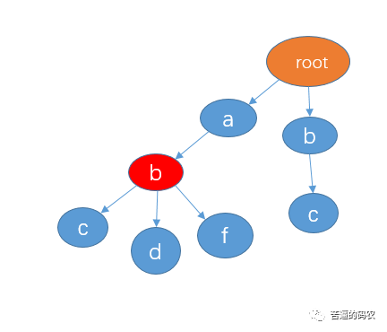

面试官：可以说说 trie 树有哪些应用吗？

小秋：trie 最大的特点就是利用了字符串的公共前缀，像我们有时候在百度、谷歌输入某个关键字的时候，它会给我们列举出很多相关的信息


这种就是通过 trie 树来实现的。

小秋：（嗯？trie 又称为单词查找树，好像可以用 trie 来实现刚才的敏感词匹配？面试官无缘无故提 trie 树难道别有用意？）

面试官：刚才的敏感词过滤，其实也可以采用 trie 来实现，你知道怎么实现吗？

####trie 树来实现敏感词过滤

小秋：（果然，面试官真是个好人啊，直接提示了，要是还不知道怎么实现，那不真凉？）我想想……..我知道了，我可以这样来实现：

先把你给我的三个敏感词："de", "bca", "bcf" 建立一颗 trie 树，如下：


接着我们可以采用三个指针来遍历，我直接用上面你给你例子来演示吧。

1、首先指针 p1 指向 root，指针 p2 和 p3 指向字符串第一个字符


2、然后从字符串的 a 开始，检测有没有以 a 作为前缀的敏感词，直接判断 p1 的孩子节点中是否有 a 这个节点就可以了，显然这里没有。接着把指针 p2 和 p3 向右移动一格。


3、然后从字符串 b 开始查找，看看是否有以 b 作为前缀的字符串，p1 的孩子节点中有 b，这时，**我们把 p1 指向节点 b，p2 向右移动一格，不过，p3不动。**


4、判断 p1 的孩子节点中是否存在 p2 指向的字符c，显然有。我们把 p1 指向节点 c，p2 向右移动一格，p3不动。


5、判断 p1 的孩子节点中是否存在 p2 指向的字符d，这里没有。这意味着，**不存在以字符b作为前缀的敏感词**。这时我们把p2和p3都移向字符c，p1还是还原到最开始指向 root。


6、和前面的步骤一样，判断有没以 c 作为前缀的字符串，显然这里没有，所以把 p2 和 p3 移到字符 d。


7、然后从字符串 d 开始查找，看看是否有以 d 作为前缀的字符串，p1 的孩子节点中有 d，这时，**我们把 p1 指向节点 d，p2向右移动一格，不过，p3和刚才一样不动。**（看到这里，我猜你已经懂了）


8、判断 p1 的孩子节点中是否存在 p2 指向的字符e，显然有。我们把 p1 指向节点e，**并且，这里e是最后一个节点了，查找结束，所以存在敏感词de**，即 p3 和 p2 这个区间指向的就是敏感词了，把 p2 和 p3指向的区间那些字符替换成 *。并且把 p2 和 p3 移向字符 f。如下：


9、接着还是重复同样的步骤，知道 p3 指向最后一个字符。

####复杂度分析

面试官：可以说说时间复杂度吗？

小秋：如果敏感词的长度为 m，则每个敏感词的查找时间复杂度是 O(m)，字符串的长度为 n，我们需要遍历 n 遍，所以敏感词查找这个过程的时间复杂度是O(n * m)。如果有 t 个敏感词的话，构建 trie 树的时间复杂度是 O(t * m)。

> 这里我说明一下，在实际的应用中，构建 trie 树的时间复杂度我觉得可以忽略，因为 trie 树我们可以在一开始就构建了，以后可以无数次重复利用的了。

10、如果让你来 构建 trie 树，你会用什么数据结构来实现？

小秋：我一般使用 Java，我会采用 HashMap 来实现，因为一个节点的字节点个数未知，采用 HashMap 可以动态拓展，而且可以在 O(1) 复杂度内判断某个子节点是否存在。

面试官：嗯，回去等通知吧。

####总结

今天主要将了 trie 树以及 trie 树的一些应用，还要就是如何通过 trie 树来实现敏感词的过滤，至于代码的实现，我这里就不给出了，在实现的时候，为了防止这种”麻 痹"或者“麻￥痹”等，我们也要对特殊字符进行过滤等，有兴趣的可以去实现一波。


<hr>
 

####<p>原文出处：<a href='https://mp.weixin.qq.com/s?__biz=MzAxODQxMDM0Mw==&mid=2247484478&idx=1&sn=685308e10c32ee5ad3508a5789633b3a&chksm=9bd7fa36aca07320ecbae4a53ed44ff6acc95c69027aa917f5e10b93dedca86119e81c7bad26&scene=21#wechat_redirect' target='blank'>如何高效对有序数组/链表去重？</a></p>

###预计阅读时间：5 分钟

我们知道对于数组来说，在尾部插入、删除元素是比较高效的，时间复杂度是 O(1)，但是如果在中间或者开头插入、删除元素，就会涉及数据的搬移，时间复杂度为O(N)，效率较低。  

所以对于一般处理数组的算法问题，我们要尽可能只对数组尾部的元素进行操作，以避免额外的时间复杂度。

这篇文章讲讲如何对一个有序数组去重，先看下题目：

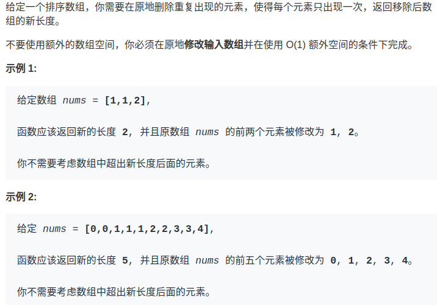

显然，由于数组已经排序，所以重复的元素一定连在一起，找出它们并不难，但如果毎找到一个重复元素就立即删除它，就是在数组中间进行删除操作，整个时间复杂度是会达到O(N^2)。而且题目要求我们原地修改，也就是说不能用辅助数组，空间复杂度得是 O(1)。

其实，**对于数组相关的算法问题，有一个通用的技巧：要尽量避免在中间删除元素，那我就****先****想办法把这个元素换到最后去**。

这样的话，最终待删除的元素都拖在数组尾部，一个一个 pop 掉就行了，每次操作的时间复杂度也就降低到 O(1) 了。  

按照这个思路呢，又可以衍生出解决类似需求的通用方式：双指针技巧。具体一点说，应该是快慢指针。

我们让慢指针`slow`走左后面，快指针`fast`走在前面探路，找到一个不重复的元素就告诉`slow`并让`slow`前进一步。

这样当`fast`指针遍历完整个数组`nums`后，**`nums[0..slow]`就是不重复元素，之后的所有元素都是重复元素**。


看下算法执行的过程：  

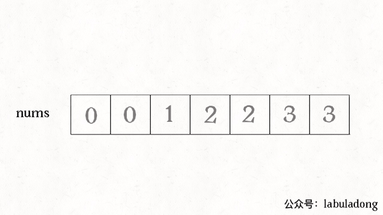

再简单扩展一下，如果给你一个有序链表，如何去重呢？其实和数组是一模一样的，唯一的区别是把数组赋值操作变成操作指针而已：  

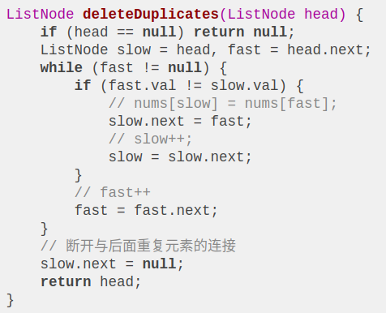

  
对于链表去重，算法执行的过程是这样的：

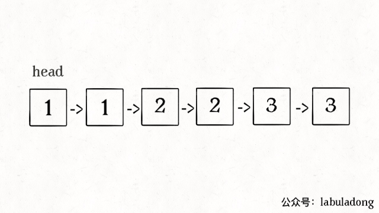  

  
最后，近期准备写写一些简单实用的数组/链表技巧。那些稍困难的技巧（比如动态规划）虽然秀，但毕竟在现实生活中不容易遇到。恰恰是一些简单常用的技巧，能够在不经意间，让人发现你是个高手 ^_^。


<hr>


####<p>原文出处：<a href='https://mp.weixin.qq.com/s?__biz=MzAxODQxMDM0Mw==&mid=2247485050&idx=1&sn=dac757454b2df9a1291f1e8027f56c1b&chksm=9bd7f872aca07164da3e1138df630d63b41e4f071f71194069bcedeef866c1b91650a77be3d2&scene=21#wechat_redirect' target='blank'>高效寻找缺失和重复的数字</a></p>

今天就聊一道很看起来简单却十分巧妙的问题，寻找缺失和重复的元素。之前的一篇文章 [寻找缺失元素](http://mp.weixin.qq.com/20200505-214536?__biz=MzAxODQxMDM0Mw==&mid=2247484477&idx=1&20200505-214536n=13834cfd618377385226c3dc598b2c28&chk20200505-214536m=9bd7fa35aca0732374dc34c78c276b982605892caf69cb31ad9a6c3685de5dbccac81989b195&20200505-214536cene=21#wechat_redirect) 也写过类似的问题，不过这次的和上次的问题使用的技巧不同。  

这是 LeetCode 645 题，我来描述一下这个题目：

给一个长度为`N`的数组`num`，其中本来装着`[1..N]`这`N`个元素，无序。但是现在出现了一些错误，`num`中的一个元素出现了重复，也就同时导致了另一个元素的缺失。请你写一个算法，找到`num`中的重复元素和缺
失元素的值。

    
```
// 返回两个数字，分别是 {dup, missing}
vector<int> findErrorNums(vector<int>& nums);
```

比如说输入：`num = [1,2,2,4]`，算法返回`[2,3]`。

其实很容易解决这个问题，先遍历一次数组，用一个哈希表记录每个数字出现的次数，然后遍历一次`[1..N]`，看看那个元素重复出现，那个元素没有出现，就 OK了。

但问题是，这个常规解法需要一个哈希表，也就是 O(N)的空间复杂度。你看题目给的条件那么巧，在`[1..N]`的几个数字中恰好有一个重复，一个缺失，事出反常必有妖，对吧。

O(N) 的时间复杂度遍历数组是无法避免的，所以我们可以想想办法如何降低空间复杂度，是否可以在 O(1) 的空间复杂度之下找到重复和确实的元素呢？

####思路分析

这个问题的特点是，每个元素和数组索引有一定的对应关系。

我们现在自己改造下问题，暂且将`num2`中的元素变为`[0..N-1]`，这样每个元素就和一个数组索引完全对应了，这样方便理解一些。

如果说`num`中不存在重复元素和缺失元素，那么每个元素就和唯一一个索引值对应，对吧？

现在的问题是，有一个元素重复了，同时导致一个元素缺失了，这会产生什么现象呢？**会导致有两个元素对应到了同一个索引，而且会有一个索引没有元素对应过去**。

那么，如果我能够通过某些方法，找到这个重复对应的索引，不就是找到了那个重复元素么？找到那个没有元素对应的索引，不就是找到了那个缺失的元素了么？

那么，如何不使用额外空间判断某个索引有多少个元素对应呢？这就是这个问题的精妙之处了：

**通过将每个索引对应的元素变成负数，以表示这个索引被对应过一次了**：

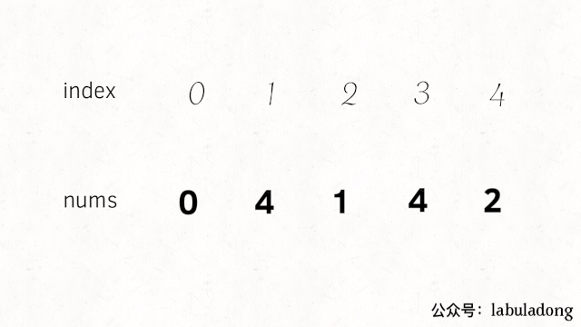


如果出现重复元素`4`，直观结果就是，索引`4`所对应的元素已经是负数了：


对于缺失元素`3`，直观结果就是，索引`3`所对应的元素是正数：


对于这个现象，我们就可以翻译成代码了：

    
```
vector<int> findErrorNums(vector<int>& nums) {
    int n = nums.size();
    int dup = -1;
    for (int i = 0; i < n; i++) {
        int index = abs(nums[i]);
        // nums[index] 小于 0 则说明重复访问
        if (nums[index] < 0)
            dup = abs(nums[i]);
        else
            nums[index] *= -1;
    }

    int missing = -1;
    for (int i = 0; i < n; i++)
        // nums[i] 大于 0 则说明没有访问
        if (nums[i] > 0)
            missing = i;

    return {dup, missing};
}
```

这个问题就基本解决了，别忘了我们刚才为了方便分析，假设元素是`[0..N-1]`，但题目要求是`[1..N]`，所以只要简单修改两处地方即可得到原题的答案：


```
vector<int> findErrorNums(vector<int>& nums) {
    int n = nums.size();
    int dup = -1;
    for (int i = 0; i < n; i++) {
        // 索引应该从 0 开始
        int index = abs(nums[i]) - 1;
        if (nums[index] < 0)
            dup = abs(nums[i]);
        else
            nums[index] *= -1;
    }

    int missing = -1;
    for (int i = 0; i < n; i++)
        if (nums[i] > 0)
            // 将索引转换成元素
            missing = i + 1;

    return {dup, missing};
}
```

其实，元素从 1 开始是有道理的，也必须从一个非零数开始。因为如果元素从 0 开始，那么 0 的相反数还是自己，所以如果数字 0 出现了重复或者缺失，算法就无法判断 0 是否被访问过。我们之前的假设只是为了简化题目，更通俗易懂。

####最后总结

对于这种数组问题，**关键点在于元素和索引是成对儿出现的，常用的方法是排序、异或、映射**。

映射的思路就是我们刚才的分析，将每个索引和元素映射起来，通过正负号记录某个元素是否被映射。

排序的方法也很好理解，对于这个问题，可以想象如果元素都被从小到大排序，如果发现索引对应的元素如果不相符，就可以找到重复和缺失的元素。

异或运算也是常用的，因为异或性质`a ^ a = 0, a ^ 0 = a`，如果将索引和元素同时异或，就可以消除成对儿的索引和元素，留下的就是重复或者缺失的元素。可以看看前文「[寻找缺失元素](http://mp.weixin.qq.com/20200505-214536?__biz=MzAxODQxMDM0Mw==&mid=2247484477&idx=1&20200505-214536n=13834cfd618377385226c3dc598b2c28&chk20200505-214536m=9bd7fa35aca0732374dc34c78c276b982605892caf69cb31ad9a6c3685de5dbccac81989b195&20200505-214536cene=21#wechat_redirect)」，介绍过这种方法。


<hr>


####<p>原文出处：<a href='https://mp.weixin.qq.com/s?__biz=MzAxODQxMDM0Mw==&mid=2247484505&idx=1&sn=0e9517f7c4021df0e6146c6b2b0c4aba&chksm=9bd7fa51aca07347009c591c403b3228f41617806429e738165bd58d60220bf8f15f92ff8a2e&scene=21#wechat_redirect' target='blank'>双指针技巧汇总</a></p>

###预计阅读时间： 6 分钟

我认为双指针技巧还可以分为两类，一类是「快慢指针」，一类是「左右指针」。前者解决主要解决链表中的问题，比如典型的判定链表中是否包含环；后者主要解决数组（或者字符串）中的问题，比如二分查找。


**一、快慢指针的常见算法**

快慢指针一般都初始化指向链表的头结点 head，前进时快指针 fast 在前，慢指针 slow 在后，巧妙解决一些链表中的问题。

_1_、判定链表中是否含有环

这应该属于链表最基本的操作了，如果读者已经知道这个技巧，可以跳过。

单链表的特点是每个节点只知道下一个节点，所以一个指针的话无法判断链表中是否含有环的。

如果链表中不含环，那么这个指针最终会遇到空指针 null 表示链表到头了，这还好说，可以判断该链表不含环。
    
    
    boolean hasCycle(ListNode head) {  
        while (head != null)  
            head = head.next;  
        return false;  
    }  
    

  

但是如果链表中含有环，那么这个指针就会陷入死循环，因为环形数组中没有 null 指针作为尾部节点。


经典解法就是用两个指针，一个每次前进两步，一个每次前进一步。如果不含有环，跑得快的那个指针最终会遇到
null，说明链表不含环；如果含有环，快指针最终会超慢指针一圈，和慢指针相遇，说明链表含有环。

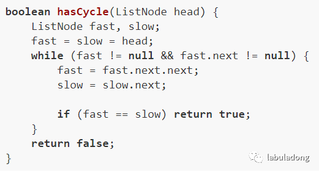

_2_、已知链表中含有环，返回这个环的起始位置  

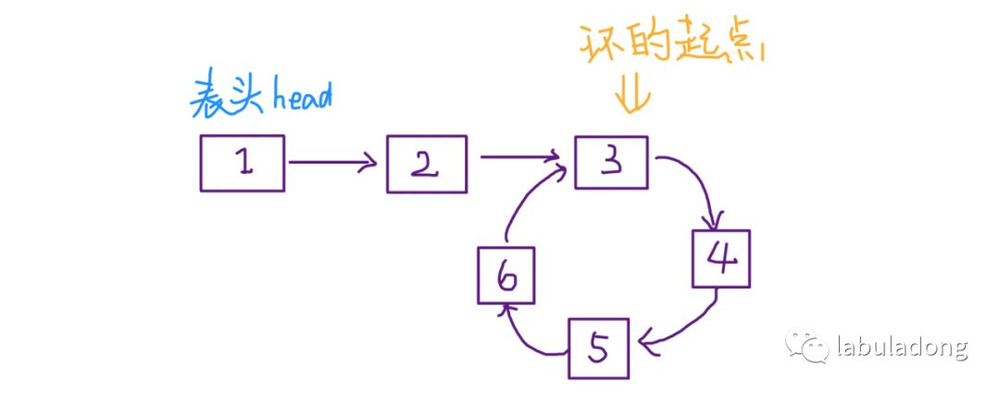


这个问题其实不困难，有点类似脑筋急转弯，先直接看代码：


可以看到，当快慢指针相遇时，让其中任一个指针重新指向头节点，然后让它俩以相同速度前进，再次相遇时所在的节点位置就是环开始的位置。这是为什么呢？  

第一次相遇时，假设慢指针 slow 走了 k 步，那么快指针 fast 一定走了 2k 步，也就是说比 slow 多走了 k 步（也就是环的长度）。


设相遇点距环的起点的距离为 m，那么环的起点距头结点 head 的距离为 k - m，也就是说如果从 head 前进 k - m 步就能到达环起点。


巧的是，如果从相遇点继续前进 k - m 步，也恰好到达环起点。

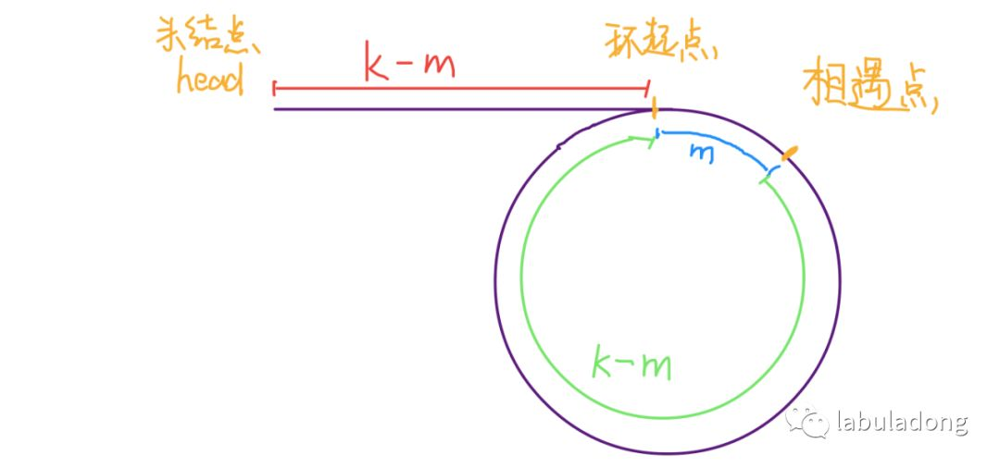

所以，只要我们把快慢指针中的任一个重新指向 head，然后两个指针同速前进，k - m 步后就会相遇，相遇之处就是环的起点了。

_3_、寻找链表的中点

类似上面的思路，我们还可以让快指针一次前进两步，慢指针一次前进一步，当快指针到达链表尽头时，慢指针就处于链表的中间位置。
    
    
    ListNode slow, fast;  
    slow = fast = head;  
    while (fast != null && fast.next != null) {  
        fast = fast.next.next;  
        slow = slow.next;  
    }  
    // slow 就在中间位置  
    return slow;

  

当链表的长度是奇数时，slow 恰巧停在中点位置；如果长度是偶数，slow 最终的位置是中间偏右：
  


寻找链表中点的一个重要作用是对链表进行归并排序。

回想数组的归并排序：求中点索引递归地把数组二分，最后合并两个有序数组。对于链表，合并两个有序链表是很简单的，难点就在于二分。

但是现在你学会了找到链表的中点，就能实现链表的二分了。关于归并排序的具体内容本文就不具体展开了。  

_4_、寻找链表的倒数第 k 个元素

我们的思路还是使用快慢指针，让快指针先走 k 步，然后快慢指针开始同速前进。这样当快指针走到链表末尾 null 时，慢指针所在的位置就是倒数第 k个链表节点（为了简化，假设 k 不会超过链表长度）：
    

    
    ListNode slow, fast;  
    slow = fast = head;  
    while (k-- > 0)   
        fast = fast.next;  
      
    while (fast != null) {  
        slow = slow.next;  
        fast = fast.next;  
    }  
    return slow;  


**二、左右指针的常用算法**  

左右指针在数组中实际是指两个索引值，一般初始化为 left = 0, right = nums.length - 1 。

_1_、二分查找


前文 [二分查找算法详解](http://mp.weixin.qq.com/s?__biz=MzU0MDg5OTYyOQ==&mid=2247484090&idx=1&sn=5635cf1c4fd8a8570b63c7ae9b4304c2&chksm=fb3362f8cc44ebee0a19a4cfba7f2e13923e05f47e15f2e99a1f42b01aeee83b946aceac3d4c&scene=21#wechat_redirect)有详细讲解，这里只写最简单的二分算法，旨在突出它的双指针特性：
  


_2_、两数之和

直接看一道 LeetCode 题目吧：


只要数组有序，就应该想到双指针技巧。这道题的解法有点类似二分查找，通过调节 left 和 right 可以调整 sum 的大小：

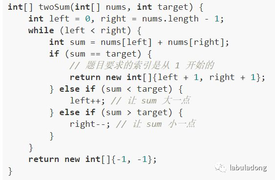


_3_、反转数组

    
    void reverse(int[] nums) {  
        int left = 0;  
        int right = nums.length - 1;  
        while (left < right) {  
            // swap(nums[left], nums[right])  
            int temp = nums[left];  
            nums[left] = nums[right];  
            nums[right] = temp;  
            left++; right--;  
        }  
    }  
    

_4_、滑动窗口算法

这也许是双指针技巧的最高境界了，如果掌握了此算法，可以解决一大类子字符串匹配的问题，不过「滑动窗口」算法比上述的这些算法稍微复杂些。

幸运的是，这类算法是有框架模板的，下篇文章就准备讲解「滑动窗口」算法模板，帮大家秒杀几道 LeetCode 子串匹配的问题。


<hr>


####<p>原文出处：<a href='https://mp.weixin.qq.com/s?__biz=MzAxODQxMDM0Mw==&mid=2247484504&idx=1&sn=5ecbab87e42033cc0a62b635cc436977&chksm=9bd7fa50aca07346a3ffa6be6fccc445968c162af9532fa9c6304eaab2e3a1b79a4bbe758c0a&scene=21#wechat_redirect' target='blank'>滑动窗口算法解决子串问题</a></p>

现在写滑动窗口算法的时机应该是合适的，因为读者已经通过 [双指针技巧汇总](http://mp.weixin.qq.com/s?__biz=MzU0MDg5OTYyOQ==&mid=2247484119&idx=1&sn=4e7a1389ced3b45de694605c03750d5d&chksm=fb336295cc44eb83220200505-220335d174844f3622457c69b48c4a18e2f599a88eacb797af4f30bfe3312c&scene=21#wechat_redirect) 理解了双指针的套路，通过 [单调队列解决滑动窗口问题](http://mp.weixin.qq.com/s?__biz=MzU0MDg5OTYyOQ==&mid=2247484103&idx=1&sn=4a68a4a0ec7f3186f0feee768641911f&chksm=fb336285cc44eb939e8aa5ff5936b3443e6d64c332e4783270d8d4b092c48aaed41f1b691f2c&scene=21#wechat_redirect) 对滑动窗口这个东西有了个印象，而且通过 [一个方法团灭股票问题](http://mp.weixin.qq.com/s?__biz=MzU0MDg5OTYyOQ==&mid=2247484079&idx=1&sn=4a90da2b16be911394e418ad21b232ab&chksm=fb3362edcc44ebfbec433ff322a9a7e2708ef6390ad87510fd7e765421dd6f702aaf0bb9edb8&scene=21#wechat_redirect) 看到了成体系方法举一反三的威力。

本文详解「滑动窗口」这种高级双指针技巧的算法框架，带你秒杀几道高难度的子字符串匹配问题。

LeetCode 上至少有 9 道题目可以用此方法高效解决。但是有几道是 VIP 题目，有几道题目虽不难但太复杂，所以本文只选择点赞最高，较为经典的，最能够讲明白的三道题来讲解。第一题为了让读者掌握算法模板，篇幅相对长，后两题就基本秒杀了。文章最后抽象出一个简单的算法框架。  

本文代码为 C++ 实现，不会用到什么编程方面的奇技淫巧，但是还是简单介绍一下一些用到的数据结构，以免有的读者因为语言的细节问题阻碍对算法思想的理解：

unordered_map 就是哈希表（字典），它的一个方法 count(key) 相当于 containsKey(key) 可以判断键 key 是否存在。

可以使用方括号访问键对应的值 map[key]。需要注意的是，如果该 key 不存在，C++ 会自动创建这个 key，并把 map[key] 赋值为 0。

所以代码中多次出现的 map[key]++ 相当于 Java 的 map.put(key, map.getOrDefault(key, 0)+1)。

**PS：本文大的主要代码都是图片形式，可以点开放大，更重要的是可以左右滑动方便对比代码。**

####一、最小覆盖子串


题目不难理解，要求在串 S(source) 中找到包含串 T(target) 中全部字母的一个子串，顺序无所谓，但这个子串得是所有可能子串中最短的。

此题难度 Hard，但是因为很有代表性，所以放到第一道。

如果我们使用暴力解法，代码大概是这样的：
    
    
    for (int i = 0; i < s.size(); i++)  
        for (int j = i + 1; j < s.size(); j++)  
            if s[i:j] 包含 t 的所有字母:  
                更新答案  
    
思路很直接吧，但是显然，这个算法的复杂度肯定大于 O(N^2) 了，不好。

**滑动窗口算法的思路是这样：**

_1_、我们在字符串 S 中使用双指针中的左右指针技巧，初始化 left = right = 0，把索引闭区间 [left, right] 称为一个「窗口」。

_2_、我们先不断地增加 right 指针扩大窗口 [left, right]，直到窗口中的字符串符合要求（包含了 T 中的所有字符）。

_3_、此时，我们停止增加 right，转而不断增加 left 指针缩小窗口 [left, right]，直到窗口中的字符串不再符合要求（不包含 T 中的所有字符了）。同时，每次增加 left，我们都要更新一轮结果。  

_4_、重复第 2 和第 3 步，直到 right 到达字符串 S 的尽头。

这个思路其实也不难，**第 2 步相当于在寻找一个「可行解」，然后第 3 步在优化这个「可行解」，最终找到最优解。**左右指针轮流前进，窗口大小增增减减，窗口不断向右滑动。

下面画图理解一下，needs 和 window 相当于计数器，分别记录 T 中字符出现次数和窗口中的相应字符的出现次数。

初始状态：

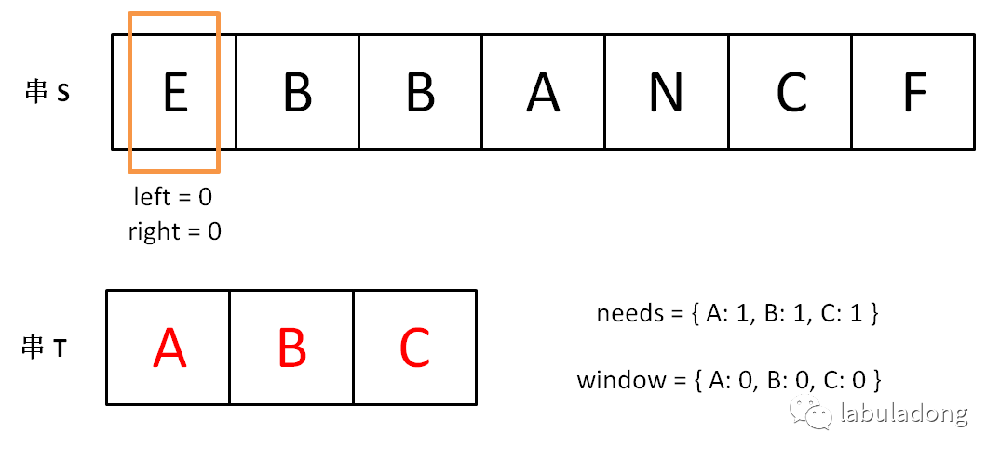

增加 right，直到窗口 [left, right] 包含了 T 中所有字符：

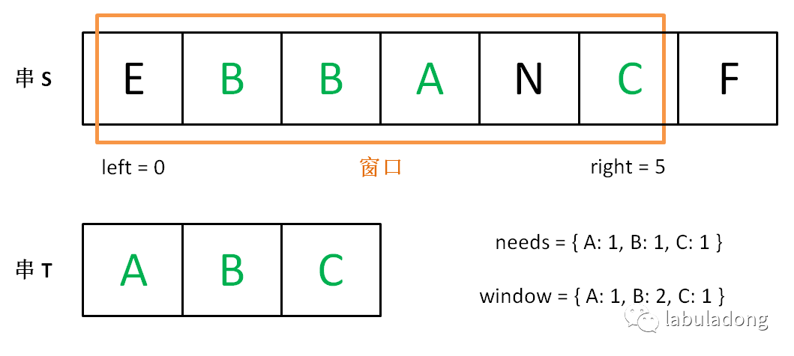

现在开始增加 left，缩小窗口 [left, right]（此时窗口里的字符串是最优解）：

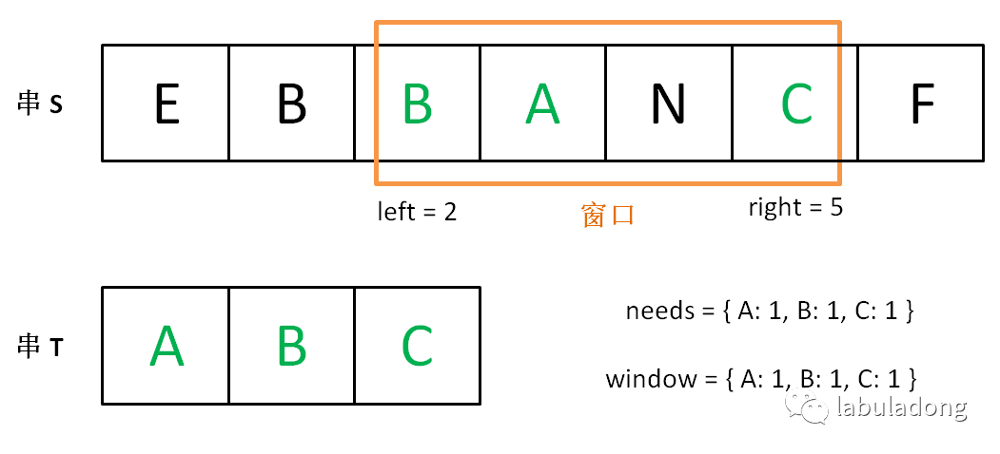

直到窗口中的字符串不再符合要求，left 不再继续移动：  


之后重复上述过程，再移动 right 试图使窗口中的字符再次符合要求，之后移动 left 缩小窗口… 直到 right 指针到达字符串 S 的末端，算法结束。
  
在算法执行过程中，就可以找到长度最短符合条件的子串（窗口）。

如果你能够理解上述过程，恭喜，你已经完全掌握了滑动窗口算法思想。至于如何具体到问题，如何得出此题的答案，都是编程问题，很容易解决。

上述过程可以简单地写出如下伪码框架：
    
    
    string s, t;  
    // 在 s 中寻找 t 的「最小覆盖子串」  
    int left = 0, right = 0;  
    string res = s;  
    // 先移动 right 寻找可行解  
    while(right < s.size()) {  
        window.add(s[right]);  
        right++;  
        // 找到可行解后，开始移动 left 缩小窗口  
        while (window 符合要求) {  
            // 如果这个窗口的子串更短，则更新结果  
            res = minLen(res, window);  
            window.remove(s[left]);  
            left++;  
        }  
    }  
    return res;

如果上述代码你也能够理解，那么你离解题更近了一步。现在就剩下一个比较棘手的问题：

如何判断 window 即子串 s[left...right] 是否符合要求，即是否包含 t 的所有字符呢？  

可以用两个哈希表当作计数器解决。用一个哈希表 needs 记录字符串 t 中包含的字符及出现次数，用另一个哈希表 window 记录当前「窗口」中包含的字符及出现的次数。如果 window 包含所有 needs 中的键，且这些键对应的值都大于等于 needs 中的值，那么就可以知道当前「窗口」符合要求了，可以开始移动 left 指针了。

现在将上面的框架继续细化：

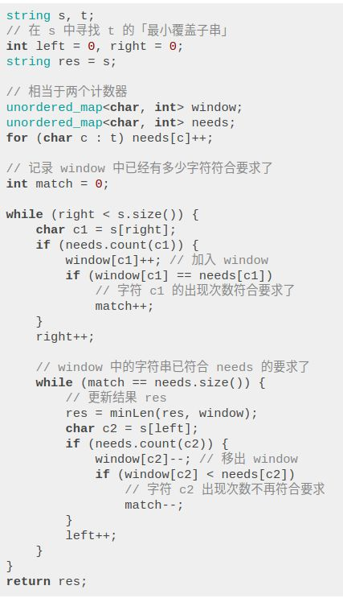

上述代码已经具备完整的逻辑了，只有一处伪码，即更新最短子串结果 res 的地方，不过这个问题太好解决了，直接看完整解法吧！  

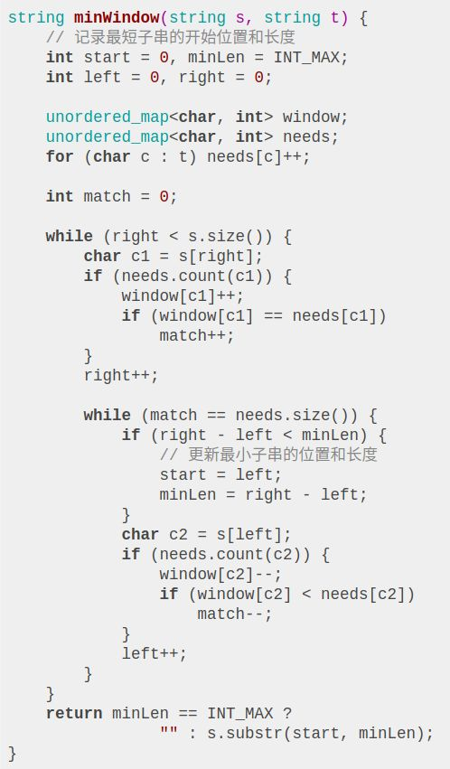

如果直接甩给你这么一大段代码，我想你的心态是爆炸的。但是通过之前的步步跟进，你应该能够理解这个算法的内在逻辑，能清晰看出该算法的结构了。  

这个算法的时间复杂度是 O(M + N)，M 和 N 分别是字符串 S 和 T 的长度。因为我们先用 for 循环遍历了字符串 T 来初始化 needs，时间 O(N)，之后的两个 while 循环最多执行 2M 次，时间 O(M)。

读者也许认为嵌套的 while 循环复杂度应该是平方级，但是你这样想，while 执行的次数就是双指针 left 和 right 走的总路程，最多是 2M嘛。

####二、找到字符串中所有字母异位词

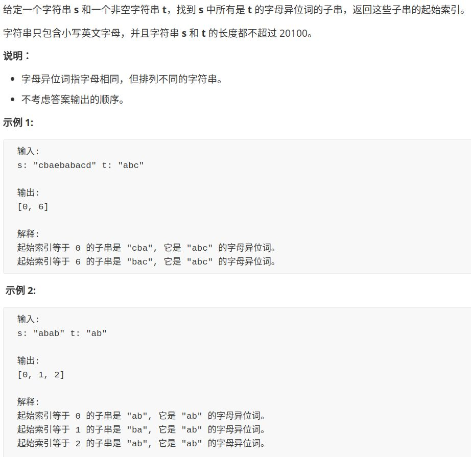

这道题的难度是 Easy，但是评论区点赞最多的一条是这样：
    

    How can this problem be marked as easy?  
    
实际上，这个 Easy 是属于了解双指针技巧的人的，只要把上一道题的代码改中更新结果的代码稍加修改就成了这道题的解：

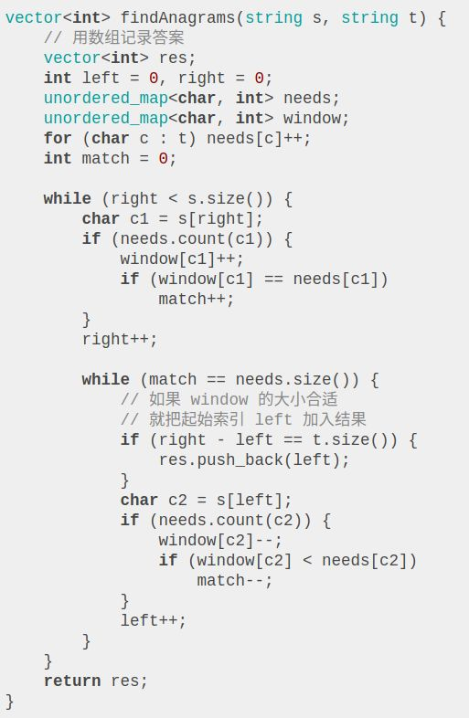

因为这道题和上一道的场景类似，也需要 window 中包含串 t 的所有字符，但上一道题要找长度最短的子串，这道题要找长度相同的子串，也就是「字母异位词」嘛。

####三、无重复字符的最长子串

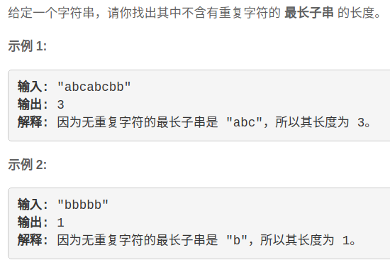

此题难度 Medium，遇到子串问题，首先想到的就是滑动窗口技巧。  

类似之前的思路，使用 window 作为计数器记录窗口中的字符出现次数，然后先向右移动 right，当 window 中出现重复字符时，开始移动 left 缩小窗口，如此往复：

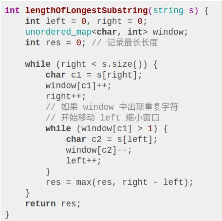

需要注意的是，因为我们要求的是最长子串，所以需要在每次移动 right 增大窗口时更新 res，而不是像之前的题目在移动 left 缩小窗口时更新。  

####四、模板总结

通过上面三道题，我们可以总结出滑动窗口算法的抽象思想：

    
    
    int left = 0, right = 0;  
      
    while (right < s.size()) {  
        window.add(s[right]);  
        right++;  
      
        while (valid) {  
            window.remove(s[left]);  
            left++;  
        }  
    }

  

其中 window 的数据类型可以视具体情况而定，比如上述题目都使用哈希表充当计数器，当然你也可以用一个数组实现同样效果，因为我们只处理英文字母。

另外，滑动窗口技巧也可以运用在数组中，比如给一个数组，求其中 sum 最大的子数组，或者求平均数最大的子数组，都可以用滑动窗口技巧解决。

稍微麻烦的地方就是这个 valid 条件，为了实现这个条件的实时更新，我们可能会写很多代码。比如前两道题，看起来解法篇幅那么长，实际上思想还是很简单，只是大多数代码都在处理这个问题而已。
