 
<!--BEGIN_DATA
{
    "create_date": "2020-05-05 22:14", 
    "modify_date": "2020-05-05 22:14", 
    "is_top": "0", 
    "summary": "递归反转链表：如何拆解复杂问题<br>递归思维：k个一组反转链表<br>图文详解二叉堆，实现优先级队列<br>二叉搜索树操作集锦<br>单调队列解决滑动窗口问题", 
    "tags": "算法、C/C++", 
    "file_name": "算法集锦2.md"
}
END_DATA-->

####<p>原文出处：<a href='https://mp.weixin.qq.com/s?__biz=MzAxODQxMDM0Mw==&mid=2247484467&idx=1&sn=beb3ae89993b812eeaa6bbdeda63c494&chksm=9bd7fa3baca0732dc3f9ae9202ecaf5c925b4048514eeca6ac81bc340930a82fc62bb67681fa&scene=21#wechat_redirect' target='blank'>递归反转链表：如何拆解复杂问题</a></p>

反转单链表的迭代实现不是一个困难的事情，但是递归实现就有点难度了，如果再加一点难度，让你仅仅反转单链表中的一部分，你是否能够**递归实现**呢？  

本文就来由浅入深，step by step 地解决这个问题。如果你还不会递归地反转单链表也没关系，**本文会从递归反转整个单链表开始拓展**，只要你明白单链表的结构，相信你能够有所收获。

    
    
    // 单链表节点的结构  
    public class ListNode {  
        int val;  
        ListNode next;  
        ListNode(int x) { val = x; }  
    }  
    

什么叫反转单链表的一部分呢，就是给你一个索引区间，让你把单链表中这部分元素反转，其他部分不变：


**注意这里的索引是从 1 开始的**。迭代的思路大概是：先用一个 for 循环找到第`m`个位置，然后再用一个 for 循环将`m`和`n`之间的元素反转。但是我们的递归解法不用任何 for 循环，纯递归实现反转。  

迭代实现思路看起来虽然简单，但是细节问题很多的，反而不容易写对。相反，递归实现就很简洁优美，下面就由浅入深，先从反转整个单链表说起。

####一、递归反转整个链表

这个算法可能很多读者都听说过，这里详细介绍一下，先直接看实现代码：

    
    
    ListNode reverse(ListNode head) {  
        if (head.next == null) return head;  
        ListNode last = reverse(head.next);  
        head.next.next = head;  
        head.next = null;  
        return last;  
    }  
    

看起来是不是感觉不知所云，完全不能理解这样为什么能够反转链表？这就对了，这个算法常常拿来显示递归的巧妙和优美，我们下面来详细解释一下这段代码。

**对于递归算法，最重要的就是明确递归函数的定义**。具体来说，我们的`reverse`函数定义是这样的：

**输入一个节点`head`，将「以`head`为起点」的链表反转，并返回反转之后的头结点**。

明白了函数的定义，再来看这个问题。比如说我们想反转这个链表：


那么输入`reverse(head)`后，会在这里进行递归：

    
    ListNode last = reverse(head.next);  
    

不要跳进递归（你的脑袋能压几个栈呀？），而是要根据刚才的函数定义，来弄清楚这段代码会产生什么结果：


按照定义，这个`reverse(head.next)`执行完成后，整个链表应该变成了这样：


并且根据函数定义，`reverse`函数会返回反转之后的头结点，我们用变量`last`接收了。

现在再来看下面的代码：

    
    head.next.next = head;  
    


接下来进行的操作：
    
    
    head.next = null;  
    return last;  
    


神不神奇，这样整个链表就反转过来了！递归代码就是这么简洁优雅，不过其中有两个地方需要注意：

**1、递归函数要有 base case**，也就是这句：
    
    
    if (head.next == null) return head;  
    

意思是如果链表只有一个节点的时候反转也是它自己，直接返回即可。

**2、当链表递归反转之后，新的头节点是`last`，而之前的`head`变成了最后一个节点，别忘了链表的末尾要指向 null：**
    
    
    head.next = null;  
    

理解了这两点后，我们就可以进一步深入了，接下来的问题其实都是在这个算法上的扩展。

####二、反转链表前 N 个节点

这次我们实现一个这样的函数：

    
    // 将链表的前 n 个节点反转（n <= 链表长度）  
    ListNode reverseN(ListNode head, int n)  
    

比如说对于下图链表，执行`reverseN(head, 3)`：


解决思路和反转整个链表差不多，只要稍加修改即可：
    
    
    ListNode successor = null; // 后驱节点  
      
    // 反转以 head 为起点的 n 个节点，返回新的头结点  
    ListNode reverseN(ListNode head, int n) {  
        if (n == 1) {   
            // 记录第 n + 1 个节点  
            successor = head.next;  
            return head;  
        }  
        // 以 head.next 为起点，需要反转前 n - 1 个节点  
        ListNode last = reverseN(head.next, n - 1);  
      
        head.next.next = head;  
        // 让反转之后的 head 节点和后面的节点连起来  
        head.next = successor;  
        return last;  
    }      
    

具体的区别：  

1、base case 变为`n == 1`，反转一个元素，就是它本身，同时**要记录后驱节点**。

2、刚才我们直接把`head.next`设置为 null，因为整个链表反转后原来的`head`变成了整个链表的最后一个节点。但现在`head`节点在递归反转之后不一定是最后一个节点了，所以要记录后驱`successor`（第 n + 1 个节点），反转之后将`head`连接上。


OK，如果这个函数你也能看懂，就离实现「反转一部分链表」不远了。

####三、反转链表的一部分

现在解决我们最开始提出的问题，给一个索引区间`[m,n]`（索引从 1 开始），仅仅反转区间中的链表元素。

    
    ListNode reverseBetween(ListNode head, int m, int n)  
    

首先，如果`m == 1`，就相当于反转链表开头的`n`个元素嘛，也就是我们刚才实现的功能：

    
    ListNode reverseBetween(ListNode head, int m, int n) {  
        // base case  
        if (m == 1) {  
            // 相当于反转前 n 个元素  
            return reverseN(head, n);  
        }  
        // ...  
    }  
    

如果`m != 1`怎么办？如果我们把`head`的索引视为 1，那么我们是想从第`m`个元素开始反转对吧；如果把`head.next`的索引视为 1 呢？那么相对于`head.next`，反转的区间应该是从第`m - 1`个元素开始的；那么对于`head.next.next`呢……

区别于迭代思想，这就是递归思想，所以我们可以完成代码：

    
    ListNode reverseBetween(ListNode head, int m, int n) {  
        // base case  
        if (m == 1) {  
            return reverseN(head, n);  
        }  
        // 前进到反转的起点触发 base case  
        head.next = reverseBetween(head.next, m - 1, n - 1);  
        return head;  
    }  
    

至此，我们的最终大 BOSS 就被解决了。

####四、最后总结

递归的思想相对迭代思想，稍微有点难以理解，处理的技巧是：不要跳进递归，而是利用明确的定义来实现算法逻辑。

处理看起来比较困难的问题，可以尝试化整为零，把一些简单的解法进行修改，解决困难的问题。

值得一提的是，**递归操作链表并不高效。**和迭代解法相比，虽然时间复杂度都是 O(N)，但是迭代解法的空间复杂度是O(1)，而递归解法需要堆栈，空间复杂度是 O(N)。所以递归操作链表可以作为对递归算法的练习或者拿去和小伙伴装逼，但是考虑效率的话还是使用迭代算法更好。


<hr>


####<p>原文出处：<a href='https://mp.weixin.qq.com/s?__biz=MzAxODQxMDM0Mw==&mid=2247484597&idx=1&sn=c603f1752e33cb2701e371d84254aee2&chksm=9bd7fabdaca073abd512d8fff18016c9092ede45fed65c307852c65a2026d8568ee294563c78&scene=21#wechat_redirect' target='blank'>递归思维：k 个一组反转链表</a></p>


上篇文章 [递归反转链表：如何拆解复杂问题](http://mp.weixin.qq.com/20200505-222247?__biz=MzAxODQxMDM0Mw==&mid=2247484467&idx=1&20200505-222247n=beb3ae89993b812eeaa6bbdeda63c494&chk20200505-222247m=9bd7fa3baca0732dc3f9ae9202ecaf5c925b4048514eeca6ac81bc340930a82fc62bb67681fa&20200505-222247cene=21#wechat_redirect);讲了如何递归地反转一部分链表，有读者就问如何迭代地反转链表，这篇文章解决的问题也需要反转链表的函数，我们不妨就用迭代方式来解决。  

本文要解决「K 个一组反转链表」，不难理解：


这个问题经常在面经中看到，而且 LeetCode 上难度是 Hard，它真的有那么难吗？

对于基本数据结构的算法问题其实都不难，只要结合特点一点点拆解分析，一般都没啥难点。下面我们就来拆解一下这个问题。

####一、分析问题

首先，前文&nb20200505-222247p;[学习数据结构的框架思维](http://mp.weixin.qq.com/20200505-222247?__biz=MzAxODQxMDM0Mw==&mid=2247484520&idx=1&20200505-222247n=2c6507c7f25c0fd29fd1d146ee3b067c&chk20200505-222247m=9bd7fa60aca073763785418d15ed03c9debdd93ca36f4828fa809990116b1e7536c3f68a7b71&20200505-222247cene=21#wechat_redirect)提到过，链表是一种兼具递归和迭代性质的数据结构，认真思考一下可以发现这个问题具有递归性质。

什么叫递归性质？直接上图理解，比如说我们对这个链表调用 `revereKGroup(head, 2)`，即以 2 个节点为一组反转链表：


如果我设法把前 2 个节点反转，那么后面的那些节点怎么处理？后面的这些节点也是一条链表，而且规模（长度）比原来这条链表小，这就叫**子问题**。 


我们可以直接递归调用 `revereKGroup(head, 2)`，因为子问题和原问题的结构完全相同，这就是所谓的递归性质。

发现了递归性质，就可以得到大致的算法流程：

**1、先反转以 `head` 开头的 `k` 个元素。**


**2、将第 `k + 1`个元素作为 `head` 递归调用 `revereKGroup` 函数。**


**3、将上述两个过程的结果连接起来。**


整体思路就是这样了，最后一点值得注意的是，递归函数都有个 base case，对于这个问题是什么呢？

题目说了，**如果最后的元素不足 k 个，就保持不变。这就是 base case**，待会会在代码里体现。

####二、代码实现

首先，我们要实现一个 `revere` 函数反转一个区间之内的元素。在此之前我们再简化一下，给定链表头结点，如何反转整个链表？

    
```
// 反转以 a 为头结点的链表
ListNode reverse(ListNode a) {
    ListNode pre, cur, nxt;
    pre = null; cur = a; nxt = a;
    while (cur != null) {
        nxt = cur.next;
        // 逐个结点反转
        cur.next = pre;
        // 更新指针位置
        pre = cur;
        cur = nxt;
    }
    // 返回反转后的头结点
    return pre;
}
```

这次使用迭代思路来实现的，借助动画理解应该很容易。

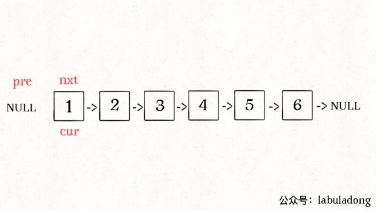

「反转以 `a` 为头结点的链表」其实就是「反转 `a` 到 null 之间的结点」，那么如果让你「反转 `a` 到 `b` 之间的结点」，你会不会？  

只要更改函数签名，并把上面的代码中 `null` 改成 `b` 即可：


```
/** 反转区间 [a, b) 的元素，注意是左闭右开 */
ListNode reverse(ListNode a, ListNode b) {
    ListNode pre, cur, nxt;
    pre = null; cur = a; nxt = a;
    // while 终止的条件改一下就行了
    while (cur != b) {
        nxt = cur.next;
        cur.next = pre;
        pre = cur;
        cur = nxt;
    }
    // 返回反转后的头结点
    return pre;
}
```

现在我们迭代实现了反转部分链表的功能，接下来就按照之前的逻辑编写 `revereKGroup` 函数即可：


```
ListNode reverseKGroup(ListNode head, int k) {
    if (head == null) return null;
    // 区间 [a, b) 包含 k 个待反转元素
    ListNode a, b;
    a = b = head;
    for (int i = 0; i < k; i++) {
        // 不足 k 个，不需要反转，base case
        if (b == null) return head;
        b = b.next;
    }
    // 反转前 k 个元素
    ListNode newHead = reverse(a, b);
    // 递归反转后续链表并连接起来
    a.next = reverseKGroup(b, k);
    return newHead;
}
```
   
解释一下 `for` 循环之后的几句代码，注意 `revere` 函数是反转区间 `[a, b)`，所以情形是这样的：


递归部分就不展开了，整个函数递归完成之后就是这个结果，完全符合题意：


<hr>


####<p>原文出处：<a href='https://mp.weixin.qq.com/s?__biz=MzAxODQxMDM0Mw==&mid=2247484495&idx=1&sn=bbfeba9bb5cfd50598e2a4d08c839ee9&chksm=9bd7fa47aca073512e094110a7fe7d9bac052be114d1db72fe07b7efa6beb915f51b3f19291e&scene=21#wechat_redirect' target='blank'>图文详解二叉堆，实现优先级队列</a></p>


二叉堆（Binary Heap）没什么神秘，性质比二叉搜索树 BST 还简单。其主要操作就两个，`sink`（下沉）和`swim`（上浮），用以维护二叉堆的性质。其主要应用有两个，首先是一种排序方法「堆排序」，第二是一种很有用的数据结构「优先级队列」。  

本文就以实现优先级队列（Priority Queue）为例，通过图片和人类的语言来描述一下二叉堆怎么运作的。

####一、二叉堆概览

首先，二叉堆和二叉树有啥关系呢，为什么人们总数把二叉堆画成一棵二叉树？

因为，二叉堆其实就是一种特殊的二叉树（完全二叉树），只不过存储在数组里。一般的链表二叉树，我们操作节点的指针，而在数组里，我们把数组索引作为指针：

    
    
    // 父节点的索引  
    int parent(int root) {  
        return root / 2;  
    }  
    // 左孩子的索引  
    int left(int root) {  
        return root * 2;  
    }  
    // 右孩子的索引  
    int right(int root) {  
        return root * 2 + 1;  
    }  
    

画个图你立即就能理解了，注意数组的第一个索引 0 空着不用：


PS：因为数组索引是数字，为了方便区分，将字符作为数组元素。

你看到了，把 arr[1] 作为整棵树的根的话，每个节点的父节点和左右孩子的索引都可以通过简单的运算得到，这就是二叉堆设计的一个巧妙之处。为了方便讲解，下面都会画的图都是二叉树结构，相信你能把树和数组对应起来。

二叉堆还分为最大堆和最小堆。**最大堆的性质是：每个节点都大于等于它的两个子节点。**类似的，最小堆的性质是：每个节点都小于等于它的子节点。

两种堆核心思路都是一样的，本文以最大堆为例讲解。

对于一个最大堆，根据其性质，显然堆顶，也就是 arr[1] 一定是所有元素中最大的元素。

####二、优先级队列概览

优先级队列这种数据结构有一个很有用的功能，你插入或者删除元素的时候，元素会自动排序，这底层的原理就是二叉堆的操作。

数据结构的功能无非增删查该，优先级队列有两个主要API，分别是`insert`插入一个元素和`delMax`删除最大元素（如果底层用最小堆，那么就是`delMin`）。

下面我们实现一个简化的优先级队列，先看下代码框架：

PS：为了清晰起见，这里用到 Java 的泛型，`Key`可以是任何一种可比较大小的数据类型，你可以认为它是 int、char 等。


####三、实现 swim 和 sink

为什么要有上浮 swim 和下沉 sink 的操作呢？为了维护堆结构。

我们要讲的是最大堆，每个节点都比它的两个子节点大，但是在插入元素和删除元素时，难免破坏堆的性质，这就需要通过这两个操作来恢复堆的性质了。

对于最大堆，会破坏堆性质的有有两种情况：

  1. 如果某个节点 A 比它的子节点（中的一个）小，那么 A 就不配做父节点，应该下去，下面那个更大的节点上来做父节点，这就是对 A 进行**下沉**。

  2. 如果某个节点 A 比它的父节点大，那么 A 不应该做子节点，应该把父节点换下来，自己去做父节点，这就是对 A 的**上浮**。

当然，错位的节点 A 可能要上浮（或下沉）很多次，才能到达正确的位置，恢复堆的性质。所以代码中肯定有一个`while`循环。

**上浮的代码实现：**


画个图看一眼就明白了：

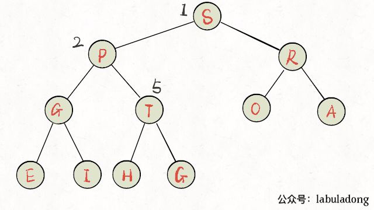

**下沉的代码实现：**

下沉比上浮略微复杂一点，因为上浮某个节点 A，只需要 A 和其父节点比较大小即可；但是下沉某个节点 A，需要 A 和其**两个子节点**比较大小，如果 A 不是最大的就需要调整位置，要把较大的那个子节点和 A 交换。


画个图看下就明白了：

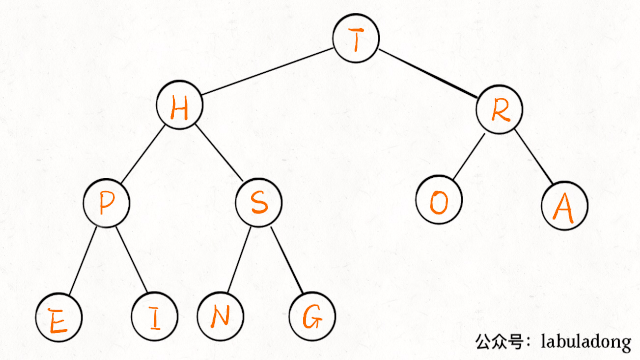

至此，二叉堆的主要操作就讲完了，一点都不难吧，代码加起来也就十行。明白了`sink`和`swim`的行为，下面就可以实现优先级队列了。

####四、实现 delMax 和 insert

这两个方法就是建立在`swim`和`sink`上的。

**`insert`方法先把要插入的元素添加到堆底的最后，然后让其上浮到正确位置。**
    
    
    public void insert(Key e) {  
        N++;  
        // 先把新元素加到最后  
        pq[N] = e;  
        // 然后让它上浮到正确的位置  
        swim(N);  
    }  
    

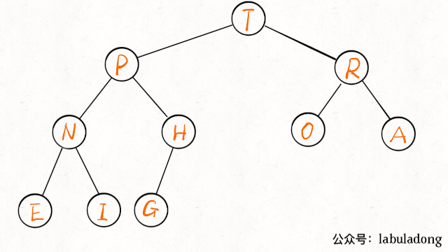

**`delMax`方法先把堆顶元素 A 和堆底最后的元素 B 对调，然后删除 A，最后让 B 下沉到正确位置。**
    
    
    public Key delMax() {  
        // 最大堆的堆顶就是最大元素  
        Key max = pq[1];  
        // 把这个最大元素换到最后，删除之  
        exch(1, N);  
        pq[N] = null;  
        N--;  
        // 让 pq[1] 下沉到正确位置  
        sink(1);  
        return max;  
    }  
    

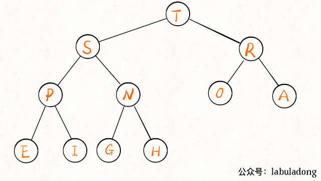

至此，一个优先级队列就实现了，插入和删除元素的时间复杂度为 O(logK)，K为当前二叉堆（优先级队列）中的元素总数。因为我们时间复杂度主要花费在`sink`或者`swim`上，而不管上浮还是下沉，最多也就树（堆）的高度，也就是 log 级别。

####五、最后总结

二叉堆就是一种完全二叉树，所以适合存储在数组中，而且二叉堆拥有一些特殊性质。

二叉堆的操作很简单，主要就是上浮和下沉，来维护堆的性质（堆有序），核心代码也就十行。

优先级队列是基于二叉堆实现的，主要操作是插入和删除。插入是先插到最后，然后上浮到正确位置；删除是把第一个元素 pq[1]（最值）调换到最后再删除，然后把新的pq[1] 下沉到正确位置。核心代码也就十行。

也许这就是数据结构的威力，简单的操作就能实现巧妙的功能，真心佩服发明二叉堆算法的人！

PS：本文的动画示例参考自经典书籍《算法第 4 版》，有兴趣的同学在公众号后台回复关键字「算法4」即可下载文字版
PDF。本文对你有帮助的话点个在看分个享吧～
 

<hr>
 


####<p>原文出处：<a href='https://mp.weixin.qq.com/s?__biz=MzAxODQxMDM0Mw==&mid=2247484518&idx=1&sn=f8ef8d7ce7959b4fd779e38f47419ac6&chksm=9bd7fa6eaca073785cb6f808421241bcb641203c8ec7f30a9269a221b3d92c661334af1b75f5&scene=21#wechat_redirect' target='blank'>二叉搜索树操作集锦</a></p>

通过之前的文章 [学习数据结构的框架思维](http://mp.weixin.qq.com/s?__biz=MzU0MDg5OTYyOQ==&mid=2247483857&idx=1&sn=918638e5a70e22b5b7bda9bbc5484f20&chksm=fb336193cc44e885f0524bdfe58a4e92b22a2b46017bf232b2ef91a576de648a8e61a30fd83d&scene=21#wechat_redirect)，二叉树的遍历框架应该已经印到你的脑子里了，这篇文章就来实操一下，看看框架思维是怎么灵活运用，秒杀二叉树问题的。

PS：本文的大部分代码都做成图片形式，因为文本代码左右滑动不方便查看，而图片方便放大、保存，图片点开后也方便左右切换进行对比。

二叉树算法的设计的**总路线：明确一个节点要做的事情，然后剩下的事抛给框架。**
    
    
    void traverse(TreeNode root) {  
        // root 需要做什么？在这做。  
        // 其他的不用 root 操心，抛给框架  
        traverse(root.left);  
        traverse(root.right);  
    }  


举两个简单的例子体会一下这个思路，热热身。

**1. 如何把二叉树所有的节点中的值加一？**
    
    
    void plusOne(TreeNode root) {  
        if (root == null) return;  
        root.val += 1;  
      
        plusOne(root.left);  
        plusOne(root.right);  
    }  
    

  

**2. 如何判断两棵二叉树是否完全相同？**

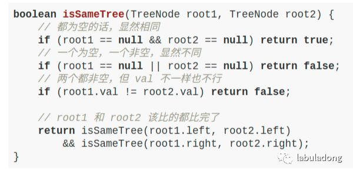

借助框架，上面这两个例子不难理解吧？如果可以理解，那么所有二叉树算法你都能解决。  

下面实现 BST 的基础操作：判断 BST 的合法性、增、删、查。其中「删」和「判断合法性」略微复杂。

**二叉搜索树**（Binary Search Tree，简称 BST）是一种很常用的的二叉树。它的定义是：一个二叉树中，任意节点的值要大于左子树**所有**节点的值，且要小于右边子树的**所有**节点的值。  

如下就是一个符合定义的 BST：


  

**零、判断 BST 的合法性**  
  
这里是有坑的哦，我们按照刚才的思路，每个节点自己要做的事不就是比较自己和左右孩子吗？看起来应该这样写代码：


但是这个算法出现了错误，BST 的每个节点应该要小于右边子树的所有节点，下面这个二叉树显然不是 BST，但是我们的算法会把它判定为 BST。  


出现错误，不要慌张，框架没有错，一定是某个细节问题没注意到。我们重新看一下 BST 的定义，root需要做的，不仅仅是和左右子节点比较，而是要和左子树和右子树的**所有**节点比较。怎么办，鞭长莫及啊！

这种情况，我们可以使用辅助函数，增加函数参数列表，**在参数中携带额外信息**，请看正确的代码：


这样，root 可以对整棵左子树和右子树进行约束，根据定义，root 才真正完成了它该做的事，所以这个算法是正确的。  


  

**一、在 BST 中查找一个数是否存在**  

根据我们的总路线，可以这样写代码：


这样写完全正确，充分证明了你的框架性思维已经养成。现在你可以考虑一点细节问题了：如何充分利用信息，把 BST 这个“左小右大”的特性用上？

很简单，其实不需要递归地搜索两边，类似二分查找思想，可以根据 target 和 root.val 的大小比较，就能排除一边。我们把上面的思路稍稍改动：


于是，我们对原始框架进行改造，抽象出一套**针对 BST 的遍历框架**：

  
    void BST(TreeNode root, int target) {  
        if (root.val == target)  
            // 找到目标，做点什么  
        if (root.val < target)   
            BST(root.right, target);  
        if (root.val > target)  
            BST(root.left, target);  
    }  

**二、在 BST 中插入一个数**

对数据结构的操作无非遍历 + 访问，遍历就是「找」，访问就是「改」。具体到这个问题，插入一个数，就是先找到插入位置，然后进行插入操作。  

上一个问题，我们总结了 BST 中的遍历框架，就是解决了「找」的问题。直接套框架，加上「改」的操作即可。

一旦涉及「改」，函数就要返回 TreeNode 类型，并且对递归调用的返回值进行接收。

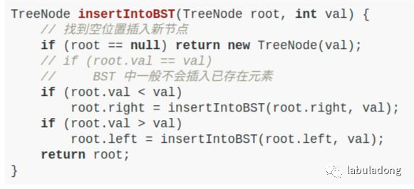
  

**三、在 BST 中删除一个数**

这个问题稍微复杂，不过你有框架指导，难不住你。跟插入操作类似，先「找」再「改」，先把框架写出来再说：

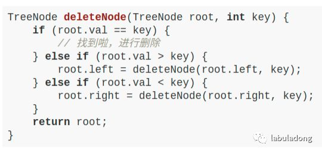

找到目标节点了，比方说是节点 A，如何删除这个节点，这是难点。因为删除节点的同时不能破坏 BST 的性质。有三种情况，用图片来说明。

**情况 1**：A 恰好是末端节点，两个子节点都为空，那么它可以当场去世。

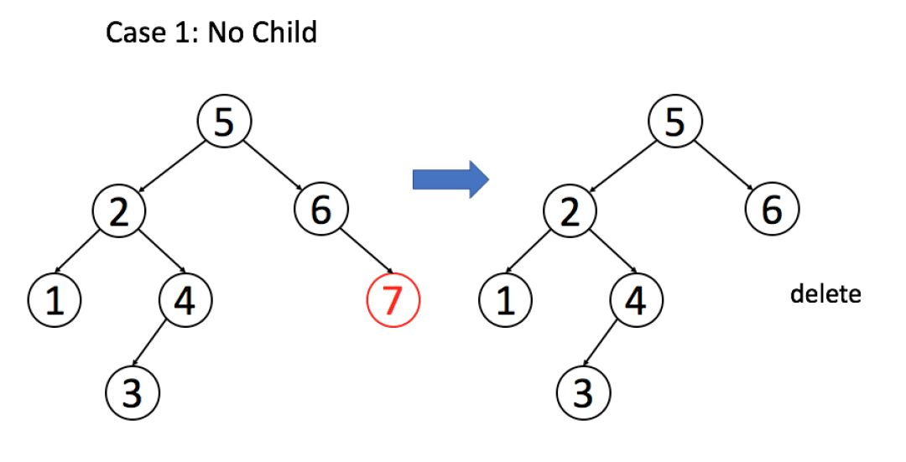

    
    
    if (root.left == null && root.right == null)  
        return null;  
    


**情况 2**：A 只有一个非空子节点，那么它要让这个孩子接替自己的位置。

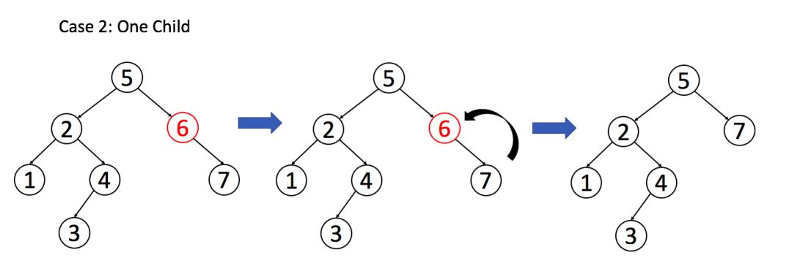

    
    
    // 排除了情况 1 之后  
    if (root.left == null) return root.right;  
    if (root.right == null) return root.left;  
    

**情况 3**：A 有两个子节点，麻烦了，为了不破坏 BST 的性质，A 必须找到左子树中最大的那个节点，或者右子树中最小的那个节点来接替自己。两种策略是类似的，我们以第二种方式讲解。

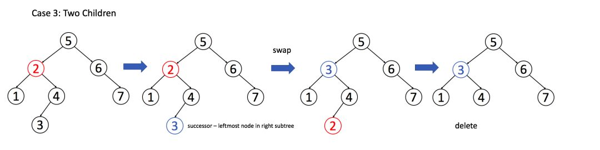

    
    if (root.left != null && root.right != null) {  
        // 找到右子树的最小节点  
        TreeNode minNode = getMin(root.right);  
        // 把 root 改成 minNode  
        root.val = minNode.val;  
        // 转而去删除 minNode  
        root.right = deleteNode(root.right, minNode.val);  
    }  
    

  

三种情况分析完毕，简化一下，填入框架：

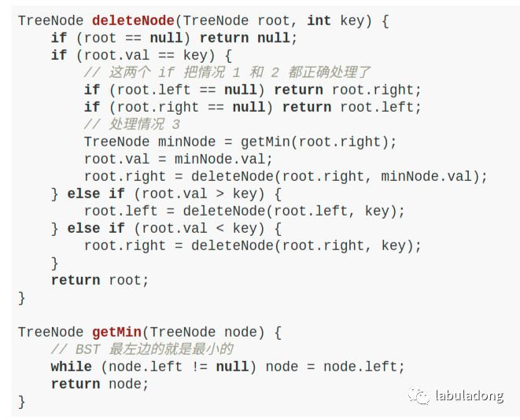

删除操作就完成了。注意一下，这个删除操作并不完美，因为我们最好不要像 root.val = minNode.val 这样通过修改节点内部的数据来改变节点，而是通过一系列略微复杂的链表操作交换 root 和 minNode 两个节点。

因为具体应用中，val 域可能会很大，修改起来很耗时，而链表操作无非改一改指针，而不会去碰内部数据。

但这里忽略这个细节，旨在突出 BST 删除操作的思路，以及借助框架逐层细化问题的思维方式。

**四、最后总结**

通过这篇文章，你学会了如下几个技巧：
  
1. 二叉树算法设计的总路线：把当前节点要做的事做好，其他的交给递归框架，不用当前节点操心。

2. 如果当前节点会对下面的子节点有整体性影响，可以通过辅助函数加长参数列表，借助函数参数传递信息。这就是递归函数传递信息的常用方式。

3. 在二叉树框架之上，扩展出一套 BST 遍历框架：
    
    
    void BST(TreeNode root, int target) {  
        if (root.val == target)  
            // 找到目标，做点什么  
        if (root.val < target)   
            BST(root.right, target);  
        if (root.val > target)  
            BST(root.left, target);  
    }  
    
4. 掌握了 BST 的基本操作，包括判断 BST 的合法性以及 BST 中的增、删、查操作。


<hr>


####<p>原文出处：<a href='https://mp.weixin.qq.com/s?__biz=MzAxODQxMDM0Mw==&mid=2247484506&idx=1&sn=fcaae7325b10905c808e085f8802b4eb&chksm=9bd7fa52aca07344e72db849c7b40e9a3dac5275b94b50eb62ad75c51e73aafd92fa184960f3&scene=21#wechat_redirect' target='blank'>单调队列解决滑动窗口问题</a></p>

前文讲了一种特殊的数据结构 [单调栈 Monotonic Stack 的使用](http://mp.weixin.qq.com/s?__biz=MzU0MDg5OTYyOQ==&mid=2247483803&idx=1&sn=d8c5fac3a15dcac0833445cb934e1a46&chksm=fb3361d9cc44e8cff919df33cf9f1517ce9ad746452f86dd93f282f4964e93ac1eb3abb10cde&scene=21#wechat_redirect)，解决了一类问题「Next Greater Number」，本文写一个类似的数据结构「单调队列」。

也许这种数据结构的名字你没听过，其实没啥难的，就是一个「队列」，只是使用了一点巧妙的方法，使得队列中的元素单调递增（或递减）。  

这个数据结构有什么用？可以解决滑动窗口的一系列问题。看一道 LeetCode 题目，难度 Hard：


**一、搭建解题框架**  

这道题不复杂，难点在于如何在 O(1) 时间算出每个「窗口」中的最大值，使得整个算法在线性时间完成。在之前的文章 [一个通用思想解决股票问题](http://mp.weixin.qq.com/s?__biz=MzU0MDg5OTYyOQ==&mid=2247484032&idx=1&sn=cafed934bd5d8a733de3b3bc675e6a19&chksm=fb3362c2cc44ebd4c5eb7bc41baf540f55ee6f4d855bfcca7ebc4a5d2fea9a3b827bef5c18eb&scene=21#wechat_redirect) 中我们探讨过类似的场景，得到一个结论：

在一堆数字中，已知最值，如果给这堆数添加一个数，那么比较一下就可以很快算出新的最值；但如果减少一个数，就不一定能很快得到新的最值了，而要遍历所有数重新找最值。

回到这道题的场景，窗口向前滑动的时候，要添加一个数同时减少一个数，所以想在 O(1) 的时间得出新的最值，就需要「单调队列」这种特殊的数据结构来辅助了。

一个普通的队列一定有这两个操作：
    
    
    class Queue {  
        void push(int n);  
        // 或 enqueue，在队尾加入元素 n  
        void pop();  
        // 或 dequeue，删除队头元素  
    }

一个「单调队列」的操作也差不多：
    
    
    class MonotonicQueue {  
        // 在队尾添加元素 n  
        void push(int n);  
        // 返回当前队列中的最大值  
        int max();  
        // 队头元素如果是 n，删除它  
        void pop(int n);  
    }


当然，这几个 API 的实现方法肯定跟一般的 Queue 不一样，不过我们暂且不管，而且认为这几个操作的时间复杂度都是O(1)，先把这道「滑动窗口」问题的解答框架搭出来：

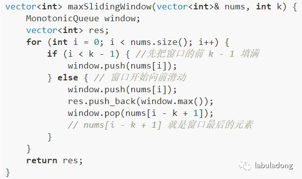


这个思路很简单，能理解吧？下面我们开始重头戏，单调队列的实现。  

**二、实现单调队列数据结****构**

首先我们要认识另一种数据结构 deque，即双端队列。很简单，就是一个普通队列的加强版：

    
    class deque {  
        // 在队头插入元素 n  
        void push_front(int n);  
        // 在队尾插入元素 n  
        void push_back(int n);  
        // 删除队头元素  
        void pop_front();  
        // 删除队尾元素  
        void pop_back();  
        // 返回队头元素  
        int front();  
        // 返回队尾元素  
        int back();  
    }  
    

而且，这些操作的复杂度都是 O(1)。这其实不是啥稀奇的数据结构，用链表作为底层结构的话，很容易实现这些功能。    

「单调队列」的核心思路和「单调栈」类似。单调队列的 push 方法依然在队尾添加元素，但是要把前面比新元素小的元素都删掉：
    
    
    class MonotonicQueue {  
    private:  
        deque<int> data;  
    public:  
        void push(int n) {  
            while (!data.empty() && data.back() < n)   
                data.pop_back();  
            data.push_back(n);  
        }  
    };

你可以想象，加入数字的大小代表人的体重，把前面体重不足的都压扁了，直到遇到更大的量级才停住。

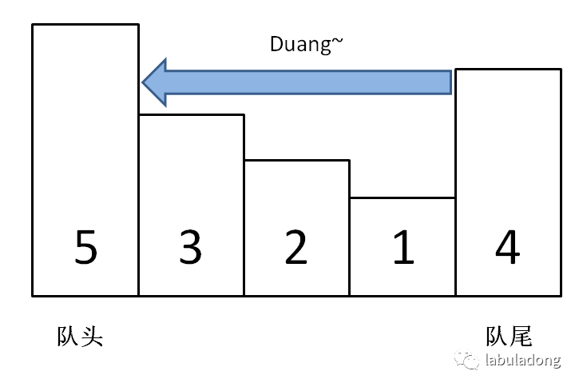

如果每个元素被加入时都这样操作，最终单调队列中的元素大小就会保持一个单调递减的顺序，因此我们的 max() API 可以可以这样写：

    
    int max() {  
        return data.front();  
    }

  

pop() 在队头删除元素 n，也很好写：
    
    
    void pop(int n) {  
        if (!data.empty() && data.front() == n)  
            data.pop_front();  
    }

  

之所以要判断 data.front() == n，是因为我们想删除的队头元素 n 可能已经被「压扁」了，这时候就不用删除了：


至此，单调队列设计完毕，看下完整的解题代码：


**三、算法复杂度分析**

读者可能疑惑，push 操作中含有 while 循环，时间复杂度不是 O(1) 呀，那么本算法的时间复杂度应该不是线性时间吧？

单独看 push 操作的复杂度确实不是 O(1)，但是算法整体的复杂度依然是 O(N) 线性时间。要这样想，nums 中的每个元素最多被 push_back 和 pop_back 一次，没有任何多余操作，所以整体的复杂度还是 O(N)。

空间复杂度就很简单了，就是窗口的大小 O(k)。

**四、最后总结**

有的读者可能觉得「单调队列」和「优先级队列」比较像，实际上差别很大的。

单调队列在添加元素的时候靠删除元素保持队列的单调性，相当于抽取出某个序列中单调递增（或递减）的子序列；而优先级队列（二叉堆）相当于自动排序，差别大了去了。


赶紧去拿下 LeetCode 第 239 道题吧～
