<!--BEGIN_DATA
{
    "create_date": "2021-02-25 22:40", 
    "modify_date": "2021-02-25 22:40", 
    "is_top": "0", 
    "summary": "红黑树(一)之原理和算法详细介绍<br/>红黑树(二)C语言的实现<br/>红黑树(三)之Linux内核中红黑树的经典实现<br/>红黑树(四)之C++的实现<br/>参考资料", 
    "tags": "数据结构", 
    "file_name": "红黑树.md"
}
END_DATA-->

#### <p>原文出处：<a href='https://www.cnblogs.com/skywang12345/p/3245399.html#a1' target='blank'>红黑树(一)之原理和算法详细介绍</a></p>

概述：R-B Tree，又称为“红黑树”。本文参考了《算法导论》中红黑树相关知识，加之自己的理解，然后以图文的形式对红黑树进行说明。本文的主要内容包括：红黑树的特性，红黑树的时间复杂度和它的证明，红黑树的左旋、右旋、插入、删除等操作。

## R-B Tree简介

R-B Tree，全称是Red-Black Tree，又称为“红黑树”，它一种特殊的二叉查找树。红黑树的每个节点上都有存储位表示节点的颜色，可以是红(Red)或黑(Black)。

**红黑树的特性**:  

**（1）每个节点或者是黑色，或者是红色。**  
**（2）根节点是黑色。**  
**（3）每个叶子节点（NIL）是黑色。 [注意：这里叶子节点，是指为空(NIL或NULL)的叶子节点！]**  
**（4）如果一个节点是红色的，则它的子节点必须是黑色的。**  
**（5）从一个节点到该节点的子孙节点的所有路径上包含相同数目的黑节点。**

**注意**：  

(01) 特性(3)中的叶子节点，是只为空(NIL或null)的节点。  
(02) 特性(5)，确保没有一条路径会比其他路径长出俩倍。因而，红黑树是相对是接**衡的二叉树。

红黑树示意图如下：

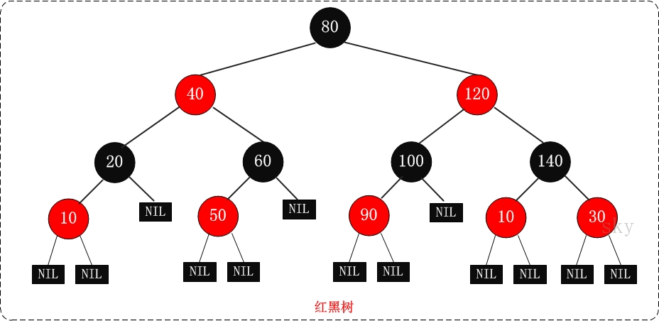

## **红黑树的应用**

红黑树的应用比较广泛，主要是用它来存储有序的数据，它的时间复杂度是O(lgn)，效率非常之高。  

例如，Java集合中的[TreeSet](http://www.cnblogs.com/skywang12345/p/3311268.html)和[TreeMap](http://www.cnblogs.com/skywang12345/p/3310928.html)，C++ STL中的set、map，以及Linux虚拟内存的管理，都是通过红黑树去实现的。

## 红黑树的时间复杂度和相关证明  

**红黑树的时间复杂度为: O(lgn)** 

下面通过“_数学归纳法_”对红黑树的时间复杂度进行证明。

定理：**一棵含有n个节点的红黑树的高度至多为2log(n+1)**.

证明：  

"一棵含有n个节点的红黑树的高度至多为2log(n+1)" 的**逆否命题**是 "高度为h的红黑树，它的包含的内节点个数至少为 2h/2-1个"。  

我们只需要证明逆否命题，即可证明原命题为真；即只需证明 "高度为h的红黑树，它的包含的内节点个数至少为 2h/2-1个"。

从某个节点x出发（不包括该节点）到达一个叶节点的任意一条路径上，黑色节点的个数称为该节点的黑高度(x's black height)，记为**bh(x)**。关于bh(x)有两点需要说明：   
    
第1点：根据红黑树的"**特性(5)** ，即_从一个节点到该节点的子孙节点的所有路径上包含相同数目的黑节点_"可知，从节点x出发到达的所有的叶节点具有相同数目的黑节点。**这也就意味着，bh(x)的值是唯一的**！  

第2点：根据红黑色的"特性(4)，即_如果一个节点是红色的，则它的子节点必须是黑色的_"可知，从节点x出发达到叶节点"所经历的黑节点数目">= "所经历的红节点的数目"。假设x是根节点，则可以得出结论"**bh(x) >= h/2**"。进而，我们只需证明 "高度为h的红黑树，它的包含的黑节点个数至少为 2bh(x)-1个"即可。

这里，我们将需要证明的定理已经由  

**"一棵含有n个节点的红黑树的高度至多为2log(n+1)"**   

转变成只需要证明  

**"高度为h的红黑树，它的包含的内节点个数至少为 2bh(x)-1个"。**

下面通过"数学归纳法"开始论证高度为h的红黑树，它的包含的内节点个数至少为 2bh(x)-1个"。

(01) 当树的高度h=0时，  

内节点个数是0，bh(x) 为0，2bh(x)-1 也为 0。显然，原命题成立。

(02) 当h>0，且树的高度为 h-1 时，它包含的节点个数至少为 2bh(x)-1-1。这个是根据(01)推断出来的！

下面，由树的高度为 h-1 的已知条件推出“树的高度为 h 时，它所包含的节点树为 2bh(x)-1”。

> 当树的高度为 h 时，  
> 对于节点x(x为根节点)，其黑高度为bh(x)。  
> 对于节点x的左右子树，它们黑高度为 bh(x) 或者 bh(x)-1。  
> 根据(02)的已知条件，我们已知 "x的左右子树，即高度为 h-1 的节点，它包含的节点至少为 2bh(x)-1-1 个"；
> 
> 所以，节点x所包含的节点至少为 ( 2bh(x)-1-1 ) + ( 2bh(x)-1-1 ) + 1 = 2^bh(x)-1。即节点x所包含的节点至少为 2bh(x)-1。  
> 因此，原命题成立。
> 
> 由(01)、(02)得出，"高度为h的红黑树，它的包含的内节点个数至少为 2^bh(x)-1个"。  
> 因此，“一棵含有n个节点的红黑树的高度至多为2log(n+1)”。

## 红黑树的基本操作(一) 左旋和右旋

红黑树的基本操作是**添加**、**删除**。在对红黑树进行添加或删除之后，都会用到旋转方法。为什么呢？道理很简单，添加或删除红黑树中的节点之后，红黑树就发生了变化，可能不满足红黑树的5条性质，也就不再是一颗红黑树了，而是一颗普通的树。而通过旋转，可以使这颗树重新成为红黑树。简单点说，旋转的目的是让树保持红黑树的特性。  

旋转包括两种：**左旋** 和 **右旋**。下面分别对它们进行介绍。

### 1. 左旋

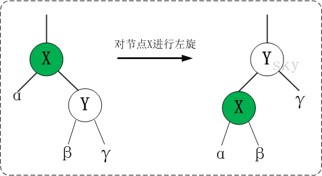

对x进行左旋，意味着"将x变成一个左节点"。

左旋的伪代码《算法导论》：参考上面的示意图和下面的伪代码，理解“红黑树T的节点x进行左旋”是如何进行的。

```
LEFT-ROTATE(T, x)  
01  y ← right[x]            // 前提：这里假设x的右孩子为y。下面开始正式操作
02  right[x] ← left[y]      // 将 “y的左孩子” 设为 “x的右孩子”，即 将β设为x的右孩子
03  p[left[y]] ← x          // 将 “x” 设为 “y的左孩子的父亲”，即 将β的父亲设为x
04  p[y] ← p[x]             // 将 “x的父亲” 设为 “y的父亲”
05  if p[x] = nil[T]       
06  then root[T] ← y                 // 情况1：如果 “x的父亲” 是空节点，则将y设为根节点
07  else if x = left[p[x]]  
08            then left[p[x]] ← y    // 情况2：如果 x是它父节点的左孩子，则将y设为“x的父节点的左孩子”
09            else right[p[x]] ← y   // 情况3：(x是它父节点的右孩子) 将y设为“x的父节点的右孩子”
10  left[y] ← x             // 将 “x” 设为 “y的左孩子”
11  p[x] ← y                // 将 “x的父节点” 设为 “y”
```

理解左旋之后，看看下面一个更鲜明的例子。你可以先不看右边的结果，自己尝试一下。

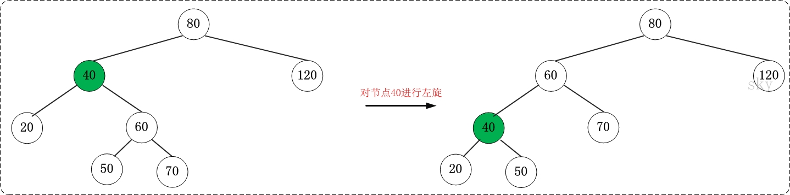

### 2. 右旋

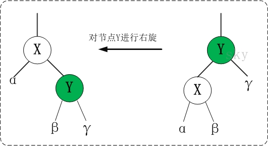

对x进行左旋，意味着"将x变成一个左节点"。

右旋的伪代码《算法导论》：参考上面的示意图和下面的伪代码，理解“红黑树T的节点y进行右旋”是如何进行的。

```    
RIGHT-ROTATE(T, y)  
01  x ← left[y]             // 前提：这里假设y的左孩子为x。下面开始正式操作
02  left[y] ← right[x]      // 将 “x的右孩子” 设为 “y的左孩子”，即 将β设为y的左孩子
03  p[right[x]] ← y         // 将 “y” 设为 “x的右孩子的父亲”，即 将β的父亲设为y
04  p[x] ← p[y]             // 将 “y的父亲” 设为 “x的父亲”
05  if p[y] = nil[T]       
06  then root[T] ← x                 // 情况1：如果 “y的父亲” 是空节点，则将x设为根节点
07  else if y = right[p[y]]  
08            then right[p[y]] ← x   // 情况2：如果 y是它父节点的右孩子，则将x设为“y的父节点的左孩子”
09            else left[p[y]] ← x    // 情况3：(y是它父节点的左孩子) 将x设为“y的父节点的左孩子”
10  right[x] ← y            // 将 “y” 设为 “x的右孩子”
11  p[y] ← x                // 将 “y的父节点” 设为 “x”
```

理解右旋之后，看看下面一个更鲜明的例子。你可以先不看右边的结果，自己尝试一下。

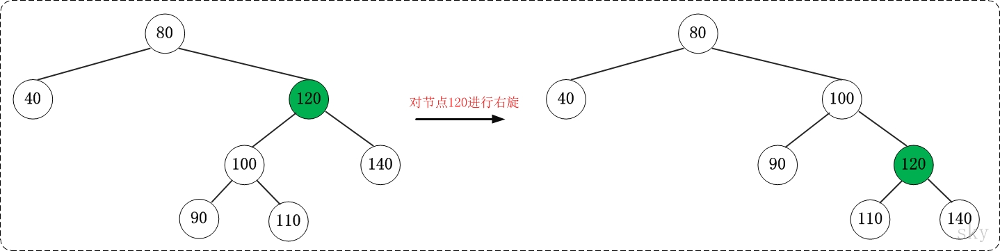

**旋转总结**：

(01) 左旋 和 右旋 是相对的两个概念，原理类似。理解一个也就理解了另一个。

(02) 下面谈谈如何区分 左旋 和 右旋。  

在实际应用中，若没有彻底理解 左旋 和 右旋，可能会将它们混淆。下面谈谈我对如何区分 左旋 和 右旋 的理解。

### 3. 区分 左旋 和 右旋

仔细观察上面"左旋"和"右旋"的示意图。我们能清晰的发现，它们是对称的。无论是左旋还是右旋，被旋转的树，在旋转前是二叉查找树，并且旋转之后仍然是一颗二叉查找树。

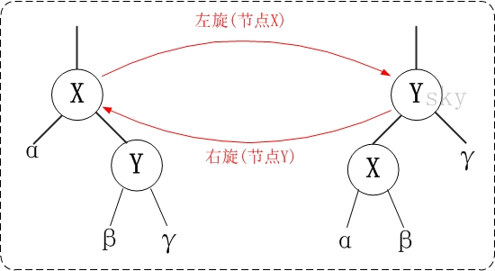

**左旋示例图**(以x为节点进行左旋)：
    
```
                               z
   x                          /                  
  / \      --(左旋)-->       x
 y   z                      /
                           y
```

对x进行左旋，意味着，将“x的右孩子”设为“x的父亲节点”；即，将 x变成了一个左节点(x成了为z的左孩子)！。因此，**左旋中的“左”，意味着“被旋转的节点将变成一个左节点”**。


**右旋示例图**(以x为节点进行右旋)：
    
```
                               y
   x                            \                 
  / \      --(右旋)-->           x
 y   z                            \
                                   z
```

对x进行右旋，意味着，将“x的左孩子”设为“x的父亲节点”；即，将 x变成了一个右节点(x成了为y的右孩子)！因此，**右旋中的“右”，意味着“被旋转的节点将变成一个右节点”**。

## 红黑树的基本操作(二) 添加

将一个节点插入到红黑树中，需要执行哪些步骤呢？首先，将红黑树当作一颗二叉查找树，将节点插入；然后，将节点着色为红色；最后，通过旋转和重新着色等方法来修正该树，使之重新成为一颗红黑树。详细描述如下：

**第一步: 将红黑树当作一颗二叉查找树，将节点插入。**  

红黑树本身就是一颗二叉查找树，将节点插入后，该树仍然是一颗二叉查找树。也就意味着，树的键值仍然是有序的。此外，无论是左旋还是右旋，若旋转之前这棵树是二叉查找树，旋转之后它一定还是二叉查找树。这也就意味着，任何的旋转和重新着色操作，都不会改变它仍然是一颗二叉查找树的事实。  

好吧？那接下来，我们就来想方设法的旋转以及重新着色，使这颗树重新成为红黑树！

**第二步：将插入的节点着色为"红色"。**  

为什么着色成红色，而不是黑色呢？为什么呢？在回答之前，我们需要重新温习一下红黑树的特性：  

> (1) 每个节点或者是黑色，或者是红色。  
> (2) 根节点是黑色。  
> (3) 每个叶子节点是黑色。 [注意：这里叶子节点，是指为空的叶子节点！]  
> (4) 如果一个节点是红色的，则它的子节点必须是黑色的。  
> (5) 从一个节点到该节点的子孙节点的所有路径上包含相同数目的黑节点。  
>
> > 将插入的节点着色为红色，不会违背"特性(5)"！少违背一条特性，就意味着我们需要处理的情况越少。接下来，就要努力的让这棵树满足其它性质即可；满足了的话，它就又是一颗红黑树了。o(∩∩)o...哈哈

**第三步: 通过一系列的旋转或着色等操作，使之重新成为一颗红黑树。**  

第二步中，将插入节点着色为"红色"之后，不会违背"特性(5)"。那它到底会违背哪些特性呢？  

> 对于"特性(1)"，显然不会违背了。因为我们已经将它涂成红色了。  
> 对于"特性(2)"，显然也不会违背。在第一步中，我们是将红黑树当作二叉查找树，然后执行的插入操作。而根据二叉查找数的特点，插入操作不会改变根节点。所以，根节点仍然是黑色。  
> 对于"特性(3)"，显然不会违背了。这里的叶子节点是指的空叶子节点，插入非空节点并不会对它们造成影响。  
> 对于"特性(4)"，是有可能违背的！  
> 那接下来，想办法使之"满足特性(4)"，就可以将树重新构造成红黑树了。

下面看看代码到底是怎样实现这三步的。

添加操作的伪代码《算法导论》

```
RB-INSERT(T, z)  
01  y ← nil[T]                        // 新建节点“y”，将y设为空节点。
02  x ← root[T]                       // 设“红黑树T”的根节点为“x”
03  while x ≠ nil[T]                  // 找出要插入的节点“z”在二叉树T中的位置“y”
04      do y ← x                      
05         if key[z] < key[x]  
06            then x ← left[x]  
07            else x ← right[x]  
08  p[z] ← y                          // 设置 “z的父亲” 为 “y”
09  if y = nil[T]                     
10     then root[T] ← z               // 情况1：若y是空节点，则将z设为根
11     else if key[z] < key[y]        
12             then left[y] ← z       // 情况2：若“z所包含的值” < “y所包含的值”，则将z设为“y的左孩子”
13             else right[y] ← z      // 情况3：(“z所包含的值” >= “y所包含的值”)将z设为“y的右孩子” 
14  left[z] ← nil[T]                  // z的左孩子设为空
15  right[z] ← nil[T]                 // z的右孩子设为空。至此，已经完成将“节点z插入到二叉树”中了。
16  color[z] ← RED                    // 将z着色为“红色”
17  RB-INSERT-FIXUP(T, z)             // 通过RB-INSERT-FIXUP对红黑树的节点进行颜色修改以及旋转，让树T仍然是一颗红黑树
```

结合伪代码以及为代码上面的说明，先理解RB-INSERT。理解了RB-INSERT之后，我们接着对 RB-INSERT-FIXUP的伪代码进行说明。

添加修正操作的伪代码《算法导论》

```    
RB-INSERT-FIXUP(T, z)
01 while color[p[z]] = RED                                                  // 若“当前节点(z)的父节点是红色”，则进行以下处理。
02     do if p[z] = left[p[p[z]]]                                           // 若“z的父节点”是“z的祖父节点的左孩子”，则进行以下处理。
03           then y ← right[p[p[z]]]                                        // 将y设置为“z的叔叔节点(z的祖父节点的右孩子)”
04                if color[y] = RED                                         // Case 1条件：叔叔是红色
05                   then color[p[z]] ← BLACK                    ▹ Case 1   //  (01) 将“父节点”设为黑色。
06                        color[y] ← BLACK                       ▹ Case 1   //  (02) 将“叔叔节点”设为黑色。
07                        color[p[p[z]]] ← RED                   ▹ Case 1   //  (03) 将“祖父节点”设为“红色”。
08                        z ← p[p[z]]                            ▹ Case 1   //  (04) 将“祖父节点”设为“当前节点”(红色节点)
09                   else if z = right[p[z]]                                // Case 2条件：叔叔是黑色，且当前节点是右孩子
10                           then z ← p[z]                       ▹ Case 2   //  (01) 将“父节点”作为“新的当前节点”。
11                                LEFT-ROTATE(T, z)              ▹ Case 2   //  (02) 以“新的当前节点”为支点进行左旋。
12                           color[p[z]] ← BLACK                 ▹ Case 3   // Case 3条件：叔叔是黑色，且当前节点是左孩子。(01) 将“父节点”设为“黑色”。
13                           color[p[p[z]]] ← RED                ▹ Case 3   //  (02) 将“祖父节点”设为“红色”。
14                           RIGHT-ROTATE(T, p[p[z]])            ▹ Case 3   //  (03) 以“祖父节点”为支点进行右旋。
15        else (same as then clause with "right" and "left" exchanged)      // 若“z的父节点”是“z的祖父节点的右孩子”，将上面的操作中“right”和“left”交换位置，然后依次执行。
16 color[root[T]] ← BLACK 
```

根据被插入节点的父节点的情况，可以将"当节点z被着色为红色节点，并插入二叉树"划分为三种情况来处理。  

> ① 情况说明：被插入的节点是根节点。  
>     处理方法：直接把此节点涂为黑色。  
> ② 情况说明：被插入的节点的父节点是黑色。  
>     处理方法：什么也不需要做。节点被插入后，仍然是红黑树。  
> ③ 情况说明：被插入的节点的父节点是红色。  
>     处理方法：那么，该情况与红黑树的“特性(5)”相冲突。这种情况下，被插入节点是一定存在非空祖父节点的；进一步的讲，被插入节点也一定存在叔叔节点(即使叔叔节点为空，我们也视之为存在，空节点本身就是黑色节点)。理解这点之后，我们依据"叔叔节点的情况"，将这种情况进一步划分为3种情况(Case)。

<table style="border: 1px solid rgba(0, 0, 0, 1)" border="1">
<tbody>
<tr style="background-color: rgba(125, 125, 130, 1); height: 40px">
<td>&nbsp;</td>
<td><strong><span style="font-size: 14px; color: rgba(0, 0, 0, 1)">现象说明</span></strong></td>
<td><strong><span style="font-size: 14px; color: rgba(0, 0, 0, 1)">处理策略</span></strong></td>
</tr>
<tr>
<td style="width: 60px"><span style="font-size: 14px; color: rgba(0, 0, 0, 1)">Case 1</span></td>
<td><span style="font-size: 14px; color: rgba(0, 0, 0, 1)">当前节点的父节点是红色，且当前节点的祖父节点的另一个子节点（叔叔节点）也是红色。</span></td>
<td>
<p><span style="font-size: 14px; color: rgba(0, 0, 0, 1)">(01) 将“父节点”设为黑色。</span><br><span style="font-size: 14px; color: rgba(0, 0, 0, 1)">(02) 将“叔叔节点”设为黑色。</span><br><span style="font-size: 14px; color: rgba(0, 0, 0, 1)">(03) 将“祖父节点”设为“红色”。</span><br><span style="font-size: 14px; color: rgba(0, 0, 0, 1)">(04) 将“祖父节点”设为“当前节点”(红色节点)；即，之后继续对“当前节点”进行操作。</span></p>
</td>
</tr>
<tr>
<td><span style="font-size: 14px; color: rgba(0, 0, 0, 1)">Case 2</span></td>
<td><span style="font-size: 14px; color: rgba(0, 0, 0, 1)">当前节点的父节点是红色，叔叔节点是黑色，且当前节点是其父节点的右孩子</span></td>
<td>
<p><span style="font-size: 14px; color: rgba(0, 0, 0, 1)">(01) 将“父节点”作为“新的当前节点”。</span><br><span style="font-size: 14px; color: rgba(0, 0, 0, 1)">(02) 以“新的当前节点”为支点进行左旋。</span></p>
</td>
</tr>
<tr>
<td><span style="font-size: 14px; color: rgba(0, 0, 0, 1)">Case 3</span></td>
<td><span style="font-size: 14px; color: rgba(0, 0, 0, 1)">当前节点的父节点是红色，叔叔节点是黑色，且当前节点是其父节点的左孩子</span></td>
<td>
<p><span style="font-size: 14px; color: rgba(0, 0, 0, 1)">(01) 将“父节点”设为“黑色”。</span><br><span style="font-size: 14px; color: rgba(0, 0, 0, 1)">(02) 将“祖父节点”设为“红色”。</span><br><span style="font-size: 14px; color: rgba(0, 0, 0, 1)">(03) 以“祖父节点”为支点进行右旋。</span></p>
</td>
</tr>
</tbody>
</table>

上面三种情况(Case)处理问题的核心思路都是：将红色的节点移到根节点；然后，将根节点设为黑色。下面对它们详细进行介绍。

**1. (Case 1)叔叔是红色**

**1.1 现象说明**  

当前节点(即，被插入节点)的父节点是红色，且当前节点的祖父节点的另一个子节点（叔叔节点）也是红色。

**1.2 处理策略**  

(01) 将“父节点”设为黑色。  
(02) 将“叔叔节点”设为黑色。  
(03) 将“祖父节点”设为“红色”。  
(04) 将“祖父节点”设为“当前节点”(红色节点)；即，之后继续对“当前节点”进行操作。

**下面谈谈为什么要这样处理。**(建议理解的时候，通过下面的图进行对比)  

> “当前节点”和“父节点”都是红色，违背“特性(4)”。所以，将“父节点”设置“黑色”以解决这个问题。  
> 但是，将“父节点”由“红色”变成“黑色”之后，违背了“特性(5)”：因为，包含“父节点”的分支的黑色节点的总数增加了1。  解决这个问题的办法是：将“祖父节点”由“黑色”变成红色，同时，将“叔叔节点”由“红色”变成“黑色”。关于这里，说明几点：第一，为什么“祖父节点”之前是黑色？这个应该很容易想明白，因为在变换操作之前，该树是红黑树，“父节点”是红色，那么“祖父节点”一定是黑色。 第二，为什么将“祖父节点”由“黑色”变成红色，同时，将“叔叔节点”由“红色”变成“黑色”；能解决“包含‘父节点’的分支的黑色节点的总数增加了1”的问题。这个道理也很简单。“包含‘父节点’的分支的黑色节点的总数增加了1” 同时也意味着 “包含‘祖父节点’的分支的黑色节点的总数增加了1”，既然这样，我们通过将“祖父节点”由“黑色”变成“红色”以解决“包含‘祖父节点’的分支的黑色节点的总数增加了1”的问题； 但是，这样处理之后又会引起另一个问题“包含‘叔叔’节点的分支的黑色节点的总数减少了1”，现在我们已知“叔叔节点”是“红色”，将“叔叔节点”设为“黑色”就能解决这个问题。 所以，将“祖父节点”由“黑色”变成红色，同时，将“叔叔节点”由“红色”变成“黑色”；就解决了该问题。  
> 按照上面的步骤处理之后：当前节点、父节点、叔叔节点之间都不会违背红黑树特性，但祖父节点却不一定。若此时，祖父节点是根节点，直接将祖父节点设为“黑色”，那就完全解决这个问题了；若祖父节点不是根节点，那我们需要将“祖父节点”设为“新的当前节点”，接着对“新的当前节点”进行分析。

**1.3 示意图**

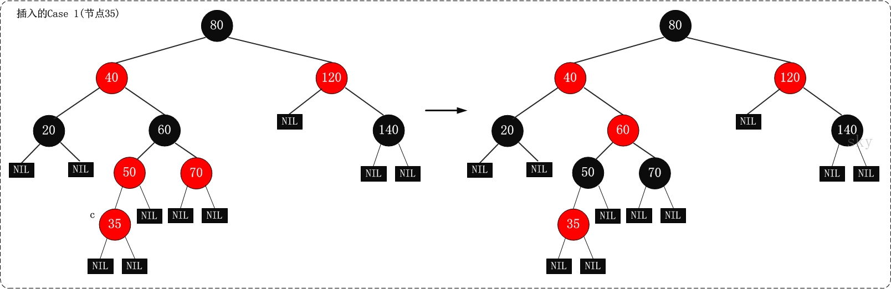

**2. (Case 2)叔叔是黑色，且当前节点是右孩子**

**2.1 现象说明**  
当前节点(即，被插入节点)的父节点是红色，叔叔节点是黑色，且当前节点是其父节点的右孩子

**2.2 处理策略** 

(01) 将“父节点”作为“新的当前节点”。  
(02) 以“新的当前节点”为支点进行左旋。

**下面谈谈为什么要这样处理。**(建议理解的时候，通过下面的图进行对比)  

> 首先，将“父节点”作为“新的当前节点”；接着，以“新的当前节点”为支点进行左旋。 为了便于理解，我们先说明第(02)步，再说明第(01)步；为了便于说明，我们设置“父节点”的代号为F(Father)，“当前节点”的代号为S(Son)。  
> 为什么要“以F为支点进行左旋”呢？根据已知条件可知：S是F的右孩子。而之前我们说过，我们处理红黑树的核心思想：将红色的节点移到根节点；然后，将根节点设为黑色。既然是“将红色的节点移到根节点”，那就是说要不断的将破坏红黑树特性的红色节点上移(即向根方向移动)。
> 而S又是一个右孩子，因此，我们可以通过“左旋”来将S上移！  
> 按照上面的步骤(以F为支点进行左旋)处理之后：若S变成了根节点，那么直接将其设为“黑色”，就完全解决问题了；若S不是根节点，那我们需要执行步骤(01)，即“将F设为‘新的当前节点’”。那为什么不继续以S为新的当前节点继续处理，而需要以F为新的当前节点来进行处理呢？这是因为“左旋”之后，F变成了S的“子节点”，即S变成了F的父节点；而我们处理问题的时候，需要从下至上(由叶到根)方向进行处理；也就是说，必须先解决“孩子”的问题，再解决“父亲”的问题；所以，我们执行步骤(01)：将“父节点”作为“新的当前节点”。

**2.2 示意图**

**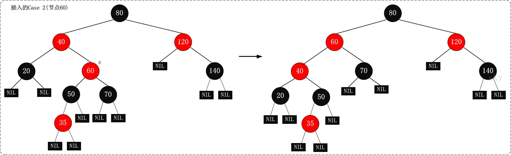**

**3. (Case 3)叔叔是黑色，且当前节点是左孩子**

**3.1 现象说明**  

当前节点(即，被插入节点)的父节点是红色，叔叔节点是黑色，且当前节点是其父节点的左孩子

**3.2 处理策略**  

(01) 将“父节点”设为“黑色”。  
(02) 将“祖父节点”设为“红色”。  
(03) 以“祖父节点”为支点进行右旋。

**下面谈谈为什么要这样处理。**(建议理解的时候，通过下面的图进行对比)  

> 为了便于说明，我们设置“当前节点”为S(Original Son)，“兄弟节点”为B(Brother)，“叔叔节点”为U(Uncle)，“父节点”为F(Father)，祖父节点为G(Grand-Father)。  
> S和F都是红色，违背了红黑树的“特性(4)”，我们可以将F由“红色”变为“黑色”，就解决了“违背‘特性(4)’”的问题；但却引起了其它问题：违背特性(5)，因为将F由红色改为黑色之后，所有经过F的分支的黑色节点的个数增加了1。那我们如何解决“所有经过F的分支的黑色节点的个数增加了1”的问题呢？ 我们可以通过“将G由黑色变成红色”，同时“以G为支点进行右旋”来解决。

**2.3 示意图**

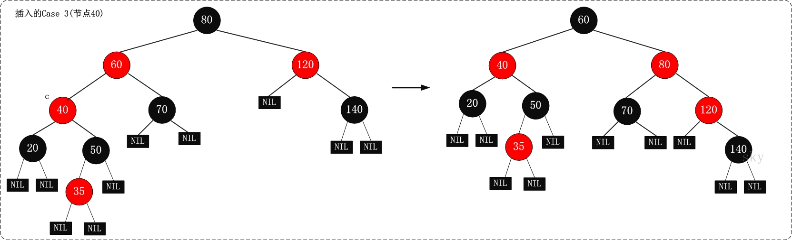

提示：上面的进行Case 3处理之后，再将节点"120"当作当前节点，就变成了Case 2的情况。

## 红黑树的基本操作(三) 删除

将红黑树内的某一个节点删除。需要执行的操作依次是：首先，将红黑树当作一颗二叉查找树，将该节点从二叉查找树中删除；然后，通过"旋转和重新着色"等一系列来修正该树，使之重新成为一棵红黑树。详细描述如下：

**第一步：将红黑树当作一颗二叉查找树，将节点删除。** 
       
这和"删除常规二叉查找树中删除节点的方法是一样的"。分3种情况：  

> ① 被删除节点没有儿子，即为叶节点。那么，直接将该节点删除就OK了。 
> ② 被删除节点只有一个儿子。那么，直接删除该节点，并用该节点的唯一子节点顶替它的位置。 
> ③ 被删除节点有两个儿子。那么，先找出它的后继节点；然后把“它的后继节点的内容”复制给“该节点的内容”；之后，删除“它的后继节点”。在这里，后继节点相当于替身，在将后继节点的内容复制给"被删除节点"之后，再将后继节点删除。这样就巧妙的将问题转换为"删除后继节点"的情况了，下面就考虑后继节点。 在"被删除节点"有两个非空子节点的情况下，它的后继节点不可能是双子非空。既然"的后继节点"不可能双子都非空，就意味着"该节点的后继节点"要么没有儿子，要么只有一个儿子。若没有儿子，则按"情况① "进行处理；若只有一个儿子，则按"情况② "进行处理。

**第二步：通过"旋转和重新着色"等一系列来修正该树，使之重新成为一棵红黑树。**  

> 因为"第一步"中删除节点之后，可能会违背红黑树的特性。所以需要通过"旋转和重新着色"来修正该树，使之重新成为一棵红黑树。

删除操作的伪代码《算法导论》

```    
RB-DELETE(T, z)
01 if left[z] = nil[T] or right[z] = nil[T]         
02    then y ← z                                  // 若“z的左孩子” 或 “z的右孩子”为空，则将“z”赋值给 “y”；
03    else y ← TREE-SUCCESSOR(z)                  // 否则，将“z的后继节点”赋值给 “y”。
04 if left[y] ≠ nil[T]
05    then x ← left[y]                            // 若“y的左孩子” 不为空，则将“y的左孩子” 赋值给 “x”；
06    else x ← right[y]                           // 否则，“y的右孩子” 赋值给 “x”。
07 p[x] ← p[y]                                    // 将“y的父节点” 设置为 “x的父节点”
08 if p[y] = nil[T]                               
09    then root[T] ← x                            // 情况1：若“y的父节点” 为空，则设置“x” 为 “根节点”。
10    else if y = left[p[y]]                    
11            then left[p[y]] ← x                 // 情况2：若“y是它父节点的左孩子”，则设置“x” 为 “y的父节点的左孩子”
12            else right[p[y]] ← x                // 情况3：若“y是它父节点的右孩子”，则设置“x” 为 “y的父节点的右孩子”
13 if y ≠ z                                    
14    then key[z] ← key[y]                        // 若“y的值” 赋值给 “z”。注意：这里只拷贝z的值给y，而没有拷贝z的颜色！！！
15         copy y's satellite data into z         
16 if color[y] = BLACK                            
17    then RB-DELETE-FIXUP(T, x)                  // 若“y为黑节点”，则调用
18 return y 
```

结合伪代码以及为代码上面的说明，先理解RB-DELETE。理解了RB-DELETE之后，接着对 RB-DELETE-FIXUP的伪代码进行说明

```    
RB-DELETE-FIXUP(T, x)
01 while x ≠ root[T] and color[x] = BLACK  
02     do if x = left[p[x]]      
03           then w ← right[p[x]]                                             // 若 “x”是“它父节点的左孩子”，则设置 “w”为“x的叔叔”(即x为它父节点的右孩子)                                          
04                if color[w] = RED                                           // Case 1: x是“黑+黑”节点，x的兄弟节点是红色。(此时x的父节点和x的兄弟节点的子节点都是黑节点)。
05                   then color[w] ← BLACK                        ▹  Case 1   //   (01) 将x的兄弟节点设为“黑色”。
06                        color[p[x]] ← RED                       ▹  Case 1   //   (02) 将x的父节点设为“红色”。
07                        LEFT-ROTATE(T, p[x])                    ▹  Case 1   //   (03) 对x的父节点进行左旋。
08                        w ← right[p[x]]                         ▹  Case 1   //   (04) 左旋后，重新设置x的兄弟节点。
09                if color[left[w]] = BLACK and color[right[w]] = BLACK       // Case 2: x是“黑+黑”节点，x的兄弟节点是黑色，x的兄弟节点的两个孩子都是黑色。
10                   then color[w] ← RED                          ▹  Case 2   //   (01) 将x的兄弟节点设为“红色”。
11                        x ←  p[x]                               ▹  Case 2   //   (02) 设置“x的父节点”为“新的x节点”。
12                   else if color[right[w]] = BLACK                          // Case 3: x是“黑+黑”节点，x的兄弟节点是黑色；x的兄弟节点的左孩子是红色，右孩子是黑色的。
13                           then color[left[w]] ← BLACK          ▹  Case 3   //   (01) 将x兄弟节点的左孩子设为“黑色”。
14                                color[w] ← RED                  ▹  Case 3   //   (02) 将x兄弟节点设为“红色”。
15                                RIGHT-ROTATE(T, w)              ▹  Case 3   //   (03) 对x的兄弟节点进行右旋。
16                                w ← right[p[x]]                 ▹  Case 3   //   (04) 右旋后，重新设置x的兄弟节点。
17                         color[w] ← color[p[x]]                 ▹  Case 4   // Case 4: x是“黑+黑”节点，x的兄弟节点是黑色；x的兄弟节点的右孩子是红色的。(01) 将x父节点颜色 赋值给 x的兄弟节点。
18                         color[p[x]] ← BLACK                    ▹  Case 4   //   (02) 将x父节点设为“黑色”。
19                         color[right[w]] ← BLACK                ▹  Case 4   //   (03) 将x兄弟节点的右子节设为“黑色”。
20                         LEFT-ROTATE(T, p[x])                   ▹  Case 4   //   (04) 对x的父节点进行左旋。
21                         x ← root[T]                            ▹  Case 4   //   (05) 设置“x”为“根节点”。
22        else (same as then clause with "right" and "left" exchanged)        // 若 “x”是“它父节点的右孩子”，将上面的操作中“right”和“left”交换位置，然后依次执行。
23 color[x] ← BLACK   
```

下面对删除函数进行分析。在分析之前，我们再次温习一下红黑树的几个特性：  

> (1) 每个节点或者是黑色，或者是红色。  
> (2) 根节点是黑色。  
> (3) 每个叶子节点是黑色。 [注意：这里叶子节点，是指为空的叶子节点！]  
> (4) 如果一个节点是红色的，则它的子节点必须是黑色的。  
> (5) 从一个节点到该节点的子孙节点的所有路径上包含相同数目的黑节点。

  前面我们将"删除红黑树中的节点"大致分为两步，在第一步中"将红黑树当作一颗二叉查找树，将节点删除"后，可能违反"特性(2)、(4)、(5)"三个特性。第二步需要解决上面的三个问题，进而保持红黑树的全部特性。  

为了便于分析，我们假设"x包含一个额外的黑色"(x原本的颜色还存在)，这样就不会违反"特性(5)"。为什么呢？  

通过RB-DELETE算法，我们知道：删除节点y之后，x占据了原来节点y的位置。 既然删除y(y是黑色)，意味着减少一个黑色节点；那么，再在该位置上增加一个黑色即可。这样，当我们假设"x包含一个额外的黑色"，就正好弥补了"删除y所丢失的黑色节点"，也就不会违反"特性(5)"。 因此，假设"x包含一个额外的黑色"(x原本的颜色还存在)，这样就不会违反"特性(5)"。  

现在，x不仅包含它原本的颜色属性，x还包含一个额外的黑色。即x的颜色属性是"红+黑"或"黑+黑"，它违反了"特性(1)"。

现在，我们面临的问题，由解决"违反了特性(2)、(4)、(5)三个特性"转换成了"解决违反特性(1)、(2)、(4)三个特性"。RB-DELETE-FIXUP需要做的就是通过算法恢复红黑树的特性(1)、(2)、(4)。RB-DELETE-FIXUP的思想是：将x所包含的额外的黑色不断沿树上移(向根方向移动)，直到出现下面的姿态：  

> a) x指向一个"红+黑"节点。此时，将x设为一个"黑"节点即可。 
> b) x指向根。此时，将x设为一个"黑"节点即可。 
> c) 非前面两种姿态。

将上面的姿态，可以概括为3种情况。  

> ① 情况说明：x是“红+黑”节点。 
>     处理方法：直接把x设为黑色，结束。此时红黑树性质全部恢复。 
> ② 情况说明：x是“黑+黑”节点，且x是根。 
>     处理方法：什么都不做，结束。此时红黑树性质全部恢复。 
> ③ 情况说明：x是“黑+黑”节点，且x不是根。 
>     处理方法：这种情况又可以划分为4种子情况。这4种子情况如下表所示：

<table style="height: 1px; border-color: rgba(0, 0, 0, 1); border-width: 0" border="0">
<tbody>
<tr style="background-color: rgba(139, 116, 131, 1); height: 40px">
<td>&nbsp;</td>
<td><strong><span style="font-size: 14px; color: rgba(0, 0, 0, 1)">现象说明</span></strong></td>
<td><strong><span style="font-size: 14px; color: rgba(0, 0, 0, 1)">处理策略</span></strong></td>
</tr>
<tr>
<td style="width: 60px"><strong><span style="font-size: 14px; color: rgba(0, 0, 0, 1)">Case 1</span></strong></td>
<td><span style="font-size: 14px; color: rgba(0, 0, 0, 1)">x是"黑+黑"节点，x的兄弟节点是红色。(此时x的父节点和x的兄弟节点的子节点都是黑节点)。</span></td>
<td>
<p><span style="font-size: 14px; color: rgba(0, 0, 0, 1)">(01) 将x的兄弟节点设为“黑色”。</span><br><span style="font-size: 14px; color: rgba(0, 0, 0, 1)">(02) 将x的父节点设为“红色”。</span><br><span style="font-size: 14px; color: rgba(0, 0, 0, 1)">(03) 对x的父节点进行左旋。</span><br><span style="font-size: 14px; color: rgba(0, 0, 0, 1)">(04) 左旋后，重新设置x的兄弟节点。</span></p>
</td>
</tr>
<tr>
<td><strong><span style="font-size: 14px; color: rgba(0, 0, 0, 1)">Case 2</span></strong></td>
<td><span style="font-size: 14px; color: rgba(0, 0, 0, 1)">x是“黑+黑”节点，x的兄弟节点是黑色，x的兄弟节点的两个孩子都是黑色。</span></td>
<td>
<p><span style="font-size: 14px; color: rgba(0, 0, 0, 1)">(01) 将x的兄弟节点设为“红色”。</span><br><span style="font-size: 14px; color: rgba(0, 0, 0, 1)">(02) 设置“x的父节点”为“新的x节点”。</span></p>
</td>
</tr>
<tr>
<td><strong><span style="font-size: 14px; color: rgba(0, 0, 0, 1)">Case 3</span></strong></td>
<td><span style="font-size: 14px; color: rgba(0, 0, 0, 1)">x是“黑+黑”节点，x的兄弟节点是黑色；x的兄弟节点的左孩子是红色，右孩子是黑色的。</span></td>
<td>
<p><span style="font-size: 14px; color: rgba(0, 0, 0, 1)">(01) 将x兄弟节点的左孩子设为“黑色”。</span><br><span style="font-size: 14px; color: rgba(0, 0, 0, 1)">(02) 将x兄弟节点设为“红色”。</span><br><span style="font-size: 14px; color: rgba(0, 0, 0, 1)">(03) 对x的兄弟节点进行右旋。</span><br><span style="font-size: 14px; color: rgba(0, 0, 0, 1)">(04) 右旋后，重新设置x的兄弟节点。</span></p>
</td>
</tr>
<tr>
<td><strong><span style="font-size: 14px; color: rgba(0, 0, 0, 1)">Case 4</span></strong></td>
<td><span style="font-size: 14px; color: rgba(0, 0, 0, 1)">x是“黑+黑”节点，x的兄弟节点是黑色；x的兄弟节点的右孩子是红色的，x的兄弟节点的左孩子任意颜色。</span></td>
<td>
<p><span style="font-size: 14px; color: rgba(0, 0, 0, 1)">(01) 将x父节点颜色 赋值给 x的兄弟节点。</span><br><span style="font-size: 14px; color: rgba(0, 0, 0, 1)">(02) 将x父节点设为“黑色”。</span><br><span style="font-size: 14px; color: rgba(0, 0, 0, 1)">(03) 将x兄弟节点的右子节设为“黑色”。</span><br><span style="font-size: 14px; color: rgba(0, 0, 0, 1)">(04) 对x的父节点进行左旋。</span><br><span style="font-size: 14px; color: rgba(0, 0, 0, 1)">(05) 设置“x”为“根节点”。</span></p>
</td>
</tr>
</tbody>
</table>

**1. (Case 1)x是"黑+黑"节点，x的兄弟节点是红色**

**1.1 现象说明**  

x是"黑+黑"节点，x的兄弟节点是红色。(此时x的父节点和x的兄弟节点的子节点都是黑节点)。

**1.2 处理策略**  

> (01) 将x的兄弟节点设为“黑色”。 
> (02) 将x的父节点设为“红色”。 
> (03) 对x的父节点进行左旋。 
> (04) 左旋后，重新设置x的兄弟节点。

**下面谈谈为什么要这样处理。**(建议理解的时候，通过下面的图进行对比)  

> 这样做的目的是将“Case 1”转换为“Case 2”、“Case 3”或“Case 4”，从而进行进一步的处理。对x的父节点进行左旋；左旋后，为了保持红黑树特性，就需要在左旋前“将x的兄弟节点设为黑色”，同时“将x的父节点设为红色”；左旋后，由于x的兄弟节点发生了变化，需要更新x的兄弟节点，从而进行后续处理。

**1.3 示意图**  

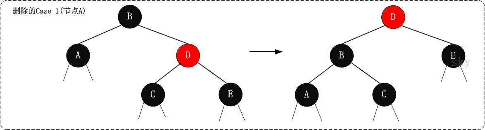

**2. (Case 2) x是"黑+黑"节点，x的兄弟节点是黑色，x的兄弟节点的两个孩子都是黑色**

**2.1 现象说明**  

x是“黑+黑”节点，x的兄弟节点是黑色，x的兄弟节点的两个孩子都是黑色。

**2.2 处理策略**  

> (01) 将x的兄弟节点设为“红色”。 
> (02) 设置“x的父节点”为“新的x节点”。

**下面谈谈为什么要这样处理。**(建议理解的时候，通过下面的图进行对比)  

> 这个情况的处理思想：是将“x中多余的一个黑色属性上移(往根方向移动)”。 x是“黑+黑”节点，我们将x由“黑+黑”节点 变成 “黑”节点，多余的一个“黑”属性移到x的父节点中，即x的父节点多出了一个黑属性(若x的父节点原先是“黑”，则此时变成了“黑+黑”；若x的父节点原先时“红”，则此时变成了“红+黑”)。 此时，需要注意的是：所有经过x的分支中黑节点个数没变化；但是，所有经过x的兄弟节点的分支中黑色节点的个数增加了1(因为x的父节点多了一个黑色属性)！为了解决这个问题，我们需要将“所有经过x的兄弟节点的分支中黑色节点的个数减1”即可，那么就可以通过“将x的兄弟节点由黑色变成红色”来实现。 
> 经过上面的步骤(将x的兄弟节点设为红色)，多余的一个颜色属性(黑色)已经跑到x的父节点中。我们需要将x的父节点设为“新的x节点”进行处理。若“新的x节点”是“黑+红”，直接将“新的x节点”设为黑色，即可完全解决该问题；若“新的x节点”是“黑+黑”，则需要对“新的x节点”进行进一步处理。

**2.3 示意图**  


**3. (Case 3)x是“黑+黑”节点，x的兄弟节点是黑色；x的兄弟节点的左孩子是红色，右孩子是黑色的**

**3.1 现象说明**  

x是“黑+黑”节点，x的兄弟节点是黑色；x的兄弟节点的左孩子是红色，右孩子是黑色的。

**3.2 处理策略**  

> (01) 将x兄弟节点的左孩子设为“黑色”。  
> (02) 将x兄弟节点设为“红色”。  
> (03) 对x的兄弟节点进行右旋。  
> (04) 右旋后，重新设置x的兄弟节点。

**下面谈谈为什么要这样处理。**(建议理解的时候，通过下面的图进行对比)  

> 我们处理“Case 3”的目的是为了将“Case 3”进行转换，转换成“Case 4”,从而进行进一步的处理。转换的方式是对x的兄弟节点进行右旋；为了保证右旋后，它仍然是红黑树，就需要在右旋前“将x的兄弟节点的左孩子设为黑色”，同时“将x的兄弟节点设为红色”；右旋后，由于x的兄弟节点发生了变化，需要更新x的兄弟节点，从而进行后续处理。

**3.3 示意图**  

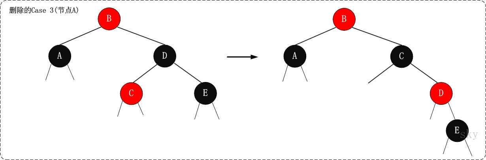

**4. (Case 4)x是“黑+黑”节点，x的兄弟节点是黑色；x的兄弟节点的右孩子是红色的，x的兄弟节点的左孩子任意颜色**

**4.1 现象说明**  

x是“黑+黑”节点，x的兄弟节点是黑色；x的兄弟节点的右孩子是红色的，x的兄弟节点的左孩子任意颜色。

**4.2 处理策略**  

> (01) 将x父节点颜色 赋值给 x的兄弟节点。  
> (02) 将x父节点设为“黑色”。  
> (03) 将x兄弟节点的右子节设为“黑色”。  
> (04) 对x的父节点进行左旋。  
> (05) 设置“x”为“根节点”。

**下面谈谈为什么要这样处理。**(建议理解的时候，通过下面的图进行对比)  

> 我们处理“Case 4”的目的是：去掉x中额外的黑色，将x变成单独的黑色。处理的方式是“：进行颜色修改，然后对x的父节点进行左旋。下面，我们来分析是如何实现的。  
> 为了便于说明，我们设置“当前节点”为S(Original Son)，“兄弟节点”为B(Brother)，“兄弟节点的左孩子”为BLS(Brother's Left Son)，“兄弟节点的右孩子”为BRS(Brother's Right Son)，“父节点”为F(Father)。  
> 我们要对F进行左旋。但在左旋前，我们需要调换F和B的颜色，并设置BRS为黑色。为什么需要这里处理呢？因为左旋后，F和BLS是父子关系，而我们已知BL是红色，如果F是红色，则违背了“特性(4)”；为了解决这一问题，我们将“F设置为黑色”。 但是，F设置为黑色之后，为了保证满足“特性(5)”，即为了保证左旋之后：  
>> 第一，“同时经过根节点和S的分支的黑色节点个数不变”。  
>> 若满足“第一”，只需要S丢弃它多余的颜色即可。因为S的颜色是“黑+黑”，而左旋后“同时经过根节点和S的分支的黑色节点个数”增加了1；现在，只需将S由“黑+黑”变成单独的“黑”节点，即可满足“第一”。  
>>  第二，“同时经过根节点和BLS的分支的黑色节点数不变”。  
>> 若满足“第二”，只需要将“F的原始颜色”赋值给B即可。之前，我们已经将“F设置为黑色”(即，将B的颜色"黑色"，赋值给了F)。至此，我们算是调换了F和B的颜色。  
>> 第三，“同时经过根节点和BRS的分支的黑色节点数不变”。  
>>  在“第二”已经满足的情况下，若要满足“第三”，只需要将BRS设置为“黑色”即可。  
> 经过，上面的处理之后。红黑树的特性全部得到的满足！接着，我们将x设为根节点，就可以跳出while循环(参考伪代码)；即完成了全部处理。

至此，我们就完成了Case 4的处理。理解Case 4的核心，是了解如何“去掉当前节点额外的黑色”。

**4.3 示意图**

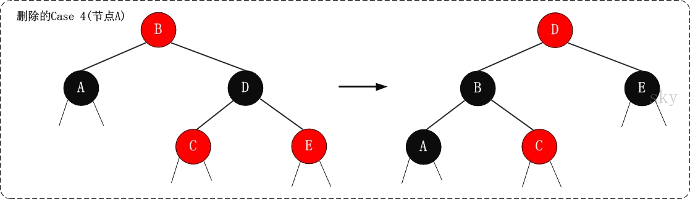

OK！至此，红黑树的理论知识差不多讲完了。后续再更新红黑树的实现代码！

## 参考文献

1. 《算法导论》
2. [教你透彻了解红黑树](http://blog.csdn.net/v_JULY_v/article/details/6105630)

<hr>

#### <p>原文出处：<a href='https://www.cnblogs.com/skywang12345/p/3624177.html' target='blank'>红黑树(二)之C语言的实现</a></p>

## 红黑树的C实现(代码说明)

红黑树的基本操作是**添加**、**删除**和**旋转**。在对红黑树进行添加或删除后，会用到旋转方法。为什么呢？道理很简单，添加或删除红黑树中的节点之后，红黑树就发生了变化，可能不满足红黑树的5条性质，也就不再是一颗红黑树了，而是一颗普通的树。而通过旋转，可以使这颗树重新成为红黑树。简单点说，旋转的目的是让树保持红黑树的特性。  

旋转包括两种：**左旋** 和 **右旋**。下面分别对旋转(左旋和右旋)、添加、删除进行介绍。

### 1. 基本定义
    
```c
#define RED        0    // 红色节点
#define BLACK    1    // 黑色节点
typedef int Type;

// 红黑树的节点
typedef struct RBTreeNode{
    unsigned char color;        // 颜色(RED 或 BLACK)
    Type   key;                    // 关键字(键值)
    struct RBTreeNode *left;    // 左孩子
    struct RBTreeNode *right;    // 右孩子
    struct RBTreeNode *parent;    // 父结点
}Node, *RBTree;

// 红黑树的根
typedef struct rb_root{
    Node *node;
}RBRoot;
```

RBTreeNode是红黑树的节点类，RBRoot是红黑树的根。

### 2. 左旋


对x进行左旋，意味着"将x变成一个左节点"。

左旋的实现代码(C语言)  

```c
/* 
 * 对红黑树的节点(x)进行左旋转
 *
 * 左旋示意图(对节点x进行左旋)：
 *      px                              px
 *     /                               /
 *    x                               y                
 *   /  \      --(左旋)-->           / \                #
 *  lx   y                          x  ry     
 *     /   \                       /  \
 *    ly   ry                     lx  ly  
 *
 *
 */
static void rbtree_left_rotate(RBRoot *root, Node *x)
{
    // 设置x的右孩子为y
    Node *y = x->right;
    // 将 “y的左孩子” 设为 “x的右孩子”；
    // 如果y的左孩子非空，将 “x” 设为 “y的左孩子的父亲”
    x->right = y->left;
    if (y->left != NULL)
        y->left->parent = x;
    // 将 “x的父亲” 设为 “y的父亲”
    y->parent = x->parent;
    if (x->parent == NULL)
    {
        //tree = y;            // 如果 “x的父亲” 是空节点，则将y设为根节点
        root->node = y;            // 如果 “x的父亲” 是空节点，则将y设为根节点
    }
    else
    {
        if (x->parent->left == x)
            x->parent->left = y;    // 如果 x是它父节点的左孩子，则将y设为“x的父节点的左孩子”
        else
            x->parent->right = y;    // 如果 x是它父节点的左孩子，则将y设为“x的父节点的左孩子”
    }
    // 将 “x” 设为 “y的左孩子”
    y->left = x;
    // 将 “x的父节点” 设为 “y”
    x->parent = y;
}
```

### 3. 右旋


对y进行左旋，意味着"将y变成一个右节点"。

右旋的实现代码(C语言)  

```c    
/* 
 * 对红黑树的节点(y)进行右旋转
 *
 * 右旋示意图(对节点y进行左旋)：
 *            py                               py
 *           /                                /
 *          y                                x                  
 *         /  \      --(右旋)-->            /  \                     #
 *        x   ry                           lx   y  
 *       / \                                   / \                   #
 *      lx  rx                                rx  ry
 * 
 */
static void rbtree_right_rotate(RBRoot *root, Node *y)
{
    // 设置x是当前节点的左孩子。
    Node *x = y->left;
    // 将 “x的右孩子” 设为 “y的左孩子”；
    // 如果"x的右孩子"不为空的话，将 “y” 设为 “x的右孩子的父亲”
    y->left = x->right;
    if (x->right != NULL)
        x->right->parent = y;
    // 将 “y的父亲” 设为 “x的父亲”
    x->parent = y->parent;
    if (y->parent == NULL) 
    {
        //tree = x;            // 如果 “y的父亲” 是空节点，则将x设为根节点
        root->node = x;            // 如果 “y的父亲” 是空节点，则将x设为根节点
    }
    else
    {
        if (y == y->parent->right)
            y->parent->right = x;    // 如果 y是它父节点的右孩子，则将x设为“y的父节点的右孩子”
        else
            y->parent->left = x;    // (y是它父节点的左孩子) 将x设为“x的父节点的左孩子”
    }
    // 将 “y” 设为 “x的右孩子”
    x->right = y;
    // 将 “y的父节点” 设为 “x”
    y->parent = x;
}
```

### 4. 添加

将一个节点(z)插入到红黑树中，需要执行哪些步骤呢？首先，将红黑树当作一颗二叉查找树，将节点插入；然后，将节点着色为红色；最后，通过"旋转和重新着色"等一系列操作来修正该树，使之重新成为一颗红黑树。详细描述如下：

**第一步: 将红黑树当作一颗二叉查找树，将节点插入。**  

> 红黑树本身就是一颗二叉查找树，将节点插入后，该树仍然是一颗二叉查找树。也就意味着，树的键值仍然是有序的。此外，无论是左旋还是右旋，若旋转之前这棵树是二叉查找树，旋转之后它一定还是二叉查找树。这也就意味着，任何的旋转和重新着色操作，都不会改变它仍然是一颗二叉查找树的事实。  
> 好吧？那接下来，我们就来想方设法的旋转以及重新着色，使这颗树重新成为红黑树！

**第二步：将插入的节点着色为"红色"。**  

> 为什么着色成红色，而不是黑色呢？为什么呢？在回答之前，我们需要重新温习一下红黑树的特性：  
> (1) 每个节点或者是黑色，或者是红色。  
> (2) 根节点是黑色。  
> (3) 每个叶子节点是黑色。 [注意：这里叶子节点，是指为空的叶子节点！]  
> (4) 如果一个节点是红色的，则它的子节点必须是黑色的。  
> (5) 从一个节点到该节点的子孙节点的所有路径上包含相同数目的黑节点。  
>> 将插入的节点着色为红色，不会违背"特性(5)"！少违背一条特性，就意味着我们需要处理的情况越少。接下来，就要努力的让这棵树满足其它性质即可；满足了的话，它就又是一颗红黑树了。o(∩∩)o...哈哈

**第三步: 通过一系列的旋转或着色等操作，使之重新成为一颗红黑树。**  

> 第二步中，将插入节点着色为"红色"之后，不会违背"特性(5)"。那它到底会违背哪些特性呢？  
> 对于"特性(1)"，显然不会违背了。因为我们已经将它涂成红色了。  
> 对于"特性(2)"，显然也不会违背。在第一步中，我们是将红黑树当作二叉查找树，然后执行的插入操作。而根据二叉查找数的特点，插入操作不会改变根节点。所以，根节点仍然是黑色。  
> 对于"特性(3)"，显然不会违背了。这里的叶子节点是指的空叶子节点，插入非空节点并不会对它们造成影响。  
> 对于"特性(4)"，是有可能违背的！  

那接下来，想办法使之"满足特性(4)"，就可以将树重新构造成红黑树了。

添加操作的实现代码(C语言)

```c
/*
 * 添加节点：将节点(node)插入到红黑树中
 *
 * 参数说明：
 *     root 红黑树的根
 *     node 插入的结点        // 对应《算法导论》中的z
 */
static void rbtree_insert(RBRoot *root, Node *node)
{
    Node *y = NULL;
    Node *x = root->node;

    // 1. 将红黑树当作一颗二叉查找树，将节点添加到二叉查找树中。
    while (x != NULL)
    {
        y = x;
        if (node->key < x->key)
            x = x->left;
        else
            x = x->right;
    }
    rb_parent(node) = y;

    if (y != NULL)
    {
        if (node->key < y->key)
            y->left = node;                // 情况2：若“node所包含的值” < “y所包含的值”，则将node设为“y的左孩子”
        else
            y->right = node;            // 情况3：(“node所包含的值” >= “y所包含的值”)将node设为“y的右孩子” 
    }
    else
    {
        root->node = node;                // 情况1：若y是空节点，则将node设为根
    }

    // 2. 设置节点的颜色为红色
    node->color = RED;

    // 3. 将它重新修正为一颗二叉查找树
    rbtree_insert_fixup(root, node);
}
```

rbtree_insert(root, node)的作用是将"node"节点插入到红黑树中。其中，root是根，node是被插入节点。  
rbtree_insert(root, node)是参考《算法导论》中红黑树的插入函数的伪代码进行实现的。

添加修正操作的实现代码(C语言)

```c
/*
 * 红黑树插入修正函数
 *
 * 在向红黑树中插入节点之后(失去*衡)，再调用该函数；
 * 目的是将它重新塑造成一颗红黑树。
 *
 * 参数说明：
 *     root 红黑树的根
 *     node 插入的结点        // 对应《算法导论》中的z
 */
static void rbtree_insert_fixup(RBRoot *root, Node *node)
{
    Node *parent, *gparent;

    // 若“父节点存在，并且父节点的颜色是红色”
    while ((parent = rb_parent(node)) && rb_is_red(parent))
    {
        gparent = rb_parent(parent);

        //若“父节点”是“祖父节点的左孩子”
        if (parent == gparent->left)
        {
            // Case 1条件：叔叔节点是红色
            {
                Node *uncle = gparent->right;
                if (uncle && rb_is_red(uncle))
                {
                    rb_set_black(uncle);
                    rb_set_black(parent);
                    rb_set_red(gparent);
                    node = gparent;
                    continue;
                }
            }

            // Case 2条件：叔叔是黑色，且当前节点是右孩子
            if (parent->right == node)
            {
                Node *tmp;
                rbtree_left_rotate(root, parent);
                tmp = parent;
                parent = node;
                node = tmp;
            }

            // Case 3条件：叔叔是黑色，且当前节点是左孩子。
            rb_set_black(parent);
            rb_set_red(gparent);
            rbtree_right_rotate(root, gparent);
        } 
        else//若“z的父节点”是“z的祖父节点的右孩子”
        {
            // Case 1条件：叔叔节点是红色
            {
                Node *uncle = gparent->left;
                if (uncle && rb_is_red(uncle))
                {
                    rb_set_black(uncle);
                    rb_set_black(parent);
                    rb_set_red(gparent);
                    node = gparent;
                    continue;
                }
            }

            // Case 2条件：叔叔是黑色，且当前节点是左孩子
            if (parent->left == node)
            {
                Node *tmp;
                rbtree_right_rotate(root, parent);
                tmp = parent;
                parent = node;
                node = tmp;
            }

            // Case 3条件：叔叔是黑色，且当前节点是右孩子。
            rb_set_black(parent);
            rb_set_red(gparent);
            rbtree_left_rotate(root, gparent);
        }
    }

    // 将根节点设为黑色
    rb_set_black(root->node);
}
```

rbtree_insert_fixup(root, node)的作用是对应"上面所讲的第三步"。

### 5. 删除操作

将红黑树内的某一个节点删除。需要执行的操作依次是：首先，将红黑树当作一颗二叉查找树，将该节点从二叉查找树中删除；然后，通过"旋转和重新着色"等一系列来修正该树，使之重新成为一棵红黑树。详细描述如下：

**第一步：将红黑树当作一颗二叉查找树，将节点删除。**  

这和"删除常规二叉查找树中删除节点的方法是一样的"。分3种情况：  

> ① 被删除节点没有儿子，即为叶节点。那么，直接将该节点删除就OK了。  
> ② 被删除节点只有一个儿子。那么，直接删除该节点，并用该节点的唯一子节点顶替它的位置。  
> ③ 被删除节点有两个儿子。那么，先找出它的后继节点；然后把“它的后继节点的内容”复制给“该节点的内容”；之后，删除“它的后继节点”。在这里，后继节点相当于替身，在将后继节点的内容复制给"被删除节点"之后，再将后继节点删除。这样就巧妙的将问题转换为"删除后继节点"的情况了，下面就考虑后继节点。 在"被删除节点"有两个非空子节点的情况下，它的后继节点不可能是双子非空。既然"的后继节点"不可能双子都非空，就意味着"该节点的后继节点"要么没有儿子，要么只有一个儿子。若没有儿子，则按"情况① "进行处理；若只有一个儿子，则按"情况② "进行处理。

**第二步：通过"旋转和重新着色"等一系列来修正该树，使之重新成为一棵红黑树。**  

> 因为"第一步"中删除节点之后，可能会违背红黑树的特性。所以需要通过"旋转和重新着色"来修正该树，使之重新成为一棵红黑树。

删除操作的实现代码(C语言)

```c
/* 
 * 删除结点
 *
 * 参数说明：
 *     tree 红黑树的根结点
 *     node 删除的结点
 */
void rbtree_delete(RBRoot *root, Node *node)
{
    Node *child, *parent;
    int color;

    // 被删除节点的"左右孩子都不为空"的情况。
    if ( (node->left!=NULL) && (node->right!=NULL) ) 
    {
        // 被删节点的后继节点。(称为"取代节点")
        // 用它来取代"被删节点"的位置，然后再将"被删节点"去掉。
        Node *replace = node;

        // 获取后继节点
        replace = replace->right;
        while (replace->left != NULL)
            replace = replace->left;

        // "node节点"不是根节点(只有根节点不存在父节点)
        if (rb_parent(node))
        {
            if (rb_parent(node)->left == node)
                rb_parent(node)->left = replace;
            else
                rb_parent(node)->right = replace;
        } 
        else 
            // "node节点"是根节点，更新根节点。
            root->node = replace;

        // child是"取代节点"的右孩子，也是需要"调整的节点"。
        // "取代节点"肯定不存在左孩子！因为它是一个后继节点。
        child = replace->right;
        parent = rb_parent(replace);
        // 保存"取代节点"的颜色
        color = rb_color(replace);

        // "被删除节点"是"它的后继节点的父节点"
        if (parent == node)
        {
            parent = replace;
        } 
        else
        {
            // child不为空
            if (child)
                rb_set_parent(child, parent);
            parent->left = child;

            replace->right = node->right;
            rb_set_parent(node->right, replace);
        }

        replace->parent = node->parent;
        replace->color = node->color;
        replace->left = node->left;
        node->left->parent = replace;

        if (color == BLACK)
            rbtree_delete_fixup(root, child, parent);
        free(node);

        return ;
    }

    if (node->left !=NULL)
        child = node->left;
    else 
        child = node->right;

    parent = node->parent;
    // 保存"取代节点"的颜色
    color = node->color;

    if (child)
        child->parent = parent;

    // "node节点"不是根节点
    if (parent)
    {
        if (parent->left == node)
            parent->left = child;
        else
            parent->right = child;
    }
    else
        root->node = child;

    if (color == BLACK)
        rbtree_delete_fixup(root, child, parent);
    free(node);
}
```

rbtree_delete_fixup(root, node, parent)是对应"上面所讲的第三步"。

## 红黑树的C实现(完整源码)

下面是红黑数实现的完整代码和相应的测试程序。  

> (1)除了上面所说的"左旋"、"右旋"、"添加"、"删除"等基本操作之后，还实现了"遍历"、"查找"、"打印"、"最小值"、"最大值"、"创建"、"销毁"等接口。  
> (2) 函数接口分为内部接口和外部接口。内部接口是static函数，外部接口则是非static函数，外部接口都在.h头文件中表明了。  
> (3) 测试代码中提供了"插入"和"删除"动作的检测开关。默认是关闭的，打开方法可以参考"代码中的说明"。建议在打开开关后，在草稿上自己动手绘制一下红黑树。

红黑树的实现文件(rbtree.h)

```c
#ifndef _RED_BLACK_TREE_H_
#define _RED_BLACK_TREE_H_

#define RED        0    // 红色节点
#define BLACK    1    // 黑色节点

typedef int Type;

// 红黑树的节点
typedef struct RBTreeNode{
    unsigned char color;        // 颜色(RED 或 BLACK)
    Type   key;                    // 关键字(键值)
    struct RBTreeNode *left;    // 左孩子
    struct RBTreeNode *right;    // 右孩子
    struct RBTreeNode *parent;    // 父结点
}Node, *RBTree;

// 红黑树的根
typedef struct rb_root{
    Node *node;
}RBRoot;

// 创建红黑树，返回"红黑树的根"！
RBRoot* create_rbtree();

// 销毁红黑树
void destroy_rbtree(RBRoot *root);

// 将结点插入到红黑树中。插入成功，返回0；失败返回-1。
int insert_rbtree(RBRoot *root, Type key);

// 删除结点(key为节点的值)
void delete_rbtree(RBRoot *root, Type key);


// 前序遍历"红黑树"
void preorder_rbtree(RBRoot *root);
// 中序遍历"红黑树"
void inorder_rbtree(RBRoot *root);
// 后序遍历"红黑树"
void postorder_rbtree(RBRoot *root);

// (递归实现)查找"红黑树"中键值为key的节点。找到的话，返回0；否则，返回-1。
int rbtree_search(RBRoot *root, Type key);
// (非递归实现)查找"红黑树"中键值为key的节点。找到的话，返回0；否则，返回-1。
int iterative_rbtree_search(RBRoot *root, Type key);

// 返回最小结点的值(将值保存到val中)。找到的话，返回0；否则返回-1。
int rbtree_minimum(RBRoot *root, int *val);
// 返回最大结点的值(将值保存到val中)。找到的话，返回0；否则返回-1。
int rbtree_maximum(RBRoot *root, int *val);

// 打印红黑树
void print_rbtree(RBRoot *root);

#endif
```

红黑树的实现文件(rbtree.c)

```c
/**
 * C语言实现的红黑树(Red Black Tree)
 *
 * @author skywang
 * @date 2013/11/18
 */

#include <stdio.h>
#include <stdlib.h>
#include "rbtree.h"

#define rb_parent(r)   ((r)->parent)
#define rb_color(r) ((r)->color)
#define rb_is_red(r)   ((r)->color==RED)
#define rb_is_black(r)  ((r)->color==BLACK)
#define rb_set_black(r)  do { (r)->color = BLACK; } while (0)
#define rb_set_red(r)  do { (r)->color = RED; } while (0)
#define rb_set_parent(r,p)  do { (r)->parent = (p); } while (0)
#define rb_set_color(r,c)  do { (r)->color = (c); } while (0)

/*
 * 创建红黑树，返回"红黑树的根"！
 */
RBRoot* create_rbtree()
{
    RBRoot *root = (RBRoot *)malloc(sizeof(RBRoot));
    root->node = NULL;

    return root;
}

/*
 * 前序遍历"红黑树"
 */
static void preorder(RBTree tree)
{
    if(tree != NULL)
    {
        printf("%d ", tree->key);
        preorder(tree->left);
        preorder(tree->right);
    }
}
void preorder_rbtree(RBRoot *root)
{
    if (root)
        preorder(root->node);
}

/*
 * 中序遍历"红黑树"
 */
static void inorder(RBTree tree)
{
    if(tree != NULL)
    {
        inorder(tree->left);
        printf("%d ", tree->key);
        inorder(tree->right);
    }
}

void inorder_rbtree(RBRoot *root)
{
    if (root)
        inorder(root->node);
}

/*
 * 后序遍历"红黑树"
 */
static void postorder(RBTree tree)
{
    if(tree != NULL)
    {
        postorder(tree->left);
        postorder(tree->right);
        printf("%d ", tree->key);
    }
}

void postorder_rbtree(RBRoot *root)
{
    if (root)
        postorder(root->node);
}

/*
 * (递归实现)查找"红黑树x"中键值为key的节点
 */
static Node* search(RBTree x, Type key)
{
    if (x==NULL || x->key==key)
        return x;

    if (key < x->key)
        return search(x->left, key);
    else
        return search(x->right, key);
}
int rbtree_search(RBRoot *root, Type key)
{
    if (root)
        return search(root->node, key)? 0 : -1;
}

/*
 * (非递归实现)查找"红黑树x"中键值为key的节点
 */
static Node* iterative_search(RBTree x, Type key)
{
    while ((x!=NULL) && (x->key!=key))
    {
        if (key < x->key)
            x = x->left;
        else
            x = x->right;
    }

    return x;
}
int iterative_rbtree_search(RBRoot *root, Type key)
{
    if (root)
        return iterative_search(root->node, key) ? 0 : -1;
}

/*
 * 查找最小结点：返回tree为根结点的红黑树的最小结点。
 */
static Node* minimum(RBTree tree)
{
    if (tree == NULL)
        return NULL;

    while(tree->left != NULL)
        tree = tree->left;
    return tree;
}

int rbtree_minimum(RBRoot *root, int *val)
{
    Node *node;

    if (root)
        node = minimum(root->node);

    if (node == NULL)
        return -1;

    *val = node->key;
    return 0;
}

/*
 * 查找最大结点：返回tree为根结点的红黑树的最大结点。
 */
static Node* maximum(RBTree tree)
{
    if (tree == NULL)
        return NULL;

    while(tree->right != NULL)
        tree = tree->right;
    return tree;
}

int rbtree_maximum(RBRoot *root, int *val)
{
    Node *node;

    if (root)
        node = maximum(root->node);

    if (node == NULL)
        return -1;

    *val = node->key;
    return 0;
}

/*
 * 找结点(x)的后继结点。即，查找"红黑树中数据值大于该结点"的"最小结点"。
 */
static Node* rbtree_successor(RBTree x)
{
    // 如果x存在右孩子，则"x的后继结点"为 "以其右孩子为根的子树的最小结点"。
    if (x->right != NULL)
        return minimum(x->right);

    // 如果x没有右孩子。则x有以下两种可能：
    // (01) x是"一个左孩子"，则"x的后继结点"为 "它的父结点"。
    // (02) x是"一个右孩子"，则查找"x的最低的父结点，并且该父结点要具有左孩子"，找到的这个"最低的父结点"就是"x的后继结点"。
    Node* y = x->parent;
    while ((y!=NULL) && (x==y->right))
    {
        x = y;
        y = y->parent;
    }

    return y;
}

/*
 * 找结点(x)的前驱结点。即，查找"红黑树中数据值小于该结点"的"最大结点"。
 */
static Node* rbtree_predecessor(RBTree x)
{
    // 如果x存在左孩子，则"x的前驱结点"为 "以其左孩子为根的子树的最大结点"。
    if (x->left != NULL)
        return maximum(x->left);

    // 如果x没有左孩子。则x有以下两种可能：
    // (01) x是"一个右孩子"，则"x的前驱结点"为 "它的父结点"。
    // (01) x是"一个左孩子"，则查找"x的最低的父结点，并且该父结点要具有右孩子"，找到的这个"最低的父结点"就是"x的前驱结点"。
    Node* y = x->parent;
    while ((y!=NULL) && (x==y->left))
    {
        x = y;
        y = y->parent;
    }

    return y;
}

/*
 * 对红黑树的节点(x)进行左旋转
 *
 * 左旋示意图(对节点x进行左旋)：
 *      px                              px
 *     /                               /
 *    x                               y
 *   /  \      --(左旋)-->           / \                #
 *  lx   y                          x  ry
 *     /   \                       /  \
 *    ly   ry                     lx  ly
 *
 *
 */
static void rbtree_left_rotate(RBRoot *root, Node *x)
{
    // 设置x的右孩子为y
    Node *y = x->right;

    // 将 “y的左孩子” 设为 “x的右孩子”；
    // 如果y的左孩子非空，将 “x” 设为 “y的左孩子的父亲”
    x->right = y->left;
    if (y->left != NULL)
        y->left->parent = x;

    // 将 “x的父亲” 设为 “y的父亲”
    y->parent = x->parent;

    if (x->parent == NULL)
    {
        //tree = y;            // 如果 “x的父亲” 是空节点，则将y设为根节点
        root->node = y;            // 如果 “x的父亲” 是空节点，则将y设为根节点
    }
    else
    {
        if (x->parent->left == x)
            x->parent->left = y;    // 如果 x是它父节点的左孩子，则将y设为“x的父节点的左孩子”
        else
            x->parent->right = y;    // 如果 x是它父节点的左孩子，则将y设为“x的父节点的左孩子”
    }

    // 将 “x” 设为 “y的左孩子”
    y->left = x;
    // 将 “x的父节点” 设为 “y”
    x->parent = y;
}

/*
 * 对红黑树的节点(y)进行右旋转
 *
 * 右旋示意图(对节点y进行左旋)：
 *            py                               py
 *           /                                /
 *          y                                x
 *         /  \      --(右旋)-->            /  \                     #
 *        x   ry                           lx   y
 *       / \                                   / \                   #
 *      lx  rx                                rx  ry
 *
 */
static void rbtree_right_rotate(RBRoot *root, Node *y)
{
    // 设置x是当前节点的左孩子。
    Node *x = y->left;

    // 将 “x的右孩子” 设为 “y的左孩子”；
    // 如果"x的右孩子"不为空的话，将 “y” 设为 “x的右孩子的父亲”
    y->left = x->right;
    if (x->right != NULL)
        x->right->parent = y;

    // 将 “y的父亲” 设为 “x的父亲”
    x->parent = y->parent;

    if (y->parent == NULL)
    {
        //tree = x;            // 如果 “y的父亲” 是空节点，则将x设为根节点
        root->node = x;            // 如果 “y的父亲” 是空节点，则将x设为根节点
    }
    else
    {
        if (y == y->parent->right)
            y->parent->right = x;    // 如果 y是它父节点的右孩子，则将x设为“y的父节点的右孩子”
        else
            y->parent->left = x;    // (y是它父节点的左孩子) 将x设为“x的父节点的左孩子”
    }

    // 将 “y” 设为 “x的右孩子”
    x->right = y;

    // 将 “y的父节点” 设为 “x”
    y->parent = x;
}

/*
 * 红黑树插入修正函数
 *
 * 在向红黑树中插入节点之后(失去*衡)，再调用该函数；
 * 目的是将它重新塑造成一颗红黑树。
 *
 * 参数说明：
 *     root 红黑树的根
 *     node 插入的结点        // 对应《算法导论》中的z
 */
static void rbtree_insert_fixup(RBRoot *root, Node *node)
{
    Node *parent, *gparent;

    // 若“父节点存在，并且父节点的颜色是红色”
    while ((parent = rb_parent(node)) && rb_is_red(parent))
    {
        gparent = rb_parent(parent);

        //若“父节点”是“祖父节点的左孩子”
        if (parent == gparent->left)
        {
            // Case 1条件：叔叔节点是红色
            {
                Node *uncle = gparent->right;
                if (uncle && rb_is_red(uncle))
                {
                    rb_set_black(uncle);
                    rb_set_black(parent);
                    rb_set_red(gparent);
                    node = gparent;
                    continue;
                }
            }

            // Case 2条件：叔叔是黑色，且当前节点是右孩子
            if (parent->right == node)
            {
                Node *tmp;
                rbtree_left_rotate(root, parent);
                tmp = parent;
                parent = node;
                node = tmp;
            }

            // Case 3条件：叔叔是黑色，且当前节点是左孩子。
            rb_set_black(parent);
            rb_set_red(gparent);
            rbtree_right_rotate(root, gparent);
        }
        else//若“z的父节点”是“z的祖父节点的右孩子”
        {
            // Case 1条件：叔叔节点是红色
            {
                Node *uncle = gparent->left;
                if (uncle && rb_is_red(uncle))
                {
                    rb_set_black(uncle);
                    rb_set_black(parent);
                    rb_set_red(gparent);
                    node = gparent;
                    continue;
                }
            }

            // Case 2条件：叔叔是黑色，且当前节点是左孩子
            if (parent->left == node)
            {
                Node *tmp;
                rbtree_right_rotate(root, parent);
                tmp = parent;
                parent = node;
                node = tmp;
            }

            // Case 3条件：叔叔是黑色，且当前节点是右孩子。
            rb_set_black(parent);
            rb_set_red(gparent);
            rbtree_left_rotate(root, gparent);
        }
    }

    // 将根节点设为黑色
    rb_set_black(root->node);
}

/*
 * 添加节点：将节点(node)插入到红黑树中
 *
 * 参数说明：
 *     root 红黑树的根
 *     node 插入的结点        // 对应《算法导论》中的z
 */
static void rbtree_insert(RBRoot *root, Node *node)
{
    Node *y = NULL;
    Node *x = root->node;

    // 1. 将红黑树当作一颗二叉查找树，将节点添加到二叉查找树中。
    while (x != NULL)
    {
        y = x;
        if (node->key < x->key)
            x = x->left;
        else
            x = x->right;
    }
    rb_parent(node) = y;

    if (y != NULL)
    {
        if (node->key < y->key)
            y->left = node;                // 情况2：若“node所包含的值” < “y所包含的值”，则将node设为“y的左孩子”
        else
            y->right = node;            // 情况3：(“node所包含的值” >= “y所包含的值”)将node设为“y的右孩子”
    }
    else
    {
        root->node = node;                // 情况1：若y是空节点，则将node设为根
    }

    // 2. 设置节点的颜色为红色
    node->color = RED;

    // 3. 将它重新修正为一颗二叉查找树
    rbtree_insert_fixup(root, node);
}

/*
 * 创建结点
 *
 * 参数说明：
 *     key 是键值。
 *     parent 是父结点。
 *     left 是左孩子。
 *     right 是右孩子。
 */
static Node* create_rbtree_node(Type key, Node *parent, Node *left, Node* right)
{
    Node* p;

    if ((p = (Node *)malloc(sizeof(Node))) == NULL)
        return NULL;
    p->key = key;
    p->left = left;
    p->right = right;
    p->parent = parent;
    p->color = BLACK; // 默认为黑色

    return p;
}

/*
 * 新建结点(节点键值为key)，并将其插入到红黑树中
 *
 * 参数说明：
 *     root 红黑树的根
 *     key 插入结点的键值
 * 返回值：
 *     0，插入成功
 *     -1，插入失败
 */
int insert_rbtree(RBRoot *root, Type key)
{
    Node *node;    // 新建结点

    // 不允许插入相同键值的节点。
    // (若想允许插入相同键值的节点，注释掉下面两句话即可！)
    if (search(root->node, key) != NULL)
        return -1;

    // 如果新建结点失败，则返回。
    if ((node=create_rbtree_node(key, NULL, NULL, NULL)) == NULL)
        return -1;

    rbtree_insert(root, node);

    return 0;
}

/*
 * 红黑树删除修正函数
 *
 * 在从红黑树中删除插入节点之后(红黑树失去*衡)，再调用该函数；
 * 目的是将它重新塑造成一颗红黑树。
 *
 * 参数说明：
 *     root 红黑树的根
 *     node 待修正的节点
 */
static void rbtree_delete_fixup(RBRoot *root, Node *node, Node *parent)
{
    Node *other;

    while ((!node || rb_is_black(node)) && node != root->node)
    {
        if (parent->left == node)
        {
            other = parent->right;
            if (rb_is_red(other))
            {
                // Case 1: x的兄弟w是红色的
                rb_set_black(other);
                rb_set_red(parent);
                rbtree_left_rotate(root, parent);
                other = parent->right;
            }
            if ((!other->left || rb_is_black(other->left)) &&
                (!other->right || rb_is_black(other->right)))
            {
                // Case 2: x的兄弟w是黑色，且w的俩个孩子也都是黑色的
                rb_set_red(other);
                node = parent;
                parent = rb_parent(node);
            }
            else
            {
                if (!other->right || rb_is_black(other->right))
                {
                    // Case 3: x的兄弟w是黑色的，并且w的左孩子是红色，右孩子为黑色。
                    rb_set_black(other->left);
                    rb_set_red(other);
                    rbtree_right_rotate(root, other);
                    other = parent->right;
                }
                // Case 4: x的兄弟w是黑色的；并且w的右孩子是红色的，左孩子任意颜色。
                rb_set_color(other, rb_color(parent));
                rb_set_black(parent);
                rb_set_black(other->right);
                rbtree_left_rotate(root, parent);
                node = root->node;
                break;
            }
        }
        else
        {
            other = parent->left;
            if (rb_is_red(other))
            {
                // Case 1: x的兄弟w是红色的
                rb_set_black(other);
                rb_set_red(parent);
                rbtree_right_rotate(root, parent);
                other = parent->left;
            }
            if ((!other->left || rb_is_black(other->left)) &&
                (!other->right || rb_is_black(other->right)))
            {
                // Case 2: x的兄弟w是黑色，且w的俩个孩子也都是黑色的
                rb_set_red(other);
                node = parent;
                parent = rb_parent(node);
            }
            else
            {
                if (!other->left || rb_is_black(other->left))
                {
                    // Case 3: x的兄弟w是黑色的，并且w的左孩子是红色，右孩子为黑色。
                    rb_set_black(other->right);
                    rb_set_red(other);
                    rbtree_left_rotate(root, other);
                    other = parent->left;
                }
                // Case 4: x的兄弟w是黑色的；并且w的右孩子是红色的，左孩子任意颜色。
                rb_set_color(other, rb_color(parent));
                rb_set_black(parent);
                rb_set_black(other->left);
                rbtree_right_rotate(root, parent);
                node = root->node;
                break;
            }
        }
    }
    if (node)
        rb_set_black(node);
}

/*
 * 删除结点
 *
 * 参数说明：
 *     tree 红黑树的根结点
 *     node 删除的结点
 */
void rbtree_delete(RBRoot *root, Node *node)
{
    Node *child, *parent;
    int color;

    // 被删除节点的"左右孩子都不为空"的情况。
    if ( (node->left!=NULL) && (node->right!=NULL) )
    {
        // 被删节点的后继节点。(称为"取代节点")
        // 用它来取代"被删节点"的位置，然后再将"被删节点"去掉。
        Node *replace = node;

        // 获取后继节点
        replace = replace->right;
        while (replace->left != NULL)
            replace = replace->left;

        // "node节点"不是根节点(只有根节点不存在父节点)
        if (rb_parent(node))
        {
            if (rb_parent(node)->left == node)
                rb_parent(node)->left = replace;
            else
                rb_parent(node)->right = replace;
        }
        else
            // "node节点"是根节点，更新根节点。
            root->node = replace;

        // child是"取代节点"的右孩子，也是需要"调整的节点"。
        // "取代节点"肯定不存在左孩子！因为它是一个后继节点。
        child = replace->right;
        parent = rb_parent(replace);
        // 保存"取代节点"的颜色
        color = rb_color(replace);

        // "被删除节点"是"它的后继节点的父节点"
        if (parent == node)
        {
            parent = replace;
        }
        else
        {
            // child不为空
            if (child)
                rb_set_parent(child, parent);
            parent->left = child;

            replace->right = node->right;
            rb_set_parent(node->right, replace);
        }

        replace->parent = node->parent;
        replace->color = node->color;
        replace->left = node->left;
        node->left->parent = replace;

        if (color == BLACK)
            rbtree_delete_fixup(root, child, parent);
        free(node);

        return ;
    }

    if (node->left !=NULL)
        child = node->left;
    else
        child = node->right;

    parent = node->parent;
    // 保存"取代节点"的颜色
    color = node->color;

    if (child)
        child->parent = parent;

    // "node节点"不是根节点
    if (parent)
    {
        if (parent->left == node)
            parent->left = child;
        else
            parent->right = child;
    }
    else
        root->node = child;

    if (color == BLACK)
        rbtree_delete_fixup(root, child, parent);
    free(node);
}

/*
 * 删除键值为key的结点
 *
 * 参数说明：
 *     tree 红黑树的根结点
 *     key 键值
 */
void delete_rbtree(RBRoot *root, Type key)
{
    Node *z, *node;

    if ((z = search(root->node, key)) != NULL)
        rbtree_delete(root, z);
}

/*
 * 销毁红黑树
 */
static void rbtree_destroy(RBTree tree)
{
    if (tree==NULL)
        return ;

    if (tree->left != NULL)
        rbtree_destroy(tree->left);
    if (tree->right != NULL)
        rbtree_destroy(tree->right);

    free(tree);
}

void destroy_rbtree(RBRoot *root)
{
    if (root != NULL)
        rbtree_destroy(root->node);

    free(root);
}

/*
 * 打印"红黑树"
 *
 * tree       -- 红黑树的节点
 * key        -- 节点的键值
 * direction  --  0，表示该节点是根节点;
 *               -1，表示该节点是它的父结点的左孩子;
 *                1，表示该节点是它的父结点的右孩子。
 */
static void rbtree_print(RBTree tree, Type key, int direction)
{
    if(tree != NULL)
    {
        if(direction==0)    // tree是根节点
            printf("%2d(B) is root\n", tree->key);
        else                // tree是分支节点
            printf("%2d(%s) is %2d's %6s child\n", tree->key, rb_is_red(tree)?"R":"B", key, direction==1?"right" : "left");

        rbtree_print(tree->left, tree->key, -1);
        rbtree_print(tree->right,tree->key,  1);
    }
}

void print_rbtree(RBRoot *root)
{
    if (root!=NULL && root->node!=NULL)
        rbtree_print(root->node, root->node->key, 0);
}
```

红黑树的测试文件(rbtree_test.c)

```c
/**
 * C语言实现的红黑树(Red Black Tree)
 *
 * @author skywang
 * @date 2013/11/18
 */

#include <stdio.h>
#include "rbtree.h"

#define CHECK_INSERT 0    // "插入"动作的检测开关(0，关闭；1，打开)
#define CHECK_DELETE 0    // "删除"动作的检测开关(0，关闭；1，打开)
#define LENGTH(a) ( (sizeof(a)) / (sizeof(a[0])) )

void main()
{
    int a[] = {10, 40, 30, 60, 90, 70, 20, 50, 80};
    int i, ilen=LENGTH(a);
    RBRoot *root=NULL;

    root = create_rbtree();
    printf("== 原始数据: ");
    for(i=0; i<ilen; i++)
        printf("%d ", a[i]);
    printf("\n");

    for(i=0; i<ilen; i++)
    {
        insert_rbtree(root, a[i]);
#if CHECK_INSERT
        printf("== 添加节点: %d\n", a[i]);
        printf("== 树的详细信息: \n");
        print_rbtree(root);
        printf("\n");
#endif
    }

    printf("== 前序遍历: ");
    preorder_rbtree(root);

    printf("\n== 中序遍历: ");
    inorder_rbtree(root);

    printf("\n== 后序遍历: ");
    postorder_rbtree(root);
    printf("\n");

    if (rbtree_minimum(root, &i)==0)
        printf("== 最小值: %d\n", i);
    if (rbtree_maximum(root, &i)==0)
        printf("== 最大值: %d\n", i);
    printf("== 树的详细信息: \n");
    print_rbtree(root);
    printf("\n");

#if CHECK_DELETE
    for(i=0; i<ilen; i++)
    {
        delete_rbtree(root, a[i]);

        printf("== 删除节点: %d\n", a[i]);
        if (root)
        {
            printf("== 树的详细信息: \n");
            print_rbtree(root);
            printf("\n");
        }
    }
#endif

    destroy_rbtree(root);
}
```

## 红黑树的C测试程序

前面已经给出了红黑树的测试程序(rbtree_test.c)，这里就不再重复说明。下面是测试程序的运行结果：

```
== 原始数据: 10 40 30 60 90 70 20 50 80 
== 前序遍历: 30 10 20 60 40 50 80 70 90 
== 中序遍历: 10 20 30 40 50 60 70 80 90 
== 后序遍历: 20 10 50 40 70 90 80 60 30 
== 最小值: 10
== 最大值: 90
== 树的详细信息: 
30(B) is root
10(B) is 30's   left child
20(R) is 10's  right child
60(R) is 30's  right child
40(B) is 60's   left child
50(R) is 40's  right child
80(B) is 60's  right child
70(R) is 80's   left child
90(R) is 80's  right child
```

<hr>

#### <p>原文出处：<a href='https://www.cnblogs.com/skywang12345/p/3624202.html' target='blank'>红黑树(三)之Linux内核中红黑树的经典实现</a></p>

## 概要

前面分别介绍了红黑树的理论知识 以及 通过C语言实现了红黑树。本章继续会红黑树进行介绍，下面将Linux 内核中的红黑树单独移植出来进行测试验证。若读者对红黑树的理论知识不熟悉，建立先学习红黑树的理论知识，再来学习本章。

## Linux内核中红黑树(完整源码)

红黑树的实现文件(rbtree.h)

```c
/*
  Red Black Trees
  (C) 1999  Andrea Arcangeli <andrea@suse.de>

  This program is free software; you can redistribute it and/or modify
  it under the terms of the GNU General Public License as published by
  the Free Software Foundation; either version 2 of the License, or
  (at your option) any later version.

  This program is distributed in the hope that it will be useful,
  but WITHOUT ANY WARRANTY; without even the implied warranty of
  MERCHANTABILITY or FITNESS FOR A PARTICULAR PURPOSE.  See the
  GNU General Public License for more details.

  You should have received a copy of the GNU General Public License
  along with this program; if not, write to the Free Software
  Foundation, Inc., 59 Temple Place, Suite 330, Boston, MA  02111-1307  USA

  linux/include/linux/rbtree.h

  To use rbtrees you'll have to implement your own insert and search cores.
  This will avoid us to use callbacks and to drop drammatically performances.
  I know it's not the cleaner way,  but in C (not in C++) to get
  performances and genericity...

  Some example of insert and search follows here. The search is a plain
  normal search over an ordered tree. The insert instead must be implemented
  in two steps: First, the code must insert the element in order as a red leaf
  in the tree, and then the support library function rb_insert_color() must
  be called. Such function will do the not trivial work to rebalance the
  rbtree, if necessary.

-----------------------------------------------------------------------
static inline struct page * rb_search_page_cache(struct inode * inode,
                         unsigned long offset)
{
    struct rb_node * n = inode->i_rb_page_cache.rb_node;
    struct page * page;

    while (n)
    {
        page = rb_entry(n, struct page, rb_page_cache);

        if (offset < page->offset)
            n = n->rb_left;
        else if (offset > page->offset)
            n = n->rb_right;
        else
            return page;
    }
    return NULL;
}

static inline struct page * __rb_insert_page_cache(struct inode * inode,
                           unsigned long offset,
                           struct rb_node * node)
{
    struct rb_node ** p = &inode->i_rb_page_cache.rb_node;
    struct rb_node * parent = NULL;
    struct page * page;

    while (*p)
    {
        parent = *p;
        page = rb_entry(parent, struct page, rb_page_cache);

        if (offset < page->offset)
            p = &(*p)->rb_left;
        else if (offset > page->offset)
            p = &(*p)->rb_right;
        else
            return page;
    }

    rb_link_node(node, parent, p);

    return NULL;
}

static inline struct page * rb_insert_page_cache(struct inode * inode,
                         unsigned long offset,
                         struct rb_node * node)
{
    struct page * ret;
    if ((ret = __rb_insert_page_cache(inode, offset, node)))
        goto out;
    rb_insert_color(node, &inode->i_rb_page_cache);
 out:
    return ret;
}
-----------------------------------------------------------------------
*/

#ifndef    _SLINUX_RBTREE_H
#define    _SLINUX_RBTREE_H

#include <stdio.h>
//#include <linux/kernel.h>
//#include <linux/stddef.h>

struct rb_node
{
    unsigned long  rb_parent_color;
#define    RB_RED        0
#define    RB_BLACK    1
    struct rb_node *rb_right;
    struct rb_node *rb_left;
} /*  __attribute__((aligned(sizeof(long))))*/;
    /* The alignment might seem pointless, but allegedly CRIS needs it */

struct rb_root
{
    struct rb_node *rb_node;
};


#define rb_parent(r)   ((struct rb_node *)((r)->rb_parent_color & ~3))
#define rb_color(r)   ((r)->rb_parent_color & 1)
#define rb_is_red(r)   (!rb_color(r))
#define rb_is_black(r) rb_color(r)
#define rb_set_red(r)  do { (r)->rb_parent_color &= ~1; } while (0)
#define rb_set_black(r)  do { (r)->rb_parent_color |= 1; } while (0)

static inline void rb_set_parent(struct rb_node *rb, struct rb_node *p)
{
    rb->rb_parent_color = (rb->rb_parent_color & 3) | (unsigned long)p;
}
static inline void rb_set_color(struct rb_node *rb, int color)
{
    rb->rb_parent_color = (rb->rb_parent_color & ~1) | color;
}

#define offsetof(TYPE, MEMBER) ((size_t) &((TYPE *)0)->MEMBER)

#define container_of(ptr, type, member) ({          \
    const typeof( ((type *)0)->member ) *__mptr = (ptr);    \
    (type *)( (char *)__mptr - offsetof(type,member) );})

#define RB_ROOT    (struct rb_root) { NULL, }
#define    rb_entry(ptr, type, member) container_of(ptr, type, member)

#define RB_EMPTY_ROOT(root)    ((root)->rb_node == NULL)
#define RB_EMPTY_NODE(node)    (rb_parent(node) == node)
#define RB_CLEAR_NODE(node)    (rb_set_parent(node, node))

static inline void rb_init_node(struct rb_node *rb)
{
    rb->rb_parent_color = 0;
    rb->rb_right = NULL;
    rb->rb_left = NULL;
    RB_CLEAR_NODE(rb);
}

extern void rb_insert_color(struct rb_node *, struct rb_root *);
extern void rb_erase(struct rb_node *, struct rb_root *);

typedef void (*rb_augment_f)(struct rb_node *node, void *data);

extern void rb_augment_insert(struct rb_node *node,
                  rb_augment_f func, void *data);
extern struct rb_node *rb_augment_erase_begin(struct rb_node *node);
extern void rb_augment_erase_end(struct rb_node *node,
                 rb_augment_f func, void *data);

/* Find logical next and previous nodes in a tree */
extern struct rb_node *rb_next(const struct rb_node *);
extern struct rb_node *rb_prev(const struct rb_node *);
extern struct rb_node *rb_first(const struct rb_root *);
extern struct rb_node *rb_last(const struct rb_root *);

/* Fast replacement of a single node without remove/rebalance/add/rebalance */
extern void rb_replace_node(struct rb_node *victim, struct rb_node *new,
                struct rb_root *root);

static inline void rb_link_node(struct rb_node * node, struct rb_node * parent,
                struct rb_node ** rb_link)
{
    node->rb_parent_color = (unsigned long )parent;
    node->rb_left = node->rb_right = NULL;

    *rb_link = node;
}

#endif    /* _LINUX_RBTREE_H */
```

红黑树的实现文件(rbtree.c)

```c
/*
  Red Black Trees
  (C) 1999  Andrea Arcangeli <andrea@suse.de>
  (C) 2002  David Woodhouse <dwmw2@infradead.org>

  This program is free software; you can redistribute it and/or modify
  it under the terms of the GNU General Public License as published by
  the Free Software Foundation; either version 2 of the License, or
  (at your option) any later version.

  This program is distributed in the hope that it will be useful,
  but WITHOUT ANY WARRANTY; without even the implied warranty of
  MERCHANTABILITY or FITNESS FOR A PARTICULAR PURPOSE.  See the
  GNU General Public License for more details.

  You should have received a copy of the GNU General Public License
  along with this program; if not, write to the Free Software
  Foundation, Inc., 59 Temple Place, Suite 330, Boston, MA  02111-1307  USA

  linux/lib/rbtree.c
*/

#include "rbtree.h"

static void __rb_rotate_left(struct rb_node *node, struct rb_root *root)
{
    struct rb_node *right = node->rb_right;
    struct rb_node *parent = rb_parent(node);

    if ((node->rb_right = right->rb_left))
        rb_set_parent(right->rb_left, node);
    right->rb_left = node;

    rb_set_parent(right, parent);

    if (parent)
    {
        if (node == parent->rb_left)
            parent->rb_left = right;
        else
            parent->rb_right = right;
    }
    else
        root->rb_node = right;
    rb_set_parent(node, right);
}

static void __rb_rotate_right(struct rb_node *node, struct rb_root *root)
{
    struct rb_node *left = node->rb_left;
    struct rb_node *parent = rb_parent(node);

    if ((node->rb_left = left->rb_right))
        rb_set_parent(left->rb_right, node);
    left->rb_right = node;

    rb_set_parent(left, parent);

    if (parent)
    {
        if (node == parent->rb_right)
            parent->rb_right = left;
        else
            parent->rb_left = left;
    }
    else
        root->rb_node = left;
    rb_set_parent(node, left);
}

void rb_insert_color(struct rb_node *node, struct rb_root *root)
{
    struct rb_node *parent, *gparent;

    while ((parent = rb_parent(node)) && rb_is_red(parent))
    {
        gparent = rb_parent(parent);

        if (parent == gparent->rb_left)
        {
            {
                register struct rb_node *uncle = gparent->rb_right;
                if (uncle && rb_is_red(uncle))
                {
                    rb_set_black(uncle);
                    rb_set_black(parent);
                    rb_set_red(gparent);
                    node = gparent;
                    continue;
                }
            }

            if (parent->rb_right == node)
            {
                register struct rb_node *tmp;
                __rb_rotate_left(parent, root);
                tmp = parent;
                parent = node;
                node = tmp;
            }

            rb_set_black(parent);
            rb_set_red(gparent);
            __rb_rotate_right(gparent, root);
        } else {
            {
                register struct rb_node *uncle = gparent->rb_left;
                if (uncle && rb_is_red(uncle))
                {
                    rb_set_black(uncle);
                    rb_set_black(parent);
                    rb_set_red(gparent);
                    node = gparent;
                    continue;
                }
            }

            if (parent->rb_left == node)
            {
                register struct rb_node *tmp;
                __rb_rotate_right(parent, root);
                tmp = parent;
                parent = node;
                node = tmp;
            }

            rb_set_black(parent);
            rb_set_red(gparent);
            __rb_rotate_left(gparent, root);
        }
    }

    rb_set_black(root->rb_node);
}

static void __rb_erase_color(struct rb_node *node, struct rb_node *parent,
                 struct rb_root *root)
{
    struct rb_node *other;

    while ((!node || rb_is_black(node)) && node != root->rb_node)
    {
        if (parent->rb_left == node)
        {
            other = parent->rb_right;
            if (rb_is_red(other))
            {
                rb_set_black(other);
                rb_set_red(parent);
                __rb_rotate_left(parent, root);
                other = parent->rb_right;
            }
            if ((!other->rb_left || rb_is_black(other->rb_left)) &&
                (!other->rb_right || rb_is_black(other->rb_right)))
            {
                rb_set_red(other);
                node = parent;
                parent = rb_parent(node);
            }
            else
            {
                if (!other->rb_right || rb_is_black(other->rb_right))
                {
                    rb_set_black(other->rb_left);
                    rb_set_red(other);
                    __rb_rotate_right(other, root);
                    other = parent->rb_right;
                }
                rb_set_color(other, rb_color(parent));
                rb_set_black(parent);
                rb_set_black(other->rb_right);
                __rb_rotate_left(parent, root);
                node = root->rb_node;
                break;
            }
        }
        else
        {
            other = parent->rb_left;
            if (rb_is_red(other))
            {
                rb_set_black(other);
                rb_set_red(parent);
                __rb_rotate_right(parent, root);
                other = parent->rb_left;
            }
            if ((!other->rb_left || rb_is_black(other->rb_left)) &&
                (!other->rb_right || rb_is_black(other->rb_right)))
            {
                rb_set_red(other);
                node = parent;
                parent = rb_parent(node);
            }
            else
            {
                if (!other->rb_left || rb_is_black(other->rb_left))
                {
                    rb_set_black(other->rb_right);
                    rb_set_red(other);
                    __rb_rotate_left(other, root);
                    other = parent->rb_left;
                }
                rb_set_color(other, rb_color(parent));
                rb_set_black(parent);
                rb_set_black(other->rb_left);
                __rb_rotate_right(parent, root);
                node = root->rb_node;
                break;
            }
        }
    }
    if (node)
        rb_set_black(node);
}

void rb_erase(struct rb_node *node, struct rb_root *root)
{
    struct rb_node *child, *parent;
    int color;

    if (!node->rb_left)
        child = node->rb_right;
    else if (!node->rb_right)
        child = node->rb_left;
    else
    {
        struct rb_node *old = node, *left;

        node = node->rb_right;
        while ((left = node->rb_left) != NULL)
            node = left;

        if (rb_parent(old)) {
            if (rb_parent(old)->rb_left == old)
                rb_parent(old)->rb_left = node;
            else
                rb_parent(old)->rb_right = node;
        } else
            root->rb_node = node;

        child = node->rb_right;
        parent = rb_parent(node);
        color = rb_color(node);

        if (parent == old) {
            parent = node;
        } else {
            if (child)
                rb_set_parent(child, parent);
            parent->rb_left = child;

            node->rb_right = old->rb_right;
            rb_set_parent(old->rb_right, node);
        }

        node->rb_parent_color = old->rb_parent_color;
        node->rb_left = old->rb_left;
        rb_set_parent(old->rb_left, node);

        goto color;
    }

    parent = rb_parent(node);
    color = rb_color(node);

    if (child)
        rb_set_parent(child, parent);
    if (parent)
    {
        if (parent->rb_left == node)
            parent->rb_left = child;
        else
            parent->rb_right = child;
    }
    else
        root->rb_node = child;

 color:
    if (color == RB_BLACK)
        __rb_erase_color(child, parent, root);
}

static void rb_augment_path(struct rb_node *node, rb_augment_f func, void *data)
{
    struct rb_node *parent;

up:
    func(node, data);
    parent = rb_parent(node);
    if (!parent)
        return;

    if (node == parent->rb_left && parent->rb_right)
        func(parent->rb_right, data);
    else if (parent->rb_left)
        func(parent->rb_left, data);

    node = parent;
    goto up;
}

/*
 * after inserting @node into the tree, update the tree to account for
 * both the new entry and any damage done by rebalance
 */
void rb_augment_insert(struct rb_node *node, rb_augment_f func, void *data)
{
    if (node->rb_left)
        node = node->rb_left;
    else if (node->rb_right)
        node = node->rb_right;

    rb_augment_path(node, func, data);
}

/*
 * before removing the node, find the deepest node on the rebalance path
 * that will still be there after @node gets removed
 */
struct rb_node *rb_augment_erase_begin(struct rb_node *node)
{
    struct rb_node *deepest;

    if (!node->rb_right && !node->rb_left)
        deepest = rb_parent(node);
    else if (!node->rb_right)
        deepest = node->rb_left;
    else if (!node->rb_left)
        deepest = node->rb_right;
    else {
        deepest = rb_next(node);
        if (deepest->rb_right)
            deepest = deepest->rb_right;
        else if (rb_parent(deepest) != node)
            deepest = rb_parent(deepest);
    }

    return deepest;
}

/*
 * after removal, update the tree to account for the removed entry
 * and any rebalance damage.
 */
void rb_augment_erase_end(struct rb_node *node, rb_augment_f func, void *data)
{
    if (node)
        rb_augment_path(node, func, data);
}

/*
 * This function returns the first node (in sort order) of the tree.
 */
struct rb_node *rb_first(const struct rb_root *root)
{
    struct rb_node    *n;

    n = root->rb_node;
    if (!n)
        return NULL;
    while (n->rb_left)
        n = n->rb_left;
    return n;
}

struct rb_node *rb_last(const struct rb_root *root)
{
    struct rb_node    *n;

    n = root->rb_node;
    if (!n)
        return NULL;
    while (n->rb_right)
        n = n->rb_right;
    return n;
}

struct rb_node *rb_next(const struct rb_node *node)
{
    struct rb_node *parent;

    if (rb_parent(node) == node)
        return NULL;

    /* If we have a right-hand child, go down and then left as far
       as we can. */
    if (node->rb_right) {
        node = node->rb_right;
        while (node->rb_left)
            node=node->rb_left;
        return (struct rb_node *)node;
    }

    /* No right-hand children.  Everything down and left is
       smaller than us, so any 'next' node must be in the general
       direction of our parent. Go up the tree; any time the
       ancestor is a right-hand child of its parent, keep going
       up. First time it's a left-hand child of its parent, said
       parent is our 'next' node. */
    while ((parent = rb_parent(node)) && node == parent->rb_right)
        node = parent;

    return parent;
}

struct rb_node *rb_prev(const struct rb_node *node)
{
    struct rb_node *parent;

    if (rb_parent(node) == node)
        return NULL;

    /* If we have a left-hand child, go down and then right as far
       as we can. */
    if (node->rb_left) {
        node = node->rb_left;
        while (node->rb_right)
            node=node->rb_right;
        return (struct rb_node *)node;
    }

    /* No left-hand children. Go up till we find an ancestor which
       is a right-hand child of its parent */
    while ((parent = rb_parent(node)) && node == parent->rb_left)
        node = parent;

    return parent;
}

void rb_replace_node(struct rb_node *victim, struct rb_node *new,
             struct rb_root *root)
{
    struct rb_node *parent = rb_parent(victim);

    /* Set the surrounding nodes to point to the replacement */
    if (parent) {
        if (victim == parent->rb_left)
            parent->rb_left = new;
        else
            parent->rb_right = new;
    } else {
        root->rb_node = new;
    }
    if (victim->rb_left)
        rb_set_parent(victim->rb_left, new);
    if (victim->rb_right)
        rb_set_parent(victim->rb_right, new);

    /* Copy the pointers/colour from the victim to the replacement */
    *new = *victim;
}
```

红黑树的测试文件(test.c)

```c
/**
 * 根据Linux Kernel定义的红黑树(Red Black Tree)
 *
 * @author skywang
 * @date 2013/11/18
 */

#include <stdio.h>
#include <stdlib.h>
#include "rbtree.h"

#define CHECK_INSERT 0    // "插入"动作的检测开关(0，关闭；1，打开)
#define CHECK_DELETE 0    // "删除"动作的检测开关(0，关闭；1，打开)
#define LENGTH(a) ( (sizeof(a)) / (sizeof(a[0])) )

typedef int Type;

struct my_node {
    struct rb_node rb_node;    // 红黑树节点
    Type key;                // 键值
    // ... 用户自定义的数据
};

/*
 * 查找"红黑树"中键值为key的节点。没找到的话，返回NULL。
 */
struct my_node *my_search(struct rb_root *root, Type key)
{
    struct rb_node *rbnode = root->rb_node;

    while (rbnode!=NULL)
    {
        struct my_node *mynode = container_of(rbnode, struct my_node, rb_node);

        if (key < mynode->key)
            rbnode = rbnode->rb_left;
        else if (key > mynode->key)
            rbnode = rbnode->rb_right;
        else
            return mynode;
    }

    return NULL;
}

/*
 * 将key插入到红黑树中。插入成功，返回0；失败返回-1。
 */
int my_insert(struct rb_root *root, Type key)
{
    struct my_node *mynode; // 新建结点
    struct rb_node **tmp = &(root->rb_node), *parent = NULL;

    /* Figure out where to put new node */
    while (*tmp)
    {
        struct my_node *my = container_of(*tmp, struct my_node, rb_node);

        parent = *tmp;
        if (key < my->key)
            tmp = &((*tmp)->rb_left);
        else if (key > my->key)
            tmp = &((*tmp)->rb_right);
        else
            return -1;
    }

    // 如果新建结点失败，则返回。
    if ((mynode=malloc(sizeof(struct my_node))) == NULL)
        return -1;
    mynode->key = key;

    /* Add new node and rebalance tree. */
    rb_link_node(&mynode->rb_node, parent, tmp);
    rb_insert_color(&mynode->rb_node, root);

    return 0;
}

/*
 * 删除键值为key的结点
 */
void my_delete(struct rb_root *root, Type key)
{
    struct my_node *mynode;

    // 在红黑树中查找key对应的节点mynode
    if ((mynode = my_search(root, key)) == NULL)
        return ;

    // 从红黑树中删除节点mynode
    rb_erase(&mynode->rb_node, root);
    free(mynode);
}

/*
 * 打印"红黑树"
 */
static void print_rbtree(struct rb_node *tree, Type key, int direction)
{
    if(tree != NULL)
    {
        if(direction==0)    // tree是根节点
            printf("%2d(B) is root\n", key);
        else                // tree是分支节点
            printf("%2d(%s) is %2d's %6s child\n", key, rb_is_black(tree)?"B":"R", key, direction==1?"right" : "left");

        if (tree->rb_left)
            print_rbtree(tree->rb_left, rb_entry(tree->rb_left, struct my_node, rb_node)->key, -1);
        if (tree->rb_right)
            print_rbtree(tree->rb_right,rb_entry(tree->rb_right, struct my_node, rb_node)->key,  1);
    }
}

void my_print(struct rb_root *root)
{
    if (root!=NULL && root->rb_node!=NULL)
        print_rbtree(root->rb_node, rb_entry(root->rb_node, struct my_node, rb_node)->key,  0);
}


void main()
{
    int a[] = {10, 40, 30, 60, 90, 70, 20, 50, 80};
    int i, ilen=LENGTH(a);
    struct rb_root mytree = RB_ROOT;

    printf("== 原始数据: ");
    for(i=0; i<ilen; i++)
        printf("%d ", a[i]);
    printf("\n");

    for (i=0; i < ilen; i++)
    {
        my_insert(&mytree, a[i]);
#if CHECK_INSERT
        printf("== 添加节点: %d\n", a[i]);
        printf("== 树的详细信息: \n");
        my_print(&mytree);
        printf("\n");
#endif

    }

#if CHECK_DELETE
    for (i=0; i<ilen; i++) {
        my_delete(&mytree, a[i]);

        printf("== 删除节点: %d\n", a[i]);
        printf("== 树的详细信息: \n");
        my_print(&mytree);
        printf("\n");
    }
#endif
}
```

rbtree.h和rbtree.c基本上是从Linux 3.0的Kernel中移植出来的。仅仅只添加了offestof和container_of两个宏，这两个宏在文章"[Linux内核中双向链表的经典实现](http://www.cnblogs.com/skywang12345/p/3562146.html)"中已经介绍过了，这里就不再重复说明了。

test.c中包含了两部分内容：一是，基于内核红黑树接口，自定义的一个结构体，并提供了相应的接口(添加、删除、搜索、打印)。二是，包含了相应的测试程序。

<hr>

#### <p>原文出处：<a href='https://www.cnblogs.com/skywang12345/p/3624291.html' target='blank'>红黑树(四)之C++的实现</a></p>

## 红黑树的C++实现(代码说明)

红黑树的基本操作是**添加**、**删除**和**旋转**。在对红黑树进行添加或删除后，会用到旋转方法。为什么呢？道理很简单，添加或删除红黑树中的节点之后，红黑树就发生了变化，可能不满足红黑树的5条性质，也就不再是一颗红黑树了，而是一颗普通的树。而通过旋转，可以使这颗树重新成为红黑树。简单点说，旋转的目的是让树
保持红黑树的特性。  

旋转包括两种：左旋 和 右旋。下面分别对红黑树的基本操作进行介绍。

### 1. 基本定义
    
```cpp
enum RBTColor{RED, BLACK};

template <class T>
class RBTNode{
    public:
        RBTColor color;    // 颜色
        T key;            // 关键字(键值)
        RBTNode *left;    // 左孩子
        RBTNode *right;    // 右孩子
        RBTNode *parent; // 父结点

        RBTNode(T value, RBTColor c, RBTNode *p, RBTNode *l, RBTNode *r):
            key(value),color(c),parent(),left(l),right(r) {}
};

template <class T>
class RBTree {
    private:
        RBTNode<T> *mRoot;    // 根结点

    public:
        RBTree();
        ~RBTree();

        // 前序遍历"红黑树"
        void preOrder();
        // 中序遍历"红黑树"
        void inOrder();
        // 后序遍历"红黑树"
        void postOrder();

        // (递归实现)查找"红黑树"中键值为key的节点
        RBTNode<T>* search(T key);
        // (非递归实现)查找"红黑树"中键值为key的节点
        RBTNode<T>* iterativeSearch(T key);

        // 查找最小结点：返回最小结点的键值。
        T minimum();
        // 查找最大结点：返回最大结点的键值。
        T maximum();

        // 找结点(x)的后继结点。即，查找"红黑树中数据值大于该结点"的"最小结点"。
        RBTNode<T>* successor(RBTNode<T> *x);
        // 找结点(x)的前驱结点。即，查找"红黑树中数据值小于该结点"的"最大结点"。
        RBTNode<T>* predecessor(RBTNode<T> *x);

        // 将结点(key为节点键值)插入到红黑树中
        void insert(T key);

        // 删除结点(key为节点键值)
        void remove(T key);

        // 销毁红黑树
        void destroy();

        // 打印红黑树
        void print();
    private:
        // 前序遍历"红黑树"
        void preOrder(RBTNode<T>* tree) const;
        // 中序遍历"红黑树"
        void inOrder(RBTNode<T>* tree) const;
        // 后序遍历"红黑树"
        void postOrder(RBTNode<T>* tree) const;

        // (递归实现)查找"红黑树x"中键值为key的节点
        RBTNode<T>* search(RBTNode<T>* x, T key) const;
        // (非递归实现)查找"红黑树x"中键值为key的节点
        RBTNode<T>* iterativeSearch(RBTNode<T>* x, T key) const;

        // 查找最小结点：返回tree为根结点的红黑树的最小结点。
        RBTNode<T>* minimum(RBTNode<T>* tree);
        // 查找最大结点：返回tree为根结点的红黑树的最大结点。
        RBTNode<T>* maximum(RBTNode<T>* tree);

        // 左旋
        void leftRotate(RBTNode<T>* &root, RBTNode<T>* x);
        // 右旋
        void rightRotate(RBTNode<T>* &root, RBTNode<T>* y);
        // 插入函数
        void insert(RBTNode<T>* &root, RBTNode<T>* node);
        // 插入修正函数
        void insertFixUp(RBTNode<T>* &root, RBTNode<T>* node);
        // 删除函数
        void remove(RBTNode<T>* &root, RBTNode<T> *node);
        // 删除修正函数
        void removeFixUp(RBTNode<T>* &root, RBTNode<T> *node, RBTNode<T> *parent);

        // 销毁红黑树
        void destroy(RBTNode<T>* &tree);

        // 打印红黑树
        void print(RBTNode<T>* tree, T key, int direction);

#define rb_parent(r)   ((r)->parent)
#define rb_color(r) ((r)->color)
#define rb_is_red(r)   ((r)->color==RED)
#define rb_is_black(r)  ((r)->color==BLACK)
#define rb_set_black(r)  do { (r)->color = BLACK; } while (0)
#define rb_set_red(r)  do { (r)->color = RED; } while (0)
#define rb_set_parent(r,p)  do { (r)->parent = (p); } while (0)
#define rb_set_color(r,c)  do { (r)->color = (c); } while (0)
};
```

RBTNode是红黑树的节点类，而RBTree对应是红黑树的操作实现类。在RBTree中包含了根节点mRoot和红黑树的相关API。

注意：

(01) 在实现红黑树API的过程中，我重载了许多函数。重载的原因，一是因为有的API是内部接口，有的是外部接口；二是为了让结构更加清晰。  
(02) 由于C++的实现是在上一篇介绍的"C语言"实现基础上移植而来，在该代码中，保留了一些C语言的特性；例如(宏定义)。

### 2. 左旋


对x进行左旋，意味着"将x变成一个左节点"。

左旋的实现代码(C++语言)  

```cpp
/* 
 * 对红黑树的节点(x)进行左旋转
 *
 * 左旋示意图(对节点x进行左旋)：
 *      px                              px
 *     /                               /
 *    x                               y                
 *   /  \      --(左旋)-->           / \                #
 *  lx   y                          x  ry     
 *     /   \                       /  \
 *    ly   ry                     lx  ly  
 *
 *
 */
template <class T>
void RBTree<T>::leftRotate(RBTNode<T>* &root, RBTNode<T>* x)
{
    // 设置x的右孩子为y
    RBTNode<T> *y = x->right;

    // 将 “y的左孩子” 设为 “x的右孩子”；
    // 如果y的左孩子非空，将 “x” 设为 “y的左孩子的父亲”
    x->right = y->left;
    if (y->left != NULL)
        y->left->parent = x;

    // 将 “x的父亲” 设为 “y的父亲”
    y->parent = x->parent;

    if (x->parent == NULL)
    {
        root = y;            // 如果 “x的父亲” 是空节点，则将y设为根节点
    }
    else
    {
        if (x->parent->left == x)
            x->parent->left = y;    // 如果 x是它父节点的左孩子，则将y设为“x的父节点的左孩子”
        else
            x->parent->right = y;    // 如果 x是它父节点的左孩子，则将y设为“x的父节点的左孩子”
    }
    
    // 将 “x” 设为 “y的左孩子”
    y->left = x;
    // 将 “x的父节点” 设为 “y”
    x->parent = y;
}
```

### 3. 右旋


对y进行左旋，意味着"将y变成一个右节点"。

右旋的实现代码(C++语言)  

```cpp
/* 
 * 对红黑树的节点(y)进行右旋转
 *
 * 右旋示意图(对节点y进行左旋)：
 *            py                               py
 *           /                                /
 *          y                                x                  
 *         /  \      --(右旋)-->            /  \                     #
 *        x   ry                           lx   y  
 *       / \                                   / \                   #
 *      lx  rx                                rx  ry
 * 
 */
template <class T>
void RBTree<T>::rightRotate(RBTNode<T>* &root, RBTNode<T>* y)
{
    // 设置x是当前节点的左孩子。
    RBTNode<T> *x = y->left;

    // 将 “x的右孩子” 设为 “y的左孩子”；
    // 如果"x的右孩子"不为空的话，将 “y” 设为 “x的右孩子的父亲”
    y->left = x->right;
    if (x->right != NULL)
        x->right->parent = y;

    // 将 “y的父亲” 设为 “x的父亲”
    x->parent = y->parent;

    if (y->parent == NULL) 
    {
        root = x;            // 如果 “y的父亲” 是空节点，则将x设为根节点
    }
    else
    {
        if (y == y->parent->right)
            y->parent->right = x;    // 如果 y是它父节点的右孩子，则将x设为“y的父节点的右孩子”
        else
            y->parent->left = x;    // (y是它父节点的左孩子) 将x设为“x的父节点的左孩子”
    }

    // 将 “y” 设为 “x的右孩子”
    x->right = y;

    // 将 “y的父节点” 设为 “x”
    y->parent = x;
}
```

### 4. 添加

将一个节点插入到红黑树中，需要执行哪些步骤呢？首先，将红黑树当作一颗二叉查找树，将节点插入；然后，将节点着色为红色；最后，通过"旋转和重新着色"等一系列操作来修正该树，使之重新成为一颗红黑树。详细描述如下：

**第一步: 将红黑树当作一颗二叉查找树，将节点插入。**  

红黑树本身就是一颗二叉查找树，将节点插入后，该树仍然是一颗二叉查找树。也就意味着，树的键值仍然是有序的。此外，无论是左旋还是右旋，若旋转之前这棵树是二叉查找树，旋转之后它一定还是二叉查找树。这也就意味着，任何的旋转和重新着色操作，都不会改变它仍然是一颗二叉查找树的事实。  

好吧？那接下来，我们就来想方设法的旋转以及重新着色，使这颗树重新成为红黑树！

**第二步：将插入的节点着色为"红色"。**  

为什么着色成红色，而不是黑色呢？为什么呢？在回答之前，我们需要重新温习一下红黑树的特性：  

> (1) 每个节点或者是黑色，或者是红色。  
> (2) 根节点是黑色。  
> (3) 每个叶子节点是黑色。 [注意：这里叶子节点，是指为空的叶子节点！]  
> (4) 如果一个节点是红色的，则它的子节点必须是黑色的。  
> (5) 从一个节点到该节点的子孙节点的所有路径上包含相同数目的黑节点。  
>
> > 将插入的节点着色为红色，不会违背"特性(5)"！少违背一条特性，就意味着我们需要处理的情况越少。接下来，就要努力的让这棵树满足其它性质即可；满足了的话，它就又是一颗红黑树了。o(∩∩)o...哈哈

**第三步: 通过一系列的旋转或着色等操作，使之重新成为一颗红黑树。**  

第二步中，将插入节点着色为"红色"之后，不会违背"特性(5)"。那它到底会违背哪些特性呢？  

> 对于"特性(1)"，显然不会违背了。因为我们已经将它涂成红色了。  
> 对于"特性(2)"，显然也不会违背。在第一步中，我们是将红黑树当作二叉查找树，然后执行的插入操作。而根据二叉查找数的特点，插入操作不会改变根节点。所以，根节点仍然是黑色。  
> 对于"特性(3)"，显然不会违背了。这里的叶子节点是指的空叶子节点，插入非空节点并不会对它们造成影响。  
> 对于"特性(4)"，是有可能违背的！  
> 那接下来，想办法使之"满足特性(4)"，就可以将树重新构造成红黑树了。

  
添加操作的实现代码(C++语言)

```cpp
/* 
 * 将结点插入到红黑树中
 *
 * 参数说明：
 *     root 红黑树的根结点
 *     node 插入的结点        // 对应《算法导论》中的node
 */
template <class T>
void RBTree<T>::insert(RBTNode<T>* &root, RBTNode<T>* node)
{
    RBTNode<T> *y = NULL;
    RBTNode<T> *x = root;

    // 1. 将红黑树当作一颗二叉查找树，将节点添加到二叉查找树中。
    while (x != NULL)
    {
        y = x;
        if (node->key < x->key)
            x = x->left;
        else
            x = x->right;
    }

    node->parent = y;
    if (y!=NULL)
    {
        if (node->key < y->key)
            y->left = node;
        else
            y->right = node;
    }
    else
        root = node;

    // 2. 设置节点的颜色为红色
    node->color = RED;

    // 3. 将它重新修正为一颗二叉查找树
    insertFixUp(root, node);
}

/* 
 * 将结点(key为节点键值)插入到红黑树中
 *
 * 参数说明：
 *     tree 红黑树的根结点
 *     key 插入结点的键值
 */
template <class T>
void RBTree<T>::insert(T key)
{
    RBTNode<T> *z=NULL;

    // 如果新建结点失败，则返回。
    if ((z=new RBTNode<T>(key,BLACK,NULL,NULL,NULL)) == NULL)
        return ;

    insert(mRoot, z);
}
```

**内部接口** \-- insert(root, node)的作用是将"node"节点插入到红黑树中。其中，root是根，node是被插入节点。  
**外部接口** \-- insert(key)的作用是将"key"添加到红黑树中。

添加修正操作的实现代码(C++语言)

```cpp
/*
 * 红黑树插入修正函数
 *
 * 在向红黑树中插入节点之后(失去*衡)，再调用该函数；
 * 目的是将它重新塑造成一颗红黑树。
 *
 * 参数说明：
 *     root 红黑树的根
 *     node 插入的结点        // 对应《算法导论》中的z
 */
template <class T>
void RBTree<T>::insertFixUp(RBTNode<T>* &root, RBTNode<T>* node)
{
    RBTNode<T> *parent, *gparent;

    // 若“父节点存在，并且父节点的颜色是红色”
    while ((parent = rb_parent(node)) && rb_is_red(parent))
    {
        gparent = rb_parent(parent);

        //若“父节点”是“祖父节点的左孩子”
        if (parent == gparent->left)
        {
            // Case 1条件：叔叔节点是红色
            {
                RBTNode<T> *uncle = gparent->right;
                if (uncle && rb_is_red(uncle))
                {
                    rb_set_black(uncle);
                    rb_set_black(parent);
                    rb_set_red(gparent);
                    node = gparent;
                    continue;
                }
            }

            // Case 2条件：叔叔是黑色，且当前节点是右孩子
            if (parent->right == node)
            {
                RBTNode<T> *tmp;
                leftRotate(root, parent);
                tmp = parent;
                parent = node;
                node = tmp;
            }

            // Case 3条件：叔叔是黑色，且当前节点是左孩子。
            rb_set_black(parent);
            rb_set_red(gparent);
            rightRotate(root, gparent);
        } 
        else//若“z的父节点”是“z的祖父节点的右孩子”
        {
            // Case 1条件：叔叔节点是红色
            {
                RBTNode<T> *uncle = gparent->left;
                if (uncle && rb_is_red(uncle))
                {
                    rb_set_black(uncle);
                    rb_set_black(parent);
                    rb_set_red(gparent);
                    node = gparent;
                    continue;
                }
            }

            // Case 2条件：叔叔是黑色，且当前节点是左孩子
            if (parent->left == node)
            {
                RBTNode<T> *tmp;
                rightRotate(root, parent);
                tmp = parent;
                parent = node;
                node = tmp;
            }

            // Case 3条件：叔叔是黑色，且当前节点是右孩子。
            rb_set_black(parent);
            rb_set_red(gparent);
            leftRotate(root, gparent);
        }
    }

    // 将根节点设为黑色
    rb_set_black(root);
}
```

insertFixUp(root, node)的作用是对应"上面所讲的第三步"。它是一个内部接口。

### 5. 删除操作

将红黑树内的某一个节点删除。需要执行的操作依次是：首先，将红黑树当作一颗二叉查找树，将该节点从二叉查找树中删除；然后，通过"旋转和重新着色"等一系列来修正该树，使之重新成为一棵红黑树。详细描述如下：

**第一步：将红黑树当作一颗二叉查找树，将节点删除。**  

> 这和"删除常规二叉查找树中删除节点的方法是一样的"。分3种情况：  
>> ① 被删除节点没有儿子，即为叶节点。那么，直接将该节点删除就OK了。  
>> ② 被删除节点只有一个儿子。那么，直接删除该节点，并用该节点的唯一子节点顶替它的位置。  
>> ③ 被删除节点有两个儿子。那么，先找出它的后继节点；然后把“它的后继节点的内容”复制给“该节点的内容”；之后，删除“它的后继节点”。在这里，后继节点相当于替身，在将后继节点的内容复制给"被删除节点"之后，再将后继节点删除。这样就巧妙的将问题转换为"删除后继节点"的情况了，下面就考虑后继节点。 在"被删除节点"有两个非空子节点的情况下，它的后继节点不可能是双子非空。既然"的后继节点"不可能双子都非空，就意味着"该节点的后继节点"要么没有儿子，要么只有一个儿子。若没有儿子，则按"情况① "进行处理；若只有一个儿子，则按"情况② "进行处理。

**第二步：通过"旋转和重新着色"等一系列来修正该树，使之重新成为一棵红黑树。**  
       
> 因为"第一步"中删除节点之后，可能会违背红黑树的特性。所以需要通过"旋转和重新着色"来修正该树，使之重新成为一棵红黑树。
 
删除操作的实现代码(C++语言)

```cpp
/* 
 * 删除结点(node)，并返回被删除的结点
 *
 * 参数说明：
 *     root 红黑树的根结点
 *     node 删除的结点
 */
template <class T>
void RBTree<T>::remove(RBTNode<T>* &root, RBTNode<T> *node)
{
    RBTNode<T> *child, *parent;
    RBTColor color;

    // 被删除节点的"左右孩子都不为空"的情况。
    if ( (node->left!=NULL) && (node->right!=NULL) ) 
    {
        // 被删节点的后继节点。(称为"取代节点")
        // 用它来取代"被删节点"的位置，然后再将"被删节点"去掉。
        RBTNode<T> *replace = node;

        // 获取后继节点
        replace = replace->right;
        while (replace->left != NULL)
            replace = replace->left;

        // "node节点"不是根节点(只有根节点不存在父节点)
        if (rb_parent(node))
        {
            if (rb_parent(node)->left == node)
                rb_parent(node)->left = replace;
            else
                rb_parent(node)->right = replace;
        } 
        else 
            // "node节点"是根节点，更新根节点。
            root = replace;

        // child是"取代节点"的右孩子，也是需要"调整的节点"。
        // "取代节点"肯定不存在左孩子！因为它是一个后继节点。
        child = replace->right;
        parent = rb_parent(replace);
        // 保存"取代节点"的颜色
        color = rb_color(replace);

        // "被删除节点"是"它的后继节点的父节点"
        if (parent == node)
        {
            parent = replace;
        } 
        else
        {
            // child不为空
            if (child)
                rb_set_parent(child, parent);
            parent->left = child;

            replace->right = node->right;
            rb_set_parent(node->right, replace);
        }

        replace->parent = node->parent;
        replace->color = node->color;
        replace->left = node->left;
        node->left->parent = replace;

        if (color == BLACK)
            removeFixUp(root, child, parent);

        delete node;
        return ;
    }

    if (node->left !=NULL)
        child = node->left;
    else 
        child = node->right;

    parent = node->parent;
    // 保存"取代节点"的颜色
    color = node->color;

    if (child)
        child->parent = parent;

    // "node节点"不是根节点
    if (parent)
    {
        if (parent->left == node)
            parent->left = child;
        else
            parent->right = child;
    }
    else
        root = child;

    if (color == BLACK)
        removeFixUp(root, child, parent);
    delete node;
}

/* 
 * 删除红黑树中键值为key的节点
 *
 * 参数说明：
 *     tree 红黑树的根结点
 */
template <class T>
void RBTree<T>::remove(T key)
{
    RBTNode<T> *node; 

    // 查找key对应的节点(node)，找到的话就删除该节点
    if ((node = search(mRoot, key)) != NULL)
        remove(mRoot, node);
}
```

**内部接口** \-- remove(root, node)的作用是将"node"节点插入到红黑树中。其中，root是根，node是被插入节点。  
**外部接口** \-- remove(key)删除红黑树中键值为key的节点。
 
删除修正操作的实现代码(C++语言)

```cpp
/*
 * 红黑树删除修正函数
 *
 * 在从红黑树中删除插入节点之后(红黑树失去*衡)，再调用该函数；
 * 目的是将它重新塑造成一颗红黑树。
 *
 * 参数说明：
 *     root 红黑树的根
 *     node 待修正的节点
 */
template <class T>
void RBTree<T>::removeFixUp(RBTNode<T>* &root, RBTNode<T> *node, RBTNode<T> *parent)
{
    RBTNode<T> *other;

    while ((!node || rb_is_black(node)) && node != root)
    {
        if (parent->left == node)
        {
            other = parent->right;
            if (rb_is_red(other))
            {
                // Case 1: x的兄弟w是红色的  
                rb_set_black(other);
                rb_set_red(parent);
                leftRotate(root, parent);
                other = parent->right;
            }
            if ((!other->left || rb_is_black(other->left)) &&
                (!other->right || rb_is_black(other->right)))
            {
                // Case 2: x的兄弟w是黑色，且w的俩个孩子也都是黑色的  
                rb_set_red(other);
                node = parent;
                parent = rb_parent(node);
            }
            else
            {
                if (!other->right || rb_is_black(other->right))
                {
                    // Case 3: x的兄弟w是黑色的，并且w的左孩子是红色，右孩子为黑色。  
                    rb_set_black(other->left);
                    rb_set_red(other);
                    rightRotate(root, other);
                    other = parent->right;
                }
                // Case 4: x的兄弟w是黑色的；并且w的右孩子是红色的，左孩子任意颜色。
                rb_set_color(other, rb_color(parent));
                rb_set_black(parent);
                rb_set_black(other->right);
                leftRotate(root, parent);
                node = root;
                break;
            }
        }
        else
        {
            other = parent->left;
            if (rb_is_red(other))
            {
                // Case 1: x的兄弟w是红色的  
                rb_set_black(other);
                rb_set_red(parent);
                rightRotate(root, parent);
                other = parent->left;
            }
            if ((!other->left || rb_is_black(other->left)) &&
                (!other->right || rb_is_black(other->right)))
            {
                // Case 2: x的兄弟w是黑色，且w的俩个孩子也都是黑色的  
                rb_set_red(other);
                node = parent;
                parent = rb_parent(node);
            }
            else
            {
                if (!other->left || rb_is_black(other->left))
                {
                    // Case 3: x的兄弟w是黑色的，并且w的左孩子是红色，右孩子为黑色。  
                    rb_set_black(other->right);
                    rb_set_red(other);
                    leftRotate(root, other);
                    other = parent->left;
                }
                // Case 4: x的兄弟w是黑色的；并且w的右孩子是红色的，左孩子任意颜色。
                rb_set_color(other, rb_color(parent));
                rb_set_black(parent);
                rb_set_black(other->left);
                rightRotate(root, parent);
                node = root;
                break;
            }
        }
    }
    if (node)
        rb_set_black(node);
}
```

removeFixup(root, node, parent)是对应"上面所讲的第三步"。它是一个内部接口。

## 红黑树的C++实现(完整源码)

下面是红黑树实现的完整代码和相应的测试程序。  

> (1)除了上面所说的"左旋"、"右旋"、"添加"、"删除"等基本操作之后，还实现了"遍历"、"查找"、"打印"、"最小值"、"最大值"、"创建"、"销毁"等接口。  
> (2) 函数接口大多分为内部接口和外部接口。内部接口是private函数，外部接口则是public函数。  
> (3) 测试代码中提供了"插入"和"删除"动作的检测开关。默认是关闭的，打开方法可以参考"代码中的说明"。建议在打开开关后，在草稿上自己动手绘制一下红黑树。

红黑树的实现文件(RBTree.h)

```cpp
/**
 * C++ 语言: 红黑树
 *
 * @author skywang
 * @date 2013/11/07
 */

#ifndef _RED_BLACK_TREE_HPP_
#define _RED_BLACK_TREE_HPP_

#include <iomanip>
#include <iostream>
using namespace std;

enum RBTColor{RED, BLACK};

template <class T>
class RBTNode{
    public:
        RBTColor color;    // 颜色
        T key;            // 关键字(键值)
        RBTNode *left;    // 左孩子
        RBTNode *right;    // 右孩子
        RBTNode *parent; // 父结点

        RBTNode(T value, RBTColor c, RBTNode *p, RBTNode *l, RBTNode *r):
            key(value),color(c),parent(),left(l),right(r) {}
};

template <class T>
class RBTree {
    private:
        RBTNode<T> *mRoot;    // 根结点

    public:
        RBTree();
        ~RBTree();

        // 前序遍历"红黑树"
        void preOrder();
        // 中序遍历"红黑树"
        void inOrder();
        // 后序遍历"红黑树"
        void postOrder();

        // (递归实现)查找"红黑树"中键值为key的节点
        RBTNode<T>* search(T key);
        // (非递归实现)查找"红黑树"中键值为key的节点
        RBTNode<T>* iterativeSearch(T key);

        // 查找最小结点：返回最小结点的键值。
        T minimum();
        // 查找最大结点：返回最大结点的键值。
        T maximum();

        // 找结点(x)的后继结点。即，查找"红黑树中数据值大于该结点"的"最小结点"。
        RBTNode<T>* successor(RBTNode<T> *x);
        // 找结点(x)的前驱结点。即，查找"红黑树中数据值小于该结点"的"最大结点"。
        RBTNode<T>* predecessor(RBTNode<T> *x);

        // 将结点(key为节点键值)插入到红黑树中
        void insert(T key);

        // 删除结点(key为节点键值)
        void remove(T key);

        // 销毁红黑树
        void destroy();

        // 打印红黑树
        void print();
    private:
        // 前序遍历"红黑树"
        void preOrder(RBTNode<T>* tree) const;
        // 中序遍历"红黑树"
        void inOrder(RBTNode<T>* tree) const;
        // 后序遍历"红黑树"
        void postOrder(RBTNode<T>* tree) const;

        // (递归实现)查找"红黑树x"中键值为key的节点
        RBTNode<T>* search(RBTNode<T>* x, T key) const;
        // (非递归实现)查找"红黑树x"中键值为key的节点
        RBTNode<T>* iterativeSearch(RBTNode<T>* x, T key) const;

        // 查找最小结点：返回tree为根结点的红黑树的最小结点。
        RBTNode<T>* minimum(RBTNode<T>* tree);
        // 查找最大结点：返回tree为根结点的红黑树的最大结点。
        RBTNode<T>* maximum(RBTNode<T>* tree);

        // 左旋
        void leftRotate(RBTNode<T>* &root, RBTNode<T>* x);
        // 右旋
        void rightRotate(RBTNode<T>* &root, RBTNode<T>* y);
        // 插入函数
        void insert(RBTNode<T>* &root, RBTNode<T>* node);
        // 插入修正函数
        void insertFixUp(RBTNode<T>* &root, RBTNode<T>* node);
        // 删除函数
        void remove(RBTNode<T>* &root, RBTNode<T> *node);
        // 删除修正函数
        void removeFixUp(RBTNode<T>* &root, RBTNode<T> *node, RBTNode<T> *parent);

        // 销毁红黑树
        void destroy(RBTNode<T>* &tree);

        // 打印红黑树
        void print(RBTNode<T>* tree, T key, int direction);

#define rb_parent(r)   ((r)->parent)
#define rb_color(r) ((r)->color)
#define rb_is_red(r)   ((r)->color==RED)
#define rb_is_black(r)  ((r)->color==BLACK)
#define rb_set_black(r)  do { (r)->color = BLACK; } while (0)
#define rb_set_red(r)  do { (r)->color = RED; } while (0)
#define rb_set_parent(r,p)  do { (r)->parent = (p); } while (0)
#define rb_set_color(r,c)  do { (r)->color = (c); } while (0)
};

/*
 * 构造函数
 */
template <class T>
RBTree<T>::RBTree():mRoot(NULL)
{
    mRoot = NULL;
}

/*
 * 析构函数
 */
template <class T>
RBTree<T>::~RBTree()
{
    destroy();
}

/*
 * 前序遍历"红黑树"
 */
template <class T>
void RBTree<T>::preOrder(RBTNode<T>* tree) const
{
    if(tree != NULL)
    {
        cout<< tree->key << " " ;
        preOrder(tree->left);
        preOrder(tree->right);
    }
}

template <class T>
void RBTree<T>::preOrder()
{
    preOrder(mRoot);
}

/*
 * 中序遍历"红黑树"
 */
template <class T>
void RBTree<T>::inOrder(RBTNode<T>* tree) const
{
    if(tree != NULL)
    {
        inOrder(tree->left);
        cout<< tree->key << " " ;
        inOrder(tree->right);
    }
}

template <class T>
void RBTree<T>::inOrder()
{
    inOrder(mRoot);
}

/*
 * 后序遍历"红黑树"
 */
template <class T>
void RBTree<T>::postOrder(RBTNode<T>* tree) const
{
    if(tree != NULL)
    {
        postOrder(tree->left);
        postOrder(tree->right);
        cout<< tree->key << " " ;
    }
}

template <class T>
void RBTree<T>::postOrder()
{
    postOrder(mRoot);
}

/*
 * (递归实现)查找"红黑树x"中键值为key的节点
 */
template <class T>
RBTNode<T>* RBTree<T>::search(RBTNode<T>* x, T key) const
{
    if (x==NULL || x->key==key)
        return x;

    if (key < x->key)
        return search(x->left, key);
    else
        return search(x->right, key);
}

template <class T>
RBTNode<T>* RBTree<T>::search(T key)
{
    search(mRoot, key);
}

/*
 * (非递归实现)查找"红黑树x"中键值为key的节点
 */
template <class T>
RBTNode<T>* RBTree<T>::iterativeSearch(RBTNode<T>* x, T key) const
{
    while ((x!=NULL) && (x->key!=key))
    {
        if (key < x->key)
            x = x->left;
        else
            x = x->right;
    }

    return x;
}

template <class T>
RBTNode<T>* RBTree<T>::iterativeSearch(T key)
{
    iterativeSearch(mRoot, key);
}

/*
 * 查找最小结点：返回tree为根结点的红黑树的最小结点。
 */
template <class T>
RBTNode<T>* RBTree<T>::minimum(RBTNode<T>* tree)
{
    if (tree == NULL)
        return NULL;

    while(tree->left != NULL)
        tree = tree->left;
    return tree;
}

template <class T>
T RBTree<T>::minimum()
{
    RBTNode<T> *p = minimum(mRoot);
    if (p != NULL)
        return p->key;

    return (T)NULL;
}

/*
 * 查找最大结点：返回tree为根结点的红黑树的最大结点。
 */
template <class T>
RBTNode<T>* RBTree<T>::maximum(RBTNode<T>* tree)
{
    if (tree == NULL)
        return NULL;

    while(tree->right != NULL)
        tree = tree->right;
    return tree;
}

template <class T>
T RBTree<T>::maximum()
{
    RBTNode<T> *p = maximum(mRoot);
    if (p != NULL)
        return p->key;

    return (T)NULL;
}

/*
 * 找结点(x)的后继结点。即，查找"红黑树中数据值大于该结点"的"最小结点"。
 */
template <class T>
RBTNode<T>* RBTree<T>::successor(RBTNode<T> *x)
{
    // 如果x存在右孩子，则"x的后继结点"为 "以其右孩子为根的子树的最小结点"。
    if (x->right != NULL)
        return minimum(x->right);

    // 如果x没有右孩子。则x有以下两种可能：
    // (01) x是"一个左孩子"，则"x的后继结点"为 "它的父结点"。
    // (02) x是"一个右孩子"，则查找"x的最低的父结点，并且该父结点要具有左孩子"，找到的这个"最低的父结点"就是"x的后继结点"。
    RBTNode<T>* y = x->parent;
    while ((y!=NULL) && (x==y->right))
    {
        x = y;
        y = y->parent;
    }

    return y;
}

/*
 * 找结点(x)的前驱结点。即，查找"红黑树中数据值小于该结点"的"最大结点"。
 */
template <class T>
RBTNode<T>* RBTree<T>::predecessor(RBTNode<T> *x)
{
    // 如果x存在左孩子，则"x的前驱结点"为 "以其左孩子为根的子树的最大结点"。
    if (x->left != NULL)
        return maximum(x->left);

    // 如果x没有左孩子。则x有以下两种可能：
    // (01) x是"一个右孩子"，则"x的前驱结点"为 "它的父结点"。
    // (01) x是"一个左孩子"，则查找"x的最低的父结点，并且该父结点要具有右孩子"，找到的这个"最低的父结点"就是"x的前驱结点"。
    RBTNode<T>* y = x->parent;
    while ((y!=NULL) && (x==y->left))
    {
        x = y;
        y = y->parent;
    }

    return y;
}

/*
 * 对红黑树的节点(x)进行左旋转
 *
 * 左旋示意图(对节点x进行左旋)：
 *      px                              px
 *     /                               /
 *    x                               y
 *   /  \      --(左旋)-->           / \                #
 *  lx   y                          x  ry
 *     /   \                       /  \
 *    ly   ry                     lx  ly
 *
 *
 */
template <class T>
void RBTree<T>::leftRotate(RBTNode<T>* &root, RBTNode<T>* x)
{
    // 设置x的右孩子为y
    RBTNode<T> *y = x->right;

    // 将 “y的左孩子” 设为 “x的右孩子”；
    // 如果y的左孩子非空，将 “x” 设为 “y的左孩子的父亲”
    x->right = y->left;
    if (y->left != NULL)
        y->left->parent = x;

    // 将 “x的父亲” 设为 “y的父亲”
    y->parent = x->parent;

    if (x->parent == NULL)
    {
        root = y;            // 如果 “x的父亲” 是空节点，则将y设为根节点
    }
    else
    {
        if (x->parent->left == x)
            x->parent->left = y;    // 如果 x是它父节点的左孩子，则将y设为“x的父节点的左孩子”
        else
            x->parent->right = y;    // 如果 x是它父节点的左孩子，则将y设为“x的父节点的左孩子”
    }

    // 将 “x” 设为 “y的左孩子”
    y->left = x;
    // 将 “x的父节点” 设为 “y”
    x->parent = y;
}

/*
 * 对红黑树的节点(y)进行右旋转
 *
 * 右旋示意图(对节点y进行左旋)：
 *            py                               py
 *           /                                /
 *          y                                x
 *         /  \      --(右旋)-->            /  \                     #
 *        x   ry                           lx   y
 *       / \                                   / \                   #
 *      lx  rx                                rx  ry
 *
 */
template <class T>
void RBTree<T>::rightRotate(RBTNode<T>* &root, RBTNode<T>* y)
{
    // 设置x是当前节点的左孩子。
    RBTNode<T> *x = y->left;

    // 将 “x的右孩子” 设为 “y的左孩子”；
    // 如果"x的右孩子"不为空的话，将 “y” 设为 “x的右孩子的父亲”
    y->left = x->right;
    if (x->right != NULL)
        x->right->parent = y;

    // 将 “y的父亲” 设为 “x的父亲”
    x->parent = y->parent;

    if (y->parent == NULL)
    {
        root = x;            // 如果 “y的父亲” 是空节点，则将x设为根节点
    }
    else
    {
        if (y == y->parent->right)
            y->parent->right = x;    // 如果 y是它父节点的右孩子，则将x设为“y的父节点的右孩子”
        else
            y->parent->left = x;    // (y是它父节点的左孩子) 将x设为“x的父节点的左孩子”
    }

    // 将 “y” 设为 “x的右孩子”
    x->right = y;

    // 将 “y的父节点” 设为 “x”
    y->parent = x;
}

/*
 * 红黑树插入修正函数
 *
 * 在向红黑树中插入节点之后(失去*衡)，再调用该函数；
 * 目的是将它重新塑造成一颗红黑树。
 *
 * 参数说明：
 *     root 红黑树的根
 *     node 插入的结点        // 对应《算法导论》中的z
 */
template <class T>
void RBTree<T>::insertFixUp(RBTNode<T>* &root, RBTNode<T>* node)
{
    RBTNode<T> *parent, *gparent;

    // 若“父节点存在，并且父节点的颜色是红色”
    while ((parent = rb_parent(node)) && rb_is_red(parent))
    {
        gparent = rb_parent(parent);

        //若“父节点”是“祖父节点的左孩子”
        if (parent == gparent->left)
        {
            // Case 1条件：叔叔节点是红色
            {
                RBTNode<T> *uncle = gparent->right;
                if (uncle && rb_is_red(uncle))
                {
                    rb_set_black(uncle);
                    rb_set_black(parent);
                    rb_set_red(gparent);
                    node = gparent;
                    continue;
                }
            }

            // Case 2条件：叔叔是黑色，且当前节点是右孩子
            if (parent->right == node)
            {
                RBTNode<T> *tmp;
                leftRotate(root, parent);
                tmp = parent;
                parent = node;
                node = tmp;
            }

            // Case 3条件：叔叔是黑色，且当前节点是左孩子。
            rb_set_black(parent);
            rb_set_red(gparent);
            rightRotate(root, gparent);
        }
        else//若“z的父节点”是“z的祖父节点的右孩子”
        {
            // Case 1条件：叔叔节点是红色
            {
                RBTNode<T> *uncle = gparent->left;
                if (uncle && rb_is_red(uncle))
                {
                    rb_set_black(uncle);
                    rb_set_black(parent);
                    rb_set_red(gparent);
                    node = gparent;
                    continue;
                }
            }

            // Case 2条件：叔叔是黑色，且当前节点是左孩子
            if (parent->left == node)
            {
                RBTNode<T> *tmp;
                rightRotate(root, parent);
                tmp = parent;
                parent = node;
                node = tmp;
            }

            // Case 3条件：叔叔是黑色，且当前节点是右孩子。
            rb_set_black(parent);
            rb_set_red(gparent);
            leftRotate(root, gparent);
        }
    }

    // 将根节点设为黑色
    rb_set_black(root);
}

/*
 * 将结点插入到红黑树中
 *
 * 参数说明：
 *     root 红黑树的根结点
 *     node 插入的结点        // 对应《算法导论》中的node
 */
template <class T>
void RBTree<T>::insert(RBTNode<T>* &root, RBTNode<T>* node)
{
    RBTNode<T> *y = NULL;
    RBTNode<T> *x = root;

    // 1. 将红黑树当作一颗二叉查找树，将节点添加到二叉查找树中。
    while (x != NULL)
    {
        y = x;
        if (node->key < x->key)
            x = x->left;
        else
            x = x->right;
    }

    node->parent = y;
    if (y!=NULL)
    {
        if (node->key < y->key)
            y->left = node;
        else
            y->right = node;
    }
    else
        root = node;

    // 2. 设置节点的颜色为红色
    node->color = RED;

    // 3. 将它重新修正为一颗二叉查找树
    insertFixUp(root, node);
}

/*
 * 将结点(key为节点键值)插入到红黑树中
 *
 * 参数说明：
 *     tree 红黑树的根结点
 *     key 插入结点的键值
 */
template <class T>
void RBTree<T>::insert(T key)
{
    RBTNode<T> *z=NULL;

    // 如果新建结点失败，则返回。
    if ((z=new RBTNode<T>(key,BLACK,NULL,NULL,NULL)) == NULL)
        return ;

    insert(mRoot, z);
}

/*
 * 红黑树删除修正函数
 *
 * 在从红黑树中删除插入节点之后(红黑树失去*衡)，再调用该函数；
 * 目的是将它重新塑造成一颗红黑树。
 *
 * 参数说明：
 *     root 红黑树的根
 *     node 待修正的节点
 */
template <class T>
void RBTree<T>::removeFixUp(RBTNode<T>* &root, RBTNode<T> *node, RBTNode<T> *parent)
{
    RBTNode<T> *other;

    while ((!node || rb_is_black(node)) && node != root)
    {
        if (parent->left == node)
        {
            other = parent->right;
            if (rb_is_red(other))
            {
                // Case 1: x的兄弟w是红色的
                rb_set_black(other);
                rb_set_red(parent);
                leftRotate(root, parent);
                other = parent->right;
            }
            if ((!other->left || rb_is_black(other->left)) &&
                (!other->right || rb_is_black(other->right)))
            {
                // Case 2: x的兄弟w是黑色，且w的俩个孩子也都是黑色的
                rb_set_red(other);
                node = parent;
                parent = rb_parent(node);
            }
            else
            {
                if (!other->right || rb_is_black(other->right))
                {
                    // Case 3: x的兄弟w是黑色的，并且w的左孩子是红色，右孩子为黑色。
                    rb_set_black(other->left);
                    rb_set_red(other);
                    rightRotate(root, other);
                    other = parent->right;
                }
                // Case 4: x的兄弟w是黑色的；并且w的右孩子是红色的，左孩子任意颜色。
                rb_set_color(other, rb_color(parent));
                rb_set_black(parent);
                rb_set_black(other->right);
                leftRotate(root, parent);
                node = root;
                break;
            }
        }
        else
        {
            other = parent->left;
            if (rb_is_red(other))
            {
                // Case 1: x的兄弟w是红色的
                rb_set_black(other);
                rb_set_red(parent);
                rightRotate(root, parent);
                other = parent->left;
            }
            if ((!other->left || rb_is_black(other->left)) &&
                (!other->right || rb_is_black(other->right)))
            {
                // Case 2: x的兄弟w是黑色，且w的俩个孩子也都是黑色的
                rb_set_red(other);
                node = parent;
                parent = rb_parent(node);
            }
            else
            {
                if (!other->left || rb_is_black(other->left))
                {
                    // Case 3: x的兄弟w是黑色的，并且w的左孩子是红色，右孩子为黑色。
                    rb_set_black(other->right);
                    rb_set_red(other);
                    leftRotate(root, other);
                    other = parent->left;
                }
                // Case 4: x的兄弟w是黑色的；并且w的右孩子是红色的，左孩子任意颜色。
                rb_set_color(other, rb_color(parent));
                rb_set_black(parent);
                rb_set_black(other->left);
                rightRotate(root, parent);
                node = root;
                break;
            }
        }
    }
    if (node)
        rb_set_black(node);
}

/*
 * 删除结点(node)，并返回被删除的结点
 *
 * 参数说明：
 *     root 红黑树的根结点
 *     node 删除的结点
 */
template <class T>
void RBTree<T>::remove(RBTNode<T>* &root, RBTNode<T> *node)
{
    RBTNode<T> *child, *parent;
    RBTColor color;

    // 被删除节点的"左右孩子都不为空"的情况。
    if ( (node->left!=NULL) && (node->right!=NULL) )
    {
        // 被删节点的后继节点。(称为"取代节点")
        // 用它来取代"被删节点"的位置，然后再将"被删节点"去掉。
        RBTNode<T> *replace = node;

        // 获取后继节点
        replace = replace->right;
        while (replace->left != NULL)
            replace = replace->left;

        // "node节点"不是根节点(只有根节点不存在父节点)
        if (rb_parent(node))
        {
            if (rb_parent(node)->left == node)
                rb_parent(node)->left = replace;
            else
                rb_parent(node)->right = replace;
        }
        else
            // "node节点"是根节点，更新根节点。
            root = replace;

        // child是"取代节点"的右孩子，也是需要"调整的节点"。
        // "取代节点"肯定不存在左孩子！因为它是一个后继节点。
        child = replace->right;
        parent = rb_parent(replace);
        // 保存"取代节点"的颜色
        color = rb_color(replace);

        // "被删除节点"是"它的后继节点的父节点"
        if (parent == node)
        {
            parent = replace;
        }
        else
        {
            // child不为空
            if (child)
                rb_set_parent(child, parent);
            parent->left = child;

            replace->right = node->right;
            rb_set_parent(node->right, replace);
        }

        replace->parent = node->parent;
        replace->color = node->color;
        replace->left = node->left;
        node->left->parent = replace;

        if (color == BLACK)
            removeFixUp(root, child, parent);

        delete node;
        return ;
    }

    if (node->left !=NULL)
        child = node->left;
    else
        child = node->right;

    parent = node->parent;
    // 保存"取代节点"的颜色
    color = node->color;

    if (child)
        child->parent = parent;

    // "node节点"不是根节点
    if (parent)
    {
        if (parent->left == node)
            parent->left = child;
        else
            parent->right = child;
    }
    else
        root = child;

    if (color == BLACK)
        removeFixUp(root, child, parent);
    delete node;
}

/*
 * 删除红黑树中键值为key的节点
 *
 * 参数说明：
 *     tree 红黑树的根结点
 */
template <class T>
void RBTree<T>::remove(T key)
{
    RBTNode<T> *node;

    // 查找key对应的节点(node)，找到的话就删除该节点
    if ((node = search(mRoot, key)) != NULL)
        remove(mRoot, node);
}

/*
 * 销毁红黑树
 */
template <class T>
void RBTree<T>::destroy(RBTNode<T>* &tree)
{
    if (tree==NULL)
        return ;

    if (tree->left != NULL)
        return destroy(tree->left);
    if (tree->right != NULL)
        return destroy(tree->right);

    delete tree;
    tree=NULL;
}

template <class T>
void RBTree<T>::destroy()
{
    destroy(mRoot);
}

/*
 * 打印"二叉查找树"
 *
 * key        -- 节点的键值
 * direction  --  0，表示该节点是根节点;
 *               -1，表示该节点是它的父结点的左孩子;
 *                1，表示该节点是它的父结点的右孩子。
 */
template <class T>
void RBTree<T>::print(RBTNode<T>* tree, T key, int direction)
{
    if(tree != NULL)
    {
        if(direction==0)    // tree是根节点
            cout << setw(2) << tree->key << "(B) is root" << endl;
        else                // tree是分支节点
            cout << setw(2) << tree->key <<  (rb_is_red(tree)?"(R)":"(B)") << " is " << setw(2) << key << "'s "  << setw(12) << (direction==1?"right child" : "left child") << endl;

        print(tree->left, tree->key, -1);
        print(tree->right,tree->key,  1);
    }
}

template <class T>
void RBTree<T>::print()
{
    if (mRoot != NULL)
        print(mRoot, mRoot->key, 0);
}

#endif
```

红黑树的测试文件(RBTreeTest.cpp)  

```cpp
/**
 * C++ 语言: 二叉查找树
 *
 * @author skywang
 * @date 2013/11/07
 */

#include <iostream>
#include "RBTree.h"
using namespace std;

int main()
{
    int a[]= {10, 40, 30, 60, 90, 70, 20, 50, 80};
    int check_insert=0;    // "插入"动作的检测开关(0，关闭；1，打开)
    int check_remove=0;    // "删除"动作的检测开关(0，关闭；1，打开)
    int i;
    int ilen = (sizeof(a)) / (sizeof(a[0])) ;
    RBTree<int>* tree=new RBTree<int>();

    cout << "== 原始数据: ";
    for(i=0; i<ilen; i++)
        cout << a[i] <<" ";
    cout << endl;

    for(i=0; i<ilen; i++)
    {
        tree->insert(a[i]);
        // 设置check_insert=1,测试"添加函数"
        if(check_insert)
        {
            cout << "== 添加节点: " << a[i] << endl;
            cout << "== 树的详细信息: " << endl;
            tree->print();
            cout << endl;
        }

    }

    cout << "== 前序遍历: ";
    tree->preOrder();

    cout << "\n== 中序遍历: ";
    tree->inOrder();

    cout << "\n== 后序遍历: ";
    tree->postOrder();
    cout << endl;

    cout << "== 最小值: " << tree->minimum() << endl;
    cout << "== 最大值: " << tree->maximum() << endl;
    cout << "== 树的详细信息: " << endl;
    tree->print();

    // 设置check_remove=1,测试"删除函数"
    if(check_remove)
    {
        for(i=0; i<ilen; i++)
        {
            tree->remove(a[i]);

            cout << "== 删除节点: " << a[i] << endl;
            cout << "== 树的详细信息: " << endl;
            tree->print();
            cout << endl;
        }
    }

    // 销毁红黑树
    tree->destroy();

    return 0;
}
```

## 红黑树的C++测试程序

测试程序已经包含在相应的实现文件(MaxHeap.cpp)中了，这里就不再重复说明。下面是测试程序的运行结果：  

```
== 原始数据: 10 40 30 60 90 70 20 50 80 
== 前序遍历: 30 10 20 60 40 50 80 70 90 
== 中序遍历: 10 20 30 40 50 60 70 80 90 
== 后序遍历: 20 10 50 40 70 90 80 60 30 
== 最小值: 10
== 最大值: 90
== 树的详细信息: 
30(B) is root
10(B) is 30's   left child
20(R) is 10's  right child
60(R) is 30's  right child
40(B) is 60's   left child
50(R) is 40's  right child
80(B) is 60's  right child
70(R) is 80's   left child
90(R) is 80's  right child
```

<hr>

#### <p>原文出处：<a href='https://www.cnblogs.com/skywang12345/p/3644742.html' target='blank'>参考资料</a></p>

## 参考说明

在写红黑树这几篇文章的过程中，参考了许多资料：主要有《算法导论》、《数据结构与算法分析-C语言描述》以及网上的一些文章；此外，还参考了"Linux内核中的红黑树源码"、"JDK中的红黑树源码"、"STL中的红黑树源码"。

### 1. Linux内核中的红黑树源码

在"红黑树(三)之 Linux内核中红黑树的经典实现"这篇文章中，我已经将Linux内核中的红黑树源码移植出来了，供大家参考。若你想自己亲自研究，可以获取Linux内核源码后再进行查阅。

(01) Linux内核源码下载地址：https://www.kernel.org/
(02) 头文件路径：include/linux/rbtree.h
(03) 实现文件路径：lib/rbtree.c

### 2. JDK中的红黑树源码

JDK中的红黑树在实现TreeMap和TreeSet时有用到。在我以前写的"[Java 集合系列](http://www.cnblogs.com/skywang12345/p/3323085.html)"的"[Java 集合系列12之 TreeMap详细介绍(源码解析)和使用示例](http://www.cnblogs.com/skywang12345/p/3310928.html)"中有介绍过。如果你想一探究竟，参考查看JDK源码。

(01) JDK的源码可以通过解压"JDK包中的src.zip"获取。当然，你也可以通过openjdk来查看JDK源码。
(02) TreeMap的路径：java/util/TreeMap.java

### 3. STL中的红黑树源码

这部分我没有仔细研究。若你感兴趣，可以研究之后，再来分享给大家。

(01) ubuntu下STL中红黑树的源码路径：/usr/include/c++/4.6/ext/pb_ds/detail/rb_tree_map_

说明：上面是我自己使用的ubuntu(12.04版本)下STL源码路径，不同的系统可能略有不同。"/usr/include/c++/4.6/"是g++4.6的路径，而`"ext/pb_ds/detail/rb_tree_map_"`则是红黑树源码路径。

(02) 我将`rb_tree_map_`中的代码打包出来，[点击下载](http://files.cnblogs.com/skywang12345/rb_tree_map_.zip)。