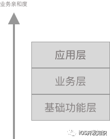
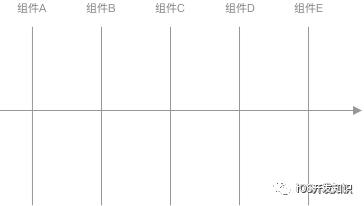

<!--BEGIN_DATA
{
    "create_date": "2022-02-10 22:00", 
    "modify_date": "2022-02-10 22:00", 
    "is_top": "0", 
    "summary": "组件与组件化定义", 
    "tags": "架构", 
    "file_name": "组件与组件化定义.md"
}
END_DATA-->

#### 
原文出处：<a href='https://mp.weixin.qq.com/s/uZm8dXGKAsYNxItD8QsO1Q' target='blank'>组件与组件化定义</a>

## 组件与组件化定义  

组件，主要是指一簇因可以完成一定的功能聚合在一起的代码、资源、配置文件等组成的一个实体。组件物理形态上的隔离，一般我们会使用目录结构、仓库等方式来完成隔离。而进一步的去看，组成组件的各种东西，我们可以统称为“物料”。这个是一个非常重要的概念，在后续讨论组件化的时候，我们都会使用这个概念。这个概念借鉴自，传统的工厂制造设计。在 Wiki 上物料的定义是：指在产品制造[1]过程中，列入生产计划[2]的一切**物**的总称。按照制造的过程来区分，可包括原料[3]、半成品[4]、成品[5]等等。而在这里，我们会发现，我们在客户端领域所谓的组件即是把相对原始的代码、资源、配置文件等物料，组合成了一种新的物料形态，即组件。

对应的我们或说到组件化。首先说明，组件化首先是个动词。意味着我们要以组件这种物料形式，对我们原始物料进行物理隔离，并以之来组织我们的工程结构。其中最核心的问题是依赖管理，文件管理、资源管理问题。在谈到依赖管理的时候，一般会讨论包管理系统，比如我们现在使用的Pod、Maven、Pip、Npm等包管理工具解决的主要是组件化的问题。（PS，不要参考前端组件化，前端组件化，和咱们说的组件化完成不是一个概念，他只是说把一个功能单元Package一下）。在谈到文件管理的时候，一般会与 git 、svn 这种版本管理工具扯到一起，同时我们也会去讨论目录结构。

我们引入了一个概念"物料“，之所以引入这个概念。是因为在后续处理组件化的过程中，我们将会产生大量的”半成品“，或者说过程产物。这些东西，统称为物料。例如在iOS 领域，我们经常会处理一个问题：二进制缓存。我们希望通过缓存构建过程产物，以在下次构建过程中能够复用，从而极大的节省整体的构建时间。而这种关键过程产物，就是一种物料。类似这种物料，在整个工程预中，还有大量存在。例如文档、配置文件..... 于是这里将会引申出”组件化”对物料的管理，其实不限于我们存在仓库中的东西，还将会延展到我们整个工程域中产生很多类似“二进制构建过程产物”的物料。

定义物料例如组件，不是我们的目的。也就是说，我们一般所谓的“拆库”，把物料通过组件的形式进行隔离起来，并不是“组件化”的终点；而是起点。最终我们还是要将这些物料，组合起来来组成我们最终交付的“产品”。同样，在组件化这个命题里面，我们仍需要思考并设计这个组装的过程。以 iOS 的实现为例，在后面的章节中，我们将会介绍一种 Application Specification 的技术。通过 DSL 的方式，定义这个组装的过程，并使之能够标准化。记录组装过程的这些“配置文件”，同样也是一种物料。之前有很多团队，习惯性称之为“壳工程”。

既然我们定义了组件和物料，也自然会衍生出一个问题。如何管理这些物料，准确的讲是如何版本化管理这些物料。在一般的工程域中，我们已经习惯了使用类似 Git、SVN 这样的版本管理软件来进行管理。以 Git 为例吧，在物料管理上其所定义的版本方式会存在一定的缺陷。具体说，就是版本只是标记，而无任何含义。例如我们拿一个 Commit SHA 来看`d336dafa3666771507a76fb49d12a4860494d5aa`除了能够看出这是一个字符串，可能看不出其他的任何含义。相对而言， 这里存在一个更好的版本定义方式，也是在依赖关系系统中我们常用：语义化版本[6]。例如：1.1.0-alpha.0、1.1.0、1.1....根据语义化版本的定义，我们能够非常清晰的明白，当前这个版本的含义。

我们做到这些之后，能够给整体的业务提供非常好的扩展能力。而这些是基于“组件”这种结构之上建设起来的。

## 组件结构

我们在谈组件化的时候，很多时候我们会谈到“拆库”。以 iOS 为例，我们会使用使用 CocoaPods 拆为一个个的 Pod，然后再通过 Podfile 组装起来。而组件化中的拆库，实际上在谈一个事情“隔离”。

1. 如何划分不同物料的边界，最好这些边界是清晰的。2.如何做到业务和业务之间的隔离3.如何让业务自己独立的发版和迭代节奏4.如果进行有效的分层，让业务开发能够不用关注底层的变动。

所以这里面会牵扯到两个问题：

* 组件内部的结构是什么样子的
* 组件之间的结构是什么样子的

接下来我们将会分两部分阐述这两种结构。组件内部结构将会从前面讲到到组件定义中对齐下来。虽然，看起来我们需要首先说清楚一个组件长什么样子，然后再去讲一群组件在一起是什么样子。但是，往往在做组件化这个事情的时候，我们首先会关注到的是组件间的结构。所以我们会优先讨论组件间结构。是

## 组件间结构

最开始的时候， 我们的工程是“单体工程”。一个工程文件， 然后加上一堆的代码。大概也就是我们的工程了。但是，当代码规模变大后。就会发现，单体工程的可维护性会逐渐变差。好一点的，可能会拆一下目录。这里说的目录还是 IDE 里面的目录结构。拿 iOS 来说 XCode 里面的目录结构，与文件系统中的目录结构是不一致的。然后，就会引发一个非常尴尬的问题，基本上代码是无法 CodeReview 的。因为无法通过 CodeReview 单子中的目录结构，知道这个代码是干嘛的。这是维护性降低的一个例子。

于是我们就开始“拆库”。那按照什么规则拆分呢？简单来说：纵向分层，横向正交。

组件间的结构，其实是一个非常复杂的结构。我们可以先看一个复杂应用实际的组件之间的依赖情况：

形如这种组件之间的依赖关系组成的拓扑结构，我们可以理解成是组件之间的物理结构。但是，很明显，这个图的可阅读性已经是非常差。1500+的组件，其关系错综复杂。这个结构其实在我们进行**架构设计**的时候，能够给我们提供的信息是有限的。他主要是在进行组件治理阶段，我们关注具体的组件A与组件B之间的关系的时候，会有作用。于是我们为了能够方便我们理解组件间结构关系，我们一般会创建一种逻辑结构。在工程实践中，我们称这种结构为**分层架构**。

所谓纵向分层，即是我们通过分层架构，对我们工程域中的组件进行归类。一般我们的分层依据是与业务的亲和度。换句话说，就是离我们真实业务的距离。

们在讨论组件间的结构的时候，一方面是在讨论这种物理结构，另外一方面我们也在讨论组件的逻辑结构。而在更多的时候时候，我们讨论的是分层架构这种逻辑结构。因为一个层次清晰的架构图，更能够辅助我们来设计/理解我们的系统。接下来，我们先花点时间集中讨论一下如何在组件化的场景下实施分层架构。对于组件的物理结构部分，会放在组件治理话题下展开讨论。

### 纵向分层

分层是一个非常自然的选择。当组件数量增多的时候，我们会习惯将具有相同特性的组件进行归类。比如我们会将一些像网络库、Logger库、外部引入的一些 UI 组件放到一个层次；会将我们的类似于社交业务的组件、登录页面所在的组件等放到一个层次。仔细去看，我们把他们聚类在一个层次的重要原因是他们与业务的亲和度，亲和度这个指标主要是说组件内部含有业务逻辑的浓度。我们这里所说的业务，就是我们需要构建的真实的业务场景。比如登录吧，直接写用户登录的那部分代码，我们可以认为是业务亲和度非常高。而像网络库这样主要是支撑我们去做完用户登录的代码，我们会认为他的业务亲和度较低。

我们通过把不同业务亲和度的组件聚类之后，就能够自然的得到一个分层架构。具体要分多少层，可以根据自己的业务情况，尤其是业务规模决定。例如常见的三层架构：

应用层中我们放我们需要向外交付的最终的应用组件，比较典型的是壳工程。业务层中，我们存放能够承载我们真实业务逻辑的的一些组件，例如承载登录业务的组件、承载设置的组件等等。而基础功能层，放一些用来支撑业务，但是并非我们的业务逻辑的代码，例如通用的网络库，日志库之类。

### 横向正交

当我们进行了分层之后，会很自然的问一个问题。就是在同层内，如何进行组件拆分。这里给出的答案是：职责正交(横向正交)。拆分的目标是组件与组件之间不存在职责重叠。例如日志库与网络库不存在职责重叠，所以两个要单独拆解。

## 组件内部结构

### 组件组成要素

一如我们在开始就讨论的问题：什么叫组件？我们给出的答案是：组件，主要是指一簇因可以完成一定的功能聚合在一起的代码、资源、配置文件等组成的一个实体。在这个定义中，我们可以很清晰的看出：看出组件这个实体也是由其他更细粒度的实体组合而成。而这些实体可以分成两类：

* 组件描述文件
* 组件内部资源

组件描述文件，主要负责描述组件的元信息以及组件内部资源的结构和使用方式。在绝大部分的包管理系统中，我们可以见到这个文件。例如 iOS CocoaPods 中的 podspec、ruby gem 中的 gemspec、npm 系统中的 package.json ...。这个文件基本上是事无巨细的描述了，这个组件是什么，可以做什么用，他是由哪些内部资源组成的。而在一些系统中，甚至描述了组件的构建规则（例如 iOS CocoaPods 和 安卓的 Gradle）。组件描述文件，同时也决定着组件被使用的方式。拿 iOS CocoaPods 来举例，在 podspec 中可以定义使用的是 framework 或者静态库，或者直接是以源码的方式进行集成。

而组件内部资源则比较复杂。会因技术栈的不同，而有差异性。但基本上，也主要分成三类：

* 源代码/二进制产物
* 静态资源，例如图片、视频等
* 配置文件

### 目录结构

目录结构是组件在文件系统中的存储形式。也是我们在开发一个组件的时候，第一眼看到的东西。因而，对于目录结构需要进行一定的设计。使其能够非常清晰直接的表达一个组件的构成。同时，我们也可以将研发过程中的一些流程或者约束固化到目录结构上。

组件，主要是指一簇因可以完成一定的功能聚合在一起的代码、资源、配置文件等组成的一个实体

## References

[1] 制造: _https://zh.wikipedia.org/wiki/%E8%A3%BD%E9%80%A0_ 
[2] 生产计划: _https://zh.wikipedia.org/w/index.php?title=%E7%94%9F%E4%BA%A7%E8%AE%A1%E5%88%92&action=edit&redlink=1_ 
[3] 原料: _https://zh.wikipedia.org/wiki/%E5%8E%9F%E6%96%99_ 
[4] 半成品: _https://zh.wikipedia.org/wiki/%E5%8D%8A%E6%88%90%E5%93%81_ 
[5] 成品: _https://zh.wikipedia.org/wiki/%E6%88%90%E5%93%81_ 
[6] 语义化版本: _https://semver.org_
