 
<!--BEGIN_DATA
{
    "create_date": "2017-02-11 13:43", 
    "modify_date": "2017-02-11 13:43", 
    "is_top": "0", 
    "summary": "组件化架构漫谈", 
    "tags": "iOS、架构", 
    "file_name": "组件化架构漫谈.md"
}
END_DATA-->

####
原文出处：<a href='http://www.jianshu.com/p/67a6004f6930' target='blank'>组件化架构漫谈</a>

######该文章属于<简书 — 刘小壮>原创，转载请注明：

> 前段时间公司项目打算重构，**准确来说应该是按之前的产品逻辑重写一个项目**😂。在重构项目之前涉及到架构选型的问题，我和组里小伙伴一起研究了一下组件化
架构，**打算将项目重构为组件化架构**。当然不是直接拿来照搬，还是要根据公司具体的业务需求设计架构。
>
> 在学习组件化架构的过程中，从很多高质量的博客中学到不少东西，例如**蘑菇街李忠**、**casatwy**、**bang**的博客。在学习过程中也遇到一些问题，**在微博和QQ上和一些做`iOS`的朋友进行了交流**，非常感谢这些朋友的帮助。
>
> 本篇文章主要针对于之前蘑菇街提出的组件化方案，以及**casatwy**提出的组件化方案进行分析，后面还会简单提到滴滴、淘宝、微信的组件化架构，最后会简单说一下我公司设计的组件化架构。

  

占位图

###组件化架构的由来

随着移动互联网的不断发展，**很多程序代码量和业务越来越多**，**现有架构已经不适合公司业务的发展速度了**，很多都面临着重构的问题。  
在公司项目开发中，如果项目比较小，普通的`单工程+MVC架构`就可以满足大多数需求了。但是像淘宝、蘑菇街、微信这样的大型项目，原有的**单工程架构**就不足以满足架构需求了。

就拿淘宝来说，淘宝在**13**年开启的`“All in 无线”`战略中，就将阿里系大多数业务都加入到手机淘宝中，使客户端出现了业务的爆发。在这种情况下，**单工程架构则已经远远不能满足现有业务需求了**。所以在这种情况下，淘宝在**13**年开启了**插件化架构**的重构，后来在**14**年迎来了手机淘宝有
史以来最大规模的重构，将其彻底**重构为组件化架构**。

###蘑菇街的组件化架构

####原因

在一个项目越来越大，开发人员越来越多的情况下，项目会遇到很多问题。

  * 业务模块间划分不清晰，模块之间耦合度很大，非常难维护。
  * 所有模块代码都编写在一个项目中，**测试某个模块或功能**，**需要编译运行整个项目**。

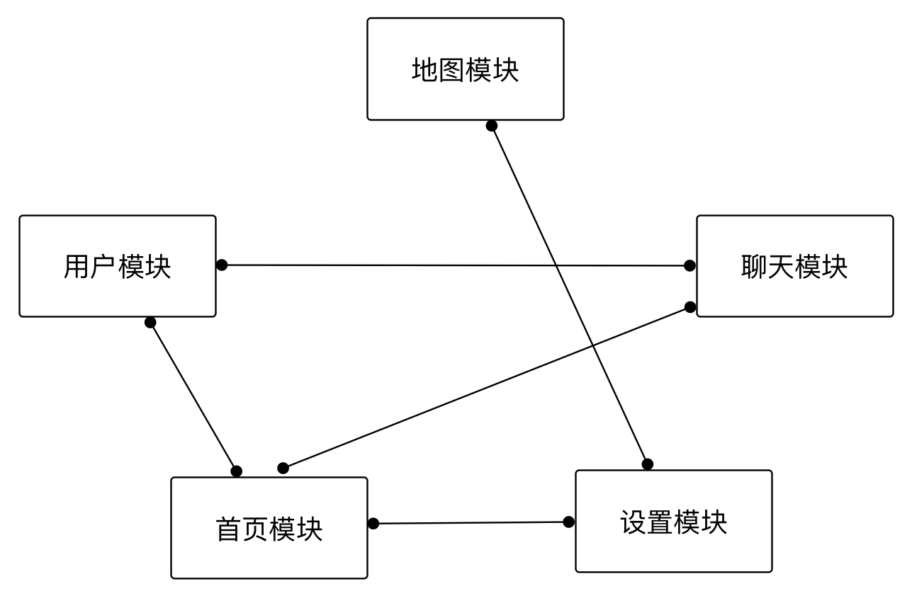  

耦合严重的工程

为了解决上面的问题，可以考虑加一个**中间层**来协调模块间的调用，**所有的模块间的调用都会经过中间层中转**。**(注意看两张图的箭头方向)**

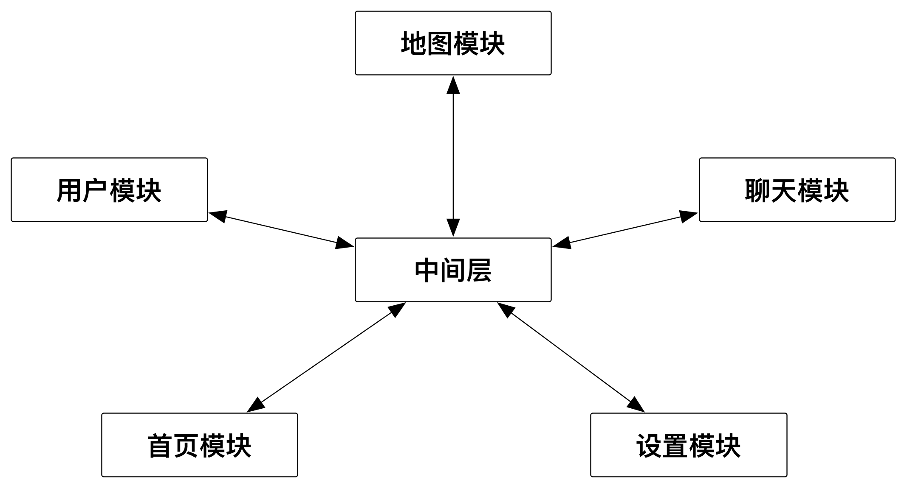  

添加中间层

但是发现增加这个中间层后，耦合还是存在的。中间层对被调用模块存在耦合，其他模块也需要耦合中间层才能发起调用。**这样还是存在之前的相互耦合的问题**，而且本
质上比之前更麻烦了。

####大体结构

所以应该做的是，只让其他模块对中间层产生耦合关系，**中间层不对其他模块发生耦合**。  
对于这个问题，**可以采用组件化的架构**，将每个模块作为一个组件。并且建立一个主项目，这个主项目负责集成所有组件。这样带来的好处是很多的：

  * 业务划分更佳清晰，新人接手更佳容易，可以按组件分配开发任务。
  * 项目可维护性更强，提高开发效率。
  * 更好排查问题，某个组件出现问题，直接对组件进行处理。
  * 开发测试过程中，可以只编译自己那部分代码，不需要编译整个项目代码。

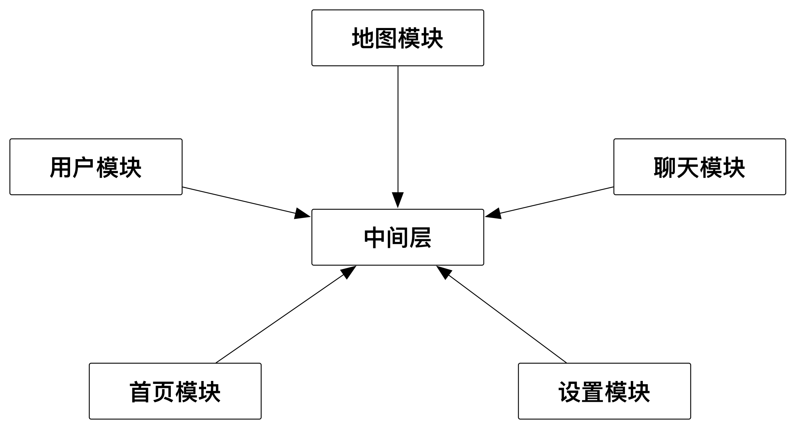  

组件化结构

进行组件化开发后，**可以把每个组件当做一个独立的app**，**每个组件甚至可以采取不同的架构**，例如分别使用`MVVM`、`MVC`、`MVCS`等架构。

####MGJRouter方案

蘑菇街通过`MGJRouter`实现中间层，通过`MGJRouter`进行组件间的消息转发，从名字上来说更像是路由器。实现方式大致是，**在提供服务的组件中提前注册`block`**，然后在调用方组件中通过`URL`调用`block`，下面是调用方式。

#####架构设计

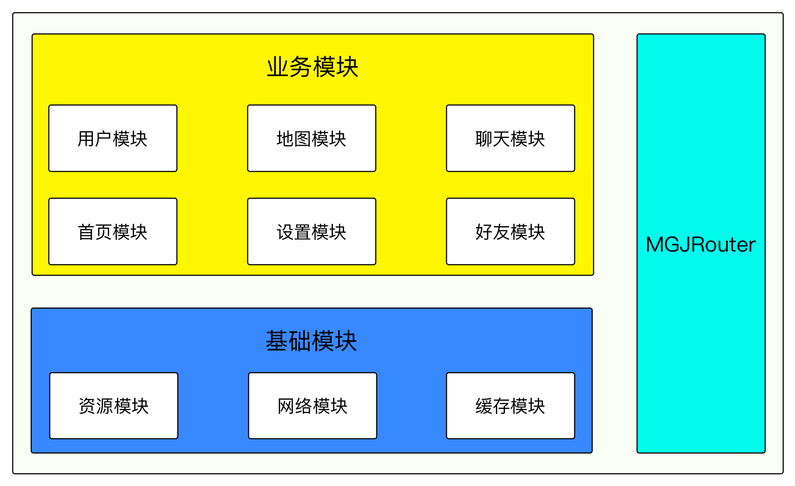  

MGJRouter组件化架构

`MGJRouter`是一个**单例对象**，在其内部维护着一个`“URL -> block”`格式的注册表，通过这个注册表来**保存服务方注册的`block`**，以及**使调用方可以通过`URL`映射出`block`**，并通过`MGJRouter`对服务方发起调用。

在服务方组件中都对外提供一个**接口类**，在**接口类**内部实现`block`的注册工作，以及`block`对外提供服务的代码实现。每一个`block`都对应着一个`URL`，调用方可以通过`URL`对`block`发起调用。

在程序开始运行时，需要将所有服务方的接口类实例化，以完成这个注册工作，使`MGJRouter`中所有服务方的`block`可以正常提供服务。在这个服务注册完成后，就可以被调用方调起并提供服务。

蘑菇街项目使用`git`作为**版本控制工具**，**将每个组件都当做一个独立工程**，并建立主项目来集成所有组件。集成方式是在主项目中通过`CocoaPods`来集成，将所有组件当做**二方库**集成到项目中。详细的集成技术点在下面`“标准组件化架构设计”`章节中会讲到。

#####MGJRouter调用

代码模拟对详情页的注册、调用，在调用过程中传递`id`参数。下面是注册的示例代码：   
    
     [MGJRouter registerURLPattern:@"mgj://detail?id=id" toHandler:^(NSDictionary *routerParameters) {
         // 下面可以在拿到参数后，为其他组件提供对应的服务
         NSString uid = routerParameters[@"id"];
     }];

通过`openURL:`方法传入的`URL`参数，对详情页已经注册的`block`方法发起调用。**调用方式类似于`GET`请求**，`URL`地址后面拼接参数。

    
    [MGJRouter openURL:@"mgj://detail?id=404"];

也可以通过字典方式传参，`MGJRouter`提供了带有字典参数的方法，这样就**可以传递非字符串之外的其他类型参数**。

   
    [MGJRouter openURL:@"mgj://detail?" withParam:@{@"id" : @"404"}];

#####组件间传值

有的时候组件间调用过程中，需要服务方在完成调用后返回相应的参数。蘑菇街提供了另外的方法，专门来完成这个操作。

    
    
     [MGJRouter registerURLPattern:@"mgj://cart/ordercount" toObjectHandler:^id(NSDictionary *routerParamters){
         return @42;
     }];

通过下面的方式发起调用，并获取服务方返回的返回值，要做的就是传递正确的`URL`和参数即可。

    
    
    NSNumber *orderCount = [MGJRouter objectForURL:@"mgj://cart/ordercount"];

#####短链管理

这时候会发现一个问题，在蘑菇街组件化架构中，**存在了很多硬编码的URL和参数**。在代码实现过程中`URL`编写出错会导致调用失败，而且参数是一个字典类型，调用方不知道服务方需要哪些参数，这些都是个问题。

对于这些数据的管理，蘑菇街开发了一个`web`页面，这个`web`页面统一来管理所有的`URL`和参数，`Android`和`iOS`都使用这一套`URL`，可以保持统一性。

#####基础组件

在项目中存在很多公共部分的东西，例如封装的网络请求、缓存、数据处理等功能，以及项目中所用到的资源文件。

蘑菇街将这些部分也当做组件，划分为基础组件，位于业务组件下层。所有业务组件都使用同一个基础组件，也可以保证公共部分的统一性。

####Protocol方案

#####整体架构

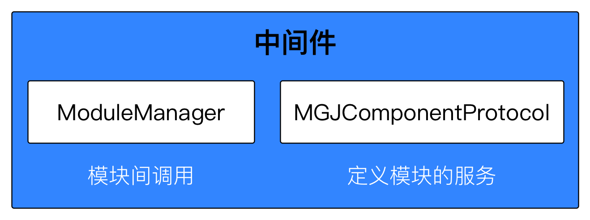  

Protocol方案的中间件

为了解决`MGJRouter`方案中**`URL`硬编码**，以及**字典参数类型不明确**等问题，蘑菇街在原有组件化方案的基础上推出了`Protocol`方案。`Protocol`方案由两部分组成，进行组件间通信的`ModuleManager`类以及`MGJComponentProtocol`协议类。

通过中间件`ModuleManager`进行消息的调用转发，在`ModuleManager`内部维护一张映射表，映射表由之前的`"URL -> block"`变成`"Protocol -> Class"`。  
在中间件中创建`MGJComponentProtocol`文件，服务方组件将可以用来调用的方法都定义在`Protocol`中，将所有服务方的`Protocol`都分别定义到`MGJComponentProtocol`文件中，如果协议比较多也可以分开几个文件定义。这样所有调用方依然是只依赖中间件，不需要依赖除中间件之外的其他组件。

`Protocol`方案中每个组件也需要一个**“接口类”**，此类负责实现当前组件对应的协议方法，也就是对外提供服务的实现。在**程序开始运行时将自身的`Class`注册到`ModuleManager`中**，并将`Protocol`反射出字符串当做`key`。这个注册过程和`MGJRouter`是类似的，都**需要提前注册服务**。

#####示例代码

创建`MGJUserImpl`类当做`User`模块的服务类，并在`MGJComponentProtocol.h`中定义`MGJUserProtocol`协议，由`MGJUserImpl`类实现协议中定义的方法，完成对外提供服务的过程。下面是协议定义：

    
    
    @protocol MGJUserProtocol <NSObject>
    - (NSString *)getUserName;
    @end

`Class`遵守协议并实现定义的方法，外界通过`Protocol`获取的`Class`实例化为对象，调用服务方实现的协议方法。

`ModuleManager`的协议注册方法，注册时将`Protocol`反射为字符串当做存储的`key`，将实现协议的`Class`当做值存储。通过`Protocol`取`Class`的时候，就是通过`Protocol`从`ModuleManager`中将`Class`映射出来。

    
    
    [ModuleManager registerClass:MGJUserImpl forProtocol:@protocol(MGJUserProtocol)];

调用时通过`Protocol`从`ModuleManager`中映射出注册的`Class`，将获取到的`Class`实例化，并调用`Class`实现的协议方
法完成服务调用。

    
    
    Class cls = [[ModuleManager sharedInstance] classForProtocol:@protocol(MGJUserProtocol)];
    id userComponent = [[cls alloc] init];
    NSString *userName = [userComponent getUserName];

####整体调用流程

蘑菇街是`OpenURL`和`Protocol`混用的方式，两种实现的调用方式不同，但大体调用逻辑和实现思路类似，所以下面的**调用流程二者差不多**。在`OpenURL`不能满足需求或调用不方便时，就可以通过`Protocol`的方式调用。

  1. 在进入程序后，先使用`MGJRouter`对服务方组件进行注册。每个`URL`对应一个`block`的实现，**`block`中的代码就是服务方对外提供的服务**，调用方可以通过`URL`调用这个服务。

  2. 调用方通过`MGJRouter`调用`openURL:`方法，并将被调用代码对应的`URL`传入，`MGJRouter`会根据`URL`查找对应的`block`实现，从而调用服务方组件的代码进行通信。

  3. 调用和注册`block`时，`block`有一个字典用来传递参数。这样的优势就是参数类型和数量理论上是不受限制的，但是需要很多硬编码的`key`名在项目中。

####内存管理

蘑菇街组件化方案有两种，`Protocol`和`MGJRouter`的方式，但都需要进行`register`操作。`Protocol`注册的是`Class`，`MGJRouter`注册的是`Block`，注册表是一个`NSMutableDictionary`类型的字典，而字典的拥有者又是一个**单例对象**，这样会造成**内存的常驻**。

下面是对两种实现方式内存消耗的分析：

  * 首先说一下`block`实现方式可能导致的内存问题，`block`如果使用不当，很容易造成循环引用的问题。  
经过暴力测试，证明并不会导致内存问题。被保存在字典中是一个`block`对象，而`block`对象本身并不会占用多少内存。在调用`block`后会对`block`体中的方法进行执行，执行完成后`block`体中的对象释放。  
而`block`自身的实现只是一个结构体，也就相当于字典中存放的是很多结构体，所以内存的占用并不是很大。

  * 对于协议这种实现方式，和`block`内存常驻方式差不多。只是将存储的`block`对象换成`Class`对象，如果不是已经实例化的对象，内存占用还是比较小的。

###casatwy组件化方案

####整体架构

**casatwy**组件化方案分为两种调用方式，**远程调用和本地调用**，对于两个不同的调用方式分别对应两个接口。

  * 远程调用通过`AppDelegate`代理方法传递到当前应用后，调用远程接口并在内部做一些处理，处理完成后会在远程接口内部调用本地接口，**以实现本地调用为远程调用服务**。

  * 本地调用由`performTarget:action:params:`方法负责，但调用方一般**不直接调用`performTarget:`方法**。`CTMediator`会对外提供明确参数和方法名的方法，在方法内部调用`performTarget:`方法和参数的转换。

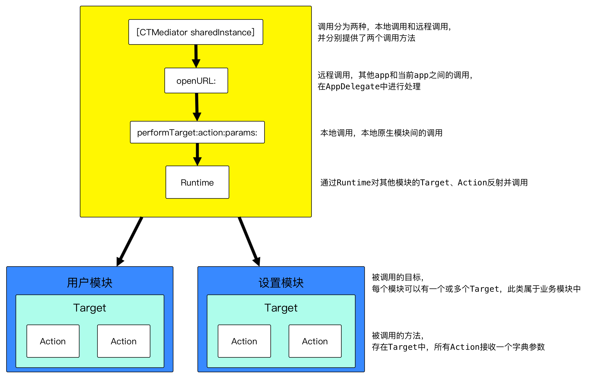  

casatwy提出的组件化架构

####架构设计思路

**casatwy**是通过`CTMediator`类实现组件化的，在此类中对外提供明确参数类型的接口，接口内部通过`performTarget`方法调用服务方组件的`Target`、`Action`。由于`CTMediator`类的调用是**通过`runtime`主动发现服务**的，所以服务方对此类是完全解耦的。

但如果`CTMediator`类对外提供的方法都放在此类中，将会对`CTMediator`造成极大的负担和代码量。解决方法就是对每个服务方组件创建一个`CTMediator`的`Category`，并将对服务方的`performTarget`调用放在对应的`Category`中，这些`Category`都属于`CTMediator`中间件，从而实现了感官上的接口分离。

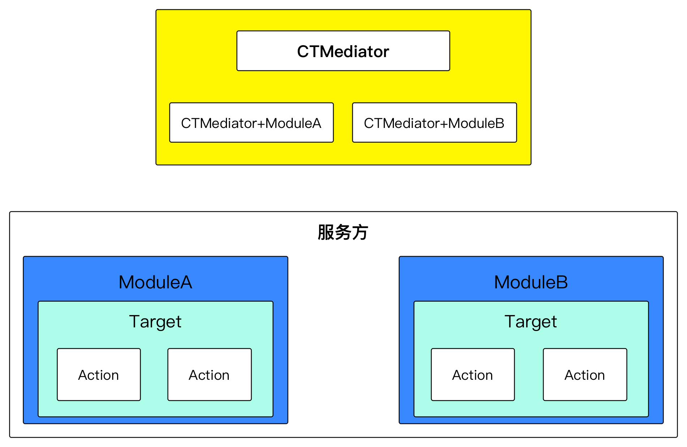  

casatwy组件化实现细节

对于服务方的组件来说，每个组件都提供一个或多个`Target`类，在`Target`类中声明`Action`方法。`Target`类是当前组件对外提供的一个**“服务类”**，`Target`将当前组件中所有的服务都定义在里面，**`CTMediator`通过`runtime`主动发现服务**。

在`Target`中的所有`Action`方法，都只有一个字典参数，所以可以传递的参数很灵活，这也是**casatwy**提出的**去`Model`化的概念**。在`Action`的方法实现中，对传进来的字典参数进行解析，再调用组件内部的类和方法。

####架构分析

**casatwy**为我们提供了一个[Demo](https://github.com/casatwy/CTMediator)，通过这个`Demo`可以很好的理解**casatwy**的设计思路，下面按照我的理解讲解一下这个`Demo`。

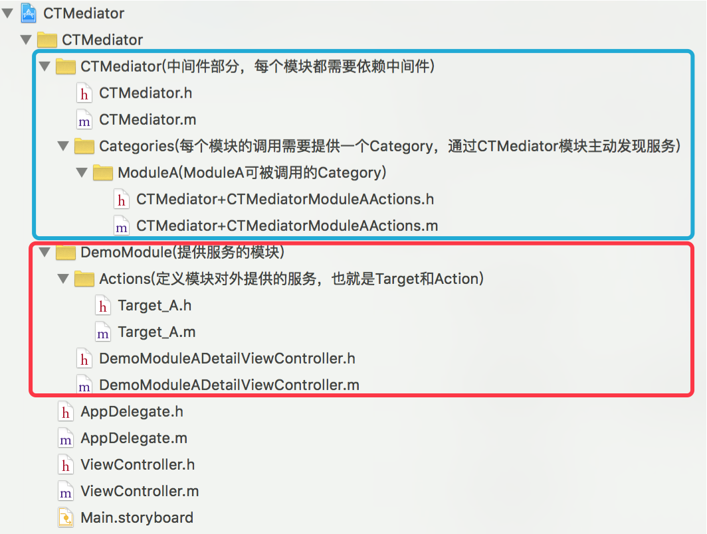  

文件目录

打开`Demo`后可以看到文件目录非常清楚，在上图中用蓝框框出来的就是中间件部分，红框框出来的就是业务组件部分。我对每个文件夹做了一个简单的注释，包含了其在
架构中的职责。

**在`CTMediator`中定义远程调用和本地调用的两个方法**，其他业务相关的调用由`Category`完成。
    
    
    // 远程App调用入口
    - (id)performActionWithUrl:(NSURL *)url completion:(void(^)(NSDictionary *info))completion;
    // 本地组件调用入口
    - (id)performTarget:(NSString *)targetName action:(NSString *)actionName params:(NSDictionary *)params;

在`CTMediator`中定义的`ModuleA`的`Category`，对外提供了一个获取控制器并跳转的功能，下面是代码实现。由于**casatwy**的方案中使用`performTarget`的方式进行调用，所以**涉及到很多硬编码字符串的问题**，**casatwy**采取定义常量字符串来解决这个问题，这样管理也更方便。

    
    
    #import "CTMediator+CTMediatorModuleAActions.h"
    NSString * const kCTMediatorTargetA = @"A";
    NSString * const kCTMediatorActionNativFetchDetailViewController = @"nativeFetchDetailViewController";
    @implementation CTMediator (CTMediatorModuleAActions)
    - (UIViewController *)CTMediator_viewControllerForDetail {
        UIViewController *viewController = [self performTarget:kCTMediatorTargetA
                                                        action:kCTMediatorActionNativFetchDetailViewController
                                                        params:@{@"key":@"value"}];
        if ([viewController isKindOfClass:[UIViewController class]]) {
            // view controller 交付出去之后，可以由外界选择是push还是present
            return viewController;
        } else {
            // 这里处理异常场景，具体如何处理取决于产品
            return [[UIViewController alloc] init];
        }
    }

下面是`ModuleA`组件中提供的服务，被定义在`Target_A`类中，这些服务可以被`CTMediator`通过`runtime`的方式调用，**这个过程就叫做发现服务**。

我们发现，在这个方法中其实做了参数处理和内部调用的功能，这样就可以保证组件内部的业务不受外部影响，**对内部业务没有侵入性**。

    
    
    - (UIViewController *)Action_nativeFetchDetailViewController:(NSDictionary *)params {
        // 对传过来的字典参数进行解析，并调用ModuleA内部的代码
        DemoModuleADetailViewController *viewController = [[DemoModuleADetailViewController alloc] init];
        viewController.valueLabel.text = params[@"key"];
        return viewController;
    }

####命名规范

在大型项目中代码量比较大，需要避免命名冲突的问题。对于这个问题**casatwy**采取的是加前缀的方式，从**casatwy**的`Demo`中也可以看出，其组件`ModuleA`的`Target`命名为`Target_A`，被调用的`Action`命名为`Action_nativeFetchDetailViewController:`。

**casatwy**将类和方法的命名，**都统一按照其功能做区分当做前缀**，这样很好的将组件相关和组件内部代码进行了划分。

###标准组件化架构设计

这个章节叫做**“标准组件化架构设计”**，对于项目架构来说**并没有绝对意义的标准之说**。这里说到的**“标准组件化架构设计”**只是因为采取这样的方式
的人比较多，且这种方式相比而言较合理。

在上面文章中提到了**casatwy**方案的`CTMediator`，蘑菇街方案的`MGJRouter`和`ModuleManager`，下面统称为中间件。

####整体架构

组件化架构中，首先有一个主工程，主工程负责集成所有组件。**每个组件都是一个单独的工程**，创建不同的`git`私有仓库来管理，每个组件都有对应的开发人员负
责开发。开发人员只需要关注与其相关组件的代码，其他业务代码和其无关，来新人也好上手。

组件的划分需要注意组件粒度，粒度根据业务可大可小。组件划分后属于业务组件，对于一些多个组件共同的东西，例如网络、数据库之类的，应该划分到单独的组件或基础组件中。对于图片或配置表这样的资源文件，应该再单独划分一个资源组件，这样避免资源的重复性。

服务方组件对外提供服务，**由中间件调用或发现服务**，**服务对当前组件无侵入性**，只负责对传递过来的数据进行解析和组件内调用的功能。需要被其他组件调用
的组件都是服务方，服务方也可以调用其他组件的服务。

通过这样的组件划分，组件的开发进度不会受其他业务的影响，**可以多个组件单独的并行开发**。组件间的通信都交给中间件来进行，需要通信的类只需要接触中间件，而
中间件不需要耦合其他组件，这就实现了组件间的解耦。**中间件负责处理所有组件之间的调度**，在所有组件之间起到控制核心的作用。

这套框架清晰的划分了不同组件，从整体架构上来约束开发人员进行组件化开发，避免某个开发人员偷懒直接引用头文件，产生组件间的耦合，破坏整体架构。假设以后某个业务发生大的改变，需要对相关代码进行重构，可以在单个组件进行重构。组件化架构降低了重构的风险，保证了代码的健壮性。

####组件集成

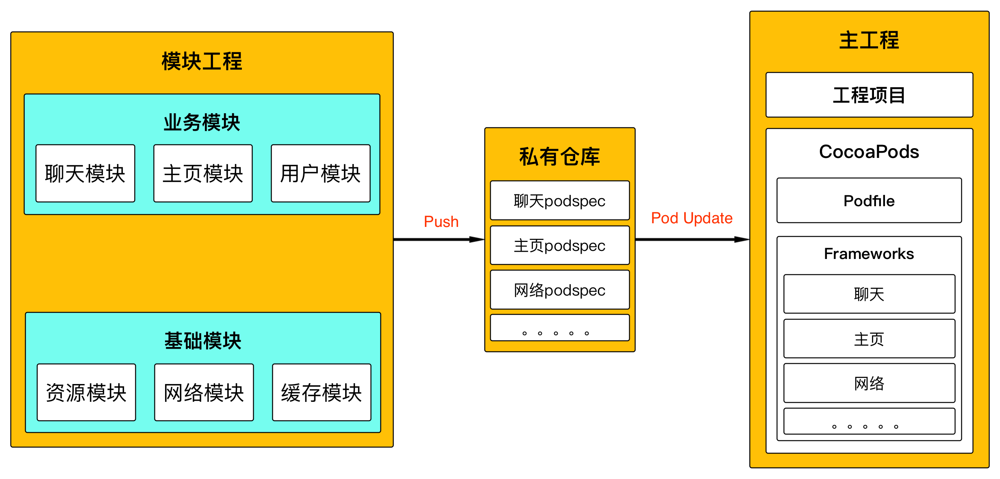  

组件化架构图

每个组件都是一个单独的工程，在组件开发完成后上传到`git`仓库。主工程通过`Cocoapods`集成各个组件，集成和更新组件时只需要`pod update`即可。这样就是把每个组件当做第三方来管理，管理起来非常方便。

`Cocoapods`可以控制每个组件的版本，例如**在主项目中回滚某个组件到特定版本**，就可以通过修改`podfile`文件实现。选择`Cocoapods`主要因为其本身功能很强大，可以很方便的集成整个项目，**也有利于代码的复用**。通过这种集成方式，可以很好的避免在传统项目中代码冲突的问题。

####集成方式

对于组件化架构的集成方式，我在看完**bang**的博客后专门请教了一下**bang**。根据在微博上和**bang**的聊天以及其他博客中的学习，在主项目中集成组件主要分为两种方式——**源码和`framework`**，但都是通过`CocoaPods`来集成。  
无论是用`CocoaPods`管理源码，还是直接管理`framework`，效果都是一样的，都是可以直接进行`pod update`之类的操作的。

这两种组件集成方案，实践中也是各有利弊。直接在主工程中集成代码文件，**可以在主工程中进行调试**。集成`framework`的方式，**可以加快编译速度**，而且**对每个组件的代码有很好的保密性**。如果公司对代码安全比较看重，可以考虑`framework`的形式，但`framework`不利于主工程中的调试。

例如**手机QQ**或者**支付宝**这样的大型程序，一般都会采取`framework`的形式。而且一般这样的大公司，**都会有自己的组件库**，这个组件库往往可以代表一个大的功能或业务组件，直接添加项目中就可以使用。关于组件化库在后面讲淘宝组件化架构的时候会提到。

######不推荐的集成方式

之前有些项目是直接用`workspace`的方式集成的，或者直接在原有项目中建立子项目，直接做文件引用。但这两点都是不建议做的，因为**没有真正意义上实现业务组件的剥离**，只是像之前的项目一样从文件目录结构上进行了划分。

###组件化开发总结

对于项目架构来说，**一定要建立于业务之上来设计架构**。不同的项目业务不同，组件化方案的设计也会不同，应该设计最适合公司业务的架构。

####架构对比

在除蘑菇街`Protocol`方案外，其他两种方案都或多或少的**存在硬编码问题**，硬编码如果量比较大的话挺麻烦的。  
在**casatwy**的`CTMediator`方案中需要硬编码`Target`、`Action`字符串，只不过**这个缺陷被封闭在中间件里面了**，将这些字符串都统一定义为常量，外界使用不需要接触到硬编码。蘑菇街的`MGJRouter`的方案也是一样的，也有硬编码`URL`的问题，蘑菇街可能也做了类似的处理。

**casatwy**和蘑菇街提出的两套组件化方案，大体结构是类似的，三套方案都分为**调用方**、**中间件**、**服务方**，只是在具体实现过程中有些不同。例如`Protocol`方案在中间件中加入了`Protocol`文件，**casatwy**的方案在中间件中加入了`Category`。  
三种方案内部都有容错处理，所以三种方案的稳定性都是比较好的，而且都可以拿出来单独运行，在服务方不存在的情况下也不会有问题。

在三套方案中，服务方都对外提供一个供外界调用的接口类，这个类中实现组件对外提供的服务，中间件通过接口类来实现组件间的通信。**在此类中统一定义对外提供的服务**，外界调用时就知道服务方可以做什么。

调用流程也不大一样，**蘑菇街的两套方案都需要注册操作**，无论是`Block`还是`Protocol`都需要注册后才可以提供服务。而**casatwy**的方案则不需要，直接通过`runtime`调用。**casatwy**的方案实现了**真正的对服务方解耦**，而蘑菇街的两套方案则没有，对服务方和调用方都造成了耦合。

我认为三套方案中，`Protocol`方案是调用和维护最麻烦的一套方案。维护时需要同时维护`Protocol`、接口类两部分。而且调用时需要将服务方的接口类返回给调用方，并由调用方执行一系列调用逻辑，调用一个服务的逻辑非常复杂，这在开发中是非常影响开发效率的。

####总结

#######下面是组件化开发中的一个小总结，也是开发过程中的一些注意点。

  * 在`MGJRouter`方案中，是通过调用`OpenURL:`方法并传入`URL`来发起调用。鉴于`URL`协议名等固定格式，可以通过判断协议名的方式，**使用配置表控制`H5`和`native`的切换**，**配置表可以从后台更新**，只需要将协议名更改一下即可。

> `mgj://detail?id=123456`  
`http://www.mogujie.com/detail?id=123456`

假设现在线上的`native`组件出现严重`bug`，**在后台将配置文件中原有的本地`URL`换成`H5`的`URL`**，**并更新客户端配置文件**。
在调用`MGJRouter`时传入这个`H5`的`URL`即可完成切换，`MGJRouter`判断如果传进来的是一个`H5`的`URL`就直接跳转`webView`。而且`URL`可以传递参数给`MGJRouter`，只需要`MGJRouter`内部做参数截取即可。

  * **casatwy**方案和蘑菇街`Protocol`方案，都提供了传递明确类型参数的方法。在`MGJRouter`方案中，传递参数主要是通过类似`GET`请求一样在`URL`后面拼接参数，和在字典中传递参数两种方式组成。这两种方式**会造成传递参数类型不明确**，传递参数类型受限(`GET`请求不能传递对象)等问题，后来使用`Protocol`方案弥补这个问题。

  * 组件化开发可以很好的提升代码复用性，组件可以直接拿到其他项目中使用，这个优点在下面淘宝架构中会着重讲一下。

  * 对于调试工作，应该放在每个组件中完成。**单独的业务组件可以直接提交给测试提测**，这样测试起来也比较方便。最后组件开发完成并测试通过后，再将所有组件更新到主项目，提交给测试进行集成测试即可。

  * 使用组件化架构开发，组件间的通信都是有成本的。所以尽量将业务封装在组件内部，对外只提供简单的接口。**即“高内聚、低耦合”原则**。

  * 把握好划分粒度的细化程度，太细则项目过于分散，太大则项目组件臃肿。但是项目都是从小到大的一个发展过程，所以不断进行重构是掌握这个组件的细化程度最好的方式。

###我公司架构

下面就简单说说我公司项目架构，公司项目是一个地图导航应用，业务层之下的基础组件占比较大。且基础组件相对比较独立，对外提供了很多调用接口。刚开始想的是采用`MGJRouter`的方案，但如果这些调用都通过`Router`进行，开发起来比较复杂，反而会适得其反。最主要我们项目也并不是非常大，没必要都用`Router`转发。

对于这个问题，公司项目的架构设计是：**层级架构+组件化架构**，组件化架构处于层级架构的最上层，也就是业务层。采取这种结构混合的方式进行整体架构，这个对于
公共组件的管理和层级划分比较有利，符合公司业务需求。

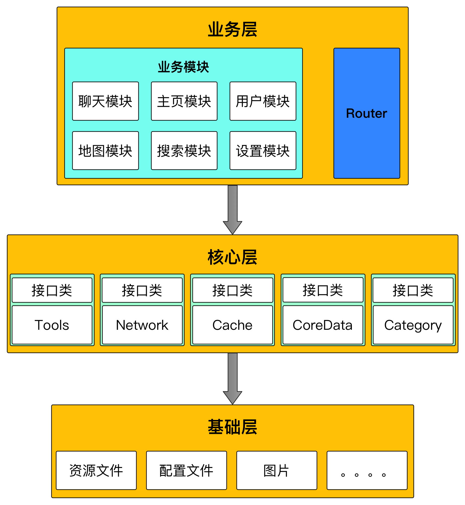  

公司组件化架构

对于业务层级依然采用组件化架构的设计，这样可以充分利用组件化架构的优势，对项目组件间进行解耦。在上层和下层的调用中，下层的功能组件应该对外开放一个接口类，在接口类中声明所有的服务，实现上层调用当前组件的一个中转，上层直接调用接口类。这样做的好处在于，如果**下层发生改变不会对上层造成影响**，而且也省去了部分`Router`转发的工作。

在设计层级架构时，**需要注意只能上层对下层依赖**，**下层对上层不能有依赖**，**下层中不要包含上层业务逻辑**。对于项目中存在的公共资源和代码，应该
将其下沉到下层中。

####为什么这么做？

首先就像我刚才说的，我公司项目并不是很大，根本没必要拆分的那么彻底。

因为组件化开发有一个很重要的原因就是解耦合，如果我做到了底层不对上层依赖，**这样就已经解除了上下层的相互耦合**。而且上层对下层进行调用的时候，也不是直接
调用下层，通过一个接口类进行中转，实现了**下层的改变对上层无影响**，这也是上层对下层解耦的表现。

所以对于第三方就不用说了，上层直接调用下层的第三方也是没问题的，这都是解耦的。

####模型类怎么办，放在哪合适？

**casatwy**对模型类的观点是**去Model化**，简单来说就是用字典代替`Model`存储数据。这对于组件化架构来说，是解决组件之间数据传递的一个很好的方法。

因为模型类是关乎业务的，理论上必须放在业务层也就是业务组件这一层。但是要把模型对象从一个组件中当做参数传递到另一个组件中，**模型类放在调用方和服务方的哪个组件都不太合适**，而且有可能不只两个组件使用到这个模型对象。这样的话在其他组件使用模型对象，**必然会造成引用和耦合**。

那么如果把模型类放在`Router`中，这样会造成`Router`耦合了业务，**造成业务的侵入性**。如果在用到这个模型对象的所有组件中，都分别维护一份相同的模型类，这样之后业务发生改变模型类就会很麻烦。

######那应该怎么办呢？

如果将模型类单独拉出来，定义一个模型组件呢？这个看起来比较可行，将这个定义模型的组件下沉到下层，模型组件不包含业务，只声明模型对象的类。但是一般组件的模型对象都是当前组件内使用的，将模型对象传递给其他组件的需求非常少，**那所有的模型类都定义到模型组件吗**？

对于这个问题，我建议在项目开发中将模型类还定义在当前业务组件中，**在组件间传递模型对象时进行去Model化**，传递字典类型的参数。  
上面只是思考，恰巧我公司持久化方案用的是`CoreData`，所有模型的定义都在`CoreData`组件中，这样就避免了业务层组件之间因为模型类的耦合。

###滴滴组件化架构

之前看过滴滴`iOS`负责人李贤辉的[技术分享](http://mp.weixin.qq.com/s?__biz=MzA3ODg4MDk0Ng==&mid=402854111&idx=1&sn=5876e615fabd6d921285d904e16670fb&scene=1&srcid=031694opQo3vCeGvWF5Gu62l#rd)，分享的是滴滴`iOS`客户端的架构发展历程，下面简单总结一下。

####发展历程

滴滴在最开始的时候架构较混乱。然后在**2.0**时期重构为`MVC`架构，使项目划分更加清晰。在**3.0**时期上线了新的业务线，**这时采用的游戏开发中的状态机机制**，暂时可以满足现有业务。

然而在后期不断上线顺风车、代驾、巴士等多条业务线的情况下，**现有架构变得非常臃肿**，**代码耦合严重**。从而在2015年开始了代号为`“The One”`的方案，这套方案就是滴滴的组件化方案。

####架构设计

滴滴的组件化方案，和蘑菇街方案类似，也是通过私有`CocoaPods`来管理各个组件。**将整个项目拆分为业务部分和技术部分**，业务部分包括专车、拼车、巴士等业务模块，每个业务模块就是一个单独的组件，使用一个`pods`管理。技术部分则分为登录分享、网络、缓存这样的一些基础组件，分别使用不同的`pods`管理。

组件间通信通过`ONERouter`中间件进行通信，`ONERouter`类似于`MGJRouter`，**担负起协调和调用各个组件的作用**。组件间通信通
过`OpenURL`方法，来进行对应的调用。`ONERouter`内部保存一份`Class-URL`的映射表，通过`URL`找到`Class`并发起调用，`Class`的注册放在`+load`方法中进行。

滴滴在组件内部的业务模块中，**模块内部使用`MVVM+MVCS`混合架构**，**两种架构都是`MVC`的衍生版本**。其中`MVCS`中的`Store`负责数据相关逻辑，例如订单状态、地址管理等数据处理。通过`MVVM`中的`VM`给控制器瘦身，最后`Controller`的代码量就很少了。

####滴滴首页分析

滴滴文章中说道**首页只能有一个地图实例**，这在很多地图导航相关应用中都是这样做的。滴滴首页主控制器持有导航栏和地图，每个业务线首页控制器都添加在主控制器
上，并且业务线控制器背景都设置为透明，**将透明部分响应事件传递到下面的地图中**，只响应属于自己的响应事件。

由主控制器来切换各个业务线首页，**切换页面后根据不同的业务线来更新地图数据**。

###淘宝组件化架构

本章节源自于宗心在阿里技术沙龙上的一次[分享](https://yq.aliyun.com/articles/129)

####架构发展

淘宝`iOS`客户端初期是单工程的普通项目，但随着业务的飞速发展，现有架构并不能承载越来越多的业务需求，导致代码间耦合很严重。后期开发团队对其不断进行重构，
淘宝`iOS`和`Android`两个平台，除了某个平台特有的一些特性或某些方案不便实施之外，大体架构都是差不多的。

#######发展历程：

  1. 刚开始是普通的单工程项目，以传统的`MVC`架构进行开发。随着业务不断的增加，导致项目非常臃肿、耦合严重。

  2. **2013**年淘宝开启**"all in 无线"计划**，计划将淘宝变为一个大的平台，将阿里系大多数业务都集成到这个平台上，**造成了业务的大爆发**。  
淘宝开始实行插件化架构，将每个业务模块划分为一个组件，**将组件以`framework`二方库的形式集成到主工程**。但这种方式并没有做到真正的拆分，还是在一个工程中使用`git`进行`merge`，这样还会造成合并冲突、不好回退等问题。

  3. **迎来淘宝移动端有史以来最大的重构**，将其重构为组件化架构。将每个模块当做一个组件，每个组件都是一个单独的项目，并且将组件打包成`framework`。主工程通过`podfile`集成所有组件`framework`，实现业务之间真正的隔离，通过`CocoaPods`实现组件化架构。

####架构优势

淘宝是使用`git`来做源码管理的，**在插件化架构时需要尽可能避免`merge`操作**，否则在大团队中协作成本是很大的。而使用`CocoaPods`进行组件化开发，则避免了这个问题。

在`CocoaPods`中可以通过`podfile`很好的配置各个组件，包括组件的增加和删除，**以及控制某个组件的版本**。使用`CocoaPods`的原因，很大程度是为了解决大型项目中，代码管理工具`merge`代码导致的冲突。并且可以通过配置`podfile`文件，轻松配置项目。

每个组件工程有两个`target`，**一个负责编译当前组件和运行调试**，**另一个负责打包`framework`**。先在组件工程做测试，测试完成后再集成到主工程中集成测试。

**每个组件都是一个独立`app`**，可以独立开发、测试，使得业务组件更加独立，**所有组件可以并行开发**。下层为上层提供能满足需求的底层库，保证上层业务层可以正常开发，并将底层库封装成`framework`集成到项目中。

使用`CocoaPods`进行组件集成的好处在于，在集成测试自己组件时，**可以直接将本地主工程`podfile`文件中的当前组件指向本地**，就可以直接进行集成测试，不需要提交到服务器仓库。

####淘宝四层架构

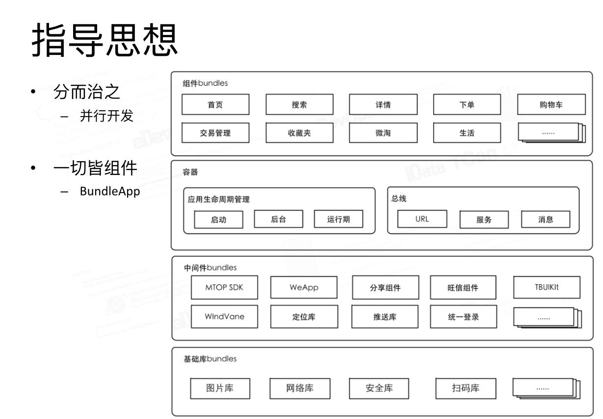  

淘宝四层架构(图片来自淘宝技术分享)

**淘宝架构的核心思想是一切皆组件**，将工程中所有代码都抽象为组件。

**淘宝架构主要分为四层**，最上层是**组件`Bundle`**(业务组件)，依次往下是**容器**(核心层)，**中间件`Bundle`**(功能封装)，**基础库`Bundle`**(底层库)。容器层为整个架构的核心，负责组件间的调度和消息派发。

####总线设计

总线设计：**`URL`路由+服务+消息**。统一所有组件的通信标准，各个业务间通过总线进行通信。

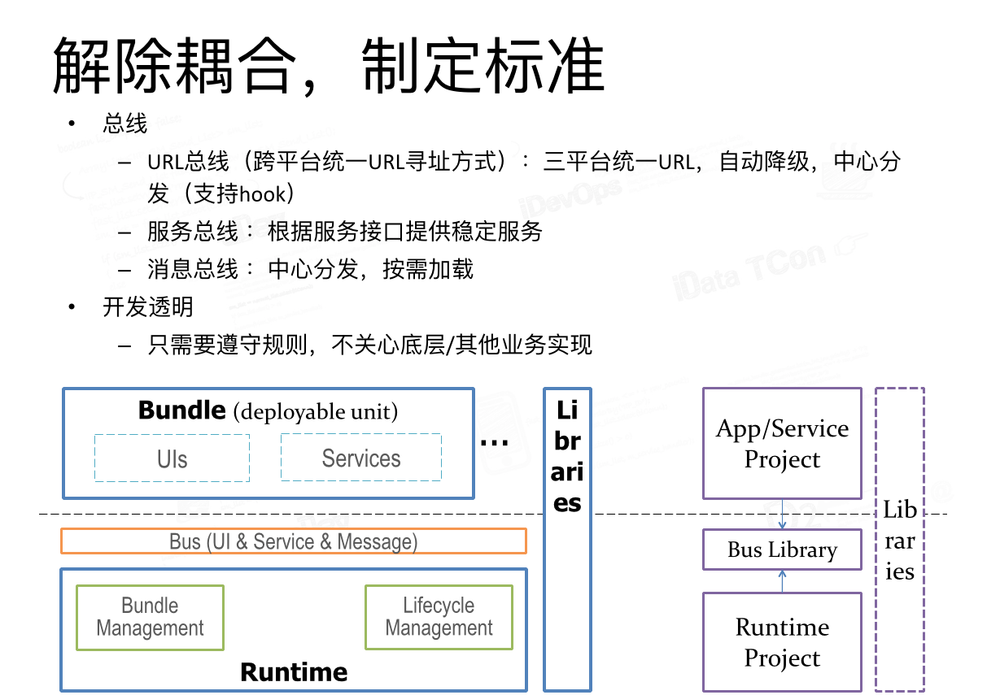  

总线设计(图片来自淘宝技术分享)

`URL`可以请求也可以接受返回值，和`MGJRouter`差不多。`URL`路由请求可以被解析就直接拿来使用，**如果不能被解析就跳转`H5`页面**。这样就完成了一个**对不存在组件调用的兼容**，使用户手中比较老的版本依然可以显示新的组件。

服务提供一些公共服务，由服务方组件负责实现，通过`Protocol`实现。消息负责统一发送消息，类似于通知也需要注册。

####Bundle App

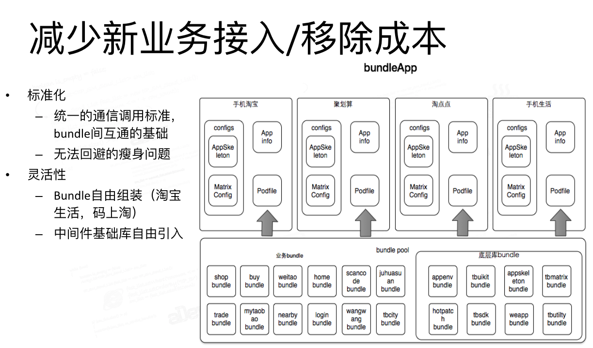  

Bundle App(图片来自淘宝技术分享)

淘宝提出`Bundle App`的概念，可以通过已有组件，**进行简单配置后就可以组成一个新的`app`出来**。解决了多个应用业务复用的问题，防止重复开发同一业务或功能。

**`Bundle`即`App`**，**容器即`OS`**，所有`Bundle App`被集成到`OS`上，使每个组件的开发就像`app`开发一样简单。这样就做到了从巨型`app`回归普通`app`的轻盈，使大型项目的开发问题彻底得到了解决。

###总结

######留个小思考

到目前为止组件化架构文章就写完了，文章确实挺长的，看到这里真是辛苦你了😁。下面留个小思考，**把下面字符串复制到微信输入框随便发给一个好友**，然后点击下
面链接**大概也能猜到微信的组件化方案**。
    
    
    weixin://dl/profile

######总结

各位可以来我博客评论区讨论，可以讨论文中提到的技术细节，也可以讨论自己公司架构所遇到的问题，或自己独到的见解等等。无论是不是架构师或新入行的iOS开发，欢迎各位以一个讨论技术的心态来讨论。在评论区你的问题可以被其他人看到，这样可能会给其他人带来一些启发。

[本人博客地址](http://www.jianshu.com/users/2de707c93dc4/latest_articles)

现在`H5`技术比较火，好多应用都用`H5`来完成一些页面的开发，**`H5`的跨平台和实时更新等是非常大的优点**，**但其性能和交互也是缺点**。如果以
后客户端能够发展到可以动态部署线上代码，不用打包上线应用市场，直接就可以做到原生应用更新，这样就可以解决原生应用最大的痛点。这段时间公司项目比较忙，有时间我
打算研究一下这个技术点😄。

`Demo`地址：蘑菇街和`casatwy`组件化方案，其`Github`上都给出了`Demo`，这里就贴出其`Github`地址了。

[蘑菇街-MGJRouter](https://github.com/mogujie/MGJRouter)  
[casatwy-CTMediator](https://github.com/casatwy/CTMediator)

* * *

好多朋友在看完这篇文章后，都问有没有`Demo`。**其实架构是思想上的东西，重点还是理解架构思想**。文章中对思想的概述已经很全面了，用多个项目的例子来描
述组件化架构。就算提供了`Demo`，也没法把`Demo`套在其他工程上用，因为并不一定适合所在的工程。

后来想了一下，我把组件化架构的集成方式，简单写了个`Demo`，这样可以解决很多人在架构集成上的问题。我把`Demo`放在我[Github](https://github.com/DeveloperErenLiu)上了，用[Coding](https://coding.net)的服务器来模拟我公司私有服务器，直接拿`MGJRouter`来当`Demo`工程中的`Router`。下面是`Demo`地址，**麻烦各位记得点个start**😁。

[组件化架构集成Demo](https://github.com/DeveloperErenLiu/ComponentArchitecture)
