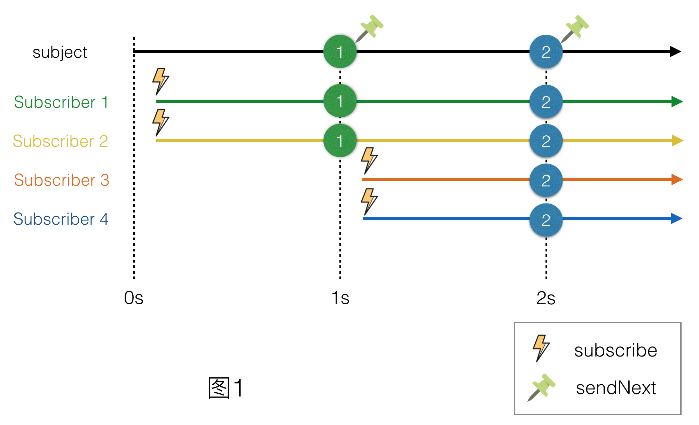
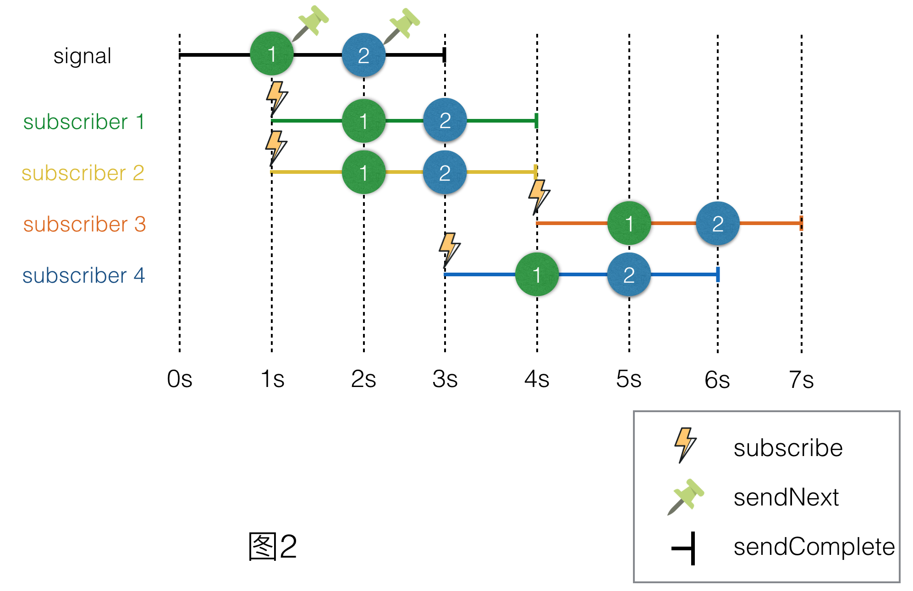
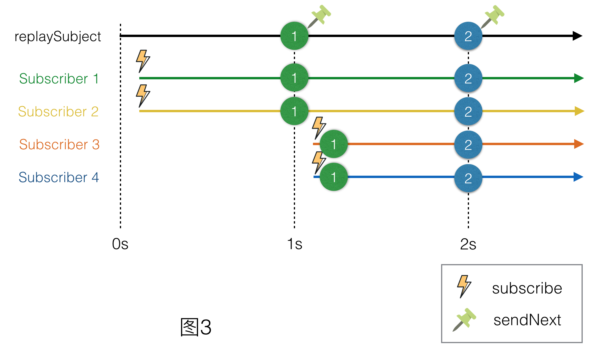
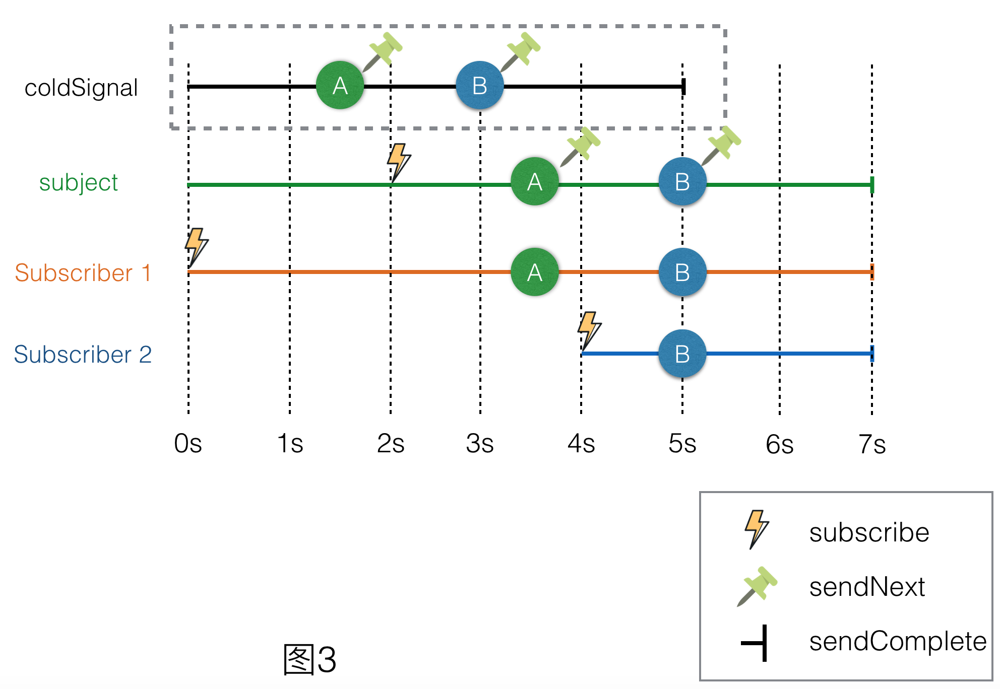

 
<!--BEGIN_DATA
{
    "create_date": "2016-08-19 19:54", 
    "modify_date": "2016-08-19 19:54", 
    "is_top": "0", 
    "summary": "细说ReactiveCocoa的冷信号与热信号", 
    "tags": "iOS", 
    "file_name": "细说ReactiveCocoa的冷信号与热信号.md"
}
END_DATA-->

####<p>原文出处：<a href='http://tech.meituan.com/talk-about-reactivecocoas-cold-signal-and-hot-signal-part-1.html' target='blank'>细说ReactiveCocoa的冷信号与热信号（一）</a></p>


##细说ReactiveCocoa的冷信号与热信号（一）


###背景

[ReactiveCocoa](http://www.github.com/ReactiveCocoa/ReactiveCocoa)（简称RAC）是最初由GitHub团队开发的一套基于Cocoa的FRP框架。FRP即Functional Reactive Programming（函数式响应式编程），其优点是用随时间改变的函数表示用户输入，这样就不需要可变状态了。我们之前的文章[“RACSignal的Subscription深入分析”](http://tech.meituan.com/RACSignalSubscription.html)里曾经详细讲解过RAC核心概念之一RACSignal的实现原理。在美团客户端中，我们大量使用了这个框架。冷信号与热信号的概念很容易混淆并造成一定的问题。鉴于这个问题具有一定普遍性，我将用一系列文章讲解RAC中冷信号与热信号的相关知识点，希望可以加深大家的理解。本文是系列文章的第一篇。

p.s. 以下代码和示例基于[ReactiveCocoa v2.5](https://github.com/ReactiveCocoa/ReactiveCocoa/releases/tag/v2.5)。

###什么是冷信号与热信号

冷热信号的概念源于.NET框架[Reactive Extensions(RX)](https://msdn.microsoft.com/en-us/library/hh242985.aspx)中的Hot Observable和Cold Observable，两者的区别是：

>   1. Hot Observable是主动的，尽管你并没有订阅事件，但是它会时刻推送，就像鼠标移动；而Cold
Observable是被动的，只有当你订阅的时候，它才会发布消息。
>
>   2. Hot Observable可以有多个订阅者，是一对多，集合可以与订阅者共享信息；而Cold
Observable只能一对一，当有不同的订阅者，消息是重新完整发送。

这里面的Observables可以理解为RACSignal。为了加深理解，我们来看这样的几组代码：

    
    
        RACSignal *signal = [RACSignal createSignal:^RACDisposable *(id<RACSubscriber> subscriber) {
            [subscriber sendNext:@1];
            [subscriber sendNext:@2];
            [subscriber sendNext:@3];
            [subscriber sendCompleted];
            return nil;
        }];
        NSLog(@"Signal was created.");
        [[RACScheduler mainThreadScheduler] afterDelay:0.1 schedule:^{
            [signal subscribeNext:^(id x) {
                NSLog(@"Subscriber 1 recveive: %@", x);
            }];
        }];
        [[RACScheduler mainThreadScheduler] afterDelay:1 schedule:^{
            [signal subscribeNext:^(id x) {
                NSLog(@"Subscriber 2 recveive: %@", x);
            }];
        }];
    

以上简单地创建了一个信号，并且依次发送@1，@2，@3作为值。下面分别有两个订阅者在不同的时间段进行了订阅，运行的结果如下：

    
    
    2015-08-11 18:33:21.681 RACDemos[6505:1125196] Signal was created.
    2015-08-11 18:33:21.793 RACDemos[6505:1125196] Subscriber 1 recveive: 1
    2015-08-11 18:33:21.793 RACDemos[6505:1125196] Subscriber 1 recveive: 2
    2015-08-11 18:33:21.793 RACDemos[6505:1125196] Subscriber 1 recveive: 3
    2015-08-11 18:33:22.683 RACDemos[6505:1125196] Subscriber 2 recveive: 1
    2015-08-11 18:33:22.683 RACDemos[6505:1125196] Subscriber 2 recveive: 2
    2015-08-11 18:33:22.683 RACDemos[6505:1125196] Subscriber 2 recveive: 3
    

我们可以看到，信号在18:33:21.681时被创建，18:33:21.793依次接到1、2、3三个值，而在18:33:22.683再依次接到1、2、3三个值。说明了变量名为`signal`的这个信号，在两个不同时间段的订阅过程中，分别完整地发送了所有的消息。

我们再对这段代码进行一个小的改动：

    
    
        RACMulticastConnection *connection = [[RACSignal createSignal:^RACDisposable *(id<RACSubscriber> subscriber) {
            [[RACScheduler mainThreadScheduler] afterDelay:1 schedule:^{
                [subscriber sendNext:@1];
            }];
            [[RACScheduler mainThreadScheduler] afterDelay:2 schedule:^{
                [subscriber sendNext:@2];
            }];
            [[RACScheduler mainThreadScheduler] afterDelay:3 schedule:^{
                [subscriber sendNext:@3];
            }];
            [[RACScheduler mainThreadScheduler] afterDelay:4 schedule:^{
                [subscriber sendCompleted];
            }];
            return nil;
        }] publish];
        [connection connect];
        RACSignal *signal = connection.signal;
        NSLog(@"Signal was created.");
        [[RACScheduler mainThreadScheduler] afterDelay:1.1 schedule:^{
            [signal subscribeNext:^(id x) {
                NSLog(@"Subscriber 1 recveive: %@", x);
            }];
        }];
        [[RACScheduler mainThreadScheduler] afterDelay:2.1 schedule:^{
            [signal subscribeNext:^(id x) {
                NSLog(@"Subscriber 2 recveive: %@", x);
            }];
        }];
    

稍微有些复杂，我们来一一分析：

  * 创建了一个信号，在1秒、2秒、3秒分别发送1、2、3这三个值，4秒发送结束信号。
  * 对这个信号调用publish方法得到一个RACMulticastConnection。
  * 让connection进行连接操作。
  * 获得connection的信号。
  * 分别在1.1秒和2.1秒订阅获得的信号。

抛开RACMulticastConnection是个什么东东，我们先来看下结果：

    
    
    2015-08-12 11:07:49.943 RACDemos[9418:1186344] Signal was created.
    2015-08-12 11:07:52.088 RACDemos[9418:1186344] Subscriber 1 recveive: 2
    2015-08-12 11:07:53.044 RACDemos[9418:1186344] Subscriber 1 recveive: 3
    2015-08-12 11:07:53.044 RACDemos[9418:1186344] Subscriber 2 recveive: 3
    

首先告诉大家`\- [RACSignal publish]`、`\- [RACMulticastConnection connect]`、`\-[RACMulticastConnection signal]`这几个操作生成了一个热信号。  
我们再来关注下输出结果的一些细节：

  * 信号在11:07:49.943被创建
  * 11:07:52.088时订阅者1才收到2这个值，说明1这个值没有接收到，时间间隔是2秒多
  * 11:07:53.044时订阅者1和订阅者2同时收到3这个值，时间间隔是3秒多

参考一开始的Hot Observables的论述和两段小程序的输出结果，我们可以确定冷热信号的如下特点：

  1. **热信号是主动的，即使你没有订阅事件，它仍然会时刻推送。**如第二个例子，信号在50秒被创建，51秒的时候1这个值就推送出来了，但是当时还没有订阅者。**而冷信号是被动的，只有当你订阅的时候，它才会发送消息。**如第一个例子。
  2. **热信号可以有多个订阅者，是一对多，信号可以与订阅者共享信息。**如第二个例子，订阅者1和订阅者2是共享的，他们都能在同一时间接收到3这个值。**而冷信号只能一对一，当有不同的订阅者，消息会从新完整发送。**如第一个例子，我们可以观察到两个订阅者没有联系，都是基于各自的订阅时间开始接收消息的。

好的，至此我们知道了什么是冷信号与热信号，了解了它们的特点。下一篇文章我们来看看为什么要区分冷信号与热信号。


<hr>


 
####<p>原文出处：<a href='http://tech.meituan.com/talk-about-reactivecocoas-cold-signal-and-hot-signal-part-2.html' target='blank'>细说ReactiveCocoa的冷信号与热信号（二）：为什么要区分冷热信号</a></p>


##细说ReactiveCocoa的冷信号与热信号（二）：为什么要区分冷热信号

William Zang ·2015-09-28 14:00

[前一篇文章](http://tech.meituan.com/talk-about-reactivecocoas-cold-signal-and-hot-signal-part-1.html)我们介绍了冷信号与热信号的概念，可能有同学会问了，为什么RAC要搞得如此复杂呢，只用一种信号不就行了么？要解释这个问题，需要绕一些圈子。

前面可能比较难懂，如果不能很好理解，请仔细阅读相关文档。

最前面提到了RAC是一套基于Cocoa的FRP框架，那就来说说FRP吧。FRP的全称是Functional Reactive Programming，中文译作函数式响应式编程，是RP（Reactive Programm，响应式编程）的FP（Functional Programming，函数式编程）实现。说起来很拗口。太多的细节不多讨论，我们着重关注下FRP的FP特征。

FP有个很重要的概念是和我们的主题相关的，那就是纯函数。

[纯函数](https://en.wikipedia.org/wiki/Pure_function)就是返回值只由输入值决定、而且没有可见[副作用](https://en.wikipedia.org/wiki/Side_effect_%28computer_science%29)的函数或者表达式。这和数学中的函数是一样的，比如：

> f(x) = 5x + 1

这个函数在调用的过程中除了返回值以外的没有任何对外界的影响，除了入参x以外也不受任何其他外界因素的影响。

那么副作用都有哪些呢？我来列举以下几个情况：

  * 函数的处理过程中，修改了外部的变量，例如全局变量。一个特殊点的例子，就是如果把OC的一个方法看做一个函数，所有的成员变量的赋值都是对外部变量的修改。是的，从FP的角度看OOP是充满副作用的。
  * 函数的处理过程中，触发了一些额外的动作，例如发送了一个全局的Notification，在console里面输出了一行信息，保存了文件，触发了网络，更新了屏幕等。
  * 函数的处理过程中，受到外部变量的影响，例如全局变量，方法里面用到的成员变量。注意block中捕获的外部变量也算副作用。
  * 函数的处理过程中，受到线程锁的影响算副作用。

由此我们可以看出，在目前的iOS编程中，我们是很难摆脱副作用的。甚至可以这么说，我们iOS编程的目的其实就是产生各种副作用。（基于用户触摸的外界因素，最终反馈到网络变化和屏幕变化上。）

接下来我们来分析副作用与冷热信号的关系。既然iOS编程中少不了副作用，那么RAC在实际的使用中也不可避免地要接触副作用。下面通过一个业务场景，来看看冷信号中副作用的坑：

    
    
        self.sessionManager = [[AFHTTPSessionManager alloc] initWithBaseURL:[NSURL URLWithString:@"http://api.xxxx.com"]];
        self.sessionManager.requestSerializer = [AFJSONRequestSerializer serializer];
        self.sessionManager.responseSerializer = [AFJSONResponseSerializer serializer];
        @weakify(self)
        RACSignal *fetchData = [RACSignal createSignal:^RACDisposable *(id<RACSubscriber> subscriber) {
            @strongify(self)
            NSURLSessionDataTask *task = [self.sessionManager GET:@"fetchData" parameters:@{@"someParameter": @"someValue"} success:^(NSURLSessionDataTask *task, id responseObject) {
                [subscriber sendNext:responseObject];
                [subscriber sendCompleted];
            } failure:^(NSURLSessionDataTask *task, NSError *error) {
                [subscriber sendError:error];
            }];
            return [RACDisposable disposableWithBlock:^{
                if (task.state != NSURLSessionTaskStateCompleted) {
                    [task cancel];
                }
            }];
        }];
        RACSignal *title = [fetchData flattenMap:^RACSignal *(NSDictionary *value) {
            if ([value[@"title"] isKindOfClass:[NSString class]]) {
                return [RACSignal return:value[@"title"]];
            } else {
                return [RACSignal error:[NSError errorWithDomain:@"some error" code:400 userInfo:@{@"originData": value}]];
            }
        }];
        RACSignal *desc = [fetchData flattenMap:^RACSignal *(NSDictionary *value) {
            if ([value[@"desc"] isKindOfClass:[NSString class]]) {
                return [RACSignal return:value[@"desc"]];
            } else {
                return [RACSignal error:[NSError errorWithDomain:@"some error" code:400 userInfo:@{@"originData": value}]];
            }
        }];
        RACSignal *renderedDesc = [desc flattenMap:^RACStream *(NSString *value) {
            NSError *error = nil;
            RenderManager *renderManager = [[RenderManager alloc] init];
            NSAttributedString *rendered = [renderManager renderText:value error:&error];
            if (error) {
                return [RACSignal error:error];
            } else {
                return [RACSignal return:rendered];
            }
        }];
        RAC(self.someLablel, text) = [[title catchTo:[RACSignal return:@"Error"]]  startWith:@"Loading..."];
        RAC(self.originTextView, text) = [[desc catchTo:[RACSignal return:@"Error"]] startWith:@"Loading..."];
        RAC(self.renderedTextView, attributedText) = [[renderedDesc catchTo:[RACSignal return:[[NSAttributedString alloc] initWithString:@"Error"]]] startWith:[[NSAttributedString alloc] initWithString:@"Loading..."]];
        [[RACSignal merge:@[title, desc, renderedDesc]] subscribeError:^(NSError *error) {
            UIAlertView *alertView = [[UIAlertView alloc] initWithTitle:@"Error" message:error.domain delegate:nil cancelButtonTitle:@"OK" otherButtonTitles:nil];
            [alertView show];
        }];
    

不知道大家有没有被这么一大段的代码吓到，我想要表达的是，在真正的工程中，我们的业务逻辑是很复杂的，而一些坑就隐藏在如此看似复杂但是又很合理的代码之下。所以我尽量模拟了一些需求，使得代码看起来更丰富。下面我们还是来仔细看下这段代码的逻辑吧：

  1. 创建了一个`AFHTTPSessionManager`用来做网络接口的数据获取。
  2. 创建了一个名为`fetchData`的信号来通过网络获取信息。
  3. 创建一个名为`title`的信号从获取的`data`中取得`title`字段，如果没有该字段则反馈一个错误。
  4. 创建一个名为`desc`的信号从获取的`data`中取得`desc`字段，如果没有该字段则反馈一个错误。
  5. 针对`desc`这个信号做一个渲染，得到一个名为`renderedDesc`的新信号，该信号会在渲染失败的时候反馈一个错误。
  6. 把`title`信号所有的错误转换为字符串`@"Error"`并且在没有获取值之前以字符串`@"Loading..."`占位，之后与`self.someLablel`的`text`属性绑定。
  7. 把`desc`信号所有的错误转换为字符串`@"Error"`并且在没有获取值之前以字符串`@"Loading..."`占位，之后与`self.originTextView`的`text`属性绑定。
  8. 把`renderedDesc`信号所有的错误转换为属性字符串`@"Error"`并且在没有获取值之前以属性字符串`@"Loading..."`占位，之后与`self.renderedTextView`的`text`属性绑定。
  9. 订阅`title`、`desc`、`renderedDesc`这三个信号的任何错误，并且弹出`UIAlertView`。

这些代码体现了RAC的一些优势，例如良好的错误处理和各种链式处理。很不错，对不对？但是很遗憾的告诉大家，这段代码其实有很严重的错误。

如果你去尝试运行这段代码，并且打开Charles查看，你会惊奇的发现，这个网络请求发送了6次。没错，是6次请求。我们也可以想象到类似的代码存在其他副作用的问题，重新刷新了6次屏幕，写入6次文件，发了6个全局通知。

下面来分析，为什么是6次网络请求呢？首先根据上面的知识，可以推断出名为`fetchData`信号是一个冷信号。那么这个信号在订阅的时候就会执行里面的过程。那这个信号是在什么时候被订阅了呢？仔细回看了代码，我们发现并没有订阅这个信号，只是调用这个信号的`flattenMap`产生了两个新的信号。

**这里有一个很重要的概念，就是任何的信号转换即是对原有的信号进行订阅从而产生新的信号。**由此我们可以写出flattenMap的伪代码如下：
    
    
    - (instancetype)flattenMap_:(RACStream * (^)(id value))block {
    {
        return [RACSignal createSignal:^RACDisposable *(id<RACSubscriber> subscriber) {
           return [self subscribeNext:^(id x) {
               RACSignal *signal = (RACSignal *)block(x);
               [signal subscribeNext:^(id x) {
                   [subscriber sendNext:x];
               } error:^(NSError *error) {
                   [subscriber sendError:error];
               } completed:^{
                   [subscriber sendCompleted];
               }];
           } error:^(NSError *error) {
               [subscriber sendError:error];
           } completed:^{
               [subscriber sendCompleted];
           }];
        }];
    }
    

除了没有高度复用和缺少一些disposable的处理以外，上述代码大致可以比较直观地说明flattenMap的机制。观察会发现其实是在调用这个方法的时候，生成了一个新的信号，并在这个新信号的执行过程中对`self`进行的了**订阅**。还需要注意一个细节，就是这个返回信号在未来订阅的时候，才会间接的订阅`self`。后续的`startWith`、`catchTo`等都可以这样理解。

回到我们的问题，那就是说，在`fetchData`被`flattenMap`之后，它就会因为名为`title`和`desc`信号的订阅而订阅。而后续对`desc`也会进行`flattenMap`，得到了`renderedDesc`，因此未来`renderedDesc`被订阅的时候，`fetchData`也会被间接订阅。这就解释了，为什么后续我们用`RAC`宏进行绑定的时候，`fetchData`会订阅**3次**。由于`fetchData`是冷信号，所以3次订阅意味着它的过程被执行了3次，也就是有3次网络请求。

另外的3次订阅来自`RACSignal`类的`merge`方法。根据上述的描述，我们也可以猜测`merge`方法也一定是创建了一个新的信号，在这个信号被订阅的时候，把它包含的所有信号订阅。所以我们又得到了额外的3次网络请求。

由此可以看到，不熟悉冷热信号对业务造成的影响。我们可以想象对用户流量的影响，对服务器负载的影响，对统计的影响，如果这是一个点赞的接口，会不会造成多次点赞？后果不堪设想啊。而这些都可以通过将`fetchData`转换为热信号来解决。

接下来也许你会问，如果我的整个计算过程中都没有副作用，是否就不会有这个问题？答案是肯定的。试想下刚才那段代码如果没有网络请求，换成一些标准化的计算会怎样。虽然可以肯定它不会出现bug，但是不要忽视其中的运算也会执行多次。纯函数还有一个概念就是[引用透明](https://en.wikipedia.org/wiki/Referential_transparency_%28computer_science%29)。在纯函数式语言（例如[Haskell](https://www.haskell.org)）中对此可以进行一定的优化，**也就是说纯函数的调用在相同参数下的返回值第二次不需要计算**，所以在纯函数式语言里面的FRP并没有冷信号的担忧。然而Objective-C语言中并没有这种纯函数优化，因此有大规模运算的冷信号对性能是有一定影响的。

从上文内容可以看出，如果我们想更好地掌握RAC这个框架，区分冷信号与热信号是十分重要的。接下来的系列第三篇文章，我会揭示冷信号与热信号的本质，帮助大家正确的理解冷信号与热信号。


<hr>


####<p>原文出处：<a href='http://tech.meituan.com/talk-about-reactivecocoas-cold-signal-and-hot-signal-part-3.html' target='blank'>细说ReactiveCocoa的冷信号与热信号（三）：怎么处理冷信号与热信号</a></p>

##细说ReactiveCocoa的冷信号与热信号（三）：怎么处理冷信号与热信号

William Zang ·2015-11-03 14:00

[第一篇文章](http://tech.meituan.com/talk-about-reactivecocoas-cold-signal-and-hot-
signal-part-1.html)中我们介绍了冷信号与热信号的概念，[前一篇文章](http:/tech.meituan.com/talk-about-reactivecocoas-cold-signal-and-hot-signal-part-2.html)我们也讨论了为什么要区分冷信号与热信号，下面我会先为大家揭晓热信号的本质，再给出冷信号转换成热信号的方法。

###揭示热信号的本质

在[ReactiveCocoa](http://www.github.com/ReactiveCocoa/ReactiveCocoa)中，究竟什么才是热信号呢？冷信号是比较常见的，`map`一下就会得到一个冷信号。但在RAC中，好像并没有“hot signal”这个单独的说法。原来在RAC的世界中，所有的热信号都属于一个类——`RACSubject`。接下来我们来看看究竟它为什么这么“神奇”。

在RAC2.5文档的[框架概述](https://github.com/ReactiveCocoa/ReactiveCocoa/blob/v2.5/Docu
mentation/FrameworkOverview.md#subjects)中，有着这样一段描述：

> A subject, represented by the RACSubject class, is a signal that can be
manually controlled.
>
> Subjects can be thought of as the "mutable" variant of a signal, much like
NSMutableArray is for NSArray. They are extremely useful for bridging non-RAC
code into the world of signals.
>
> For example, instead of handling application logic in block callbacks, the
blocks can simply send events to a shared subject instead. The subject can
then be returned as a RACSignal, hiding the implementation detail of the
callbacks.
>
> Some subjects offer additional behaviors as well. In particular,
RACReplaySubject can be used to buffer events for future subscribers, like
when a network request finishes before anything is ready to handle the result.

从这段描述中，我们可以发现Subject具备如下三个特点：

  1. Subject是“可变”的。
  2. Subject是非RAC到RAC的一个桥梁。
  3. Subject可以附加行为，例如`RACReplaySubject`具备为未来订阅者缓冲事件的能力。

从第三个特点来看，Subject具备为未来订阅者缓冲事件的能力，那也就说明它是自身是有状态的。根据上文的介绍，Subject是符合热信号的特点的。为了验证它，我们再来做个简单实验：

    
    
        RACSubject *subject = [RACSubject subject];
        RACSubject *replaySubject = [RACReplaySubject subject];
        [[RACScheduler mainThreadScheduler] afterDelay:0.1 schedule:^{
            // Subscriber 1
            [subject subscribeNext:^(id x) {
                NSLog(@"Subscriber 1 get a next value: %@ from subject", x);
            }];
            [replaySubject subscribeNext:^(id x) {
                NSLog(@"Subscriber 1 get a next value: %@ from replay subject", x);
            }];
            // Subscriber 2
            [subject subscribeNext:^(id x) {
                NSLog(@"Subscriber 2 get a next value: %@ from subject", x);
            }];
            [replaySubject subscribeNext:^(id x) {
                NSLog(@"Subscriber 2 get a next value: %@ from replay subject", x);
            }];
        }];
        [[RACScheduler mainThreadScheduler] afterDelay:1 schedule:^{
            [subject sendNext:@"send package 1"];
            [replaySubject sendNext:@"send package 1"];
        }];
        [[RACScheduler mainThreadScheduler] afterDelay:1.1 schedule:^{
            // Subscriber 3
            [subject subscribeNext:^(id x) {
                NSLog(@"Subscriber 3 get a next value: %@ from subject", x);
            }];
            [replaySubject subscribeNext:^(id x) {
                NSLog(@"Subscriber 3 get a next value: %@ from replay subject", x);
            }];
            // Subscriber 4
            [subject subscribeNext:^(id x) {
                NSLog(@"Subscriber 4 get a next value: %@ from subject", x);
            }];
            [replaySubject subscribeNext:^(id x) {
                NSLog(@"Subscriber 4 get a next value: %@ from replay subject", x);
            }];
        }];
        [[RACScheduler mainThreadScheduler] afterDelay:2 schedule:^{
            [subject sendNext:@"send package 2"];
            [replaySubject sendNext:@"send package 2"];
        }];
    

按照时间线来解读一下上述代码：

  1. 0s时创建`subject`与`replaySubject`这两个subject。
  2. 0.1s时`Subscriber 1`分别订阅了`subject`与`replaySubject`。
  3. 0.1s时`Subscriber 2`也分别订阅了`subject`与`replaySubject`。
  4. 1s时分别向`subject`与`replaySubject`发送了`"send package 1"`这个字符串作为**值**。
  5. 1.1s时`Subscriber 3`分别订阅了`subject`与`replaySubject`。
  6. 1.1s时`Subscriber 4`也分别订阅了`subject`与`replaySubject`。
  7. 2s时再分别向`subject`与`replaySubject`发送了`"send package 2"`这个字符串作为**值**。

接下来看一下输出的结果：

    
    
    2015-09-28 13:35:22.855 RACDemos[13646:1269269] Start
    2015-09-28 13:35:23.856 RACDemos[13646:1269269] Subscriber 1 get a next value: send package 1 from subject
    2015-09-28 13:35:23.856 RACDemos[13646:1269269] Subscriber 2 get a next value: send package 1 from subject
    2015-09-28 13:35:23.857 RACDemos[13646:1269269] Subscriber 1 get a next value: send package 1 from replay subject
    2015-09-28 13:35:23.857 RACDemos[13646:1269269] Subscriber 2 get a next value: send package 1 from replay subject
    2015-09-28 13:35:24.059 RACDemos[13646:1269269] Subscriber 3 get a next value: send package 1 from replay subject
    2015-09-28 13:35:24.059 RACDemos[13646:1269269] Subscriber 4 get a next value: send package 1 from replay subject
    2015-09-28 13:35:25.039 RACDemos[13646:1269269] Subscriber 1 get a next value: send package 2 from subject
    2015-09-28 13:35:25.039 RACDemos[13646:1269269] Subscriber 2 get a next value: send package 2 from subject
    2015-09-28 13:35:25.039 RACDemos[13646:1269269] Subscriber 3 get a next value: send package 2 from subject
    2015-09-28 13:35:25.040 RACDemos[13646:1269269] Subscriber 4 get a next value: send package 2 from subject
    2015-09-28 13:35:25.040 RACDemos[13646:1269269] Subscriber 1 get a next value: send package 2 from replay subject
    2015-09-28 13:35:25.040 RACDemos[13646:1269269] Subscriber 2 get a next value: send package 2 from replay subject
    2015-09-28 13:35:25.040 RACDemos[13646:1269269] Subscriber 3 get a next value: send package 2 from replay subject
    2015-09-28 13:35:25.040 RACDemos[13646:1269269] Subscriber 4 get a next value: send package 2 from replay subject
    

结合结果可以分析出如下内容：

  1. 22.855s时，测试启动，`subject`与`replaySubject`创建完毕。
  2. 23.856s时，距离启动大约1s后，`Subscriber 1`和`Subscriber 2`**同时**从`subject`接收到了`"send package 1"`这个值。
  3. 23.857s时，也是距离启动大约1s后，`Subscriber 1`和`Subscriber 2`**同时**从`replaySubject`接收到了`"send package 1"`这个值。
  4. 24.059s时，距离启动大约1.2s后，`Subscriber 3`和`Subscriber 4`**同时**从`replaySubject`接收到了`"send package 1"`这个值。**注意`Subscriber 3`和`Subscriber 4`并没有从`subject`接收`"send package 1"`这个值。**
  5. 25.039s时，距离启动大约2.1s后，`Subscriber 1`、`Subscriber 2`、`Subscriber 3`、`Subscriber 4`**同时**从`subject`接收到了`"send package 2"`这个值。
  6. 25.040s时，距离启动大约2.1s后，`Subscriber 1`、`Subscriber 2`、`Subscriber 3`、`Subscriber 4`**同时**从`replaySubject`接收到了`"send package 2"`这个值。

只关注`subject`，根据时间线，我们可以得到下图：



经过观察不难发现，4个订阅者实际上是共享`subject`的，一旦这个`subject`发送了值，当前的订阅者就会同时接收到。由于`Subscriber
3`与`Subscriber 4`的订阅时间稍晚，所以错过了第一次值的发送。这与冷信号是截然不同的反应。冷信号的图类似下图：



对比上面两张图，是不是可以发现，`subject`类似“直播”，错过了就不再处理。而`signal`类似“点播”，每次订阅都会从头开始。所以我们有理由认定`
subject`天然就是热信号。

下面再来看看`replaySubject`，根据时间线，我们能得到另一张图：



将图3与图1对比会发现，`Subscriber 3`与`Subscriber 4`在订阅后马上接收到了“历史值”。对于`Subscriber3`和`Subscriber 4`来说，它们只关心“历史的值”而不关心“历史的时间线”，因为实际上`1`与`2`是间隔1s发送的，但是它们接收到的显然不是。举个生动的例子，就好像科幻电影里面主人公穿越时间线后会先把所有的回忆快速闪过再来到现实一样。（见《X战警：逆转未来》、《蝴蝶效应》）所以我们也有理由认定`replaySubject`天然也是热信号。

看到这里，我们终于揭开了热信号的面纱，结论就是：

  1. `RACSubject`及其子类是**热信号**。
  2. `RACSignal`排除`RACSubject`类以外的是**冷信号**。

###如何将一个冷信号转化成热信号——广播

冷信号与热信号的本质区别在于是否保持状态，冷信号的多次订阅是不保持状态的，而热信号的多次订阅可以保持状态。所以一种将冷信号转换为热信号的方法就是，将冷信号订阅，订阅到的每一个时间通过`RACSbuject`发送出去，其他订阅者只订阅这个`RACSubject`。

观察下面的代码：

    
    
        RACSignal *coldSignal = [RACSignal createSignal:^RACDisposable *(id<RACSubscriber> subscriber) {
            NSLog(@"Cold signal be subscribed.");
            [[RACScheduler mainThreadScheduler] afterDelay:1.5 schedule:^{
                [subscriber sendNext:@"A"];
            }];
            [[RACScheduler mainThreadScheduler] afterDelay:3 schedule:^{
                [subscriber sendNext:@"B"];
            }];
            [[RACScheduler mainThreadScheduler] afterDelay:5 schedule:^{
                [subscriber sendCompleted];
            }];
            return nil;
        }];
        RACSubject *subject = [RACSubject subject];
        NSLog(@"Subject created.");
        [[RACScheduler mainThreadScheduler] afterDelay:2 schedule:^{
            [coldSignal subscribe:subject];
        }];
        [subject subscribeNext:^(id x) {
            NSLog(@"Subscriber 1 recieve value:%@.", x);
        }];
        [[RACScheduler mainThreadScheduler] afterDelay:4 schedule:^{
            [subject subscribeNext:^(id x) {
                NSLog(@"Subscriber 2 recieve value:%@.", x);
            }];
    

执行顺序是这样的：

  1. 创建一个冷信号：`coldSignal`。该信号声明了“订阅后1.5秒发送‘A’，3秒发送'B'，5秒发送完成事件”。
  2. 创建一个RACSubject：`subject`。
  3. 在2秒后使用这个`subject`订阅`coldSignal`。
  4. 立即订阅这个`subject`。
  5. 4秒后订阅这个`subject`。

如果所料不错的话，通过订阅这个`subject`并不会引起`coldSignal`重复执行block的内容。我们来看下结果：

    
    
    2015-09-28 19:36:45.703 RACDemos[14110:1556061] Subject created.
    2015-09-28 19:36:47.705 RACDemos[14110:1556061] Cold signal be subscribed.
    2015-09-28 19:36:49.331 RACDemos[14110:1556061] Subscriber 1 recieve value:A.
    2015-09-28 19:36:50.999 RACDemos[14110:1556061] Subscriber 1 recieve value:B.
    2015-09-28 19:36:50.999 RACDemos[14110:1556061] Subscriber 2 recieve value:B.
    

参考时间线，会得到下图：  


不难发现其中的几个重点：

  1. `subject`是从一开始就创建好的，等到2s后便开始订阅`coldSignal`。
  2. `Subscriber 1`是`subject`创建后就开始订阅的，但是第一个接收时间与`subject`接收`coldSignal`第一个值的时间是一样的。
  3. `Subscriber 2`是`subject`创建4s后开始订阅的，所以只能接收到第二个值。

通过观察可以确定，`subject`就是`coldSignal`转化的热信号。所以使用`RACSubject`来将冷信号转化为热信号是可行的。

当然，使用这种`RACSubject`来订阅冷信号得到热信号的方式仍有一些小的瑕疵。例如`subject`的订阅者提前终止了订阅，而`subject`并不能终止对`coldSignal`的订阅。（`RACDisposable`是一个比较大的话题，我计划在其他的文章中详细阐述它，也希望感兴趣的同学自己来理解。）所以在RAC库中对于冷信号转化成热信号有如下标准的封装：

    
    
    - (RACMulticastConnection *)publish;
    - (RACMulticastConnection *)multicast:(RACSubject *)subject;
    - (RACSignal *)replay;
    - (RACSignal *)replayLast;
    - (RACSignal *)replayLazily;
    

这5个方法中，最为重要的就是`\- (RACMulticastConnection *)multicast:(RACSubject
*)subject;`这个方法了，其他几个方法也是间接调用它的。我们来看看它的实现：

    
    
    /// implementation RACSignal (Operations)
    - (RACMulticastConnection *)multicast:(RACSubject *)subject {
        [subject setNameWithFormat:@"[%@] -multicast: %@", self.name, subject.name];
        RACMulticastConnection *connection = [[RACMulticastConnection alloc] initWithSourceSignal:self subject:subject];
        return connection;
    }
    /// implementation RACMulticastConnection
    - (id)initWithSourceSignal:(RACSignal *)source subject:(RACSubject *)subject {
        NSCParameterAssert(source != nil);
        NSCParameterAssert(subject != nil);
        self = [super init];
        if (self == nil) return nil;
        _sourceSignal = source;
        _serialDisposable = [[RACSerialDisposable alloc] init];
        _signal = subject;
        return self;
    }
    #pragma mark Connecting
    - (RACDisposable *)connect {
        BOOL shouldConnect = OSAtomicCompareAndSwap32Barrier(0, 1, &_hasConnected);
        if (shouldConnect) {
            self.serialDisposable.disposable = [self.sourceSignal subscribe:_signal];
        }
        return self.serialDisposable;
    }
    - (RACSignal *)autoconnect {
        __block volatile int32_t subscriberCount = 0;
        return [[RACSignal
            createSignal:^(id<RACSubscriber> subscriber) {
                OSAtomicIncrement32Barrier(&subscriberCount);
                RACDisposable *subscriptionDisposable = [self.signal subscribe:subscriber];
                RACDisposable *connectionDisposable = [self connect];
                return [RACDisposable disposableWithBlock:^{
                    [subscriptionDisposable dispose];
                    if (OSAtomicDecrement32Barrier(&subscriberCount) == 0) {
                        [connectionDisposable dispose];
                    }
                }];
            }]
            setNameWithFormat:@"[%@] -autoconnect", self.signal.name];
    }
    

虽然代码比较短但不是很好懂，大概来说明一下：

  1. 当`RACSignal`类的实例调用`\- (RACMulticastConnection *)multicast:(RACSubject *)subject`时，以`self`和`subject`作为构造参数创建一个`RACMulticastConnection`实例。
  2. `RACMulticastConnection`构造的时候，保存`source`和`subject`作为成员变量，创建一个`RACSerialDisposable`对象，用于取消订阅。
  3. 当`RACMulticastConnection`类的实例调用`\- (RACDisposable *)connect`这个方法的时候，判断是否是第一次。如果是的话**用`_signal`这个成员变量来订阅`sourceSignal`之后返回`self.serialDisposable`**；否则直接返回`self.serialDisposable`。这里面订阅`sourceSignal`是重点。
  4. `RACMulticastConnection`的`signal`只读属性，就是一个热信号，订阅这个热信号就避免了各种副作用的问题。它会在`\- (RACDisposable *)connect`第一次调用后，根据`sourceSignal`的订阅结果来传递事件。
  5. 想要确保第一次订阅就能成功订阅`sourceSignal`，可以使用`\- (RACSignal *)autoconnect`这个方法，它保证了第一个订阅者触发`sourceSignal`的订阅，也保证了当返回的信号所有订阅者都关闭连接后`sourceSignal`被正确关闭连接。

由于RAC是一个线程安全的框架，所以好奇的同学可以了解下“OSAtomic*”这一系列的原子操作。抛开这些应该不难理解上述代码。

了解源码之后，这个方法的正确使用就清楚了，应该像这样：

    
    
        RACSignal *coldSignal = [RACSignal createSignal:^RACDisposable *(id<RACSubscriber> subscriber) {
            NSLog(@"Cold signal be subscribed.");
            [[RACScheduler mainThreadScheduler] afterDelay:1.5 schedule:^{
                [subscriber sendNext:@"A"];
            }];
            [[RACScheduler mainThreadScheduler] afterDelay:3 schedule:^{
                [subscriber sendNext:@"B"];
            }];
            [[RACScheduler mainThreadScheduler] afterDelay:5 schedule:^{
                [subscriber sendCompleted];
            }];
            return nil;
        }];
        RACSubject *subject = [RACSubject subject];
        NSLog(@"Subject created.");
        RACMulticastConnection *multicastConnection = [coldSignal multicast:subject];
        RACSignal *hotSignal = multicastConnection.signal;
        [[RACScheduler mainThreadScheduler] afterDelay:2 schedule:^{
            [multicastConnection connect];
        }];
        [hotSignal subscribeNext:^(id x) {
            NSLog(@"Subscribe 1 recieve value:%@.", x);
        }];
        [[RACScheduler mainThreadScheduler] afterDelay:4 schedule:^{
            [hotSignal subscribeNext:^(id x) {
                NSLog(@"Subscribe 2 recieve value:%@.", x);
            }];
        }];
    

或者这样：

    
    
        RACSignal *coldSignal = [RACSignal createSignal:^RACDisposable *(id<RACSubscriber> subscriber) {
            NSLog(@"Cold signal be subscribed.");
            [[RACScheduler mainThreadScheduler] afterDelay:1.5 schedule:^{
                [subscriber sendNext:@"A"];
            }];
            [[RACScheduler mainThreadScheduler] afterDelay:3 schedule:^{
                [subscriber sendNext:@"B"];
            }];
            [[RACScheduler mainThreadScheduler] afterDelay:5 schedule:^{
                [subscriber sendCompleted];
            }];
            return nil;
        }];
        RACSubject *subject = [RACSubject subject];
        NSLog(@"Subject created.");
        RACMulticastConnection *multicastConnection = [coldSignal multicast:subject];
        RACSignal *hotSignal = multicastConnection.autoconnect;
        [[RACScheduler mainThreadScheduler] afterDelay:2 schedule:^{
            [hotSignal subscribeNext:^(id x) {
                NSLog(@"Subscribe 1 recieve value:%@.", x);
            }];
        }];
        [[RACScheduler mainThreadScheduler] afterDelay:4 schedule:^{
            [hotSignal subscribeNext:^(id x) {
                NSLog(@"Subscribe 2 recieve value:%@.", x);
            }];
        }];
    

以上的两种写法和之前用Subject来传递的例子都可以得到相同的结果。

下面再来看看其他几个方法的实现：

    
    
    /// implementation RACSignal (Operations)
    - (RACMulticastConnection *)publish {
        RACSubject *subject = [[RACSubject subject] setNameWithFormat:@"[%@] -publish", self.name];
        RACMulticastConnection *connection = [self multicast:subject];
        return connection;
    }
    - (RACSignal *)replay {
        RACReplaySubject *subject = [[RACReplaySubject subject] setNameWithFormat:@"[%@] -replay", self.name];
        RACMulticastConnection *connection = [self multicast:subject];
        [connection connect];
        return connection.signal;
    }
    - (RACSignal *)replayLast {
        RACReplaySubject *subject = [[RACReplaySubject replaySubjectWithCapacity:1] setNameWithFormat:@"[%@] -replayLast", self.name];
        RACMulticastConnection *connection = [self multicast:subject];
        [connection connect];
        return connection.signal;
    }
    - (RACSignal *)replayLazily {
        RACMulticastConnection *connection = [self multicast:[RACReplaySubject subject]];
        return [[RACSignal
            defer:^{
                [connection connect];
                return connection.signal;
            }]
            setNameWithFormat:@"[%@] -replayLazily", self.name];
    }
    

这几个方法的实现都相当简单，只是为了简化而封装，具体说明一下：

  1. `\- (RACMulticastConnection *)publish`就是帮忙创建了`RACSubject`。
  2. `\- (RACSignal *)replay`就是用`RACReplaySubject`来作为`subject`，并立即执行`connect`操作，返回`connection.signal`。其作用是上面提到的`replay`功能，即后来的订阅者可以收到历史值。
  3. `\- (RACSignal *)replayLast`就是用`Capacity`为1的`RACReplaySubject`来替换`\- (RACSignal *)replay`的`subject。其作用是使后来订阅者只收到最后的历史值。
  4. `\- (RACSignal *)replayLazily`和`\- (RACSignal *)replay`的区别就是`replayLazily`会在第一次订阅的时候才订阅`sourceSignal`。

所以，其实本质仍然是

> 使用一个Subject来订阅原始信号，并让其他订阅者订阅这个Subject，这个Subject就是热信号。

现在再回过来看下之前[系列文章第二篇](http://tech.meituan.com/talk-about-reactivecocoas-cold-signal-and-hot-signal-part-2.html)中那个业务场景的例子，其实修改的方法很简单，就是在网络获取的`fetchData`这个信号后面，增加一个`replayLazily`变换，就不会出现网络请求重发6次的问题了。

修改后的代码如下，大家可以试试：

    
    
        self.sessionManager = [[AFHTTPSessionManager alloc] initWithBaseURL:[NSURL URLWithString:@"http://api.xxxx.com"]];
        self.sessionManager.requestSerializer = [AFJSONRequestSerializer serializer];
        self.sessionManager.responseSerializer = [AFJSONResponseSerializer serializer];
        @weakify(self)
        RACSignal *fetchData = [[RACSignal createSignal:^RACDisposable *(id<RACSubscriber> subscriber) {
            @strongify(self)
            NSURLSessionDataTask *task = [self.sessionManager GET:@"fetchData" parameters:@{@"someParameter": @"someValue"} success:^(NSURLSessionDataTask *task, id responseObject) {
                [subscriber sendNext:responseObject];
                [subscriber sendCompleted];
            } failure:^(NSURLSessionDataTask *task, NSError *error) {
                [subscriber sendError:error];
            }];
            return [RACDisposable disposableWithBlock:^{
                if (task.state != NSURLSessionTaskStateCompleted) {
                    [task cancel];
                }
            }];
        }] replayLazily];  // modify here!!
        RACSignal *title = [fetchData flattenMap:^RACSignal *(NSDictionary *value) {
            if ([value[@"title"] isKindOfClass:[NSString class]]) {
                return [RACSignal return:value[@"title"]];
            } else {
                return [RACSignal error:[NSError errorWithDomain:@"some error" code:400 userInfo:@{@"originData": value}]];
            }
        }];
        RACSignal *desc = [fetchData flattenMap:^RACSignal *(NSDictionary *value) {
            if ([value[@"desc"] isKindOfClass:[NSString class]]) {
                return [RACSignal return:value[@"desc"]];
            } else {
                return [RACSignal error:[NSError errorWithDomain:@"some error" code:400 userInfo:@{@"originData": value}]];
            }
        }];
        RACSignal *renderedDesc = [desc flattenMap:^RACStream *(NSString *value) {
            NSError *error = nil;
            RenderManager *renderManager = [[RenderManager alloc] init];
            NSAttributedString *rendered = [renderManager renderText:value error:&error];
            if (error) {
                return [RACSignal error:error];
            } else {
                return [RACSignal return:rendered];
            }
        }];
        RAC(self.someLablel, text) = [[title catchTo:[RACSignal return:@"Error"]]  startWith:@"Loading..."];
        RAC(self.originTextView, text) = [[desc catchTo:[RACSignal return:@"Error"]] startWith:@"Loading..."];
        RAC(self.renderedTextView, attributedText) = [[renderedDesc catchTo:[RACSignal return:[[NSAttributedString alloc] initWithString:@"Error"]]] startWith:[[NSAttributedString alloc] initWithString:@"Loading..."]];
        [[RACSignal merge:@[title, desc, renderedDesc]] subscribeError:^(NSError *error) {
            UIAlertView *alertView = [[UIAlertView alloc] initWithTitle:@"Error" message:error.domain delegate:nil cancelButtonTitle:@"OK" otherButtonTitles:nil];
            [alertView show];
        }];
    

当然，细心的同学会发现这样修改，仍然有许多计算上的浪费，例如将`fetchData`转换为`title`的block会执行多次，将`fetchData`转换为`desc`的block也会执行多次。但是由于这些block都是无副作用的，计算量并不大，可以忽略不计。如果计算量大的，也需要对中间的信号进行热信号的转换。不过请不要忽略冷热信号的转换本身也是有计算代价的。

好的，写到这里，我们终于揭开RAC中冷信号与热信号的全部面纱，也知道如何使用了。希望这个系列文章可以让大家更好地了解RAC，避免使用RAC遇到的误区。谢谢大家。


<hr>


 
<!--BEGIN_DATA
<table>
    <tr>
    <td id='create_date'>2016-08-19 20:02</td>
    <td id='modify_date'>2016-08-19 20:02</td>
    <td id='is_top'>0</td>
    <td id='summary'></td>
    <td id='tags'></td>
  </tr>
</table>
END_DATA-->

####<p>原文出处：<a href='http://tech.meituan.com/RACSignalSubscription.html' target='blank'>RACSignal的Subscription深入分析</a></p>

##RACSignal的Subscription深入分析

peiyun ·2015-06-30 12:00

[ReactiveCocoa](https://github.com/ReactiveCocoa/ReactiveCocoa)是一个FRP的思想在Objective-C中的实现框架，目前在美团的项目中被广泛使用。对于ReactiveCocoa的基本用法，网上有很多相关的资料，本文不再讨论。RACSignal是ReactiveCocoa中一个非常重要的概念，而本文主要关注RACSignal的实现原理。在阅读之前，你需要基本掌握[RAC Signal的基本用法](http://www.raywenderlich.com/62699/reactivecocoa-tutorial-pt1)

本文主要包含2个部分，前半部分主要分析RACSignal的subscription过程，后半部分是对前半部分的深入，在subscription过程的基础上分析ReactiveCocoa中比较难理解的两个操作：multicast && replay。  
PS：为了解释清楚，我们下面只讨论next，不讨论error以及completed，这二者与next类似。本文基于ReactiveCocoa 2.x版本。  

我们先刨析RACSignal的subscription过程

#RACSignal的常见用法

    
    
    -(RACSignal *)signInSignal {
    // part 1:[RACSignal createSignal]来获得signal
      return [RACSignal createSignal:^RACDisposable *(id<RACSubscriber> subscriber) {
        [self.signInService
         signInWithUsername:self.usernameTextField.text
         password:self.passwordTextField.text
         complete:^(BOOL success) {
        // part 3: 进入didSubscribe，通过[subscriber sendNext:]来执行next block
           [subscriber sendNext:@(success)];
           [subscriber sendCompleted];
         }];
        return nil;
      }];
    }
    // part 2 : [signal subscribeNext:]来获得subscriber，然后进行subscription
    [[self signInSignal] subscribeNext:^(id x) { 
        NSLog(@"Sign in result: %@", x); 
    }];
    

#Subscription过程概括  
RACSignal的Subscription过程概括起来可以分为三个步骤：

  1. [RACSignal createSignal]来获得signal
  2. [signal subscribeNext:]来获得subscriber，然后进行subscription
  3. 进入didSubscribe，通过[subscriber sendNext:]来执行next block

###步骤一：[RACSignal createSignal]来获得signal

    
    
    RACSignal.m中：
    + ( RACSignal *)createSignal:( RACDisposable * (^)( id < RACSubscriber > subscriber))didSubscribe {
      return [ RACDynamicSignal   createSignal :didSubscribe];
    }
    RACDynamicSignal.m中
    + ( RACSignal *)createSignal:( RACDisposable * (^)( id < RACSubscriber > subscriber))didSubscribe {
      RACDynamicSignal *signal = [[ self   alloc ] init ];
     signal-> _didSubscribe = [didSubscribe copy ];
      return [signal setNameWithFormat : @"+createSignal:" ];
    }
    

[RACSignal createSignal]会调用子类RACDynamicSignal的createSignal来返回一个signal，并在signal中保存后面的didSubscribe这个block

###步骤二：[signal subscribeNext:]来获得subscriber，然后进行subscription

    
    
    RACSignal.m中：
    - ( RACDisposable *)subscribeNext:( void (^)( id x))nextBlock {
      RACSubscriber *o = [ RACSubscriber   subscriberWithNext :nextBlock error : NULL   completed : NULL ];
      return [ self  subscribe :o];
    }
    RACSubscriber.m中：
    + ( instancetype )subscriberWithNext:( void (^)( id x))next error:( void (^)( NSError *error))error completed:( void (^)( void ))completed {
      RACSubscriber *subscriber = [[ self   alloc ] init ];
     subscriber-> _next = [next copy ];
     subscriber-> _error = [error copy ];
     subscriber-> _completed = [completed copy ];
      return subscriber;
    }
    RACDynamicSignal.m中：
    - (RACDisposable *)subscribe:(id<RACSubscriber>)subscriber {
        RACCompoundDisposable *disposable = [RACCompoundDisposable compoundDisposable];
        subscriber = [[RACPassthroughSubscriber alloc] initWithSubscriber:subscriber signal:self disposable:disposable];
        if (self.didSubscribe != NULL) {
            RACDisposable *schedulingDisposable = [RACScheduler.subscriptionScheduler schedule:^{
                RACDisposable *innerDisposable = self.didSubscribe(subscriber);
                [disposable addDisposable:innerDisposable];
            }];
            [disposable addDisposable:schedulingDisposable];
        }
        return disposable;
    }
    

  1. [signal subscribeNext]先会获得一个subscriber，这个subscriber中保存了nextBlock、errorBlock、completedBlock
  2. 由于这个signal其实是RACDynamicSignal类型的，这个[self subscribe]方法会调用步骤一中保存的didSubscribe，参数就是1中的subscriber

###步骤三：进入didSubscribe，通过[subscriber sendNext:]来执行next block

    
    
    RACSubscriber.m中：
    - (void)sendNext:(id)value {
        @synchronized (self) {
            void (^nextBlock)(id) = [self.next copy];
            if (nextBlock == nil) return;
            nextBlock(value);
        }
    }
    

任何时候这个[subscriber sendNext:],就直接调用nextBlock

##signal的subscription过程回顾

从上面的三个步骤，我们看出：

  * 先通过createSignal和subscribeNext这两个调用，`声明`了流中value到来时的处理方式
  * didSubscribe block块中异步处理完毕之后，subscriber进行sendNext，`自动处理`

搞清楚了RAC的subscription过程，接着在此基础上我们讨论一个RACSignal中比较容易混淆的两个操作：multicast和replay。

##为什么要清楚这两者的原理

    
    
    RACSignal+Operation.h中
    - (RACMulticastConnection *)publish;
    - (RACMulticastConnection *)multicast:(RACSubject *)subject;
    - (RACSignal *)replay;
    - (RACSignal *)replayLast;
    - (RACSignal *)replayLazily;
    

  * 在RACSignal+Operation.h中，连续定义了5个跟我们这个主题有关的RACSignal的操作，这几个操作的区别很细微，但用错的话很容易出问题。只有理解了原理之后，才明白它们之间的细微区别
  * 很多时候我们意识不到需要用这些操作，这就可能因为side effects执行多次而导致程序bug

#multicast && replay的应用场景

"Side effects occur for each subscription by default, but there are certain
situations where side effects should only occur once – for example, a network
request typically should not be repeated when a new subscriber is added."

    
    
    // 引用ReactiveCocoa源码的Documentation目录下的一个例子
    // This signal starts a new request on each subscription.
    RACSignal *networkRequest = [RACSignal createSignal:^(id<RACSubscriber> subscriber) {
        AFHTTPRequestOperation *operation = [client
            HTTPRequestOperationWithRequest:request
            success:^(AFHTTPRequestOperation *operation, id response) {
                [subscriber sendNext:response];
                [subscriber sendCompleted];
            }
            failure:^(AFHTTPRequestOperation *operation, NSError *error) {
                [subscriber sendError:error];
            }];
        [client enqueueHTTPRequestOperation:operation];
        return [RACDisposable disposableWithBlock:^{
            [operation cancel];
        }];
    }];
    // Starts a single request, no matter how many subscriptions `connection.signal`
    // gets. This is equivalent to the -replay operator, or similar to
    // +startEagerlyWithScheduler:block:.
    RACMulticastConnection *connection = [networkRequest multicast:[RACReplaySubject subject]];
    [connection connect];
    [connection.signal subscribeNext:^(id response) {
        NSLog(@"subscriber one: %@", response);
    }];
    [connection.signal subscribeNext:^(id response) {
        NSLog(@"subscriber two: %@", response);
    }];
    

  1. 在上面的例子中，如果我们不用RACMulticastConnection的话，那就会因为执行了两次subscription而导致发了两次网络请求。
  2. 从上面的例子中，我们可以看到对一个Signal进行multicast之后，我们是对connection.signal进行subscription而不是原来的networkRequest。这点是"side effects should only occur once"的关键，我们将在后面解释

##multicast原理分析

replay是multicast的一个特殊case而已，而multicast的整个过程可以拆分成两个步骤，下面进行详细讨论

###multicast的机制Part 1:

    
    
   RACMulticastConnection.m中：
    
```
- (id)initWithSourceSignal:(RACSignal *)source subject:(RACSubject *)subject 	{
    NSCParameterAssert(source != nil);
    NSCParameterAssert(subject != nil);
    self = [super init];
    if (self == nil) return nil;
    _sourceSignal = source;
    _serialDisposable = [[RACSerialDisposable alloc] init];
    _signal = subject;
    return self;
}
```
    

  * 结合上面的例子来看，RACMulticastConnection的init是以networkRequest作为sourceSignal，而最终connnection.signal指的是[RACReplaySubject subject]
    
    
    RACMulticastConnection.m中：
    
    ```
    - (RACDisposable *)connect {
        BOOL shouldConnect = OSAtomicCompareAndSwap32Barrier(0, 1, &_hasConnected);
        if (shouldConnect) {
            self.serialDisposable.disposable = [self.sourceSignal subscribe:_signal];
        }
        return self.serialDisposable;
    }
    ```
    

  * 结合上面的RACSignal分析的Subscription过程，[self.sourceSignal subscribe:_signal]会执行self.sourceSignal的didSubscribe这个block。再结合上面的例子，也就是说会把_signal作为subscriber，发网络请求，success的时候，_signal会sendNext，这里的这个signal就是[RACReplaySubject subject]。可以看出，一旦进入到这个didSubscribe中，后续的不管是sendNext还是subscription，都是对这个[RACReplaySubject subject]进行的，与原来的sourceSignal彻底无关了。这就解释了为什么"side effects only occur once"。

###multicast的机制Part 2:

在进行multicast的步骤二之前，需要介绍一下RACSubject以及RACReplaySubject

\---------------------恼人的分隔线 start------------------

####RACSubject

"A subject can be thought of as a signal that you can manually control by
sending next, completed, and error."

RACSubject的一个用法如下：

    
    
    RACSubject *letters = [RACSubject subject];
    // Outputs: A B
    [letters subscribeNext:^(id x) {
        NSLog(@"%@ ", x);
    }];
    [letters sendNext:@"A"];
    [letters sendNext:@"B"];
    

接下来分析RACSubject的原理

    
    
    RACSubject.m中：
    - (id)init {
        self = [super init];
        if (self == nil) return nil;
        _disposable = [RACCompoundDisposable compoundDisposable];
        _subscribers = [[NSMutableArray alloc] initWithCapacity:1];    
        return self;
    }
    

  * RACSubject中有一个subscribers数组
    
    
    RACSubject.m中：
    - (RACDisposable *)subscribe:(id<RACSubscriber>)subscriber {
        NSCParameterAssert(subscriber != nil);
        RACCompoundDisposable *disposable = [RACCompoundDisposable compoundDisposable];
        subscriber = [[RACPassthroughSubscriber alloc] initWithSubscriber:subscriber signal:self disposable:disposable];
        NSMutableArray *subscribers = self.subscribers;
        @synchronized (subscribers) {
            [subscribers addObject:subscriber];
        }
        return [RACDisposable disposableWithBlock:^{
            @synchronized (subscribers) {
                // Since newer subscribers are generally shorter-lived, search
                // starting from the end of the list.
                NSUInteger index = [subscribers indexOfObjectWithOptions:NSEnumerationReverse passingTest:^ BOOL (id<RACSubscriber> obj, NSUInteger index, BOOL *stop) {
                    return obj == subscriber;
                }];
                if (index != NSNotFound) [subscribers removeObjectAtIndex:index];
            }
        }];
    }
    

  * 从subscribe:的实现可以看出，对RACSubject对象的每次subscription，都是将这个subscriber加到subscribers数组中而已
    
    
    RACSubject.m中：
    - (void)sendNext:(id)value {
        [self enumerateSubscribersUsingBlock:^(id<RACSubscriber> subscriber) {
            [subscriber sendNext:value];
        }];
    }
    

  * 从sendNext:的实现可以看出，每次RACSubject对象sendNext，都会对其中保留的subscribers进行sendNext,如果这个subscriber是RACSignal的话，就会执行Signal的next block。

####RACReplaySubject

"A replay subject saves the values it is sent (up to its defined capacity) and
resends those to new subscribers."，可以看出，replaySubject是可以对它send
next（error，completed）的东西进行buffer的。  
RACReplaySubject是继承自RACSubject的，它的内部的实现例如subscribe:、sendNext:的实现也会调用super的实现

    
    
    RACReplaySubject.m中：
    - (instancetype)initWithCapacity:(NSUInteger)capacity {
        self = [super init];
        if (self == nil) return nil;
        _capacity = capacity;
        _valuesReceived = (capacity == RACReplaySubjectUnlimitedCapacity ? [NSMutableArray array] : [NSMutableArray arrayWithCapacity:capacity]);
        return self;
    }
    

  * 从init中我们看出，RACReplaySubject对象持有capacity变量（用于决定valuesReceived缓存多少个sendNext：出来的value，这在区分replay和replayLast的时候特别有用）以及valuesReceived数组（用来保存sendNext:出来的value），这二者接下来会重点涉及到
    
    
    RACReplaySubject.m中：
    
    ```
    - (RACDisposable *)subscribe:(id<RACSubscriber>)subscriber {
        RACCompoundDisposable *compoundDisposable = [RACCompoundDisposable compoundDisposable];
        RACDisposable *schedulingDisposable = [RACScheduler.subscriptionScheduler schedule:^{
            @synchronized (self) {
                for (id value in self.valuesReceived) {
                    if (compoundDisposable.disposed) return;
                    [subscriber sendNext:(value == RACTupleNil.tupleNil ? nil : value)];
                }
                if (compoundDisposable.disposed) return;
                if (self.hasCompleted) {
                    [subscriber sendCompleted];
                } else if (self.hasError) {
                    [subscriber sendError:self.error];
                } else {
                    RACDisposable *subscriptionDisposable = [super subscribe:subscriber];
                    [compoundDisposable addDisposable:subscriptionDisposable];
                }
            }
        }];
        [compoundDisposable addDisposable:schedulingDisposable];
        return compoundDisposable;
    }
    ```

  * 从subscribe:可以看出，RACReplaySubject对象每次subscription，都会把之前valuesReceived中buffer的value重新sendNext一遍，然后调用super把当前的subscriber加入到subscribers数组中
    
    
    RACReplaySubject.m中：
    
    ```
    - (void)sendNext:(id)value {
        @synchronized (self) {
            [self.valuesReceived addObject:value ?: RACTupleNil.tupleNil];
            [super sendNext:value];
            if (self.capacity != RACReplaySubjectUnlimitedCapacity && self.valuesReceived.count > self.capacity) {
                [self.valuesReceived removeObjectsInRange:NSMakeRange(0, self.valuesReceived.count - self.capacity)];
            }
        }
    }
    ```
    

从sendNext:可以看出，RACReplaySubject对象会buffer每次sendNext的value，然后会调用super，对subscribe
rs中的每个subscriber，调用sendNext。buffer的数量是根据self.capacity来决定的

\---------------------恼人的分隔线 end------------------

介绍完了RACReplaySubject之后，我们继续进行multicast的part 2部分。  
在上面的例子中，我们对connection.signal进行了两次subscription，结合上面的RACReplaySubject的subscripti
on的subscribe:，我们得到以下过程：

  1. [RACReplaySubject subject]会将这两次subscription过程中的subscriber都保存在subscribers数组中
  2. 当网络请求success后，会[subscriber sendNext:response]，前面已经讲过这个subscriber就是[RACReplaySubject subject]，这样，就会把sendNext：的value保存在valuesReceived数组中，供后续subscription使用（不知道你是否注意到RACReplaySubject的subscribe：中有个for循环），然后对subscribers中保存的每个subscriber执行sendNext。

##后续思考

  1. 上面讨论的是RACReplaySubject对象先进行subscription，再进行sendNext，如果是先sendNext，再subscription呢？其实魅力就在于RACReplaySubject的subscribe：中的for循环。具体过程留作思考
  2. 在RACSignal+Operation中关于multicast && replay的，一共有5个操作：publish、multicast、replay、replayLast、replayLazily，他们之间有什么细微的差别呢？相信在我上面内容的基础上，他们之间的细微差别不难理解，这里推荐一篇帮助大家理解的[blog](http://spin.atomicobject.com/2014/06/29/replay-replaylast-replaylazily/)

##参考资料

[ReactiveCocoa github主页](https://github.com/ReactiveCocoa/ReactiveCocoa)  
[ReactiveCocoa Documentation](https://github.com/ReactiveCocoa/ReactiveCocoa/tree/v2.5/Documentation)  
[ReactiveCocoa raywenderlich上的资料](http://www.raywenderlich.com/62699/reactivecocoa-tutorial-pt1)


