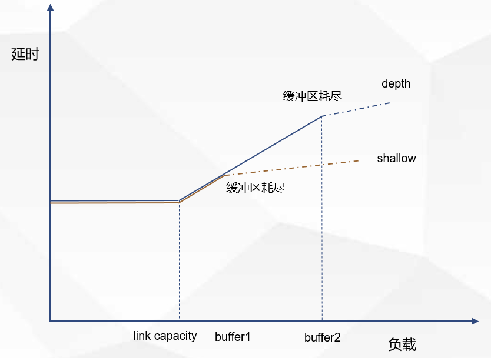
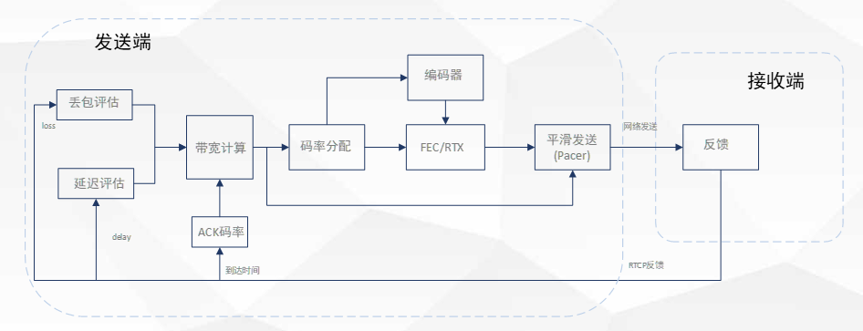
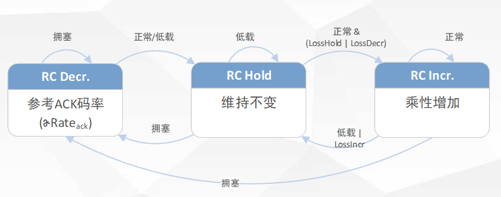
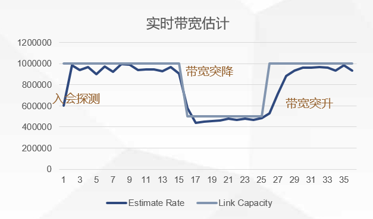
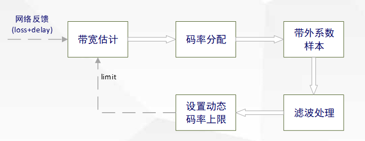
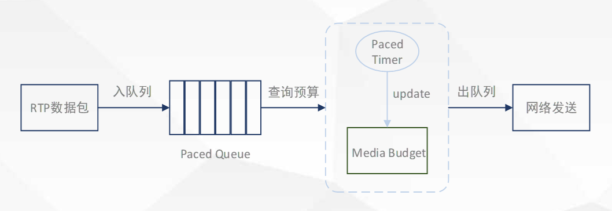
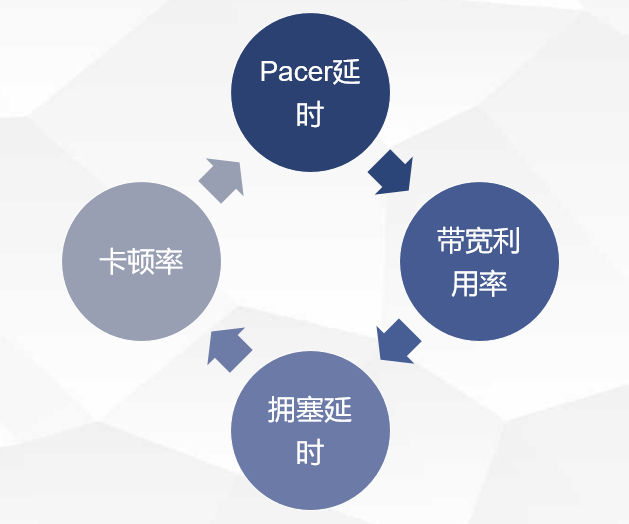

<!--BEGIN_DATA
{
    "create_date": "2022-03-02 20:00", 
    "modify_date": "2022-03-02 20:00", 
    "is_top": "0", 
    "summary": "网易云信QoS策略介绍", 
    "tags": "WebRTC", 
    "file_name": "网易云信QoS策略介绍.md"
}
END_DATA-->

#### 
原文出处：<a href='https://worktile.com/kb/p/5801' target='blank'>网易云信QoS策略介绍</a>

随着移动网络的普及和发展，视频会议、互动直播等音视频交互式应用迎来了爆发式的增长，为满足人们对音视频高品质、低[延时](https://worktile.com/kb/tag/%e5%bb%b6%e6%97%b6)、极致流畅体验的要求，网络 QoS（Quality of Service，服务质量）策略提供了对数据传输通道的基础保障。

音视频网络传输常见的问题和挑战有：[拥塞](https://worktile.com/kb/tag/%e6%8b%a5%e5%a1%9e)、延时抖动、丢包等。当网络出现拥塞，对拥塞的处理不当，会导致网络延时不断变大，严重时甚至会出现丢包，最终导致音视频播放延时久、卡顿等。拥塞控制是网络 QoS非常重要的部分，本文主要介绍网易云信的拥塞控制技术和策略。

## 一、什么是网络拥塞和拥塞控制

网络拥塞是指对网络资源（包括链路带宽、存储空间和处理器能力等）的使用超过了固有的处理能力和容量，造成网络传输性能下降的情况。拥塞控制的目的是通过控制发送端发送数据的速率，避免出现网络拥塞，以及出现拥塞之后，进行拥塞消除，从而提升网络吞吐率。如果把网络中传输的数据比喻为道路交通中的车辆，网络拥塞就如同交通拥塞，拥塞控制策略就像是交通秩序管理和疏通措施。

## 二、网络拥塞产生的原因与网络分类

在 WIFI 网络中，信号强度和传输能力随着传输距离的增加而下降，物理遮挡、信号干扰、接入设备众多等原因都会导致链路的可用传输带宽受到限制。

移动通信网络中，同样也会受到移动网络信号强度以及基站接入容量的限制。

有线网络中，如果分配的是共享带宽，而不是独享带宽，上网高峰期间同样也有可能存在带宽的限制。

无论是哪种物理类型的网络，根据拥塞后不同的表现现象，可把网络大致分为两类：

浅缓冲区（shallow [buffers](https://worktile.com/kb/tag/buffers)） 网络：几乎没有网络节点buffers，拥塞后直接表现为丢包，丢包前延时不增加或增加不明显。

深缓冲区（depth buffers）网络：有较大的网络节点 buffers，拥塞后最先表现为延时增加，只有当网络节点 buffers 消耗殆尽时，才会产生丢包。

Figure 1：负载延时示意图

## 三、拥塞控制策略介绍

拥塞控制策略，主要包括实时带宽估计算法、码率分配策略以及平滑发送。

### （一）融合的带宽估计算法

采用融合算法，分别使用基于延时变化 （delay-based）的算法和基于丢包 （loss-based）的算法，对网络拥塞状态、丢包趋势进行检测，并结合 ACK 码率，计算得到带宽估计值。

算法流程如下：

  1. 发送端平滑发送数据，接收端周期性反馈收包情况，包括每个包是否到达，以及具体的到达时间;
  2. 发送端在接收到反馈信息后，把包到达时间以及包大小进行输入，计算给定时间窗内（通常是数百 ms）接收方接收码率的样本值，并通过贝叶斯估计算法（使用当前估计值和新的样本码率计算得到新的估计值，与当前估计值相差甚远的样本，被赋予较小的权重，因为它们被认为更有可能是与拥塞无关的延迟峰值造成的），计算接收方的接收码率（以下称为 ACK 码率），网络出现拥塞时，把 ACK 码率作为估计带宽值的参考值。
  3. delay-based 算法进行带宽估计时，首先，把发送数据包进行分组（burst group）处理，并计算得到相邻包组的传输延时梯度变化值，然后把它作为输入，通过趋势线性（trendline）算法，对网络负载情况进行估计。一共有三种网络状态：拥塞（overuse）、正常（normal）、低负载（underuse）。
  4. loss-based 算法，根据反馈信息，计算得到样本丢包率，然后把它和发送码率一起作为输入，通过滤波算法对丢包率趋势做出判定，有三种趋势状态：LossIncr、LossHold、LossDecr。
  5. 首先根据网络负载状态、丢包趋势状态以及 ACK 码率，进行码率计算（Rate Control ），有三种状态：RC Decr、RC Hold、RC Incr，得到 RC 估计值，然后再结合当前丢包率和丢包趋势状态，计算得到最终的带宽估计值（Bandwidth Estimate）。

  * 丢包率小于设定的阈值（低），取 θ*RC 估计值为最终估计值（θ 取值大于 1.0，根据 RTT 动态调整,RTT 越大，越接近 1.0）；
  * 丢包率大于设定的阈值（高）且处于 LossIncr 状态持续超过阈值，取 ACK 码率为最终估计值;
  * 其他情况，取 RC 估计值为最终估计值。
  * 对于深缓冲区网络，当网络出现拥塞时，传输延时呈现逐渐增加的趋势，所以 delay-based 算法能够及时检测网络处于拥塞状态，从而可以准确计算得到带宽估计值，并进行拥塞控制。
  * 而对于浅缓冲区网络，当网络出现拥塞时，延时没有增加或增加不明显，delay-based 算法无法或无法及时检测到网络处于拥塞状态。此时，需结合丢包率和丢包趋势进行估计。

网络带宽变化时，根据实时带宽估计值动态调整编码码率，示例：

### （二）码率分配

通常，我们把带宽估计值的上限设置为视频的最大推荐码率（由视频质量控制 VQC 模块根据采集分辨率和帧率等计算得到）。当网络没有丢包时，带宽估计的所有码率，全部分配用于编码；当网络存在丢包时，采用前向纠错（FEC）+丢包重传（NACK）的策略，进行丢包恢复，因此，带宽码率分配时，需保证带宽估计值等于 FEC 码率+重传码率+编码码率三者之和，才不会导致网络拥塞。可见，丢包情况下，FEC 和重传码率会挤占编码码率，视频质量会有一定程度上的下降。

动态码率上限策略：根据过去一段时间统计的发送总码率与编码码率的比值，得到当前的带外系数样本值，经滤波平滑处理（取观察窗口内的均值）后，得到最终的带外系数，用它乘以编码最大推荐码率，作为新的带宽估计上限。上限值的更新采取快升慢降的策略。

通过动态上限机制，即通过计算带外系数，把带宽估计值的上限进行提升，在可用带宽足够的情况下，使 FEC 和重传码率占用带外码率，提升编码码率。

**70% 丢包+2 Mbps 带限 VS 70% 丢包不限带宽，后者视频清晰度提升效果明显：**

<!-- <video class="_1k7bcr7" preload="metadata" playsinline="" webkit-playsinline="" x-webkit-airplay="deny" src="https://vdn1.vzuu.com/HD/e58c8042-1504-11ec-8d78-6672af14e9b0-v4_t111-vjoSuhXDMc.mp4?disable_local_cache=1&amp;c=avc.0.0&amp;auth_key=1649998309-0-0-62068f118b38bfa7b99c584132e86d94&amp;f=mp4&amp;bu=http-com&amp;expiration=1649998309&amp;v=hw" style="object-fit: contain;"></video> -->

70 loss+2m

**VS**

70 loss

<!-- <video class="_1k7bcr7" preload="metadata" playsinline="" webkit-playsinline="" x-webkit-airplay="deny" src="https://vdn3.vzuu.com/HD/ebacbd34-1504-11ec-b040-5e203c32a4e7-v4_t111-vjoKTcTjOf.mp4?disable_local_cache=1&amp;c=avc.0.0&amp;auth_key=1649998310-0-0-add1013e085ede66c54e6daefd89867d&amp;f=mp4&amp;bu=http-com&amp;expiration=1649998310&amp;v=tx" style="object-fit: contain;"></video> -->

### （三）平滑发送

平滑发送（Paced Send）通过令牌桶限速机制来实现对发送速度的控制：所有待发送的 RTP 数据包（包括编码、FEC、重传包），都先放入优先级队列中进行管理，定时器根据带宽估计值和 Pacer 系数定期更新预算，当预算不为零时，直接发送队列中的数据并消耗预算，预算消耗完，暂停发送数据。

由 Pacer 系数控制平滑力度，若 Pacer 系数等于 1.0，则表示严格按照带宽估计值发送数据，此时对网络的突发冲击最小，有利于提升带宽利用率和稳定性，但可能会引入一定的帧发送延时（Pacer 延时）。

在音视频应用中，由于以下原因，往发送队列中添加数据的速率存在波动:

  1. 周期性的 I 帧、场景变化等导致编码器输出的帧大小、帧码率不均匀;
  2. 应对突发丢包而增加的 FEC、重传码率。

一方面要通过平滑减少码率波动峰值对网络造成的拥塞，避免引入大的拥塞延时导致卡顿，另一方面要减少较大帧的帧发送耗时，两者不可兼得。因此平滑系数的设置显得尤其重要，这实际上是 Pacer 延时、拥塞延时、带宽利用率、卡顿率等 QoE 评价指标之间的平衡。

动态 pacer 系数策略

设计原则：在带宽受限的时候，把平滑系数尽量设置小一些，并根据排队延时，动态增减。在带宽不受限时，把平滑系数设置大一些。结合当前带宽估计值和过去一段时间内（观察窗口期）的网络拥塞状态，判定带宽是否受限。

## 四、总结

本文主要介绍了网络 Qos 中的拥塞控制策略，包括带宽估计算法、码率分配以及平滑发送策略。拥塞控制应用到具体的音视频业务中，实际是各种 QoE 指标之间的平衡，算法的改进通常不是一蹴而就的，通过实验室弱网模拟结合线上灰度观察关键指标来验证，采用数据驱动的方式，帮助打磨出最合适的拥塞控制策略和参数：在保障低端到端播放延时、低卡顿率的同时，拥有高带宽利用率，为打造极致流畅的高品质音视频体验保驾护航。
