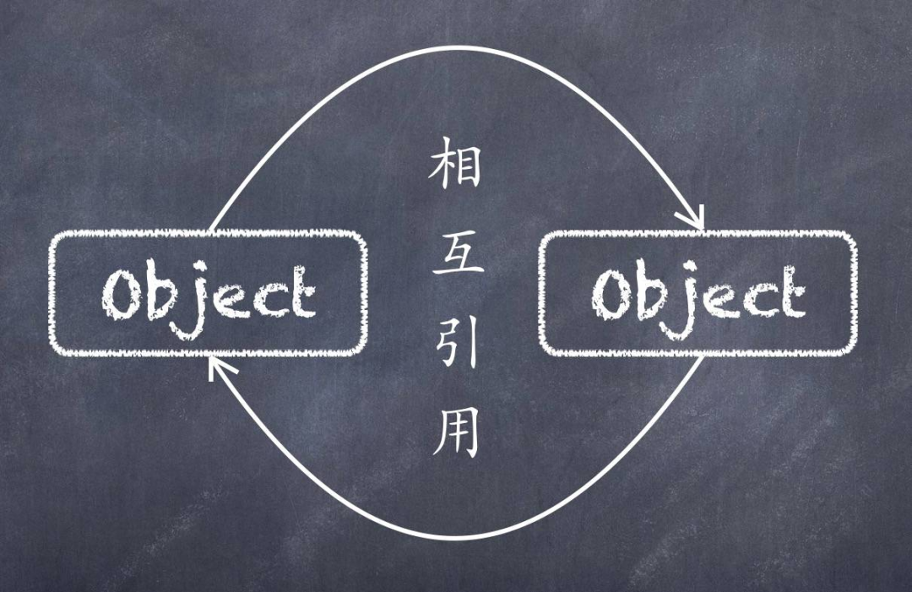
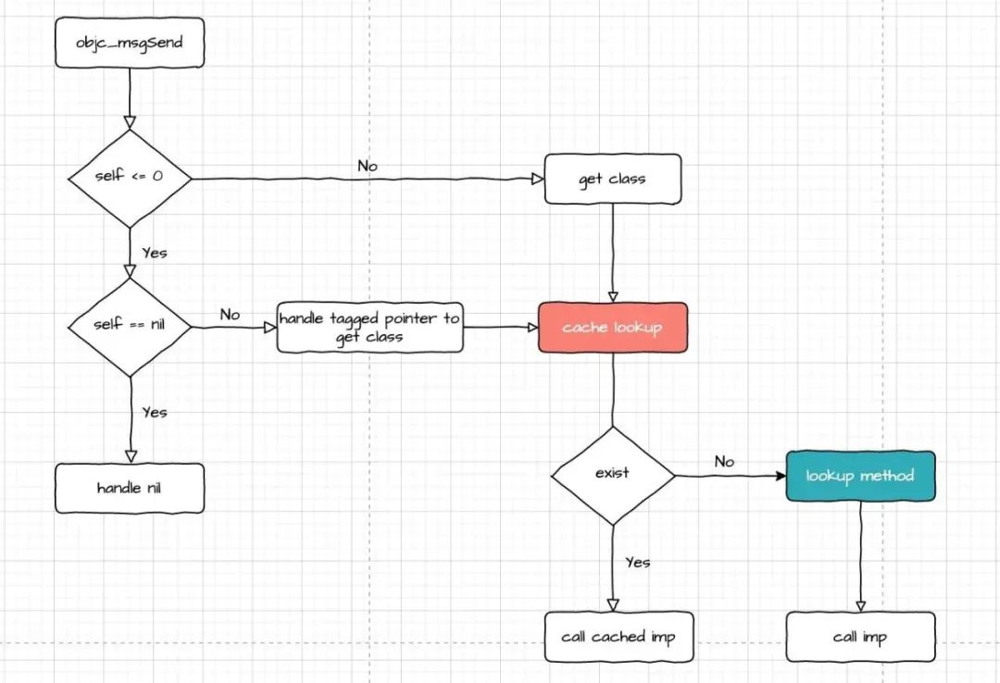
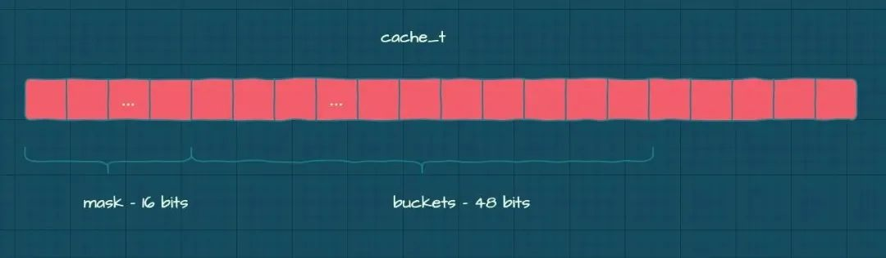
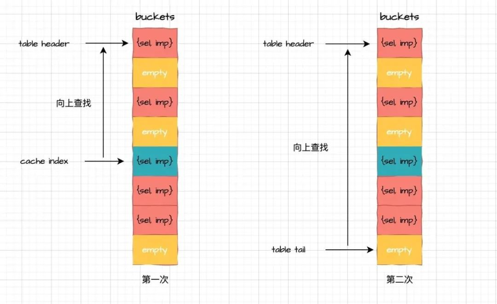
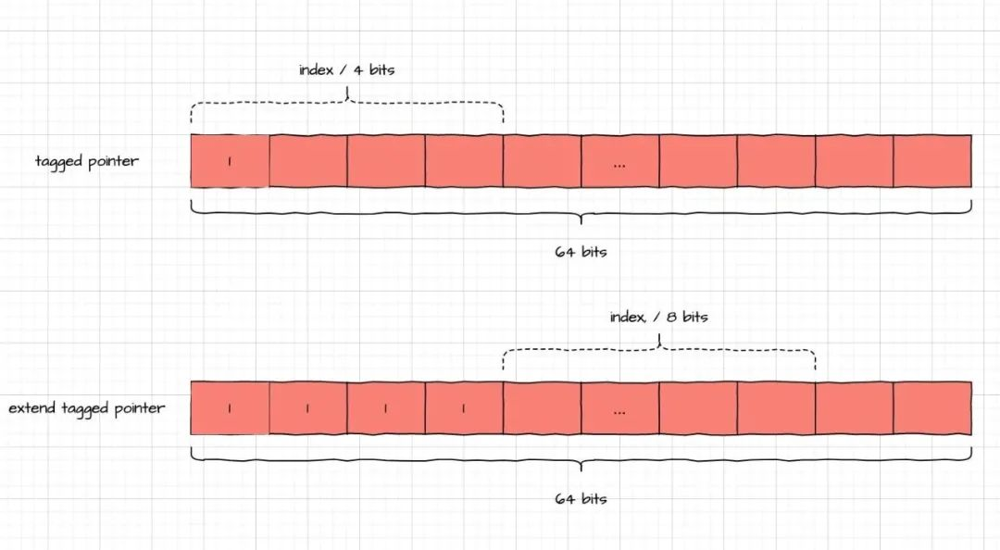

 
<!--BEGIN_DATA
{
    "create_date": "2020-12-22 13:11", 
    "modify_date": "2020-12-22 13:11", 
    "is_top": "0", 
    "summary": "聊聊Objective-C循环引用的检测<br/>arm64 objc_msgSend 源码解读", 
    "tags": "iOS、C/C++", 
    "file_name": "聊聊Objective-C循环引用的检测及objc_msgSend源码解读.md"
}
END_DATA-->

#### <p>原文出处：<a href='https://mp.weixin.qq.com/s/q2UdQkgRyvksW6qnC1KF1w' target='blank'>聊聊Objective-C循环引用的检测</a></p>



Objective-C 使用引用计数作为 iPhone 应用的内存管理方案，引用计数相比 GC 更适用于内存不太充裕的场景，只需要收集与对象关联的局部信息来决定是否回收对象，而 GC 为了明确可达性，需要全局的对象信息。引用计数固然有其优越性，但也正是因为缺乏对全局对象信息的把控，导致 Objective-C无法自动销毁陷入循环引用的对象。虽然 Objective-C 通过引入弱引用技术，让开发者可以尽可能地规避这个问题，但在引用层级过深，引用路径不那么直观的情况下，即使是经验丰富的工程师，也无法百分百保证产出的代码不存在循环引用。

这时候就需要有一种检测方案，可以实时检测对象之间是否发生了循环引用，来辅助开发者及时地修正代码中存在的内存泄漏问题。要想检测出循环引用，最直观的方式是递归地获取对象强引用的其他对象，并判断检测对象是否被其路径上的对象强引用了，也就是在有向图中去找环。明确检测方式之后，接下来需要解决的是如何获取强引用链，也就是获取对象的强引用，尤其是最容易造成循环引用的 block。

### Block 捕获实体引用

往期关于 Block 的文章 对 Block 的一点补充、用 Block 实现委托方法、Block技巧与底层解析

#### 捕获区域布局初探

首先根据 block 的定义结构，可以简单地将其视为：

```cpp
struct sr_block_layout {  
    void *isa;  
    int flags;  
    int reserved;  
    void (*invoke)(void *, ...);  
    struct sr_block_descriptor *descriptor;  
    /* Imported variables. */  
};  
    
// 标志位不一样，这个结构的实际布局也会有差别，这里简单地放在一起好阅读  
struct sr_block_descriptor {  
    unsigned long reserved; // Block_descriptor_1  
    unsigned long size; // Block_descriptor_1  
    void (*)(void *dst, void *src);  // Block_descriptor_2 BLOCK_HAS_COPY_DISPOSE  
    void (*dispose)(void *); // Block_descriptor_2  
    const char *signature; // Block_descriptor_3 BLOCK_HAS_SIGNATURE  
    const char *layout; // Block_descriptor_3 contents depend on BLOCK_HAS_EXTENDED_LAYOUT  
};  
```

可以看到 block 捕获的变量都会存储在 sr_block_layout 结构体 descriptor 字段之后的内存空间中，下面我们通过 clang-rewrite-objc 重写如下代码语句 :

```cpp
int i = 2;  
^{  
    i;  
};  
```

可以得到 :

```cpp
struct __block_impl {  
    void *isa;  
    int Flags;  
    int Reserved;  
    void *FuncPtr;  
};  
    
struct __main_block_impl_0 {  
    struct __block_impl impl;  
    struct __main_block_desc_0* Desc;  
    int i;  
    ...  
};  
```

__main_block_impl_0 结构中新增了捕获的 i 字段，即 sr_block_layout 结构体的 imported variables部分，这种操作可以看作在 sr_block_layout 尾部定义了一个 0 长数组，可以根据实际捕获变量的大小，给捕获区域申请对应的内存空间，只不过这一操作由编译器完成 :

```cpp
struct sr_block_layout {  
    void *isa;  
    int flags;  
    int reserved;  
    void (*invoke)(void *, ...);  
    struct sr_block_descriptor *descriptor;  
    char captured[0];  
};  
```

既然已经知道了捕获变量 i 的存放地址，那么我们就可以通过 *(int *)layout->captured 在运行时获取 i的值。得到了捕获区域的起始地址之后，我们再来看捕获区域的布局问题，考虑以下代码块 :

```cpp
int i = 2;  
NSObject *o = [NSObject new];  
void (^blk)(void) = ^{  
    i;  
    o;  
};  
```    

捕获区域的布局分两部分看：顺序和大小，我们先使用老方法重写代码块 :

```cpp
struct __main_block_impl_0 {  
    struct __block_impl impl;           // 24  
    struct __main_block_desc_0* Desc;   // 8 指针占用内存大小和寻址长度相关，在 64 位机环境下，编译器分配空间大小为 8 字节  
    int i;                              // 8  
    NSObject *o;                        // 8  
    ...  
};  
```

按照目前 clang 针对 64 位机的默认对齐方式（下文的字节对齐计算都基于此前提条件），可以计算出这个结构体占用的内存空间大小为 24 + 8 + 8 + 8 = 48字节，并且按照上方代码块先 i 后 o 的捕获排序方式，如果我要访问捕获的 o 对象指针变量，只需要在捕获区域起始地址上偏移 8 字节即可，我们可以借助 lldb 的 memory read (x) 命令查看这部分内存空间 :

```cpp
(lldb) po *(NSObject **)(layout->captured + 8)  
0x0000000000000002  
(lldb) po *(NSObject **)layout->captured  
<NSObject: 0x10073f290>  
(lldb) p *(int *)(layout->captured + 8)  
(int) $6 = 2  
(lldb) p (int *)(layout->captured + 8)  
(int *) $9 = 0x0000000100740d18  
(lldb) p layout->descriptor->size  
(unsigned long) $11 = 44  
(lldb) x/44bx layout  
0x100740cf0: 0x70 0x21 0x7b 0xa6 0xff 0x7f 0x00 0x00  
0x100740cf8: 0x02 0x00 0x00 0xc3 0x00 0x00 0x00 0x00  
0x100740d00: 0x40 0x1d 0x00 0x00 0x01 0x00 0x00 0x00  
0x100740d08: 0xb0 0x20 0x00 0x00 0x01 0x00 0x00 0x00  
0x100740d10: 0x90 0xf2 0x73 0x00 0x01 0x00 0x00 0x00  
0x100740d18: 0x02 0x00 0x00 0x00  
```

和使用 clang -rewrite-objc 重写时的猜想不一样，我们可以从以上终端日志中看出以下两点 :

  * 捕获变量 i、o 在捕获区域的排序方式为 o、i，o 变量地址与捕获起始地址一致，i 变量地址为捕获起始地址加上 8 字节
  * 捕获整形变量 i 在内存中实际占用空间大小为 4 字节

那么 block 到底是怎么对捕获变量进行排序，并且为其分配内存空间的呢？这就需要看 clang 是如何处理 block 捕获的外部变量了。

#### 捕获区域布局分析

首先解决捕获变量排序的问题，根据 clang 针对这部分的排序代码，我们可以知道，在对齐字节数 (alignment) 不相等时，捕获的实体按照alignment 降序排序 (C 结构体比较特殊，即使整体占用空间比指针变量大，也排在对象指针后面)，否则按照以下类型进行排序 :

  * __strong 修饰对象指针变量
  * __block 修饰对象指针变量
  * __weak 修饰对象指针变量
  * 其他变量

再结合 clang 对捕获变量对齐子节数计算方式 ，我们可以知道，block 捕获区域变量的对齐结果趋向于被 `__attribute__((__packed__))` 修饰了的结构体，举个例子 :

```cpp
struct foo {  
    void *p;    // 8  
    int i;      // 4  
    char c;     // 4 实际用到的内存大小为 1  
};  
```

创建 foo 结构体需要分配的空间大小为 8 + 4 + 4 = 16，关于结构体的内存对齐方式，这里额外说几句，编译器会按照成员列表的顺序一个接一个地给每个成员分配内存，只有当存储成员需要满足正确的边界对齐要求时，成员之间才可能出现用于填充的额外内存空间，以提升计算机的访问速度（对齐标准一般和寻址长度一致），在声明结构体时，让那些对齐边界要求最严格的成员最先出现，对边界要求最弱的成员最后出现，可以最大限度地减少因边界对齐而带来的空间损失。再看以下代码块 :

```cpp
struct foo {  
    void *p;    // 8  
    int i;      // 4  
    char c;     // 1  
} __attribute__ ((__packed__));  
```

`__attribute__ ((__packed__))` 编译属性告诉编译器，按照字段的实际占用子节数进行对齐，所以创建 foo 结构体需要分配的空间大小为 8 + 4 + 1 = 13。

结合以上两点，我们可以尝试分析以下 block 捕获区域的变量布局情况 :

```cpp
NSObject *o1 = [NSObject new];  
__weak NSObject *o2 = o1;  
__block NSObject *o3 = o1;  
unsigned long long j = 4;  
int i = 3;  
char c = 'a';  
void (^blk)(void) = ^{  
    i;  
    c;  
    o1;  
    o2;  
    o3;  
    j;  
};  
```

首先按照 aligment 排序，可以得到排序顺序为 [o1 o2 o3] j i c，再根据 **strong、**block、__weak 修饰符对o1 o2 o3 进行排序，可得到最终结果 o1[8] o3[8] o2[8] j[8] i[4] c[1]。同样的，我们使用 lldb 的 x 命令验证分析结果是否正确 :

    
```cpp
(lldb) x/69bx layout  
0x10200d940: 0x70 0x21 0x7b 0xa6 0xff 0x7f 0x00 0x00  
0x10200d948: 0x02 0x00 0x00 0xc3 0x00 0x00 0x00 0x00  
0x10200d950: 0xf0 0x1b 0x00 0x00 0x01 0x00 0x00 0x00  
0x10200d958: 0xf8 0x20 0x00 0x00 0x01 0x00 0x00 0x00  
0x10200d960: 0xa0 0xf6 0x00 0x02 0x01 0x00 0x00 0x00  // o1  
0x10200d968: 0x90 0xd9 0x00 0x02 0x01 0x00 0x00 0x00  // o3  
0x10200d970: 0xa0 0xf6 0x00 0x02 0x01 0x00 0x00 0x00  // o2  
0x10200d978: 0x04 0x00 0x00 0x00 0x00 0x00 0x00 0x00  // j  
0x10200d980: 0x03 0x00 0x00 0x00 0x61                 // i c  
(lldb) p o1  
(NSObject *) $1 = 0x000000010200f6a0  
```

可以看到，小端模式下，捕获的 o1 和 o2 指针变量值为 0x10200f6a0 ,对应内存地址为 0x10200d960 和 0x10200d970，而 o3 因为被 __block 修饰，编译器为 o3 捕获变量包装了一层 byref 结构，所以其值为 byref 结构的地址 0x102000d990，而不是 0x10200f6a0 ，捕获的 j 变量地址为 0x10200d978，i 变量地址为 0x10200d980，c 字符变量紧随其后。

#### Descriptor 的 Layout 信息

经过上述的一系列分析，捕获区域变量的布局方式已经大致摸清了，接下来回过头看下 sr_block_descriptor 结构的 layout字段是用来干嘛的。从字面上理解，这个字段很可能保存了 block 某一部分的内存布局信息，比如捕获区域的布局信息，我们依旧使用上文的最后一个例子，看看layout 的值 :

```cpp
(lldb) p layout->descriptor->layout  
(const char *) $2 = 0x0000000000000111 ""  
```

可以看到 layout 值为空字符串，并没有展示出任何直观的布局信息，看来要想知道 layout 是怎么运作的，还需要阅读这一部分的 block 代码 和 clang 代码，我们一步步地分析这两段代码里面隐藏的信息，这里贴出其中的部分代码和注释 :

```cpp
// block  
// Extended layout encoding.  
    
// Values for Block_descriptor_3->layout with BLOCK_HAS_EXTENDED_LAYOUT  
// and for Block_byref_3->layout with BLOCK_BYREF_LAYOUT_EXTENDED  
    
// If the layout field is less than 0x1000, then it is a compact encoding   
// of the form 0xXYZ: X strong pointers, then Y byref pointers,   
// then Z weak pointers.  
    
// If the layout field is 0x1000 or greater, it points to a   
// string of layout bytes. Each byte is of the form 0xPN.  
// Operator P is from the list below. Value N is a parameter for the operator.  
    
enum {  
    ...  
    BLOCK_LAYOUT_NON_OBJECT_BYTES = 1,    // N bytes non-objects  
    BLOCK_LAYOUT_NON_OBJECT_WORDS = 2,    // N words non-objects  
    BLOCK_LAYOUT_STRONG           = 3,    // N words strong pointers  
    BLOCK_LAYOUT_BYREF            = 4,    // N words byref pointers  
    BLOCK_LAYOUT_WEAK             = 5,    // N words weak pointers  
    ...  
};  
    
// clang   
/// InlineLayoutInstruction - This routine produce an inline instruction for the  
/// block variable layout if it can. If not, it returns 0. Rules are as follow:  
/// If ((uintptr_t) layout) < (1 << 12), the layout is inline. In the 64bit world,  
/// an inline layout of value 0x0000000000000xyz is interpreted as follows:  
/// x captured object pointers of BLOCK_LAYOUT_STRONG. Followed by  
/// y captured object of BLOCK_LAYOUT_BYREF. Followed by  
/// z captured object of BLOCK_LAYOUT_WEAK. If any of the above is missing, zero  
/// replaces it. For example, 0x00000x00 means x BLOCK_LAYOUT_STRONG and no  
/// BLOCK_LAYOUT_BYREF and no BLOCK_LAYOUT_WEAK objects are captured.  
```

首先要解释的是 inline 这个词，Objective-C 中有一种叫做 Tagged Pointer的技术，它让指针保存实际值，而不是保存实际值的地址，这里的 inline 也是相同的效果，即让 layout 指针保存实际的编码信息。在 inline状态下，使用十六进制中的一位表示捕获变量的数量，所以每种类型的变量最多只能有 15 个，此时的 layout 的值以 0xXYZ 形式呈现，其中 X、Y、Z分别表示捕获 **strong、**block、__weak 修饰指针变量的个数，如果其中某个类型的数量超过 15 或者捕获变量的修饰类型不为这三种任何一个时，比如捕获的变量由 __unsafe_unretained 修饰，则采用另一种编码方式，这种方式下，layout 会指向一个字符串，这个字符串的每个字节以 0xPN 的形式呈现，并以 0x00 结束，P 表示变量类型，N 表示变量个数，需要注意的是，N 为 0 表示 P 类型有一个，而不是 0 个，也就是说实际的变量个数比 N 大 1。需要注意的是，捕获 int 等基础类型，不影响 layout 的呈现方式，layout 编码中也不会有关于基础类型的信息，除非需要基础类型的编码来辅助定位对象指针类型的位置，比如捕获含有对象指针字段的结构体。举几个例子 :

```cpp
unsigned long long j = 4;  
int i = 3;  
char c = 'a';  
void (^blk)(void) = ^{  
    i;  
    c;  
    j;  
};  
```

以上代码块没有捕获任何对象指针，所以实际的 descriptor 不包含 copy 和 dispose字段，去除这两个字段后，再输出实际的布局信息，结果为空（0x00 表示结束），说明捕获一般基础类型变量不会计入实际的 layout 编码 :

```cpp
(lldb) p/x (long)layout->descriptor->layout  
(long) $0 = 0x0000000100001f67  
(lldb) x/8bx layout->descriptor->layout  
0x100001f67: 0x00 0x76 0x31 0x36 0x40 0x30 0x3a 0x38  
```

接着尝试第一种 layout 方式 :

```cpp
NSObject *o1 = [NSObject new];  
__block NSObject *o3 = o1;  
__weak NSObject *o2 = o1;  
void (^blk)(void) = ^{  
    o1;  
    o2;  
    o3;  
};  
```

以上代码块对应的 layout 值为 0x111 ，表示三种类型变量每种一个 :

```cpp
(lldb) p/x (long)layout->descriptor->layout  
(long) $0 = 0x0000000000000111  
```

再尝试第二种 layout 编码方式 :

```cpp
NSObject *o1 = [NSObject new];  
__block NSObject *o3 = o1;  
__weak NSObject *o2 = o1;  
NSObject *o4 = o1;  
... // 5 - 18  
NSObject *o19 = o1;  
void (^blk)(void) = ^{  
    o1;  
    o2;  
    o3;  
    o4;  
    ... // 5 - 18  
    o19;  
};  
```

以上代码块对应的 layout 值是一个地址 0x0000000100002f44 ，这个地址为编码字符串的起始地址，转换成十六进制后为 0x3f 0x30 0x40 0x50 0x00，其中 P 为 3 表示 __strong 修饰的变量，数量为 15(f) + 1 + 0 + 1 = 17 个，P 为 4 表示 __block 修饰的变量，数量为 0 + 1 = 1 个， P 为 5 表示 __weak 修饰的变量，数量为 0 + 1 = 1 个 :

```cpp
(lldb) p/x (long)layout->descriptor->layout  
(long) $0 = 0x0000000100002f44  
(lldb) x/8bx layout->descriptor->layout  
0x100002f44: 0x3f 0x30 0x40 0x50 0x00 0x76 0x31 0x36  
```

#### 结构体对捕获布局的影响

由于结构体字段的布局顺序在声明时就已经确定了，无法像 block 构造捕获区域一样，按照变量类型、修饰符进行调整，所以如果结构体中有类型为对象指针的字段，就需要一些额外信息来计算这些对象指针字段的偏移量，需要注意的是，被捕获结构体的内存对齐信息和未捕获时一致，以寻址长度作为对齐基准，捕获操作并不会变更对齐信息。同样地，我们先尝试捕获只有基本类型字段的结构体 :

```cpp
struct S {  
    char c;  
    int i;  
    long j;  
} foo;  
void (^blk)(void) = ^{  
    foo;  
};  
```

然后调整 descriptor 结构，输出 layout :

```cpp
(lldb) x/8bx layout->descriptor->layout  
0x100001f67: 0x00 0x76 0x31 0x36 0x40 0x30 0x3a 0x38  
```    

可以看到，只有含有基本类型的结构体，同样不会影响 block 的 layout 编码信息。接下来我们给结构体新增`__strong`和`__weak`修饰的对象指针字段 :

```cpp
struct S {  
    char c;  
    int i;  
    __strong NSObject *o1;  
    long j;  
    __weak NSObject *o2;  
} foo;  
void (^blk)(void) = ^{  
    foo;  
};  
```

同样分析输出 layout :

```cpp
(lldb) x/8bx layout->descriptor->layout  
0x100002f47: 0x20 0x30 0x20 0x50 0x00 0x76 0x31 0x36  
```

layout 编码为0x20 0x30 0x20 0x50 0x00，其中 P 为 2 表示 word 字类型（非对象），由于字大小一般和指针一致，所以这里表示占用了 8 * (N + 1) 个字节，第一个 0x20 表示非对象指针类型占用了 8 个字节，也就是 char 类型和 int 类型字段对齐之后所占用的空间，接着 0x30 表示有一个 __strong 修饰的对象指针字段，第二个 0x20表示非对象指针 long 类型占用了 8 个字节，最后的 0x50 表示有一个 __weak修饰的对象指针字段。由于编码中包含了每个字段的排序和大小，我们就可以通过解析 layout 编码后的偏移量，拿到想要的对象指针值。P 还有个 byte 类型，值为 1 ，和 word 类型有相似的功能，只是表示的空间大小不同。

#### Byref 结构的布局

由 __block 修饰的捕获变量，会先转换成 byref 结构，再由这个结构去持有实际的捕获变量，block 只负责管理 byref 结构。

```cpp
// 标志位不一样，这个结构的实际布局也会有差别，这里简单地放在一起好阅读  
struct sr_block_byref {  
    void *isa;  
    struct sr_block_byref *forwarding;  
    volatile int32_t flags; // contains ref count  
    uint32_t size;  
    // requires BLOCK_BYREF_HAS_COPY_DISPOSE  
    void (*byref_keep)(struct sr_block_byref *dst, struct sr_block_byref *src);  
    void (*byref_destroy)(struct sr_block_byref *);  
    // requires BLOCK_BYREF_LAYOUT_EXTENDED  
    const char *layout;  
};  
```

以上代码块就是 byref 对应的结构体。第一眼看上去，我比较困惑为什么还要有 layout 字段，虽然上文的 block 源码注释说明了 byref 和 block 结构一样，都具备两种不同的布局编码方式，但是 byref 不是只针对一个变量么，难道和 block 捕获区域一样也可以携带多个捕获变量？带着这个困惑，我们先看下以下表达式 :

```cpp
__block  NSObject *o1 = [NSObject new];  
```    

使用 clang 重写之后 :

```cpp 
struct __Block_byref_o1_0 {  
    void *__isa;  
    __Block_byref_o1_0 *__forwarding;  
    int __flags;  
    int __size;  
    void (*__Block_byref_id_object_copy)(void*, void*);  
    void (*__Block_byre/* @autoreleasepool */o{ __AtAutoreleasePool __autoreleasepool; e)(void*);  
    NSObject *o1;  
};  
```

和 block 捕获变量一样，byref 携带的变量也是保存在结构体尾部的内存空间里，当前上下文中，可以直接通过 sr_block_byref 的 layout 字段获取 o1 对象指针值。可以看到，在包装如对象指针这类常规变量时，layout 字段并没有起到实质性的作用，那什么条件下的 layout 才表示布局编码信息呢？如果使用 layout 字段表示编码信息，那么携带的变量又是何处安放的呢？我们一个个解答。

针对第一个问题，先看以下代码块 :

```cpp
__block struct S {  
    NSObject *o1;  
} foo;  
foo.o1 = [NSObject new];  
void (^blk)(void) = ^{  
    foo;  
};  
```

使用 clang 重写之后 :

```cpp
struct __Block_byref_foo_0 {  
    void *__isa;  
    __Block_byref_foo_0 *__forwarding;  
    int __flags;  
    int __size;  
    void (*__Block_byref_id_object_copy)(void*, void*);  
    void (*__Block_byref_id_object_dispose)(void*);  
    struct S foo;  
};  
```

和常规类型一样，foo 结构体保存在结构体尾部，也就是原本 layout 所在的字段，重写的代码中依然看不到 layout 的踪影，接着我们试着输出 foo:

```cpp
(lldb) po foo.o1  
<NSObject: 0x10061f130>  
(lldb) p (struct S)a_byref->layout  
error: Multiple internal symbols found for 'S'  
(lldb) p/x (long)a_byref->layout  
(long) $3 = 0x0000000000000100  
(lldb) x/56bx a_byref  
0x100627c20: 0x00 0x00 0x00 0x00 0x00 0x00 0x00 0x00  
0x100627c28: 0x20 0x7c 0x62 0x00 0x01 0x00 0x00 0x00  
0x100627c30: 0x04 0x00 0x00 0x13 0x38 0x00 0x00 0x00  
0x100627c38: 0x90 0x1b 0x00 0x00 0x01 0x00 0x00 0x00  
0x100627c40: 0x00 0x1c 0x00 0x00 0x01 0x00 0x00 0x00  
0x100627c48: 0x00 0x01 0x00 0x00 0x00 0x00 0x00 0x00  
0x100627c50: 0x30 0xf1 0x61 0x00 0x01 0x00 0x00 0x00  
```

看来事情并没有看上去的那么简单，首先重写代码中 foo 字段所在内存保存的并不是结构体，而是 0x0000000000000100，这个 100 是不是看着有点眼熟，没错，这就是 byref 的 layout 信息，根据 0xXYZ 编码规则，这个值表示有 1 个 __strong 修饰的对象指针。接着针对第二个问题，携带的对象指针变量存在哪，我们把视线往下移动 8 个字节，这不就是 foo.o1 对象指针的值么。总结下，在存在 layout 的情况下，byref 使用 8 个字节保存 layout 编码信息，并紧跟着在 layout 字段后存储捕获的变量。

以上是 byref 的第一种 layout 编码方式，我们再尝试第二种 :

```cpp
__block struct S {  
    char c;  
    NSObject *o1;  
    __weak NSObject *o3;  
} foo;  
foo.o1 = [NSObject new];  
void (^blk)(void) = ^{  
    foo;  
};  
```

使用 clang 重写代码之后 :

```cpp
struct __Block_byref_foo_0 {  
    void *__isa;  
__Block_byref_foo_0 *__forwarding;  
    int __flags;  
    int __size;  
    void (*__Block_byref_id_object_copy)(void*, void*/* @autoreleasepool */c{ __AtAutoreleasePool __autoreleasepool; _byref  
struct __main_block_impl_0 {  
    struct __block_impl impl;  
    struct __main_block_desc_0* Desc;  
    __main_block_impl_0(void *fp, struct __main_block_desc_0 *desc, int flags=0) {  
    impl.isa = &_NSConcreteStackBlock;  
    impl.Flags = flags;  
    impl.FuncPtr = fp;  
    Desc = desc;  
    }  
};  
```

emmmm …，上面代码并不是粘贴错误，貌似 Rewriter 并不能很好地处理这种情况，看来又需要我们直接去看对应内存地址中的值了 :

```cpp    
(lldb) x/72bx a_byref  
0x100755140: 0x00 0x00 0x00 0x00 0x00 0x00 0x00 0x00  
0x100755148: 0x40 0x51 0x75 0x00 0x01 0x00 0x00 0x00  
0x100755150: 0x04 0x00 0x00 0x13 0x48 0x00 0x00 0x00  
0x100755158: 0x10 0x1b 0x00 0x00 0x01 0x00 0x00 0x00  
0x100755160: 0xa0 0x1b 0x00 0x00 0x01 0x00 0x00 0x00  
0x100755168: 0x8d 0x3e 0x00 0x00 0x01 0x00 0x00 0x00  
0x100755170: 0x00 0x5f 0x6b 0x65 0x79 0x00 0x00 0x00  
0x100755178: 0xd0 0x6e 0x75 0x00 0x01 0x00 0x00 0x00  
0x100755180: 0x00 0x00 0x00 0x00 0x00 0x00 0x00 0x00  
(lldb) x/8bx a_byref->layout  
0x100003e8d: 0x20 0x30 0x50 0x00 0x53 0x52 0x4c 0x61  
```

地址 0x100755168 中保存了 layout 编码字符串的地址 0x0000000100003e8d ，将此字符串转换成十六进制后为 0x20 0x30 0x50 0x00 ，这些值的含义在结构体对捕获布局的影响一节中已经描述过，这里就不重复说明了。

#### 强引用对象的获取

目前我们已经知道了 block / byref 如何布局捕获区域内存，以及如何获取关键的布局信息，接下来我们就可以尝试获取 block 强引用的对象了，这里我把强引用的对象分成两部分 :

  * 被 block 强引用
  * 被 byref 结构强引用

只要获取这两部分强引用的对象，任务就算完成了，由于上文已经将整个原理脉络理清了，所以编写出可用的代码并不困难。这两部分都涉及到布局编码，我们先根据 layout 的编码方式，解析出捕获变量的类型和数量 :

```cpp
SRCapturedLayoutInfo *info = [SRCapturedLayoutInfo new];  
        
if ((uintptr_t)layout < (1 << 12)) {  
    uintptr_t inlineLayout = (uintptr_t)layout;  
    [info addItemWithType:SR_BLOCK_LAYOUT_STRONG count:(inlineLayout & 0xf00) >> 8];  
    [info addItemWithType:SR_BLOCK_LAYOUT_BYREF count:(inlineLayout & 0xf0) >> 4];  
    [info addItemWithType:SR_BLOCK_LAYOUT_WEAK count:inlineLayout & 0xf];  
} else {  
    while (layout && *layout != '\x00') {  
        unsigned int type = (*layout & 0xf0) >> 4;  
        unsigned int count = (*layout & 0xf) + 1;  
            
        [info addItemWithType:type count:count];  
        layout++;  
    }  
}  
```

然后遍历 block 的布局编码信息，根据变量类型和数量，计算出对象指针地址偏移，然后获取对应的对象指针值 :

```cpp
- (NSHashTable *)strongReferencesForBlockLayout:(void *)iLayout {  
    if (!iLayout) return nil;  
        
    struct sr_block_layout *aLayout = (struct sr_block_layout *)iLayout;  
    const char *extenedLayout = sr_block_extended_layout(aLayout);  
    _blockLayoutInfo = [SRCapturedLayoutInfo infoForLayoutEncode:extenedLayout];  
        
    NSHashTable *references = [NSHashTable weakObjectsHashTable];  
    uintptr_t *begin = (uintptr_t *)aLayout->captured;  
    for (SRLayoutItem *item in _blockLayoutInfo.layoutItems) {  
        switch (item.type) {  
            case SR_BLOCK_LAYOUT_STRONG: {  
                NSHashTable *objects = [item objectsForBeginAddress:begin];  
                SRAddObjectsFromHashTable(references, objects);  
                begin += item.count;  
            } break;  
            case SR_BLOCK_LAYOUT_BYREF: {  
                for (int i = 0; i < item.count; i++, begin++) {  
                    struct sr_block_byref *aByref = *(struct sr_block_byref **)begin;  
                    NSHashTable *objects = [self strongReferenceForBlockByref:aByref];  
                    SRAddObjectsFromHashTable(references, objects);  
                }  
            } break;  
            case SR_BLOCK_LAYOUT_NON_OBJECT_BYTES: {  
                begin = (uintptr_t *)((uintptr_t)begin + item.count);  
            } break;  
            default: {  
                begin += item.count;  
            } break;  
        }  
    }  
        
    return references;  
}  
```

block 布局区域中的 byref 结构需要进行额外的处理，如果 byref 直接携带 __strong 修饰的变量，则不需要关心 layout 编码，直接从结构尾部获取指针变量值即可，否则需要和处理 block 布局区域一样，先得到布局信息，然后遍历这些布局信息，计算偏移量，获取强引用对象地址 :

```cpp
- (NSHashTable *)strongReferenceForBlockByref:(void *)iByref {  
    if (!iByref) return nil;  
        
    struct sr_block_byref *aByref = (struct sr_block_byref *)iByref;  
    NSHashTable *references = [NSHashTable weakObjectsHashTable];  
    int32_t flag = aByref->flags & SR_BLOCK_BYREF_LAYOUT_MASK;  
        
    switch (flag) {  
        case SR_BLOCK_BYREF_LAYOUT_STRONG: {  
            void **begin = sr_block_byref_captured(aByref);  
            id object = (__bridge id _Nonnull)(*(void **)begin);  
            if (object) [references addObject:object];  
        } break;  
        case SR_BLOCK_BYREF_LAYOUT_EXTENDED: {  
            const char *layout = sr_block_byref_extended_layout(aByref);  
            SRCapturedLayoutInfo *info = [SRCapturedLayoutInfo infoForLayoutEncode:layout];  
            [_blockByrefLayoutInfos addObject:info];  
                
            uintptr_t *begin = (uintptr_t *)sr_block_byref_captured(aByref) + 1;  
            for (SRLayoutItem *item in info.layoutItems) {  
                switch (item.type) {  
                    case SR_BLOCK_LAYOUT_NON_OBJECT_BYTES: {  
                        begin = (uintptr_t *)((uintptr_t)begin + item.count);  
                    } break;  
                    case SR_BLOCK_LAYOUT_STRONG: {  
                        NSHashTable *objects = [item objectsForBeginAddress:begin];  
                        SRAddObjectsFromHashTable(references, objects);  
                        begin += item.count;  
                    } break;  
                    default: {  
                        begin += item.count;  
                    } break;  
                }  
            }  
        } break;  
        default: break;  
    }  
        
    return references;  
}  
```

完整代码我放到了 BlockStrongReferenceObject，代码并没有进行过很严格的测试，可能存在一些未处理的边界条件，需要尝试 / 讨论的同学可自取。

#### 另一种强引用对象获取方式

上文通过将 block 的布局编码信息转化为对应字段的偏移量来获取强引用对象，这一节介绍另外一种比较取巧的方式，也是目前检测循环引用工具获取 block强引用对象的常用方式，比如 facebook 的 FBRetainCycleDetector 。根据这块功能对应的源码，此方式大致原理如下 :

  * 获取 block 的 dispose 函数 （如果捕获了强引用对象，需要利用这个函数解引用）

  * 构造一个 fake 对象，此对象由若干个扩展的 byref 结构 (对象) 组成，其个数由 block size 决定，即把 block 划分为若干个 8 字节内存区域，就像以下代码块一样 :
    
```cpp
struct S {  
    NSObject *o1;  
    NSObject *o2;  
};  
struct S s = {  
    .o2 = [NSObject new]  
};  
void **fake = (void **)&s;  
// fake[1] 和 s.o2 是一样的  
```

  * 扩展的 byref 结构会重写 release 方法，只在此方法中设置强引用标识位，不执行原释放逻辑

  * 将 fake 对象作为参数，调用 dispose 函数，dispose 函数会去 release 每个 block 强引用的对象，在这里这些强引用对象被替换成了我们的 byref 结构，所以我们可以通过它的强引用标识位判断 block 的哪块区域保存了强引用对象地址

  * 遍历 fake 对象，保存所有强引用标志位被设置的 byref 结构对应索引，后面通过这个索引可以去 block 中找强引用指针地址

  * 释放所有的 byref 结构

  * 根据上面得到的索引，获取捕获变量偏移量，偏移量为索引值 * 8 字节 (指针大小) ，再根据偏移量去 block 内存块中拿强引用对象地址

关于这种方案，我们需要明确下面几个点。

首先这种方案也需要在明确 block 内存布局的情况下才能够实施，因为 block ，或者说 block结构体，实际执行内存对齐时，并没有按照寻址大小也就是 8 字节对齐，假设 block 捕获区域的对齐方式变成了这样 :

```cpp
struct __main_block_impl_0 {  
    struct __block_impl impl;           // 24  
    struct __main_block_desc_0* Desc;   // 8 指针占用内存大小和寻址长度相关，在 64 位机环境下，编译器分配空间大小为 8 字节  
    int i;                              // 4    FakedByref 8  
    NSObject *o1;                       // 8    FakedByref 8 [这里上个 FakedByref 后 4 个子节和当前 FakedByref 前 4 字节覆盖 o1 对象指针的 8 字节，导致 miss ]  
    char c;                             // 1  
    NSObject *o2;                       // 8  
}  
```

那么使用 fake 的方案就会失效，因为这种方案的前提是 block 内存对齐基准基于寻址长度，即指针大小。不过 block对捕获的变量按照类型和尺寸进行了排序，__strong 修饰的对象指针都在前面，本来我们只需要这种类型的变量，并不关心其他类型，所以即使后面的对齐方式不满足 fake 条件也没关系，另外捕获结构体的对齐基准是基于寻址长度的，即使结构体有其他类型，也满足 fake 条件 :

```cpp
struct __main_block_impl_0 {  
    struct __block_impl impl;           // 24  
    struct __main_block_desc_0* Desc;   // 8 指针占用内存大小和寻址长度相关，在 64 位机环境下，编译器分配空间大小为 8 字节  
    NSObject *o1;                       // 8    FakedByref 8  
    NSObject *o2;                       // 8    FakedByref 8  
    int i;                              // 4    FakedByref 8  
    char c;                             // 1          
}  
```

可以看到，通过以上代码块的排序，让 o1 和 o2 都被 FakedByref 结构覆盖到了，而 i, c 变量本身就不会在 dispose函数中访问，所以怎么设置都不会影响到策略的生效。

第二点是为什么要用扩展的 byref 结构，而不是随便整个重写了 release 的类过来，这是因为当 block 捕获了 __block修饰的指针变量时，会将这个指针变量包装成 byref 结构，而 dispose 函数会对这个 byref 结构执行 Blockobject_dispose 操作，这个函数有两个形参，一个是对象指针，一个是 flag ，当 flag 指明对象指针为 byref 类型，而实际传入的实参不是，就会出现问题，所以这里必须用扩展的 byref 结构。

第三点是这种方式无法处理 __block 修饰对象指针的情况。

不过这种方式贵在简洁，无需考虑内部每种变量类型具体的布局方式，就可以满足大部分需要获取 block 强引用对象的场景。

### 对象成员变量强引用

对象强引用成员变量的获取相对来说直接些，因为每个对象对应的类中都有其成员变量的布局信息，并且 runtime 有现成的接口，只需要分析出编码格式，然后按顺序和成员变量匹配即可。获取编码信息的接口有两个， class_getIvarLayout 函数返回描述strong ivar 数量和索引信的编码信息，相对的 class_getWeakIvarLayout 函数返回描述 weak ivar的编码信息，这里基于前者进行分析。

class_getIvarLayout 返回值是一个 uint8 指针，指向一个字符串，uint8 在 16 进制下占用 2 位，所以编码以 2 位为一组，组内首位描述非 strong ivar 个数，次位为 strong ivar 个数，最后一组如果 strong ivar 个数为 0，则忽略，且layout 以 0x00 结尾。下面举几个例子 :

```cpp
// 0x0100  
@interface A : NSObject {  
    __strong NSObject *s1;  
}  
@end  
```

起始非 strong ivar 个数为 0，并且接着一个 strong ivar ，得出编码为 0x01 。

```cpp
// 0x0100  
@interface A : NSObject {  
    __strong NSObject *s1;  
    __weak NSObject *w1;  
}  
@end  
```

起始非 strong ivar 个数为 0，并且接着一个 strong ivar ，得出编码为 0x01，接着有个 weak ivar，但是后面没有 strong ivar 了，所以忽略。

```cpp
// 0x011100  
@interface A : NSObject {  
    __strong NSObject *s1;  
    __weak NSObject *w1;  
    __strong NSObject *s2;  
}  
@end  
```

起始非 strong ivar 个数为 0，并且接着一个 strong ivar ，得出编码为 0x01，接着有个 weak ivar，并且后面紧接着一个strong ivar ，得出编码 0x11 ，合并得到 0x0111 。

```cpp
// 0x211100  
@interface A : NSObject {  
    int i1;  
    void *p1;  
    __strong NSObject *s1;  
    __weak NSObject *w1;  
    __strong NSObject *s2;  
}  
@end  
```

起始非 strong ivar 个数为 2，并且紧接着一个 strong ivar，得出编码 0x21，接着有个 weak ivar，后面紧接着一个 strong ivar ，得出编码 0x11 ，合并得到 0x2111 。

了解了成员变量的编码格式，剩下的就是如何解码并依次和成员变量进行匹配了，FBRetainCycleDetector 已经实现了这部分功能 ，主要原理如下 :

  * 获取所有的成员变量以及 ivar 编码
  * 解析 ivar 编码，跳过非 strong ivar ，获得 strong ivar 所在索引值 (把对象分成若干个 8 字节内存片段)
  * 利用 ivar_getOffset 函数获取 ivar 的偏移量，除以指针大小就是自身的索引值 (对象布局对齐基准为寻址长度，这里为 8 字节)
  * 匹配 2、3 步获得的索引值，得到 strong ivar
  * 当然 FBRetainCycleDetector 还实现了对结构体的处理，这块就不细究了。

### 小结

以上是我认为检测循环引用两个比较关键的点，特别是获取 block 捕获的强引用对象环节，block ABI 中并没有详细说明捕获区域布局信息，需要自己结合 block 源码以及 clang 生成 block 的 CodeGen 逻辑去推测实际的布局信息，所以得出的结论不一定正确，也欢迎感兴趣的同学和我交流。

### 参考

* [Circle - a cycle collector for Objective-C ARC](https://github.com/mikeash/Circle/blob/master/Circle/CircleIVarLayout.m)
* [FBRetainCycleDetector](https://github.com/facebook/FBRetainCycleDetector)
* [Automatic memory leak detection on iOS](https://code.fb.com/ios/automatic-memory-leak-detection-on-ios/)
* [Objective-C Class Ivar Layout 探索](https://blog.sunnyxx.com/2015/09/13/class-ivar-layout/)

<hr>

#### <p>原文出处：<a href='https://mp.weixin.qq.com/s?__biz=MzA5NzMwODI0MA==&mid=2647768930&idx=1&sn=4eaddd7450dabaada175698affd36d09&chksm=8887c45dbff04d4b4e484ed59a3b4385460506df1040c001e8304db3e84c8e444da8fcd8c3df&token=2009782742&lang=zh_CN&scene=21#wechat_redirect' target='blank'>arm64 objc_msgSend 源码解读</a></p>


最近参照 MikeAsh 的这篇文章，看了 arm64 下 obj_msgSend 的实现。了解了其主体流程，同时对于 arm64 的汇编知识也有了更进一步的了解。

目前最新 obj4-781 中 objc-msg-arm64.s 的实现，跟 MikeAsh 文中的代码还是有些不一样，但总体思路一致。本着学习的原则，读了最新的源码实现，也算检验下学习成果。

总的来说，整个过程主要分为如下几部分：

  * 查找对象的 isa，也就是 class。
  * 查找缓存。
  * 缓存未命中时，走慢查找。

下面来总结回顾一下。

### arm64 汇编基础

在阅读之前，可以先了解下 arm64 汇编的基础知识。

x0 ~ x31 是通用寄存器。而等会在下面的源码中，我们会看到用到了 p0 而不是 x0，p 代表 pointer-sized，表示指针的大小。在arm64 下，p0 和 x0 是等价的。在 arm64-asm.h 中可以看到如下定义：

```cpp
#if __LP64__  
    
// true arm64  
    
#define SUPPORT_TAGGED_POINTERS 1  
    
#define PTR .quad  
    
#define PTRSIZE 8  
    
#define PTRSHIFT 3 // 1<<PTRSHIFT == PTRSIZE  
    
// "p" registers are pointer-sized  
    
#define UXTP UXTX  
    
#define p0 x0  
    
#define p1 x1  
    
#define p2 x2  
    
#define p3 x3  
    
#define p4 x4  
    
#define p5 x5  
    
#define p6 x6  
    
#define p7 x7  
    
#define p8 x8  
    
#define p9 x9  
    
#define p10 x10  
    
#define p11 x11  
    
#define p12 x12  
    
#define p13 x13  
    
#define p14 x14  
    
#define p15 x15  
    
#define p16 x16  
    
#define p17 x17  
```

### objc_msgSend 主流程

#### 流程介绍

整体流程如下：



我将源码拆分成了如下 4 个文件，这样单个处理看起来会比较清晰，文件放到了 github 上。

  * Entry_objc_msgSend.s，objc_msgSend 主干流程。
  * GetClassFromIsa_p16.s，获取 class 流程。
  * CacheLookup.s，缓存查找流程。
  * LNilOrTagged.s，TaggedPointer/nil 的处理。

#### 代码实现

objc_msgSend 的方法定义如下：

```cpp
id objc_msgSend(id self, SEL _cmd, ...);  
```

第一个参数是 self，第二个参数是 selector，后面跟不定长参数。当方法被调用时，第一个参数放入 x0，第二个参数放入 x1。也就是 x0 = self，x1 = _cmd。

objcmsgSend 的汇编实现如下:

```cpp
ENTRY _objc_msgSend  
    
UNWIND _objc_msgSend, NoFrame  
    
// 将 self 和 0 进行比较  
cmp  p0, #0  // nil check and tagged pointer check  
    
#if SUPPORT_TAGGED_POINTERS  
    
// <= 0，跳转到 LNilOrTagged，进行 nil 或者 tagged pointer 的处理。因为 tagged pointer 在 arm64 下，最高位为 1，作为有符号数 < 0  
b.le LNilOrTagged // (MSB tagged pointer looks negative)  
    
#else  
    
b.eq  LReturnZero  
    
#endif  
    
// 将 isa 的值放到 x13  
ldr  p13, [x0]  // p13 = isa  
    
// 获取 class 的地址，放到 p16  
GetClassFromIsa_p16 p13  // p16 = class  
    
LGetIsaDone:  
    
// calls imp or objc_msgSend_uncached  
// 在缓存中查找或进行完整方法查找  
CacheLookup NORMAL, _objc_msgSend  
```

下面来逐句解析下实现过程：

```cpp
// 将 self 和 0 进行比较  
cmp  p0, #0  
```

第一步，将 self 和 0 比较，以便下一步进行判定走哪种分支处理。

```cpp
#if SUPPORT_TAGGED_POINTERS  
// <= 0，跳转到 LNilOrTagged，进行 nil 或者 tagged pointer 的处理。因为 tagged pointer 在 arm64 下，最高位为 1，作为有符号数 < 0  
b.le LNilOrTagged // (MSB tagged pointer looks negative)  
#else  
b.eq  LReturnZero  
#endif  
```

  * 如果支持 SUPPORT_TAGGED_POINTERS。判断上面的比较结果，是否 ≤ 0，是则跳转到 LNilOrTagged 进行处理。因为在 arm64 下，当为 Tagged pointer 时，最高位是 1，作为有符号数，< 0。
  * 不支持的话，则判断比较结果是否为 0。如果为 0，则跳转到 LReturnZero 进行 nil 的处理。

关于 LNilOrTagged 的处理，我们留到后面再讲。先关注正常情况。

```cpp
// 将 isa 的值放到 x13  
ldr  p13, [x0]  // p13 = isa  
```

ldr 是 Load Register 的缩写，[] 为间接寻址。它表示从 x0 所表示的地址中取出 8 字节数据，放到 x13 中。x0 中是 self的地址，所以这里取出来的数据其实是 isa 的值。那有没有小伙伴疑惑这是为什么呢？简单解释一下。

因为 self 是个指针，指向 struct objc_object，它的定义如下。

```cpp
struct objc_object {  
private:  
    isa_t isa;  
...   
}  
```

objc_object 中只有一个成员 isa， 因此取出指针指向的内容，也就获取到了 isa 的值。

```cpp
// 获取 class 的地址，放到 p16  
GetClassFromIsa_p16 p13  // p16 = class  
```

调用 GetClassFromIsa_p16，进一步获取 class 地址。这是比较关键的一步，因为后续操作都需要用到 class。

#### 获取 class

GetClassFromIsa_p16 实现如下：

```cpp 
.macro GetClassFromIsa_p16 /* src */  
    
// 64-bit packed isa  
// p16 & 0x0000000ffffffff8ULL，获取真正的类地址  
and  p16, $0, #ISA_MASK  
    
.endmacro  
```

源码中关于 SUPPORT_INDEXED_ISA 的部分（这里为了简化代码，我删除了），标识是否做了 isa 指针优化。主要在 watchOS上支持，这里我们不做深究。如想了解，可以参看里面的注释。

主要思想是从 isa 中获取 indexCls，然后从 indexed_classes 表中获取到 class。有兴趣可以查看 runtime 源码中isa.h 关于 indexcls 的布局。

在 arm64 下，我们主要看这一行就好。

```cpp
and p16, $0, #ISA_MASK  
```

and 表示与运算，`p16 = $0 & ISA_MASK`。`$0`是传进来的第一个参数，也就是 isa 的值。那么在 64 位下，为什么要和ISA_MASK 进行与运算才能获取到呢？而 ISA_MASK 的值是 0xffffffff8。

貌似我们之前的印象里，上述获取到的 isa 就是 class 地址。这是因为老的 struct objc_object 的类型定义如下：

```cpp
struct objc_object {  
    Class _Nonnull isa OBJC_ISA_AVAILABILITY;  
};  
```

而在 64 位中，isa 的类型由 Class 变为了 union，并不直接是一个指针，cls 的信息存储在其中，如下所示。

```cpp
struct objc_object {  
private:  
    isa_t isa;  
...  
}  
    
union isa_t {  
    isa_t() { }  
    isa_t(uintptr_t value) : bits(value) { }  
    Class cls;  
    uintptr_t bits;  
#if defined(ISA_BITFIELD)  
    struct {  
    ISA_BITFIELD; // defined in isa.h  
    };  
#endif  
};  
```

下面我们再来看一下 ISA_BITFIELD 的定义，在 isa.h 中，这里是获取 class 的关键。它主要定义了一些位域来存储不同的信息。


```cpp
##  define ISA_MASK 0x0000000ffffffff8ULL  
##  define ISA_BITFIELD \  
    uintptr_t nonpointer : 1;  \  
    uintptr_t has_assoc  : 1;  \  
    uintptr_t has_cxx_dtor : 1;  \  
    uintptr_t shiftcls : 33; /*MACH_VM_MAX_ADDRESS 0x1000000000*/ \  
    uintptr_t magic  : 6;  \  
    uintptr_t weakly_referenced : 1;  \  
    uintptr_t deallocating : 1;  \  
    uintptr_t has_sidetable_rc : 1;  \  
    uintptr_t extra_rc : 19  
```

重点关注第 4 项 shiftcls，它占 33 位，存放的是 cls 的地址。ISA_MASK，这个掩码就是用来取出中间的 33 位。  
      
不知道大家有没有跟我一样的疑问？虽然照这样是取出了 33 位，可末尾还有 3 位是 0。那么按照常规思路，不是应该右移 3 位将其去除吗？  
      
但事实上这样计算是没错的。因为 shiftcls 在赋值时，就将地址右移了 3 位。由于是 8 字节对齐，最后 3 位肯定为 0，右移之后也无影响，到时再补上 0 即可。不过也看到其他文章说这样做是为了节省空间。所以按照上述方式取出，正好是原始地址。  
      
到底对不对，我们看下源码就知道了。可以看到在代码最后一行，的确是右移了 3 位。  
      
```cpp
inline void
objc_object::initIsa(Class cls, bool nonpointer, bool hasCxxDtor) {

// 省略部分代码
newisa.bits = ISA_MAGIC_VALUE;
// isa.magic is part of ISA_MAGIC_VALUE
// isa.nonpointer is part of ISA_MAGIC_VALUE
newisa.has_cxx_dtor = hasCxxDtor;
// 这里已经右移了 3 位  
newisa.shiftcls = (uintptr_t)cls >> 3;

}  
```

这样我们就完成了 class 地址的获取。关于实例验证部分，可参照我写的这篇文章。接下来下一步，跳转到 LGetIsaDone，进行缓存的查找CacheLookup。

### 缓存查找

#### 缓存结构

由于对象的实例方法存储在所属的类中，那么必定方法缓存相关的也在类里面。我们先看下类 objc_class 的定义，类同样也是个对象，继承于objc_object。

```cpp
struct objc_class : objc_object {  
    // Class ISA;  
    Class superclass;  
    cache_t cache; // formerly cache pointer and vtable  
    class_data_bits_t bits; // class_rw_t * plus custom rr/alloc flags  
...     
}  
```

我们可以看到，第三项 cache 就是缓存信息。缓存查找也就是查找这个变量中的信息。cache_t 的定义如下：

```cpp
struct cache_t {  
    // 包含 mask 和 buckets，mask 是高 16 位，剩余 48 位是 buckets 地址。  
    explicit_atomic<uintptr_t> _maskAndBuckets;  
    mask_t _mask_unused;  
...     
}  
```

_maskAndBuckets 将 mask 和 buckets 的信息存放在了一起。

  * buckets 是哈希表，每一项包含了 sel 和相应的 imp。
  * mask，表示 buckets 表的总大小，它在高 16 位。

结构如下图所示：



其中 buckets 中每一项 bucket_t 定义如下：

```cpp
struct bucket_t {  
private:  
    explicit_atomic<uintptr_t> _imp;  
    explicit_atomic<SEL> _sel;      
}  
```

了解了这些后，你是不是也能大致猜到缓存是如何查找的呢？

#### 查找过程

首先点击这里查看完整的过程，代码比较长就不贴出来了。（注：我将代码中与 arm64 无关部分删除了）。

这段稍微有点长，别担心，下面我们来逐一分析。

首先我们明确下在这个状态下寄存器中的数据情况，即 x1 = SEL, x16 = isa。

```cpp
// p11 = [x16 + CACHE]，取出 x16+CACHE 地址中的数据，8 字节  
ldr  p11, [x16, #CACHE]  
```

上面我们提到过，ldr 是取数据指令。它表示从 x16 寄存器中偏移 CACHE 的位置取出一个 8 字节数据，放入 p11 中。x16 中存放的是class 地址。在 objc-msg-arm64.s 中，CACHE 的定义如下，2 个指针大小，也就是 16 字节。

```cpp
#define CACHE (2 * __SIZEOF_POINTER__)  
```

为什么要偏移 16 字节呢？我们再次来看下 objc_object 的定义。

```cpp    
struct objc_class : objc_object {  
    // Class ISA;  
    Class superclass;  
    cache_t cache; // formerly cache pointer and vtable  
    class_data_bits_t bits; // class_rw_t * plus custom rr/alloc flags  
    ...     
}  
```

从定义可以看出，cache 的偏移是 16 字节，在 ISA 和 superclass 之后。

因此，x16 + #CACHE 正好指向 cache_t。此时再取出 8 字节的内容，就得到了 cache_t 结构的第一项maskAndBuckets。忘记的同学可往上翻看 cachet 的定义。

这样，p11 中存放的是 _maskAndBuckets 的值。

```cpp
// p10 = p11 & 0x0000ffffffffffff，取出 buckets 地址  
and p10, p11, #0x0000ffffffffffff  
```

由于 buckets 是低 48 位，将 p11 进行与运算得到 buckets 地址。

```cpp
// 前 16 位是 mask，表示缓存表总共有多少项，x1 里面是 _cmd，根据 _cmd & mask 求出 _cmd 在表中对应的 index。  
and p12, p1, p11, LSR #48  // x12 = _cmd & mask  
```

LSR 表示逻辑右移，即 p11 右移 48 位后，再与 p1 进行与运算。若进行步骤拆分，可表示为如下：

```cpp
// 得到 mask 的值  
p11 = p11 >> 48  
    
// 求出 index  
p12 = p1 & p11  
```

这时候，p11 是 mask 的值，也就是总表项大小。p1 是 cmd，cmd & mask 是为了求出 _cmd 在表中的索引，也就等同于 _cmd % mask。


```cpp
// PTRSHIFT = 3，表中每一项大小为 16 字节，左移 4 位，相当于乘以 16。获取 index 对应项的地址，放到 x12。  
// p12 = buckets + ((_cmd & mask) << (1+PTRSHIFT))  
add  p12, p10, p12, LSL #(1+PTRSHIFT)  
```

这步是为了求出索引在缓存表中的表项地址。

LSL 表示逻辑左移，PTRSHIFT = 3，也就是 p12 <<= 4，相当于乘以 16。因为表中每项大小为 16 字节。而 p10表示缓存表地址，加上偏移量，就可得到索引项地址，再放入 p12 中。

```cpp
// 从定位到的表项地址中，取出 2 个 8 字节数据放到 p17, p9 中。其中 p17 里是 imp，p9 里是 sel。  
ldp  p17, p9, [x12] // {imp, sel} = *bucket  
```

ldp 是 Load Register Pair 的缩写，它表示从 x12 所表示的地址中取出 2 个 8 字节数据，分别放入 p17、p9 中。从bucket_t 的定义，我们可以得知缓存表中的每一项是 {imp, sel}。正好得到 p17 = imp，p9 = sel。

```cpp
// 比较缓存中的 sel 和传入的 _cmd  
1:  cmp  p9, p1 // if (bucket->sel != _cmd)  
    
// 不相等，跳转到 2  
b.ne  2f  //  scan more  
    
// 命中缓存，调用 imp  
CacheHit $0  // call or return imp  
```

接着，将 p9 中的 sel 与传入的 _cmd 进行比较，如果不相等，则跳转到 2 处理，继续扫描；如果相等，则表示命中缓存。这里我们先不看 2 的处理，紧接着看看缓存命中的实现。

#### 缓存命中

命中缓存会调用 CacheHit，其实现代码如下（删除了无关代码）：

```cpp
// 命中缓存  
.macro CacheHit  
// 调用 imp  
TailCallCachedImp x17, x12, x1, x16  // authenticate and call imp  
.endmacro  
```

其实，这里的处理很简单，就是进一步调用 TailCallCachedImp，此时各个寄存器值如下。

```cpp 
x17 = 缓存 imp  
x12 = 查找到的缓存项地址  
x1 = sel      
x16 = class  
```

TailCallCachedImp 的实现如下：

```cpp
.macro TailCallCachedImp  
// $0 = cached imp, $1 = address of cached imp, $2 = SEL, $3 = isa  
eor  $0, $0, $3  
br  $0  
.endmacro  
```

最终使用 br 指令调用 $0，br 表示有返回的跳转，可认为是 x86 中的 call 指令。而 $0 是查找到的缓存imp。这样缓存命中的分支就走完了，最终调用 imp。

#### 缓存表扫描过程

当第一步缓存未命中时，又是如何处理呢？这步会复杂一些，因为涉及到两次缓存表扫描。

  * 从索引对应的缓存项不断向上查找，直到表头。
  * 当到达表头后，继续从表尾开始全表扫描，直至重新回到表头。

过程如下图所示：



前面我们说到，当未命中时，会跳转到 2 去继续扫描缓存表。2 的内容如下：

```cpp
2: // not hit: p12 = not-hit bucket  
CheckMiss $0  // miss if bucket->sel == 0  
cmp  p12, p10 // wrap if bucket == buckets  
b.eq  3f  
ldp  p17, p9, [x12, #-BUCKET_SIZE]!  // {imp, sel} = *--bucket  
b  1b  // loop  
```

首先用 CheckMiss 检查缓存表项是否为空。

  * 如果为空，则进行 __objc_msgSend_uncached 的查找。CheckMiss 实现如下：
    
```cpp
// 检查缓存项是否为空  
.macro CheckMiss  
// 检查 p9 中的 sel 是否为空，若为空，则跳转到 __objc_msgSend_uncached，再进行缓存未命中的查找  
cbz  p9, __objc_msgSend_uncached  
.endmacro  
```

cbz 判断 p9 是否为空，p9 表示 sel。也就是说，缓存表中这一项是空的，会进行 c 方法的慢查找。

如果不为空，则会进行如下判断。

```cpp
cmp  p12, p10  
b.eq  3f  
```

p10 是缓存表地址，这里判断当前缓存表项是否是表头。如果不是，则循环往前遍历缓存表，不断的进行比较。

```cpp    
ldp  p17, p9, [x12, #-BUCKET_SIZE]!  // {imp, sel} = *--bucket  
// 循环进行比较  
b  1b // loop  
```

ldp 最后跟了一个 ！，它表示将 x12 减去 BUCKET_SIZE，然后写回到 x12 中。分步表示如下：

```cpp
x12 -= BUCKET_SIZE  
ldp p17, p9, [x12]  
```

若当前缓存表项是表头时，会跳转到 3 进行如下处理：

```cpp
3: // wrap: p12 = first bucket, w11 = mask  
// p12 = buckets + (mask << 1+PTRSHIFT)  
add  p12, p12, p11, LSR #(48 - (1+PTRSHIFT))  
ldp  p17, p9, [x12] // {imp, sel} = *bucket  
```

将 p12 指向表尾，然后从表尾向表头遍历比较。

```cpp
add  p12, p12, p11, LSR #(48 - (1+PTRSHIFT))  
```

这句可能不太好理解，下面来解释一下。

因为 mask 是高 16 位，需右移 48 位得到 mask 大小。而每项大小是 16 字节，需左移 4 位得到整个表偏移，因此总共需右移 44位。分步表示如下：

```cpp
mask = p11 >> 48  
offset = mask << 4  
```

那么为什么在缓存表项是表头时，需要再次扫描缓存表呢？代码中有如下注释：

```cpp
// Clone scanning loop to miss instead of hang when cache is corrupt.   
// The slow path may detect any corruption and halt later.  
```

重复扫描是为了处理缓存被破坏时的情况。

因为正常情况下，缓存表中，要么是有效数据，要么是空表项，这两种结果都会退出循环。而当缓存破坏时，会存在三种结果，有效数据/无效数据/空表项。当为无效数据时，肯定与 sel 不匹配。假设在极端情况下，缓存被破坏，这样会导致一直查找到表头都是无效数据项。

所以苹果工程师们，做了这样一种补救措施。当第一次从定位的缓存表项反向扫描到表头后，重新从表尾开始扫描，进行全表查找。当第二次再次扫描到表头时，就会跳转到JumpMiss，表示缓存未命中，进入慢查找过程更新缓存。

最后看下这个过程的完整代码：

```cpp    
1:  cmp  p9, p1 // if (bucket->sel != _cmd)  
// 不相等，跳转到 2  
b.ne  2f  //  scan more  
// 命中缓存，调用 imp  
CacheHit $0  // call or return imp  
2: // not hit: p12 = not-hit bucket  
CheckMiss $0  // miss if bucket->sel == 0  
cmp  p12, p10 // wrap if bucket == buckets  
b.eq  3f  
ldp  p17, p9, [x12, #-BUCKET_SIZE]!  // {imp, sel} = *--bucket  
b  1b  // loop  
3: // wrap: p12 = first bucket, w11 = mask  
add  p12, p12, p11, LSR #(48 - (1+PTRSHIFT))  
// Clone scanning loop to miss instead of hang when cache is corrupt.  
// The slow path may detect any corruption and halt later.  
ldp  p17, p9, [x12] // {imp, sel} = *bucket  
1:  cmp  p9, p1 // if (bucket->sel != _cmd)  
b.ne  2f  //  scan more  
CacheHit $0  // call or return imp  
2: // not hit: p12 = not-hit bucket  
CheckMiss $0  // miss if bucket->sel == 0  
// 比较取到的缓存项和缓存表地址是否一致，也就是是否是第一项  
cmp  p12, p10 // wrap if bucket == buckets  
// 相等，跳转到 3  
b.eq  3f  
// 从当前表项开始，继续往上找上一项  
ldp  p17, p9, [x12, #-BUCKET_SIZE]!  // {imp, sel} = *--bucket  
// 然后再次跳转到 1，进行循环比较  
b  1b  // loop  
LLookupEnd$1:  
LLookupRecover$1:  
3: // double wrap  
JumpMiss $0  
```

从代码中可以看到上下分别有 1、2、3 标签。下面的 1、2 跟上面的 1、2 处理过程很类似，只不过下面的 2 跳转到 3 的处理有点不一样。
    
```cpp
3: // double wrap  
JumpMiss $0  
```

下面 2 中同样是判断表项与表头是否相等，若相等，表示已经遍历完全表，但仍未找到缓存，则跳入到 JumpMiss 的处理。同样，JumpMiss 会调用__objc_msgSend_uncached。

```cpp
// 缓存未命中的处理  
.macro JumpMiss  
// 调用 __objc_msgSend_uncached，进行缓存未命中的查找  
b  __objc_msgSend_uncached  
.endif  
```

#### 缓存未命中处理

缓存未命中时，都会走到 __objc_msgSend_uncached 去处理。

__objc_msgSend_uncached 的实现很简单，调用 MethodTableLookup 进行方法查找。

```cpp 
// 缓存未命中的查找  
STATIC_ENTRY __objc_msgSend_uncached  
UNWIND __objc_msgSend_uncached, FrameWithNoSaves  
// THIS IS NOT A CALLABLE C FUNCTION  
// Out-of-band p16 is the class to search  
// 开始方法查找过程  
MethodTableLookup  
TailCallFunctionPointer x17  
END_ENTRY __objc_msgSend_uncached  
```

MethodTableLookup 的实现如下：

```cpp
// 方法查找  
.macro MethodTableLookup  
// 保存寄存器  
SAVE_REGS  
// lookUpImpOrForward(obj, sel, cls, LOOKUP_INITIALIZE | LOOKUP_RESOLVER)  
// receiver and selector already in x0 and x1  
// 第 3 个参数是 cls，x16 中保存了 cls  
mov  x2, x16  
// LOOKUP_INITIALIZE = 1, LOOKUP_RESOLVER = 2, 两者或运算 = 3  
mov  x3, #3  
// 调用 _lookUpImpOrForward 进行查找，最后查找到的 imp 放到 x0 中  
bl  _lookUpImpOrForward  
// IMP in x0  
// 将 imp 放到 x17  
mov  x17, x0  
// 恢复寄存器  
RESTORE_REGS  
.endmacro  
```

它主要做了如下事情：

  * 保存寄存器
  * 设置 lookUpImpOrForward 调用所需的参数，函数调用时前 8 个参数放在 x0 ~ x7 中。
  * 调用 lookUpImpOrForward 进行方法查找
  * 由于返回结果是放在 x0 中，之前缓存查找结果的 imp 是放在 x17 中，这里保持一致
  * 恢复寄存器

所以最终是调用到 lookUpImpOrForward 去进行方法的查找，在 objc-runtime-new.mm 中有相应的实现。

通过 lookUpImpOrForward 查找到结果后，会调用 TailCallFunctionPointer x17 来完成最后一步使命。

TailCallFunctionPointer 实现如下，可见它也只是执行 br 指令，调用传入的 imp。

```cpp
.macro TailCallFunctionPointer  
// $0 = function pointer value  
br  $0  
.endmacro  
```

到这里，完整的流程就走完了。但是，还未完，在文章开头我们跳过了 Tagged pointer 和 nil 的处理，即跳转到 LNilOrTagged。

### Tagged Pointer 处理

为什么 Tagged Pointer 要单独拎出来呢？由于 Tagged Pointer 的特殊性，它本身不是个指针，而是存储了实际的数据，其 class地址的获取方式跟普通对象不一样，所以需要单独处理。

而 Tagged Pointer 分为 Extend Tagged Pointer 和 Basic Tagged Pointer，并且两者的内存布局不太一样，这无疑又增加了复杂度，需分别处理。

#### Tagged Pointer

下面先简要介绍一下 Tagged Pointer，它是一项在 64 位下节省内存空间的技术。当使用一些小对象，比如 NSNumber、NSDate时，可能它们的值用不着 64 位来表示。如果使用普通对象的存储方式，需要分配的内存空间 = 指针 8 字节 + 对象大小，会很浪费空间。这时候，我们可以做一些优化，在 64 位中分配一些位用于存储数据，然后做一些标记，表示它非普通对象的指针。此时，它不再是一个指针，不指向任何内存地址，而是真实的值。当然，如果数值较大，还是会用普通对象存储。

#### 判断 Tagged Pointer

在代码的最开头部分，判定 self ≤ 0 跳入 LNilOrTagged 的处理。我们说当小于 0 时，表示是 Tagged Pointer。这一点，从源码中可以找到答案。

```cpp
static inline bool   
_objc_isTaggedPointer(const void * _Nullable ptr)  
{  
    return ((uintptr_t)ptr & _OBJC_TAG_MASK) == _OBJC_TAG_MASK;  
}  
```

在 arm64 下，_OBJC_TAG_MASK 定义如下。

```cpp
#define _OBJC_TAG_MASK (1UL<<63)  
```

那么根据上述代码，我们可以得知：

在 arm64 下，当最高位为 1 时，则为 Tagged Pointer。

另外，Tagged Pointer 中还会区分是否为 Extend Tagged Pointer，实现在 objc-object.h 中。

```cpp 
inline bool   
objc_object::isExtTaggedPointer()   
{  
    uintptr_t ptr = _objc_decodeTaggedPointer(this);  
    return (ptr & _OBJC_TAG_EXT_MASK) == _OBJC_TAG_EXT_MASK;  
}  
```

其中，_OBJC_TAG_EXT_MASK 定义如下，在 objc-internal.h。

```cpp
#define _OBJC_TAG_EXT_MASK (0xfUL<<60)  
```

若高 4 位是全为 1，则表示 Extend Tagged Pointer。

#### class index

Tagged Pointer 中记录了对象指向的 class 的索引信息，可根据索引到 Tagged Pointer Table 中查找到对应的 class。索引的信息的布局根据是否为 Extend Tagged Pointer 有所不同。

  * 如果是普通的 Tagged Pointer，高 4 位为索引，到 Tagged Pointer Table 中查找 class。
  * 如果是 Extend Tagged Pointer，由于高 4 位都为 1，那么接下来的 8 位表示索引，到 Extend Tagged Pointer Table 表中查找。

对象布局如下图所示：



获取 index 的方式，我们从通过源码中 objc-object.h 可以得到验证。下面代码中 slot 就代表 index。

```cpp
#define _OBJC_TAG_SLOT_SHIFT 60  
#define _OBJC_TAG_SLOT_MASK 0xf  
#define _OBJC_TAG_EXT_SLOT_SHIFT 52  
#define _OBJC_TAG_EXT_SLOT_MASK 0xff  

inline Class         
objc_object::getIsa()   
{  
    if (fastpath(!isTaggedPointer())) return ISA();  
    extern objc_class OBJC_CLASS_$___NSUnrecognizedTaggedPointer;  
    uintptr_t slot, ptr = (uintptr_t)this;  
    Class cls;  
    
    // 右移 60 位，获取高 4 位  
    slot = (ptr >> _OBJC_TAG_SLOT_SHIFT) & _OBJC_TAG_SLOT_MASK;  
    cls = objc_tag_classes[slot];  
    
    // 如果是 extend tagged pointer，则获取到的 cls 的特殊的 ___NSUnrecognizedTaggedPointer  
    if (slowpath(cls == (Class)&OBJC_CLASS_$___NSUnrecognizedTaggedPointer)) {  
        // 获取 extend 的索引，右移 52 位后，取低 8 位  
        slot = (ptr >> _OBJC_TAG_EXT_SLOT_SHIFT) & _OBJC_TAG_EXT_SLOT_MASK;  
        cls = objc_tag_ext_classes[slot];  
    }  
    
    return cls;  
}  
```

下面将其拆分来解释一下。

```cpp
#define _OBJC_TAG_SLOT_SHIFT 60  
#define _OBJC_TAG_SLOT_MASK 0xf  
// 右移 60 位，获取高 4 位  
slot = (ptr >> _OBJC_TAG_SLOT_SHIFT) & _OBJC_TAG_SLOT_MASK;  
```

这一步获取 index。将指针右移 60 位，得到高 4 位地址，然后跟掩码 0xf 做与运算。

```cpp
cls = objc_tag_classes[slot];  
```

从 objc_tag_classes 表中获取到 cls。

```cpp 
// 如果是 extend tagged pointer，则获取到的 cls 的特殊的 ___NSUnrecognizedTaggedPointer  
if (slowpath(cls == (Class)&OBJC_CLASS_$___NSUnrecognizedTaggedPointer)) {  
    ...   
}  
```

接着判断是否为 OBJC_CLASS_$___NSUnrecognizedTaggedPointer。

为什么要判断呢 `__NSUnrecognizedTaggedPointer` ？在 NSObject.mm中有这样一段注释。大致意思是它是作为旧调试器的占位符，当检查 extend tagged pointer 时，得到的 cls 会是`__NSUnrecognizedTaggedPointer`。

```cpp
// Placeholder for old debuggers. When they inspect an   
// extended tagged pointer object they will see this isa.  
@interface __NSUnrecognizedTaggedPointer : NSObject  
    
@end  
```

前面我们说过高 4 位是 tagged pointer 的索引。当全为 1 时，则表示是 extend tagged pointer。所以用了一个占位的 cls 来表示是 extend 类型。

如果是 __NSUnrecognizedTaggedPointer，表明它是 Extend Tagged Pointer，需要再取出 extend index。

```cpp
#define _OBJC_TAG_EXT_SLOT_SHIFT 52  
#define _OBJC_TAG_EXT_SLOT_MASK 0xff  
    
// 获取 extend 的索引，右移 52 位后，取低 8 位  
slot = (ptr >> _OBJC_TAG_EXT_SLOT_SHIFT) & _OBJC_TAG_EXT_SLOT_MASK;  
cls = objc_tag_ext_classes[slot];  
```

这一步，指针右移 52 位，与上 0xff，获取 8 位的索引。最后从 objc_tag_ext_classes 表中获取到 cls。

这一段的源码分析对于理解下一节中的流程处理很有帮助，因为汇编也是按照这个方式来处理的。

#### 处理流程

LNilOrTagged 的处理如下：

```cpp
LNilOrTagged:  
    
// 如果是 nil，跳转 LReturnZero 处理  
b.eq  LReturnZero  // nil check  
    
// tagged  
// 获取 _objc_debug_taggedpointer_classes 表地址，放入 x10  
adrp  x10, _objc_debug_taggedpointer_classes@PAGE  
    
add  x10, x10, _objc_debug_taggedpointer_classes@PAGEOFF  
    
// 从 x0 中，提取 60 ~ 63 位，也就是 索引值，放入 x11  
ubfx  x11, x0, #60, #4  
    
// 从表中取出索引对应的项，也就是 class 地址，放入 x16。由于每项为 8 字节，所以左移 3 位  
ldr  x16, [x10, x11, LSL #3]  
    
// 获取 _OBJC_CLASS_$___NSUnrecognizedTaggedPointer 地址  
adrp  x10, _OBJC_CLASS_$___NSUnrecognizedTaggedPointer@PAGE  
    
add  x10, x10, _OBJC_CLASS_$___NSUnrecognizedTaggedPointer@PAGEOFF  
    
// 将取出的 class 地址与 NSUnrecognizedTaggedPointer 地址进行比较  
cmp  x10, x16  
    
// 不相等，则跳回主流程，进行缓存查找或者方法查找  
b.ne  LGetIsaDone  
    
// ext tagged  
// 如果相等，那么表示它是 extend tagged pointer，取出 _objc_debug_taggedpointer_ext_classes 地址放到 X10  
adrp  x10, _objc_debug_taggedpointer_ext_classes@PAGE  
    
add  x10, x10, _objc_debug_taggedpointer_ext_classes@PAGEOFF  
    
// 从 x0 中，提取 52 ~ 59 位，得到索引值  
ubfx  x11, x0, #52, #8  
    
// 获取 class 的地址  
ldr  x16, [x10, x11, LSL #3]  
    
// 跳回主流程  
b  LGetIsaDone  
    
// SUPPORT_TAGGED_POINTERS  
```

我们来一步步分析：  

```cpp      
// 如果是 nil，跳转 LReturnZero 处理  
b.eq  LReturnZero  // nil check  
```

判定 self 与 0 的比较结果是否相等，是则跳转 nil 处理。

```cpp 
// 获取 _objc_debug_taggedpointer_classes 表地址，放入 x10  
adrp  x10, _objc_debug_taggedpointer_classes@PAGE  
    
add  x10, x10, _objc_debug_taggedpointer_classes@PAGEOFF  
```

这里通过 adrp 和 add 两条指令，获取 objcdebug_taggedpointer_classes 的地址。因为 arm64 指令是固定长度 32 位，操作数中不能放下 64 位的地址。因此先用 adrp 来获取地址的高 32 位部分，然后再加上低 32 位，放入到 x10。

```cpp
// 从 x0 中，提取 60 ~ 63 位，也就是 索引值，放入 x11  
ubfx  x11, x0, #60, #4  
```

ubfx 是字节提取指令，从第 60 位开始，总共提取 4 位。这里 x0 = self，从 x0 中提取高 4 位，放入 x11。

```cpp
// 从表中取出索引对应的项，也就是 class 地址，放入 x16。由于每项为 8 字节，所以左移 3 位  
ldr  x16, [x10, x11, LSL #3]  
```

ldr 指令我们应该比较熟悉，上面用到很多。_objc_debug_taggedpointer_classes 表项大小为 8， 所以 x11 左移 3 位，计算相对于表头的偏移，然后将地址中的数据放到 x16 中。这里就获取到了 class 地址。

```cpp
// 获取 _OBJC_CLASS_$___NSUnrecognizedTaggedPointer 地址  
adrp  x10, _OBJC_CLASS_$___NSUnrecognizedTaggedPointer@PAGE  
add  x10, x10, _OBJC_CLASS_$___NSUnrecognizedTaggedPointer@PAGEOFF  
// 将取出的 class 地址与 NSUnrecognizedTaggedPointer 地址进行比较  
cmp  x10, x16  
// 不相等，则跳回主流程，进行缓存查找或者方法查找  
b.ne  LGetIsaDone  
```

这里，以同样的方式获取到 OBJCCLASS_$___NSUnrecognizedTaggedPointer 的地址。用来判定是否是 extend tagged pinter。

如果不是，则跳回主流程，执行我们前面部分讲解的过程。

```cpp
// 如果相等，那么表示它是 extend tagged pointer，取出 _objc_debug_taggedpointer_ext_classes 地址放到 X10  
adrp  x10, _objc_debug_taggedpointer_ext_classes@PAGE  
add  x10, x10, _objc_debug_taggedpointer_ext_classes@PAGEOFF  
// 从 x0 中，提取 52 ~ 59 位，得到索引值  
ubfx  x11, x0, #52, #8  
// 获取 class 的地址  
ldr  x16, [x10, x11, LSL #3]  
// 跳回主流程  
b  LGetIsaDone  
```

否则表明它是 extend tagged pointer，得从 objcdebug_taggedpointer_ext_classes 获取 class 地址。

而 extend tagged pointer 的索引位在高 4 位后面接下来的 8 位，也就是 52 ~ 59 位中，进行上述类似的提取过程，然后获取 class 的地址，放到 x16 中，跳回主流程继续处理。

#### nil 处理

nil 的处理如下，比较简单，将可能用于存储函数返回值的寄存器清 0。

```cpp
LReturnZero:  
    
// x0 is already zero  
// 将寄存器清 0  
mov  x1, #0  
movi  d0, #0  
movi  d1, #0  
movi  d2, #0  
movi  d3, #0   
ret  
```

x0 和 x1 用来存储整形返回值，v0 ~ v3 用来存储浮点型返回值，d0 ~ d3 表示其低 32 位。

### 总结

这里我将 objc_msgSend 的流程大致捋了一遍，包括 class 查找、缓存查找、缓存未命中的处理、taggedPointer 和 nil 处理。对于 class 查找的过程，是比较核心的一部分。不同类型的对象有着不同的查找方式，相信如果弄懂了这部分，对于对象结构的布局会有进一步的理解。

另外，看 objc_msgSend 的源码对于学习 arm64 汇编的基础指令也是一种比较好的途径，因为大部分同学对于 x86的指令会熟悉一些。虽然汇编起初会让人觉得云里雾里，还没看就放弃。但是如果一句句读下来，你会发现它和平常我们写的代码逻辑也没啥两样。

最后，希望这篇文章能带给你一些不同的知识。

### 参考资料

* https://www.mikeash.com/pyblog/friday-qa-2017-06-30-dissecting-objc_msgsend-on-arm64.html
* http://madmark.cc/2017/08/01/ARM64_objc-msgSend/
* runtime 源码：git@github.com:0xxd0/objc4.git
